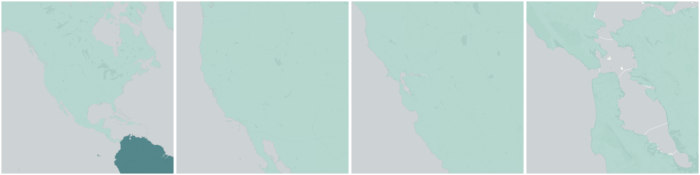
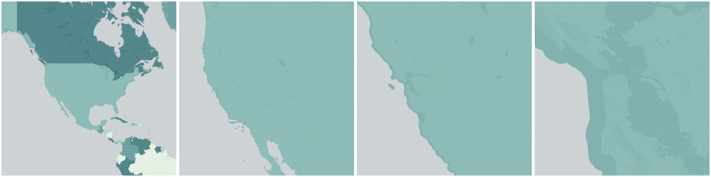
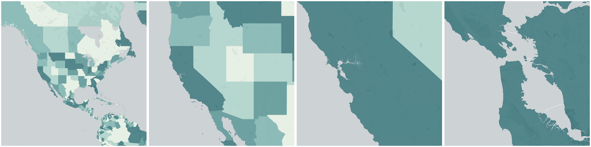

  
# Boundaries

Political, administrative, and census-based boundaries.

- [Continents](#continents)

- [Countries](#countries)

- [Disputed Areas](#disputed-areas)

- [Marine Areas](#marine-areas)

- [Regions (First-level Administrative)](#regions-first-level-administrative)

## Continents

Obtain &quot;Continents&quot; geometry at one point:

    INSERT INTO {tablename}(the_geom)
      SELECT OBS_GetBoundary(
        CDB_LatLng(40.7, -73.9),
        'whosonfirst.wof_continent_geom'
      )

Obtain all &quot;Continents&quot; geometries within an area:

    INSERT INTO {new_table_name} (the_geom, {geo_id_column})
      SELECT *
      FROM OBS_GetBoundariesByGeometry(
        ST_Buffer(CDB_LatLng(40.7, -73.9), 0.01),
        'whosonfirst.wof_continent_geom'
      )

## Countries

Obtain &quot;Countries&quot; geometry at one point:

    INSERT INTO {tablename}(the_geom)
      SELECT OBS_GetBoundary(
        CDB_LatLng(40.7, -73.9),
        'whosonfirst.wof_country_geom'
      )

Obtain all &quot;Countries&quot; geometries within an area:

    INSERT INTO {new_table_name} (the_geom, {geo_id_column})
      SELECT *
      FROM OBS_GetBoundariesByGeometry(
        ST_Buffer(CDB_LatLng(40.7, -73.9), 0.01),
        'whosonfirst.wof_country_geom'
      )

## Disputed Areas

Obtain &quot;Disputed Areas&quot; geometry at one point:

    INSERT INTO {tablename}(the_geom)
      SELECT OBS_GetBoundary(
        CDB_LatLng(33.78, 76.57),
        'whosonfirst.wof_disputed_geom'
      )

Obtain all &quot;Disputed Areas&quot; geometries within an area:

    INSERT INTO {new_table_name} (the_geom, {geo_id_column})
      SELECT *
      FROM OBS_GetBoundariesByGeometry(
        ST_Buffer(CDB_LatLng(33.78, 76.57), 0.01),
        'whosonfirst.wof_disputed_geom'
      )

## Marine Areas

Obtain &quot;Marine Areas&quot; geometry at one point:

    INSERT INTO {tablename}(the_geom)
      SELECT OBS_GetBoundary(
        CDB_LatLng(43.33, -68.47),
        'whosonfirst.wof_marinearea_geom'
      )

Obtain all &quot;Marine Areas&quot; geometries within an area:

    INSERT INTO {new_table_name} (the_geom, {geo_id_column})
      SELECT *
      FROM OBS_GetBoundariesByGeometry(
        ST_Buffer(CDB_LatLng(43.33, -68.47), 0.01),
        'whosonfirst.wof_marinearea_geom'
      )

## Regions (First-level Administrative)

Obtain &quot;Regions (First-level Administrative)&quot; geometry at one point:

    INSERT INTO {tablename}(the_geom)
      SELECT OBS_GetBoundary(
        CDB_LatLng(40.7, -73.9),
        'whosonfirst.wof_region_geom'
      )

Obtain all &quot;Regions (First-level Administrative)&quot; geometries within an area:

    INSERT INTO {new_table_name} (the_geom, {geo_id_column})
      SELECT *
      FROM OBS_GetBoundariesByGeometry(
        ST_Buffer(CDB_LatLng(40.7, -73.9), 0.01),
        'whosonfirst.wof_region_geom'
      )

