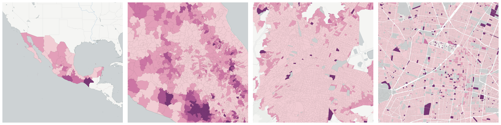
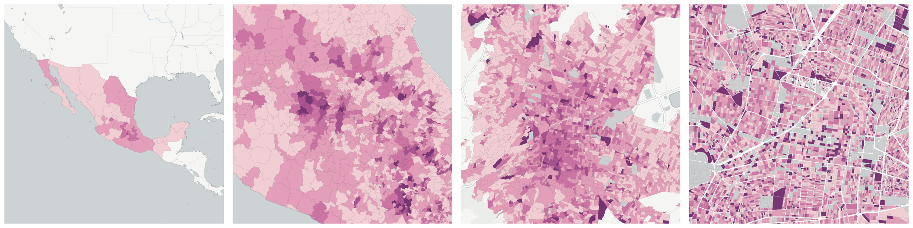
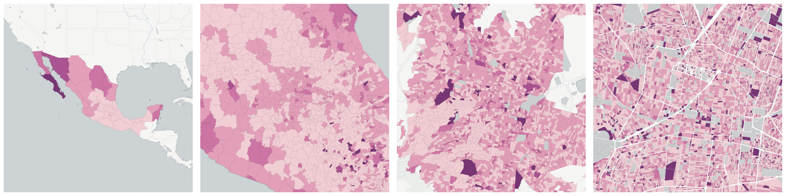

  
# Age and Gender

Population breakdowns by age and gender.

- [Male-female ratio in population 5 years and over who resided in the United States in June 2005](#male-female-ratio-in-population-5-years-and-over-who-resided-in-the-united-states-in-june-2005)

- [Median age](#median-age)

- [Total population](#total-population)

    * [Female population](#female-population)

        - [Female population 0 to 2 years old](#female-population-0-to-2-years-old)

        - [Female population 0 to 4 years old](#female-population-0-to-4-years-old)

        - [Female population 0 to 14 years old](#female-population-0-to-14-years-old)

        - [Female population 3 or more years old](#female-population-3-or-more-years-old)

        - [Female population 3 to 5 years old](#female-population-3-to-5-years-old)

        - [Female population 5 or more years old](#female-population-5-or-more-years-old)

        - [Female population 6 to 11 years old](#female-population-6-to-11-years-old)

        - [Female population 8 to 14 years old](#female-population-8-to-14-years-old)

        - [Female population 12 or more years old](#female-population-12-or-more-years-old)

        - [Female population 12 to 14 years old](#female-population-12-to-14-years-old)

        - [Female population 15 or more years old](#female-population-15-or-more-years-old)

        - [Female population 15 to 17 years old](#female-population-15-to-17-years-old)

        - [Female population 15 to 24 years old](#female-population-15-to-24-years-old)

        - [Female population 15 to 29 years old](#female-population-15-to-29-years-old)

        - [Female population 15 to 49 years old](#female-population-15-to-49-years-old)

        - [Female population 15 to 64 years old](#female-population-15-to-64-years-old)

        - [Female population 18 or more years old](#female-population-18-or-more-years-old)

        - [Female population 18 to 24 years old](#female-population-18-to-24-years-old)

        - [Female population 25 or more years old](#female-population-25-or-more-years-old)

        - [Female population 30 to 49 years old](#female-population-30-to-49-years-old)

        - [Female population 50 to 59 years old](#female-population-50-to-59-years-old)

        - [Female population 60 or more years old](#female-population-60-or-more-years-old)

        - [Female population 60 to 64 years old](#female-population-60-to-64-years-old)

        - [Female population 65 or more years old](#female-population-65-or-more-years-old)

        - [Female population 70 or more years old](#female-population-70-or-more-years-old)

    * [Male population](#male-population)

        - [Male population 0 to 2 years old](#male-population-0-to-2-years-old)

        - [Male population 0 to 4 years old](#male-population-0-to-4-years-old)

        - [Male population 0 to 14 years old](#male-population-0-to-14-years-old)

        - [Male population 3 or more years old](#male-population-3-or-more-years-old)

        - [Male population 3 to 5 years old](#male-population-3-to-5-years-old)

        - [Male population 5 or more years old](#male-population-5-or-more-years-old)

        - [Male population 6 to 11 years old](#male-population-6-to-11-years-old)

        - [Male population 8 to 14 years old](#male-population-8-to-14-years-old)

        - [Male population 12 or more years old](#male-population-12-or-more-years-old)

        - [Male population 12 to 14 years old](#male-population-12-to-14-years-old)

        - [Male population 15 or more years old](#male-population-15-or-more-years-old)

        - [Male population 15 to 17 years old](#male-population-15-to-17-years-old)

        - [Male population 15 to 24 years old](#male-population-15-to-24-years-old)

        - [Male population 15 to 29 years old](#male-population-15-to-29-years-old)

        - [Male population 15 to 64 years old](#male-population-15-to-64-years-old)

        - [Male population 18 or more years old](#male-population-18-or-more-years-old)

        - [Male population 18 to 24 years old](#male-population-18-to-24-years-old)

        - [Male population 25 or more years old](#male-population-25-or-more-years-old)

        - [Male population 30 to 49 years old](#male-population-30-to-49-years-old)

        - [Male population 50 to 59 years old](#male-population-50-to-59-years-old)

        - [Male population 60 or more years old](#male-population-60-or-more-years-old)

        - [Male population 60 to 64 years old](#male-population-60-to-64-years-old)

        - [Male population 65 or more years old](#male-population-65-or-more-years-old)

        - [Male population 70 or more years old](#male-population-70-or-more-years-old)

    * [Population 0 to 2 years old](#population-0-to-2-years-old)

        - [Female population 0 to 2 years old](#id1)

        - [Male population 0 to 2 years old](#id3)

    * [Population 0 to 4 years old](#population-0-to-4-years-old)

        - [Female population 0 to 4 years old](#id5)

        - [Male population 0 to 4 years old](#id7)

    * [Population 0 to 14 years old](#population-0-to-14-years-old)

        - [Female population 0 to 14 years old](#id9)

        - [Male population 0 to 14 years old](#id11)

    * [Population 3 or more years old](#population-3-or-more-years-old)

        - [Female population 3 or more years old](#id13)

        - [Male population 3 or more years old](#id16)

    * [Population 3 to 5 years old](#population-3-to-5-years-old)

        - [Female population 3 to 5 years old](#id19)

        - [Male population 3 to 5 years old](#id22)

    * [Population 5 or more years old](#population-5-or-more-years-old)

        - [Female population 5 or more years old](#id25)

        - [Male population 5 or more years old](#id28)

    * [Population 6 to 11 years old](#population-6-to-11-years-old)

        - [Female population 6 to 11 years old](#id31)

        - [Male population 6 to 11 years old](#id34)

    * [Population 8 to 14 years old](#population-8-to-14-years-old)

        - [Female population 8 to 14 years old](#id37)

        - [Male population 8 to 14 years old](#id40)

    * [Population 12 or more years old](#population-12-or-more-years-old)

        - [Female population 12 or more years old](#id43)

        - [Male population 12 or more years old](#id46)

    * [Population 12 to 14 years old](#population-12-to-14-years-old)

        - [Female population 12 to 14 years old](#id49)

        - [Male population 12 to 14 years old](#id52)

    * [Population 15 or more years old](#population-15-or-more-years-old)

        - [Female population 15 or more years old](#id55)

        - [Male population 15 or more years old](#id58)

    * [Population 15 to 17 years old](#population-15-to-17-years-old)

        - [Female population 15 to 17 years old](#id61)

        - [Male population 15 to 17 years old](#id63)

    * [Population 15 to 24 years old](#population-15-to-24-years-old)

        - [Female population 15 to 24 years old](#id65)

        - [Male population 15 to 24 years old](#id68)

    * [Population 15 to 29 years old](#population-15-to-29-years-old)

        - [Female population 15 to 29 years old](#id71)

        - [Male population 15 to 29 years old](#id73)

    * [Population 15 to 64 years old](#population-15-to-64-years-old)

        - [Female population 15 to 64 years old](#id75)

        - [Male population 15 to 64 years old](#id77)

    * [Population 18 or more years old](#population-18-or-more-years-old)

        - [Female population 18 or more years old](#id79)

        - [Male population 18 or more years old](#id82)

    * [Population 18 to 24 years old](#population-18-to-24-years-old)

        - [Female population 18 to 24 years old](#id85)

        - [Male population 18 to 24 years old](#id87)

    * [Population 25 or more years old](#population-25-or-more-years-old)

        - [Female population 25 or more years old](#id89)

        - [Male population 25 or more years old](#id92)

    * [Population 30 to 49 years old](#population-30-to-49-years-old)

        - [Female population 30 to 49 years old](#id95)

        - [Male population 30 to 49 years old](#id97)

    * [Population 50 to 59 years old](#population-50-to-59-years-old)

        - [Female population 50 to 59 years old](#id99)

        - [Male population 50 to 59 years old](#id101)

    * [Population 60 or more years old](#population-60-or-more-years-old)

        - [Female population 60 or more years old](#id103)

        - [Male population 60 or more years old](#id105)

    * [Population 60 to 64 years old](#population-60-to-64-years-old)

        - [Female population 60 to 64 years old](#id107)

        - [Male population 60 to 64 years old](#id109)

    * [Population 65 or more years old](#population-65-or-more-years-old)

        - [Female population 65 or more years old](#id111)

        - [Male population 65 or more years old](#id113)

    * [Population 70 or more years old](#population-70-or-more-years-old)

        - [Female population 70 or more years old](#id115)

        - [Male population 70 or more years old](#id117)

## Male-female ratio in population 5 years and over who resided in the United States in June 2005

Measure &quot;Male-female ratio in population 5 years and over who resided in the United States in June 2005&quot;  for one point:

    UPDATE {table_name}
      SET {new_numeric_column} =
        OBS_GetMeasure(
          CDB_LatLng(40.7, -73.9),
          'mx.inegi_columns.MIG16_R'
        );

Male-female ratio in population 5 years and over who resided in the United States in June 2005 is only available for point lookups.

## Median age

Measure &quot;Median age&quot;  for one point:

    UPDATE {table_name}
      SET {new_numeric_column} =
        OBS_GetMeasure(
          CDB_LatLng(40.7, -73.9),
          'mx.inegi_columns.POB30_R'
        );

Median age is only available for point lookups.

## Total population

Measure &quot;Total population&quot;  density per sq. kilometer  for one point:

    UPDATE {table_name}
      SET {new_numeric_column} =
        OBS_GetMeasure(
          CDB_LatLng(40.7, -73.9),
          'mx.inegi_columns.POB1'
        );

Measure &quot;Total population&quot; within an area:

    UPDATE {table_name}
      SET {new_numeric_column} =
        OBS_GetMeasure(
          ST_Buffer(CDB_LatLng(40.7, -73.9), 0.01),
          'mx.inegi_columns.POB1'
        );

Subcolumns of Total population

- [Female population](#female-population)

- [Male population](#male-population)

- [Population 0 to 2 years old](#population-0-to-2-years-old)

- [Population 0 to 4 years old](#population-0-to-4-years-old)

- [Population 0 to 14 years old](#population-0-to-14-years-old)

- [Population 3 or more years old](#population-3-or-more-years-old)

- [Population 3 to 5 years old](#population-3-to-5-years-old)

- [Population 5 or more years old](#population-5-or-more-years-old)

- [Population 6 to 11 years old](#population-6-to-11-years-old)

- [Population 8 to 14 years old](#population-8-to-14-years-old)

- [Population 12 or more years old](#population-12-or-more-years-old)

- [Population 12 to 14 years old](#population-12-to-14-years-old)

- [Population 15 or more years old](#population-15-or-more-years-old)

- [Population 15 to 17 years old](#population-15-to-17-years-old)

- [Population 15 to 24 years old](#population-15-to-24-years-old)

- [Population 15 to 29 years old](#population-15-to-29-years-old)

- [Population 15 to 64 years old](#population-15-to-64-years-old)

- [Population 18 or more years old](#population-18-or-more-years-old)

- [Population 18 to 24 years old](#population-18-to-24-years-old)

- [Population 25 or more years old](#population-25-or-more-years-old)

- [Population 30 to 49 years old](#population-30-to-49-years-old)

- [Population 50 to 59 years old](#population-50-to-59-years-old)

- [Population 60 or more years old](#population-60-or-more-years-old)

- [Population 60 to 64 years old](#population-60-to-64-years-old)

- [Population 65 or more years old](#population-65-or-more-years-old)

- [Population 70 or more years old](#population-70-or-more-years-old)

### Female population

Measure &quot;Female population&quot;  density per sq. kilometer  for one point:

    UPDATE {table_name}
      SET {new_numeric_column} =
        OBS_GetMeasure(
          CDB_LatLng(40.7, -73.9),
          'mx.inegi_columns.POB31'
        );

Measure &quot;Female population&quot; within an area:

    UPDATE {table_name}
      SET {new_numeric_column} =
        OBS_GetMeasure(
          ST_Buffer(CDB_LatLng(40.7, -73.9), 0.01),
          'mx.inegi_columns.POB31'
        );

Measure &quot;Female population&quot; percent of &quot;Total population&quot; at one point:

    UPDATE {table_name}
      SET {new_numeric_column} =
        OBS_GetMeasure(
          CDB_LatLng(40.7, -73.9),
          'mx.inegi_columns.POB31',
          'denominator'
        );

Measure &quot;Female population&quot; percent of &quot;Total population&quot; within an area:

    UPDATE {table_name}
      SET {new_numeric_column} =
        OBS_GetMeasure(
          ST_Buffer(CDB_LatLng(40.7, -73.9), 0.01),
          'mx.inegi_columns.POB31',
          'denominator'
        );

* denominator: [Total population](#mx-inegi-columns-pob1)

Subcolumns of Female population

- [Female population 0 to 2 years old](#female-population-0-to-2-years-old)

- [Female population 0 to 4 years old](#female-population-0-to-4-years-old)

- [Female population 0 to 14 years old](#female-population-0-to-14-years-old)

- [Female population 3 or more years old](#female-population-3-or-more-years-old)

- [Female population 3 to 5 years old](#female-population-3-to-5-years-old)

- [Female population 5 or more years old](#female-population-5-or-more-years-old)

- [Female population 6 to 11 years old](#female-population-6-to-11-years-old)

- [Female population 8 to 14 years old](#female-population-8-to-14-years-old)

- [Female population 12 or more years old](#female-population-12-or-more-years-old)

- [Female population 12 to 14 years old](#female-population-12-to-14-years-old)

- [Female population 15 or more years old](#female-population-15-or-more-years-old)

- [Female population 15 to 17 years old](#female-population-15-to-17-years-old)

- [Female population 15 to 24 years old](#female-population-15-to-24-years-old)

- [Female population 15 to 29 years old](#female-population-15-to-29-years-old)

- [Female population 15 to 49 years old](#female-population-15-to-49-years-old)

- [Female population 15 to 64 years old](#female-population-15-to-64-years-old)

- [Female population 18 or more years old](#female-population-18-or-more-years-old)

- [Female population 18 to 24 years old](#female-population-18-to-24-years-old)

- [Female population 25 or more years old](#female-population-25-or-more-years-old)

- [Female population 30 to 49 years old](#female-population-30-to-49-years-old)

- [Female population 50 to 59 years old](#female-population-50-to-59-years-old)

- [Female population 60 or more years old](#female-population-60-or-more-years-old)

- [Female population 60 to 64 years old](#female-population-60-to-64-years-old)

- [Female population 65 or more years old](#female-population-65-or-more-years-old)

- [Female population 70 or more years old](#female-population-70-or-more-years-old)

#### Female population 0 to 2 years old

Measure &quot;Female population 0 to 2 years old&quot;  density per sq. kilometer  for one point:

    UPDATE {table_name}
      SET {new_numeric_column} =
        OBS_GetMeasure(
          CDB_LatLng(40.7, -73.9),
          'mx.inegi_columns.POB32'
        );

Measure &quot;Female population 0 to 2 years old&quot; within an area:

    UPDATE {table_name}
      SET {new_numeric_column} =
        OBS_GetMeasure(
          ST_Buffer(CDB_LatLng(40.7, -73.9), 0.01),
          'mx.inegi_columns.POB32'
        );

Measure &quot;Female population 0 to 2 years old&quot; percent of &quot;Population 0 to 2 years old&quot; at one point:

    UPDATE {table_name}
      SET {new_numeric_column} =
        OBS_GetMeasure(
          CDB_LatLng(40.7, -73.9),
          'mx.inegi_columns.POB32',
          'denominator'
        );

Measure &quot;Female population 0 to 2 years old&quot; percent of &quot;Population 0 to 2 years old&quot; within an area:

    UPDATE {table_name}
      SET {new_numeric_column} =
        OBS_GetMeasure(
          ST_Buffer(CDB_LatLng(40.7, -73.9), 0.01),
          'mx.inegi_columns.POB32',
          'denominator'
        );

* denominator: [Population 0 to 2 years old](#mx-inegi-columns-pob2)

* denominator: [Female population](#mx-inegi-columns-pob31)

#### Female population 0 to 4 years old

Measure &quot;Female population 0 to 4 years old&quot;  density per sq. kilometer  for one point:

    UPDATE {table_name}
      SET {new_numeric_column} =
        OBS_GetMeasure(
          CDB_LatLng(40.7, -73.9),
          'mx.inegi_columns.POB33'
        );

Measure &quot;Female population 0 to 4 years old&quot; within an area:

    UPDATE {table_name}
      SET {new_numeric_column} =
        OBS_GetMeasure(
          ST_Buffer(CDB_LatLng(40.7, -73.9), 0.01),
          'mx.inegi_columns.POB33'
        );

Measure &quot;Female population 0 to 4 years old&quot; percent of &quot;Female population&quot; at one point:

    UPDATE {table_name}
      SET {new_numeric_column} =
        OBS_GetMeasure(
          CDB_LatLng(40.7, -73.9),
          'mx.inegi_columns.POB33',
          'denominator'
        );

Measure &quot;Female population 0 to 4 years old&quot; percent of &quot;Female population&quot; within an area:

    UPDATE {table_name}
      SET {new_numeric_column} =
        OBS_GetMeasure(
          ST_Buffer(CDB_LatLng(40.7, -73.9), 0.01),
          'mx.inegi_columns.POB33',
          'denominator'
        );

* denominator: [Female population](#mx-inegi-columns-pob31)

* denominator: [Population 0 to 4 years old](#mx-inegi-columns-pob3)

#### Female population 0 to 14 years old

Measure &quot;Female population 0 to 14 years old&quot;  density per sq. kilometer  for one point:

    UPDATE {table_name}
      SET {new_numeric_column} =
        OBS_GetMeasure(
          CDB_LatLng(40.7, -73.9),
          'mx.inegi_columns.POB38'
        );

Measure &quot;Female population 0 to 14 years old&quot; within an area:

    UPDATE {table_name}
      SET {new_numeric_column} =
        OBS_GetMeasure(
          ST_Buffer(CDB_LatLng(40.7, -73.9), 0.01),
          'mx.inegi_columns.POB38'
        );

Measure &quot;Female population 0 to 14 years old&quot; percent of &quot;Female population&quot; at one point:

    UPDATE {table_name}
      SET {new_numeric_column} =
        OBS_GetMeasure(
          CDB_LatLng(40.7, -73.9),
          'mx.inegi_columns.POB38',
          'denominator'
        );

Measure &quot;Female population 0 to 14 years old&quot; percent of &quot;Female population&quot; within an area:

    UPDATE {table_name}
      SET {new_numeric_column} =
        OBS_GetMeasure(
          ST_Buffer(CDB_LatLng(40.7, -73.9), 0.01),
          'mx.inegi_columns.POB38',
          'denominator'
        );

* denominator: [Female population](#mx-inegi-columns-pob31)

* denominator: [Population 0 to 14 years old](#mx-inegi-columns-pob8)

#### Female population 3 or more years old

Measure &quot;Female population 3 or more years old&quot;  density per sq. kilometer  for one point:

    UPDATE {table_name}
      SET {new_numeric_column} =
        OBS_GetMeasure(
          CDB_LatLng(40.7, -73.9),
          'mx.inegi_columns.POB48'
        );

Measure &quot;Female population 3 or more years old&quot; within an area:

    UPDATE {table_name}
      SET {new_numeric_column} =
        OBS_GetMeasure(
          ST_Buffer(CDB_LatLng(40.7, -73.9), 0.01),
          'mx.inegi_columns.POB48'
        );

Measure &quot;Female population 3 or more years old&quot; percent of &quot;Population 3 or more years old&quot; at one point:

    UPDATE {table_name}
      SET {new_numeric_column} =
        OBS_GetMeasure(
          CDB_LatLng(40.7, -73.9),
          'mx.inegi_columns.POB48',
          'denominator'
        );

Measure &quot;Female population 3 or more years old&quot; percent of &quot;Population 3 or more years old&quot; within an area:

    UPDATE {table_name}
      SET {new_numeric_column} =
        OBS_GetMeasure(
          ST_Buffer(CDB_LatLng(40.7, -73.9), 0.01),
          'mx.inegi_columns.POB48',
          'denominator'
        );

* denominator: [Population 3 or more years old](#mx-inegi-columns-pob17)

* denominator: [Female population](#mx-inegi-columns-pob31)

#### Female population 3 to 5 years old

Measure &quot;Female population 3 to 5 years old&quot;  density per sq. kilometer  for one point:

    UPDATE {table_name}
      SET {new_numeric_column} =
        OBS_GetMeasure(
          CDB_LatLng(40.7, -73.9),
          'mx.inegi_columns.POB34'
        );

Measure &quot;Female population 3 to 5 years old&quot; within an area:

    UPDATE {table_name}
      SET {new_numeric_column} =
        OBS_GetMeasure(
          ST_Buffer(CDB_LatLng(40.7, -73.9), 0.01),
          'mx.inegi_columns.POB34'
        );

Measure &quot;Female population 3 to 5 years old&quot; percent of &quot;Female population&quot; at one point:

    UPDATE {table_name}
      SET {new_numeric_column} =
        OBS_GetMeasure(
          CDB_LatLng(40.7, -73.9),
          'mx.inegi_columns.POB34',
          'denominator'
        );

Measure &quot;Female population 3 to 5 years old&quot; percent of &quot;Female population&quot; within an area:

    UPDATE {table_name}
      SET {new_numeric_column} =
        OBS_GetMeasure(
          ST_Buffer(CDB_LatLng(40.7, -73.9), 0.01),
          'mx.inegi_columns.POB34',
          'denominator'
        );

* denominator: [Female population](#mx-inegi-columns-pob31)

* denominator: [Population 3 to 5 years old](#mx-inegi-columns-pob4)

#### Female population 5 or more years old

Measure &quot;Female population 5 or more years old&quot;  density per sq. kilometer  for one point:

    UPDATE {table_name}
      SET {new_numeric_column} =
        OBS_GetMeasure(
          CDB_LatLng(40.7, -73.9),
          'mx.inegi_columns.POB49'
        );

Measure &quot;Female population 5 or more years old&quot; within an area:

    UPDATE {table_name}
      SET {new_numeric_column} =
        OBS_GetMeasure(
          ST_Buffer(CDB_LatLng(40.7, -73.9), 0.01),
          'mx.inegi_columns.POB49'
        );

Measure &quot;Female population 5 or more years old&quot; percent of &quot;Population 5 or more years old&quot; at one point:

    UPDATE {table_name}
      SET {new_numeric_column} =
        OBS_GetMeasure(
          CDB_LatLng(40.7, -73.9),
          'mx.inegi_columns.POB49',
          'denominator'
        );

Measure &quot;Female population 5 or more years old&quot; percent of &quot;Population 5 or more years old&quot; within an area:

    UPDATE {table_name}
      SET {new_numeric_column} =
        OBS_GetMeasure(
          ST_Buffer(CDB_LatLng(40.7, -73.9), 0.01),
          'mx.inegi_columns.POB49',
          'denominator'
        );

* denominator: [Population 5 or more years old](#mx-inegi-columns-pob18)

* denominator: [Female population](#mx-inegi-columns-pob31)

#### Female population 6 to 11 years old

Measure &quot;Female population 6 to 11 years old&quot;  density per sq. kilometer  for one point:

    UPDATE {table_name}
      SET {new_numeric_column} =
        OBS_GetMeasure(
          CDB_LatLng(40.7, -73.9),
          'mx.inegi_columns.POB35'
        );

Measure &quot;Female population 6 to 11 years old&quot; within an area:

    UPDATE {table_name}
      SET {new_numeric_column} =
        OBS_GetMeasure(
          ST_Buffer(CDB_LatLng(40.7, -73.9), 0.01),
          'mx.inegi_columns.POB35'
        );

Measure &quot;Female population 6 to 11 years old&quot; percent of &quot;Female population&quot; at one point:

    UPDATE {table_name}
      SET {new_numeric_column} =
        OBS_GetMeasure(
          CDB_LatLng(40.7, -73.9),
          'mx.inegi_columns.POB35',
          'denominator'
        );

Measure &quot;Female population 6 to 11 years old&quot; percent of &quot;Female population&quot; within an area:

    UPDATE {table_name}
      SET {new_numeric_column} =
        OBS_GetMeasure(
          ST_Buffer(CDB_LatLng(40.7, -73.9), 0.01),
          'mx.inegi_columns.POB35',
          'denominator'
        );

* denominator: [Female population](#mx-inegi-columns-pob31)

* denominator: [Population 6 to 11 years old](#mx-inegi-columns-pob5)

#### Female population 8 to 14 years old

Measure &quot;Female population 8 to 14 years old&quot;  density per sq. kilometer  for one point:

    UPDATE {table_name}
      SET {new_numeric_column} =
        OBS_GetMeasure(
          CDB_LatLng(40.7, -73.9),
          'mx.inegi_columns.POB36'
        );

Measure &quot;Female population 8 to 14 years old&quot; within an area:

    UPDATE {table_name}
      SET {new_numeric_column} =
        OBS_GetMeasure(
          ST_Buffer(CDB_LatLng(40.7, -73.9), 0.01),
          'mx.inegi_columns.POB36'
        );

Measure &quot;Female population 8 to 14 years old&quot; percent of &quot;Female population&quot; at one point:

    UPDATE {table_name}
      SET {new_numeric_column} =
        OBS_GetMeasure(
          CDB_LatLng(40.7, -73.9),
          'mx.inegi_columns.POB36',
          'denominator'
        );

Measure &quot;Female population 8 to 14 years old&quot; percent of &quot;Female population&quot; within an area:

    UPDATE {table_name}
      SET {new_numeric_column} =
        OBS_GetMeasure(
          ST_Buffer(CDB_LatLng(40.7, -73.9), 0.01),
          'mx.inegi_columns.POB36',
          'denominator'
        );

* denominator: [Female population](#mx-inegi-columns-pob31)

* denominator: [Population 8 to 14 years old](#mx-inegi-columns-pob6)

#### Female population 12 or more years old

Measure &quot;Female population 12 or more years old&quot;  density per sq. kilometer  for one point:

    UPDATE {table_name}
      SET {new_numeric_column} =
        OBS_GetMeasure(
          CDB_LatLng(40.7, -73.9),
          'mx.inegi_columns.POB50'
        );

Measure &quot;Female population 12 or more years old&quot; within an area:

    UPDATE {table_name}
      SET {new_numeric_column} =
        OBS_GetMeasure(
          ST_Buffer(CDB_LatLng(40.7, -73.9), 0.01),
          'mx.inegi_columns.POB50'
        );

Measure &quot;Female population 12 or more years old&quot; percent of &quot;Female population&quot; at one point:

    UPDATE {table_name}
      SET {new_numeric_column} =
        OBS_GetMeasure(
          CDB_LatLng(40.7, -73.9),
          'mx.inegi_columns.POB50',
          'denominator'
        );

Measure &quot;Female population 12 or more years old&quot; percent of &quot;Female population&quot; within an area:

    UPDATE {table_name}
      SET {new_numeric_column} =
        OBS_GetMeasure(
          ST_Buffer(CDB_LatLng(40.7, -73.9), 0.01),
          'mx.inegi_columns.POB50',
          'denominator'
        );

* denominator: [Female population](#mx-inegi-columns-pob31)

* denominator: [Population 12 or more years old](#mx-inegi-columns-pob19)

#### Female population 12 to 14 years old

Measure &quot;Female population 12 to 14 years old&quot;  density per sq. kilometer  for one point:

    UPDATE {table_name}
      SET {new_numeric_column} =
        OBS_GetMeasure(
          CDB_LatLng(40.7, -73.9),
          'mx.inegi_columns.POB37'
        );

Measure &quot;Female population 12 to 14 years old&quot; within an area:

    UPDATE {table_name}
      SET {new_numeric_column} =
        OBS_GetMeasure(
          ST_Buffer(CDB_LatLng(40.7, -73.9), 0.01),
          'mx.inegi_columns.POB37'
        );

Measure &quot;Female population 12 to 14 years old&quot; percent of &quot;Female population&quot; at one point:

    UPDATE {table_name}
      SET {new_numeric_column} =
        OBS_GetMeasure(
          CDB_LatLng(40.7, -73.9),
          'mx.inegi_columns.POB37',
          'denominator'
        );

Measure &quot;Female population 12 to 14 years old&quot; percent of &quot;Female population&quot; within an area:

    UPDATE {table_name}
      SET {new_numeric_column} =
        OBS_GetMeasure(
          ST_Buffer(CDB_LatLng(40.7, -73.9), 0.01),
          'mx.inegi_columns.POB37',
          'denominator'
        );

* denominator: [Female population](#mx-inegi-columns-pob31)

* denominator: [Population 12 to 14 years old](#mx-inegi-columns-pob7)

#### Female population 15 or more years old

Measure &quot;Female population 15 or more years old&quot;  density per sq. kilometer  for one point:

    UPDATE {table_name}
      SET {new_numeric_column} =
        OBS_GetMeasure(
          CDB_LatLng(40.7, -73.9),
          'mx.inegi_columns.POB51'
        );

Measure &quot;Female population 15 or more years old&quot; within an area:

    UPDATE {table_name}
      SET {new_numeric_column} =
        OBS_GetMeasure(
          ST_Buffer(CDB_LatLng(40.7, -73.9), 0.01),
          'mx.inegi_columns.POB51'
        );

Measure &quot;Female population 15 or more years old&quot; percent of &quot;Female population&quot; at one point:

    UPDATE {table_name}
      SET {new_numeric_column} =
        OBS_GetMeasure(
          CDB_LatLng(40.7, -73.9),
          'mx.inegi_columns.POB51',
          'denominator'
        );

Measure &quot;Female population 15 or more years old&quot; percent of &quot;Female population&quot; within an area:

    UPDATE {table_name}
      SET {new_numeric_column} =
        OBS_GetMeasure(
          ST_Buffer(CDB_LatLng(40.7, -73.9), 0.01),
          'mx.inegi_columns.POB51',
          'denominator'
        );

* denominator: [Female population](#mx-inegi-columns-pob31)

* denominator: [Population 15 or more years old](#mx-inegi-columns-pob20)

#### Female population 15 to 17 years old

Measure &quot;Female population 15 to 17 years old&quot;  density per sq. kilometer  for one point:

    UPDATE {table_name}
      SET {new_numeric_column} =
        OBS_GetMeasure(
          CDB_LatLng(40.7, -73.9),
          'mx.inegi_columns.POB39'
        );

Measure &quot;Female population 15 to 17 years old&quot; within an area:

    UPDATE {table_name}
      SET {new_numeric_column} =
        OBS_GetMeasure(
          ST_Buffer(CDB_LatLng(40.7, -73.9), 0.01),
          'mx.inegi_columns.POB39'
        );

Measure &quot;Female population 15 to 17 years old&quot; percent of &quot;Female population&quot; at one point:

    UPDATE {table_name}
      SET {new_numeric_column} =
        OBS_GetMeasure(
          CDB_LatLng(40.7, -73.9),
          'mx.inegi_columns.POB39',
          'denominator'
        );

Measure &quot;Female population 15 to 17 years old&quot; percent of &quot;Female population&quot; within an area:

    UPDATE {table_name}
      SET {new_numeric_column} =
        OBS_GetMeasure(
          ST_Buffer(CDB_LatLng(40.7, -73.9), 0.01),
          'mx.inegi_columns.POB39',
          'denominator'
        );

* denominator: [Female population](#mx-inegi-columns-pob31)

* denominator: [Population 15 to 17 years old](#mx-inegi-columns-pob9)

#### Female population 15 to 24 years old

Measure &quot;Female population 15 to 24 years old&quot;  density per sq. kilometer  for one point:

    UPDATE {table_name}
      SET {new_numeric_column} =
        OBS_GetMeasure(
          CDB_LatLng(40.7, -73.9),
          'mx.inegi_columns.POB40'
        );

Measure &quot;Female population 15 to 24 years old&quot; within an area:

    UPDATE {table_name}
      SET {new_numeric_column} =
        OBS_GetMeasure(
          ST_Buffer(CDB_LatLng(40.7, -73.9), 0.01),
          'mx.inegi_columns.POB40'
        );

Measure &quot;Female population 15 to 24 years old&quot; percent of &quot;Female population&quot; at one point:

    UPDATE {table_name}
      SET {new_numeric_column} =
        OBS_GetMeasure(
          CDB_LatLng(40.7, -73.9),
          'mx.inegi_columns.POB40',
          'denominator'
        );

Measure &quot;Female population 15 to 24 years old&quot; percent of &quot;Female population&quot; within an area:

    UPDATE {table_name}
      SET {new_numeric_column} =
        OBS_GetMeasure(
          ST_Buffer(CDB_LatLng(40.7, -73.9), 0.01),
          'mx.inegi_columns.POB40',
          'denominator'
        );

* denominator: [Female population](#mx-inegi-columns-pob31)

* denominator: [Population 15 to 24 years old](#mx-inegi-columns-pob10)

#### Female population 15 to 29 years old

Measure &quot;Female population 15 to 29 years old&quot;  density per sq. kilometer  for one point:

    UPDATE {table_name}
      SET {new_numeric_column} =
        OBS_GetMeasure(
          CDB_LatLng(40.7, -73.9),
          'mx.inegi_columns.POB41'
        );

Measure &quot;Female population 15 to 29 years old&quot; within an area:

    UPDATE {table_name}
      SET {new_numeric_column} =
        OBS_GetMeasure(
          ST_Buffer(CDB_LatLng(40.7, -73.9), 0.01),
          'mx.inegi_columns.POB41'
        );

Measure &quot;Female population 15 to 29 years old&quot; percent of &quot;Female population&quot; at one point:

    UPDATE {table_name}
      SET {new_numeric_column} =
        OBS_GetMeasure(
          CDB_LatLng(40.7, -73.9),
          'mx.inegi_columns.POB41',
          'denominator'
        );

Measure &quot;Female population 15 to 29 years old&quot; percent of &quot;Female population&quot; within an area:

    UPDATE {table_name}
      SET {new_numeric_column} =
        OBS_GetMeasure(
          ST_Buffer(CDB_LatLng(40.7, -73.9), 0.01),
          'mx.inegi_columns.POB41',
          'denominator'
        );

* denominator: [Female population](#mx-inegi-columns-pob31)

* denominator: [Population 15 to 29 years old](#mx-inegi-columns-pob11)

#### Female population 15 to 49 years old

Measure &quot;Female population 15 to 49 years old&quot;  density per sq. kilometer  for one point:

    UPDATE {table_name}
      SET {new_numeric_column} =
        OBS_GetMeasure(
          CDB_LatLng(40.7, -73.9),
          'mx.inegi_columns.POB42'
        );

Measure &quot;Female population 15 to 49 years old&quot; within an area:

    UPDATE {table_name}
      SET {new_numeric_column} =
        OBS_GetMeasure(
          ST_Buffer(CDB_LatLng(40.7, -73.9), 0.01),
          'mx.inegi_columns.POB42'
        );

Measure &quot;Female population 15 to 49 years old&quot; percent of &quot;Female population&quot; at one point:

    UPDATE {table_name}
      SET {new_numeric_column} =
        OBS_GetMeasure(
          CDB_LatLng(40.7, -73.9),
          'mx.inegi_columns.POB42',
          'denominator'
        );

Measure &quot;Female population 15 to 49 years old&quot; percent of &quot;Female population&quot; within an area:

    UPDATE {table_name}
      SET {new_numeric_column} =
        OBS_GetMeasure(
          ST_Buffer(CDB_LatLng(40.7, -73.9), 0.01),
          'mx.inegi_columns.POB42',
          'denominator'
        );

* denominator: [Female population](#mx-inegi-columns-pob31)

#### Female population 15 to 64 years old

Measure &quot;Female population 15 to 64 years old&quot;  density per sq. kilometer  for one point:

    UPDATE {table_name}
      SET {new_numeric_column} =
        OBS_GetMeasure(
          CDB_LatLng(40.7, -73.9),
          'mx.inegi_columns.POB43'
        );

Measure &quot;Female population 15 to 64 years old&quot; within an area:

    UPDATE {table_name}
      SET {new_numeric_column} =
        OBS_GetMeasure(
          ST_Buffer(CDB_LatLng(40.7, -73.9), 0.01),
          'mx.inegi_columns.POB43'
        );

Measure &quot;Female population 15 to 64 years old&quot; percent of &quot;Female population&quot; at one point:

    UPDATE {table_name}
      SET {new_numeric_column} =
        OBS_GetMeasure(
          CDB_LatLng(40.7, -73.9),
          'mx.inegi_columns.POB43',
          'denominator'
        );

Measure &quot;Female population 15 to 64 years old&quot; percent of &quot;Female population&quot; within an area:

    UPDATE {table_name}
      SET {new_numeric_column} =
        OBS_GetMeasure(
          ST_Buffer(CDB_LatLng(40.7, -73.9), 0.01),
          'mx.inegi_columns.POB43',
          'denominator'
        );

* denominator: [Female population](#mx-inegi-columns-pob31)

* denominator: [Population 15 to 64 years old](#mx-inegi-columns-pob12)

#### Female population 18 or more years old

Measure &quot;Female population 18 or more years old&quot;  density per sq. kilometer  for one point:

    UPDATE {table_name}
      SET {new_numeric_column} =
        OBS_GetMeasure(
          CDB_LatLng(40.7, -73.9),
          'mx.inegi_columns.POB52'
        );

Measure &quot;Female population 18 or more years old&quot; within an area:

    UPDATE {table_name}
      SET {new_numeric_column} =
        OBS_GetMeasure(
          ST_Buffer(CDB_LatLng(40.7, -73.9), 0.01),
          'mx.inegi_columns.POB52'
        );

Measure &quot;Female population 18 or more years old&quot; percent of &quot;Population 18 or more years old&quot; at one point:

    UPDATE {table_name}
      SET {new_numeric_column} =
        OBS_GetMeasure(
          CDB_LatLng(40.7, -73.9),
          'mx.inegi_columns.POB52',
          'denominator'
        );

Measure &quot;Female population 18 or more years old&quot; percent of &quot;Population 18 or more years old&quot; within an area:

    UPDATE {table_name}
      SET {new_numeric_column} =
        OBS_GetMeasure(
          ST_Buffer(CDB_LatLng(40.7, -73.9), 0.01),
          'mx.inegi_columns.POB52',
          'denominator'
        );

* denominator: [Population 18 or more years old](#mx-inegi-columns-pob21)

* denominator: [Female population](#mx-inegi-columns-pob31)

#### Female population 18 to 24 years old

Measure &quot;Female population 18 to 24 years old&quot;  density per sq. kilometer  for one point:

    UPDATE {table_name}
      SET {new_numeric_column} =
        OBS_GetMeasure(
          CDB_LatLng(40.7, -73.9),
          'mx.inegi_columns.POB44'
        );

Measure &quot;Female population 18 to 24 years old&quot; within an area:

    UPDATE {table_name}
      SET {new_numeric_column} =
        OBS_GetMeasure(
          ST_Buffer(CDB_LatLng(40.7, -73.9), 0.01),
          'mx.inegi_columns.POB44'
        );

Measure &quot;Female population 18 to 24 years old&quot; percent of &quot;Female population&quot; at one point:

    UPDATE {table_name}
      SET {new_numeric_column} =
        OBS_GetMeasure(
          CDB_LatLng(40.7, -73.9),
          'mx.inegi_columns.POB44',
          'denominator'
        );

Measure &quot;Female population 18 to 24 years old&quot; percent of &quot;Female population&quot; within an area:

    UPDATE {table_name}
      SET {new_numeric_column} =
        OBS_GetMeasure(
          ST_Buffer(CDB_LatLng(40.7, -73.9), 0.01),
          'mx.inegi_columns.POB44',
          'denominator'
        );

* denominator: [Female population](#mx-inegi-columns-pob31)

* denominator: [Population 18 to 24 years old](#mx-inegi-columns-pob13)

#### Female population 25 or more years old

Measure &quot;Female population 25 or more years old&quot;  density per sq. kilometer  for one point:

    UPDATE {table_name}
      SET {new_numeric_column} =
        OBS_GetMeasure(
          CDB_LatLng(40.7, -73.9),
          'mx.inegi_columns.POB53'
        );

Measure &quot;Female population 25 or more years old&quot; within an area:

    UPDATE {table_name}
      SET {new_numeric_column} =
        OBS_GetMeasure(
          ST_Buffer(CDB_LatLng(40.7, -73.9), 0.01),
          'mx.inegi_columns.POB53'
        );

Measure &quot;Female population 25 or more years old&quot; percent of &quot;Female population&quot; at one point:

    UPDATE {table_name}
      SET {new_numeric_column} =
        OBS_GetMeasure(
          CDB_LatLng(40.7, -73.9),
          'mx.inegi_columns.POB53',
          'denominator'
        );

Measure &quot;Female population 25 or more years old&quot; percent of &quot;Female population&quot; within an area:

    UPDATE {table_name}
      SET {new_numeric_column} =
        OBS_GetMeasure(
          ST_Buffer(CDB_LatLng(40.7, -73.9), 0.01),
          'mx.inegi_columns.POB53',
          'denominator'
        );

* denominator: [Female population](#mx-inegi-columns-pob31)

* denominator: [Population 25 or more years old](#mx-inegi-columns-pob22)

#### Female population 30 to 49 years old

Measure &quot;Female population 30 to 49 years old&quot;  density per sq. kilometer  for one point:

    UPDATE {table_name}
      SET {new_numeric_column} =
        OBS_GetMeasure(
          CDB_LatLng(40.7, -73.9),
          'mx.inegi_columns.POB45'
        );

Measure &quot;Female population 30 to 49 years old&quot; within an area:

    UPDATE {table_name}
      SET {new_numeric_column} =
        OBS_GetMeasure(
          ST_Buffer(CDB_LatLng(40.7, -73.9), 0.01),
          'mx.inegi_columns.POB45'
        );

Measure &quot;Female population 30 to 49 years old&quot; percent of &quot;Population 30 to 49 years old&quot; at one point:

    UPDATE {table_name}
      SET {new_numeric_column} =
        OBS_GetMeasure(
          CDB_LatLng(40.7, -73.9),
          'mx.inegi_columns.POB45',
          'denominator'
        );

Measure &quot;Female population 30 to 49 years old&quot; percent of &quot;Population 30 to 49 years old&quot; within an area:

    UPDATE {table_name}
      SET {new_numeric_column} =
        OBS_GetMeasure(
          ST_Buffer(CDB_LatLng(40.7, -73.9), 0.01),
          'mx.inegi_columns.POB45',
          'denominator'
        );

* denominator: [Population 30 to 49 years old](#mx-inegi-columns-pob14)

* denominator: [Female population](#mx-inegi-columns-pob31)

#### Female population 50 to 59 years old

Measure &quot;Female population 50 to 59 years old&quot;  density per sq. kilometer  for one point:

    UPDATE {table_name}
      SET {new_numeric_column} =
        OBS_GetMeasure(
          CDB_LatLng(40.7, -73.9),
          'mx.inegi_columns.POB46'
        );

Measure &quot;Female population 50 to 59 years old&quot; within an area:

    UPDATE {table_name}
      SET {new_numeric_column} =
        OBS_GetMeasure(
          ST_Buffer(CDB_LatLng(40.7, -73.9), 0.01),
          'mx.inegi_columns.POB46'
        );

Measure &quot;Female population 50 to 59 years old&quot; percent of &quot;Female population&quot; at one point:

    UPDATE {table_name}
      SET {new_numeric_column} =
        OBS_GetMeasure(
          CDB_LatLng(40.7, -73.9),
          'mx.inegi_columns.POB46',
          'denominator'
        );

Measure &quot;Female population 50 to 59 years old&quot; percent of &quot;Female population&quot; within an area:

    UPDATE {table_name}
      SET {new_numeric_column} =
        OBS_GetMeasure(
          ST_Buffer(CDB_LatLng(40.7, -73.9), 0.01),
          'mx.inegi_columns.POB46',
          'denominator'
        );

* denominator: [Female population](#mx-inegi-columns-pob31)

* denominator: [Population 50 to 59 years old](#mx-inegi-columns-pob15)

#### Female population 60 or more years old

Measure &quot;Female population 60 or more years old&quot;  density per sq. kilometer  for one point:

    UPDATE {table_name}
      SET {new_numeric_column} =
        OBS_GetMeasure(
          CDB_LatLng(40.7, -73.9),
          'mx.inegi_columns.POB54'
        );

Measure &quot;Female population 60 or more years old&quot; within an area:

    UPDATE {table_name}
      SET {new_numeric_column} =
        OBS_GetMeasure(
          ST_Buffer(CDB_LatLng(40.7, -73.9), 0.01),
          'mx.inegi_columns.POB54'
        );

Measure &quot;Female population 60 or more years old&quot; percent of &quot;Female population&quot; at one point:

    UPDATE {table_name}
      SET {new_numeric_column} =
        OBS_GetMeasure(
          CDB_LatLng(40.7, -73.9),
          'mx.inegi_columns.POB54',
          'denominator'
        );

Measure &quot;Female population 60 or more years old&quot; percent of &quot;Female population&quot; within an area:

    UPDATE {table_name}
      SET {new_numeric_column} =
        OBS_GetMeasure(
          ST_Buffer(CDB_LatLng(40.7, -73.9), 0.01),
          'mx.inegi_columns.POB54',
          'denominator'
        );

* denominator: [Female population](#mx-inegi-columns-pob31)

* denominator: [Population 60 or more years old](#mx-inegi-columns-pob23)

#### Female population 60 to 64 years old

Measure &quot;Female population 60 to 64 years old&quot;  density per sq. kilometer  for one point:

    UPDATE {table_name}
      SET {new_numeric_column} =
        OBS_GetMeasure(
          CDB_LatLng(40.7, -73.9),
          'mx.inegi_columns.POB47'
        );

Measure &quot;Female population 60 to 64 years old&quot; within an area:

    UPDATE {table_name}
      SET {new_numeric_column} =
        OBS_GetMeasure(
          ST_Buffer(CDB_LatLng(40.7, -73.9), 0.01),
          'mx.inegi_columns.POB47'
        );

Measure &quot;Female population 60 to 64 years old&quot; percent of &quot;Population 60 to 64 years old&quot; at one point:

    UPDATE {table_name}
      SET {new_numeric_column} =
        OBS_GetMeasure(
          CDB_LatLng(40.7, -73.9),
          'mx.inegi_columns.POB47',
          'denominator'
        );

Measure &quot;Female population 60 to 64 years old&quot; percent of &quot;Population 60 to 64 years old&quot; within an area:

    UPDATE {table_name}
      SET {new_numeric_column} =
        OBS_GetMeasure(
          ST_Buffer(CDB_LatLng(40.7, -73.9), 0.01),
          'mx.inegi_columns.POB47',
          'denominator'
        );

* denominator: [Population 60 to 64 years old](#mx-inegi-columns-pob16)

* denominator: [Female population](#mx-inegi-columns-pob31)

#### Female population 65 or more years old

Measure &quot;Female population 65 or more years old&quot;  density per sq. kilometer  for one point:

    UPDATE {table_name}
      SET {new_numeric_column} =
        OBS_GetMeasure(
          CDB_LatLng(40.7, -73.9),
          'mx.inegi_columns.POB55'
        );

Measure &quot;Female population 65 or more years old&quot; within an area:

    UPDATE {table_name}
      SET {new_numeric_column} =
        OBS_GetMeasure(
          ST_Buffer(CDB_LatLng(40.7, -73.9), 0.01),
          'mx.inegi_columns.POB55'
        );

Measure &quot;Female population 65 or more years old&quot; percent of &quot;Female population&quot; at one point:

    UPDATE {table_name}
      SET {new_numeric_column} =
        OBS_GetMeasure(
          CDB_LatLng(40.7, -73.9),
          'mx.inegi_columns.POB55',
          'denominator'
        );

Measure &quot;Female population 65 or more years old&quot; percent of &quot;Female population&quot; within an area:

    UPDATE {table_name}
      SET {new_numeric_column} =
        OBS_GetMeasure(
          ST_Buffer(CDB_LatLng(40.7, -73.9), 0.01),
          'mx.inegi_columns.POB55',
          'denominator'
        );

* denominator: [Female population](#mx-inegi-columns-pob31)

* denominator: [Population 65 or more years old](#mx-inegi-columns-pob24)

#### Female population 70 or more years old

Measure &quot;Female population 70 or more years old&quot;  density per sq. kilometer  for one point:

    UPDATE {table_name}
      SET {new_numeric_column} =
        OBS_GetMeasure(
          CDB_LatLng(40.7, -73.9),
          'mx.inegi_columns.POB56'
        );

Measure &quot;Female population 70 or more years old&quot; within an area:

    UPDATE {table_name}
      SET {new_numeric_column} =
        OBS_GetMeasure(
          ST_Buffer(CDB_LatLng(40.7, -73.9), 0.01),
          'mx.inegi_columns.POB56'
        );

Measure &quot;Female population 70 or more years old&quot; percent of &quot;Population 70 or more years old&quot; at one point:

    UPDATE {table_name}
      SET {new_numeric_column} =
        OBS_GetMeasure(
          CDB_LatLng(40.7, -73.9),
          'mx.inegi_columns.POB56',
          'denominator'
        );

Measure &quot;Female population 70 or more years old&quot; percent of &quot;Population 70 or more years old&quot; within an area:

    UPDATE {table_name}
      SET {new_numeric_column} =
        OBS_GetMeasure(
          ST_Buffer(CDB_LatLng(40.7, -73.9), 0.01),
          'mx.inegi_columns.POB56',
          'denominator'
        );

* denominator: [Population 70 or more years old](#mx-inegi-columns-pob25)

* denominator: [Female population](#mx-inegi-columns-pob31)

### Male population

Measure &quot;Male population&quot;  density per sq. kilometer  for one point:

    UPDATE {table_name}
      SET {new_numeric_column} =
        OBS_GetMeasure(
          CDB_LatLng(40.7, -73.9),
          'mx.inegi_columns.POB57'
        );

Measure &quot;Male population&quot; within an area:

    UPDATE {table_name}
      SET {new_numeric_column} =
        OBS_GetMeasure(
          ST_Buffer(CDB_LatLng(40.7, -73.9), 0.01),
          'mx.inegi_columns.POB57'
        );

Measure &quot;Male population&quot; percent of &quot;Total population&quot; at one point:

    UPDATE {table_name}
      SET {new_numeric_column} =
        OBS_GetMeasure(
          CDB_LatLng(40.7, -73.9),
          'mx.inegi_columns.POB57',
          'denominator'
        );

Measure &quot;Male population&quot; percent of &quot;Total population&quot; within an area:

    UPDATE {table_name}
      SET {new_numeric_column} =
        OBS_GetMeasure(
          ST_Buffer(CDB_LatLng(40.7, -73.9), 0.01),
          'mx.inegi_columns.POB57',
          'denominator'
        );

* denominator: [Total population](#mx-inegi-columns-pob1)

Subcolumns of Male population

- [Male population 0 to 2 years old](#male-population-0-to-2-years-old)

- [Male population 0 to 4 years old](#male-population-0-to-4-years-old)

- [Male population 0 to 14 years old](#male-population-0-to-14-years-old)

- [Male population 3 or more years old](#male-population-3-or-more-years-old)

- [Male population 3 to 5 years old](#male-population-3-to-5-years-old)

- [Male population 5 or more years old](#male-population-5-or-more-years-old)

- [Male population 6 to 11 years old](#male-population-6-to-11-years-old)

- [Male population 8 to 14 years old](#male-population-8-to-14-years-old)

- [Male population 12 or more years old](#male-population-12-or-more-years-old)

- [Male population 12 to 14 years old](#male-population-12-to-14-years-old)

- [Male population 15 or more years old](#male-population-15-or-more-years-old)

- [Male population 15 to 17 years old](#male-population-15-to-17-years-old)

- [Male population 15 to 24 years old](#male-population-15-to-24-years-old)

- [Male population 15 to 29 years old](#male-population-15-to-29-years-old)

- [Male population 15 to 64 years old](#male-population-15-to-64-years-old)

- [Male population 18 or more years old](#male-population-18-or-more-years-old)

- [Male population 18 to 24 years old](#male-population-18-to-24-years-old)

- [Male population 25 or more years old](#male-population-25-or-more-years-old)

- [Male population 30 to 49 years old](#male-population-30-to-49-years-old)

- [Male population 50 to 59 years old](#male-population-50-to-59-years-old)

- [Male population 60 or more years old](#male-population-60-or-more-years-old)

- [Male population 60 to 64 years old](#male-population-60-to-64-years-old)

- [Male population 65 or more years old](#male-population-65-or-more-years-old)

- [Male population 70 or more years old](#male-population-70-or-more-years-old)

#### Male population 0 to 2 years old

Measure &quot;Male population 0 to 2 years old&quot;  density per sq. kilometer  for one point:

    UPDATE {table_name}
      SET {new_numeric_column} =
        OBS_GetMeasure(
          CDB_LatLng(40.7, -73.9),
          'mx.inegi_columns.POB58'
        );

Measure &quot;Male population 0 to 2 years old&quot; within an area:

    UPDATE {table_name}
      SET {new_numeric_column} =
        OBS_GetMeasure(
          ST_Buffer(CDB_LatLng(40.7, -73.9), 0.01),
          'mx.inegi_columns.POB58'
        );

Measure &quot;Male population 0 to 2 years old&quot; percent of &quot;Population 0 to 2 years old&quot; at one point:

    UPDATE {table_name}
      SET {new_numeric_column} =
        OBS_GetMeasure(
          CDB_LatLng(40.7, -73.9),
          'mx.inegi_columns.POB58',
          'denominator'
        );

Measure &quot;Male population 0 to 2 years old&quot; percent of &quot;Population 0 to 2 years old&quot; within an area:

    UPDATE {table_name}
      SET {new_numeric_column} =
        OBS_GetMeasure(
          ST_Buffer(CDB_LatLng(40.7, -73.9), 0.01),
          'mx.inegi_columns.POB58',
          'denominator'
        );

* denominator: [Population 0 to 2 years old](#mx-inegi-columns-pob2)

* denominator: [Male population](#mx-inegi-columns-pob57)

#### Male population 0 to 4 years old

Measure &quot;Male population 0 to 4 years old&quot;  density per sq. kilometer  for one point:

    UPDATE {table_name}
      SET {new_numeric_column} =
        OBS_GetMeasure(
          CDB_LatLng(40.7, -73.9),
          'mx.inegi_columns.POB59'
        );

Measure &quot;Male population 0 to 4 years old&quot; within an area:

    UPDATE {table_name}
      SET {new_numeric_column} =
        OBS_GetMeasure(
          ST_Buffer(CDB_LatLng(40.7, -73.9), 0.01),
          'mx.inegi_columns.POB59'
        );

Measure &quot;Male population 0 to 4 years old&quot; percent of &quot;Male population&quot; at one point:

    UPDATE {table_name}
      SET {new_numeric_column} =
        OBS_GetMeasure(
          CDB_LatLng(40.7, -73.9),
          'mx.inegi_columns.POB59',
          'denominator'
        );

Measure &quot;Male population 0 to 4 years old&quot; percent of &quot;Male population&quot; within an area:

    UPDATE {table_name}
      SET {new_numeric_column} =
        OBS_GetMeasure(
          ST_Buffer(CDB_LatLng(40.7, -73.9), 0.01),
          'mx.inegi_columns.POB59',
          'denominator'
        );

* denominator: [Male population](#mx-inegi-columns-pob57)

* denominator: [Population 0 to 4 years old](#mx-inegi-columns-pob3)

#### Male population 0 to 14 years old

Measure &quot;Male population 0 to 14 years old&quot;  density per sq. kilometer  for one point:

    UPDATE {table_name}
      SET {new_numeric_column} =
        OBS_GetMeasure(
          CDB_LatLng(40.7, -73.9),
          'mx.inegi_columns.POB64'
        );

Measure &quot;Male population 0 to 14 years old&quot; within an area:

    UPDATE {table_name}
      SET {new_numeric_column} =
        OBS_GetMeasure(
          ST_Buffer(CDB_LatLng(40.7, -73.9), 0.01),
          'mx.inegi_columns.POB64'
        );

Measure &quot;Male population 0 to 14 years old&quot; percent of &quot;Male population&quot; at one point:

    UPDATE {table_name}
      SET {new_numeric_column} =
        OBS_GetMeasure(
          CDB_LatLng(40.7, -73.9),
          'mx.inegi_columns.POB64',
          'denominator'
        );

Measure &quot;Male population 0 to 14 years old&quot; percent of &quot;Male population&quot; within an area:

    UPDATE {table_name}
      SET {new_numeric_column} =
        OBS_GetMeasure(
          ST_Buffer(CDB_LatLng(40.7, -73.9), 0.01),
          'mx.inegi_columns.POB64',
          'denominator'
        );

* denominator: [Male population](#mx-inegi-columns-pob57)

* denominator: [Population 0 to 14 years old](#mx-inegi-columns-pob8)

#### Male population 3 or more years old

Measure &quot;Male population 3 or more years old&quot;  density per sq. kilometer  for one point:

    UPDATE {table_name}
      SET {new_numeric_column} =
        OBS_GetMeasure(
          CDB_LatLng(40.7, -73.9),
          'mx.inegi_columns.POB73'
        );

Measure &quot;Male population 3 or more years old&quot; within an area:

    UPDATE {table_name}
      SET {new_numeric_column} =
        OBS_GetMeasure(
          ST_Buffer(CDB_LatLng(40.7, -73.9), 0.01),
          'mx.inegi_columns.POB73'
        );

Measure &quot;Male population 3 or more years old&quot; percent of &quot;Population 3 or more years old&quot; at one point:

    UPDATE {table_name}
      SET {new_numeric_column} =
        OBS_GetMeasure(
          CDB_LatLng(40.7, -73.9),
          'mx.inegi_columns.POB73',
          'denominator'
        );

Measure &quot;Male population 3 or more years old&quot; percent of &quot;Population 3 or more years old&quot; within an area:

    UPDATE {table_name}
      SET {new_numeric_column} =
        OBS_GetMeasure(
          ST_Buffer(CDB_LatLng(40.7, -73.9), 0.01),
          'mx.inegi_columns.POB73',
          'denominator'
        );

* denominator: [Population 3 or more years old](#mx-inegi-columns-pob17)

* denominator: [Male population](#mx-inegi-columns-pob57)

#### Male population 3 to 5 years old

Measure &quot;Male population 3 to 5 years old&quot;  density per sq. kilometer  for one point:

    UPDATE {table_name}
      SET {new_numeric_column} =
        OBS_GetMeasure(
          CDB_LatLng(40.7, -73.9),
          'mx.inegi_columns.POB60'
        );

Measure &quot;Male population 3 to 5 years old&quot; within an area:

    UPDATE {table_name}
      SET {new_numeric_column} =
        OBS_GetMeasure(
          ST_Buffer(CDB_LatLng(40.7, -73.9), 0.01),
          'mx.inegi_columns.POB60'
        );

Measure &quot;Male population 3 to 5 years old&quot; percent of &quot;Population 3 to 5 years old&quot; at one point:

    UPDATE {table_name}
      SET {new_numeric_column} =
        OBS_GetMeasure(
          CDB_LatLng(40.7, -73.9),
          'mx.inegi_columns.POB60',
          'denominator'
        );

Measure &quot;Male population 3 to 5 years old&quot; percent of &quot;Population 3 to 5 years old&quot; within an area:

    UPDATE {table_name}
      SET {new_numeric_column} =
        OBS_GetMeasure(
          ST_Buffer(CDB_LatLng(40.7, -73.9), 0.01),
          'mx.inegi_columns.POB60',
          'denominator'
        );

* denominator: [Population 3 to 5 years old](#mx-inegi-columns-pob4)

* denominator: [Male population](#mx-inegi-columns-pob57)

#### Male population 5 or more years old

Measure &quot;Male population 5 or more years old&quot;  density per sq. kilometer  for one point:

    UPDATE {table_name}
      SET {new_numeric_column} =
        OBS_GetMeasure(
          CDB_LatLng(40.7, -73.9),
          'mx.inegi_columns.POB74'
        );

Measure &quot;Male population 5 or more years old&quot; within an area:

    UPDATE {table_name}
      SET {new_numeric_column} =
        OBS_GetMeasure(
          ST_Buffer(CDB_LatLng(40.7, -73.9), 0.01),
          'mx.inegi_columns.POB74'
        );

Measure &quot;Male population 5 or more years old&quot; percent of &quot;Population 5 or more years old&quot; at one point:

    UPDATE {table_name}
      SET {new_numeric_column} =
        OBS_GetMeasure(
          CDB_LatLng(40.7, -73.9),
          'mx.inegi_columns.POB74',
          'denominator'
        );

Measure &quot;Male population 5 or more years old&quot; percent of &quot;Population 5 or more years old&quot; within an area:

    UPDATE {table_name}
      SET {new_numeric_column} =
        OBS_GetMeasure(
          ST_Buffer(CDB_LatLng(40.7, -73.9), 0.01),
          'mx.inegi_columns.POB74',
          'denominator'
        );

* denominator: [Population 5 or more years old](#mx-inegi-columns-pob18)

* denominator: [Male population](#mx-inegi-columns-pob57)

#### Male population 6 to 11 years old

Measure &quot;Male population 6 to 11 years old&quot;  density per sq. kilometer  for one point:

    UPDATE {table_name}
      SET {new_numeric_column} =
        OBS_GetMeasure(
          CDB_LatLng(40.7, -73.9),
          'mx.inegi_columns.POB61'
        );

Measure &quot;Male population 6 to 11 years old&quot; within an area:

    UPDATE {table_name}
      SET {new_numeric_column} =
        OBS_GetMeasure(
          ST_Buffer(CDB_LatLng(40.7, -73.9), 0.01),
          'mx.inegi_columns.POB61'
        );

Measure &quot;Male population 6 to 11 years old&quot; percent of &quot;Population 6 to 11 years old&quot; at one point:

    UPDATE {table_name}
      SET {new_numeric_column} =
        OBS_GetMeasure(
          CDB_LatLng(40.7, -73.9),
          'mx.inegi_columns.POB61',
          'denominator'
        );

Measure &quot;Male population 6 to 11 years old&quot; percent of &quot;Population 6 to 11 years old&quot; within an area:

    UPDATE {table_name}
      SET {new_numeric_column} =
        OBS_GetMeasure(
          ST_Buffer(CDB_LatLng(40.7, -73.9), 0.01),
          'mx.inegi_columns.POB61',
          'denominator'
        );

* denominator: [Population 6 to 11 years old](#mx-inegi-columns-pob5)

* denominator: [Male population](#mx-inegi-columns-pob57)

#### Male population 8 to 14 years old

Measure &quot;Male population 8 to 14 years old&quot;  density per sq. kilometer  for one point:

    UPDATE {table_name}
      SET {new_numeric_column} =
        OBS_GetMeasure(
          CDB_LatLng(40.7, -73.9),
          'mx.inegi_columns.POB62'
        );

Measure &quot;Male population 8 to 14 years old&quot; within an area:

    UPDATE {table_name}
      SET {new_numeric_column} =
        OBS_GetMeasure(
          ST_Buffer(CDB_LatLng(40.7, -73.9), 0.01),
          'mx.inegi_columns.POB62'
        );

Measure &quot;Male population 8 to 14 years old&quot; percent of &quot;Male population&quot; at one point:

    UPDATE {table_name}
      SET {new_numeric_column} =
        OBS_GetMeasure(
          CDB_LatLng(40.7, -73.9),
          'mx.inegi_columns.POB62',
          'denominator'
        );

Measure &quot;Male population 8 to 14 years old&quot; percent of &quot;Male population&quot; within an area:

    UPDATE {table_name}
      SET {new_numeric_column} =
        OBS_GetMeasure(
          ST_Buffer(CDB_LatLng(40.7, -73.9), 0.01),
          'mx.inegi_columns.POB62',
          'denominator'
        );

* denominator: [Male population](#mx-inegi-columns-pob57)

* denominator: [Population 8 to 14 years old](#mx-inegi-columns-pob6)

#### Male population 12 or more years old

Measure &quot;Male population 12 or more years old&quot;  density per sq. kilometer  for one point:

    UPDATE {table_name}
      SET {new_numeric_column} =
        OBS_GetMeasure(
          CDB_LatLng(40.7, -73.9),
          'mx.inegi_columns.POB75'
        );

Measure &quot;Male population 12 or more years old&quot; within an area:

    UPDATE {table_name}
      SET {new_numeric_column} =
        OBS_GetMeasure(
          ST_Buffer(CDB_LatLng(40.7, -73.9), 0.01),
          'mx.inegi_columns.POB75'
        );

Measure &quot;Male population 12 or more years old&quot; percent of &quot;Male population&quot; at one point:

    UPDATE {table_name}
      SET {new_numeric_column} =
        OBS_GetMeasure(
          CDB_LatLng(40.7, -73.9),
          'mx.inegi_columns.POB75',
          'denominator'
        );

Measure &quot;Male population 12 or more years old&quot; percent of &quot;Male population&quot; within an area:

    UPDATE {table_name}
      SET {new_numeric_column} =
        OBS_GetMeasure(
          ST_Buffer(CDB_LatLng(40.7, -73.9), 0.01),
          'mx.inegi_columns.POB75',
          'denominator'
        );

* denominator: [Male population](#mx-inegi-columns-pob57)

* denominator: [Population 12 or more years old](#mx-inegi-columns-pob19)

#### Male population 12 to 14 years old

Measure &quot;Male population 12 to 14 years old&quot;  density per sq. kilometer  for one point:

    UPDATE {table_name}
      SET {new_numeric_column} =
        OBS_GetMeasure(
          CDB_LatLng(40.7, -73.9),
          'mx.inegi_columns.POB63'
        );

Measure &quot;Male population 12 to 14 years old&quot; within an area:

    UPDATE {table_name}
      SET {new_numeric_column} =
        OBS_GetMeasure(
          ST_Buffer(CDB_LatLng(40.7, -73.9), 0.01),
          'mx.inegi_columns.POB63'
        );

Measure &quot;Male population 12 to 14 years old&quot; percent of &quot;Male population&quot; at one point:

    UPDATE {table_name}
      SET {new_numeric_column} =
        OBS_GetMeasure(
          CDB_LatLng(40.7, -73.9),
          'mx.inegi_columns.POB63',
          'denominator'
        );

Measure &quot;Male population 12 to 14 years old&quot; percent of &quot;Male population&quot; within an area:

    UPDATE {table_name}
      SET {new_numeric_column} =
        OBS_GetMeasure(
          ST_Buffer(CDB_LatLng(40.7, -73.9), 0.01),
          'mx.inegi_columns.POB63',
          'denominator'
        );

* denominator: [Male population](#mx-inegi-columns-pob57)

* denominator: [Population 12 to 14 years old](#mx-inegi-columns-pob7)

#### Male population 15 or more years old

Measure &quot;Male population 15 or more years old&quot;  density per sq. kilometer  for one point:

    UPDATE {table_name}
      SET {new_numeric_column} =
        OBS_GetMeasure(
          CDB_LatLng(40.7, -73.9),
          'mx.inegi_columns.POB76'
        );

Measure &quot;Male population 15 or more years old&quot; within an area:

    UPDATE {table_name}
      SET {new_numeric_column} =
        OBS_GetMeasure(
          ST_Buffer(CDB_LatLng(40.7, -73.9), 0.01),
          'mx.inegi_columns.POB76'
        );

Measure &quot;Male population 15 or more years old&quot; percent of &quot;Male population&quot; at one point:

    UPDATE {table_name}
      SET {new_numeric_column} =
        OBS_GetMeasure(
          CDB_LatLng(40.7, -73.9),
          'mx.inegi_columns.POB76',
          'denominator'
        );

Measure &quot;Male population 15 or more years old&quot; percent of &quot;Male population&quot; within an area:

    UPDATE {table_name}
      SET {new_numeric_column} =
        OBS_GetMeasure(
          ST_Buffer(CDB_LatLng(40.7, -73.9), 0.01),
          'mx.inegi_columns.POB76',
          'denominator'
        );

* denominator: [Male population](#mx-inegi-columns-pob57)

* denominator: [Population 15 or more years old](#mx-inegi-columns-pob20)

#### Male population 15 to 17 years old

Measure &quot;Male population 15 to 17 years old&quot;  density per sq. kilometer  for one point:

    UPDATE {table_name}
      SET {new_numeric_column} =
        OBS_GetMeasure(
          CDB_LatLng(40.7, -73.9),
          'mx.inegi_columns.POB65'
        );

Measure &quot;Male population 15 to 17 years old&quot; within an area:

    UPDATE {table_name}
      SET {new_numeric_column} =
        OBS_GetMeasure(
          ST_Buffer(CDB_LatLng(40.7, -73.9), 0.01),
          'mx.inegi_columns.POB65'
        );

Measure &quot;Male population 15 to 17 years old&quot; percent of &quot;Male population&quot; at one point:

    UPDATE {table_name}
      SET {new_numeric_column} =
        OBS_GetMeasure(
          CDB_LatLng(40.7, -73.9),
          'mx.inegi_columns.POB65',
          'denominator'
        );

Measure &quot;Male population 15 to 17 years old&quot; percent of &quot;Male population&quot; within an area:

    UPDATE {table_name}
      SET {new_numeric_column} =
        OBS_GetMeasure(
          ST_Buffer(CDB_LatLng(40.7, -73.9), 0.01),
          'mx.inegi_columns.POB65',
          'denominator'
        );

* denominator: [Male population](#mx-inegi-columns-pob57)

* denominator: [Population 15 to 17 years old](#mx-inegi-columns-pob9)

#### Male population 15 to 24 years old

Measure &quot;Male population 15 to 24 years old&quot;  density per sq. kilometer  for one point:

    UPDATE {table_name}
      SET {new_numeric_column} =
        OBS_GetMeasure(
          CDB_LatLng(40.7, -73.9),
          'mx.inegi_columns.POB66'
        );

Measure &quot;Male population 15 to 24 years old&quot; within an area:

    UPDATE {table_name}
      SET {new_numeric_column} =
        OBS_GetMeasure(
          ST_Buffer(CDB_LatLng(40.7, -73.9), 0.01),
          'mx.inegi_columns.POB66'
        );

Measure &quot;Male population 15 to 24 years old&quot; percent of &quot;Male population&quot; at one point:

    UPDATE {table_name}
      SET {new_numeric_column} =
        OBS_GetMeasure(
          CDB_LatLng(40.7, -73.9),
          'mx.inegi_columns.POB66',
          'denominator'
        );

Measure &quot;Male population 15 to 24 years old&quot; percent of &quot;Male population&quot; within an area:

    UPDATE {table_name}
      SET {new_numeric_column} =
        OBS_GetMeasure(
          ST_Buffer(CDB_LatLng(40.7, -73.9), 0.01),
          'mx.inegi_columns.POB66',
          'denominator'
        );

* denominator: [Male population](#mx-inegi-columns-pob57)

* denominator: [Population 15 to 24 years old](#mx-inegi-columns-pob10)

#### Male population 15 to 29 years old

Measure &quot;Male population 15 to 29 years old&quot;  density per sq. kilometer  for one point:

    UPDATE {table_name}
      SET {new_numeric_column} =
        OBS_GetMeasure(
          CDB_LatLng(40.7, -73.9),
          'mx.inegi_columns.POB67'
        );

Measure &quot;Male population 15 to 29 years old&quot; within an area:

    UPDATE {table_name}
      SET {new_numeric_column} =
        OBS_GetMeasure(
          ST_Buffer(CDB_LatLng(40.7, -73.9), 0.01),
          'mx.inegi_columns.POB67'
        );

Measure &quot;Male population 15 to 29 years old&quot; percent of &quot;Male population&quot; at one point:

    UPDATE {table_name}
      SET {new_numeric_column} =
        OBS_GetMeasure(
          CDB_LatLng(40.7, -73.9),
          'mx.inegi_columns.POB67',
          'denominator'
        );

Measure &quot;Male population 15 to 29 years old&quot; percent of &quot;Male population&quot; within an area:

    UPDATE {table_name}
      SET {new_numeric_column} =
        OBS_GetMeasure(
          ST_Buffer(CDB_LatLng(40.7, -73.9), 0.01),
          'mx.inegi_columns.POB67',
          'denominator'
        );

* denominator: [Male population](#mx-inegi-columns-pob57)

* denominator: [Population 15 to 29 years old](#mx-inegi-columns-pob11)

#### Male population 15 to 64 years old

Measure &quot;Male population 15 to 64 years old&quot;  density per sq. kilometer  for one point:

    UPDATE {table_name}
      SET {new_numeric_column} =
        OBS_GetMeasure(
          CDB_LatLng(40.7, -73.9),
          'mx.inegi_columns.POB68'
        );

Measure &quot;Male population 15 to 64 years old&quot; within an area:

    UPDATE {table_name}
      SET {new_numeric_column} =
        OBS_GetMeasure(
          ST_Buffer(CDB_LatLng(40.7, -73.9), 0.01),
          'mx.inegi_columns.POB68'
        );

Measure &quot;Male population 15 to 64 years old&quot; percent of &quot;Male population&quot; at one point:

    UPDATE {table_name}
      SET {new_numeric_column} =
        OBS_GetMeasure(
          CDB_LatLng(40.7, -73.9),
          'mx.inegi_columns.POB68',
          'denominator'
        );

Measure &quot;Male population 15 to 64 years old&quot; percent of &quot;Male population&quot; within an area:

    UPDATE {table_name}
      SET {new_numeric_column} =
        OBS_GetMeasure(
          ST_Buffer(CDB_LatLng(40.7, -73.9), 0.01),
          'mx.inegi_columns.POB68',
          'denominator'
        );

* denominator: [Male population](#mx-inegi-columns-pob57)

* denominator: [Population 15 to 64 years old](#mx-inegi-columns-pob12)

#### Male population 18 or more years old

Measure &quot;Male population 18 or more years old&quot;  density per sq. kilometer  for one point:

    UPDATE {table_name}
      SET {new_numeric_column} =
        OBS_GetMeasure(
          CDB_LatLng(40.7, -73.9),
          'mx.inegi_columns.POB77'
        );

Measure &quot;Male population 18 or more years old&quot; within an area:

    UPDATE {table_name}
      SET {new_numeric_column} =
        OBS_GetMeasure(
          ST_Buffer(CDB_LatLng(40.7, -73.9), 0.01),
          'mx.inegi_columns.POB77'
        );

Measure &quot;Male population 18 or more years old&quot; percent of &quot;Population 18 or more years old&quot; at one point:

    UPDATE {table_name}
      SET {new_numeric_column} =
        OBS_GetMeasure(
          CDB_LatLng(40.7, -73.9),
          'mx.inegi_columns.POB77',
          'denominator'
        );

Measure &quot;Male population 18 or more years old&quot; percent of &quot;Population 18 or more years old&quot; within an area:

    UPDATE {table_name}
      SET {new_numeric_column} =
        OBS_GetMeasure(
          ST_Buffer(CDB_LatLng(40.7, -73.9), 0.01),
          'mx.inegi_columns.POB77',
          'denominator'
        );

* denominator: [Population 18 or more years old](#mx-inegi-columns-pob21)

* denominator: [Male population](#mx-inegi-columns-pob57)

#### Male population 18 to 24 years old

Measure &quot;Male population 18 to 24 years old&quot;  density per sq. kilometer  for one point:

    UPDATE {table_name}
      SET {new_numeric_column} =
        OBS_GetMeasure(
          CDB_LatLng(40.7, -73.9),
          'mx.inegi_columns.POB69'
        );

Measure &quot;Male population 18 to 24 years old&quot; within an area:

    UPDATE {table_name}
      SET {new_numeric_column} =
        OBS_GetMeasure(
          ST_Buffer(CDB_LatLng(40.7, -73.9), 0.01),
          'mx.inegi_columns.POB69'
        );

Measure &quot;Male population 18 to 24 years old&quot; percent of &quot;Male population&quot; at one point:

    UPDATE {table_name}
      SET {new_numeric_column} =
        OBS_GetMeasure(
          CDB_LatLng(40.7, -73.9),
          'mx.inegi_columns.POB69',
          'denominator'
        );

Measure &quot;Male population 18 to 24 years old&quot; percent of &quot;Male population&quot; within an area:

    UPDATE {table_name}
      SET {new_numeric_column} =
        OBS_GetMeasure(
          ST_Buffer(CDB_LatLng(40.7, -73.9), 0.01),
          'mx.inegi_columns.POB69',
          'denominator'
        );

* denominator: [Male population](#mx-inegi-columns-pob57)

* denominator: [Population 18 to 24 years old](#mx-inegi-columns-pob13)

#### Male population 25 or more years old

Measure &quot;Male population 25 or more years old&quot;  density per sq. kilometer  for one point:

    UPDATE {table_name}
      SET {new_numeric_column} =
        OBS_GetMeasure(
          CDB_LatLng(40.7, -73.9),
          'mx.inegi_columns.POB78'
        );

Measure &quot;Male population 25 or more years old&quot; within an area:

    UPDATE {table_name}
      SET {new_numeric_column} =
        OBS_GetMeasure(
          ST_Buffer(CDB_LatLng(40.7, -73.9), 0.01),
          'mx.inegi_columns.POB78'
        );

Measure &quot;Male population 25 or more years old&quot; percent of &quot;Male population&quot; at one point:

    UPDATE {table_name}
      SET {new_numeric_column} =
        OBS_GetMeasure(
          CDB_LatLng(40.7, -73.9),
          'mx.inegi_columns.POB78',
          'denominator'
        );

Measure &quot;Male population 25 or more years old&quot; percent of &quot;Male population&quot; within an area:

    UPDATE {table_name}
      SET {new_numeric_column} =
        OBS_GetMeasure(
          ST_Buffer(CDB_LatLng(40.7, -73.9), 0.01),
          'mx.inegi_columns.POB78',
          'denominator'
        );

* denominator: [Male population](#mx-inegi-columns-pob57)

* denominator: [Population 25 or more years old](#mx-inegi-columns-pob22)

#### Male population 30 to 49 years old

Measure &quot;Male population 30 to 49 years old&quot;  density per sq. kilometer  for one point:

    UPDATE {table_name}
      SET {new_numeric_column} =
        OBS_GetMeasure(
          CDB_LatLng(40.7, -73.9),
          'mx.inegi_columns.POB70'
        );

Measure &quot;Male population 30 to 49 years old&quot; within an area:

    UPDATE {table_name}
      SET {new_numeric_column} =
        OBS_GetMeasure(
          ST_Buffer(CDB_LatLng(40.7, -73.9), 0.01),
          'mx.inegi_columns.POB70'
        );

Measure &quot;Male population 30 to 49 years old&quot; percent of &quot;Population 30 to 49 years old&quot; at one point:

    UPDATE {table_name}
      SET {new_numeric_column} =
        OBS_GetMeasure(
          CDB_LatLng(40.7, -73.9),
          'mx.inegi_columns.POB70',
          'denominator'
        );

Measure &quot;Male population 30 to 49 years old&quot; percent of &quot;Population 30 to 49 years old&quot; within an area:

    UPDATE {table_name}
      SET {new_numeric_column} =
        OBS_GetMeasure(
          ST_Buffer(CDB_LatLng(40.7, -73.9), 0.01),
          'mx.inegi_columns.POB70',
          'denominator'
        );

* denominator: [Population 30 to 49 years old](#mx-inegi-columns-pob14)

* denominator: [Male population](#mx-inegi-columns-pob57)

#### Male population 50 to 59 years old

Measure &quot;Male population 50 to 59 years old&quot;  density per sq. kilometer  for one point:

    UPDATE {table_name}
      SET {new_numeric_column} =
        OBS_GetMeasure(
          CDB_LatLng(40.7, -73.9),
          'mx.inegi_columns.POB71'
        );

Measure &quot;Male population 50 to 59 years old&quot; within an area:

    UPDATE {table_name}
      SET {new_numeric_column} =
        OBS_GetMeasure(
          ST_Buffer(CDB_LatLng(40.7, -73.9), 0.01),
          'mx.inegi_columns.POB71'
        );

Measure &quot;Male population 50 to 59 years old&quot; percent of &quot;Male population&quot; at one point:

    UPDATE {table_name}
      SET {new_numeric_column} =
        OBS_GetMeasure(
          CDB_LatLng(40.7, -73.9),
          'mx.inegi_columns.POB71',
          'denominator'
        );

Measure &quot;Male population 50 to 59 years old&quot; percent of &quot;Male population&quot; within an area:

    UPDATE {table_name}
      SET {new_numeric_column} =
        OBS_GetMeasure(
          ST_Buffer(CDB_LatLng(40.7, -73.9), 0.01),
          'mx.inegi_columns.POB71',
          'denominator'
        );

* denominator: [Male population](#mx-inegi-columns-pob57)

* denominator: [Population 50 to 59 years old](#mx-inegi-columns-pob15)

#### Male population 60 or more years old

Measure &quot;Male population 60 or more years old&quot;  density per sq. kilometer  for one point:

    UPDATE {table_name}
      SET {new_numeric_column} =
        OBS_GetMeasure(
          CDB_LatLng(40.7, -73.9),
          'mx.inegi_columns.POB79'
        );

Measure &quot;Male population 60 or more years old&quot; within an area:

    UPDATE {table_name}
      SET {new_numeric_column} =
        OBS_GetMeasure(
          ST_Buffer(CDB_LatLng(40.7, -73.9), 0.01),
          'mx.inegi_columns.POB79'
        );

Measure &quot;Male population 60 or more years old&quot; percent of &quot;Male population&quot; at one point:

    UPDATE {table_name}
      SET {new_numeric_column} =
        OBS_GetMeasure(
          CDB_LatLng(40.7, -73.9),
          'mx.inegi_columns.POB79',
          'denominator'
        );

Measure &quot;Male population 60 or more years old&quot; percent of &quot;Male population&quot; within an area:

    UPDATE {table_name}
      SET {new_numeric_column} =
        OBS_GetMeasure(
          ST_Buffer(CDB_LatLng(40.7, -73.9), 0.01),
          'mx.inegi_columns.POB79',
          'denominator'
        );

* denominator: [Male population](#mx-inegi-columns-pob57)

* denominator: [Population 60 or more years old](#mx-inegi-columns-pob23)

#### Male population 60 to 64 years old

Measure &quot;Male population 60 to 64 years old&quot;  density per sq. kilometer  for one point:

    UPDATE {table_name}
      SET {new_numeric_column} =
        OBS_GetMeasure(
          CDB_LatLng(40.7, -73.9),
          'mx.inegi_columns.POB72'
        );

Measure &quot;Male population 60 to 64 years old&quot; within an area:

    UPDATE {table_name}
      SET {new_numeric_column} =
        OBS_GetMeasure(
          ST_Buffer(CDB_LatLng(40.7, -73.9), 0.01),
          'mx.inegi_columns.POB72'
        );

Measure &quot;Male population 60 to 64 years old&quot; percent of &quot;Population 60 to 64 years old&quot; at one point:

    UPDATE {table_name}
      SET {new_numeric_column} =
        OBS_GetMeasure(
          CDB_LatLng(40.7, -73.9),
          'mx.inegi_columns.POB72',
          'denominator'
        );

Measure &quot;Male population 60 to 64 years old&quot; percent of &quot;Population 60 to 64 years old&quot; within an area:

    UPDATE {table_name}
      SET {new_numeric_column} =
        OBS_GetMeasure(
          ST_Buffer(CDB_LatLng(40.7, -73.9), 0.01),
          'mx.inegi_columns.POB72',
          'denominator'
        );

* denominator: [Population 60 to 64 years old](#mx-inegi-columns-pob16)

* denominator: [Male population](#mx-inegi-columns-pob57)

#### Male population 65 or more years old

Measure &quot;Male population 65 or more years old&quot;  density per sq. kilometer  for one point:

    UPDATE {table_name}
      SET {new_numeric_column} =
        OBS_GetMeasure(
          CDB_LatLng(40.7, -73.9),
          'mx.inegi_columns.POB80'
        );

Measure &quot;Male population 65 or more years old&quot; within an area:

    UPDATE {table_name}
      SET {new_numeric_column} =
        OBS_GetMeasure(
          ST_Buffer(CDB_LatLng(40.7, -73.9), 0.01),
          'mx.inegi_columns.POB80'
        );

Measure &quot;Male population 65 or more years old&quot; percent of &quot;Male population&quot; at one point:

    UPDATE {table_name}
      SET {new_numeric_column} =
        OBS_GetMeasure(
          CDB_LatLng(40.7, -73.9),
          'mx.inegi_columns.POB80',
          'denominator'
        );

Measure &quot;Male population 65 or more years old&quot; percent of &quot;Male population&quot; within an area:

    UPDATE {table_name}
      SET {new_numeric_column} =
        OBS_GetMeasure(
          ST_Buffer(CDB_LatLng(40.7, -73.9), 0.01),
          'mx.inegi_columns.POB80',
          'denominator'
        );

* denominator: [Male population](#mx-inegi-columns-pob57)

* denominator: [Population 65 or more years old](#mx-inegi-columns-pob24)

#### Male population 70 or more years old

Measure &quot;Male population 70 or more years old&quot;  density per sq. kilometer  for one point:

    UPDATE {table_name}
      SET {new_numeric_column} =
        OBS_GetMeasure(
          CDB_LatLng(40.7, -73.9),
          'mx.inegi_columns.POB81'
        );

Measure &quot;Male population 70 or more years old&quot; within an area:

    UPDATE {table_name}
      SET {new_numeric_column} =
        OBS_GetMeasure(
          ST_Buffer(CDB_LatLng(40.7, -73.9), 0.01),
          'mx.inegi_columns.POB81'
        );

Measure &quot;Male population 70 or more years old&quot; percent of &quot;Population 70 or more years old&quot; at one point:

    UPDATE {table_name}
      SET {new_numeric_column} =
        OBS_GetMeasure(
          CDB_LatLng(40.7, -73.9),
          'mx.inegi_columns.POB81',
          'denominator'
        );

Measure &quot;Male population 70 or more years old&quot; percent of &quot;Population 70 or more years old&quot; within an area:

    UPDATE {table_name}
      SET {new_numeric_column} =
        OBS_GetMeasure(
          ST_Buffer(CDB_LatLng(40.7, -73.9), 0.01),
          'mx.inegi_columns.POB81',
          'denominator'
        );

* denominator: [Population 70 or more years old](#mx-inegi-columns-pob25)

* denominator: [Male population](#mx-inegi-columns-pob57)

### Population 0 to 2 years old

Measure &quot;Population 0 to 2 years old&quot;  density per sq. kilometer  for one point:

    UPDATE {table_name}
      SET {new_numeric_column} =
        OBS_GetMeasure(
          CDB_LatLng(40.7, -73.9),
          'mx.inegi_columns.POB2'
        );

Measure &quot;Population 0 to 2 years old&quot; within an area:

    UPDATE {table_name}
      SET {new_numeric_column} =
        OBS_GetMeasure(
          ST_Buffer(CDB_LatLng(40.7, -73.9), 0.01),
          'mx.inegi_columns.POB2'
        );

Measure &quot;Population 0 to 2 years old&quot; percent of &quot;Total population&quot; at one point:

    UPDATE {table_name}
      SET {new_numeric_column} =
        OBS_GetMeasure(
          CDB_LatLng(40.7, -73.9),
          'mx.inegi_columns.POB2',
          'denominator'
        );

Measure &quot;Population 0 to 2 years old&quot; percent of &quot;Total population&quot; within an area:

    UPDATE {table_name}
      SET {new_numeric_column} =
        OBS_GetMeasure(
          ST_Buffer(CDB_LatLng(40.7, -73.9), 0.01),
          'mx.inegi_columns.POB2',
          'denominator'
        );

* denominator: [Total population](#mx-inegi-columns-pob1)

Subcolumns of Population 0 to 2 years old

- [Female population 0 to 2 years old](#id1)

- [Male population 0 to 2 years old](#id3)

#### Female population 0 to 2 years old

Measure &quot;Female population 0 to 2 years old&quot;  density per sq. kilometer  for one point:

    UPDATE {table_name}
      SET {new_numeric_column} =
        OBS_GetMeasure(
          CDB_LatLng(40.7, -73.9),
          'mx.inegi_columns.POB32'
        );

Measure &quot;Female population 0 to 2 years old&quot; within an area:

    UPDATE {table_name}
      SET {new_numeric_column} =
        OBS_GetMeasure(
          ST_Buffer(CDB_LatLng(40.7, -73.9), 0.01),
          'mx.inegi_columns.POB32'
        );

Measure &quot;Female population 0 to 2 years old&quot; percent of &quot;Population 0 to 2 years old&quot; at one point:

    UPDATE {table_name}
      SET {new_numeric_column} =
        OBS_GetMeasure(
          CDB_LatLng(40.7, -73.9),
          'mx.inegi_columns.POB32',
          'denominator'
        );

Measure &quot;Female population 0 to 2 years old&quot; percent of &quot;Population 0 to 2 years old&quot; within an area:

    UPDATE {table_name}
      SET {new_numeric_column} =
        OBS_GetMeasure(
          ST_Buffer(CDB_LatLng(40.7, -73.9), 0.01),
          'mx.inegi_columns.POB32',
          'denominator'
        );

* denominator: [Population 0 to 2 years old](#mx-inegi-columns-pob2)

* denominator: [Female population](#mx-inegi-columns-pob31)

#### Male population 0 to 2 years old

Measure &quot;Male population 0 to 2 years old&quot;  density per sq. kilometer  for one point:

    UPDATE {table_name}
      SET {new_numeric_column} =
        OBS_GetMeasure(
          CDB_LatLng(40.7, -73.9),
          'mx.inegi_columns.POB58'
        );

Measure &quot;Male population 0 to 2 years old&quot; within an area:

    UPDATE {table_name}
      SET {new_numeric_column} =
        OBS_GetMeasure(
          ST_Buffer(CDB_LatLng(40.7, -73.9), 0.01),
          'mx.inegi_columns.POB58'
        );

Measure &quot;Male population 0 to 2 years old&quot; percent of &quot;Population 0 to 2 years old&quot; at one point:

    UPDATE {table_name}
      SET {new_numeric_column} =
        OBS_GetMeasure(
          CDB_LatLng(40.7, -73.9),
          'mx.inegi_columns.POB58',
          'denominator'
        );

Measure &quot;Male population 0 to 2 years old&quot; percent of &quot;Population 0 to 2 years old&quot; within an area:

    UPDATE {table_name}
      SET {new_numeric_column} =
        OBS_GetMeasure(
          ST_Buffer(CDB_LatLng(40.7, -73.9), 0.01),
          'mx.inegi_columns.POB58',
          'denominator'
        );

* denominator: [Population 0 to 2 years old](#mx-inegi-columns-pob2)

* denominator: [Male population](#mx-inegi-columns-pob57)

### Population 0 to 4 years old

Measure &quot;Population 0 to 4 years old&quot;  density per sq. kilometer  for one point:

    UPDATE {table_name}
      SET {new_numeric_column} =
        OBS_GetMeasure(
          CDB_LatLng(40.7, -73.9),
          'mx.inegi_columns.POB3'
        );

Measure &quot;Population 0 to 4 years old&quot; within an area:

    UPDATE {table_name}
      SET {new_numeric_column} =
        OBS_GetMeasure(
          ST_Buffer(CDB_LatLng(40.7, -73.9), 0.01),
          'mx.inegi_columns.POB3'
        );

Measure &quot;Population 0 to 4 years old&quot; percent of &quot;Total population&quot; at one point:

    UPDATE {table_name}
      SET {new_numeric_column} =
        OBS_GetMeasure(
          CDB_LatLng(40.7, -73.9),
          'mx.inegi_columns.POB3',
          'denominator'
        );

Measure &quot;Population 0 to 4 years old&quot; percent of &quot;Total population&quot; within an area:

    UPDATE {table_name}
      SET {new_numeric_column} =
        OBS_GetMeasure(
          ST_Buffer(CDB_LatLng(40.7, -73.9), 0.01),
          'mx.inegi_columns.POB3',
          'denominator'
        );

* denominator: [Total population](#mx-inegi-columns-pob1)

Subcolumns of Population 0 to 4 years old

- [Female population 0 to 4 years old](#id5)

- [Male population 0 to 4 years old](#id7)

#### Female population 0 to 4 years old

Measure &quot;Female population 0 to 4 years old&quot;  density per sq. kilometer  for one point:

    UPDATE {table_name}
      SET {new_numeric_column} =
        OBS_GetMeasure(
          CDB_LatLng(40.7, -73.9),
          'mx.inegi_columns.POB33'
        );

Measure &quot;Female population 0 to 4 years old&quot; within an area:

    UPDATE {table_name}
      SET {new_numeric_column} =
        OBS_GetMeasure(
          ST_Buffer(CDB_LatLng(40.7, -73.9), 0.01),
          'mx.inegi_columns.POB33'
        );

Measure &quot;Female population 0 to 4 years old&quot; percent of &quot;Female population&quot; at one point:

    UPDATE {table_name}
      SET {new_numeric_column} =
        OBS_GetMeasure(
          CDB_LatLng(40.7, -73.9),
          'mx.inegi_columns.POB33',
          'denominator'
        );

Measure &quot;Female population 0 to 4 years old&quot; percent of &quot;Female population&quot; within an area:

    UPDATE {table_name}
      SET {new_numeric_column} =
        OBS_GetMeasure(
          ST_Buffer(CDB_LatLng(40.7, -73.9), 0.01),
          'mx.inegi_columns.POB33',
          'denominator'
        );

* denominator: [Female population](#mx-inegi-columns-pob31)

* denominator: [Population 0 to 4 years old](#mx-inegi-columns-pob3)

#### Male population 0 to 4 years old

Measure &quot;Male population 0 to 4 years old&quot;  density per sq. kilometer  for one point:

    UPDATE {table_name}
      SET {new_numeric_column} =
        OBS_GetMeasure(
          CDB_LatLng(40.7, -73.9),
          'mx.inegi_columns.POB59'
        );

Measure &quot;Male population 0 to 4 years old&quot; within an area:

    UPDATE {table_name}
      SET {new_numeric_column} =
        OBS_GetMeasure(
          ST_Buffer(CDB_LatLng(40.7, -73.9), 0.01),
          'mx.inegi_columns.POB59'
        );

Measure &quot;Male population 0 to 4 years old&quot; percent of &quot;Male population&quot; at one point:

    UPDATE {table_name}
      SET {new_numeric_column} =
        OBS_GetMeasure(
          CDB_LatLng(40.7, -73.9),
          'mx.inegi_columns.POB59',
          'denominator'
        );

Measure &quot;Male population 0 to 4 years old&quot; percent of &quot;Male population&quot; within an area:

    UPDATE {table_name}
      SET {new_numeric_column} =
        OBS_GetMeasure(
          ST_Buffer(CDB_LatLng(40.7, -73.9), 0.01),
          'mx.inegi_columns.POB59',
          'denominator'
        );

* denominator: [Male population](#mx-inegi-columns-pob57)

* denominator: [Population 0 to 4 years old](#mx-inegi-columns-pob3)

### Population 0 to 14 years old

Measure &quot;Population 0 to 14 years old&quot;  density per sq. kilometer  for one point:

    UPDATE {table_name}
      SET {new_numeric_column} =
        OBS_GetMeasure(
          CDB_LatLng(40.7, -73.9),
          'mx.inegi_columns.POB8'
        );

Measure &quot;Population 0 to 14 years old&quot; within an area:

    UPDATE {table_name}
      SET {new_numeric_column} =
        OBS_GetMeasure(
          ST_Buffer(CDB_LatLng(40.7, -73.9), 0.01),
          'mx.inegi_columns.POB8'
        );

Measure &quot;Population 0 to 14 years old&quot; percent of &quot;Total population&quot; at one point:

    UPDATE {table_name}
      SET {new_numeric_column} =
        OBS_GetMeasure(
          CDB_LatLng(40.7, -73.9),
          'mx.inegi_columns.POB8',
          'denominator'
        );

Measure &quot;Population 0 to 14 years old&quot; percent of &quot;Total population&quot; within an area:

    UPDATE {table_name}
      SET {new_numeric_column} =
        OBS_GetMeasure(
          ST_Buffer(CDB_LatLng(40.7, -73.9), 0.01),
          'mx.inegi_columns.POB8',
          'denominator'
        );

* denominator: [Total population](#mx-inegi-columns-pob1)

Subcolumns of Population 0 to 14 years old

- [Female population 0 to 14 years old](#id9)

- [Male population 0 to 14 years old](#id11)

#### Female population 0 to 14 years old

Measure &quot;Female population 0 to 14 years old&quot;  density per sq. kilometer  for one point:

    UPDATE {table_name}
      SET {new_numeric_column} =
        OBS_GetMeasure(
          CDB_LatLng(40.7, -73.9),
          'mx.inegi_columns.POB38'
        );

Measure &quot;Female population 0 to 14 years old&quot; within an area:

    UPDATE {table_name}
      SET {new_numeric_column} =
        OBS_GetMeasure(
          ST_Buffer(CDB_LatLng(40.7, -73.9), 0.01),
          'mx.inegi_columns.POB38'
        );

Measure &quot;Female population 0 to 14 years old&quot; percent of &quot;Female population&quot; at one point:

    UPDATE {table_name}
      SET {new_numeric_column} =
        OBS_GetMeasure(
          CDB_LatLng(40.7, -73.9),
          'mx.inegi_columns.POB38',
          'denominator'
        );

Measure &quot;Female population 0 to 14 years old&quot; percent of &quot;Female population&quot; within an area:

    UPDATE {table_name}
      SET {new_numeric_column} =
        OBS_GetMeasure(
          ST_Buffer(CDB_LatLng(40.7, -73.9), 0.01),
          'mx.inegi_columns.POB38',
          'denominator'
        );

* denominator: [Female population](#mx-inegi-columns-pob31)

* denominator: [Population 0 to 14 years old](#mx-inegi-columns-pob8)

#### Male population 0 to 14 years old

Measure &quot;Male population 0 to 14 years old&quot;  density per sq. kilometer  for one point:

    UPDATE {table_name}
      SET {new_numeric_column} =
        OBS_GetMeasure(
          CDB_LatLng(40.7, -73.9),
          'mx.inegi_columns.POB64'
        );

Measure &quot;Male population 0 to 14 years old&quot; within an area:

    UPDATE {table_name}
      SET {new_numeric_column} =
        OBS_GetMeasure(
          ST_Buffer(CDB_LatLng(40.7, -73.9), 0.01),
          'mx.inegi_columns.POB64'
        );

Measure &quot;Male population 0 to 14 years old&quot; percent of &quot;Male population&quot; at one point:

    UPDATE {table_name}
      SET {new_numeric_column} =
        OBS_GetMeasure(
          CDB_LatLng(40.7, -73.9),
          'mx.inegi_columns.POB64',
          'denominator'
        );

Measure &quot;Male population 0 to 14 years old&quot; percent of &quot;Male population&quot; within an area:

    UPDATE {table_name}
      SET {new_numeric_column} =
        OBS_GetMeasure(
          ST_Buffer(CDB_LatLng(40.7, -73.9), 0.01),
          'mx.inegi_columns.POB64',
          'denominator'
        );

* denominator: [Male population](#mx-inegi-columns-pob57)

* denominator: [Population 0 to 14 years old](#mx-inegi-columns-pob8)

### Population 3 or more years old

Measure &quot;Population 3 or more years old&quot;  density per sq. kilometer  for one point:

    UPDATE {table_name}
      SET {new_numeric_column} =
        OBS_GetMeasure(
          CDB_LatLng(40.7, -73.9),
          'mx.inegi_columns.POB17'
        );

Measure &quot;Population 3 or more years old&quot; within an area:

    UPDATE {table_name}
      SET {new_numeric_column} =
        OBS_GetMeasure(
          ST_Buffer(CDB_LatLng(40.7, -73.9), 0.01),
          'mx.inegi_columns.POB17'
        );

Measure &quot;Population 3 or more years old&quot; percent of &quot;Total population&quot; at one point:

    UPDATE {table_name}
      SET {new_numeric_column} =
        OBS_GetMeasure(
          CDB_LatLng(40.7, -73.9),
          'mx.inegi_columns.POB17',
          'denominator'
        );

Measure &quot;Population 3 or more years old&quot; percent of &quot;Total population&quot; within an area:

    UPDATE {table_name}
      SET {new_numeric_column} =
        OBS_GetMeasure(
          ST_Buffer(CDB_LatLng(40.7, -73.9), 0.01),
          'mx.inegi_columns.POB17',
          'denominator'
        );

* denominator: [Total population](#mx-inegi-columns-pob1)

Subcolumns of Population 3 or more years old

- [Female population 3 or more years old](#id13)

- [Male population 3 or more years old](#id16)

#### Female population 3 or more years old

Measure &quot;Female population 3 or more years old&quot;  density per sq. kilometer  for one point:

    UPDATE {table_name}
      SET {new_numeric_column} =
        OBS_GetMeasure(
          CDB_LatLng(40.7, -73.9),
          'mx.inegi_columns.POB48'
        );

Measure &quot;Female population 3 or more years old&quot; within an area:

    UPDATE {table_name}
      SET {new_numeric_column} =
        OBS_GetMeasure(
          ST_Buffer(CDB_LatLng(40.7, -73.9), 0.01),
          'mx.inegi_columns.POB48'
        );

Measure &quot;Female population 3 or more years old&quot; percent of &quot;Population 3 or more years old&quot; at one point:

    UPDATE {table_name}
      SET {new_numeric_column} =
        OBS_GetMeasure(
          CDB_LatLng(40.7, -73.9),
          'mx.inegi_columns.POB48',
          'denominator'
        );

Measure &quot;Female population 3 or more years old&quot; percent of &quot;Population 3 or more years old&quot; within an area:

    UPDATE {table_name}
      SET {new_numeric_column} =
        OBS_GetMeasure(
          ST_Buffer(CDB_LatLng(40.7, -73.9), 0.01),
          'mx.inegi_columns.POB48',
          'denominator'
        );

* denominator: [Population 3 or more years old](#mx-inegi-columns-pob17)

* denominator: [Female population](#mx-inegi-columns-pob31)

#### Male population 3 or more years old

Measure &quot;Male population 3 or more years old&quot;  density per sq. kilometer  for one point:

    UPDATE {table_name}
      SET {new_numeric_column} =
        OBS_GetMeasure(
          CDB_LatLng(40.7, -73.9),
          'mx.inegi_columns.POB73'
        );

Measure &quot;Male population 3 or more years old&quot; within an area:

    UPDATE {table_name}
      SET {new_numeric_column} =
        OBS_GetMeasure(
          ST_Buffer(CDB_LatLng(40.7, -73.9), 0.01),
          'mx.inegi_columns.POB73'
        );

Measure &quot;Male population 3 or more years old&quot; percent of &quot;Population 3 or more years old&quot; at one point:

    UPDATE {table_name}
      SET {new_numeric_column} =
        OBS_GetMeasure(
          CDB_LatLng(40.7, -73.9),
          'mx.inegi_columns.POB73',
          'denominator'
        );

Measure &quot;Male population 3 or more years old&quot; percent of &quot;Population 3 or more years old&quot; within an area:

    UPDATE {table_name}
      SET {new_numeric_column} =
        OBS_GetMeasure(
          ST_Buffer(CDB_LatLng(40.7, -73.9), 0.01),
          'mx.inegi_columns.POB73',
          'denominator'
        );

* denominator: [Population 3 or more years old](#mx-inegi-columns-pob17)

* denominator: [Male population](#mx-inegi-columns-pob57)

### Population 3 to 5 years old

Measure &quot;Population 3 to 5 years old&quot;  density per sq. kilometer  for one point:

    UPDATE {table_name}
      SET {new_numeric_column} =
        OBS_GetMeasure(
          CDB_LatLng(40.7, -73.9),
          'mx.inegi_columns.POB4'
        );

Measure &quot;Population 3 to 5 years old&quot; within an area:

    UPDATE {table_name}
      SET {new_numeric_column} =
        OBS_GetMeasure(
          ST_Buffer(CDB_LatLng(40.7, -73.9), 0.01),
          'mx.inegi_columns.POB4'
        );

Measure &quot;Population 3 to 5 years old&quot; percent of &quot;Total population&quot; at one point:

    UPDATE {table_name}
      SET {new_numeric_column} =
        OBS_GetMeasure(
          CDB_LatLng(40.7, -73.9),
          'mx.inegi_columns.POB4',
          'denominator'
        );

Measure &quot;Population 3 to 5 years old&quot; percent of &quot;Total population&quot; within an area:

    UPDATE {table_name}
      SET {new_numeric_column} =
        OBS_GetMeasure(
          ST_Buffer(CDB_LatLng(40.7, -73.9), 0.01),
          'mx.inegi_columns.POB4',
          'denominator'
        );

* denominator: [Total population](#mx-inegi-columns-pob1)

Subcolumns of Population 3 to 5 years old

- [Female population 3 to 5 years old](#id19)

- [Male population 3 to 5 years old](#id22)

#### Female population 3 to 5 years old

Measure &quot;Female population 3 to 5 years old&quot;  density per sq. kilometer  for one point:

    UPDATE {table_name}
      SET {new_numeric_column} =
        OBS_GetMeasure(
          CDB_LatLng(40.7, -73.9),
          'mx.inegi_columns.POB34'
        );

Measure &quot;Female population 3 to 5 years old&quot; within an area:

    UPDATE {table_name}
      SET {new_numeric_column} =
        OBS_GetMeasure(
          ST_Buffer(CDB_LatLng(40.7, -73.9), 0.01),
          'mx.inegi_columns.POB34'
        );

Measure &quot;Female population 3 to 5 years old&quot; percent of &quot;Female population&quot; at one point:

    UPDATE {table_name}
      SET {new_numeric_column} =
        OBS_GetMeasure(
          CDB_LatLng(40.7, -73.9),
          'mx.inegi_columns.POB34',
          'denominator'
        );

Measure &quot;Female population 3 to 5 years old&quot; percent of &quot;Female population&quot; within an area:

    UPDATE {table_name}
      SET {new_numeric_column} =
        OBS_GetMeasure(
          ST_Buffer(CDB_LatLng(40.7, -73.9), 0.01),
          'mx.inegi_columns.POB34',
          'denominator'
        );

* denominator: [Female population](#mx-inegi-columns-pob31)

* denominator: [Population 3 to 5 years old](#mx-inegi-columns-pob4)

#### Male population 3 to 5 years old

Measure &quot;Male population 3 to 5 years old&quot;  density per sq. kilometer  for one point:

    UPDATE {table_name}
      SET {new_numeric_column} =
        OBS_GetMeasure(
          CDB_LatLng(40.7, -73.9),
          'mx.inegi_columns.POB60'
        );

Measure &quot;Male population 3 to 5 years old&quot; within an area:

    UPDATE {table_name}
      SET {new_numeric_column} =
        OBS_GetMeasure(
          ST_Buffer(CDB_LatLng(40.7, -73.9), 0.01),
          'mx.inegi_columns.POB60'
        );

Measure &quot;Male population 3 to 5 years old&quot; percent of &quot;Population 3 to 5 years old&quot; at one point:

    UPDATE {table_name}
      SET {new_numeric_column} =
        OBS_GetMeasure(
          CDB_LatLng(40.7, -73.9),
          'mx.inegi_columns.POB60',
          'denominator'
        );

Measure &quot;Male population 3 to 5 years old&quot; percent of &quot;Population 3 to 5 years old&quot; within an area:

    UPDATE {table_name}
      SET {new_numeric_column} =
        OBS_GetMeasure(
          ST_Buffer(CDB_LatLng(40.7, -73.9), 0.01),
          'mx.inegi_columns.POB60',
          'denominator'
        );

* denominator: [Population 3 to 5 years old](#mx-inegi-columns-pob4)

* denominator: [Male population](#mx-inegi-columns-pob57)

### Population 5 or more years old

Measure &quot;Population 5 or more years old&quot;  density per sq. kilometer  for one point:

    UPDATE {table_name}
      SET {new_numeric_column} =
        OBS_GetMeasure(
          CDB_LatLng(40.7, -73.9),
          'mx.inegi_columns.POB18'
        );

Measure &quot;Population 5 or more years old&quot; within an area:

    UPDATE {table_name}
      SET {new_numeric_column} =
        OBS_GetMeasure(
          ST_Buffer(CDB_LatLng(40.7, -73.9), 0.01),
          'mx.inegi_columns.POB18'
        );

Measure &quot;Population 5 or more years old&quot; percent of &quot;Total population&quot; at one point:

    UPDATE {table_name}
      SET {new_numeric_column} =
        OBS_GetMeasure(
          CDB_LatLng(40.7, -73.9),
          'mx.inegi_columns.POB18',
          'denominator'
        );

Measure &quot;Population 5 or more years old&quot; percent of &quot;Total population&quot; within an area:

    UPDATE {table_name}
      SET {new_numeric_column} =
        OBS_GetMeasure(
          ST_Buffer(CDB_LatLng(40.7, -73.9), 0.01),
          'mx.inegi_columns.POB18',
          'denominator'
        );

* denominator: [Total population](#mx-inegi-columns-pob1)

Subcolumns of Population 5 or more years old

- [Female population 5 or more years old](#id25)

- [Male population 5 or more years old](#id28)

#### Female population 5 or more years old

Measure &quot;Female population 5 or more years old&quot;  density per sq. kilometer  for one point:

    UPDATE {table_name}
      SET {new_numeric_column} =
        OBS_GetMeasure(
          CDB_LatLng(40.7, -73.9),
          'mx.inegi_columns.POB49'
        );

Measure &quot;Female population 5 or more years old&quot; within an area:

    UPDATE {table_name}
      SET {new_numeric_column} =
        OBS_GetMeasure(
          ST_Buffer(CDB_LatLng(40.7, -73.9), 0.01),
          'mx.inegi_columns.POB49'
        );

Measure &quot;Female population 5 or more years old&quot; percent of &quot;Population 5 or more years old&quot; at one point:

    UPDATE {table_name}
      SET {new_numeric_column} =
        OBS_GetMeasure(
          CDB_LatLng(40.7, -73.9),
          'mx.inegi_columns.POB49',
          'denominator'
        );

Measure &quot;Female population 5 or more years old&quot; percent of &quot;Population 5 or more years old&quot; within an area:

    UPDATE {table_name}
      SET {new_numeric_column} =
        OBS_GetMeasure(
          ST_Buffer(CDB_LatLng(40.7, -73.9), 0.01),
          'mx.inegi_columns.POB49',
          'denominator'
        );

* denominator: [Population 5 or more years old](#mx-inegi-columns-pob18)

* denominator: [Female population](#mx-inegi-columns-pob31)

#### Male population 5 or more years old

Measure &quot;Male population 5 or more years old&quot;  density per sq. kilometer  for one point:

    UPDATE {table_name}
      SET {new_numeric_column} =
        OBS_GetMeasure(
          CDB_LatLng(40.7, -73.9),
          'mx.inegi_columns.POB74'
        );

Measure &quot;Male population 5 or more years old&quot; within an area:

    UPDATE {table_name}
      SET {new_numeric_column} =
        OBS_GetMeasure(
          ST_Buffer(CDB_LatLng(40.7, -73.9), 0.01),
          'mx.inegi_columns.POB74'
        );

Measure &quot;Male population 5 or more years old&quot; percent of &quot;Population 5 or more years old&quot; at one point:

    UPDATE {table_name}
      SET {new_numeric_column} =
        OBS_GetMeasure(
          CDB_LatLng(40.7, -73.9),
          'mx.inegi_columns.POB74',
          'denominator'
        );

Measure &quot;Male population 5 or more years old&quot; percent of &quot;Population 5 or more years old&quot; within an area:

    UPDATE {table_name}
      SET {new_numeric_column} =
        OBS_GetMeasure(
          ST_Buffer(CDB_LatLng(40.7, -73.9), 0.01),
          'mx.inegi_columns.POB74',
          'denominator'
        );

* denominator: [Population 5 or more years old](#mx-inegi-columns-pob18)

* denominator: [Male population](#mx-inegi-columns-pob57)

### Population 6 to 11 years old

Measure &quot;Population 6 to 11 years old&quot;  density per sq. kilometer  for one point:

    UPDATE {table_name}
      SET {new_numeric_column} =
        OBS_GetMeasure(
          CDB_LatLng(40.7, -73.9),
          'mx.inegi_columns.POB5'
        );

Measure &quot;Population 6 to 11 years old&quot; within an area:

    UPDATE {table_name}
      SET {new_numeric_column} =
        OBS_GetMeasure(
          ST_Buffer(CDB_LatLng(40.7, -73.9), 0.01),
          'mx.inegi_columns.POB5'
        );

Measure &quot;Population 6 to 11 years old&quot; percent of &quot;Total population&quot; at one point:

    UPDATE {table_name}
      SET {new_numeric_column} =
        OBS_GetMeasure(
          CDB_LatLng(40.7, -73.9),
          'mx.inegi_columns.POB5',
          'denominator'
        );

Measure &quot;Population 6 to 11 years old&quot; percent of &quot;Total population&quot; within an area:

    UPDATE {table_name}
      SET {new_numeric_column} =
        OBS_GetMeasure(
          ST_Buffer(CDB_LatLng(40.7, -73.9), 0.01),
          'mx.inegi_columns.POB5',
          'denominator'
        );

* denominator: [Total population](#mx-inegi-columns-pob1)

Subcolumns of Population 6 to 11 years old

- [Female population 6 to 11 years old](#id31)

- [Male population 6 to 11 years old](#id34)

#### Female population 6 to 11 years old

Measure &quot;Female population 6 to 11 years old&quot;  density per sq. kilometer  for one point:

    UPDATE {table_name}
      SET {new_numeric_column} =
        OBS_GetMeasure(
          CDB_LatLng(40.7, -73.9),
          'mx.inegi_columns.POB35'
        );

Measure &quot;Female population 6 to 11 years old&quot; within an area:

    UPDATE {table_name}
      SET {new_numeric_column} =
        OBS_GetMeasure(
          ST_Buffer(CDB_LatLng(40.7, -73.9), 0.01),
          'mx.inegi_columns.POB35'
        );

Measure &quot;Female population 6 to 11 years old&quot; percent of &quot;Female population&quot; at one point:

    UPDATE {table_name}
      SET {new_numeric_column} =
        OBS_GetMeasure(
          CDB_LatLng(40.7, -73.9),
          'mx.inegi_columns.POB35',
          'denominator'
        );

Measure &quot;Female population 6 to 11 years old&quot; percent of &quot;Female population&quot; within an area:

    UPDATE {table_name}
      SET {new_numeric_column} =
        OBS_GetMeasure(
          ST_Buffer(CDB_LatLng(40.7, -73.9), 0.01),
          'mx.inegi_columns.POB35',
          'denominator'
        );

* denominator: [Female population](#mx-inegi-columns-pob31)

* denominator: [Population 6 to 11 years old](#mx-inegi-columns-pob5)

#### Male population 6 to 11 years old

Measure &quot;Male population 6 to 11 years old&quot;  density per sq. kilometer  for one point:

    UPDATE {table_name}
      SET {new_numeric_column} =
        OBS_GetMeasure(
          CDB_LatLng(40.7, -73.9),
          'mx.inegi_columns.POB61'
        );

Measure &quot;Male population 6 to 11 years old&quot; within an area:

    UPDATE {table_name}
      SET {new_numeric_column} =
        OBS_GetMeasure(
          ST_Buffer(CDB_LatLng(40.7, -73.9), 0.01),
          'mx.inegi_columns.POB61'
        );

Measure &quot;Male population 6 to 11 years old&quot; percent of &quot;Population 6 to 11 years old&quot; at one point:

    UPDATE {table_name}
      SET {new_numeric_column} =
        OBS_GetMeasure(
          CDB_LatLng(40.7, -73.9),
          'mx.inegi_columns.POB61',
          'denominator'
        );

Measure &quot;Male population 6 to 11 years old&quot; percent of &quot;Population 6 to 11 years old&quot; within an area:

    UPDATE {table_name}
      SET {new_numeric_column} =
        OBS_GetMeasure(
          ST_Buffer(CDB_LatLng(40.7, -73.9), 0.01),
          'mx.inegi_columns.POB61',
          'denominator'
        );

* denominator: [Population 6 to 11 years old](#mx-inegi-columns-pob5)

* denominator: [Male population](#mx-inegi-columns-pob57)

### Population 8 to 14 years old

Measure &quot;Population 8 to 14 years old&quot;  density per sq. kilometer  for one point:

    UPDATE {table_name}
      SET {new_numeric_column} =
        OBS_GetMeasure(
          CDB_LatLng(40.7, -73.9),
          'mx.inegi_columns.POB6'
        );

Measure &quot;Population 8 to 14 years old&quot; within an area:

    UPDATE {table_name}
      SET {new_numeric_column} =
        OBS_GetMeasure(
          ST_Buffer(CDB_LatLng(40.7, -73.9), 0.01),
          'mx.inegi_columns.POB6'
        );

Measure &quot;Population 8 to 14 years old&quot; percent of &quot;Total population&quot; at one point:

    UPDATE {table_name}
      SET {new_numeric_column} =
        OBS_GetMeasure(
          CDB_LatLng(40.7, -73.9),
          'mx.inegi_columns.POB6',
          'denominator'
        );

Measure &quot;Population 8 to 14 years old&quot; percent of &quot;Total population&quot; within an area:

    UPDATE {table_name}
      SET {new_numeric_column} =
        OBS_GetMeasure(
          ST_Buffer(CDB_LatLng(40.7, -73.9), 0.01),
          'mx.inegi_columns.POB6',
          'denominator'
        );

* denominator: [Total population](#mx-inegi-columns-pob1)

Subcolumns of Population 8 to 14 years old

- [Female population 8 to 14 years old](#id37)

- [Male population 8 to 14 years old](#id40)

#### Female population 8 to 14 years old

Measure &quot;Female population 8 to 14 years old&quot;  density per sq. kilometer  for one point:

    UPDATE {table_name}
      SET {new_numeric_column} =
        OBS_GetMeasure(
          CDB_LatLng(40.7, -73.9),
          'mx.inegi_columns.POB36'
        );

Measure &quot;Female population 8 to 14 years old&quot; within an area:

    UPDATE {table_name}
      SET {new_numeric_column} =
        OBS_GetMeasure(
          ST_Buffer(CDB_LatLng(40.7, -73.9), 0.01),
          'mx.inegi_columns.POB36'
        );

Measure &quot;Female population 8 to 14 years old&quot; percent of &quot;Female population&quot; at one point:

    UPDATE {table_name}
      SET {new_numeric_column} =
        OBS_GetMeasure(
          CDB_LatLng(40.7, -73.9),
          'mx.inegi_columns.POB36',
          'denominator'
        );

Measure &quot;Female population 8 to 14 years old&quot; percent of &quot;Female population&quot; within an area:

    UPDATE {table_name}
      SET {new_numeric_column} =
        OBS_GetMeasure(
          ST_Buffer(CDB_LatLng(40.7, -73.9), 0.01),
          'mx.inegi_columns.POB36',
          'denominator'
        );

* denominator: [Female population](#mx-inegi-columns-pob31)

* denominator: [Population 8 to 14 years old](#mx-inegi-columns-pob6)

#### Male population 8 to 14 years old

Measure &quot;Male population 8 to 14 years old&quot;  density per sq. kilometer  for one point:

    UPDATE {table_name}
      SET {new_numeric_column} =
        OBS_GetMeasure(
          CDB_LatLng(40.7, -73.9),
          'mx.inegi_columns.POB62'
        );

Measure &quot;Male population 8 to 14 years old&quot; within an area:

    UPDATE {table_name}
      SET {new_numeric_column} =
        OBS_GetMeasure(
          ST_Buffer(CDB_LatLng(40.7, -73.9), 0.01),
          'mx.inegi_columns.POB62'
        );

Measure &quot;Male population 8 to 14 years old&quot; percent of &quot;Male population&quot; at one point:

    UPDATE {table_name}
      SET {new_numeric_column} =
        OBS_GetMeasure(
          CDB_LatLng(40.7, -73.9),
          'mx.inegi_columns.POB62',
          'denominator'
        );

Measure &quot;Male population 8 to 14 years old&quot; percent of &quot;Male population&quot; within an area:

    UPDATE {table_name}
      SET {new_numeric_column} =
        OBS_GetMeasure(
          ST_Buffer(CDB_LatLng(40.7, -73.9), 0.01),
          'mx.inegi_columns.POB62',
          'denominator'
        );

* denominator: [Male population](#mx-inegi-columns-pob57)

* denominator: [Population 8 to 14 years old](#mx-inegi-columns-pob6)

### Population 12 or more years old

Measure &quot;Population 12 or more years old&quot;  density per sq. kilometer  for one point:

    UPDATE {table_name}
      SET {new_numeric_column} =
        OBS_GetMeasure(
          CDB_LatLng(40.7, -73.9),
          'mx.inegi_columns.POB19'
        );

Measure &quot;Population 12 or more years old&quot; within an area:

    UPDATE {table_name}
      SET {new_numeric_column} =
        OBS_GetMeasure(
          ST_Buffer(CDB_LatLng(40.7, -73.9), 0.01),
          'mx.inegi_columns.POB19'
        );

Measure &quot;Population 12 or more years old&quot; percent of &quot;Total population&quot; at one point:

    UPDATE {table_name}
      SET {new_numeric_column} =
        OBS_GetMeasure(
          CDB_LatLng(40.7, -73.9),
          'mx.inegi_columns.POB19',
          'denominator'
        );

Measure &quot;Population 12 or more years old&quot; percent of &quot;Total population&quot; within an area:

    UPDATE {table_name}
      SET {new_numeric_column} =
        OBS_GetMeasure(
          ST_Buffer(CDB_LatLng(40.7, -73.9), 0.01),
          'mx.inegi_columns.POB19',
          'denominator'
        );

* denominator: [Total population](#mx-inegi-columns-pob1)

Subcolumns of Population 12 or more years old

- [Female population 12 or more years old](#id43)

- [Male population 12 or more years old](#id46)

#### Female population 12 or more years old

Measure &quot;Female population 12 or more years old&quot;  density per sq. kilometer  for one point:

    UPDATE {table_name}
      SET {new_numeric_column} =
        OBS_GetMeasure(
          CDB_LatLng(40.7, -73.9),
          'mx.inegi_columns.POB50'
        );

Measure &quot;Female population 12 or more years old&quot; within an area:

    UPDATE {table_name}
      SET {new_numeric_column} =
        OBS_GetMeasure(
          ST_Buffer(CDB_LatLng(40.7, -73.9), 0.01),
          'mx.inegi_columns.POB50'
        );

Measure &quot;Female population 12 or more years old&quot; percent of &quot;Female population&quot; at one point:

    UPDATE {table_name}
      SET {new_numeric_column} =
        OBS_GetMeasure(
          CDB_LatLng(40.7, -73.9),
          'mx.inegi_columns.POB50',
          'denominator'
        );

Measure &quot;Female population 12 or more years old&quot; percent of &quot;Female population&quot; within an area:

    UPDATE {table_name}
      SET {new_numeric_column} =
        OBS_GetMeasure(
          ST_Buffer(CDB_LatLng(40.7, -73.9), 0.01),
          'mx.inegi_columns.POB50',
          'denominator'
        );

* denominator: [Female population](#mx-inegi-columns-pob31)

* denominator: [Population 12 or more years old](#mx-inegi-columns-pob19)

#### Male population 12 or more years old

Measure &quot;Male population 12 or more years old&quot;  density per sq. kilometer  for one point:

    UPDATE {table_name}
      SET {new_numeric_column} =
        OBS_GetMeasure(
          CDB_LatLng(40.7, -73.9),
          'mx.inegi_columns.POB75'
        );

Measure &quot;Male population 12 or more years old&quot; within an area:

    UPDATE {table_name}
      SET {new_numeric_column} =
        OBS_GetMeasure(
          ST_Buffer(CDB_LatLng(40.7, -73.9), 0.01),
          'mx.inegi_columns.POB75'
        );

Measure &quot;Male population 12 or more years old&quot; percent of &quot;Male population&quot; at one point:

    UPDATE {table_name}
      SET {new_numeric_column} =
        OBS_GetMeasure(
          CDB_LatLng(40.7, -73.9),
          'mx.inegi_columns.POB75',
          'denominator'
        );

Measure &quot;Male population 12 or more years old&quot; percent of &quot;Male population&quot; within an area:

    UPDATE {table_name}
      SET {new_numeric_column} =
        OBS_GetMeasure(
          ST_Buffer(CDB_LatLng(40.7, -73.9), 0.01),
          'mx.inegi_columns.POB75',
          'denominator'
        );

* denominator: [Male population](#mx-inegi-columns-pob57)

* denominator: [Population 12 or more years old](#mx-inegi-columns-pob19)

### Population 12 to 14 years old

Measure &quot;Population 12 to 14 years old&quot;  density per sq. kilometer  for one point:

    UPDATE {table_name}
      SET {new_numeric_column} =
        OBS_GetMeasure(
          CDB_LatLng(40.7, -73.9),
          'mx.inegi_columns.POB7'
        );

Measure &quot;Population 12 to 14 years old&quot; within an area:

    UPDATE {table_name}
      SET {new_numeric_column} =
        OBS_GetMeasure(
          ST_Buffer(CDB_LatLng(40.7, -73.9), 0.01),
          'mx.inegi_columns.POB7'
        );

Measure &quot;Population 12 to 14 years old&quot; percent of &quot;Total population&quot; at one point:

    UPDATE {table_name}
      SET {new_numeric_column} =
        OBS_GetMeasure(
          CDB_LatLng(40.7, -73.9),
          'mx.inegi_columns.POB7',
          'denominator'
        );

Measure &quot;Population 12 to 14 years old&quot; percent of &quot;Total population&quot; within an area:

    UPDATE {table_name}
      SET {new_numeric_column} =
        OBS_GetMeasure(
          ST_Buffer(CDB_LatLng(40.7, -73.9), 0.01),
          'mx.inegi_columns.POB7',
          'denominator'
        );

* denominator: [Total population](#mx-inegi-columns-pob1)

Subcolumns of Population 12 to 14 years old

- [Female population 12 to 14 years old](#id49)

- [Male population 12 to 14 years old](#id52)

#### Female population 12 to 14 years old

Measure &quot;Female population 12 to 14 years old&quot;  density per sq. kilometer  for one point:

    UPDATE {table_name}
      SET {new_numeric_column} =
        OBS_GetMeasure(
          CDB_LatLng(40.7, -73.9),
          'mx.inegi_columns.POB37'
        );

Measure &quot;Female population 12 to 14 years old&quot; within an area:

    UPDATE {table_name}
      SET {new_numeric_column} =
        OBS_GetMeasure(
          ST_Buffer(CDB_LatLng(40.7, -73.9), 0.01),
          'mx.inegi_columns.POB37'
        );

Measure &quot;Female population 12 to 14 years old&quot; percent of &quot;Female population&quot; at one point:

    UPDATE {table_name}
      SET {new_numeric_column} =
        OBS_GetMeasure(
          CDB_LatLng(40.7, -73.9),
          'mx.inegi_columns.POB37',
          'denominator'
        );

Measure &quot;Female population 12 to 14 years old&quot; percent of &quot;Female population&quot; within an area:

    UPDATE {table_name}
      SET {new_numeric_column} =
        OBS_GetMeasure(
          ST_Buffer(CDB_LatLng(40.7, -73.9), 0.01),
          'mx.inegi_columns.POB37',
          'denominator'
        );

* denominator: [Female population](#mx-inegi-columns-pob31)

* denominator: [Population 12 to 14 years old](#mx-inegi-columns-pob7)

#### Male population 12 to 14 years old

Measure &quot;Male population 12 to 14 years old&quot;  density per sq. kilometer  for one point:

    UPDATE {table_name}
      SET {new_numeric_column} =
        OBS_GetMeasure(
          CDB_LatLng(40.7, -73.9),
          'mx.inegi_columns.POB63'
        );

Measure &quot;Male population 12 to 14 years old&quot; within an area:

    UPDATE {table_name}
      SET {new_numeric_column} =
        OBS_GetMeasure(
          ST_Buffer(CDB_LatLng(40.7, -73.9), 0.01),
          'mx.inegi_columns.POB63'
        );

Measure &quot;Male population 12 to 14 years old&quot; percent of &quot;Male population&quot; at one point:

    UPDATE {table_name}
      SET {new_numeric_column} =
        OBS_GetMeasure(
          CDB_LatLng(40.7, -73.9),
          'mx.inegi_columns.POB63',
          'denominator'
        );

Measure &quot;Male population 12 to 14 years old&quot; percent of &quot;Male population&quot; within an area:

    UPDATE {table_name}
      SET {new_numeric_column} =
        OBS_GetMeasure(
          ST_Buffer(CDB_LatLng(40.7, -73.9), 0.01),
          'mx.inegi_columns.POB63',
          'denominator'
        );

* denominator: [Male population](#mx-inegi-columns-pob57)

* denominator: [Population 12 to 14 years old](#mx-inegi-columns-pob7)

### Population 15 or more years old

Measure &quot;Population 15 or more years old&quot;  density per sq. kilometer  for one point:

    UPDATE {table_name}
      SET {new_numeric_column} =
        OBS_GetMeasure(
          CDB_LatLng(40.7, -73.9),
          'mx.inegi_columns.POB20'
        );

Measure &quot;Population 15 or more years old&quot; within an area:

    UPDATE {table_name}
      SET {new_numeric_column} =
        OBS_GetMeasure(
          ST_Buffer(CDB_LatLng(40.7, -73.9), 0.01),
          'mx.inegi_columns.POB20'
        );

Measure &quot;Population 15 or more years old&quot; percent of &quot;Total population&quot; at one point:

    UPDATE {table_name}
      SET {new_numeric_column} =
        OBS_GetMeasure(
          CDB_LatLng(40.7, -73.9),
          'mx.inegi_columns.POB20',
          'denominator'
        );

Measure &quot;Population 15 or more years old&quot; percent of &quot;Total population&quot; within an area:

    UPDATE {table_name}
      SET {new_numeric_column} =
        OBS_GetMeasure(
          ST_Buffer(CDB_LatLng(40.7, -73.9), 0.01),
          'mx.inegi_columns.POB20',
          'denominator'
        );

* denominator: [Total population](#mx-inegi-columns-pob1)

Subcolumns of Population 15 or more years old

- [Female population 15 or more years old](#id55)

- [Male population 15 or more years old](#id58)

#### Female population 15 or more years old

Measure &quot;Female population 15 or more years old&quot;  density per sq. kilometer  for one point:

    UPDATE {table_name}
      SET {new_numeric_column} =
        OBS_GetMeasure(
          CDB_LatLng(40.7, -73.9),
          'mx.inegi_columns.POB51'
        );

Measure &quot;Female population 15 or more years old&quot; within an area:

    UPDATE {table_name}
      SET {new_numeric_column} =
        OBS_GetMeasure(
          ST_Buffer(CDB_LatLng(40.7, -73.9), 0.01),
          'mx.inegi_columns.POB51'
        );

Measure &quot;Female population 15 or more years old&quot; percent of &quot;Female population&quot; at one point:

    UPDATE {table_name}
      SET {new_numeric_column} =
        OBS_GetMeasure(
          CDB_LatLng(40.7, -73.9),
          'mx.inegi_columns.POB51',
          'denominator'
        );

Measure &quot;Female population 15 or more years old&quot; percent of &quot;Female population&quot; within an area:

    UPDATE {table_name}
      SET {new_numeric_column} =
        OBS_GetMeasure(
          ST_Buffer(CDB_LatLng(40.7, -73.9), 0.01),
          'mx.inegi_columns.POB51',
          'denominator'
        );

* denominator: [Female population](#mx-inegi-columns-pob31)

* denominator: [Population 15 or more years old](#mx-inegi-columns-pob20)

#### Male population 15 or more years old

Measure &quot;Male population 15 or more years old&quot;  density per sq. kilometer  for one point:

    UPDATE {table_name}
      SET {new_numeric_column} =
        OBS_GetMeasure(
          CDB_LatLng(40.7, -73.9),
          'mx.inegi_columns.POB76'
        );

Measure &quot;Male population 15 or more years old&quot; within an area:

    UPDATE {table_name}
      SET {new_numeric_column} =
        OBS_GetMeasure(
          ST_Buffer(CDB_LatLng(40.7, -73.9), 0.01),
          'mx.inegi_columns.POB76'
        );

Measure &quot;Male population 15 or more years old&quot; percent of &quot;Male population&quot; at one point:

    UPDATE {table_name}
      SET {new_numeric_column} =
        OBS_GetMeasure(
          CDB_LatLng(40.7, -73.9),
          'mx.inegi_columns.POB76',
          'denominator'
        );

Measure &quot;Male population 15 or more years old&quot; percent of &quot;Male population&quot; within an area:

    UPDATE {table_name}
      SET {new_numeric_column} =
        OBS_GetMeasure(
          ST_Buffer(CDB_LatLng(40.7, -73.9), 0.01),
          'mx.inegi_columns.POB76',
          'denominator'
        );

* denominator: [Male population](#mx-inegi-columns-pob57)

* denominator: [Population 15 or more years old](#mx-inegi-columns-pob20)

### Population 15 to 17 years old

Measure &quot;Population 15 to 17 years old&quot;  density per sq. kilometer  for one point:

    UPDATE {table_name}
      SET {new_numeric_column} =
        OBS_GetMeasure(
          CDB_LatLng(40.7, -73.9),
          'mx.inegi_columns.POB9'
        );

Measure &quot;Population 15 to 17 years old&quot; within an area:

    UPDATE {table_name}
      SET {new_numeric_column} =
        OBS_GetMeasure(
          ST_Buffer(CDB_LatLng(40.7, -73.9), 0.01),
          'mx.inegi_columns.POB9'
        );

Measure &quot;Population 15 to 17 years old&quot; percent of &quot;Total population&quot; at one point:

    UPDATE {table_name}
      SET {new_numeric_column} =
        OBS_GetMeasure(
          CDB_LatLng(40.7, -73.9),
          'mx.inegi_columns.POB9',
          'denominator'
        );

Measure &quot;Population 15 to 17 years old&quot; percent of &quot;Total population&quot; within an area:

    UPDATE {table_name}
      SET {new_numeric_column} =
        OBS_GetMeasure(
          ST_Buffer(CDB_LatLng(40.7, -73.9), 0.01),
          'mx.inegi_columns.POB9',
          'denominator'
        );

* denominator: [Total population](#mx-inegi-columns-pob1)

Subcolumns of Population 15 to 17 years old

- [Female population 15 to 17 years old](#id61)

- [Male population 15 to 17 years old](#id63)

#### Female population 15 to 17 years old

Measure &quot;Female population 15 to 17 years old&quot;  density per sq. kilometer  for one point:

    UPDATE {table_name}
      SET {new_numeric_column} =
        OBS_GetMeasure(
          CDB_LatLng(40.7, -73.9),
          'mx.inegi_columns.POB39'
        );

Measure &quot;Female population 15 to 17 years old&quot; within an area:

    UPDATE {table_name}
      SET {new_numeric_column} =
        OBS_GetMeasure(
          ST_Buffer(CDB_LatLng(40.7, -73.9), 0.01),
          'mx.inegi_columns.POB39'
        );

Measure &quot;Female population 15 to 17 years old&quot; percent of &quot;Female population&quot; at one point:

    UPDATE {table_name}
      SET {new_numeric_column} =
        OBS_GetMeasure(
          CDB_LatLng(40.7, -73.9),
          'mx.inegi_columns.POB39',
          'denominator'
        );

Measure &quot;Female population 15 to 17 years old&quot; percent of &quot;Female population&quot; within an area:

    UPDATE {table_name}
      SET {new_numeric_column} =
        OBS_GetMeasure(
          ST_Buffer(CDB_LatLng(40.7, -73.9), 0.01),
          'mx.inegi_columns.POB39',
          'denominator'
        );

* denominator: [Female population](#mx-inegi-columns-pob31)

* denominator: [Population 15 to 17 years old](#mx-inegi-columns-pob9)

#### Male population 15 to 17 years old

Measure &quot;Male population 15 to 17 years old&quot;  density per sq. kilometer  for one point:

    UPDATE {table_name}
      SET {new_numeric_column} =
        OBS_GetMeasure(
          CDB_LatLng(40.7, -73.9),
          'mx.inegi_columns.POB65'
        );

Measure &quot;Male population 15 to 17 years old&quot; within an area:

    UPDATE {table_name}
      SET {new_numeric_column} =
        OBS_GetMeasure(
          ST_Buffer(CDB_LatLng(40.7, -73.9), 0.01),
          'mx.inegi_columns.POB65'
        );

Measure &quot;Male population 15 to 17 years old&quot; percent of &quot;Male population&quot; at one point:

    UPDATE {table_name}
      SET {new_numeric_column} =
        OBS_GetMeasure(
          CDB_LatLng(40.7, -73.9),
          'mx.inegi_columns.POB65',
          'denominator'
        );

Measure &quot;Male population 15 to 17 years old&quot; percent of &quot;Male population&quot; within an area:

    UPDATE {table_name}
      SET {new_numeric_column} =
        OBS_GetMeasure(
          ST_Buffer(CDB_LatLng(40.7, -73.9), 0.01),
          'mx.inegi_columns.POB65',
          'denominator'
        );

* denominator: [Male population](#mx-inegi-columns-pob57)

* denominator: [Population 15 to 17 years old](#mx-inegi-columns-pob9)

### Population 15 to 24 years old

Measure &quot;Population 15 to 24 years old&quot;  density per sq. kilometer  for one point:

    UPDATE {table_name}
      SET {new_numeric_column} =
        OBS_GetMeasure(
          CDB_LatLng(40.7, -73.9),
          'mx.inegi_columns.POB10'
        );

Measure &quot;Population 15 to 24 years old&quot; within an area:

    UPDATE {table_name}
      SET {new_numeric_column} =
        OBS_GetMeasure(
          ST_Buffer(CDB_LatLng(40.7, -73.9), 0.01),
          'mx.inegi_columns.POB10'
        );

Measure &quot;Population 15 to 24 years old&quot; percent of &quot;Total population&quot; at one point:

    UPDATE {table_name}
      SET {new_numeric_column} =
        OBS_GetMeasure(
          CDB_LatLng(40.7, -73.9),
          'mx.inegi_columns.POB10',
          'denominator'
        );

Measure &quot;Population 15 to 24 years old&quot; percent of &quot;Total population&quot; within an area:

    UPDATE {table_name}
      SET {new_numeric_column} =
        OBS_GetMeasure(
          ST_Buffer(CDB_LatLng(40.7, -73.9), 0.01),
          'mx.inegi_columns.POB10',
          'denominator'
        );

* denominator: [Total population](#mx-inegi-columns-pob1)

Subcolumns of Population 15 to 24 years old

- [Female population 15 to 24 years old](#id65)

- [Male population 15 to 24 years old](#id68)

#### Female population 15 to 24 years old

Measure &quot;Female population 15 to 24 years old&quot;  density per sq. kilometer  for one point:

    UPDATE {table_name}
      SET {new_numeric_column} =
        OBS_GetMeasure(
          CDB_LatLng(40.7, -73.9),
          'mx.inegi_columns.POB40'
        );

Measure &quot;Female population 15 to 24 years old&quot; within an area:

    UPDATE {table_name}
      SET {new_numeric_column} =
        OBS_GetMeasure(
          ST_Buffer(CDB_LatLng(40.7, -73.9), 0.01),
          'mx.inegi_columns.POB40'
        );

Measure &quot;Female population 15 to 24 years old&quot; percent of &quot;Female population&quot; at one point:

    UPDATE {table_name}
      SET {new_numeric_column} =
        OBS_GetMeasure(
          CDB_LatLng(40.7, -73.9),
          'mx.inegi_columns.POB40',
          'denominator'
        );

Measure &quot;Female population 15 to 24 years old&quot; percent of &quot;Female population&quot; within an area:

    UPDATE {table_name}
      SET {new_numeric_column} =
        OBS_GetMeasure(
          ST_Buffer(CDB_LatLng(40.7, -73.9), 0.01),
          'mx.inegi_columns.POB40',
          'denominator'
        );

* denominator: [Female population](#mx-inegi-columns-pob31)

* denominator: [Population 15 to 24 years old](#mx-inegi-columns-pob10)

#### Male population 15 to 24 years old

Measure &quot;Male population 15 to 24 years old&quot;  density per sq. kilometer  for one point:

    UPDATE {table_name}
      SET {new_numeric_column} =
        OBS_GetMeasure(
          CDB_LatLng(40.7, -73.9),
          'mx.inegi_columns.POB66'
        );

Measure &quot;Male population 15 to 24 years old&quot; within an area:

    UPDATE {table_name}
      SET {new_numeric_column} =
        OBS_GetMeasure(
          ST_Buffer(CDB_LatLng(40.7, -73.9), 0.01),
          'mx.inegi_columns.POB66'
        );

Measure &quot;Male population 15 to 24 years old&quot; percent of &quot;Male population&quot; at one point:

    UPDATE {table_name}
      SET {new_numeric_column} =
        OBS_GetMeasure(
          CDB_LatLng(40.7, -73.9),
          'mx.inegi_columns.POB66',
          'denominator'
        );

Measure &quot;Male population 15 to 24 years old&quot; percent of &quot;Male population&quot; within an area:

    UPDATE {table_name}
      SET {new_numeric_column} =
        OBS_GetMeasure(
          ST_Buffer(CDB_LatLng(40.7, -73.9), 0.01),
          'mx.inegi_columns.POB66',
          'denominator'
        );

* denominator: [Male population](#mx-inegi-columns-pob57)

* denominator: [Population 15 to 24 years old](#mx-inegi-columns-pob10)

### Population 15 to 29 years old

Measure &quot;Population 15 to 29 years old&quot;  density per sq. kilometer  for one point:

    UPDATE {table_name}
      SET {new_numeric_column} =
        OBS_GetMeasure(
          CDB_LatLng(40.7, -73.9),
          'mx.inegi_columns.POB11'
        );

Measure &quot;Population 15 to 29 years old&quot; within an area:

    UPDATE {table_name}
      SET {new_numeric_column} =
        OBS_GetMeasure(
          ST_Buffer(CDB_LatLng(40.7, -73.9), 0.01),
          'mx.inegi_columns.POB11'
        );

Measure &quot;Population 15 to 29 years old&quot; percent of &quot;Total population&quot; at one point:

    UPDATE {table_name}
      SET {new_numeric_column} =
        OBS_GetMeasure(
          CDB_LatLng(40.7, -73.9),
          'mx.inegi_columns.POB11',
          'denominator'
        );

Measure &quot;Population 15 to 29 years old&quot; percent of &quot;Total population&quot; within an area:

    UPDATE {table_name}
      SET {new_numeric_column} =
        OBS_GetMeasure(
          ST_Buffer(CDB_LatLng(40.7, -73.9), 0.01),
          'mx.inegi_columns.POB11',
          'denominator'
        );

* denominator: [Total population](#mx-inegi-columns-pob1)

Subcolumns of Population 15 to 29 years old

- [Female population 15 to 29 years old](#id71)

- [Male population 15 to 29 years old](#id73)

#### Female population 15 to 29 years old

Measure &quot;Female population 15 to 29 years old&quot;  density per sq. kilometer  for one point:

    UPDATE {table_name}
      SET {new_numeric_column} =
        OBS_GetMeasure(
          CDB_LatLng(40.7, -73.9),
          'mx.inegi_columns.POB41'
        );

Measure &quot;Female population 15 to 29 years old&quot; within an area:

    UPDATE {table_name}
      SET {new_numeric_column} =
        OBS_GetMeasure(
          ST_Buffer(CDB_LatLng(40.7, -73.9), 0.01),
          'mx.inegi_columns.POB41'
        );

Measure &quot;Female population 15 to 29 years old&quot; percent of &quot;Female population&quot; at one point:

    UPDATE {table_name}
      SET {new_numeric_column} =
        OBS_GetMeasure(
          CDB_LatLng(40.7, -73.9),
          'mx.inegi_columns.POB41',
          'denominator'
        );

Measure &quot;Female population 15 to 29 years old&quot; percent of &quot;Female population&quot; within an area:

    UPDATE {table_name}
      SET {new_numeric_column} =
        OBS_GetMeasure(
          ST_Buffer(CDB_LatLng(40.7, -73.9), 0.01),
          'mx.inegi_columns.POB41',
          'denominator'
        );

* denominator: [Female population](#mx-inegi-columns-pob31)

* denominator: [Population 15 to 29 years old](#mx-inegi-columns-pob11)

#### Male population 15 to 29 years old

Measure &quot;Male population 15 to 29 years old&quot;  density per sq. kilometer  for one point:

    UPDATE {table_name}
      SET {new_numeric_column} =
        OBS_GetMeasure(
          CDB_LatLng(40.7, -73.9),
          'mx.inegi_columns.POB67'
        );

Measure &quot;Male population 15 to 29 years old&quot; within an area:

    UPDATE {table_name}
      SET {new_numeric_column} =
        OBS_GetMeasure(
          ST_Buffer(CDB_LatLng(40.7, -73.9), 0.01),
          'mx.inegi_columns.POB67'
        );

Measure &quot;Male population 15 to 29 years old&quot; percent of &quot;Male population&quot; at one point:

    UPDATE {table_name}
      SET {new_numeric_column} =
        OBS_GetMeasure(
          CDB_LatLng(40.7, -73.9),
          'mx.inegi_columns.POB67',
          'denominator'
        );

Measure &quot;Male population 15 to 29 years old&quot; percent of &quot;Male population&quot; within an area:

    UPDATE {table_name}
      SET {new_numeric_column} =
        OBS_GetMeasure(
          ST_Buffer(CDB_LatLng(40.7, -73.9), 0.01),
          'mx.inegi_columns.POB67',
          'denominator'
        );

* denominator: [Male population](#mx-inegi-columns-pob57)

* denominator: [Population 15 to 29 years old](#mx-inegi-columns-pob11)

### Population 15 to 64 years old

Measure &quot;Population 15 to 64 years old&quot;  density per sq. kilometer  for one point:

    UPDATE {table_name}
      SET {new_numeric_column} =
        OBS_GetMeasure(
          CDB_LatLng(40.7, -73.9),
          'mx.inegi_columns.POB12'
        );

Measure &quot;Population 15 to 64 years old&quot; within an area:

    UPDATE {table_name}
      SET {new_numeric_column} =
        OBS_GetMeasure(
          ST_Buffer(CDB_LatLng(40.7, -73.9), 0.01),
          'mx.inegi_columns.POB12'
        );

Measure &quot;Population 15 to 64 years old&quot; percent of &quot;Total population&quot; at one point:

    UPDATE {table_name}
      SET {new_numeric_column} =
        OBS_GetMeasure(
          CDB_LatLng(40.7, -73.9),
          'mx.inegi_columns.POB12',
          'denominator'
        );

Measure &quot;Population 15 to 64 years old&quot; percent of &quot;Total population&quot; within an area:

    UPDATE {table_name}
      SET {new_numeric_column} =
        OBS_GetMeasure(
          ST_Buffer(CDB_LatLng(40.7, -73.9), 0.01),
          'mx.inegi_columns.POB12',
          'denominator'
        );

* denominator: [Total population](#mx-inegi-columns-pob1)

Subcolumns of Population 15 to 64 years old

- [Female population 15 to 64 years old](#id75)

- [Male population 15 to 64 years old](#id77)

#### Female population 15 to 64 years old

Measure &quot;Female population 15 to 64 years old&quot;  density per sq. kilometer  for one point:

    UPDATE {table_name}
      SET {new_numeric_column} =
        OBS_GetMeasure(
          CDB_LatLng(40.7, -73.9),
          'mx.inegi_columns.POB43'
        );

Measure &quot;Female population 15 to 64 years old&quot; within an area:

    UPDATE {table_name}
      SET {new_numeric_column} =
        OBS_GetMeasure(
          ST_Buffer(CDB_LatLng(40.7, -73.9), 0.01),
          'mx.inegi_columns.POB43'
        );

Measure &quot;Female population 15 to 64 years old&quot; percent of &quot;Female population&quot; at one point:

    UPDATE {table_name}
      SET {new_numeric_column} =
        OBS_GetMeasure(
          CDB_LatLng(40.7, -73.9),
          'mx.inegi_columns.POB43',
          'denominator'
        );

Measure &quot;Female population 15 to 64 years old&quot; percent of &quot;Female population&quot; within an area:

    UPDATE {table_name}
      SET {new_numeric_column} =
        OBS_GetMeasure(
          ST_Buffer(CDB_LatLng(40.7, -73.9), 0.01),
          'mx.inegi_columns.POB43',
          'denominator'
        );

* denominator: [Female population](#mx-inegi-columns-pob31)

* denominator: [Population 15 to 64 years old](#mx-inegi-columns-pob12)

#### Male population 15 to 64 years old

Measure &quot;Male population 15 to 64 years old&quot;  density per sq. kilometer  for one point:

    UPDATE {table_name}
      SET {new_numeric_column} =
        OBS_GetMeasure(
          CDB_LatLng(40.7, -73.9),
          'mx.inegi_columns.POB68'
        );

Measure &quot;Male population 15 to 64 years old&quot; within an area:

    UPDATE {table_name}
      SET {new_numeric_column} =
        OBS_GetMeasure(
          ST_Buffer(CDB_LatLng(40.7, -73.9), 0.01),
          'mx.inegi_columns.POB68'
        );

Measure &quot;Male population 15 to 64 years old&quot; percent of &quot;Male population&quot; at one point:

    UPDATE {table_name}
      SET {new_numeric_column} =
        OBS_GetMeasure(
          CDB_LatLng(40.7, -73.9),
          'mx.inegi_columns.POB68',
          'denominator'
        );

Measure &quot;Male population 15 to 64 years old&quot; percent of &quot;Male population&quot; within an area:

    UPDATE {table_name}
      SET {new_numeric_column} =
        OBS_GetMeasure(
          ST_Buffer(CDB_LatLng(40.7, -73.9), 0.01),
          'mx.inegi_columns.POB68',
          'denominator'
        );

* denominator: [Male population](#mx-inegi-columns-pob57)

* denominator: [Population 15 to 64 years old](#mx-inegi-columns-pob12)

### Population 18 or more years old

Measure &quot;Population 18 or more years old&quot;  density per sq. kilometer  for one point:

    UPDATE {table_name}
      SET {new_numeric_column} =
        OBS_GetMeasure(
          CDB_LatLng(40.7, -73.9),
          'mx.inegi_columns.POB21'
        );

Measure &quot;Population 18 or more years old&quot; within an area:

    UPDATE {table_name}
      SET {new_numeric_column} =
        OBS_GetMeasure(
          ST_Buffer(CDB_LatLng(40.7, -73.9), 0.01),
          'mx.inegi_columns.POB21'
        );

Measure &quot;Population 18 or more years old&quot; percent of &quot;Total population&quot; at one point:

    UPDATE {table_name}
      SET {new_numeric_column} =
        OBS_GetMeasure(
          CDB_LatLng(40.7, -73.9),
          'mx.inegi_columns.POB21',
          'denominator'
        );

Measure &quot;Population 18 or more years old&quot; percent of &quot;Total population&quot; within an area:

    UPDATE {table_name}
      SET {new_numeric_column} =
        OBS_GetMeasure(
          ST_Buffer(CDB_LatLng(40.7, -73.9), 0.01),
          'mx.inegi_columns.POB21',
          'denominator'
        );

* denominator: [Total population](#mx-inegi-columns-pob1)

Subcolumns of Population 18 or more years old

- [Female population 18 or more years old](#id79)

- [Male population 18 or more years old](#id82)

#### Female population 18 or more years old

Measure &quot;Female population 18 or more years old&quot;  density per sq. kilometer  for one point:

    UPDATE {table_name}
      SET {new_numeric_column} =
        OBS_GetMeasure(
          CDB_LatLng(40.7, -73.9),
          'mx.inegi_columns.POB52'
        );

Measure &quot;Female population 18 or more years old&quot; within an area:

    UPDATE {table_name}
      SET {new_numeric_column} =
        OBS_GetMeasure(
          ST_Buffer(CDB_LatLng(40.7, -73.9), 0.01),
          'mx.inegi_columns.POB52'
        );

Measure &quot;Female population 18 or more years old&quot; percent of &quot;Population 18 or more years old&quot; at one point:

    UPDATE {table_name}
      SET {new_numeric_column} =
        OBS_GetMeasure(
          CDB_LatLng(40.7, -73.9),
          'mx.inegi_columns.POB52',
          'denominator'
        );

Measure &quot;Female population 18 or more years old&quot; percent of &quot;Population 18 or more years old&quot; within an area:

    UPDATE {table_name}
      SET {new_numeric_column} =
        OBS_GetMeasure(
          ST_Buffer(CDB_LatLng(40.7, -73.9), 0.01),
          'mx.inegi_columns.POB52',
          'denominator'
        );

* denominator: [Population 18 or more years old](#mx-inegi-columns-pob21)

* denominator: [Female population](#mx-inegi-columns-pob31)

#### Male population 18 or more years old

Measure &quot;Male population 18 or more years old&quot;  density per sq. kilometer  for one point:

    UPDATE {table_name}
      SET {new_numeric_column} =
        OBS_GetMeasure(
          CDB_LatLng(40.7, -73.9),
          'mx.inegi_columns.POB77'
        );

Measure &quot;Male population 18 or more years old&quot; within an area:

    UPDATE {table_name}
      SET {new_numeric_column} =
        OBS_GetMeasure(
          ST_Buffer(CDB_LatLng(40.7, -73.9), 0.01),
          'mx.inegi_columns.POB77'
        );

Measure &quot;Male population 18 or more years old&quot; percent of &quot;Population 18 or more years old&quot; at one point:

    UPDATE {table_name}
      SET {new_numeric_column} =
        OBS_GetMeasure(
          CDB_LatLng(40.7, -73.9),
          'mx.inegi_columns.POB77',
          'denominator'
        );

Measure &quot;Male population 18 or more years old&quot; percent of &quot;Population 18 or more years old&quot; within an area:

    UPDATE {table_name}
      SET {new_numeric_column} =
        OBS_GetMeasure(
          ST_Buffer(CDB_LatLng(40.7, -73.9), 0.01),
          'mx.inegi_columns.POB77',
          'denominator'
        );

* denominator: [Population 18 or more years old](#mx-inegi-columns-pob21)

* denominator: [Male population](#mx-inegi-columns-pob57)

### Population 18 to 24 years old

Measure &quot;Population 18 to 24 years old&quot;  density per sq. kilometer  for one point:

    UPDATE {table_name}
      SET {new_numeric_column} =
        OBS_GetMeasure(
          CDB_LatLng(40.7, -73.9),
          'mx.inegi_columns.POB13'
        );

Measure &quot;Population 18 to 24 years old&quot; within an area:

    UPDATE {table_name}
      SET {new_numeric_column} =
        OBS_GetMeasure(
          ST_Buffer(CDB_LatLng(40.7, -73.9), 0.01),
          'mx.inegi_columns.POB13'
        );

Measure &quot;Population 18 to 24 years old&quot; percent of &quot;Total population&quot; at one point:

    UPDATE {table_name}
      SET {new_numeric_column} =
        OBS_GetMeasure(
          CDB_LatLng(40.7, -73.9),
          'mx.inegi_columns.POB13',
          'denominator'
        );

Measure &quot;Population 18 to 24 years old&quot; percent of &quot;Total population&quot; within an area:

    UPDATE {table_name}
      SET {new_numeric_column} =
        OBS_GetMeasure(
          ST_Buffer(CDB_LatLng(40.7, -73.9), 0.01),
          'mx.inegi_columns.POB13',
          'denominator'
        );

* denominator: [Total population](#mx-inegi-columns-pob1)

Subcolumns of Population 18 to 24 years old

- [Female population 18 to 24 years old](#id85)

- [Male population 18 to 24 years old](#id87)

#### Female population 18 to 24 years old

Measure &quot;Female population 18 to 24 years old&quot;  density per sq. kilometer  for one point:

    UPDATE {table_name}
      SET {new_numeric_column} =
        OBS_GetMeasure(
          CDB_LatLng(40.7, -73.9),
          'mx.inegi_columns.POB44'
        );

Measure &quot;Female population 18 to 24 years old&quot; within an area:

    UPDATE {table_name}
      SET {new_numeric_column} =
        OBS_GetMeasure(
          ST_Buffer(CDB_LatLng(40.7, -73.9), 0.01),
          'mx.inegi_columns.POB44'
        );

Measure &quot;Female population 18 to 24 years old&quot; percent of &quot;Female population&quot; at one point:

    UPDATE {table_name}
      SET {new_numeric_column} =
        OBS_GetMeasure(
          CDB_LatLng(40.7, -73.9),
          'mx.inegi_columns.POB44',
          'denominator'
        );

Measure &quot;Female population 18 to 24 years old&quot; percent of &quot;Female population&quot; within an area:

    UPDATE {table_name}
      SET {new_numeric_column} =
        OBS_GetMeasure(
          ST_Buffer(CDB_LatLng(40.7, -73.9), 0.01),
          'mx.inegi_columns.POB44',
          'denominator'
        );

* denominator: [Female population](#mx-inegi-columns-pob31)

* denominator: [Population 18 to 24 years old](#mx-inegi-columns-pob13)

#### Male population 18 to 24 years old

Measure &quot;Male population 18 to 24 years old&quot;  density per sq. kilometer  for one point:

    UPDATE {table_name}
      SET {new_numeric_column} =
        OBS_GetMeasure(
          CDB_LatLng(40.7, -73.9),
          'mx.inegi_columns.POB69'
        );

Measure &quot;Male population 18 to 24 years old&quot; within an area:

    UPDATE {table_name}
      SET {new_numeric_column} =
        OBS_GetMeasure(
          ST_Buffer(CDB_LatLng(40.7, -73.9), 0.01),
          'mx.inegi_columns.POB69'
        );

Measure &quot;Male population 18 to 24 years old&quot; percent of &quot;Male population&quot; at one point:

    UPDATE {table_name}
      SET {new_numeric_column} =
        OBS_GetMeasure(
          CDB_LatLng(40.7, -73.9),
          'mx.inegi_columns.POB69',
          'denominator'
        );

Measure &quot;Male population 18 to 24 years old&quot; percent of &quot;Male population&quot; within an area:

    UPDATE {table_name}
      SET {new_numeric_column} =
        OBS_GetMeasure(
          ST_Buffer(CDB_LatLng(40.7, -73.9), 0.01),
          'mx.inegi_columns.POB69',
          'denominator'
        );

* denominator: [Male population](#mx-inegi-columns-pob57)

* denominator: [Population 18 to 24 years old](#mx-inegi-columns-pob13)

### Population 25 or more years old

Measure &quot;Population 25 or more years old&quot;  density per sq. kilometer  for one point:

    UPDATE {table_name}
      SET {new_numeric_column} =
        OBS_GetMeasure(
          CDB_LatLng(40.7, -73.9),
          'mx.inegi_columns.POB22'
        );

Measure &quot;Population 25 or more years old&quot; within an area:

    UPDATE {table_name}
      SET {new_numeric_column} =
        OBS_GetMeasure(
          ST_Buffer(CDB_LatLng(40.7, -73.9), 0.01),
          'mx.inegi_columns.POB22'
        );

Measure &quot;Population 25 or more years old&quot; percent of &quot;Total population&quot; at one point:

    UPDATE {table_name}
      SET {new_numeric_column} =
        OBS_GetMeasure(
          CDB_LatLng(40.7, -73.9),
          'mx.inegi_columns.POB22',
          'denominator'
        );

Measure &quot;Population 25 or more years old&quot; percent of &quot;Total population&quot; within an area:

    UPDATE {table_name}
      SET {new_numeric_column} =
        OBS_GetMeasure(
          ST_Buffer(CDB_LatLng(40.7, -73.9), 0.01),
          'mx.inegi_columns.POB22',
          'denominator'
        );

* denominator: [Total population](#mx-inegi-columns-pob1)

Subcolumns of Population 25 or more years old

- [Female population 25 or more years old](#id89)

- [Male population 25 or more years old](#id92)

#### Female population 25 or more years old

Measure &quot;Female population 25 or more years old&quot;  density per sq. kilometer  for one point:

    UPDATE {table_name}
      SET {new_numeric_column} =
        OBS_GetMeasure(
          CDB_LatLng(40.7, -73.9),
          'mx.inegi_columns.POB53'
        );

Measure &quot;Female population 25 or more years old&quot; within an area:

    UPDATE {table_name}
      SET {new_numeric_column} =
        OBS_GetMeasure(
          ST_Buffer(CDB_LatLng(40.7, -73.9), 0.01),
          'mx.inegi_columns.POB53'
        );

Measure &quot;Female population 25 or more years old&quot; percent of &quot;Female population&quot; at one point:

    UPDATE {table_name}
      SET {new_numeric_column} =
        OBS_GetMeasure(
          CDB_LatLng(40.7, -73.9),
          'mx.inegi_columns.POB53',
          'denominator'
        );

Measure &quot;Female population 25 or more years old&quot; percent of &quot;Female population&quot; within an area:

    UPDATE {table_name}
      SET {new_numeric_column} =
        OBS_GetMeasure(
          ST_Buffer(CDB_LatLng(40.7, -73.9), 0.01),
          'mx.inegi_columns.POB53',
          'denominator'
        );

* denominator: [Female population](#mx-inegi-columns-pob31)

* denominator: [Population 25 or more years old](#mx-inegi-columns-pob22)

#### Male population 25 or more years old

Measure &quot;Male population 25 or more years old&quot;  density per sq. kilometer  for one point:

    UPDATE {table_name}
      SET {new_numeric_column} =
        OBS_GetMeasure(
          CDB_LatLng(40.7, -73.9),
          'mx.inegi_columns.POB78'
        );

Measure &quot;Male population 25 or more years old&quot; within an area:

    UPDATE {table_name}
      SET {new_numeric_column} =
        OBS_GetMeasure(
          ST_Buffer(CDB_LatLng(40.7, -73.9), 0.01),
          'mx.inegi_columns.POB78'
        );

Measure &quot;Male population 25 or more years old&quot; percent of &quot;Male population&quot; at one point:

    UPDATE {table_name}
      SET {new_numeric_column} =
        OBS_GetMeasure(
          CDB_LatLng(40.7, -73.9),
          'mx.inegi_columns.POB78',
          'denominator'
        );

Measure &quot;Male population 25 or more years old&quot; percent of &quot;Male population&quot; within an area:

    UPDATE {table_name}
      SET {new_numeric_column} =
        OBS_GetMeasure(
          ST_Buffer(CDB_LatLng(40.7, -73.9), 0.01),
          'mx.inegi_columns.POB78',
          'denominator'
        );

* denominator: [Male population](#mx-inegi-columns-pob57)

* denominator: [Population 25 or more years old](#mx-inegi-columns-pob22)

### Population 30 to 49 years old

Measure &quot;Population 30 to 49 years old&quot;  density per sq. kilometer  for one point:

    UPDATE {table_name}
      SET {new_numeric_column} =
        OBS_GetMeasure(
          CDB_LatLng(40.7, -73.9),
          'mx.inegi_columns.POB14'
        );

Measure &quot;Population 30 to 49 years old&quot; within an area:

    UPDATE {table_name}
      SET {new_numeric_column} =
        OBS_GetMeasure(
          ST_Buffer(CDB_LatLng(40.7, -73.9), 0.01),
          'mx.inegi_columns.POB14'
        );

Measure &quot;Population 30 to 49 years old&quot; percent of &quot;Total population&quot; at one point:

    UPDATE {table_name}
      SET {new_numeric_column} =
        OBS_GetMeasure(
          CDB_LatLng(40.7, -73.9),
          'mx.inegi_columns.POB14',
          'denominator'
        );

Measure &quot;Population 30 to 49 years old&quot; percent of &quot;Total population&quot; within an area:

    UPDATE {table_name}
      SET {new_numeric_column} =
        OBS_GetMeasure(
          ST_Buffer(CDB_LatLng(40.7, -73.9), 0.01),
          'mx.inegi_columns.POB14',
          'denominator'
        );

* denominator: [Total population](#mx-inegi-columns-pob1)

Subcolumns of Population 30 to 49 years old

- [Female population 30 to 49 years old](#id95)

- [Male population 30 to 49 years old](#id97)

#### Female population 30 to 49 years old

Measure &quot;Female population 30 to 49 years old&quot;  density per sq. kilometer  for one point:

    UPDATE {table_name}
      SET {new_numeric_column} =
        OBS_GetMeasure(
          CDB_LatLng(40.7, -73.9),
          'mx.inegi_columns.POB45'
        );

Measure &quot;Female population 30 to 49 years old&quot; within an area:

    UPDATE {table_name}
      SET {new_numeric_column} =
        OBS_GetMeasure(
          ST_Buffer(CDB_LatLng(40.7, -73.9), 0.01),
          'mx.inegi_columns.POB45'
        );

Measure &quot;Female population 30 to 49 years old&quot; percent of &quot;Population 30 to 49 years old&quot; at one point:

    UPDATE {table_name}
      SET {new_numeric_column} =
        OBS_GetMeasure(
          CDB_LatLng(40.7, -73.9),
          'mx.inegi_columns.POB45',
          'denominator'
        );

Measure &quot;Female population 30 to 49 years old&quot; percent of &quot;Population 30 to 49 years old&quot; within an area:

    UPDATE {table_name}
      SET {new_numeric_column} =
        OBS_GetMeasure(
          ST_Buffer(CDB_LatLng(40.7, -73.9), 0.01),
          'mx.inegi_columns.POB45',
          'denominator'
        );

* denominator: [Population 30 to 49 years old](#mx-inegi-columns-pob14)

* denominator: [Female population](#mx-inegi-columns-pob31)

#### Male population 30 to 49 years old

Measure &quot;Male population 30 to 49 years old&quot;  density per sq. kilometer  for one point:

    UPDATE {table_name}
      SET {new_numeric_column} =
        OBS_GetMeasure(
          CDB_LatLng(40.7, -73.9),
          'mx.inegi_columns.POB70'
        );

Measure &quot;Male population 30 to 49 years old&quot; within an area:

    UPDATE {table_name}
      SET {new_numeric_column} =
        OBS_GetMeasure(
          ST_Buffer(CDB_LatLng(40.7, -73.9), 0.01),
          'mx.inegi_columns.POB70'
        );

Measure &quot;Male population 30 to 49 years old&quot; percent of &quot;Population 30 to 49 years old&quot; at one point:

    UPDATE {table_name}
      SET {new_numeric_column} =
        OBS_GetMeasure(
          CDB_LatLng(40.7, -73.9),
          'mx.inegi_columns.POB70',
          'denominator'
        );

Measure &quot;Male population 30 to 49 years old&quot; percent of &quot;Population 30 to 49 years old&quot; within an area:

    UPDATE {table_name}
      SET {new_numeric_column} =
        OBS_GetMeasure(
          ST_Buffer(CDB_LatLng(40.7, -73.9), 0.01),
          'mx.inegi_columns.POB70',
          'denominator'
        );

* denominator: [Population 30 to 49 years old](#mx-inegi-columns-pob14)

* denominator: [Male population](#mx-inegi-columns-pob57)

### Population 50 to 59 years old

Measure &quot;Population 50 to 59 years old&quot;  density per sq. kilometer  for one point:

    UPDATE {table_name}
      SET {new_numeric_column} =
        OBS_GetMeasure(
          CDB_LatLng(40.7, -73.9),
          'mx.inegi_columns.POB15'
        );

Measure &quot;Population 50 to 59 years old&quot; within an area:

    UPDATE {table_name}
      SET {new_numeric_column} =
        OBS_GetMeasure(
          ST_Buffer(CDB_LatLng(40.7, -73.9), 0.01),
          'mx.inegi_columns.POB15'
        );

Measure &quot;Population 50 to 59 years old&quot; percent of &quot;Total population&quot; at one point:

    UPDATE {table_name}
      SET {new_numeric_column} =
        OBS_GetMeasure(
          CDB_LatLng(40.7, -73.9),
          'mx.inegi_columns.POB15',
          'denominator'
        );

Measure &quot;Population 50 to 59 years old&quot; percent of &quot;Total population&quot; within an area:

    UPDATE {table_name}
      SET {new_numeric_column} =
        OBS_GetMeasure(
          ST_Buffer(CDB_LatLng(40.7, -73.9), 0.01),
          'mx.inegi_columns.POB15',
          'denominator'
        );

* denominator: [Total population](#mx-inegi-columns-pob1)

Subcolumns of Population 50 to 59 years old

- [Female population 50 to 59 years old](#id99)

- [Male population 50 to 59 years old](#id101)

#### Female population 50 to 59 years old

Measure &quot;Female population 50 to 59 years old&quot;  density per sq. kilometer  for one point:

    UPDATE {table_name}
      SET {new_numeric_column} =
        OBS_GetMeasure(
          CDB_LatLng(40.7, -73.9),
          'mx.inegi_columns.POB46'
        );

Measure &quot;Female population 50 to 59 years old&quot; within an area:

    UPDATE {table_name}
      SET {new_numeric_column} =
        OBS_GetMeasure(
          ST_Buffer(CDB_LatLng(40.7, -73.9), 0.01),
          'mx.inegi_columns.POB46'
        );

Measure &quot;Female population 50 to 59 years old&quot; percent of &quot;Female population&quot; at one point:

    UPDATE {table_name}
      SET {new_numeric_column} =
        OBS_GetMeasure(
          CDB_LatLng(40.7, -73.9),
          'mx.inegi_columns.POB46',
          'denominator'
        );

Measure &quot;Female population 50 to 59 years old&quot; percent of &quot;Female population&quot; within an area:

    UPDATE {table_name}
      SET {new_numeric_column} =
        OBS_GetMeasure(
          ST_Buffer(CDB_LatLng(40.7, -73.9), 0.01),
          'mx.inegi_columns.POB46',
          'denominator'
        );

* denominator: [Female population](#mx-inegi-columns-pob31)

* denominator: [Population 50 to 59 years old](#mx-inegi-columns-pob15)

#### Male population 50 to 59 years old

Measure &quot;Male population 50 to 59 years old&quot;  density per sq. kilometer  for one point:

    UPDATE {table_name}
      SET {new_numeric_column} =
        OBS_GetMeasure(
          CDB_LatLng(40.7, -73.9),
          'mx.inegi_columns.POB71'
        );

Measure &quot;Male population 50 to 59 years old&quot; within an area:

    UPDATE {table_name}
      SET {new_numeric_column} =
        OBS_GetMeasure(
          ST_Buffer(CDB_LatLng(40.7, -73.9), 0.01),
          'mx.inegi_columns.POB71'
        );

Measure &quot;Male population 50 to 59 years old&quot; percent of &quot;Male population&quot; at one point:

    UPDATE {table_name}
      SET {new_numeric_column} =
        OBS_GetMeasure(
          CDB_LatLng(40.7, -73.9),
          'mx.inegi_columns.POB71',
          'denominator'
        );

Measure &quot;Male population 50 to 59 years old&quot; percent of &quot;Male population&quot; within an area:

    UPDATE {table_name}
      SET {new_numeric_column} =
        OBS_GetMeasure(
          ST_Buffer(CDB_LatLng(40.7, -73.9), 0.01),
          'mx.inegi_columns.POB71',
          'denominator'
        );

* denominator: [Male population](#mx-inegi-columns-pob57)

* denominator: [Population 50 to 59 years old](#mx-inegi-columns-pob15)

### Population 60 or more years old

Measure &quot;Population 60 or more years old&quot;  density per sq. kilometer  for one point:

    UPDATE {table_name}
      SET {new_numeric_column} =
        OBS_GetMeasure(
          CDB_LatLng(40.7, -73.9),
          'mx.inegi_columns.POB23'
        );

Measure &quot;Population 60 or more years old&quot; within an area:

    UPDATE {table_name}
      SET {new_numeric_column} =
        OBS_GetMeasure(
          ST_Buffer(CDB_LatLng(40.7, -73.9), 0.01),
          'mx.inegi_columns.POB23'
        );

Measure &quot;Population 60 or more years old&quot; percent of &quot;Total population&quot; at one point:

    UPDATE {table_name}
      SET {new_numeric_column} =
        OBS_GetMeasure(
          CDB_LatLng(40.7, -73.9),
          'mx.inegi_columns.POB23',
          'denominator'
        );

Measure &quot;Population 60 or more years old&quot; percent of &quot;Total population&quot; within an area:

    UPDATE {table_name}
      SET {new_numeric_column} =
        OBS_GetMeasure(
          ST_Buffer(CDB_LatLng(40.7, -73.9), 0.01),
          'mx.inegi_columns.POB23',
          'denominator'
        );

* denominator: [Total population](#mx-inegi-columns-pob1)

Subcolumns of Population 60 or more years old

- [Female population 60 or more years old](#id103)

- [Male population 60 or more years old](#id105)

#### Female population 60 or more years old

Measure &quot;Female population 60 or more years old&quot;  density per sq. kilometer  for one point:

    UPDATE {table_name}
      SET {new_numeric_column} =
        OBS_GetMeasure(
          CDB_LatLng(40.7, -73.9),
          'mx.inegi_columns.POB54'
        );

Measure &quot;Female population 60 or more years old&quot; within an area:

    UPDATE {table_name}
      SET {new_numeric_column} =
        OBS_GetMeasure(
          ST_Buffer(CDB_LatLng(40.7, -73.9), 0.01),
          'mx.inegi_columns.POB54'
        );

Measure &quot;Female population 60 or more years old&quot; percent of &quot;Female population&quot; at one point:

    UPDATE {table_name}
      SET {new_numeric_column} =
        OBS_GetMeasure(
          CDB_LatLng(40.7, -73.9),
          'mx.inegi_columns.POB54',
          'denominator'
        );

Measure &quot;Female population 60 or more years old&quot; percent of &quot;Female population&quot; within an area:

    UPDATE {table_name}
      SET {new_numeric_column} =
        OBS_GetMeasure(
          ST_Buffer(CDB_LatLng(40.7, -73.9), 0.01),
          'mx.inegi_columns.POB54',
          'denominator'
        );

* denominator: [Female population](#mx-inegi-columns-pob31)

* denominator: [Population 60 or more years old](#mx-inegi-columns-pob23)

#### Male population 60 or more years old

Measure &quot;Male population 60 or more years old&quot;  density per sq. kilometer  for one point:

    UPDATE {table_name}
      SET {new_numeric_column} =
        OBS_GetMeasure(
          CDB_LatLng(40.7, -73.9),
          'mx.inegi_columns.POB79'
        );

Measure &quot;Male population 60 or more years old&quot; within an area:

    UPDATE {table_name}
      SET {new_numeric_column} =
        OBS_GetMeasure(
          ST_Buffer(CDB_LatLng(40.7, -73.9), 0.01),
          'mx.inegi_columns.POB79'
        );

Measure &quot;Male population 60 or more years old&quot; percent of &quot;Male population&quot; at one point:

    UPDATE {table_name}
      SET {new_numeric_column} =
        OBS_GetMeasure(
          CDB_LatLng(40.7, -73.9),
          'mx.inegi_columns.POB79',
          'denominator'
        );

Measure &quot;Male population 60 or more years old&quot; percent of &quot;Male population&quot; within an area:

    UPDATE {table_name}
      SET {new_numeric_column} =
        OBS_GetMeasure(
          ST_Buffer(CDB_LatLng(40.7, -73.9), 0.01),
          'mx.inegi_columns.POB79',
          'denominator'
        );

* denominator: [Male population](#mx-inegi-columns-pob57)

* denominator: [Population 60 or more years old](#mx-inegi-columns-pob23)

### Population 60 to 64 years old

Measure &quot;Population 60 to 64 years old&quot;  density per sq. kilometer  for one point:

    UPDATE {table_name}
      SET {new_numeric_column} =
        OBS_GetMeasure(
          CDB_LatLng(40.7, -73.9),
          'mx.inegi_columns.POB16'
        );

Measure &quot;Population 60 to 64 years old&quot; within an area:

    UPDATE {table_name}
      SET {new_numeric_column} =
        OBS_GetMeasure(
          ST_Buffer(CDB_LatLng(40.7, -73.9), 0.01),
          'mx.inegi_columns.POB16'
        );

Measure &quot;Population 60 to 64 years old&quot; percent of &quot;Total population&quot; at one point:

    UPDATE {table_name}
      SET {new_numeric_column} =
        OBS_GetMeasure(
          CDB_LatLng(40.7, -73.9),
          'mx.inegi_columns.POB16',
          'denominator'
        );

Measure &quot;Population 60 to 64 years old&quot; percent of &quot;Total population&quot; within an area:

    UPDATE {table_name}
      SET {new_numeric_column} =
        OBS_GetMeasure(
          ST_Buffer(CDB_LatLng(40.7, -73.9), 0.01),
          'mx.inegi_columns.POB16',
          'denominator'
        );

* denominator: [Total population](#mx-inegi-columns-pob1)

Subcolumns of Population 60 to 64 years old

- [Female population 60 to 64 years old](#id107)

- [Male population 60 to 64 years old](#id109)

#### Female population 60 to 64 years old

Measure &quot;Female population 60 to 64 years old&quot;  density per sq. kilometer  for one point:

    UPDATE {table_name}
      SET {new_numeric_column} =
        OBS_GetMeasure(
          CDB_LatLng(40.7, -73.9),
          'mx.inegi_columns.POB47'
        );

Measure &quot;Female population 60 to 64 years old&quot; within an area:

    UPDATE {table_name}
      SET {new_numeric_column} =
        OBS_GetMeasure(
          ST_Buffer(CDB_LatLng(40.7, -73.9), 0.01),
          'mx.inegi_columns.POB47'
        );

Measure &quot;Female population 60 to 64 years old&quot; percent of &quot;Population 60 to 64 years old&quot; at one point:

    UPDATE {table_name}
      SET {new_numeric_column} =
        OBS_GetMeasure(
          CDB_LatLng(40.7, -73.9),
          'mx.inegi_columns.POB47',
          'denominator'
        );

Measure &quot;Female population 60 to 64 years old&quot; percent of &quot;Population 60 to 64 years old&quot; within an area:

    UPDATE {table_name}
      SET {new_numeric_column} =
        OBS_GetMeasure(
          ST_Buffer(CDB_LatLng(40.7, -73.9), 0.01),
          'mx.inegi_columns.POB47',
          'denominator'
        );

* denominator: [Population 60 to 64 years old](#mx-inegi-columns-pob16)

* denominator: [Female population](#mx-inegi-columns-pob31)

#### Male population 60 to 64 years old

Measure &quot;Male population 60 to 64 years old&quot;  density per sq. kilometer  for one point:

    UPDATE {table_name}
      SET {new_numeric_column} =
        OBS_GetMeasure(
          CDB_LatLng(40.7, -73.9),
          'mx.inegi_columns.POB72'
        );

Measure &quot;Male population 60 to 64 years old&quot; within an area:

    UPDATE {table_name}
      SET {new_numeric_column} =
        OBS_GetMeasure(
          ST_Buffer(CDB_LatLng(40.7, -73.9), 0.01),
          'mx.inegi_columns.POB72'
        );

Measure &quot;Male population 60 to 64 years old&quot; percent of &quot;Population 60 to 64 years old&quot; at one point:

    UPDATE {table_name}
      SET {new_numeric_column} =
        OBS_GetMeasure(
          CDB_LatLng(40.7, -73.9),
          'mx.inegi_columns.POB72',
          'denominator'
        );

Measure &quot;Male population 60 to 64 years old&quot; percent of &quot;Population 60 to 64 years old&quot; within an area:

    UPDATE {table_name}
      SET {new_numeric_column} =
        OBS_GetMeasure(
          ST_Buffer(CDB_LatLng(40.7, -73.9), 0.01),
          'mx.inegi_columns.POB72',
          'denominator'
        );

* denominator: [Population 60 to 64 years old](#mx-inegi-columns-pob16)

* denominator: [Male population](#mx-inegi-columns-pob57)

### Population 65 or more years old

Measure &quot;Population 65 or more years old&quot;  density per sq. kilometer  for one point:

    UPDATE {table_name}
      SET {new_numeric_column} =
        OBS_GetMeasure(
          CDB_LatLng(40.7, -73.9),
          'mx.inegi_columns.POB24'
        );

Measure &quot;Population 65 or more years old&quot; within an area:

    UPDATE {table_name}
      SET {new_numeric_column} =
        OBS_GetMeasure(
          ST_Buffer(CDB_LatLng(40.7, -73.9), 0.01),
          'mx.inegi_columns.POB24'
        );

Measure &quot;Population 65 or more years old&quot; percent of &quot;Total population&quot; at one point:

    UPDATE {table_name}
      SET {new_numeric_column} =
        OBS_GetMeasure(
          CDB_LatLng(40.7, -73.9),
          'mx.inegi_columns.POB24',
          'denominator'
        );

Measure &quot;Population 65 or more years old&quot; percent of &quot;Total population&quot; within an area:

    UPDATE {table_name}
      SET {new_numeric_column} =
        OBS_GetMeasure(
          ST_Buffer(CDB_LatLng(40.7, -73.9), 0.01),
          'mx.inegi_columns.POB24',
          'denominator'
        );

* denominator: [Total population](#mx-inegi-columns-pob1)

Subcolumns of Population 65 or more years old

- [Female population 65 or more years old](#id111)

- [Male population 65 or more years old](#id113)

#### Female population 65 or more years old

Measure &quot;Female population 65 or more years old&quot;  density per sq. kilometer  for one point:

    UPDATE {table_name}
      SET {new_numeric_column} =
        OBS_GetMeasure(
          CDB_LatLng(40.7, -73.9),
          'mx.inegi_columns.POB55'
        );

Measure &quot;Female population 65 or more years old&quot; within an area:

    UPDATE {table_name}
      SET {new_numeric_column} =
        OBS_GetMeasure(
          ST_Buffer(CDB_LatLng(40.7, -73.9), 0.01),
          'mx.inegi_columns.POB55'
        );

Measure &quot;Female population 65 or more years old&quot; percent of &quot;Female population&quot; at one point:

    UPDATE {table_name}
      SET {new_numeric_column} =
        OBS_GetMeasure(
          CDB_LatLng(40.7, -73.9),
          'mx.inegi_columns.POB55',
          'denominator'
        );

Measure &quot;Female population 65 or more years old&quot; percent of &quot;Female population&quot; within an area:

    UPDATE {table_name}
      SET {new_numeric_column} =
        OBS_GetMeasure(
          ST_Buffer(CDB_LatLng(40.7, -73.9), 0.01),
          'mx.inegi_columns.POB55',
          'denominator'
        );

* denominator: [Female population](#mx-inegi-columns-pob31)

* denominator: [Population 65 or more years old](#mx-inegi-columns-pob24)

#### Male population 65 or more years old

Measure &quot;Male population 65 or more years old&quot;  density per sq. kilometer  for one point:

    UPDATE {table_name}
      SET {new_numeric_column} =
        OBS_GetMeasure(
          CDB_LatLng(40.7, -73.9),
          'mx.inegi_columns.POB80'
        );

Measure &quot;Male population 65 or more years old&quot; within an area:

    UPDATE {table_name}
      SET {new_numeric_column} =
        OBS_GetMeasure(
          ST_Buffer(CDB_LatLng(40.7, -73.9), 0.01),
          'mx.inegi_columns.POB80'
        );

Measure &quot;Male population 65 or more years old&quot; percent of &quot;Male population&quot; at one point:

    UPDATE {table_name}
      SET {new_numeric_column} =
        OBS_GetMeasure(
          CDB_LatLng(40.7, -73.9),
          'mx.inegi_columns.POB80',
          'denominator'
        );

Measure &quot;Male population 65 or more years old&quot; percent of &quot;Male population&quot; within an area:

    UPDATE {table_name}
      SET {new_numeric_column} =
        OBS_GetMeasure(
          ST_Buffer(CDB_LatLng(40.7, -73.9), 0.01),
          'mx.inegi_columns.POB80',
          'denominator'
        );

* denominator: [Male population](#mx-inegi-columns-pob57)

* denominator: [Population 65 or more years old](#mx-inegi-columns-pob24)

### Population 70 or more years old

Measure &quot;Population 70 or more years old&quot;  density per sq. kilometer  for one point:

    UPDATE {table_name}
      SET {new_numeric_column} =
        OBS_GetMeasure(
          CDB_LatLng(40.7, -73.9),
          'mx.inegi_columns.POB25'
        );

Measure &quot;Population 70 or more years old&quot; within an area:

    UPDATE {table_name}
      SET {new_numeric_column} =
        OBS_GetMeasure(
          ST_Buffer(CDB_LatLng(40.7, -73.9), 0.01),
          'mx.inegi_columns.POB25'
        );

Measure &quot;Population 70 or more years old&quot; percent of &quot;Total population&quot; at one point:

    UPDATE {table_name}
      SET {new_numeric_column} =
        OBS_GetMeasure(
          CDB_LatLng(40.7, -73.9),
          'mx.inegi_columns.POB25',
          'denominator'
        );

Measure &quot;Population 70 or more years old&quot; percent of &quot;Total population&quot; within an area:

    UPDATE {table_name}
      SET {new_numeric_column} =
        OBS_GetMeasure(
          ST_Buffer(CDB_LatLng(40.7, -73.9), 0.01),
          'mx.inegi_columns.POB25',
          'denominator'
        );

* denominator: [Total population](#mx-inegi-columns-pob1)

Subcolumns of Population 70 or more years old

- [Female population 70 or more years old](#id115)

- [Male population 70 or more years old](#id117)

#### Female population 70 or more years old

Measure &quot;Female population 70 or more years old&quot;  density per sq. kilometer  for one point:

    UPDATE {table_name}
      SET {new_numeric_column} =
        OBS_GetMeasure(
          CDB_LatLng(40.7, -73.9),
          'mx.inegi_columns.POB56'
        );

Measure &quot;Female population 70 or more years old&quot; within an area:

    UPDATE {table_name}
      SET {new_numeric_column} =
        OBS_GetMeasure(
          ST_Buffer(CDB_LatLng(40.7, -73.9), 0.01),
          'mx.inegi_columns.POB56'
        );

Measure &quot;Female population 70 or more years old&quot; percent of &quot;Population 70 or more years old&quot; at one point:

    UPDATE {table_name}
      SET {new_numeric_column} =
        OBS_GetMeasure(
          CDB_LatLng(40.7, -73.9),
          'mx.inegi_columns.POB56',
          'denominator'
        );

Measure &quot;Female population 70 or more years old&quot; percent of &quot;Population 70 or more years old&quot; within an area:

    UPDATE {table_name}
      SET {new_numeric_column} =
        OBS_GetMeasure(
          ST_Buffer(CDB_LatLng(40.7, -73.9), 0.01),
          'mx.inegi_columns.POB56',
          'denominator'
        );

* denominator: [Population 70 or more years old](#mx-inegi-columns-pob25)

* denominator: [Female population](#mx-inegi-columns-pob31)

#### Male population 70 or more years old

Measure &quot;Male population 70 or more years old&quot;  density per sq. kilometer  for one point:

    UPDATE {table_name}
      SET {new_numeric_column} =
        OBS_GetMeasure(
          CDB_LatLng(40.7, -73.9),
          'mx.inegi_columns.POB81'
        );

Measure &quot;Male population 70 or more years old&quot; within an area:

    UPDATE {table_name}
      SET {new_numeric_column} =
        OBS_GetMeasure(
          ST_Buffer(CDB_LatLng(40.7, -73.9), 0.01),
          'mx.inegi_columns.POB81'
        );

Measure &quot;Male population 70 or more years old&quot; percent of &quot;Population 70 or more years old&quot; at one point:

    UPDATE {table_name}
      SET {new_numeric_column} =
        OBS_GetMeasure(
          CDB_LatLng(40.7, -73.9),
          'mx.inegi_columns.POB81',
          'denominator'
        );

Measure &quot;Male population 70 or more years old&quot; percent of &quot;Population 70 or more years old&quot; within an area:

    UPDATE {table_name}
      SET {new_numeric_column} =
        OBS_GetMeasure(
          ST_Buffer(CDB_LatLng(40.7, -73.9), 0.01),
          'mx.inegi_columns.POB81',
          'denominator'
        );

* denominator: [Population 70 or more years old](#mx-inegi-columns-pob25)

* denominator: [Male population](#mx-inegi-columns-pob57)

