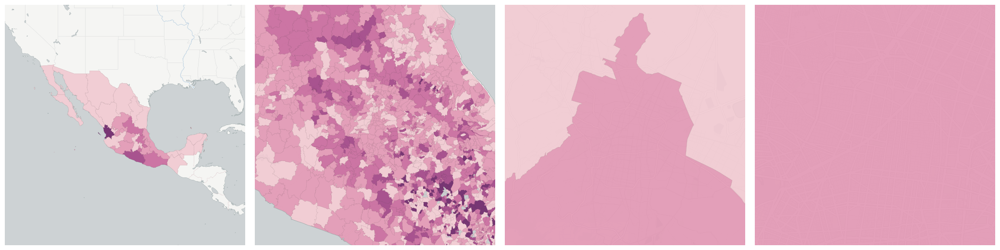
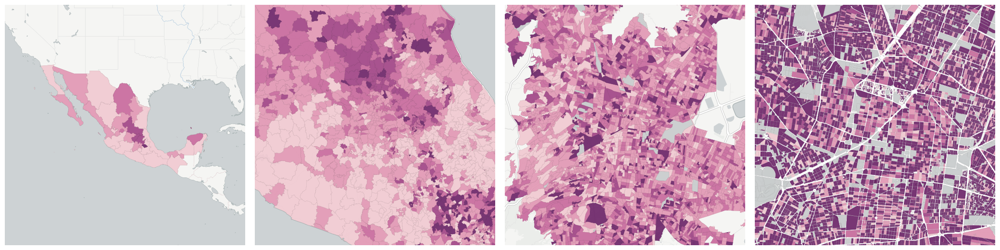

  
# Education

Educational attainment and enrollment.

- [Average education level](#average-education-level)

- [Average female education level](#average-female-education-level)

- [Average male education level](#average-male-education-level)

- [Employed population who completed basic education](#employed-population-who-completed-basic-education)

    * [Employed female population who completed basic education](#employed-female-population-who-completed-basic-education)

    * [Employed male population who completed basic education](#employed-male-population-who-completed-basic-education)

- [Employed population with a high school degree](#employed-population-with-a-high-school-degree)

    * [Employed female population with a high school degree](#employed-female-population-with-a-high-school-degree)

    * [Employed male population with a high school degree](#employed-male-population-with-a-high-school-degree)

- [Employed population with a university degree or more](#employed-population-with-a-university-degree-or-more)

    * [Employed female population with a university degree or more](#employed-female-population-with-a-university-degree-or-more)

    * [Employed male population with a university degree or more](#employed-male-population-with-a-university-degree-or-more)

- [Employed population with incomplete secondary education](#employed-population-with-incomplete-secondary-education)

    * [Employed female population with incomplete secondary education](#employed-female-population-with-incomplete-secondary-education)

    * [Employed male population with incomplete secondary education](#employed-male-population-with-incomplete-secondary-education)

- [Employed population with primary education](#employed-population-with-primary-education)

    * [Employed female population with primary education](#employed-female-population-with-primary-education)

    * [Employed male population with primary education](#employed-male-population-with-primary-education)

- [Employed population without schooling](#employed-population-without-schooling)

    * [Employed female population without schooling](#employed-female-population-without-schooling)

    * [Employed male population without schooling](#employed-male-population-without-schooling)

- [Population 15 or more years old who are illiterate](#population-15-or-more-years-old-who-are-illiterate)

    * [Female population 15 or more years old who are illiterate](#female-population-15-or-more-years-old-who-are-illiterate)

    * [Male population 15 or more years old who are illiterate](#male-population-15-or-more-years-old-who-are-illiterate)

- [Population 15 or more years old who are literate](#population-15-or-more-years-old-who-are-literate)

    * [Female population 15 or more years old who are literate](#female-population-15-or-more-years-old-who-are-literate)

    * [Male population 15 or more years old who are literate](#male-population-15-or-more-years-old-who-are-literate)

- [Population 15 or more years old who completed basic education](#population-15-or-more-years-old-who-completed-basic-education)

    * [Female population 15 or more years old who completed basic education](#female-population-15-or-more-years-old-who-completed-basic-education)

    * [Male population 15 or more years old who completed basic education](#male-population-15-or-more-years-old-who-completed-basic-education)

- [Population 15 or more years old who did not complete basic education](#population-15-or-more-years-old-who-did-not-complete-basic-education)

    * [Female population 15 or more years old who did not complete basic education](#female-population-15-or-more-years-old-who-did-not-complete-basic-education)

    * [Male population 15 or more years old who did not complete basic education](#male-population-15-or-more-years-old-who-did-not-complete-basic-education)

- [Population 15 or more years old with some high school](#population-15-or-more-years-old-with-some-high-school)

    * [Female population 15 or more years old with some high school](#female-population-15-or-more-years-old-with-some-high-school)

    * [Male population 15 or more years old with some high school](#male-population-15-or-more-years-old-with-some-high-school)

- [Population 15 or more years old without schooling](#population-15-or-more-years-old-without-schooling)

    * [Female population 15 or more years old without schooling](#female-population-15-or-more-years-old-without-schooling)

    * [Male population 15 or more years old without schooling](#male-population-15-or-more-years-old-without-schooling)

- [Population 18 or more years old with a high school degree](#population-18-or-more-years-old-with-a-high-school-degree)

    * [Female population 18 or more years old with a high school degree](#female-population-18-or-more-years-old-with-a-high-school-degree)

    * [Male population 18 or more years old with a high school degree](#male-population-18-or-more-years-old-with-a-high-school-degree)

- [Population 25 or more years old with a university degree](#population-25-or-more-years-old-with-a-university-degree)

    * [Female population 25 or more years old with a university degree](#female-population-25-or-more-years-old-with-a-university-degree)

    * [Male population 25 or more years old with a university degree](#male-population-25-or-more-years-old-with-a-university-degree)

- [Population from 12 to 14 years old who do not go to school](#population-from-12-to-14-years-old-who-do-not-go-to-school)

    * [Female population from 12 to 14 years old who do not go to school](#female-population-from-12-to-14-years-old-who-do-not-go-to-school)

    * [Male population from 12 to 14 years old who do not go to school](#male-population-from-12-to-14-years-old-who-do-not-go-to-school)

- [Population from 12 to 14 years old who go to school](#population-from-12-to-14-years-old-who-go-to-school)

    * [Female population from 12 to 14 years old who go to school](#female-population-from-12-to-14-years-old-who-go-to-school)

    * [Male population from 12 to 14 years old who go to school](#male-population-from-12-to-14-years-old-who-go-to-school)

- [Population from 3 to 5 years old who do not go to school](#population-from-3-to-5-years-old-who-do-not-go-to-school)

    * [Female population from 3 to 5 years old who do not go to school](#female-population-from-3-to-5-years-old-who-do-not-go-to-school)

    * [Male population from 3 to 5 years old who do not go to school](#male-population-from-3-to-5-years-old-who-do-not-go-to-school)

- [Population from 3 to 5 years old who go to school](#population-from-3-to-5-years-old-who-go-to-school)

    * [Female population from 3 to 5 years old who go to school](#female-population-from-3-to-5-years-old-who-go-to-school)

    * [Male population from 3 to 5 years old who go to school](#male-population-from-3-to-5-years-old-who-go-to-school)

- [Population from 6 to 11 years old who do not go to school](#population-from-6-to-11-years-old-who-do-not-go-to-school)

    * [Female population from 6 to 11 years old who do not go to school](#female-population-from-6-to-11-years-old-who-do-not-go-to-school)

    * [Male population from 6 to 11 years old who do not go to school](#male-population-from-6-to-11-years-old-who-do-not-go-to-school)

- [Population from 6 to 11 years old who go to school](#population-from-6-to-11-years-old-who-go-to-school)

    * [Female population from 6 to 11 years old who go to school](#female-population-from-6-to-11-years-old-who-go-to-school)

    * [Male population from 6 to 11 years old who go to school](#male-population-from-6-to-11-years-old-who-go-to-school)

- [Population from 8 to 14 years old who are illiterate](#population-from-8-to-14-years-old-who-are-illiterate)

    * [Female population from 8 to 14 years old who are illiterate](#female-population-from-8-to-14-years-old-who-are-illiterate)

    * [Male population from 8 to 14 years old who are illiterate](#male-population-from-8-to-14-years-old-who-are-illiterate)

- [Population from 8 to 14 years old who are literate](#population-from-8-to-14-years-old-who-are-literate)

    * [Female population from 8 to 14 years old who are literate](#female-population-from-8-to-14-years-old-who-are-literate)

    * [Male population from 8 to 14 years old who are literate](#male-population-from-8-to-14-years-old-who-are-literate)

## Average education level

Measure &quot;Average education level&quot;  for one point:

    UPDATE {table_name}
      SET {new_numeric_column} =
        OBS_GetMeasure(
          CDB_LatLng(40.7, -73.9),
          'mx.inegi_columns.EDU49_R'
        );

Average education level is only available for point lookups.

## Average female education level

Measure &quot;Average female education level&quot;  for one point:

    UPDATE {table_name}
      SET {new_numeric_column} =
        OBS_GetMeasure(
          CDB_LatLng(40.7, -73.9),
          'mx.inegi_columns.EDU50_R'
        );

Average female education level is only available for point lookups.

## Average male education level

Measure &quot;Average male education level&quot;  for one point:

    UPDATE {table_name}
      SET {new_numeric_column} =
        OBS_GetMeasure(
          CDB_LatLng(40.7, -73.9),
          'mx.inegi_columns.EDU51_R'
        );

Average male education level is only available for point lookups.

## Employed population who completed basic education

Measure &quot;Employed population who completed basic education&quot;  density per sq. kilometer  for one point:

    UPDATE {table_name}
      SET {new_numeric_column} =
        OBS_GetMeasure(
          CDB_LatLng(40.7, -73.9),
          'mx.inegi_columns.ECO16'
        );

Measure &quot;Employed population who completed basic education&quot; within an area:

    UPDATE {table_name}
      SET {new_numeric_column} =
        OBS_GetMeasure(
          ST_Buffer(CDB_LatLng(40.7, -73.9), 0.01),
          'mx.inegi_columns.ECO16'
        );

Measure &quot;Employed population who completed basic education&quot; percent of &quot;Employed&quot; at one point:

    UPDATE {table_name}
      SET {new_numeric_column} =
        OBS_GetMeasure(
          CDB_LatLng(40.7, -73.9),
          'mx.inegi_columns.ECO16',
          'denominator'
        );

Measure &quot;Employed population who completed basic education&quot; percent of &quot;Employed&quot; within an area:

    UPDATE {table_name}
      SET {new_numeric_column} =
        OBS_GetMeasure(
          ST_Buffer(CDB_LatLng(40.7, -73.9), 0.01),
          'mx.inegi_columns.ECO16',
          'denominator'
        );

* denominator: [Employed](../employment/#mx-inegi-columns-eco4)

Subcolumns of Employed population who completed basic education

- [Employed female population who completed basic education](#employed-female-population-who-completed-basic-education)

- [Employed male population who completed basic education](#employed-male-population-who-completed-basic-education)

### Employed female population who completed basic education

Measure &quot;Employed female population who completed basic education&quot;  density per sq. kilometer  for one point:

    UPDATE {table_name}
      SET {new_numeric_column} =
        OBS_GetMeasure(
          CDB_LatLng(40.7, -73.9),
          'mx.inegi_columns.ECO17'
        );

Measure &quot;Employed female population who completed basic education&quot; within an area:

    UPDATE {table_name}
      SET {new_numeric_column} =
        OBS_GetMeasure(
          ST_Buffer(CDB_LatLng(40.7, -73.9), 0.01),
          'mx.inegi_columns.ECO17'
        );

Measure &quot;Employed female population who completed basic education&quot; percent of &quot;Employed female&quot; at one point:

    UPDATE {table_name}
      SET {new_numeric_column} =
        OBS_GetMeasure(
          CDB_LatLng(40.7, -73.9),
          'mx.inegi_columns.ECO17',
          'denominator'
        );

Measure &quot;Employed female population who completed basic education&quot; percent of &quot;Employed female&quot; within an area:

    UPDATE {table_name}
      SET {new_numeric_column} =
        OBS_GetMeasure(
          ST_Buffer(CDB_LatLng(40.7, -73.9), 0.01),
          'mx.inegi_columns.ECO17',
          'denominator'
        );

* denominator: mx.inegi_columns.ECO5

* denominator: [Employed population who completed basic education](../employment/#mx-inegi-columns-eco16)

### Employed male population who completed basic education

Measure &quot;Employed male population who completed basic education&quot;  density per sq. kilometer  for one point:

    UPDATE {table_name}
      SET {new_numeric_column} =
        OBS_GetMeasure(
          CDB_LatLng(40.7, -73.9),
          'mx.inegi_columns.ECO18'
        );

Measure &quot;Employed male population who completed basic education&quot; within an area:

    UPDATE {table_name}
      SET {new_numeric_column} =
        OBS_GetMeasure(
          ST_Buffer(CDB_LatLng(40.7, -73.9), 0.01),
          'mx.inegi_columns.ECO18'
        );

Measure &quot;Employed male population who completed basic education&quot; percent of &quot;Employed male&quot; at one point:

    UPDATE {table_name}
      SET {new_numeric_column} =
        OBS_GetMeasure(
          CDB_LatLng(40.7, -73.9),
          'mx.inegi_columns.ECO18',
          'denominator'
        );

Measure &quot;Employed male population who completed basic education&quot; percent of &quot;Employed male&quot; within an area:

    UPDATE {table_name}
      SET {new_numeric_column} =
        OBS_GetMeasure(
          ST_Buffer(CDB_LatLng(40.7, -73.9), 0.01),
          'mx.inegi_columns.ECO18',
          'denominator'
        );

* denominator: mx.inegi_columns.ECO6

* denominator: [Employed population who completed basic education](../employment/#mx-inegi-columns-eco16)

## Employed population with a high school degree

Measure &quot;Employed population with a high school degree&quot;  density per sq. kilometer  for one point:

    UPDATE {table_name}
      SET {new_numeric_column} =
        OBS_GetMeasure(
          CDB_LatLng(40.7, -73.9),
          'mx.inegi_columns.ECO19'
        );

Measure &quot;Employed population with a high school degree&quot; within an area:

    UPDATE {table_name}
      SET {new_numeric_column} =
        OBS_GetMeasure(
          ST_Buffer(CDB_LatLng(40.7, -73.9), 0.01),
          'mx.inegi_columns.ECO19'
        );

Measure &quot;Employed population with a high school degree&quot; percent of &quot;Employed&quot; at one point:

    UPDATE {table_name}
      SET {new_numeric_column} =
        OBS_GetMeasure(
          CDB_LatLng(40.7, -73.9),
          'mx.inegi_columns.ECO19',
          'denominator'
        );

Measure &quot;Employed population with a high school degree&quot; percent of &quot;Employed&quot; within an area:

    UPDATE {table_name}
      SET {new_numeric_column} =
        OBS_GetMeasure(
          ST_Buffer(CDB_LatLng(40.7, -73.9), 0.01),
          'mx.inegi_columns.ECO19',
          'denominator'
        );

* denominator: [Employed](../employment/#mx-inegi-columns-eco4)

Subcolumns of Employed population with a high school degree

- [Employed female population with a high school degree](#employed-female-population-with-a-high-school-degree)

- [Employed male population with a high school degree](#employed-male-population-with-a-high-school-degree)

### Employed female population with a high school degree

Measure &quot;Employed female population with a high school degree&quot;  density per sq. kilometer  for one point:

    UPDATE {table_name}
      SET {new_numeric_column} =
        OBS_GetMeasure(
          CDB_LatLng(40.7, -73.9),
          'mx.inegi_columns.ECO20'
        );

Measure &quot;Employed female population with a high school degree&quot; within an area:

    UPDATE {table_name}
      SET {new_numeric_column} =
        OBS_GetMeasure(
          ST_Buffer(CDB_LatLng(40.7, -73.9), 0.01),
          'mx.inegi_columns.ECO20'
        );

Measure &quot;Employed female population with a high school degree&quot; percent of &quot;Employed population with a high school degree&quot; at one point:

    UPDATE {table_name}
      SET {new_numeric_column} =
        OBS_GetMeasure(
          CDB_LatLng(40.7, -73.9),
          'mx.inegi_columns.ECO20',
          'denominator'
        );

Measure &quot;Employed female population with a high school degree&quot; percent of &quot;Employed population with a high school degree&quot; within an area:

    UPDATE {table_name}
      SET {new_numeric_column} =
        OBS_GetMeasure(
          ST_Buffer(CDB_LatLng(40.7, -73.9), 0.01),
          'mx.inegi_columns.ECO20',
          'denominator'
        );

* denominator: [Employed population with a high school degree](../employment/#mx-inegi-columns-eco19)

* denominator: mx.inegi_columns.ECO5

### Employed male population with a high school degree

Measure &quot;Employed male population with a high school degree&quot;  density per sq. kilometer  for one point:

    UPDATE {table_name}
      SET {new_numeric_column} =
        OBS_GetMeasure(
          CDB_LatLng(40.7, -73.9),
          'mx.inegi_columns.ECO21'
        );

Measure &quot;Employed male population with a high school degree&quot; within an area:

    UPDATE {table_name}
      SET {new_numeric_column} =
        OBS_GetMeasure(
          ST_Buffer(CDB_LatLng(40.7, -73.9), 0.01),
          'mx.inegi_columns.ECO21'
        );

Measure &quot;Employed male population with a high school degree&quot; percent of &quot;Employed population with a high school degree&quot; at one point:

    UPDATE {table_name}
      SET {new_numeric_column} =
        OBS_GetMeasure(
          CDB_LatLng(40.7, -73.9),
          'mx.inegi_columns.ECO21',
          'denominator'
        );

Measure &quot;Employed male population with a high school degree&quot; percent of &quot;Employed population with a high school degree&quot; within an area:

    UPDATE {table_name}
      SET {new_numeric_column} =
        OBS_GetMeasure(
          ST_Buffer(CDB_LatLng(40.7, -73.9), 0.01),
          'mx.inegi_columns.ECO21',
          'denominator'
        );

* denominator: [Employed population with a high school degree](../employment/#mx-inegi-columns-eco19)

* denominator: mx.inegi_columns.ECO6

## Employed population with a university degree or more

Measure &quot;Employed population with a university degree or more&quot;  density per sq. kilometer  for one point:

    UPDATE {table_name}
      SET {new_numeric_column} =
        OBS_GetMeasure(
          CDB_LatLng(40.7, -73.9),
          'mx.inegi_columns.ECO22'
        );

Measure &quot;Employed population with a university degree or more&quot; within an area:

    UPDATE {table_name}
      SET {new_numeric_column} =
        OBS_GetMeasure(
          ST_Buffer(CDB_LatLng(40.7, -73.9), 0.01),
          'mx.inegi_columns.ECO22'
        );

Measure &quot;Employed population with a university degree or more&quot; percent of &quot;Employed&quot; at one point:

    UPDATE {table_name}
      SET {new_numeric_column} =
        OBS_GetMeasure(
          CDB_LatLng(40.7, -73.9),
          'mx.inegi_columns.ECO22',
          'denominator'
        );

Measure &quot;Employed population with a university degree or more&quot; percent of &quot;Employed&quot; within an area:

    UPDATE {table_name}
      SET {new_numeric_column} =
        OBS_GetMeasure(
          ST_Buffer(CDB_LatLng(40.7, -73.9), 0.01),
          'mx.inegi_columns.ECO22',
          'denominator'
        );

* denominator: [Employed](../employment/#mx-inegi-columns-eco4)

Subcolumns of Employed population with a university degree or more

- [Employed female population with a university degree or more](#employed-female-population-with-a-university-degree-or-more)

- [Employed male population with a university degree or more](#employed-male-population-with-a-university-degree-or-more)

### Employed female population with a university degree or more

Measure &quot;Employed female population with a university degree or more&quot;  density per sq. kilometer  for one point:

    UPDATE {table_name}
      SET {new_numeric_column} =
        OBS_GetMeasure(
          CDB_LatLng(40.7, -73.9),
          'mx.inegi_columns.ECO23'
        );

Measure &quot;Employed female population with a university degree or more&quot; within an area:

    UPDATE {table_name}
      SET {new_numeric_column} =
        OBS_GetMeasure(
          ST_Buffer(CDB_LatLng(40.7, -73.9), 0.01),
          'mx.inegi_columns.ECO23'
        );

Measure &quot;Employed female population with a university degree or more&quot; percent of &quot;Employed female&quot; at one point:

    UPDATE {table_name}
      SET {new_numeric_column} =
        OBS_GetMeasure(
          CDB_LatLng(40.7, -73.9),
          'mx.inegi_columns.ECO23',
          'denominator'
        );

Measure &quot;Employed female population with a university degree or more&quot; percent of &quot;Employed female&quot; within an area:

    UPDATE {table_name}
      SET {new_numeric_column} =
        OBS_GetMeasure(
          ST_Buffer(CDB_LatLng(40.7, -73.9), 0.01),
          'mx.inegi_columns.ECO23',
          'denominator'
        );

* denominator: mx.inegi_columns.ECO5

* denominator: [Employed population with a university degree or more](../employment/#mx-inegi-columns-eco22)

### Employed male population with a university degree or more

Measure &quot;Employed male population with a university degree or more&quot;  density per sq. kilometer  for one point:

    UPDATE {table_name}
      SET {new_numeric_column} =
        OBS_GetMeasure(
          CDB_LatLng(40.7, -73.9),
          'mx.inegi_columns.ECO24'
        );

Measure &quot;Employed male population with a university degree or more&quot; within an area:

    UPDATE {table_name}
      SET {new_numeric_column} =
        OBS_GetMeasure(
          ST_Buffer(CDB_LatLng(40.7, -73.9), 0.01),
          'mx.inegi_columns.ECO24'
        );

Measure &quot;Employed male population with a university degree or more&quot; percent of &quot;Employed male&quot; at one point:

    UPDATE {table_name}
      SET {new_numeric_column} =
        OBS_GetMeasure(
          CDB_LatLng(40.7, -73.9),
          'mx.inegi_columns.ECO24',
          'denominator'
        );

Measure &quot;Employed male population with a university degree or more&quot; percent of &quot;Employed male&quot; within an area:

    UPDATE {table_name}
      SET {new_numeric_column} =
        OBS_GetMeasure(
          ST_Buffer(CDB_LatLng(40.7, -73.9), 0.01),
          'mx.inegi_columns.ECO24',
          'denominator'
        );

* denominator: mx.inegi_columns.ECO6

* denominator: [Employed population with a university degree or more](../employment/#mx-inegi-columns-eco22)

## Employed population with incomplete secondary education

Measure &quot;Employed population with incomplete secondary education&quot;  density per sq. kilometer  for one point:

    UPDATE {table_name}
      SET {new_numeric_column} =
        OBS_GetMeasure(
          CDB_LatLng(40.7, -73.9),
          'mx.inegi_columns.ECO13'
        );

Measure &quot;Employed population with incomplete secondary education&quot; within an area:

    UPDATE {table_name}
      SET {new_numeric_column} =
        OBS_GetMeasure(
          ST_Buffer(CDB_LatLng(40.7, -73.9), 0.01),
          'mx.inegi_columns.ECO13'
        );

Measure &quot;Employed population with incomplete secondary education&quot; percent of &quot;Employed&quot; at one point:

    UPDATE {table_name}
      SET {new_numeric_column} =
        OBS_GetMeasure(
          CDB_LatLng(40.7, -73.9),
          'mx.inegi_columns.ECO13',
          'denominator'
        );

Measure &quot;Employed population with incomplete secondary education&quot; percent of &quot;Employed&quot; within an area:

    UPDATE {table_name}
      SET {new_numeric_column} =
        OBS_GetMeasure(
          ST_Buffer(CDB_LatLng(40.7, -73.9), 0.01),
          'mx.inegi_columns.ECO13',
          'denominator'
        );

* denominator: [Employed](../employment/#mx-inegi-columns-eco4)

Subcolumns of Employed population with incomplete secondary education

- [Employed female population with incomplete secondary education](#employed-female-population-with-incomplete-secondary-education)

- [Employed male population with incomplete secondary education](#employed-male-population-with-incomplete-secondary-education)

### Employed female population with incomplete secondary education

Measure &quot;Employed female population with incomplete secondary education&quot;  density per sq. kilometer  for one point:

    UPDATE {table_name}
      SET {new_numeric_column} =
        OBS_GetMeasure(
          CDB_LatLng(40.7, -73.9),
          'mx.inegi_columns.ECO14'
        );

Measure &quot;Employed female population with incomplete secondary education&quot; within an area:

    UPDATE {table_name}
      SET {new_numeric_column} =
        OBS_GetMeasure(
          ST_Buffer(CDB_LatLng(40.7, -73.9), 0.01),
          'mx.inegi_columns.ECO14'
        );

Measure &quot;Employed female population with incomplete secondary education&quot; percent of &quot;Employed population with incomplete secondary education&quot; at one point:

    UPDATE {table_name}
      SET {new_numeric_column} =
        OBS_GetMeasure(
          CDB_LatLng(40.7, -73.9),
          'mx.inegi_columns.ECO14',
          'denominator'
        );

Measure &quot;Employed female population with incomplete secondary education&quot; percent of &quot;Employed population with incomplete secondary education&quot; within an area:

    UPDATE {table_name}
      SET {new_numeric_column} =
        OBS_GetMeasure(
          ST_Buffer(CDB_LatLng(40.7, -73.9), 0.01),
          'mx.inegi_columns.ECO14',
          'denominator'
        );

* denominator: [Employed population with incomplete secondary education](../employment/#mx-inegi-columns-eco13)

* denominator: mx.inegi_columns.ECO5

### Employed male population with incomplete secondary education

Measure &quot;Employed male population with incomplete secondary education&quot;  density per sq. kilometer  for one point:

    UPDATE {table_name}
      SET {new_numeric_column} =
        OBS_GetMeasure(
          CDB_LatLng(40.7, -73.9),
          'mx.inegi_columns.ECO15'
        );

Measure &quot;Employed male population with incomplete secondary education&quot; within an area:

    UPDATE {table_name}
      SET {new_numeric_column} =
        OBS_GetMeasure(
          ST_Buffer(CDB_LatLng(40.7, -73.9), 0.01),
          'mx.inegi_columns.ECO15'
        );

Measure &quot;Employed male population with incomplete secondary education&quot; percent of &quot;Employed population with incomplete secondary education&quot; at one point:

    UPDATE {table_name}
      SET {new_numeric_column} =
        OBS_GetMeasure(
          CDB_LatLng(40.7, -73.9),
          'mx.inegi_columns.ECO15',
          'denominator'
        );

Measure &quot;Employed male population with incomplete secondary education&quot; percent of &quot;Employed population with incomplete secondary education&quot; within an area:

    UPDATE {table_name}
      SET {new_numeric_column} =
        OBS_GetMeasure(
          ST_Buffer(CDB_LatLng(40.7, -73.9), 0.01),
          'mx.inegi_columns.ECO15',
          'denominator'
        );

* denominator: [Employed population with incomplete secondary education](../employment/#mx-inegi-columns-eco13)

* denominator: mx.inegi_columns.ECO6

## Employed population with primary education

Measure &quot;Employed population with primary education&quot;  density per sq. kilometer  for one point:

    UPDATE {table_name}
      SET {new_numeric_column} =
        OBS_GetMeasure(
          CDB_LatLng(40.7, -73.9),
          'mx.inegi_columns.ECO10'
        );

Measure &quot;Employed population with primary education&quot; within an area:

    UPDATE {table_name}
      SET {new_numeric_column} =
        OBS_GetMeasure(
          ST_Buffer(CDB_LatLng(40.7, -73.9), 0.01),
          'mx.inegi_columns.ECO10'
        );

Measure &quot;Employed population with primary education&quot; percent of &quot;Employed&quot; at one point:

    UPDATE {table_name}
      SET {new_numeric_column} =
        OBS_GetMeasure(
          CDB_LatLng(40.7, -73.9),
          'mx.inegi_columns.ECO10',
          'denominator'
        );

Measure &quot;Employed population with primary education&quot; percent of &quot;Employed&quot; within an area:

    UPDATE {table_name}
      SET {new_numeric_column} =
        OBS_GetMeasure(
          ST_Buffer(CDB_LatLng(40.7, -73.9), 0.01),
          'mx.inegi_columns.ECO10',
          'denominator'
        );

* denominator: [Employed](../employment/#mx-inegi-columns-eco4)

Subcolumns of Employed population with primary education

- [Employed female population with primary education](#employed-female-population-with-primary-education)

- [Employed male population with primary education](#employed-male-population-with-primary-education)

### Employed female population with primary education

Measure &quot;Employed female population with primary education&quot;  density per sq. kilometer  for one point:

    UPDATE {table_name}
      SET {new_numeric_column} =
        OBS_GetMeasure(
          CDB_LatLng(40.7, -73.9),
          'mx.inegi_columns.ECO11'
        );

Measure &quot;Employed female population with primary education&quot; within an area:

    UPDATE {table_name}
      SET {new_numeric_column} =
        OBS_GetMeasure(
          ST_Buffer(CDB_LatLng(40.7, -73.9), 0.01),
          'mx.inegi_columns.ECO11'
        );

Measure &quot;Employed female population with primary education&quot; percent of &quot;Employed population with primary education&quot; at one point:

    UPDATE {table_name}
      SET {new_numeric_column} =
        OBS_GetMeasure(
          CDB_LatLng(40.7, -73.9),
          'mx.inegi_columns.ECO11',
          'denominator'
        );

Measure &quot;Employed female population with primary education&quot; percent of &quot;Employed population with primary education&quot; within an area:

    UPDATE {table_name}
      SET {new_numeric_column} =
        OBS_GetMeasure(
          ST_Buffer(CDB_LatLng(40.7, -73.9), 0.01),
          'mx.inegi_columns.ECO11',
          'denominator'
        );

* denominator: [Employed population with primary education](../employment/#mx-inegi-columns-eco10)

* denominator: mx.inegi_columns.ECO5

### Employed male population with primary education

Measure &quot;Employed male population with primary education&quot;  density per sq. kilometer  for one point:

    UPDATE {table_name}
      SET {new_numeric_column} =
        OBS_GetMeasure(
          CDB_LatLng(40.7, -73.9),
          'mx.inegi_columns.ECO12'
        );

Measure &quot;Employed male population with primary education&quot; within an area:

    UPDATE {table_name}
      SET {new_numeric_column} =
        OBS_GetMeasure(
          ST_Buffer(CDB_LatLng(40.7, -73.9), 0.01),
          'mx.inegi_columns.ECO12'
        );

Measure &quot;Employed male population with primary education&quot; percent of &quot;Employed population with primary education&quot; at one point:

    UPDATE {table_name}
      SET {new_numeric_column} =
        OBS_GetMeasure(
          CDB_LatLng(40.7, -73.9),
          'mx.inegi_columns.ECO12',
          'denominator'
        );

Measure &quot;Employed male population with primary education&quot; percent of &quot;Employed population with primary education&quot; within an area:

    UPDATE {table_name}
      SET {new_numeric_column} =
        OBS_GetMeasure(
          ST_Buffer(CDB_LatLng(40.7, -73.9), 0.01),
          'mx.inegi_columns.ECO12',
          'denominator'
        );

* denominator: [Employed population with primary education](../employment/#mx-inegi-columns-eco10)

* denominator: mx.inegi_columns.ECO6

## Employed population without schooling

Measure &quot;Employed population without schooling&quot;  density per sq. kilometer  for one point:

    UPDATE {table_name}
      SET {new_numeric_column} =
        OBS_GetMeasure(
          CDB_LatLng(40.7, -73.9),
          'mx.inegi_columns.ECO7'
        );

Measure &quot;Employed population without schooling&quot; within an area:

    UPDATE {table_name}
      SET {new_numeric_column} =
        OBS_GetMeasure(
          ST_Buffer(CDB_LatLng(40.7, -73.9), 0.01),
          'mx.inegi_columns.ECO7'
        );

Measure &quot;Employed population without schooling&quot; percent of &quot;Employed&quot; at one point:

    UPDATE {table_name}
      SET {new_numeric_column} =
        OBS_GetMeasure(
          CDB_LatLng(40.7, -73.9),
          'mx.inegi_columns.ECO7',
          'denominator'
        );

Measure &quot;Employed population without schooling&quot; percent of &quot;Employed&quot; within an area:

    UPDATE {table_name}
      SET {new_numeric_column} =
        OBS_GetMeasure(
          ST_Buffer(CDB_LatLng(40.7, -73.9), 0.01),
          'mx.inegi_columns.ECO7',
          'denominator'
        );

* denominator: [Employed](../employment/#mx-inegi-columns-eco4)

Subcolumns of Employed population without schooling

- [Employed female population without schooling](#employed-female-population-without-schooling)

- [Employed male population without schooling](#employed-male-population-without-schooling)

### Employed female population without schooling

Measure &quot;Employed female population without schooling&quot;  density per sq. kilometer  for one point:

    UPDATE {table_name}
      SET {new_numeric_column} =
        OBS_GetMeasure(
          CDB_LatLng(40.7, -73.9),
          'mx.inegi_columns.ECO8'
        );

Measure &quot;Employed female population without schooling&quot; within an area:

    UPDATE {table_name}
      SET {new_numeric_column} =
        OBS_GetMeasure(
          ST_Buffer(CDB_LatLng(40.7, -73.9), 0.01),
          'mx.inegi_columns.ECO8'
        );

Measure &quot;Employed female population without schooling&quot; percent of &quot;Employed population without schooling&quot; at one point:

    UPDATE {table_name}
      SET {new_numeric_column} =
        OBS_GetMeasure(
          CDB_LatLng(40.7, -73.9),
          'mx.inegi_columns.ECO8',
          'denominator'
        );

Measure &quot;Employed female population without schooling&quot; percent of &quot;Employed population without schooling&quot; within an area:

    UPDATE {table_name}
      SET {new_numeric_column} =
        OBS_GetMeasure(
          ST_Buffer(CDB_LatLng(40.7, -73.9), 0.01),
          'mx.inegi_columns.ECO8',
          'denominator'
        );

* denominator: [Employed population without schooling](../employment/#mx-inegi-columns-eco7)

* denominator: mx.inegi_columns.ECO5

### Employed male population without schooling

Measure &quot;Employed male population without schooling&quot;  density per sq. kilometer  for one point:

    UPDATE {table_name}
      SET {new_numeric_column} =
        OBS_GetMeasure(
          CDB_LatLng(40.7, -73.9),
          'mx.inegi_columns.ECO9'
        );

Measure &quot;Employed male population without schooling&quot; within an area:

    UPDATE {table_name}
      SET {new_numeric_column} =
        OBS_GetMeasure(
          ST_Buffer(CDB_LatLng(40.7, -73.9), 0.01),
          'mx.inegi_columns.ECO9'
        );

Measure &quot;Employed male population without schooling&quot; percent of &quot;Employed population without schooling&quot; at one point:

    UPDATE {table_name}
      SET {new_numeric_column} =
        OBS_GetMeasure(
          CDB_LatLng(40.7, -73.9),
          'mx.inegi_columns.ECO9',
          'denominator'
        );

Measure &quot;Employed male population without schooling&quot; percent of &quot;Employed population without schooling&quot; within an area:

    UPDATE {table_name}
      SET {new_numeric_column} =
        OBS_GetMeasure(
          ST_Buffer(CDB_LatLng(40.7, -73.9), 0.01),
          'mx.inegi_columns.ECO9',
          'denominator'
        );

* denominator: [Employed population without schooling](../employment/#mx-inegi-columns-eco7)

* denominator: mx.inegi_columns.ECO6

## Population 15 or more years old who are illiterate

Measure &quot;Population 15 or more years old who are illiterate&quot;  density per sq. kilometer  for one point:

    UPDATE {table_name}
      SET {new_numeric_column} =
        OBS_GetMeasure(
          CDB_LatLng(40.7, -73.9),
          'mx.inegi_columns.EDU28'
        );

Measure &quot;Population 15 or more years old who are illiterate&quot; within an area:

    UPDATE {table_name}
      SET {new_numeric_column} =
        OBS_GetMeasure(
          ST_Buffer(CDB_LatLng(40.7, -73.9), 0.01),
          'mx.inegi_columns.EDU28'
        );

Measure &quot;Population 15 or more years old who are illiterate&quot; percent of &quot;Population 15 or more years old&quot; at one point:

    UPDATE {table_name}
      SET {new_numeric_column} =
        OBS_GetMeasure(
          CDB_LatLng(40.7, -73.9),
          'mx.inegi_columns.EDU28',
          'denominator'
        );

Measure &quot;Population 15 or more years old who are illiterate&quot; percent of &quot;Population 15 or more years old&quot; within an area:

    UPDATE {table_name}
      SET {new_numeric_column} =
        OBS_GetMeasure(
          ST_Buffer(CDB_LatLng(40.7, -73.9), 0.01),
          'mx.inegi_columns.EDU28',
          'denominator'
        );

* denominator: [Population 15 or more years old](../age_gender/#mx-inegi-columns-pob20)

Subcolumns of Population 15 or more years old who are illiterate

- [Female population 15 or more years old who are illiterate](#female-population-15-or-more-years-old-who-are-illiterate)

- [Male population 15 or more years old who are illiterate](#male-population-15-or-more-years-old-who-are-illiterate)

### Female population 15 or more years old who are illiterate

Measure &quot;Female population 15 or more years old who are illiterate&quot;  density per sq. kilometer  for one point:

    UPDATE {table_name}
      SET {new_numeric_column} =
        OBS_GetMeasure(
          CDB_LatLng(40.7, -73.9),
          'mx.inegi_columns.EDU29'
        );

Measure &quot;Female population 15 or more years old who are illiterate&quot; within an area:

    UPDATE {table_name}
      SET {new_numeric_column} =
        OBS_GetMeasure(
          ST_Buffer(CDB_LatLng(40.7, -73.9), 0.01),
          'mx.inegi_columns.EDU29'
        );

Measure &quot;Female population 15 or more years old who are illiterate&quot; percent of &quot;Population 15 or more years old who are illiterate&quot; at one point:

    UPDATE {table_name}
      SET {new_numeric_column} =
        OBS_GetMeasure(
          CDB_LatLng(40.7, -73.9),
          'mx.inegi_columns.EDU29',
          'denominator'
        );

Measure &quot;Female population 15 or more years old who are illiterate&quot; percent of &quot;Population 15 or more years old who are illiterate&quot; within an area:

    UPDATE {table_name}
      SET {new_numeric_column} =
        OBS_GetMeasure(
          ST_Buffer(CDB_LatLng(40.7, -73.9), 0.01),
          'mx.inegi_columns.EDU29',
          'denominator'
        );

* denominator: [Population 15 or more years old who are illiterate](#mx-inegi-columns-edu28)

* denominator: mx.inegi_columns.POB51

### Male population 15 or more years old who are illiterate

Measure &quot;Male population 15 or more years old who are illiterate&quot;  density per sq. kilometer  for one point:

    UPDATE {table_name}
      SET {new_numeric_column} =
        OBS_GetMeasure(
          CDB_LatLng(40.7, -73.9),
          'mx.inegi_columns.EDU30'
        );

Measure &quot;Male population 15 or more years old who are illiterate&quot; within an area:

    UPDATE {table_name}
      SET {new_numeric_column} =
        OBS_GetMeasure(
          ST_Buffer(CDB_LatLng(40.7, -73.9), 0.01),
          'mx.inegi_columns.EDU30'
        );

Measure &quot;Male population 15 or more years old who are illiterate&quot; percent of &quot;Population 15 or more years old who are illiterate&quot; at one point:

    UPDATE {table_name}
      SET {new_numeric_column} =
        OBS_GetMeasure(
          CDB_LatLng(40.7, -73.9),
          'mx.inegi_columns.EDU30',
          'denominator'
        );

Measure &quot;Male population 15 or more years old who are illiterate&quot; percent of &quot;Population 15 or more years old who are illiterate&quot; within an area:

    UPDATE {table_name}
      SET {new_numeric_column} =
        OBS_GetMeasure(
          ST_Buffer(CDB_LatLng(40.7, -73.9), 0.01),
          'mx.inegi_columns.EDU30',
          'denominator'
        );

* denominator: [Population 15 or more years old who are illiterate](#mx-inegi-columns-edu28)

* denominator: mx.inegi_columns.POB76

## Population 15 or more years old who are literate

Measure &quot;Population 15 or more years old who are literate&quot;  density per sq. kilometer  for one point:

    UPDATE {table_name}
      SET {new_numeric_column} =
        OBS_GetMeasure(
          CDB_LatLng(40.7, -73.9),
          'mx.inegi_columns.EDU25'
        );

Measure &quot;Population 15 or more years old who are literate&quot; within an area:

    UPDATE {table_name}
      SET {new_numeric_column} =
        OBS_GetMeasure(
          ST_Buffer(CDB_LatLng(40.7, -73.9), 0.01),
          'mx.inegi_columns.EDU25'
        );

Measure &quot;Population 15 or more years old who are literate&quot; percent of &quot;Population 15 or more years old&quot; at one point:

    UPDATE {table_name}
      SET {new_numeric_column} =
        OBS_GetMeasure(
          CDB_LatLng(40.7, -73.9),
          'mx.inegi_columns.EDU25',
          'denominator'
        );

Measure &quot;Population 15 or more years old who are literate&quot; percent of &quot;Population 15 or more years old&quot; within an area:

    UPDATE {table_name}
      SET {new_numeric_column} =
        OBS_GetMeasure(
          ST_Buffer(CDB_LatLng(40.7, -73.9), 0.01),
          'mx.inegi_columns.EDU25',
          'denominator'
        );

* denominator: [Population 15 or more years old](../age_gender/#mx-inegi-columns-pob20)

Subcolumns of Population 15 or more years old who are literate

- [Female population 15 or more years old who are literate](#female-population-15-or-more-years-old-who-are-literate)

- [Male population 15 or more years old who are literate](#male-population-15-or-more-years-old-who-are-literate)

### Female population 15 or more years old who are literate

Measure &quot;Female population 15 or more years old who are literate&quot;  density per sq. kilometer  for one point:

    UPDATE {table_name}
      SET {new_numeric_column} =
        OBS_GetMeasure(
          CDB_LatLng(40.7, -73.9),
          'mx.inegi_columns.EDU26'
        );

Measure &quot;Female population 15 or more years old who are literate&quot; within an area:

    UPDATE {table_name}
      SET {new_numeric_column} =
        OBS_GetMeasure(
          ST_Buffer(CDB_LatLng(40.7, -73.9), 0.01),
          'mx.inegi_columns.EDU26'
        );

Measure &quot;Female population 15 or more years old who are literate&quot; percent of &quot;Population 15 or more years old who are literate&quot; at one point:

    UPDATE {table_name}
      SET {new_numeric_column} =
        OBS_GetMeasure(
          CDB_LatLng(40.7, -73.9),
          'mx.inegi_columns.EDU26',
          'denominator'
        );

Measure &quot;Female population 15 or more years old who are literate&quot; percent of &quot;Population 15 or more years old who are literate&quot; within an area:

    UPDATE {table_name}
      SET {new_numeric_column} =
        OBS_GetMeasure(
          ST_Buffer(CDB_LatLng(40.7, -73.9), 0.01),
          'mx.inegi_columns.EDU26',
          'denominator'
        );

* denominator: [Population 15 or more years old who are literate](#mx-inegi-columns-edu25)

* denominator: mx.inegi_columns.POB51

### Male population 15 or more years old who are literate

Measure &quot;Male population 15 or more years old who are literate&quot;  density per sq. kilometer  for one point:

    UPDATE {table_name}
      SET {new_numeric_column} =
        OBS_GetMeasure(
          CDB_LatLng(40.7, -73.9),
          'mx.inegi_columns.EDU27'
        );

Measure &quot;Male population 15 or more years old who are literate&quot; within an area:

    UPDATE {table_name}
      SET {new_numeric_column} =
        OBS_GetMeasure(
          ST_Buffer(CDB_LatLng(40.7, -73.9), 0.01),
          'mx.inegi_columns.EDU27'
        );

Measure &quot;Male population 15 or more years old who are literate&quot; percent of &quot;Population 15 or more years old who are literate&quot; at one point:

    UPDATE {table_name}
      SET {new_numeric_column} =
        OBS_GetMeasure(
          CDB_LatLng(40.7, -73.9),
          'mx.inegi_columns.EDU27',
          'denominator'
        );

Measure &quot;Male population 15 or more years old who are literate&quot; percent of &quot;Population 15 or more years old who are literate&quot; within an area:

    UPDATE {table_name}
      SET {new_numeric_column} =
        OBS_GetMeasure(
          ST_Buffer(CDB_LatLng(40.7, -73.9), 0.01),
          'mx.inegi_columns.EDU27',
          'denominator'
        );

* denominator: [Population 15 or more years old who are literate](#mx-inegi-columns-edu25)

* denominator: mx.inegi_columns.POB51

## Population 15 or more years old who completed basic education

Measure &quot;Population 15 or more years old who completed basic education&quot;  density per sq. kilometer  for one point:

    UPDATE {table_name}
      SET {new_numeric_column} =
        OBS_GetMeasure(
          CDB_LatLng(40.7, -73.9),
          'mx.inegi_columns.EDU37'
        );

Measure &quot;Population 15 or more years old who completed basic education&quot; within an area:

    UPDATE {table_name}
      SET {new_numeric_column} =
        OBS_GetMeasure(
          ST_Buffer(CDB_LatLng(40.7, -73.9), 0.01),
          'mx.inegi_columns.EDU37'
        );

Measure &quot;Population 15 or more years old who completed basic education&quot; percent of &quot;Population 15 or more years old&quot; at one point:

    UPDATE {table_name}
      SET {new_numeric_column} =
        OBS_GetMeasure(
          CDB_LatLng(40.7, -73.9),
          'mx.inegi_columns.EDU37',
          'denominator'
        );

Measure &quot;Population 15 or more years old who completed basic education&quot; percent of &quot;Population 15 or more years old&quot; within an area:

    UPDATE {table_name}
      SET {new_numeric_column} =
        OBS_GetMeasure(
          ST_Buffer(CDB_LatLng(40.7, -73.9), 0.01),
          'mx.inegi_columns.EDU37',
          'denominator'
        );

* denominator: [Population 15 or more years old](../age_gender/#mx-inegi-columns-pob20)

Subcolumns of Population 15 or more years old who completed basic education

- [Female population 15 or more years old who completed basic education](#female-population-15-or-more-years-old-who-completed-basic-education)

- [Male population 15 or more years old who completed basic education](#male-population-15-or-more-years-old-who-completed-basic-education)

### Female population 15 or more years old who completed basic education

Measure &quot;Female population 15 or more years old who completed basic education&quot;  density per sq. kilometer  for one point:

    UPDATE {table_name}
      SET {new_numeric_column} =
        OBS_GetMeasure(
          CDB_LatLng(40.7, -73.9),
          'mx.inegi_columns.EDU38'
        );

Measure &quot;Female population 15 or more years old who completed basic education&quot; within an area:

    UPDATE {table_name}
      SET {new_numeric_column} =
        OBS_GetMeasure(
          ST_Buffer(CDB_LatLng(40.7, -73.9), 0.01),
          'mx.inegi_columns.EDU38'
        );

Measure &quot;Female population 15 or more years old who completed basic education&quot; percent of &quot;Population 15 or more years old who completed basic education&quot; at one point:

    UPDATE {table_name}
      SET {new_numeric_column} =
        OBS_GetMeasure(
          CDB_LatLng(40.7, -73.9),
          'mx.inegi_columns.EDU38',
          'denominator'
        );

Measure &quot;Female population 15 or more years old who completed basic education&quot; percent of &quot;Population 15 or more years old who completed basic education&quot; within an area:

    UPDATE {table_name}
      SET {new_numeric_column} =
        OBS_GetMeasure(
          ST_Buffer(CDB_LatLng(40.7, -73.9), 0.01),
          'mx.inegi_columns.EDU38',
          'denominator'
        );

* denominator: [Population 15 or more years old who completed basic education](#mx-inegi-columns-edu37)

* denominator: mx.inegi_columns.POB51

### Male population 15 or more years old who completed basic education

Measure &quot;Male population 15 or more years old who completed basic education&quot;  density per sq. kilometer  for one point:

    UPDATE {table_name}
      SET {new_numeric_column} =
        OBS_GetMeasure(
          CDB_LatLng(40.7, -73.9),
          'mx.inegi_columns.EDU39'
        );

Measure &quot;Male population 15 or more years old who completed basic education&quot; within an area:

    UPDATE {table_name}
      SET {new_numeric_column} =
        OBS_GetMeasure(
          ST_Buffer(CDB_LatLng(40.7, -73.9), 0.01),
          'mx.inegi_columns.EDU39'
        );

Measure &quot;Male population 15 or more years old who completed basic education&quot; percent of &quot;Population 15 or more years old who completed basic education&quot; at one point:

    UPDATE {table_name}
      SET {new_numeric_column} =
        OBS_GetMeasure(
          CDB_LatLng(40.7, -73.9),
          'mx.inegi_columns.EDU39',
          'denominator'
        );

Measure &quot;Male population 15 or more years old who completed basic education&quot; percent of &quot;Population 15 or more years old who completed basic education&quot; within an area:

    UPDATE {table_name}
      SET {new_numeric_column} =
        OBS_GetMeasure(
          ST_Buffer(CDB_LatLng(40.7, -73.9), 0.01),
          'mx.inegi_columns.EDU39',
          'denominator'
        );

* denominator: [Population 15 or more years old who completed basic education](#mx-inegi-columns-edu37)

* denominator: mx.inegi_columns.POB76

## Population 15 or more years old who did not complete basic education

Measure &quot;Population 15 or more years old who did not complete basic education&quot;  density per sq. kilometer  for one point:

    UPDATE {table_name}
      SET {new_numeric_column} =
        OBS_GetMeasure(
          CDB_LatLng(40.7, -73.9),
          'mx.inegi_columns.EDU34'
        );

Measure &quot;Population 15 or more years old who did not complete basic education&quot; within an area:

    UPDATE {table_name}
      SET {new_numeric_column} =
        OBS_GetMeasure(
          ST_Buffer(CDB_LatLng(40.7, -73.9), 0.01),
          'mx.inegi_columns.EDU34'
        );

Measure &quot;Population 15 or more years old who did not complete basic education&quot; percent of &quot;Population 15 or more years old&quot; at one point:

    UPDATE {table_name}
      SET {new_numeric_column} =
        OBS_GetMeasure(
          CDB_LatLng(40.7, -73.9),
          'mx.inegi_columns.EDU34',
          'denominator'
        );

Measure &quot;Population 15 or more years old who did not complete basic education&quot; percent of &quot;Population 15 or more years old&quot; within an area:

    UPDATE {table_name}
      SET {new_numeric_column} =
        OBS_GetMeasure(
          ST_Buffer(CDB_LatLng(40.7, -73.9), 0.01),
          'mx.inegi_columns.EDU34',
          'denominator'
        );

* denominator: [Population 15 or more years old](../age_gender/#mx-inegi-columns-pob20)

Subcolumns of Population 15 or more years old who did not complete basic education

- [Female population 15 or more years old who did not complete basic education](#female-population-15-or-more-years-old-who-did-not-complete-basic-education)

- [Male population 15 or more years old who did not complete basic education](#male-population-15-or-more-years-old-who-did-not-complete-basic-education)

### Female population 15 or more years old who did not complete basic education

Measure &quot;Female population 15 or more years old who did not complete basic education&quot;  density per sq. kilometer  for one point:

    UPDATE {table_name}
      SET {new_numeric_column} =
        OBS_GetMeasure(
          CDB_LatLng(40.7, -73.9),
          'mx.inegi_columns.EDU35'
        );

Measure &quot;Female population 15 or more years old who did not complete basic education&quot; within an area:

    UPDATE {table_name}
      SET {new_numeric_column} =
        OBS_GetMeasure(
          ST_Buffer(CDB_LatLng(40.7, -73.9), 0.01),
          'mx.inegi_columns.EDU35'
        );

Measure &quot;Female population 15 or more years old who did not complete basic education&quot; percent of &quot;Population 15 or more years old who did not complete basic education&quot; at one point:

    UPDATE {table_name}
      SET {new_numeric_column} =
        OBS_GetMeasure(
          CDB_LatLng(40.7, -73.9),
          'mx.inegi_columns.EDU35',
          'denominator'
        );

Measure &quot;Female population 15 or more years old who did not complete basic education&quot; percent of &quot;Population 15 or more years old who did not complete basic education&quot; within an area:

    UPDATE {table_name}
      SET {new_numeric_column} =
        OBS_GetMeasure(
          ST_Buffer(CDB_LatLng(40.7, -73.9), 0.01),
          'mx.inegi_columns.EDU35',
          'denominator'
        );

* denominator: [Population 15 or more years old who did not complete basic education](#mx-inegi-columns-edu34)

* denominator: mx.inegi_columns.POB51

### Male population 15 or more years old who did not complete basic education

Measure &quot;Male population 15 or more years old who did not complete basic education&quot;  density per sq. kilometer  for one point:

    UPDATE {table_name}
      SET {new_numeric_column} =
        OBS_GetMeasure(
          CDB_LatLng(40.7, -73.9),
          'mx.inegi_columns.EDU36'
        );

Measure &quot;Male population 15 or more years old who did not complete basic education&quot; within an area:

    UPDATE {table_name}
      SET {new_numeric_column} =
        OBS_GetMeasure(
          ST_Buffer(CDB_LatLng(40.7, -73.9), 0.01),
          'mx.inegi_columns.EDU36'
        );

Measure &quot;Male population 15 or more years old who did not complete basic education&quot; percent of &quot;Population 15 or more years old who did not complete basic education&quot; at one point:

    UPDATE {table_name}
      SET {new_numeric_column} =
        OBS_GetMeasure(
          CDB_LatLng(40.7, -73.9),
          'mx.inegi_columns.EDU36',
          'denominator'
        );

Measure &quot;Male population 15 or more years old who did not complete basic education&quot; percent of &quot;Population 15 or more years old who did not complete basic education&quot; within an area:

    UPDATE {table_name}
      SET {new_numeric_column} =
        OBS_GetMeasure(
          ST_Buffer(CDB_LatLng(40.7, -73.9), 0.01),
          'mx.inegi_columns.EDU36',
          'denominator'
        );

* denominator: [Population 15 or more years old who did not complete basic education](#mx-inegi-columns-edu34)

* denominator: mx.inegi_columns.POB51

## Population 15 or more years old with some high school

Measure &quot;Population 15 or more years old with some high school&quot;  density per sq. kilometer  for one point:

    UPDATE {table_name}
      SET {new_numeric_column} =
        OBS_GetMeasure(
          CDB_LatLng(40.7, -73.9),
          'mx.inegi_columns.EDU40'
        );

Measure &quot;Population 15 or more years old with some high school&quot; within an area:

    UPDATE {table_name}
      SET {new_numeric_column} =
        OBS_GetMeasure(
          ST_Buffer(CDB_LatLng(40.7, -73.9), 0.01),
          'mx.inegi_columns.EDU40'
        );

Measure &quot;Population 15 or more years old with some high school&quot; percent of &quot;Population 15 or more years old&quot; at one point:

    UPDATE {table_name}
      SET {new_numeric_column} =
        OBS_GetMeasure(
          CDB_LatLng(40.7, -73.9),
          'mx.inegi_columns.EDU40',
          'denominator'
        );

Measure &quot;Population 15 or more years old with some high school&quot; percent of &quot;Population 15 or more years old&quot; within an area:

    UPDATE {table_name}
      SET {new_numeric_column} =
        OBS_GetMeasure(
          ST_Buffer(CDB_LatLng(40.7, -73.9), 0.01),
          'mx.inegi_columns.EDU40',
          'denominator'
        );

* denominator: [Population 15 or more years old](../age_gender/#mx-inegi-columns-pob20)

Subcolumns of Population 15 or more years old with some high school

- [Female population 15 or more years old with some high school](#female-population-15-or-more-years-old-with-some-high-school)

- [Male population 15 or more years old with some high school](#male-population-15-or-more-years-old-with-some-high-school)

### Female population 15 or more years old with some high school

Measure &quot;Female population 15 or more years old with some high school&quot;  density per sq. kilometer  for one point:

    UPDATE {table_name}
      SET {new_numeric_column} =
        OBS_GetMeasure(
          CDB_LatLng(40.7, -73.9),
          'mx.inegi_columns.EDU41'
        );

Measure &quot;Female population 15 or more years old with some high school&quot; within an area:

    UPDATE {table_name}
      SET {new_numeric_column} =
        OBS_GetMeasure(
          ST_Buffer(CDB_LatLng(40.7, -73.9), 0.01),
          'mx.inegi_columns.EDU41'
        );

Measure &quot;Female population 15 or more years old with some high school&quot; percent of &quot;Female population 15 or more years old&quot; at one point:

    UPDATE {table_name}
      SET {new_numeric_column} =
        OBS_GetMeasure(
          CDB_LatLng(40.7, -73.9),
          'mx.inegi_columns.EDU41',
          'denominator'
        );

Measure &quot;Female population 15 or more years old with some high school&quot; percent of &quot;Female population 15 or more years old&quot; within an area:

    UPDATE {table_name}
      SET {new_numeric_column} =
        OBS_GetMeasure(
          ST_Buffer(CDB_LatLng(40.7, -73.9), 0.01),
          'mx.inegi_columns.EDU41',
          'denominator'
        );

* denominator: mx.inegi_columns.POB51

* denominator: [Population 15 or more years old with some high school](#mx-inegi-columns-edu40)

### Male population 15 or more years old with some high school

Measure &quot;Male population 15 or more years old with some high school&quot;  density per sq. kilometer  for one point:

    UPDATE {table_name}
      SET {new_numeric_column} =
        OBS_GetMeasure(
          CDB_LatLng(40.7, -73.9),
          'mx.inegi_columns.EDU42'
        );

Measure &quot;Male population 15 or more years old with some high school&quot; within an area:

    UPDATE {table_name}
      SET {new_numeric_column} =
        OBS_GetMeasure(
          ST_Buffer(CDB_LatLng(40.7, -73.9), 0.01),
          'mx.inegi_columns.EDU42'
        );

Measure &quot;Male population 15 or more years old with some high school&quot; percent of &quot;Population 15 or more years old with some high school&quot; at one point:

    UPDATE {table_name}
      SET {new_numeric_column} =
        OBS_GetMeasure(
          CDB_LatLng(40.7, -73.9),
          'mx.inegi_columns.EDU42',
          'denominator'
        );

Measure &quot;Male population 15 or more years old with some high school&quot; percent of &quot;Population 15 or more years old with some high school&quot; within an area:

    UPDATE {table_name}
      SET {new_numeric_column} =
        OBS_GetMeasure(
          ST_Buffer(CDB_LatLng(40.7, -73.9), 0.01),
          'mx.inegi_columns.EDU42',
          'denominator'
        );

* denominator: [Population 15 or more years old with some high school](#mx-inegi-columns-edu40)

* denominator: mx.inegi_columns.POB76

## Population 15 or more years old without schooling

Measure &quot;Population 15 or more years old without schooling&quot;  density per sq. kilometer  for one point:

    UPDATE {table_name}
      SET {new_numeric_column} =
        OBS_GetMeasure(
          CDB_LatLng(40.7, -73.9),
          'mx.inegi_columns.EDU31'
        );

Measure &quot;Population 15 or more years old without schooling&quot; within an area:

    UPDATE {table_name}
      SET {new_numeric_column} =
        OBS_GetMeasure(
          ST_Buffer(CDB_LatLng(40.7, -73.9), 0.01),
          'mx.inegi_columns.EDU31'
        );

Measure &quot;Population 15 or more years old without schooling&quot; percent of &quot;Population 15 or more years old&quot; at one point:

    UPDATE {table_name}
      SET {new_numeric_column} =
        OBS_GetMeasure(
          CDB_LatLng(40.7, -73.9),
          'mx.inegi_columns.EDU31',
          'denominator'
        );

Measure &quot;Population 15 or more years old without schooling&quot; percent of &quot;Population 15 or more years old&quot; within an area:

    UPDATE {table_name}
      SET {new_numeric_column} =
        OBS_GetMeasure(
          ST_Buffer(CDB_LatLng(40.7, -73.9), 0.01),
          'mx.inegi_columns.EDU31',
          'denominator'
        );

* denominator: [Population 15 or more years old](../age_gender/#mx-inegi-columns-pob20)

Subcolumns of Population 15 or more years old without schooling

- [Female population 15 or more years old without schooling](#female-population-15-or-more-years-old-without-schooling)

- [Male population 15 or more years old without schooling](#male-population-15-or-more-years-old-without-schooling)

### Female population 15 or more years old without schooling

Measure &quot;Female population 15 or more years old without schooling&quot;  density per sq. kilometer  for one point:

    UPDATE {table_name}
      SET {new_numeric_column} =
        OBS_GetMeasure(
          CDB_LatLng(40.7, -73.9),
          'mx.inegi_columns.EDU32'
        );

Measure &quot;Female population 15 or more years old without schooling&quot; within an area:

    UPDATE {table_name}
      SET {new_numeric_column} =
        OBS_GetMeasure(
          ST_Buffer(CDB_LatLng(40.7, -73.9), 0.01),
          'mx.inegi_columns.EDU32'
        );

Measure &quot;Female population 15 or more years old without schooling&quot; percent of &quot;Female population 15 or more years old&quot; at one point:

    UPDATE {table_name}
      SET {new_numeric_column} =
        OBS_GetMeasure(
          CDB_LatLng(40.7, -73.9),
          'mx.inegi_columns.EDU32',
          'denominator'
        );

Measure &quot;Female population 15 or more years old without schooling&quot; percent of &quot;Female population 15 or more years old&quot; within an area:

    UPDATE {table_name}
      SET {new_numeric_column} =
        OBS_GetMeasure(
          ST_Buffer(CDB_LatLng(40.7, -73.9), 0.01),
          'mx.inegi_columns.EDU32',
          'denominator'
        );

* denominator: mx.inegi_columns.POB51

* denominator: [Population 15 or more years old without schooling](#mx-inegi-columns-edu31)

### Male population 15 or more years old without schooling

Measure &quot;Male population 15 or more years old without schooling&quot;  density per sq. kilometer  for one point:

    UPDATE {table_name}
      SET {new_numeric_column} =
        OBS_GetMeasure(
          CDB_LatLng(40.7, -73.9),
          'mx.inegi_columns.EDU33'
        );

Measure &quot;Male population 15 or more years old without schooling&quot; within an area:

    UPDATE {table_name}
      SET {new_numeric_column} =
        OBS_GetMeasure(
          ST_Buffer(CDB_LatLng(40.7, -73.9), 0.01),
          'mx.inegi_columns.EDU33'
        );

Measure &quot;Male population 15 or more years old without schooling&quot; percent of &quot;Population 15 or more years old without schooling&quot; at one point:

    UPDATE {table_name}
      SET {new_numeric_column} =
        OBS_GetMeasure(
          CDB_LatLng(40.7, -73.9),
          'mx.inegi_columns.EDU33',
          'denominator'
        );

Measure &quot;Male population 15 or more years old without schooling&quot; percent of &quot;Population 15 or more years old without schooling&quot; within an area:

    UPDATE {table_name}
      SET {new_numeric_column} =
        OBS_GetMeasure(
          ST_Buffer(CDB_LatLng(40.7, -73.9), 0.01),
          'mx.inegi_columns.EDU33',
          'denominator'
        );

* denominator: [Population 15 or more years old without schooling](#mx-inegi-columns-edu31)

* denominator: mx.inegi_columns.POB76

## Population 18 or more years old with a high school degree

Measure &quot;Population 18 or more years old with a high school degree&quot;  density per sq. kilometer  for one point:

    UPDATE {table_name}
      SET {new_numeric_column} =
        OBS_GetMeasure(
          CDB_LatLng(40.7, -73.9),
          'mx.inegi_columns.EDU43'
        );

Measure &quot;Population 18 or more years old with a high school degree&quot; within an area:

    UPDATE {table_name}
      SET {new_numeric_column} =
        OBS_GetMeasure(
          ST_Buffer(CDB_LatLng(40.7, -73.9), 0.01),
          'mx.inegi_columns.EDU43'
        );

Measure &quot;Population 18 or more years old with a high school degree&quot; percent of &quot;Population 18 or more years old&quot; at one point:

    UPDATE {table_name}
      SET {new_numeric_column} =
        OBS_GetMeasure(
          CDB_LatLng(40.7, -73.9),
          'mx.inegi_columns.EDU43',
          'denominator'
        );

Measure &quot;Population 18 or more years old with a high school degree&quot; percent of &quot;Population 18 or more years old&quot; within an area:

    UPDATE {table_name}
      SET {new_numeric_column} =
        OBS_GetMeasure(
          ST_Buffer(CDB_LatLng(40.7, -73.9), 0.01),
          'mx.inegi_columns.EDU43',
          'denominator'
        );

* denominator: [Population 18 or more years old](../age_gender/#mx-inegi-columns-pob21)

Subcolumns of Population 18 or more years old with a high school degree

- [Female population 18 or more years old with a high school degree](#female-population-18-or-more-years-old-with-a-high-school-degree)

- [Male population 18 or more years old with a high school degree](#male-population-18-or-more-years-old-with-a-high-school-degree)

### Female population 18 or more years old with a high school degree

Measure &quot;Female population 18 or more years old with a high school degree&quot;  density per sq. kilometer  for one point:

    UPDATE {table_name}
      SET {new_numeric_column} =
        OBS_GetMeasure(
          CDB_LatLng(40.7, -73.9),
          'mx.inegi_columns.EDU44'
        );

Measure &quot;Female population 18 or more years old with a high school degree&quot; within an area:

    UPDATE {table_name}
      SET {new_numeric_column} =
        OBS_GetMeasure(
          ST_Buffer(CDB_LatLng(40.7, -73.9), 0.01),
          'mx.inegi_columns.EDU44'
        );

Measure &quot;Female population 18 or more years old with a high school degree&quot; percent of &quot;Female population 18 or more years old&quot; at one point:

    UPDATE {table_name}
      SET {new_numeric_column} =
        OBS_GetMeasure(
          CDB_LatLng(40.7, -73.9),
          'mx.inegi_columns.EDU44',
          'denominator'
        );

Measure &quot;Female population 18 or more years old with a high school degree&quot; percent of &quot;Female population 18 or more years old&quot; within an area:

    UPDATE {table_name}
      SET {new_numeric_column} =
        OBS_GetMeasure(
          ST_Buffer(CDB_LatLng(40.7, -73.9), 0.01),
          'mx.inegi_columns.EDU44',
          'denominator'
        );

* denominator: mx.inegi_columns.POB52

* denominator: [Population 18 or more years old with a high school degree](#mx-inegi-columns-edu43)

### Male population 18 or more years old with a high school degree

Measure &quot;Male population 18 or more years old with a high school degree&quot;  density per sq. kilometer  for one point:

    UPDATE {table_name}
      SET {new_numeric_column} =
        OBS_GetMeasure(
          CDB_LatLng(40.7, -73.9),
          'mx.inegi_columns.EDU45'
        );

Measure &quot;Male population 18 or more years old with a high school degree&quot; within an area:

    UPDATE {table_name}
      SET {new_numeric_column} =
        OBS_GetMeasure(
          ST_Buffer(CDB_LatLng(40.7, -73.9), 0.01),
          'mx.inegi_columns.EDU45'
        );

Measure &quot;Male population 18 or more years old with a high school degree&quot; percent of &quot;Male population 18 or more years old&quot; at one point:

    UPDATE {table_name}
      SET {new_numeric_column} =
        OBS_GetMeasure(
          CDB_LatLng(40.7, -73.9),
          'mx.inegi_columns.EDU45',
          'denominator'
        );

Measure &quot;Male population 18 or more years old with a high school degree&quot; percent of &quot;Male population 18 or more years old&quot; within an area:

    UPDATE {table_name}
      SET {new_numeric_column} =
        OBS_GetMeasure(
          ST_Buffer(CDB_LatLng(40.7, -73.9), 0.01),
          'mx.inegi_columns.EDU45',
          'denominator'
        );

* denominator: mx.inegi_columns.POB77

* denominator: [Population 18 or more years old with a high school degree](#mx-inegi-columns-edu43)

## Population 25 or more years old with a university degree

Measure &quot;Population 25 or more years old with a university degree&quot;  density per sq. kilometer  for one point:

    UPDATE {table_name}
      SET {new_numeric_column} =
        OBS_GetMeasure(
          CDB_LatLng(40.7, -73.9),
          'mx.inegi_columns.EDU46'
        );

Measure &quot;Population 25 or more years old with a university degree&quot; within an area:

    UPDATE {table_name}
      SET {new_numeric_column} =
        OBS_GetMeasure(
          ST_Buffer(CDB_LatLng(40.7, -73.9), 0.01),
          'mx.inegi_columns.EDU46'
        );

Measure &quot;Population 25 or more years old with a university degree&quot; percent of &quot;Population 25 or more years old&quot; at one point:

    UPDATE {table_name}
      SET {new_numeric_column} =
        OBS_GetMeasure(
          CDB_LatLng(40.7, -73.9),
          'mx.inegi_columns.EDU46',
          'denominator'
        );

Measure &quot;Population 25 or more years old with a university degree&quot; percent of &quot;Population 25 or more years old&quot; within an area:

    UPDATE {table_name}
      SET {new_numeric_column} =
        OBS_GetMeasure(
          ST_Buffer(CDB_LatLng(40.7, -73.9), 0.01),
          'mx.inegi_columns.EDU46',
          'denominator'
        );

* denominator: [Population 25 or more years old](../age_gender/#mx-inegi-columns-pob22)

Subcolumns of Population 25 or more years old with a university degree

- [Female population 25 or more years old with a university degree](#female-population-25-or-more-years-old-with-a-university-degree)

- [Male population 25 or more years old with a university degree](#male-population-25-or-more-years-old-with-a-university-degree)

### Female population 25 or more years old with a university degree

Measure &quot;Female population 25 or more years old with a university degree&quot;  density per sq. kilometer  for one point:

    UPDATE {table_name}
      SET {new_numeric_column} =
        OBS_GetMeasure(
          CDB_LatLng(40.7, -73.9),
          'mx.inegi_columns.EDU47'
        );

Measure &quot;Female population 25 or more years old with a university degree&quot; within an area:

    UPDATE {table_name}
      SET {new_numeric_column} =
        OBS_GetMeasure(
          ST_Buffer(CDB_LatLng(40.7, -73.9), 0.01),
          'mx.inegi_columns.EDU47'
        );

Measure &quot;Female population 25 or more years old with a university degree&quot; percent of &quot;Population 25 or more years old with a university degree&quot; at one point:

    UPDATE {table_name}
      SET {new_numeric_column} =
        OBS_GetMeasure(
          CDB_LatLng(40.7, -73.9),
          'mx.inegi_columns.EDU47',
          'denominator'
        );

Measure &quot;Female population 25 or more years old with a university degree&quot; percent of &quot;Population 25 or more years old with a university degree&quot; within an area:

    UPDATE {table_name}
      SET {new_numeric_column} =
        OBS_GetMeasure(
          ST_Buffer(CDB_LatLng(40.7, -73.9), 0.01),
          'mx.inegi_columns.EDU47',
          'denominator'
        );

* denominator: [Population 25 or more years old with a university degree](#mx-inegi-columns-edu46)

* denominator: mx.inegi_columns.POB53

### Male population 25 or more years old with a university degree

Measure &quot;Male population 25 or more years old with a university degree&quot;  density per sq. kilometer  for one point:

    UPDATE {table_name}
      SET {new_numeric_column} =
        OBS_GetMeasure(
          CDB_LatLng(40.7, -73.9),
          'mx.inegi_columns.EDU48'
        );

Measure &quot;Male population 25 or more years old with a university degree&quot; within an area:

    UPDATE {table_name}
      SET {new_numeric_column} =
        OBS_GetMeasure(
          ST_Buffer(CDB_LatLng(40.7, -73.9), 0.01),
          'mx.inegi_columns.EDU48'
        );

Measure &quot;Male population 25 or more years old with a university degree&quot; percent of &quot;Population 25 or more years old with a university degree&quot; at one point:

    UPDATE {table_name}
      SET {new_numeric_column} =
        OBS_GetMeasure(
          CDB_LatLng(40.7, -73.9),
          'mx.inegi_columns.EDU48',
          'denominator'
        );

Measure &quot;Male population 25 or more years old with a university degree&quot; percent of &quot;Population 25 or more years old with a university degree&quot; within an area:

    UPDATE {table_name}
      SET {new_numeric_column} =
        OBS_GetMeasure(
          ST_Buffer(CDB_LatLng(40.7, -73.9), 0.01),
          'mx.inegi_columns.EDU48',
          'denominator'
        );

* denominator: [Population 25 or more years old with a university degree](#mx-inegi-columns-edu46)

* denominator: mx.inegi_columns.POB78

## Population from 12 to 14 years old who do not go to school

Measure &quot;Population from 12 to 14 years old who do not go to school&quot;  density per sq. kilometer  for one point:

    UPDATE {table_name}
      SET {new_numeric_column} =
        OBS_GetMeasure(
          CDB_LatLng(40.7, -73.9),
          'mx.inegi_columns.EDU16'
        );

Measure &quot;Population from 12 to 14 years old who do not go to school&quot; within an area:

    UPDATE {table_name}
      SET {new_numeric_column} =
        OBS_GetMeasure(
          ST_Buffer(CDB_LatLng(40.7, -73.9), 0.01),
          'mx.inegi_columns.EDU16'
        );

Measure &quot;Population from 12 to 14 years old who do not go to school&quot; percent of &quot;Population 12 to 14 years old&quot; at one point:

    UPDATE {table_name}
      SET {new_numeric_column} =
        OBS_GetMeasure(
          CDB_LatLng(40.7, -73.9),
          'mx.inegi_columns.EDU16',
          'denominator'
        );

Measure &quot;Population from 12 to 14 years old who do not go to school&quot; percent of &quot;Population 12 to 14 years old&quot; within an area:

    UPDATE {table_name}
      SET {new_numeric_column} =
        OBS_GetMeasure(
          ST_Buffer(CDB_LatLng(40.7, -73.9), 0.01),
          'mx.inegi_columns.EDU16',
          'denominator'
        );

* denominator: [Population 12 to 14 years old](../age_gender/#mx-inegi-columns-pob7)

Subcolumns of Population from 12 to 14 years old who do not go to school

- [Female population from 12 to 14 years old who do not go to school](#female-population-from-12-to-14-years-old-who-do-not-go-to-school)

- [Male population from 12 to 14 years old who do not go to school](#male-population-from-12-to-14-years-old-who-do-not-go-to-school)

### Female population from 12 to 14 years old who do not go to school

Measure &quot;Female population from 12 to 14 years old who do not go to school&quot;  density per sq. kilometer  for one point:

    UPDATE {table_name}
      SET {new_numeric_column} =
        OBS_GetMeasure(
          CDB_LatLng(40.7, -73.9),
          'mx.inegi_columns.EDU17'
        );

Measure &quot;Female population from 12 to 14 years old who do not go to school&quot; within an area:

    UPDATE {table_name}
      SET {new_numeric_column} =
        OBS_GetMeasure(
          ST_Buffer(CDB_LatLng(40.7, -73.9), 0.01),
          'mx.inegi_columns.EDU17'
        );

Measure &quot;Female population from 12 to 14 years old who do not go to school&quot; percent of &quot;Population from 12 to 14 years old who do not go to school&quot; at one point:

    UPDATE {table_name}
      SET {new_numeric_column} =
        OBS_GetMeasure(
          CDB_LatLng(40.7, -73.9),
          'mx.inegi_columns.EDU17',
          'denominator'
        );

Measure &quot;Female population from 12 to 14 years old who do not go to school&quot; percent of &quot;Population from 12 to 14 years old who do not go to school&quot; within an area:

    UPDATE {table_name}
      SET {new_numeric_column} =
        OBS_GetMeasure(
          ST_Buffer(CDB_LatLng(40.7, -73.9), 0.01),
          'mx.inegi_columns.EDU17',
          'denominator'
        );

* denominator: [Population from 12 to 14 years old who do not go to school](#mx-inegi-columns-edu16)

* denominator: mx.inegi_columns.POB37

### Male population from 12 to 14 years old who do not go to school

Measure &quot;Male population from 12 to 14 years old who do not go to school&quot;  density per sq. kilometer  for one point:

    UPDATE {table_name}
      SET {new_numeric_column} =
        OBS_GetMeasure(
          CDB_LatLng(40.7, -73.9),
          'mx.inegi_columns.EDU18'
        );

Measure &quot;Male population from 12 to 14 years old who do not go to school&quot; within an area:

    UPDATE {table_name}
      SET {new_numeric_column} =
        OBS_GetMeasure(
          ST_Buffer(CDB_LatLng(40.7, -73.9), 0.01),
          'mx.inegi_columns.EDU18'
        );

Measure &quot;Male population from 12 to 14 years old who do not go to school&quot; percent of &quot;Population from 12 to 14 years old who do not go to school&quot; at one point:

    UPDATE {table_name}
      SET {new_numeric_column} =
        OBS_GetMeasure(
          CDB_LatLng(40.7, -73.9),
          'mx.inegi_columns.EDU18',
          'denominator'
        );

Measure &quot;Male population from 12 to 14 years old who do not go to school&quot; percent of &quot;Population from 12 to 14 years old who do not go to school&quot; within an area:

    UPDATE {table_name}
      SET {new_numeric_column} =
        OBS_GetMeasure(
          ST_Buffer(CDB_LatLng(40.7, -73.9), 0.01),
          'mx.inegi_columns.EDU18',
          'denominator'
        );

* denominator: [Population from 12 to 14 years old who do not go to school](#mx-inegi-columns-edu16)

* denominator: mx.inegi_columns.POB63

## Population from 12 to 14 years old who go to school

Measure &quot;Population from 12 to 14 years old who go to school&quot;  density per sq. kilometer  for one point:

    UPDATE {table_name}
      SET {new_numeric_column} =
        OBS_GetMeasure(
          CDB_LatLng(40.7, -73.9),
          'mx.inegi_columns.EDU13'
        );

Measure &quot;Population from 12 to 14 years old who go to school&quot; within an area:

    UPDATE {table_name}
      SET {new_numeric_column} =
        OBS_GetMeasure(
          ST_Buffer(CDB_LatLng(40.7, -73.9), 0.01),
          'mx.inegi_columns.EDU13'
        );

Measure &quot;Population from 12 to 14 years old who go to school&quot; percent of &quot;Population 12 to 14 years old&quot; at one point:

    UPDATE {table_name}
      SET {new_numeric_column} =
        OBS_GetMeasure(
          CDB_LatLng(40.7, -73.9),
          'mx.inegi_columns.EDU13',
          'denominator'
        );

Measure &quot;Population from 12 to 14 years old who go to school&quot; percent of &quot;Population 12 to 14 years old&quot; within an area:

    UPDATE {table_name}
      SET {new_numeric_column} =
        OBS_GetMeasure(
          ST_Buffer(CDB_LatLng(40.7, -73.9), 0.01),
          'mx.inegi_columns.EDU13',
          'denominator'
        );

* denominator: [Population 12 to 14 years old](../age_gender/#mx-inegi-columns-pob7)

Subcolumns of Population from 12 to 14 years old who go to school

- [Female population from 12 to 14 years old who go to school](#female-population-from-12-to-14-years-old-who-go-to-school)

- [Male population from 12 to 14 years old who go to school](#male-population-from-12-to-14-years-old-who-go-to-school)

### Female population from 12 to 14 years old who go to school

Measure &quot;Female population from 12 to 14 years old who go to school&quot;  density per sq. kilometer  for one point:

    UPDATE {table_name}
      SET {new_numeric_column} =
        OBS_GetMeasure(
          CDB_LatLng(40.7, -73.9),
          'mx.inegi_columns.EDU14'
        );

Measure &quot;Female population from 12 to 14 years old who go to school&quot; within an area:

    UPDATE {table_name}
      SET {new_numeric_column} =
        OBS_GetMeasure(
          ST_Buffer(CDB_LatLng(40.7, -73.9), 0.01),
          'mx.inegi_columns.EDU14'
        );

Measure &quot;Female population from 12 to 14 years old who go to school&quot; percent of &quot;Population from 12 to 14 years old who go to school&quot; at one point:

    UPDATE {table_name}
      SET {new_numeric_column} =
        OBS_GetMeasure(
          CDB_LatLng(40.7, -73.9),
          'mx.inegi_columns.EDU14',
          'denominator'
        );

Measure &quot;Female population from 12 to 14 years old who go to school&quot; percent of &quot;Population from 12 to 14 years old who go to school&quot; within an area:

    UPDATE {table_name}
      SET {new_numeric_column} =
        OBS_GetMeasure(
          ST_Buffer(CDB_LatLng(40.7, -73.9), 0.01),
          'mx.inegi_columns.EDU14',
          'denominator'
        );

* denominator: [Population from 12 to 14 years old who go to school](#mx-inegi-columns-edu13)

* denominator: mx.inegi_columns.POB37

### Male population from 12 to 14 years old who go to school

Measure &quot;Male population from 12 to 14 years old who go to school&quot;  density per sq. kilometer  for one point:

    UPDATE {table_name}
      SET {new_numeric_column} =
        OBS_GetMeasure(
          CDB_LatLng(40.7, -73.9),
          'mx.inegi_columns.EDU15'
        );

Measure &quot;Male population from 12 to 14 years old who go to school&quot; within an area:

    UPDATE {table_name}
      SET {new_numeric_column} =
        OBS_GetMeasure(
          ST_Buffer(CDB_LatLng(40.7, -73.9), 0.01),
          'mx.inegi_columns.EDU15'
        );

Measure &quot;Male population from 12 to 14 years old who go to school&quot; percent of &quot;Population from 12 to 14 years old who go to school&quot; at one point:

    UPDATE {table_name}
      SET {new_numeric_column} =
        OBS_GetMeasure(
          CDB_LatLng(40.7, -73.9),
          'mx.inegi_columns.EDU15',
          'denominator'
        );

Measure &quot;Male population from 12 to 14 years old who go to school&quot; percent of &quot;Population from 12 to 14 years old who go to school&quot; within an area:

    UPDATE {table_name}
      SET {new_numeric_column} =
        OBS_GetMeasure(
          ST_Buffer(CDB_LatLng(40.7, -73.9), 0.01),
          'mx.inegi_columns.EDU15',
          'denominator'
        );

* denominator: [Population from 12 to 14 years old who go to school](#mx-inegi-columns-edu13)

* denominator: mx.inegi_columns.POB63

## Population from 3 to 5 years old who do not go to school

Measure &quot;Population from 3 to 5 years old who do not go to school&quot;  density per sq. kilometer  for one point:

    UPDATE {table_name}
      SET {new_numeric_column} =
        OBS_GetMeasure(
          CDB_LatLng(40.7, -73.9),
          'mx.inegi_columns.EDU4'
        );

Measure &quot;Population from 3 to 5 years old who do not go to school&quot; within an area:

    UPDATE {table_name}
      SET {new_numeric_column} =
        OBS_GetMeasure(
          ST_Buffer(CDB_LatLng(40.7, -73.9), 0.01),
          'mx.inegi_columns.EDU4'
        );

Measure &quot;Population from 3 to 5 years old who do not go to school&quot; percent of &quot;Population 3 to 5 years old&quot; at one point:

    UPDATE {table_name}
      SET {new_numeric_column} =
        OBS_GetMeasure(
          CDB_LatLng(40.7, -73.9),
          'mx.inegi_columns.EDU4',
          'denominator'
        );

Measure &quot;Population from 3 to 5 years old who do not go to school&quot; percent of &quot;Population 3 to 5 years old&quot; within an area:

    UPDATE {table_name}
      SET {new_numeric_column} =
        OBS_GetMeasure(
          ST_Buffer(CDB_LatLng(40.7, -73.9), 0.01),
          'mx.inegi_columns.EDU4',
          'denominator'
        );

* denominator: [Population 3 to 5 years old](../age_gender/#mx-inegi-columns-pob4)

Subcolumns of Population from 3 to 5 years old who do not go to school

- [Female population from 3 to 5 years old who do not go to school](#female-population-from-3-to-5-years-old-who-do-not-go-to-school)

- [Male population from 3 to 5 years old who do not go to school](#male-population-from-3-to-5-years-old-who-do-not-go-to-school)

### Female population from 3 to 5 years old who do not go to school

Measure &quot;Female population from 3 to 5 years old who do not go to school&quot;  density per sq. kilometer  for one point:

    UPDATE {table_name}
      SET {new_numeric_column} =
        OBS_GetMeasure(
          CDB_LatLng(40.7, -73.9),
          'mx.inegi_columns.EDU5'
        );

Measure &quot;Female population from 3 to 5 years old who do not go to school&quot; within an area:

    UPDATE {table_name}
      SET {new_numeric_column} =
        OBS_GetMeasure(
          ST_Buffer(CDB_LatLng(40.7, -73.9), 0.01),
          'mx.inegi_columns.EDU5'
        );

Measure &quot;Female population from 3 to 5 years old who do not go to school&quot; percent of &quot;Population from 3 to 5 years old who do not go to school&quot; at one point:

    UPDATE {table_name}
      SET {new_numeric_column} =
        OBS_GetMeasure(
          CDB_LatLng(40.7, -73.9),
          'mx.inegi_columns.EDU5',
          'denominator'
        );

Measure &quot;Female population from 3 to 5 years old who do not go to school&quot; percent of &quot;Population from 3 to 5 years old who do not go to school&quot; within an area:

    UPDATE {table_name}
      SET {new_numeric_column} =
        OBS_GetMeasure(
          ST_Buffer(CDB_LatLng(40.7, -73.9), 0.01),
          'mx.inegi_columns.EDU5',
          'denominator'
        );

* denominator: [Population from 3 to 5 years old who do not go to school](#mx-inegi-columns-edu4)

* denominator: mx.inegi_columns.POB34

### Male population from 3 to 5 years old who do not go to school

Measure &quot;Male population from 3 to 5 years old who do not go to school&quot;  density per sq. kilometer  for one point:

    UPDATE {table_name}
      SET {new_numeric_column} =
        OBS_GetMeasure(
          CDB_LatLng(40.7, -73.9),
          'mx.inegi_columns.EDU6'
        );

Measure &quot;Male population from 3 to 5 years old who do not go to school&quot; within an area:

    UPDATE {table_name}
      SET {new_numeric_column} =
        OBS_GetMeasure(
          ST_Buffer(CDB_LatLng(40.7, -73.9), 0.01),
          'mx.inegi_columns.EDU6'
        );

Measure &quot;Male population from 3 to 5 years old who do not go to school&quot; percent of &quot;Population from 3 to 5 years old who do not go to school&quot; at one point:

    UPDATE {table_name}
      SET {new_numeric_column} =
        OBS_GetMeasure(
          CDB_LatLng(40.7, -73.9),
          'mx.inegi_columns.EDU6',
          'denominator'
        );

Measure &quot;Male population from 3 to 5 years old who do not go to school&quot; percent of &quot;Population from 3 to 5 years old who do not go to school&quot; within an area:

    UPDATE {table_name}
      SET {new_numeric_column} =
        OBS_GetMeasure(
          ST_Buffer(CDB_LatLng(40.7, -73.9), 0.01),
          'mx.inegi_columns.EDU6',
          'denominator'
        );

* denominator: [Population from 3 to 5 years old who do not go to school](#mx-inegi-columns-edu4)

* denominator: mx.inegi_columns.POB60

## Population from 3 to 5 years old who go to school

Measure &quot;Population from 3 to 5 years old who go to school&quot;  density per sq. kilometer  for one point:

    UPDATE {table_name}
      SET {new_numeric_column} =
        OBS_GetMeasure(
          CDB_LatLng(40.7, -73.9),
          'mx.inegi_columns.EDU1'
        );

Measure &quot;Population from 3 to 5 years old who go to school&quot; within an area:

    UPDATE {table_name}
      SET {new_numeric_column} =
        OBS_GetMeasure(
          ST_Buffer(CDB_LatLng(40.7, -73.9), 0.01),
          'mx.inegi_columns.EDU1'
        );

Measure &quot;Population from 3 to 5 years old who go to school&quot; percent of &quot;Population 3 to 5 years old&quot; at one point:

    UPDATE {table_name}
      SET {new_numeric_column} =
        OBS_GetMeasure(
          CDB_LatLng(40.7, -73.9),
          'mx.inegi_columns.EDU1',
          'denominator'
        );

Measure &quot;Population from 3 to 5 years old who go to school&quot; percent of &quot;Population 3 to 5 years old&quot; within an area:

    UPDATE {table_name}
      SET {new_numeric_column} =
        OBS_GetMeasure(
          ST_Buffer(CDB_LatLng(40.7, -73.9), 0.01),
          'mx.inegi_columns.EDU1',
          'denominator'
        );

* denominator: [Population 3 to 5 years old](../age_gender/#mx-inegi-columns-pob4)

Subcolumns of Population from 3 to 5 years old who go to school

- [Female population from 3 to 5 years old who go to school](#female-population-from-3-to-5-years-old-who-go-to-school)

- [Male population from 3 to 5 years old who go to school](#male-population-from-3-to-5-years-old-who-go-to-school)

### Female population from 3 to 5 years old who go to school

Measure &quot;Female population from 3 to 5 years old who go to school&quot;  density per sq. kilometer  for one point:

    UPDATE {table_name}
      SET {new_numeric_column} =
        OBS_GetMeasure(
          CDB_LatLng(40.7, -73.9),
          'mx.inegi_columns.EDU2'
        );

Measure &quot;Female population from 3 to 5 years old who go to school&quot; within an area:

    UPDATE {table_name}
      SET {new_numeric_column} =
        OBS_GetMeasure(
          ST_Buffer(CDB_LatLng(40.7, -73.9), 0.01),
          'mx.inegi_columns.EDU2'
        );

Measure &quot;Female population from 3 to 5 years old who go to school&quot; percent of &quot;Population from 3 to 5 years old who go to school&quot; at one point:

    UPDATE {table_name}
      SET {new_numeric_column} =
        OBS_GetMeasure(
          CDB_LatLng(40.7, -73.9),
          'mx.inegi_columns.EDU2',
          'denominator'
        );

Measure &quot;Female population from 3 to 5 years old who go to school&quot; percent of &quot;Population from 3 to 5 years old who go to school&quot; within an area:

    UPDATE {table_name}
      SET {new_numeric_column} =
        OBS_GetMeasure(
          ST_Buffer(CDB_LatLng(40.7, -73.9), 0.01),
          'mx.inegi_columns.EDU2',
          'denominator'
        );

* denominator: [Population from 3 to 5 years old who go to school](#mx-inegi-columns-edu1)

* denominator: mx.inegi_columns.POB34

### Male population from 3 to 5 years old who go to school

Measure &quot;Male population from 3 to 5 years old who go to school&quot;  density per sq. kilometer  for one point:

    UPDATE {table_name}
      SET {new_numeric_column} =
        OBS_GetMeasure(
          CDB_LatLng(40.7, -73.9),
          'mx.inegi_columns.EDU3'
        );

Measure &quot;Male population from 3 to 5 years old who go to school&quot; within an area:

    UPDATE {table_name}
      SET {new_numeric_column} =
        OBS_GetMeasure(
          ST_Buffer(CDB_LatLng(40.7, -73.9), 0.01),
          'mx.inegi_columns.EDU3'
        );

Measure &quot;Male population from 3 to 5 years old who go to school&quot; percent of &quot;Population from 3 to 5 years old who go to school&quot; at one point:

    UPDATE {table_name}
      SET {new_numeric_column} =
        OBS_GetMeasure(
          CDB_LatLng(40.7, -73.9),
          'mx.inegi_columns.EDU3',
          'denominator'
        );

Measure &quot;Male population from 3 to 5 years old who go to school&quot; percent of &quot;Population from 3 to 5 years old who go to school&quot; within an area:

    UPDATE {table_name}
      SET {new_numeric_column} =
        OBS_GetMeasure(
          ST_Buffer(CDB_LatLng(40.7, -73.9), 0.01),
          'mx.inegi_columns.EDU3',
          'denominator'
        );

* denominator: [Population from 3 to 5 years old who go to school](#mx-inegi-columns-edu1)

* denominator: mx.inegi_columns.POB60

## Population from 6 to 11 years old who do not go to school

Measure &quot;Population from 6 to 11 years old who do not go to school&quot;  density per sq. kilometer  for one point:

    UPDATE {table_name}
      SET {new_numeric_column} =
        OBS_GetMeasure(
          CDB_LatLng(40.7, -73.9),
          'mx.inegi_columns.EDU10'
        );

Measure &quot;Population from 6 to 11 years old who do not go to school&quot; within an area:

    UPDATE {table_name}
      SET {new_numeric_column} =
        OBS_GetMeasure(
          ST_Buffer(CDB_LatLng(40.7, -73.9), 0.01),
          'mx.inegi_columns.EDU10'
        );

Measure &quot;Population from 6 to 11 years old who do not go to school&quot; percent of &quot;Population 6 to 11 years old&quot; at one point:

    UPDATE {table_name}
      SET {new_numeric_column} =
        OBS_GetMeasure(
          CDB_LatLng(40.7, -73.9),
          'mx.inegi_columns.EDU10',
          'denominator'
        );

Measure &quot;Population from 6 to 11 years old who do not go to school&quot; percent of &quot;Population 6 to 11 years old&quot; within an area:

    UPDATE {table_name}
      SET {new_numeric_column} =
        OBS_GetMeasure(
          ST_Buffer(CDB_LatLng(40.7, -73.9), 0.01),
          'mx.inegi_columns.EDU10',
          'denominator'
        );

* denominator: [Population 6 to 11 years old](../age_gender/#mx-inegi-columns-pob5)

Subcolumns of Population from 6 to 11 years old who do not go to school

- [Female population from 6 to 11 years old who do not go to school](#female-population-from-6-to-11-years-old-who-do-not-go-to-school)

- [Male population from 6 to 11 years old who do not go to school](#male-population-from-6-to-11-years-old-who-do-not-go-to-school)

### Female population from 6 to 11 years old who do not go to school

Measure &quot;Female population from 6 to 11 years old who do not go to school&quot;  density per sq. kilometer  for one point:

    UPDATE {table_name}
      SET {new_numeric_column} =
        OBS_GetMeasure(
          CDB_LatLng(40.7, -73.9),
          'mx.inegi_columns.EDU11'
        );

Measure &quot;Female population from 6 to 11 years old who do not go to school&quot; within an area:

    UPDATE {table_name}
      SET {new_numeric_column} =
        OBS_GetMeasure(
          ST_Buffer(CDB_LatLng(40.7, -73.9), 0.01),
          'mx.inegi_columns.EDU11'
        );

Measure &quot;Female population from 6 to 11 years old who do not go to school&quot; percent of &quot;Female population 6 to 11 years old&quot; at one point:

    UPDATE {table_name}
      SET {new_numeric_column} =
        OBS_GetMeasure(
          CDB_LatLng(40.7, -73.9),
          'mx.inegi_columns.EDU11',
          'denominator'
        );

Measure &quot;Female population from 6 to 11 years old who do not go to school&quot; percent of &quot;Female population 6 to 11 years old&quot; within an area:

    UPDATE {table_name}
      SET {new_numeric_column} =
        OBS_GetMeasure(
          ST_Buffer(CDB_LatLng(40.7, -73.9), 0.01),
          'mx.inegi_columns.EDU11',
          'denominator'
        );

* denominator: mx.inegi_columns.POB35

* denominator: [Population from 6 to 11 years old who do not go to school](#mx-inegi-columns-edu10)

### Male population from 6 to 11 years old who do not go to school

Measure &quot;Male population from 6 to 11 years old who do not go to school&quot;  density per sq. kilometer  for one point:

    UPDATE {table_name}
      SET {new_numeric_column} =
        OBS_GetMeasure(
          CDB_LatLng(40.7, -73.9),
          'mx.inegi_columns.EDU12'
        );

Measure &quot;Male population from 6 to 11 years old who do not go to school&quot; within an area:

    UPDATE {table_name}
      SET {new_numeric_column} =
        OBS_GetMeasure(
          ST_Buffer(CDB_LatLng(40.7, -73.9), 0.01),
          'mx.inegi_columns.EDU12'
        );

Measure &quot;Male population from 6 to 11 years old who do not go to school&quot; percent of &quot;Male population 6 to 11 years old&quot; at one point:

    UPDATE {table_name}
      SET {new_numeric_column} =
        OBS_GetMeasure(
          CDB_LatLng(40.7, -73.9),
          'mx.inegi_columns.EDU12',
          'denominator'
        );

Measure &quot;Male population from 6 to 11 years old who do not go to school&quot; percent of &quot;Male population 6 to 11 years old&quot; within an area:

    UPDATE {table_name}
      SET {new_numeric_column} =
        OBS_GetMeasure(
          ST_Buffer(CDB_LatLng(40.7, -73.9), 0.01),
          'mx.inegi_columns.EDU12',
          'denominator'
        );

* denominator: mx.inegi_columns.POB61

* denominator: [Population from 6 to 11 years old who do not go to school](#mx-inegi-columns-edu10)

## Population from 6 to 11 years old who go to school

Measure &quot;Population from 6 to 11 years old who go to school&quot;  density per sq. kilometer  for one point:

    UPDATE {table_name}
      SET {new_numeric_column} =
        OBS_GetMeasure(
          CDB_LatLng(40.7, -73.9),
          'mx.inegi_columns.EDU7'
        );

Measure &quot;Population from 6 to 11 years old who go to school&quot; within an area:

    UPDATE {table_name}
      SET {new_numeric_column} =
        OBS_GetMeasure(
          ST_Buffer(CDB_LatLng(40.7, -73.9), 0.01),
          'mx.inegi_columns.EDU7'
        );

Measure &quot;Population from 6 to 11 years old who go to school&quot; percent of &quot;Population 6 to 11 years old&quot; at one point:

    UPDATE {table_name}
      SET {new_numeric_column} =
        OBS_GetMeasure(
          CDB_LatLng(40.7, -73.9),
          'mx.inegi_columns.EDU7',
          'denominator'
        );

Measure &quot;Population from 6 to 11 years old who go to school&quot; percent of &quot;Population 6 to 11 years old&quot; within an area:

    UPDATE {table_name}
      SET {new_numeric_column} =
        OBS_GetMeasure(
          ST_Buffer(CDB_LatLng(40.7, -73.9), 0.01),
          'mx.inegi_columns.EDU7',
          'denominator'
        );

* denominator: [Population 6 to 11 years old](../age_gender/#mx-inegi-columns-pob5)

Subcolumns of Population from 6 to 11 years old who go to school

- [Female population from 6 to 11 years old who go to school](#female-population-from-6-to-11-years-old-who-go-to-school)

- [Male population from 6 to 11 years old who go to school](#male-population-from-6-to-11-years-old-who-go-to-school)

### Female population from 6 to 11 years old who go to school

Measure &quot;Female population from 6 to 11 years old who go to school&quot;  density per sq. kilometer  for one point:

    UPDATE {table_name}
      SET {new_numeric_column} =
        OBS_GetMeasure(
          CDB_LatLng(40.7, -73.9),
          'mx.inegi_columns.EDU8'
        );

Measure &quot;Female population from 6 to 11 years old who go to school&quot; within an area:

    UPDATE {table_name}
      SET {new_numeric_column} =
        OBS_GetMeasure(
          ST_Buffer(CDB_LatLng(40.7, -73.9), 0.01),
          'mx.inegi_columns.EDU8'
        );

Measure &quot;Female population from 6 to 11 years old who go to school&quot; percent of &quot;Female population 6 to 11 years old&quot; at one point:

    UPDATE {table_name}
      SET {new_numeric_column} =
        OBS_GetMeasure(
          CDB_LatLng(40.7, -73.9),
          'mx.inegi_columns.EDU8',
          'denominator'
        );

Measure &quot;Female population from 6 to 11 years old who go to school&quot; percent of &quot;Female population 6 to 11 years old&quot; within an area:

    UPDATE {table_name}
      SET {new_numeric_column} =
        OBS_GetMeasure(
          ST_Buffer(CDB_LatLng(40.7, -73.9), 0.01),
          'mx.inegi_columns.EDU8',
          'denominator'
        );

* denominator: mx.inegi_columns.POB35

* denominator: [Population from 6 to 11 years old who go to school](#mx-inegi-columns-edu7)

### Male population from 6 to 11 years old who go to school

Measure &quot;Male population from 6 to 11 years old who go to school&quot;  density per sq. kilometer  for one point:

    UPDATE {table_name}
      SET {new_numeric_column} =
        OBS_GetMeasure(
          CDB_LatLng(40.7, -73.9),
          'mx.inegi_columns.EDU9'
        );

Measure &quot;Male population from 6 to 11 years old who go to school&quot; within an area:

    UPDATE {table_name}
      SET {new_numeric_column} =
        OBS_GetMeasure(
          ST_Buffer(CDB_LatLng(40.7, -73.9), 0.01),
          'mx.inegi_columns.EDU9'
        );

Measure &quot;Male population from 6 to 11 years old who go to school&quot; percent of &quot;Male population 6 to 11 years old&quot; at one point:

    UPDATE {table_name}
      SET {new_numeric_column} =
        OBS_GetMeasure(
          CDB_LatLng(40.7, -73.9),
          'mx.inegi_columns.EDU9',
          'denominator'
        );

Measure &quot;Male population from 6 to 11 years old who go to school&quot; percent of &quot;Male population 6 to 11 years old&quot; within an area:

    UPDATE {table_name}
      SET {new_numeric_column} =
        OBS_GetMeasure(
          ST_Buffer(CDB_LatLng(40.7, -73.9), 0.01),
          'mx.inegi_columns.EDU9',
          'denominator'
        );

* denominator: mx.inegi_columns.POB61

* denominator: [Population from 6 to 11 years old who go to school](#mx-inegi-columns-edu7)

## Population from 8 to 14 years old who are illiterate

Measure &quot;Population from 8 to 14 years old who are illiterate&quot;  density per sq. kilometer  for one point:

    UPDATE {table_name}
      SET {new_numeric_column} =
        OBS_GetMeasure(
          CDB_LatLng(40.7, -73.9),
          'mx.inegi_columns.EDU22'
        );

Measure &quot;Population from 8 to 14 years old who are illiterate&quot; within an area:

    UPDATE {table_name}
      SET {new_numeric_column} =
        OBS_GetMeasure(
          ST_Buffer(CDB_LatLng(40.7, -73.9), 0.01),
          'mx.inegi_columns.EDU22'
        );

Measure &quot;Population from 8 to 14 years old who are illiterate&quot; percent of &quot;Population 8 to 14 years old&quot; at one point:

    UPDATE {table_name}
      SET {new_numeric_column} =
        OBS_GetMeasure(
          CDB_LatLng(40.7, -73.9),
          'mx.inegi_columns.EDU22',
          'denominator'
        );

Measure &quot;Population from 8 to 14 years old who are illiterate&quot; percent of &quot;Population 8 to 14 years old&quot; within an area:

    UPDATE {table_name}
      SET {new_numeric_column} =
        OBS_GetMeasure(
          ST_Buffer(CDB_LatLng(40.7, -73.9), 0.01),
          'mx.inegi_columns.EDU22',
          'denominator'
        );

* denominator: [Population 8 to 14 years old](../age_gender/#mx-inegi-columns-pob6)

Subcolumns of Population from 8 to 14 years old who are illiterate

- [Female population from 8 to 14 years old who are illiterate](#female-population-from-8-to-14-years-old-who-are-illiterate)

- [Male population from 8 to 14 years old who are illiterate](#male-population-from-8-to-14-years-old-who-are-illiterate)

### Female population from 8 to 14 years old who are illiterate

Measure &quot;Female population from 8 to 14 years old who are illiterate&quot;  density per sq. kilometer  for one point:

    UPDATE {table_name}
      SET {new_numeric_column} =
        OBS_GetMeasure(
          CDB_LatLng(40.7, -73.9),
          'mx.inegi_columns.EDU23'
        );

Measure &quot;Female population from 8 to 14 years old who are illiterate&quot; within an area:

    UPDATE {table_name}
      SET {new_numeric_column} =
        OBS_GetMeasure(
          ST_Buffer(CDB_LatLng(40.7, -73.9), 0.01),
          'mx.inegi_columns.EDU23'
        );

Measure &quot;Female population from 8 to 14 years old who are illiterate&quot; percent of &quot;Population from 8 to 14 years old who are illiterate&quot; at one point:

    UPDATE {table_name}
      SET {new_numeric_column} =
        OBS_GetMeasure(
          CDB_LatLng(40.7, -73.9),
          'mx.inegi_columns.EDU23',
          'denominator'
        );

Measure &quot;Female population from 8 to 14 years old who are illiterate&quot; percent of &quot;Population from 8 to 14 years old who are illiterate&quot; within an area:

    UPDATE {table_name}
      SET {new_numeric_column} =
        OBS_GetMeasure(
          ST_Buffer(CDB_LatLng(40.7, -73.9), 0.01),
          'mx.inegi_columns.EDU23',
          'denominator'
        );

* denominator: [Population from 8 to 14 years old who are illiterate](#mx-inegi-columns-edu22)

* denominator: mx.inegi_columns.POB36

### Male population from 8 to 14 years old who are illiterate

Measure &quot;Male population from 8 to 14 years old who are illiterate&quot;  density per sq. kilometer  for one point:

    UPDATE {table_name}
      SET {new_numeric_column} =
        OBS_GetMeasure(
          CDB_LatLng(40.7, -73.9),
          'mx.inegi_columns.EDU24'
        );

Measure &quot;Male population from 8 to 14 years old who are illiterate&quot; within an area:

    UPDATE {table_name}
      SET {new_numeric_column} =
        OBS_GetMeasure(
          ST_Buffer(CDB_LatLng(40.7, -73.9), 0.01),
          'mx.inegi_columns.EDU24'
        );

Measure &quot;Male population from 8 to 14 years old who are illiterate&quot; percent of &quot;Population from 8 to 14 years old who are illiterate&quot; at one point:

    UPDATE {table_name}
      SET {new_numeric_column} =
        OBS_GetMeasure(
          CDB_LatLng(40.7, -73.9),
          'mx.inegi_columns.EDU24',
          'denominator'
        );

Measure &quot;Male population from 8 to 14 years old who are illiterate&quot; percent of &quot;Population from 8 to 14 years old who are illiterate&quot; within an area:

    UPDATE {table_name}
      SET {new_numeric_column} =
        OBS_GetMeasure(
          ST_Buffer(CDB_LatLng(40.7, -73.9), 0.01),
          'mx.inegi_columns.EDU24',
          'denominator'
        );

* denominator: [Population from 8 to 14 years old who are illiterate](#mx-inegi-columns-edu22)

* denominator: mx.inegi_columns.POB62

## Population from 8 to 14 years old who are literate

Measure &quot;Population from 8 to 14 years old who are literate&quot;  density per sq. kilometer  for one point:

    UPDATE {table_name}
      SET {new_numeric_column} =
        OBS_GetMeasure(
          CDB_LatLng(40.7, -73.9),
          'mx.inegi_columns.EDU19'
        );

Measure &quot;Population from 8 to 14 years old who are literate&quot; within an area:

    UPDATE {table_name}
      SET {new_numeric_column} =
        OBS_GetMeasure(
          ST_Buffer(CDB_LatLng(40.7, -73.9), 0.01),
          'mx.inegi_columns.EDU19'
        );

Measure &quot;Population from 8 to 14 years old who are literate&quot; percent of &quot;Population 8 to 14 years old&quot; at one point:

    UPDATE {table_name}
      SET {new_numeric_column} =
        OBS_GetMeasure(
          CDB_LatLng(40.7, -73.9),
          'mx.inegi_columns.EDU19',
          'denominator'
        );

Measure &quot;Population from 8 to 14 years old who are literate&quot; percent of &quot;Population 8 to 14 years old&quot; within an area:

    UPDATE {table_name}
      SET {new_numeric_column} =
        OBS_GetMeasure(
          ST_Buffer(CDB_LatLng(40.7, -73.9), 0.01),
          'mx.inegi_columns.EDU19',
          'denominator'
        );

* denominator: [Population 8 to 14 years old](../age_gender/#mx-inegi-columns-pob6)

Subcolumns of Population from 8 to 14 years old who are literate

- [Female population from 8 to 14 years old who are literate](#female-population-from-8-to-14-years-old-who-are-literate)

- [Male population from 8 to 14 years old who are literate](#male-population-from-8-to-14-years-old-who-are-literate)

### Female population from 8 to 14 years old who are literate

Measure &quot;Female population from 8 to 14 years old who are literate&quot;  density per sq. kilometer  for one point:

    UPDATE {table_name}
      SET {new_numeric_column} =
        OBS_GetMeasure(
          CDB_LatLng(40.7, -73.9),
          'mx.inegi_columns.EDU20'
        );

Measure &quot;Female population from 8 to 14 years old who are literate&quot; within an area:

    UPDATE {table_name}
      SET {new_numeric_column} =
        OBS_GetMeasure(
          ST_Buffer(CDB_LatLng(40.7, -73.9), 0.01),
          'mx.inegi_columns.EDU20'
        );

Measure &quot;Female population from 8 to 14 years old who are literate&quot; percent of &quot;Population from 8 to 14 years old who are literate&quot; at one point:

    UPDATE {table_name}
      SET {new_numeric_column} =
        OBS_GetMeasure(
          CDB_LatLng(40.7, -73.9),
          'mx.inegi_columns.EDU20',
          'denominator'
        );

Measure &quot;Female population from 8 to 14 years old who are literate&quot; percent of &quot;Population from 8 to 14 years old who are literate&quot; within an area:

    UPDATE {table_name}
      SET {new_numeric_column} =
        OBS_GetMeasure(
          ST_Buffer(CDB_LatLng(40.7, -73.9), 0.01),
          'mx.inegi_columns.EDU20',
          'denominator'
        );

* denominator: [Population from 8 to 14 years old who are literate](#mx-inegi-columns-edu19)

* denominator: mx.inegi_columns.POB36

### Male population from 8 to 14 years old who are literate

Measure &quot;Male population from 8 to 14 years old who are literate&quot;  density per sq. kilometer  for one point:

    UPDATE {table_name}
      SET {new_numeric_column} =
        OBS_GetMeasure(
          CDB_LatLng(40.7, -73.9),
          'mx.inegi_columns.EDU21'
        );

Measure &quot;Male population from 8 to 14 years old who are literate&quot; within an area:

    UPDATE {table_name}
      SET {new_numeric_column} =
        OBS_GetMeasure(
          ST_Buffer(CDB_LatLng(40.7, -73.9), 0.01),
          'mx.inegi_columns.EDU21'
        );

Measure &quot;Male population from 8 to 14 years old who are literate&quot; percent of &quot;Population from 8 to 14 years old who are literate&quot; at one point:

    UPDATE {table_name}
      SET {new_numeric_column} =
        OBS_GetMeasure(
          CDB_LatLng(40.7, -73.9),
          'mx.inegi_columns.EDU21',
          'denominator'
        );

Measure &quot;Male population from 8 to 14 years old who are literate&quot; percent of &quot;Population from 8 to 14 years old who are literate&quot; within an area:

    UPDATE {table_name}
      SET {new_numeric_column} =
        OBS_GetMeasure(
          ST_Buffer(CDB_LatLng(40.7, -73.9), 0.01),
          'mx.inegi_columns.EDU21',
          'denominator'
        );

* denominator: [Population from 8 to 14 years old who are literate](#mx-inegi-columns-edu19)

* denominator: mx.inegi_columns.POB62

