  
# Employment

How people are employed.

- [Economically active population](#economically-active-population)

    * [Economically active female population](#economically-active-female-population)

        - [Employed female](#employed-female)

        - [Employed female population who completed basic education](#employed-female-population-who-completed-basic-education)

        - [Employed female population with a high school degree](#employed-female-population-with-a-high-school-degree)

        - [Employed female population with a university degree or more](#employed-female-population-with-a-university-degree-or-more)

        - [Employed female population with incomplete secondary education](#employed-female-population-with-incomplete-secondary-education)

        - [Employed female population with primary education](#employed-female-population-with-primary-education)

        - [Employed female population without schooling](#employed-female-population-without-schooling)

        - [Unemployed female](#unemployed-female)

    * [Economically active male population](#economically-active-male-population)

        - [Employed male](#employed-male)

        - [Employed male population who completed basic education](#employed-male-population-who-completed-basic-education)

        - [Employed male population with a high school degree](#employed-male-population-with-a-high-school-degree)

        - [Employed male population with a university degree or more](#employed-male-population-with-a-university-degree-or-more)

        - [Employed male population with incomplete secondary education](#employed-male-population-with-incomplete-secondary-education)

        - [Employed male population with primary education](#employed-male-population-with-primary-education)

        - [Employed male population without schooling](#employed-male-population-without-schooling)

        - [Unemployed male](#unemployed-male)

    * [Employed](#employed)

        - [Employed female](#id1)

        - [Employed female population who completed basic education](#id4)

        - [Employed female population with a high school degree](#id6)

        - [Employed female population with a university degree or more](#id8)

        - [Employed female population with incomplete secondary education](#id10)

        - [Employed female population with primary education](#id12)

        - [Employed female population without schooling](#id14)

        - [Employed male](#id16)

        - [Employed male population who completed basic education](#id19)

        - [Employed male population with a high school degree](#id21)

        - [Employed male population with a university degree or more](#id23)

        - [Employed male population with incomplete secondary education](#id25)

        - [Employed male population with primary education](#id27)

        - [Employed male population without schooling](#id29)

        - [Employed population who completed basic education](#employed-population-who-completed-basic-education)

        - [Employed female population who completed basic education](#id31)

        - [Employed male population who completed basic education](#id33)

        - [Employed population with a high school degree](#employed-population-with-a-high-school-degree)

        - [Employed female population with a high school degree](#id35)

        - [Employed male population with a high school degree](#id37)

        - [Employed population with a university degree or more](#employed-population-with-a-university-degree-or-more)

        - [Employed female population with a university degree or more](#id39)

        - [Employed male population with a university degree or more](#id41)

        - [Employed population with incomplete secondary education](#employed-population-with-incomplete-secondary-education)

        - [Employed female population with incomplete secondary education](#id43)

        - [Employed male population with incomplete secondary education](#id45)

        - [Employed population with primary education](#employed-population-with-primary-education)

        - [Employed female population with primary education](#id47)

        - [Employed male population with primary education](#id49)

        - [Employed population without schooling](#employed-population-without-schooling)

        - [Employed female population without schooling](#id51)

        - [Employed male population without schooling](#id53)

    * [Unemployed](#unemployed)

        - [Unemployed female](#id55)

        - [Unemployed male](#id57)

- [Economically inactive](#economically-inactive)

    * [Dedicated to housework](#dedicated-to-housework)

        - [Female dedicated to housework](#female-dedicated-to-housework)

        - [Male dedicated to housework](#male-dedicated-to-housework)

    * [Economically inactive with a physical or mental limitation impeding work](#economically-inactive-with-a-physical-or-mental-limitation-impeding-work)

        - [Female economically inactive with a physical or mental limitation impeding work](#female-economically-inactive-with-a-physical-or-mental-limitation-impeding-work)

        - [Male economically inactive with a physical or mental limitation impeding work](#male-economically-inactive-with-a-physical-or-mental-limitation-impeding-work)

    * [Economically inactive with some other reason that impedes work](#economically-inactive-with-some-other-reason-that-impedes-work)

        - [Female economically inactive with some other reason that impedes work](#female-economically-inactive-with-some-other-reason-that-impedes-work)

        - [Male economically inactive with some other reason that impedes work](#male-economically-inactive-with-some-other-reason-that-impedes-work)

    * [Female economically inactive population](#female-economically-inactive-population)

        - [Female dedicated to housework](#id59)

        - [Female economically inactive with a physical or mental limitation impeding work](#id61)

        - [Female economically inactive with some other reason that impedes work](#id63)

        - [Female full time student](#female-full-time-student)

        - [Female retiree or receiving pension](#female-retiree-or-receiving-pension)

    * [Full time student](#full-time-student)

        - [Female full time student](#id65)

        - [Male full time student](#male-full-time-student)

    * [Male economically inactive population](#male-economically-inactive-population)

        - [Male dedicated to housework](#id67)

        - [Male economically inactive with a physical or mental limitation impeding work](#id69)

        - [Male economically inactive with some other reason that impedes work](#id71)

        - [Male full time student](#id73)

        - [Male retiree or receiving pension](#male-retiree-or-receiving-pension)

    * [Retiree or receiving pension](#retiree-or-receiving-pension)

        - [Female retiree or receiving pension](#id75)

        - [Male retiree or receiving pension](#id77)

## Economically active population

Measure &quot;Economically active population&quot;  density per sq. kilometer  for one point:

    UPDATE {table_name}
      SET {new_numeric_column} =
        OBS_GetMeasure(
          CDB_LatLng(40.7, -73.9),
          'mx.inegi_columns.ECO1'
        );

Measure &quot;Economically active population&quot; within an area:

    UPDATE {table_name}
      SET {new_numeric_column} =
        OBS_GetMeasure(
          ST_Buffer(CDB_LatLng(40.7, -73.9), 0.01),
          'mx.inegi_columns.ECO1'
        );

Measure &quot;Economically active population&quot; percent of &quot;Total population&quot; at one point:

    UPDATE {table_name}
      SET {new_numeric_column} =
        OBS_GetMeasure(
          CDB_LatLng(40.7, -73.9),
          'mx.inegi_columns.ECO1',
          'denominator'
        );

Measure &quot;Economically active population&quot; percent of &quot;Total population&quot; within an area:

    UPDATE {table_name}
      SET {new_numeric_column} =
        OBS_GetMeasure(
          ST_Buffer(CDB_LatLng(40.7, -73.9), 0.01),
          'mx.inegi_columns.ECO1',
          'denominator'
        );

* denominator: [Total population](../age_gender/#mx-inegi-columns-pob1)

Subcolumns of Economically active population

- [Economically active female population](#economically-active-female-population)

- [Economically active male population](#economically-active-male-population)

- [Employed](#employed)

- [Unemployed](#unemployed)

### Economically active female population

Measure &quot;Economically active female population&quot;  density per sq. kilometer  for one point:

    UPDATE {table_name}
      SET {new_numeric_column} =
        OBS_GetMeasure(
          CDB_LatLng(40.7, -73.9),
          'mx.inegi_columns.ECO2'
        );

Measure &quot;Economically active female population&quot; within an area:

    UPDATE {table_name}
      SET {new_numeric_column} =
        OBS_GetMeasure(
          ST_Buffer(CDB_LatLng(40.7, -73.9), 0.01),
          'mx.inegi_columns.ECO2'
        );

Measure &quot;Economically active female population&quot; percent of &quot;Economically active population&quot; at one point:

    UPDATE {table_name}
      SET {new_numeric_column} =
        OBS_GetMeasure(
          CDB_LatLng(40.7, -73.9),
          'mx.inegi_columns.ECO2',
          'denominator'
        );

Measure &quot;Economically active female population&quot; percent of &quot;Economically active population&quot; within an area:

    UPDATE {table_name}
      SET {new_numeric_column} =
        OBS_GetMeasure(
          ST_Buffer(CDB_LatLng(40.7, -73.9), 0.01),
          'mx.inegi_columns.ECO2',
          'denominator'
        );

* denominator: [Economically active population](#mx-inegi-columns-eco1)

* denominator: [Female population](../age_gender/#mx-inegi-columns-pob31)

Subcolumns of Economically active female population

- [Employed female](#employed-female)

- [Employed female population who completed basic education](#employed-female-population-who-completed-basic-education)

- [Employed female population with a high school degree](#employed-female-population-with-a-high-school-degree)

- [Employed female population with a university degree or more](#employed-female-population-with-a-university-degree-or-more)

- [Employed female population with incomplete secondary education](#employed-female-population-with-incomplete-secondary-education)

- [Employed female population with primary education](#employed-female-population-with-primary-education)

- [Employed female population without schooling](#employed-female-population-without-schooling)

- [Unemployed female](#unemployed-female)

#### Employed female

Measure &quot;Employed female&quot;  density per sq. kilometer  for one point:

    UPDATE {table_name}
      SET {new_numeric_column} =
        OBS_GetMeasure(
          CDB_LatLng(40.7, -73.9),
          'mx.inegi_columns.ECO5'
        );

Measure &quot;Employed female&quot; within an area:

    UPDATE {table_name}
      SET {new_numeric_column} =
        OBS_GetMeasure(
          ST_Buffer(CDB_LatLng(40.7, -73.9), 0.01),
          'mx.inegi_columns.ECO5'
        );

Measure &quot;Employed female&quot; percent of &quot;Economically active female population&quot; at one point:

    UPDATE {table_name}
      SET {new_numeric_column} =
        OBS_GetMeasure(
          CDB_LatLng(40.7, -73.9),
          'mx.inegi_columns.ECO5',
          'denominator'
        );

Measure &quot;Employed female&quot; percent of &quot;Economically active female population&quot; within an area:

    UPDATE {table_name}
      SET {new_numeric_column} =
        OBS_GetMeasure(
          ST_Buffer(CDB_LatLng(40.7, -73.9), 0.01),
          'mx.inegi_columns.ECO5',
          'denominator'
        );

* denominator: [Economically active female population](#mx-inegi-columns-eco2)

* denominator: [Employed](#mx-inegi-columns-eco4)

#### Employed female population who completed basic education

[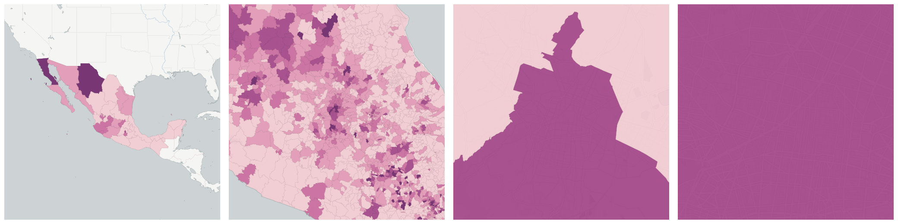](../../_images/mx.inegi_columns.ECO17.png)Measure &quot;Employed female population who completed basic education&quot;  density per sq. kilometer  for one point:

    UPDATE {table_name}
      SET {new_numeric_column} =
        OBS_GetMeasure(
          CDB_LatLng(40.7, -73.9),
          'mx.inegi_columns.ECO17'
        );

Measure &quot;Employed female population who completed basic education&quot; within an area:

    UPDATE {table_name}
      SET {new_numeric_column} =
        OBS_GetMeasure(
          ST_Buffer(CDB_LatLng(40.7, -73.9), 0.01),
          'mx.inegi_columns.ECO17'
        );

Measure &quot;Employed female population who completed basic education&quot; percent of &quot;Employed female&quot; at one point:

    UPDATE {table_name}
      SET {new_numeric_column} =
        OBS_GetMeasure(
          CDB_LatLng(40.7, -73.9),
          'mx.inegi_columns.ECO17',
          'denominator'
        );

Measure &quot;Employed female population who completed basic education&quot; percent of &quot;Employed female&quot; within an area:

    UPDATE {table_name}
      SET {new_numeric_column} =
        OBS_GetMeasure(
          ST_Buffer(CDB_LatLng(40.7, -73.9), 0.01),
          'mx.inegi_columns.ECO17',
          'denominator'
        );

* denominator: mx.inegi_columns.ECO5

* denominator: [Employed population who completed basic education](#mx-inegi-columns-eco16)

#### Employed female population with a high school degree

[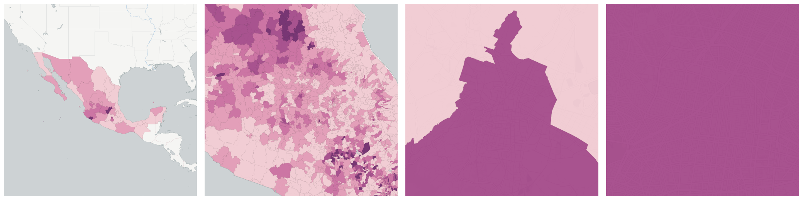](../../_images/mx.inegi_columns.ECO20.png)Measure &quot;Employed female population with a high school degree&quot;  density per sq. kilometer  for one point:

    UPDATE {table_name}
      SET {new_numeric_column} =
        OBS_GetMeasure(
          CDB_LatLng(40.7, -73.9),
          'mx.inegi_columns.ECO20'
        );

Measure &quot;Employed female population with a high school degree&quot; within an area:

    UPDATE {table_name}
      SET {new_numeric_column} =
        OBS_GetMeasure(
          ST_Buffer(CDB_LatLng(40.7, -73.9), 0.01),
          'mx.inegi_columns.ECO20'
        );

Measure &quot;Employed female population with a high school degree&quot; percent of &quot;Employed population with a high school degree&quot; at one point:

    UPDATE {table_name}
      SET {new_numeric_column} =
        OBS_GetMeasure(
          CDB_LatLng(40.7, -73.9),
          'mx.inegi_columns.ECO20',
          'denominator'
        );

Measure &quot;Employed female population with a high school degree&quot; percent of &quot;Employed population with a high school degree&quot; within an area:

    UPDATE {table_name}
      SET {new_numeric_column} =
        OBS_GetMeasure(
          ST_Buffer(CDB_LatLng(40.7, -73.9), 0.01),
          'mx.inegi_columns.ECO20',
          'denominator'
        );

* denominator: [Employed population with a high school degree](#mx-inegi-columns-eco19)

* denominator: mx.inegi_columns.ECO5

#### Employed female population with a university degree or more

Measure &quot;Employed female population with a university degree or more&quot;  density per sq. kilometer  for one point:

    UPDATE {table_name}
      SET {new_numeric_column} =
        OBS_GetMeasure(
          CDB_LatLng(40.7, -73.9),
          'mx.inegi_columns.ECO23'
        );

Measure &quot;Employed female population with a university degree or more&quot; within an area:

    UPDATE {table_name}
      SET {new_numeric_column} =
        OBS_GetMeasure(
          ST_Buffer(CDB_LatLng(40.7, -73.9), 0.01),
          'mx.inegi_columns.ECO23'
        );

Measure &quot;Employed female population with a university degree or more&quot; percent of &quot;Employed female&quot; at one point:

    UPDATE {table_name}
      SET {new_numeric_column} =
        OBS_GetMeasure(
          CDB_LatLng(40.7, -73.9),
          'mx.inegi_columns.ECO23',
          'denominator'
        );

Measure &quot;Employed female population with a university degree or more&quot; percent of &quot;Employed female&quot; within an area:

    UPDATE {table_name}
      SET {new_numeric_column} =
        OBS_GetMeasure(
          ST_Buffer(CDB_LatLng(40.7, -73.9), 0.01),
          'mx.inegi_columns.ECO23',
          'denominator'
        );

* denominator: mx.inegi_columns.ECO5

* denominator: [Employed population with a university degree or more](#mx-inegi-columns-eco22)

#### Employed female population with incomplete secondary education

[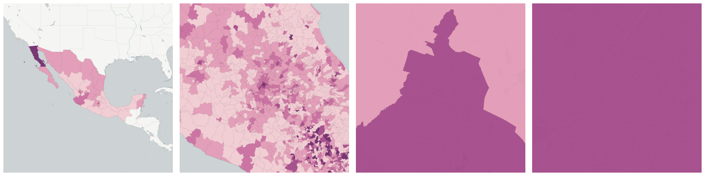](../../_images/mx.inegi_columns.ECO14.png)Measure &quot;Employed female population with incomplete secondary education&quot;  density per sq. kilometer  for one point:

    UPDATE {table_name}
      SET {new_numeric_column} =
        OBS_GetMeasure(
          CDB_LatLng(40.7, -73.9),
          'mx.inegi_columns.ECO14'
        );

Measure &quot;Employed female population with incomplete secondary education&quot; within an area:

    UPDATE {table_name}
      SET {new_numeric_column} =
        OBS_GetMeasure(
          ST_Buffer(CDB_LatLng(40.7, -73.9), 0.01),
          'mx.inegi_columns.ECO14'
        );

Measure &quot;Employed female population with incomplete secondary education&quot; percent of &quot;Employed population with incomplete secondary education&quot; at one point:

    UPDATE {table_name}
      SET {new_numeric_column} =
        OBS_GetMeasure(
          CDB_LatLng(40.7, -73.9),
          'mx.inegi_columns.ECO14',
          'denominator'
        );

Measure &quot;Employed female population with incomplete secondary education&quot; percent of &quot;Employed population with incomplete secondary education&quot; within an area:

    UPDATE {table_name}
      SET {new_numeric_column} =
        OBS_GetMeasure(
          ST_Buffer(CDB_LatLng(40.7, -73.9), 0.01),
          'mx.inegi_columns.ECO14',
          'denominator'
        );

* denominator: [Employed population with incomplete secondary education](#mx-inegi-columns-eco13)

* denominator: mx.inegi_columns.ECO5

#### Employed female population with primary education

Measure &quot;Employed female population with primary education&quot;  density per sq. kilometer  for one point:

    UPDATE {table_name}
      SET {new_numeric_column} =
        OBS_GetMeasure(
          CDB_LatLng(40.7, -73.9),
          'mx.inegi_columns.ECO11'
        );

Measure &quot;Employed female population with primary education&quot; within an area:

    UPDATE {table_name}
      SET {new_numeric_column} =
        OBS_GetMeasure(
          ST_Buffer(CDB_LatLng(40.7, -73.9), 0.01),
          'mx.inegi_columns.ECO11'
        );

Measure &quot;Employed female population with primary education&quot; percent of &quot;Employed population with primary education&quot; at one point:

    UPDATE {table_name}
      SET {new_numeric_column} =
        OBS_GetMeasure(
          CDB_LatLng(40.7, -73.9),
          'mx.inegi_columns.ECO11',
          'denominator'
        );

Measure &quot;Employed female population with primary education&quot; percent of &quot;Employed population with primary education&quot; within an area:

    UPDATE {table_name}
      SET {new_numeric_column} =
        OBS_GetMeasure(
          ST_Buffer(CDB_LatLng(40.7, -73.9), 0.01),
          'mx.inegi_columns.ECO11',
          'denominator'
        );

* denominator: [Employed population with primary education](#mx-inegi-columns-eco10)

* denominator: mx.inegi_columns.ECO5

#### Employed female population without schooling

[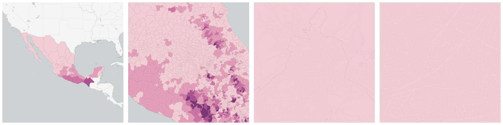](../../_images/mx.inegi_columns.ECO8.png)Measure &quot;Employed female population without schooling&quot;  density per sq. kilometer  for one point:

    UPDATE {table_name}
      SET {new_numeric_column} =
        OBS_GetMeasure(
          CDB_LatLng(40.7, -73.9),
          'mx.inegi_columns.ECO8'
        );

Measure &quot;Employed female population without schooling&quot; within an area:

    UPDATE {table_name}
      SET {new_numeric_column} =
        OBS_GetMeasure(
          ST_Buffer(CDB_LatLng(40.7, -73.9), 0.01),
          'mx.inegi_columns.ECO8'
        );

Measure &quot;Employed female population without schooling&quot; percent of &quot;Employed population without schooling&quot; at one point:

    UPDATE {table_name}
      SET {new_numeric_column} =
        OBS_GetMeasure(
          CDB_LatLng(40.7, -73.9),
          'mx.inegi_columns.ECO8',
          'denominator'
        );

Measure &quot;Employed female population without schooling&quot; percent of &quot;Employed population without schooling&quot; within an area:

    UPDATE {table_name}
      SET {new_numeric_column} =
        OBS_GetMeasure(
          ST_Buffer(CDB_LatLng(40.7, -73.9), 0.01),
          'mx.inegi_columns.ECO8',
          'denominator'
        );

* denominator: [Employed population without schooling](#mx-inegi-columns-eco7)

* denominator: mx.inegi_columns.ECO5

#### Unemployed female

Measure &quot;Unemployed female&quot;  density per sq. kilometer  for one point:

    UPDATE {table_name}
      SET {new_numeric_column} =
        OBS_GetMeasure(
          CDB_LatLng(40.7, -73.9),
          'mx.inegi_columns.ECO26'
        );

Measure &quot;Unemployed female&quot; within an area:

    UPDATE {table_name}
      SET {new_numeric_column} =
        OBS_GetMeasure(
          ST_Buffer(CDB_LatLng(40.7, -73.9), 0.01),
          'mx.inegi_columns.ECO26'
        );

Measure &quot;Unemployed female&quot; percent of &quot;Unemployed&quot; at one point:

    UPDATE {table_name}
      SET {new_numeric_column} =
        OBS_GetMeasure(
          CDB_LatLng(40.7, -73.9),
          'mx.inegi_columns.ECO26',
          'denominator'
        );

Measure &quot;Unemployed female&quot; percent of &quot;Unemployed&quot; within an area:

    UPDATE {table_name}
      SET {new_numeric_column} =
        OBS_GetMeasure(
          ST_Buffer(CDB_LatLng(40.7, -73.9), 0.01),
          'mx.inegi_columns.ECO26',
          'denominator'
        );

* denominator: [Unemployed](#mx-inegi-columns-eco25)

* denominator: [Economically active female population](#mx-inegi-columns-eco2)

### Economically active male population

Measure &quot;Economically active male population&quot;  density per sq. kilometer  for one point:

    UPDATE {table_name}
      SET {new_numeric_column} =
        OBS_GetMeasure(
          CDB_LatLng(40.7, -73.9),
          'mx.inegi_columns.ECO3'
        );

Measure &quot;Economically active male population&quot; within an area:

    UPDATE {table_name}
      SET {new_numeric_column} =
        OBS_GetMeasure(
          ST_Buffer(CDB_LatLng(40.7, -73.9), 0.01),
          'mx.inegi_columns.ECO3'
        );

Measure &quot;Economically active male population&quot; percent of &quot;Economically active population&quot; at one point:

    UPDATE {table_name}
      SET {new_numeric_column} =
        OBS_GetMeasure(
          CDB_LatLng(40.7, -73.9),
          'mx.inegi_columns.ECO3',
          'denominator'
        );

Measure &quot;Economically active male population&quot; percent of &quot;Economically active population&quot; within an area:

    UPDATE {table_name}
      SET {new_numeric_column} =
        OBS_GetMeasure(
          ST_Buffer(CDB_LatLng(40.7, -73.9), 0.01),
          'mx.inegi_columns.ECO3',
          'denominator'
        );

* denominator: [Economically active population](#mx-inegi-columns-eco1)

* denominator: [Male population](../age_gender/#mx-inegi-columns-pob57)

Subcolumns of Economically active male population

- [Employed male](#employed-male)

- [Employed male population who completed basic education](#employed-male-population-who-completed-basic-education)

- [Employed male population with a high school degree](#employed-male-population-with-a-high-school-degree)

- [Employed male population with a university degree or more](#employed-male-population-with-a-university-degree-or-more)

- [Employed male population with incomplete secondary education](#employed-male-population-with-incomplete-secondary-education)

- [Employed male population with primary education](#employed-male-population-with-primary-education)

- [Employed male population without schooling](#employed-male-population-without-schooling)

- [Unemployed male](#unemployed-male)

#### Employed male

[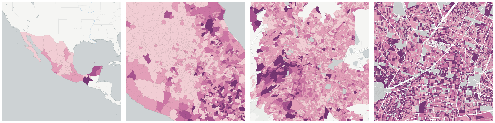](../../_images/mx.inegi_columns.ECO6.png)Measure &quot;Employed male&quot;  density per sq. kilometer  for one point:

    UPDATE {table_name}
      SET {new_numeric_column} =
        OBS_GetMeasure(
          CDB_LatLng(40.7, -73.9),
          'mx.inegi_columns.ECO6'
        );

Measure &quot;Employed male&quot; within an area:

    UPDATE {table_name}
      SET {new_numeric_column} =
        OBS_GetMeasure(
          ST_Buffer(CDB_LatLng(40.7, -73.9), 0.01),
          'mx.inegi_columns.ECO6'
        );

Measure &quot;Employed male&quot; percent of &quot;Economically active male population&quot; at one point:

    UPDATE {table_name}
      SET {new_numeric_column} =
        OBS_GetMeasure(
          CDB_LatLng(40.7, -73.9),
          'mx.inegi_columns.ECO6',
          'denominator'
        );

Measure &quot;Employed male&quot; percent of &quot;Economically active male population&quot; within an area:

    UPDATE {table_name}
      SET {new_numeric_column} =
        OBS_GetMeasure(
          ST_Buffer(CDB_LatLng(40.7, -73.9), 0.01),
          'mx.inegi_columns.ECO6',
          'denominator'
        );

* denominator: [Economically active male population](#mx-inegi-columns-eco3)

* denominator: [Employed](#mx-inegi-columns-eco4)

#### Employed male population who completed basic education

Measure &quot;Employed male population who completed basic education&quot;  density per sq. kilometer  for one point:

    UPDATE {table_name}
      SET {new_numeric_column} =
        OBS_GetMeasure(
          CDB_LatLng(40.7, -73.9),
          'mx.inegi_columns.ECO18'
        );

Measure &quot;Employed male population who completed basic education&quot; within an area:

    UPDATE {table_name}
      SET {new_numeric_column} =
        OBS_GetMeasure(
          ST_Buffer(CDB_LatLng(40.7, -73.9), 0.01),
          'mx.inegi_columns.ECO18'
        );

Measure &quot;Employed male population who completed basic education&quot; percent of &quot;Employed male&quot; at one point:

    UPDATE {table_name}
      SET {new_numeric_column} =
        OBS_GetMeasure(
          CDB_LatLng(40.7, -73.9),
          'mx.inegi_columns.ECO18',
          'denominator'
        );

Measure &quot;Employed male population who completed basic education&quot; percent of &quot;Employed male&quot; within an area:

    UPDATE {table_name}
      SET {new_numeric_column} =
        OBS_GetMeasure(
          ST_Buffer(CDB_LatLng(40.7, -73.9), 0.01),
          'mx.inegi_columns.ECO18',
          'denominator'
        );

* denominator: mx.inegi_columns.ECO6

* denominator: [Employed population who completed basic education](#mx-inegi-columns-eco16)

#### Employed male population with a high school degree

[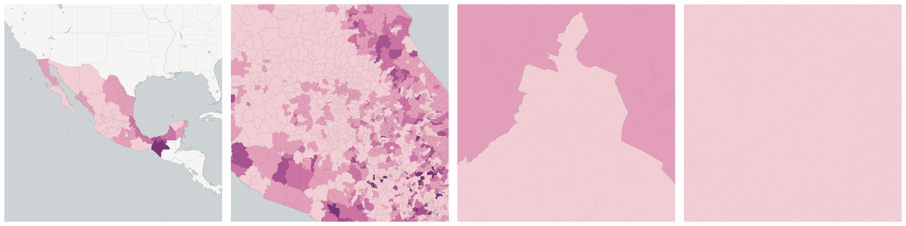](../../_images/mx.inegi_columns.ECO21.png)Measure &quot;Employed male population with a high school degree&quot;  density per sq. kilometer  for one point:

    UPDATE {table_name}
      SET {new_numeric_column} =
        OBS_GetMeasure(
          CDB_LatLng(40.7, -73.9),
          'mx.inegi_columns.ECO21'
        );

Measure &quot;Employed male population with a high school degree&quot; within an area:

    UPDATE {table_name}
      SET {new_numeric_column} =
        OBS_GetMeasure(
          ST_Buffer(CDB_LatLng(40.7, -73.9), 0.01),
          'mx.inegi_columns.ECO21'
        );

Measure &quot;Employed male population with a high school degree&quot; percent of &quot;Employed population with a high school degree&quot; at one point:

    UPDATE {table_name}
      SET {new_numeric_column} =
        OBS_GetMeasure(
          CDB_LatLng(40.7, -73.9),
          'mx.inegi_columns.ECO21',
          'denominator'
        );

Measure &quot;Employed male population with a high school degree&quot; percent of &quot;Employed population with a high school degree&quot; within an area:

    UPDATE {table_name}
      SET {new_numeric_column} =
        OBS_GetMeasure(
          ST_Buffer(CDB_LatLng(40.7, -73.9), 0.01),
          'mx.inegi_columns.ECO21',
          'denominator'
        );

* denominator: [Employed population with a high school degree](#mx-inegi-columns-eco19)

* denominator: mx.inegi_columns.ECO6

#### Employed male population with a university degree or more

[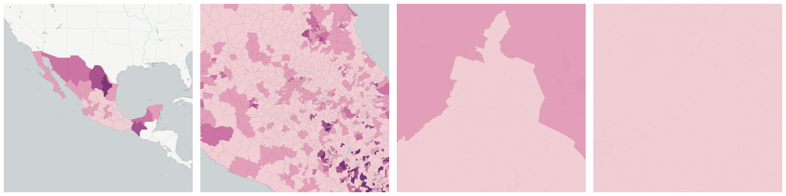](../../_images/mx.inegi_columns.ECO24.png)Measure &quot;Employed male population with a university degree or more&quot;  density per sq. kilometer  for one point:

    UPDATE {table_name}
      SET {new_numeric_column} =
        OBS_GetMeasure(
          CDB_LatLng(40.7, -73.9),
          'mx.inegi_columns.ECO24'
        );

Measure &quot;Employed male population with a university degree or more&quot; within an area:

    UPDATE {table_name}
      SET {new_numeric_column} =
        OBS_GetMeasure(
          ST_Buffer(CDB_LatLng(40.7, -73.9), 0.01),
          'mx.inegi_columns.ECO24'
        );

Measure &quot;Employed male population with a university degree or more&quot; percent of &quot;Employed male&quot; at one point:

    UPDATE {table_name}
      SET {new_numeric_column} =
        OBS_GetMeasure(
          CDB_LatLng(40.7, -73.9),
          'mx.inegi_columns.ECO24',
          'denominator'
        );

Measure &quot;Employed male population with a university degree or more&quot; percent of &quot;Employed male&quot; within an area:

    UPDATE {table_name}
      SET {new_numeric_column} =
        OBS_GetMeasure(
          ST_Buffer(CDB_LatLng(40.7, -73.9), 0.01),
          'mx.inegi_columns.ECO24',
          'denominator'
        );

* denominator: mx.inegi_columns.ECO6

* denominator: [Employed population with a university degree or more](#mx-inegi-columns-eco22)

#### Employed male population with incomplete secondary education

Measure &quot;Employed male population with incomplete secondary education&quot;  density per sq. kilometer  for one point:

    UPDATE {table_name}
      SET {new_numeric_column} =
        OBS_GetMeasure(
          CDB_LatLng(40.7, -73.9),
          'mx.inegi_columns.ECO15'
        );

Measure &quot;Employed male population with incomplete secondary education&quot; within an area:

    UPDATE {table_name}
      SET {new_numeric_column} =
        OBS_GetMeasure(
          ST_Buffer(CDB_LatLng(40.7, -73.9), 0.01),
          'mx.inegi_columns.ECO15'
        );

Measure &quot;Employed male population with incomplete secondary education&quot; percent of &quot;Employed population with incomplete secondary education&quot; at one point:

    UPDATE {table_name}
      SET {new_numeric_column} =
        OBS_GetMeasure(
          CDB_LatLng(40.7, -73.9),
          'mx.inegi_columns.ECO15',
          'denominator'
        );

Measure &quot;Employed male population with incomplete secondary education&quot; percent of &quot;Employed population with incomplete secondary education&quot; within an area:

    UPDATE {table_name}
      SET {new_numeric_column} =
        OBS_GetMeasure(
          ST_Buffer(CDB_LatLng(40.7, -73.9), 0.01),
          'mx.inegi_columns.ECO15',
          'denominator'
        );

* denominator: [Employed population with incomplete secondary education](#mx-inegi-columns-eco13)

* denominator: mx.inegi_columns.ECO6

#### Employed male population with primary education

[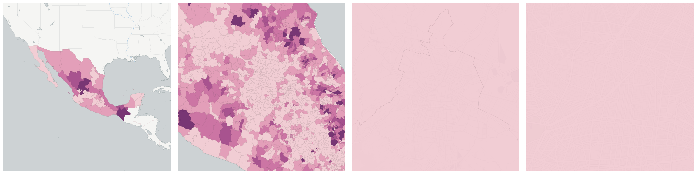](../../_images/mx.inegi_columns.ECO12.png)Measure &quot;Employed male population with primary education&quot;  density per sq. kilometer  for one point:

    UPDATE {table_name}
      SET {new_numeric_column} =
        OBS_GetMeasure(
          CDB_LatLng(40.7, -73.9),
          'mx.inegi_columns.ECO12'
        );

Measure &quot;Employed male population with primary education&quot; within an area:

    UPDATE {table_name}
      SET {new_numeric_column} =
        OBS_GetMeasure(
          ST_Buffer(CDB_LatLng(40.7, -73.9), 0.01),
          'mx.inegi_columns.ECO12'
        );

Measure &quot;Employed male population with primary education&quot; percent of &quot;Employed population with primary education&quot; at one point:

    UPDATE {table_name}
      SET {new_numeric_column} =
        OBS_GetMeasure(
          CDB_LatLng(40.7, -73.9),
          'mx.inegi_columns.ECO12',
          'denominator'
        );

Measure &quot;Employed male population with primary education&quot; percent of &quot;Employed population with primary education&quot; within an area:

    UPDATE {table_name}
      SET {new_numeric_column} =
        OBS_GetMeasure(
          ST_Buffer(CDB_LatLng(40.7, -73.9), 0.01),
          'mx.inegi_columns.ECO12',
          'denominator'
        );

* denominator: [Employed population with primary education](#mx-inegi-columns-eco10)

* denominator: mx.inegi_columns.ECO6

#### Employed male population without schooling

Measure &quot;Employed male population without schooling&quot;  density per sq. kilometer  for one point:

    UPDATE {table_name}
      SET {new_numeric_column} =
        OBS_GetMeasure(
          CDB_LatLng(40.7, -73.9),
          'mx.inegi_columns.ECO9'
        );

Measure &quot;Employed male population without schooling&quot; within an area:

    UPDATE {table_name}
      SET {new_numeric_column} =
        OBS_GetMeasure(
          ST_Buffer(CDB_LatLng(40.7, -73.9), 0.01),
          'mx.inegi_columns.ECO9'
        );

Measure &quot;Employed male population without schooling&quot; percent of &quot;Employed population without schooling&quot; at one point:

    UPDATE {table_name}
      SET {new_numeric_column} =
        OBS_GetMeasure(
          CDB_LatLng(40.7, -73.9),
          'mx.inegi_columns.ECO9',
          'denominator'
        );

Measure &quot;Employed male population without schooling&quot; percent of &quot;Employed population without schooling&quot; within an area:

    UPDATE {table_name}
      SET {new_numeric_column} =
        OBS_GetMeasure(
          ST_Buffer(CDB_LatLng(40.7, -73.9), 0.01),
          'mx.inegi_columns.ECO9',
          'denominator'
        );

* denominator: [Employed population without schooling](#mx-inegi-columns-eco7)

* denominator: mx.inegi_columns.ECO6

#### Unemployed male

Measure &quot;Unemployed male&quot;  density per sq. kilometer  for one point:

    UPDATE {table_name}
      SET {new_numeric_column} =
        OBS_GetMeasure(
          CDB_LatLng(40.7, -73.9),
          'mx.inegi_columns.ECO27'
        );

Measure &quot;Unemployed male&quot; within an area:

    UPDATE {table_name}
      SET {new_numeric_column} =
        OBS_GetMeasure(
          ST_Buffer(CDB_LatLng(40.7, -73.9), 0.01),
          'mx.inegi_columns.ECO27'
        );

Measure &quot;Unemployed male&quot; percent of &quot;Unemployed&quot; at one point:

    UPDATE {table_name}
      SET {new_numeric_column} =
        OBS_GetMeasure(
          CDB_LatLng(40.7, -73.9),
          'mx.inegi_columns.ECO27',
          'denominator'
        );

Measure &quot;Unemployed male&quot; percent of &quot;Unemployed&quot; within an area:

    UPDATE {table_name}
      SET {new_numeric_column} =
        OBS_GetMeasure(
          ST_Buffer(CDB_LatLng(40.7, -73.9), 0.01),
          'mx.inegi_columns.ECO27',
          'denominator'
        );

* denominator: [Unemployed](#mx-inegi-columns-eco25)

* denominator: [Economically active male population](#mx-inegi-columns-eco3)

### Employed

Measure &quot;Employed&quot;  density per sq. kilometer  for one point:

    UPDATE {table_name}
      SET {new_numeric_column} =
        OBS_GetMeasure(
          CDB_LatLng(40.7, -73.9),
          'mx.inegi_columns.ECO4'
        );

Measure &quot;Employed&quot; within an area:

    UPDATE {table_name}
      SET {new_numeric_column} =
        OBS_GetMeasure(
          ST_Buffer(CDB_LatLng(40.7, -73.9), 0.01),
          'mx.inegi_columns.ECO4'
        );

Measure &quot;Employed&quot; percent of &quot;Economically active population&quot; at one point:

    UPDATE {table_name}
      SET {new_numeric_column} =
        OBS_GetMeasure(
          CDB_LatLng(40.7, -73.9),
          'mx.inegi_columns.ECO4',
          'denominator'
        );

Measure &quot;Employed&quot; percent of &quot;Economically active population&quot; within an area:

    UPDATE {table_name}
      SET {new_numeric_column} =
        OBS_GetMeasure(
          ST_Buffer(CDB_LatLng(40.7, -73.9), 0.01),
          'mx.inegi_columns.ECO4',
          'denominator'
        );

* denominator: [Economically active population](#mx-inegi-columns-eco1)

Subcolumns of Employed

- [Employed female](#id1)

- [Employed female population who completed basic education](#id4)

- [Employed female population with a high school degree](#id6)

- [Employed female population with a university degree or more](#id8)

- [Employed female population with incomplete secondary education](#id10)

- [Employed female population with primary education](#id12)

- [Employed female population without schooling](#id14)

- [Employed male](#id16)

- [Employed male population who completed basic education](#id19)

- [Employed male population with a high school degree](#id21)

- [Employed male population with a university degree or more](#id23)

- [Employed male population with incomplete secondary education](#id25)

- [Employed male population with primary education](#id27)

- [Employed male population without schooling](#id29)

- [Employed population who completed basic education](#employed-population-who-completed-basic-education)

- [Employed female population who completed basic education](#id31)

- [Employed male population who completed basic education](#id33)

- [Employed population with a high school degree](#employed-population-with-a-high-school-degree)

- [Employed female population with a high school degree](#id35)

- [Employed male population with a high school degree](#id37)

- [Employed population with a university degree or more](#employed-population-with-a-university-degree-or-more)

- [Employed female population with a university degree or more](#id39)

- [Employed male population with a university degree or more](#id41)

- [Employed population with incomplete secondary education](#employed-population-with-incomplete-secondary-education)

- [Employed female population with incomplete secondary education](#id43)

- [Employed male population with incomplete secondary education](#id45)

- [Employed population with primary education](#employed-population-with-primary-education)

- [Employed female population with primary education](#id47)

- [Employed male population with primary education](#id49)

- [Employed population without schooling](#employed-population-without-schooling)

- [Employed female population without schooling](#id51)

- [Employed male population without schooling](#id53)

#### Employed female

Measure &quot;Employed female&quot;  density per sq. kilometer  for one point:

    UPDATE {table_name}
      SET {new_numeric_column} =
        OBS_GetMeasure(
          CDB_LatLng(40.7, -73.9),
          'mx.inegi_columns.ECO5'
        );

Measure &quot;Employed female&quot; within an area:

    UPDATE {table_name}
      SET {new_numeric_column} =
        OBS_GetMeasure(
          ST_Buffer(CDB_LatLng(40.7, -73.9), 0.01),
          'mx.inegi_columns.ECO5'
        );

Measure &quot;Employed female&quot; percent of &quot;Economically active female population&quot; at one point:

    UPDATE {table_name}
      SET {new_numeric_column} =
        OBS_GetMeasure(
          CDB_LatLng(40.7, -73.9),
          'mx.inegi_columns.ECO5',
          'denominator'
        );

Measure &quot;Employed female&quot; percent of &quot;Economically active female population&quot; within an area:

    UPDATE {table_name}
      SET {new_numeric_column} =
        OBS_GetMeasure(
          ST_Buffer(CDB_LatLng(40.7, -73.9), 0.01),
          'mx.inegi_columns.ECO5',
          'denominator'
        );

* denominator: [Economically active female population](#mx-inegi-columns-eco2)

* denominator: [Employed](#mx-inegi-columns-eco4)

#### Employed female population who completed basic education

Measure &quot;Employed female population who completed basic education&quot;  density per sq. kilometer  for one point:

    UPDATE {table_name}
      SET {new_numeric_column} =
        OBS_GetMeasure(
          CDB_LatLng(40.7, -73.9),
          'mx.inegi_columns.ECO17'
        );

Measure &quot;Employed female population who completed basic education&quot; within an area:

    UPDATE {table_name}
      SET {new_numeric_column} =
        OBS_GetMeasure(
          ST_Buffer(CDB_LatLng(40.7, -73.9), 0.01),
          'mx.inegi_columns.ECO17'
        );

Measure &quot;Employed female population who completed basic education&quot; percent of &quot;Employed female&quot; at one point:

    UPDATE {table_name}
      SET {new_numeric_column} =
        OBS_GetMeasure(
          CDB_LatLng(40.7, -73.9),
          'mx.inegi_columns.ECO17',
          'denominator'
        );

Measure &quot;Employed female population who completed basic education&quot; percent of &quot;Employed female&quot; within an area:

    UPDATE {table_name}
      SET {new_numeric_column} =
        OBS_GetMeasure(
          ST_Buffer(CDB_LatLng(40.7, -73.9), 0.01),
          'mx.inegi_columns.ECO17',
          'denominator'
        );

* denominator: mx.inegi_columns.ECO5

* denominator: [Employed population who completed basic education](#mx-inegi-columns-eco16)

#### Employed female population with a high school degree

Measure &quot;Employed female population with a high school degree&quot;  density per sq. kilometer  for one point:

    UPDATE {table_name}
      SET {new_numeric_column} =
        OBS_GetMeasure(
          CDB_LatLng(40.7, -73.9),
          'mx.inegi_columns.ECO20'
        );

Measure &quot;Employed female population with a high school degree&quot; within an area:

    UPDATE {table_name}
      SET {new_numeric_column} =
        OBS_GetMeasure(
          ST_Buffer(CDB_LatLng(40.7, -73.9), 0.01),
          'mx.inegi_columns.ECO20'
        );

Measure &quot;Employed female population with a high school degree&quot; percent of &quot;Employed population with a high school degree&quot; at one point:

    UPDATE {table_name}
      SET {new_numeric_column} =
        OBS_GetMeasure(
          CDB_LatLng(40.7, -73.9),
          'mx.inegi_columns.ECO20',
          'denominator'
        );

Measure &quot;Employed female population with a high school degree&quot; percent of &quot;Employed population with a high school degree&quot; within an area:

    UPDATE {table_name}
      SET {new_numeric_column} =
        OBS_GetMeasure(
          ST_Buffer(CDB_LatLng(40.7, -73.9), 0.01),
          'mx.inegi_columns.ECO20',
          'denominator'
        );

* denominator: [Employed population with a high school degree](#mx-inegi-columns-eco19)

* denominator: mx.inegi_columns.ECO5

#### Employed female population with a university degree or more

Measure &quot;Employed female population with a university degree or more&quot;  density per sq. kilometer  for one point:

    UPDATE {table_name}
      SET {new_numeric_column} =
        OBS_GetMeasure(
          CDB_LatLng(40.7, -73.9),
          'mx.inegi_columns.ECO23'
        );

Measure &quot;Employed female population with a university degree or more&quot; within an area:

    UPDATE {table_name}
      SET {new_numeric_column} =
        OBS_GetMeasure(
          ST_Buffer(CDB_LatLng(40.7, -73.9), 0.01),
          'mx.inegi_columns.ECO23'
        );

Measure &quot;Employed female population with a university degree or more&quot; percent of &quot;Employed female&quot; at one point:

    UPDATE {table_name}
      SET {new_numeric_column} =
        OBS_GetMeasure(
          CDB_LatLng(40.7, -73.9),
          'mx.inegi_columns.ECO23',
          'denominator'
        );

Measure &quot;Employed female population with a university degree or more&quot; percent of &quot;Employed female&quot; within an area:

    UPDATE {table_name}
      SET {new_numeric_column} =
        OBS_GetMeasure(
          ST_Buffer(CDB_LatLng(40.7, -73.9), 0.01),
          'mx.inegi_columns.ECO23',
          'denominator'
        );

* denominator: mx.inegi_columns.ECO5

* denominator: [Employed population with a university degree or more](#mx-inegi-columns-eco22)

#### Employed female population with incomplete secondary education

Measure &quot;Employed female population with incomplete secondary education&quot;  density per sq. kilometer  for one point:

    UPDATE {table_name}
      SET {new_numeric_column} =
        OBS_GetMeasure(
          CDB_LatLng(40.7, -73.9),
          'mx.inegi_columns.ECO14'
        );

Measure &quot;Employed female population with incomplete secondary education&quot; within an area:

    UPDATE {table_name}
      SET {new_numeric_column} =
        OBS_GetMeasure(
          ST_Buffer(CDB_LatLng(40.7, -73.9), 0.01),
          'mx.inegi_columns.ECO14'
        );

Measure &quot;Employed female population with incomplete secondary education&quot; percent of &quot;Employed population with incomplete secondary education&quot; at one point:

    UPDATE {table_name}
      SET {new_numeric_column} =
        OBS_GetMeasure(
          CDB_LatLng(40.7, -73.9),
          'mx.inegi_columns.ECO14',
          'denominator'
        );

Measure &quot;Employed female population with incomplete secondary education&quot; percent of &quot;Employed population with incomplete secondary education&quot; within an area:

    UPDATE {table_name}
      SET {new_numeric_column} =
        OBS_GetMeasure(
          ST_Buffer(CDB_LatLng(40.7, -73.9), 0.01),
          'mx.inegi_columns.ECO14',
          'denominator'
        );

* denominator: [Employed population with incomplete secondary education](#mx-inegi-columns-eco13)

* denominator: mx.inegi_columns.ECO5

#### Employed female population with primary education

Measure &quot;Employed female population with primary education&quot;  density per sq. kilometer  for one point:

    UPDATE {table_name}
      SET {new_numeric_column} =
        OBS_GetMeasure(
          CDB_LatLng(40.7, -73.9),
          'mx.inegi_columns.ECO11'
        );

Measure &quot;Employed female population with primary education&quot; within an area:

    UPDATE {table_name}
      SET {new_numeric_column} =
        OBS_GetMeasure(
          ST_Buffer(CDB_LatLng(40.7, -73.9), 0.01),
          'mx.inegi_columns.ECO11'
        );

Measure &quot;Employed female population with primary education&quot; percent of &quot;Employed population with primary education&quot; at one point:

    UPDATE {table_name}
      SET {new_numeric_column} =
        OBS_GetMeasure(
          CDB_LatLng(40.7, -73.9),
          'mx.inegi_columns.ECO11',
          'denominator'
        );

Measure &quot;Employed female population with primary education&quot; percent of &quot;Employed population with primary education&quot; within an area:

    UPDATE {table_name}
      SET {new_numeric_column} =
        OBS_GetMeasure(
          ST_Buffer(CDB_LatLng(40.7, -73.9), 0.01),
          'mx.inegi_columns.ECO11',
          'denominator'
        );

* denominator: [Employed population with primary education](#mx-inegi-columns-eco10)

* denominator: mx.inegi_columns.ECO5

#### Employed female population without schooling

Measure &quot;Employed female population without schooling&quot;  density per sq. kilometer  for one point:

    UPDATE {table_name}
      SET {new_numeric_column} =
        OBS_GetMeasure(
          CDB_LatLng(40.7, -73.9),
          'mx.inegi_columns.ECO8'
        );

Measure &quot;Employed female population without schooling&quot; within an area:

    UPDATE {table_name}
      SET {new_numeric_column} =
        OBS_GetMeasure(
          ST_Buffer(CDB_LatLng(40.7, -73.9), 0.01),
          'mx.inegi_columns.ECO8'
        );

Measure &quot;Employed female population without schooling&quot; percent of &quot;Employed population without schooling&quot; at one point:

    UPDATE {table_name}
      SET {new_numeric_column} =
        OBS_GetMeasure(
          CDB_LatLng(40.7, -73.9),
          'mx.inegi_columns.ECO8',
          'denominator'
        );

Measure &quot;Employed female population without schooling&quot; percent of &quot;Employed population without schooling&quot; within an area:

    UPDATE {table_name}
      SET {new_numeric_column} =
        OBS_GetMeasure(
          ST_Buffer(CDB_LatLng(40.7, -73.9), 0.01),
          'mx.inegi_columns.ECO8',
          'denominator'
        );

* denominator: [Employed population without schooling](#mx-inegi-columns-eco7)

* denominator: mx.inegi_columns.ECO5

#### Employed male

Measure &quot;Employed male&quot;  density per sq. kilometer  for one point:

    UPDATE {table_name}
      SET {new_numeric_column} =
        OBS_GetMeasure(
          CDB_LatLng(40.7, -73.9),
          'mx.inegi_columns.ECO6'
        );

Measure &quot;Employed male&quot; within an area:

    UPDATE {table_name}
      SET {new_numeric_column} =
        OBS_GetMeasure(
          ST_Buffer(CDB_LatLng(40.7, -73.9), 0.01),
          'mx.inegi_columns.ECO6'
        );

Measure &quot;Employed male&quot; percent of &quot;Economically active male population&quot; at one point:

    UPDATE {table_name}
      SET {new_numeric_column} =
        OBS_GetMeasure(
          CDB_LatLng(40.7, -73.9),
          'mx.inegi_columns.ECO6',
          'denominator'
        );

Measure &quot;Employed male&quot; percent of &quot;Economically active male population&quot; within an area:

    UPDATE {table_name}
      SET {new_numeric_column} =
        OBS_GetMeasure(
          ST_Buffer(CDB_LatLng(40.7, -73.9), 0.01),
          'mx.inegi_columns.ECO6',
          'denominator'
        );

* denominator: [Economically active male population](#mx-inegi-columns-eco3)

* denominator: [Employed](#mx-inegi-columns-eco4)

#### Employed male population who completed basic education

Measure &quot;Employed male population who completed basic education&quot;  density per sq. kilometer  for one point:

    UPDATE {table_name}
      SET {new_numeric_column} =
        OBS_GetMeasure(
          CDB_LatLng(40.7, -73.9),
          'mx.inegi_columns.ECO18'
        );

Measure &quot;Employed male population who completed basic education&quot; within an area:

    UPDATE {table_name}
      SET {new_numeric_column} =
        OBS_GetMeasure(
          ST_Buffer(CDB_LatLng(40.7, -73.9), 0.01),
          'mx.inegi_columns.ECO18'
        );

Measure &quot;Employed male population who completed basic education&quot; percent of &quot;Employed male&quot; at one point:

    UPDATE {table_name}
      SET {new_numeric_column} =
        OBS_GetMeasure(
          CDB_LatLng(40.7, -73.9),
          'mx.inegi_columns.ECO18',
          'denominator'
        );

Measure &quot;Employed male population who completed basic education&quot; percent of &quot;Employed male&quot; within an area:

    UPDATE {table_name}
      SET {new_numeric_column} =
        OBS_GetMeasure(
          ST_Buffer(CDB_LatLng(40.7, -73.9), 0.01),
          'mx.inegi_columns.ECO18',
          'denominator'
        );

* denominator: mx.inegi_columns.ECO6

* denominator: [Employed population who completed basic education](#mx-inegi-columns-eco16)

#### Employed male population with a high school degree

Measure &quot;Employed male population with a high school degree&quot;  density per sq. kilometer  for one point:

    UPDATE {table_name}
      SET {new_numeric_column} =
        OBS_GetMeasure(
          CDB_LatLng(40.7, -73.9),
          'mx.inegi_columns.ECO21'
        );

Measure &quot;Employed male population with a high school degree&quot; within an area:

    UPDATE {table_name}
      SET {new_numeric_column} =
        OBS_GetMeasure(
          ST_Buffer(CDB_LatLng(40.7, -73.9), 0.01),
          'mx.inegi_columns.ECO21'
        );

Measure &quot;Employed male population with a high school degree&quot; percent of &quot;Employed population with a high school degree&quot; at one point:

    UPDATE {table_name}
      SET {new_numeric_column} =
        OBS_GetMeasure(
          CDB_LatLng(40.7, -73.9),
          'mx.inegi_columns.ECO21',
          'denominator'
        );

Measure &quot;Employed male population with a high school degree&quot; percent of &quot;Employed population with a high school degree&quot; within an area:

    UPDATE {table_name}
      SET {new_numeric_column} =
        OBS_GetMeasure(
          ST_Buffer(CDB_LatLng(40.7, -73.9), 0.01),
          'mx.inegi_columns.ECO21',
          'denominator'
        );

* denominator: [Employed population with a high school degree](#mx-inegi-columns-eco19)

* denominator: mx.inegi_columns.ECO6

#### Employed male population with a university degree or more

Measure &quot;Employed male population with a university degree or more&quot;  density per sq. kilometer  for one point:

    UPDATE {table_name}
      SET {new_numeric_column} =
        OBS_GetMeasure(
          CDB_LatLng(40.7, -73.9),
          'mx.inegi_columns.ECO24'
        );

Measure &quot;Employed male population with a university degree or more&quot; within an area:

    UPDATE {table_name}
      SET {new_numeric_column} =
        OBS_GetMeasure(
          ST_Buffer(CDB_LatLng(40.7, -73.9), 0.01),
          'mx.inegi_columns.ECO24'
        );

Measure &quot;Employed male population with a university degree or more&quot; percent of &quot;Employed male&quot; at one point:

    UPDATE {table_name}
      SET {new_numeric_column} =
        OBS_GetMeasure(
          CDB_LatLng(40.7, -73.9),
          'mx.inegi_columns.ECO24',
          'denominator'
        );

Measure &quot;Employed male population with a university degree or more&quot; percent of &quot;Employed male&quot; within an area:

    UPDATE {table_name}
      SET {new_numeric_column} =
        OBS_GetMeasure(
          ST_Buffer(CDB_LatLng(40.7, -73.9), 0.01),
          'mx.inegi_columns.ECO24',
          'denominator'
        );

* denominator: mx.inegi_columns.ECO6

* denominator: [Employed population with a university degree or more](#mx-inegi-columns-eco22)

#### Employed male population with incomplete secondary education

Measure &quot;Employed male population with incomplete secondary education&quot;  density per sq. kilometer  for one point:

    UPDATE {table_name}
      SET {new_numeric_column} =
        OBS_GetMeasure(
          CDB_LatLng(40.7, -73.9),
          'mx.inegi_columns.ECO15'
        );

Measure &quot;Employed male population with incomplete secondary education&quot; within an area:

    UPDATE {table_name}
      SET {new_numeric_column} =
        OBS_GetMeasure(
          ST_Buffer(CDB_LatLng(40.7, -73.9), 0.01),
          'mx.inegi_columns.ECO15'
        );

Measure &quot;Employed male population with incomplete secondary education&quot; percent of &quot;Employed population with incomplete secondary education&quot; at one point:

    UPDATE {table_name}
      SET {new_numeric_column} =
        OBS_GetMeasure(
          CDB_LatLng(40.7, -73.9),
          'mx.inegi_columns.ECO15',
          'denominator'
        );

Measure &quot;Employed male population with incomplete secondary education&quot; percent of &quot;Employed population with incomplete secondary education&quot; within an area:

    UPDATE {table_name}
      SET {new_numeric_column} =
        OBS_GetMeasure(
          ST_Buffer(CDB_LatLng(40.7, -73.9), 0.01),
          'mx.inegi_columns.ECO15',
          'denominator'
        );

* denominator: [Employed population with incomplete secondary education](#mx-inegi-columns-eco13)

* denominator: mx.inegi_columns.ECO6

#### Employed male population with primary education

Measure &quot;Employed male population with primary education&quot;  density per sq. kilometer  for one point:

    UPDATE {table_name}
      SET {new_numeric_column} =
        OBS_GetMeasure(
          CDB_LatLng(40.7, -73.9),
          'mx.inegi_columns.ECO12'
        );

Measure &quot;Employed male population with primary education&quot; within an area:

    UPDATE {table_name}
      SET {new_numeric_column} =
        OBS_GetMeasure(
          ST_Buffer(CDB_LatLng(40.7, -73.9), 0.01),
          'mx.inegi_columns.ECO12'
        );

Measure &quot;Employed male population with primary education&quot; percent of &quot;Employed population with primary education&quot; at one point:

    UPDATE {table_name}
      SET {new_numeric_column} =
        OBS_GetMeasure(
          CDB_LatLng(40.7, -73.9),
          'mx.inegi_columns.ECO12',
          'denominator'
        );

Measure &quot;Employed male population with primary education&quot; percent of &quot;Employed population with primary education&quot; within an area:

    UPDATE {table_name}
      SET {new_numeric_column} =
        OBS_GetMeasure(
          ST_Buffer(CDB_LatLng(40.7, -73.9), 0.01),
          'mx.inegi_columns.ECO12',
          'denominator'
        );

* denominator: [Employed population with primary education](#mx-inegi-columns-eco10)

* denominator: mx.inegi_columns.ECO6

#### Employed male population without schooling

Measure &quot;Employed male population without schooling&quot;  density per sq. kilometer  for one point:

    UPDATE {table_name}
      SET {new_numeric_column} =
        OBS_GetMeasure(
          CDB_LatLng(40.7, -73.9),
          'mx.inegi_columns.ECO9'
        );

Measure &quot;Employed male population without schooling&quot; within an area:

    UPDATE {table_name}
      SET {new_numeric_column} =
        OBS_GetMeasure(
          ST_Buffer(CDB_LatLng(40.7, -73.9), 0.01),
          'mx.inegi_columns.ECO9'
        );

Measure &quot;Employed male population without schooling&quot; percent of &quot;Employed population without schooling&quot; at one point:

    UPDATE {table_name}
      SET {new_numeric_column} =
        OBS_GetMeasure(
          CDB_LatLng(40.7, -73.9),
          'mx.inegi_columns.ECO9',
          'denominator'
        );

Measure &quot;Employed male population without schooling&quot; percent of &quot;Employed population without schooling&quot; within an area:

    UPDATE {table_name}
      SET {new_numeric_column} =
        OBS_GetMeasure(
          ST_Buffer(CDB_LatLng(40.7, -73.9), 0.01),
          'mx.inegi_columns.ECO9',
          'denominator'
        );

* denominator: [Employed population without schooling](#mx-inegi-columns-eco7)

* denominator: mx.inegi_columns.ECO6

#### Employed population who completed basic education

[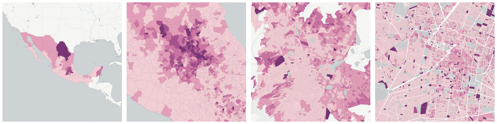](../../_images/mx.inegi_columns.ECO16.png)Measure &quot;Employed population who completed basic education&quot;  density per sq. kilometer  for one point:

    UPDATE {table_name}
      SET {new_numeric_column} =
        OBS_GetMeasure(
          CDB_LatLng(40.7, -73.9),
          'mx.inegi_columns.ECO16'
        );

Measure &quot;Employed population who completed basic education&quot; within an area:

    UPDATE {table_name}
      SET {new_numeric_column} =
        OBS_GetMeasure(
          ST_Buffer(CDB_LatLng(40.7, -73.9), 0.01),
          'mx.inegi_columns.ECO16'
        );

Measure &quot;Employed population who completed basic education&quot; percent of &quot;Employed&quot; at one point:

    UPDATE {table_name}
      SET {new_numeric_column} =
        OBS_GetMeasure(
          CDB_LatLng(40.7, -73.9),
          'mx.inegi_columns.ECO16',
          'denominator'
        );

Measure &quot;Employed population who completed basic education&quot; percent of &quot;Employed&quot; within an area:

    UPDATE {table_name}
      SET {new_numeric_column} =
        OBS_GetMeasure(
          ST_Buffer(CDB_LatLng(40.7, -73.9), 0.01),
          'mx.inegi_columns.ECO16',
          'denominator'
        );

* denominator: [Employed](#mx-inegi-columns-eco4)

#### Employed female population who completed basic education

Measure &quot;Employed female population who completed basic education&quot;  density per sq. kilometer  for one point:

    UPDATE {table_name}
      SET {new_numeric_column} =
        OBS_GetMeasure(
          CDB_LatLng(40.7, -73.9),
          'mx.inegi_columns.ECO17'
        );

Measure &quot;Employed female population who completed basic education&quot; within an area:

    UPDATE {table_name}
      SET {new_numeric_column} =
        OBS_GetMeasure(
          ST_Buffer(CDB_LatLng(40.7, -73.9), 0.01),
          'mx.inegi_columns.ECO17'
        );

Measure &quot;Employed female population who completed basic education&quot; percent of &quot;Employed female&quot; at one point:

    UPDATE {table_name}
      SET {new_numeric_column} =
        OBS_GetMeasure(
          CDB_LatLng(40.7, -73.9),
          'mx.inegi_columns.ECO17',
          'denominator'
        );

Measure &quot;Employed female population who completed basic education&quot; percent of &quot;Employed female&quot; within an area:

    UPDATE {table_name}
      SET {new_numeric_column} =
        OBS_GetMeasure(
          ST_Buffer(CDB_LatLng(40.7, -73.9), 0.01),
          'mx.inegi_columns.ECO17',
          'denominator'
        );

* denominator: mx.inegi_columns.ECO5

* denominator: [Employed population who completed basic education](#mx-inegi-columns-eco16)

#### Employed male population who completed basic education

Measure &quot;Employed male population who completed basic education&quot;  density per sq. kilometer  for one point:

    UPDATE {table_name}
      SET {new_numeric_column} =
        OBS_GetMeasure(
          CDB_LatLng(40.7, -73.9),
          'mx.inegi_columns.ECO18'
        );

Measure &quot;Employed male population who completed basic education&quot; within an area:

    UPDATE {table_name}
      SET {new_numeric_column} =
        OBS_GetMeasure(
          ST_Buffer(CDB_LatLng(40.7, -73.9), 0.01),
          'mx.inegi_columns.ECO18'
        );

Measure &quot;Employed male population who completed basic education&quot; percent of &quot;Employed male&quot; at one point:

    UPDATE {table_name}
      SET {new_numeric_column} =
        OBS_GetMeasure(
          CDB_LatLng(40.7, -73.9),
          'mx.inegi_columns.ECO18',
          'denominator'
        );

Measure &quot;Employed male population who completed basic education&quot; percent of &quot;Employed male&quot; within an area:

    UPDATE {table_name}
      SET {new_numeric_column} =
        OBS_GetMeasure(
          ST_Buffer(CDB_LatLng(40.7, -73.9), 0.01),
          'mx.inegi_columns.ECO18',
          'denominator'
        );

* denominator: mx.inegi_columns.ECO6

* denominator: [Employed population who completed basic education](#mx-inegi-columns-eco16)

#### Employed population with a high school degree

Measure &quot;Employed population with a high school degree&quot;  density per sq. kilometer  for one point:

    UPDATE {table_name}
      SET {new_numeric_column} =
        OBS_GetMeasure(
          CDB_LatLng(40.7, -73.9),
          'mx.inegi_columns.ECO19'
        );

Measure &quot;Employed population with a high school degree&quot; within an area:

    UPDATE {table_name}
      SET {new_numeric_column} =
        OBS_GetMeasure(
          ST_Buffer(CDB_LatLng(40.7, -73.9), 0.01),
          'mx.inegi_columns.ECO19'
        );

Measure &quot;Employed population with a high school degree&quot; percent of &quot;Employed&quot; at one point:

    UPDATE {table_name}
      SET {new_numeric_column} =
        OBS_GetMeasure(
          CDB_LatLng(40.7, -73.9),
          'mx.inegi_columns.ECO19',
          'denominator'
        );

Measure &quot;Employed population with a high school degree&quot; percent of &quot;Employed&quot; within an area:

    UPDATE {table_name}
      SET {new_numeric_column} =
        OBS_GetMeasure(
          ST_Buffer(CDB_LatLng(40.7, -73.9), 0.01),
          'mx.inegi_columns.ECO19',
          'denominator'
        );

* denominator: [Employed](#mx-inegi-columns-eco4)

#### Employed female population with a high school degree

Measure &quot;Employed female population with a high school degree&quot;  density per sq. kilometer  for one point:

    UPDATE {table_name}
      SET {new_numeric_column} =
        OBS_GetMeasure(
          CDB_LatLng(40.7, -73.9),
          'mx.inegi_columns.ECO20'
        );

Measure &quot;Employed female population with a high school degree&quot; within an area:

    UPDATE {table_name}
      SET {new_numeric_column} =
        OBS_GetMeasure(
          ST_Buffer(CDB_LatLng(40.7, -73.9), 0.01),
          'mx.inegi_columns.ECO20'
        );

Measure &quot;Employed female population with a high school degree&quot; percent of &quot;Employed population with a high school degree&quot; at one point:

    UPDATE {table_name}
      SET {new_numeric_column} =
        OBS_GetMeasure(
          CDB_LatLng(40.7, -73.9),
          'mx.inegi_columns.ECO20',
          'denominator'
        );

Measure &quot;Employed female population with a high school degree&quot; percent of &quot;Employed population with a high school degree&quot; within an area:

    UPDATE {table_name}
      SET {new_numeric_column} =
        OBS_GetMeasure(
          ST_Buffer(CDB_LatLng(40.7, -73.9), 0.01),
          'mx.inegi_columns.ECO20',
          'denominator'
        );

* denominator: [Employed population with a high school degree](#mx-inegi-columns-eco19)

* denominator: mx.inegi_columns.ECO5

#### Employed male population with a high school degree

Measure &quot;Employed male population with a high school degree&quot;  density per sq. kilometer  for one point:

    UPDATE {table_name}
      SET {new_numeric_column} =
        OBS_GetMeasure(
          CDB_LatLng(40.7, -73.9),
          'mx.inegi_columns.ECO21'
        );

Measure &quot;Employed male population with a high school degree&quot; within an area:

    UPDATE {table_name}
      SET {new_numeric_column} =
        OBS_GetMeasure(
          ST_Buffer(CDB_LatLng(40.7, -73.9), 0.01),
          'mx.inegi_columns.ECO21'
        );

Measure &quot;Employed male population with a high school degree&quot; percent of &quot;Employed population with a high school degree&quot; at one point:

    UPDATE {table_name}
      SET {new_numeric_column} =
        OBS_GetMeasure(
          CDB_LatLng(40.7, -73.9),
          'mx.inegi_columns.ECO21',
          'denominator'
        );

Measure &quot;Employed male population with a high school degree&quot; percent of &quot;Employed population with a high school degree&quot; within an area:

    UPDATE {table_name}
      SET {new_numeric_column} =
        OBS_GetMeasure(
          ST_Buffer(CDB_LatLng(40.7, -73.9), 0.01),
          'mx.inegi_columns.ECO21',
          'denominator'
        );

* denominator: [Employed population with a high school degree](#mx-inegi-columns-eco19)

* denominator: mx.inegi_columns.ECO6

#### Employed population with a university degree or more

Measure &quot;Employed population with a university degree or more&quot;  density per sq. kilometer  for one point:

    UPDATE {table_name}
      SET {new_numeric_column} =
        OBS_GetMeasure(
          CDB_LatLng(40.7, -73.9),
          'mx.inegi_columns.ECO22'
        );

Measure &quot;Employed population with a university degree or more&quot; within an area:

    UPDATE {table_name}
      SET {new_numeric_column} =
        OBS_GetMeasure(
          ST_Buffer(CDB_LatLng(40.7, -73.9), 0.01),
          'mx.inegi_columns.ECO22'
        );

Measure &quot;Employed population with a university degree or more&quot; percent of &quot;Employed&quot; at one point:

    UPDATE {table_name}
      SET {new_numeric_column} =
        OBS_GetMeasure(
          CDB_LatLng(40.7, -73.9),
          'mx.inegi_columns.ECO22',
          'denominator'
        );

Measure &quot;Employed population with a university degree or more&quot; percent of &quot;Employed&quot; within an area:

    UPDATE {table_name}
      SET {new_numeric_column} =
        OBS_GetMeasure(
          ST_Buffer(CDB_LatLng(40.7, -73.9), 0.01),
          'mx.inegi_columns.ECO22',
          'denominator'
        );

* denominator: [Employed](#mx-inegi-columns-eco4)

#### Employed female population with a university degree or more

Measure &quot;Employed female population with a university degree or more&quot;  density per sq. kilometer  for one point:

    UPDATE {table_name}
      SET {new_numeric_column} =
        OBS_GetMeasure(
          CDB_LatLng(40.7, -73.9),
          'mx.inegi_columns.ECO23'
        );

Measure &quot;Employed female population with a university degree or more&quot; within an area:

    UPDATE {table_name}
      SET {new_numeric_column} =
        OBS_GetMeasure(
          ST_Buffer(CDB_LatLng(40.7, -73.9), 0.01),
          'mx.inegi_columns.ECO23'
        );

Measure &quot;Employed female population with a university degree or more&quot; percent of &quot;Employed female&quot; at one point:

    UPDATE {table_name}
      SET {new_numeric_column} =
        OBS_GetMeasure(
          CDB_LatLng(40.7, -73.9),
          'mx.inegi_columns.ECO23',
          'denominator'
        );

Measure &quot;Employed female population with a university degree or more&quot; percent of &quot;Employed female&quot; within an area:

    UPDATE {table_name}
      SET {new_numeric_column} =
        OBS_GetMeasure(
          ST_Buffer(CDB_LatLng(40.7, -73.9), 0.01),
          'mx.inegi_columns.ECO23',
          'denominator'
        );

* denominator: mx.inegi_columns.ECO5

* denominator: [Employed population with a university degree or more](#mx-inegi-columns-eco22)

#### Employed male population with a university degree or more

Measure &quot;Employed male population with a university degree or more&quot;  density per sq. kilometer  for one point:

    UPDATE {table_name}
      SET {new_numeric_column} =
        OBS_GetMeasure(
          CDB_LatLng(40.7, -73.9),
          'mx.inegi_columns.ECO24'
        );

Measure &quot;Employed male population with a university degree or more&quot; within an area:

    UPDATE {table_name}
      SET {new_numeric_column} =
        OBS_GetMeasure(
          ST_Buffer(CDB_LatLng(40.7, -73.9), 0.01),
          'mx.inegi_columns.ECO24'
        );

Measure &quot;Employed male population with a university degree or more&quot; percent of &quot;Employed male&quot; at one point:

    UPDATE {table_name}
      SET {new_numeric_column} =
        OBS_GetMeasure(
          CDB_LatLng(40.7, -73.9),
          'mx.inegi_columns.ECO24',
          'denominator'
        );

Measure &quot;Employed male population with a university degree or more&quot; percent of &quot;Employed male&quot; within an area:

    UPDATE {table_name}
      SET {new_numeric_column} =
        OBS_GetMeasure(
          ST_Buffer(CDB_LatLng(40.7, -73.9), 0.01),
          'mx.inegi_columns.ECO24',
          'denominator'
        );

* denominator: mx.inegi_columns.ECO6

* denominator: [Employed population with a university degree or more](#mx-inegi-columns-eco22)

#### Employed population with incomplete secondary education

[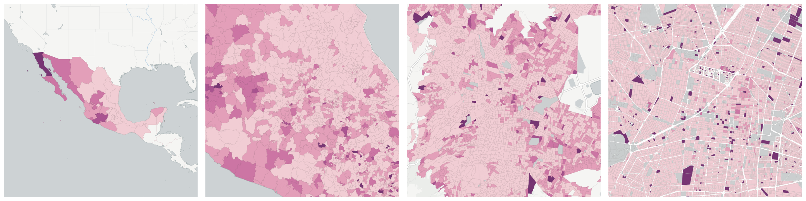](../../_images/mx.inegi_columns.ECO13.png)Measure &quot;Employed population with incomplete secondary education&quot;  density per sq. kilometer  for one point:

    UPDATE {table_name}
      SET {new_numeric_column} =
        OBS_GetMeasure(
          CDB_LatLng(40.7, -73.9),
          'mx.inegi_columns.ECO13'
        );

Measure &quot;Employed population with incomplete secondary education&quot; within an area:

    UPDATE {table_name}
      SET {new_numeric_column} =
        OBS_GetMeasure(
          ST_Buffer(CDB_LatLng(40.7, -73.9), 0.01),
          'mx.inegi_columns.ECO13'
        );

Measure &quot;Employed population with incomplete secondary education&quot; percent of &quot;Employed&quot; at one point:

    UPDATE {table_name}
      SET {new_numeric_column} =
        OBS_GetMeasure(
          CDB_LatLng(40.7, -73.9),
          'mx.inegi_columns.ECO13',
          'denominator'
        );

Measure &quot;Employed population with incomplete secondary education&quot; percent of &quot;Employed&quot; within an area:

    UPDATE {table_name}
      SET {new_numeric_column} =
        OBS_GetMeasure(
          ST_Buffer(CDB_LatLng(40.7, -73.9), 0.01),
          'mx.inegi_columns.ECO13',
          'denominator'
        );

* denominator: [Employed](#mx-inegi-columns-eco4)

#### Employed female population with incomplete secondary education

Measure &quot;Employed female population with incomplete secondary education&quot;  density per sq. kilometer  for one point:

    UPDATE {table_name}
      SET {new_numeric_column} =
        OBS_GetMeasure(
          CDB_LatLng(40.7, -73.9),
          'mx.inegi_columns.ECO14'
        );

Measure &quot;Employed female population with incomplete secondary education&quot; within an area:

    UPDATE {table_name}
      SET {new_numeric_column} =
        OBS_GetMeasure(
          ST_Buffer(CDB_LatLng(40.7, -73.9), 0.01),
          'mx.inegi_columns.ECO14'
        );

Measure &quot;Employed female population with incomplete secondary education&quot; percent of &quot;Employed population with incomplete secondary education&quot; at one point:

    UPDATE {table_name}
      SET {new_numeric_column} =
        OBS_GetMeasure(
          CDB_LatLng(40.7, -73.9),
          'mx.inegi_columns.ECO14',
          'denominator'
        );

Measure &quot;Employed female population with incomplete secondary education&quot; percent of &quot;Employed population with incomplete secondary education&quot; within an area:

    UPDATE {table_name}
      SET {new_numeric_column} =
        OBS_GetMeasure(
          ST_Buffer(CDB_LatLng(40.7, -73.9), 0.01),
          'mx.inegi_columns.ECO14',
          'denominator'
        );

* denominator: [Employed population with incomplete secondary education](#mx-inegi-columns-eco13)

* denominator: mx.inegi_columns.ECO5

#### Employed male population with incomplete secondary education

Measure &quot;Employed male population with incomplete secondary education&quot;  density per sq. kilometer  for one point:

    UPDATE {table_name}
      SET {new_numeric_column} =
        OBS_GetMeasure(
          CDB_LatLng(40.7, -73.9),
          'mx.inegi_columns.ECO15'
        );

Measure &quot;Employed male population with incomplete secondary education&quot; within an area:

    UPDATE {table_name}
      SET {new_numeric_column} =
        OBS_GetMeasure(
          ST_Buffer(CDB_LatLng(40.7, -73.9), 0.01),
          'mx.inegi_columns.ECO15'
        );

Measure &quot;Employed male population with incomplete secondary education&quot; percent of &quot;Employed population with incomplete secondary education&quot; at one point:

    UPDATE {table_name}
      SET {new_numeric_column} =
        OBS_GetMeasure(
          CDB_LatLng(40.7, -73.9),
          'mx.inegi_columns.ECO15',
          'denominator'
        );

Measure &quot;Employed male population with incomplete secondary education&quot; percent of &quot;Employed population with incomplete secondary education&quot; within an area:

    UPDATE {table_name}
      SET {new_numeric_column} =
        OBS_GetMeasure(
          ST_Buffer(CDB_LatLng(40.7, -73.9), 0.01),
          'mx.inegi_columns.ECO15',
          'denominator'
        );

* denominator: [Employed population with incomplete secondary education](#mx-inegi-columns-eco13)

* denominator: mx.inegi_columns.ECO6

#### Employed population with primary education

[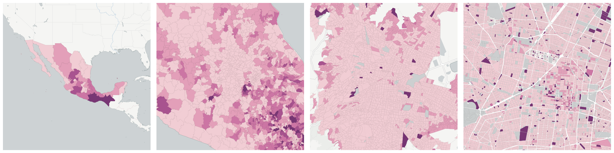](../../_images/mx.inegi_columns.ECO10.png)Measure &quot;Employed population with primary education&quot;  density per sq. kilometer  for one point:

    UPDATE {table_name}
      SET {new_numeric_column} =
        OBS_GetMeasure(
          CDB_LatLng(40.7, -73.9),
          'mx.inegi_columns.ECO10'
        );

Measure &quot;Employed population with primary education&quot; within an area:

    UPDATE {table_name}
      SET {new_numeric_column} =
        OBS_GetMeasure(
          ST_Buffer(CDB_LatLng(40.7, -73.9), 0.01),
          'mx.inegi_columns.ECO10'
        );

Measure &quot;Employed population with primary education&quot; percent of &quot;Employed&quot; at one point:

    UPDATE {table_name}
      SET {new_numeric_column} =
        OBS_GetMeasure(
          CDB_LatLng(40.7, -73.9),
          'mx.inegi_columns.ECO10',
          'denominator'
        );

Measure &quot;Employed population with primary education&quot; percent of &quot;Employed&quot; within an area:

    UPDATE {table_name}
      SET {new_numeric_column} =
        OBS_GetMeasure(
          ST_Buffer(CDB_LatLng(40.7, -73.9), 0.01),
          'mx.inegi_columns.ECO10',
          'denominator'
        );

* denominator: [Employed](#mx-inegi-columns-eco4)

#### Employed female population with primary education

Measure &quot;Employed female population with primary education&quot;  density per sq. kilometer  for one point:

    UPDATE {table_name}
      SET {new_numeric_column} =
        OBS_GetMeasure(
          CDB_LatLng(40.7, -73.9),
          'mx.inegi_columns.ECO11'
        );

Measure &quot;Employed female population with primary education&quot; within an area:

    UPDATE {table_name}
      SET {new_numeric_column} =
        OBS_GetMeasure(
          ST_Buffer(CDB_LatLng(40.7, -73.9), 0.01),
          'mx.inegi_columns.ECO11'
        );

Measure &quot;Employed female population with primary education&quot; percent of &quot;Employed population with primary education&quot; at one point:

    UPDATE {table_name}
      SET {new_numeric_column} =
        OBS_GetMeasure(
          CDB_LatLng(40.7, -73.9),
          'mx.inegi_columns.ECO11',
          'denominator'
        );

Measure &quot;Employed female population with primary education&quot; percent of &quot;Employed population with primary education&quot; within an area:

    UPDATE {table_name}
      SET {new_numeric_column} =
        OBS_GetMeasure(
          ST_Buffer(CDB_LatLng(40.7, -73.9), 0.01),
          'mx.inegi_columns.ECO11',
          'denominator'
        );

* denominator: [Employed population with primary education](#mx-inegi-columns-eco10)

* denominator: mx.inegi_columns.ECO5

#### Employed male population with primary education

Measure &quot;Employed male population with primary education&quot;  density per sq. kilometer  for one point:

    UPDATE {table_name}
      SET {new_numeric_column} =
        OBS_GetMeasure(
          CDB_LatLng(40.7, -73.9),
          'mx.inegi_columns.ECO12'
        );

Measure &quot;Employed male population with primary education&quot; within an area:

    UPDATE {table_name}
      SET {new_numeric_column} =
        OBS_GetMeasure(
          ST_Buffer(CDB_LatLng(40.7, -73.9), 0.01),
          'mx.inegi_columns.ECO12'
        );

Measure &quot;Employed male population with primary education&quot; percent of &quot;Employed population with primary education&quot; at one point:

    UPDATE {table_name}
      SET {new_numeric_column} =
        OBS_GetMeasure(
          CDB_LatLng(40.7, -73.9),
          'mx.inegi_columns.ECO12',
          'denominator'
        );

Measure &quot;Employed male population with primary education&quot; percent of &quot;Employed population with primary education&quot; within an area:

    UPDATE {table_name}
      SET {new_numeric_column} =
        OBS_GetMeasure(
          ST_Buffer(CDB_LatLng(40.7, -73.9), 0.01),
          'mx.inegi_columns.ECO12',
          'denominator'
        );

* denominator: [Employed population with primary education](#mx-inegi-columns-eco10)

* denominator: mx.inegi_columns.ECO6

#### Employed population without schooling

Measure &quot;Employed population without schooling&quot;  density per sq. kilometer  for one point:

    UPDATE {table_name}
      SET {new_numeric_column} =
        OBS_GetMeasure(
          CDB_LatLng(40.7, -73.9),
          'mx.inegi_columns.ECO7'
        );

Measure &quot;Employed population without schooling&quot; within an area:

    UPDATE {table_name}
      SET {new_numeric_column} =
        OBS_GetMeasure(
          ST_Buffer(CDB_LatLng(40.7, -73.9), 0.01),
          'mx.inegi_columns.ECO7'
        );

Measure &quot;Employed population without schooling&quot; percent of &quot;Employed&quot; at one point:

    UPDATE {table_name}
      SET {new_numeric_column} =
        OBS_GetMeasure(
          CDB_LatLng(40.7, -73.9),
          'mx.inegi_columns.ECO7',
          'denominator'
        );

Measure &quot;Employed population without schooling&quot; percent of &quot;Employed&quot; within an area:

    UPDATE {table_name}
      SET {new_numeric_column} =
        OBS_GetMeasure(
          ST_Buffer(CDB_LatLng(40.7, -73.9), 0.01),
          'mx.inegi_columns.ECO7',
          'denominator'
        );

* denominator: [Employed](#mx-inegi-columns-eco4)

#### Employed female population without schooling

Measure &quot;Employed female population without schooling&quot;  density per sq. kilometer  for one point:

    UPDATE {table_name}
      SET {new_numeric_column} =
        OBS_GetMeasure(
          CDB_LatLng(40.7, -73.9),
          'mx.inegi_columns.ECO8'
        );

Measure &quot;Employed female population without schooling&quot; within an area:

    UPDATE {table_name}
      SET {new_numeric_column} =
        OBS_GetMeasure(
          ST_Buffer(CDB_LatLng(40.7, -73.9), 0.01),
          'mx.inegi_columns.ECO8'
        );

Measure &quot;Employed female population without schooling&quot; percent of &quot;Employed population without schooling&quot; at one point:

    UPDATE {table_name}
      SET {new_numeric_column} =
        OBS_GetMeasure(
          CDB_LatLng(40.7, -73.9),
          'mx.inegi_columns.ECO8',
          'denominator'
        );

Measure &quot;Employed female population without schooling&quot; percent of &quot;Employed population without schooling&quot; within an area:

    UPDATE {table_name}
      SET {new_numeric_column} =
        OBS_GetMeasure(
          ST_Buffer(CDB_LatLng(40.7, -73.9), 0.01),
          'mx.inegi_columns.ECO8',
          'denominator'
        );

* denominator: [Employed population without schooling](#mx-inegi-columns-eco7)

* denominator: mx.inegi_columns.ECO5

#### Employed male population without schooling

Measure &quot;Employed male population without schooling&quot;  density per sq. kilometer  for one point:

    UPDATE {table_name}
      SET {new_numeric_column} =
        OBS_GetMeasure(
          CDB_LatLng(40.7, -73.9),
          'mx.inegi_columns.ECO9'
        );

Measure &quot;Employed male population without schooling&quot; within an area:

    UPDATE {table_name}
      SET {new_numeric_column} =
        OBS_GetMeasure(
          ST_Buffer(CDB_LatLng(40.7, -73.9), 0.01),
          'mx.inegi_columns.ECO9'
        );

Measure &quot;Employed male population without schooling&quot; percent of &quot;Employed population without schooling&quot; at one point:

    UPDATE {table_name}
      SET {new_numeric_column} =
        OBS_GetMeasure(
          CDB_LatLng(40.7, -73.9),
          'mx.inegi_columns.ECO9',
          'denominator'
        );

Measure &quot;Employed male population without schooling&quot; percent of &quot;Employed population without schooling&quot; within an area:

    UPDATE {table_name}
      SET {new_numeric_column} =
        OBS_GetMeasure(
          ST_Buffer(CDB_LatLng(40.7, -73.9), 0.01),
          'mx.inegi_columns.ECO9',
          'denominator'
        );

* denominator: [Employed population without schooling](#mx-inegi-columns-eco7)

* denominator: mx.inegi_columns.ECO6

### Unemployed

[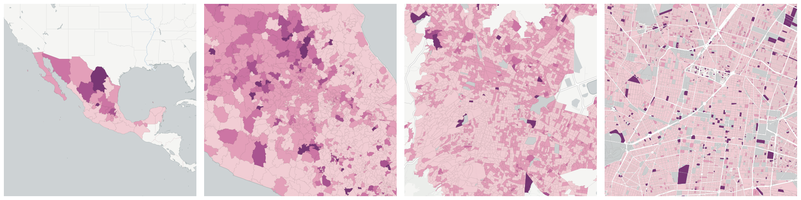](../../_images/mx.inegi_columns.ECO25.png)Measure &quot;Unemployed&quot;  density per sq. kilometer  for one point:

    UPDATE {table_name}
      SET {new_numeric_column} =
        OBS_GetMeasure(
          CDB_LatLng(40.7, -73.9),
          'mx.inegi_columns.ECO25'
        );

Measure &quot;Unemployed&quot; within an area:

    UPDATE {table_name}
      SET {new_numeric_column} =
        OBS_GetMeasure(
          ST_Buffer(CDB_LatLng(40.7, -73.9), 0.01),
          'mx.inegi_columns.ECO25'
        );

Measure &quot;Unemployed&quot; percent of &quot;Economically active population&quot; at one point:

    UPDATE {table_name}
      SET {new_numeric_column} =
        OBS_GetMeasure(
          CDB_LatLng(40.7, -73.9),
          'mx.inegi_columns.ECO25',
          'denominator'
        );

Measure &quot;Unemployed&quot; percent of &quot;Economically active population&quot; within an area:

    UPDATE {table_name}
      SET {new_numeric_column} =
        OBS_GetMeasure(
          ST_Buffer(CDB_LatLng(40.7, -73.9), 0.01),
          'mx.inegi_columns.ECO25',
          'denominator'
        );

* denominator: [Economically active population](#mx-inegi-columns-eco1)

Subcolumns of Unemployed

- [Unemployed female](#id55)

- [Unemployed male](#id57)

#### Unemployed female

Measure &quot;Unemployed female&quot;  density per sq. kilometer  for one point:

    UPDATE {table_name}
      SET {new_numeric_column} =
        OBS_GetMeasure(
          CDB_LatLng(40.7, -73.9),
          'mx.inegi_columns.ECO26'
        );

Measure &quot;Unemployed female&quot; within an area:

    UPDATE {table_name}
      SET {new_numeric_column} =
        OBS_GetMeasure(
          ST_Buffer(CDB_LatLng(40.7, -73.9), 0.01),
          'mx.inegi_columns.ECO26'
        );

Measure &quot;Unemployed female&quot; percent of &quot;Unemployed&quot; at one point:

    UPDATE {table_name}
      SET {new_numeric_column} =
        OBS_GetMeasure(
          CDB_LatLng(40.7, -73.9),
          'mx.inegi_columns.ECO26',
          'denominator'
        );

Measure &quot;Unemployed female&quot; percent of &quot;Unemployed&quot; within an area:

    UPDATE {table_name}
      SET {new_numeric_column} =
        OBS_GetMeasure(
          ST_Buffer(CDB_LatLng(40.7, -73.9), 0.01),
          'mx.inegi_columns.ECO26',
          'denominator'
        );

* denominator: [Unemployed](#mx-inegi-columns-eco25)

* denominator: [Economically active female population](#mx-inegi-columns-eco2)

#### Unemployed male

Measure &quot;Unemployed male&quot;  density per sq. kilometer  for one point:

    UPDATE {table_name}
      SET {new_numeric_column} =
        OBS_GetMeasure(
          CDB_LatLng(40.7, -73.9),
          'mx.inegi_columns.ECO27'
        );

Measure &quot;Unemployed male&quot; within an area:

    UPDATE {table_name}
      SET {new_numeric_column} =
        OBS_GetMeasure(
          ST_Buffer(CDB_LatLng(40.7, -73.9), 0.01),
          'mx.inegi_columns.ECO27'
        );

Measure &quot;Unemployed male&quot; percent of &quot;Unemployed&quot; at one point:

    UPDATE {table_name}
      SET {new_numeric_column} =
        OBS_GetMeasure(
          CDB_LatLng(40.7, -73.9),
          'mx.inegi_columns.ECO27',
          'denominator'
        );

Measure &quot;Unemployed male&quot; percent of &quot;Unemployed&quot; within an area:

    UPDATE {table_name}
      SET {new_numeric_column} =
        OBS_GetMeasure(
          ST_Buffer(CDB_LatLng(40.7, -73.9), 0.01),
          'mx.inegi_columns.ECO27',
          'denominator'
        );

* denominator: [Unemployed](#mx-inegi-columns-eco25)

* denominator: [Economically active male population](#mx-inegi-columns-eco3)

## Economically inactive

Measure &quot;Economically inactive&quot;  density per sq. kilometer  for one point:

    UPDATE {table_name}
      SET {new_numeric_column} =
        OBS_GetMeasure(
          CDB_LatLng(40.7, -73.9),
          'mx.inegi_columns.ECO28'
        );

Measure &quot;Economically inactive&quot; within an area:

    UPDATE {table_name}
      SET {new_numeric_column} =
        OBS_GetMeasure(
          ST_Buffer(CDB_LatLng(40.7, -73.9), 0.01),
          'mx.inegi_columns.ECO28'
        );

Measure &quot;Economically inactive&quot; percent of &quot;Total population&quot; at one point:

    UPDATE {table_name}
      SET {new_numeric_column} =
        OBS_GetMeasure(
          CDB_LatLng(40.7, -73.9),
          'mx.inegi_columns.ECO28',
          'denominator'
        );

Measure &quot;Economically inactive&quot; percent of &quot;Total population&quot; within an area:

    UPDATE {table_name}
      SET {new_numeric_column} =
        OBS_GetMeasure(
          ST_Buffer(CDB_LatLng(40.7, -73.9), 0.01),
          'mx.inegi_columns.ECO28',
          'denominator'
        );

* denominator: [Total population](../age_gender/#mx-inegi-columns-pob1)

Subcolumns of Economically inactive

- [Dedicated to housework](#dedicated-to-housework)

- [Economically inactive with a physical or mental limitation impeding work](#economically-inactive-with-a-physical-or-mental-limitation-impeding-work)

- [Economically inactive with some other reason that impedes work](#economically-inactive-with-some-other-reason-that-impedes-work)

- [Female economically inactive population](#female-economically-inactive-population)

- [Full time student](#full-time-student)

- [Male economically inactive population](#male-economically-inactive-population)

- [Retiree or receiving pension](#retiree-or-receiving-pension)

### Dedicated to housework

Measure &quot;Dedicated to housework&quot;  density per sq. kilometer  for one point:

    UPDATE {table_name}
      SET {new_numeric_column} =
        OBS_GetMeasure(
          CDB_LatLng(40.7, -73.9),
          'mx.inegi_columns.ECO37'
        );

Measure &quot;Dedicated to housework&quot; within an area:

    UPDATE {table_name}
      SET {new_numeric_column} =
        OBS_GetMeasure(
          ST_Buffer(CDB_LatLng(40.7, -73.9), 0.01),
          'mx.inegi_columns.ECO37'
        );

Measure &quot;Dedicated to housework&quot; percent of &quot;Economically inactive&quot; at one point:

    UPDATE {table_name}
      SET {new_numeric_column} =
        OBS_GetMeasure(
          CDB_LatLng(40.7, -73.9),
          'mx.inegi_columns.ECO37',
          'denominator'
        );

Measure &quot;Dedicated to housework&quot; percent of &quot;Economically inactive&quot; within an area:

    UPDATE {table_name}
      SET {new_numeric_column} =
        OBS_GetMeasure(
          ST_Buffer(CDB_LatLng(40.7, -73.9), 0.01),
          'mx.inegi_columns.ECO37',
          'denominator'
        );

* denominator: [Economically inactive](#mx-inegi-columns-eco28)

Subcolumns of Dedicated to housework

- [Female dedicated to housework](#female-dedicated-to-housework)

- [Male dedicated to housework](#male-dedicated-to-housework)

#### Female dedicated to housework

Measure &quot;Female dedicated to housework&quot;  density per sq. kilometer  for one point:

    UPDATE {table_name}
      SET {new_numeric_column} =
        OBS_GetMeasure(
          CDB_LatLng(40.7, -73.9),
          'mx.inegi_columns.ECO38'
        );

Measure &quot;Female dedicated to housework&quot; within an area:

    UPDATE {table_name}
      SET {new_numeric_column} =
        OBS_GetMeasure(
          ST_Buffer(CDB_LatLng(40.7, -73.9), 0.01),
          'mx.inegi_columns.ECO38'
        );

Measure &quot;Female dedicated to housework&quot; percent of &quot;Female economically inactive population&quot; at one point:

    UPDATE {table_name}
      SET {new_numeric_column} =
        OBS_GetMeasure(
          CDB_LatLng(40.7, -73.9),
          'mx.inegi_columns.ECO38',
          'denominator'
        );

Measure &quot;Female dedicated to housework&quot; percent of &quot;Female economically inactive population&quot; within an area:

    UPDATE {table_name}
      SET {new_numeric_column} =
        OBS_GetMeasure(
          ST_Buffer(CDB_LatLng(40.7, -73.9), 0.01),
          'mx.inegi_columns.ECO38',
          'denominator'
        );

* denominator: [Female economically inactive population](#mx-inegi-columns-eco29)

* denominator: [Dedicated to housework](#mx-inegi-columns-eco37)

#### Male dedicated to housework

Measure &quot;Male dedicated to housework&quot;  density per sq. kilometer  for one point:

    UPDATE {table_name}
      SET {new_numeric_column} =
        OBS_GetMeasure(
          CDB_LatLng(40.7, -73.9),
          'mx.inegi_columns.ECO39'
        );

Measure &quot;Male dedicated to housework&quot; within an area:

    UPDATE {table_name}
      SET {new_numeric_column} =
        OBS_GetMeasure(
          ST_Buffer(CDB_LatLng(40.7, -73.9), 0.01),
          'mx.inegi_columns.ECO39'
        );

Measure &quot;Male dedicated to housework&quot; percent of &quot;Male economically inactive population&quot; at one point:

    UPDATE {table_name}
      SET {new_numeric_column} =
        OBS_GetMeasure(
          CDB_LatLng(40.7, -73.9),
          'mx.inegi_columns.ECO39',
          'denominator'
        );

Measure &quot;Male dedicated to housework&quot; percent of &quot;Male economically inactive population&quot; within an area:

    UPDATE {table_name}
      SET {new_numeric_column} =
        OBS_GetMeasure(
          ST_Buffer(CDB_LatLng(40.7, -73.9), 0.01),
          'mx.inegi_columns.ECO39',
          'denominator'
        );

* denominator: [Male economically inactive population](#mx-inegi-columns-eco30)

* denominator: [Dedicated to housework](#mx-inegi-columns-eco37)

### Economically inactive with a physical or mental limitation impeding work

Measure &quot;Economically inactive with a physical or mental limitation impeding work&quot;  density per sq. kilometer  for one point:

    UPDATE {table_name}
      SET {new_numeric_column} =
        OBS_GetMeasure(
          CDB_LatLng(40.7, -73.9),
          'mx.inegi_columns.ECO40'
        );

Measure &quot;Economically inactive with a physical or mental limitation impeding work&quot; within an area:

    UPDATE {table_name}
      SET {new_numeric_column} =
        OBS_GetMeasure(
          ST_Buffer(CDB_LatLng(40.7, -73.9), 0.01),
          'mx.inegi_columns.ECO40'
        );

Measure &quot;Economically inactive with a physical or mental limitation impeding work&quot; percent of &quot;Economically inactive&quot; at one point:

    UPDATE {table_name}
      SET {new_numeric_column} =
        OBS_GetMeasure(
          CDB_LatLng(40.7, -73.9),
          'mx.inegi_columns.ECO40',
          'denominator'
        );

Measure &quot;Economically inactive with a physical or mental limitation impeding work&quot; percent of &quot;Economically inactive&quot; within an area:

    UPDATE {table_name}
      SET {new_numeric_column} =
        OBS_GetMeasure(
          ST_Buffer(CDB_LatLng(40.7, -73.9), 0.01),
          'mx.inegi_columns.ECO40',
          'denominator'
        );

* denominator: [Economically inactive](#mx-inegi-columns-eco28)

Subcolumns of Economically inactive with a physical or mental limitation impeding work

- [Female economically inactive with a physical or mental limitation impeding work](#female-economically-inactive-with-a-physical-or-mental-limitation-impeding-work)

- [Male economically inactive with a physical or mental limitation impeding work](#male-economically-inactive-with-a-physical-or-mental-limitation-impeding-work)

#### Female economically inactive with a physical or mental limitation impeding work

Measure &quot;Female economically inactive with a physical or mental limitation impeding work&quot;  density per sq. kilometer  for one point:

    UPDATE {table_name}
      SET {new_numeric_column} =
        OBS_GetMeasure(
          CDB_LatLng(40.7, -73.9),
          'mx.inegi_columns.ECO41'
        );

Measure &quot;Female economically inactive with a physical or mental limitation impeding work&quot; within an area:

    UPDATE {table_name}
      SET {new_numeric_column} =
        OBS_GetMeasure(
          ST_Buffer(CDB_LatLng(40.7, -73.9), 0.01),
          'mx.inegi_columns.ECO41'
        );

Measure &quot;Female economically inactive with a physical or mental limitation impeding work&quot; percent of &quot;Female economically inactive population&quot; at one point:

    UPDATE {table_name}
      SET {new_numeric_column} =
        OBS_GetMeasure(
          CDB_LatLng(40.7, -73.9),
          'mx.inegi_columns.ECO41',
          'denominator'
        );

Measure &quot;Female economically inactive with a physical or mental limitation impeding work&quot; percent of &quot;Female economically inactive population&quot; within an area:

    UPDATE {table_name}
      SET {new_numeric_column} =
        OBS_GetMeasure(
          ST_Buffer(CDB_LatLng(40.7, -73.9), 0.01),
          'mx.inegi_columns.ECO41',
          'denominator'
        );

* denominator: [Female economically inactive population](#mx-inegi-columns-eco29)

* denominator: [Economically inactive with a physical or mental limitation impeding work](#mx-inegi-columns-eco40)

#### Male economically inactive with a physical or mental limitation impeding work

Measure &quot;Male economically inactive with a physical or mental limitation impeding work&quot;  density per sq. kilometer  for one point:

    UPDATE {table_name}
      SET {new_numeric_column} =
        OBS_GetMeasure(
          CDB_LatLng(40.7, -73.9),
          'mx.inegi_columns.ECO42'
        );

Measure &quot;Male economically inactive with a physical or mental limitation impeding work&quot; within an area:

    UPDATE {table_name}
      SET {new_numeric_column} =
        OBS_GetMeasure(
          ST_Buffer(CDB_LatLng(40.7, -73.9), 0.01),
          'mx.inegi_columns.ECO42'
        );

Measure &quot;Male economically inactive with a physical or mental limitation impeding work&quot; percent of &quot;Male economically inactive population&quot; at one point:

    UPDATE {table_name}
      SET {new_numeric_column} =
        OBS_GetMeasure(
          CDB_LatLng(40.7, -73.9),
          'mx.inegi_columns.ECO42',
          'denominator'
        );

Measure &quot;Male economically inactive with a physical or mental limitation impeding work&quot; percent of &quot;Male economically inactive population&quot; within an area:

    UPDATE {table_name}
      SET {new_numeric_column} =
        OBS_GetMeasure(
          ST_Buffer(CDB_LatLng(40.7, -73.9), 0.01),
          'mx.inegi_columns.ECO42',
          'denominator'
        );

* denominator: [Male economically inactive population](#mx-inegi-columns-eco30)

* denominator: [Economically inactive with a physical or mental limitation impeding work](#mx-inegi-columns-eco40)

### Economically inactive with some other reason that impedes work

Measure &quot;Economically inactive with some other reason that impedes work&quot;  density per sq. kilometer  for one point:

    UPDATE {table_name}
      SET {new_numeric_column} =
        OBS_GetMeasure(
          CDB_LatLng(40.7, -73.9),
          'mx.inegi_columns.ECO43'
        );

Measure &quot;Economically inactive with some other reason that impedes work&quot; within an area:

    UPDATE {table_name}
      SET {new_numeric_column} =
        OBS_GetMeasure(
          ST_Buffer(CDB_LatLng(40.7, -73.9), 0.01),
          'mx.inegi_columns.ECO43'
        );

Measure &quot;Economically inactive with some other reason that impedes work&quot; percent of &quot;Economically inactive&quot; at one point:

    UPDATE {table_name}
      SET {new_numeric_column} =
        OBS_GetMeasure(
          CDB_LatLng(40.7, -73.9),
          'mx.inegi_columns.ECO43',
          'denominator'
        );

Measure &quot;Economically inactive with some other reason that impedes work&quot; percent of &quot;Economically inactive&quot; within an area:

    UPDATE {table_name}
      SET {new_numeric_column} =
        OBS_GetMeasure(
          ST_Buffer(CDB_LatLng(40.7, -73.9), 0.01),
          'mx.inegi_columns.ECO43',
          'denominator'
        );

* denominator: [Economically inactive](#mx-inegi-columns-eco28)

Subcolumns of Economically inactive with some other reason that impedes work

- [Female economically inactive with some other reason that impedes work](#female-economically-inactive-with-some-other-reason-that-impedes-work)

- [Male economically inactive with some other reason that impedes work](#male-economically-inactive-with-some-other-reason-that-impedes-work)

#### Female economically inactive with some other reason that impedes work

Measure &quot;Female economically inactive with some other reason that impedes work&quot;  density per sq. kilometer  for one point:

    UPDATE {table_name}
      SET {new_numeric_column} =
        OBS_GetMeasure(
          CDB_LatLng(40.7, -73.9),
          'mx.inegi_columns.ECO44'
        );

Measure &quot;Female economically inactive with some other reason that impedes work&quot; within an area:

    UPDATE {table_name}
      SET {new_numeric_column} =
        OBS_GetMeasure(
          ST_Buffer(CDB_LatLng(40.7, -73.9), 0.01),
          'mx.inegi_columns.ECO44'
        );

Measure &quot;Female economically inactive with some other reason that impedes work&quot; percent of &quot;Female economically inactive population&quot; at one point:

    UPDATE {table_name}
      SET {new_numeric_column} =
        OBS_GetMeasure(
          CDB_LatLng(40.7, -73.9),
          'mx.inegi_columns.ECO44',
          'denominator'
        );

Measure &quot;Female economically inactive with some other reason that impedes work&quot; percent of &quot;Female economically inactive population&quot; within an area:

    UPDATE {table_name}
      SET {new_numeric_column} =
        OBS_GetMeasure(
          ST_Buffer(CDB_LatLng(40.7, -73.9), 0.01),
          'mx.inegi_columns.ECO44',
          'denominator'
        );

* denominator: [Female economically inactive population](#mx-inegi-columns-eco29)

* denominator: [Economically inactive with some other reason that impedes work](#mx-inegi-columns-eco43)

#### Male economically inactive with some other reason that impedes work

Measure &quot;Male economically inactive with some other reason that impedes work&quot;  density per sq. kilometer  for one point:

    UPDATE {table_name}
      SET {new_numeric_column} =
        OBS_GetMeasure(
          CDB_LatLng(40.7, -73.9),
          'mx.inegi_columns.ECO45'
        );

Measure &quot;Male economically inactive with some other reason that impedes work&quot; within an area:

    UPDATE {table_name}
      SET {new_numeric_column} =
        OBS_GetMeasure(
          ST_Buffer(CDB_LatLng(40.7, -73.9), 0.01),
          'mx.inegi_columns.ECO45'
        );

Measure &quot;Male economically inactive with some other reason that impedes work&quot; percent of &quot;Male economically inactive population&quot; at one point:

    UPDATE {table_name}
      SET {new_numeric_column} =
        OBS_GetMeasure(
          CDB_LatLng(40.7, -73.9),
          'mx.inegi_columns.ECO45',
          'denominator'
        );

Measure &quot;Male economically inactive with some other reason that impedes work&quot; percent of &quot;Male economically inactive population&quot; within an area:

    UPDATE {table_name}
      SET {new_numeric_column} =
        OBS_GetMeasure(
          ST_Buffer(CDB_LatLng(40.7, -73.9), 0.01),
          'mx.inegi_columns.ECO45',
          'denominator'
        );

* denominator: [Male economically inactive population](#mx-inegi-columns-eco30)

* denominator: [Economically inactive with some other reason that impedes work](#mx-inegi-columns-eco43)

### Female economically inactive population

[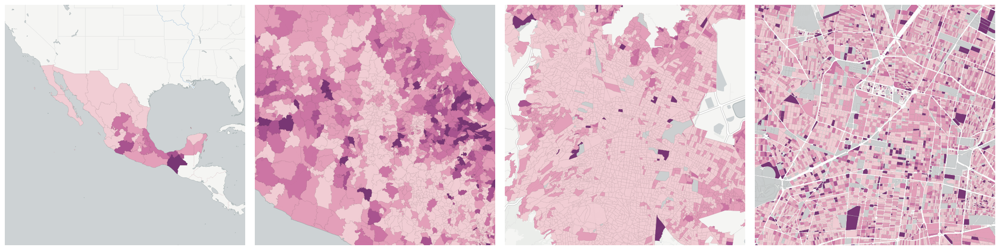](../../_images/mx.inegi_columns.ECO29.png)Measure &quot;Female economically inactive population&quot;  density per sq. kilometer  for one point:

    UPDATE {table_name}
      SET {new_numeric_column} =
        OBS_GetMeasure(
          CDB_LatLng(40.7, -73.9),
          'mx.inegi_columns.ECO29'
        );

Measure &quot;Female economically inactive population&quot; within an area:

    UPDATE {table_name}
      SET {new_numeric_column} =
        OBS_GetMeasure(
          ST_Buffer(CDB_LatLng(40.7, -73.9), 0.01),
          'mx.inegi_columns.ECO29'
        );

Measure &quot;Female economically inactive population&quot; percent of &quot;Female population&quot; at one point:

    UPDATE {table_name}
      SET {new_numeric_column} =
        OBS_GetMeasure(
          CDB_LatLng(40.7, -73.9),
          'mx.inegi_columns.ECO29',
          'denominator'
        );

Measure &quot;Female economically inactive population&quot; percent of &quot;Female population&quot; within an area:

    UPDATE {table_name}
      SET {new_numeric_column} =
        OBS_GetMeasure(
          ST_Buffer(CDB_LatLng(40.7, -73.9), 0.01),
          'mx.inegi_columns.ECO29',
          'denominator'
        );

* denominator: [Female population](../age_gender/#mx-inegi-columns-pob31)

* denominator: [Economically inactive](#mx-inegi-columns-eco28)

Subcolumns of Female economically inactive population

- [Female dedicated to housework](#id59)

- [Female economically inactive with a physical or mental limitation impeding work](#id61)

- [Female economically inactive with some other reason that impedes work](#id63)

- [Female full time student](#female-full-time-student)

- [Female retiree or receiving pension](#female-retiree-or-receiving-pension)

#### Female dedicated to housework

Measure &quot;Female dedicated to housework&quot;  density per sq. kilometer  for one point:

    UPDATE {table_name}
      SET {new_numeric_column} =
        OBS_GetMeasure(
          CDB_LatLng(40.7, -73.9),
          'mx.inegi_columns.ECO38'
        );

Measure &quot;Female dedicated to housework&quot; within an area:

    UPDATE {table_name}
      SET {new_numeric_column} =
        OBS_GetMeasure(
          ST_Buffer(CDB_LatLng(40.7, -73.9), 0.01),
          'mx.inegi_columns.ECO38'
        );

Measure &quot;Female dedicated to housework&quot; percent of &quot;Female economically inactive population&quot; at one point:

    UPDATE {table_name}
      SET {new_numeric_column} =
        OBS_GetMeasure(
          CDB_LatLng(40.7, -73.9),
          'mx.inegi_columns.ECO38',
          'denominator'
        );

Measure &quot;Female dedicated to housework&quot; percent of &quot;Female economically inactive population&quot; within an area:

    UPDATE {table_name}
      SET {new_numeric_column} =
        OBS_GetMeasure(
          ST_Buffer(CDB_LatLng(40.7, -73.9), 0.01),
          'mx.inegi_columns.ECO38',
          'denominator'
        );

* denominator: [Female economically inactive population](#mx-inegi-columns-eco29)

* denominator: [Dedicated to housework](#mx-inegi-columns-eco37)

#### Female economically inactive with a physical or mental limitation impeding work

Measure &quot;Female economically inactive with a physical or mental limitation impeding work&quot;  density per sq. kilometer  for one point:

    UPDATE {table_name}
      SET {new_numeric_column} =
        OBS_GetMeasure(
          CDB_LatLng(40.7, -73.9),
          'mx.inegi_columns.ECO41'
        );

Measure &quot;Female economically inactive with a physical or mental limitation impeding work&quot; within an area:

    UPDATE {table_name}
      SET {new_numeric_column} =
        OBS_GetMeasure(
          ST_Buffer(CDB_LatLng(40.7, -73.9), 0.01),
          'mx.inegi_columns.ECO41'
        );

Measure &quot;Female economically inactive with a physical or mental limitation impeding work&quot; percent of &quot;Female economically inactive population&quot; at one point:

    UPDATE {table_name}
      SET {new_numeric_column} =
        OBS_GetMeasure(
          CDB_LatLng(40.7, -73.9),
          'mx.inegi_columns.ECO41',
          'denominator'
        );

Measure &quot;Female economically inactive with a physical or mental limitation impeding work&quot; percent of &quot;Female economically inactive population&quot; within an area:

    UPDATE {table_name}
      SET {new_numeric_column} =
        OBS_GetMeasure(
          ST_Buffer(CDB_LatLng(40.7, -73.9), 0.01),
          'mx.inegi_columns.ECO41',
          'denominator'
        );

* denominator: [Female economically inactive population](#mx-inegi-columns-eco29)

* denominator: [Economically inactive with a physical or mental limitation impeding work](#mx-inegi-columns-eco40)

#### Female economically inactive with some other reason that impedes work

Measure &quot;Female economically inactive with some other reason that impedes work&quot;  density per sq. kilometer  for one point:

    UPDATE {table_name}
      SET {new_numeric_column} =
        OBS_GetMeasure(
          CDB_LatLng(40.7, -73.9),
          'mx.inegi_columns.ECO44'
        );

Measure &quot;Female economically inactive with some other reason that impedes work&quot; within an area:

    UPDATE {table_name}
      SET {new_numeric_column} =
        OBS_GetMeasure(
          ST_Buffer(CDB_LatLng(40.7, -73.9), 0.01),
          'mx.inegi_columns.ECO44'
        );

Measure &quot;Female economically inactive with some other reason that impedes work&quot; percent of &quot;Female economically inactive population&quot; at one point:

    UPDATE {table_name}
      SET {new_numeric_column} =
        OBS_GetMeasure(
          CDB_LatLng(40.7, -73.9),
          'mx.inegi_columns.ECO44',
          'denominator'
        );

Measure &quot;Female economically inactive with some other reason that impedes work&quot; percent of &quot;Female economically inactive population&quot; within an area:

    UPDATE {table_name}
      SET {new_numeric_column} =
        OBS_GetMeasure(
          ST_Buffer(CDB_LatLng(40.7, -73.9), 0.01),
          'mx.inegi_columns.ECO44',
          'denominator'
        );

* denominator: [Female economically inactive population](#mx-inegi-columns-eco29)

* denominator: [Economically inactive with some other reason that impedes work](#mx-inegi-columns-eco43)

#### Female full time student

Measure &quot;Female full time student&quot;  density per sq. kilometer  for one point:

    UPDATE {table_name}
      SET {new_numeric_column} =
        OBS_GetMeasure(
          CDB_LatLng(40.7, -73.9),
          'mx.inegi_columns.ECO35'
        );

Measure &quot;Female full time student&quot; within an area:

    UPDATE {table_name}
      SET {new_numeric_column} =
        OBS_GetMeasure(
          ST_Buffer(CDB_LatLng(40.7, -73.9), 0.01),
          'mx.inegi_columns.ECO35'
        );

Measure &quot;Female full time student&quot; percent of &quot;Female economically inactive population&quot; at one point:

    UPDATE {table_name}
      SET {new_numeric_column} =
        OBS_GetMeasure(
          CDB_LatLng(40.7, -73.9),
          'mx.inegi_columns.ECO35',
          'denominator'
        );

Measure &quot;Female full time student&quot; percent of &quot;Female economically inactive population&quot; within an area:

    UPDATE {table_name}
      SET {new_numeric_column} =
        OBS_GetMeasure(
          ST_Buffer(CDB_LatLng(40.7, -73.9), 0.01),
          'mx.inegi_columns.ECO35',
          'denominator'
        );

* denominator: [Female economically inactive population](#mx-inegi-columns-eco29)

* denominator: [Full time student](#mx-inegi-columns-eco34)

#### Female retiree or receiving pension

Measure &quot;Female retiree or receiving pension&quot;  density per sq. kilometer  for one point:

    UPDATE {table_name}
      SET {new_numeric_column} =
        OBS_GetMeasure(
          CDB_LatLng(40.7, -73.9),
          'mx.inegi_columns.ECO32'
        );

Measure &quot;Female retiree or receiving pension&quot; within an area:

    UPDATE {table_name}
      SET {new_numeric_column} =
        OBS_GetMeasure(
          ST_Buffer(CDB_LatLng(40.7, -73.9), 0.01),
          'mx.inegi_columns.ECO32'
        );

Measure &quot;Female retiree or receiving pension&quot; percent of &quot;Female economically inactive population&quot; at one point:

    UPDATE {table_name}
      SET {new_numeric_column} =
        OBS_GetMeasure(
          CDB_LatLng(40.7, -73.9),
          'mx.inegi_columns.ECO32',
          'denominator'
        );

Measure &quot;Female retiree or receiving pension&quot; percent of &quot;Female economically inactive population&quot; within an area:

    UPDATE {table_name}
      SET {new_numeric_column} =
        OBS_GetMeasure(
          ST_Buffer(CDB_LatLng(40.7, -73.9), 0.01),
          'mx.inegi_columns.ECO32',
          'denominator'
        );

* denominator: [Female economically inactive population](#mx-inegi-columns-eco29)

* denominator: [Retiree or receiving pension](#mx-inegi-columns-eco31)

### Full time student

Measure &quot;Full time student&quot;  density per sq. kilometer  for one point:

    UPDATE {table_name}
      SET {new_numeric_column} =
        OBS_GetMeasure(
          CDB_LatLng(40.7, -73.9),
          'mx.inegi_columns.ECO34'
        );

Measure &quot;Full time student&quot; within an area:

    UPDATE {table_name}
      SET {new_numeric_column} =
        OBS_GetMeasure(
          ST_Buffer(CDB_LatLng(40.7, -73.9), 0.01),
          'mx.inegi_columns.ECO34'
        );

Measure &quot;Full time student&quot; percent of &quot;Economically inactive&quot; at one point:

    UPDATE {table_name}
      SET {new_numeric_column} =
        OBS_GetMeasure(
          CDB_LatLng(40.7, -73.9),
          'mx.inegi_columns.ECO34',
          'denominator'
        );

Measure &quot;Full time student&quot; percent of &quot;Economically inactive&quot; within an area:

    UPDATE {table_name}
      SET {new_numeric_column} =
        OBS_GetMeasure(
          ST_Buffer(CDB_LatLng(40.7, -73.9), 0.01),
          'mx.inegi_columns.ECO34',
          'denominator'
        );

* denominator: [Economically inactive](#mx-inegi-columns-eco28)

Subcolumns of Full time student

- [Female full time student](#id65)

- [Male full time student](#male-full-time-student)

#### Female full time student

Measure &quot;Female full time student&quot;  density per sq. kilometer  for one point:

    UPDATE {table_name}
      SET {new_numeric_column} =
        OBS_GetMeasure(
          CDB_LatLng(40.7, -73.9),
          'mx.inegi_columns.ECO35'
        );

Measure &quot;Female full time student&quot; within an area:

    UPDATE {table_name}
      SET {new_numeric_column} =
        OBS_GetMeasure(
          ST_Buffer(CDB_LatLng(40.7, -73.9), 0.01),
          'mx.inegi_columns.ECO35'
        );

Measure &quot;Female full time student&quot; percent of &quot;Female economically inactive population&quot; at one point:

    UPDATE {table_name}
      SET {new_numeric_column} =
        OBS_GetMeasure(
          CDB_LatLng(40.7, -73.9),
          'mx.inegi_columns.ECO35',
          'denominator'
        );

Measure &quot;Female full time student&quot; percent of &quot;Female economically inactive population&quot; within an area:

    UPDATE {table_name}
      SET {new_numeric_column} =
        OBS_GetMeasure(
          ST_Buffer(CDB_LatLng(40.7, -73.9), 0.01),
          'mx.inegi_columns.ECO35',
          'denominator'
        );

* denominator: [Female economically inactive population](#mx-inegi-columns-eco29)

* denominator: [Full time student](#mx-inegi-columns-eco34)

#### Male full time student

Measure &quot;Male full time student&quot;  density per sq. kilometer  for one point:

    UPDATE {table_name}
      SET {new_numeric_column} =
        OBS_GetMeasure(
          CDB_LatLng(40.7, -73.9),
          'mx.inegi_columns.ECO36'
        );

Measure &quot;Male full time student&quot; within an area:

    UPDATE {table_name}
      SET {new_numeric_column} =
        OBS_GetMeasure(
          ST_Buffer(CDB_LatLng(40.7, -73.9), 0.01),
          'mx.inegi_columns.ECO36'
        );

Measure &quot;Male full time student&quot; percent of &quot;Male economically inactive population&quot; at one point:

    UPDATE {table_name}
      SET {new_numeric_column} =
        OBS_GetMeasure(
          CDB_LatLng(40.7, -73.9),
          'mx.inegi_columns.ECO36',
          'denominator'
        );

Measure &quot;Male full time student&quot; percent of &quot;Male economically inactive population&quot; within an area:

    UPDATE {table_name}
      SET {new_numeric_column} =
        OBS_GetMeasure(
          ST_Buffer(CDB_LatLng(40.7, -73.9), 0.01),
          'mx.inegi_columns.ECO36',
          'denominator'
        );

* denominator: [Male economically inactive population](#mx-inegi-columns-eco30)

* denominator: [Full time student](#mx-inegi-columns-eco34)

### Male economically inactive population

Measure &quot;Male economically inactive population&quot;  density per sq. kilometer  for one point:

    UPDATE {table_name}
      SET {new_numeric_column} =
        OBS_GetMeasure(
          CDB_LatLng(40.7, -73.9),
          'mx.inegi_columns.ECO30'
        );

Measure &quot;Male economically inactive population&quot; within an area:

    UPDATE {table_name}
      SET {new_numeric_column} =
        OBS_GetMeasure(
          ST_Buffer(CDB_LatLng(40.7, -73.9), 0.01),
          'mx.inegi_columns.ECO30'
        );

Measure &quot;Male economically inactive population&quot; percent of &quot;Economically inactive&quot; at one point:

    UPDATE {table_name}
      SET {new_numeric_column} =
        OBS_GetMeasure(
          CDB_LatLng(40.7, -73.9),
          'mx.inegi_columns.ECO30',
          'denominator'
        );

Measure &quot;Male economically inactive population&quot; percent of &quot;Economically inactive&quot; within an area:

    UPDATE {table_name}
      SET {new_numeric_column} =
        OBS_GetMeasure(
          ST_Buffer(CDB_LatLng(40.7, -73.9), 0.01),
          'mx.inegi_columns.ECO30',
          'denominator'
        );

* denominator: [Economically inactive](#mx-inegi-columns-eco28)

* denominator: [Male population](../age_gender/#mx-inegi-columns-pob57)

Subcolumns of Male economically inactive population

- [Male dedicated to housework](#id67)

- [Male economically inactive with a physical or mental limitation impeding work](#id69)

- [Male economically inactive with some other reason that impedes work](#id71)

- [Male full time student](#id73)

- [Male retiree or receiving pension](#male-retiree-or-receiving-pension)

#### Male dedicated to housework

Measure &quot;Male dedicated to housework&quot;  density per sq. kilometer  for one point:

    UPDATE {table_name}
      SET {new_numeric_column} =
        OBS_GetMeasure(
          CDB_LatLng(40.7, -73.9),
          'mx.inegi_columns.ECO39'
        );

Measure &quot;Male dedicated to housework&quot; within an area:

    UPDATE {table_name}
      SET {new_numeric_column} =
        OBS_GetMeasure(
          ST_Buffer(CDB_LatLng(40.7, -73.9), 0.01),
          'mx.inegi_columns.ECO39'
        );

Measure &quot;Male dedicated to housework&quot; percent of &quot;Male economically inactive population&quot; at one point:

    UPDATE {table_name}
      SET {new_numeric_column} =
        OBS_GetMeasure(
          CDB_LatLng(40.7, -73.9),
          'mx.inegi_columns.ECO39',
          'denominator'
        );

Measure &quot;Male dedicated to housework&quot; percent of &quot;Male economically inactive population&quot; within an area:

    UPDATE {table_name}
      SET {new_numeric_column} =
        OBS_GetMeasure(
          ST_Buffer(CDB_LatLng(40.7, -73.9), 0.01),
          'mx.inegi_columns.ECO39',
          'denominator'
        );

* denominator: [Male economically inactive population](#mx-inegi-columns-eco30)

* denominator: [Dedicated to housework](#mx-inegi-columns-eco37)

#### Male economically inactive with a physical or mental limitation impeding work

Measure &quot;Male economically inactive with a physical or mental limitation impeding work&quot;  density per sq. kilometer  for one point:

    UPDATE {table_name}
      SET {new_numeric_column} =
        OBS_GetMeasure(
          CDB_LatLng(40.7, -73.9),
          'mx.inegi_columns.ECO42'
        );

Measure &quot;Male economically inactive with a physical or mental limitation impeding work&quot; within an area:

    UPDATE {table_name}
      SET {new_numeric_column} =
        OBS_GetMeasure(
          ST_Buffer(CDB_LatLng(40.7, -73.9), 0.01),
          'mx.inegi_columns.ECO42'
        );

Measure &quot;Male economically inactive with a physical or mental limitation impeding work&quot; percent of &quot;Male economically inactive population&quot; at one point:

    UPDATE {table_name}
      SET {new_numeric_column} =
        OBS_GetMeasure(
          CDB_LatLng(40.7, -73.9),
          'mx.inegi_columns.ECO42',
          'denominator'
        );

Measure &quot;Male economically inactive with a physical or mental limitation impeding work&quot; percent of &quot;Male economically inactive population&quot; within an area:

    UPDATE {table_name}
      SET {new_numeric_column} =
        OBS_GetMeasure(
          ST_Buffer(CDB_LatLng(40.7, -73.9), 0.01),
          'mx.inegi_columns.ECO42',
          'denominator'
        );

* denominator: [Male economically inactive population](#mx-inegi-columns-eco30)

* denominator: [Economically inactive with a physical or mental limitation impeding work](#mx-inegi-columns-eco40)

#### Male economically inactive with some other reason that impedes work

Measure &quot;Male economically inactive with some other reason that impedes work&quot;  density per sq. kilometer  for one point:

    UPDATE {table_name}
      SET {new_numeric_column} =
        OBS_GetMeasure(
          CDB_LatLng(40.7, -73.9),
          'mx.inegi_columns.ECO45'
        );

Measure &quot;Male economically inactive with some other reason that impedes work&quot; within an area:

    UPDATE {table_name}
      SET {new_numeric_column} =
        OBS_GetMeasure(
          ST_Buffer(CDB_LatLng(40.7, -73.9), 0.01),
          'mx.inegi_columns.ECO45'
        );

Measure &quot;Male economically inactive with some other reason that impedes work&quot; percent of &quot;Male economically inactive population&quot; at one point:

    UPDATE {table_name}
      SET {new_numeric_column} =
        OBS_GetMeasure(
          CDB_LatLng(40.7, -73.9),
          'mx.inegi_columns.ECO45',
          'denominator'
        );

Measure &quot;Male economically inactive with some other reason that impedes work&quot; percent of &quot;Male economically inactive population&quot; within an area:

    UPDATE {table_name}
      SET {new_numeric_column} =
        OBS_GetMeasure(
          ST_Buffer(CDB_LatLng(40.7, -73.9), 0.01),
          'mx.inegi_columns.ECO45',
          'denominator'
        );

* denominator: [Male economically inactive population](#mx-inegi-columns-eco30)

* denominator: [Economically inactive with some other reason that impedes work](#mx-inegi-columns-eco43)

#### Male full time student

Measure &quot;Male full time student&quot;  density per sq. kilometer  for one point:

    UPDATE {table_name}
      SET {new_numeric_column} =
        OBS_GetMeasure(
          CDB_LatLng(40.7, -73.9),
          'mx.inegi_columns.ECO36'
        );

Measure &quot;Male full time student&quot; within an area:

    UPDATE {table_name}
      SET {new_numeric_column} =
        OBS_GetMeasure(
          ST_Buffer(CDB_LatLng(40.7, -73.9), 0.01),
          'mx.inegi_columns.ECO36'
        );

Measure &quot;Male full time student&quot; percent of &quot;Male economically inactive population&quot; at one point:

    UPDATE {table_name}
      SET {new_numeric_column} =
        OBS_GetMeasure(
          CDB_LatLng(40.7, -73.9),
          'mx.inegi_columns.ECO36',
          'denominator'
        );

Measure &quot;Male full time student&quot; percent of &quot;Male economically inactive population&quot; within an area:

    UPDATE {table_name}
      SET {new_numeric_column} =
        OBS_GetMeasure(
          ST_Buffer(CDB_LatLng(40.7, -73.9), 0.01),
          'mx.inegi_columns.ECO36',
          'denominator'
        );

* denominator: [Male economically inactive population](#mx-inegi-columns-eco30)

* denominator: [Full time student](#mx-inegi-columns-eco34)

#### Male retiree or receiving pension

Measure &quot;Male retiree or receiving pension&quot;  density per sq. kilometer  for one point:

    UPDATE {table_name}
      SET {new_numeric_column} =
        OBS_GetMeasure(
          CDB_LatLng(40.7, -73.9),
          'mx.inegi_columns.ECO33'
        );

Measure &quot;Male retiree or receiving pension&quot; within an area:

    UPDATE {table_name}
      SET {new_numeric_column} =
        OBS_GetMeasure(
          ST_Buffer(CDB_LatLng(40.7, -73.9), 0.01),
          'mx.inegi_columns.ECO33'
        );

Measure &quot;Male retiree or receiving pension&quot; percent of &quot;Male economically inactive population&quot; at one point:

    UPDATE {table_name}
      SET {new_numeric_column} =
        OBS_GetMeasure(
          CDB_LatLng(40.7, -73.9),
          'mx.inegi_columns.ECO33',
          'denominator'
        );

Measure &quot;Male retiree or receiving pension&quot; percent of &quot;Male economically inactive population&quot; within an area:

    UPDATE {table_name}
      SET {new_numeric_column} =
        OBS_GetMeasure(
          ST_Buffer(CDB_LatLng(40.7, -73.9), 0.01),
          'mx.inegi_columns.ECO33',
          'denominator'
        );

* denominator: [Male economically inactive population](#mx-inegi-columns-eco30)

* denominator: [Retiree or receiving pension](#mx-inegi-columns-eco31)

### Retiree or receiving pension

Measure &quot;Retiree or receiving pension&quot;  density per sq. kilometer  for one point:

    UPDATE {table_name}
      SET {new_numeric_column} =
        OBS_GetMeasure(
          CDB_LatLng(40.7, -73.9),
          'mx.inegi_columns.ECO31'
        );

Measure &quot;Retiree or receiving pension&quot; within an area:

    UPDATE {table_name}
      SET {new_numeric_column} =
        OBS_GetMeasure(
          ST_Buffer(CDB_LatLng(40.7, -73.9), 0.01),
          'mx.inegi_columns.ECO31'
        );

Measure &quot;Retiree or receiving pension&quot; percent of &quot;Economically inactive&quot; at one point:

    UPDATE {table_name}
      SET {new_numeric_column} =
        OBS_GetMeasure(
          CDB_LatLng(40.7, -73.9),
          'mx.inegi_columns.ECO31',
          'denominator'
        );

Measure &quot;Retiree or receiving pension&quot; percent of &quot;Economically inactive&quot; within an area:

    UPDATE {table_name}
      SET {new_numeric_column} =
        OBS_GetMeasure(
          ST_Buffer(CDB_LatLng(40.7, -73.9), 0.01),
          'mx.inegi_columns.ECO31',
          'denominator'
        );

* denominator: [Economically inactive](#mx-inegi-columns-eco28)

Subcolumns of Retiree or receiving pension

- [Female retiree or receiving pension](#id75)

- [Male retiree or receiving pension](#id77)

#### Female retiree or receiving pension

Measure &quot;Female retiree or receiving pension&quot;  density per sq. kilometer  for one point:

    UPDATE {table_name}
      SET {new_numeric_column} =
        OBS_GetMeasure(
          CDB_LatLng(40.7, -73.9),
          'mx.inegi_columns.ECO32'
        );

Measure &quot;Female retiree or receiving pension&quot; within an area:

    UPDATE {table_name}
      SET {new_numeric_column} =
        OBS_GetMeasure(
          ST_Buffer(CDB_LatLng(40.7, -73.9), 0.01),
          'mx.inegi_columns.ECO32'
        );

Measure &quot;Female retiree or receiving pension&quot; percent of &quot;Female economically inactive population&quot; at one point:

    UPDATE {table_name}
      SET {new_numeric_column} =
        OBS_GetMeasure(
          CDB_LatLng(40.7, -73.9),
          'mx.inegi_columns.ECO32',
          'denominator'
        );

Measure &quot;Female retiree or receiving pension&quot; percent of &quot;Female economically inactive population&quot; within an area:

    UPDATE {table_name}
      SET {new_numeric_column} =
        OBS_GetMeasure(
          ST_Buffer(CDB_LatLng(40.7, -73.9), 0.01),
          'mx.inegi_columns.ECO32',
          'denominator'
        );

* denominator: [Female economically inactive population](#mx-inegi-columns-eco29)

* denominator: [Retiree or receiving pension](#mx-inegi-columns-eco31)

#### Male retiree or receiving pension

Measure &quot;Male retiree or receiving pension&quot;  density per sq. kilometer  for one point:

    UPDATE {table_name}
      SET {new_numeric_column} =
        OBS_GetMeasure(
          CDB_LatLng(40.7, -73.9),
          'mx.inegi_columns.ECO33'
        );

Measure &quot;Male retiree or receiving pension&quot; within an area:

    UPDATE {table_name}
      SET {new_numeric_column} =
        OBS_GetMeasure(
          ST_Buffer(CDB_LatLng(40.7, -73.9), 0.01),
          'mx.inegi_columns.ECO33'
        );

Measure &quot;Male retiree or receiving pension&quot; percent of &quot;Male economically inactive population&quot; at one point:

    UPDATE {table_name}
      SET {new_numeric_column} =
        OBS_GetMeasure(
          CDB_LatLng(40.7, -73.9),
          'mx.inegi_columns.ECO33',
          'denominator'
        );

Measure &quot;Male retiree or receiving pension&quot; percent of &quot;Male economically inactive population&quot; within an area:

    UPDATE {table_name}
      SET {new_numeric_column} =
        OBS_GetMeasure(
          ST_Buffer(CDB_LatLng(40.7, -73.9), 0.01),
          'mx.inegi_columns.ECO33',
          'denominator'
        );

* denominator: [Male economically inactive population](#mx-inegi-columns-eco30)

* denominator: [Retiree or receiving pension](#mx-inegi-columns-eco31)

