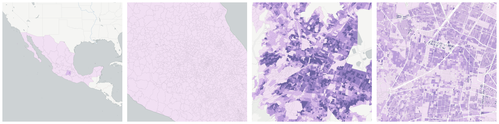

  
# Families

Familial arrangements of people and households.

- [Birthrate](#birthrate)

- [Birthrate to women age 15 to 49](#birthrate-to-women-age-15-to-49)

- [Formerly married population 12 or more years old](#formerly-married-population-12-or-more-years-old)

    * [Female formerly married population 12 or more years old](#female-formerly-married-population-12-or-more-years-old)

    * [Male formerly married population 12 or more years old](#male-formerly-married-population-12-or-more-years-old)

- [Households](#households)

    * [Female headed households](#female-headed-households)

        - [Household with female head 60 or more years old](#household-with-female-head-60-or-more-years-old)

        - [Household with female head between 30 and 59 years old](#household-with-female-head-between-30-and-59-years-old)

        - [Household with female head under 30 years old](#household-with-female-head-under-30-years-old)

    * [Household with head 60 or more years old](#household-with-head-60-or-more-years-old)

        - [Household with female head 60 or more years old](#id1)

        - [Household with male head 60 or more years old](#household-with-male-head-60-or-more-years-old)

    * [Household with head between 30 and 59 years old](#household-with-head-between-30-and-59-years-old)

        - [Household with female head between 30 and 59 years old](#id3)

        - [Household with male head between 30 and 59 years old](#household-with-male-head-between-30-and-59-years-old)

    * [Household with head under 30 years old](#household-with-head-under-30-years-old)

        - [Household with female head under 30 years old](#id5)

        - [Household with male head under 30 years old](#household-with-male-head-under-30-years-old)

    * [Male headed households](#male-headed-households)

        - [Household with male head 60 or more years old](#id7)

        - [Household with male head between 30 and 59 years old](#id9)

        - [Household with male head under 30 years old](#id11)

    * [Nuclear households (head with children under 18 years of age)](#nuclear-households-head-with-children-under-18-years-of-age)

- [Married or cohabited two years population 12 or more years old](#married-or-cohabited-two-years-population-12-or-more-years-old)

    * [Female married or cohabited two years population 12 or more years old](#female-married-or-cohabited-two-years-population-12-or-more-years-old)

    * [Male married or cohabited two years population 12 or more years old](#male-married-or-cohabited-two-years-population-12-or-more-years-old)

- [Married or cohabited two years population 15 to 24 years old](#married-or-cohabited-two-years-population-15-to-24-years-old)

    * [Female married or cohabited two years population 15 to 24 years old](#female-married-or-cohabited-two-years-population-15-to-24-years-old)

    * [Male married or cohabited two years population 15 to 24 years old](#male-married-or-cohabited-two-years-population-15-to-24-years-old)

- [Percentage of women age 15 to 19 with a child](#percentage-of-women-age-15-to-19-with-a-child)

- [Population in households](#population-in-households)

    * [Population in female headed households](#population-in-female-headed-households)

        - [Population in households with female head 60 or more years old](#population-in-households-with-female-head-60-or-more-years-old)

        - [Population in households with female head between 30 and 59 years old](#population-in-households-with-female-head-between-30-and-59-years-old)

        - [Population in households with female head under 30 years old](#population-in-households-with-female-head-under-30-years-old)

    * [Population in households with head 60 or more years old](#population-in-households-with-head-60-or-more-years-old)

        - [Population in households with female head 60 or more years old](#id13)

        - [Population in households with male head 60 or more years old](#population-in-households-with-male-head-60-or-more-years-old)

    * [Population in households with head between 30 and 59 years old](#population-in-households-with-head-between-30-and-59-years-old)

        - [Population in households with female head between 30 and 59 years old](#id15)

        - [Population in households with male head between 30 and 59 years old](#population-in-households-with-male-head-between-30-and-59-years-old)

    * [Population in households with head under 30 years old](#population-in-households-with-head-under-30-years-old)

        - [Population in households with female head under 30 years old](#id17)

        - [Population in households with male head under 30 years old](#population-in-households-with-male-head-under-30-years-old)

    * [Population in male headed households](#population-in-male-headed-households)

        - [Population in households with male head 60 or more years old](#id19)

        - [Population in households with male head between 30 and 59 years old](#id21)

        - [Population in households with male head under 30 years old](#id23)

    * [Population in nuclear households (head with children under 18 years of age)](#population-in-nuclear-households-head-with-children-under-18-years-of-age)

- [Single population 12 or more years old](#single-population-12-or-more-years-old)

    * [Female single population 12 or more years old](#female-single-population-12-or-more-years-old)

    * [Male single population 12 or more years old](#male-single-population-12-or-more-years-old)

## Birthrate

Measure &quot;Birthrate&quot;  for one point:

    UPDATE {table_name}
      SET {new_numeric_column} =
        OBS_GetMeasure(
          CDB_LatLng(40.7, -73.9),
          'mx.inegi_columns.FEC1_R'
        );

Birthrate is only available for point lookups.

## Birthrate to women age 15 to 49

Measure &quot;Birthrate to women age 15 to 49&quot;  for one point:

    UPDATE {table_name}
      SET {new_numeric_column} =
        OBS_GetMeasure(
          CDB_LatLng(40.7, -73.9),
          'mx.inegi_columns.FEC2_R'
        );

Birthrate to women age 15 to 49 is only available for point lookups.

## Formerly married population 12 or more years old

Measure &quot;Formerly married population 12 or more years old&quot;  density per sq. kilometer  for one point:

    UPDATE {table_name}
      SET {new_numeric_column} =
        OBS_GetMeasure(
          CDB_LatLng(40.7, -73.9),
          'mx.inegi_columns.SCONY7'
        );

Measure &quot;Formerly married population 12 or more years old&quot; within an area:

    UPDATE {table_name}
      SET {new_numeric_column} =
        OBS_GetMeasure(
          ST_Buffer(CDB_LatLng(40.7, -73.9), 0.01),
          'mx.inegi_columns.SCONY7'
        );

Measure &quot;Formerly married population 12 or more years old&quot; percent of &quot;Population 12 or more years old&quot; at one point:

    UPDATE {table_name}
      SET {new_numeric_column} =
        OBS_GetMeasure(
          CDB_LatLng(40.7, -73.9),
          'mx.inegi_columns.SCONY7',
          'denominator'
        );

Measure &quot;Formerly married population 12 or more years old&quot; percent of &quot;Population 12 or more years old&quot; within an area:

    UPDATE {table_name}
      SET {new_numeric_column} =
        OBS_GetMeasure(
          ST_Buffer(CDB_LatLng(40.7, -73.9), 0.01),
          'mx.inegi_columns.SCONY7',
          'denominator'
        );

* denominator: [Population 12 or more years old](../age_gender/#mx-inegi-columns-pob19)

Subcolumns of Formerly married population 12 or more years old

- [Female formerly married population 12 or more years old](#female-formerly-married-population-12-or-more-years-old)

- [Male formerly married population 12 or more years old](#male-formerly-married-population-12-or-more-years-old)

### Female formerly married population 12 or more years old

Measure &quot;Female formerly married population 12 or more years old&quot;  density per sq. kilometer  for one point:

    UPDATE {table_name}
      SET {new_numeric_column} =
        OBS_GetMeasure(
          CDB_LatLng(40.7, -73.9),
          'mx.inegi_columns.SCONY8'
        );

Measure &quot;Female formerly married population 12 or more years old&quot; within an area:

    UPDATE {table_name}
      SET {new_numeric_column} =
        OBS_GetMeasure(
          ST_Buffer(CDB_LatLng(40.7, -73.9), 0.01),
          'mx.inegi_columns.SCONY8'
        );

Measure &quot;Female formerly married population 12 or more years old&quot; percent of &quot;Formerly married population 12 or more years old&quot; at one point:

    UPDATE {table_name}
      SET {new_numeric_column} =
        OBS_GetMeasure(
          CDB_LatLng(40.7, -73.9),
          'mx.inegi_columns.SCONY8',
          'denominator'
        );

Measure &quot;Female formerly married population 12 or more years old&quot; percent of &quot;Formerly married population 12 or more years old&quot; within an area:

    UPDATE {table_name}
      SET {new_numeric_column} =
        OBS_GetMeasure(
          ST_Buffer(CDB_LatLng(40.7, -73.9), 0.01),
          'mx.inegi_columns.SCONY8',
          'denominator'
        );

* denominator: [Formerly married population 12 or more years old](#mx-inegi-columns-scony7)

* denominator: mx.inegi_columns.POB50

### Male formerly married population 12 or more years old

Measure &quot;Male formerly married population 12 or more years old&quot;  density per sq. kilometer  for one point:

    UPDATE {table_name}
      SET {new_numeric_column} =
        OBS_GetMeasure(
          CDB_LatLng(40.7, -73.9),
          'mx.inegi_columns.SCONY9'
        );

Measure &quot;Male formerly married population 12 or more years old&quot; within an area:

    UPDATE {table_name}
      SET {new_numeric_column} =
        OBS_GetMeasure(
          ST_Buffer(CDB_LatLng(40.7, -73.9), 0.01),
          'mx.inegi_columns.SCONY9'
        );

Measure &quot;Male formerly married population 12 or more years old&quot; percent of &quot;Male population 12 or more years old&quot; at one point:

    UPDATE {table_name}
      SET {new_numeric_column} =
        OBS_GetMeasure(
          CDB_LatLng(40.7, -73.9),
          'mx.inegi_columns.SCONY9',
          'denominator'
        );

Measure &quot;Male formerly married population 12 or more years old&quot; percent of &quot;Male population 12 or more years old&quot; within an area:

    UPDATE {table_name}
      SET {new_numeric_column} =
        OBS_GetMeasure(
          ST_Buffer(CDB_LatLng(40.7, -73.9), 0.01),
          'mx.inegi_columns.SCONY9',
          'denominator'
        );

* denominator: mx.inegi_columns.POB75

* denominator: [Formerly married population 12 or more years old](#mx-inegi-columns-scony7)

## Households

Measure &quot;Households&quot;  density per sq. kilometer  for one point:

    UPDATE {table_name}
      SET {new_numeric_column} =
        OBS_GetMeasure(
          CDB_LatLng(40.7, -73.9),
          'mx.inegi_columns.HOGAR1'
        );

Measure &quot;Households&quot; within an area:

    UPDATE {table_name}
      SET {new_numeric_column} =
        OBS_GetMeasure(
          ST_Buffer(CDB_LatLng(40.7, -73.9), 0.01),
          'mx.inegi_columns.HOGAR1'
        );

Subcolumns of Households

- [Female headed households](#female-headed-households)

- [Household with head 60 or more years old](#household-with-head-60-or-more-years-old)

- [Household with head between 30 and 59 years old](#household-with-head-between-30-and-59-years-old)

- [Household with head under 30 years old](#household-with-head-under-30-years-old)

- [Male headed households](#male-headed-households)

- [Nuclear households (head with children under 18 years of age)](#nuclear-households-head-with-children-under-18-years-of-age)

### Female headed households

Measure &quot;Female headed households&quot;  density per sq. kilometer  for one point:

    UPDATE {table_name}
      SET {new_numeric_column} =
        OBS_GetMeasure(
          CDB_LatLng(40.7, -73.9),
          'mx.inegi_columns.HOGAR2'
        );

Measure &quot;Female headed households&quot; within an area:

    UPDATE {table_name}
      SET {new_numeric_column} =
        OBS_GetMeasure(
          ST_Buffer(CDB_LatLng(40.7, -73.9), 0.01),
          'mx.inegi_columns.HOGAR2'
        );

Measure &quot;Female headed households&quot; percent of &quot;Households&quot; at one point:

    UPDATE {table_name}
      SET {new_numeric_column} =
        OBS_GetMeasure(
          CDB_LatLng(40.7, -73.9),
          'mx.inegi_columns.HOGAR2',
          'denominator'
        );

Measure &quot;Female headed households&quot; percent of &quot;Households&quot; within an area:

    UPDATE {table_name}
      SET {new_numeric_column} =
        OBS_GetMeasure(
          ST_Buffer(CDB_LatLng(40.7, -73.9), 0.01),
          'mx.inegi_columns.HOGAR2',
          'denominator'
        );

* denominator: [Households](#mx-inegi-columns-hogar1)

Subcolumns of Female headed households

- [Household with female head 60 or more years old](#household-with-female-head-60-or-more-years-old)

- [Household with female head between 30 and 59 years old](#household-with-female-head-between-30-and-59-years-old)

- [Household with female head under 30 years old](#household-with-female-head-under-30-years-old)

#### Household with female head 60 or more years old

Measure &quot;Household with female head 60 or more years old&quot;  density per sq. kilometer  for one point:

    UPDATE {table_name}
      SET {new_numeric_column} =
        OBS_GetMeasure(
          CDB_LatLng(40.7, -73.9),
          'mx.inegi_columns.HOGAR20'
        );

Measure &quot;Household with female head 60 or more years old&quot; within an area:

    UPDATE {table_name}
      SET {new_numeric_column} =
        OBS_GetMeasure(
          ST_Buffer(CDB_LatLng(40.7, -73.9), 0.01),
          'mx.inegi_columns.HOGAR20'
        );

Measure &quot;Household with female head 60 or more years old&quot; percent of &quot;Female headed households&quot; at one point:

    UPDATE {table_name}
      SET {new_numeric_column} =
        OBS_GetMeasure(
          CDB_LatLng(40.7, -73.9),
          'mx.inegi_columns.HOGAR20',
          'denominator'
        );

Measure &quot;Household with female head 60 or more years old&quot; percent of &quot;Female headed households&quot; within an area:

    UPDATE {table_name}
      SET {new_numeric_column} =
        OBS_GetMeasure(
          ST_Buffer(CDB_LatLng(40.7, -73.9), 0.01),
          'mx.inegi_columns.HOGAR20',
          'denominator'
        );

* denominator: [Female headed households](#mx-inegi-columns-hogar2)

* denominator: [Household with head 60 or more years old](#mx-inegi-columns-hogar19)

#### Household with female head between 30 and 59 years old

Measure &quot;Household with female head between 30 and 59 years old&quot;  density per sq. kilometer  for one point:

    UPDATE {table_name}
      SET {new_numeric_column} =
        OBS_GetMeasure(
          CDB_LatLng(40.7, -73.9),
          'mx.inegi_columns.HOGAR14'
        );

Measure &quot;Household with female head between 30 and 59 years old&quot; within an area:

    UPDATE {table_name}
      SET {new_numeric_column} =
        OBS_GetMeasure(
          ST_Buffer(CDB_LatLng(40.7, -73.9), 0.01),
          'mx.inegi_columns.HOGAR14'
        );

Measure &quot;Household with female head between 30 and 59 years old&quot; percent of &quot;Household with head between 30 and 59 years old&quot; at one point:

    UPDATE {table_name}
      SET {new_numeric_column} =
        OBS_GetMeasure(
          CDB_LatLng(40.7, -73.9),
          'mx.inegi_columns.HOGAR14',
          'denominator'
        );

Measure &quot;Household with female head between 30 and 59 years old&quot; percent of &quot;Household with head between 30 and 59 years old&quot; within an area:

    UPDATE {table_name}
      SET {new_numeric_column} =
        OBS_GetMeasure(
          ST_Buffer(CDB_LatLng(40.7, -73.9), 0.01),
          'mx.inegi_columns.HOGAR14',
          'denominator'
        );

* denominator: [Household with head between 30 and 59 years old](#mx-inegi-columns-hogar13)

* denominator: [Female headed households](#mx-inegi-columns-hogar2)

#### Household with female head under 30 years old

Measure &quot;Household with female head under 30 years old&quot;  density per sq. kilometer  for one point:

    UPDATE {table_name}
      SET {new_numeric_column} =
        OBS_GetMeasure(
          CDB_LatLng(40.7, -73.9),
          'mx.inegi_columns.HOGAR8'
        );

Measure &quot;Household with female head under 30 years old&quot; within an area:

    UPDATE {table_name}
      SET {new_numeric_column} =
        OBS_GetMeasure(
          ST_Buffer(CDB_LatLng(40.7, -73.9), 0.01),
          'mx.inegi_columns.HOGAR8'
        );

Measure &quot;Household with female head under 30 years old&quot; percent of &quot;Female headed households&quot; at one point:

    UPDATE {table_name}
      SET {new_numeric_column} =
        OBS_GetMeasure(
          CDB_LatLng(40.7, -73.9),
          'mx.inegi_columns.HOGAR8',
          'denominator'
        );

Measure &quot;Household with female head under 30 years old&quot; percent of &quot;Female headed households&quot; within an area:

    UPDATE {table_name}
      SET {new_numeric_column} =
        OBS_GetMeasure(
          ST_Buffer(CDB_LatLng(40.7, -73.9), 0.01),
          'mx.inegi_columns.HOGAR8',
          'denominator'
        );

* denominator: [Female headed households](#mx-inegi-columns-hogar2)

* denominator: [Household with head under 30 years old](#mx-inegi-columns-hogar7)

### Household with head 60 or more years old

Measure &quot;Household with head 60 or more years old&quot;  density per sq. kilometer  for one point:

    UPDATE {table_name}
      SET {new_numeric_column} =
        OBS_GetMeasure(
          CDB_LatLng(40.7, -73.9),
          'mx.inegi_columns.HOGAR19'
        );

Measure &quot;Household with head 60 or more years old&quot; within an area:

    UPDATE {table_name}
      SET {new_numeric_column} =
        OBS_GetMeasure(
          ST_Buffer(CDB_LatLng(40.7, -73.9), 0.01),
          'mx.inegi_columns.HOGAR19'
        );

Measure &quot;Household with head 60 or more years old&quot; percent of &quot;Households&quot; at one point:

    UPDATE {table_name}
      SET {new_numeric_column} =
        OBS_GetMeasure(
          CDB_LatLng(40.7, -73.9),
          'mx.inegi_columns.HOGAR19',
          'denominator'
        );

Measure &quot;Household with head 60 or more years old&quot; percent of &quot;Households&quot; within an area:

    UPDATE {table_name}
      SET {new_numeric_column} =
        OBS_GetMeasure(
          ST_Buffer(CDB_LatLng(40.7, -73.9), 0.01),
          'mx.inegi_columns.HOGAR19',
          'denominator'
        );

* denominator: [Households](#mx-inegi-columns-hogar1)

Subcolumns of Household with head 60 or more years old

- [Household with female head 60 or more years old](#id1)

- [Household with male head 60 or more years old](#household-with-male-head-60-or-more-years-old)

#### Household with female head 60 or more years old

Measure &quot;Household with female head 60 or more years old&quot;  density per sq. kilometer  for one point:

    UPDATE {table_name}
      SET {new_numeric_column} =
        OBS_GetMeasure(
          CDB_LatLng(40.7, -73.9),
          'mx.inegi_columns.HOGAR20'
        );

Measure &quot;Household with female head 60 or more years old&quot; within an area:

    UPDATE {table_name}
      SET {new_numeric_column} =
        OBS_GetMeasure(
          ST_Buffer(CDB_LatLng(40.7, -73.9), 0.01),
          'mx.inegi_columns.HOGAR20'
        );

Measure &quot;Household with female head 60 or more years old&quot; percent of &quot;Female headed households&quot; at one point:

    UPDATE {table_name}
      SET {new_numeric_column} =
        OBS_GetMeasure(
          CDB_LatLng(40.7, -73.9),
          'mx.inegi_columns.HOGAR20',
          'denominator'
        );

Measure &quot;Household with female head 60 or more years old&quot; percent of &quot;Female headed households&quot; within an area:

    UPDATE {table_name}
      SET {new_numeric_column} =
        OBS_GetMeasure(
          ST_Buffer(CDB_LatLng(40.7, -73.9), 0.01),
          'mx.inegi_columns.HOGAR20',
          'denominator'
        );

* denominator: [Female headed households](#mx-inegi-columns-hogar2)

* denominator: [Household with head 60 or more years old](#mx-inegi-columns-hogar19)

#### Household with male head 60 or more years old

Measure &quot;Household with male head 60 or more years old&quot;  density per sq. kilometer  for one point:

    UPDATE {table_name}
      SET {new_numeric_column} =
        OBS_GetMeasure(
          CDB_LatLng(40.7, -73.9),
          'mx.inegi_columns.HOGAR21'
        );

Measure &quot;Household with male head 60 or more years old&quot; within an area:

    UPDATE {table_name}
      SET {new_numeric_column} =
        OBS_GetMeasure(
          ST_Buffer(CDB_LatLng(40.7, -73.9), 0.01),
          'mx.inegi_columns.HOGAR21'
        );

Measure &quot;Household with male head 60 or more years old&quot; percent of &quot;Male headed households&quot; at one point:

    UPDATE {table_name}
      SET {new_numeric_column} =
        OBS_GetMeasure(
          CDB_LatLng(40.7, -73.9),
          'mx.inegi_columns.HOGAR21',
          'denominator'
        );

Measure &quot;Household with male head 60 or more years old&quot; percent of &quot;Male headed households&quot; within an area:

    UPDATE {table_name}
      SET {new_numeric_column} =
        OBS_GetMeasure(
          ST_Buffer(CDB_LatLng(40.7, -73.9), 0.01),
          'mx.inegi_columns.HOGAR21',
          'denominator'
        );

* denominator: [Male headed households](#mx-inegi-columns-hogar3)

* denominator: [Household with head 60 or more years old](#mx-inegi-columns-hogar19)

### Household with head between 30 and 59 years old

Measure &quot;Household with head between 30 and 59 years old&quot;  density per sq. kilometer  for one point:

    UPDATE {table_name}
      SET {new_numeric_column} =
        OBS_GetMeasure(
          CDB_LatLng(40.7, -73.9),
          'mx.inegi_columns.HOGAR13'
        );

Measure &quot;Household with head between 30 and 59 years old&quot; within an area:

    UPDATE {table_name}
      SET {new_numeric_column} =
        OBS_GetMeasure(
          ST_Buffer(CDB_LatLng(40.7, -73.9), 0.01),
          'mx.inegi_columns.HOGAR13'
        );

Measure &quot;Household with head between 30 and 59 years old&quot; percent of &quot;Households&quot; at one point:

    UPDATE {table_name}
      SET {new_numeric_column} =
        OBS_GetMeasure(
          CDB_LatLng(40.7, -73.9),
          'mx.inegi_columns.HOGAR13',
          'denominator'
        );

Measure &quot;Household with head between 30 and 59 years old&quot; percent of &quot;Households&quot; within an area:

    UPDATE {table_name}
      SET {new_numeric_column} =
        OBS_GetMeasure(
          ST_Buffer(CDB_LatLng(40.7, -73.9), 0.01),
          'mx.inegi_columns.HOGAR13',
          'denominator'
        );

* denominator: [Households](#mx-inegi-columns-hogar1)

Subcolumns of Household with head between 30 and 59 years old

- [Household with female head between 30 and 59 years old](#id3)

- [Household with male head between 30 and 59 years old](#household-with-male-head-between-30-and-59-years-old)

#### Household with female head between 30 and 59 years old

Measure &quot;Household with female head between 30 and 59 years old&quot;  density per sq. kilometer  for one point:

    UPDATE {table_name}
      SET {new_numeric_column} =
        OBS_GetMeasure(
          CDB_LatLng(40.7, -73.9),
          'mx.inegi_columns.HOGAR14'
        );

Measure &quot;Household with female head between 30 and 59 years old&quot; within an area:

    UPDATE {table_name}
      SET {new_numeric_column} =
        OBS_GetMeasure(
          ST_Buffer(CDB_LatLng(40.7, -73.9), 0.01),
          'mx.inegi_columns.HOGAR14'
        );

Measure &quot;Household with female head between 30 and 59 years old&quot; percent of &quot;Household with head between 30 and 59 years old&quot; at one point:

    UPDATE {table_name}
      SET {new_numeric_column} =
        OBS_GetMeasure(
          CDB_LatLng(40.7, -73.9),
          'mx.inegi_columns.HOGAR14',
          'denominator'
        );

Measure &quot;Household with female head between 30 and 59 years old&quot; percent of &quot;Household with head between 30 and 59 years old&quot; within an area:

    UPDATE {table_name}
      SET {new_numeric_column} =
        OBS_GetMeasure(
          ST_Buffer(CDB_LatLng(40.7, -73.9), 0.01),
          'mx.inegi_columns.HOGAR14',
          'denominator'
        );

* denominator: [Household with head between 30 and 59 years old](#mx-inegi-columns-hogar13)

* denominator: [Female headed households](#mx-inegi-columns-hogar2)

#### Household with male head between 30 and 59 years old

Measure &quot;Household with male head between 30 and 59 years old&quot;  density per sq. kilometer  for one point:

    UPDATE {table_name}
      SET {new_numeric_column} =
        OBS_GetMeasure(
          CDB_LatLng(40.7, -73.9),
          'mx.inegi_columns.HOGAR15'
        );

Measure &quot;Household with male head between 30 and 59 years old&quot; within an area:

    UPDATE {table_name}
      SET {new_numeric_column} =
        OBS_GetMeasure(
          ST_Buffer(CDB_LatLng(40.7, -73.9), 0.01),
          'mx.inegi_columns.HOGAR15'
        );

Measure &quot;Household with male head between 30 and 59 years old&quot; percent of &quot;Household with head between 30 and 59 years old&quot; at one point:

    UPDATE {table_name}
      SET {new_numeric_column} =
        OBS_GetMeasure(
          CDB_LatLng(40.7, -73.9),
          'mx.inegi_columns.HOGAR15',
          'denominator'
        );

Measure &quot;Household with male head between 30 and 59 years old&quot; percent of &quot;Household with head between 30 and 59 years old&quot; within an area:

    UPDATE {table_name}
      SET {new_numeric_column} =
        OBS_GetMeasure(
          ST_Buffer(CDB_LatLng(40.7, -73.9), 0.01),
          'mx.inegi_columns.HOGAR15',
          'denominator'
        );

* denominator: [Household with head between 30 and 59 years old](#mx-inegi-columns-hogar13)

* denominator: [Male headed households](#mx-inegi-columns-hogar3)

### Household with head under 30 years old

Measure &quot;Household with head under 30 years old&quot;  density per sq. kilometer  for one point:

    UPDATE {table_name}
      SET {new_numeric_column} =
        OBS_GetMeasure(
          CDB_LatLng(40.7, -73.9),
          'mx.inegi_columns.HOGAR7'
        );

Measure &quot;Household with head under 30 years old&quot; within an area:

    UPDATE {table_name}
      SET {new_numeric_column} =
        OBS_GetMeasure(
          ST_Buffer(CDB_LatLng(40.7, -73.9), 0.01),
          'mx.inegi_columns.HOGAR7'
        );

Measure &quot;Household with head under 30 years old&quot; percent of &quot;Households&quot; at one point:

    UPDATE {table_name}
      SET {new_numeric_column} =
        OBS_GetMeasure(
          CDB_LatLng(40.7, -73.9),
          'mx.inegi_columns.HOGAR7',
          'denominator'
        );

Measure &quot;Household with head under 30 years old&quot; percent of &quot;Households&quot; within an area:

    UPDATE {table_name}
      SET {new_numeric_column} =
        OBS_GetMeasure(
          ST_Buffer(CDB_LatLng(40.7, -73.9), 0.01),
          'mx.inegi_columns.HOGAR7',
          'denominator'
        );

* denominator: [Households](#mx-inegi-columns-hogar1)

Subcolumns of Household with head under 30 years old

- [Household with female head under 30 years old](#id5)

- [Household with male head under 30 years old](#household-with-male-head-under-30-years-old)

#### Household with female head under 30 years old

Measure &quot;Household with female head under 30 years old&quot;  density per sq. kilometer  for one point:

    UPDATE {table_name}
      SET {new_numeric_column} =
        OBS_GetMeasure(
          CDB_LatLng(40.7, -73.9),
          'mx.inegi_columns.HOGAR8'
        );

Measure &quot;Household with female head under 30 years old&quot; within an area:

    UPDATE {table_name}
      SET {new_numeric_column} =
        OBS_GetMeasure(
          ST_Buffer(CDB_LatLng(40.7, -73.9), 0.01),
          'mx.inegi_columns.HOGAR8'
        );

Measure &quot;Household with female head under 30 years old&quot; percent of &quot;Female headed households&quot; at one point:

    UPDATE {table_name}
      SET {new_numeric_column} =
        OBS_GetMeasure(
          CDB_LatLng(40.7, -73.9),
          'mx.inegi_columns.HOGAR8',
          'denominator'
        );

Measure &quot;Household with female head under 30 years old&quot; percent of &quot;Female headed households&quot; within an area:

    UPDATE {table_name}
      SET {new_numeric_column} =
        OBS_GetMeasure(
          ST_Buffer(CDB_LatLng(40.7, -73.9), 0.01),
          'mx.inegi_columns.HOGAR8',
          'denominator'
        );

* denominator: [Female headed households](#mx-inegi-columns-hogar2)

* denominator: [Household with head under 30 years old](#mx-inegi-columns-hogar7)

#### Household with male head under 30 years old

Measure &quot;Household with male head under 30 years old&quot;  density per sq. kilometer  for one point:

    UPDATE {table_name}
      SET {new_numeric_column} =
        OBS_GetMeasure(
          CDB_LatLng(40.7, -73.9),
          'mx.inegi_columns.HOGAR9'
        );

Measure &quot;Household with male head under 30 years old&quot; within an area:

    UPDATE {table_name}
      SET {new_numeric_column} =
        OBS_GetMeasure(
          ST_Buffer(CDB_LatLng(40.7, -73.9), 0.01),
          'mx.inegi_columns.HOGAR9'
        );

Measure &quot;Household with male head under 30 years old&quot; percent of &quot;Male headed households&quot; at one point:

    UPDATE {table_name}
      SET {new_numeric_column} =
        OBS_GetMeasure(
          CDB_LatLng(40.7, -73.9),
          'mx.inegi_columns.HOGAR9',
          'denominator'
        );

Measure &quot;Household with male head under 30 years old&quot; percent of &quot;Male headed households&quot; within an area:

    UPDATE {table_name}
      SET {new_numeric_column} =
        OBS_GetMeasure(
          ST_Buffer(CDB_LatLng(40.7, -73.9), 0.01),
          'mx.inegi_columns.HOGAR9',
          'denominator'
        );

* denominator: [Male headed households](#mx-inegi-columns-hogar3)

* denominator: [Household with head under 30 years old](#mx-inegi-columns-hogar7)

### Male headed households

Measure &quot;Male headed households&quot;  density per sq. kilometer  for one point:

    UPDATE {table_name}
      SET {new_numeric_column} =
        OBS_GetMeasure(
          CDB_LatLng(40.7, -73.9),
          'mx.inegi_columns.HOGAR3'
        );

Measure &quot;Male headed households&quot; within an area:

    UPDATE {table_name}
      SET {new_numeric_column} =
        OBS_GetMeasure(
          ST_Buffer(CDB_LatLng(40.7, -73.9), 0.01),
          'mx.inegi_columns.HOGAR3'
        );

Measure &quot;Male headed households&quot; percent of &quot;Households&quot; at one point:

    UPDATE {table_name}
      SET {new_numeric_column} =
        OBS_GetMeasure(
          CDB_LatLng(40.7, -73.9),
          'mx.inegi_columns.HOGAR3',
          'denominator'
        );

Measure &quot;Male headed households&quot; percent of &quot;Households&quot; within an area:

    UPDATE {table_name}
      SET {new_numeric_column} =
        OBS_GetMeasure(
          ST_Buffer(CDB_LatLng(40.7, -73.9), 0.01),
          'mx.inegi_columns.HOGAR3',
          'denominator'
        );

* denominator: [Households](#mx-inegi-columns-hogar1)

Subcolumns of Male headed households

- [Household with male head 60 or more years old](#id7)

- [Household with male head between 30 and 59 years old](#id9)

- [Household with male head under 30 years old](#id11)

#### Household with male head 60 or more years old

Measure &quot;Household with male head 60 or more years old&quot;  density per sq. kilometer  for one point:

    UPDATE {table_name}
      SET {new_numeric_column} =
        OBS_GetMeasure(
          CDB_LatLng(40.7, -73.9),
          'mx.inegi_columns.HOGAR21'
        );

Measure &quot;Household with male head 60 or more years old&quot; within an area:

    UPDATE {table_name}
      SET {new_numeric_column} =
        OBS_GetMeasure(
          ST_Buffer(CDB_LatLng(40.7, -73.9), 0.01),
          'mx.inegi_columns.HOGAR21'
        );

Measure &quot;Household with male head 60 or more years old&quot; percent of &quot;Male headed households&quot; at one point:

    UPDATE {table_name}
      SET {new_numeric_column} =
        OBS_GetMeasure(
          CDB_LatLng(40.7, -73.9),
          'mx.inegi_columns.HOGAR21',
          'denominator'
        );

Measure &quot;Household with male head 60 or more years old&quot; percent of &quot;Male headed households&quot; within an area:

    UPDATE {table_name}
      SET {new_numeric_column} =
        OBS_GetMeasure(
          ST_Buffer(CDB_LatLng(40.7, -73.9), 0.01),
          'mx.inegi_columns.HOGAR21',
          'denominator'
        );

* denominator: [Male headed households](#mx-inegi-columns-hogar3)

* denominator: [Household with head 60 or more years old](#mx-inegi-columns-hogar19)

#### Household with male head between 30 and 59 years old

Measure &quot;Household with male head between 30 and 59 years old&quot;  density per sq. kilometer  for one point:

    UPDATE {table_name}
      SET {new_numeric_column} =
        OBS_GetMeasure(
          CDB_LatLng(40.7, -73.9),
          'mx.inegi_columns.HOGAR15'
        );

Measure &quot;Household with male head between 30 and 59 years old&quot; within an area:

    UPDATE {table_name}
      SET {new_numeric_column} =
        OBS_GetMeasure(
          ST_Buffer(CDB_LatLng(40.7, -73.9), 0.01),
          'mx.inegi_columns.HOGAR15'
        );

Measure &quot;Household with male head between 30 and 59 years old&quot; percent of &quot;Household with head between 30 and 59 years old&quot; at one point:

    UPDATE {table_name}
      SET {new_numeric_column} =
        OBS_GetMeasure(
          CDB_LatLng(40.7, -73.9),
          'mx.inegi_columns.HOGAR15',
          'denominator'
        );

Measure &quot;Household with male head between 30 and 59 years old&quot; percent of &quot;Household with head between 30 and 59 years old&quot; within an area:

    UPDATE {table_name}
      SET {new_numeric_column} =
        OBS_GetMeasure(
          ST_Buffer(CDB_LatLng(40.7, -73.9), 0.01),
          'mx.inegi_columns.HOGAR15',
          'denominator'
        );

* denominator: [Household with head between 30 and 59 years old](#mx-inegi-columns-hogar13)

* denominator: [Male headed households](#mx-inegi-columns-hogar3)

#### Household with male head under 30 years old

Measure &quot;Household with male head under 30 years old&quot;  density per sq. kilometer  for one point:

    UPDATE {table_name}
      SET {new_numeric_column} =
        OBS_GetMeasure(
          CDB_LatLng(40.7, -73.9),
          'mx.inegi_columns.HOGAR9'
        );

Measure &quot;Household with male head under 30 years old&quot; within an area:

    UPDATE {table_name}
      SET {new_numeric_column} =
        OBS_GetMeasure(
          ST_Buffer(CDB_LatLng(40.7, -73.9), 0.01),
          'mx.inegi_columns.HOGAR9'
        );

Measure &quot;Household with male head under 30 years old&quot; percent of &quot;Male headed households&quot; at one point:

    UPDATE {table_name}
      SET {new_numeric_column} =
        OBS_GetMeasure(
          CDB_LatLng(40.7, -73.9),
          'mx.inegi_columns.HOGAR9',
          'denominator'
        );

Measure &quot;Household with male head under 30 years old&quot; percent of &quot;Male headed households&quot; within an area:

    UPDATE {table_name}
      SET {new_numeric_column} =
        OBS_GetMeasure(
          ST_Buffer(CDB_LatLng(40.7, -73.9), 0.01),
          'mx.inegi_columns.HOGAR9',
          'denominator'
        );

* denominator: [Male headed households](#mx-inegi-columns-hogar3)

* denominator: [Household with head under 30 years old](#mx-inegi-columns-hogar7)

### Nuclear households (head with children under 18 years of age)

Measure &quot;Nuclear households (head with children under 18 years of age)&quot;  density per sq. kilometer  for one point:

    UPDATE {table_name}
      SET {new_numeric_column} =
        OBS_GetMeasure(
          CDB_LatLng(40.7, -73.9),
          'mx.inegi_columns.HOGAR25'
        );

Measure &quot;Nuclear households (head with children under 18 years of age)&quot; within an area:

    UPDATE {table_name}
      SET {new_numeric_column} =
        OBS_GetMeasure(
          ST_Buffer(CDB_LatLng(40.7, -73.9), 0.01),
          'mx.inegi_columns.HOGAR25'
        );

Measure &quot;Nuclear households (head with children under 18 years of age)&quot; percent of &quot;Households&quot; at one point:

    UPDATE {table_name}
      SET {new_numeric_column} =
        OBS_GetMeasure(
          CDB_LatLng(40.7, -73.9),
          'mx.inegi_columns.HOGAR25',
          'denominator'
        );

Measure &quot;Nuclear households (head with children under 18 years of age)&quot; percent of &quot;Households&quot; within an area:

    UPDATE {table_name}
      SET {new_numeric_column} =
        OBS_GetMeasure(
          ST_Buffer(CDB_LatLng(40.7, -73.9), 0.01),
          'mx.inegi_columns.HOGAR25',
          'denominator'
        );

* denominator: [Households](#mx-inegi-columns-hogar1)

## Married or cohabited two years population 12 or more years old

Measure &quot;Married or cohabited two years population 12 or more years old&quot;  density per sq. kilometer  for one point:

    UPDATE {table_name}
      SET {new_numeric_column} =
        OBS_GetMeasure(
          CDB_LatLng(40.7, -73.9),
          'mx.inegi_columns.SCONY4'
        );

Measure &quot;Married or cohabited two years population 12 or more years old&quot; within an area:

    UPDATE {table_name}
      SET {new_numeric_column} =
        OBS_GetMeasure(
          ST_Buffer(CDB_LatLng(40.7, -73.9), 0.01),
          'mx.inegi_columns.SCONY4'
        );

Measure &quot;Married or cohabited two years population 12 or more years old&quot; percent of &quot;Population 12 or more years old&quot; at one point:

    UPDATE {table_name}
      SET {new_numeric_column} =
        OBS_GetMeasure(
          CDB_LatLng(40.7, -73.9),
          'mx.inegi_columns.SCONY4',
          'denominator'
        );

Measure &quot;Married or cohabited two years population 12 or more years old&quot; percent of &quot;Population 12 or more years old&quot; within an area:

    UPDATE {table_name}
      SET {new_numeric_column} =
        OBS_GetMeasure(
          ST_Buffer(CDB_LatLng(40.7, -73.9), 0.01),
          'mx.inegi_columns.SCONY4',
          'denominator'
        );

* denominator: [Population 12 or more years old](../age_gender/#mx-inegi-columns-pob19)

Subcolumns of Married or cohabited two years population 12 or more years old

- [Female married or cohabited two years population 12 or more years old](#female-married-or-cohabited-two-years-population-12-or-more-years-old)

- [Male married or cohabited two years population 12 or more years old](#male-married-or-cohabited-two-years-population-12-or-more-years-old)

### Female married or cohabited two years population 12 or more years old

Measure &quot;Female married or cohabited two years population 12 or more years old&quot;  density per sq. kilometer  for one point:

    UPDATE {table_name}
      SET {new_numeric_column} =
        OBS_GetMeasure(
          CDB_LatLng(40.7, -73.9),
          'mx.inegi_columns.SCONY5'
        );

Measure &quot;Female married or cohabited two years population 12 or more years old&quot; within an area:

    UPDATE {table_name}
      SET {new_numeric_column} =
        OBS_GetMeasure(
          ST_Buffer(CDB_LatLng(40.7, -73.9), 0.01),
          'mx.inegi_columns.SCONY5'
        );

Measure &quot;Female married or cohabited two years population 12 or more years old&quot; percent of &quot;Female population 12 or more years old&quot; at one point:

    UPDATE {table_name}
      SET {new_numeric_column} =
        OBS_GetMeasure(
          CDB_LatLng(40.7, -73.9),
          'mx.inegi_columns.SCONY5',
          'denominator'
        );

Measure &quot;Female married or cohabited two years population 12 or more years old&quot; percent of &quot;Female population 12 or more years old&quot; within an area:

    UPDATE {table_name}
      SET {new_numeric_column} =
        OBS_GetMeasure(
          ST_Buffer(CDB_LatLng(40.7, -73.9), 0.01),
          'mx.inegi_columns.SCONY5',
          'denominator'
        );

* denominator: mx.inegi_columns.POB50

* denominator: [Married or cohabited two years population 12 or more years old](#mx-inegi-columns-scony4)

### Male married or cohabited two years population 12 or more years old

Measure &quot;Male married or cohabited two years population 12 or more years old&quot;  density per sq. kilometer  for one point:

    UPDATE {table_name}
      SET {new_numeric_column} =
        OBS_GetMeasure(
          CDB_LatLng(40.7, -73.9),
          'mx.inegi_columns.SCONY6'
        );

Measure &quot;Male married or cohabited two years population 12 or more years old&quot; within an area:

    UPDATE {table_name}
      SET {new_numeric_column} =
        OBS_GetMeasure(
          ST_Buffer(CDB_LatLng(40.7, -73.9), 0.01),
          'mx.inegi_columns.SCONY6'
        );

Measure &quot;Male married or cohabited two years population 12 or more years old&quot; percent of &quot;Male population 12 or more years old&quot; at one point:

    UPDATE {table_name}
      SET {new_numeric_column} =
        OBS_GetMeasure(
          CDB_LatLng(40.7, -73.9),
          'mx.inegi_columns.SCONY6',
          'denominator'
        );

Measure &quot;Male married or cohabited two years population 12 or more years old&quot; percent of &quot;Male population 12 or more years old&quot; within an area:

    UPDATE {table_name}
      SET {new_numeric_column} =
        OBS_GetMeasure(
          ST_Buffer(CDB_LatLng(40.7, -73.9), 0.01),
          'mx.inegi_columns.SCONY6',
          'denominator'
        );

* denominator: mx.inegi_columns.POB75

* denominator: [Married or cohabited two years population 12 or more years old](#mx-inegi-columns-scony4)

## Married or cohabited two years population 15 to 24 years old

Measure &quot;Married or cohabited two years population 15 to 24 years old&quot;  density per sq. kilometer  for one point:

    UPDATE {table_name}
      SET {new_numeric_column} =
        OBS_GetMeasure(
          CDB_LatLng(40.7, -73.9),
          'mx.inegi_columns.SCONY10'
        );

Measure &quot;Married or cohabited two years population 15 to 24 years old&quot; within an area:

    UPDATE {table_name}
      SET {new_numeric_column} =
        OBS_GetMeasure(
          ST_Buffer(CDB_LatLng(40.7, -73.9), 0.01),
          'mx.inegi_columns.SCONY10'
        );

Measure &quot;Married or cohabited two years population 15 to 24 years old&quot; percent of &quot;Population 15 to 24 years old&quot; at one point:

    UPDATE {table_name}
      SET {new_numeric_column} =
        OBS_GetMeasure(
          CDB_LatLng(40.7, -73.9),
          'mx.inegi_columns.SCONY10',
          'denominator'
        );

Measure &quot;Married or cohabited two years population 15 to 24 years old&quot; percent of &quot;Population 15 to 24 years old&quot; within an area:

    UPDATE {table_name}
      SET {new_numeric_column} =
        OBS_GetMeasure(
          ST_Buffer(CDB_LatLng(40.7, -73.9), 0.01),
          'mx.inegi_columns.SCONY10',
          'denominator'
        );

* denominator: [Population 15 to 24 years old](../age_gender/#mx-inegi-columns-pob10)

Subcolumns of Married or cohabited two years population 15 to 24 years old

- [Female married or cohabited two years population 15 to 24 years old](#female-married-or-cohabited-two-years-population-15-to-24-years-old)

- [Male married or cohabited two years population 15 to 24 years old](#male-married-or-cohabited-two-years-population-15-to-24-years-old)

### Female married or cohabited two years population 15 to 24 years old

Measure &quot;Female married or cohabited two years population 15 to 24 years old&quot;  density per sq. kilometer  for one point:

    UPDATE {table_name}
      SET {new_numeric_column} =
        OBS_GetMeasure(
          CDB_LatLng(40.7, -73.9),
          'mx.inegi_columns.SCONY11'
        );

Measure &quot;Female married or cohabited two years population 15 to 24 years old&quot; within an area:

    UPDATE {table_name}
      SET {new_numeric_column} =
        OBS_GetMeasure(
          ST_Buffer(CDB_LatLng(40.7, -73.9), 0.01),
          'mx.inegi_columns.SCONY11'
        );

Measure &quot;Female married or cohabited two years population 15 to 24 years old&quot; percent of &quot;Female population 15 to 24 years old&quot; at one point:

    UPDATE {table_name}
      SET {new_numeric_column} =
        OBS_GetMeasure(
          CDB_LatLng(40.7, -73.9),
          'mx.inegi_columns.SCONY11',
          'denominator'
        );

Measure &quot;Female married or cohabited two years population 15 to 24 years old&quot; percent of &quot;Female population 15 to 24 years old&quot; within an area:

    UPDATE {table_name}
      SET {new_numeric_column} =
        OBS_GetMeasure(
          ST_Buffer(CDB_LatLng(40.7, -73.9), 0.01),
          'mx.inegi_columns.SCONY11',
          'denominator'
        );

* denominator: mx.inegi_columns.POB40

* denominator: [Married or cohabited two years population 15 to 24 years old](#mx-inegi-columns-scony10)

### Male married or cohabited two years population 15 to 24 years old

Measure &quot;Male married or cohabited two years population 15 to 24 years old&quot;  density per sq. kilometer  for one point:

    UPDATE {table_name}
      SET {new_numeric_column} =
        OBS_GetMeasure(
          CDB_LatLng(40.7, -73.9),
          'mx.inegi_columns.SCONY12'
        );

Measure &quot;Male married or cohabited two years population 15 to 24 years old&quot; within an area:

    UPDATE {table_name}
      SET {new_numeric_column} =
        OBS_GetMeasure(
          ST_Buffer(CDB_LatLng(40.7, -73.9), 0.01),
          'mx.inegi_columns.SCONY12'
        );

Measure &quot;Male married or cohabited two years population 15 to 24 years old&quot; percent of &quot;Male population 15 to 24 years old&quot; at one point:

    UPDATE {table_name}
      SET {new_numeric_column} =
        OBS_GetMeasure(
          CDB_LatLng(40.7, -73.9),
          'mx.inegi_columns.SCONY12',
          'denominator'
        );

Measure &quot;Male married or cohabited two years population 15 to 24 years old&quot; percent of &quot;Male population 15 to 24 years old&quot; within an area:

    UPDATE {table_name}
      SET {new_numeric_column} =
        OBS_GetMeasure(
          ST_Buffer(CDB_LatLng(40.7, -73.9), 0.01),
          'mx.inegi_columns.SCONY12',
          'denominator'
        );

* denominator: mx.inegi_columns.POB66

* denominator: [Married or cohabited two years population 15 to 24 years old](#mx-inegi-columns-scony10)

## Percentage of women age 15 to 19 with a child

Measure &quot;Percentage of women age 15 to 19 with a child&quot;  for one point:

    UPDATE {table_name}
      SET {new_numeric_column} =
        OBS_GetMeasure(
          CDB_LatLng(40.7, -73.9),
          'mx.inegi_columns.FEC3_R'
        );

Percentage of women age 15 to 19 with a child is only available for point lookups.

## Population in households

Measure &quot;Population in households&quot;  density per sq. kilometer  for one point:

    UPDATE {table_name}
      SET {new_numeric_column} =
        OBS_GetMeasure(
          CDB_LatLng(40.7, -73.9),
          'mx.inegi_columns.HOGAR4'
        );

Measure &quot;Population in households&quot; within an area:

    UPDATE {table_name}
      SET {new_numeric_column} =
        OBS_GetMeasure(
          ST_Buffer(CDB_LatLng(40.7, -73.9), 0.01),
          'mx.inegi_columns.HOGAR4'
        );

Measure &quot;Population in households&quot; percent of &quot;Total population&quot; at one point:

    UPDATE {table_name}
      SET {new_numeric_column} =
        OBS_GetMeasure(
          CDB_LatLng(40.7, -73.9),
          'mx.inegi_columns.HOGAR4',
          'denominator'
        );

Measure &quot;Population in households&quot; percent of &quot;Total population&quot; within an area:

    UPDATE {table_name}
      SET {new_numeric_column} =
        OBS_GetMeasure(
          ST_Buffer(CDB_LatLng(40.7, -73.9), 0.01),
          'mx.inegi_columns.HOGAR4',
          'denominator'
        );

* denominator: [Total population](../age_gender/#mx-inegi-columns-pob1)

Subcolumns of Population in households

- [Population in female headed households](#population-in-female-headed-households)

- [Population in households with head 60 or more years old](#population-in-households-with-head-60-or-more-years-old)

- [Population in households with head between 30 and 59 years old](#population-in-households-with-head-between-30-and-59-years-old)

- [Population in households with head under 30 years old](#population-in-households-with-head-under-30-years-old)

- [Population in male headed households](#population-in-male-headed-households)

- [Population in nuclear households (head with children under 18 years of age)](#population-in-nuclear-households-head-with-children-under-18-years-of-age)

### Population in female headed households

Measure &quot;Population in female headed households&quot;  density per sq. kilometer  for one point:

    UPDATE {table_name}
      SET {new_numeric_column} =
        OBS_GetMeasure(
          CDB_LatLng(40.7, -73.9),
          'mx.inegi_columns.HOGAR5'
        );

Measure &quot;Population in female headed households&quot; within an area:

    UPDATE {table_name}
      SET {new_numeric_column} =
        OBS_GetMeasure(
          ST_Buffer(CDB_LatLng(40.7, -73.9), 0.01),
          'mx.inegi_columns.HOGAR5'
        );

Measure &quot;Population in female headed households&quot; percent of &quot;Population in households&quot; at one point:

    UPDATE {table_name}
      SET {new_numeric_column} =
        OBS_GetMeasure(
          CDB_LatLng(40.7, -73.9),
          'mx.inegi_columns.HOGAR5',
          'denominator'
        );

Measure &quot;Population in female headed households&quot; percent of &quot;Population in households&quot; within an area:

    UPDATE {table_name}
      SET {new_numeric_column} =
        OBS_GetMeasure(
          ST_Buffer(CDB_LatLng(40.7, -73.9), 0.01),
          'mx.inegi_columns.HOGAR5',
          'denominator'
        );

* denominator: [Population in households](#mx-inegi-columns-hogar4)

Subcolumns of Population in female headed households

- [Population in households with female head 60 or more years old](#population-in-households-with-female-head-60-or-more-years-old)

- [Population in households with female head between 30 and 59 years old](#population-in-households-with-female-head-between-30-and-59-years-old)

- [Population in households with female head under 30 years old](#population-in-households-with-female-head-under-30-years-old)

#### Population in households with female head 60 or more years old

Measure &quot;Population in households with female head 60 or more years old&quot;  density per sq. kilometer  for one point:

    UPDATE {table_name}
      SET {new_numeric_column} =
        OBS_GetMeasure(
          CDB_LatLng(40.7, -73.9),
          'mx.inegi_columns.HOGAR23'
        );

Measure &quot;Population in households with female head 60 or more years old&quot; within an area:

    UPDATE {table_name}
      SET {new_numeric_column} =
        OBS_GetMeasure(
          ST_Buffer(CDB_LatLng(40.7, -73.9), 0.01),
          'mx.inegi_columns.HOGAR23'
        );

Measure &quot;Population in households with female head 60 or more years old&quot; percent of &quot;Population in female headed households&quot; at one point:

    UPDATE {table_name}
      SET {new_numeric_column} =
        OBS_GetMeasure(
          CDB_LatLng(40.7, -73.9),
          'mx.inegi_columns.HOGAR23',
          'denominator'
        );

Measure &quot;Population in households with female head 60 or more years old&quot; percent of &quot;Population in female headed households&quot; within an area:

    UPDATE {table_name}
      SET {new_numeric_column} =
        OBS_GetMeasure(
          ST_Buffer(CDB_LatLng(40.7, -73.9), 0.01),
          'mx.inegi_columns.HOGAR23',
          'denominator'
        );

* denominator: [Population in female headed households](#mx-inegi-columns-hogar5)

* denominator: [Population in households with head 60 or more years old](#mx-inegi-columns-hogar22)

#### Population in households with female head between 30 and 59 years old

Measure &quot;Population in households with female head between 30 and 59 years old&quot;  density per sq. kilometer  for one point:

    UPDATE {table_name}
      SET {new_numeric_column} =
        OBS_GetMeasure(
          CDB_LatLng(40.7, -73.9),
          'mx.inegi_columns.HOGAR17'
        );

Measure &quot;Population in households with female head between 30 and 59 years old&quot; within an area:

    UPDATE {table_name}
      SET {new_numeric_column} =
        OBS_GetMeasure(
          ST_Buffer(CDB_LatLng(40.7, -73.9), 0.01),
          'mx.inegi_columns.HOGAR17'
        );

Measure &quot;Population in households with female head between 30 and 59 years old&quot; percent of &quot;Population in female headed households&quot; at one point:

    UPDATE {table_name}
      SET {new_numeric_column} =
        OBS_GetMeasure(
          CDB_LatLng(40.7, -73.9),
          'mx.inegi_columns.HOGAR17',
          'denominator'
        );

Measure &quot;Population in households with female head between 30 and 59 years old&quot; percent of &quot;Population in female headed households&quot; within an area:

    UPDATE {table_name}
      SET {new_numeric_column} =
        OBS_GetMeasure(
          ST_Buffer(CDB_LatLng(40.7, -73.9), 0.01),
          'mx.inegi_columns.HOGAR17',
          'denominator'
        );

* denominator: [Population in female headed households](#mx-inegi-columns-hogar5)

* denominator: [Population in households with head between 30 and 59 years old](#mx-inegi-columns-hogar16)

#### Population in households with female head under 30 years old

Measure &quot;Population in households with female head under 30 years old&quot;  density per sq. kilometer  for one point:

    UPDATE {table_name}
      SET {new_numeric_column} =
        OBS_GetMeasure(
          CDB_LatLng(40.7, -73.9),
          'mx.inegi_columns.HOGAR11'
        );

Measure &quot;Population in households with female head under 30 years old&quot; within an area:

    UPDATE {table_name}
      SET {new_numeric_column} =
        OBS_GetMeasure(
          ST_Buffer(CDB_LatLng(40.7, -73.9), 0.01),
          'mx.inegi_columns.HOGAR11'
        );

Measure &quot;Population in households with female head under 30 years old&quot; percent of &quot;Population in households with head under 30 years old&quot; at one point:

    UPDATE {table_name}
      SET {new_numeric_column} =
        OBS_GetMeasure(
          CDB_LatLng(40.7, -73.9),
          'mx.inegi_columns.HOGAR11',
          'denominator'
        );

Measure &quot;Population in households with female head under 30 years old&quot; percent of &quot;Population in households with head under 30 years old&quot; within an area:

    UPDATE {table_name}
      SET {new_numeric_column} =
        OBS_GetMeasure(
          ST_Buffer(CDB_LatLng(40.7, -73.9), 0.01),
          'mx.inegi_columns.HOGAR11',
          'denominator'
        );

* denominator: [Population in households with head under 30 years old](#mx-inegi-columns-hogar10)

* denominator: [Population in female headed households](#mx-inegi-columns-hogar5)

### Population in households with head 60 or more years old

Measure &quot;Population in households with head 60 or more years old&quot;  density per sq. kilometer  for one point:

    UPDATE {table_name}
      SET {new_numeric_column} =
        OBS_GetMeasure(
          CDB_LatLng(40.7, -73.9),
          'mx.inegi_columns.HOGAR22'
        );

Measure &quot;Population in households with head 60 or more years old&quot; within an area:

    UPDATE {table_name}
      SET {new_numeric_column} =
        OBS_GetMeasure(
          ST_Buffer(CDB_LatLng(40.7, -73.9), 0.01),
          'mx.inegi_columns.HOGAR22'
        );

Measure &quot;Population in households with head 60 or more years old&quot; percent of &quot;Population in households&quot; at one point:

    UPDATE {table_name}
      SET {new_numeric_column} =
        OBS_GetMeasure(
          CDB_LatLng(40.7, -73.9),
          'mx.inegi_columns.HOGAR22',
          'denominator'
        );

Measure &quot;Population in households with head 60 or more years old&quot; percent of &quot;Population in households&quot; within an area:

    UPDATE {table_name}
      SET {new_numeric_column} =
        OBS_GetMeasure(
          ST_Buffer(CDB_LatLng(40.7, -73.9), 0.01),
          'mx.inegi_columns.HOGAR22',
          'denominator'
        );

* denominator: [Population in households](#mx-inegi-columns-hogar4)

Subcolumns of Population in households with head 60 or more years old

- [Population in households with female head 60 or more years old](#id13)

- [Population in households with male head 60 or more years old](#population-in-households-with-male-head-60-or-more-years-old)

#### Population in households with female head 60 or more years old

Measure &quot;Population in households with female head 60 or more years old&quot;  density per sq. kilometer  for one point:

    UPDATE {table_name}
      SET {new_numeric_column} =
        OBS_GetMeasure(
          CDB_LatLng(40.7, -73.9),
          'mx.inegi_columns.HOGAR23'
        );

Measure &quot;Population in households with female head 60 or more years old&quot; within an area:

    UPDATE {table_name}
      SET {new_numeric_column} =
        OBS_GetMeasure(
          ST_Buffer(CDB_LatLng(40.7, -73.9), 0.01),
          'mx.inegi_columns.HOGAR23'
        );

Measure &quot;Population in households with female head 60 or more years old&quot; percent of &quot;Population in female headed households&quot; at one point:

    UPDATE {table_name}
      SET {new_numeric_column} =
        OBS_GetMeasure(
          CDB_LatLng(40.7, -73.9),
          'mx.inegi_columns.HOGAR23',
          'denominator'
        );

Measure &quot;Population in households with female head 60 or more years old&quot; percent of &quot;Population in female headed households&quot; within an area:

    UPDATE {table_name}
      SET {new_numeric_column} =
        OBS_GetMeasure(
          ST_Buffer(CDB_LatLng(40.7, -73.9), 0.01),
          'mx.inegi_columns.HOGAR23',
          'denominator'
        );

* denominator: [Population in female headed households](#mx-inegi-columns-hogar5)

* denominator: [Population in households with head 60 or more years old](#mx-inegi-columns-hogar22)

#### Population in households with male head 60 or more years old

Measure &quot;Population in households with male head 60 or more years old&quot;  density per sq. kilometer  for one point:

    UPDATE {table_name}
      SET {new_numeric_column} =
        OBS_GetMeasure(
          CDB_LatLng(40.7, -73.9),
          'mx.inegi_columns.HOGAR24'
        );

Measure &quot;Population in households with male head 60 or more years old&quot; within an area:

    UPDATE {table_name}
      SET {new_numeric_column} =
        OBS_GetMeasure(
          ST_Buffer(CDB_LatLng(40.7, -73.9), 0.01),
          'mx.inegi_columns.HOGAR24'
        );

Measure &quot;Population in households with male head 60 or more years old&quot; percent of &quot;Population in households with head 60 or more years old&quot; at one point:

    UPDATE {table_name}
      SET {new_numeric_column} =
        OBS_GetMeasure(
          CDB_LatLng(40.7, -73.9),
          'mx.inegi_columns.HOGAR24',
          'denominator'
        );

Measure &quot;Population in households with male head 60 or more years old&quot; percent of &quot;Population in households with head 60 or more years old&quot; within an area:

    UPDATE {table_name}
      SET {new_numeric_column} =
        OBS_GetMeasure(
          ST_Buffer(CDB_LatLng(40.7, -73.9), 0.01),
          'mx.inegi_columns.HOGAR24',
          'denominator'
        );

* denominator: [Population in households with head 60 or more years old](#mx-inegi-columns-hogar22)

* denominator: [Population in male headed households](#mx-inegi-columns-hogar6)

### Population in households with head between 30 and 59 years old

Measure &quot;Population in households with head between 30 and 59 years old&quot;  density per sq. kilometer  for one point:

    UPDATE {table_name}
      SET {new_numeric_column} =
        OBS_GetMeasure(
          CDB_LatLng(40.7, -73.9),
          'mx.inegi_columns.HOGAR16'
        );

Measure &quot;Population in households with head between 30 and 59 years old&quot; within an area:

    UPDATE {table_name}
      SET {new_numeric_column} =
        OBS_GetMeasure(
          ST_Buffer(CDB_LatLng(40.7, -73.9), 0.01),
          'mx.inegi_columns.HOGAR16'
        );

Measure &quot;Population in households with head between 30 and 59 years old&quot; percent of &quot;Population in households&quot; at one point:

    UPDATE {table_name}
      SET {new_numeric_column} =
        OBS_GetMeasure(
          CDB_LatLng(40.7, -73.9),
          'mx.inegi_columns.HOGAR16',
          'denominator'
        );

Measure &quot;Population in households with head between 30 and 59 years old&quot; percent of &quot;Population in households&quot; within an area:

    UPDATE {table_name}
      SET {new_numeric_column} =
        OBS_GetMeasure(
          ST_Buffer(CDB_LatLng(40.7, -73.9), 0.01),
          'mx.inegi_columns.HOGAR16',
          'denominator'
        );

* denominator: [Population in households](#mx-inegi-columns-hogar4)

Subcolumns of Population in households with head between 30 and 59 years old

- [Population in households with female head between 30 and 59 years old](#id15)

- [Population in households with male head between 30 and 59 years old](#population-in-households-with-male-head-between-30-and-59-years-old)

#### Population in households with female head between 30 and 59 years old

Measure &quot;Population in households with female head between 30 and 59 years old&quot;  density per sq. kilometer  for one point:

    UPDATE {table_name}
      SET {new_numeric_column} =
        OBS_GetMeasure(
          CDB_LatLng(40.7, -73.9),
          'mx.inegi_columns.HOGAR17'
        );

Measure &quot;Population in households with female head between 30 and 59 years old&quot; within an area:

    UPDATE {table_name}
      SET {new_numeric_column} =
        OBS_GetMeasure(
          ST_Buffer(CDB_LatLng(40.7, -73.9), 0.01),
          'mx.inegi_columns.HOGAR17'
        );

Measure &quot;Population in households with female head between 30 and 59 years old&quot; percent of &quot;Population in female headed households&quot; at one point:

    UPDATE {table_name}
      SET {new_numeric_column} =
        OBS_GetMeasure(
          CDB_LatLng(40.7, -73.9),
          'mx.inegi_columns.HOGAR17',
          'denominator'
        );

Measure &quot;Population in households with female head between 30 and 59 years old&quot; percent of &quot;Population in female headed households&quot; within an area:

    UPDATE {table_name}
      SET {new_numeric_column} =
        OBS_GetMeasure(
          ST_Buffer(CDB_LatLng(40.7, -73.9), 0.01),
          'mx.inegi_columns.HOGAR17',
          'denominator'
        );

* denominator: [Population in female headed households](#mx-inegi-columns-hogar5)

* denominator: [Population in households with head between 30 and 59 years old](#mx-inegi-columns-hogar16)

#### Population in households with male head between 30 and 59 years old

Measure &quot;Population in households with male head between 30 and 59 years old&quot;  density per sq. kilometer  for one point:

    UPDATE {table_name}
      SET {new_numeric_column} =
        OBS_GetMeasure(
          CDB_LatLng(40.7, -73.9),
          'mx.inegi_columns.HOGAR18'
        );

Measure &quot;Population in households with male head between 30 and 59 years old&quot; within an area:

    UPDATE {table_name}
      SET {new_numeric_column} =
        OBS_GetMeasure(
          ST_Buffer(CDB_LatLng(40.7, -73.9), 0.01),
          'mx.inegi_columns.HOGAR18'
        );

Measure &quot;Population in households with male head between 30 and 59 years old&quot; percent of &quot;Population in households with head between 30 and 59 years old&quot; at one point:

    UPDATE {table_name}
      SET {new_numeric_column} =
        OBS_GetMeasure(
          CDB_LatLng(40.7, -73.9),
          'mx.inegi_columns.HOGAR18',
          'denominator'
        );

Measure &quot;Population in households with male head between 30 and 59 years old&quot; percent of &quot;Population in households with head between 30 and 59 years old&quot; within an area:

    UPDATE {table_name}
      SET {new_numeric_column} =
        OBS_GetMeasure(
          ST_Buffer(CDB_LatLng(40.7, -73.9), 0.01),
          'mx.inegi_columns.HOGAR18',
          'denominator'
        );

* denominator: [Population in households with head between 30 and 59 years old](#mx-inegi-columns-hogar16)

* denominator: [Population in male headed households](#mx-inegi-columns-hogar6)

### Population in households with head under 30 years old

Measure &quot;Population in households with head under 30 years old&quot;  density per sq. kilometer  for one point:

    UPDATE {table_name}
      SET {new_numeric_column} =
        OBS_GetMeasure(
          CDB_LatLng(40.7, -73.9),
          'mx.inegi_columns.HOGAR10'
        );

Measure &quot;Population in households with head under 30 years old&quot; within an area:

    UPDATE {table_name}
      SET {new_numeric_column} =
        OBS_GetMeasure(
          ST_Buffer(CDB_LatLng(40.7, -73.9), 0.01),
          'mx.inegi_columns.HOGAR10'
        );

Measure &quot;Population in households with head under 30 years old&quot; percent of &quot;Population in households&quot; at one point:

    UPDATE {table_name}
      SET {new_numeric_column} =
        OBS_GetMeasure(
          CDB_LatLng(40.7, -73.9),
          'mx.inegi_columns.HOGAR10',
          'denominator'
        );

Measure &quot;Population in households with head under 30 years old&quot; percent of &quot;Population in households&quot; within an area:

    UPDATE {table_name}
      SET {new_numeric_column} =
        OBS_GetMeasure(
          ST_Buffer(CDB_LatLng(40.7, -73.9), 0.01),
          'mx.inegi_columns.HOGAR10',
          'denominator'
        );

* denominator: [Population in households](#mx-inegi-columns-hogar4)

Subcolumns of Population in households with head under 30 years old

- [Population in households with female head under 30 years old](#id17)

- [Population in households with male head under 30 years old](#population-in-households-with-male-head-under-30-years-old)

#### Population in households with female head under 30 years old

Measure &quot;Population in households with female head under 30 years old&quot;  density per sq. kilometer  for one point:

    UPDATE {table_name}
      SET {new_numeric_column} =
        OBS_GetMeasure(
          CDB_LatLng(40.7, -73.9),
          'mx.inegi_columns.HOGAR11'
        );

Measure &quot;Population in households with female head under 30 years old&quot; within an area:

    UPDATE {table_name}
      SET {new_numeric_column} =
        OBS_GetMeasure(
          ST_Buffer(CDB_LatLng(40.7, -73.9), 0.01),
          'mx.inegi_columns.HOGAR11'
        );

Measure &quot;Population in households with female head under 30 years old&quot; percent of &quot;Population in households with head under 30 years old&quot; at one point:

    UPDATE {table_name}
      SET {new_numeric_column} =
        OBS_GetMeasure(
          CDB_LatLng(40.7, -73.9),
          'mx.inegi_columns.HOGAR11',
          'denominator'
        );

Measure &quot;Population in households with female head under 30 years old&quot; percent of &quot;Population in households with head under 30 years old&quot; within an area:

    UPDATE {table_name}
      SET {new_numeric_column} =
        OBS_GetMeasure(
          ST_Buffer(CDB_LatLng(40.7, -73.9), 0.01),
          'mx.inegi_columns.HOGAR11',
          'denominator'
        );

* denominator: [Population in households with head under 30 years old](#mx-inegi-columns-hogar10)

* denominator: [Population in female headed households](#mx-inegi-columns-hogar5)

#### Population in households with male head under 30 years old

Measure &quot;Population in households with male head under 30 years old&quot;  density per sq. kilometer  for one point:

    UPDATE {table_name}
      SET {new_numeric_column} =
        OBS_GetMeasure(
          CDB_LatLng(40.7, -73.9),
          'mx.inegi_columns.HOGAR12'
        );

Measure &quot;Population in households with male head under 30 years old&quot; within an area:

    UPDATE {table_name}
      SET {new_numeric_column} =
        OBS_GetMeasure(
          ST_Buffer(CDB_LatLng(40.7, -73.9), 0.01),
          'mx.inegi_columns.HOGAR12'
        );

Measure &quot;Population in households with male head under 30 years old&quot; percent of &quot;Population in households with head under 30 years old&quot; at one point:

    UPDATE {table_name}
      SET {new_numeric_column} =
        OBS_GetMeasure(
          CDB_LatLng(40.7, -73.9),
          'mx.inegi_columns.HOGAR12',
          'denominator'
        );

Measure &quot;Population in households with male head under 30 years old&quot; percent of &quot;Population in households with head under 30 years old&quot; within an area:

    UPDATE {table_name}
      SET {new_numeric_column} =
        OBS_GetMeasure(
          ST_Buffer(CDB_LatLng(40.7, -73.9), 0.01),
          'mx.inegi_columns.HOGAR12',
          'denominator'
        );

* denominator: [Population in households with head under 30 years old](#mx-inegi-columns-hogar10)

* denominator: [Population in male headed households](#mx-inegi-columns-hogar6)

### Population in male headed households

Measure &quot;Population in male headed households&quot;  density per sq. kilometer  for one point:

    UPDATE {table_name}
      SET {new_numeric_column} =
        OBS_GetMeasure(
          CDB_LatLng(40.7, -73.9),
          'mx.inegi_columns.HOGAR6'
        );

Measure &quot;Population in male headed households&quot; within an area:

    UPDATE {table_name}
      SET {new_numeric_column} =
        OBS_GetMeasure(
          ST_Buffer(CDB_LatLng(40.7, -73.9), 0.01),
          'mx.inegi_columns.HOGAR6'
        );

Measure &quot;Population in male headed households&quot; percent of &quot;Population in households&quot; at one point:

    UPDATE {table_name}
      SET {new_numeric_column} =
        OBS_GetMeasure(
          CDB_LatLng(40.7, -73.9),
          'mx.inegi_columns.HOGAR6',
          'denominator'
        );

Measure &quot;Population in male headed households&quot; percent of &quot;Population in households&quot; within an area:

    UPDATE {table_name}
      SET {new_numeric_column} =
        OBS_GetMeasure(
          ST_Buffer(CDB_LatLng(40.7, -73.9), 0.01),
          'mx.inegi_columns.HOGAR6',
          'denominator'
        );

* denominator: [Population in households](#mx-inegi-columns-hogar4)

Subcolumns of Population in male headed households

- [Population in households with male head 60 or more years old](#id19)

- [Population in households with male head between 30 and 59 years old](#id21)

- [Population in households with male head under 30 years old](#id23)

#### Population in households with male head 60 or more years old

Measure &quot;Population in households with male head 60 or more years old&quot;  density per sq. kilometer  for one point:

    UPDATE {table_name}
      SET {new_numeric_column} =
        OBS_GetMeasure(
          CDB_LatLng(40.7, -73.9),
          'mx.inegi_columns.HOGAR24'
        );

Measure &quot;Population in households with male head 60 or more years old&quot; within an area:

    UPDATE {table_name}
      SET {new_numeric_column} =
        OBS_GetMeasure(
          ST_Buffer(CDB_LatLng(40.7, -73.9), 0.01),
          'mx.inegi_columns.HOGAR24'
        );

Measure &quot;Population in households with male head 60 or more years old&quot; percent of &quot;Population in households with head 60 or more years old&quot; at one point:

    UPDATE {table_name}
      SET {new_numeric_column} =
        OBS_GetMeasure(
          CDB_LatLng(40.7, -73.9),
          'mx.inegi_columns.HOGAR24',
          'denominator'
        );

Measure &quot;Population in households with male head 60 or more years old&quot; percent of &quot;Population in households with head 60 or more years old&quot; within an area:

    UPDATE {table_name}
      SET {new_numeric_column} =
        OBS_GetMeasure(
          ST_Buffer(CDB_LatLng(40.7, -73.9), 0.01),
          'mx.inegi_columns.HOGAR24',
          'denominator'
        );

* denominator: [Population in households with head 60 or more years old](#mx-inegi-columns-hogar22)

* denominator: [Population in male headed households](#mx-inegi-columns-hogar6)

#### Population in households with male head between 30 and 59 years old

Measure &quot;Population in households with male head between 30 and 59 years old&quot;  density per sq. kilometer  for one point:

    UPDATE {table_name}
      SET {new_numeric_column} =
        OBS_GetMeasure(
          CDB_LatLng(40.7, -73.9),
          'mx.inegi_columns.HOGAR18'
        );

Measure &quot;Population in households with male head between 30 and 59 years old&quot; within an area:

    UPDATE {table_name}
      SET {new_numeric_column} =
        OBS_GetMeasure(
          ST_Buffer(CDB_LatLng(40.7, -73.9), 0.01),
          'mx.inegi_columns.HOGAR18'
        );

Measure &quot;Population in households with male head between 30 and 59 years old&quot; percent of &quot;Population in households with head between 30 and 59 years old&quot; at one point:

    UPDATE {table_name}
      SET {new_numeric_column} =
        OBS_GetMeasure(
          CDB_LatLng(40.7, -73.9),
          'mx.inegi_columns.HOGAR18',
          'denominator'
        );

Measure &quot;Population in households with male head between 30 and 59 years old&quot; percent of &quot;Population in households with head between 30 and 59 years old&quot; within an area:

    UPDATE {table_name}
      SET {new_numeric_column} =
        OBS_GetMeasure(
          ST_Buffer(CDB_LatLng(40.7, -73.9), 0.01),
          'mx.inegi_columns.HOGAR18',
          'denominator'
        );

* denominator: [Population in households with head between 30 and 59 years old](#mx-inegi-columns-hogar16)

* denominator: [Population in male headed households](#mx-inegi-columns-hogar6)

#### Population in households with male head under 30 years old

Measure &quot;Population in households with male head under 30 years old&quot;  density per sq. kilometer  for one point:

    UPDATE {table_name}
      SET {new_numeric_column} =
        OBS_GetMeasure(
          CDB_LatLng(40.7, -73.9),
          'mx.inegi_columns.HOGAR12'
        );

Measure &quot;Population in households with male head under 30 years old&quot; within an area:

    UPDATE {table_name}
      SET {new_numeric_column} =
        OBS_GetMeasure(
          ST_Buffer(CDB_LatLng(40.7, -73.9), 0.01),
          'mx.inegi_columns.HOGAR12'
        );

Measure &quot;Population in households with male head under 30 years old&quot; percent of &quot;Population in households with head under 30 years old&quot; at one point:

    UPDATE {table_name}
      SET {new_numeric_column} =
        OBS_GetMeasure(
          CDB_LatLng(40.7, -73.9),
          'mx.inegi_columns.HOGAR12',
          'denominator'
        );

Measure &quot;Population in households with male head under 30 years old&quot; percent of &quot;Population in households with head under 30 years old&quot; within an area:

    UPDATE {table_name}
      SET {new_numeric_column} =
        OBS_GetMeasure(
          ST_Buffer(CDB_LatLng(40.7, -73.9), 0.01),
          'mx.inegi_columns.HOGAR12',
          'denominator'
        );

* denominator: [Population in households with head under 30 years old](#mx-inegi-columns-hogar10)

* denominator: [Population in male headed households](#mx-inegi-columns-hogar6)

### Population in nuclear households (head with children under 18 years of age)

Measure &quot;Population in nuclear households (head with children under 18 years of age)&quot;  density per sq. kilometer  for one point:

    UPDATE {table_name}
      SET {new_numeric_column} =
        OBS_GetMeasure(
          CDB_LatLng(40.7, -73.9),
          'mx.inegi_columns.HOGAR26'
        );

Measure &quot;Population in nuclear households (head with children under 18 years of age)&quot; within an area:

    UPDATE {table_name}
      SET {new_numeric_column} =
        OBS_GetMeasure(
          ST_Buffer(CDB_LatLng(40.7, -73.9), 0.01),
          'mx.inegi_columns.HOGAR26'
        );

Measure &quot;Population in nuclear households (head with children under 18 years of age)&quot; percent of &quot;Population in households&quot; at one point:

    UPDATE {table_name}
      SET {new_numeric_column} =
        OBS_GetMeasure(
          CDB_LatLng(40.7, -73.9),
          'mx.inegi_columns.HOGAR26',
          'denominator'
        );

Measure &quot;Population in nuclear households (head with children under 18 years of age)&quot; percent of &quot;Population in households&quot; within an area:

    UPDATE {table_name}
      SET {new_numeric_column} =
        OBS_GetMeasure(
          ST_Buffer(CDB_LatLng(40.7, -73.9), 0.01),
          'mx.inegi_columns.HOGAR26',
          'denominator'
        );

* denominator: [Population in households](#mx-inegi-columns-hogar4)

## Single population 12 or more years old

Measure &quot;Single population 12 or more years old&quot;  density per sq. kilometer  for one point:

    UPDATE {table_name}
      SET {new_numeric_column} =
        OBS_GetMeasure(
          CDB_LatLng(40.7, -73.9),
          'mx.inegi_columns.SCONY1'
        );

Measure &quot;Single population 12 or more years old&quot; within an area:

    UPDATE {table_name}
      SET {new_numeric_column} =
        OBS_GetMeasure(
          ST_Buffer(CDB_LatLng(40.7, -73.9), 0.01),
          'mx.inegi_columns.SCONY1'
        );

Measure &quot;Single population 12 or more years old&quot; percent of &quot;Population 12 or more years old&quot; at one point:

    UPDATE {table_name}
      SET {new_numeric_column} =
        OBS_GetMeasure(
          CDB_LatLng(40.7, -73.9),
          'mx.inegi_columns.SCONY1',
          'denominator'
        );

Measure &quot;Single population 12 or more years old&quot; percent of &quot;Population 12 or more years old&quot; within an area:

    UPDATE {table_name}
      SET {new_numeric_column} =
        OBS_GetMeasure(
          ST_Buffer(CDB_LatLng(40.7, -73.9), 0.01),
          'mx.inegi_columns.SCONY1',
          'denominator'
        );

* denominator: [Population 12 or more years old](../age_gender/#mx-inegi-columns-pob19)

Subcolumns of Single population 12 or more years old

- [Female single population 12 or more years old](#female-single-population-12-or-more-years-old)

- [Male single population 12 or more years old](#male-single-population-12-or-more-years-old)

### Female single population 12 or more years old

Measure &quot;Female single population 12 or more years old&quot;  density per sq. kilometer  for one point:

    UPDATE {table_name}
      SET {new_numeric_column} =
        OBS_GetMeasure(
          CDB_LatLng(40.7, -73.9),
          'mx.inegi_columns.SCONY2'
        );

Measure &quot;Female single population 12 or more years old&quot; within an area:

    UPDATE {table_name}
      SET {new_numeric_column} =
        OBS_GetMeasure(
          ST_Buffer(CDB_LatLng(40.7, -73.9), 0.01),
          'mx.inegi_columns.SCONY2'
        );

Measure &quot;Female single population 12 or more years old&quot; percent of &quot;Female population 12 or more years old&quot; at one point:

    UPDATE {table_name}
      SET {new_numeric_column} =
        OBS_GetMeasure(
          CDB_LatLng(40.7, -73.9),
          'mx.inegi_columns.SCONY2',
          'denominator'
        );

Measure &quot;Female single population 12 or more years old&quot; percent of &quot;Female population 12 or more years old&quot; within an area:

    UPDATE {table_name}
      SET {new_numeric_column} =
        OBS_GetMeasure(
          ST_Buffer(CDB_LatLng(40.7, -73.9), 0.01),
          'mx.inegi_columns.SCONY2',
          'denominator'
        );

* denominator: mx.inegi_columns.POB50

* denominator: [Single population 12 or more years old](#mx-inegi-columns-scony1)

### Male single population 12 or more years old

Measure &quot;Male single population 12 or more years old&quot;  density per sq. kilometer  for one point:

    UPDATE {table_name}
      SET {new_numeric_column} =
        OBS_GetMeasure(
          CDB_LatLng(40.7, -73.9),
          'mx.inegi_columns.SCONY3'
        );

Measure &quot;Male single population 12 or more years old&quot; within an area:

    UPDATE {table_name}
      SET {new_numeric_column} =
        OBS_GetMeasure(
          ST_Buffer(CDB_LatLng(40.7, -73.9), 0.01),
          'mx.inegi_columns.SCONY3'
        );

Measure &quot;Male single population 12 or more years old&quot; percent of &quot;Male population 12 or more years old&quot; at one point:

    UPDATE {table_name}
      SET {new_numeric_column} =
        OBS_GetMeasure(
          CDB_LatLng(40.7, -73.9),
          'mx.inegi_columns.SCONY3',
          'denominator'
        );

Measure &quot;Male single population 12 or more years old&quot; percent of &quot;Male population 12 or more years old&quot; within an area:

    UPDATE {table_name}
      SET {new_numeric_column} =
        OBS_GetMeasure(
          ST_Buffer(CDB_LatLng(40.7, -73.9), 0.01),
          'mx.inegi_columns.SCONY3',
          'denominator'
        );

* denominator: mx.inegi_columns.POB75

* denominator: [Single population 12 or more years old](#mx-inegi-columns-scony1)

