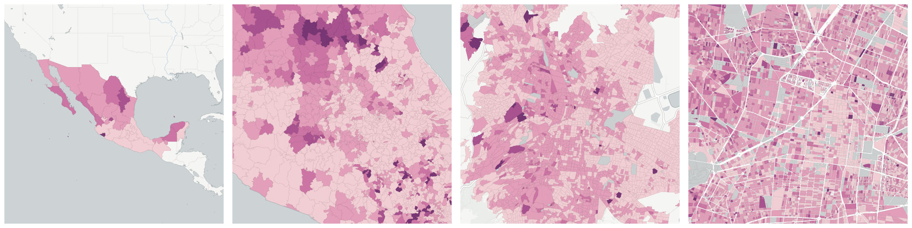
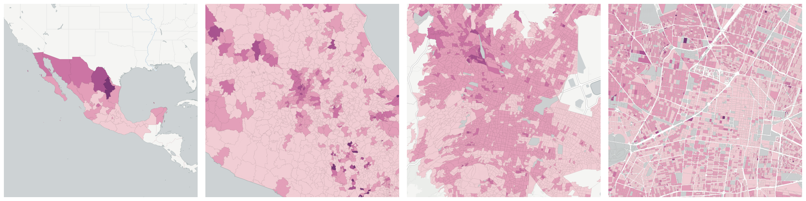
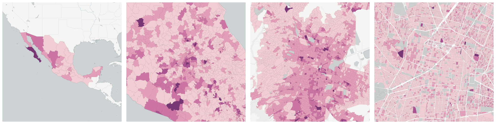
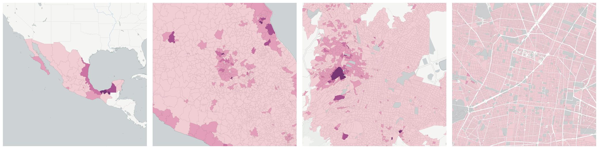
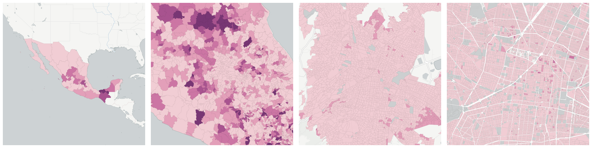
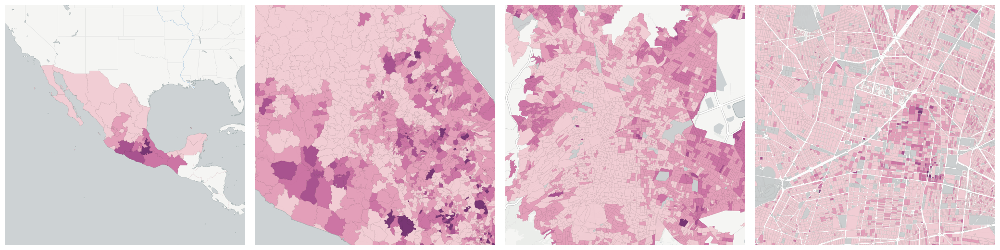

  
# Health

Breakdowns of the population by health

- [Population entitled to health services](#population-entitled-to-health-services)

- [Population with IMSS](#population-with-imss)

- [Population with ISSSTE or state ISSSTE](#population-with-issste-or-state-issste)

- [Population with Pemex, Sedena or Semar](#population-with-pemex-sedena-or-semar)

- [Population with Seguro Popular or Seguro Medico para una Nueva Generacion](#population-with-seguro-popular-or-seguro-medico-para-una-nueva-generacion)

- [Population without access to health services](#population-without-access-to-health-services)

## Population entitled to health services

Measure &quot;Population entitled to health services&quot;  density per sq. kilometer  for one point:

    UPDATE {table_name}
      SET {new_numeric_column} =
        OBS_GetMeasure(
          CDB_LatLng(40.7, -73.9),
          'mx.inegi_columns.SALUD1'
        );

Measure &quot;Population entitled to health services&quot; within an area:

    UPDATE {table_name}
      SET {new_numeric_column} =
        OBS_GetMeasure(
          ST_Buffer(CDB_LatLng(40.7, -73.9), 0.01),
          'mx.inegi_columns.SALUD1'
        );

Measure &quot;Population entitled to health services&quot; percent of &quot;Total population&quot; at one point:

    UPDATE {table_name}
      SET {new_numeric_column} =
        OBS_GetMeasure(
          CDB_LatLng(40.7, -73.9),
          'mx.inegi_columns.SALUD1',
          'denominator'
        );

Measure &quot;Population entitled to health services&quot; percent of &quot;Total population&quot; within an area:

    UPDATE {table_name}
      SET {new_numeric_column} =
        OBS_GetMeasure(
          ST_Buffer(CDB_LatLng(40.7, -73.9), 0.01),
          'mx.inegi_columns.SALUD1',
          'denominator'
        );

* denominator: [Total population](../age_gender/#mx-inegi-columns-pob1)

## Population with IMSS

Measure &quot;Population with IMSS&quot;  density per sq. kilometer  for one point:

    UPDATE {table_name}
      SET {new_numeric_column} =
        OBS_GetMeasure(
          CDB_LatLng(40.7, -73.9),
          'mx.inegi_columns.SALUD3'
        );

Measure &quot;Population with IMSS&quot; within an area:

    UPDATE {table_name}
      SET {new_numeric_column} =
        OBS_GetMeasure(
          ST_Buffer(CDB_LatLng(40.7, -73.9), 0.01),
          'mx.inegi_columns.SALUD3'
        );

Measure &quot;Population with IMSS&quot; percent of &quot;Total population&quot; at one point:

    UPDATE {table_name}
      SET {new_numeric_column} =
        OBS_GetMeasure(
          CDB_LatLng(40.7, -73.9),
          'mx.inegi_columns.SALUD3',
          'denominator'
        );

Measure &quot;Population with IMSS&quot; percent of &quot;Total population&quot; within an area:

    UPDATE {table_name}
      SET {new_numeric_column} =
        OBS_GetMeasure(
          ST_Buffer(CDB_LatLng(40.7, -73.9), 0.01),
          'mx.inegi_columns.SALUD3',
          'denominator'
        );

* denominator: [Total population](../age_gender/#mx-inegi-columns-pob1)

## Population with ISSSTE or state ISSSTE

Measure &quot;Population with ISSSTE or state ISSSTE&quot;  density per sq. kilometer  for one point:

    UPDATE {table_name}
      SET {new_numeric_column} =
        OBS_GetMeasure(
          CDB_LatLng(40.7, -73.9),
          'mx.inegi_columns.SALUD4'
        );

Measure &quot;Population with ISSSTE or state ISSSTE&quot; within an area:

    UPDATE {table_name}
      SET {new_numeric_column} =
        OBS_GetMeasure(
          ST_Buffer(CDB_LatLng(40.7, -73.9), 0.01),
          'mx.inegi_columns.SALUD4'
        );

Measure &quot;Population with ISSSTE or state ISSSTE&quot; percent of &quot;Total population&quot; at one point:

    UPDATE {table_name}
      SET {new_numeric_column} =
        OBS_GetMeasure(
          CDB_LatLng(40.7, -73.9),
          'mx.inegi_columns.SALUD4',
          'denominator'
        );

Measure &quot;Population with ISSSTE or state ISSSTE&quot; percent of &quot;Total population&quot; within an area:

    UPDATE {table_name}
      SET {new_numeric_column} =
        OBS_GetMeasure(
          ST_Buffer(CDB_LatLng(40.7, -73.9), 0.01),
          'mx.inegi_columns.SALUD4',
          'denominator'
        );

* denominator: [Total population](../age_gender/#mx-inegi-columns-pob1)

## Population with Pemex, Sedena or Semar

Measure &quot;Population with Pemex, Sedena or Semar&quot;  density per sq. kilometer  for one point:

    UPDATE {table_name}
      SET {new_numeric_column} =
        OBS_GetMeasure(
          CDB_LatLng(40.7, -73.9),
          'mx.inegi_columns.SALUD6'
        );

Measure &quot;Population with Pemex, Sedena or Semar&quot; within an area:

    UPDATE {table_name}
      SET {new_numeric_column} =
        OBS_GetMeasure(
          ST_Buffer(CDB_LatLng(40.7, -73.9), 0.01),
          'mx.inegi_columns.SALUD6'
        );

Measure &quot;Population with Pemex, Sedena or Semar&quot; percent of &quot;Total population&quot; at one point:

    UPDATE {table_name}
      SET {new_numeric_column} =
        OBS_GetMeasure(
          CDB_LatLng(40.7, -73.9),
          'mx.inegi_columns.SALUD6',
          'denominator'
        );

Measure &quot;Population with Pemex, Sedena or Semar&quot; percent of &quot;Total population&quot; within an area:

    UPDATE {table_name}
      SET {new_numeric_column} =
        OBS_GetMeasure(
          ST_Buffer(CDB_LatLng(40.7, -73.9), 0.01),
          'mx.inegi_columns.SALUD6',
          'denominator'
        );

* denominator: [Total population](../age_gender/#mx-inegi-columns-pob1)

## Population with Seguro Popular or Seguro Medico para una Nueva Generacion

Measure &quot;Population with Seguro Popular or Seguro Medico para una Nueva Generacion&quot;  density per sq. kilometer  for one point:

    UPDATE {table_name}
      SET {new_numeric_column} =
        OBS_GetMeasure(
          CDB_LatLng(40.7, -73.9),
          'mx.inegi_columns.SALUD5'
        );

Measure &quot;Population with Seguro Popular or Seguro Medico para una Nueva Generacion&quot; within an area:

    UPDATE {table_name}
      SET {new_numeric_column} =
        OBS_GetMeasure(
          ST_Buffer(CDB_LatLng(40.7, -73.9), 0.01),
          'mx.inegi_columns.SALUD5'
        );

Measure &quot;Population with Seguro Popular or Seguro Medico para una Nueva Generacion&quot; percent of &quot;Total population&quot; at one point:

    UPDATE {table_name}
      SET {new_numeric_column} =
        OBS_GetMeasure(
          CDB_LatLng(40.7, -73.9),
          'mx.inegi_columns.SALUD5',
          'denominator'
        );

Measure &quot;Population with Seguro Popular or Seguro Medico para una Nueva Generacion&quot; percent of &quot;Total population&quot; within an area:

    UPDATE {table_name}
      SET {new_numeric_column} =
        OBS_GetMeasure(
          ST_Buffer(CDB_LatLng(40.7, -73.9), 0.01),
          'mx.inegi_columns.SALUD5',
          'denominator'
        );

* denominator: [Total population](../age_gender/#mx-inegi-columns-pob1)

## Population without access to health services

Measure &quot;Population without access to health services&quot;  density per sq. kilometer  for one point:

    UPDATE {table_name}
      SET {new_numeric_column} =
        OBS_GetMeasure(
          CDB_LatLng(40.7, -73.9),
          'mx.inegi_columns.SALUD2'
        );

Measure &quot;Population without access to health services&quot; within an area:

    UPDATE {table_name}
      SET {new_numeric_column} =
        OBS_GetMeasure(
          ST_Buffer(CDB_LatLng(40.7, -73.9), 0.01),
          'mx.inegi_columns.SALUD2'
        );

Measure &quot;Population without access to health services&quot; percent of &quot;Total population&quot; at one point:

    UPDATE {table_name}
      SET {new_numeric_column} =
        OBS_GetMeasure(
          CDB_LatLng(40.7, -73.9),
          'mx.inegi_columns.SALUD2',
          'denominator'
        );

Measure &quot;Population without access to health services&quot; percent of &quot;Total population&quot; within an area:

    UPDATE {table_name}
      SET {new_numeric_column} =
        OBS_GetMeasure(
          ST_Buffer(CDB_LatLng(40.7, -73.9), 0.01),
          'mx.inegi_columns.SALUD2',
          'denominator'
        );

* denominator: [Total population](../age_gender/#mx-inegi-columns-pob1)

