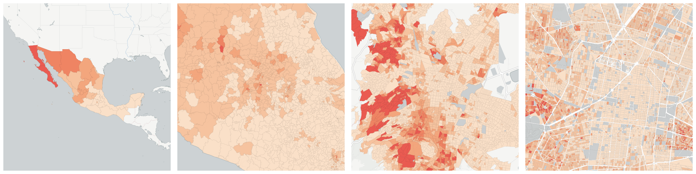
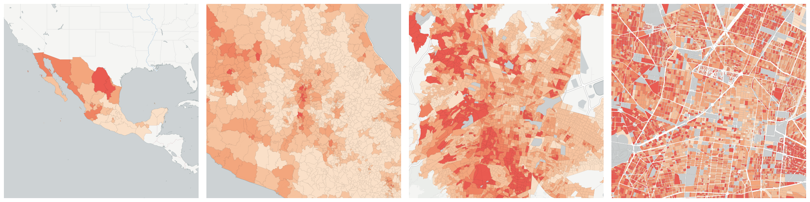
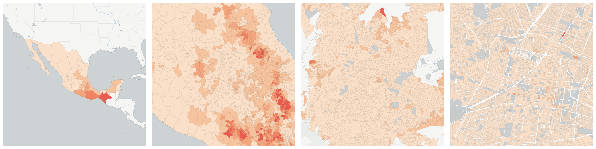

  
# Housing

What type of housing exists and how do people live in it?

- [Average number of people per private occupied dwellings](#average-number-of-people-per-private-occupied-dwellings)

- [Average number of people per room in private occupied dwellings](#average-number-of-people-per-room-in-private-occupied-dwellings)

- [Dwellings](#dwellings)

    * [Occupied dwellings](#occupied-dwellings)

        - [Occupied private dwellings](#occupied-private-dwellings)

        - [One room private occupied dwellings](#one-room-private-occupied-dwellings)

        - [Private occupied dwellings with 2.5 people per bedroom or more](#private-occupied-dwellings-with-2-5-people-per-bedroom-or-more)

        - [Private occupied dwellings with 3 people per bedroom or more](#private-occupied-dwellings-with-3-people-per-bedroom-or-more)

        - [Private occupied dwellings with a bathroom or toilet](#private-occupied-dwellings-with-a-bathroom-or-toilet)

        - [Private occupied dwellings with a car or van](#private-occupied-dwellings-with-a-car-or-van)

        - [Private occupied dwellings with a cellphone](#private-occupied-dwellings-with-a-cellphone)

        - [Private occupied dwellings with a computer](#private-occupied-dwellings-with-a-computer)

        - [Private occupied dwellings with a landline](#private-occupied-dwellings-with-a-landline)

        - [Private occupied dwellings with a radio](#private-occupied-dwellings-with-a-radio)

        - [Private occupied dwellings with a refrigator](#private-occupied-dwellings-with-a-refrigator)

        - [Private occupied dwellings with a television](#private-occupied-dwellings-with-a-television)

        - [Private occupied dwellings with a washer](#private-occupied-dwellings-with-a-washer)

        - [Private occupied dwellings with drainage](#private-occupied-dwellings-with-drainage)

        - [Private occupied dwellings with earthen floor](#private-occupied-dwellings-with-earthen-floor)

        - [Private occupied dwellings with electric light](#private-occupied-dwellings-with-electric-light)

        - [Private occupied dwellings with electric light, running water and drainage](#private-occupied-dwellings-with-electric-light-running-water-and-drainage)

        - [Private occupied dwellings with Internet access](#private-occupied-dwellings-with-internet-access)

        - [Private occupied dwellings with neither a computer nor Internet access](#private-occupied-dwellings-with-neither-a-computer-nor-internet-access)

        - [Private occupied dwellings with neither a landline nor a cellphone](#private-occupied-dwellings-with-neither-a-landline-nor-a-cellphone)

        - [Private occupied dwellings with neither electric light, running water nor drainage](#private-occupied-dwellings-with-neither-electric-light-running-water-nor-drainage)

        - [Private occupied dwellings with neither refigerator nor washer](#private-occupied-dwellings-with-neither-refigerator-nor-washer)

        - [Private occupied dwellings with neither refigerator, washer, nor car or van](#private-occupied-dwellings-with-neither-refigerator-washer-nor-car-or-van)

        - [Private occupied dwellings with neither television nor radio](#private-occupied-dwellings-with-neither-television-nor-radio)

        - [Private occupied dwellings with no physical property](#private-occupied-dwellings-with-no-physical-property)

        - [Private occupied dwellings with one bedroom](#private-occupied-dwellings-with-one-bedroom)

        - [Private occupied dwellings with running water](#private-occupied-dwellings-with-running-water)

        - [Private occupied dwellings with two bedrooms or more](#private-occupied-dwellings-with-two-bedrooms-or-more)

        - [Private occupied dwellings without a bathroom or toilet](#private-occupied-dwellings-without-a-bathroom-or-toilet)

        - [Private occupied dwellings without any information or communication technology](#private-occupied-dwellings-without-any-information-or-communication-technology)

        - [Private occupied dwellings without drainage](#private-occupied-dwellings-without-drainage)

        - [Private occupied dwellings without electric light](#private-occupied-dwellings-without-electric-light)

        - [Private occupied dwellings without running water](#private-occupied-dwellings-without-running-water)

        - [Three or more room private occupied dwellings](#three-or-more-room-private-occupied-dwellings)

        - [Two room private occupied dwellings](#two-room-private-occupied-dwellings)

- [Population in occupied private dwellings](#population-in-occupied-private-dwellings)

- [Population in private occupied dwellings with a bathroom or toilet](#population-in-private-occupied-dwellings-with-a-bathroom-or-toilet)

- [Population in private occupied dwellings with running water](#population-in-private-occupied-dwellings-with-running-water)

## Average number of people per private occupied dwellings

Measure &quot;Average number of people per private occupied dwellings&quot;  for one point:

    UPDATE {table_name}
      SET {new_numeric_column} =
        OBS_GetMeasure(
          CDB_LatLng(40.7, -73.9),
          'mx.inegi_columns.VIV4_R'
        );

Average number of people per private occupied dwellings is only available for point lookups.

## Average number of people per room in private occupied dwellings

Measure &quot;Average number of people per room in private occupied dwellings&quot;  for one point:

    UPDATE {table_name}
      SET {new_numeric_column} =
        OBS_GetMeasure(
          CDB_LatLng(40.7, -73.9),
          'mx.inegi_columns.VIV5_R'
        );

Average number of people per room in private occupied dwellings is only available for point lookups.

## Dwellings

Measure &quot;Dwellings&quot;  density per sq. kilometer  for one point:

    UPDATE {table_name}
      SET {new_numeric_column} =
        OBS_GetMeasure(
          CDB_LatLng(40.7, -73.9),
          'mx.inegi_columns.VIV0'
        );

Measure &quot;Dwellings&quot; within an area:

    UPDATE {table_name}
      SET {new_numeric_column} =
        OBS_GetMeasure(
          ST_Buffer(CDB_LatLng(40.7, -73.9), 0.01),
          'mx.inegi_columns.VIV0'
        );

Subcolumns of Dwellings

- [Occupied dwellings](#occupied-dwellings)

### Occupied dwellings

Measure &quot;Occupied dwellings&quot;  density per sq. kilometer  for one point:

    UPDATE {table_name}
      SET {new_numeric_column} =
        OBS_GetMeasure(
          CDB_LatLng(40.7, -73.9),
          'mx.inegi_columns.VIV1'
        );

Measure &quot;Occupied dwellings&quot; within an area:

    UPDATE {table_name}
      SET {new_numeric_column} =
        OBS_GetMeasure(
          ST_Buffer(CDB_LatLng(40.7, -73.9), 0.01),
          'mx.inegi_columns.VIV1'
        );

Measure &quot;Occupied dwellings&quot; percent of &quot;Dwellings&quot; at one point:

    UPDATE {table_name}
      SET {new_numeric_column} =
        OBS_GetMeasure(
          CDB_LatLng(40.7, -73.9),
          'mx.inegi_columns.VIV1',
          'denominator'
        );

Measure &quot;Occupied dwellings&quot; percent of &quot;Dwellings&quot; within an area:

    UPDATE {table_name}
      SET {new_numeric_column} =
        OBS_GetMeasure(
          ST_Buffer(CDB_LatLng(40.7, -73.9), 0.01),
          'mx.inegi_columns.VIV1',
          'denominator'
        );

* denominator: [Dwellings](#mx-inegi-columns-viv0)

Subcolumns of Occupied dwellings

- [Occupied private dwellings](#occupied-private-dwellings)

- [One room private occupied dwellings](#one-room-private-occupied-dwellings)

- [Private occupied dwellings with 2.5 people per bedroom or more](#private-occupied-dwellings-with-2-5-people-per-bedroom-or-more)

- [Private occupied dwellings with 3 people per bedroom or more](#private-occupied-dwellings-with-3-people-per-bedroom-or-more)

- [Private occupied dwellings with a bathroom or toilet](#private-occupied-dwellings-with-a-bathroom-or-toilet)

- [Private occupied dwellings with a car or van](#private-occupied-dwellings-with-a-car-or-van)

- [Private occupied dwellings with a cellphone](#private-occupied-dwellings-with-a-cellphone)

- [Private occupied dwellings with a computer](#private-occupied-dwellings-with-a-computer)

- [Private occupied dwellings with a landline](#private-occupied-dwellings-with-a-landline)

- [Private occupied dwellings with a radio](#private-occupied-dwellings-with-a-radio)

- [Private occupied dwellings with a refrigator](#private-occupied-dwellings-with-a-refrigator)

- [Private occupied dwellings with a television](#private-occupied-dwellings-with-a-television)

- [Private occupied dwellings with a washer](#private-occupied-dwellings-with-a-washer)

- [Private occupied dwellings with drainage](#private-occupied-dwellings-with-drainage)

- [Private occupied dwellings with earthen floor](#private-occupied-dwellings-with-earthen-floor)

- [Private occupied dwellings with electric light](#private-occupied-dwellings-with-electric-light)

- [Private occupied dwellings with electric light, running water and drainage](#private-occupied-dwellings-with-electric-light-running-water-and-drainage)

- [Private occupied dwellings with Internet access](#private-occupied-dwellings-with-internet-access)

- [Private occupied dwellings with neither a computer nor Internet access](#private-occupied-dwellings-with-neither-a-computer-nor-internet-access)

- [Private occupied dwellings with neither a landline nor a cellphone](#private-occupied-dwellings-with-neither-a-landline-nor-a-cellphone)

- [Private occupied dwellings with neither electric light, running water nor drainage](#private-occupied-dwellings-with-neither-electric-light-running-water-nor-drainage)

- [Private occupied dwellings with neither refigerator nor washer](#private-occupied-dwellings-with-neither-refigerator-nor-washer)

- [Private occupied dwellings with neither refigerator, washer, nor car or van](#private-occupied-dwellings-with-neither-refigerator-washer-nor-car-or-van)

- [Private occupied dwellings with neither television nor radio](#private-occupied-dwellings-with-neither-television-nor-radio)

- [Private occupied dwellings with no physical property](#private-occupied-dwellings-with-no-physical-property)

- [Private occupied dwellings with one bedroom](#private-occupied-dwellings-with-one-bedroom)

- [Private occupied dwellings with running water](#private-occupied-dwellings-with-running-water)

- [Private occupied dwellings with two bedrooms or more](#private-occupied-dwellings-with-two-bedrooms-or-more)

- [Private occupied dwellings without a bathroom or toilet](#private-occupied-dwellings-without-a-bathroom-or-toilet)

- [Private occupied dwellings without any information or communication technology](#private-occupied-dwellings-without-any-information-or-communication-technology)

- [Private occupied dwellings without drainage](#private-occupied-dwellings-without-drainage)

- [Private occupied dwellings without electric light](#private-occupied-dwellings-without-electric-light)

- [Private occupied dwellings without running water](#private-occupied-dwellings-without-running-water)

- [Three or more room private occupied dwellings](#three-or-more-room-private-occupied-dwellings)

- [Two room private occupied dwellings](#two-room-private-occupied-dwellings)

#### Occupied private dwellings

Measure &quot;Occupied private dwellings&quot;  density per sq. kilometer  for one point:

    UPDATE {table_name}
      SET {new_numeric_column} =
        OBS_GetMeasure(
          CDB_LatLng(40.7, -73.9),
          'mx.inegi_columns.VIV2'
        );

Measure &quot;Occupied private dwellings&quot; within an area:

    UPDATE {table_name}
      SET {new_numeric_column} =
        OBS_GetMeasure(
          ST_Buffer(CDB_LatLng(40.7, -73.9), 0.01),
          'mx.inegi_columns.VIV2'
        );

Measure &quot;Occupied private dwellings&quot; percent of &quot;Occupied dwellings&quot; at one point:

    UPDATE {table_name}
      SET {new_numeric_column} =
        OBS_GetMeasure(
          CDB_LatLng(40.7, -73.9),
          'mx.inegi_columns.VIV2',
          'denominator'
        );

Measure &quot;Occupied private dwellings&quot; percent of &quot;Occupied dwellings&quot; within an area:

    UPDATE {table_name}
      SET {new_numeric_column} =
        OBS_GetMeasure(
          ST_Buffer(CDB_LatLng(40.7, -73.9), 0.01),
          'mx.inegi_columns.VIV2',
          'denominator'
        );

* denominator: [Occupied dwellings](#mx-inegi-columns-viv1)

#### One room private occupied dwellings

Measure &quot;One room private occupied dwellings&quot;  density per sq. kilometer  for one point:

    UPDATE {table_name}
      SET {new_numeric_column} =
        OBS_GetMeasure(
          CDB_LatLng(40.7, -73.9),
          'mx.inegi_columns.VIV10'
        );

Measure &quot;One room private occupied dwellings&quot; within an area:

    UPDATE {table_name}
      SET {new_numeric_column} =
        OBS_GetMeasure(
          ST_Buffer(CDB_LatLng(40.7, -73.9), 0.01),
          'mx.inegi_columns.VIV10'
        );

Measure &quot;One room private occupied dwellings&quot; percent of &quot;Occupied private dwellings&quot; at one point:

    UPDATE {table_name}
      SET {new_numeric_column} =
        OBS_GetMeasure(
          CDB_LatLng(40.7, -73.9),
          'mx.inegi_columns.VIV10',
          'denominator'
        );

Measure &quot;One room private occupied dwellings&quot; percent of &quot;Occupied private dwellings&quot; within an area:

    UPDATE {table_name}
      SET {new_numeric_column} =
        OBS_GetMeasure(
          ST_Buffer(CDB_LatLng(40.7, -73.9), 0.01),
          'mx.inegi_columns.VIV10',
          'denominator'
        );

* denominator: [Occupied private dwellings](#mx-inegi-columns-viv2)

#### Private occupied dwellings with 2.5 people per bedroom or more

Measure &quot;Private occupied dwellings with 2.5 people per bedroom or more&quot;  density per sq. kilometer  for one point:

    UPDATE {table_name}
      SET {new_numeric_column} =
        OBS_GetMeasure(
          CDB_LatLng(40.7, -73.9),
          'mx.inegi_columns.VIV9'
        );

Measure &quot;Private occupied dwellings with 2.5 people per bedroom or more&quot; within an area:

    UPDATE {table_name}
      SET {new_numeric_column} =
        OBS_GetMeasure(
          ST_Buffer(CDB_LatLng(40.7, -73.9), 0.01),
          'mx.inegi_columns.VIV9'
        );

Measure &quot;Private occupied dwellings with 2.5 people per bedroom or more&quot; percent of &quot;Occupied private dwellings&quot; at one point:

    UPDATE {table_name}
      SET {new_numeric_column} =
        OBS_GetMeasure(
          CDB_LatLng(40.7, -73.9),
          'mx.inegi_columns.VIV9',
          'denominator'
        );

Measure &quot;Private occupied dwellings with 2.5 people per bedroom or more&quot; percent of &quot;Occupied private dwellings&quot; within an area:

    UPDATE {table_name}
      SET {new_numeric_column} =
        OBS_GetMeasure(
          ST_Buffer(CDB_LatLng(40.7, -73.9), 0.01),
          'mx.inegi_columns.VIV9',
          'denominator'
        );

* denominator: [Occupied private dwellings](#mx-inegi-columns-viv2)

#### Private occupied dwellings with 3 people per bedroom or more

Measure &quot;Private occupied dwellings with 3 people per bedroom or more&quot;  density per sq. kilometer  for one point:

    UPDATE {table_name}
      SET {new_numeric_column} =
        OBS_GetMeasure(
          CDB_LatLng(40.7, -73.9),
          'mx.inegi_columns.VIV13'
        );

Measure &quot;Private occupied dwellings with 3 people per bedroom or more&quot; within an area:

    UPDATE {table_name}
      SET {new_numeric_column} =
        OBS_GetMeasure(
          ST_Buffer(CDB_LatLng(40.7, -73.9), 0.01),
          'mx.inegi_columns.VIV13'
        );

Measure &quot;Private occupied dwellings with 3 people per bedroom or more&quot; percent of &quot;Occupied private dwellings&quot; at one point:

    UPDATE {table_name}
      SET {new_numeric_column} =
        OBS_GetMeasure(
          CDB_LatLng(40.7, -73.9),
          'mx.inegi_columns.VIV13',
          'denominator'
        );

Measure &quot;Private occupied dwellings with 3 people per bedroom or more&quot; percent of &quot;Occupied private dwellings&quot; within an area:

    UPDATE {table_name}
      SET {new_numeric_column} =
        OBS_GetMeasure(
          ST_Buffer(CDB_LatLng(40.7, -73.9), 0.01),
          'mx.inegi_columns.VIV13',
          'denominator'
        );

* denominator: [Occupied private dwellings](#mx-inegi-columns-viv2)

#### Private occupied dwellings with a bathroom or toilet

Measure &quot;Private occupied dwellings with a bathroom or toilet&quot;  density per sq. kilometer  for one point:

    UPDATE {table_name}
      SET {new_numeric_column} =
        OBS_GetMeasure(
          CDB_LatLng(40.7, -73.9),
          'mx.inegi_columns.VIV19'
        );

Measure &quot;Private occupied dwellings with a bathroom or toilet&quot; within an area:

    UPDATE {table_name}
      SET {new_numeric_column} =
        OBS_GetMeasure(
          ST_Buffer(CDB_LatLng(40.7, -73.9), 0.01),
          'mx.inegi_columns.VIV19'
        );

Measure &quot;Private occupied dwellings with a bathroom or toilet&quot; percent of &quot;Occupied private dwellings&quot; at one point:

    UPDATE {table_name}
      SET {new_numeric_column} =
        OBS_GetMeasure(
          CDB_LatLng(40.7, -73.9),
          'mx.inegi_columns.VIV19',
          'denominator'
        );

Measure &quot;Private occupied dwellings with a bathroom or toilet&quot; percent of &quot;Occupied private dwellings&quot; within an area:

    UPDATE {table_name}
      SET {new_numeric_column} =
        OBS_GetMeasure(
          ST_Buffer(CDB_LatLng(40.7, -73.9), 0.01),
          'mx.inegi_columns.VIV19',
          'denominator'
        );

* denominator: [Occupied private dwellings](#mx-inegi-columns-viv2)

#### Private occupied dwellings with a car or van

Measure &quot;Private occupied dwellings with a car or van&quot;  density per sq. kilometer  for one point:

    UPDATE {table_name}
      SET {new_numeric_column} =
        OBS_GetMeasure(
          CDB_LatLng(40.7, -73.9),
          'mx.inegi_columns.VIV28'
        );

Measure &quot;Private occupied dwellings with a car or van&quot; within an area:

    UPDATE {table_name}
      SET {new_numeric_column} =
        OBS_GetMeasure(
          ST_Buffer(CDB_LatLng(40.7, -73.9), 0.01),
          'mx.inegi_columns.VIV28'
        );

Measure &quot;Private occupied dwellings with a car or van&quot; percent of &quot;Occupied private dwellings&quot; at one point:

    UPDATE {table_name}
      SET {new_numeric_column} =
        OBS_GetMeasure(
          CDB_LatLng(40.7, -73.9),
          'mx.inegi_columns.VIV28',
          'denominator'
        );

Measure &quot;Private occupied dwellings with a car or van&quot; percent of &quot;Occupied private dwellings&quot; within an area:

    UPDATE {table_name}
      SET {new_numeric_column} =
        OBS_GetMeasure(
          ST_Buffer(CDB_LatLng(40.7, -73.9), 0.01),
          'mx.inegi_columns.VIV28',
          'denominator'
        );

* denominator: [Occupied private dwellings](#mx-inegi-columns-viv2)

#### Private occupied dwellings with a cellphone

Measure &quot;Private occupied dwellings with a cellphone&quot;  density per sq. kilometer  for one point:

    UPDATE {table_name}
      SET {new_numeric_column} =
        OBS_GetMeasure(
          CDB_LatLng(40.7, -73.9),
          'mx.inegi_columns.VIV35'
        );

Measure &quot;Private occupied dwellings with a cellphone&quot; within an area:

    UPDATE {table_name}
      SET {new_numeric_column} =
        OBS_GetMeasure(
          ST_Buffer(CDB_LatLng(40.7, -73.9), 0.01),
          'mx.inegi_columns.VIV35'
        );

Measure &quot;Private occupied dwellings with a cellphone&quot; percent of &quot;Occupied private dwellings&quot; at one point:

    UPDATE {table_name}
      SET {new_numeric_column} =
        OBS_GetMeasure(
          CDB_LatLng(40.7, -73.9),
          'mx.inegi_columns.VIV35',
          'denominator'
        );

Measure &quot;Private occupied dwellings with a cellphone&quot; percent of &quot;Occupied private dwellings&quot; within an area:

    UPDATE {table_name}
      SET {new_numeric_column} =
        OBS_GetMeasure(
          ST_Buffer(CDB_LatLng(40.7, -73.9), 0.01),
          'mx.inegi_columns.VIV35',
          'denominator'
        );

* denominator: [Occupied private dwellings](#mx-inegi-columns-viv2)

#### Private occupied dwellings with a computer

Measure &quot;Private occupied dwellings with a computer&quot;  density per sq. kilometer  for one point:

    UPDATE {table_name}
      SET {new_numeric_column} =
        OBS_GetMeasure(
          CDB_LatLng(40.7, -73.9),
          'mx.inegi_columns.VIV33'
        );

Measure &quot;Private occupied dwellings with a computer&quot; within an area:

    UPDATE {table_name}
      SET {new_numeric_column} =
        OBS_GetMeasure(
          ST_Buffer(CDB_LatLng(40.7, -73.9), 0.01),
          'mx.inegi_columns.VIV33'
        );

Measure &quot;Private occupied dwellings with a computer&quot; percent of &quot;Occupied private dwellings&quot; at one point:

    UPDATE {table_name}
      SET {new_numeric_column} =
        OBS_GetMeasure(
          CDB_LatLng(40.7, -73.9),
          'mx.inegi_columns.VIV33',
          'denominator'
        );

Measure &quot;Private occupied dwellings with a computer&quot; percent of &quot;Occupied private dwellings&quot; within an area:

    UPDATE {table_name}
      SET {new_numeric_column} =
        OBS_GetMeasure(
          ST_Buffer(CDB_LatLng(40.7, -73.9), 0.01),
          'mx.inegi_columns.VIV33',
          'denominator'
        );

* denominator: [Occupied private dwellings](#mx-inegi-columns-viv2)

#### Private occupied dwellings with a landline

Measure &quot;Private occupied dwellings with a landline&quot;  density per sq. kilometer  for one point:

    UPDATE {table_name}
      SET {new_numeric_column} =
        OBS_GetMeasure(
          CDB_LatLng(40.7, -73.9),
          'mx.inegi_columns.VIV34'
        );

Measure &quot;Private occupied dwellings with a landline&quot; within an area:

    UPDATE {table_name}
      SET {new_numeric_column} =
        OBS_GetMeasure(
          ST_Buffer(CDB_LatLng(40.7, -73.9), 0.01),
          'mx.inegi_columns.VIV34'
        );

Measure &quot;Private occupied dwellings with a landline&quot; percent of &quot;Occupied private dwellings&quot; at one point:

    UPDATE {table_name}
      SET {new_numeric_column} =
        OBS_GetMeasure(
          CDB_LatLng(40.7, -73.9),
          'mx.inegi_columns.VIV34',
          'denominator'
        );

Measure &quot;Private occupied dwellings with a landline&quot; percent of &quot;Occupied private dwellings&quot; within an area:

    UPDATE {table_name}
      SET {new_numeric_column} =
        OBS_GetMeasure(
          ST_Buffer(CDB_LatLng(40.7, -73.9), 0.01),
          'mx.inegi_columns.VIV34',
          'denominator'
        );

* denominator: [Occupied private dwellings](#mx-inegi-columns-viv2)

#### Private occupied dwellings with a radio

Measure &quot;Private occupied dwellings with a radio&quot;  density per sq. kilometer  for one point:

    UPDATE {table_name}
      SET {new_numeric_column} =
        OBS_GetMeasure(
          CDB_LatLng(40.7, -73.9),
          'mx.inegi_columns.VIV31'
        );

Measure &quot;Private occupied dwellings with a radio&quot; within an area:

    UPDATE {table_name}
      SET {new_numeric_column} =
        OBS_GetMeasure(
          ST_Buffer(CDB_LatLng(40.7, -73.9), 0.01),
          'mx.inegi_columns.VIV31'
        );

Measure &quot;Private occupied dwellings with a radio&quot; percent of &quot;Occupied private dwellings&quot; at one point:

    UPDATE {table_name}
      SET {new_numeric_column} =
        OBS_GetMeasure(
          CDB_LatLng(40.7, -73.9),
          'mx.inegi_columns.VIV31',
          'denominator'
        );

Measure &quot;Private occupied dwellings with a radio&quot; percent of &quot;Occupied private dwellings&quot; within an area:

    UPDATE {table_name}
      SET {new_numeric_column} =
        OBS_GetMeasure(
          ST_Buffer(CDB_LatLng(40.7, -73.9), 0.01),
          'mx.inegi_columns.VIV31',
          'denominator'
        );

* denominator: [Occupied private dwellings](#mx-inegi-columns-viv2)

#### Private occupied dwellings with a refrigator

Measure &quot;Private occupied dwellings with a refrigator&quot;  density per sq. kilometer  for one point:

    UPDATE {table_name}
      SET {new_numeric_column} =
        OBS_GetMeasure(
          CDB_LatLng(40.7, -73.9),
          'mx.inegi_columns.VIV26'
        );

Measure &quot;Private occupied dwellings with a refrigator&quot; within an area:

    UPDATE {table_name}
      SET {new_numeric_column} =
        OBS_GetMeasure(
          ST_Buffer(CDB_LatLng(40.7, -73.9), 0.01),
          'mx.inegi_columns.VIV26'
        );

Measure &quot;Private occupied dwellings with a refrigator&quot; percent of &quot;Occupied private dwellings&quot; at one point:

    UPDATE {table_name}
      SET {new_numeric_column} =
        OBS_GetMeasure(
          CDB_LatLng(40.7, -73.9),
          'mx.inegi_columns.VIV26',
          'denominator'
        );

Measure &quot;Private occupied dwellings with a refrigator&quot; percent of &quot;Occupied private dwellings&quot; within an area:

    UPDATE {table_name}
      SET {new_numeric_column} =
        OBS_GetMeasure(
          ST_Buffer(CDB_LatLng(40.7, -73.9), 0.01),
          'mx.inegi_columns.VIV26',
          'denominator'
        );

* denominator: [Occupied private dwellings](#mx-inegi-columns-viv2)

#### Private occupied dwellings with a television

Measure &quot;Private occupied dwellings with a television&quot;  density per sq. kilometer  for one point:

    UPDATE {table_name}
      SET {new_numeric_column} =
        OBS_GetMeasure(
          CDB_LatLng(40.7, -73.9),
          'mx.inegi_columns.VIV32'
        );

Measure &quot;Private occupied dwellings with a television&quot; within an area:

    UPDATE {table_name}
      SET {new_numeric_column} =
        OBS_GetMeasure(
          ST_Buffer(CDB_LatLng(40.7, -73.9), 0.01),
          'mx.inegi_columns.VIV32'
        );

Measure &quot;Private occupied dwellings with a television&quot; percent of &quot;Occupied private dwellings&quot; at one point:

    UPDATE {table_name}
      SET {new_numeric_column} =
        OBS_GetMeasure(
          CDB_LatLng(40.7, -73.9),
          'mx.inegi_columns.VIV32',
          'denominator'
        );

Measure &quot;Private occupied dwellings with a television&quot; percent of &quot;Occupied private dwellings&quot; within an area:

    UPDATE {table_name}
      SET {new_numeric_column} =
        OBS_GetMeasure(
          ST_Buffer(CDB_LatLng(40.7, -73.9), 0.01),
          'mx.inegi_columns.VIV32',
          'denominator'
        );

* denominator: [Occupied private dwellings](#mx-inegi-columns-viv2)

#### Private occupied dwellings with a washer

Measure &quot;Private occupied dwellings with a washer&quot;  density per sq. kilometer  for one point:

    UPDATE {table_name}
      SET {new_numeric_column} =
        OBS_GetMeasure(
          CDB_LatLng(40.7, -73.9),
          'mx.inegi_columns.VIV27'
        );

Measure &quot;Private occupied dwellings with a washer&quot; within an area:

    UPDATE {table_name}
      SET {new_numeric_column} =
        OBS_GetMeasure(
          ST_Buffer(CDB_LatLng(40.7, -73.9), 0.01),
          'mx.inegi_columns.VIV27'
        );

Measure &quot;Private occupied dwellings with a washer&quot; percent of &quot;Occupied private dwellings&quot; at one point:

    UPDATE {table_name}
      SET {new_numeric_column} =
        OBS_GetMeasure(
          CDB_LatLng(40.7, -73.9),
          'mx.inegi_columns.VIV27',
          'denominator'
        );

Measure &quot;Private occupied dwellings with a washer&quot; percent of &quot;Occupied private dwellings&quot; within an area:

    UPDATE {table_name}
      SET {new_numeric_column} =
        OBS_GetMeasure(
          ST_Buffer(CDB_LatLng(40.7, -73.9), 0.01),
          'mx.inegi_columns.VIV27',
          'denominator'
        );

* denominator: [Occupied private dwellings](#mx-inegi-columns-viv2)

#### Private occupied dwellings with drainage

Measure &quot;Private occupied dwellings with drainage&quot;  density per sq. kilometer  for one point:

    UPDATE {table_name}
      SET {new_numeric_column} =
        OBS_GetMeasure(
          CDB_LatLng(40.7, -73.9),
          'mx.inegi_columns.VIV22'
        );

Measure &quot;Private occupied dwellings with drainage&quot; within an area:

    UPDATE {table_name}
      SET {new_numeric_column} =
        OBS_GetMeasure(
          ST_Buffer(CDB_LatLng(40.7, -73.9), 0.01),
          'mx.inegi_columns.VIV22'
        );

Measure &quot;Private occupied dwellings with drainage&quot; percent of &quot;Occupied private dwellings&quot; at one point:

    UPDATE {table_name}
      SET {new_numeric_column} =
        OBS_GetMeasure(
          CDB_LatLng(40.7, -73.9),
          'mx.inegi_columns.VIV22',
          'denominator'
        );

Measure &quot;Private occupied dwellings with drainage&quot; percent of &quot;Occupied private dwellings&quot; within an area:

    UPDATE {table_name}
      SET {new_numeric_column} =
        OBS_GetMeasure(
          ST_Buffer(CDB_LatLng(40.7, -73.9), 0.01),
          'mx.inegi_columns.VIV22',
          'denominator'
        );

* denominator: [Occupied private dwellings](#mx-inegi-columns-viv2)

#### Private occupied dwellings with earthen floor

Measure &quot;Private occupied dwellings with earthen floor&quot;  density per sq. kilometer  for one point:

    UPDATE {table_name}
      SET {new_numeric_column} =
        OBS_GetMeasure(
          CDB_LatLng(40.7, -73.9),
          'mx.inegi_columns.VIV6'
        );

Measure &quot;Private occupied dwellings with earthen floor&quot; within an area:

    UPDATE {table_name}
      SET {new_numeric_column} =
        OBS_GetMeasure(
          ST_Buffer(CDB_LatLng(40.7, -73.9), 0.01),
          'mx.inegi_columns.VIV6'
        );

Measure &quot;Private occupied dwellings with earthen floor&quot; percent of &quot;Occupied private dwellings&quot; at one point:

    UPDATE {table_name}
      SET {new_numeric_column} =
        OBS_GetMeasure(
          CDB_LatLng(40.7, -73.9),
          'mx.inegi_columns.VIV6',
          'denominator'
        );

Measure &quot;Private occupied dwellings with earthen floor&quot; percent of &quot;Occupied private dwellings&quot; within an area:

    UPDATE {table_name}
      SET {new_numeric_column} =
        OBS_GetMeasure(
          ST_Buffer(CDB_LatLng(40.7, -73.9), 0.01),
          'mx.inegi_columns.VIV6',
          'denominator'
        );

* denominator: [Occupied private dwellings](#mx-inegi-columns-viv2)

#### Private occupied dwellings with electric light

Measure &quot;Private occupied dwellings with electric light&quot;  density per sq. kilometer  for one point:

    UPDATE {table_name}
      SET {new_numeric_column} =
        OBS_GetMeasure(
          CDB_LatLng(40.7, -73.9),
          'mx.inegi_columns.VIV14'
        );

Measure &quot;Private occupied dwellings with electric light&quot; within an area:

    UPDATE {table_name}
      SET {new_numeric_column} =
        OBS_GetMeasure(
          ST_Buffer(CDB_LatLng(40.7, -73.9), 0.01),
          'mx.inegi_columns.VIV14'
        );

Measure &quot;Private occupied dwellings with electric light&quot; percent of &quot;Occupied private dwellings&quot; at one point:

    UPDATE {table_name}
      SET {new_numeric_column} =
        OBS_GetMeasure(
          CDB_LatLng(40.7, -73.9),
          'mx.inegi_columns.VIV14',
          'denominator'
        );

Measure &quot;Private occupied dwellings with electric light&quot; percent of &quot;Occupied private dwellings&quot; within an area:

    UPDATE {table_name}
      SET {new_numeric_column} =
        OBS_GetMeasure(
          ST_Buffer(CDB_LatLng(40.7, -73.9), 0.01),
          'mx.inegi_columns.VIV14',
          'denominator'
        );

* denominator: [Occupied private dwellings](#mx-inegi-columns-viv2)

#### Private occupied dwellings with electric light, running water and drainage

Measure &quot;Private occupied dwellings with electric light, running water and drainage&quot;  density per sq. kilometer  for one point:

    UPDATE {table_name}
      SET {new_numeric_column} =
        OBS_GetMeasure(
          CDB_LatLng(40.7, -73.9),
          'mx.inegi_columns.VIV24'
        );

Measure &quot;Private occupied dwellings with electric light, running water and drainage&quot; within an area:

    UPDATE {table_name}
      SET {new_numeric_column} =
        OBS_GetMeasure(
          ST_Buffer(CDB_LatLng(40.7, -73.9), 0.01),
          'mx.inegi_columns.VIV24'
        );

Measure &quot;Private occupied dwellings with electric light, running water and drainage&quot; percent of &quot;Occupied private dwellings&quot; at one point:

    UPDATE {table_name}
      SET {new_numeric_column} =
        OBS_GetMeasure(
          CDB_LatLng(40.7, -73.9),
          'mx.inegi_columns.VIV24',
          'denominator'
        );

Measure &quot;Private occupied dwellings with electric light, running water and drainage&quot; percent of &quot;Occupied private dwellings&quot; within an area:

    UPDATE {table_name}
      SET {new_numeric_column} =
        OBS_GetMeasure(
          ST_Buffer(CDB_LatLng(40.7, -73.9), 0.01),
          'mx.inegi_columns.VIV24',
          'denominator'
        );

* denominator: [Occupied private dwellings](#mx-inegi-columns-viv2)

#### Private occupied dwellings with Internet access

Measure &quot;Private occupied dwellings with Internet access&quot;  density per sq. kilometer  for one point:

    UPDATE {table_name}
      SET {new_numeric_column} =
        OBS_GetMeasure(
          CDB_LatLng(40.7, -73.9),
          'mx.inegi_columns.VIV36'
        );

Measure &quot;Private occupied dwellings with Internet access&quot; within an area:

    UPDATE {table_name}
      SET {new_numeric_column} =
        OBS_GetMeasure(
          ST_Buffer(CDB_LatLng(40.7, -73.9), 0.01),
          'mx.inegi_columns.VIV36'
        );

Measure &quot;Private occupied dwellings with Internet access&quot; percent of &quot;Occupied private dwellings&quot; at one point:

    UPDATE {table_name}
      SET {new_numeric_column} =
        OBS_GetMeasure(
          CDB_LatLng(40.7, -73.9),
          'mx.inegi_columns.VIV36',
          'denominator'
        );

Measure &quot;Private occupied dwellings with Internet access&quot; percent of &quot;Occupied private dwellings&quot; within an area:

    UPDATE {table_name}
      SET {new_numeric_column} =
        OBS_GetMeasure(
          ST_Buffer(CDB_LatLng(40.7, -73.9), 0.01),
          'mx.inegi_columns.VIV36',
          'denominator'
        );

* denominator: [Occupied private dwellings](#mx-inegi-columns-viv2)

#### Private occupied dwellings with neither a computer nor Internet access

Measure &quot;Private occupied dwellings with neither a computer nor Internet access&quot;  density per sq. kilometer  for one point:

    UPDATE {table_name}
      SET {new_numeric_column} =
        OBS_GetMeasure(
          CDB_LatLng(40.7, -73.9),
          'mx.inegi_columns.VIV39'
        );

Measure &quot;Private occupied dwellings with neither a computer nor Internet access&quot; within an area:

    UPDATE {table_name}
      SET {new_numeric_column} =
        OBS_GetMeasure(
          ST_Buffer(CDB_LatLng(40.7, -73.9), 0.01),
          'mx.inegi_columns.VIV39'
        );

Measure &quot;Private occupied dwellings with neither a computer nor Internet access&quot; percent of &quot;Occupied private dwellings&quot; at one point:

    UPDATE {table_name}
      SET {new_numeric_column} =
        OBS_GetMeasure(
          CDB_LatLng(40.7, -73.9),
          'mx.inegi_columns.VIV39',
          'denominator'
        );

Measure &quot;Private occupied dwellings with neither a computer nor Internet access&quot; percent of &quot;Occupied private dwellings&quot; within an area:

    UPDATE {table_name}
      SET {new_numeric_column} =
        OBS_GetMeasure(
          ST_Buffer(CDB_LatLng(40.7, -73.9), 0.01),
          'mx.inegi_columns.VIV39',
          'denominator'
        );

* denominator: [Occupied private dwellings](#mx-inegi-columns-viv2)

#### Private occupied dwellings with neither a landline nor a cellphone

Measure &quot;Private occupied dwellings with neither a landline nor a cellphone&quot;  density per sq. kilometer  for one point:

    UPDATE {table_name}
      SET {new_numeric_column} =
        OBS_GetMeasure(
          CDB_LatLng(40.7, -73.9),
          'mx.inegi_columns.VIV38'
        );

Measure &quot;Private occupied dwellings with neither a landline nor a cellphone&quot; within an area:

    UPDATE {table_name}
      SET {new_numeric_column} =
        OBS_GetMeasure(
          ST_Buffer(CDB_LatLng(40.7, -73.9), 0.01),
          'mx.inegi_columns.VIV38'
        );

Measure &quot;Private occupied dwellings with neither a landline nor a cellphone&quot; percent of &quot;Occupied private dwellings&quot; at one point:

    UPDATE {table_name}
      SET {new_numeric_column} =
        OBS_GetMeasure(
          CDB_LatLng(40.7, -73.9),
          'mx.inegi_columns.VIV38',
          'denominator'
        );

Measure &quot;Private occupied dwellings with neither a landline nor a cellphone&quot; percent of &quot;Occupied private dwellings&quot; within an area:

    UPDATE {table_name}
      SET {new_numeric_column} =
        OBS_GetMeasure(
          ST_Buffer(CDB_LatLng(40.7, -73.9), 0.01),
          'mx.inegi_columns.VIV38',
          'denominator'
        );

* denominator: [Occupied private dwellings](#mx-inegi-columns-viv2)

#### Private occupied dwellings with neither electric light, running water nor drainage

Measure &quot;Private occupied dwellings with neither electric light, running water nor drainage&quot;  density per sq. kilometer  for one point:

    UPDATE {table_name}
      SET {new_numeric_column} =
        OBS_GetMeasure(
          CDB_LatLng(40.7, -73.9),
          'mx.inegi_columns.VIV25'
        );

Measure &quot;Private occupied dwellings with neither electric light, running water nor drainage&quot; within an area:

    UPDATE {table_name}
      SET {new_numeric_column} =
        OBS_GetMeasure(
          ST_Buffer(CDB_LatLng(40.7, -73.9), 0.01),
          'mx.inegi_columns.VIV25'
        );

Measure &quot;Private occupied dwellings with neither electric light, running water nor drainage&quot; percent of &quot;Occupied private dwellings&quot; at one point:

    UPDATE {table_name}
      SET {new_numeric_column} =
        OBS_GetMeasure(
          CDB_LatLng(40.7, -73.9),
          'mx.inegi_columns.VIV25',
          'denominator'
        );

Measure &quot;Private occupied dwellings with neither electric light, running water nor drainage&quot; percent of &quot;Occupied private dwellings&quot; within an area:

    UPDATE {table_name}
      SET {new_numeric_column} =
        OBS_GetMeasure(
          ST_Buffer(CDB_LatLng(40.7, -73.9), 0.01),
          'mx.inegi_columns.VIV25',
          'denominator'
        );

* denominator: [Occupied private dwellings](#mx-inegi-columns-viv2)

#### Private occupied dwellings with neither refigerator nor washer

Measure &quot;Private occupied dwellings with neither refigerator nor washer&quot;  density per sq. kilometer  for one point:

    UPDATE {table_name}
      SET {new_numeric_column} =
        OBS_GetMeasure(
          CDB_LatLng(40.7, -73.9),
          'mx.inegi_columns.VIV29'
        );

Measure &quot;Private occupied dwellings with neither refigerator nor washer&quot; within an area:

    UPDATE {table_name}
      SET {new_numeric_column} =
        OBS_GetMeasure(
          ST_Buffer(CDB_LatLng(40.7, -73.9), 0.01),
          'mx.inegi_columns.VIV29'
        );

Measure &quot;Private occupied dwellings with neither refigerator nor washer&quot; percent of &quot;Occupied private dwellings&quot; at one point:

    UPDATE {table_name}
      SET {new_numeric_column} =
        OBS_GetMeasure(
          CDB_LatLng(40.7, -73.9),
          'mx.inegi_columns.VIV29',
          'denominator'
        );

Measure &quot;Private occupied dwellings with neither refigerator nor washer&quot; percent of &quot;Occupied private dwellings&quot; within an area:

    UPDATE {table_name}
      SET {new_numeric_column} =
        OBS_GetMeasure(
          ST_Buffer(CDB_LatLng(40.7, -73.9), 0.01),
          'mx.inegi_columns.VIV29',
          'denominator'
        );

* denominator: [Occupied private dwellings](#mx-inegi-columns-viv2)

#### Private occupied dwellings with neither refigerator, washer, nor car or van

Measure &quot;Private occupied dwellings with neither refigerator, washer, nor car or van&quot;  density per sq. kilometer  for one point:

    UPDATE {table_name}
      SET {new_numeric_column} =
        OBS_GetMeasure(
          CDB_LatLng(40.7, -73.9),
          'mx.inegi_columns.VIV30'
        );

Measure &quot;Private occupied dwellings with neither refigerator, washer, nor car or van&quot; within an area:

    UPDATE {table_name}
      SET {new_numeric_column} =
        OBS_GetMeasure(
          ST_Buffer(CDB_LatLng(40.7, -73.9), 0.01),
          'mx.inegi_columns.VIV30'
        );

Measure &quot;Private occupied dwellings with neither refigerator, washer, nor car or van&quot; percent of &quot;Occupied private dwellings&quot; at one point:

    UPDATE {table_name}
      SET {new_numeric_column} =
        OBS_GetMeasure(
          CDB_LatLng(40.7, -73.9),
          'mx.inegi_columns.VIV30',
          'denominator'
        );

Measure &quot;Private occupied dwellings with neither refigerator, washer, nor car or van&quot; percent of &quot;Occupied private dwellings&quot; within an area:

    UPDATE {table_name}
      SET {new_numeric_column} =
        OBS_GetMeasure(
          ST_Buffer(CDB_LatLng(40.7, -73.9), 0.01),
          'mx.inegi_columns.VIV30',
          'denominator'
        );

* denominator: [Occupied private dwellings](#mx-inegi-columns-viv2)

#### Private occupied dwellings with neither television nor radio

Measure &quot;Private occupied dwellings with neither television nor radio&quot;  density per sq. kilometer  for one point:

    UPDATE {table_name}
      SET {new_numeric_column} =
        OBS_GetMeasure(
          CDB_LatLng(40.7, -73.9),
          'mx.inegi_columns.VIV37'
        );

Measure &quot;Private occupied dwellings with neither television nor radio&quot; within an area:

    UPDATE {table_name}
      SET {new_numeric_column} =
        OBS_GetMeasure(
          ST_Buffer(CDB_LatLng(40.7, -73.9), 0.01),
          'mx.inegi_columns.VIV37'
        );

Measure &quot;Private occupied dwellings with neither television nor radio&quot; percent of &quot;Occupied private dwellings&quot; at one point:

    UPDATE {table_name}
      SET {new_numeric_column} =
        OBS_GetMeasure(
          CDB_LatLng(40.7, -73.9),
          'mx.inegi_columns.VIV37',
          'denominator'
        );

Measure &quot;Private occupied dwellings with neither television nor radio&quot; percent of &quot;Occupied private dwellings&quot; within an area:

    UPDATE {table_name}
      SET {new_numeric_column} =
        OBS_GetMeasure(
          ST_Buffer(CDB_LatLng(40.7, -73.9), 0.01),
          'mx.inegi_columns.VIV37',
          'denominator'
        );

* denominator: [Occupied private dwellings](#mx-inegi-columns-viv2)

#### Private occupied dwellings with no physical property

Measure &quot;Private occupied dwellings with no physical property&quot;  density per sq. kilometer  for one point:

    UPDATE {table_name}
      SET {new_numeric_column} =
        OBS_GetMeasure(
          CDB_LatLng(40.7, -73.9),
          'mx.inegi_columns.VIV41'
        );

Measure &quot;Private occupied dwellings with no physical property&quot; within an area:

    UPDATE {table_name}
      SET {new_numeric_column} =
        OBS_GetMeasure(
          ST_Buffer(CDB_LatLng(40.7, -73.9), 0.01),
          'mx.inegi_columns.VIV41'
        );

Measure &quot;Private occupied dwellings with no physical property&quot; percent of &quot;Occupied private dwellings&quot; at one point:

    UPDATE {table_name}
      SET {new_numeric_column} =
        OBS_GetMeasure(
          CDB_LatLng(40.7, -73.9),
          'mx.inegi_columns.VIV41',
          'denominator'
        );

Measure &quot;Private occupied dwellings with no physical property&quot; percent of &quot;Occupied private dwellings&quot; within an area:

    UPDATE {table_name}
      SET {new_numeric_column} =
        OBS_GetMeasure(
          ST_Buffer(CDB_LatLng(40.7, -73.9), 0.01),
          'mx.inegi_columns.VIV41',
          'denominator'
        );

* denominator: [Occupied private dwellings](#mx-inegi-columns-viv2)

#### Private occupied dwellings with one bedroom

Measure &quot;Private occupied dwellings with one bedroom&quot;  density per sq. kilometer  for one point:

    UPDATE {table_name}
      SET {new_numeric_column} =
        OBS_GetMeasure(
          CDB_LatLng(40.7, -73.9),
          'mx.inegi_columns.VIV7'
        );

Measure &quot;Private occupied dwellings with one bedroom&quot; within an area:

    UPDATE {table_name}
      SET {new_numeric_column} =
        OBS_GetMeasure(
          ST_Buffer(CDB_LatLng(40.7, -73.9), 0.01),
          'mx.inegi_columns.VIV7'
        );

Measure &quot;Private occupied dwellings with one bedroom&quot; percent of &quot;Occupied private dwellings&quot; at one point:

    UPDATE {table_name}
      SET {new_numeric_column} =
        OBS_GetMeasure(
          CDB_LatLng(40.7, -73.9),
          'mx.inegi_columns.VIV7',
          'denominator'
        );

Measure &quot;Private occupied dwellings with one bedroom&quot; percent of &quot;Occupied private dwellings&quot; within an area:

    UPDATE {table_name}
      SET {new_numeric_column} =
        OBS_GetMeasure(
          ST_Buffer(CDB_LatLng(40.7, -73.9), 0.01),
          'mx.inegi_columns.VIV7',
          'denominator'
        );

* denominator: [Occupied private dwellings](#mx-inegi-columns-viv2)

#### Private occupied dwellings with running water

Measure &quot;Private occupied dwellings with running water&quot;  density per sq. kilometer  for one point:

    UPDATE {table_name}
      SET {new_numeric_column} =
        OBS_GetMeasure(
          CDB_LatLng(40.7, -73.9),
          'mx.inegi_columns.VIV16'
        );

Measure &quot;Private occupied dwellings with running water&quot; within an area:

    UPDATE {table_name}
      SET {new_numeric_column} =
        OBS_GetMeasure(
          ST_Buffer(CDB_LatLng(40.7, -73.9), 0.01),
          'mx.inegi_columns.VIV16'
        );

Measure &quot;Private occupied dwellings with running water&quot; percent of &quot;Occupied private dwellings&quot; at one point:

    UPDATE {table_name}
      SET {new_numeric_column} =
        OBS_GetMeasure(
          CDB_LatLng(40.7, -73.9),
          'mx.inegi_columns.VIV16',
          'denominator'
        );

Measure &quot;Private occupied dwellings with running water&quot; percent of &quot;Occupied private dwellings&quot; within an area:

    UPDATE {table_name}
      SET {new_numeric_column} =
        OBS_GetMeasure(
          ST_Buffer(CDB_LatLng(40.7, -73.9), 0.01),
          'mx.inegi_columns.VIV16',
          'denominator'
        );

* denominator: [Occupied private dwellings](#mx-inegi-columns-viv2)

#### Private occupied dwellings with two bedrooms or more

Measure &quot;Private occupied dwellings with two bedrooms or more&quot;  density per sq. kilometer  for one point:

    UPDATE {table_name}
      SET {new_numeric_column} =
        OBS_GetMeasure(
          CDB_LatLng(40.7, -73.9),
          'mx.inegi_columns.VIV8'
        );

Measure &quot;Private occupied dwellings with two bedrooms or more&quot; within an area:

    UPDATE {table_name}
      SET {new_numeric_column} =
        OBS_GetMeasure(
          ST_Buffer(CDB_LatLng(40.7, -73.9), 0.01),
          'mx.inegi_columns.VIV8'
        );

Measure &quot;Private occupied dwellings with two bedrooms or more&quot; percent of &quot;Occupied private dwellings&quot; at one point:

    UPDATE {table_name}
      SET {new_numeric_column} =
        OBS_GetMeasure(
          CDB_LatLng(40.7, -73.9),
          'mx.inegi_columns.VIV8',
          'denominator'
        );

Measure &quot;Private occupied dwellings with two bedrooms or more&quot; percent of &quot;Occupied private dwellings&quot; within an area:

    UPDATE {table_name}
      SET {new_numeric_column} =
        OBS_GetMeasure(
          ST_Buffer(CDB_LatLng(40.7, -73.9), 0.01),
          'mx.inegi_columns.VIV8',
          'denominator'
        );

* denominator: [Occupied private dwellings](#mx-inegi-columns-viv2)

#### Private occupied dwellings without a bathroom or toilet

Measure &quot;Private occupied dwellings without a bathroom or toilet&quot;  density per sq. kilometer  for one point:

    UPDATE {table_name}
      SET {new_numeric_column} =
        OBS_GetMeasure(
          CDB_LatLng(40.7, -73.9),
          'mx.inegi_columns.VIV20'
        );

Measure &quot;Private occupied dwellings without a bathroom or toilet&quot; within an area:

    UPDATE {table_name}
      SET {new_numeric_column} =
        OBS_GetMeasure(
          ST_Buffer(CDB_LatLng(40.7, -73.9), 0.01),
          'mx.inegi_columns.VIV20'
        );

Measure &quot;Private occupied dwellings without a bathroom or toilet&quot; percent of &quot;Occupied private dwellings&quot; at one point:

    UPDATE {table_name}
      SET {new_numeric_column} =
        OBS_GetMeasure(
          CDB_LatLng(40.7, -73.9),
          'mx.inegi_columns.VIV20',
          'denominator'
        );

Measure &quot;Private occupied dwellings without a bathroom or toilet&quot; percent of &quot;Occupied private dwellings&quot; within an area:

    UPDATE {table_name}
      SET {new_numeric_column} =
        OBS_GetMeasure(
          ST_Buffer(CDB_LatLng(40.7, -73.9), 0.01),
          'mx.inegi_columns.VIV20',
          'denominator'
        );

* denominator: [Occupied private dwellings](#mx-inegi-columns-viv2)

#### Private occupied dwellings without any information or communication technology

Measure &quot;Private occupied dwellings without any information or communication technology&quot;  density per sq. kilometer  for one point:

    UPDATE {table_name}
      SET {new_numeric_column} =
        OBS_GetMeasure(
          CDB_LatLng(40.7, -73.9),
          'mx.inegi_columns.VIV40'
        );

Measure &quot;Private occupied dwellings without any information or communication technology&quot; within an area:

    UPDATE {table_name}
      SET {new_numeric_column} =
        OBS_GetMeasure(
          ST_Buffer(CDB_LatLng(40.7, -73.9), 0.01),
          'mx.inegi_columns.VIV40'
        );

Measure &quot;Private occupied dwellings without any information or communication technology&quot; percent of &quot;Occupied private dwellings&quot; at one point:

    UPDATE {table_name}
      SET {new_numeric_column} =
        OBS_GetMeasure(
          CDB_LatLng(40.7, -73.9),
          'mx.inegi_columns.VIV40',
          'denominator'
        );

Measure &quot;Private occupied dwellings without any information or communication technology&quot; percent of &quot;Occupied private dwellings&quot; within an area:

    UPDATE {table_name}
      SET {new_numeric_column} =
        OBS_GetMeasure(
          ST_Buffer(CDB_LatLng(40.7, -73.9), 0.01),
          'mx.inegi_columns.VIV40',
          'denominator'
        );

* denominator: [Occupied private dwellings](#mx-inegi-columns-viv2)

#### Private occupied dwellings without drainage

Measure &quot;Private occupied dwellings without drainage&quot;  density per sq. kilometer  for one point:

    UPDATE {table_name}
      SET {new_numeric_column} =
        OBS_GetMeasure(
          CDB_LatLng(40.7, -73.9),
          'mx.inegi_columns.VIV23'
        );

Measure &quot;Private occupied dwellings without drainage&quot; within an area:

    UPDATE {table_name}
      SET {new_numeric_column} =
        OBS_GetMeasure(
          ST_Buffer(CDB_LatLng(40.7, -73.9), 0.01),
          'mx.inegi_columns.VIV23'
        );

Measure &quot;Private occupied dwellings without drainage&quot; percent of &quot;Occupied private dwellings&quot; at one point:

    UPDATE {table_name}
      SET {new_numeric_column} =
        OBS_GetMeasure(
          CDB_LatLng(40.7, -73.9),
          'mx.inegi_columns.VIV23',
          'denominator'
        );

Measure &quot;Private occupied dwellings without drainage&quot; percent of &quot;Occupied private dwellings&quot; within an area:

    UPDATE {table_name}
      SET {new_numeric_column} =
        OBS_GetMeasure(
          ST_Buffer(CDB_LatLng(40.7, -73.9), 0.01),
          'mx.inegi_columns.VIV23',
          'denominator'
        );

* denominator: [Occupied private dwellings](#mx-inegi-columns-viv2)

#### Private occupied dwellings without electric light

Measure &quot;Private occupied dwellings without electric light&quot;  density per sq. kilometer  for one point:

    UPDATE {table_name}
      SET {new_numeric_column} =
        OBS_GetMeasure(
          CDB_LatLng(40.7, -73.9),
          'mx.inegi_columns.VIV15'
        );

Measure &quot;Private occupied dwellings without electric light&quot; within an area:

    UPDATE {table_name}
      SET {new_numeric_column} =
        OBS_GetMeasure(
          ST_Buffer(CDB_LatLng(40.7, -73.9), 0.01),
          'mx.inegi_columns.VIV15'
        );

Measure &quot;Private occupied dwellings without electric light&quot; percent of &quot;Occupied private dwellings&quot; at one point:

    UPDATE {table_name}
      SET {new_numeric_column} =
        OBS_GetMeasure(
          CDB_LatLng(40.7, -73.9),
          'mx.inegi_columns.VIV15',
          'denominator'
        );

Measure &quot;Private occupied dwellings without electric light&quot; percent of &quot;Occupied private dwellings&quot; within an area:

    UPDATE {table_name}
      SET {new_numeric_column} =
        OBS_GetMeasure(
          ST_Buffer(CDB_LatLng(40.7, -73.9), 0.01),
          'mx.inegi_columns.VIV15',
          'denominator'
        );

* denominator: [Occupied private dwellings](#mx-inegi-columns-viv2)

#### Private occupied dwellings without running water

Measure &quot;Private occupied dwellings without running water&quot;  density per sq. kilometer  for one point:

    UPDATE {table_name}
      SET {new_numeric_column} =
        OBS_GetMeasure(
          CDB_LatLng(40.7, -73.9),
          'mx.inegi_columns.VIV17'
        );

Measure &quot;Private occupied dwellings without running water&quot; within an area:

    UPDATE {table_name}
      SET {new_numeric_column} =
        OBS_GetMeasure(
          ST_Buffer(CDB_LatLng(40.7, -73.9), 0.01),
          'mx.inegi_columns.VIV17'
        );

Measure &quot;Private occupied dwellings without running water&quot; percent of &quot;Occupied private dwellings&quot; at one point:

    UPDATE {table_name}
      SET {new_numeric_column} =
        OBS_GetMeasure(
          CDB_LatLng(40.7, -73.9),
          'mx.inegi_columns.VIV17',
          'denominator'
        );

Measure &quot;Private occupied dwellings without running water&quot; percent of &quot;Occupied private dwellings&quot; within an area:

    UPDATE {table_name}
      SET {new_numeric_column} =
        OBS_GetMeasure(
          ST_Buffer(CDB_LatLng(40.7, -73.9), 0.01),
          'mx.inegi_columns.VIV17',
          'denominator'
        );

* denominator: [Occupied private dwellings](#mx-inegi-columns-viv2)

#### Three or more room private occupied dwellings

Measure &quot;Three or more room private occupied dwellings&quot;  density per sq. kilometer  for one point:

    UPDATE {table_name}
      SET {new_numeric_column} =
        OBS_GetMeasure(
          CDB_LatLng(40.7, -73.9),
          'mx.inegi_columns.VIV12'
        );

Measure &quot;Three or more room private occupied dwellings&quot; within an area:

    UPDATE {table_name}
      SET {new_numeric_column} =
        OBS_GetMeasure(
          ST_Buffer(CDB_LatLng(40.7, -73.9), 0.01),
          'mx.inegi_columns.VIV12'
        );

Measure &quot;Three or more room private occupied dwellings&quot; percent of &quot;Occupied private dwellings&quot; at one point:

    UPDATE {table_name}
      SET {new_numeric_column} =
        OBS_GetMeasure(
          CDB_LatLng(40.7, -73.9),
          'mx.inegi_columns.VIV12',
          'denominator'
        );

Measure &quot;Three or more room private occupied dwellings&quot; percent of &quot;Occupied private dwellings&quot; within an area:

    UPDATE {table_name}
      SET {new_numeric_column} =
        OBS_GetMeasure(
          ST_Buffer(CDB_LatLng(40.7, -73.9), 0.01),
          'mx.inegi_columns.VIV12',
          'denominator'
        );

* denominator: [Occupied private dwellings](#mx-inegi-columns-viv2)

#### Two room private occupied dwellings

Measure &quot;Two room private occupied dwellings&quot;  density per sq. kilometer  for one point:

    UPDATE {table_name}
      SET {new_numeric_column} =
        OBS_GetMeasure(
          CDB_LatLng(40.7, -73.9),
          'mx.inegi_columns.VIV11'
        );

Measure &quot;Two room private occupied dwellings&quot; within an area:

    UPDATE {table_name}
      SET {new_numeric_column} =
        OBS_GetMeasure(
          ST_Buffer(CDB_LatLng(40.7, -73.9), 0.01),
          'mx.inegi_columns.VIV11'
        );

Measure &quot;Two room private occupied dwellings&quot; percent of &quot;Occupied private dwellings&quot; at one point:

    UPDATE {table_name}
      SET {new_numeric_column} =
        OBS_GetMeasure(
          CDB_LatLng(40.7, -73.9),
          'mx.inegi_columns.VIV11',
          'denominator'
        );

Measure &quot;Two room private occupied dwellings&quot; percent of &quot;Occupied private dwellings&quot; within an area:

    UPDATE {table_name}
      SET {new_numeric_column} =
        OBS_GetMeasure(
          ST_Buffer(CDB_LatLng(40.7, -73.9), 0.01),
          'mx.inegi_columns.VIV11',
          'denominator'
        );

* denominator: [Occupied private dwellings](#mx-inegi-columns-viv2)

## Population in occupied private dwellings

Measure &quot;Population in occupied private dwellings&quot;  density per sq. kilometer  for one point:

    UPDATE {table_name}
      SET {new_numeric_column} =
        OBS_GetMeasure(
          CDB_LatLng(40.7, -73.9),
          'mx.inegi_columns.VIV3'
        );

Measure &quot;Population in occupied private dwellings&quot; within an area:

    UPDATE {table_name}
      SET {new_numeric_column} =
        OBS_GetMeasure(
          ST_Buffer(CDB_LatLng(40.7, -73.9), 0.01),
          'mx.inegi_columns.VIV3'
        );

Measure &quot;Population in occupied private dwellings&quot; percent of &quot;Total population&quot; at one point:

    UPDATE {table_name}
      SET {new_numeric_column} =
        OBS_GetMeasure(
          CDB_LatLng(40.7, -73.9),
          'mx.inegi_columns.VIV3',
          'denominator'
        );

Measure &quot;Population in occupied private dwellings&quot; percent of &quot;Total population&quot; within an area:

    UPDATE {table_name}
      SET {new_numeric_column} =
        OBS_GetMeasure(
          ST_Buffer(CDB_LatLng(40.7, -73.9), 0.01),
          'mx.inegi_columns.VIV3',
          'denominator'
        );

* denominator: [Total population](../age_gender/#mx-inegi-columns-pob1)

## Population in private occupied dwellings with a bathroom or toilet

Measure &quot;Population in private occupied dwellings with a bathroom or toilet&quot;  density per sq. kilometer  for one point:

    UPDATE {table_name}
      SET {new_numeric_column} =
        OBS_GetMeasure(
          CDB_LatLng(40.7, -73.9),
          'mx.inegi_columns.VIV21'
        );

Measure &quot;Population in private occupied dwellings with a bathroom or toilet&quot; within an area:

    UPDATE {table_name}
      SET {new_numeric_column} =
        OBS_GetMeasure(
          ST_Buffer(CDB_LatLng(40.7, -73.9), 0.01),
          'mx.inegi_columns.VIV21'
        );

Measure &quot;Population in private occupied dwellings with a bathroom or toilet&quot; percent of &quot;Total population&quot; at one point:

    UPDATE {table_name}
      SET {new_numeric_column} =
        OBS_GetMeasure(
          CDB_LatLng(40.7, -73.9),
          'mx.inegi_columns.VIV21',
          'denominator'
        );

Measure &quot;Population in private occupied dwellings with a bathroom or toilet&quot; percent of &quot;Total population&quot; within an area:

    UPDATE {table_name}
      SET {new_numeric_column} =
        OBS_GetMeasure(
          ST_Buffer(CDB_LatLng(40.7, -73.9), 0.01),
          'mx.inegi_columns.VIV21',
          'denominator'
        );

* denominator: [Total population](../age_gender/#mx-inegi-columns-pob1)

## Population in private occupied dwellings with running water

Measure &quot;Population in private occupied dwellings with running water&quot;  density per sq. kilometer  for one point:

    UPDATE {table_name}
      SET {new_numeric_column} =
        OBS_GetMeasure(
          CDB_LatLng(40.7, -73.9),
          'mx.inegi_columns.VIV18'
        );

Measure &quot;Population in private occupied dwellings with running water&quot; within an area:

    UPDATE {table_name}
      SET {new_numeric_column} =
        OBS_GetMeasure(
          ST_Buffer(CDB_LatLng(40.7, -73.9), 0.01),
          'mx.inegi_columns.VIV18'
        );

Measure &quot;Population in private occupied dwellings with running water&quot; percent of &quot;Total population&quot; at one point:

    UPDATE {table_name}
      SET {new_numeric_column} =
        OBS_GetMeasure(
          CDB_LatLng(40.7, -73.9),
          'mx.inegi_columns.VIV18',
          'denominator'
        );

Measure &quot;Population in private occupied dwellings with running water&quot; percent of &quot;Total population&quot; within an area:

    UPDATE {table_name}
      SET {new_numeric_column} =
        OBS_GetMeasure(
          ST_Buffer(CDB_LatLng(40.7, -73.9), 0.01),
          'mx.inegi_columns.VIV18',
          'denominator'
        );

* denominator: [Total population](../age_gender/#mx-inegi-columns-pob1)

