  
# Language

What languages people speak.

- [Population 3 or more years old who speak an indigenous language and do not speak Spanish](#population-3-or-more-years-old-who-speak-an-indigenous-language-and-do-not-speak-spanish)

    * [Female population 3 or more years old who speak an indigenous language and do not speak Spanish](#female-population-3-or-more-years-old-who-speak-an-indigenous-language-and-do-not-speak-spanish)

    * [Male population 3 or more years old who speak an indigenous language and do not speak Spanish](#male-population-3-or-more-years-old-who-speak-an-indigenous-language-and-do-not-speak-spanish)

- [Population 3 or more years old who speak an indigenous language and speak Spanish](#population-3-or-more-years-old-who-speak-an-indigenous-language-and-speak-spanish)

    * [Female population 3 or more years old who speak an indigenous language and speak Spanish](#female-population-3-or-more-years-old-who-speak-an-indigenous-language-and-speak-spanish)

    * [Male population 3 or more years old who speak an indigenous language and speak Spanish](#male-population-3-or-more-years-old-who-speak-an-indigenous-language-and-speak-spanish)

- [Population 5 or more years old who speak an indigenous language](#population-5-or-more-years-old-who-speak-an-indigenous-language)

    * [Female population 5 or more years old who speak an indigenous language](#female-population-5-or-more-years-old-who-speak-an-indigenous-language)

    * [Male population 5 or more years old who speak an indigenous language](#male-population-5-or-more-years-old-who-speak-an-indigenous-language)

- [Population 5 or more years old who speak an indigenous language and do not speak Spanish](#population-5-or-more-years-old-who-speak-an-indigenous-language-and-do-not-speak-spanish)

    * [Female population 5 or more years old who speak an indigenous language and do not speak Spanish](#female-population-5-or-more-years-old-who-speak-an-indigenous-language-and-do-not-speak-spanish)

    * [Male population 5 or more years old who speak an indigenous language and do not speak Spanish](#male-population-5-or-more-years-old-who-speak-an-indigenous-language-and-do-not-speak-spanish)

- [Population 5 or more years old who speak an indigenous language and speak Spanish](#population-5-or-more-years-old-who-speak-an-indigenous-language-and-speak-spanish)

    * [Female population 5 or more years old who speak an indigenous language and speak Spanish](#female-population-5-or-more-years-old-who-speak-an-indigenous-language-and-speak-spanish)

    * [Male population 5 or more years old who speak an indigenous language and speak Spanish](#male-population-5-or-more-years-old-who-speak-an-indigenous-language-and-speak-spanish)

- [Population age 3 or more who speak an indigenous language](#population-age-3-or-more-who-speak-an-indigenous-language)

    * [Female population age 3 or more who speak an indigenous language](#female-population-age-3-or-more-who-speak-an-indigenous-language)

    * [Male population age 3 or more who speak an indigenous language](#male-population-age-3-or-more-who-speak-an-indigenous-language)

## Population 3 or more years old who speak an indigenous language and do not speak Spanish

Measure &quot;Population 3 or more years old who speak an indigenous language and do not speak Spanish&quot;  density per sq. kilometer  for one point:

    UPDATE {table_name}
      SET {new_numeric_column} =
        OBS_GetMeasure(
          CDB_LatLng(40.7, -73.9),
          'mx.inegi_columns.INDI4'
        );

Measure &quot;Population 3 or more years old who speak an indigenous language and do not speak Spanish&quot; within an area:

    UPDATE {table_name}
      SET {new_numeric_column} =
        OBS_GetMeasure(
          ST_Buffer(CDB_LatLng(40.7, -73.9), 0.01),
          'mx.inegi_columns.INDI4'
        );

Measure &quot;Population 3 or more years old who speak an indigenous language and do not speak Spanish&quot; percent of &quot;Population 3 or more years old&quot; at one point:

    UPDATE {table_name}
      SET {new_numeric_column} =
        OBS_GetMeasure(
          CDB_LatLng(40.7, -73.9),
          'mx.inegi_columns.INDI4',
          'denominator'
        );

Measure &quot;Population 3 or more years old who speak an indigenous language and do not speak Spanish&quot; percent of &quot;Population 3 or more years old&quot; within an area:

    UPDATE {table_name}
      SET {new_numeric_column} =
        OBS_GetMeasure(
          ST_Buffer(CDB_LatLng(40.7, -73.9), 0.01),
          'mx.inegi_columns.INDI4',
          'denominator'
        );

* denominator: [Population 3 or more years old](../age_gender/#mx-inegi-columns-pob17)

Subcolumns of Population 3 or more years old who speak an indigenous language and do not speak Spanish

- [Female population 3 or more years old who speak an indigenous language and do not speak Spanish](#female-population-3-or-more-years-old-who-speak-an-indigenous-language-and-do-not-speak-spanish)

- [Male population 3 or more years old who speak an indigenous language and do not speak Spanish](#male-population-3-or-more-years-old-who-speak-an-indigenous-language-and-do-not-speak-spanish)

### Female population 3 or more years old who speak an indigenous language and do not speak Spanish

[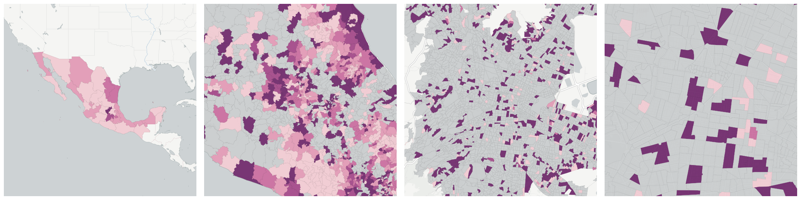](../../_images/mx.inegi_columns.INDI5.png)Measure &quot;Female population 3 or more years old who speak an indigenous language and do not speak Spanish&quot;  density per sq. kilometer  for one point:

    UPDATE {table_name}
      SET {new_numeric_column} =
        OBS_GetMeasure(
          CDB_LatLng(40.7, -73.9),
          'mx.inegi_columns.INDI5'
        );

Measure &quot;Female population 3 or more years old who speak an indigenous language and do not speak Spanish&quot; within an area:

    UPDATE {table_name}
      SET {new_numeric_column} =
        OBS_GetMeasure(
          ST_Buffer(CDB_LatLng(40.7, -73.9), 0.01),
          'mx.inegi_columns.INDI5'
        );

Measure &quot;Female population 3 or more years old who speak an indigenous language and do not speak Spanish&quot; percent of &quot;Population 3 or more years old who speak an indigenous language and do not speak Spanish&quot; at one point:

    UPDATE {table_name}
      SET {new_numeric_column} =
        OBS_GetMeasure(
          CDB_LatLng(40.7, -73.9),
          'mx.inegi_columns.INDI5',
          'denominator'
        );

Measure &quot;Female population 3 or more years old who speak an indigenous language and do not speak Spanish&quot; percent of &quot;Population 3 or more years old who speak an indigenous language and do not speak Spanish&quot; within an area:

    UPDATE {table_name}
      SET {new_numeric_column} =
        OBS_GetMeasure(
          ST_Buffer(CDB_LatLng(40.7, -73.9), 0.01),
          'mx.inegi_columns.INDI5',
          'denominator'
        );

* denominator: [Population 3 or more years old who speak an indigenous language and do not speak Spanish](#mx-inegi-columns-indi4)

* denominator: mx.inegi_columns.POB48

### Male population 3 or more years old who speak an indigenous language and do not speak Spanish

[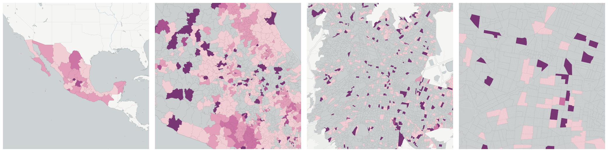](../../_images/mx.inegi_columns.INDI6.png)Measure &quot;Male population 3 or more years old who speak an indigenous language and do not speak Spanish&quot;  density per sq. kilometer  for one point:

    UPDATE {table_name}
      SET {new_numeric_column} =
        OBS_GetMeasure(
          CDB_LatLng(40.7, -73.9),
          'mx.inegi_columns.INDI6'
        );

Measure &quot;Male population 3 or more years old who speak an indigenous language and do not speak Spanish&quot; within an area:

    UPDATE {table_name}
      SET {new_numeric_column} =
        OBS_GetMeasure(
          ST_Buffer(CDB_LatLng(40.7, -73.9), 0.01),
          'mx.inegi_columns.INDI6'
        );

Measure &quot;Male population 3 or more years old who speak an indigenous language and do not speak Spanish&quot; percent of &quot;Population 3 or more years old who speak an indigenous language and do not speak Spanish&quot; at one point:

    UPDATE {table_name}
      SET {new_numeric_column} =
        OBS_GetMeasure(
          CDB_LatLng(40.7, -73.9),
          'mx.inegi_columns.INDI6',
          'denominator'
        );

Measure &quot;Male population 3 or more years old who speak an indigenous language and do not speak Spanish&quot; percent of &quot;Population 3 or more years old who speak an indigenous language and do not speak Spanish&quot; within an area:

    UPDATE {table_name}
      SET {new_numeric_column} =
        OBS_GetMeasure(
          ST_Buffer(CDB_LatLng(40.7, -73.9), 0.01),
          'mx.inegi_columns.INDI6',
          'denominator'
        );

* denominator: [Population 3 or more years old who speak an indigenous language and do not speak Spanish](#mx-inegi-columns-indi4)

* denominator: mx.inegi_columns.POB73

## Population 3 or more years old who speak an indigenous language and speak Spanish

[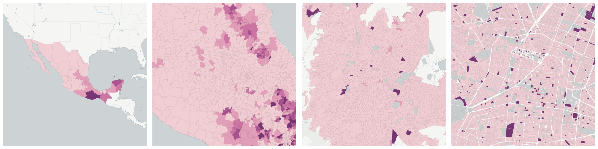](../../_images/mx.inegi_columns.INDI7.png)Measure &quot;Population 3 or more years old who speak an indigenous language and speak Spanish&quot;  density per sq. kilometer  for one point:

    UPDATE {table_name}
      SET {new_numeric_column} =
        OBS_GetMeasure(
          CDB_LatLng(40.7, -73.9),
          'mx.inegi_columns.INDI7'
        );

Measure &quot;Population 3 or more years old who speak an indigenous language and speak Spanish&quot; within an area:

    UPDATE {table_name}
      SET {new_numeric_column} =
        OBS_GetMeasure(
          ST_Buffer(CDB_LatLng(40.7, -73.9), 0.01),
          'mx.inegi_columns.INDI7'
        );

Measure &quot;Population 3 or more years old who speak an indigenous language and speak Spanish&quot; percent of &quot;Population 3 or more years old&quot; at one point:

    UPDATE {table_name}
      SET {new_numeric_column} =
        OBS_GetMeasure(
          CDB_LatLng(40.7, -73.9),
          'mx.inegi_columns.INDI7',
          'denominator'
        );

Measure &quot;Population 3 or more years old who speak an indigenous language and speak Spanish&quot; percent of &quot;Population 3 or more years old&quot; within an area:

    UPDATE {table_name}
      SET {new_numeric_column} =
        OBS_GetMeasure(
          ST_Buffer(CDB_LatLng(40.7, -73.9), 0.01),
          'mx.inegi_columns.INDI7',
          'denominator'
        );

* denominator: [Population 3 or more years old](../age_gender/#mx-inegi-columns-pob17)

Subcolumns of Population 3 or more years old who speak an indigenous language and speak Spanish

- [Female population 3 or more years old who speak an indigenous language and speak Spanish](#female-population-3-or-more-years-old-who-speak-an-indigenous-language-and-speak-spanish)

- [Male population 3 or more years old who speak an indigenous language and speak Spanish](#male-population-3-or-more-years-old-who-speak-an-indigenous-language-and-speak-spanish)

### Female population 3 or more years old who speak an indigenous language and speak Spanish

Measure &quot;Female population 3 or more years old who speak an indigenous language and speak Spanish&quot;  density per sq. kilometer  for one point:

    UPDATE {table_name}
      SET {new_numeric_column} =
        OBS_GetMeasure(
          CDB_LatLng(40.7, -73.9),
          'mx.inegi_columns.INDI8'
        );

Measure &quot;Female population 3 or more years old who speak an indigenous language and speak Spanish&quot; within an area:

    UPDATE {table_name}
      SET {new_numeric_column} =
        OBS_GetMeasure(
          ST_Buffer(CDB_LatLng(40.7, -73.9), 0.01),
          'mx.inegi_columns.INDI8'
        );

Measure &quot;Female population 3 or more years old who speak an indigenous language and speak Spanish&quot; percent of &quot;Population 3 or more years old who speak an indigenous language and speak Spanish&quot; at one point:

    UPDATE {table_name}
      SET {new_numeric_column} =
        OBS_GetMeasure(
          CDB_LatLng(40.7, -73.9),
          'mx.inegi_columns.INDI8',
          'denominator'
        );

Measure &quot;Female population 3 or more years old who speak an indigenous language and speak Spanish&quot; percent of &quot;Population 3 or more years old who speak an indigenous language and speak Spanish&quot; within an area:

    UPDATE {table_name}
      SET {new_numeric_column} =
        OBS_GetMeasure(
          ST_Buffer(CDB_LatLng(40.7, -73.9), 0.01),
          'mx.inegi_columns.INDI8',
          'denominator'
        );

* denominator: [Population 3 or more years old who speak an indigenous language and speak Spanish](#mx-inegi-columns-indi7)

* denominator: mx.inegi_columns.POB48

### Male population 3 or more years old who speak an indigenous language and speak Spanish

[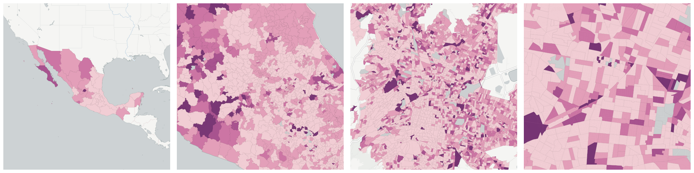](../../_images/mx.inegi_columns.INDI9.png)Measure &quot;Male population 3 or more years old who speak an indigenous language and speak Spanish&quot;  density per sq. kilometer  for one point:

    UPDATE {table_name}
      SET {new_numeric_column} =
        OBS_GetMeasure(
          CDB_LatLng(40.7, -73.9),
          'mx.inegi_columns.INDI9'
        );

Measure &quot;Male population 3 or more years old who speak an indigenous language and speak Spanish&quot; within an area:

    UPDATE {table_name}
      SET {new_numeric_column} =
        OBS_GetMeasure(
          ST_Buffer(CDB_LatLng(40.7, -73.9), 0.01),
          'mx.inegi_columns.INDI9'
        );

Measure &quot;Male population 3 or more years old who speak an indigenous language and speak Spanish&quot; percent of &quot;Population 3 or more years old who speak an indigenous language and speak Spanish&quot; at one point:

    UPDATE {table_name}
      SET {new_numeric_column} =
        OBS_GetMeasure(
          CDB_LatLng(40.7, -73.9),
          'mx.inegi_columns.INDI9',
          'denominator'
        );

Measure &quot;Male population 3 or more years old who speak an indigenous language and speak Spanish&quot; percent of &quot;Population 3 or more years old who speak an indigenous language and speak Spanish&quot; within an area:

    UPDATE {table_name}
      SET {new_numeric_column} =
        OBS_GetMeasure(
          ST_Buffer(CDB_LatLng(40.7, -73.9), 0.01),
          'mx.inegi_columns.INDI9',
          'denominator'
        );

* denominator: [Population 3 or more years old who speak an indigenous language and speak Spanish](#mx-inegi-columns-indi7)

* denominator: mx.inegi_columns.POB73

## Population 5 or more years old who speak an indigenous language

[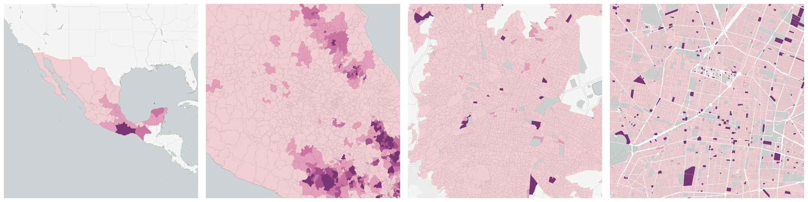](../../_images/mx.inegi_columns.INDI10.png)Measure &quot;Population 5 or more years old who speak an indigenous language&quot;  density per sq. kilometer  for one point:

    UPDATE {table_name}
      SET {new_numeric_column} =
        OBS_GetMeasure(
          CDB_LatLng(40.7, -73.9),
          'mx.inegi_columns.INDI10'
        );

Measure &quot;Population 5 or more years old who speak an indigenous language&quot; within an area:

    UPDATE {table_name}
      SET {new_numeric_column} =
        OBS_GetMeasure(
          ST_Buffer(CDB_LatLng(40.7, -73.9), 0.01),
          'mx.inegi_columns.INDI10'
        );

Measure &quot;Population 5 or more years old who speak an indigenous language&quot; percent of &quot;Population 5 or more years old&quot; at one point:

    UPDATE {table_name}
      SET {new_numeric_column} =
        OBS_GetMeasure(
          CDB_LatLng(40.7, -73.9),
          'mx.inegi_columns.INDI10',
          'denominator'
        );

Measure &quot;Population 5 or more years old who speak an indigenous language&quot; percent of &quot;Population 5 or more years old&quot; within an area:

    UPDATE {table_name}
      SET {new_numeric_column} =
        OBS_GetMeasure(
          ST_Buffer(CDB_LatLng(40.7, -73.9), 0.01),
          'mx.inegi_columns.INDI10',
          'denominator'
        );

* denominator: [Population 5 or more years old](../age_gender/#mx-inegi-columns-pob18)

Subcolumns of Population 5 or more years old who speak an indigenous language

- [Female population 5 or more years old who speak an indigenous language](#female-population-5-or-more-years-old-who-speak-an-indigenous-language)

- [Male population 5 or more years old who speak an indigenous language](#male-population-5-or-more-years-old-who-speak-an-indigenous-language)

### Female population 5 or more years old who speak an indigenous language

[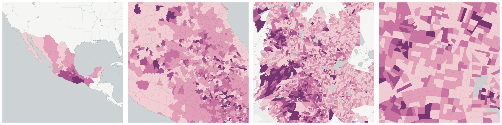](../../_images/mx.inegi_columns.INDI11.png)Measure &quot;Female population 5 or more years old who speak an indigenous language&quot;  density per sq. kilometer  for one point:

    UPDATE {table_name}
      SET {new_numeric_column} =
        OBS_GetMeasure(
          CDB_LatLng(40.7, -73.9),
          'mx.inegi_columns.INDI11'
        );

Measure &quot;Female population 5 or more years old who speak an indigenous language&quot; within an area:

    UPDATE {table_name}
      SET {new_numeric_column} =
        OBS_GetMeasure(
          ST_Buffer(CDB_LatLng(40.7, -73.9), 0.01),
          'mx.inegi_columns.INDI11'
        );

Measure &quot;Female population 5 or more years old who speak an indigenous language&quot; percent of &quot;Population 5 or more years old who speak an indigenous language&quot; at one point:

    UPDATE {table_name}
      SET {new_numeric_column} =
        OBS_GetMeasure(
          CDB_LatLng(40.7, -73.9),
          'mx.inegi_columns.INDI11',
          'denominator'
        );

Measure &quot;Female population 5 or more years old who speak an indigenous language&quot; percent of &quot;Population 5 or more years old who speak an indigenous language&quot; within an area:

    UPDATE {table_name}
      SET {new_numeric_column} =
        OBS_GetMeasure(
          ST_Buffer(CDB_LatLng(40.7, -73.9), 0.01),
          'mx.inegi_columns.INDI11',
          'denominator'
        );

* denominator: [Population 5 or more years old who speak an indigenous language](#mx-inegi-columns-indi10)

* denominator: mx.inegi_columns.POB49

### Male population 5 or more years old who speak an indigenous language

Measure &quot;Male population 5 or more years old who speak an indigenous language&quot;  density per sq. kilometer  for one point:

    UPDATE {table_name}
      SET {new_numeric_column} =
        OBS_GetMeasure(
          CDB_LatLng(40.7, -73.9),
          'mx.inegi_columns.INDI12'
        );

Measure &quot;Male population 5 or more years old who speak an indigenous language&quot; within an area:

    UPDATE {table_name}
      SET {new_numeric_column} =
        OBS_GetMeasure(
          ST_Buffer(CDB_LatLng(40.7, -73.9), 0.01),
          'mx.inegi_columns.INDI12'
        );

Measure &quot;Male population 5 or more years old who speak an indigenous language&quot; percent of &quot;Population 5 or more years old who speak an indigenous language&quot; at one point:

    UPDATE {table_name}
      SET {new_numeric_column} =
        OBS_GetMeasure(
          CDB_LatLng(40.7, -73.9),
          'mx.inegi_columns.INDI12',
          'denominator'
        );

Measure &quot;Male population 5 or more years old who speak an indigenous language&quot; percent of &quot;Population 5 or more years old who speak an indigenous language&quot; within an area:

    UPDATE {table_name}
      SET {new_numeric_column} =
        OBS_GetMeasure(
          ST_Buffer(CDB_LatLng(40.7, -73.9), 0.01),
          'mx.inegi_columns.INDI12',
          'denominator'
        );

* denominator: [Population 5 or more years old who speak an indigenous language](#mx-inegi-columns-indi10)

* denominator: mx.inegi_columns.POB74

## Population 5 or more years old who speak an indigenous language and do not speak Spanish

[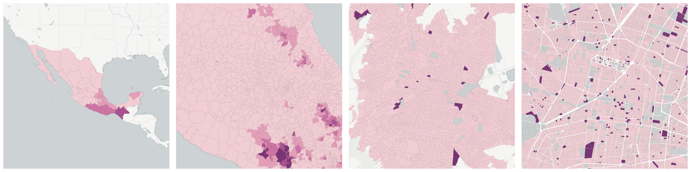](../../_images/mx.inegi_columns.INDI13.png)Measure &quot;Population 5 or more years old who speak an indigenous language and do not speak Spanish&quot;  density per sq. kilometer  for one point:

    UPDATE {table_name}
      SET {new_numeric_column} =
        OBS_GetMeasure(
          CDB_LatLng(40.7, -73.9),
          'mx.inegi_columns.INDI13'
        );

Measure &quot;Population 5 or more years old who speak an indigenous language and do not speak Spanish&quot; within an area:

    UPDATE {table_name}
      SET {new_numeric_column} =
        OBS_GetMeasure(
          ST_Buffer(CDB_LatLng(40.7, -73.9), 0.01),
          'mx.inegi_columns.INDI13'
        );

Measure &quot;Population 5 or more years old who speak an indigenous language and do not speak Spanish&quot; percent of &quot;Population 5 or more years old&quot; at one point:

    UPDATE {table_name}
      SET {new_numeric_column} =
        OBS_GetMeasure(
          CDB_LatLng(40.7, -73.9),
          'mx.inegi_columns.INDI13',
          'denominator'
        );

Measure &quot;Population 5 or more years old who speak an indigenous language and do not speak Spanish&quot; percent of &quot;Population 5 or more years old&quot; within an area:

    UPDATE {table_name}
      SET {new_numeric_column} =
        OBS_GetMeasure(
          ST_Buffer(CDB_LatLng(40.7, -73.9), 0.01),
          'mx.inegi_columns.INDI13',
          'denominator'
        );

* denominator: [Population 5 or more years old](../age_gender/#mx-inegi-columns-pob18)

Subcolumns of Population 5 or more years old who speak an indigenous language and do not speak Spanish

- [Female population 5 or more years old who speak an indigenous language and do not speak Spanish](#female-population-5-or-more-years-old-who-speak-an-indigenous-language-and-do-not-speak-spanish)

- [Male population 5 or more years old who speak an indigenous language and do not speak Spanish](#male-population-5-or-more-years-old-who-speak-an-indigenous-language-and-do-not-speak-spanish)

### Female population 5 or more years old who speak an indigenous language and do not speak Spanish

[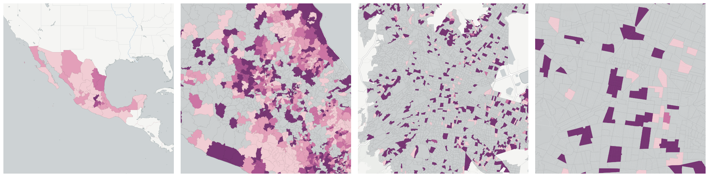](../../_images/mx.inegi_columns.INDI14.png)Measure &quot;Female population 5 or more years old who speak an indigenous language and do not speak Spanish&quot;  density per sq. kilometer  for one point:

    UPDATE {table_name}
      SET {new_numeric_column} =
        OBS_GetMeasure(
          CDB_LatLng(40.7, -73.9),
          'mx.inegi_columns.INDI14'
        );

Measure &quot;Female population 5 or more years old who speak an indigenous language and do not speak Spanish&quot; within an area:

    UPDATE {table_name}
      SET {new_numeric_column} =
        OBS_GetMeasure(
          ST_Buffer(CDB_LatLng(40.7, -73.9), 0.01),
          'mx.inegi_columns.INDI14'
        );

Measure &quot;Female population 5 or more years old who speak an indigenous language and do not speak Spanish&quot; percent of &quot;Population 5 or more years old who speak an indigenous language and do not speak Spanish&quot; at one point:

    UPDATE {table_name}
      SET {new_numeric_column} =
        OBS_GetMeasure(
          CDB_LatLng(40.7, -73.9),
          'mx.inegi_columns.INDI14',
          'denominator'
        );

Measure &quot;Female population 5 or more years old who speak an indigenous language and do not speak Spanish&quot; percent of &quot;Population 5 or more years old who speak an indigenous language and do not speak Spanish&quot; within an area:

    UPDATE {table_name}
      SET {new_numeric_column} =
        OBS_GetMeasure(
          ST_Buffer(CDB_LatLng(40.7, -73.9), 0.01),
          'mx.inegi_columns.INDI14',
          'denominator'
        );

* denominator: [Population 5 or more years old who speak an indigenous language and do not speak Spanish](#mx-inegi-columns-indi13)

* denominator: mx.inegi_columns.POB49

### Male population 5 or more years old who speak an indigenous language and do not speak Spanish

[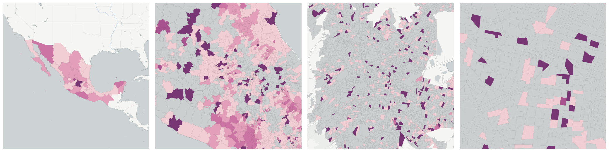](../../_images/mx.inegi_columns.INDI15.png)Measure &quot;Male population 5 or more years old who speak an indigenous language and do not speak Spanish&quot;  density per sq. kilometer  for one point:

    UPDATE {table_name}
      SET {new_numeric_column} =
        OBS_GetMeasure(
          CDB_LatLng(40.7, -73.9),
          'mx.inegi_columns.INDI15'
        );

Measure &quot;Male population 5 or more years old who speak an indigenous language and do not speak Spanish&quot; within an area:

    UPDATE {table_name}
      SET {new_numeric_column} =
        OBS_GetMeasure(
          ST_Buffer(CDB_LatLng(40.7, -73.9), 0.01),
          'mx.inegi_columns.INDI15'
        );

Measure &quot;Male population 5 or more years old who speak an indigenous language and do not speak Spanish&quot; percent of &quot;Population 5 or more years old who speak an indigenous language and do not speak Spanish&quot; at one point:

    UPDATE {table_name}
      SET {new_numeric_column} =
        OBS_GetMeasure(
          CDB_LatLng(40.7, -73.9),
          'mx.inegi_columns.INDI15',
          'denominator'
        );

Measure &quot;Male population 5 or more years old who speak an indigenous language and do not speak Spanish&quot; percent of &quot;Population 5 or more years old who speak an indigenous language and do not speak Spanish&quot; within an area:

    UPDATE {table_name}
      SET {new_numeric_column} =
        OBS_GetMeasure(
          ST_Buffer(CDB_LatLng(40.7, -73.9), 0.01),
          'mx.inegi_columns.INDI15',
          'denominator'
        );

* denominator: [Population 5 or more years old who speak an indigenous language and do not speak Spanish](#mx-inegi-columns-indi13)

* denominator: mx.inegi_columns.POB74

## Population 5 or more years old who speak an indigenous language and speak Spanish

[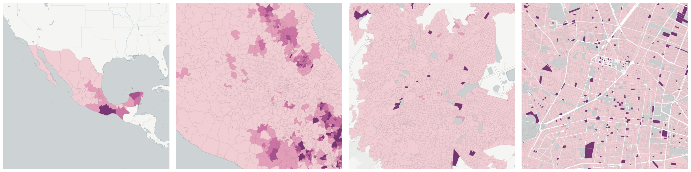](../../_images/mx.inegi_columns.INDI16.png)Measure &quot;Population 5 or more years old who speak an indigenous language and speak Spanish&quot;  density per sq. kilometer  for one point:

    UPDATE {table_name}
      SET {new_numeric_column} =
        OBS_GetMeasure(
          CDB_LatLng(40.7, -73.9),
          'mx.inegi_columns.INDI16'
        );

Measure &quot;Population 5 or more years old who speak an indigenous language and speak Spanish&quot; within an area:

    UPDATE {table_name}
      SET {new_numeric_column} =
        OBS_GetMeasure(
          ST_Buffer(CDB_LatLng(40.7, -73.9), 0.01),
          'mx.inegi_columns.INDI16'
        );

Measure &quot;Population 5 or more years old who speak an indigenous language and speak Spanish&quot; percent of &quot;Population 5 or more years old&quot; at one point:

    UPDATE {table_name}
      SET {new_numeric_column} =
        OBS_GetMeasure(
          CDB_LatLng(40.7, -73.9),
          'mx.inegi_columns.INDI16',
          'denominator'
        );

Measure &quot;Population 5 or more years old who speak an indigenous language and speak Spanish&quot; percent of &quot;Population 5 or more years old&quot; within an area:

    UPDATE {table_name}
      SET {new_numeric_column} =
        OBS_GetMeasure(
          ST_Buffer(CDB_LatLng(40.7, -73.9), 0.01),
          'mx.inegi_columns.INDI16',
          'denominator'
        );

* denominator: [Population 5 or more years old](../age_gender/#mx-inegi-columns-pob18)

Subcolumns of Population 5 or more years old who speak an indigenous language and speak Spanish

- [Female population 5 or more years old who speak an indigenous language and speak Spanish](#female-population-5-or-more-years-old-who-speak-an-indigenous-language-and-speak-spanish)

- [Male population 5 or more years old who speak an indigenous language and speak Spanish](#male-population-5-or-more-years-old-who-speak-an-indigenous-language-and-speak-spanish)

### Female population 5 or more years old who speak an indigenous language and speak Spanish

[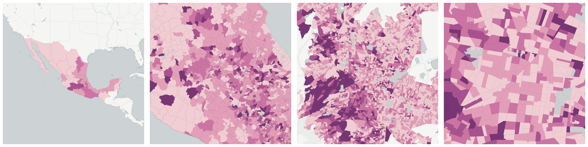](../../_images/mx.inegi_columns.INDI17.png)Measure &quot;Female population 5 or more years old who speak an indigenous language and speak Spanish&quot;  density per sq. kilometer  for one point:

    UPDATE {table_name}
      SET {new_numeric_column} =
        OBS_GetMeasure(
          CDB_LatLng(40.7, -73.9),
          'mx.inegi_columns.INDI17'
        );

Measure &quot;Female population 5 or more years old who speak an indigenous language and speak Spanish&quot; within an area:

    UPDATE {table_name}
      SET {new_numeric_column} =
        OBS_GetMeasure(
          ST_Buffer(CDB_LatLng(40.7, -73.9), 0.01),
          'mx.inegi_columns.INDI17'
        );

Measure &quot;Female population 5 or more years old who speak an indigenous language and speak Spanish&quot; percent of &quot;Population 5 or more years old who speak an indigenous language and speak Spanish&quot; at one point:

    UPDATE {table_name}
      SET {new_numeric_column} =
        OBS_GetMeasure(
          CDB_LatLng(40.7, -73.9),
          'mx.inegi_columns.INDI17',
          'denominator'
        );

Measure &quot;Female population 5 or more years old who speak an indigenous language and speak Spanish&quot; percent of &quot;Population 5 or more years old who speak an indigenous language and speak Spanish&quot; within an area:

    UPDATE {table_name}
      SET {new_numeric_column} =
        OBS_GetMeasure(
          ST_Buffer(CDB_LatLng(40.7, -73.9), 0.01),
          'mx.inegi_columns.INDI17',
          'denominator'
        );

* denominator: [Population 5 or more years old who speak an indigenous language and speak Spanish](#mx-inegi-columns-indi16)

* denominator: mx.inegi_columns.POB49

### Male population 5 or more years old who speak an indigenous language and speak Spanish

[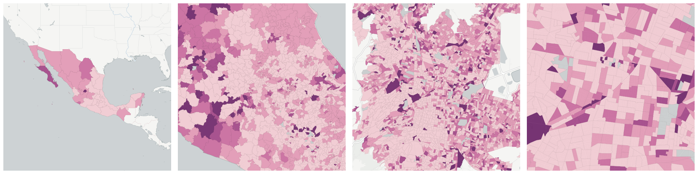](../../_images/mx.inegi_columns.INDI18.png)Measure &quot;Male population 5 or more years old who speak an indigenous language and speak Spanish&quot;  density per sq. kilometer  for one point:

    UPDATE {table_name}
      SET {new_numeric_column} =
        OBS_GetMeasure(
          CDB_LatLng(40.7, -73.9),
          'mx.inegi_columns.INDI18'
        );

Measure &quot;Male population 5 or more years old who speak an indigenous language and speak Spanish&quot; within an area:

    UPDATE {table_name}
      SET {new_numeric_column} =
        OBS_GetMeasure(
          ST_Buffer(CDB_LatLng(40.7, -73.9), 0.01),
          'mx.inegi_columns.INDI18'
        );

Measure &quot;Male population 5 or more years old who speak an indigenous language and speak Spanish&quot; percent of &quot;Male population 5 or more years old&quot; at one point:

    UPDATE {table_name}
      SET {new_numeric_column} =
        OBS_GetMeasure(
          CDB_LatLng(40.7, -73.9),
          'mx.inegi_columns.INDI18',
          'denominator'
        );

Measure &quot;Male population 5 or more years old who speak an indigenous language and speak Spanish&quot; percent of &quot;Male population 5 or more years old&quot; within an area:

    UPDATE {table_name}
      SET {new_numeric_column} =
        OBS_GetMeasure(
          ST_Buffer(CDB_LatLng(40.7, -73.9), 0.01),
          'mx.inegi_columns.INDI18',
          'denominator'
        );

* denominator: mx.inegi_columns.POB74

* denominator: [Population 5 or more years old who speak an indigenous language and speak Spanish](#mx-inegi-columns-indi16)

## Population age 3 or more who speak an indigenous language

Measure &quot;Population age 3 or more who speak an indigenous language&quot;  density per sq. kilometer  for one point:

    UPDATE {table_name}
      SET {new_numeric_column} =
        OBS_GetMeasure(
          CDB_LatLng(40.7, -73.9),
          'mx.inegi_columns.INDI1'
        );

Measure &quot;Population age 3 or more who speak an indigenous language&quot; within an area:

    UPDATE {table_name}
      SET {new_numeric_column} =
        OBS_GetMeasure(
          ST_Buffer(CDB_LatLng(40.7, -73.9), 0.01),
          'mx.inegi_columns.INDI1'
        );

Measure &quot;Population age 3 or more who speak an indigenous language&quot; percent of &quot;Population 3 or more years old&quot; at one point:

    UPDATE {table_name}
      SET {new_numeric_column} =
        OBS_GetMeasure(
          CDB_LatLng(40.7, -73.9),
          'mx.inegi_columns.INDI1',
          'denominator'
        );

Measure &quot;Population age 3 or more who speak an indigenous language&quot; percent of &quot;Population 3 or more years old&quot; within an area:

    UPDATE {table_name}
      SET {new_numeric_column} =
        OBS_GetMeasure(
          ST_Buffer(CDB_LatLng(40.7, -73.9), 0.01),
          'mx.inegi_columns.INDI1',
          'denominator'
        );

* denominator: [Population 3 or more years old](../age_gender/#mx-inegi-columns-pob17)

Subcolumns of Population age 3 or more who speak an indigenous language

- [Female population age 3 or more who speak an indigenous language](#female-population-age-3-or-more-who-speak-an-indigenous-language)

- [Male population age 3 or more who speak an indigenous language](#male-population-age-3-or-more-who-speak-an-indigenous-language)

### Female population age 3 or more who speak an indigenous language

[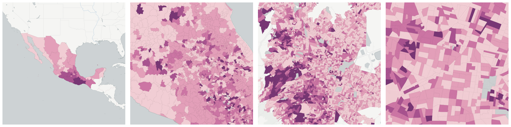](../../_images/mx.inegi_columns.INDI2.png)Measure &quot;Female population age 3 or more who speak an indigenous language&quot;  density per sq. kilometer  for one point:

    UPDATE {table_name}
      SET {new_numeric_column} =
        OBS_GetMeasure(
          CDB_LatLng(40.7, -73.9),
          'mx.inegi_columns.INDI2'
        );

Measure &quot;Female population age 3 or more who speak an indigenous language&quot; within an area:

    UPDATE {table_name}
      SET {new_numeric_column} =
        OBS_GetMeasure(
          ST_Buffer(CDB_LatLng(40.7, -73.9), 0.01),
          'mx.inegi_columns.INDI2'
        );

Measure &quot;Female population age 3 or more who speak an indigenous language&quot; percent of &quot;Population age 3 or more who speak an indigenous language&quot; at one point:

    UPDATE {table_name}
      SET {new_numeric_column} =
        OBS_GetMeasure(
          CDB_LatLng(40.7, -73.9),
          'mx.inegi_columns.INDI2',
          'denominator'
        );

Measure &quot;Female population age 3 or more who speak an indigenous language&quot; percent of &quot;Population age 3 or more who speak an indigenous language&quot; within an area:

    UPDATE {table_name}
      SET {new_numeric_column} =
        OBS_GetMeasure(
          ST_Buffer(CDB_LatLng(40.7, -73.9), 0.01),
          'mx.inegi_columns.INDI2',
          'denominator'
        );

* denominator: [Population age 3 or more who speak an indigenous language](#mx-inegi-columns-indi1)

* denominator: mx.inegi_columns.POB48

### Male population age 3 or more who speak an indigenous language

[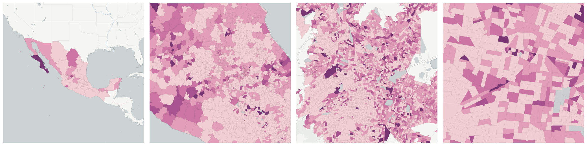](../../_images/mx.inegi_columns.INDI3.png)Measure &quot;Male population age 3 or more who speak an indigenous language&quot;  density per sq. kilometer  for one point:

    UPDATE {table_name}
      SET {new_numeric_column} =
        OBS_GetMeasure(
          CDB_LatLng(40.7, -73.9),
          'mx.inegi_columns.INDI3'
        );

Measure &quot;Male population age 3 or more who speak an indigenous language&quot; within an area:

    UPDATE {table_name}
      SET {new_numeric_column} =
        OBS_GetMeasure(
          ST_Buffer(CDB_LatLng(40.7, -73.9), 0.01),
          'mx.inegi_columns.INDI3'
        );

Measure &quot;Male population age 3 or more who speak an indigenous language&quot; percent of &quot;Population age 3 or more who speak an indigenous language&quot; at one point:

    UPDATE {table_name}
      SET {new_numeric_column} =
        OBS_GetMeasure(
          CDB_LatLng(40.7, -73.9),
          'mx.inegi_columns.INDI3',
          'denominator'
        );

Measure &quot;Male population age 3 or more who speak an indigenous language&quot; percent of &quot;Population age 3 or more who speak an indigenous language&quot; within an area:

    UPDATE {table_name}
      SET {new_numeric_column} =
        OBS_GetMeasure(
          ST_Buffer(CDB_LatLng(40.7, -73.9), 0.01),
          'mx.inegi_columns.INDI3',
          'denominator'
        );

* denominator: [Population age 3 or more who speak an indigenous language](#mx-inegi-columns-indi1)

* denominator: mx.inegi_columns.POB73

