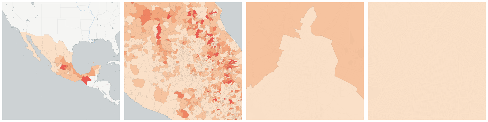
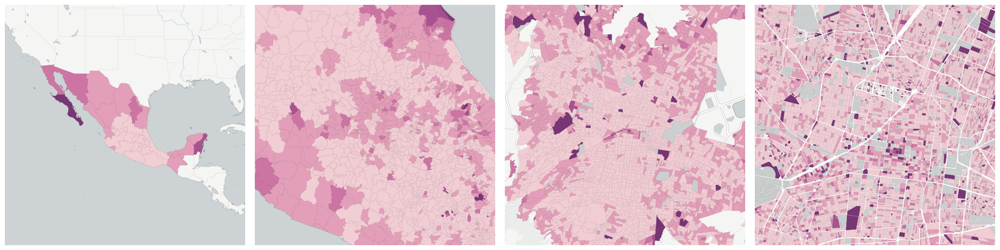

  
# Migration

Patterns of migration.

- [Male-female ratio in population 5 years and over who resided in the United States in June 2005](#male-female-ratio-in-population-5-years-and-over-who-resided-in-the-united-states-in-june-2005)

- [Population age 5 or more resident in the United States in June 2005](#population-age-5-or-more-resident-in-the-united-states-in-june-2005)

- [Population born in another country](#population-born-in-another-country)

- [Population born in another state](#population-born-in-another-state)

    * [Female population born in another state](#female-population-born-in-another-state)

    * [Male population born in another state](#male-population-born-in-another-state)

- [Population born in the state](#population-born-in-the-state)

    * [Female population born in the state](#female-population-born-in-the-state)

    * [Male population born in the state](#male-population-born-in-the-state)

- [Population resident in another country in June 2005](#population-resident-in-another-country-in-june-2005)

- [Population resident in another state in June 2005](#population-resident-in-another-state-in-june-2005)

    * [Female population resident in another state in June 2005](#female-population-resident-in-another-state-in-june-2005)

    * [Male population resident in another state in June 2005](#male-population-resident-in-another-state-in-june-2005)

- [Population resident in the state in June 2005](#population-resident-in-the-state-in-june-2005)

    * [Female population resident in the state in June 2005](#female-population-resident-in-the-state-in-june-2005)

    * [Male population resident in the state in June 2005](#male-population-resident-in-the-state-in-june-2005)

## Male-female ratio in population 5 years and over who resided in the United States in June 2005

Measure &quot;Male-female ratio in population 5 years and over who resided in the United States in June 2005&quot;  for one point:

    UPDATE {table_name}
      SET {new_numeric_column} =
        OBS_GetMeasure(
          CDB_LatLng(40.7, -73.9),
          'mx.inegi_columns.MIG16_R'
        );

Male-female ratio in population 5 years and over who resided in the United States in June 2005 is only available for point lookups.

## Population age 5 or more resident in the United States in June 2005

Measure &quot;Population age 5 or more resident in the United States in June 2005&quot;  density per sq. kilometer  for one point:

    UPDATE {table_name}
      SET {new_numeric_column} =
        OBS_GetMeasure(
          CDB_LatLng(40.7, -73.9),
          'mx.inegi_columns.MIG15'
        );

Measure &quot;Population age 5 or more resident in the United States in June 2005&quot; within an area:

    UPDATE {table_name}
      SET {new_numeric_column} =
        OBS_GetMeasure(
          ST_Buffer(CDB_LatLng(40.7, -73.9), 0.01),
          'mx.inegi_columns.MIG15'
        );

Measure &quot;Population age 5 or more resident in the United States in June 2005&quot; percent of &quot;Population 5 or more years old&quot; at one point:

    UPDATE {table_name}
      SET {new_numeric_column} =
        OBS_GetMeasure(
          CDB_LatLng(40.7, -73.9),
          'mx.inegi_columns.MIG15',
          'denominator'
        );

Measure &quot;Population age 5 or more resident in the United States in June 2005&quot; percent of &quot;Population 5 or more years old&quot; within an area:

    UPDATE {table_name}
      SET {new_numeric_column} =
        OBS_GetMeasure(
          ST_Buffer(CDB_LatLng(40.7, -73.9), 0.01),
          'mx.inegi_columns.MIG15',
          'denominator'
        );

* denominator: [Population 5 or more years old](../age_gender/#mx-inegi-columns-pob18)

## Population born in another country

Measure &quot;Population born in another country&quot;  density per sq. kilometer  for one point:

    UPDATE {table_name}
      SET {new_numeric_column} =
        OBS_GetMeasure(
          CDB_LatLng(40.7, -73.9),
          'mx.inegi_columns.MIG7'
        );

Measure &quot;Population born in another country&quot; within an area:

    UPDATE {table_name}
      SET {new_numeric_column} =
        OBS_GetMeasure(
          ST_Buffer(CDB_LatLng(40.7, -73.9), 0.01),
          'mx.inegi_columns.MIG7'
        );

Measure &quot;Population born in another country&quot; percent of &quot;Total population&quot; at one point:

    UPDATE {table_name}
      SET {new_numeric_column} =
        OBS_GetMeasure(
          CDB_LatLng(40.7, -73.9),
          'mx.inegi_columns.MIG7',
          'denominator'
        );

Measure &quot;Population born in another country&quot; percent of &quot;Total population&quot; within an area:

    UPDATE {table_name}
      SET {new_numeric_column} =
        OBS_GetMeasure(
          ST_Buffer(CDB_LatLng(40.7, -73.9), 0.01),
          'mx.inegi_columns.MIG7',
          'denominator'
        );

* denominator: [Total population](../age_gender/#mx-inegi-columns-pob1)

## Population born in another state

Measure &quot;Population born in another state&quot;  density per sq. kilometer  for one point:

    UPDATE {table_name}
      SET {new_numeric_column} =
        OBS_GetMeasure(
          CDB_LatLng(40.7, -73.9),
          'mx.inegi_columns.MIG4'
        );

Measure &quot;Population born in another state&quot; within an area:

    UPDATE {table_name}
      SET {new_numeric_column} =
        OBS_GetMeasure(
          ST_Buffer(CDB_LatLng(40.7, -73.9), 0.01),
          'mx.inegi_columns.MIG4'
        );

Measure &quot;Population born in another state&quot; percent of &quot;Total population&quot; at one point:

    UPDATE {table_name}
      SET {new_numeric_column} =
        OBS_GetMeasure(
          CDB_LatLng(40.7, -73.9),
          'mx.inegi_columns.MIG4',
          'denominator'
        );

Measure &quot;Population born in another state&quot; percent of &quot;Total population&quot; within an area:

    UPDATE {table_name}
      SET {new_numeric_column} =
        OBS_GetMeasure(
          ST_Buffer(CDB_LatLng(40.7, -73.9), 0.01),
          'mx.inegi_columns.MIG4',
          'denominator'
        );

* denominator: [Total population](../age_gender/#mx-inegi-columns-pob1)

Subcolumns of Population born in another state

- [Female population born in another state](#female-population-born-in-another-state)

- [Male population born in another state](#male-population-born-in-another-state)

### Female population born in another state

Measure &quot;Female population born in another state&quot;  density per sq. kilometer  for one point:

    UPDATE {table_name}
      SET {new_numeric_column} =
        OBS_GetMeasure(
          CDB_LatLng(40.7, -73.9),
          'mx.inegi_columns.MIG5'
        );

Measure &quot;Female population born in another state&quot; within an area:

    UPDATE {table_name}
      SET {new_numeric_column} =
        OBS_GetMeasure(
          ST_Buffer(CDB_LatLng(40.7, -73.9), 0.01),
          'mx.inegi_columns.MIG5'
        );

Measure &quot;Female population born in another state&quot; percent of &quot;Population born in another state&quot; at one point:

    UPDATE {table_name}
      SET {new_numeric_column} =
        OBS_GetMeasure(
          CDB_LatLng(40.7, -73.9),
          'mx.inegi_columns.MIG5',
          'denominator'
        );

Measure &quot;Female population born in another state&quot; percent of &quot;Population born in another state&quot; within an area:

    UPDATE {table_name}
      SET {new_numeric_column} =
        OBS_GetMeasure(
          ST_Buffer(CDB_LatLng(40.7, -73.9), 0.01),
          'mx.inegi_columns.MIG5',
          'denominator'
        );

* denominator: [Population born in another state](#mx-inegi-columns-mig4)

* denominator: [Female population](../age_gender/#mx-inegi-columns-pob31)

### Male population born in another state

Measure &quot;Male population born in another state&quot;  density per sq. kilometer  for one point:

    UPDATE {table_name}
      SET {new_numeric_column} =
        OBS_GetMeasure(
          CDB_LatLng(40.7, -73.9),
          'mx.inegi_columns.MIG6'
        );

Measure &quot;Male population born in another state&quot; within an area:

    UPDATE {table_name}
      SET {new_numeric_column} =
        OBS_GetMeasure(
          ST_Buffer(CDB_LatLng(40.7, -73.9), 0.01),
          'mx.inegi_columns.MIG6'
        );

Measure &quot;Male population born in another state&quot; percent of &quot;Population born in another state&quot; at one point:

    UPDATE {table_name}
      SET {new_numeric_column} =
        OBS_GetMeasure(
          CDB_LatLng(40.7, -73.9),
          'mx.inegi_columns.MIG6',
          'denominator'
        );

Measure &quot;Male population born in another state&quot; percent of &quot;Population born in another state&quot; within an area:

    UPDATE {table_name}
      SET {new_numeric_column} =
        OBS_GetMeasure(
          ST_Buffer(CDB_LatLng(40.7, -73.9), 0.01),
          'mx.inegi_columns.MIG6',
          'denominator'
        );

* denominator: [Population born in another state](#mx-inegi-columns-mig4)

* denominator: [Male population](../age_gender/#mx-inegi-columns-pob57)

## Population born in the state

Measure &quot;Population born in the state&quot;  density per sq. kilometer  for one point:

    UPDATE {table_name}
      SET {new_numeric_column} =
        OBS_GetMeasure(
          CDB_LatLng(40.7, -73.9),
          'mx.inegi_columns.MIG1'
        );

Measure &quot;Population born in the state&quot; within an area:

    UPDATE {table_name}
      SET {new_numeric_column} =
        OBS_GetMeasure(
          ST_Buffer(CDB_LatLng(40.7, -73.9), 0.01),
          'mx.inegi_columns.MIG1'
        );

Measure &quot;Population born in the state&quot; percent of &quot;Total population&quot; at one point:

    UPDATE {table_name}
      SET {new_numeric_column} =
        OBS_GetMeasure(
          CDB_LatLng(40.7, -73.9),
          'mx.inegi_columns.MIG1',
          'denominator'
        );

Measure &quot;Population born in the state&quot; percent of &quot;Total population&quot; within an area:

    UPDATE {table_name}
      SET {new_numeric_column} =
        OBS_GetMeasure(
          ST_Buffer(CDB_LatLng(40.7, -73.9), 0.01),
          'mx.inegi_columns.MIG1',
          'denominator'
        );

* denominator: [Total population](../age_gender/#mx-inegi-columns-pob1)

Subcolumns of Population born in the state

- [Female population born in the state](#female-population-born-in-the-state)

- [Male population born in the state](#male-population-born-in-the-state)

### Female population born in the state

Measure &quot;Female population born in the state&quot;  density per sq. kilometer  for one point:

    UPDATE {table_name}
      SET {new_numeric_column} =
        OBS_GetMeasure(
          CDB_LatLng(40.7, -73.9),
          'mx.inegi_columns.MIG2'
        );

Measure &quot;Female population born in the state&quot; within an area:

    UPDATE {table_name}
      SET {new_numeric_column} =
        OBS_GetMeasure(
          ST_Buffer(CDB_LatLng(40.7, -73.9), 0.01),
          'mx.inegi_columns.MIG2'
        );

Measure &quot;Female population born in the state&quot; percent of &quot;Female population&quot; at one point:

    UPDATE {table_name}
      SET {new_numeric_column} =
        OBS_GetMeasure(
          CDB_LatLng(40.7, -73.9),
          'mx.inegi_columns.MIG2',
          'denominator'
        );

Measure &quot;Female population born in the state&quot; percent of &quot;Female population&quot; within an area:

    UPDATE {table_name}
      SET {new_numeric_column} =
        OBS_GetMeasure(
          ST_Buffer(CDB_LatLng(40.7, -73.9), 0.01),
          'mx.inegi_columns.MIG2',
          'denominator'
        );

* denominator: [Female population](../age_gender/#mx-inegi-columns-pob31)

* denominator: [Population born in the state](#mx-inegi-columns-mig1)

### Male population born in the state

Measure &quot;Male population born in the state&quot;  density per sq. kilometer  for one point:

    UPDATE {table_name}
      SET {new_numeric_column} =
        OBS_GetMeasure(
          CDB_LatLng(40.7, -73.9),
          'mx.inegi_columns.MIG3'
        );

Measure &quot;Male population born in the state&quot; within an area:

    UPDATE {table_name}
      SET {new_numeric_column} =
        OBS_GetMeasure(
          ST_Buffer(CDB_LatLng(40.7, -73.9), 0.01),
          'mx.inegi_columns.MIG3'
        );

Measure &quot;Male population born in the state&quot; percent of &quot;Male population&quot; at one point:

    UPDATE {table_name}
      SET {new_numeric_column} =
        OBS_GetMeasure(
          CDB_LatLng(40.7, -73.9),
          'mx.inegi_columns.MIG3',
          'denominator'
        );

Measure &quot;Male population born in the state&quot; percent of &quot;Male population&quot; within an area:

    UPDATE {table_name}
      SET {new_numeric_column} =
        OBS_GetMeasure(
          ST_Buffer(CDB_LatLng(40.7, -73.9), 0.01),
          'mx.inegi_columns.MIG3',
          'denominator'
        );

* denominator: [Male population](../age_gender/#mx-inegi-columns-pob57)

* denominator: [Population born in the state](#mx-inegi-columns-mig1)

## Population resident in another country in June 2005

Measure &quot;Population resident in another country in June 2005&quot;  density per sq. kilometer  for one point:

    UPDATE {table_name}
      SET {new_numeric_column} =
        OBS_GetMeasure(
          CDB_LatLng(40.7, -73.9),
          'mx.inegi_columns.MIG14'
        );

Measure &quot;Population resident in another country in June 2005&quot; within an area:

    UPDATE {table_name}
      SET {new_numeric_column} =
        OBS_GetMeasure(
          ST_Buffer(CDB_LatLng(40.7, -73.9), 0.01),
          'mx.inegi_columns.MIG14'
        );

Measure &quot;Population resident in another country in June 2005&quot; percent of &quot;Population 5 or more years old&quot; at one point:

    UPDATE {table_name}
      SET {new_numeric_column} =
        OBS_GetMeasure(
          CDB_LatLng(40.7, -73.9),
          'mx.inegi_columns.MIG14',
          'denominator'
        );

Measure &quot;Population resident in another country in June 2005&quot; percent of &quot;Population 5 or more years old&quot; within an area:

    UPDATE {table_name}
      SET {new_numeric_column} =
        OBS_GetMeasure(
          ST_Buffer(CDB_LatLng(40.7, -73.9), 0.01),
          'mx.inegi_columns.MIG14',
          'denominator'
        );

* denominator: [Population 5 or more years old](../age_gender/#mx-inegi-columns-pob18)

## Population resident in another state in June 2005

Measure &quot;Population resident in another state in June 2005&quot;  density per sq. kilometer  for one point:

    UPDATE {table_name}
      SET {new_numeric_column} =
        OBS_GetMeasure(
          CDB_LatLng(40.7, -73.9),
          'mx.inegi_columns.MIG11'
        );

Measure &quot;Population resident in another state in June 2005&quot; within an area:

    UPDATE {table_name}
      SET {new_numeric_column} =
        OBS_GetMeasure(
          ST_Buffer(CDB_LatLng(40.7, -73.9), 0.01),
          'mx.inegi_columns.MIG11'
        );

Measure &quot;Population resident in another state in June 2005&quot; percent of &quot;Population 5 or more years old&quot; at one point:

    UPDATE {table_name}
      SET {new_numeric_column} =
        OBS_GetMeasure(
          CDB_LatLng(40.7, -73.9),
          'mx.inegi_columns.MIG11',
          'denominator'
        );

Measure &quot;Population resident in another state in June 2005&quot; percent of &quot;Population 5 or more years old&quot; within an area:

    UPDATE {table_name}
      SET {new_numeric_column} =
        OBS_GetMeasure(
          ST_Buffer(CDB_LatLng(40.7, -73.9), 0.01),
          'mx.inegi_columns.MIG11',
          'denominator'
        );

* denominator: [Population 5 or more years old](../age_gender/#mx-inegi-columns-pob18)

Subcolumns of Population resident in another state in June 2005

- [Female population resident in another state in June 2005](#female-population-resident-in-another-state-in-june-2005)

- [Male population resident in another state in June 2005](#male-population-resident-in-another-state-in-june-2005)

### Female population resident in another state in June 2005

Measure &quot;Female population resident in another state in June 2005&quot;  density per sq. kilometer  for one point:

    UPDATE {table_name}
      SET {new_numeric_column} =
        OBS_GetMeasure(
          CDB_LatLng(40.7, -73.9),
          'mx.inegi_columns.MIG12'
        );

Measure &quot;Female population resident in another state in June 2005&quot; within an area:

    UPDATE {table_name}
      SET {new_numeric_column} =
        OBS_GetMeasure(
          ST_Buffer(CDB_LatLng(40.7, -73.9), 0.01),
          'mx.inegi_columns.MIG12'
        );

Measure &quot;Female population resident in another state in June 2005&quot; percent of &quot;Population resident in another state in June 2005&quot; at one point:

    UPDATE {table_name}
      SET {new_numeric_column} =
        OBS_GetMeasure(
          CDB_LatLng(40.7, -73.9),
          'mx.inegi_columns.MIG12',
          'denominator'
        );

Measure &quot;Female population resident in another state in June 2005&quot; percent of &quot;Population resident in another state in June 2005&quot; within an area:

    UPDATE {table_name}
      SET {new_numeric_column} =
        OBS_GetMeasure(
          ST_Buffer(CDB_LatLng(40.7, -73.9), 0.01),
          'mx.inegi_columns.MIG12',
          'denominator'
        );

* denominator: [Population resident in another state in June 2005](#mx-inegi-columns-mig11)

* denominator: mx.inegi_columns.POB49

### Male population resident in another state in June 2005

Measure &quot;Male population resident in another state in June 2005&quot;  density per sq. kilometer  for one point:

    UPDATE {table_name}
      SET {new_numeric_column} =
        OBS_GetMeasure(
          CDB_LatLng(40.7, -73.9),
          'mx.inegi_columns.MIG13'
        );

Measure &quot;Male population resident in another state in June 2005&quot; within an area:

    UPDATE {table_name}
      SET {new_numeric_column} =
        OBS_GetMeasure(
          ST_Buffer(CDB_LatLng(40.7, -73.9), 0.01),
          'mx.inegi_columns.MIG13'
        );

Measure &quot;Male population resident in another state in June 2005&quot; percent of &quot;Male population 5 or more years old&quot; at one point:

    UPDATE {table_name}
      SET {new_numeric_column} =
        OBS_GetMeasure(
          CDB_LatLng(40.7, -73.9),
          'mx.inegi_columns.MIG13',
          'denominator'
        );

Measure &quot;Male population resident in another state in June 2005&quot; percent of &quot;Male population 5 or more years old&quot; within an area:

    UPDATE {table_name}
      SET {new_numeric_column} =
        OBS_GetMeasure(
          ST_Buffer(CDB_LatLng(40.7, -73.9), 0.01),
          'mx.inegi_columns.MIG13',
          'denominator'
        );

* denominator: mx.inegi_columns.POB74

* denominator: [Population resident in another state in June 2005](#mx-inegi-columns-mig11)

## Population resident in the state in June 2005

Measure &quot;Population resident in the state in June 2005&quot;  density per sq. kilometer  for one point:

    UPDATE {table_name}
      SET {new_numeric_column} =
        OBS_GetMeasure(
          CDB_LatLng(40.7, -73.9),
          'mx.inegi_columns.MIG8'
        );

Measure &quot;Population resident in the state in June 2005&quot; within an area:

    UPDATE {table_name}
      SET {new_numeric_column} =
        OBS_GetMeasure(
          ST_Buffer(CDB_LatLng(40.7, -73.9), 0.01),
          'mx.inegi_columns.MIG8'
        );

Measure &quot;Population resident in the state in June 2005&quot; percent of &quot;Population 5 or more years old&quot; at one point:

    UPDATE {table_name}
      SET {new_numeric_column} =
        OBS_GetMeasure(
          CDB_LatLng(40.7, -73.9),
          'mx.inegi_columns.MIG8',
          'denominator'
        );

Measure &quot;Population resident in the state in June 2005&quot; percent of &quot;Population 5 or more years old&quot; within an area:

    UPDATE {table_name}
      SET {new_numeric_column} =
        OBS_GetMeasure(
          ST_Buffer(CDB_LatLng(40.7, -73.9), 0.01),
          'mx.inegi_columns.MIG8',
          'denominator'
        );

* denominator: [Population 5 or more years old](../age_gender/#mx-inegi-columns-pob18)

Subcolumns of Population resident in the state in June 2005

- [Female population resident in the state in June 2005](#female-population-resident-in-the-state-in-june-2005)

- [Male population resident in the state in June 2005](#male-population-resident-in-the-state-in-june-2005)

### Female population resident in the state in June 2005

Measure &quot;Female population resident in the state in June 2005&quot;  density per sq. kilometer  for one point:

    UPDATE {table_name}
      SET {new_numeric_column} =
        OBS_GetMeasure(
          CDB_LatLng(40.7, -73.9),
          'mx.inegi_columns.MIG9'
        );

Measure &quot;Female population resident in the state in June 2005&quot; within an area:

    UPDATE {table_name}
      SET {new_numeric_column} =
        OBS_GetMeasure(
          ST_Buffer(CDB_LatLng(40.7, -73.9), 0.01),
          'mx.inegi_columns.MIG9'
        );

Measure &quot;Female population resident in the state in June 2005&quot; percent of &quot;Population resident in the state in June 2005&quot; at one point:

    UPDATE {table_name}
      SET {new_numeric_column} =
        OBS_GetMeasure(
          CDB_LatLng(40.7, -73.9),
          'mx.inegi_columns.MIG9',
          'denominator'
        );

Measure &quot;Female population resident in the state in June 2005&quot; percent of &quot;Population resident in the state in June 2005&quot; within an area:

    UPDATE {table_name}
      SET {new_numeric_column} =
        OBS_GetMeasure(
          ST_Buffer(CDB_LatLng(40.7, -73.9), 0.01),
          'mx.inegi_columns.MIG9',
          'denominator'
        );

* denominator: [Population resident in the state in June 2005](#mx-inegi-columns-mig8)

* denominator: mx.inegi_columns.POB49

### Male population resident in the state in June 2005

Measure &quot;Male population resident in the state in June 2005&quot;  density per sq. kilometer  for one point:

    UPDATE {table_name}
      SET {new_numeric_column} =
        OBS_GetMeasure(
          CDB_LatLng(40.7, -73.9),
          'mx.inegi_columns.MIG10'
        );

Measure &quot;Male population resident in the state in June 2005&quot; within an area:

    UPDATE {table_name}
      SET {new_numeric_column} =
        OBS_GetMeasure(
          ST_Buffer(CDB_LatLng(40.7, -73.9), 0.01),
          'mx.inegi_columns.MIG10'
        );

Measure &quot;Male population resident in the state in June 2005&quot; percent of &quot;Population resident in the state in June 2005&quot; at one point:

    UPDATE {table_name}
      SET {new_numeric_column} =
        OBS_GetMeasure(
          CDB_LatLng(40.7, -73.9),
          'mx.inegi_columns.MIG10',
          'denominator'
        );

Measure &quot;Male population resident in the state in June 2005&quot; percent of &quot;Population resident in the state in June 2005&quot; within an area:

    UPDATE {table_name}
      SET {new_numeric_column} =
        OBS_GetMeasure(
          ST_Buffer(CDB_LatLng(40.7, -73.9), 0.01),
          'mx.inegi_columns.MIG10',
          'denominator'
        );

* denominator: [Population resident in the state in June 2005](#mx-inegi-columns-mig8)

* denominator: mx.inegi_columns.POB74

