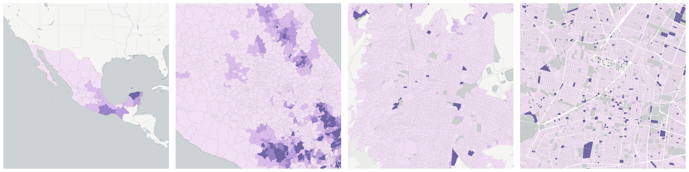
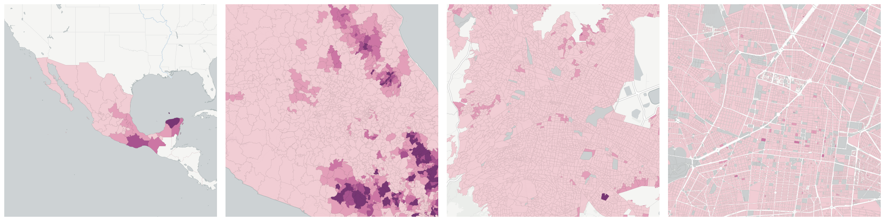

  
# Race and Ethnicity

Population breakdowns by race and ethnicity.

- [Indigenous census households](#indigenous-census-households)

- [Population in indigenous census households](#population-in-indigenous-census-households)

## Indigenous census households

Measure &quot;Indigenous census households&quot;  density per sq. kilometer  for one point:

    UPDATE {table_name}
      SET {new_numeric_column} =
        OBS_GetMeasure(
          CDB_LatLng(40.7, -73.9),
          'mx.inegi_columns.INDI19'
        );

Measure &quot;Indigenous census households&quot; within an area:

    UPDATE {table_name}
      SET {new_numeric_column} =
        OBS_GetMeasure(
          ST_Buffer(CDB_LatLng(40.7, -73.9), 0.01),
          'mx.inegi_columns.INDI19'
        );

Measure &quot;Indigenous census households&quot; percent of &quot;Households&quot; at one point:

    UPDATE {table_name}
      SET {new_numeric_column} =
        OBS_GetMeasure(
          CDB_LatLng(40.7, -73.9),
          'mx.inegi_columns.INDI19',
          'denominator'
        );

Measure &quot;Indigenous census households&quot; percent of &quot;Households&quot; within an area:

    UPDATE {table_name}
      SET {new_numeric_column} =
        OBS_GetMeasure(
          ST_Buffer(CDB_LatLng(40.7, -73.9), 0.01),
          'mx.inegi_columns.INDI19',
          'denominator'
        );

* denominator: [Households](../families/#mx-inegi-columns-hogar1)

## Population in indigenous census households

Measure &quot;Population in indigenous census households&quot;  density per sq. kilometer  for one point:

    UPDATE {table_name}
      SET {new_numeric_column} =
        OBS_GetMeasure(
          CDB_LatLng(40.7, -73.9),
          'mx.inegi_columns.INDI20'
        );

Measure &quot;Population in indigenous census households&quot; within an area:

    UPDATE {table_name}
      SET {new_numeric_column} =
        OBS_GetMeasure(
          ST_Buffer(CDB_LatLng(40.7, -73.9), 0.01),
          'mx.inegi_columns.INDI20'
        );

Measure &quot;Population in indigenous census households&quot; percent of &quot;Total population&quot; at one point:

    UPDATE {table_name}
      SET {new_numeric_column} =
        OBS_GetMeasure(
          CDB_LatLng(40.7, -73.9),
          'mx.inegi_columns.INDI20',
          'denominator'
        );

Measure &quot;Population in indigenous census households&quot; percent of &quot;Total population&quot; within an area:

    UPDATE {table_name}
      SET {new_numeric_column} =
        OBS_GetMeasure(
          ST_Buffer(CDB_LatLng(40.7, -73.9), 0.01),
          'mx.inegi_columns.INDI20',
          'denominator'
        );

* denominator: [Total population](../age_gender/#mx-inegi-columns-pob1)

