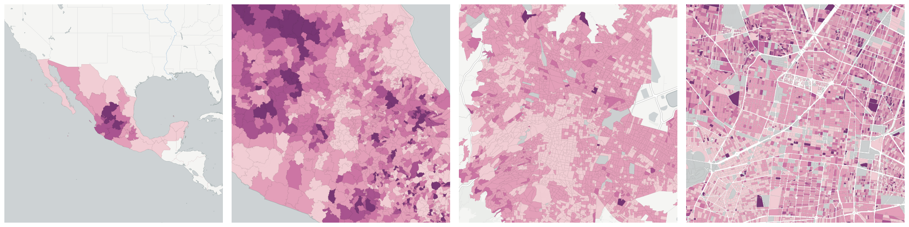
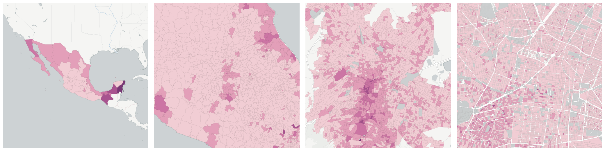
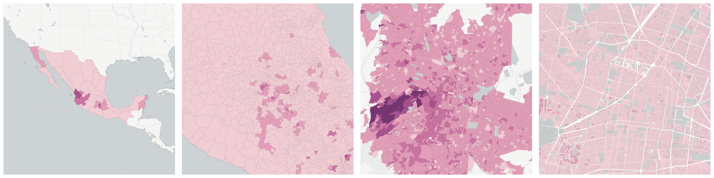
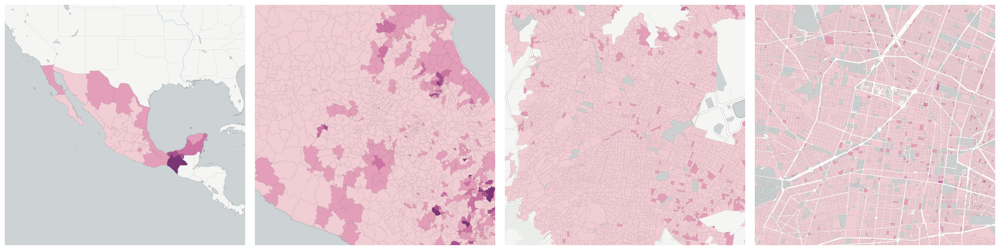

  
# Religion

Breakdowns of the population by religion.

- [Catholic population](#catholic-population)

- [Population with no religion](#population-with-no-religion)

- [Population with other religion](#population-with-other-religion)

- [Protestant and evangelical population](#protestant-and-evangelical-population)

## Catholic population

Measure &quot;Catholic population&quot;  density per sq. kilometer  for one point:

    UPDATE {table_name}
      SET {new_numeric_column} =
        OBS_GetMeasure(
          CDB_LatLng(40.7, -73.9),
          'mx.inegi_columns.RELIG1'
        );

Measure &quot;Catholic population&quot; within an area:

    UPDATE {table_name}
      SET {new_numeric_column} =
        OBS_GetMeasure(
          ST_Buffer(CDB_LatLng(40.7, -73.9), 0.01),
          'mx.inegi_columns.RELIG1'
        );

Measure &quot;Catholic population&quot; percent of &quot;Total population&quot; at one point:

    UPDATE {table_name}
      SET {new_numeric_column} =
        OBS_GetMeasure(
          CDB_LatLng(40.7, -73.9),
          'mx.inegi_columns.RELIG1',
          'denominator'
        );

Measure &quot;Catholic population&quot; percent of &quot;Total population&quot; within an area:

    UPDATE {table_name}
      SET {new_numeric_column} =
        OBS_GetMeasure(
          ST_Buffer(CDB_LatLng(40.7, -73.9), 0.01),
          'mx.inegi_columns.RELIG1',
          'denominator'
        );

* denominator: [Total population](../age_gender/#mx-inegi-columns-pob1)

## Population with no religion

Measure &quot;Population with no religion&quot;  density per sq. kilometer  for one point:

    UPDATE {table_name}
      SET {new_numeric_column} =
        OBS_GetMeasure(
          CDB_LatLng(40.7, -73.9),
          'mx.inegi_columns.RELIG4'
        );

Measure &quot;Population with no religion&quot; within an area:

    UPDATE {table_name}
      SET {new_numeric_column} =
        OBS_GetMeasure(
          ST_Buffer(CDB_LatLng(40.7, -73.9), 0.01),
          'mx.inegi_columns.RELIG4'
        );

Measure &quot;Population with no religion&quot; percent of &quot;Total population&quot; at one point:

    UPDATE {table_name}
      SET {new_numeric_column} =
        OBS_GetMeasure(
          CDB_LatLng(40.7, -73.9),
          'mx.inegi_columns.RELIG4',
          'denominator'
        );

Measure &quot;Population with no religion&quot; percent of &quot;Total population&quot; within an area:

    UPDATE {table_name}
      SET {new_numeric_column} =
        OBS_GetMeasure(
          ST_Buffer(CDB_LatLng(40.7, -73.9), 0.01),
          'mx.inegi_columns.RELIG4',
          'denominator'
        );

* denominator: [Total population](../age_gender/#mx-inegi-columns-pob1)

## Population with other religion

Measure &quot;Population with other religion&quot;  density per sq. kilometer  for one point:

    UPDATE {table_name}
      SET {new_numeric_column} =
        OBS_GetMeasure(
          CDB_LatLng(40.7, -73.9),
          'mx.inegi_columns.RELIG3'
        );

Measure &quot;Population with other religion&quot; within an area:

    UPDATE {table_name}
      SET {new_numeric_column} =
        OBS_GetMeasure(
          ST_Buffer(CDB_LatLng(40.7, -73.9), 0.01),
          'mx.inegi_columns.RELIG3'
        );

Measure &quot;Population with other religion&quot; percent of &quot;Total population&quot; at one point:

    UPDATE {table_name}
      SET {new_numeric_column} =
        OBS_GetMeasure(
          CDB_LatLng(40.7, -73.9),
          'mx.inegi_columns.RELIG3',
          'denominator'
        );

Measure &quot;Population with other religion&quot; percent of &quot;Total population&quot; within an area:

    UPDATE {table_name}
      SET {new_numeric_column} =
        OBS_GetMeasure(
          ST_Buffer(CDB_LatLng(40.7, -73.9), 0.01),
          'mx.inegi_columns.RELIG3',
          'denominator'
        );

* denominator: [Total population](../age_gender/#mx-inegi-columns-pob1)

## Protestant and evangelical population

Measure &quot;Protestant and evangelical population&quot;  density per sq. kilometer  for one point:

    UPDATE {table_name}
      SET {new_numeric_column} =
        OBS_GetMeasure(
          CDB_LatLng(40.7, -73.9),
          'mx.inegi_columns.RELIG2'
        );

Measure &quot;Protestant and evangelical population&quot; within an area:

    UPDATE {table_name}
      SET {new_numeric_column} =
        OBS_GetMeasure(
          ST_Buffer(CDB_LatLng(40.7, -73.9), 0.01),
          'mx.inegi_columns.RELIG2'
        );

Measure &quot;Protestant and evangelical population&quot; percent of &quot;Total population&quot; at one point:

    UPDATE {table_name}
      SET {new_numeric_column} =
        OBS_GetMeasure(
          CDB_LatLng(40.7, -73.9),
          'mx.inegi_columns.RELIG2',
          'denominator'
        );

Measure &quot;Protestant and evangelical population&quot; percent of &quot;Total population&quot; within an area:

    UPDATE {table_name}
      SET {new_numeric_column} =
        OBS_GetMeasure(
          ST_Buffer(CDB_LatLng(40.7, -73.9), 0.01),
          'mx.inegi_columns.RELIG2',
          'denominator'
        );

* denominator: [Total population](../age_gender/#mx-inegi-columns-pob1)

