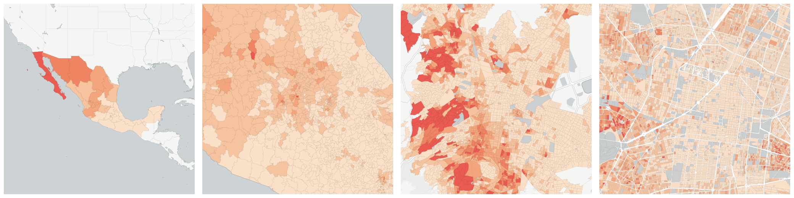
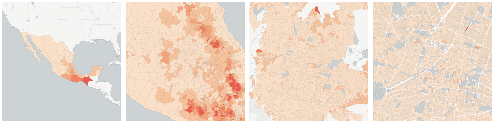

  
# Transportation

How do people move from place to place?

- [Private occupied dwellings with a car or van](#private-occupied-dwellings-with-a-car-or-van)

- [Private occupied dwellings with neither refigerator, washer, nor car or van](#private-occupied-dwellings-with-neither-refigerator-washer-nor-car-or-van)

## Private occupied dwellings with a car or van

Measure &quot;Private occupied dwellings with a car or van&quot;  density per sq. kilometer  for one point:

    UPDATE {table_name}
      SET {new_numeric_column} =
        OBS_GetMeasure(
          CDB_LatLng(40.7, -73.9),
          'mx.inegi_columns.VIV28'
        );

Measure &quot;Private occupied dwellings with a car or van&quot; within an area:

    UPDATE {table_name}
      SET {new_numeric_column} =
        OBS_GetMeasure(
          ST_Buffer(CDB_LatLng(40.7, -73.9), 0.01),
          'mx.inegi_columns.VIV28'
        );

Measure &quot;Private occupied dwellings with a car or van&quot; percent of &quot;Occupied private dwellings&quot; at one point:

    UPDATE {table_name}
      SET {new_numeric_column} =
        OBS_GetMeasure(
          CDB_LatLng(40.7, -73.9),
          'mx.inegi_columns.VIV28',
          'denominator'
        );

Measure &quot;Private occupied dwellings with a car or van&quot; percent of &quot;Occupied private dwellings&quot; within an area:

    UPDATE {table_name}
      SET {new_numeric_column} =
        OBS_GetMeasure(
          ST_Buffer(CDB_LatLng(40.7, -73.9), 0.01),
          'mx.inegi_columns.VIV28',
          'denominator'
        );

* denominator: [Occupied private dwellings](../housing/#mx-inegi-columns-viv2)

## Private occupied dwellings with neither refigerator, washer, nor car or van

Measure &quot;Private occupied dwellings with neither refigerator, washer, nor car or van&quot;  density per sq. kilometer  for one point:

    UPDATE {table_name}
      SET {new_numeric_column} =
        OBS_GetMeasure(
          CDB_LatLng(40.7, -73.9),
          'mx.inegi_columns.VIV30'
        );

Measure &quot;Private occupied dwellings with neither refigerator, washer, nor car or van&quot; within an area:

    UPDATE {table_name}
      SET {new_numeric_column} =
        OBS_GetMeasure(
          ST_Buffer(CDB_LatLng(40.7, -73.9), 0.01),
          'mx.inegi_columns.VIV30'
        );

Measure &quot;Private occupied dwellings with neither refigerator, washer, nor car or van&quot; percent of &quot;Occupied private dwellings&quot; at one point:

    UPDATE {table_name}
      SET {new_numeric_column} =
        OBS_GetMeasure(
          CDB_LatLng(40.7, -73.9),
          'mx.inegi_columns.VIV30',
          'denominator'
        );

Measure &quot;Private occupied dwellings with neither refigerator, washer, nor car or van&quot; percent of &quot;Occupied private dwellings&quot; within an area:

    UPDATE {table_name}
      SET {new_numeric_column} =
        OBS_GetMeasure(
          ST_Buffer(CDB_LatLng(40.7, -73.9), 0.01),
          'mx.inegi_columns.VIV30',
          'denominator'
        );

* denominator: [Occupied private dwellings](../housing/#mx-inegi-columns-viv2)

