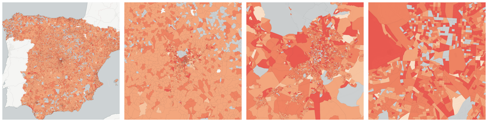

  
# Age and Gender

Population breakdowns by age and gender.

- [Total population](#total-population)

    * [Females](#females)

        - [Females between 16 (included) and 64 (included) years of age](#females-between-16-included-and-64-included-years-of-age)

        - [Females over 64 years of age](#females-over-64-years-of-age)

        - [Females under 16 years of age](#females-under-16-years-of-age)

        - [Females with a foreign nationality](#females-with-a-foreign-nationality)

        - [Females with first level studies](#females-with-first-level-studies)

        - [Females with second level studies](#females-with-second-level-studies)

        - [Females with Spanish nationality](#females-with-spanish-nationality)

        - [Females with third level studies](#females-with-third-level-studies)

        - [Females without information regarding their educational level  (under 16 years of age)](#females-without-information-regarding-their-educational-level-under-16-years-of-age)

        - [Females without studies](#females-without-studies)

        - [Illiterate females](#illiterate-females)

    * [Males](#males)

        - [Illiterate males](#illiterate-males)

        - [Males between 16 (included) and 64 (included) years of age](#males-between-16-included-and-64-included-years-of-age)

        - [Males over 64 years of age](#males-over-64-years-of-age)

        - [Males under 16 years of age](#males-under-16-years-of-age)

        - [Males with a foreign nationality](#males-with-a-foreign-nationality)

        - [Males with first level studies](#males-with-first-level-studies)

        - [Males with second level studies](#males-with-second-level-studies)

        - [Males with Spanish nationality](#males-with-spanish-nationality)

        - [Males with third level studies](#males-with-third-level-studies)

        - [Males without information regarding their educational level (under 16 years of age)](#males-without-information-regarding-their-educational-level-under-16-years-of-age)

        - [Males without studies](#males-without-studies)

    * [Persons aged between 16 (included) and 64 (included) years](#persons-aged-between-16-included-and-64-included-years)

        - [Females between 16 (included) and 64 (included) years of age](#id1)

        - [Males between 16 (included) and 64 (included) years of age](#id3)

        - [Persons aged between 16 (included) and 64 (included) years and illiterate](#persons-aged-between-16-included-and-64-included-years-and-illiterate)

        - [Persons aged between 16 (included) and 64 (included) years and with first level studies](#persons-aged-between-16-included-and-64-included-years-and-with-first-level-studies)

        - [Persons aged between 16 (included) and 64 (included) years and with second level studies](#persons-aged-between-16-included-and-64-included-years-and-with-second-level-studies)

        - [Persons aged between 16 (included) and 64 (included) years and with third level studies](#persons-aged-between-16-included-and-64-included-years-and-with-third-level-studies)

        - [Persons aged between 16 (included) and 64 (included) years and without studies](#persons-aged-between-16-included-and-64-included-years-and-without-studies)

        - [Persons with a foreign nationality and between 16 (included) and 64 (included) years of age](#persons-with-a-foreign-nationality-and-between-16-included-and-64-included-years-of-age)

        - [Persons with marital status: divorced and between 16 (included) and 64 (included) years of age](#persons-with-marital-status-divorced-and-between-16-included-and-64-included-years-of-age)

        - [Persons with marital status: married and between 16 (included) and 64 (included) years of age](#persons-with-marital-status-married-and-between-16-included-and-64-included-years-of-age)

        - [Persons with marital status: separated and between 16 (included) and 64 (included) years of age](#persons-with-marital-status-separated-and-between-16-included-and-64-included-years-of-age)

        - [Persons with marital status: single and between 16 (included) and 64 (included) years of age](#persons-with-marital-status-single-and-between-16-included-and-64-included-years-of-age)

        - [Persons with marital status: widowed and between 16 (included) and 64 (included) years of age](#persons-with-marital-status-widowed-and-between-16-included-and-64-included-years-of-age)

        - [Persons with Spanish nationality and between 16 (included) and 64 (included) years of age](#persons-with-spanish-nationality-and-between-16-included-and-64-included-years-of-age)

    * [Persons aged over 64 years](#persons-aged-over-64-years)

        - [Females over 64 years of age](#id5)

        - [Males over 64 years of age](#id7)

        - [Persons aged over 64 years and illiterate](#persons-aged-over-64-years-and-illiterate)

        - [Persons aged over 64 years and with first level studies](#persons-aged-over-64-years-and-with-first-level-studies)

        - [Persons aged over 64 years and with second level studies](#persons-aged-over-64-years-and-with-second-level-studies)

        - [Persons aged over 64 years and with third level studies](#persons-aged-over-64-years-and-with-third-level-studies)

        - [Persons aged over 64 years and without studies](#persons-aged-over-64-years-and-without-studies)

        - [Persons with a foreign nationality and over 64 years of age](#persons-with-a-foreign-nationality-and-over-64-years-of-age)

        - [Persons with marital status: divorced and over 64 years of age](#persons-with-marital-status-divorced-and-over-64-years-of-age)

        - [Persons with marital status: married and over 64 years of age](#persons-with-marital-status-married-and-over-64-years-of-age)

        - [Persons with marital status: separated and over 64 years of age](#persons-with-marital-status-separated-and-over-64-years-of-age)

        - [Persons with marital status: single and over 64 years of age](#persons-with-marital-status-single-and-over-64-years-of-age)

        - [Persons with marital status: widowed and over 64 years of age](#persons-with-marital-status-widowed-and-over-64-years-of-age)

        - [Persons with Spanish nationality and over 64 years of age](#persons-with-spanish-nationality-and-over-64-years-of-age)

    * [Persons aged under 16 years](#persons-aged-under-16-years)

        - [Females under 16 years of age](#id9)

        - [Males under 16 years of age](#id11)

        - [Persons with a foreign nationality and under 16 years of age](#persons-with-a-foreign-nationality-and-under-16-years-of-age)

        - [Persons with marital status: divorced and under 16 years of age](#persons-with-marital-status-divorced-and-under-16-years-of-age)

        - [Persons with marital status: married and under 16 years of age](#persons-with-marital-status-married-and-under-16-years-of-age)

        - [Persons with marital status: separated and under 16 years of age](#persons-with-marital-status-separated-and-under-16-years-of-age)

        - [Persons with marital status: single and under 16 years of age](#persons-with-marital-status-single-and-under-16-years-of-age)

        - [Persons with marital status: widowed and under 16 years of age](#persons-with-marital-status-widowed-and-under-16-years-of-age)

        - [Persons with Spanish nationality and under 16 years of age](#persons-with-spanish-nationality-and-under-16-years-of-age)

        - [Persons without information regarding their educational level (aged under 16 years)](#persons-without-information-regarding-their-educational-level-aged-under-16-years)

        - [Females without information regarding their educational level  (under 16 years of age)](#id13)

        - [Males without information regarding their educational level (under 16 years of age)](#id15)

        - [Persons with a foreign nationality without information regarding their educational level (under 16 years of age)](#persons-with-a-foreign-nationality-without-information-regarding-their-educational-level-under-16-years-of-age)

        - [Persons with Spanish nationality without information regarding their educational level (under 16 years of age)](#persons-with-spanish-nationality-without-information-regarding-their-educational-level-under-16-years-of-age)

    * [Population age 0 to 4](#population-age-0-to-4)

    * [Population age 5 to 9](#population-age-5-to-9)

    * [Population age 10 to 14](#population-age-10-to-14)

    * [Population age 15 to 19](#population-age-15-to-19)

    * [Population age 20 to 24](#population-age-20-to-24)

    * [Population age 25 to 29](#population-age-25-to-29)

    * [Population age 30 to 34](#population-age-30-to-34)

    * [Population age 35 to 39](#population-age-35-to-39)

    * [Population age 40 to 44](#population-age-40-to-44)

    * [Population age 45 to 49](#population-age-45-to-49)

    * [Population age 50 to 54](#population-age-50-to-54)

    * [Population age 55 to 59](#population-age-55-to-59)

    * [Population age 60 to 64](#population-age-60-to-64)

    * [Population age 65 to 69](#population-age-65-to-69)

    * [Population age 70 to 74](#population-age-70-to-74)

    * [Population age 75 to 79](#population-age-75-to-79)

    * [Population age 80 to 84](#population-age-80-to-84)

    * [Population age 85 to 89](#population-age-85-to-89)

    * [Population age 90 to 94](#population-age-90-to-94)

    * [Population age 95 to 99](#population-age-95-to-99)

    * [Population age 100 or more](#population-age-100-or-more)

## Total population

Measure &quot;Total population&quot;  density per sq. kilometer  for one point:

    UPDATE {table_name}
      SET {new_numeric_column} =
        OBS_GetMeasure(
          CDB_LatLng(40.39, -3.7),
          'es.ine.t1_1'
        );

Measure &quot;Total population&quot; within an area:

    UPDATE {table_name}
      SET {new_numeric_column} =
        OBS_GetMeasure(
          ST_Buffer(CDB_LatLng(40.39, -3.7), 0.01),
          'es.ine.t1_1'
        );

Subcolumns of Total population

- [Females](#females)

- [Males](#males)

- [Persons aged between 16 (included) and 64 (included) years](#persons-aged-between-16-included-and-64-included-years)

- [Persons aged over 64 years](#persons-aged-over-64-years)

- [Persons aged under 16 years](#persons-aged-under-16-years)

- [Population age 0 to 4](#population-age-0-to-4)

- [Population age 5 to 9](#population-age-5-to-9)

- [Population age 10 to 14](#population-age-10-to-14)

- [Population age 15 to 19](#population-age-15-to-19)

- [Population age 20 to 24](#population-age-20-to-24)

- [Population age 25 to 29](#population-age-25-to-29)

- [Population age 30 to 34](#population-age-30-to-34)

- [Population age 35 to 39](#population-age-35-to-39)

- [Population age 40 to 44](#population-age-40-to-44)

- [Population age 45 to 49](#population-age-45-to-49)

- [Population age 50 to 54](#population-age-50-to-54)

- [Population age 55 to 59](#population-age-55-to-59)

- [Population age 60 to 64](#population-age-60-to-64)

- [Population age 65 to 69](#population-age-65-to-69)

- [Population age 70 to 74](#population-age-70-to-74)

- [Population age 75 to 79](#population-age-75-to-79)

- [Population age 80 to 84](#population-age-80-to-84)

- [Population age 85 to 89](#population-age-85-to-89)

- [Population age 90 to 94](#population-age-90-to-94)

- [Population age 95 to 99](#population-age-95-to-99)

- [Population age 100 or more](#population-age-100-or-more)

### Females

Measure &quot;Females&quot;  density per sq. kilometer  for one point:

    UPDATE {table_name}
      SET {new_numeric_column} =
        OBS_GetMeasure(
          CDB_LatLng(40.39, -3.7),
          'es.ine.t2_2'
        );

Measure &quot;Females&quot; within an area:

    UPDATE {table_name}
      SET {new_numeric_column} =
        OBS_GetMeasure(
          ST_Buffer(CDB_LatLng(40.39, -3.7), 0.01),
          'es.ine.t2_2'
        );

Measure &quot;Females&quot; percent of &quot;Total population&quot; at one point:

    UPDATE {table_name}
      SET {new_numeric_column} =
        OBS_GetMeasure(
          CDB_LatLng(40.39, -3.7),
          'es.ine.t2_2',
          'denominator'
        );

Measure &quot;Females&quot; percent of &quot;Total population&quot; within an area:

    UPDATE {table_name}
      SET {new_numeric_column} =
        OBS_GetMeasure(
          ST_Buffer(CDB_LatLng(40.39, -3.7), 0.01),
          'es.ine.t2_2',
          'denominator'
        );

* denominator: [Total population](#es-ine-t1-1)

Subcolumns of Females

- [Females between 16 (included) and 64 (included) years of age](#females-between-16-included-and-64-included-years-of-age)

- [Females over 64 years of age](#females-over-64-years-of-age)

- [Females under 16 years of age](#females-under-16-years-of-age)

- [Females with a foreign nationality](#females-with-a-foreign-nationality)

- [Females with first level studies](#females-with-first-level-studies)

- [Females with second level studies](#females-with-second-level-studies)

- [Females with Spanish nationality](#females-with-spanish-nationality)

- [Females with third level studies](#females-with-third-level-studies)

- [Females without information regarding their educational level  (under 16 years of age)](#females-without-information-regarding-their-educational-level-under-16-years-of-age)

- [Females without studies](#females-without-studies)

- [Illiterate females](#illiterate-females)

#### Females between 16 (included) and 64 (included) years of age

Measure &quot;Females between 16 (included) and 64 (included) years of age&quot;  density per sq. kilometer  for one point:

    UPDATE {table_name}
      SET {new_numeric_column} =
        OBS_GetMeasure(
          CDB_LatLng(40.39, -3.7),
          'es.ine.t7_5'
        );

Measure &quot;Females between 16 (included) and 64 (included) years of age&quot; within an area:

    UPDATE {table_name}
      SET {new_numeric_column} =
        OBS_GetMeasure(
          ST_Buffer(CDB_LatLng(40.39, -3.7), 0.01),
          'es.ine.t7_5'
        );

Measure &quot;Females between 16 (included) and 64 (included) years of age&quot; percent of &quot;Females&quot; at one point:

    UPDATE {table_name}
      SET {new_numeric_column} =
        OBS_GetMeasure(
          CDB_LatLng(40.39, -3.7),
          'es.ine.t7_5',
          'denominator'
        );

Measure &quot;Females between 16 (included) and 64 (included) years of age&quot; percent of &quot;Females&quot; within an area:

    UPDATE {table_name}
      SET {new_numeric_column} =
        OBS_GetMeasure(
          ST_Buffer(CDB_LatLng(40.39, -3.7), 0.01),
          'es.ine.t7_5',
          'denominator'
        );

* denominator: [Females](#es-ine-t2-2)

* denominator: [Persons aged between 16 (included) and 64 (included) years](#es-ine-t3-2)

#### Females over 64 years of age

Measure &quot;Females over 64 years of age&quot;  density per sq. kilometer  for one point:

    UPDATE {table_name}
      SET {new_numeric_column} =
        OBS_GetMeasure(
          CDB_LatLng(40.39, -3.7),
          'es.ine.t7_6'
        );

Measure &quot;Females over 64 years of age&quot; within an area:

    UPDATE {table_name}
      SET {new_numeric_column} =
        OBS_GetMeasure(
          ST_Buffer(CDB_LatLng(40.39, -3.7), 0.01),
          'es.ine.t7_6'
        );

Measure &quot;Females over 64 years of age&quot; percent of &quot;Females&quot; at one point:

    UPDATE {table_name}
      SET {new_numeric_column} =
        OBS_GetMeasure(
          CDB_LatLng(40.39, -3.7),
          'es.ine.t7_6',
          'denominator'
        );

Measure &quot;Females over 64 years of age&quot; percent of &quot;Females&quot; within an area:

    UPDATE {table_name}
      SET {new_numeric_column} =
        OBS_GetMeasure(
          ST_Buffer(CDB_LatLng(40.39, -3.7), 0.01),
          'es.ine.t7_6',
          'denominator'
        );

* denominator: [Females](#es-ine-t2-2)

* denominator: [Persons aged over 64 years](#es-ine-t3-3)

#### Females under 16 years of age

Measure &quot;Females under 16 years of age&quot;  density per sq. kilometer  for one point:

    UPDATE {table_name}
      SET {new_numeric_column} =
        OBS_GetMeasure(
          CDB_LatLng(40.39, -3.7),
          'es.ine.t7_4'
        );

Measure &quot;Females under 16 years of age&quot; within an area:

    UPDATE {table_name}
      SET {new_numeric_column} =
        OBS_GetMeasure(
          ST_Buffer(CDB_LatLng(40.39, -3.7), 0.01),
          'es.ine.t7_4'
        );

Measure &quot;Females under 16 years of age&quot; percent of &quot;Females&quot; at one point:

    UPDATE {table_name}
      SET {new_numeric_column} =
        OBS_GetMeasure(
          CDB_LatLng(40.39, -3.7),
          'es.ine.t7_4',
          'denominator'
        );

Measure &quot;Females under 16 years of age&quot; percent of &quot;Females&quot; within an area:

    UPDATE {table_name}
      SET {new_numeric_column} =
        OBS_GetMeasure(
          ST_Buffer(CDB_LatLng(40.39, -3.7), 0.01),
          'es.ine.t7_4',
          'denominator'
        );

* denominator: [Females](#es-ine-t2-2)

* denominator: [Persons aged under 16 years](#es-ine-t3-1)

#### Females with a foreign nationality

Measure &quot;Females with a foreign nationality&quot;  density per sq. kilometer  for one point:

    UPDATE {table_name}
      SET {new_numeric_column} =
        OBS_GetMeasure(
          CDB_LatLng(40.39, -3.7),
          'es.ine.t8_4'
        );

Measure &quot;Females with a foreign nationality&quot; within an area:

    UPDATE {table_name}
      SET {new_numeric_column} =
        OBS_GetMeasure(
          ST_Buffer(CDB_LatLng(40.39, -3.7), 0.01),
          'es.ine.t8_4'
        );

Measure &quot;Females with a foreign nationality&quot; percent of &quot;Females&quot; at one point:

    UPDATE {table_name}
      SET {new_numeric_column} =
        OBS_GetMeasure(
          CDB_LatLng(40.39, -3.7),
          'es.ine.t8_4',
          'denominator'
        );

Measure &quot;Females with a foreign nationality&quot; percent of &quot;Females&quot; within an area:

    UPDATE {table_name}
      SET {new_numeric_column} =
        OBS_GetMeasure(
          ST_Buffer(CDB_LatLng(40.39, -3.7), 0.01),
          'es.ine.t8_4',
          'denominator'
        );

* denominator: [Females](#es-ine-t2-2)

* denominator: [Persons with a foreign nationality](../nationality/#es-ine-t6-2)

#### Females with first level studies

Measure &quot;Females with first level studies&quot;  density per sq. kilometer  for one point:

    UPDATE {table_name}
      SET {new_numeric_column} =
        OBS_GetMeasure(
          CDB_LatLng(40.39, -3.7),
          'es.ine.t13_6'
        );

Measure &quot;Females with first level studies&quot; within an area:

    UPDATE {table_name}
      SET {new_numeric_column} =
        OBS_GetMeasure(
          ST_Buffer(CDB_LatLng(40.39, -3.7), 0.01),
          'es.ine.t13_6'
        );

Measure &quot;Females with first level studies&quot; percent of &quot;Persons with first level studies&quot; at one point:

    UPDATE {table_name}
      SET {new_numeric_column} =
        OBS_GetMeasure(
          CDB_LatLng(40.39, -3.7),
          'es.ine.t13_6',
          'denominator'
        );

Measure &quot;Females with first level studies&quot; percent of &quot;Persons with first level studies&quot; within an area:

    UPDATE {table_name}
      SET {new_numeric_column} =
        OBS_GetMeasure(
          ST_Buffer(CDB_LatLng(40.39, -3.7), 0.01),
          'es.ine.t13_6',
          'denominator'
        );

* denominator: [Persons with first level studies](../education/#es-ine-t12-3)

* denominator: [Females](#es-ine-t2-2)

#### Females with second level studies

Measure &quot;Females with second level studies&quot;  density per sq. kilometer  for one point:

    UPDATE {table_name}
      SET {new_numeric_column} =
        OBS_GetMeasure(
          CDB_LatLng(40.39, -3.7),
          'es.ine.t13_8'
        );

Measure &quot;Females with second level studies&quot; within an area:

    UPDATE {table_name}
      SET {new_numeric_column} =
        OBS_GetMeasure(
          ST_Buffer(CDB_LatLng(40.39, -3.7), 0.01),
          'es.ine.t13_8'
        );

Measure &quot;Females with second level studies&quot; percent of &quot;Females&quot; at one point:

    UPDATE {table_name}
      SET {new_numeric_column} =
        OBS_GetMeasure(
          CDB_LatLng(40.39, -3.7),
          'es.ine.t13_8',
          'denominator'
        );

Measure &quot;Females with second level studies&quot; percent of &quot;Females&quot; within an area:

    UPDATE {table_name}
      SET {new_numeric_column} =
        OBS_GetMeasure(
          ST_Buffer(CDB_LatLng(40.39, -3.7), 0.01),
          'es.ine.t13_8',
          'denominator'
        );

* denominator: [Females](#es-ine-t2-2)

* denominator: [Persons with second level studies](../education/#es-ine-t12-4)

#### Females with Spanish nationality

Measure &quot;Females with Spanish nationality&quot;  density per sq. kilometer  for one point:

    UPDATE {table_name}
      SET {new_numeric_column} =
        OBS_GetMeasure(
          CDB_LatLng(40.39, -3.7),
          'es.ine.t8_3'
        );

Measure &quot;Females with Spanish nationality&quot; within an area:

    UPDATE {table_name}
      SET {new_numeric_column} =
        OBS_GetMeasure(
          ST_Buffer(CDB_LatLng(40.39, -3.7), 0.01),
          'es.ine.t8_3'
        );

Measure &quot;Females with Spanish nationality&quot; percent of &quot;Females&quot; at one point:

    UPDATE {table_name}
      SET {new_numeric_column} =
        OBS_GetMeasure(
          CDB_LatLng(40.39, -3.7),
          'es.ine.t8_3',
          'denominator'
        );

Measure &quot;Females with Spanish nationality&quot; percent of &quot;Females&quot; within an area:

    UPDATE {table_name}
      SET {new_numeric_column} =
        OBS_GetMeasure(
          ST_Buffer(CDB_LatLng(40.39, -3.7), 0.01),
          'es.ine.t8_3',
          'denominator'
        );

* denominator: [Females](#es-ine-t2-2)

* denominator: [Persons with Spanish nationality](../nationality/#es-ine-t6-1)

#### Females with third level studies

Measure &quot;Females with third level studies&quot;  density per sq. kilometer  for one point:

    UPDATE {table_name}
      SET {new_numeric_column} =
        OBS_GetMeasure(
          CDB_LatLng(40.39, -3.7),
          'es.ine.t13_10'
        );

Measure &quot;Females with third level studies&quot; within an area:

    UPDATE {table_name}
      SET {new_numeric_column} =
        OBS_GetMeasure(
          ST_Buffer(CDB_LatLng(40.39, -3.7), 0.01),
          'es.ine.t13_10'
        );

Measure &quot;Females with third level studies&quot; percent of &quot;Females&quot; at one point:

    UPDATE {table_name}
      SET {new_numeric_column} =
        OBS_GetMeasure(
          CDB_LatLng(40.39, -3.7),
          'es.ine.t13_10',
          'denominator'
        );

Measure &quot;Females with third level studies&quot; percent of &quot;Females&quot; within an area:

    UPDATE {table_name}
      SET {new_numeric_column} =
        OBS_GetMeasure(
          ST_Buffer(CDB_LatLng(40.39, -3.7), 0.01),
          'es.ine.t13_10',
          'denominator'
        );

* denominator: [Females](#es-ine-t2-2)

* denominator: [Persons with third level studies](../education/#es-ine-t12-5)

#### Females without information regarding their educational level  (under 16 years of age)

Measure &quot;Females without information regarding their educational level  (under 16 years of age)&quot;  density per sq. kilometer  for one point:

    UPDATE {table_name}
      SET {new_numeric_column} =
        OBS_GetMeasure(
          CDB_LatLng(40.39, -3.7),
          'es.ine.t13_12'
        );

Measure &quot;Females without information regarding their educational level  (under 16 years of age)&quot; within an area:

    UPDATE {table_name}
      SET {new_numeric_column} =
        OBS_GetMeasure(
          ST_Buffer(CDB_LatLng(40.39, -3.7), 0.01),
          'es.ine.t13_12'
        );

Measure &quot;Females without information regarding their educational level  (under 16 years of age)&quot; percent of &quot;Females&quot; at one point:

    UPDATE {table_name}
      SET {new_numeric_column} =
        OBS_GetMeasure(
          CDB_LatLng(40.39, -3.7),
          'es.ine.t13_12',
          'denominator'
        );

Measure &quot;Females without information regarding their educational level  (under 16 years of age)&quot; percent of &quot;Females&quot; within an area:

    UPDATE {table_name}
      SET {new_numeric_column} =
        OBS_GetMeasure(
          ST_Buffer(CDB_LatLng(40.39, -3.7), 0.01),
          'es.ine.t13_12',
          'denominator'
        );

* denominator: [Females](#es-ine-t2-2)

* denominator: [Persons without information regarding their educational level (aged under 16 years)](../education/#es-ine-t12-6)

#### Females without studies

Measure &quot;Females without studies&quot;  density per sq. kilometer  for one point:

    UPDATE {table_name}
      SET {new_numeric_column} =
        OBS_GetMeasure(
          CDB_LatLng(40.39, -3.7),
          'es.ine.t13_4'
        );

Measure &quot;Females without studies&quot; within an area:

    UPDATE {table_name}
      SET {new_numeric_column} =
        OBS_GetMeasure(
          ST_Buffer(CDB_LatLng(40.39, -3.7), 0.01),
          'es.ine.t13_4'
        );

Measure &quot;Females without studies&quot; percent of &quot;Females&quot; at one point:

    UPDATE {table_name}
      SET {new_numeric_column} =
        OBS_GetMeasure(
          CDB_LatLng(40.39, -3.7),
          'es.ine.t13_4',
          'denominator'
        );

Measure &quot;Females without studies&quot; percent of &quot;Females&quot; within an area:

    UPDATE {table_name}
      SET {new_numeric_column} =
        OBS_GetMeasure(
          ST_Buffer(CDB_LatLng(40.39, -3.7), 0.01),
          'es.ine.t13_4',
          'denominator'
        );

* denominator: [Females](#es-ine-t2-2)

* denominator: [Persons without studies](../education/#es-ine-t12-2)

#### Illiterate females

Measure &quot;Illiterate females&quot;  density per sq. kilometer  for one point:

    UPDATE {table_name}
      SET {new_numeric_column} =
        OBS_GetMeasure(
          CDB_LatLng(40.39, -3.7),
          'es.ine.t13_2'
        );

Measure &quot;Illiterate females&quot; within an area:

    UPDATE {table_name}
      SET {new_numeric_column} =
        OBS_GetMeasure(
          ST_Buffer(CDB_LatLng(40.39, -3.7), 0.01),
          'es.ine.t13_2'
        );

Measure &quot;Illiterate females&quot; percent of &quot;Females&quot; at one point:

    UPDATE {table_name}
      SET {new_numeric_column} =
        OBS_GetMeasure(
          CDB_LatLng(40.39, -3.7),
          'es.ine.t13_2',
          'denominator'
        );

Measure &quot;Illiterate females&quot; percent of &quot;Females&quot; within an area:

    UPDATE {table_name}
      SET {new_numeric_column} =
        OBS_GetMeasure(
          ST_Buffer(CDB_LatLng(40.39, -3.7), 0.01),
          'es.ine.t13_2',
          'denominator'
        );

* denominator: [Females](#es-ine-t2-2)

* denominator: [Illiterate persons](../education/#es-ine-t12-1)

### Males

Measure &quot;Males&quot;  density per sq. kilometer  for one point:

    UPDATE {table_name}
      SET {new_numeric_column} =
        OBS_GetMeasure(
          CDB_LatLng(40.39, -3.7),
          'es.ine.t2_1'
        );

Measure &quot;Males&quot; within an area:

    UPDATE {table_name}
      SET {new_numeric_column} =
        OBS_GetMeasure(
          ST_Buffer(CDB_LatLng(40.39, -3.7), 0.01),
          'es.ine.t2_1'
        );

Measure &quot;Males&quot; percent of &quot;Total population&quot; at one point:

    UPDATE {table_name}
      SET {new_numeric_column} =
        OBS_GetMeasure(
          CDB_LatLng(40.39, -3.7),
          'es.ine.t2_1',
          'denominator'
        );

Measure &quot;Males&quot; percent of &quot;Total population&quot; within an area:

    UPDATE {table_name}
      SET {new_numeric_column} =
        OBS_GetMeasure(
          ST_Buffer(CDB_LatLng(40.39, -3.7), 0.01),
          'es.ine.t2_1',
          'denominator'
        );

* denominator: [Total population](#es-ine-t1-1)

Subcolumns of Males

- [Illiterate males](#illiterate-males)

- [Males between 16 (included) and 64 (included) years of age](#males-between-16-included-and-64-included-years-of-age)

- [Males over 64 years of age](#males-over-64-years-of-age)

- [Males under 16 years of age](#males-under-16-years-of-age)

- [Males with a foreign nationality](#males-with-a-foreign-nationality)

- [Males with first level studies](#males-with-first-level-studies)

- [Males with second level studies](#males-with-second-level-studies)

- [Males with Spanish nationality](#males-with-spanish-nationality)

- [Males with third level studies](#males-with-third-level-studies)

- [Males without information regarding their educational level (under 16 years of age)](#males-without-information-regarding-their-educational-level-under-16-years-of-age)

- [Males without studies](#males-without-studies)

#### Illiterate males

Measure &quot;Illiterate males&quot;  density per sq. kilometer  for one point:

    UPDATE {table_name}
      SET {new_numeric_column} =
        OBS_GetMeasure(
          CDB_LatLng(40.39, -3.7),
          'es.ine.t13_1'
        );

Measure &quot;Illiterate males&quot; within an area:

    UPDATE {table_name}
      SET {new_numeric_column} =
        OBS_GetMeasure(
          ST_Buffer(CDB_LatLng(40.39, -3.7), 0.01),
          'es.ine.t13_1'
        );

Measure &quot;Illiterate males&quot; percent of &quot;Illiterate persons&quot; at one point:

    UPDATE {table_name}
      SET {new_numeric_column} =
        OBS_GetMeasure(
          CDB_LatLng(40.39, -3.7),
          'es.ine.t13_1',
          'denominator'
        );

Measure &quot;Illiterate males&quot; percent of &quot;Illiterate persons&quot; within an area:

    UPDATE {table_name}
      SET {new_numeric_column} =
        OBS_GetMeasure(
          ST_Buffer(CDB_LatLng(40.39, -3.7), 0.01),
          'es.ine.t13_1',
          'denominator'
        );

* denominator: [Illiterate persons](../education/#es-ine-t12-1)

* denominator: [Males](#es-ine-t2-1)

#### Males between 16 (included) and 64 (included) years of age

Measure &quot;Males between 16 (included) and 64 (included) years of age&quot;  density per sq. kilometer  for one point:

    UPDATE {table_name}
      SET {new_numeric_column} =
        OBS_GetMeasure(
          CDB_LatLng(40.39, -3.7),
          'es.ine.t7_2'
        );

Measure &quot;Males between 16 (included) and 64 (included) years of age&quot; within an area:

    UPDATE {table_name}
      SET {new_numeric_column} =
        OBS_GetMeasure(
          ST_Buffer(CDB_LatLng(40.39, -3.7), 0.01),
          'es.ine.t7_2'
        );

Measure &quot;Males between 16 (included) and 64 (included) years of age&quot; percent of &quot;Persons aged between 16 (included) and 64 (included) years&quot; at one point:

    UPDATE {table_name}
      SET {new_numeric_column} =
        OBS_GetMeasure(
          CDB_LatLng(40.39, -3.7),
          'es.ine.t7_2',
          'denominator'
        );

Measure &quot;Males between 16 (included) and 64 (included) years of age&quot; percent of &quot;Persons aged between 16 (included) and 64 (included) years&quot; within an area:

    UPDATE {table_name}
      SET {new_numeric_column} =
        OBS_GetMeasure(
          ST_Buffer(CDB_LatLng(40.39, -3.7), 0.01),
          'es.ine.t7_2',
          'denominator'
        );

* denominator: [Persons aged between 16 (included) and 64 (included) years](#es-ine-t3-2)

* denominator: [Males](#es-ine-t2-1)

#### Males over 64 years of age

Measure &quot;Males over 64 years of age&quot;  density per sq. kilometer  for one point:

    UPDATE {table_name}
      SET {new_numeric_column} =
        OBS_GetMeasure(
          CDB_LatLng(40.39, -3.7),
          'es.ine.t7_3'
        );

Measure &quot;Males over 64 years of age&quot; within an area:

    UPDATE {table_name}
      SET {new_numeric_column} =
        OBS_GetMeasure(
          ST_Buffer(CDB_LatLng(40.39, -3.7), 0.01),
          'es.ine.t7_3'
        );

Measure &quot;Males over 64 years of age&quot; percent of &quot;Males&quot; at one point:

    UPDATE {table_name}
      SET {new_numeric_column} =
        OBS_GetMeasure(
          CDB_LatLng(40.39, -3.7),
          'es.ine.t7_3',
          'denominator'
        );

Measure &quot;Males over 64 years of age&quot; percent of &quot;Males&quot; within an area:

    UPDATE {table_name}
      SET {new_numeric_column} =
        OBS_GetMeasure(
          ST_Buffer(CDB_LatLng(40.39, -3.7), 0.01),
          'es.ine.t7_3',
          'denominator'
        );

* denominator: [Males](#es-ine-t2-1)

* denominator: [Persons aged over 64 years](#es-ine-t3-3)

#### Males under 16 years of age

Measure &quot;Males under 16 years of age&quot;  density per sq. kilometer  for one point:

    UPDATE {table_name}
      SET {new_numeric_column} =
        OBS_GetMeasure(
          CDB_LatLng(40.39, -3.7),
          'es.ine.t7_1'
        );

Measure &quot;Males under 16 years of age&quot; within an area:

    UPDATE {table_name}
      SET {new_numeric_column} =
        OBS_GetMeasure(
          ST_Buffer(CDB_LatLng(40.39, -3.7), 0.01),
          'es.ine.t7_1'
        );

Measure &quot;Males under 16 years of age&quot; percent of &quot;Males&quot; at one point:

    UPDATE {table_name}
      SET {new_numeric_column} =
        OBS_GetMeasure(
          CDB_LatLng(40.39, -3.7),
          'es.ine.t7_1',
          'denominator'
        );

Measure &quot;Males under 16 years of age&quot; percent of &quot;Males&quot; within an area:

    UPDATE {table_name}
      SET {new_numeric_column} =
        OBS_GetMeasure(
          ST_Buffer(CDB_LatLng(40.39, -3.7), 0.01),
          'es.ine.t7_1',
          'denominator'
        );

* denominator: [Males](#es-ine-t2-1)

* denominator: [Persons aged under 16 years](#es-ine-t3-1)

#### Males with a foreign nationality

Measure &quot;Males with a foreign nationality&quot;  density per sq. kilometer  for one point:

    UPDATE {table_name}
      SET {new_numeric_column} =
        OBS_GetMeasure(
          CDB_LatLng(40.39, -3.7),
          'es.ine.t8_2'
        );

Measure &quot;Males with a foreign nationality&quot; within an area:

    UPDATE {table_name}
      SET {new_numeric_column} =
        OBS_GetMeasure(
          ST_Buffer(CDB_LatLng(40.39, -3.7), 0.01),
          'es.ine.t8_2'
        );

Measure &quot;Males with a foreign nationality&quot; percent of &quot;Males&quot; at one point:

    UPDATE {table_name}
      SET {new_numeric_column} =
        OBS_GetMeasure(
          CDB_LatLng(40.39, -3.7),
          'es.ine.t8_2',
          'denominator'
        );

Measure &quot;Males with a foreign nationality&quot; percent of &quot;Males&quot; within an area:

    UPDATE {table_name}
      SET {new_numeric_column} =
        OBS_GetMeasure(
          ST_Buffer(CDB_LatLng(40.39, -3.7), 0.01),
          'es.ine.t8_2',
          'denominator'
        );

* denominator: [Males](#es-ine-t2-1)

* denominator: [Persons with a foreign nationality](../nationality/#es-ine-t6-2)

#### Males with first level studies

Measure &quot;Males with first level studies&quot;  density per sq. kilometer  for one point:

    UPDATE {table_name}
      SET {new_numeric_column} =
        OBS_GetMeasure(
          CDB_LatLng(40.39, -3.7),
          'es.ine.t13_5'
        );

Measure &quot;Males with first level studies&quot; within an area:

    UPDATE {table_name}
      SET {new_numeric_column} =
        OBS_GetMeasure(
          ST_Buffer(CDB_LatLng(40.39, -3.7), 0.01),
          'es.ine.t13_5'
        );

Measure &quot;Males with first level studies&quot; percent of &quot;Persons with first level studies&quot; at one point:

    UPDATE {table_name}
      SET {new_numeric_column} =
        OBS_GetMeasure(
          CDB_LatLng(40.39, -3.7),
          'es.ine.t13_5',
          'denominator'
        );

Measure &quot;Males with first level studies&quot; percent of &quot;Persons with first level studies&quot; within an area:

    UPDATE {table_name}
      SET {new_numeric_column} =
        OBS_GetMeasure(
          ST_Buffer(CDB_LatLng(40.39, -3.7), 0.01),
          'es.ine.t13_5',
          'denominator'
        );

* denominator: [Persons with first level studies](../education/#es-ine-t12-3)

* denominator: [Males](#es-ine-t2-1)

#### Males with second level studies

Measure &quot;Males with second level studies&quot;  density per sq. kilometer  for one point:

    UPDATE {table_name}
      SET {new_numeric_column} =
        OBS_GetMeasure(
          CDB_LatLng(40.39, -3.7),
          'es.ine.t13_7'
        );

Measure &quot;Males with second level studies&quot; within an area:

    UPDATE {table_name}
      SET {new_numeric_column} =
        OBS_GetMeasure(
          ST_Buffer(CDB_LatLng(40.39, -3.7), 0.01),
          'es.ine.t13_7'
        );

Measure &quot;Males with second level studies&quot; percent of &quot;Males&quot; at one point:

    UPDATE {table_name}
      SET {new_numeric_column} =
        OBS_GetMeasure(
          CDB_LatLng(40.39, -3.7),
          'es.ine.t13_7',
          'denominator'
        );

Measure &quot;Males with second level studies&quot; percent of &quot;Males&quot; within an area:

    UPDATE {table_name}
      SET {new_numeric_column} =
        OBS_GetMeasure(
          ST_Buffer(CDB_LatLng(40.39, -3.7), 0.01),
          'es.ine.t13_7',
          'denominator'
        );

* denominator: [Males](#es-ine-t2-1)

* denominator: [Persons with second level studies](../education/#es-ine-t12-4)

#### Males with Spanish nationality

Measure &quot;Males with Spanish nationality&quot;  density per sq. kilometer  for one point:

    UPDATE {table_name}
      SET {new_numeric_column} =
        OBS_GetMeasure(
          CDB_LatLng(40.39, -3.7),
          'es.ine.t8_1'
        );

Measure &quot;Males with Spanish nationality&quot; within an area:

    UPDATE {table_name}
      SET {new_numeric_column} =
        OBS_GetMeasure(
          ST_Buffer(CDB_LatLng(40.39, -3.7), 0.01),
          'es.ine.t8_1'
        );

Measure &quot;Males with Spanish nationality&quot; percent of &quot;Males&quot; at one point:

    UPDATE {table_name}
      SET {new_numeric_column} =
        OBS_GetMeasure(
          CDB_LatLng(40.39, -3.7),
          'es.ine.t8_1',
          'denominator'
        );

Measure &quot;Males with Spanish nationality&quot; percent of &quot;Males&quot; within an area:

    UPDATE {table_name}
      SET {new_numeric_column} =
        OBS_GetMeasure(
          ST_Buffer(CDB_LatLng(40.39, -3.7), 0.01),
          'es.ine.t8_1',
          'denominator'
        );

* denominator: [Males](#es-ine-t2-1)

* denominator: [Persons with Spanish nationality](../nationality/#es-ine-t6-1)

#### Males with third level studies

Measure &quot;Males with third level studies&quot;  density per sq. kilometer  for one point:

    UPDATE {table_name}
      SET {new_numeric_column} =
        OBS_GetMeasure(
          CDB_LatLng(40.39, -3.7),
          'es.ine.t13_9'
        );

Measure &quot;Males with third level studies&quot; within an area:

    UPDATE {table_name}
      SET {new_numeric_column} =
        OBS_GetMeasure(
          ST_Buffer(CDB_LatLng(40.39, -3.7), 0.01),
          'es.ine.t13_9'
        );

Measure &quot;Males with third level studies&quot; percent of &quot;Persons with third level studies&quot; at one point:

    UPDATE {table_name}
      SET {new_numeric_column} =
        OBS_GetMeasure(
          CDB_LatLng(40.39, -3.7),
          'es.ine.t13_9',
          'denominator'
        );

Measure &quot;Males with third level studies&quot; percent of &quot;Persons with third level studies&quot; within an area:

    UPDATE {table_name}
      SET {new_numeric_column} =
        OBS_GetMeasure(
          ST_Buffer(CDB_LatLng(40.39, -3.7), 0.01),
          'es.ine.t13_9',
          'denominator'
        );

* denominator: [Persons with third level studies](../education/#es-ine-t12-5)

* denominator: [Males](#es-ine-t2-1)

#### Males without information regarding their educational level (under 16 years of age)

Measure &quot;Males without information regarding their educational level (under 16 years of age)&quot;  density per sq. kilometer  for one point:

    UPDATE {table_name}
      SET {new_numeric_column} =
        OBS_GetMeasure(
          CDB_LatLng(40.39, -3.7),
          'es.ine.t13_11'
        );

Measure &quot;Males without information regarding their educational level (under 16 years of age)&quot; within an area:

    UPDATE {table_name}
      SET {new_numeric_column} =
        OBS_GetMeasure(
          ST_Buffer(CDB_LatLng(40.39, -3.7), 0.01),
          'es.ine.t13_11'
        );

Measure &quot;Males without information regarding their educational level (under 16 years of age)&quot; percent of &quot;Males&quot; at one point:

    UPDATE {table_name}
      SET {new_numeric_column} =
        OBS_GetMeasure(
          CDB_LatLng(40.39, -3.7),
          'es.ine.t13_11',
          'denominator'
        );

Measure &quot;Males without information regarding their educational level (under 16 years of age)&quot; percent of &quot;Males&quot; within an area:

    UPDATE {table_name}
      SET {new_numeric_column} =
        OBS_GetMeasure(
          ST_Buffer(CDB_LatLng(40.39, -3.7), 0.01),
          'es.ine.t13_11',
          'denominator'
        );

* denominator: [Males](#es-ine-t2-1)

* denominator: [Persons without information regarding their educational level (aged under 16 years)](../education/#es-ine-t12-6)

#### Males without studies

Measure &quot;Males without studies&quot;  density per sq. kilometer  for one point:

    UPDATE {table_name}
      SET {new_numeric_column} =
        OBS_GetMeasure(
          CDB_LatLng(40.39, -3.7),
          'es.ine.t13_3'
        );

Measure &quot;Males without studies&quot; within an area:

    UPDATE {table_name}
      SET {new_numeric_column} =
        OBS_GetMeasure(
          ST_Buffer(CDB_LatLng(40.39, -3.7), 0.01),
          'es.ine.t13_3'
        );

Measure &quot;Males without studies&quot; percent of &quot;Males&quot; at one point:

    UPDATE {table_name}
      SET {new_numeric_column} =
        OBS_GetMeasure(
          CDB_LatLng(40.39, -3.7),
          'es.ine.t13_3',
          'denominator'
        );

Measure &quot;Males without studies&quot; percent of &quot;Males&quot; within an area:

    UPDATE {table_name}
      SET {new_numeric_column} =
        OBS_GetMeasure(
          ST_Buffer(CDB_LatLng(40.39, -3.7), 0.01),
          'es.ine.t13_3',
          'denominator'
        );

* denominator: [Males](#es-ine-t2-1)

* denominator: [Persons without studies](../education/#es-ine-t12-2)

### Persons aged between 16 (included) and 64 (included) years

Measure &quot;Persons aged between 16 (included) and 64 (included) years&quot;  density per sq. kilometer  for one point:

    UPDATE {table_name}
      SET {new_numeric_column} =
        OBS_GetMeasure(
          CDB_LatLng(40.39, -3.7),
          'es.ine.t3_2'
        );

Measure &quot;Persons aged between 16 (included) and 64 (included) years&quot; within an area:

    UPDATE {table_name}
      SET {new_numeric_column} =
        OBS_GetMeasure(
          ST_Buffer(CDB_LatLng(40.39, -3.7), 0.01),
          'es.ine.t3_2'
        );

Measure &quot;Persons aged between 16 (included) and 64 (included) years&quot; percent of &quot;Total population&quot; at one point:

    UPDATE {table_name}
      SET {new_numeric_column} =
        OBS_GetMeasure(
          CDB_LatLng(40.39, -3.7),
          'es.ine.t3_2',
          'denominator'
        );

Measure &quot;Persons aged between 16 (included) and 64 (included) years&quot; percent of &quot;Total population&quot; within an area:

    UPDATE {table_name}
      SET {new_numeric_column} =
        OBS_GetMeasure(
          ST_Buffer(CDB_LatLng(40.39, -3.7), 0.01),
          'es.ine.t3_2',
          'denominator'
        );

* denominator: [Total population](#es-ine-t1-1)

Subcolumns of Persons aged between 16 (included) and 64 (included) years

- [Females between 16 (included) and 64 (included) years of age](#id1)

- [Males between 16 (included) and 64 (included) years of age](#id3)

- [Persons aged between 16 (included) and 64 (included) years and illiterate](#persons-aged-between-16-included-and-64-included-years-and-illiterate)

- [Persons aged between 16 (included) and 64 (included) years and with first level studies](#persons-aged-between-16-included-and-64-included-years-and-with-first-level-studies)

- [Persons aged between 16 (included) and 64 (included) years and with second level studies](#persons-aged-between-16-included-and-64-included-years-and-with-second-level-studies)

- [Persons aged between 16 (included) and 64 (included) years and with third level studies](#persons-aged-between-16-included-and-64-included-years-and-with-third-level-studies)

- [Persons aged between 16 (included) and 64 (included) years and without studies](#persons-aged-between-16-included-and-64-included-years-and-without-studies)

- [Persons with a foreign nationality and between 16 (included) and 64 (included) years of age](#persons-with-a-foreign-nationality-and-between-16-included-and-64-included-years-of-age)

- [Persons with marital status: divorced and between 16 (included) and 64 (included) years of age](#persons-with-marital-status-divorced-and-between-16-included-and-64-included-years-of-age)

- [Persons with marital status: married and between 16 (included) and 64 (included) years of age](#persons-with-marital-status-married-and-between-16-included-and-64-included-years-of-age)

- [Persons with marital status: separated and between 16 (included) and 64 (included) years of age](#persons-with-marital-status-separated-and-between-16-included-and-64-included-years-of-age)

- [Persons with marital status: single and between 16 (included) and 64 (included) years of age](#persons-with-marital-status-single-and-between-16-included-and-64-included-years-of-age)

- [Persons with marital status: widowed and between 16 (included) and 64 (included) years of age](#persons-with-marital-status-widowed-and-between-16-included-and-64-included-years-of-age)

- [Persons with Spanish nationality and between 16 (included) and 64 (included) years of age](#persons-with-spanish-nationality-and-between-16-included-and-64-included-years-of-age)

#### Females between 16 (included) and 64 (included) years of age

Measure &quot;Females between 16 (included) and 64 (included) years of age&quot;  density per sq. kilometer  for one point:

    UPDATE {table_name}
      SET {new_numeric_column} =
        OBS_GetMeasure(
          CDB_LatLng(40.39, -3.7),
          'es.ine.t7_5'
        );

Measure &quot;Females between 16 (included) and 64 (included) years of age&quot; within an area:

    UPDATE {table_name}
      SET {new_numeric_column} =
        OBS_GetMeasure(
          ST_Buffer(CDB_LatLng(40.39, -3.7), 0.01),
          'es.ine.t7_5'
        );

Measure &quot;Females between 16 (included) and 64 (included) years of age&quot; percent of &quot;Females&quot; at one point:

    UPDATE {table_name}
      SET {new_numeric_column} =
        OBS_GetMeasure(
          CDB_LatLng(40.39, -3.7),
          'es.ine.t7_5',
          'denominator'
        );

Measure &quot;Females between 16 (included) and 64 (included) years of age&quot; percent of &quot;Females&quot; within an area:

    UPDATE {table_name}
      SET {new_numeric_column} =
        OBS_GetMeasure(
          ST_Buffer(CDB_LatLng(40.39, -3.7), 0.01),
          'es.ine.t7_5',
          'denominator'
        );

* denominator: [Females](#es-ine-t2-2)

* denominator: [Persons aged between 16 (included) and 64 (included) years](#es-ine-t3-2)

#### Males between 16 (included) and 64 (included) years of age

Measure &quot;Males between 16 (included) and 64 (included) years of age&quot;  density per sq. kilometer  for one point:

    UPDATE {table_name}
      SET {new_numeric_column} =
        OBS_GetMeasure(
          CDB_LatLng(40.39, -3.7),
          'es.ine.t7_2'
        );

Measure &quot;Males between 16 (included) and 64 (included) years of age&quot; within an area:

    UPDATE {table_name}
      SET {new_numeric_column} =
        OBS_GetMeasure(
          ST_Buffer(CDB_LatLng(40.39, -3.7), 0.01),
          'es.ine.t7_2'
        );

Measure &quot;Males between 16 (included) and 64 (included) years of age&quot; percent of &quot;Persons aged between 16 (included) and 64 (included) years&quot; at one point:

    UPDATE {table_name}
      SET {new_numeric_column} =
        OBS_GetMeasure(
          CDB_LatLng(40.39, -3.7),
          'es.ine.t7_2',
          'denominator'
        );

Measure &quot;Males between 16 (included) and 64 (included) years of age&quot; percent of &quot;Persons aged between 16 (included) and 64 (included) years&quot; within an area:

    UPDATE {table_name}
      SET {new_numeric_column} =
        OBS_GetMeasure(
          ST_Buffer(CDB_LatLng(40.39, -3.7), 0.01),
          'es.ine.t7_2',
          'denominator'
        );

* denominator: [Persons aged between 16 (included) and 64 (included) years](#es-ine-t3-2)

* denominator: [Males](#es-ine-t2-1)

#### Persons aged between 16 (included) and 64 (included) years and illiterate

Measure &quot;Persons aged between 16 (included) and 64 (included) years and illiterate&quot;  density per sq. kilometer  for one point:

    UPDATE {table_name}
      SET {new_numeric_column} =
        OBS_GetMeasure(
          CDB_LatLng(40.39, -3.7),
          'es.ine.t15_2'
        );

Measure &quot;Persons aged between 16 (included) and 64 (included) years and illiterate&quot; within an area:

    UPDATE {table_name}
      SET {new_numeric_column} =
        OBS_GetMeasure(
          ST_Buffer(CDB_LatLng(40.39, -3.7), 0.01),
          'es.ine.t15_2'
        );

Measure &quot;Persons aged between 16 (included) and 64 (included) years and illiterate&quot; percent of &quot;Persons aged between 16 (included) and 64 (included) years&quot; at one point:

    UPDATE {table_name}
      SET {new_numeric_column} =
        OBS_GetMeasure(
          CDB_LatLng(40.39, -3.7),
          'es.ine.t15_2',
          'denominator'
        );

Measure &quot;Persons aged between 16 (included) and 64 (included) years and illiterate&quot; percent of &quot;Persons aged between 16 (included) and 64 (included) years&quot; within an area:

    UPDATE {table_name}
      SET {new_numeric_column} =
        OBS_GetMeasure(
          ST_Buffer(CDB_LatLng(40.39, -3.7), 0.01),
          'es.ine.t15_2',
          'denominator'
        );

* denominator: [Persons aged between 16 (included) and 64 (included) years](#es-ine-t3-2)

* denominator: [Illiterate persons](../education/#es-ine-t12-1)

#### Persons aged between 16 (included) and 64 (included) years and with first level studies

Measure &quot;Persons aged between 16 (included) and 64 (included) years and with first level studies&quot;  density per sq. kilometer  for one point:

    UPDATE {table_name}
      SET {new_numeric_column} =
        OBS_GetMeasure(
          CDB_LatLng(40.39, -3.7),
          'es.ine.t15_8'
        );

Measure &quot;Persons aged between 16 (included) and 64 (included) years and with first level studies&quot; within an area:

    UPDATE {table_name}
      SET {new_numeric_column} =
        OBS_GetMeasure(
          ST_Buffer(CDB_LatLng(40.39, -3.7), 0.01),
          'es.ine.t15_8'
        );

Measure &quot;Persons aged between 16 (included) and 64 (included) years and with first level studies&quot; percent of &quot;Persons with first level studies&quot; at one point:

    UPDATE {table_name}
      SET {new_numeric_column} =
        OBS_GetMeasure(
          CDB_LatLng(40.39, -3.7),
          'es.ine.t15_8',
          'denominator'
        );

Measure &quot;Persons aged between 16 (included) and 64 (included) years and with first level studies&quot; percent of &quot;Persons with first level studies&quot; within an area:

    UPDATE {table_name}
      SET {new_numeric_column} =
        OBS_GetMeasure(
          ST_Buffer(CDB_LatLng(40.39, -3.7), 0.01),
          'es.ine.t15_8',
          'denominator'
        );

* denominator: [Persons with first level studies](../education/#es-ine-t12-3)

* denominator: [Persons aged between 16 (included) and 64 (included) years](#es-ine-t3-2)

#### Persons aged between 16 (included) and 64 (included) years and with second level studies

Measure &quot;Persons aged between 16 (included) and 64 (included) years and with second level studies&quot;  density per sq. kilometer  for one point:

    UPDATE {table_name}
      SET {new_numeric_column} =
        OBS_GetMeasure(
          CDB_LatLng(40.39, -3.7),
          'es.ine.t15_11'
        );

Measure &quot;Persons aged between 16 (included) and 64 (included) years and with second level studies&quot; within an area:

    UPDATE {table_name}
      SET {new_numeric_column} =
        OBS_GetMeasure(
          ST_Buffer(CDB_LatLng(40.39, -3.7), 0.01),
          'es.ine.t15_11'
        );

Measure &quot;Persons aged between 16 (included) and 64 (included) years and with second level studies&quot; percent of &quot;Persons with first level studies&quot; at one point:

    UPDATE {table_name}
      SET {new_numeric_column} =
        OBS_GetMeasure(
          CDB_LatLng(40.39, -3.7),
          'es.ine.t15_11',
          'denominator'
        );

Measure &quot;Persons aged between 16 (included) and 64 (included) years and with second level studies&quot; percent of &quot;Persons with first level studies&quot; within an area:

    UPDATE {table_name}
      SET {new_numeric_column} =
        OBS_GetMeasure(
          ST_Buffer(CDB_LatLng(40.39, -3.7), 0.01),
          'es.ine.t15_11',
          'denominator'
        );

* denominator: [Persons with first level studies](../education/#es-ine-t12-3)

* denominator: [Persons aged between 16 (included) and 64 (included) years](#es-ine-t3-2)

#### Persons aged between 16 (included) and 64 (included) years and with third level studies

Measure &quot;Persons aged between 16 (included) and 64 (included) years and with third level studies&quot;  density per sq. kilometer  for one point:

    UPDATE {table_name}
      SET {new_numeric_column} =
        OBS_GetMeasure(
          CDB_LatLng(40.39, -3.7),
          'es.ine.t15_14'
        );

Measure &quot;Persons aged between 16 (included) and 64 (included) years and with third level studies&quot; within an area:

    UPDATE {table_name}
      SET {new_numeric_column} =
        OBS_GetMeasure(
          ST_Buffer(CDB_LatLng(40.39, -3.7), 0.01),
          'es.ine.t15_14'
        );

Measure &quot;Persons aged between 16 (included) and 64 (included) years and with third level studies&quot; percent of &quot;Persons with first level studies&quot; at one point:

    UPDATE {table_name}
      SET {new_numeric_column} =
        OBS_GetMeasure(
          CDB_LatLng(40.39, -3.7),
          'es.ine.t15_14',
          'denominator'
        );

Measure &quot;Persons aged between 16 (included) and 64 (included) years and with third level studies&quot; percent of &quot;Persons with first level studies&quot; within an area:

    UPDATE {table_name}
      SET {new_numeric_column} =
        OBS_GetMeasure(
          ST_Buffer(CDB_LatLng(40.39, -3.7), 0.01),
          'es.ine.t15_14',
          'denominator'
        );

* denominator: [Persons with first level studies](../education/#es-ine-t12-3)

* denominator: [Persons aged between 16 (included) and 64 (included) years](#es-ine-t3-2)

#### Persons aged between 16 (included) and 64 (included) years and without studies

Measure &quot;Persons aged between 16 (included) and 64 (included) years and without studies&quot;  density per sq. kilometer  for one point:

    UPDATE {table_name}
      SET {new_numeric_column} =
        OBS_GetMeasure(
          CDB_LatLng(40.39, -3.7),
          'es.ine.t15_5'
        );

Measure &quot;Persons aged between 16 (included) and 64 (included) years and without studies&quot; within an area:

    UPDATE {table_name}
      SET {new_numeric_column} =
        OBS_GetMeasure(
          ST_Buffer(CDB_LatLng(40.39, -3.7), 0.01),
          'es.ine.t15_5'
        );

Measure &quot;Persons aged between 16 (included) and 64 (included) years and without studies&quot; percent of &quot;Persons aged between 16 (included) and 64 (included) years&quot; at one point:

    UPDATE {table_name}
      SET {new_numeric_column} =
        OBS_GetMeasure(
          CDB_LatLng(40.39, -3.7),
          'es.ine.t15_5',
          'denominator'
        );

Measure &quot;Persons aged between 16 (included) and 64 (included) years and without studies&quot; percent of &quot;Persons aged between 16 (included) and 64 (included) years&quot; within an area:

    UPDATE {table_name}
      SET {new_numeric_column} =
        OBS_GetMeasure(
          ST_Buffer(CDB_LatLng(40.39, -3.7), 0.01),
          'es.ine.t15_5',
          'denominator'
        );

* denominator: [Persons aged between 16 (included) and 64 (included) years](#es-ine-t3-2)

* denominator: [Persons without studies](../education/#es-ine-t12-2)

#### Persons with a foreign nationality and between 16 (included) and 64 (included) years of age

Measure &quot;Persons with a foreign nationality and between 16 (included) and 64 (included) years of age&quot;  density per sq. kilometer  for one point:

    UPDATE {table_name}
      SET {new_numeric_column} =
        OBS_GetMeasure(
          CDB_LatLng(40.39, -3.7),
          'es.ine.t9_4'
        );

Measure &quot;Persons with a foreign nationality and between 16 (included) and 64 (included) years of age&quot; within an area:

    UPDATE {table_name}
      SET {new_numeric_column} =
        OBS_GetMeasure(
          ST_Buffer(CDB_LatLng(40.39, -3.7), 0.01),
          'es.ine.t9_4'
        );

Measure &quot;Persons with a foreign nationality and between 16 (included) and 64 (included) years of age&quot; percent of &quot;Persons aged between 16 (included) and 64 (included) years&quot; at one point:

    UPDATE {table_name}
      SET {new_numeric_column} =
        OBS_GetMeasure(
          CDB_LatLng(40.39, -3.7),
          'es.ine.t9_4',
          'denominator'
        );

Measure &quot;Persons with a foreign nationality and between 16 (included) and 64 (included) years of age&quot; percent of &quot;Persons aged between 16 (included) and 64 (included) years&quot; within an area:

    UPDATE {table_name}
      SET {new_numeric_column} =
        OBS_GetMeasure(
          ST_Buffer(CDB_LatLng(40.39, -3.7), 0.01),
          'es.ine.t9_4',
          'denominator'
        );

* denominator: [Persons aged between 16 (included) and 64 (included) years](#es-ine-t3-2)

* denominator: [Persons with a foreign nationality](../nationality/#es-ine-t6-2)

#### Persons with marital status: divorced and between 16 (included) and 64 (included) years of age

Measure &quot;Persons with marital status: divorced and between 16 (included) and 64 (included) years of age&quot;  density per sq. kilometer  for one point:

    UPDATE {table_name}
      SET {new_numeric_column} =
        OBS_GetMeasure(
          CDB_LatLng(40.39, -3.7),
          'es.ine.t11_11'
        );

Measure &quot;Persons with marital status: divorced and between 16 (included) and 64 (included) years of age&quot; within an area:

    UPDATE {table_name}
      SET {new_numeric_column} =
        OBS_GetMeasure(
          ST_Buffer(CDB_LatLng(40.39, -3.7), 0.01),
          'es.ine.t11_11'
        );

Measure &quot;Persons with marital status: divorced and between 16 (included) and 64 (included) years of age&quot; percent of &quot;Persons aged between 16 (included) and 64 (included) years&quot; at one point:

    UPDATE {table_name}
      SET {new_numeric_column} =
        OBS_GetMeasure(
          CDB_LatLng(40.39, -3.7),
          'es.ine.t11_11',
          'denominator'
        );

Measure &quot;Persons with marital status: divorced and between 16 (included) and 64 (included) years of age&quot; percent of &quot;Persons aged between 16 (included) and 64 (included) years&quot; within an area:

    UPDATE {table_name}
      SET {new_numeric_column} =
        OBS_GetMeasure(
          ST_Buffer(CDB_LatLng(40.39, -3.7), 0.01),
          'es.ine.t11_11',
          'denominator'
        );

* denominator: [Persons aged between 16 (included) and 64 (included) years](#es-ine-t3-2)

* denominator: [Persons with marital status: divorced](../families/#es-ine-t10-4)

#### Persons with marital status: married and between 16 (included) and 64 (included) years of age

Measure &quot;Persons with marital status: married and between 16 (included) and 64 (included) years of age&quot;  density per sq. kilometer  for one point:

    UPDATE {table_name}
      SET {new_numeric_column} =
        OBS_GetMeasure(
          CDB_LatLng(40.39, -3.7),
          'es.ine.t11_5'
        );

Measure &quot;Persons with marital status: married and between 16 (included) and 64 (included) years of age&quot; within an area:

    UPDATE {table_name}
      SET {new_numeric_column} =
        OBS_GetMeasure(
          ST_Buffer(CDB_LatLng(40.39, -3.7), 0.01),
          'es.ine.t11_5'
        );

Measure &quot;Persons with marital status: married and between 16 (included) and 64 (included) years of age&quot; percent of &quot;Persons aged between 16 (included) and 64 (included) years&quot; at one point:

    UPDATE {table_name}
      SET {new_numeric_column} =
        OBS_GetMeasure(
          CDB_LatLng(40.39, -3.7),
          'es.ine.t11_5',
          'denominator'
        );

Measure &quot;Persons with marital status: married and between 16 (included) and 64 (included) years of age&quot; percent of &quot;Persons aged between 16 (included) and 64 (included) years&quot; within an area:

    UPDATE {table_name}
      SET {new_numeric_column} =
        OBS_GetMeasure(
          ST_Buffer(CDB_LatLng(40.39, -3.7), 0.01),
          'es.ine.t11_5',
          'denominator'
        );

* denominator: [Persons aged between 16 (included) and 64 (included) years](#es-ine-t3-2)

* denominator: [Persons with marital status: married](../families/#es-ine-t10-2)

#### Persons with marital status: separated and between 16 (included) and 64 (included) years of age

Measure &quot;Persons with marital status: separated and between 16 (included) and 64 (included) years of age&quot;  density per sq. kilometer  for one point:

    UPDATE {table_name}
      SET {new_numeric_column} =
        OBS_GetMeasure(
          CDB_LatLng(40.39, -3.7),
          'es.ine.t11_8'
        );

Measure &quot;Persons with marital status: separated and between 16 (included) and 64 (included) years of age&quot; within an area:

    UPDATE {table_name}
      SET {new_numeric_column} =
        OBS_GetMeasure(
          ST_Buffer(CDB_LatLng(40.39, -3.7), 0.01),
          'es.ine.t11_8'
        );

Measure &quot;Persons with marital status: separated and between 16 (included) and 64 (included) years of age&quot; percent of &quot;Persons aged between 16 (included) and 64 (included) years&quot; at one point:

    UPDATE {table_name}
      SET {new_numeric_column} =
        OBS_GetMeasure(
          CDB_LatLng(40.39, -3.7),
          'es.ine.t11_8',
          'denominator'
        );

Measure &quot;Persons with marital status: separated and between 16 (included) and 64 (included) years of age&quot; percent of &quot;Persons aged between 16 (included) and 64 (included) years&quot; within an area:

    UPDATE {table_name}
      SET {new_numeric_column} =
        OBS_GetMeasure(
          ST_Buffer(CDB_LatLng(40.39, -3.7), 0.01),
          'es.ine.t11_8',
          'denominator'
        );

* denominator: [Persons aged between 16 (included) and 64 (included) years](#es-ine-t3-2)

* denominator: [Persons with marital status: separated](../families/#es-ine-t10-3)

#### Persons with marital status: single and between 16 (included) and 64 (included) years of age

Measure &quot;Persons with marital status: single and between 16 (included) and 64 (included) years of age&quot;  density per sq. kilometer  for one point:

    UPDATE {table_name}
      SET {new_numeric_column} =
        OBS_GetMeasure(
          CDB_LatLng(40.39, -3.7),
          'es.ine.t11_2'
        );

Measure &quot;Persons with marital status: single and between 16 (included) and 64 (included) years of age&quot; within an area:

    UPDATE {table_name}
      SET {new_numeric_column} =
        OBS_GetMeasure(
          ST_Buffer(CDB_LatLng(40.39, -3.7), 0.01),
          'es.ine.t11_2'
        );

Measure &quot;Persons with marital status: single and between 16 (included) and 64 (included) years of age&quot; percent of &quot;Persons aged between 16 (included) and 64 (included) years&quot; at one point:

    UPDATE {table_name}
      SET {new_numeric_column} =
        OBS_GetMeasure(
          CDB_LatLng(40.39, -3.7),
          'es.ine.t11_2',
          'denominator'
        );

Measure &quot;Persons with marital status: single and between 16 (included) and 64 (included) years of age&quot; percent of &quot;Persons aged between 16 (included) and 64 (included) years&quot; within an area:

    UPDATE {table_name}
      SET {new_numeric_column} =
        OBS_GetMeasure(
          ST_Buffer(CDB_LatLng(40.39, -3.7), 0.01),
          'es.ine.t11_2',
          'denominator'
        );

* denominator: [Persons aged between 16 (included) and 64 (included) years](#es-ine-t3-2)

* denominator: [Persons with marital status: single](../families/#es-ine-t10-1)

#### Persons with marital status: widowed and between 16 (included) and 64 (included) years of age

Measure &quot;Persons with marital status: widowed and between 16 (included) and 64 (included) years of age&quot;  density per sq. kilometer  for one point:

    UPDATE {table_name}
      SET {new_numeric_column} =
        OBS_GetMeasure(
          CDB_LatLng(40.39, -3.7),
          'es.ine.t11_14'
        );

Measure &quot;Persons with marital status: widowed and between 16 (included) and 64 (included) years of age&quot; within an area:

    UPDATE {table_name}
      SET {new_numeric_column} =
        OBS_GetMeasure(
          ST_Buffer(CDB_LatLng(40.39, -3.7), 0.01),
          'es.ine.t11_14'
        );

Measure &quot;Persons with marital status: widowed and between 16 (included) and 64 (included) years of age&quot; percent of &quot;Persons aged between 16 (included) and 64 (included) years&quot; at one point:

    UPDATE {table_name}
      SET {new_numeric_column} =
        OBS_GetMeasure(
          CDB_LatLng(40.39, -3.7),
          'es.ine.t11_14',
          'denominator'
        );

Measure &quot;Persons with marital status: widowed and between 16 (included) and 64 (included) years of age&quot; percent of &quot;Persons aged between 16 (included) and 64 (included) years&quot; within an area:

    UPDATE {table_name}
      SET {new_numeric_column} =
        OBS_GetMeasure(
          ST_Buffer(CDB_LatLng(40.39, -3.7), 0.01),
          'es.ine.t11_14',
          'denominator'
        );

* denominator: [Persons aged between 16 (included) and 64 (included) years](#es-ine-t3-2)

* denominator: [Persons with marital status: widowed](../families/#es-ine-t10-5)

#### Persons with Spanish nationality and between 16 (included) and 64 (included) years of age

Measure &quot;Persons with Spanish nationality and between 16 (included) and 64 (included) years of age&quot;  density per sq. kilometer  for one point:

    UPDATE {table_name}
      SET {new_numeric_column} =
        OBS_GetMeasure(
          CDB_LatLng(40.39, -3.7),
          'es.ine.t9_3'
        );

Measure &quot;Persons with Spanish nationality and between 16 (included) and 64 (included) years of age&quot; within an area:

    UPDATE {table_name}
      SET {new_numeric_column} =
        OBS_GetMeasure(
          ST_Buffer(CDB_LatLng(40.39, -3.7), 0.01),
          'es.ine.t9_3'
        );

Measure &quot;Persons with Spanish nationality and between 16 (included) and 64 (included) years of age&quot; percent of &quot;Persons aged between 16 (included) and 64 (included) years&quot; at one point:

    UPDATE {table_name}
      SET {new_numeric_column} =
        OBS_GetMeasure(
          CDB_LatLng(40.39, -3.7),
          'es.ine.t9_3',
          'denominator'
        );

Measure &quot;Persons with Spanish nationality and between 16 (included) and 64 (included) years of age&quot; percent of &quot;Persons aged between 16 (included) and 64 (included) years&quot; within an area:

    UPDATE {table_name}
      SET {new_numeric_column} =
        OBS_GetMeasure(
          ST_Buffer(CDB_LatLng(40.39, -3.7), 0.01),
          'es.ine.t9_3',
          'denominator'
        );

* denominator: [Persons aged between 16 (included) and 64 (included) years](#es-ine-t3-2)

* denominator: [Persons with Spanish nationality](../nationality/#es-ine-t6-1)

### Persons aged over 64 years

Measure &quot;Persons aged over 64 years&quot;  density per sq. kilometer  for one point:

    UPDATE {table_name}
      SET {new_numeric_column} =
        OBS_GetMeasure(
          CDB_LatLng(40.39, -3.7),
          'es.ine.t3_3'
        );

Measure &quot;Persons aged over 64 years&quot; within an area:

    UPDATE {table_name}
      SET {new_numeric_column} =
        OBS_GetMeasure(
          ST_Buffer(CDB_LatLng(40.39, -3.7), 0.01),
          'es.ine.t3_3'
        );

Measure &quot;Persons aged over 64 years&quot; percent of &quot;Total population&quot; at one point:

    UPDATE {table_name}
      SET {new_numeric_column} =
        OBS_GetMeasure(
          CDB_LatLng(40.39, -3.7),
          'es.ine.t3_3',
          'denominator'
        );

Measure &quot;Persons aged over 64 years&quot; percent of &quot;Total population&quot; within an area:

    UPDATE {table_name}
      SET {new_numeric_column} =
        OBS_GetMeasure(
          ST_Buffer(CDB_LatLng(40.39, -3.7), 0.01),
          'es.ine.t3_3',
          'denominator'
        );

* denominator: [Total population](#es-ine-t1-1)

Subcolumns of Persons aged over 64 years

- [Females over 64 years of age](#id5)

- [Males over 64 years of age](#id7)

- [Persons aged over 64 years and illiterate](#persons-aged-over-64-years-and-illiterate)

- [Persons aged over 64 years and with first level studies](#persons-aged-over-64-years-and-with-first-level-studies)

- [Persons aged over 64 years and with second level studies](#persons-aged-over-64-years-and-with-second-level-studies)

- [Persons aged over 64 years and with third level studies](#persons-aged-over-64-years-and-with-third-level-studies)

- [Persons aged over 64 years and without studies](#persons-aged-over-64-years-and-without-studies)

- [Persons with a foreign nationality and over 64 years of age](#persons-with-a-foreign-nationality-and-over-64-years-of-age)

- [Persons with marital status: divorced and over 64 years of age](#persons-with-marital-status-divorced-and-over-64-years-of-age)

- [Persons with marital status: married and over 64 years of age](#persons-with-marital-status-married-and-over-64-years-of-age)

- [Persons with marital status: separated and over 64 years of age](#persons-with-marital-status-separated-and-over-64-years-of-age)

- [Persons with marital status: single and over 64 years of age](#persons-with-marital-status-single-and-over-64-years-of-age)

- [Persons with marital status: widowed and over 64 years of age](#persons-with-marital-status-widowed-and-over-64-years-of-age)

- [Persons with Spanish nationality and over 64 years of age](#persons-with-spanish-nationality-and-over-64-years-of-age)

#### Females over 64 years of age

Measure &quot;Females over 64 years of age&quot;  density per sq. kilometer  for one point:

    UPDATE {table_name}
      SET {new_numeric_column} =
        OBS_GetMeasure(
          CDB_LatLng(40.39, -3.7),
          'es.ine.t7_6'
        );

Measure &quot;Females over 64 years of age&quot; within an area:

    UPDATE {table_name}
      SET {new_numeric_column} =
        OBS_GetMeasure(
          ST_Buffer(CDB_LatLng(40.39, -3.7), 0.01),
          'es.ine.t7_6'
        );

Measure &quot;Females over 64 years of age&quot; percent of &quot;Females&quot; at one point:

    UPDATE {table_name}
      SET {new_numeric_column} =
        OBS_GetMeasure(
          CDB_LatLng(40.39, -3.7),
          'es.ine.t7_6',
          'denominator'
        );

Measure &quot;Females over 64 years of age&quot; percent of &quot;Females&quot; within an area:

    UPDATE {table_name}
      SET {new_numeric_column} =
        OBS_GetMeasure(
          ST_Buffer(CDB_LatLng(40.39, -3.7), 0.01),
          'es.ine.t7_6',
          'denominator'
        );

* denominator: [Females](#es-ine-t2-2)

* denominator: [Persons aged over 64 years](#es-ine-t3-3)

#### Males over 64 years of age

Measure &quot;Males over 64 years of age&quot;  density per sq. kilometer  for one point:

    UPDATE {table_name}
      SET {new_numeric_column} =
        OBS_GetMeasure(
          CDB_LatLng(40.39, -3.7),
          'es.ine.t7_3'
        );

Measure &quot;Males over 64 years of age&quot; within an area:

    UPDATE {table_name}
      SET {new_numeric_column} =
        OBS_GetMeasure(
          ST_Buffer(CDB_LatLng(40.39, -3.7), 0.01),
          'es.ine.t7_3'
        );

Measure &quot;Males over 64 years of age&quot; percent of &quot;Males&quot; at one point:

    UPDATE {table_name}
      SET {new_numeric_column} =
        OBS_GetMeasure(
          CDB_LatLng(40.39, -3.7),
          'es.ine.t7_3',
          'denominator'
        );

Measure &quot;Males over 64 years of age&quot; percent of &quot;Males&quot; within an area:

    UPDATE {table_name}
      SET {new_numeric_column} =
        OBS_GetMeasure(
          ST_Buffer(CDB_LatLng(40.39, -3.7), 0.01),
          'es.ine.t7_3',
          'denominator'
        );

* denominator: [Males](#es-ine-t2-1)

* denominator: [Persons aged over 64 years](#es-ine-t3-3)

#### Persons aged over 64 years and illiterate

Measure &quot;Persons aged over 64 years and illiterate&quot;  density per sq. kilometer  for one point:

    UPDATE {table_name}
      SET {new_numeric_column} =
        OBS_GetMeasure(
          CDB_LatLng(40.39, -3.7),
          'es.ine.t15_3'
        );

Measure &quot;Persons aged over 64 years and illiterate&quot; within an area:

    UPDATE {table_name}
      SET {new_numeric_column} =
        OBS_GetMeasure(
          ST_Buffer(CDB_LatLng(40.39, -3.7), 0.01),
          'es.ine.t15_3'
        );

Measure &quot;Persons aged over 64 years and illiterate&quot; percent of &quot;Illiterate persons&quot; at one point:

    UPDATE {table_name}
      SET {new_numeric_column} =
        OBS_GetMeasure(
          CDB_LatLng(40.39, -3.7),
          'es.ine.t15_3',
          'denominator'
        );

Measure &quot;Persons aged over 64 years and illiterate&quot; percent of &quot;Illiterate persons&quot; within an area:

    UPDATE {table_name}
      SET {new_numeric_column} =
        OBS_GetMeasure(
          ST_Buffer(CDB_LatLng(40.39, -3.7), 0.01),
          'es.ine.t15_3',
          'denominator'
        );

* denominator: [Illiterate persons](../education/#es-ine-t12-1)

* denominator: [Persons aged over 64 years](#es-ine-t3-3)

#### Persons aged over 64 years and with first level studies

Measure &quot;Persons aged over 64 years and with first level studies&quot;  density per sq. kilometer  for one point:

    UPDATE {table_name}
      SET {new_numeric_column} =
        OBS_GetMeasure(
          CDB_LatLng(40.39, -3.7),
          'es.ine.t15_9'
        );

Measure &quot;Persons aged over 64 years and with first level studies&quot; within an area:

    UPDATE {table_name}
      SET {new_numeric_column} =
        OBS_GetMeasure(
          ST_Buffer(CDB_LatLng(40.39, -3.7), 0.01),
          'es.ine.t15_9'
        );

Measure &quot;Persons aged over 64 years and with first level studies&quot; percent of &quot;Persons with first level studies&quot; at one point:

    UPDATE {table_name}
      SET {new_numeric_column} =
        OBS_GetMeasure(
          CDB_LatLng(40.39, -3.7),
          'es.ine.t15_9',
          'denominator'
        );

Measure &quot;Persons aged over 64 years and with first level studies&quot; percent of &quot;Persons with first level studies&quot; within an area:

    UPDATE {table_name}
      SET {new_numeric_column} =
        OBS_GetMeasure(
          ST_Buffer(CDB_LatLng(40.39, -3.7), 0.01),
          'es.ine.t15_9',
          'denominator'
        );

* denominator: [Persons with first level studies](../education/#es-ine-t12-3)

* denominator: [Persons aged over 64 years](#es-ine-t3-3)

#### Persons aged over 64 years and with second level studies

Measure &quot;Persons aged over 64 years and with second level studies&quot;  density per sq. kilometer  for one point:

    UPDATE {table_name}
      SET {new_numeric_column} =
        OBS_GetMeasure(
          CDB_LatLng(40.39, -3.7),
          'es.ine.t15_12'
        );

Measure &quot;Persons aged over 64 years and with second level studies&quot; within an area:

    UPDATE {table_name}
      SET {new_numeric_column} =
        OBS_GetMeasure(
          ST_Buffer(CDB_LatLng(40.39, -3.7), 0.01),
          'es.ine.t15_12'
        );

Measure &quot;Persons aged over 64 years and with second level studies&quot; percent of &quot;Persons with first level studies&quot; at one point:

    UPDATE {table_name}
      SET {new_numeric_column} =
        OBS_GetMeasure(
          CDB_LatLng(40.39, -3.7),
          'es.ine.t15_12',
          'denominator'
        );

Measure &quot;Persons aged over 64 years and with second level studies&quot; percent of &quot;Persons with first level studies&quot; within an area:

    UPDATE {table_name}
      SET {new_numeric_column} =
        OBS_GetMeasure(
          ST_Buffer(CDB_LatLng(40.39, -3.7), 0.01),
          'es.ine.t15_12',
          'denominator'
        );

* denominator: [Persons with first level studies](../education/#es-ine-t12-3)

* denominator: [Persons aged over 64 years](#es-ine-t3-3)

#### Persons aged over 64 years and with third level studies

Measure &quot;Persons aged over 64 years and with third level studies&quot;  density per sq. kilometer  for one point:

    UPDATE {table_name}
      SET {new_numeric_column} =
        OBS_GetMeasure(
          CDB_LatLng(40.39, -3.7),
          'es.ine.t15_15'
        );

Measure &quot;Persons aged over 64 years and with third level studies&quot; within an area:

    UPDATE {table_name}
      SET {new_numeric_column} =
        OBS_GetMeasure(
          ST_Buffer(CDB_LatLng(40.39, -3.7), 0.01),
          'es.ine.t15_15'
        );

Measure &quot;Persons aged over 64 years and with third level studies&quot; percent of &quot;Persons with first level studies&quot; at one point:

    UPDATE {table_name}
      SET {new_numeric_column} =
        OBS_GetMeasure(
          CDB_LatLng(40.39, -3.7),
          'es.ine.t15_15',
          'denominator'
        );

Measure &quot;Persons aged over 64 years and with third level studies&quot; percent of &quot;Persons with first level studies&quot; within an area:

    UPDATE {table_name}
      SET {new_numeric_column} =
        OBS_GetMeasure(
          ST_Buffer(CDB_LatLng(40.39, -3.7), 0.01),
          'es.ine.t15_15',
          'denominator'
        );

* denominator: [Persons with first level studies](../education/#es-ine-t12-3)

* denominator: [Persons aged over 64 years](#es-ine-t3-3)

#### Persons aged over 64 years and without studies

Measure &quot;Persons aged over 64 years and without studies&quot;  density per sq. kilometer  for one point:

    UPDATE {table_name}
      SET {new_numeric_column} =
        OBS_GetMeasure(
          CDB_LatLng(40.39, -3.7),
          'es.ine.t15_6'
        );

Measure &quot;Persons aged over 64 years and without studies&quot; within an area:

    UPDATE {table_name}
      SET {new_numeric_column} =
        OBS_GetMeasure(
          ST_Buffer(CDB_LatLng(40.39, -3.7), 0.01),
          'es.ine.t15_6'
        );

Measure &quot;Persons aged over 64 years and without studies&quot; percent of &quot;Persons aged over 64 years&quot; at one point:

    UPDATE {table_name}
      SET {new_numeric_column} =
        OBS_GetMeasure(
          CDB_LatLng(40.39, -3.7),
          'es.ine.t15_6',
          'denominator'
        );

Measure &quot;Persons aged over 64 years and without studies&quot; percent of &quot;Persons aged over 64 years&quot; within an area:

    UPDATE {table_name}
      SET {new_numeric_column} =
        OBS_GetMeasure(
          ST_Buffer(CDB_LatLng(40.39, -3.7), 0.01),
          'es.ine.t15_6',
          'denominator'
        );

* denominator: [Persons aged over 64 years](#es-ine-t3-3)

* denominator: [Persons without studies](../education/#es-ine-t12-2)

#### Persons with a foreign nationality and over 64 years of age

Measure &quot;Persons with a foreign nationality and over 64 years of age&quot;  density per sq. kilometer  for one point:

    UPDATE {table_name}
      SET {new_numeric_column} =
        OBS_GetMeasure(
          CDB_LatLng(40.39, -3.7),
          'es.ine.t9_6'
        );

Measure &quot;Persons with a foreign nationality and over 64 years of age&quot; within an area:

    UPDATE {table_name}
      SET {new_numeric_column} =
        OBS_GetMeasure(
          ST_Buffer(CDB_LatLng(40.39, -3.7), 0.01),
          'es.ine.t9_6'
        );

Measure &quot;Persons with a foreign nationality and over 64 years of age&quot; percent of &quot;Persons with a foreign nationality&quot; at one point:

    UPDATE {table_name}
      SET {new_numeric_column} =
        OBS_GetMeasure(
          CDB_LatLng(40.39, -3.7),
          'es.ine.t9_6',
          'denominator'
        );

Measure &quot;Persons with a foreign nationality and over 64 years of age&quot; percent of &quot;Persons with a foreign nationality&quot; within an area:

    UPDATE {table_name}
      SET {new_numeric_column} =
        OBS_GetMeasure(
          ST_Buffer(CDB_LatLng(40.39, -3.7), 0.01),
          'es.ine.t9_6',
          'denominator'
        );

* denominator: [Persons with a foreign nationality](../nationality/#es-ine-t6-2)

* denominator: [Persons aged over 64 years](#es-ine-t3-3)

#### Persons with marital status: divorced and over 64 years of age

Measure &quot;Persons with marital status: divorced and over 64 years of age&quot;  density per sq. kilometer  for one point:

    UPDATE {table_name}
      SET {new_numeric_column} =
        OBS_GetMeasure(
          CDB_LatLng(40.39, -3.7),
          'es.ine.t11_12'
        );

Measure &quot;Persons with marital status: divorced and over 64 years of age&quot; within an area:

    UPDATE {table_name}
      SET {new_numeric_column} =
        OBS_GetMeasure(
          ST_Buffer(CDB_LatLng(40.39, -3.7), 0.01),
          'es.ine.t11_12'
        );

Measure &quot;Persons with marital status: divorced and over 64 years of age&quot; percent of &quot;Persons aged over 64 years&quot; at one point:

    UPDATE {table_name}
      SET {new_numeric_column} =
        OBS_GetMeasure(
          CDB_LatLng(40.39, -3.7),
          'es.ine.t11_12',
          'denominator'
        );

Measure &quot;Persons with marital status: divorced and over 64 years of age&quot; percent of &quot;Persons aged over 64 years&quot; within an area:

    UPDATE {table_name}
      SET {new_numeric_column} =
        OBS_GetMeasure(
          ST_Buffer(CDB_LatLng(40.39, -3.7), 0.01),
          'es.ine.t11_12',
          'denominator'
        );

* denominator: [Persons aged over 64 years](#es-ine-t3-3)

* denominator: [Persons with marital status: divorced](../families/#es-ine-t10-4)

#### Persons with marital status: married and over 64 years of age

Measure &quot;Persons with marital status: married and over 64 years of age&quot;  density per sq. kilometer  for one point:

    UPDATE {table_name}
      SET {new_numeric_column} =
        OBS_GetMeasure(
          CDB_LatLng(40.39, -3.7),
          'es.ine.t11_6'
        );

Measure &quot;Persons with marital status: married and over 64 years of age&quot; within an area:

    UPDATE {table_name}
      SET {new_numeric_column} =
        OBS_GetMeasure(
          ST_Buffer(CDB_LatLng(40.39, -3.7), 0.01),
          'es.ine.t11_6'
        );

Measure &quot;Persons with marital status: married and over 64 years of age&quot; percent of &quot;Persons with marital status: married&quot; at one point:

    UPDATE {table_name}
      SET {new_numeric_column} =
        OBS_GetMeasure(
          CDB_LatLng(40.39, -3.7),
          'es.ine.t11_6',
          'denominator'
        );

Measure &quot;Persons with marital status: married and over 64 years of age&quot; percent of &quot;Persons with marital status: married&quot; within an area:

    UPDATE {table_name}
      SET {new_numeric_column} =
        OBS_GetMeasure(
          ST_Buffer(CDB_LatLng(40.39, -3.7), 0.01),
          'es.ine.t11_6',
          'denominator'
        );

* denominator: [Persons with marital status: married](../families/#es-ine-t10-2)

* denominator: [Persons aged over 64 years](#es-ine-t3-3)

#### Persons with marital status: separated and over 64 years of age

Measure &quot;Persons with marital status: separated and over 64 years of age&quot;  density per sq. kilometer  for one point:

    UPDATE {table_name}
      SET {new_numeric_column} =
        OBS_GetMeasure(
          CDB_LatLng(40.39, -3.7),
          'es.ine.t11_9'
        );

Measure &quot;Persons with marital status: separated and over 64 years of age&quot; within an area:

    UPDATE {table_name}
      SET {new_numeric_column} =
        OBS_GetMeasure(
          ST_Buffer(CDB_LatLng(40.39, -3.7), 0.01),
          'es.ine.t11_9'
        );

Measure &quot;Persons with marital status: separated and over 64 years of age&quot; percent of &quot;Persons with marital status: separated&quot; at one point:

    UPDATE {table_name}
      SET {new_numeric_column} =
        OBS_GetMeasure(
          CDB_LatLng(40.39, -3.7),
          'es.ine.t11_9',
          'denominator'
        );

Measure &quot;Persons with marital status: separated and over 64 years of age&quot; percent of &quot;Persons with marital status: separated&quot; within an area:

    UPDATE {table_name}
      SET {new_numeric_column} =
        OBS_GetMeasure(
          ST_Buffer(CDB_LatLng(40.39, -3.7), 0.01),
          'es.ine.t11_9',
          'denominator'
        );

* denominator: [Persons with marital status: separated](../families/#es-ine-t10-3)

* denominator: [Persons aged over 64 years](#es-ine-t3-3)

#### Persons with marital status: single and over 64 years of age

Measure &quot;Persons with marital status: single and over 64 years of age&quot;  density per sq. kilometer  for one point:

    UPDATE {table_name}
      SET {new_numeric_column} =
        OBS_GetMeasure(
          CDB_LatLng(40.39, -3.7),
          'es.ine.t11_3'
        );

Measure &quot;Persons with marital status: single and over 64 years of age&quot; within an area:

    UPDATE {table_name}
      SET {new_numeric_column} =
        OBS_GetMeasure(
          ST_Buffer(CDB_LatLng(40.39, -3.7), 0.01),
          'es.ine.t11_3'
        );

Measure &quot;Persons with marital status: single and over 64 years of age&quot; percent of &quot;Persons aged over 64 years&quot; at one point:

    UPDATE {table_name}
      SET {new_numeric_column} =
        OBS_GetMeasure(
          CDB_LatLng(40.39, -3.7),
          'es.ine.t11_3',
          'denominator'
        );

Measure &quot;Persons with marital status: single and over 64 years of age&quot; percent of &quot;Persons aged over 64 years&quot; within an area:

    UPDATE {table_name}
      SET {new_numeric_column} =
        OBS_GetMeasure(
          ST_Buffer(CDB_LatLng(40.39, -3.7), 0.01),
          'es.ine.t11_3',
          'denominator'
        );

* denominator: [Persons aged over 64 years](#es-ine-t3-3)

* denominator: [Persons with marital status: single](../families/#es-ine-t10-1)

#### Persons with marital status: widowed and over 64 years of age

Measure &quot;Persons with marital status: widowed and over 64 years of age&quot;  density per sq. kilometer  for one point:

    UPDATE {table_name}
      SET {new_numeric_column} =
        OBS_GetMeasure(
          CDB_LatLng(40.39, -3.7),
          'es.ine.t11_15'
        );

Measure &quot;Persons with marital status: widowed and over 64 years of age&quot; within an area:

    UPDATE {table_name}
      SET {new_numeric_column} =
        OBS_GetMeasure(
          ST_Buffer(CDB_LatLng(40.39, -3.7), 0.01),
          'es.ine.t11_15'
        );

Measure &quot;Persons with marital status: widowed and over 64 years of age&quot; percent of &quot;Persons aged over 64 years&quot; at one point:

    UPDATE {table_name}
      SET {new_numeric_column} =
        OBS_GetMeasure(
          CDB_LatLng(40.39, -3.7),
          'es.ine.t11_15',
          'denominator'
        );

Measure &quot;Persons with marital status: widowed and over 64 years of age&quot; percent of &quot;Persons aged over 64 years&quot; within an area:

    UPDATE {table_name}
      SET {new_numeric_column} =
        OBS_GetMeasure(
          ST_Buffer(CDB_LatLng(40.39, -3.7), 0.01),
          'es.ine.t11_15',
          'denominator'
        );

* denominator: [Persons aged over 64 years](#es-ine-t3-3)

* denominator: [Persons with marital status: widowed](../families/#es-ine-t10-5)

#### Persons with Spanish nationality and over 64 years of age

Measure &quot;Persons with Spanish nationality and over 64 years of age&quot;  density per sq. kilometer  for one point:

    UPDATE {table_name}
      SET {new_numeric_column} =
        OBS_GetMeasure(
          CDB_LatLng(40.39, -3.7),
          'es.ine.t9_5'
        );

Measure &quot;Persons with Spanish nationality and over 64 years of age&quot; within an area:

    UPDATE {table_name}
      SET {new_numeric_column} =
        OBS_GetMeasure(
          ST_Buffer(CDB_LatLng(40.39, -3.7), 0.01),
          'es.ine.t9_5'
        );

Measure &quot;Persons with Spanish nationality and over 64 years of age&quot; percent of &quot;Persons aged over 64 years&quot; at one point:

    UPDATE {table_name}
      SET {new_numeric_column} =
        OBS_GetMeasure(
          CDB_LatLng(40.39, -3.7),
          'es.ine.t9_5',
          'denominator'
        );

Measure &quot;Persons with Spanish nationality and over 64 years of age&quot; percent of &quot;Persons aged over 64 years&quot; within an area:

    UPDATE {table_name}
      SET {new_numeric_column} =
        OBS_GetMeasure(
          ST_Buffer(CDB_LatLng(40.39, -3.7), 0.01),
          'es.ine.t9_5',
          'denominator'
        );

* denominator: [Persons aged over 64 years](#es-ine-t3-3)

* denominator: [Persons with Spanish nationality](../nationality/#es-ine-t6-1)

### Persons aged under 16 years

Measure &quot;Persons aged under 16 years&quot;  density per sq. kilometer  for one point:

    UPDATE {table_name}
      SET {new_numeric_column} =
        OBS_GetMeasure(
          CDB_LatLng(40.39, -3.7),
          'es.ine.t3_1'
        );

Measure &quot;Persons aged under 16 years&quot; within an area:

    UPDATE {table_name}
      SET {new_numeric_column} =
        OBS_GetMeasure(
          ST_Buffer(CDB_LatLng(40.39, -3.7), 0.01),
          'es.ine.t3_1'
        );

Measure &quot;Persons aged under 16 years&quot; percent of &quot;Total population&quot; at one point:

    UPDATE {table_name}
      SET {new_numeric_column} =
        OBS_GetMeasure(
          CDB_LatLng(40.39, -3.7),
          'es.ine.t3_1',
          'denominator'
        );

Measure &quot;Persons aged under 16 years&quot; percent of &quot;Total population&quot; within an area:

    UPDATE {table_name}
      SET {new_numeric_column} =
        OBS_GetMeasure(
          ST_Buffer(CDB_LatLng(40.39, -3.7), 0.01),
          'es.ine.t3_1',
          'denominator'
        );

* denominator: [Total population](#es-ine-t1-1)

Subcolumns of Persons aged under 16 years

- [Females under 16 years of age](#id9)

- [Males under 16 years of age](#id11)

- [Persons with a foreign nationality and under 16 years of age](#persons-with-a-foreign-nationality-and-under-16-years-of-age)

- [Persons with marital status: divorced and under 16 years of age](#persons-with-marital-status-divorced-and-under-16-years-of-age)

- [Persons with marital status: married and under 16 years of age](#persons-with-marital-status-married-and-under-16-years-of-age)

- [Persons with marital status: separated and under 16 years of age](#persons-with-marital-status-separated-and-under-16-years-of-age)

- [Persons with marital status: single and under 16 years of age](#persons-with-marital-status-single-and-under-16-years-of-age)

- [Persons with marital status: widowed and under 16 years of age](#persons-with-marital-status-widowed-and-under-16-years-of-age)

- [Persons with Spanish nationality and under 16 years of age](#persons-with-spanish-nationality-and-under-16-years-of-age)

- [Persons without information regarding their educational level (aged under 16 years)](#persons-without-information-regarding-their-educational-level-aged-under-16-years)

- [Females without information regarding their educational level  (under 16 years of age)](#id13)

- [Males without information regarding their educational level (under 16 years of age)](#id15)

- [Persons with a foreign nationality without information regarding their educational level (under 16 years of age)](#persons-with-a-foreign-nationality-without-information-regarding-their-educational-level-under-16-years-of-age)

- [Persons with Spanish nationality without information regarding their educational level (under 16 years of age)](#persons-with-spanish-nationality-without-information-regarding-their-educational-level-under-16-years-of-age)

#### Females under 16 years of age

Measure &quot;Females under 16 years of age&quot;  density per sq. kilometer  for one point:

    UPDATE {table_name}
      SET {new_numeric_column} =
        OBS_GetMeasure(
          CDB_LatLng(40.39, -3.7),
          'es.ine.t7_4'
        );

Measure &quot;Females under 16 years of age&quot; within an area:

    UPDATE {table_name}
      SET {new_numeric_column} =
        OBS_GetMeasure(
          ST_Buffer(CDB_LatLng(40.39, -3.7), 0.01),
          'es.ine.t7_4'
        );

Measure &quot;Females under 16 years of age&quot; percent of &quot;Females&quot; at one point:

    UPDATE {table_name}
      SET {new_numeric_column} =
        OBS_GetMeasure(
          CDB_LatLng(40.39, -3.7),
          'es.ine.t7_4',
          'denominator'
        );

Measure &quot;Females under 16 years of age&quot; percent of &quot;Females&quot; within an area:

    UPDATE {table_name}
      SET {new_numeric_column} =
        OBS_GetMeasure(
          ST_Buffer(CDB_LatLng(40.39, -3.7), 0.01),
          'es.ine.t7_4',
          'denominator'
        );

* denominator: [Females](#es-ine-t2-2)

* denominator: [Persons aged under 16 years](#es-ine-t3-1)

#### Males under 16 years of age

Measure &quot;Males under 16 years of age&quot;  density per sq. kilometer  for one point:

    UPDATE {table_name}
      SET {new_numeric_column} =
        OBS_GetMeasure(
          CDB_LatLng(40.39, -3.7),
          'es.ine.t7_1'
        );

Measure &quot;Males under 16 years of age&quot; within an area:

    UPDATE {table_name}
      SET {new_numeric_column} =
        OBS_GetMeasure(
          ST_Buffer(CDB_LatLng(40.39, -3.7), 0.01),
          'es.ine.t7_1'
        );

Measure &quot;Males under 16 years of age&quot; percent of &quot;Males&quot; at one point:

    UPDATE {table_name}
      SET {new_numeric_column} =
        OBS_GetMeasure(
          CDB_LatLng(40.39, -3.7),
          'es.ine.t7_1',
          'denominator'
        );

Measure &quot;Males under 16 years of age&quot; percent of &quot;Males&quot; within an area:

    UPDATE {table_name}
      SET {new_numeric_column} =
        OBS_GetMeasure(
          ST_Buffer(CDB_LatLng(40.39, -3.7), 0.01),
          'es.ine.t7_1',
          'denominator'
        );

* denominator: [Males](#es-ine-t2-1)

* denominator: [Persons aged under 16 years](#es-ine-t3-1)

#### Persons with a foreign nationality and under 16 years of age

Measure &quot;Persons with a foreign nationality and under 16 years of age&quot;  density per sq. kilometer  for one point:

    UPDATE {table_name}
      SET {new_numeric_column} =
        OBS_GetMeasure(
          CDB_LatLng(40.39, -3.7),
          'es.ine.t9_2'
        );

Measure &quot;Persons with a foreign nationality and under 16 years of age&quot; within an area:

    UPDATE {table_name}
      SET {new_numeric_column} =
        OBS_GetMeasure(
          ST_Buffer(CDB_LatLng(40.39, -3.7), 0.01),
          'es.ine.t9_2'
        );

Measure &quot;Persons with a foreign nationality and under 16 years of age&quot; percent of &quot;Persons with a foreign nationality&quot; at one point:

    UPDATE {table_name}
      SET {new_numeric_column} =
        OBS_GetMeasure(
          CDB_LatLng(40.39, -3.7),
          'es.ine.t9_2',
          'denominator'
        );

Measure &quot;Persons with a foreign nationality and under 16 years of age&quot; percent of &quot;Persons with a foreign nationality&quot; within an area:

    UPDATE {table_name}
      SET {new_numeric_column} =
        OBS_GetMeasure(
          ST_Buffer(CDB_LatLng(40.39, -3.7), 0.01),
          'es.ine.t9_2',
          'denominator'
        );

* denominator: [Persons with a foreign nationality](../nationality/#es-ine-t6-2)

* denominator: [Persons aged under 16 years](#es-ine-t3-1)

#### Persons with marital status: divorced and under 16 years of age

Measure &quot;Persons with marital status: divorced and under 16 years of age&quot;  density per sq. kilometer  for one point:

    UPDATE {table_name}
      SET {new_numeric_column} =
        OBS_GetMeasure(
          CDB_LatLng(40.39, -3.7),
          'es.ine.t11_10'
        );

Measure &quot;Persons with marital status: divorced and under 16 years of age&quot; within an area:

    UPDATE {table_name}
      SET {new_numeric_column} =
        OBS_GetMeasure(
          ST_Buffer(CDB_LatLng(40.39, -3.7), 0.01),
          'es.ine.t11_10'
        );

Measure &quot;Persons with marital status: divorced and under 16 years of age&quot; percent of &quot;Persons aged under 16 years&quot; at one point:

    UPDATE {table_name}
      SET {new_numeric_column} =
        OBS_GetMeasure(
          CDB_LatLng(40.39, -3.7),
          'es.ine.t11_10',
          'denominator'
        );

Measure &quot;Persons with marital status: divorced and under 16 years of age&quot; percent of &quot;Persons aged under 16 years&quot; within an area:

    UPDATE {table_name}
      SET {new_numeric_column} =
        OBS_GetMeasure(
          ST_Buffer(CDB_LatLng(40.39, -3.7), 0.01),
          'es.ine.t11_10',
          'denominator'
        );

* denominator: [Persons aged under 16 years](#es-ine-t3-1)

* denominator: [Persons with marital status: divorced](../families/#es-ine-t10-4)

#### Persons with marital status: married and under 16 years of age

Measure &quot;Persons with marital status: married and under 16 years of age&quot;  density per sq. kilometer  for one point:

    UPDATE {table_name}
      SET {new_numeric_column} =
        OBS_GetMeasure(
          CDB_LatLng(40.39, -3.7),
          'es.ine.t11_4'
        );

Measure &quot;Persons with marital status: married and under 16 years of age&quot; within an area:

    UPDATE {table_name}
      SET {new_numeric_column} =
        OBS_GetMeasure(
          ST_Buffer(CDB_LatLng(40.39, -3.7), 0.01),
          'es.ine.t11_4'
        );

Measure &quot;Persons with marital status: married and under 16 years of age&quot; percent of &quot;Persons with marital status: married&quot; at one point:

    UPDATE {table_name}
      SET {new_numeric_column} =
        OBS_GetMeasure(
          CDB_LatLng(40.39, -3.7),
          'es.ine.t11_4',
          'denominator'
        );

Measure &quot;Persons with marital status: married and under 16 years of age&quot; percent of &quot;Persons with marital status: married&quot; within an area:

    UPDATE {table_name}
      SET {new_numeric_column} =
        OBS_GetMeasure(
          ST_Buffer(CDB_LatLng(40.39, -3.7), 0.01),
          'es.ine.t11_4',
          'denominator'
        );

* denominator: [Persons with marital status: married](../families/#es-ine-t10-2)

* denominator: [Persons aged under 16 years](#es-ine-t3-1)

#### Persons with marital status: separated and under 16 years of age

Measure &quot;Persons with marital status: separated and under 16 years of age&quot;  density per sq. kilometer  for one point:

    UPDATE {table_name}
      SET {new_numeric_column} =
        OBS_GetMeasure(
          CDB_LatLng(40.39, -3.7),
          'es.ine.t11_7'
        );

Measure &quot;Persons with marital status: separated and under 16 years of age&quot; within an area:

    UPDATE {table_name}
      SET {new_numeric_column} =
        OBS_GetMeasure(
          ST_Buffer(CDB_LatLng(40.39, -3.7), 0.01),
          'es.ine.t11_7'
        );

Measure &quot;Persons with marital status: separated and under 16 years of age&quot; percent of &quot;Persons with marital status: separated&quot; at one point:

    UPDATE {table_name}
      SET {new_numeric_column} =
        OBS_GetMeasure(
          CDB_LatLng(40.39, -3.7),
          'es.ine.t11_7',
          'denominator'
        );

Measure &quot;Persons with marital status: separated and under 16 years of age&quot; percent of &quot;Persons with marital status: separated&quot; within an area:

    UPDATE {table_name}
      SET {new_numeric_column} =
        OBS_GetMeasure(
          ST_Buffer(CDB_LatLng(40.39, -3.7), 0.01),
          'es.ine.t11_7',
          'denominator'
        );

* denominator: [Persons with marital status: separated](../families/#es-ine-t10-3)

* denominator: [Persons aged under 16 years](#es-ine-t3-1)

#### Persons with marital status: single and under 16 years of age

Measure &quot;Persons with marital status: single and under 16 years of age&quot;  density per sq. kilometer  for one point:

    UPDATE {table_name}
      SET {new_numeric_column} =
        OBS_GetMeasure(
          CDB_LatLng(40.39, -3.7),
          'es.ine.t11_1'
        );

Measure &quot;Persons with marital status: single and under 16 years of age&quot; within an area:

    UPDATE {table_name}
      SET {new_numeric_column} =
        OBS_GetMeasure(
          ST_Buffer(CDB_LatLng(40.39, -3.7), 0.01),
          'es.ine.t11_1'
        );

Measure &quot;Persons with marital status: single and under 16 years of age&quot; percent of &quot;Persons aged under 16 years&quot; at one point:

    UPDATE {table_name}
      SET {new_numeric_column} =
        OBS_GetMeasure(
          CDB_LatLng(40.39, -3.7),
          'es.ine.t11_1',
          'denominator'
        );

Measure &quot;Persons with marital status: single and under 16 years of age&quot; percent of &quot;Persons aged under 16 years&quot; within an area:

    UPDATE {table_name}
      SET {new_numeric_column} =
        OBS_GetMeasure(
          ST_Buffer(CDB_LatLng(40.39, -3.7), 0.01),
          'es.ine.t11_1',
          'denominator'
        );

* denominator: [Persons aged under 16 years](#es-ine-t3-1)

* denominator: [Persons with marital status: single](../families/#es-ine-t10-1)

#### Persons with marital status: widowed and under 16 years of age

Measure &quot;Persons with marital status: widowed and under 16 years of age&quot;  density per sq. kilometer  for one point:

    UPDATE {table_name}
      SET {new_numeric_column} =
        OBS_GetMeasure(
          CDB_LatLng(40.39, -3.7),
          'es.ine.t11_13'
        );

Measure &quot;Persons with marital status: widowed and under 16 years of age&quot; within an area:

    UPDATE {table_name}
      SET {new_numeric_column} =
        OBS_GetMeasure(
          ST_Buffer(CDB_LatLng(40.39, -3.7), 0.01),
          'es.ine.t11_13'
        );

Measure &quot;Persons with marital status: widowed and under 16 years of age&quot; percent of &quot;Persons aged under 16 years&quot; at one point:

    UPDATE {table_name}
      SET {new_numeric_column} =
        OBS_GetMeasure(
          CDB_LatLng(40.39, -3.7),
          'es.ine.t11_13',
          'denominator'
        );

Measure &quot;Persons with marital status: widowed and under 16 years of age&quot; percent of &quot;Persons aged under 16 years&quot; within an area:

    UPDATE {table_name}
      SET {new_numeric_column} =
        OBS_GetMeasure(
          ST_Buffer(CDB_LatLng(40.39, -3.7), 0.01),
          'es.ine.t11_13',
          'denominator'
        );

* denominator: [Persons aged under 16 years](#es-ine-t3-1)

* denominator: [Persons with marital status: widowed](../families/#es-ine-t10-5)

#### Persons with Spanish nationality and under 16 years of age

Measure &quot;Persons with Spanish nationality and under 16 years of age&quot;  density per sq. kilometer  for one point:

    UPDATE {table_name}
      SET {new_numeric_column} =
        OBS_GetMeasure(
          CDB_LatLng(40.39, -3.7),
          'es.ine.t9_1'
        );

Measure &quot;Persons with Spanish nationality and under 16 years of age&quot; within an area:

    UPDATE {table_name}
      SET {new_numeric_column} =
        OBS_GetMeasure(
          ST_Buffer(CDB_LatLng(40.39, -3.7), 0.01),
          'es.ine.t9_1'
        );

Measure &quot;Persons with Spanish nationality and under 16 years of age&quot; percent of &quot;Persons aged under 16 years&quot; at one point:

    UPDATE {table_name}
      SET {new_numeric_column} =
        OBS_GetMeasure(
          CDB_LatLng(40.39, -3.7),
          'es.ine.t9_1',
          'denominator'
        );

Measure &quot;Persons with Spanish nationality and under 16 years of age&quot; percent of &quot;Persons aged under 16 years&quot; within an area:

    UPDATE {table_name}
      SET {new_numeric_column} =
        OBS_GetMeasure(
          ST_Buffer(CDB_LatLng(40.39, -3.7), 0.01),
          'es.ine.t9_1',
          'denominator'
        );

* denominator: [Persons aged under 16 years](#es-ine-t3-1)

* denominator: [Persons with Spanish nationality](../nationality/#es-ine-t6-1)

#### Persons without information regarding their educational level (aged under 16 years)

Measure &quot;Persons without information regarding their educational level (aged under 16 years)&quot;  density per sq. kilometer  for one point:

    UPDATE {table_name}
      SET {new_numeric_column} =
        OBS_GetMeasure(
          CDB_LatLng(40.39, -3.7),
          'es.ine.t12_6'
        );

Measure &quot;Persons without information regarding their educational level (aged under 16 years)&quot; within an area:

    UPDATE {table_name}
      SET {new_numeric_column} =
        OBS_GetMeasure(
          ST_Buffer(CDB_LatLng(40.39, -3.7), 0.01),
          'es.ine.t12_6'
        );

Measure &quot;Persons without information regarding their educational level (aged under 16 years)&quot; percent of &quot;Persons aged under 16 years&quot; at one point:

    UPDATE {table_name}
      SET {new_numeric_column} =
        OBS_GetMeasure(
          CDB_LatLng(40.39, -3.7),
          'es.ine.t12_6',
          'denominator'
        );

Measure &quot;Persons without information regarding their educational level (aged under 16 years)&quot; percent of &quot;Persons aged under 16 years&quot; within an area:

    UPDATE {table_name}
      SET {new_numeric_column} =
        OBS_GetMeasure(
          ST_Buffer(CDB_LatLng(40.39, -3.7), 0.01),
          'es.ine.t12_6',
          'denominator'
        );

* denominator: [Persons aged under 16 years](#es-ine-t3-1)

#### Females without information regarding their educational level  (under 16 years of age)

Measure &quot;Females without information regarding their educational level  (under 16 years of age)&quot;  density per sq. kilometer  for one point:

    UPDATE {table_name}
      SET {new_numeric_column} =
        OBS_GetMeasure(
          CDB_LatLng(40.39, -3.7),
          'es.ine.t13_12'
        );

Measure &quot;Females without information regarding their educational level  (under 16 years of age)&quot; within an area:

    UPDATE {table_name}
      SET {new_numeric_column} =
        OBS_GetMeasure(
          ST_Buffer(CDB_LatLng(40.39, -3.7), 0.01),
          'es.ine.t13_12'
        );

Measure &quot;Females without information regarding their educational level  (under 16 years of age)&quot; percent of &quot;Females&quot; at one point:

    UPDATE {table_name}
      SET {new_numeric_column} =
        OBS_GetMeasure(
          CDB_LatLng(40.39, -3.7),
          'es.ine.t13_12',
          'denominator'
        );

Measure &quot;Females without information regarding their educational level  (under 16 years of age)&quot; percent of &quot;Females&quot; within an area:

    UPDATE {table_name}
      SET {new_numeric_column} =
        OBS_GetMeasure(
          ST_Buffer(CDB_LatLng(40.39, -3.7), 0.01),
          'es.ine.t13_12',
          'denominator'
        );

* denominator: [Females](#es-ine-t2-2)

* denominator: [Persons without information regarding their educational level (aged under 16 years)](../education/#es-ine-t12-6)

#### Males without information regarding their educational level (under 16 years of age)

Measure &quot;Males without information regarding their educational level (under 16 years of age)&quot;  density per sq. kilometer  for one point:

    UPDATE {table_name}
      SET {new_numeric_column} =
        OBS_GetMeasure(
          CDB_LatLng(40.39, -3.7),
          'es.ine.t13_11'
        );

Measure &quot;Males without information regarding their educational level (under 16 years of age)&quot; within an area:

    UPDATE {table_name}
      SET {new_numeric_column} =
        OBS_GetMeasure(
          ST_Buffer(CDB_LatLng(40.39, -3.7), 0.01),
          'es.ine.t13_11'
        );

Measure &quot;Males without information regarding their educational level (under 16 years of age)&quot; percent of &quot;Males&quot; at one point:

    UPDATE {table_name}
      SET {new_numeric_column} =
        OBS_GetMeasure(
          CDB_LatLng(40.39, -3.7),
          'es.ine.t13_11',
          'denominator'
        );

Measure &quot;Males without information regarding their educational level (under 16 years of age)&quot; percent of &quot;Males&quot; within an area:

    UPDATE {table_name}
      SET {new_numeric_column} =
        OBS_GetMeasure(
          ST_Buffer(CDB_LatLng(40.39, -3.7), 0.01),
          'es.ine.t13_11',
          'denominator'
        );

* denominator: [Males](#es-ine-t2-1)

* denominator: [Persons without information regarding their educational level (aged under 16 years)](../education/#es-ine-t12-6)

#### Persons with a foreign nationality without information regarding their educational level (under 16 years of age)

Measure &quot;Persons with a foreign nationality without information regarding their educational level (under 16 years of age)&quot;  density per sq. kilometer  for one point:

    UPDATE {table_name}
      SET {new_numeric_column} =
        OBS_GetMeasure(
          CDB_LatLng(40.39, -3.7),
          'es.ine.t14_12'
        );

Measure &quot;Persons with a foreign nationality without information regarding their educational level (under 16 years of age)&quot; within an area:

    UPDATE {table_name}
      SET {new_numeric_column} =
        OBS_GetMeasure(
          ST_Buffer(CDB_LatLng(40.39, -3.7), 0.01),
          'es.ine.t14_12'
        );

Measure &quot;Persons with a foreign nationality without information regarding their educational level (under 16 years of age)&quot; percent of &quot;Persons without information regarding their educational level (aged under 16 years)&quot; at one point:

    UPDATE {table_name}
      SET {new_numeric_column} =
        OBS_GetMeasure(
          CDB_LatLng(40.39, -3.7),
          'es.ine.t14_12',
          'denominator'
        );

Measure &quot;Persons with a foreign nationality without information regarding their educational level (under 16 years of age)&quot; percent of &quot;Persons without information regarding their educational level (aged under 16 years)&quot; within an area:

    UPDATE {table_name}
      SET {new_numeric_column} =
        OBS_GetMeasure(
          ST_Buffer(CDB_LatLng(40.39, -3.7), 0.01),
          'es.ine.t14_12',
          'denominator'
        );

* denominator: [Persons without information regarding their educational level (aged under 16 years)](../education/#es-ine-t12-6)

* denominator: [Persons with Spanish nationality](../nationality/#es-ine-t6-1)

#### Persons with Spanish nationality without information regarding their educational level (under 16 years of age)

Measure &quot;Persons with Spanish nationality without information regarding their educational level (under 16 years of age)&quot;  density per sq. kilometer  for one point:

    UPDATE {table_name}
      SET {new_numeric_column} =
        OBS_GetMeasure(
          CDB_LatLng(40.39, -3.7),
          'es.ine.t14_11'
        );

Measure &quot;Persons with Spanish nationality without information regarding their educational level (under 16 years of age)&quot; within an area:

    UPDATE {table_name}
      SET {new_numeric_column} =
        OBS_GetMeasure(
          ST_Buffer(CDB_LatLng(40.39, -3.7), 0.01),
          'es.ine.t14_11'
        );

Measure &quot;Persons with Spanish nationality without information regarding their educational level (under 16 years of age)&quot; percent of &quot;Persons without information regarding their educational level (aged under 16 years)&quot; at one point:

    UPDATE {table_name}
      SET {new_numeric_column} =
        OBS_GetMeasure(
          CDB_LatLng(40.39, -3.7),
          'es.ine.t14_11',
          'denominator'
        );

Measure &quot;Persons with Spanish nationality without information regarding their educational level (under 16 years of age)&quot; percent of &quot;Persons without information regarding their educational level (aged under 16 years)&quot; within an area:

    UPDATE {table_name}
      SET {new_numeric_column} =
        OBS_GetMeasure(
          ST_Buffer(CDB_LatLng(40.39, -3.7), 0.01),
          'es.ine.t14_11',
          'denominator'
        );

* denominator: [Persons without information regarding their educational level (aged under 16 years)](../education/#es-ine-t12-6)

* denominator: [Persons with Spanish nationality](../nationality/#es-ine-t6-1)

### Population age 0 to 4

Measure &quot;Population age 0 to 4&quot;  density per sq. kilometer  for one point:

    UPDATE {table_name}
      SET {new_numeric_column} =
        OBS_GetMeasure(
          CDB_LatLng(40.39, -3.7),
          'es.ine.pop_0_4'
        );

Measure &quot;Population age 0 to 4&quot; within an area:

    UPDATE {table_name}
      SET {new_numeric_column} =
        OBS_GetMeasure(
          ST_Buffer(CDB_LatLng(40.39, -3.7), 0.01),
          'es.ine.pop_0_4'
        );

Measure &quot;Population age 0 to 4&quot; percent of &quot;Total population&quot; at one point:

    UPDATE {table_name}
      SET {new_numeric_column} =
        OBS_GetMeasure(
          CDB_LatLng(40.39, -3.7),
          'es.ine.pop_0_4',
          'denominator'
        );

Measure &quot;Population age 0 to 4&quot; percent of &quot;Total population&quot; within an area:

    UPDATE {table_name}
      SET {new_numeric_column} =
        OBS_GetMeasure(
          ST_Buffer(CDB_LatLng(40.39, -3.7), 0.01),
          'es.ine.pop_0_4',
          'denominator'
        );

* denominator: [Total population](#es-ine-t1-1)

### Population age 5 to 9

Measure &quot;Population age 5 to 9&quot;  density per sq. kilometer  for one point:

    UPDATE {table_name}
      SET {new_numeric_column} =
        OBS_GetMeasure(
          CDB_LatLng(40.39, -3.7),
          'es.ine.pop_5_9'
        );

Measure &quot;Population age 5 to 9&quot; within an area:

    UPDATE {table_name}
      SET {new_numeric_column} =
        OBS_GetMeasure(
          ST_Buffer(CDB_LatLng(40.39, -3.7), 0.01),
          'es.ine.pop_5_9'
        );

Measure &quot;Population age 5 to 9&quot; percent of &quot;Total population&quot; at one point:

    UPDATE {table_name}
      SET {new_numeric_column} =
        OBS_GetMeasure(
          CDB_LatLng(40.39, -3.7),
          'es.ine.pop_5_9',
          'denominator'
        );

Measure &quot;Population age 5 to 9&quot; percent of &quot;Total population&quot; within an area:

    UPDATE {table_name}
      SET {new_numeric_column} =
        OBS_GetMeasure(
          ST_Buffer(CDB_LatLng(40.39, -3.7), 0.01),
          'es.ine.pop_5_9',
          'denominator'
        );

* denominator: [Total population](#es-ine-t1-1)

### Population age 10 to 14

Measure &quot;Population age 10 to 14&quot;  density per sq. kilometer  for one point:

    UPDATE {table_name}
      SET {new_numeric_column} =
        OBS_GetMeasure(
          CDB_LatLng(40.39, -3.7),
          'es.ine.pop_10_14'
        );

Measure &quot;Population age 10 to 14&quot; within an area:

    UPDATE {table_name}
      SET {new_numeric_column} =
        OBS_GetMeasure(
          ST_Buffer(CDB_LatLng(40.39, -3.7), 0.01),
          'es.ine.pop_10_14'
        );

Measure &quot;Population age 10 to 14&quot; percent of &quot;Total population&quot; at one point:

    UPDATE {table_name}
      SET {new_numeric_column} =
        OBS_GetMeasure(
          CDB_LatLng(40.39, -3.7),
          'es.ine.pop_10_14',
          'denominator'
        );

Measure &quot;Population age 10 to 14&quot; percent of &quot;Total population&quot; within an area:

    UPDATE {table_name}
      SET {new_numeric_column} =
        OBS_GetMeasure(
          ST_Buffer(CDB_LatLng(40.39, -3.7), 0.01),
          'es.ine.pop_10_14',
          'denominator'
        );

* denominator: [Total population](#es-ine-t1-1)

### Population age 15 to 19

Measure &quot;Population age 15 to 19&quot;  density per sq. kilometer  for one point:

    UPDATE {table_name}
      SET {new_numeric_column} =
        OBS_GetMeasure(
          CDB_LatLng(40.39, -3.7),
          'es.ine.pop_15_19'
        );

Measure &quot;Population age 15 to 19&quot; within an area:

    UPDATE {table_name}
      SET {new_numeric_column} =
        OBS_GetMeasure(
          ST_Buffer(CDB_LatLng(40.39, -3.7), 0.01),
          'es.ine.pop_15_19'
        );

Measure &quot;Population age 15 to 19&quot; percent of &quot;Total population&quot; at one point:

    UPDATE {table_name}
      SET {new_numeric_column} =
        OBS_GetMeasure(
          CDB_LatLng(40.39, -3.7),
          'es.ine.pop_15_19',
          'denominator'
        );

Measure &quot;Population age 15 to 19&quot; percent of &quot;Total population&quot; within an area:

    UPDATE {table_name}
      SET {new_numeric_column} =
        OBS_GetMeasure(
          ST_Buffer(CDB_LatLng(40.39, -3.7), 0.01),
          'es.ine.pop_15_19',
          'denominator'
        );

* denominator: [Total population](#es-ine-t1-1)

### Population age 20 to 24

Measure &quot;Population age 20 to 24&quot;  density per sq. kilometer  for one point:

    UPDATE {table_name}
      SET {new_numeric_column} =
        OBS_GetMeasure(
          CDB_LatLng(40.39, -3.7),
          'es.ine.pop_20_24'
        );

Measure &quot;Population age 20 to 24&quot; within an area:

    UPDATE {table_name}
      SET {new_numeric_column} =
        OBS_GetMeasure(
          ST_Buffer(CDB_LatLng(40.39, -3.7), 0.01),
          'es.ine.pop_20_24'
        );

Measure &quot;Population age 20 to 24&quot; percent of &quot;Total population&quot; at one point:

    UPDATE {table_name}
      SET {new_numeric_column} =
        OBS_GetMeasure(
          CDB_LatLng(40.39, -3.7),
          'es.ine.pop_20_24',
          'denominator'
        );

Measure &quot;Population age 20 to 24&quot; percent of &quot;Total population&quot; within an area:

    UPDATE {table_name}
      SET {new_numeric_column} =
        OBS_GetMeasure(
          ST_Buffer(CDB_LatLng(40.39, -3.7), 0.01),
          'es.ine.pop_20_24',
          'denominator'
        );

* denominator: [Total population](#es-ine-t1-1)

### Population age 25 to 29

Measure &quot;Population age 25 to 29&quot;  density per sq. kilometer  for one point:

    UPDATE {table_name}
      SET {new_numeric_column} =
        OBS_GetMeasure(
          CDB_LatLng(40.39, -3.7),
          'es.ine.pop_25_29'
        );

Measure &quot;Population age 25 to 29&quot; within an area:

    UPDATE {table_name}
      SET {new_numeric_column} =
        OBS_GetMeasure(
          ST_Buffer(CDB_LatLng(40.39, -3.7), 0.01),
          'es.ine.pop_25_29'
        );

Measure &quot;Population age 25 to 29&quot; percent of &quot;Total population&quot; at one point:

    UPDATE {table_name}
      SET {new_numeric_column} =
        OBS_GetMeasure(
          CDB_LatLng(40.39, -3.7),
          'es.ine.pop_25_29',
          'denominator'
        );

Measure &quot;Population age 25 to 29&quot; percent of &quot;Total population&quot; within an area:

    UPDATE {table_name}
      SET {new_numeric_column} =
        OBS_GetMeasure(
          ST_Buffer(CDB_LatLng(40.39, -3.7), 0.01),
          'es.ine.pop_25_29',
          'denominator'
        );

* denominator: [Total population](#es-ine-t1-1)

### Population age 30 to 34

Measure &quot;Population age 30 to 34&quot;  density per sq. kilometer  for one point:

    UPDATE {table_name}
      SET {new_numeric_column} =
        OBS_GetMeasure(
          CDB_LatLng(40.39, -3.7),
          'es.ine.pop_30_34'
        );

Measure &quot;Population age 30 to 34&quot; within an area:

    UPDATE {table_name}
      SET {new_numeric_column} =
        OBS_GetMeasure(
          ST_Buffer(CDB_LatLng(40.39, -3.7), 0.01),
          'es.ine.pop_30_34'
        );

Measure &quot;Population age 30 to 34&quot; percent of &quot;Total population&quot; at one point:

    UPDATE {table_name}
      SET {new_numeric_column} =
        OBS_GetMeasure(
          CDB_LatLng(40.39, -3.7),
          'es.ine.pop_30_34',
          'denominator'
        );

Measure &quot;Population age 30 to 34&quot; percent of &quot;Total population&quot; within an area:

    UPDATE {table_name}
      SET {new_numeric_column} =
        OBS_GetMeasure(
          ST_Buffer(CDB_LatLng(40.39, -3.7), 0.01),
          'es.ine.pop_30_34',
          'denominator'
        );

* denominator: [Total population](#es-ine-t1-1)

### Population age 35 to 39

Measure &quot;Population age 35 to 39&quot;  density per sq. kilometer  for one point:

    UPDATE {table_name}
      SET {new_numeric_column} =
        OBS_GetMeasure(
          CDB_LatLng(40.39, -3.7),
          'es.ine.pop_35_39'
        );

Measure &quot;Population age 35 to 39&quot; within an area:

    UPDATE {table_name}
      SET {new_numeric_column} =
        OBS_GetMeasure(
          ST_Buffer(CDB_LatLng(40.39, -3.7), 0.01),
          'es.ine.pop_35_39'
        );

Measure &quot;Population age 35 to 39&quot; percent of &quot;Total population&quot; at one point:

    UPDATE {table_name}
      SET {new_numeric_column} =
        OBS_GetMeasure(
          CDB_LatLng(40.39, -3.7),
          'es.ine.pop_35_39',
          'denominator'
        );

Measure &quot;Population age 35 to 39&quot; percent of &quot;Total population&quot; within an area:

    UPDATE {table_name}
      SET {new_numeric_column} =
        OBS_GetMeasure(
          ST_Buffer(CDB_LatLng(40.39, -3.7), 0.01),
          'es.ine.pop_35_39',
          'denominator'
        );

* denominator: [Total population](#es-ine-t1-1)

### Population age 40 to 44

Measure &quot;Population age 40 to 44&quot;  density per sq. kilometer  for one point:

    UPDATE {table_name}
      SET {new_numeric_column} =
        OBS_GetMeasure(
          CDB_LatLng(40.39, -3.7),
          'es.ine.pop_40_44'
        );

Measure &quot;Population age 40 to 44&quot; within an area:

    UPDATE {table_name}
      SET {new_numeric_column} =
        OBS_GetMeasure(
          ST_Buffer(CDB_LatLng(40.39, -3.7), 0.01),
          'es.ine.pop_40_44'
        );

Measure &quot;Population age 40 to 44&quot; percent of &quot;Total population&quot; at one point:

    UPDATE {table_name}
      SET {new_numeric_column} =
        OBS_GetMeasure(
          CDB_LatLng(40.39, -3.7),
          'es.ine.pop_40_44',
          'denominator'
        );

Measure &quot;Population age 40 to 44&quot; percent of &quot;Total population&quot; within an area:

    UPDATE {table_name}
      SET {new_numeric_column} =
        OBS_GetMeasure(
          ST_Buffer(CDB_LatLng(40.39, -3.7), 0.01),
          'es.ine.pop_40_44',
          'denominator'
        );

* denominator: [Total population](#es-ine-t1-1)

### Population age 45 to 49

Measure &quot;Population age 45 to 49&quot;  density per sq. kilometer  for one point:

    UPDATE {table_name}
      SET {new_numeric_column} =
        OBS_GetMeasure(
          CDB_LatLng(40.39, -3.7),
          'es.ine.pop_45_49'
        );

Measure &quot;Population age 45 to 49&quot; within an area:

    UPDATE {table_name}
      SET {new_numeric_column} =
        OBS_GetMeasure(
          ST_Buffer(CDB_LatLng(40.39, -3.7), 0.01),
          'es.ine.pop_45_49'
        );

Measure &quot;Population age 45 to 49&quot; percent of &quot;Total population&quot; at one point:

    UPDATE {table_name}
      SET {new_numeric_column} =
        OBS_GetMeasure(
          CDB_LatLng(40.39, -3.7),
          'es.ine.pop_45_49',
          'denominator'
        );

Measure &quot;Population age 45 to 49&quot; percent of &quot;Total population&quot; within an area:

    UPDATE {table_name}
      SET {new_numeric_column} =
        OBS_GetMeasure(
          ST_Buffer(CDB_LatLng(40.39, -3.7), 0.01),
          'es.ine.pop_45_49',
          'denominator'
        );

* denominator: [Total population](#es-ine-t1-1)

### Population age 50 to 54

Measure &quot;Population age 50 to 54&quot;  density per sq. kilometer  for one point:

    UPDATE {table_name}
      SET {new_numeric_column} =
        OBS_GetMeasure(
          CDB_LatLng(40.39, -3.7),
          'es.ine.pop_50_54'
        );

Measure &quot;Population age 50 to 54&quot; within an area:

    UPDATE {table_name}
      SET {new_numeric_column} =
        OBS_GetMeasure(
          ST_Buffer(CDB_LatLng(40.39, -3.7), 0.01),
          'es.ine.pop_50_54'
        );

Measure &quot;Population age 50 to 54&quot; percent of &quot;Total population&quot; at one point:

    UPDATE {table_name}
      SET {new_numeric_column} =
        OBS_GetMeasure(
          CDB_LatLng(40.39, -3.7),
          'es.ine.pop_50_54',
          'denominator'
        );

Measure &quot;Population age 50 to 54&quot; percent of &quot;Total population&quot; within an area:

    UPDATE {table_name}
      SET {new_numeric_column} =
        OBS_GetMeasure(
          ST_Buffer(CDB_LatLng(40.39, -3.7), 0.01),
          'es.ine.pop_50_54',
          'denominator'
        );

* denominator: [Total population](#es-ine-t1-1)

### Population age 55 to 59

Measure &quot;Population age 55 to 59&quot;  density per sq. kilometer  for one point:

    UPDATE {table_name}
      SET {new_numeric_column} =
        OBS_GetMeasure(
          CDB_LatLng(40.39, -3.7),
          'es.ine.pop_55_59'
        );

Measure &quot;Population age 55 to 59&quot; within an area:

    UPDATE {table_name}
      SET {new_numeric_column} =
        OBS_GetMeasure(
          ST_Buffer(CDB_LatLng(40.39, -3.7), 0.01),
          'es.ine.pop_55_59'
        );

Measure &quot;Population age 55 to 59&quot; percent of &quot;Total population&quot; at one point:

    UPDATE {table_name}
      SET {new_numeric_column} =
        OBS_GetMeasure(
          CDB_LatLng(40.39, -3.7),
          'es.ine.pop_55_59',
          'denominator'
        );

Measure &quot;Population age 55 to 59&quot; percent of &quot;Total population&quot; within an area:

    UPDATE {table_name}
      SET {new_numeric_column} =
        OBS_GetMeasure(
          ST_Buffer(CDB_LatLng(40.39, -3.7), 0.01),
          'es.ine.pop_55_59',
          'denominator'
        );

* denominator: [Total population](#es-ine-t1-1)

### Population age 60 to 64

Measure &quot;Population age 60 to 64&quot;  density per sq. kilometer  for one point:

    UPDATE {table_name}
      SET {new_numeric_column} =
        OBS_GetMeasure(
          CDB_LatLng(40.39, -3.7),
          'es.ine.pop_60_64'
        );

Measure &quot;Population age 60 to 64&quot; within an area:

    UPDATE {table_name}
      SET {new_numeric_column} =
        OBS_GetMeasure(
          ST_Buffer(CDB_LatLng(40.39, -3.7), 0.01),
          'es.ine.pop_60_64'
        );

Measure &quot;Population age 60 to 64&quot; percent of &quot;Total population&quot; at one point:

    UPDATE {table_name}
      SET {new_numeric_column} =
        OBS_GetMeasure(
          CDB_LatLng(40.39, -3.7),
          'es.ine.pop_60_64',
          'denominator'
        );

Measure &quot;Population age 60 to 64&quot; percent of &quot;Total population&quot; within an area:

    UPDATE {table_name}
      SET {new_numeric_column} =
        OBS_GetMeasure(
          ST_Buffer(CDB_LatLng(40.39, -3.7), 0.01),
          'es.ine.pop_60_64',
          'denominator'
        );

* denominator: [Total population](#es-ine-t1-1)

### Population age 65 to 69

Measure &quot;Population age 65 to 69&quot;  density per sq. kilometer  for one point:

    UPDATE {table_name}
      SET {new_numeric_column} =
        OBS_GetMeasure(
          CDB_LatLng(40.39, -3.7),
          'es.ine.pop_65_69'
        );

Measure &quot;Population age 65 to 69&quot; within an area:

    UPDATE {table_name}
      SET {new_numeric_column} =
        OBS_GetMeasure(
          ST_Buffer(CDB_LatLng(40.39, -3.7), 0.01),
          'es.ine.pop_65_69'
        );

Measure &quot;Population age 65 to 69&quot; percent of &quot;Total population&quot; at one point:

    UPDATE {table_name}
      SET {new_numeric_column} =
        OBS_GetMeasure(
          CDB_LatLng(40.39, -3.7),
          'es.ine.pop_65_69',
          'denominator'
        );

Measure &quot;Population age 65 to 69&quot; percent of &quot;Total population&quot; within an area:

    UPDATE {table_name}
      SET {new_numeric_column} =
        OBS_GetMeasure(
          ST_Buffer(CDB_LatLng(40.39, -3.7), 0.01),
          'es.ine.pop_65_69',
          'denominator'
        );

* denominator: [Total population](#es-ine-t1-1)

### Population age 70 to 74

Measure &quot;Population age 70 to 74&quot;  density per sq. kilometer  for one point:

    UPDATE {table_name}
      SET {new_numeric_column} =
        OBS_GetMeasure(
          CDB_LatLng(40.39, -3.7),
          'es.ine.pop_70_74'
        );

Measure &quot;Population age 70 to 74&quot; within an area:

    UPDATE {table_name}
      SET {new_numeric_column} =
        OBS_GetMeasure(
          ST_Buffer(CDB_LatLng(40.39, -3.7), 0.01),
          'es.ine.pop_70_74'
        );

Measure &quot;Population age 70 to 74&quot; percent of &quot;Total population&quot; at one point:

    UPDATE {table_name}
      SET {new_numeric_column} =
        OBS_GetMeasure(
          CDB_LatLng(40.39, -3.7),
          'es.ine.pop_70_74',
          'denominator'
        );

Measure &quot;Population age 70 to 74&quot; percent of &quot;Total population&quot; within an area:

    UPDATE {table_name}
      SET {new_numeric_column} =
        OBS_GetMeasure(
          ST_Buffer(CDB_LatLng(40.39, -3.7), 0.01),
          'es.ine.pop_70_74',
          'denominator'
        );

* denominator: [Total population](#es-ine-t1-1)

### Population age 75 to 79

Measure &quot;Population age 75 to 79&quot;  density per sq. kilometer  for one point:

    UPDATE {table_name}
      SET {new_numeric_column} =
        OBS_GetMeasure(
          CDB_LatLng(40.39, -3.7),
          'es.ine.pop_75_79'
        );

Measure &quot;Population age 75 to 79&quot; within an area:

    UPDATE {table_name}
      SET {new_numeric_column} =
        OBS_GetMeasure(
          ST_Buffer(CDB_LatLng(40.39, -3.7), 0.01),
          'es.ine.pop_75_79'
        );

Measure &quot;Population age 75 to 79&quot; percent of &quot;Total population&quot; at one point:

    UPDATE {table_name}
      SET {new_numeric_column} =
        OBS_GetMeasure(
          CDB_LatLng(40.39, -3.7),
          'es.ine.pop_75_79',
          'denominator'
        );

Measure &quot;Population age 75 to 79&quot; percent of &quot;Total population&quot; within an area:

    UPDATE {table_name}
      SET {new_numeric_column} =
        OBS_GetMeasure(
          ST_Buffer(CDB_LatLng(40.39, -3.7), 0.01),
          'es.ine.pop_75_79',
          'denominator'
        );

* denominator: [Total population](#es-ine-t1-1)

### Population age 80 to 84

Measure &quot;Population age 80 to 84&quot;  density per sq. kilometer  for one point:

    UPDATE {table_name}
      SET {new_numeric_column} =
        OBS_GetMeasure(
          CDB_LatLng(40.39, -3.7),
          'es.ine.pop_80_84'
        );

Measure &quot;Population age 80 to 84&quot; within an area:

    UPDATE {table_name}
      SET {new_numeric_column} =
        OBS_GetMeasure(
          ST_Buffer(CDB_LatLng(40.39, -3.7), 0.01),
          'es.ine.pop_80_84'
        );

Measure &quot;Population age 80 to 84&quot; percent of &quot;Total population&quot; at one point:

    UPDATE {table_name}
      SET {new_numeric_column} =
        OBS_GetMeasure(
          CDB_LatLng(40.39, -3.7),
          'es.ine.pop_80_84',
          'denominator'
        );

Measure &quot;Population age 80 to 84&quot; percent of &quot;Total population&quot; within an area:

    UPDATE {table_name}
      SET {new_numeric_column} =
        OBS_GetMeasure(
          ST_Buffer(CDB_LatLng(40.39, -3.7), 0.01),
          'es.ine.pop_80_84',
          'denominator'
        );

* denominator: [Total population](#es-ine-t1-1)

### Population age 85 to 89

Measure &quot;Population age 85 to 89&quot;  density per sq. kilometer  for one point:

    UPDATE {table_name}
      SET {new_numeric_column} =
        OBS_GetMeasure(
          CDB_LatLng(40.39, -3.7),
          'es.ine.pop_85_89'
        );

Measure &quot;Population age 85 to 89&quot; within an area:

    UPDATE {table_name}
      SET {new_numeric_column} =
        OBS_GetMeasure(
          ST_Buffer(CDB_LatLng(40.39, -3.7), 0.01),
          'es.ine.pop_85_89'
        );

Measure &quot;Population age 85 to 89&quot; percent of &quot;Total population&quot; at one point:

    UPDATE {table_name}
      SET {new_numeric_column} =
        OBS_GetMeasure(
          CDB_LatLng(40.39, -3.7),
          'es.ine.pop_85_89',
          'denominator'
        );

Measure &quot;Population age 85 to 89&quot; percent of &quot;Total population&quot; within an area:

    UPDATE {table_name}
      SET {new_numeric_column} =
        OBS_GetMeasure(
          ST_Buffer(CDB_LatLng(40.39, -3.7), 0.01),
          'es.ine.pop_85_89',
          'denominator'
        );

* denominator: [Total population](#es-ine-t1-1)

### Population age 90 to 94

Measure &quot;Population age 90 to 94&quot;  density per sq. kilometer  for one point:

    UPDATE {table_name}
      SET {new_numeric_column} =
        OBS_GetMeasure(
          CDB_LatLng(40.39, -3.7),
          'es.ine.pop_90_94'
        );

Measure &quot;Population age 90 to 94&quot; within an area:

    UPDATE {table_name}
      SET {new_numeric_column} =
        OBS_GetMeasure(
          ST_Buffer(CDB_LatLng(40.39, -3.7), 0.01),
          'es.ine.pop_90_94'
        );

Measure &quot;Population age 90 to 94&quot; percent of &quot;Total population&quot; at one point:

    UPDATE {table_name}
      SET {new_numeric_column} =
        OBS_GetMeasure(
          CDB_LatLng(40.39, -3.7),
          'es.ine.pop_90_94',
          'denominator'
        );

Measure &quot;Population age 90 to 94&quot; percent of &quot;Total population&quot; within an area:

    UPDATE {table_name}
      SET {new_numeric_column} =
        OBS_GetMeasure(
          ST_Buffer(CDB_LatLng(40.39, -3.7), 0.01),
          'es.ine.pop_90_94',
          'denominator'
        );

* denominator: [Total population](#es-ine-t1-1)

### Population age 95 to 99

Measure &quot;Population age 95 to 99&quot;  density per sq. kilometer  for one point:

    UPDATE {table_name}
      SET {new_numeric_column} =
        OBS_GetMeasure(
          CDB_LatLng(40.39, -3.7),
          'es.ine.pop_95_99'
        );

Measure &quot;Population age 95 to 99&quot; within an area:

    UPDATE {table_name}
      SET {new_numeric_column} =
        OBS_GetMeasure(
          ST_Buffer(CDB_LatLng(40.39, -3.7), 0.01),
          'es.ine.pop_95_99'
        );

Measure &quot;Population age 95 to 99&quot; percent of &quot;Total population&quot; at one point:

    UPDATE {table_name}
      SET {new_numeric_column} =
        OBS_GetMeasure(
          CDB_LatLng(40.39, -3.7),
          'es.ine.pop_95_99',
          'denominator'
        );

Measure &quot;Population age 95 to 99&quot; percent of &quot;Total population&quot; within an area:

    UPDATE {table_name}
      SET {new_numeric_column} =
        OBS_GetMeasure(
          ST_Buffer(CDB_LatLng(40.39, -3.7), 0.01),
          'es.ine.pop_95_99',
          'denominator'
        );

* denominator: [Total population](#es-ine-t1-1)

### Population age 100 or more

Measure &quot;Population age 100 or more&quot;  density per sq. kilometer  for one point:

    UPDATE {table_name}
      SET {new_numeric_column} =
        OBS_GetMeasure(
          CDB_LatLng(40.39, -3.7),
          'es.ine.pop_100_more'
        );

Measure &quot;Population age 100 or more&quot; within an area:

    UPDATE {table_name}
      SET {new_numeric_column} =
        OBS_GetMeasure(
          ST_Buffer(CDB_LatLng(40.39, -3.7), 0.01),
          'es.ine.pop_100_more'
        );

Measure &quot;Population age 100 or more&quot; percent of &quot;Total population&quot; at one point:

    UPDATE {table_name}
      SET {new_numeric_column} =
        OBS_GetMeasure(
          CDB_LatLng(40.39, -3.7),
          'es.ine.pop_100_more',
          'denominator'
        );

Measure &quot;Population age 100 or more&quot; percent of &quot;Total population&quot; within an area:

    UPDATE {table_name}
      SET {new_numeric_column} =
        OBS_GetMeasure(
          ST_Buffer(CDB_LatLng(40.39, -3.7), 0.01),
          'es.ine.pop_100_more',
          'denominator'
        );

* denominator: [Total population](#es-ine-t1-1)

