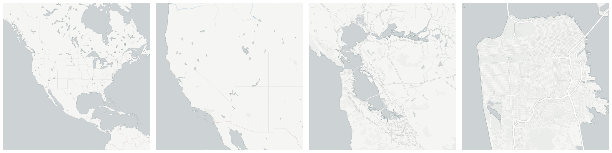

  
# Commerce &amp; Economy

Broader measures of economic and commercial activity.

- [Industrial and construction businesses](#industrial-and-construction-businesses)

    * [Construction businesses](#construction-businesses)

    * [Industrial businesses](#industrial-businesses)

        - [Chemical and energy extraction businesses](#chemical-and-energy-extraction-businesses)

        - [Energy &amp; water businesses](#energy-water-businesses)

        - [Manufacturing businesses](#manufacturing-businesses)

        - [Metal processing and precision mechanics businesses](#metal-processing-and-precision-mechanics-businesses)

- [Malls](#malls)

- [Number of Buses](#number-of-buses)

- [Number of Industrial Tractors](#number-of-industrial-tractors)

- [Number of automobiles](#number-of-automobiles)

- [Number of fixed telephone lines (landlines)](#number-of-fixed-telephone-lines-landlines)

- [Number of motor vehicles](#number-of-motor-vehicles)

- [Number of motorcycles](#number-of-motorcycles)

- [Number of trucks and vans](#number-of-trucks-and-vans)

- [Retail trade businesses](#retail-trade-businesses)

    * [Food retail trade businesses](#food-retail-trade-businesses)

        - [Supermarkets](#supermarkets)

        - [Traditional food retail trade businesses](#traditional-food-retail-trade-businesses)

    * [Mixed or integrated trade businesses](#mixed-or-integrated-trade-businesses)

        - [Department stores](#department-stores)

        - [Street vendors and flea markets](#street-vendors-and-flea-markets)

        - [Superstores (&quot;Hypermarkets&quot;)](#superstores-hypermarkets)

    * [Retail trade businesses not involved in food](#retail-trade-businesses-not-involved-in-food)

        - [Clothing and footwear retail businesses](#clothing-and-footwear-retail-businesses)

        - [Home goods retail businesses](#home-goods-retail-businesses)

        - [Other non-food retail businesses](#other-non-food-retail-businesses)

- [Wholesale businesses](#wholesale-businesses)

    * [Consumer durables wholesale businesses](#consumer-durables-wholesale-businesses)

    * [Food, drink and tobacco wholesale businesses](#food-drink-and-tobacco-wholesale-businesses)

    * [Other wholesale businesses](#other-wholesale-businesses)

    * [Other wholesale interindustrial businesesses](#other-wholesale-interindustrial-businesesses)

    * [Pharmaceutical, perfume, and household goods wholesale businesses](#pharmaceutical-perfume-and-household-goods-wholesale-businesses)

    * [Textile, clothing, footwear and leather goods wholesale businesses](#textile-clothing-footwear-and-leather-goods-wholesale-businesses)

## Industrial and construction businesses

Number of industrial businesses (industry and construction) subject to business tax (IAE). The number of industrial businesses is practically equivalent to the number of industrial establishments in each municipality. Industrial businesses are broken down into industrial and construction.These comprise 1) energy and water; 2) extraction and processing of energy minerals and derived products, chemical industry; 3) metal processing industries, precision mechanics; 4) manufacturing; 5) construction.

Measure &quot;Industrial and construction businesses&quot;  density per sq. kilometer  for one point:

    UPDATE {table_name}
      SET {new_numeric_column} =
        OBS_GetMeasure(
          CDB_LatLng(40.7, -73.9),
          'es.lacaixa.industrial_construction_businesses'
        );

Measure &quot;Industrial and construction businesses&quot; within an area:

    UPDATE {table_name}
      SET {new_numeric_column} =
        OBS_GetMeasure(
          ST_Buffer(CDB_LatLng(40.7, -73.9), 0.01),
          'es.lacaixa.industrial_construction_businesses'
        );

Subcolumns of Industrial and construction businesses

- [Construction businesses](#construction-businesses)

- [Industrial businesses](#industrial-businesses)

### Construction businesses

Measure &quot;Construction businesses&quot;  density per sq. kilometer  for one point:

    UPDATE {table_name}
      SET {new_numeric_column} =
        OBS_GetMeasure(
          CDB_LatLng(40.7, -73.9),
          'es.lacaixa.construction_businesses'
        );

Measure &quot;Construction businesses&quot; within an area:

    UPDATE {table_name}
      SET {new_numeric_column} =
        OBS_GetMeasure(
          ST_Buffer(CDB_LatLng(40.7, -73.9), 0.01),
          'es.lacaixa.construction_businesses'
        );

Measure &quot;Construction businesses&quot; percent of &quot;Industrial and construction businesses&quot; at one point:

    UPDATE {table_name}
      SET {new_numeric_column} =
        OBS_GetMeasure(
          CDB_LatLng(40.7, -73.9),
          'es.lacaixa.construction_businesses',
          'denominator'
        );

Measure &quot;Construction businesses&quot; percent of &quot;Industrial and construction businesses&quot; within an area:

    UPDATE {table_name}
      SET {new_numeric_column} =
        OBS_GetMeasure(
          ST_Buffer(CDB_LatLng(40.7, -73.9), 0.01),
          'es.lacaixa.construction_businesses',
          'denominator'
        );

* denominator: [Industrial and construction businesses](#es-lacaixa-industrial-construction-businesses)

### Industrial businesses

The number of businesses involved in industry, comprising 1) energy and water; 2) extraction and processing of energy minerals and derived products, chemical industry; 3) metal processing industries, precision mechanics; 4) manufacturing.

Measure &quot;Industrial businesses&quot;  density per sq. kilometer  for one point:

    UPDATE {table_name}
      SET {new_numeric_column} =
        OBS_GetMeasure(
          CDB_LatLng(40.7, -73.9),
          'es.lacaixa.industrial_businesses'
        );

Measure &quot;Industrial businesses&quot; within an area:

    UPDATE {table_name}
      SET {new_numeric_column} =
        OBS_GetMeasure(
          ST_Buffer(CDB_LatLng(40.7, -73.9), 0.01),
          'es.lacaixa.industrial_businesses'
        );

Measure &quot;Industrial businesses&quot; percent of &quot;Industrial and construction businesses&quot; at one point:

    UPDATE {table_name}
      SET {new_numeric_column} =
        OBS_GetMeasure(
          CDB_LatLng(40.7, -73.9),
          'es.lacaixa.industrial_businesses',
          'denominator'
        );

Measure &quot;Industrial businesses&quot; percent of &quot;Industrial and construction businesses&quot; within an area:

    UPDATE {table_name}
      SET {new_numeric_column} =
        OBS_GetMeasure(
          ST_Buffer(CDB_LatLng(40.7, -73.9), 0.01),
          'es.lacaixa.industrial_businesses',
          'denominator'
        );

* denominator: [Industrial and construction businesses](#es-lacaixa-industrial-construction-businesses)

Subcolumns of Industrial businesses

- [Chemical and energy extraction businesses](#chemical-and-energy-extraction-businesses)

- [Energy &amp; water businesses](#energy-water-businesses)

- [Manufacturing businesses](#manufacturing-businesses)

- [Metal processing and precision mechanics businesses](#metal-processing-and-precision-mechanics-businesses)

#### Chemical and energy extraction businesses

Measure &quot;Chemical and energy extraction businesses&quot;  density per sq. kilometer  for one point:

    UPDATE {table_name}
      SET {new_numeric_column} =
        OBS_GetMeasure(
          CDB_LatLng(40.7, -73.9),
          'es.lacaixa.chemical_energy_extraction_businesses'
        );

Measure &quot;Chemical and energy extraction businesses&quot; within an area:

    UPDATE {table_name}
      SET {new_numeric_column} =
        OBS_GetMeasure(
          ST_Buffer(CDB_LatLng(40.7, -73.9), 0.01),
          'es.lacaixa.chemical_energy_extraction_businesses'
        );

Measure &quot;Chemical and energy extraction businesses&quot; percent of &quot;Industrial businesses&quot; at one point:

    UPDATE {table_name}
      SET {new_numeric_column} =
        OBS_GetMeasure(
          CDB_LatLng(40.7, -73.9),
          'es.lacaixa.chemical_energy_extraction_businesses',
          'denominator'
        );

Measure &quot;Chemical and energy extraction businesses&quot; percent of &quot;Industrial businesses&quot; within an area:

    UPDATE {table_name}
      SET {new_numeric_column} =
        OBS_GetMeasure(
          ST_Buffer(CDB_LatLng(40.7, -73.9), 0.01),
          'es.lacaixa.chemical_energy_extraction_businesses',
          'denominator'
        );

* denominator: [Industrial businesses](#es-lacaixa-industrial-businesses)

#### Energy &amp; water businesses

Measure &quot;Energy &amp; water businesses&quot;  density per sq. kilometer  for one point:

    UPDATE {table_name}
      SET {new_numeric_column} =
        OBS_GetMeasure(
          CDB_LatLng(40.7, -73.9),
          'es.lacaixa.energy_water_businesses'
        );

Measure &quot;Energy &amp; water businesses&quot; within an area:

    UPDATE {table_name}
      SET {new_numeric_column} =
        OBS_GetMeasure(
          ST_Buffer(CDB_LatLng(40.7, -73.9), 0.01),
          'es.lacaixa.energy_water_businesses'
        );

Measure &quot;Energy &amp; water businesses&quot; percent of &quot;Industrial businesses&quot; at one point:

    UPDATE {table_name}
      SET {new_numeric_column} =
        OBS_GetMeasure(
          CDB_LatLng(40.7, -73.9),
          'es.lacaixa.energy_water_businesses',
          'denominator'
        );

Measure &quot;Energy &amp; water businesses&quot; percent of &quot;Industrial businesses&quot; within an area:

    UPDATE {table_name}
      SET {new_numeric_column} =
        OBS_GetMeasure(
          ST_Buffer(CDB_LatLng(40.7, -73.9), 0.01),
          'es.lacaixa.energy_water_businesses',
          'denominator'
        );

* denominator: [Industrial businesses](#es-lacaixa-industrial-businesses)

#### Manufacturing businesses

Measure &quot;Manufacturing businesses&quot;  density per sq. kilometer  for one point:

    UPDATE {table_name}
      SET {new_numeric_column} =
        OBS_GetMeasure(
          CDB_LatLng(40.7, -73.9),
          'es.lacaixa.manufacturing_businesses'
        );

Measure &quot;Manufacturing businesses&quot; within an area:

    UPDATE {table_name}
      SET {new_numeric_column} =
        OBS_GetMeasure(
          ST_Buffer(CDB_LatLng(40.7, -73.9), 0.01),
          'es.lacaixa.manufacturing_businesses'
        );

Measure &quot;Manufacturing businesses&quot; percent of &quot;Industrial businesses&quot; at one point:

    UPDATE {table_name}
      SET {new_numeric_column} =
        OBS_GetMeasure(
          CDB_LatLng(40.7, -73.9),
          'es.lacaixa.manufacturing_businesses',
          'denominator'
        );

Measure &quot;Manufacturing businesses&quot; percent of &quot;Industrial businesses&quot; within an area:

    UPDATE {table_name}
      SET {new_numeric_column} =
        OBS_GetMeasure(
          ST_Buffer(CDB_LatLng(40.7, -73.9), 0.01),
          'es.lacaixa.manufacturing_businesses',
          'denominator'
        );

* denominator: [Industrial businesses](#es-lacaixa-industrial-businesses)

#### Metal processing and precision mechanics businesses

Measure &quot;Metal processing and precision mechanics businesses&quot;  density per sq. kilometer  for one point:

    UPDATE {table_name}
      SET {new_numeric_column} =
        OBS_GetMeasure(
          CDB_LatLng(40.7, -73.9),
          'es.lacaixa.metal_precision_mechanics_businesses'
        );

Measure &quot;Metal processing and precision mechanics businesses&quot; within an area:

    UPDATE {table_name}
      SET {new_numeric_column} =
        OBS_GetMeasure(
          ST_Buffer(CDB_LatLng(40.7, -73.9), 0.01),
          'es.lacaixa.metal_precision_mechanics_businesses'
        );

Measure &quot;Metal processing and precision mechanics businesses&quot; percent of &quot;Industrial businesses&quot; at one point:

    UPDATE {table_name}
      SET {new_numeric_column} =
        OBS_GetMeasure(
          CDB_LatLng(40.7, -73.9),
          'es.lacaixa.metal_precision_mechanics_businesses',
          'denominator'
        );

Measure &quot;Metal processing and precision mechanics businesses&quot; percent of &quot;Industrial businesses&quot; within an area:

    UPDATE {table_name}
      SET {new_numeric_column} =
        OBS_GetMeasure(
          ST_Buffer(CDB_LatLng(40.7, -73.9), 0.01),
          'es.lacaixa.metal_precision_mechanics_businesses',
          'denominator'
        );

* denominator: [Industrial businesses](#es-lacaixa-industrial-businesses)

## Malls

The Spanish Association of Shopping Centers defines the Mall as a &quot;set of independent shops, planned and developed by one or more entities, whose size, business mix, common services and complementary activities are related to its environment. It has unified management. &quot; According to the criteria of the Association, consideration Shopping Mall does not require a minimum surface for sales. The typology of centers established is based on gross leasable area (GLA) and ranges from the &quot;urban shopping mall&quot; (up 4,999 m2) to &quot;very large mall&quot; (over 79,999 m2).

Measure &quot;Malls&quot;  density per sq. kilometer  for one point:

    UPDATE {table_name}
      SET {new_numeric_column} =
        OBS_GetMeasure(
          CDB_LatLng(40.7, -73.9),
          'es.lacaixa.malls'
        );

Measure &quot;Malls&quot; within an area:

    UPDATE {table_name}
      SET {new_numeric_column} =
        OBS_GetMeasure(
          ST_Buffer(CDB_LatLng(40.7, -73.9), 0.01),
          'es.lacaixa.malls'
        );

## Number of Buses

Measure &quot;Number of Buses&quot;  density per sq. kilometer  for one point:

    UPDATE {table_name}
      SET {new_numeric_column} =
        OBS_GetMeasure(
          CDB_LatLng(40.7, -73.9),
          'es.lacaixa.buses'
        );

Measure &quot;Number of Buses&quot; within an area:

    UPDATE {table_name}
      SET {new_numeric_column} =
        OBS_GetMeasure(
          ST_Buffer(CDB_LatLng(40.7, -73.9), 0.01),
          'es.lacaixa.buses'
        );

## Number of Industrial Tractors

Measure &quot;Number of Industrial Tractors&quot;  density per sq. kilometer  for one point:

    UPDATE {table_name}
      SET {new_numeric_column} =
        OBS_GetMeasure(
          CDB_LatLng(40.7, -73.9),
          'es.lacaixa.industrial_tractors'
        );

Measure &quot;Number of Industrial Tractors&quot; within an area:

    UPDATE {table_name}
      SET {new_numeric_column} =
        OBS_GetMeasure(
          ST_Buffer(CDB_LatLng(40.7, -73.9), 0.01),
          'es.lacaixa.industrial_tractors'
        );

## Number of automobiles

Measure &quot;Number of automobiles&quot;  density per sq. kilometer  for one point:

    UPDATE {table_name}
      SET {new_numeric_column} =
        OBS_GetMeasure(
          CDB_LatLng(40.7, -73.9),
          'es.lacaixa.automobiles'
        );

Measure &quot;Number of automobiles&quot; within an area:

    UPDATE {table_name}
      SET {new_numeric_column} =
        OBS_GetMeasure(
          ST_Buffer(CDB_LatLng(40.7, -73.9), 0.01),
          'es.lacaixa.automobiles'
        );

## Number of fixed telephone lines (landlines)

Measure &quot;Number of fixed telephone lines (landlines)&quot;  density per sq. kilometer  for one point:

    UPDATE {table_name}
      SET {new_numeric_column} =
        OBS_GetMeasure(
          CDB_LatLng(40.7, -73.9),
          'es.lacaixa.telephones'
        );

Measure &quot;Number of fixed telephone lines (landlines)&quot; within an area:

    UPDATE {table_name}
      SET {new_numeric_column} =
        OBS_GetMeasure(
          ST_Buffer(CDB_LatLng(40.7, -73.9), 0.01),
          'es.lacaixa.telephones'
        );

## Number of motor vehicles

Measure &quot;Number of motor vehicles&quot;  density per sq. kilometer  for one point:

    UPDATE {table_name}
      SET {new_numeric_column} =
        OBS_GetMeasure(
          CDB_LatLng(40.7, -73.9),
          'es.lacaixa.motor_vehicles'
        );

Measure &quot;Number of motor vehicles&quot; within an area:

    UPDATE {table_name}
      SET {new_numeric_column} =
        OBS_GetMeasure(
          ST_Buffer(CDB_LatLng(40.7, -73.9), 0.01),
          'es.lacaixa.motor_vehicles'
        );

## Number of motorcycles

Measure &quot;Number of motorcycles&quot;  density per sq. kilometer  for one point:

    UPDATE {table_name}
      SET {new_numeric_column} =
        OBS_GetMeasure(
          CDB_LatLng(40.7, -73.9),
          'es.lacaixa.motorcycles'
        );

Measure &quot;Number of motorcycles&quot; within an area:

    UPDATE {table_name}
      SET {new_numeric_column} =
        OBS_GetMeasure(
          ST_Buffer(CDB_LatLng(40.7, -73.9), 0.01),
          'es.lacaixa.motorcycles'
        );

## Number of trucks and vans

Measure &quot;Number of trucks and vans&quot;  density per sq. kilometer  for one point:

    UPDATE {table_name}
      SET {new_numeric_column} =
        OBS_GetMeasure(
          CDB_LatLng(40.7, -73.9),
          'es.lacaixa.trucks_vans'
        );

Measure &quot;Number of trucks and vans&quot; within an area:

    UPDATE {table_name}
      SET {new_numeric_column} =
        OBS_GetMeasure(
          ST_Buffer(CDB_LatLng(40.7, -73.9), 0.01),
          'es.lacaixa.trucks_vans'
        );

## Retail trade businesses

Number of retail trade businesses subject to business tax (IAE). These businesses are identified with the National Classification of Economic Activities (NACE 93) considered retail. For statistical purposes, the number of commercial businesses can be considered an approach to trade, of which there is no census data (a commercial establishment may have establishments one or more activities or business licenses).

Measure &quot;Retail trade businesses&quot;  density per sq. kilometer  for one point:

    UPDATE {table_name}
      SET {new_numeric_column} =
        OBS_GetMeasure(
          CDB_LatLng(40.7, -73.9),
          'es.lacaixa.retail_businesses'
        );

Measure &quot;Retail trade businesses&quot; within an area:

    UPDATE {table_name}
      SET {new_numeric_column} =
        OBS_GetMeasure(
          ST_Buffer(CDB_LatLng(40.7, -73.9), 0.01),
          'es.lacaixa.retail_businesses'
        );

Subcolumns of Retail trade businesses

- [Food retail trade businesses](#food-retail-trade-businesses)

- [Mixed or integrated trade businesses](#mixed-or-integrated-trade-businesses)

- [Retail trade businesses not involved in food](#retail-trade-businesses-not-involved-in-food)

### Food retail trade businesses

All retail businesses involved in the trade of food

Measure &quot;Food retail trade businesses&quot;  density per sq. kilometer  for one point:

    UPDATE {table_name}
      SET {new_numeric_column} =
        OBS_GetMeasure(
          CDB_LatLng(40.7, -73.9),
          'es.lacaixa.food_retail_businesses'
        );

Measure &quot;Food retail trade businesses&quot; within an area:

    UPDATE {table_name}
      SET {new_numeric_column} =
        OBS_GetMeasure(
          ST_Buffer(CDB_LatLng(40.7, -73.9), 0.01),
          'es.lacaixa.food_retail_businesses'
        );

Measure &quot;Food retail trade businesses&quot; percent of &quot;Retail trade businesses&quot; at one point:

    UPDATE {table_name}
      SET {new_numeric_column} =
        OBS_GetMeasure(
          CDB_LatLng(40.7, -73.9),
          'es.lacaixa.food_retail_businesses',
          'denominator'
        );

Measure &quot;Food retail trade businesses&quot; percent of &quot;Retail trade businesses&quot; within an area:

    UPDATE {table_name}
      SET {new_numeric_column} =
        OBS_GetMeasure(
          ST_Buffer(CDB_LatLng(40.7, -73.9), 0.01),
          'es.lacaixa.food_retail_businesses',
          'denominator'
        );

* denominator: [Retail trade businesses](#es-lacaixa-retail-businesses)

Subcolumns of Food retail trade businesses

- [Supermarkets](#supermarkets)

- [Traditional food retail trade businesses](#traditional-food-retail-trade-businesses)

#### Supermarkets

Supermarkets together include any kind of food and beverage products in self-service establishments whose floor area is less than 120 square meters (self), from 120 to 399 square meters (small supermarkets) and greater than or equal to 400 meters square (large supermarkets).

Measure &quot;Supermarkets&quot;  density per sq. kilometer  for one point:

    UPDATE {table_name}
      SET {new_numeric_column} =
        OBS_GetMeasure(
          CDB_LatLng(40.7, -73.9),
          'es.lacaixa.supermarkets'
        );

Measure &quot;Supermarkets&quot; within an area:

    UPDATE {table_name}
      SET {new_numeric_column} =
        OBS_GetMeasure(
          ST_Buffer(CDB_LatLng(40.7, -73.9), 0.01),
          'es.lacaixa.supermarkets'
        );

Measure &quot;Supermarkets&quot; percent of &quot;Food retail trade businesses&quot; at one point:

    UPDATE {table_name}
      SET {new_numeric_column} =
        OBS_GetMeasure(
          CDB_LatLng(40.7, -73.9),
          'es.lacaixa.supermarkets',
          'denominator'
        );

Measure &quot;Supermarkets&quot; percent of &quot;Food retail trade businesses&quot; within an area:

    UPDATE {table_name}
      SET {new_numeric_column} =
        OBS_GetMeasure(
          ST_Buffer(CDB_LatLng(40.7, -73.9), 0.01),
          'es.lacaixa.supermarkets',
          'denominator'
        );

* denominator: [Food retail trade businesses](#es-lacaixa-food-retail-businesses)

#### Traditional food retail trade businesses

Traditional trade of &quot;Food&quot; includes all food products purchased in the traditional retail trade (greengrocers, butchers, fishmongers, bakeries, tobacconists, drinks [alcoholic and not alcoholic] and other food).

Measure &quot;Traditional food retail trade businesses&quot;  density per sq. kilometer  for one point:

    UPDATE {table_name}
      SET {new_numeric_column} =
        OBS_GetMeasure(
          CDB_LatLng(40.7, -73.9),
          'es.lacaixa.trad_food_retail_businesses'
        );

Measure &quot;Traditional food retail trade businesses&quot; within an area:

    UPDATE {table_name}
      SET {new_numeric_column} =
        OBS_GetMeasure(
          ST_Buffer(CDB_LatLng(40.7, -73.9), 0.01),
          'es.lacaixa.trad_food_retail_businesses'
        );

Measure &quot;Traditional food retail trade businesses&quot; percent of &quot;Food retail trade businesses&quot; at one point:

    UPDATE {table_name}
      SET {new_numeric_column} =
        OBS_GetMeasure(
          CDB_LatLng(40.7, -73.9),
          'es.lacaixa.trad_food_retail_businesses',
          'denominator'
        );

Measure &quot;Traditional food retail trade businesses&quot; percent of &quot;Food retail trade businesses&quot; within an area:

    UPDATE {table_name}
      SET {new_numeric_column} =
        OBS_GetMeasure(
          ST_Buffer(CDB_LatLng(40.7, -73.9), 0.01),
          'es.lacaixa.trad_food_retail_businesses',
          'denominator'
        );

* denominator: [Food retail trade businesses](#es-lacaixa-food-retail-businesses)

### Mixed or integrated trade businesses

Measure &quot;Mixed or integrated trade businesses&quot;  density per sq. kilometer  for one point:

    UPDATE {table_name}
      SET {new_numeric_column} =
        OBS_GetMeasure(
          CDB_LatLng(40.7, -73.9),
          'es.lacaixa.mixed_integrated_trade_businesses'
        );

Measure &quot;Mixed or integrated trade businesses&quot; within an area:

    UPDATE {table_name}
      SET {new_numeric_column} =
        OBS_GetMeasure(
          ST_Buffer(CDB_LatLng(40.7, -73.9), 0.01),
          'es.lacaixa.mixed_integrated_trade_businesses'
        );

Measure &quot;Mixed or integrated trade businesses&quot; percent of &quot;Retail trade businesses&quot; at one point:

    UPDATE {table_name}
      SET {new_numeric_column} =
        OBS_GetMeasure(
          CDB_LatLng(40.7, -73.9),
          'es.lacaixa.mixed_integrated_trade_businesses',
          'denominator'
        );

Measure &quot;Mixed or integrated trade businesses&quot; percent of &quot;Retail trade businesses&quot; within an area:

    UPDATE {table_name}
      SET {new_numeric_column} =
        OBS_GetMeasure(
          ST_Buffer(CDB_LatLng(40.7, -73.9), 0.01),
          'es.lacaixa.mixed_integrated_trade_businesses',
          'denominator'
        );

* denominator: [Retail trade businesses](#es-lacaixa-retail-businesses)

Subcolumns of Mixed or integrated trade businesses

- [Department stores](#department-stores)

- [Street vendors and flea markets](#street-vendors-and-flea-markets)

- [Superstores (&quot;Hypermarkets&quot;)](#superstores-hypermarkets)

#### Department stores

Establishments that offer a relatively wide and shallow assortment of consumer goods, with a range of low prices and low service. The sales area is organized into various sections and self-service or preselection.

Measure &quot;Department stores&quot;  density per sq. kilometer  for one point:

    UPDATE {table_name}
      SET {new_numeric_column} =
        OBS_GetMeasure(
          CDB_LatLng(40.7, -73.9),
          'es.lacaixa.department_stores'
        );

Measure &quot;Department stores&quot; within an area:

    UPDATE {table_name}
      SET {new_numeric_column} =
        OBS_GetMeasure(
          ST_Buffer(CDB_LatLng(40.7, -73.9), 0.01),
          'es.lacaixa.department_stores'
        );

Measure &quot;Department stores&quot; percent of &quot;Mixed or integrated trade businesses&quot; at one point:

    UPDATE {table_name}
      SET {new_numeric_column} =
        OBS_GetMeasure(
          CDB_LatLng(40.7, -73.9),
          'es.lacaixa.department_stores',
          'denominator'
        );

Measure &quot;Department stores&quot; percent of &quot;Mixed or integrated trade businesses&quot; within an area:

    UPDATE {table_name}
      SET {new_numeric_column} =
        OBS_GetMeasure(
          ST_Buffer(CDB_LatLng(40.7, -73.9), 0.01),
          'es.lacaixa.department_stores',
          'denominator'
        );

* denominator: [Mixed or integrated trade businesses](#es-lacaixa-mixed-integrated-trade-businesses)

#### Street vendors and flea markets

Street trade and retail trade activities that are characterized by not having a permanent establishment. The number of activities of street trade and markets are underestimated, because in this type of economic activity registration in the IAE scoped and payment of &quot;provincial quota&quot; instead of &quot;municipal tax&quot; is possible.

Measure &quot;Street vendors and flea markets&quot;  density per sq. kilometer  for one point:

    UPDATE {table_name}
      SET {new_numeric_column} =
        OBS_GetMeasure(
          CDB_LatLng(40.7, -73.9),
          'es.lacaixa.street_vendors'
        );

Measure &quot;Street vendors and flea markets&quot; within an area:

    UPDATE {table_name}
      SET {new_numeric_column} =
        OBS_GetMeasure(
          ST_Buffer(CDB_LatLng(40.7, -73.9), 0.01),
          'es.lacaixa.street_vendors'
        );

Measure &quot;Street vendors and flea markets&quot; percent of &quot;Mixed or integrated trade businesses&quot; at one point:

    UPDATE {table_name}
      SET {new_numeric_column} =
        OBS_GetMeasure(
          CDB_LatLng(40.7, -73.9),
          'es.lacaixa.street_vendors',
          'denominator'
        );

Measure &quot;Street vendors and flea markets&quot; percent of &quot;Mixed or integrated trade businesses&quot; within an area:

    UPDATE {table_name}
      SET {new_numeric_column} =
        OBS_GetMeasure(
          ST_Buffer(CDB_LatLng(40.7, -73.9), 0.01),
          'es.lacaixa.street_vendors',
          'denominator'
        );

* denominator: [Mixed or integrated trade businesses](#es-lacaixa-mixed-integrated-trade-businesses)

#### Superstores (&quot;Hypermarkets&quot;)

Establishments that offer self-service a wide range of food products and non-food commonly consumed. They have their own parking lots and other miscellaneous services to customers. A hypermarket concept is well accepted internationally as follows: a) surface exceeding 2,500 m2 sale; b) sale in self-service consumer products, predominantly food; c) practice a policy of margins and reduced price; d) extended hours, usually uninterrupted; e) ample free parking.

Measure &quot;Superstores (&quot;Hypermarkets&quot;)&quot;  density per sq. kilometer  for one point:

    UPDATE {table_name}
      SET {new_numeric_column} =
        OBS_GetMeasure(
          CDB_LatLng(40.7, -73.9),
          'es.lacaixa.superstores'
        );

Measure &quot;Superstores (&quot;Hypermarkets&quot;)&quot; within an area:

    UPDATE {table_name}
      SET {new_numeric_column} =
        OBS_GetMeasure(
          ST_Buffer(CDB_LatLng(40.7, -73.9), 0.01),
          'es.lacaixa.superstores'
        );

Measure &quot;Superstores (&quot;Hypermarkets&quot;)&quot; percent of &quot;Mixed or integrated trade businesses&quot; at one point:

    UPDATE {table_name}
      SET {new_numeric_column} =
        OBS_GetMeasure(
          CDB_LatLng(40.7, -73.9),
          'es.lacaixa.superstores',
          'denominator'
        );

Measure &quot;Superstores (&quot;Hypermarkets&quot;)&quot; percent of &quot;Mixed or integrated trade businesses&quot; within an area:

    UPDATE {table_name}
      SET {new_numeric_column} =
        OBS_GetMeasure(
          ST_Buffer(CDB_LatLng(40.7, -73.9), 0.01),
          'es.lacaixa.superstores',
          'denominator'
        );

* denominator: [Mixed or integrated trade businesses](#es-lacaixa-mixed-integrated-trade-businesses)

### Retail trade businesses not involved in food

All retail businesses not involved in the trade of food

Measure &quot;Retail trade businesses not involved in food&quot;  density per sq. kilometer  for one point:

    UPDATE {table_name}
      SET {new_numeric_column} =
        OBS_GetMeasure(
          CDB_LatLng(40.7, -73.9),
          'es.lacaixa.non_food_retail_businesses'
        );

Measure &quot;Retail trade businesses not involved in food&quot; within an area:

    UPDATE {table_name}
      SET {new_numeric_column} =
        OBS_GetMeasure(
          ST_Buffer(CDB_LatLng(40.7, -73.9), 0.01),
          'es.lacaixa.non_food_retail_businesses'
        );

Measure &quot;Retail trade businesses not involved in food&quot; percent of &quot;Retail trade businesses&quot; at one point:

    UPDATE {table_name}
      SET {new_numeric_column} =
        OBS_GetMeasure(
          CDB_LatLng(40.7, -73.9),
          'es.lacaixa.non_food_retail_businesses',
          'denominator'
        );

Measure &quot;Retail trade businesses not involved in food&quot; percent of &quot;Retail trade businesses&quot; within an area:

    UPDATE {table_name}
      SET {new_numeric_column} =
        OBS_GetMeasure(
          ST_Buffer(CDB_LatLng(40.7, -73.9), 0.01),
          'es.lacaixa.non_food_retail_businesses',
          'denominator'
        );

* denominator: [Retail trade businesses](#es-lacaixa-retail-businesses)

Subcolumns of Retail trade businesses not involved in food

- [Clothing and footwear retail businesses](#clothing-and-footwear-retail-businesses)

- [Home goods retail businesses](#home-goods-retail-businesses)

- [Other non-food retail businesses](#other-non-food-retail-businesses)

#### Clothing and footwear retail businesses

Retail businesses selling garments and clothing accessories for men, women and children, footwear, clothing and footwear, leather and leather goods.

Measure &quot;Clothing and footwear retail businesses&quot;  density per sq. kilometer  for one point:

    UPDATE {table_name}
      SET {new_numeric_column} =
        OBS_GetMeasure(
          CDB_LatLng(40.7, -73.9),
          'es.lacaixa.clothing_footwear_businesses'
        );

Measure &quot;Clothing and footwear retail businesses&quot; within an area:

    UPDATE {table_name}
      SET {new_numeric_column} =
        OBS_GetMeasure(
          ST_Buffer(CDB_LatLng(40.7, -73.9), 0.01),
          'es.lacaixa.clothing_footwear_businesses'
        );

Measure &quot;Clothing and footwear retail businesses&quot; percent of &quot;Retail trade businesses not involved in food&quot; at one point:

    UPDATE {table_name}
      SET {new_numeric_column} =
        OBS_GetMeasure(
          CDB_LatLng(40.7, -73.9),
          'es.lacaixa.clothing_footwear_businesses',
          'denominator'
        );

Measure &quot;Clothing and footwear retail businesses&quot; percent of &quot;Retail trade businesses not involved in food&quot; within an area:

    UPDATE {table_name}
      SET {new_numeric_column} =
        OBS_GetMeasure(
          ST_Buffer(CDB_LatLng(40.7, -73.9), 0.01),
          'es.lacaixa.clothing_footwear_businesses',
          'denominator'
        );

* denominator: [Retail trade businesses not involved in food](#es-lacaixa-non-food-retail-businesses)

#### Home goods retail businesses

Retail businesses selling furniture, home textiles, household appliances, household electrical equipment, cookware, utensils, crockery and glassware, household cleaning products and cleaning supplies; garden tools

Measure &quot;Home goods retail businesses&quot;  density per sq. kilometer  for one point:

    UPDATE {table_name}
      SET {new_numeric_column} =
        OBS_GetMeasure(
          CDB_LatLng(40.7, -73.9),
          'es.lacaixa.home_goods_businesses'
        );

Measure &quot;Home goods retail businesses&quot; within an area:

    UPDATE {table_name}
      SET {new_numeric_column} =
        OBS_GetMeasure(
          ST_Buffer(CDB_LatLng(40.7, -73.9), 0.01),
          'es.lacaixa.home_goods_businesses'
        );

Measure &quot;Home goods retail businesses&quot; percent of &quot;Retail trade businesses not involved in food&quot; at one point:

    UPDATE {table_name}
      SET {new_numeric_column} =
        OBS_GetMeasure(
          CDB_LatLng(40.7, -73.9),
          'es.lacaixa.home_goods_businesses',
          'denominator'
        );

Measure &quot;Home goods retail businesses&quot; percent of &quot;Retail trade businesses not involved in food&quot; within an area:

    UPDATE {table_name}
      SET {new_numeric_column} =
        OBS_GetMeasure(
          ST_Buffer(CDB_LatLng(40.7, -73.9), 0.01),
          'es.lacaixa.home_goods_businesses',
          'denominator'
        );

* denominator: [Retail trade businesses not involved in food](#es-lacaixa-non-food-retail-businesses)

#### Other non-food retail businesses

Retail businesses selling radio recreational items, TV, videos, CDs, sporting goods,. toys, musical instruments, photography, etc., stationery, books, newspapers and magazines, perfumes, cosmetics, watches, jewelery; smoking articles, travel goods, plants and flowers and pets, etc

Measure &quot;Other non-food retail businesses&quot;  density per sq. kilometer  for one point:

    UPDATE {table_name}
      SET {new_numeric_column} =
        OBS_GetMeasure(
          CDB_LatLng(40.7, -73.9),
          'es.lacaixa.other_non_food_retail_businesses'
        );

Measure &quot;Other non-food retail businesses&quot; within an area:

    UPDATE {table_name}
      SET {new_numeric_column} =
        OBS_GetMeasure(
          ST_Buffer(CDB_LatLng(40.7, -73.9), 0.01),
          'es.lacaixa.other_non_food_retail_businesses'
        );

Measure &quot;Other non-food retail businesses&quot; percent of &quot;Retail trade businesses not involved in food&quot; at one point:

    UPDATE {table_name}
      SET {new_numeric_column} =
        OBS_GetMeasure(
          CDB_LatLng(40.7, -73.9),
          'es.lacaixa.other_non_food_retail_businesses',
          'denominator'
        );

Measure &quot;Other non-food retail businesses&quot; percent of &quot;Retail trade businesses not involved in food&quot; within an area:

    UPDATE {table_name}
      SET {new_numeric_column} =
        OBS_GetMeasure(
          ST_Buffer(CDB_LatLng(40.7, -73.9), 0.01),
          'es.lacaixa.other_non_food_retail_businesses',
          'denominator'
        );

* denominator: [Retail trade businesses not involved in food](#es-lacaixa-non-food-retail-businesses)

## Wholesale businesses

Number of businesses in wholesale trade.  Derived from business tax (IAE), which constitute a good approximation of the number of existing in each municipality.

Measure &quot;Wholesale businesses&quot;  density per sq. kilometer  for one point:

    UPDATE {table_name}
      SET {new_numeric_column} =
        OBS_GetMeasure(
          CDB_LatLng(40.7, -73.9),
          'es.lacaixa.wholesale_businesses'
        );

Measure &quot;Wholesale businesses&quot; within an area:

    UPDATE {table_name}
      SET {new_numeric_column} =
        OBS_GetMeasure(
          ST_Buffer(CDB_LatLng(40.7, -73.9), 0.01),
          'es.lacaixa.wholesale_businesses'
        );

Subcolumns of Wholesale businesses

- [Consumer durables wholesale businesses](#consumer-durables-wholesale-businesses)

- [Food, drink and tobacco wholesale businesses](#food-drink-and-tobacco-wholesale-businesses)

- [Other wholesale businesses](#other-wholesale-businesses)

- [Other wholesale interindustrial businesesses](#other-wholesale-interindustrial-businesesses)

- [Pharmaceutical, perfume, and household goods wholesale businesses](#pharmaceutical-perfume-and-household-goods-wholesale-businesses)

- [Textile, clothing, footwear and leather goods wholesale businesses](#textile-clothing-footwear-and-leather-goods-wholesale-businesses)

### Consumer durables wholesale businesses

Wholesale businsses involved in consumer durables (motor vehicles, furniture, appliances, electronics, hardware, etc.)

Measure &quot;Consumer durables wholesale businesses&quot;  density per sq. kilometer  for one point:

    UPDATE {table_name}
      SET {new_numeric_column} =
        OBS_GetMeasure(
          CDB_LatLng(40.7, -73.9),
          'es.lacaixa.consumer_durable_businesses'
        );

Measure &quot;Consumer durables wholesale businesses&quot; within an area:

    UPDATE {table_name}
      SET {new_numeric_column} =
        OBS_GetMeasure(
          ST_Buffer(CDB_LatLng(40.7, -73.9), 0.01),
          'es.lacaixa.consumer_durable_businesses'
        );

Measure &quot;Consumer durables wholesale businesses&quot; percent of &quot;Wholesale businesses&quot; at one point:

    UPDATE {table_name}
      SET {new_numeric_column} =
        OBS_GetMeasure(
          CDB_LatLng(40.7, -73.9),
          'es.lacaixa.consumer_durable_businesses',
          'denominator'
        );

Measure &quot;Consumer durables wholesale businesses&quot; percent of &quot;Wholesale businesses&quot; within an area:

    UPDATE {table_name}
      SET {new_numeric_column} =
        OBS_GetMeasure(
          ST_Buffer(CDB_LatLng(40.7, -73.9), 0.01),
          'es.lacaixa.consumer_durable_businesses',
          'denominator'
        );

* denominator: [Wholesale businesses](#es-lacaixa-wholesale-businesses)

### Food, drink and tobacco wholesale businesses

Measure &quot;Food, drink and tobacco wholesale businesses&quot;  density per sq. kilometer  for one point:

    UPDATE {table_name}
      SET {new_numeric_column} =
        OBS_GetMeasure(
          CDB_LatLng(40.7, -73.9),
          'es.lacaixa.food_drink_tobacco_businesses'
        );

Measure &quot;Food, drink and tobacco wholesale businesses&quot; within an area:

    UPDATE {table_name}
      SET {new_numeric_column} =
        OBS_GetMeasure(
          ST_Buffer(CDB_LatLng(40.7, -73.9), 0.01),
          'es.lacaixa.food_drink_tobacco_businesses'
        );

Measure &quot;Food, drink and tobacco wholesale businesses&quot; percent of &quot;Wholesale businesses&quot; at one point:

    UPDATE {table_name}
      SET {new_numeric_column} =
        OBS_GetMeasure(
          CDB_LatLng(40.7, -73.9),
          'es.lacaixa.food_drink_tobacco_businesses',
          'denominator'
        );

Measure &quot;Food, drink and tobacco wholesale businesses&quot; percent of &quot;Wholesale businesses&quot; within an area:

    UPDATE {table_name}
      SET {new_numeric_column} =
        OBS_GetMeasure(
          ST_Buffer(CDB_LatLng(40.7, -73.9), 0.01),
          'es.lacaixa.food_drink_tobacco_businesses',
          'denominator'
        );

* denominator: [Wholesale businesses](#es-lacaixa-wholesale-businesses)

### Other wholesale businesses

Other wholesale businesses not specified above (export trade, toys and sporting goods, etc.).

Measure &quot;Other wholesale businesses&quot;  density per sq. kilometer  for one point:

    UPDATE {table_name}
      SET {new_numeric_column} =
        OBS_GetMeasure(
          CDB_LatLng(40.7, -73.9),
          'es.lacaixa.other_wholesale_businesses'
        );

Measure &quot;Other wholesale businesses&quot; within an area:

    UPDATE {table_name}
      SET {new_numeric_column} =
        OBS_GetMeasure(
          ST_Buffer(CDB_LatLng(40.7, -73.9), 0.01),
          'es.lacaixa.other_wholesale_businesses'
        );

Measure &quot;Other wholesale businesses&quot; percent of &quot;Wholesale businesses&quot; at one point:

    UPDATE {table_name}
      SET {new_numeric_column} =
        OBS_GetMeasure(
          CDB_LatLng(40.7, -73.9),
          'es.lacaixa.other_wholesale_businesses',
          'denominator'
        );

Measure &quot;Other wholesale businesses&quot; percent of &quot;Wholesale businesses&quot; within an area:

    UPDATE {table_name}
      SET {new_numeric_column} =
        OBS_GetMeasure(
          ST_Buffer(CDB_LatLng(40.7, -73.9), 0.01),
          'es.lacaixa.other_wholesale_businesses',
          'denominator'
        );

* denominator: [Wholesale businesses](#es-lacaixa-wholesale-businesses)

### Other wholesale interindustrial businesesses

Other wholesale interindustrial (textile fibers, building materials, agricultural machinery, textile machinery, office equipment, etc.)

Measure &quot;Other wholesale interindustrial businesesses&quot;  density per sq. kilometer  for one point:

    UPDATE {table_name}
      SET {new_numeric_column} =
        OBS_GetMeasure(
          CDB_LatLng(40.7, -73.9),
          'es.lacaixa.other_wholesale_interindustrial_businesses'
        );

Measure &quot;Other wholesale interindustrial businesesses&quot; within an area:

    UPDATE {table_name}
      SET {new_numeric_column} =
        OBS_GetMeasure(
          ST_Buffer(CDB_LatLng(40.7, -73.9), 0.01),
          'es.lacaixa.other_wholesale_interindustrial_businesses'
        );

Measure &quot;Other wholesale interindustrial businesesses&quot; percent of &quot;Wholesale businesses&quot; at one point:

    UPDATE {table_name}
      SET {new_numeric_column} =
        OBS_GetMeasure(
          CDB_LatLng(40.7, -73.9),
          'es.lacaixa.other_wholesale_interindustrial_businesses',
          'denominator'
        );

Measure &quot;Other wholesale interindustrial businesesses&quot; percent of &quot;Wholesale businesses&quot; within an area:

    UPDATE {table_name}
      SET {new_numeric_column} =
        OBS_GetMeasure(
          ST_Buffer(CDB_LatLng(40.7, -73.9), 0.01),
          'es.lacaixa.other_wholesale_interindustrial_businesses',
          'denominator'
        );

* denominator: [Wholesale businesses](#es-lacaixa-wholesale-businesses)

### Pharmaceutical, perfume, and household goods wholesale businesses

Wholesale businesses involved in pharmaceutical products, perfumery, and goods for the maintenance and operation of the household (tableware and glassware, cutlery, drugstore and cleaning, etc.)

Measure &quot;Pharmaceutical, perfume, and household goods wholesale businesses&quot;  density per sq. kilometer  for one point:

    UPDATE {table_name}
      SET {new_numeric_column} =
        OBS_GetMeasure(
          CDB_LatLng(40.7, -73.9),
          'es.lacaixa.pharmaceutical_perfume_household_businesses'
        );

Measure &quot;Pharmaceutical, perfume, and household goods wholesale businesses&quot; within an area:

    UPDATE {table_name}
      SET {new_numeric_column} =
        OBS_GetMeasure(
          ST_Buffer(CDB_LatLng(40.7, -73.9), 0.01),
          'es.lacaixa.pharmaceutical_perfume_household_businesses'
        );

Measure &quot;Pharmaceutical, perfume, and household goods wholesale businesses&quot; percent of &quot;Wholesale businesses&quot; at one point:

    UPDATE {table_name}
      SET {new_numeric_column} =
        OBS_GetMeasure(
          CDB_LatLng(40.7, -73.9),
          'es.lacaixa.pharmaceutical_perfume_household_businesses',
          'denominator'
        );

Measure &quot;Pharmaceutical, perfume, and household goods wholesale businesses&quot; percent of &quot;Wholesale businesses&quot; within an area:

    UPDATE {table_name}
      SET {new_numeric_column} =
        OBS_GetMeasure(
          ST_Buffer(CDB_LatLng(40.7, -73.9), 0.01),
          'es.lacaixa.pharmaceutical_perfume_household_businesses',
          'denominator'
        );

* denominator: [Wholesale businesses](#es-lacaixa-wholesale-businesses)

### Textile, clothing, footwear and leather goods wholesale businesses

Measure &quot;Textile, clothing, footwear and leather goods wholesale businesses&quot;  density per sq. kilometer  for one point:

    UPDATE {table_name}
      SET {new_numeric_column} =
        OBS_GetMeasure(
          CDB_LatLng(40.7, -73.9),
          'es.lacaixa.textile_clothing_footwear_leather_businesses'
        );

Measure &quot;Textile, clothing, footwear and leather goods wholesale businesses&quot; within an area:

    UPDATE {table_name}
      SET {new_numeric_column} =
        OBS_GetMeasure(
          ST_Buffer(CDB_LatLng(40.7, -73.9), 0.01),
          'es.lacaixa.textile_clothing_footwear_leather_businesses'
        );

Measure &quot;Textile, clothing, footwear and leather goods wholesale businesses&quot; percent of &quot;Wholesale businesses&quot; at one point:

    UPDATE {table_name}
      SET {new_numeric_column} =
        OBS_GetMeasure(
          CDB_LatLng(40.7, -73.9),
          'es.lacaixa.textile_clothing_footwear_leather_businesses',
          'denominator'
        );

Measure &quot;Textile, clothing, footwear and leather goods wholesale businesses&quot; percent of &quot;Wholesale businesses&quot; within an area:

    UPDATE {table_name}
      SET {new_numeric_column} =
        OBS_GetMeasure(
          ST_Buffer(CDB_LatLng(40.7, -73.9), 0.01),
          'es.lacaixa.textile_clothing_footwear_leather_businesses',
          'denominator'
        );

* denominator: [Wholesale businesses](#es-lacaixa-wholesale-businesses)

