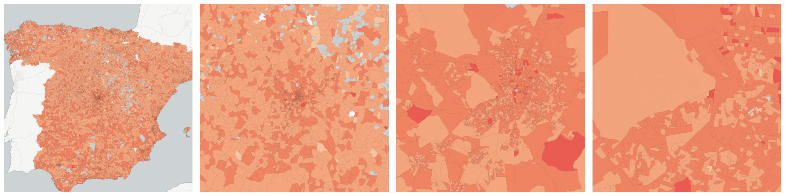
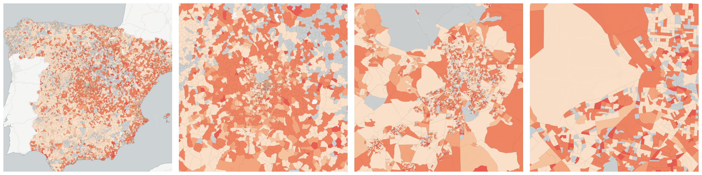
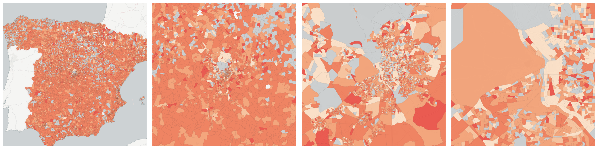
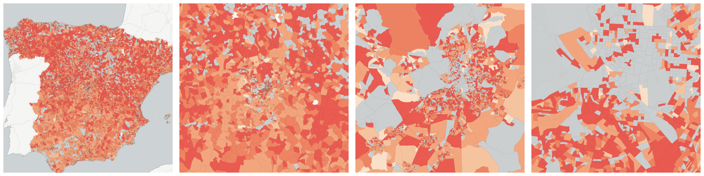

  
# Education

Educational attainment and enrollment.

- [Illiterate persons](#illiterate-persons)

    * [Illiterate females](#illiterate-females)

    * [Illiterate males](#illiterate-males)

    * [Persons aged between 16 (included) and 64 (included) years and illiterate](#persons-aged-between-16-included-and-64-included-years-and-illiterate)

    * [Persons aged over 64 years and illiterate](#persons-aged-over-64-years-and-illiterate)

    * [Persons with a foreign nationality and illiterate](#persons-with-a-foreign-nationality-and-illiterate)

    * [Persons with Spanish nationality and illiterate](#persons-with-spanish-nationality-and-illiterate)

- [Persons with first level studies](#persons-with-first-level-studies)

    * [Females with first level studies](#females-with-first-level-studies)

    * [Males with first level studies](#males-with-first-level-studies)

    * [Persons aged between 16 (included) and 64 (included) years and with first level studies](#persons-aged-between-16-included-and-64-included-years-and-with-first-level-studies)

    * [Persons aged between 16 (included) and 64 (included) years and with second level studies](#persons-aged-between-16-included-and-64-included-years-and-with-second-level-studies)

    * [Persons aged between 16 (included) and 64 (included) years and with third level studies](#persons-aged-between-16-included-and-64-included-years-and-with-third-level-studies)

    * [Persons aged over 64 years and with first level studies](#persons-aged-over-64-years-and-with-first-level-studies)

    * [Persons aged over 64 years and with second level studies](#persons-aged-over-64-years-and-with-second-level-studies)

    * [Persons aged over 64 years and with third level studies](#persons-aged-over-64-years-and-with-third-level-studies)

    * [Persons with a foreign nationality and with first level studies](#persons-with-a-foreign-nationality-and-with-first-level-studies)

    * [Persons with Spanish nationality and with first level studies](#persons-with-spanish-nationality-and-with-first-level-studies)

- [Persons with second level studies](#persons-with-second-level-studies)

    * [Females with second level studies](#females-with-second-level-studies)

    * [Males with second level studies](#males-with-second-level-studies)

    * [Persons with a foreign nationality and with second level studies](#persons-with-a-foreign-nationality-and-with-second-level-studies)

    * [Persons with Spanish nationality and with second level studies](#persons-with-spanish-nationality-and-with-second-level-studies)

- [Persons with third level studies](#persons-with-third-level-studies)

    * [Females with third level studies](#females-with-third-level-studies)

    * [Males with third level studies](#males-with-third-level-studies)

    * [Persons with a foreign nationality and with third level studies](#persons-with-a-foreign-nationality-and-with-third-level-studies)

    * [Persons with Spanish nationality and with third level studies](#persons-with-spanish-nationality-and-with-third-level-studies)

- [Persons without information regarding their educational level (aged under 16 years)](#persons-without-information-regarding-their-educational-level-aged-under-16-years)

    * [Females without information regarding their educational level  (under 16 years of age)](#females-without-information-regarding-their-educational-level-under-16-years-of-age)

    * [Males without information regarding their educational level (under 16 years of age)](#males-without-information-regarding-their-educational-level-under-16-years-of-age)

    * [Persons with a foreign nationality without information regarding their educational level (under 16 years of age)](#persons-with-a-foreign-nationality-without-information-regarding-their-educational-level-under-16-years-of-age)

    * [Persons with Spanish nationality without information regarding their educational level (under 16 years of age)](#persons-with-spanish-nationality-without-information-regarding-their-educational-level-under-16-years-of-age)

- [Persons without studies](#persons-without-studies)

    * [Females without studies](#females-without-studies)

    * [Males without studies](#males-without-studies)

    * [Persons aged between 16 (included) and 64 (included) years and without studies](#persons-aged-between-16-included-and-64-included-years-and-without-studies)

    * [Persons aged over 64 years and without studies](#persons-aged-over-64-years-and-without-studies)

    * [Persons with a foreign nationality and without studies](#persons-with-a-foreign-nationality-and-without-studies)

    * [Persons with Spanish nationality and without studies](#persons-with-spanish-nationality-and-without-studies)

## Illiterate persons

Measure &quot;Illiterate persons&quot;  density per sq. kilometer  for one point:

    UPDATE {table_name}
      SET {new_numeric_column} =
        OBS_GetMeasure(
          CDB_LatLng(40.39, -3.7),
          'es.ine.t12_1'
        );

Measure &quot;Illiterate persons&quot; within an area:

    UPDATE {table_name}
      SET {new_numeric_column} =
        OBS_GetMeasure(
          ST_Buffer(CDB_LatLng(40.39, -3.7), 0.01),
          'es.ine.t12_1'
        );

Measure &quot;Illiterate persons&quot; percent of &quot;Total population&quot; at one point:

    UPDATE {table_name}
      SET {new_numeric_column} =
        OBS_GetMeasure(
          CDB_LatLng(40.39, -3.7),
          'es.ine.t12_1',
          'denominator'
        );

Measure &quot;Illiterate persons&quot; percent of &quot;Total population&quot; within an area:

    UPDATE {table_name}
      SET {new_numeric_column} =
        OBS_GetMeasure(
          ST_Buffer(CDB_LatLng(40.39, -3.7), 0.01),
          'es.ine.t12_1',
          'denominator'
        );

* denominator: [Total population](../age_gender/#es-ine-t1-1)

Subcolumns of Illiterate persons

- [Illiterate females](#illiterate-females)

- [Illiterate males](#illiterate-males)

- [Persons aged between 16 (included) and 64 (included) years and illiterate](#persons-aged-between-16-included-and-64-included-years-and-illiterate)

- [Persons aged over 64 years and illiterate](#persons-aged-over-64-years-and-illiterate)

- [Persons with a foreign nationality and illiterate](#persons-with-a-foreign-nationality-and-illiterate)

- [Persons with Spanish nationality and illiterate](#persons-with-spanish-nationality-and-illiterate)

### Illiterate females

Measure &quot;Illiterate females&quot;  density per sq. kilometer  for one point:

    UPDATE {table_name}
      SET {new_numeric_column} =
        OBS_GetMeasure(
          CDB_LatLng(40.39, -3.7),
          'es.ine.t13_2'
        );

Measure &quot;Illiterate females&quot; within an area:

    UPDATE {table_name}
      SET {new_numeric_column} =
        OBS_GetMeasure(
          ST_Buffer(CDB_LatLng(40.39, -3.7), 0.01),
          'es.ine.t13_2'
        );

Measure &quot;Illiterate females&quot; percent of &quot;Females&quot; at one point:

    UPDATE {table_name}
      SET {new_numeric_column} =
        OBS_GetMeasure(
          CDB_LatLng(40.39, -3.7),
          'es.ine.t13_2',
          'denominator'
        );

Measure &quot;Illiterate females&quot; percent of &quot;Females&quot; within an area:

    UPDATE {table_name}
      SET {new_numeric_column} =
        OBS_GetMeasure(
          ST_Buffer(CDB_LatLng(40.39, -3.7), 0.01),
          'es.ine.t13_2',
          'denominator'
        );

* denominator: [Females](../age_gender/#es-ine-t2-2)

* denominator: [Illiterate persons](#es-ine-t12-1)

### Illiterate males

Measure &quot;Illiterate males&quot;  density per sq. kilometer  for one point:

    UPDATE {table_name}
      SET {new_numeric_column} =
        OBS_GetMeasure(
          CDB_LatLng(40.39, -3.7),
          'es.ine.t13_1'
        );

Measure &quot;Illiterate males&quot; within an area:

    UPDATE {table_name}
      SET {new_numeric_column} =
        OBS_GetMeasure(
          ST_Buffer(CDB_LatLng(40.39, -3.7), 0.01),
          'es.ine.t13_1'
        );

Measure &quot;Illiterate males&quot; percent of &quot;Males&quot; at one point:

    UPDATE {table_name}
      SET {new_numeric_column} =
        OBS_GetMeasure(
          CDB_LatLng(40.39, -3.7),
          'es.ine.t13_1',
          'denominator'
        );

Measure &quot;Illiterate males&quot; percent of &quot;Males&quot; within an area:

    UPDATE {table_name}
      SET {new_numeric_column} =
        OBS_GetMeasure(
          ST_Buffer(CDB_LatLng(40.39, -3.7), 0.01),
          'es.ine.t13_1',
          'denominator'
        );

* denominator: [Males](../age_gender/#es-ine-t2-1)

* denominator: [Illiterate persons](#es-ine-t12-1)

### Persons aged between 16 (included) and 64 (included) years and illiterate

Measure &quot;Persons aged between 16 (included) and 64 (included) years and illiterate&quot;  density per sq. kilometer  for one point:

    UPDATE {table_name}
      SET {new_numeric_column} =
        OBS_GetMeasure(
          CDB_LatLng(40.39, -3.7),
          'es.ine.t15_2'
        );

Measure &quot;Persons aged between 16 (included) and 64 (included) years and illiterate&quot; within an area:

    UPDATE {table_name}
      SET {new_numeric_column} =
        OBS_GetMeasure(
          ST_Buffer(CDB_LatLng(40.39, -3.7), 0.01),
          'es.ine.t15_2'
        );

Measure &quot;Persons aged between 16 (included) and 64 (included) years and illiterate&quot; percent of &quot;Persons aged between 16 (included) and 64 (included) years&quot; at one point:

    UPDATE {table_name}
      SET {new_numeric_column} =
        OBS_GetMeasure(
          CDB_LatLng(40.39, -3.7),
          'es.ine.t15_2',
          'denominator'
        );

Measure &quot;Persons aged between 16 (included) and 64 (included) years and illiterate&quot; percent of &quot;Persons aged between 16 (included) and 64 (included) years&quot; within an area:

    UPDATE {table_name}
      SET {new_numeric_column} =
        OBS_GetMeasure(
          ST_Buffer(CDB_LatLng(40.39, -3.7), 0.01),
          'es.ine.t15_2',
          'denominator'
        );

* denominator: [Persons aged between 16 (included) and 64 (included) years](../age_gender/#es-ine-t3-2)

* denominator: [Illiterate persons](#es-ine-t12-1)

### Persons aged over 64 years and illiterate

Measure &quot;Persons aged over 64 years and illiterate&quot;  density per sq. kilometer  for one point:

    UPDATE {table_name}
      SET {new_numeric_column} =
        OBS_GetMeasure(
          CDB_LatLng(40.39, -3.7),
          'es.ine.t15_3'
        );

Measure &quot;Persons aged over 64 years and illiterate&quot; within an area:

    UPDATE {table_name}
      SET {new_numeric_column} =
        OBS_GetMeasure(
          ST_Buffer(CDB_LatLng(40.39, -3.7), 0.01),
          'es.ine.t15_3'
        );

Measure &quot;Persons aged over 64 years and illiterate&quot; percent of &quot;Persons aged over 64 years&quot; at one point:

    UPDATE {table_name}
      SET {new_numeric_column} =
        OBS_GetMeasure(
          CDB_LatLng(40.39, -3.7),
          'es.ine.t15_3',
          'denominator'
        );

Measure &quot;Persons aged over 64 years and illiterate&quot; percent of &quot;Persons aged over 64 years&quot; within an area:

    UPDATE {table_name}
      SET {new_numeric_column} =
        OBS_GetMeasure(
          ST_Buffer(CDB_LatLng(40.39, -3.7), 0.01),
          'es.ine.t15_3',
          'denominator'
        );

* denominator: [Persons aged over 64 years](../age_gender/#es-ine-t3-3)

* denominator: [Illiterate persons](#es-ine-t12-1)

### Persons with a foreign nationality and illiterate

Measure &quot;Persons with a foreign nationality and illiterate&quot;  density per sq. kilometer  for one point:

    UPDATE {table_name}
      SET {new_numeric_column} =
        OBS_GetMeasure(
          CDB_LatLng(40.39, -3.7),
          'es.ine.t14_2'
        );

Measure &quot;Persons with a foreign nationality and illiterate&quot; within an area:

    UPDATE {table_name}
      SET {new_numeric_column} =
        OBS_GetMeasure(
          ST_Buffer(CDB_LatLng(40.39, -3.7), 0.01),
          'es.ine.t14_2'
        );

Measure &quot;Persons with a foreign nationality and illiterate&quot; percent of &quot;Illiterate persons&quot; at one point:

    UPDATE {table_name}
      SET {new_numeric_column} =
        OBS_GetMeasure(
          CDB_LatLng(40.39, -3.7),
          'es.ine.t14_2',
          'denominator'
        );

Measure &quot;Persons with a foreign nationality and illiterate&quot; percent of &quot;Illiterate persons&quot; within an area:

    UPDATE {table_name}
      SET {new_numeric_column} =
        OBS_GetMeasure(
          ST_Buffer(CDB_LatLng(40.39, -3.7), 0.01),
          'es.ine.t14_2',
          'denominator'
        );

* denominator: [Illiterate persons](#es-ine-t12-1)

* denominator: [Persons with a foreign nationality](../nationality/#es-ine-t6-2)

### Persons with Spanish nationality and illiterate

Measure &quot;Persons with Spanish nationality and illiterate&quot;  density per sq. kilometer  for one point:

    UPDATE {table_name}
      SET {new_numeric_column} =
        OBS_GetMeasure(
          CDB_LatLng(40.39, -3.7),
          'es.ine.t14_1'
        );

Measure &quot;Persons with Spanish nationality and illiterate&quot; within an area:

    UPDATE {table_name}
      SET {new_numeric_column} =
        OBS_GetMeasure(
          ST_Buffer(CDB_LatLng(40.39, -3.7), 0.01),
          'es.ine.t14_1'
        );

Measure &quot;Persons with Spanish nationality and illiterate&quot; percent of &quot;Illiterate persons&quot; at one point:

    UPDATE {table_name}
      SET {new_numeric_column} =
        OBS_GetMeasure(
          CDB_LatLng(40.39, -3.7),
          'es.ine.t14_1',
          'denominator'
        );

Measure &quot;Persons with Spanish nationality and illiterate&quot; percent of &quot;Illiterate persons&quot; within an area:

    UPDATE {table_name}
      SET {new_numeric_column} =
        OBS_GetMeasure(
          ST_Buffer(CDB_LatLng(40.39, -3.7), 0.01),
          'es.ine.t14_1',
          'denominator'
        );

* denominator: [Illiterate persons](#es-ine-t12-1)

* denominator: [Persons with Spanish nationality](../nationality/#es-ine-t6-1)

## Persons with first level studies

Measure &quot;Persons with first level studies&quot;  density per sq. kilometer  for one point:

    UPDATE {table_name}
      SET {new_numeric_column} =
        OBS_GetMeasure(
          CDB_LatLng(40.39, -3.7),
          'es.ine.t12_3'
        );

Measure &quot;Persons with first level studies&quot; within an area:

    UPDATE {table_name}
      SET {new_numeric_column} =
        OBS_GetMeasure(
          ST_Buffer(CDB_LatLng(40.39, -3.7), 0.01),
          'es.ine.t12_3'
        );

Measure &quot;Persons with first level studies&quot; percent of &quot;Total population&quot; at one point:

    UPDATE {table_name}
      SET {new_numeric_column} =
        OBS_GetMeasure(
          CDB_LatLng(40.39, -3.7),
          'es.ine.t12_3',
          'denominator'
        );

Measure &quot;Persons with first level studies&quot; percent of &quot;Total population&quot; within an area:

    UPDATE {table_name}
      SET {new_numeric_column} =
        OBS_GetMeasure(
          ST_Buffer(CDB_LatLng(40.39, -3.7), 0.01),
          'es.ine.t12_3',
          'denominator'
        );

* denominator: [Total population](../age_gender/#es-ine-t1-1)

Subcolumns of Persons with first level studies

- [Females with first level studies](#females-with-first-level-studies)

- [Males with first level studies](#males-with-first-level-studies)

- [Persons aged between 16 (included) and 64 (included) years and with first level studies](#persons-aged-between-16-included-and-64-included-years-and-with-first-level-studies)

- [Persons aged between 16 (included) and 64 (included) years and with second level studies](#persons-aged-between-16-included-and-64-included-years-and-with-second-level-studies)

- [Persons aged between 16 (included) and 64 (included) years and with third level studies](#persons-aged-between-16-included-and-64-included-years-and-with-third-level-studies)

- [Persons aged over 64 years and with first level studies](#persons-aged-over-64-years-and-with-first-level-studies)

- [Persons aged over 64 years and with second level studies](#persons-aged-over-64-years-and-with-second-level-studies)

- [Persons aged over 64 years and with third level studies](#persons-aged-over-64-years-and-with-third-level-studies)

- [Persons with a foreign nationality and with first level studies](#persons-with-a-foreign-nationality-and-with-first-level-studies)

- [Persons with Spanish nationality and with first level studies](#persons-with-spanish-nationality-and-with-first-level-studies)

### Females with first level studies

Measure &quot;Females with first level studies&quot;  density per sq. kilometer  for one point:

    UPDATE {table_name}
      SET {new_numeric_column} =
        OBS_GetMeasure(
          CDB_LatLng(40.39, -3.7),
          'es.ine.t13_6'
        );

Measure &quot;Females with first level studies&quot; within an area:

    UPDATE {table_name}
      SET {new_numeric_column} =
        OBS_GetMeasure(
          ST_Buffer(CDB_LatLng(40.39, -3.7), 0.01),
          'es.ine.t13_6'
        );

Measure &quot;Females with first level studies&quot; percent of &quot;Females&quot; at one point:

    UPDATE {table_name}
      SET {new_numeric_column} =
        OBS_GetMeasure(
          CDB_LatLng(40.39, -3.7),
          'es.ine.t13_6',
          'denominator'
        );

Measure &quot;Females with first level studies&quot; percent of &quot;Females&quot; within an area:

    UPDATE {table_name}
      SET {new_numeric_column} =
        OBS_GetMeasure(
          ST_Buffer(CDB_LatLng(40.39, -3.7), 0.01),
          'es.ine.t13_6',
          'denominator'
        );

* denominator: [Females](../age_gender/#es-ine-t2-2)

* denominator: [Persons with first level studies](#es-ine-t12-3)

### Males with first level studies

Measure &quot;Males with first level studies&quot;  density per sq. kilometer  for one point:

    UPDATE {table_name}
      SET {new_numeric_column} =
        OBS_GetMeasure(
          CDB_LatLng(40.39, -3.7),
          'es.ine.t13_5'
        );

Measure &quot;Males with first level studies&quot; within an area:

    UPDATE {table_name}
      SET {new_numeric_column} =
        OBS_GetMeasure(
          ST_Buffer(CDB_LatLng(40.39, -3.7), 0.01),
          'es.ine.t13_5'
        );

Measure &quot;Males with first level studies&quot; percent of &quot;Males&quot; at one point:

    UPDATE {table_name}
      SET {new_numeric_column} =
        OBS_GetMeasure(
          CDB_LatLng(40.39, -3.7),
          'es.ine.t13_5',
          'denominator'
        );

Measure &quot;Males with first level studies&quot; percent of &quot;Males&quot; within an area:

    UPDATE {table_name}
      SET {new_numeric_column} =
        OBS_GetMeasure(
          ST_Buffer(CDB_LatLng(40.39, -3.7), 0.01),
          'es.ine.t13_5',
          'denominator'
        );

* denominator: [Males](../age_gender/#es-ine-t2-1)

* denominator: [Persons with first level studies](#es-ine-t12-3)

### Persons aged between 16 (included) and 64 (included) years and with first level studies

Measure &quot;Persons aged between 16 (included) and 64 (included) years and with first level studies&quot;  density per sq. kilometer  for one point:

    UPDATE {table_name}
      SET {new_numeric_column} =
        OBS_GetMeasure(
          CDB_LatLng(40.39, -3.7),
          'es.ine.t15_8'
        );

Measure &quot;Persons aged between 16 (included) and 64 (included) years and with first level studies&quot; within an area:

    UPDATE {table_name}
      SET {new_numeric_column} =
        OBS_GetMeasure(
          ST_Buffer(CDB_LatLng(40.39, -3.7), 0.01),
          'es.ine.t15_8'
        );

Measure &quot;Persons aged between 16 (included) and 64 (included) years and with first level studies&quot; percent of &quot;Persons aged between 16 (included) and 64 (included) years&quot; at one point:

    UPDATE {table_name}
      SET {new_numeric_column} =
        OBS_GetMeasure(
          CDB_LatLng(40.39, -3.7),
          'es.ine.t15_8',
          'denominator'
        );

Measure &quot;Persons aged between 16 (included) and 64 (included) years and with first level studies&quot; percent of &quot;Persons aged between 16 (included) and 64 (included) years&quot; within an area:

    UPDATE {table_name}
      SET {new_numeric_column} =
        OBS_GetMeasure(
          ST_Buffer(CDB_LatLng(40.39, -3.7), 0.01),
          'es.ine.t15_8',
          'denominator'
        );

* denominator: [Persons aged between 16 (included) and 64 (included) years](../age_gender/#es-ine-t3-2)

* denominator: [Persons with first level studies](#es-ine-t12-3)

### Persons aged between 16 (included) and 64 (included) years and with second level studies

Measure &quot;Persons aged between 16 (included) and 64 (included) years and with second level studies&quot;  density per sq. kilometer  for one point:

    UPDATE {table_name}
      SET {new_numeric_column} =
        OBS_GetMeasure(
          CDB_LatLng(40.39, -3.7),
          'es.ine.t15_11'
        );

Measure &quot;Persons aged between 16 (included) and 64 (included) years and with second level studies&quot; within an area:

    UPDATE {table_name}
      SET {new_numeric_column} =
        OBS_GetMeasure(
          ST_Buffer(CDB_LatLng(40.39, -3.7), 0.01),
          'es.ine.t15_11'
        );

Measure &quot;Persons aged between 16 (included) and 64 (included) years and with second level studies&quot; percent of &quot;Persons aged between 16 (included) and 64 (included) years&quot; at one point:

    UPDATE {table_name}
      SET {new_numeric_column} =
        OBS_GetMeasure(
          CDB_LatLng(40.39, -3.7),
          'es.ine.t15_11',
          'denominator'
        );

Measure &quot;Persons aged between 16 (included) and 64 (included) years and with second level studies&quot; percent of &quot;Persons aged between 16 (included) and 64 (included) years&quot; within an area:

    UPDATE {table_name}
      SET {new_numeric_column} =
        OBS_GetMeasure(
          ST_Buffer(CDB_LatLng(40.39, -3.7), 0.01),
          'es.ine.t15_11',
          'denominator'
        );

* denominator: [Persons aged between 16 (included) and 64 (included) years](../age_gender/#es-ine-t3-2)

* denominator: [Persons with first level studies](#es-ine-t12-3)

### Persons aged between 16 (included) and 64 (included) years and with third level studies

Measure &quot;Persons aged between 16 (included) and 64 (included) years and with third level studies&quot;  density per sq. kilometer  for one point:

    UPDATE {table_name}
      SET {new_numeric_column} =
        OBS_GetMeasure(
          CDB_LatLng(40.39, -3.7),
          'es.ine.t15_14'
        );

Measure &quot;Persons aged between 16 (included) and 64 (included) years and with third level studies&quot; within an area:

    UPDATE {table_name}
      SET {new_numeric_column} =
        OBS_GetMeasure(
          ST_Buffer(CDB_LatLng(40.39, -3.7), 0.01),
          'es.ine.t15_14'
        );

Measure &quot;Persons aged between 16 (included) and 64 (included) years and with third level studies&quot; percent of &quot;Persons aged between 16 (included) and 64 (included) years&quot; at one point:

    UPDATE {table_name}
      SET {new_numeric_column} =
        OBS_GetMeasure(
          CDB_LatLng(40.39, -3.7),
          'es.ine.t15_14',
          'denominator'
        );

Measure &quot;Persons aged between 16 (included) and 64 (included) years and with third level studies&quot; percent of &quot;Persons aged between 16 (included) and 64 (included) years&quot; within an area:

    UPDATE {table_name}
      SET {new_numeric_column} =
        OBS_GetMeasure(
          ST_Buffer(CDB_LatLng(40.39, -3.7), 0.01),
          'es.ine.t15_14',
          'denominator'
        );

* denominator: [Persons aged between 16 (included) and 64 (included) years](../age_gender/#es-ine-t3-2)

* denominator: [Persons with first level studies](#es-ine-t12-3)

### Persons aged over 64 years and with first level studies

Measure &quot;Persons aged over 64 years and with first level studies&quot;  density per sq. kilometer  for one point:

    UPDATE {table_name}
      SET {new_numeric_column} =
        OBS_GetMeasure(
          CDB_LatLng(40.39, -3.7),
          'es.ine.t15_9'
        );

Measure &quot;Persons aged over 64 years and with first level studies&quot; within an area:

    UPDATE {table_name}
      SET {new_numeric_column} =
        OBS_GetMeasure(
          ST_Buffer(CDB_LatLng(40.39, -3.7), 0.01),
          'es.ine.t15_9'
        );

Measure &quot;Persons aged over 64 years and with first level studies&quot; percent of &quot;Persons aged over 64 years&quot; at one point:

    UPDATE {table_name}
      SET {new_numeric_column} =
        OBS_GetMeasure(
          CDB_LatLng(40.39, -3.7),
          'es.ine.t15_9',
          'denominator'
        );

Measure &quot;Persons aged over 64 years and with first level studies&quot; percent of &quot;Persons aged over 64 years&quot; within an area:

    UPDATE {table_name}
      SET {new_numeric_column} =
        OBS_GetMeasure(
          ST_Buffer(CDB_LatLng(40.39, -3.7), 0.01),
          'es.ine.t15_9',
          'denominator'
        );

* denominator: [Persons aged over 64 years](../age_gender/#es-ine-t3-3)

* denominator: [Persons with first level studies](#es-ine-t12-3)

### Persons aged over 64 years and with second level studies

Measure &quot;Persons aged over 64 years and with second level studies&quot;  density per sq. kilometer  for one point:

    UPDATE {table_name}
      SET {new_numeric_column} =
        OBS_GetMeasure(
          CDB_LatLng(40.39, -3.7),
          'es.ine.t15_12'
        );

Measure &quot;Persons aged over 64 years and with second level studies&quot; within an area:

    UPDATE {table_name}
      SET {new_numeric_column} =
        OBS_GetMeasure(
          ST_Buffer(CDB_LatLng(40.39, -3.7), 0.01),
          'es.ine.t15_12'
        );

Measure &quot;Persons aged over 64 years and with second level studies&quot; percent of &quot;Persons aged over 64 years&quot; at one point:

    UPDATE {table_name}
      SET {new_numeric_column} =
        OBS_GetMeasure(
          CDB_LatLng(40.39, -3.7),
          'es.ine.t15_12',
          'denominator'
        );

Measure &quot;Persons aged over 64 years and with second level studies&quot; percent of &quot;Persons aged over 64 years&quot; within an area:

    UPDATE {table_name}
      SET {new_numeric_column} =
        OBS_GetMeasure(
          ST_Buffer(CDB_LatLng(40.39, -3.7), 0.01),
          'es.ine.t15_12',
          'denominator'
        );

* denominator: [Persons aged over 64 years](../age_gender/#es-ine-t3-3)

* denominator: [Persons with first level studies](#es-ine-t12-3)

### Persons aged over 64 years and with third level studies

Measure &quot;Persons aged over 64 years and with third level studies&quot;  density per sq. kilometer  for one point:

    UPDATE {table_name}
      SET {new_numeric_column} =
        OBS_GetMeasure(
          CDB_LatLng(40.39, -3.7),
          'es.ine.t15_15'
        );

Measure &quot;Persons aged over 64 years and with third level studies&quot; within an area:

    UPDATE {table_name}
      SET {new_numeric_column} =
        OBS_GetMeasure(
          ST_Buffer(CDB_LatLng(40.39, -3.7), 0.01),
          'es.ine.t15_15'
        );

Measure &quot;Persons aged over 64 years and with third level studies&quot; percent of &quot;Persons aged over 64 years&quot; at one point:

    UPDATE {table_name}
      SET {new_numeric_column} =
        OBS_GetMeasure(
          CDB_LatLng(40.39, -3.7),
          'es.ine.t15_15',
          'denominator'
        );

Measure &quot;Persons aged over 64 years and with third level studies&quot; percent of &quot;Persons aged over 64 years&quot; within an area:

    UPDATE {table_name}
      SET {new_numeric_column} =
        OBS_GetMeasure(
          ST_Buffer(CDB_LatLng(40.39, -3.7), 0.01),
          'es.ine.t15_15',
          'denominator'
        );

* denominator: [Persons aged over 64 years](../age_gender/#es-ine-t3-3)

* denominator: [Persons with first level studies](#es-ine-t12-3)

### Persons with a foreign nationality and with first level studies

Measure &quot;Persons with a foreign nationality and with first level studies&quot;  density per sq. kilometer  for one point:

    UPDATE {table_name}
      SET {new_numeric_column} =
        OBS_GetMeasure(
          CDB_LatLng(40.39, -3.7),
          'es.ine.t14_6'
        );

Measure &quot;Persons with a foreign nationality and with first level studies&quot; within an area:

    UPDATE {table_name}
      SET {new_numeric_column} =
        OBS_GetMeasure(
          ST_Buffer(CDB_LatLng(40.39, -3.7), 0.01),
          'es.ine.t14_6'
        );

Measure &quot;Persons with a foreign nationality and with first level studies&quot; percent of &quot;Persons with first level studies&quot; at one point:

    UPDATE {table_name}
      SET {new_numeric_column} =
        OBS_GetMeasure(
          CDB_LatLng(40.39, -3.7),
          'es.ine.t14_6',
          'denominator'
        );

Measure &quot;Persons with a foreign nationality and with first level studies&quot; percent of &quot;Persons with first level studies&quot; within an area:

    UPDATE {table_name}
      SET {new_numeric_column} =
        OBS_GetMeasure(
          ST_Buffer(CDB_LatLng(40.39, -3.7), 0.01),
          'es.ine.t14_6',
          'denominator'
        );

* denominator: [Persons with first level studies](#es-ine-t12-3)

* denominator: [Persons with a foreign nationality](../nationality/#es-ine-t6-2)

### Persons with Spanish nationality and with first level studies

Measure &quot;Persons with Spanish nationality and with first level studies&quot;  density per sq. kilometer  for one point:

    UPDATE {table_name}
      SET {new_numeric_column} =
        OBS_GetMeasure(
          CDB_LatLng(40.39, -3.7),
          'es.ine.t14_5'
        );

Measure &quot;Persons with Spanish nationality and with first level studies&quot; within an area:

    UPDATE {table_name}
      SET {new_numeric_column} =
        OBS_GetMeasure(
          ST_Buffer(CDB_LatLng(40.39, -3.7), 0.01),
          'es.ine.t14_5'
        );

Measure &quot;Persons with Spanish nationality and with first level studies&quot; percent of &quot;Persons with Spanish nationality&quot; at one point:

    UPDATE {table_name}
      SET {new_numeric_column} =
        OBS_GetMeasure(
          CDB_LatLng(40.39, -3.7),
          'es.ine.t14_5',
          'denominator'
        );

Measure &quot;Persons with Spanish nationality and with first level studies&quot; percent of &quot;Persons with Spanish nationality&quot; within an area:

    UPDATE {table_name}
      SET {new_numeric_column} =
        OBS_GetMeasure(
          ST_Buffer(CDB_LatLng(40.39, -3.7), 0.01),
          'es.ine.t14_5',
          'denominator'
        );

* denominator: [Persons with Spanish nationality](../nationality/#es-ine-t6-1)

* denominator: [Persons with first level studies](#es-ine-t12-3)

## Persons with second level studies

Measure &quot;Persons with second level studies&quot;  density per sq. kilometer  for one point:

    UPDATE {table_name}
      SET {new_numeric_column} =
        OBS_GetMeasure(
          CDB_LatLng(40.39, -3.7),
          'es.ine.t12_4'
        );

Measure &quot;Persons with second level studies&quot; within an area:

    UPDATE {table_name}
      SET {new_numeric_column} =
        OBS_GetMeasure(
          ST_Buffer(CDB_LatLng(40.39, -3.7), 0.01),
          'es.ine.t12_4'
        );

Measure &quot;Persons with second level studies&quot; percent of &quot;Total population&quot; at one point:

    UPDATE {table_name}
      SET {new_numeric_column} =
        OBS_GetMeasure(
          CDB_LatLng(40.39, -3.7),
          'es.ine.t12_4',
          'denominator'
        );

Measure &quot;Persons with second level studies&quot; percent of &quot;Total population&quot; within an area:

    UPDATE {table_name}
      SET {new_numeric_column} =
        OBS_GetMeasure(
          ST_Buffer(CDB_LatLng(40.39, -3.7), 0.01),
          'es.ine.t12_4',
          'denominator'
        );

* denominator: [Total population](../age_gender/#es-ine-t1-1)

Subcolumns of Persons with second level studies

- [Females with second level studies](#females-with-second-level-studies)

- [Males with second level studies](#males-with-second-level-studies)

- [Persons with a foreign nationality and with second level studies](#persons-with-a-foreign-nationality-and-with-second-level-studies)

- [Persons with Spanish nationality and with second level studies](#persons-with-spanish-nationality-and-with-second-level-studies)

### Females with second level studies

Measure &quot;Females with second level studies&quot;  density per sq. kilometer  for one point:

    UPDATE {table_name}
      SET {new_numeric_column} =
        OBS_GetMeasure(
          CDB_LatLng(40.39, -3.7),
          'es.ine.t13_8'
        );

Measure &quot;Females with second level studies&quot; within an area:

    UPDATE {table_name}
      SET {new_numeric_column} =
        OBS_GetMeasure(
          ST_Buffer(CDB_LatLng(40.39, -3.7), 0.01),
          'es.ine.t13_8'
        );

Measure &quot;Females with second level studies&quot; percent of &quot;Females&quot; at one point:

    UPDATE {table_name}
      SET {new_numeric_column} =
        OBS_GetMeasure(
          CDB_LatLng(40.39, -3.7),
          'es.ine.t13_8',
          'denominator'
        );

Measure &quot;Females with second level studies&quot; percent of &quot;Females&quot; within an area:

    UPDATE {table_name}
      SET {new_numeric_column} =
        OBS_GetMeasure(
          ST_Buffer(CDB_LatLng(40.39, -3.7), 0.01),
          'es.ine.t13_8',
          'denominator'
        );

* denominator: [Females](../age_gender/#es-ine-t2-2)

* denominator: [Persons with second level studies](#es-ine-t12-4)

### Males with second level studies

Measure &quot;Males with second level studies&quot;  density per sq. kilometer  for one point:

    UPDATE {table_name}
      SET {new_numeric_column} =
        OBS_GetMeasure(
          CDB_LatLng(40.39, -3.7),
          'es.ine.t13_7'
        );

Measure &quot;Males with second level studies&quot; within an area:

    UPDATE {table_name}
      SET {new_numeric_column} =
        OBS_GetMeasure(
          ST_Buffer(CDB_LatLng(40.39, -3.7), 0.01),
          'es.ine.t13_7'
        );

Measure &quot;Males with second level studies&quot; percent of &quot;Males&quot; at one point:

    UPDATE {table_name}
      SET {new_numeric_column} =
        OBS_GetMeasure(
          CDB_LatLng(40.39, -3.7),
          'es.ine.t13_7',
          'denominator'
        );

Measure &quot;Males with second level studies&quot; percent of &quot;Males&quot; within an area:

    UPDATE {table_name}
      SET {new_numeric_column} =
        OBS_GetMeasure(
          ST_Buffer(CDB_LatLng(40.39, -3.7), 0.01),
          'es.ine.t13_7',
          'denominator'
        );

* denominator: [Males](../age_gender/#es-ine-t2-1)

* denominator: [Persons with second level studies](#es-ine-t12-4)

### Persons with a foreign nationality and with second level studies

Measure &quot;Persons with a foreign nationality and with second level studies&quot;  density per sq. kilometer  for one point:

    UPDATE {table_name}
      SET {new_numeric_column} =
        OBS_GetMeasure(
          CDB_LatLng(40.39, -3.7),
          'es.ine.t14_8'
        );

Measure &quot;Persons with a foreign nationality and with second level studies&quot; within an area:

    UPDATE {table_name}
      SET {new_numeric_column} =
        OBS_GetMeasure(
          ST_Buffer(CDB_LatLng(40.39, -3.7), 0.01),
          'es.ine.t14_8'
        );

Measure &quot;Persons with a foreign nationality and with second level studies&quot; percent of &quot;Persons with a foreign nationality&quot; at one point:

    UPDATE {table_name}
      SET {new_numeric_column} =
        OBS_GetMeasure(
          CDB_LatLng(40.39, -3.7),
          'es.ine.t14_8',
          'denominator'
        );

Measure &quot;Persons with a foreign nationality and with second level studies&quot; percent of &quot;Persons with a foreign nationality&quot; within an area:

    UPDATE {table_name}
      SET {new_numeric_column} =
        OBS_GetMeasure(
          ST_Buffer(CDB_LatLng(40.39, -3.7), 0.01),
          'es.ine.t14_8',
          'denominator'
        );

* denominator: [Persons with a foreign nationality](../nationality/#es-ine-t6-2)

* denominator: [Persons with second level studies](#es-ine-t12-4)

### Persons with Spanish nationality and with second level studies

Measure &quot;Persons with Spanish nationality and with second level studies&quot;  density per sq. kilometer  for one point:

    UPDATE {table_name}
      SET {new_numeric_column} =
        OBS_GetMeasure(
          CDB_LatLng(40.39, -3.7),
          'es.ine.t14_7'
        );

Measure &quot;Persons with Spanish nationality and with second level studies&quot; within an area:

    UPDATE {table_name}
      SET {new_numeric_column} =
        OBS_GetMeasure(
          ST_Buffer(CDB_LatLng(40.39, -3.7), 0.01),
          'es.ine.t14_7'
        );

Measure &quot;Persons with Spanish nationality and with second level studies&quot; percent of &quot;Persons with Spanish nationality&quot; at one point:

    UPDATE {table_name}
      SET {new_numeric_column} =
        OBS_GetMeasure(
          CDB_LatLng(40.39, -3.7),
          'es.ine.t14_7',
          'denominator'
        );

Measure &quot;Persons with Spanish nationality and with second level studies&quot; percent of &quot;Persons with Spanish nationality&quot; within an area:

    UPDATE {table_name}
      SET {new_numeric_column} =
        OBS_GetMeasure(
          ST_Buffer(CDB_LatLng(40.39, -3.7), 0.01),
          'es.ine.t14_7',
          'denominator'
        );

* denominator: [Persons with Spanish nationality](../nationality/#es-ine-t6-1)

* denominator: [Persons with second level studies](#es-ine-t12-4)

## Persons with third level studies

Measure &quot;Persons with third level studies&quot;  density per sq. kilometer  for one point:

    UPDATE {table_name}
      SET {new_numeric_column} =
        OBS_GetMeasure(
          CDB_LatLng(40.39, -3.7),
          'es.ine.t12_5'
        );

Measure &quot;Persons with third level studies&quot; within an area:

    UPDATE {table_name}
      SET {new_numeric_column} =
        OBS_GetMeasure(
          ST_Buffer(CDB_LatLng(40.39, -3.7), 0.01),
          'es.ine.t12_5'
        );

Measure &quot;Persons with third level studies&quot; percent of &quot;Total population&quot; at one point:

    UPDATE {table_name}
      SET {new_numeric_column} =
        OBS_GetMeasure(
          CDB_LatLng(40.39, -3.7),
          'es.ine.t12_5',
          'denominator'
        );

Measure &quot;Persons with third level studies&quot; percent of &quot;Total population&quot; within an area:

    UPDATE {table_name}
      SET {new_numeric_column} =
        OBS_GetMeasure(
          ST_Buffer(CDB_LatLng(40.39, -3.7), 0.01),
          'es.ine.t12_5',
          'denominator'
        );

* denominator: [Total population](../age_gender/#es-ine-t1-1)

Subcolumns of Persons with third level studies

- [Females with third level studies](#females-with-third-level-studies)

- [Males with third level studies](#males-with-third-level-studies)

- [Persons with a foreign nationality and with third level studies](#persons-with-a-foreign-nationality-and-with-third-level-studies)

- [Persons with Spanish nationality and with third level studies](#persons-with-spanish-nationality-and-with-third-level-studies)

### Females with third level studies

Measure &quot;Females with third level studies&quot;  density per sq. kilometer  for one point:

    UPDATE {table_name}
      SET {new_numeric_column} =
        OBS_GetMeasure(
          CDB_LatLng(40.39, -3.7),
          'es.ine.t13_10'
        );

Measure &quot;Females with third level studies&quot; within an area:

    UPDATE {table_name}
      SET {new_numeric_column} =
        OBS_GetMeasure(
          ST_Buffer(CDB_LatLng(40.39, -3.7), 0.01),
          'es.ine.t13_10'
        );

Measure &quot;Females with third level studies&quot; percent of &quot;Females&quot; at one point:

    UPDATE {table_name}
      SET {new_numeric_column} =
        OBS_GetMeasure(
          CDB_LatLng(40.39, -3.7),
          'es.ine.t13_10',
          'denominator'
        );

Measure &quot;Females with third level studies&quot; percent of &quot;Females&quot; within an area:

    UPDATE {table_name}
      SET {new_numeric_column} =
        OBS_GetMeasure(
          ST_Buffer(CDB_LatLng(40.39, -3.7), 0.01),
          'es.ine.t13_10',
          'denominator'
        );

* denominator: [Females](../age_gender/#es-ine-t2-2)

* denominator: [Persons with third level studies](#es-ine-t12-5)

### Males with third level studies

Measure &quot;Males with third level studies&quot;  density per sq. kilometer  for one point:

    UPDATE {table_name}
      SET {new_numeric_column} =
        OBS_GetMeasure(
          CDB_LatLng(40.39, -3.7),
          'es.ine.t13_9'
        );

Measure &quot;Males with third level studies&quot; within an area:

    UPDATE {table_name}
      SET {new_numeric_column} =
        OBS_GetMeasure(
          ST_Buffer(CDB_LatLng(40.39, -3.7), 0.01),
          'es.ine.t13_9'
        );

Measure &quot;Males with third level studies&quot; percent of &quot;Males&quot; at one point:

    UPDATE {table_name}
      SET {new_numeric_column} =
        OBS_GetMeasure(
          CDB_LatLng(40.39, -3.7),
          'es.ine.t13_9',
          'denominator'
        );

Measure &quot;Males with third level studies&quot; percent of &quot;Males&quot; within an area:

    UPDATE {table_name}
      SET {new_numeric_column} =
        OBS_GetMeasure(
          ST_Buffer(CDB_LatLng(40.39, -3.7), 0.01),
          'es.ine.t13_9',
          'denominator'
        );

* denominator: [Males](../age_gender/#es-ine-t2-1)

* denominator: [Persons with third level studies](#es-ine-t12-5)

### Persons with a foreign nationality and with third level studies

Measure &quot;Persons with a foreign nationality and with third level studies&quot;  density per sq. kilometer  for one point:

    UPDATE {table_name}
      SET {new_numeric_column} =
        OBS_GetMeasure(
          CDB_LatLng(40.39, -3.7),
          'es.ine.t14_10'
        );

Measure &quot;Persons with a foreign nationality and with third level studies&quot; within an area:

    UPDATE {table_name}
      SET {new_numeric_column} =
        OBS_GetMeasure(
          ST_Buffer(CDB_LatLng(40.39, -3.7), 0.01),
          'es.ine.t14_10'
        );

Measure &quot;Persons with a foreign nationality and with third level studies&quot; percent of &quot;Persons with third level studies&quot; at one point:

    UPDATE {table_name}
      SET {new_numeric_column} =
        OBS_GetMeasure(
          CDB_LatLng(40.39, -3.7),
          'es.ine.t14_10',
          'denominator'
        );

Measure &quot;Persons with a foreign nationality and with third level studies&quot; percent of &quot;Persons with third level studies&quot; within an area:

    UPDATE {table_name}
      SET {new_numeric_column} =
        OBS_GetMeasure(
          ST_Buffer(CDB_LatLng(40.39, -3.7), 0.01),
          'es.ine.t14_10',
          'denominator'
        );

* denominator: [Persons with third level studies](#es-ine-t12-5)

* denominator: [Persons with a foreign nationality](../nationality/#es-ine-t6-2)

### Persons with Spanish nationality and with third level studies

Measure &quot;Persons with Spanish nationality and with third level studies&quot;  density per sq. kilometer  for one point:

    UPDATE {table_name}
      SET {new_numeric_column} =
        OBS_GetMeasure(
          CDB_LatLng(40.39, -3.7),
          'es.ine.t14_9'
        );

Measure &quot;Persons with Spanish nationality and with third level studies&quot; within an area:

    UPDATE {table_name}
      SET {new_numeric_column} =
        OBS_GetMeasure(
          ST_Buffer(CDB_LatLng(40.39, -3.7), 0.01),
          'es.ine.t14_9'
        );

Measure &quot;Persons with Spanish nationality and with third level studies&quot; percent of &quot;Persons with third level studies&quot; at one point:

    UPDATE {table_name}
      SET {new_numeric_column} =
        OBS_GetMeasure(
          CDB_LatLng(40.39, -3.7),
          'es.ine.t14_9',
          'denominator'
        );

Measure &quot;Persons with Spanish nationality and with third level studies&quot; percent of &quot;Persons with third level studies&quot; within an area:

    UPDATE {table_name}
      SET {new_numeric_column} =
        OBS_GetMeasure(
          ST_Buffer(CDB_LatLng(40.39, -3.7), 0.01),
          'es.ine.t14_9',
          'denominator'
        );

* denominator: [Persons with third level studies](#es-ine-t12-5)

* denominator: [Persons with Spanish nationality](../nationality/#es-ine-t6-1)

## Persons without information regarding their educational level (aged under 16 years)

Measure &quot;Persons without information regarding their educational level (aged under 16 years)&quot;  density per sq. kilometer  for one point:

    UPDATE {table_name}
      SET {new_numeric_column} =
        OBS_GetMeasure(
          CDB_LatLng(40.39, -3.7),
          'es.ine.t12_6'
        );

Measure &quot;Persons without information regarding their educational level (aged under 16 years)&quot; within an area:

    UPDATE {table_name}
      SET {new_numeric_column} =
        OBS_GetMeasure(
          ST_Buffer(CDB_LatLng(40.39, -3.7), 0.01),
          'es.ine.t12_6'
        );

Measure &quot;Persons without information regarding their educational level (aged under 16 years)&quot; percent of &quot;Persons aged under 16 years&quot; at one point:

    UPDATE {table_name}
      SET {new_numeric_column} =
        OBS_GetMeasure(
          CDB_LatLng(40.39, -3.7),
          'es.ine.t12_6',
          'denominator'
        );

Measure &quot;Persons without information regarding their educational level (aged under 16 years)&quot; percent of &quot;Persons aged under 16 years&quot; within an area:

    UPDATE {table_name}
      SET {new_numeric_column} =
        OBS_GetMeasure(
          ST_Buffer(CDB_LatLng(40.39, -3.7), 0.01),
          'es.ine.t12_6',
          'denominator'
        );

* denominator: [Persons aged under 16 years](../age_gender/#es-ine-t3-1)

Subcolumns of Persons without information regarding their educational level (aged under 16 years)

- [Females without information regarding their educational level  (under 16 years of age)](#females-without-information-regarding-their-educational-level-under-16-years-of-age)

- [Males without information regarding their educational level (under 16 years of age)](#males-without-information-regarding-their-educational-level-under-16-years-of-age)

- [Persons with a foreign nationality without information regarding their educational level (under 16 years of age)](#persons-with-a-foreign-nationality-without-information-regarding-their-educational-level-under-16-years-of-age)

- [Persons with Spanish nationality without information regarding their educational level (under 16 years of age)](#persons-with-spanish-nationality-without-information-regarding-their-educational-level-under-16-years-of-age)

### Females without information regarding their educational level  (under 16 years of age)

Measure &quot;Females without information regarding their educational level  (under 16 years of age)&quot;  density per sq. kilometer  for one point:

    UPDATE {table_name}
      SET {new_numeric_column} =
        OBS_GetMeasure(
          CDB_LatLng(40.39, -3.7),
          'es.ine.t13_12'
        );

Measure &quot;Females without information regarding their educational level  (under 16 years of age)&quot; within an area:

    UPDATE {table_name}
      SET {new_numeric_column} =
        OBS_GetMeasure(
          ST_Buffer(CDB_LatLng(40.39, -3.7), 0.01),
          'es.ine.t13_12'
        );

Measure &quot;Females without information regarding their educational level  (under 16 years of age)&quot; percent of &quot;Persons without information regarding their educational level (aged under 16 years)&quot; at one point:

    UPDATE {table_name}
      SET {new_numeric_column} =
        OBS_GetMeasure(
          CDB_LatLng(40.39, -3.7),
          'es.ine.t13_12',
          'denominator'
        );

Measure &quot;Females without information regarding their educational level  (under 16 years of age)&quot; percent of &quot;Persons without information regarding their educational level (aged under 16 years)&quot; within an area:

    UPDATE {table_name}
      SET {new_numeric_column} =
        OBS_GetMeasure(
          ST_Buffer(CDB_LatLng(40.39, -3.7), 0.01),
          'es.ine.t13_12',
          'denominator'
        );

* denominator: [Persons without information regarding their educational level (aged under 16 years)](#es-ine-t12-6)

* denominator: [Females](../age_gender/#es-ine-t2-2)

### Males without information regarding their educational level (under 16 years of age)

Measure &quot;Males without information regarding their educational level (under 16 years of age)&quot;  density per sq. kilometer  for one point:

    UPDATE {table_name}
      SET {new_numeric_column} =
        OBS_GetMeasure(
          CDB_LatLng(40.39, -3.7),
          'es.ine.t13_11'
        );

Measure &quot;Males without information regarding their educational level (under 16 years of age)&quot; within an area:

    UPDATE {table_name}
      SET {new_numeric_column} =
        OBS_GetMeasure(
          ST_Buffer(CDB_LatLng(40.39, -3.7), 0.01),
          'es.ine.t13_11'
        );

Measure &quot;Males without information regarding their educational level (under 16 years of age)&quot; percent of &quot;Males&quot; at one point:

    UPDATE {table_name}
      SET {new_numeric_column} =
        OBS_GetMeasure(
          CDB_LatLng(40.39, -3.7),
          'es.ine.t13_11',
          'denominator'
        );

Measure &quot;Males without information regarding their educational level (under 16 years of age)&quot; percent of &quot;Males&quot; within an area:

    UPDATE {table_name}
      SET {new_numeric_column} =
        OBS_GetMeasure(
          ST_Buffer(CDB_LatLng(40.39, -3.7), 0.01),
          'es.ine.t13_11',
          'denominator'
        );

* denominator: [Males](../age_gender/#es-ine-t2-1)

* denominator: [Persons without information regarding their educational level (aged under 16 years)](#es-ine-t12-6)

### Persons with a foreign nationality without information regarding their educational level (under 16 years of age)

Measure &quot;Persons with a foreign nationality without information regarding their educational level (under 16 years of age)&quot;  density per sq. kilometer  for one point:

    UPDATE {table_name}
      SET {new_numeric_column} =
        OBS_GetMeasure(
          CDB_LatLng(40.39, -3.7),
          'es.ine.t14_12'
        );

Measure &quot;Persons with a foreign nationality without information regarding their educational level (under 16 years of age)&quot; within an area:

    UPDATE {table_name}
      SET {new_numeric_column} =
        OBS_GetMeasure(
          ST_Buffer(CDB_LatLng(40.39, -3.7), 0.01),
          'es.ine.t14_12'
        );

Measure &quot;Persons with a foreign nationality without information regarding their educational level (under 16 years of age)&quot; percent of &quot;Persons without information regarding their educational level (aged under 16 years)&quot; at one point:

    UPDATE {table_name}
      SET {new_numeric_column} =
        OBS_GetMeasure(
          CDB_LatLng(40.39, -3.7),
          'es.ine.t14_12',
          'denominator'
        );

Measure &quot;Persons with a foreign nationality without information regarding their educational level (under 16 years of age)&quot; percent of &quot;Persons without information regarding their educational level (aged under 16 years)&quot; within an area:

    UPDATE {table_name}
      SET {new_numeric_column} =
        OBS_GetMeasure(
          ST_Buffer(CDB_LatLng(40.39, -3.7), 0.01),
          'es.ine.t14_12',
          'denominator'
        );

* denominator: [Persons without information regarding their educational level (aged under 16 years)](#es-ine-t12-6)

* denominator: [Persons with Spanish nationality](../nationality/#es-ine-t6-1)

### Persons with Spanish nationality without information regarding their educational level (under 16 years of age)

Measure &quot;Persons with Spanish nationality without information regarding their educational level (under 16 years of age)&quot;  density per sq. kilometer  for one point:

    UPDATE {table_name}
      SET {new_numeric_column} =
        OBS_GetMeasure(
          CDB_LatLng(40.39, -3.7),
          'es.ine.t14_11'
        );

Measure &quot;Persons with Spanish nationality without information regarding their educational level (under 16 years of age)&quot; within an area:

    UPDATE {table_name}
      SET {new_numeric_column} =
        OBS_GetMeasure(
          ST_Buffer(CDB_LatLng(40.39, -3.7), 0.01),
          'es.ine.t14_11'
        );

Measure &quot;Persons with Spanish nationality without information regarding their educational level (under 16 years of age)&quot; percent of &quot;Persons without information regarding their educational level (aged under 16 years)&quot; at one point:

    UPDATE {table_name}
      SET {new_numeric_column} =
        OBS_GetMeasure(
          CDB_LatLng(40.39, -3.7),
          'es.ine.t14_11',
          'denominator'
        );

Measure &quot;Persons with Spanish nationality without information regarding their educational level (under 16 years of age)&quot; percent of &quot;Persons without information regarding their educational level (aged under 16 years)&quot; within an area:

    UPDATE {table_name}
      SET {new_numeric_column} =
        OBS_GetMeasure(
          ST_Buffer(CDB_LatLng(40.39, -3.7), 0.01),
          'es.ine.t14_11',
          'denominator'
        );

* denominator: [Persons without information regarding their educational level (aged under 16 years)](#es-ine-t12-6)

* denominator: [Persons with Spanish nationality](../nationality/#es-ine-t6-1)

## Persons without studies

Measure &quot;Persons without studies&quot;  density per sq. kilometer  for one point:

    UPDATE {table_name}
      SET {new_numeric_column} =
        OBS_GetMeasure(
          CDB_LatLng(40.39, -3.7),
          'es.ine.t12_2'
        );

Measure &quot;Persons without studies&quot; within an area:

    UPDATE {table_name}
      SET {new_numeric_column} =
        OBS_GetMeasure(
          ST_Buffer(CDB_LatLng(40.39, -3.7), 0.01),
          'es.ine.t12_2'
        );

Measure &quot;Persons without studies&quot; percent of &quot;Total population&quot; at one point:

    UPDATE {table_name}
      SET {new_numeric_column} =
        OBS_GetMeasure(
          CDB_LatLng(40.39, -3.7),
          'es.ine.t12_2',
          'denominator'
        );

Measure &quot;Persons without studies&quot; percent of &quot;Total population&quot; within an area:

    UPDATE {table_name}
      SET {new_numeric_column} =
        OBS_GetMeasure(
          ST_Buffer(CDB_LatLng(40.39, -3.7), 0.01),
          'es.ine.t12_2',
          'denominator'
        );

* denominator: [Total population](../age_gender/#es-ine-t1-1)

Subcolumns of Persons without studies

- [Females without studies](#females-without-studies)

- [Males without studies](#males-without-studies)

- [Persons aged between 16 (included) and 64 (included) years and without studies](#persons-aged-between-16-included-and-64-included-years-and-without-studies)

- [Persons aged over 64 years and without studies](#persons-aged-over-64-years-and-without-studies)

- [Persons with a foreign nationality and without studies](#persons-with-a-foreign-nationality-and-without-studies)

- [Persons with Spanish nationality and without studies](#persons-with-spanish-nationality-and-without-studies)

### Females without studies

Measure &quot;Females without studies&quot;  density per sq. kilometer  for one point:

    UPDATE {table_name}
      SET {new_numeric_column} =
        OBS_GetMeasure(
          CDB_LatLng(40.39, -3.7),
          'es.ine.t13_4'
        );

Measure &quot;Females without studies&quot; within an area:

    UPDATE {table_name}
      SET {new_numeric_column} =
        OBS_GetMeasure(
          ST_Buffer(CDB_LatLng(40.39, -3.7), 0.01),
          'es.ine.t13_4'
        );

Measure &quot;Females without studies&quot; percent of &quot;Persons without studies&quot; at one point:

    UPDATE {table_name}
      SET {new_numeric_column} =
        OBS_GetMeasure(
          CDB_LatLng(40.39, -3.7),
          'es.ine.t13_4',
          'denominator'
        );

Measure &quot;Females without studies&quot; percent of &quot;Persons without studies&quot; within an area:

    UPDATE {table_name}
      SET {new_numeric_column} =
        OBS_GetMeasure(
          ST_Buffer(CDB_LatLng(40.39, -3.7), 0.01),
          'es.ine.t13_4',
          'denominator'
        );

* denominator: [Persons without studies](#es-ine-t12-2)

* denominator: [Females](../age_gender/#es-ine-t2-2)

### Males without studies

Measure &quot;Males without studies&quot;  density per sq. kilometer  for one point:

    UPDATE {table_name}
      SET {new_numeric_column} =
        OBS_GetMeasure(
          CDB_LatLng(40.39, -3.7),
          'es.ine.t13_3'
        );

Measure &quot;Males without studies&quot; within an area:

    UPDATE {table_name}
      SET {new_numeric_column} =
        OBS_GetMeasure(
          ST_Buffer(CDB_LatLng(40.39, -3.7), 0.01),
          'es.ine.t13_3'
        );

Measure &quot;Males without studies&quot; percent of &quot;Males&quot; at one point:

    UPDATE {table_name}
      SET {new_numeric_column} =
        OBS_GetMeasure(
          CDB_LatLng(40.39, -3.7),
          'es.ine.t13_3',
          'denominator'
        );

Measure &quot;Males without studies&quot; percent of &quot;Males&quot; within an area:

    UPDATE {table_name}
      SET {new_numeric_column} =
        OBS_GetMeasure(
          ST_Buffer(CDB_LatLng(40.39, -3.7), 0.01),
          'es.ine.t13_3',
          'denominator'
        );

* denominator: [Males](../age_gender/#es-ine-t2-1)

* denominator: [Persons without studies](#es-ine-t12-2)

### Persons aged between 16 (included) and 64 (included) years and without studies

Measure &quot;Persons aged between 16 (included) and 64 (included) years and without studies&quot;  density per sq. kilometer  for one point:

    UPDATE {table_name}
      SET {new_numeric_column} =
        OBS_GetMeasure(
          CDB_LatLng(40.39, -3.7),
          'es.ine.t15_5'
        );

Measure &quot;Persons aged between 16 (included) and 64 (included) years and without studies&quot; within an area:

    UPDATE {table_name}
      SET {new_numeric_column} =
        OBS_GetMeasure(
          ST_Buffer(CDB_LatLng(40.39, -3.7), 0.01),
          'es.ine.t15_5'
        );

Measure &quot;Persons aged between 16 (included) and 64 (included) years and without studies&quot; percent of &quot;Persons without studies&quot; at one point:

    UPDATE {table_name}
      SET {new_numeric_column} =
        OBS_GetMeasure(
          CDB_LatLng(40.39, -3.7),
          'es.ine.t15_5',
          'denominator'
        );

Measure &quot;Persons aged between 16 (included) and 64 (included) years and without studies&quot; percent of &quot;Persons without studies&quot; within an area:

    UPDATE {table_name}
      SET {new_numeric_column} =
        OBS_GetMeasure(
          ST_Buffer(CDB_LatLng(40.39, -3.7), 0.01),
          'es.ine.t15_5',
          'denominator'
        );

* denominator: [Persons without studies](#es-ine-t12-2)

* denominator: [Persons aged between 16 (included) and 64 (included) years](../age_gender/#es-ine-t3-2)

### Persons aged over 64 years and without studies

Measure &quot;Persons aged over 64 years and without studies&quot;  density per sq. kilometer  for one point:

    UPDATE {table_name}
      SET {new_numeric_column} =
        OBS_GetMeasure(
          CDB_LatLng(40.39, -3.7),
          'es.ine.t15_6'
        );

Measure &quot;Persons aged over 64 years and without studies&quot; within an area:

    UPDATE {table_name}
      SET {new_numeric_column} =
        OBS_GetMeasure(
          ST_Buffer(CDB_LatLng(40.39, -3.7), 0.01),
          'es.ine.t15_6'
        );

Measure &quot;Persons aged over 64 years and without studies&quot; percent of &quot;Persons aged over 64 years&quot; at one point:

    UPDATE {table_name}
      SET {new_numeric_column} =
        OBS_GetMeasure(
          CDB_LatLng(40.39, -3.7),
          'es.ine.t15_6',
          'denominator'
        );

Measure &quot;Persons aged over 64 years and without studies&quot; percent of &quot;Persons aged over 64 years&quot; within an area:

    UPDATE {table_name}
      SET {new_numeric_column} =
        OBS_GetMeasure(
          ST_Buffer(CDB_LatLng(40.39, -3.7), 0.01),
          'es.ine.t15_6',
          'denominator'
        );

* denominator: [Persons aged over 64 years](../age_gender/#es-ine-t3-3)

* denominator: [Persons without studies](#es-ine-t12-2)

### Persons with a foreign nationality and without studies

Measure &quot;Persons with a foreign nationality and without studies&quot;  density per sq. kilometer  for one point:

    UPDATE {table_name}
      SET {new_numeric_column} =
        OBS_GetMeasure(
          CDB_LatLng(40.39, -3.7),
          'es.ine.t14_4'
        );

Measure &quot;Persons with a foreign nationality and without studies&quot; within an area:

    UPDATE {table_name}
      SET {new_numeric_column} =
        OBS_GetMeasure(
          ST_Buffer(CDB_LatLng(40.39, -3.7), 0.01),
          'es.ine.t14_4'
        );

Measure &quot;Persons with a foreign nationality and without studies&quot; percent of &quot;Persons without studies&quot; at one point:

    UPDATE {table_name}
      SET {new_numeric_column} =
        OBS_GetMeasure(
          CDB_LatLng(40.39, -3.7),
          'es.ine.t14_4',
          'denominator'
        );

Measure &quot;Persons with a foreign nationality and without studies&quot; percent of &quot;Persons without studies&quot; within an area:

    UPDATE {table_name}
      SET {new_numeric_column} =
        OBS_GetMeasure(
          ST_Buffer(CDB_LatLng(40.39, -3.7), 0.01),
          'es.ine.t14_4',
          'denominator'
        );

* denominator: [Persons without studies](#es-ine-t12-2)

* denominator: [Persons with a foreign nationality](../nationality/#es-ine-t6-2)

### Persons with Spanish nationality and without studies

Measure &quot;Persons with Spanish nationality and without studies&quot;  density per sq. kilometer  for one point:

    UPDATE {table_name}
      SET {new_numeric_column} =
        OBS_GetMeasure(
          CDB_LatLng(40.39, -3.7),
          'es.ine.t14_3'
        );

Measure &quot;Persons with Spanish nationality and without studies&quot; within an area:

    UPDATE {table_name}
      SET {new_numeric_column} =
        OBS_GetMeasure(
          ST_Buffer(CDB_LatLng(40.39, -3.7), 0.01),
          'es.ine.t14_3'
        );

Measure &quot;Persons with Spanish nationality and without studies&quot; percent of &quot;Persons without studies&quot; at one point:

    UPDATE {table_name}
      SET {new_numeric_column} =
        OBS_GetMeasure(
          CDB_LatLng(40.39, -3.7),
          'es.ine.t14_3',
          'denominator'
        );

Measure &quot;Persons with Spanish nationality and without studies&quot; percent of &quot;Persons without studies&quot; within an area:

    UPDATE {table_name}
      SET {new_numeric_column} =
        OBS_GetMeasure(
          ST_Buffer(CDB_LatLng(40.39, -3.7), 0.01),
          'es.ine.t14_3',
          'denominator'
        );

* denominator: [Persons without studies](#es-ine-t12-2)

* denominator: [Persons with Spanish nationality](../nationality/#es-ine-t6-1)

