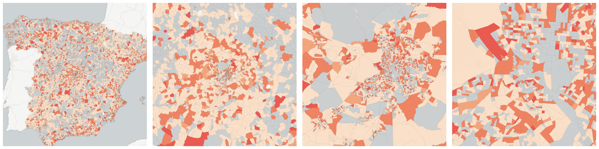
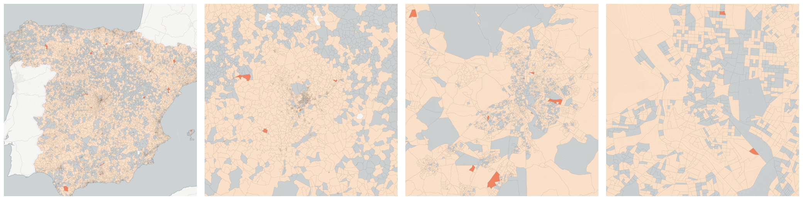
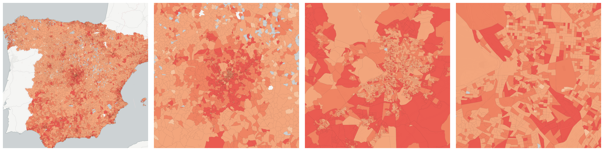
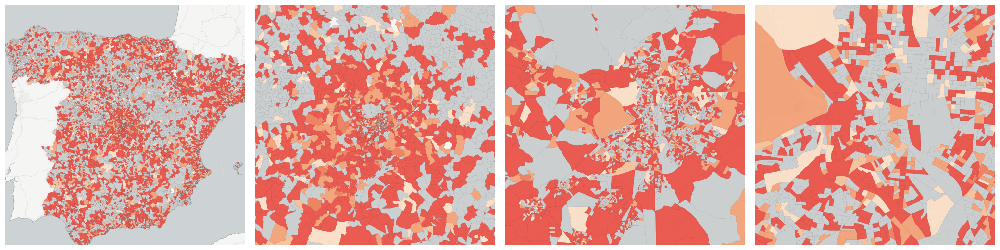
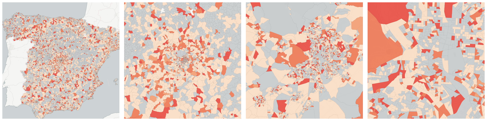
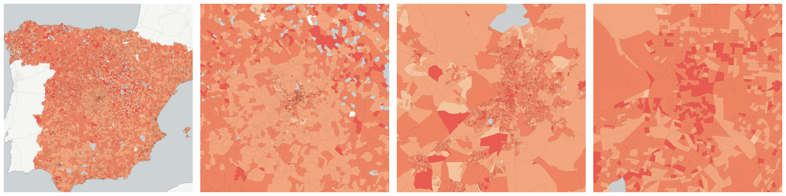
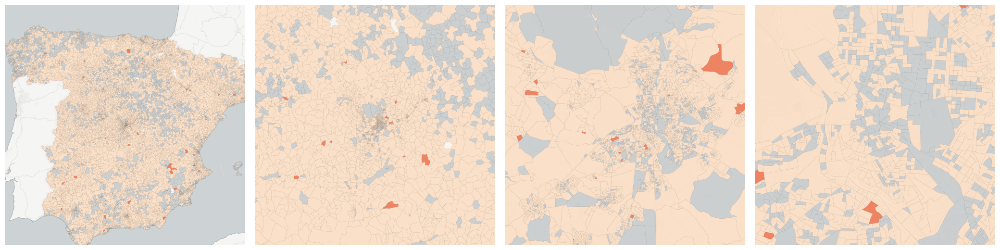

  
# Families

Familial arrangements of people and households.

- [Persons with marital status: divorced](#persons-with-marital-status-divorced)

    * [Persons with marital status: divorced and between 16 (included) and 64 (included) years of age](#persons-with-marital-status-divorced-and-between-16-included-and-64-included-years-of-age)

    * [Persons with marital status: divorced and over 64 years of age](#persons-with-marital-status-divorced-and-over-64-years-of-age)

    * [Persons with marital status: divorced and under 16 years of age](#persons-with-marital-status-divorced-and-under-16-years-of-age)

- [Persons with marital status: married](#persons-with-marital-status-married)

    * [Persons with marital status: married and between 16 (included) and 64 (included) years of age](#persons-with-marital-status-married-and-between-16-included-and-64-included-years-of-age)

    * [Persons with marital status: married and over 64 years of age](#persons-with-marital-status-married-and-over-64-years-of-age)

    * [Persons with marital status: married and under 16 years of age](#persons-with-marital-status-married-and-under-16-years-of-age)

- [Persons with marital status: separated](#persons-with-marital-status-separated)

    * [Persons with marital status: separated and between 16 (included) and 64 (included) years of age](#persons-with-marital-status-separated-and-between-16-included-and-64-included-years-of-age)

    * [Persons with marital status: separated and over 64 years of age](#persons-with-marital-status-separated-and-over-64-years-of-age)

    * [Persons with marital status: separated and under 16 years of age](#persons-with-marital-status-separated-and-under-16-years-of-age)

- [Persons with marital status: single](#persons-with-marital-status-single)

    * [Persons with marital status: single and between 16 (included) and 64 (included) years of age](#persons-with-marital-status-single-and-between-16-included-and-64-included-years-of-age)

    * [Persons with marital status: single and over 64 years of age](#persons-with-marital-status-single-and-over-64-years-of-age)

    * [Persons with marital status: single and under 16 years of age](#persons-with-marital-status-single-and-under-16-years-of-age)

- [Persons with marital status: widowed](#persons-with-marital-status-widowed)

    * [Persons with marital status: widowed and between 16 (included) and 64 (included) years of age](#persons-with-marital-status-widowed-and-between-16-included-and-64-included-years-of-age)

    * [Persons with marital status: widowed and over 64 years of age](#persons-with-marital-status-widowed-and-over-64-years-of-age)

    * [Persons with marital status: widowed and under 16 years of age](#persons-with-marital-status-widowed-and-under-16-years-of-age)

- [Total households](#total-households)

    * [Households with 1 person](#households-with-1-person)

    * [Households with 2 persons](#households-with-2-persons)

    * [Households with 3 persons](#households-with-3-persons)

    * [Households with 4 persons](#households-with-4-persons)

    * [Households with 5 persons](#households-with-5-persons)

    * [Households with 6 or more persons](#households-with-6-or-more-persons)

## Persons with marital status: divorced

Measure &quot;Persons with marital status: divorced&quot;  density per sq. kilometer  for one point:

    UPDATE {table_name}
      SET {new_numeric_column} =
        OBS_GetMeasure(
          CDB_LatLng(40.39, -3.7),
          'es.ine.t10_4'
        );

Measure &quot;Persons with marital status: divorced&quot; within an area:

    UPDATE {table_name}
      SET {new_numeric_column} =
        OBS_GetMeasure(
          ST_Buffer(CDB_LatLng(40.39, -3.7), 0.01),
          'es.ine.t10_4'
        );

Measure &quot;Persons with marital status: divorced&quot; percent of &quot;Total population&quot; at one point:

    UPDATE {table_name}
      SET {new_numeric_column} =
        OBS_GetMeasure(
          CDB_LatLng(40.39, -3.7),
          'es.ine.t10_4',
          'denominator'
        );

Measure &quot;Persons with marital status: divorced&quot; percent of &quot;Total population&quot; within an area:

    UPDATE {table_name}
      SET {new_numeric_column} =
        OBS_GetMeasure(
          ST_Buffer(CDB_LatLng(40.39, -3.7), 0.01),
          'es.ine.t10_4',
          'denominator'
        );

* denominator: [Total population](../age_gender/#es-ine-t1-1)

Subcolumns of Persons with marital status: divorced

- [Persons with marital status: divorced and between 16 (included) and 64 (included) years of age](#persons-with-marital-status-divorced-and-between-16-included-and-64-included-years-of-age)

- [Persons with marital status: divorced and over 64 years of age](#persons-with-marital-status-divorced-and-over-64-years-of-age)

- [Persons with marital status: divorced and under 16 years of age](#persons-with-marital-status-divorced-and-under-16-years-of-age)

### Persons with marital status: divorced and between 16 (included) and 64 (included) years of age

Measure &quot;Persons with marital status: divorced and between 16 (included) and 64 (included) years of age&quot;  density per sq. kilometer  for one point:

    UPDATE {table_name}
      SET {new_numeric_column} =
        OBS_GetMeasure(
          CDB_LatLng(40.39, -3.7),
          'es.ine.t11_11'
        );

Measure &quot;Persons with marital status: divorced and between 16 (included) and 64 (included) years of age&quot; within an area:

    UPDATE {table_name}
      SET {new_numeric_column} =
        OBS_GetMeasure(
          ST_Buffer(CDB_LatLng(40.39, -3.7), 0.01),
          'es.ine.t11_11'
        );

Measure &quot;Persons with marital status: divorced and between 16 (included) and 64 (included) years of age&quot; percent of &quot;Persons aged between 16 (included) and 64 (included) years&quot; at one point:

    UPDATE {table_name}
      SET {new_numeric_column} =
        OBS_GetMeasure(
          CDB_LatLng(40.39, -3.7),
          'es.ine.t11_11',
          'denominator'
        );

Measure &quot;Persons with marital status: divorced and between 16 (included) and 64 (included) years of age&quot; percent of &quot;Persons aged between 16 (included) and 64 (included) years&quot; within an area:

    UPDATE {table_name}
      SET {new_numeric_column} =
        OBS_GetMeasure(
          ST_Buffer(CDB_LatLng(40.39, -3.7), 0.01),
          'es.ine.t11_11',
          'denominator'
        );

* denominator: [Persons aged between 16 (included) and 64 (included) years](../age_gender/#es-ine-t3-2)

* denominator: [Persons with marital status: divorced](#es-ine-t10-4)

### Persons with marital status: divorced and over 64 years of age

Measure &quot;Persons with marital status: divorced and over 64 years of age&quot;  density per sq. kilometer  for one point:

    UPDATE {table_name}
      SET {new_numeric_column} =
        OBS_GetMeasure(
          CDB_LatLng(40.39, -3.7),
          'es.ine.t11_12'
        );

Measure &quot;Persons with marital status: divorced and over 64 years of age&quot; within an area:

    UPDATE {table_name}
      SET {new_numeric_column} =
        OBS_GetMeasure(
          ST_Buffer(CDB_LatLng(40.39, -3.7), 0.01),
          'es.ine.t11_12'
        );

Measure &quot;Persons with marital status: divorced and over 64 years of age&quot; percent of &quot;Persons aged over 64 years&quot; at one point:

    UPDATE {table_name}
      SET {new_numeric_column} =
        OBS_GetMeasure(
          CDB_LatLng(40.39, -3.7),
          'es.ine.t11_12',
          'denominator'
        );

Measure &quot;Persons with marital status: divorced and over 64 years of age&quot; percent of &quot;Persons aged over 64 years&quot; within an area:

    UPDATE {table_name}
      SET {new_numeric_column} =
        OBS_GetMeasure(
          ST_Buffer(CDB_LatLng(40.39, -3.7), 0.01),
          'es.ine.t11_12',
          'denominator'
        );

* denominator: [Persons aged over 64 years](../age_gender/#es-ine-t3-3)

* denominator: [Persons with marital status: divorced](#es-ine-t10-4)

### Persons with marital status: divorced and under 16 years of age

Measure &quot;Persons with marital status: divorced and under 16 years of age&quot;  density per sq. kilometer  for one point:

    UPDATE {table_name}
      SET {new_numeric_column} =
        OBS_GetMeasure(
          CDB_LatLng(40.39, -3.7),
          'es.ine.t11_10'
        );

Measure &quot;Persons with marital status: divorced and under 16 years of age&quot; within an area:

    UPDATE {table_name}
      SET {new_numeric_column} =
        OBS_GetMeasure(
          ST_Buffer(CDB_LatLng(40.39, -3.7), 0.01),
          'es.ine.t11_10'
        );

Measure &quot;Persons with marital status: divorced and under 16 years of age&quot; percent of &quot;Persons aged under 16 years&quot; at one point:

    UPDATE {table_name}
      SET {new_numeric_column} =
        OBS_GetMeasure(
          CDB_LatLng(40.39, -3.7),
          'es.ine.t11_10',
          'denominator'
        );

Measure &quot;Persons with marital status: divorced and under 16 years of age&quot; percent of &quot;Persons aged under 16 years&quot; within an area:

    UPDATE {table_name}
      SET {new_numeric_column} =
        OBS_GetMeasure(
          ST_Buffer(CDB_LatLng(40.39, -3.7), 0.01),
          'es.ine.t11_10',
          'denominator'
        );

* denominator: [Persons aged under 16 years](../age_gender/#es-ine-t3-1)

* denominator: [Persons with marital status: divorced](#es-ine-t10-4)

## Persons with marital status: married

Measure &quot;Persons with marital status: married&quot;  density per sq. kilometer  for one point:

    UPDATE {table_name}
      SET {new_numeric_column} =
        OBS_GetMeasure(
          CDB_LatLng(40.39, -3.7),
          'es.ine.t10_2'
        );

Measure &quot;Persons with marital status: married&quot; within an area:

    UPDATE {table_name}
      SET {new_numeric_column} =
        OBS_GetMeasure(
          ST_Buffer(CDB_LatLng(40.39, -3.7), 0.01),
          'es.ine.t10_2'
        );

Measure &quot;Persons with marital status: married&quot; percent of &quot;Total population&quot; at one point:

    UPDATE {table_name}
      SET {new_numeric_column} =
        OBS_GetMeasure(
          CDB_LatLng(40.39, -3.7),
          'es.ine.t10_2',
          'denominator'
        );

Measure &quot;Persons with marital status: married&quot; percent of &quot;Total population&quot; within an area:

    UPDATE {table_name}
      SET {new_numeric_column} =
        OBS_GetMeasure(
          ST_Buffer(CDB_LatLng(40.39, -3.7), 0.01),
          'es.ine.t10_2',
          'denominator'
        );

* denominator: [Total population](../age_gender/#es-ine-t1-1)

Subcolumns of Persons with marital status: married

- [Persons with marital status: married and between 16 (included) and 64 (included) years of age](#persons-with-marital-status-married-and-between-16-included-and-64-included-years-of-age)

- [Persons with marital status: married and over 64 years of age](#persons-with-marital-status-married-and-over-64-years-of-age)

- [Persons with marital status: married and under 16 years of age](#persons-with-marital-status-married-and-under-16-years-of-age)

### Persons with marital status: married and between 16 (included) and 64 (included) years of age

Measure &quot;Persons with marital status: married and between 16 (included) and 64 (included) years of age&quot;  density per sq. kilometer  for one point:

    UPDATE {table_name}
      SET {new_numeric_column} =
        OBS_GetMeasure(
          CDB_LatLng(40.39, -3.7),
          'es.ine.t11_5'
        );

Measure &quot;Persons with marital status: married and between 16 (included) and 64 (included) years of age&quot; within an area:

    UPDATE {table_name}
      SET {new_numeric_column} =
        OBS_GetMeasure(
          ST_Buffer(CDB_LatLng(40.39, -3.7), 0.01),
          'es.ine.t11_5'
        );

Measure &quot;Persons with marital status: married and between 16 (included) and 64 (included) years of age&quot; percent of &quot;Persons aged between 16 (included) and 64 (included) years&quot; at one point:

    UPDATE {table_name}
      SET {new_numeric_column} =
        OBS_GetMeasure(
          CDB_LatLng(40.39, -3.7),
          'es.ine.t11_5',
          'denominator'
        );

Measure &quot;Persons with marital status: married and between 16 (included) and 64 (included) years of age&quot; percent of &quot;Persons aged between 16 (included) and 64 (included) years&quot; within an area:

    UPDATE {table_name}
      SET {new_numeric_column} =
        OBS_GetMeasure(
          ST_Buffer(CDB_LatLng(40.39, -3.7), 0.01),
          'es.ine.t11_5',
          'denominator'
        );

* denominator: [Persons aged between 16 (included) and 64 (included) years](../age_gender/#es-ine-t3-2)

* denominator: [Persons with marital status: married](#es-ine-t10-2)

### Persons with marital status: married and over 64 years of age

Measure &quot;Persons with marital status: married and over 64 years of age&quot;  density per sq. kilometer  for one point:

    UPDATE {table_name}
      SET {new_numeric_column} =
        OBS_GetMeasure(
          CDB_LatLng(40.39, -3.7),
          'es.ine.t11_6'
        );

Measure &quot;Persons with marital status: married and over 64 years of age&quot; within an area:

    UPDATE {table_name}
      SET {new_numeric_column} =
        OBS_GetMeasure(
          ST_Buffer(CDB_LatLng(40.39, -3.7), 0.01),
          'es.ine.t11_6'
        );

Measure &quot;Persons with marital status: married and over 64 years of age&quot; percent of &quot;Persons with marital status: married&quot; at one point:

    UPDATE {table_name}
      SET {new_numeric_column} =
        OBS_GetMeasure(
          CDB_LatLng(40.39, -3.7),
          'es.ine.t11_6',
          'denominator'
        );

Measure &quot;Persons with marital status: married and over 64 years of age&quot; percent of &quot;Persons with marital status: married&quot; within an area:

    UPDATE {table_name}
      SET {new_numeric_column} =
        OBS_GetMeasure(
          ST_Buffer(CDB_LatLng(40.39, -3.7), 0.01),
          'es.ine.t11_6',
          'denominator'
        );

* denominator: [Persons with marital status: married](#es-ine-t10-2)

* denominator: [Persons aged over 64 years](../age_gender/#es-ine-t3-3)

### Persons with marital status: married and under 16 years of age

Measure &quot;Persons with marital status: married and under 16 years of age&quot;  density per sq. kilometer  for one point:

    UPDATE {table_name}
      SET {new_numeric_column} =
        OBS_GetMeasure(
          CDB_LatLng(40.39, -3.7),
          'es.ine.t11_4'
        );

Measure &quot;Persons with marital status: married and under 16 years of age&quot; within an area:

    UPDATE {table_name}
      SET {new_numeric_column} =
        OBS_GetMeasure(
          ST_Buffer(CDB_LatLng(40.39, -3.7), 0.01),
          'es.ine.t11_4'
        );

Measure &quot;Persons with marital status: married and under 16 years of age&quot; percent of &quot;Persons with marital status: married&quot; at one point:

    UPDATE {table_name}
      SET {new_numeric_column} =
        OBS_GetMeasure(
          CDB_LatLng(40.39, -3.7),
          'es.ine.t11_4',
          'denominator'
        );

Measure &quot;Persons with marital status: married and under 16 years of age&quot; percent of &quot;Persons with marital status: married&quot; within an area:

    UPDATE {table_name}
      SET {new_numeric_column} =
        OBS_GetMeasure(
          ST_Buffer(CDB_LatLng(40.39, -3.7), 0.01),
          'es.ine.t11_4',
          'denominator'
        );

* denominator: [Persons with marital status: married](#es-ine-t10-2)

* denominator: [Persons aged under 16 years](../age_gender/#es-ine-t3-1)

## Persons with marital status: separated

Measure &quot;Persons with marital status: separated&quot;  density per sq. kilometer  for one point:

    UPDATE {table_name}
      SET {new_numeric_column} =
        OBS_GetMeasure(
          CDB_LatLng(40.39, -3.7),
          'es.ine.t10_3'
        );

Measure &quot;Persons with marital status: separated&quot; within an area:

    UPDATE {table_name}
      SET {new_numeric_column} =
        OBS_GetMeasure(
          ST_Buffer(CDB_LatLng(40.39, -3.7), 0.01),
          'es.ine.t10_3'
        );

Measure &quot;Persons with marital status: separated&quot; percent of &quot;Total population&quot; at one point:

    UPDATE {table_name}
      SET {new_numeric_column} =
        OBS_GetMeasure(
          CDB_LatLng(40.39, -3.7),
          'es.ine.t10_3',
          'denominator'
        );

Measure &quot;Persons with marital status: separated&quot; percent of &quot;Total population&quot; within an area:

    UPDATE {table_name}
      SET {new_numeric_column} =
        OBS_GetMeasure(
          ST_Buffer(CDB_LatLng(40.39, -3.7), 0.01),
          'es.ine.t10_3',
          'denominator'
        );

* denominator: [Total population](../age_gender/#es-ine-t1-1)

Subcolumns of Persons with marital status: separated

- [Persons with marital status: separated and between 16 (included) and 64 (included) years of age](#persons-with-marital-status-separated-and-between-16-included-and-64-included-years-of-age)

- [Persons with marital status: separated and over 64 years of age](#persons-with-marital-status-separated-and-over-64-years-of-age)

- [Persons with marital status: separated and under 16 years of age](#persons-with-marital-status-separated-and-under-16-years-of-age)

### Persons with marital status: separated and between 16 (included) and 64 (included) years of age

Measure &quot;Persons with marital status: separated and between 16 (included) and 64 (included) years of age&quot;  density per sq. kilometer  for one point:

    UPDATE {table_name}
      SET {new_numeric_column} =
        OBS_GetMeasure(
          CDB_LatLng(40.39, -3.7),
          'es.ine.t11_8'
        );

Measure &quot;Persons with marital status: separated and between 16 (included) and 64 (included) years of age&quot; within an area:

    UPDATE {table_name}
      SET {new_numeric_column} =
        OBS_GetMeasure(
          ST_Buffer(CDB_LatLng(40.39, -3.7), 0.01),
          'es.ine.t11_8'
        );

Measure &quot;Persons with marital status: separated and between 16 (included) and 64 (included) years of age&quot; percent of &quot;Persons aged between 16 (included) and 64 (included) years&quot; at one point:

    UPDATE {table_name}
      SET {new_numeric_column} =
        OBS_GetMeasure(
          CDB_LatLng(40.39, -3.7),
          'es.ine.t11_8',
          'denominator'
        );

Measure &quot;Persons with marital status: separated and between 16 (included) and 64 (included) years of age&quot; percent of &quot;Persons aged between 16 (included) and 64 (included) years&quot; within an area:

    UPDATE {table_name}
      SET {new_numeric_column} =
        OBS_GetMeasure(
          ST_Buffer(CDB_LatLng(40.39, -3.7), 0.01),
          'es.ine.t11_8',
          'denominator'
        );

* denominator: [Persons aged between 16 (included) and 64 (included) years](../age_gender/#es-ine-t3-2)

* denominator: [Persons with marital status: separated](#es-ine-t10-3)

### Persons with marital status: separated and over 64 years of age

Measure &quot;Persons with marital status: separated and over 64 years of age&quot;  density per sq. kilometer  for one point:

    UPDATE {table_name}
      SET {new_numeric_column} =
        OBS_GetMeasure(
          CDB_LatLng(40.39, -3.7),
          'es.ine.t11_9'
        );

Measure &quot;Persons with marital status: separated and over 64 years of age&quot; within an area:

    UPDATE {table_name}
      SET {new_numeric_column} =
        OBS_GetMeasure(
          ST_Buffer(CDB_LatLng(40.39, -3.7), 0.01),
          'es.ine.t11_9'
        );

Measure &quot;Persons with marital status: separated and over 64 years of age&quot; percent of &quot;Persons with marital status: separated&quot; at one point:

    UPDATE {table_name}
      SET {new_numeric_column} =
        OBS_GetMeasure(
          CDB_LatLng(40.39, -3.7),
          'es.ine.t11_9',
          'denominator'
        );

Measure &quot;Persons with marital status: separated and over 64 years of age&quot; percent of &quot;Persons with marital status: separated&quot; within an area:

    UPDATE {table_name}
      SET {new_numeric_column} =
        OBS_GetMeasure(
          ST_Buffer(CDB_LatLng(40.39, -3.7), 0.01),
          'es.ine.t11_9',
          'denominator'
        );

* denominator: [Persons with marital status: separated](#es-ine-t10-3)

* denominator: [Persons aged over 64 years](../age_gender/#es-ine-t3-3)

### Persons with marital status: separated and under 16 years of age

Measure &quot;Persons with marital status: separated and under 16 years of age&quot;  density per sq. kilometer  for one point:

    UPDATE {table_name}
      SET {new_numeric_column} =
        OBS_GetMeasure(
          CDB_LatLng(40.39, -3.7),
          'es.ine.t11_7'
        );

Measure &quot;Persons with marital status: separated and under 16 years of age&quot; within an area:

    UPDATE {table_name}
      SET {new_numeric_column} =
        OBS_GetMeasure(
          ST_Buffer(CDB_LatLng(40.39, -3.7), 0.01),
          'es.ine.t11_7'
        );

Measure &quot;Persons with marital status: separated and under 16 years of age&quot; percent of &quot;Persons with marital status: separated&quot; at one point:

    UPDATE {table_name}
      SET {new_numeric_column} =
        OBS_GetMeasure(
          CDB_LatLng(40.39, -3.7),
          'es.ine.t11_7',
          'denominator'
        );

Measure &quot;Persons with marital status: separated and under 16 years of age&quot; percent of &quot;Persons with marital status: separated&quot; within an area:

    UPDATE {table_name}
      SET {new_numeric_column} =
        OBS_GetMeasure(
          ST_Buffer(CDB_LatLng(40.39, -3.7), 0.01),
          'es.ine.t11_7',
          'denominator'
        );

* denominator: [Persons with marital status: separated](#es-ine-t10-3)

* denominator: [Persons aged under 16 years](../age_gender/#es-ine-t3-1)

## Persons with marital status: single

Measure &quot;Persons with marital status: single &quot;  density per sq. kilometer  for one point:

    UPDATE {table_name}
      SET {new_numeric_column} =
        OBS_GetMeasure(
          CDB_LatLng(40.39, -3.7),
          'es.ine.t10_1'
        );

Measure &quot;Persons with marital status: single &quot; within an area:

    UPDATE {table_name}
      SET {new_numeric_column} =
        OBS_GetMeasure(
          ST_Buffer(CDB_LatLng(40.39, -3.7), 0.01),
          'es.ine.t10_1'
        );

Measure &quot;Persons with marital status: single &quot; percent of &quot;Total population&quot; at one point:

    UPDATE {table_name}
      SET {new_numeric_column} =
        OBS_GetMeasure(
          CDB_LatLng(40.39, -3.7),
          'es.ine.t10_1',
          'denominator'
        );

Measure &quot;Persons with marital status: single &quot; percent of &quot;Total population&quot; within an area:

    UPDATE {table_name}
      SET {new_numeric_column} =
        OBS_GetMeasure(
          ST_Buffer(CDB_LatLng(40.39, -3.7), 0.01),
          'es.ine.t10_1',
          'denominator'
        );

* denominator: [Total population](../age_gender/#es-ine-t1-1)

Subcolumns of Persons with marital status: single

- [Persons with marital status: single and between 16 (included) and 64 (included) years of age](#persons-with-marital-status-single-and-between-16-included-and-64-included-years-of-age)

- [Persons with marital status: single and over 64 years of age](#persons-with-marital-status-single-and-over-64-years-of-age)

- [Persons with marital status: single and under 16 years of age](#persons-with-marital-status-single-and-under-16-years-of-age)

### Persons with marital status: single and between 16 (included) and 64 (included) years of age

Measure &quot;Persons with marital status: single and between 16 (included) and 64 (included) years of age&quot;  density per sq. kilometer  for one point:

    UPDATE {table_name}
      SET {new_numeric_column} =
        OBS_GetMeasure(
          CDB_LatLng(40.39, -3.7),
          'es.ine.t11_2'
        );

Measure &quot;Persons with marital status: single and between 16 (included) and 64 (included) years of age&quot; within an area:

    UPDATE {table_name}
      SET {new_numeric_column} =
        OBS_GetMeasure(
          ST_Buffer(CDB_LatLng(40.39, -3.7), 0.01),
          'es.ine.t11_2'
        );

Measure &quot;Persons with marital status: single and between 16 (included) and 64 (included) years of age&quot; percent of &quot;Persons aged between 16 (included) and 64 (included) years&quot; at one point:

    UPDATE {table_name}
      SET {new_numeric_column} =
        OBS_GetMeasure(
          CDB_LatLng(40.39, -3.7),
          'es.ine.t11_2',
          'denominator'
        );

Measure &quot;Persons with marital status: single and between 16 (included) and 64 (included) years of age&quot; percent of &quot;Persons aged between 16 (included) and 64 (included) years&quot; within an area:

    UPDATE {table_name}
      SET {new_numeric_column} =
        OBS_GetMeasure(
          ST_Buffer(CDB_LatLng(40.39, -3.7), 0.01),
          'es.ine.t11_2',
          'denominator'
        );

* denominator: [Persons aged between 16 (included) and 64 (included) years](../age_gender/#es-ine-t3-2)

* denominator: [Persons with marital status: single](#es-ine-t10-1)

### Persons with marital status: single and over 64 years of age

Measure &quot;Persons with marital status: single and over 64 years of age&quot;  density per sq. kilometer  for one point:

    UPDATE {table_name}
      SET {new_numeric_column} =
        OBS_GetMeasure(
          CDB_LatLng(40.39, -3.7),
          'es.ine.t11_3'
        );

Measure &quot;Persons with marital status: single and over 64 years of age&quot; within an area:

    UPDATE {table_name}
      SET {new_numeric_column} =
        OBS_GetMeasure(
          ST_Buffer(CDB_LatLng(40.39, -3.7), 0.01),
          'es.ine.t11_3'
        );

Measure &quot;Persons with marital status: single and over 64 years of age&quot; percent of &quot;Persons aged over 64 years&quot; at one point:

    UPDATE {table_name}
      SET {new_numeric_column} =
        OBS_GetMeasure(
          CDB_LatLng(40.39, -3.7),
          'es.ine.t11_3',
          'denominator'
        );

Measure &quot;Persons with marital status: single and over 64 years of age&quot; percent of &quot;Persons aged over 64 years&quot; within an area:

    UPDATE {table_name}
      SET {new_numeric_column} =
        OBS_GetMeasure(
          ST_Buffer(CDB_LatLng(40.39, -3.7), 0.01),
          'es.ine.t11_3',
          'denominator'
        );

* denominator: [Persons aged over 64 years](../age_gender/#es-ine-t3-3)

* denominator: [Persons with marital status: single](#es-ine-t10-1)

### Persons with marital status: single and under 16 years of age

Measure &quot;Persons with marital status: single and under 16 years of age&quot;  density per sq. kilometer  for one point:

    UPDATE {table_name}
      SET {new_numeric_column} =
        OBS_GetMeasure(
          CDB_LatLng(40.39, -3.7),
          'es.ine.t11_1'
        );

Measure &quot;Persons with marital status: single and under 16 years of age&quot; within an area:

    UPDATE {table_name}
      SET {new_numeric_column} =
        OBS_GetMeasure(
          ST_Buffer(CDB_LatLng(40.39, -3.7), 0.01),
          'es.ine.t11_1'
        );

Measure &quot;Persons with marital status: single and under 16 years of age&quot; percent of &quot;Persons aged under 16 years&quot; at one point:

    UPDATE {table_name}
      SET {new_numeric_column} =
        OBS_GetMeasure(
          CDB_LatLng(40.39, -3.7),
          'es.ine.t11_1',
          'denominator'
        );

Measure &quot;Persons with marital status: single and under 16 years of age&quot; percent of &quot;Persons aged under 16 years&quot; within an area:

    UPDATE {table_name}
      SET {new_numeric_column} =
        OBS_GetMeasure(
          ST_Buffer(CDB_LatLng(40.39, -3.7), 0.01),
          'es.ine.t11_1',
          'denominator'
        );

* denominator: [Persons aged under 16 years](../age_gender/#es-ine-t3-1)

* denominator: [Persons with marital status: single](#es-ine-t10-1)

## Persons with marital status: widowed

Measure &quot;Persons with marital status: widowed&quot;  density per sq. kilometer  for one point:

    UPDATE {table_name}
      SET {new_numeric_column} =
        OBS_GetMeasure(
          CDB_LatLng(40.39, -3.7),
          'es.ine.t10_5'
        );

Measure &quot;Persons with marital status: widowed&quot; within an area:

    UPDATE {table_name}
      SET {new_numeric_column} =
        OBS_GetMeasure(
          ST_Buffer(CDB_LatLng(40.39, -3.7), 0.01),
          'es.ine.t10_5'
        );

Measure &quot;Persons with marital status: widowed&quot; percent of &quot;Total population&quot; at one point:

    UPDATE {table_name}
      SET {new_numeric_column} =
        OBS_GetMeasure(
          CDB_LatLng(40.39, -3.7),
          'es.ine.t10_5',
          'denominator'
        );

Measure &quot;Persons with marital status: widowed&quot; percent of &quot;Total population&quot; within an area:

    UPDATE {table_name}
      SET {new_numeric_column} =
        OBS_GetMeasure(
          ST_Buffer(CDB_LatLng(40.39, -3.7), 0.01),
          'es.ine.t10_5',
          'denominator'
        );

* denominator: [Total population](../age_gender/#es-ine-t1-1)

Subcolumns of Persons with marital status: widowed

- [Persons with marital status: widowed and between 16 (included) and 64 (included) years of age](#persons-with-marital-status-widowed-and-between-16-included-and-64-included-years-of-age)

- [Persons with marital status: widowed and over 64 years of age](#persons-with-marital-status-widowed-and-over-64-years-of-age)

- [Persons with marital status: widowed and under 16 years of age](#persons-with-marital-status-widowed-and-under-16-years-of-age)

### Persons with marital status: widowed and between 16 (included) and 64 (included) years of age

Measure &quot;Persons with marital status: widowed and between 16 (included) and 64 (included) years of age&quot;  density per sq. kilometer  for one point:

    UPDATE {table_name}
      SET {new_numeric_column} =
        OBS_GetMeasure(
          CDB_LatLng(40.39, -3.7),
          'es.ine.t11_14'
        );

Measure &quot;Persons with marital status: widowed and between 16 (included) and 64 (included) years of age&quot; within an area:

    UPDATE {table_name}
      SET {new_numeric_column} =
        OBS_GetMeasure(
          ST_Buffer(CDB_LatLng(40.39, -3.7), 0.01),
          'es.ine.t11_14'
        );

Measure &quot;Persons with marital status: widowed and between 16 (included) and 64 (included) years of age&quot; percent of &quot;Persons aged between 16 (included) and 64 (included) years&quot; at one point:

    UPDATE {table_name}
      SET {new_numeric_column} =
        OBS_GetMeasure(
          CDB_LatLng(40.39, -3.7),
          'es.ine.t11_14',
          'denominator'
        );

Measure &quot;Persons with marital status: widowed and between 16 (included) and 64 (included) years of age&quot; percent of &quot;Persons aged between 16 (included) and 64 (included) years&quot; within an area:

    UPDATE {table_name}
      SET {new_numeric_column} =
        OBS_GetMeasure(
          ST_Buffer(CDB_LatLng(40.39, -3.7), 0.01),
          'es.ine.t11_14',
          'denominator'
        );

* denominator: [Persons aged between 16 (included) and 64 (included) years](../age_gender/#es-ine-t3-2)

* denominator: [Persons with marital status: widowed](#es-ine-t10-5)

### Persons with marital status: widowed and over 64 years of age

Measure &quot;Persons with marital status: widowed and over 64 years of age&quot;  density per sq. kilometer  for one point:

    UPDATE {table_name}
      SET {new_numeric_column} =
        OBS_GetMeasure(
          CDB_LatLng(40.39, -3.7),
          'es.ine.t11_15'
        );

Measure &quot;Persons with marital status: widowed and over 64 years of age&quot; within an area:

    UPDATE {table_name}
      SET {new_numeric_column} =
        OBS_GetMeasure(
          ST_Buffer(CDB_LatLng(40.39, -3.7), 0.01),
          'es.ine.t11_15'
        );

Measure &quot;Persons with marital status: widowed and over 64 years of age&quot; percent of &quot;Persons aged over 64 years&quot; at one point:

    UPDATE {table_name}
      SET {new_numeric_column} =
        OBS_GetMeasure(
          CDB_LatLng(40.39, -3.7),
          'es.ine.t11_15',
          'denominator'
        );

Measure &quot;Persons with marital status: widowed and over 64 years of age&quot; percent of &quot;Persons aged over 64 years&quot; within an area:

    UPDATE {table_name}
      SET {new_numeric_column} =
        OBS_GetMeasure(
          ST_Buffer(CDB_LatLng(40.39, -3.7), 0.01),
          'es.ine.t11_15',
          'denominator'
        );

* denominator: [Persons aged over 64 years](../age_gender/#es-ine-t3-3)

* denominator: [Persons with marital status: widowed](#es-ine-t10-5)

### Persons with marital status: widowed and under 16 years of age

Measure &quot;Persons with marital status: widowed and under 16 years of age&quot;  density per sq. kilometer  for one point:

    UPDATE {table_name}
      SET {new_numeric_column} =
        OBS_GetMeasure(
          CDB_LatLng(40.39, -3.7),
          'es.ine.t11_13'
        );

Measure &quot;Persons with marital status: widowed and under 16 years of age&quot; within an area:

    UPDATE {table_name}
      SET {new_numeric_column} =
        OBS_GetMeasure(
          ST_Buffer(CDB_LatLng(40.39, -3.7), 0.01),
          'es.ine.t11_13'
        );

Measure &quot;Persons with marital status: widowed and under 16 years of age&quot; percent of &quot;Persons aged under 16 years&quot; at one point:

    UPDATE {table_name}
      SET {new_numeric_column} =
        OBS_GetMeasure(
          CDB_LatLng(40.39, -3.7),
          'es.ine.t11_13',
          'denominator'
        );

Measure &quot;Persons with marital status: widowed and under 16 years of age&quot; percent of &quot;Persons aged under 16 years&quot; within an area:

    UPDATE {table_name}
      SET {new_numeric_column} =
        OBS_GetMeasure(
          ST_Buffer(CDB_LatLng(40.39, -3.7), 0.01),
          'es.ine.t11_13',
          'denominator'
        );

* denominator: [Persons aged under 16 years](../age_gender/#es-ine-t3-1)

* denominator: [Persons with marital status: widowed](#es-ine-t10-5)

## Total households

Measure &quot;Total households&quot;  density per sq. kilometer  for one point:

    UPDATE {table_name}
      SET {new_numeric_column} =
        OBS_GetMeasure(
          CDB_LatLng(40.39, -3.7),
          'es.ine.t21_1'
        );

Measure &quot;Total households&quot; within an area:

    UPDATE {table_name}
      SET {new_numeric_column} =
        OBS_GetMeasure(
          ST_Buffer(CDB_LatLng(40.39, -3.7), 0.01),
          'es.ine.t21_1'
        );

Subcolumns of Total households

- [Households with 1 person](#households-with-1-person)

- [Households with 2 persons](#households-with-2-persons)

- [Households with 3 persons](#households-with-3-persons)

- [Households with 4 persons](#households-with-4-persons)

- [Households with 5 persons](#households-with-5-persons)

- [Households with 6 or more persons](#households-with-6-or-more-persons)

### Households with 1 person

Measure &quot;Households with 1 person&quot;  density per sq. kilometer  for one point:

    UPDATE {table_name}
      SET {new_numeric_column} =
        OBS_GetMeasure(
          CDB_LatLng(40.39, -3.7),
          'es.ine.t22_1'
        );

Measure &quot;Households with 1 person&quot; within an area:

    UPDATE {table_name}
      SET {new_numeric_column} =
        OBS_GetMeasure(
          ST_Buffer(CDB_LatLng(40.39, -3.7), 0.01),
          'es.ine.t22_1'
        );

Measure &quot;Households with 1 person&quot; percent of &quot;Total households&quot; at one point:

    UPDATE {table_name}
      SET {new_numeric_column} =
        OBS_GetMeasure(
          CDB_LatLng(40.39, -3.7),
          'es.ine.t22_1',
          'denominator'
        );

Measure &quot;Households with 1 person&quot; percent of &quot;Total households&quot; within an area:

    UPDATE {table_name}
      SET {new_numeric_column} =
        OBS_GetMeasure(
          ST_Buffer(CDB_LatLng(40.39, -3.7), 0.01),
          'es.ine.t22_1',
          'denominator'
        );

* denominator: [Total households](#es-ine-t21-1)

### Households with 2 persons

Measure &quot;Households with 2 persons&quot;  density per sq. kilometer  for one point:

    UPDATE {table_name}
      SET {new_numeric_column} =
        OBS_GetMeasure(
          CDB_LatLng(40.39, -3.7),
          'es.ine.t22_2'
        );

Measure &quot;Households with 2 persons&quot; within an area:

    UPDATE {table_name}
      SET {new_numeric_column} =
        OBS_GetMeasure(
          ST_Buffer(CDB_LatLng(40.39, -3.7), 0.01),
          'es.ine.t22_2'
        );

Measure &quot;Households with 2 persons&quot; percent of &quot;Total households&quot; at one point:

    UPDATE {table_name}
      SET {new_numeric_column} =
        OBS_GetMeasure(
          CDB_LatLng(40.39, -3.7),
          'es.ine.t22_2',
          'denominator'
        );

Measure &quot;Households with 2 persons&quot; percent of &quot;Total households&quot; within an area:

    UPDATE {table_name}
      SET {new_numeric_column} =
        OBS_GetMeasure(
          ST_Buffer(CDB_LatLng(40.39, -3.7), 0.01),
          'es.ine.t22_2',
          'denominator'
        );

* denominator: [Total households](#es-ine-t21-1)

### Households with 3 persons

Measure &quot;Households with 3 persons&quot;  density per sq. kilometer  for one point:

    UPDATE {table_name}
      SET {new_numeric_column} =
        OBS_GetMeasure(
          CDB_LatLng(40.39, -3.7),
          'es.ine.t22_3'
        );

Measure &quot;Households with 3 persons&quot; within an area:

    UPDATE {table_name}
      SET {new_numeric_column} =
        OBS_GetMeasure(
          ST_Buffer(CDB_LatLng(40.39, -3.7), 0.01),
          'es.ine.t22_3'
        );

Measure &quot;Households with 3 persons&quot; percent of &quot;Total households&quot; at one point:

    UPDATE {table_name}
      SET {new_numeric_column} =
        OBS_GetMeasure(
          CDB_LatLng(40.39, -3.7),
          'es.ine.t22_3',
          'denominator'
        );

Measure &quot;Households with 3 persons&quot; percent of &quot;Total households&quot; within an area:

    UPDATE {table_name}
      SET {new_numeric_column} =
        OBS_GetMeasure(
          ST_Buffer(CDB_LatLng(40.39, -3.7), 0.01),
          'es.ine.t22_3',
          'denominator'
        );

* denominator: [Total households](#es-ine-t21-1)

### Households with 4 persons

Measure &quot;Households with 4 persons&quot;  density per sq. kilometer  for one point:

    UPDATE {table_name}
      SET {new_numeric_column} =
        OBS_GetMeasure(
          CDB_LatLng(40.39, -3.7),
          'es.ine.t22_4'
        );

Measure &quot;Households with 4 persons&quot; within an area:

    UPDATE {table_name}
      SET {new_numeric_column} =
        OBS_GetMeasure(
          ST_Buffer(CDB_LatLng(40.39, -3.7), 0.01),
          'es.ine.t22_4'
        );

Measure &quot;Households with 4 persons&quot; percent of &quot;Total households&quot; at one point:

    UPDATE {table_name}
      SET {new_numeric_column} =
        OBS_GetMeasure(
          CDB_LatLng(40.39, -3.7),
          'es.ine.t22_4',
          'denominator'
        );

Measure &quot;Households with 4 persons&quot; percent of &quot;Total households&quot; within an area:

    UPDATE {table_name}
      SET {new_numeric_column} =
        OBS_GetMeasure(
          ST_Buffer(CDB_LatLng(40.39, -3.7), 0.01),
          'es.ine.t22_4',
          'denominator'
        );

* denominator: [Total households](#es-ine-t21-1)

### Households with 5 persons

Measure &quot;Households with 5 persons&quot;  density per sq. kilometer  for one point:

    UPDATE {table_name}
      SET {new_numeric_column} =
        OBS_GetMeasure(
          CDB_LatLng(40.39, -3.7),
          'es.ine.t22_5'
        );

Measure &quot;Households with 5 persons&quot; within an area:

    UPDATE {table_name}
      SET {new_numeric_column} =
        OBS_GetMeasure(
          ST_Buffer(CDB_LatLng(40.39, -3.7), 0.01),
          'es.ine.t22_5'
        );

Measure &quot;Households with 5 persons&quot; percent of &quot;Total households&quot; at one point:

    UPDATE {table_name}
      SET {new_numeric_column} =
        OBS_GetMeasure(
          CDB_LatLng(40.39, -3.7),
          'es.ine.t22_5',
          'denominator'
        );

Measure &quot;Households with 5 persons&quot; percent of &quot;Total households&quot; within an area:

    UPDATE {table_name}
      SET {new_numeric_column} =
        OBS_GetMeasure(
          ST_Buffer(CDB_LatLng(40.39, -3.7), 0.01),
          'es.ine.t22_5',
          'denominator'
        );

* denominator: [Total households](#es-ine-t21-1)

### Households with 6 or more persons

Measure &quot;Households with 6 or more persons&quot;  density per sq. kilometer  for one point:

    UPDATE {table_name}
      SET {new_numeric_column} =
        OBS_GetMeasure(
          CDB_LatLng(40.39, -3.7),
          'es.ine.t22_6'
        );

Measure &quot;Households with 6 or more persons&quot; within an area:

    UPDATE {table_name}
      SET {new_numeric_column} =
        OBS_GetMeasure(
          ST_Buffer(CDB_LatLng(40.39, -3.7), 0.01),
          'es.ine.t22_6'
        );

Measure &quot;Households with 6 or more persons&quot; percent of &quot;Total households&quot; at one point:

    UPDATE {table_name}
      SET {new_numeric_column} =
        OBS_GetMeasure(
          CDB_LatLng(40.39, -3.7),
          'es.ine.t22_6',
          'denominator'
        );

Measure &quot;Households with 6 or more persons&quot; percent of &quot;Total households&quot; within an area:

    UPDATE {table_name}
      SET {new_numeric_column} =
        OBS_GetMeasure(
          ST_Buffer(CDB_LatLng(40.39, -3.7), 0.01),
          'es.ine.t22_6',
          'denominator'
        );

* denominator: [Total households](#es-ine-t21-1)

