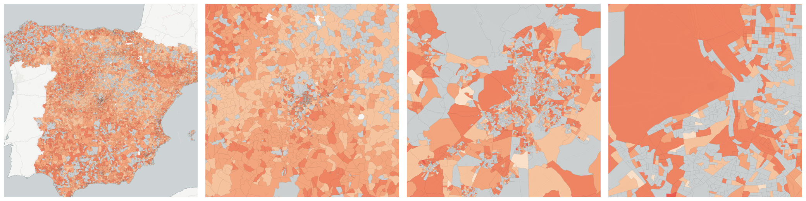

  
# Housing

What type of housing exists and how do people live in it?

- [Total dwellings](#total-dwellings)

    * [Dwellings between 30-45 m2](#dwellings-between-30-45-m2)

    * [Dwellings between 46-60 m2](#dwellings-between-46-60-m2)

    * [Dwellings between 61-75 m2](#dwellings-between-61-75-m2)

    * [Dwellings between 76-90 m2](#dwellings-between-76-90-m2)

    * [Dwellings between 91-105 m2](#dwellings-between-91-105-m2)

    * [Dwellings between 106-120 m2](#dwellings-between-106-120-m2)

    * [Dwellings between 121-150 m2](#dwellings-between-121-150-m2)

    * [Dwellings between 151-180 m2](#dwellings-between-151-180-m2)

    * [Dwellings owned, by inheritance or donation](#dwellings-owned-by-inheritance-or-donation)

    * [Dwellings owned, by purchase, totally paid](#dwellings-owned-by-purchase-totally-paid)

    * [Dwellings owned, by purchase, with outstanding](#dwellings-owned-by-purchase-with-outstanding)

    * [Dwellings rented](#dwellings-rented)

    * [Dwellings transferred for free or at low cost](#dwellings-transferred-for-free-or-at-low-cost)

    * [Dwellings with 1 room](#dwellings-with-1-room)

    * [Dwellings with 2 rooms](#dwellings-with-2-rooms)

    * [Dwellings with 3 rooms](#dwellings-with-3-rooms)

    * [Dwellings with 4 rooms](#dwellings-with-4-rooms)

    * [Dwellings with 5 rooms](#dwellings-with-5-rooms)

    * [Dwellings with 6 rooms](#dwellings-with-6-rooms)

    * [Dwellings with 7 rooms](#dwellings-with-7-rooms)

    * [Dwellings with 8 rooms](#dwellings-with-8-rooms)

    * [Dwellings with 9 or more rooms](#dwellings-with-9-or-more-rooms)

    * [Dwellings with another tenancy regime](#dwellings-with-another-tenancy-regime)

    * [Dwellings with less than 30m2](#dwellings-with-less-than-30m2)

    * [Dwellings with more than 180 m2](#dwellings-with-more-than-180-m2)

    * [Empty dwellings](#empty-dwellings)

    * [Main dwellings](#main-dwellings)

    * [Secondary dwellings](#secondary-dwellings)

## Total dwellings

Measure &quot;Total dwellings&quot;  density per sq. kilometer  for one point:

    UPDATE {table_name}
      SET {new_numeric_column} =
        OBS_GetMeasure(
          CDB_LatLng(40.39, -3.7),
          'es.ine.t16_1'
        );

Measure &quot;Total dwellings&quot; within an area:

    UPDATE {table_name}
      SET {new_numeric_column} =
        OBS_GetMeasure(
          ST_Buffer(CDB_LatLng(40.39, -3.7), 0.01),
          'es.ine.t16_1'
        );

Subcolumns of Total dwellings

- [Dwellings between 30-45 m2](#dwellings-between-30-45-m2)

- [Dwellings between 46-60 m2](#dwellings-between-46-60-m2)

- [Dwellings between 61-75 m2](#dwellings-between-61-75-m2)

- [Dwellings between 76-90 m2](#dwellings-between-76-90-m2)

- [Dwellings between 91-105 m2](#dwellings-between-91-105-m2)

- [Dwellings between 106-120 m2](#dwellings-between-106-120-m2)

- [Dwellings between 121-150 m2](#dwellings-between-121-150-m2)

- [Dwellings between 151-180 m2](#dwellings-between-151-180-m2)

- [Dwellings owned, by inheritance or donation](#dwellings-owned-by-inheritance-or-donation)

- [Dwellings owned, by purchase, totally paid](#dwellings-owned-by-purchase-totally-paid)

- [Dwellings owned, by purchase, with outstanding](#dwellings-owned-by-purchase-with-outstanding)

- [Dwellings rented](#dwellings-rented)

- [Dwellings transferred for free or at low cost](#dwellings-transferred-for-free-or-at-low-cost)

- [Dwellings with 1 room](#dwellings-with-1-room)

- [Dwellings with 2 rooms](#dwellings-with-2-rooms)

- [Dwellings with 3 rooms](#dwellings-with-3-rooms)

- [Dwellings with 4 rooms](#dwellings-with-4-rooms)

- [Dwellings with 5 rooms](#dwellings-with-5-rooms)

- [Dwellings with 6 rooms](#dwellings-with-6-rooms)

- [Dwellings with 7 rooms](#dwellings-with-7-rooms)

- [Dwellings with 8 rooms](#dwellings-with-8-rooms)

- [Dwellings with 9 or more rooms](#dwellings-with-9-or-more-rooms)

- [Dwellings with another tenancy regime](#dwellings-with-another-tenancy-regime)

- [Dwellings with less than 30m2](#dwellings-with-less-than-30m2)

- [Dwellings with more than 180 m2](#dwellings-with-more-than-180-m2)

- [Empty dwellings](#empty-dwellings)

- [Main dwellings](#main-dwellings)

- [Secondary dwellings](#secondary-dwellings)

### Dwellings between 30-45 m2

Measure &quot;Dwellings between 30-45 m2&quot;  density per sq. kilometer  for one point:

    UPDATE {table_name}
      SET {new_numeric_column} =
        OBS_GetMeasure(
          CDB_LatLng(40.39, -3.7),
          'es.ine.t19_2'
        );

Measure &quot;Dwellings between 30-45 m2&quot; within an area:

    UPDATE {table_name}
      SET {new_numeric_column} =
        OBS_GetMeasure(
          ST_Buffer(CDB_LatLng(40.39, -3.7), 0.01),
          'es.ine.t19_2'
        );

Measure &quot;Dwellings between 30-45 m2&quot; percent of &quot;Total dwellings&quot; at one point:

    UPDATE {table_name}
      SET {new_numeric_column} =
        OBS_GetMeasure(
          CDB_LatLng(40.39, -3.7),
          'es.ine.t19_2',
          'denominator'
        );

Measure &quot;Dwellings between 30-45 m2&quot; percent of &quot;Total dwellings&quot; within an area:

    UPDATE {table_name}
      SET {new_numeric_column} =
        OBS_GetMeasure(
          ST_Buffer(CDB_LatLng(40.39, -3.7), 0.01),
          'es.ine.t19_2',
          'denominator'
        );

* denominator: [Total dwellings](#es-ine-t16-1)

### Dwellings between 46-60 m2

Measure &quot;Dwellings between 46-60 m2&quot;  density per sq. kilometer  for one point:

    UPDATE {table_name}
      SET {new_numeric_column} =
        OBS_GetMeasure(
          CDB_LatLng(40.39, -3.7),
          'es.ine.t19_3'
        );

Measure &quot;Dwellings between 46-60 m2&quot; within an area:

    UPDATE {table_name}
      SET {new_numeric_column} =
        OBS_GetMeasure(
          ST_Buffer(CDB_LatLng(40.39, -3.7), 0.01),
          'es.ine.t19_3'
        );

Measure &quot;Dwellings between 46-60 m2&quot; percent of &quot;Total dwellings&quot; at one point:

    UPDATE {table_name}
      SET {new_numeric_column} =
        OBS_GetMeasure(
          CDB_LatLng(40.39, -3.7),
          'es.ine.t19_3',
          'denominator'
        );

Measure &quot;Dwellings between 46-60 m2&quot; percent of &quot;Total dwellings&quot; within an area:

    UPDATE {table_name}
      SET {new_numeric_column} =
        OBS_GetMeasure(
          ST_Buffer(CDB_LatLng(40.39, -3.7), 0.01),
          'es.ine.t19_3',
          'denominator'
        );

* denominator: [Total dwellings](#es-ine-t16-1)

### Dwellings between 61-75 m2

Measure &quot;Dwellings between 61-75 m2&quot;  density per sq. kilometer  for one point:

    UPDATE {table_name}
      SET {new_numeric_column} =
        OBS_GetMeasure(
          CDB_LatLng(40.39, -3.7),
          'es.ine.t19_4'
        );

Measure &quot;Dwellings between 61-75 m2&quot; within an area:

    UPDATE {table_name}
      SET {new_numeric_column} =
        OBS_GetMeasure(
          ST_Buffer(CDB_LatLng(40.39, -3.7), 0.01),
          'es.ine.t19_4'
        );

Measure &quot;Dwellings between 61-75 m2&quot; percent of &quot;Total dwellings&quot; at one point:

    UPDATE {table_name}
      SET {new_numeric_column} =
        OBS_GetMeasure(
          CDB_LatLng(40.39, -3.7),
          'es.ine.t19_4',
          'denominator'
        );

Measure &quot;Dwellings between 61-75 m2&quot; percent of &quot;Total dwellings&quot; within an area:

    UPDATE {table_name}
      SET {new_numeric_column} =
        OBS_GetMeasure(
          ST_Buffer(CDB_LatLng(40.39, -3.7), 0.01),
          'es.ine.t19_4',
          'denominator'
        );

* denominator: [Total dwellings](#es-ine-t16-1)

### Dwellings between 76-90 m2

Measure &quot;Dwellings between 76-90 m2&quot;  density per sq. kilometer  for one point:

    UPDATE {table_name}
      SET {new_numeric_column} =
        OBS_GetMeasure(
          CDB_LatLng(40.39, -3.7),
          'es.ine.t19_5'
        );

Measure &quot;Dwellings between 76-90 m2&quot; within an area:

    UPDATE {table_name}
      SET {new_numeric_column} =
        OBS_GetMeasure(
          ST_Buffer(CDB_LatLng(40.39, -3.7), 0.01),
          'es.ine.t19_5'
        );

Measure &quot;Dwellings between 76-90 m2&quot; percent of &quot;Total dwellings&quot; at one point:

    UPDATE {table_name}
      SET {new_numeric_column} =
        OBS_GetMeasure(
          CDB_LatLng(40.39, -3.7),
          'es.ine.t19_5',
          'denominator'
        );

Measure &quot;Dwellings between 76-90 m2&quot; percent of &quot;Total dwellings&quot; within an area:

    UPDATE {table_name}
      SET {new_numeric_column} =
        OBS_GetMeasure(
          ST_Buffer(CDB_LatLng(40.39, -3.7), 0.01),
          'es.ine.t19_5',
          'denominator'
        );

* denominator: [Total dwellings](#es-ine-t16-1)

### Dwellings between 91-105 m2

Measure &quot;Dwellings between 91-105 m2&quot;  density per sq. kilometer  for one point:

    UPDATE {table_name}
      SET {new_numeric_column} =
        OBS_GetMeasure(
          CDB_LatLng(40.39, -3.7),
          'es.ine.t19_6'
        );

Measure &quot;Dwellings between 91-105 m2&quot; within an area:

    UPDATE {table_name}
      SET {new_numeric_column} =
        OBS_GetMeasure(
          ST_Buffer(CDB_LatLng(40.39, -3.7), 0.01),
          'es.ine.t19_6'
        );

Measure &quot;Dwellings between 91-105 m2&quot; percent of &quot;Total dwellings&quot; at one point:

    UPDATE {table_name}
      SET {new_numeric_column} =
        OBS_GetMeasure(
          CDB_LatLng(40.39, -3.7),
          'es.ine.t19_6',
          'denominator'
        );

Measure &quot;Dwellings between 91-105 m2&quot; percent of &quot;Total dwellings&quot; within an area:

    UPDATE {table_name}
      SET {new_numeric_column} =
        OBS_GetMeasure(
          ST_Buffer(CDB_LatLng(40.39, -3.7), 0.01),
          'es.ine.t19_6',
          'denominator'
        );

* denominator: [Total dwellings](#es-ine-t16-1)

### Dwellings between 106-120 m2

Measure &quot;Dwellings between 106-120 m2&quot;  density per sq. kilometer  for one point:

    UPDATE {table_name}
      SET {new_numeric_column} =
        OBS_GetMeasure(
          CDB_LatLng(40.39, -3.7),
          'es.ine.t19_7'
        );

Measure &quot;Dwellings between 106-120 m2&quot; within an area:

    UPDATE {table_name}
      SET {new_numeric_column} =
        OBS_GetMeasure(
          ST_Buffer(CDB_LatLng(40.39, -3.7), 0.01),
          'es.ine.t19_7'
        );

Measure &quot;Dwellings between 106-120 m2&quot; percent of &quot;Total dwellings&quot; at one point:

    UPDATE {table_name}
      SET {new_numeric_column} =
        OBS_GetMeasure(
          CDB_LatLng(40.39, -3.7),
          'es.ine.t19_7',
          'denominator'
        );

Measure &quot;Dwellings between 106-120 m2&quot; percent of &quot;Total dwellings&quot; within an area:

    UPDATE {table_name}
      SET {new_numeric_column} =
        OBS_GetMeasure(
          ST_Buffer(CDB_LatLng(40.39, -3.7), 0.01),
          'es.ine.t19_7',
          'denominator'
        );

* denominator: [Total dwellings](#es-ine-t16-1)

### Dwellings between 121-150 m2

Measure &quot;Dwellings between 121-150 m2&quot;  density per sq. kilometer  for one point:

    UPDATE {table_name}
      SET {new_numeric_column} =
        OBS_GetMeasure(
          CDB_LatLng(40.39, -3.7),
          'es.ine.t19_8'
        );

Measure &quot;Dwellings between 121-150 m2&quot; within an area:

    UPDATE {table_name}
      SET {new_numeric_column} =
        OBS_GetMeasure(
          ST_Buffer(CDB_LatLng(40.39, -3.7), 0.01),
          'es.ine.t19_8'
        );

Measure &quot;Dwellings between 121-150 m2&quot; percent of &quot;Total dwellings&quot; at one point:

    UPDATE {table_name}
      SET {new_numeric_column} =
        OBS_GetMeasure(
          CDB_LatLng(40.39, -3.7),
          'es.ine.t19_8',
          'denominator'
        );

Measure &quot;Dwellings between 121-150 m2&quot; percent of &quot;Total dwellings&quot; within an area:

    UPDATE {table_name}
      SET {new_numeric_column} =
        OBS_GetMeasure(
          ST_Buffer(CDB_LatLng(40.39, -3.7), 0.01),
          'es.ine.t19_8',
          'denominator'
        );

* denominator: [Total dwellings](#es-ine-t16-1)

### Dwellings between 151-180 m2

Measure &quot;Dwellings between 151-180 m2&quot;  density per sq. kilometer  for one point:

    UPDATE {table_name}
      SET {new_numeric_column} =
        OBS_GetMeasure(
          CDB_LatLng(40.39, -3.7),
          'es.ine.t19_9'
        );

Measure &quot;Dwellings between 151-180 m2&quot; within an area:

    UPDATE {table_name}
      SET {new_numeric_column} =
        OBS_GetMeasure(
          ST_Buffer(CDB_LatLng(40.39, -3.7), 0.01),
          'es.ine.t19_9'
        );

Measure &quot;Dwellings between 151-180 m2&quot; percent of &quot;Total dwellings&quot; at one point:

    UPDATE {table_name}
      SET {new_numeric_column} =
        OBS_GetMeasure(
          CDB_LatLng(40.39, -3.7),
          'es.ine.t19_9',
          'denominator'
        );

Measure &quot;Dwellings between 151-180 m2&quot; percent of &quot;Total dwellings&quot; within an area:

    UPDATE {table_name}
      SET {new_numeric_column} =
        OBS_GetMeasure(
          ST_Buffer(CDB_LatLng(40.39, -3.7), 0.01),
          'es.ine.t19_9',
          'denominator'
        );

* denominator: [Total dwellings](#es-ine-t16-1)

### Dwellings owned, by inheritance or donation

Measure &quot;Dwellings owned, by inheritance or donation&quot;  density per sq. kilometer  for one point:

    UPDATE {table_name}
      SET {new_numeric_column} =
        OBS_GetMeasure(
          CDB_LatLng(40.39, -3.7),
          'es.ine.t18_3'
        );

Measure &quot;Dwellings owned, by inheritance or donation&quot; within an area:

    UPDATE {table_name}
      SET {new_numeric_column} =
        OBS_GetMeasure(
          ST_Buffer(CDB_LatLng(40.39, -3.7), 0.01),
          'es.ine.t18_3'
        );

Measure &quot;Dwellings owned, by inheritance or donation&quot; percent of &quot;Total dwellings&quot; at one point:

    UPDATE {table_name}
      SET {new_numeric_column} =
        OBS_GetMeasure(
          CDB_LatLng(40.39, -3.7),
          'es.ine.t18_3',
          'denominator'
        );

Measure &quot;Dwellings owned, by inheritance or donation&quot; percent of &quot;Total dwellings&quot; within an area:

    UPDATE {table_name}
      SET {new_numeric_column} =
        OBS_GetMeasure(
          ST_Buffer(CDB_LatLng(40.39, -3.7), 0.01),
          'es.ine.t18_3',
          'denominator'
        );

* denominator: [Total dwellings](#es-ine-t16-1)

### Dwellings owned, by purchase, totally paid

Measure &quot;Dwellings owned, by purchase, totally paid&quot;  density per sq. kilometer  for one point:

    UPDATE {table_name}
      SET {new_numeric_column} =
        OBS_GetMeasure(
          CDB_LatLng(40.39, -3.7),
          'es.ine.t18_1'
        );

Measure &quot;Dwellings owned, by purchase, totally paid&quot; within an area:

    UPDATE {table_name}
      SET {new_numeric_column} =
        OBS_GetMeasure(
          ST_Buffer(CDB_LatLng(40.39, -3.7), 0.01),
          'es.ine.t18_1'
        );

Measure &quot;Dwellings owned, by purchase, totally paid&quot; percent of &quot;Total dwellings&quot; at one point:

    UPDATE {table_name}
      SET {new_numeric_column} =
        OBS_GetMeasure(
          CDB_LatLng(40.39, -3.7),
          'es.ine.t18_1',
          'denominator'
        );

Measure &quot;Dwellings owned, by purchase, totally paid&quot; percent of &quot;Total dwellings&quot; within an area:

    UPDATE {table_name}
      SET {new_numeric_column} =
        OBS_GetMeasure(
          ST_Buffer(CDB_LatLng(40.39, -3.7), 0.01),
          'es.ine.t18_1',
          'denominator'
        );

* denominator: [Total dwellings](#es-ine-t16-1)

### Dwellings owned, by purchase, with outstanding

Measure &quot;Dwellings owned, by purchase, with outstanding&quot;  density per sq. kilometer  for one point:

    UPDATE {table_name}
      SET {new_numeric_column} =
        OBS_GetMeasure(
          CDB_LatLng(40.39, -3.7),
          'es.ine.t18_2'
        );

Measure &quot;Dwellings owned, by purchase, with outstanding&quot; within an area:

    UPDATE {table_name}
      SET {new_numeric_column} =
        OBS_GetMeasure(
          ST_Buffer(CDB_LatLng(40.39, -3.7), 0.01),
          'es.ine.t18_2'
        );

Measure &quot;Dwellings owned, by purchase, with outstanding&quot; percent of &quot;Total dwellings&quot; at one point:

    UPDATE {table_name}
      SET {new_numeric_column} =
        OBS_GetMeasure(
          CDB_LatLng(40.39, -3.7),
          'es.ine.t18_2',
          'denominator'
        );

Measure &quot;Dwellings owned, by purchase, with outstanding&quot; percent of &quot;Total dwellings&quot; within an area:

    UPDATE {table_name}
      SET {new_numeric_column} =
        OBS_GetMeasure(
          ST_Buffer(CDB_LatLng(40.39, -3.7), 0.01),
          'es.ine.t18_2',
          'denominator'
        );

* denominator: [Total dwellings](#es-ine-t16-1)

### Dwellings rented

Measure &quot;Dwellings rented&quot;  density per sq. kilometer  for one point:

    UPDATE {table_name}
      SET {new_numeric_column} =
        OBS_GetMeasure(
          CDB_LatLng(40.39, -3.7),
          'es.ine.t18_4'
        );

Measure &quot;Dwellings rented&quot; within an area:

    UPDATE {table_name}
      SET {new_numeric_column} =
        OBS_GetMeasure(
          ST_Buffer(CDB_LatLng(40.39, -3.7), 0.01),
          'es.ine.t18_4'
        );

Measure &quot;Dwellings rented&quot; percent of &quot;Total dwellings&quot; at one point:

    UPDATE {table_name}
      SET {new_numeric_column} =
        OBS_GetMeasure(
          CDB_LatLng(40.39, -3.7),
          'es.ine.t18_4',
          'denominator'
        );

Measure &quot;Dwellings rented&quot; percent of &quot;Total dwellings&quot; within an area:

    UPDATE {table_name}
      SET {new_numeric_column} =
        OBS_GetMeasure(
          ST_Buffer(CDB_LatLng(40.39, -3.7), 0.01),
          'es.ine.t18_4',
          'denominator'
        );

* denominator: [Total dwellings](#es-ine-t16-1)

### Dwellings transferred for free or at low cost

Measure &quot;Dwellings transferred for free or at low cost&quot;  density per sq. kilometer  for one point:

    UPDATE {table_name}
      SET {new_numeric_column} =
        OBS_GetMeasure(
          CDB_LatLng(40.39, -3.7),
          'es.ine.t18_5'
        );

Measure &quot;Dwellings transferred for free or at low cost&quot; within an area:

    UPDATE {table_name}
      SET {new_numeric_column} =
        OBS_GetMeasure(
          ST_Buffer(CDB_LatLng(40.39, -3.7), 0.01),
          'es.ine.t18_5'
        );

Measure &quot;Dwellings transferred for free or at low cost&quot; percent of &quot;Total dwellings&quot; at one point:

    UPDATE {table_name}
      SET {new_numeric_column} =
        OBS_GetMeasure(
          CDB_LatLng(40.39, -3.7),
          'es.ine.t18_5',
          'denominator'
        );

Measure &quot;Dwellings transferred for free or at low cost&quot; percent of &quot;Total dwellings&quot; within an area:

    UPDATE {table_name}
      SET {new_numeric_column} =
        OBS_GetMeasure(
          ST_Buffer(CDB_LatLng(40.39, -3.7), 0.01),
          'es.ine.t18_5',
          'denominator'
        );

* denominator: [Total dwellings](#es-ine-t16-1)

### Dwellings with 1 room

Measure &quot;Dwellings with 1 room&quot;  density per sq. kilometer  for one point:

    UPDATE {table_name}
      SET {new_numeric_column} =
        OBS_GetMeasure(
          CDB_LatLng(40.39, -3.7),
          'es.ine.t20_1'
        );

Measure &quot;Dwellings with 1 room&quot; within an area:

    UPDATE {table_name}
      SET {new_numeric_column} =
        OBS_GetMeasure(
          ST_Buffer(CDB_LatLng(40.39, -3.7), 0.01),
          'es.ine.t20_1'
        );

Measure &quot;Dwellings with 1 room&quot; percent of &quot;Total dwellings&quot; at one point:

    UPDATE {table_name}
      SET {new_numeric_column} =
        OBS_GetMeasure(
          CDB_LatLng(40.39, -3.7),
          'es.ine.t20_1',
          'denominator'
        );

Measure &quot;Dwellings with 1 room&quot; percent of &quot;Total dwellings&quot; within an area:

    UPDATE {table_name}
      SET {new_numeric_column} =
        OBS_GetMeasure(
          ST_Buffer(CDB_LatLng(40.39, -3.7), 0.01),
          'es.ine.t20_1',
          'denominator'
        );

* denominator: [Total dwellings](#es-ine-t16-1)

### Dwellings with 2 rooms

Measure &quot;Dwellings with 2 rooms&quot;  density per sq. kilometer  for one point:

    UPDATE {table_name}
      SET {new_numeric_column} =
        OBS_GetMeasure(
          CDB_LatLng(40.39, -3.7),
          'es.ine.t20_2'
        );

Measure &quot;Dwellings with 2 rooms&quot; within an area:

    UPDATE {table_name}
      SET {new_numeric_column} =
        OBS_GetMeasure(
          ST_Buffer(CDB_LatLng(40.39, -3.7), 0.01),
          'es.ine.t20_2'
        );

Measure &quot;Dwellings with 2 rooms&quot; percent of &quot;Total dwellings&quot; at one point:

    UPDATE {table_name}
      SET {new_numeric_column} =
        OBS_GetMeasure(
          CDB_LatLng(40.39, -3.7),
          'es.ine.t20_2',
          'denominator'
        );

Measure &quot;Dwellings with 2 rooms&quot; percent of &quot;Total dwellings&quot; within an area:

    UPDATE {table_name}
      SET {new_numeric_column} =
        OBS_GetMeasure(
          ST_Buffer(CDB_LatLng(40.39, -3.7), 0.01),
          'es.ine.t20_2',
          'denominator'
        );

* denominator: [Total dwellings](#es-ine-t16-1)

### Dwellings with 3 rooms

Measure &quot;Dwellings with 3 rooms&quot;  density per sq. kilometer  for one point:

    UPDATE {table_name}
      SET {new_numeric_column} =
        OBS_GetMeasure(
          CDB_LatLng(40.39, -3.7),
          'es.ine.t20_3'
        );

Measure &quot;Dwellings with 3 rooms&quot; within an area:

    UPDATE {table_name}
      SET {new_numeric_column} =
        OBS_GetMeasure(
          ST_Buffer(CDB_LatLng(40.39, -3.7), 0.01),
          'es.ine.t20_3'
        );

Measure &quot;Dwellings with 3 rooms&quot; percent of &quot;Total dwellings&quot; at one point:

    UPDATE {table_name}
      SET {new_numeric_column} =
        OBS_GetMeasure(
          CDB_LatLng(40.39, -3.7),
          'es.ine.t20_3',
          'denominator'
        );

Measure &quot;Dwellings with 3 rooms&quot; percent of &quot;Total dwellings&quot; within an area:

    UPDATE {table_name}
      SET {new_numeric_column} =
        OBS_GetMeasure(
          ST_Buffer(CDB_LatLng(40.39, -3.7), 0.01),
          'es.ine.t20_3',
          'denominator'
        );

* denominator: [Total dwellings](#es-ine-t16-1)

### Dwellings with 4 rooms

Measure &quot;Dwellings with 4 rooms&quot;  density per sq. kilometer  for one point:

    UPDATE {table_name}
      SET {new_numeric_column} =
        OBS_GetMeasure(
          CDB_LatLng(40.39, -3.7),
          'es.ine.t20_4'
        );

Measure &quot;Dwellings with 4 rooms&quot; within an area:

    UPDATE {table_name}
      SET {new_numeric_column} =
        OBS_GetMeasure(
          ST_Buffer(CDB_LatLng(40.39, -3.7), 0.01),
          'es.ine.t20_4'
        );

Measure &quot;Dwellings with 4 rooms&quot; percent of &quot;Total dwellings&quot; at one point:

    UPDATE {table_name}
      SET {new_numeric_column} =
        OBS_GetMeasure(
          CDB_LatLng(40.39, -3.7),
          'es.ine.t20_4',
          'denominator'
        );

Measure &quot;Dwellings with 4 rooms&quot; percent of &quot;Total dwellings&quot; within an area:

    UPDATE {table_name}
      SET {new_numeric_column} =
        OBS_GetMeasure(
          ST_Buffer(CDB_LatLng(40.39, -3.7), 0.01),
          'es.ine.t20_4',
          'denominator'
        );

* denominator: [Total dwellings](#es-ine-t16-1)

### Dwellings with 5 rooms

Measure &quot;Dwellings with 5 rooms&quot;  density per sq. kilometer  for one point:

    UPDATE {table_name}
      SET {new_numeric_column} =
        OBS_GetMeasure(
          CDB_LatLng(40.39, -3.7),
          'es.ine.t20_5'
        );

Measure &quot;Dwellings with 5 rooms&quot; within an area:

    UPDATE {table_name}
      SET {new_numeric_column} =
        OBS_GetMeasure(
          ST_Buffer(CDB_LatLng(40.39, -3.7), 0.01),
          'es.ine.t20_5'
        );

Measure &quot;Dwellings with 5 rooms&quot; percent of &quot;Total dwellings&quot; at one point:

    UPDATE {table_name}
      SET {new_numeric_column} =
        OBS_GetMeasure(
          CDB_LatLng(40.39, -3.7),
          'es.ine.t20_5',
          'denominator'
        );

Measure &quot;Dwellings with 5 rooms&quot; percent of &quot;Total dwellings&quot; within an area:

    UPDATE {table_name}
      SET {new_numeric_column} =
        OBS_GetMeasure(
          ST_Buffer(CDB_LatLng(40.39, -3.7), 0.01),
          'es.ine.t20_5',
          'denominator'
        );

* denominator: [Total dwellings](#es-ine-t16-1)

### Dwellings with 6 rooms

Measure &quot;Dwellings with 6 rooms&quot;  density per sq. kilometer  for one point:

    UPDATE {table_name}
      SET {new_numeric_column} =
        OBS_GetMeasure(
          CDB_LatLng(40.39, -3.7),
          'es.ine.t20_6'
        );

Measure &quot;Dwellings with 6 rooms&quot; within an area:

    UPDATE {table_name}
      SET {new_numeric_column} =
        OBS_GetMeasure(
          ST_Buffer(CDB_LatLng(40.39, -3.7), 0.01),
          'es.ine.t20_6'
        );

Measure &quot;Dwellings with 6 rooms&quot; percent of &quot;Total dwellings&quot; at one point:

    UPDATE {table_name}
      SET {new_numeric_column} =
        OBS_GetMeasure(
          CDB_LatLng(40.39, -3.7),
          'es.ine.t20_6',
          'denominator'
        );

Measure &quot;Dwellings with 6 rooms&quot; percent of &quot;Total dwellings&quot; within an area:

    UPDATE {table_name}
      SET {new_numeric_column} =
        OBS_GetMeasure(
          ST_Buffer(CDB_LatLng(40.39, -3.7), 0.01),
          'es.ine.t20_6',
          'denominator'
        );

* denominator: [Total dwellings](#es-ine-t16-1)

### Dwellings with 7 rooms

Measure &quot;Dwellings with 7 rooms&quot;  density per sq. kilometer  for one point:

    UPDATE {table_name}
      SET {new_numeric_column} =
        OBS_GetMeasure(
          CDB_LatLng(40.39, -3.7),
          'es.ine.t20_7'
        );

Measure &quot;Dwellings with 7 rooms&quot; within an area:

    UPDATE {table_name}
      SET {new_numeric_column} =
        OBS_GetMeasure(
          ST_Buffer(CDB_LatLng(40.39, -3.7), 0.01),
          'es.ine.t20_7'
        );

Measure &quot;Dwellings with 7 rooms&quot; percent of &quot;Total dwellings&quot; at one point:

    UPDATE {table_name}
      SET {new_numeric_column} =
        OBS_GetMeasure(
          CDB_LatLng(40.39, -3.7),
          'es.ine.t20_7',
          'denominator'
        );

Measure &quot;Dwellings with 7 rooms&quot; percent of &quot;Total dwellings&quot; within an area:

    UPDATE {table_name}
      SET {new_numeric_column} =
        OBS_GetMeasure(
          ST_Buffer(CDB_LatLng(40.39, -3.7), 0.01),
          'es.ine.t20_7',
          'denominator'
        );

* denominator: [Total dwellings](#es-ine-t16-1)

### Dwellings with 8 rooms

Measure &quot;Dwellings with 8 rooms&quot;  density per sq. kilometer  for one point:

    UPDATE {table_name}
      SET {new_numeric_column} =
        OBS_GetMeasure(
          CDB_LatLng(40.39, -3.7),
          'es.ine.t20_8'
        );

Measure &quot;Dwellings with 8 rooms&quot; within an area:

    UPDATE {table_name}
      SET {new_numeric_column} =
        OBS_GetMeasure(
          ST_Buffer(CDB_LatLng(40.39, -3.7), 0.01),
          'es.ine.t20_8'
        );

Measure &quot;Dwellings with 8 rooms&quot; percent of &quot;Total dwellings&quot; at one point:

    UPDATE {table_name}
      SET {new_numeric_column} =
        OBS_GetMeasure(
          CDB_LatLng(40.39, -3.7),
          'es.ine.t20_8',
          'denominator'
        );

Measure &quot;Dwellings with 8 rooms&quot; percent of &quot;Total dwellings&quot; within an area:

    UPDATE {table_name}
      SET {new_numeric_column} =
        OBS_GetMeasure(
          ST_Buffer(CDB_LatLng(40.39, -3.7), 0.01),
          'es.ine.t20_8',
          'denominator'
        );

* denominator: [Total dwellings](#es-ine-t16-1)

### Dwellings with 9 or more rooms

Measure &quot;Dwellings with 9 or more rooms&quot;  density per sq. kilometer  for one point:

    UPDATE {table_name}
      SET {new_numeric_column} =
        OBS_GetMeasure(
          CDB_LatLng(40.39, -3.7),
          'es.ine.t20_9'
        );

Measure &quot;Dwellings with 9 or more rooms&quot; within an area:

    UPDATE {table_name}
      SET {new_numeric_column} =
        OBS_GetMeasure(
          ST_Buffer(CDB_LatLng(40.39, -3.7), 0.01),
          'es.ine.t20_9'
        );

Measure &quot;Dwellings with 9 or more rooms&quot; percent of &quot;Total dwellings&quot; at one point:

    UPDATE {table_name}
      SET {new_numeric_column} =
        OBS_GetMeasure(
          CDB_LatLng(40.39, -3.7),
          'es.ine.t20_9',
          'denominator'
        );

Measure &quot;Dwellings with 9 or more rooms&quot; percent of &quot;Total dwellings&quot; within an area:

    UPDATE {table_name}
      SET {new_numeric_column} =
        OBS_GetMeasure(
          ST_Buffer(CDB_LatLng(40.39, -3.7), 0.01),
          'es.ine.t20_9',
          'denominator'
        );

* denominator: [Total dwellings](#es-ine-t16-1)

### Dwellings with another tenancy regime

Measure &quot;Dwellings with another tenancy regime&quot;  density per sq. kilometer  for one point:

    UPDATE {table_name}
      SET {new_numeric_column} =
        OBS_GetMeasure(
          CDB_LatLng(40.39, -3.7),
          'es.ine.t18_6'
        );

Measure &quot;Dwellings with another tenancy regime&quot; within an area:

    UPDATE {table_name}
      SET {new_numeric_column} =
        OBS_GetMeasure(
          ST_Buffer(CDB_LatLng(40.39, -3.7), 0.01),
          'es.ine.t18_6'
        );

Measure &quot;Dwellings with another tenancy regime&quot; percent of &quot;Total dwellings&quot; at one point:

    UPDATE {table_name}
      SET {new_numeric_column} =
        OBS_GetMeasure(
          CDB_LatLng(40.39, -3.7),
          'es.ine.t18_6',
          'denominator'
        );

Measure &quot;Dwellings with another tenancy regime&quot; percent of &quot;Total dwellings&quot; within an area:

    UPDATE {table_name}
      SET {new_numeric_column} =
        OBS_GetMeasure(
          ST_Buffer(CDB_LatLng(40.39, -3.7), 0.01),
          'es.ine.t18_6',
          'denominator'
        );

* denominator: [Total dwellings](#es-ine-t16-1)

### Dwellings with less than 30m2

Measure &quot;Dwellings with less than 30m2&quot;  density per sq. kilometer  for one point:

    UPDATE {table_name}
      SET {new_numeric_column} =
        OBS_GetMeasure(
          CDB_LatLng(40.39, -3.7),
          'es.ine.t19_1'
        );

Measure &quot;Dwellings with less than 30m2&quot; within an area:

    UPDATE {table_name}
      SET {new_numeric_column} =
        OBS_GetMeasure(
          ST_Buffer(CDB_LatLng(40.39, -3.7), 0.01),
          'es.ine.t19_1'
        );

Measure &quot;Dwellings with less than 30m2&quot; percent of &quot;Total dwellings&quot; at one point:

    UPDATE {table_name}
      SET {new_numeric_column} =
        OBS_GetMeasure(
          CDB_LatLng(40.39, -3.7),
          'es.ine.t19_1',
          'denominator'
        );

Measure &quot;Dwellings with less than 30m2&quot; percent of &quot;Total dwellings&quot; within an area:

    UPDATE {table_name}
      SET {new_numeric_column} =
        OBS_GetMeasure(
          ST_Buffer(CDB_LatLng(40.39, -3.7), 0.01),
          'es.ine.t19_1',
          'denominator'
        );

* denominator: [Total dwellings](#es-ine-t16-1)

### Dwellings with more than 180 m2

Measure &quot;Dwellings with more than 180 m2&quot;  density per sq. kilometer  for one point:

    UPDATE {table_name}
      SET {new_numeric_column} =
        OBS_GetMeasure(
          CDB_LatLng(40.39, -3.7),
          'es.ine.t19_10'
        );

Measure &quot;Dwellings with more than 180 m2&quot; within an area:

    UPDATE {table_name}
      SET {new_numeric_column} =
        OBS_GetMeasure(
          ST_Buffer(CDB_LatLng(40.39, -3.7), 0.01),
          'es.ine.t19_10'
        );

Measure &quot;Dwellings with more than 180 m2&quot; percent of &quot;Total dwellings&quot; at one point:

    UPDATE {table_name}
      SET {new_numeric_column} =
        OBS_GetMeasure(
          CDB_LatLng(40.39, -3.7),
          'es.ine.t19_10',
          'denominator'
        );

Measure &quot;Dwellings with more than 180 m2&quot; percent of &quot;Total dwellings&quot; within an area:

    UPDATE {table_name}
      SET {new_numeric_column} =
        OBS_GetMeasure(
          ST_Buffer(CDB_LatLng(40.39, -3.7), 0.01),
          'es.ine.t19_10',
          'denominator'
        );

* denominator: [Total dwellings](#es-ine-t16-1)

### Empty dwellings

Measure &quot;Empty dwellings&quot;  density per sq. kilometer  for one point:

    UPDATE {table_name}
      SET {new_numeric_column} =
        OBS_GetMeasure(
          CDB_LatLng(40.39, -3.7),
          'es.ine.t17_3'
        );

Measure &quot;Empty dwellings&quot; within an area:

    UPDATE {table_name}
      SET {new_numeric_column} =
        OBS_GetMeasure(
          ST_Buffer(CDB_LatLng(40.39, -3.7), 0.01),
          'es.ine.t17_3'
        );

Measure &quot;Empty dwellings&quot; percent of &quot;Total dwellings&quot; at one point:

    UPDATE {table_name}
      SET {new_numeric_column} =
        OBS_GetMeasure(
          CDB_LatLng(40.39, -3.7),
          'es.ine.t17_3',
          'denominator'
        );

Measure &quot;Empty dwellings&quot; percent of &quot;Total dwellings&quot; within an area:

    UPDATE {table_name}
      SET {new_numeric_column} =
        OBS_GetMeasure(
          ST_Buffer(CDB_LatLng(40.39, -3.7), 0.01),
          'es.ine.t17_3',
          'denominator'
        );

* denominator: [Total dwellings](#es-ine-t16-1)

### Main dwellings

Measure &quot;Main dwellings&quot;  density per sq. kilometer  for one point:

    UPDATE {table_name}
      SET {new_numeric_column} =
        OBS_GetMeasure(
          CDB_LatLng(40.39, -3.7),
          'es.ine.t17_1'
        );

Measure &quot;Main dwellings&quot; within an area:

    UPDATE {table_name}
      SET {new_numeric_column} =
        OBS_GetMeasure(
          ST_Buffer(CDB_LatLng(40.39, -3.7), 0.01),
          'es.ine.t17_1'
        );

Measure &quot;Main dwellings&quot; percent of &quot;Total dwellings&quot; at one point:

    UPDATE {table_name}
      SET {new_numeric_column} =
        OBS_GetMeasure(
          CDB_LatLng(40.39, -3.7),
          'es.ine.t17_1',
          'denominator'
        );

Measure &quot;Main dwellings&quot; percent of &quot;Total dwellings&quot; within an area:

    UPDATE {table_name}
      SET {new_numeric_column} =
        OBS_GetMeasure(
          ST_Buffer(CDB_LatLng(40.39, -3.7), 0.01),
          'es.ine.t17_1',
          'denominator'
        );

* denominator: [Total dwellings](#es-ine-t16-1)

### Secondary dwellings

Measure &quot;Secondary dwellings&quot;  density per sq. kilometer  for one point:

    UPDATE {table_name}
      SET {new_numeric_column} =
        OBS_GetMeasure(
          CDB_LatLng(40.39, -3.7),
          'es.ine.t17_2'
        );

Measure &quot;Secondary dwellings&quot; within an area:

    UPDATE {table_name}
      SET {new_numeric_column} =
        OBS_GetMeasure(
          ST_Buffer(CDB_LatLng(40.39, -3.7), 0.01),
          'es.ine.t17_2'
        );

Measure &quot;Secondary dwellings&quot; percent of &quot;Total dwellings&quot; at one point:

    UPDATE {table_name}
      SET {new_numeric_column} =
        OBS_GetMeasure(
          CDB_LatLng(40.39, -3.7),
          'es.ine.t17_2',
          'denominator'
        );

Measure &quot;Secondary dwellings&quot; percent of &quot;Total dwellings&quot; within an area:

    UPDATE {table_name}
      SET {new_numeric_column} =
        OBS_GetMeasure(
          ST_Buffer(CDB_LatLng(40.39, -3.7), 0.01),
          'es.ine.t17_2',
          'denominator'
        );

* denominator: [Total dwellings](#es-ine-t16-1)

