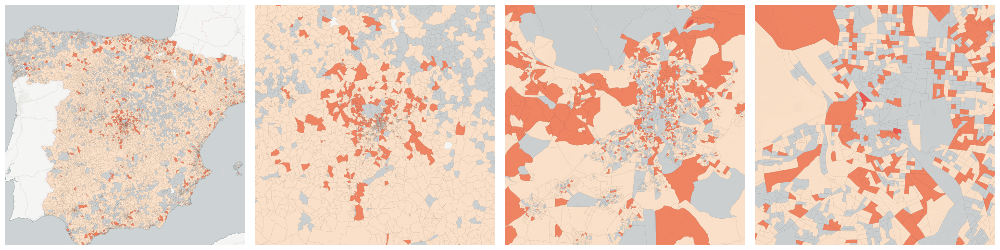
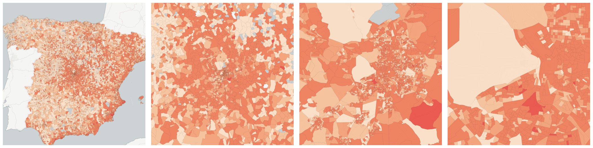
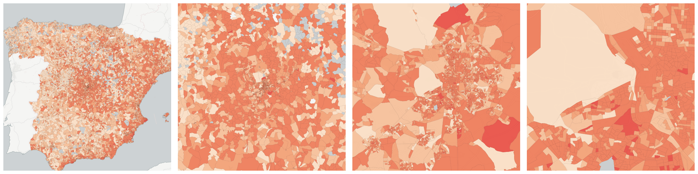
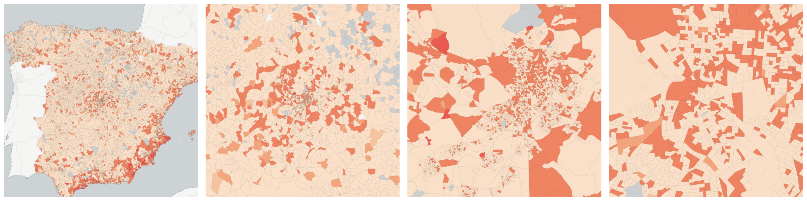
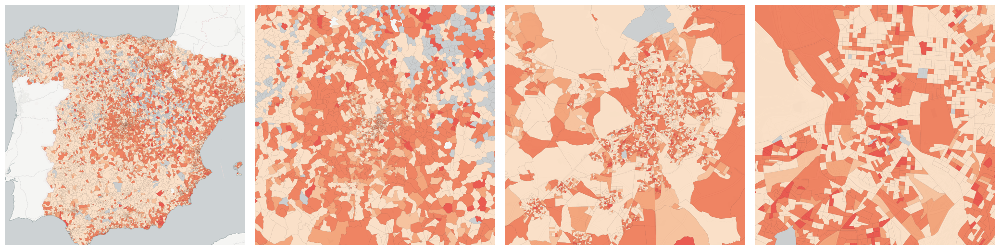

  
# Nationality

Population breakdowns by nationality and place of birth.

- [Persons who were born in Africa](#persons-who-were-born-in-africa)

    * [Persons with a foreign nationality who were born in Africa](#persons-with-a-foreign-nationality-who-were-born-in-africa)

    * [Persons with Spanish nationality who were born in Africa](#persons-with-spanish-nationality-who-were-born-in-africa)

- [Persons who were born in Asia](#persons-who-were-born-in-asia)

    * [Persons with a foreign nationality who were born in Asia](#persons-with-a-foreign-nationality-who-were-born-in-asia)

    * [Persons with Spanish nationality who were born in Asia](#persons-with-spanish-nationality-who-were-born-in-asia)

- [Persons who were born in Central America, South America or the Caribbean](#persons-who-were-born-in-central-america-south-america-or-the-caribbean)

    * [Persons with a foreign nationality who were born in Central America, South America or the Caribbean](#persons-with-a-foreign-nationality-who-were-born-in-central-america-south-america-or-the-caribbean)

    * [Persons with Spanish nationality who were born in Central America, South America or the Caribbean](#persons-with-spanish-nationality-who-were-born-in-central-america-south-america-or-the-caribbean)

- [Persons who were born in North America](#persons-who-were-born-in-north-america)

    * [Persons with a foreign nationality who were born in North America](#persons-with-a-foreign-nationality-who-were-born-in-north-america)

    * [Persons with Spanish nationality who were born in North America](#persons-with-spanish-nationality-who-were-born-in-north-america)

- [Persons who were born in Oceania](#persons-who-were-born-in-oceania)

    * [Persons with a foreign nationality who were born in Oceania](#persons-with-a-foreign-nationality-who-were-born-in-oceania)

    * [Persons with Spanish nationality who were born in Oceania](#persons-with-spanish-nationality-who-were-born-in-oceania)

- [Persons who were born in Spain](#persons-who-were-born-in-spain)

    * [Persons with a foreign nationality who were born in Spain](#persons-with-a-foreign-nationality-who-were-born-in-spain)

    * [Persons with Spanish nationality who were born in Spain](#persons-with-spanish-nationality-who-were-born-in-spain)

- [Persons who were born in a European country which is not a member of the EU](#persons-who-were-born-in-a-european-country-which-is-not-a-member-of-the-eu)

    * [Persons with a foreign nationality who were born in a European country which is not a member of the EU](#persons-with-a-foreign-nationality-who-were-born-in-a-european-country-which-is-not-a-member-of-the-eu)

    * [Persons with Spanish nationality who were born in a European country which is not a member of the EU](#persons-with-spanish-nationality-who-were-born-in-a-european-country-which-is-not-a-member-of-the-eu)

- [Persons who were born in another EU member state](#persons-who-were-born-in-another-eu-member-state)

    * [Persons with a foreign nationality who were born in another EU member state](#persons-with-a-foreign-nationality-who-were-born-in-another-eu-member-state)

    * [Persons with Spanish nationality who were born in another EU member state](#persons-with-spanish-nationality-who-were-born-in-another-eu-member-state)

- [Persons with Spanish nationality](#persons-with-spanish-nationality)

    * [Females with Spanish nationality](#females-with-spanish-nationality)

    * [Males with Spanish nationality](#males-with-spanish-nationality)

    * [Persons with a foreign nationality without information regarding their educational level (under 16 years of age)](#persons-with-a-foreign-nationality-without-information-regarding-their-educational-level-under-16-years-of-age)

    * [Persons with Spanish nationality and between 16 (included) and 64 (included) years of age](#persons-with-spanish-nationality-and-between-16-included-and-64-included-years-of-age)

    * [Persons with Spanish nationality and illiterate](#persons-with-spanish-nationality-and-illiterate)

    * [Persons with Spanish nationality and over 64 years of age](#persons-with-spanish-nationality-and-over-64-years-of-age)

    * [Persons with Spanish nationality and under 16 years of age](#persons-with-spanish-nationality-and-under-16-years-of-age)

    * [Persons with Spanish nationality and with first level studies](#persons-with-spanish-nationality-and-with-first-level-studies)

    * [Persons with Spanish nationality and with second level studies](#persons-with-spanish-nationality-and-with-second-level-studies)

    * [Persons with Spanish nationality and with third level studies](#persons-with-spanish-nationality-and-with-third-level-studies)

    * [Persons with Spanish nationality and without studies](#persons-with-spanish-nationality-and-without-studies)

    * [Persons with Spanish nationality who were born in a European country which is not a member of the EU](#id1)

    * [Persons with Spanish nationality who were born in Africa](#id3)

    * [Persons with Spanish nationality who were born in another EU member state](#id5)

    * [Persons with Spanish nationality who were born in Asia](#id7)

    * [Persons with Spanish nationality who were born in Central America, South America or the Caribbean](#id9)

    * [Persons with Spanish nationality who were born in North America](#id11)

    * [Persons with Spanish nationality who were born in Oceania](#id13)

    * [Persons with Spanish nationality who were born in Spain](#id15)

    * [Persons with Spanish nationality without information regarding their educational level (under 16 years of age)](#persons-with-spanish-nationality-without-information-regarding-their-educational-level-under-16-years-of-age)

- [Persons with a foreign nationality](#persons-with-a-foreign-nationality)

    * [Females with a foreign nationality](#females-with-a-foreign-nationality)

    * [Males with a foreign nationality](#males-with-a-foreign-nationality)

    * [Persons with a foreign nationality and between 16 (included) and 64 (included) years of age](#persons-with-a-foreign-nationality-and-between-16-included-and-64-included-years-of-age)

    * [Persons with a foreign nationality and illiterate](#persons-with-a-foreign-nationality-and-illiterate)

    * [Persons with a foreign nationality and over 64 years of age](#persons-with-a-foreign-nationality-and-over-64-years-of-age)

    * [Persons with a foreign nationality and under 16 years of age](#persons-with-a-foreign-nationality-and-under-16-years-of-age)

    * [Persons with a foreign nationality and with first level studies](#persons-with-a-foreign-nationality-and-with-first-level-studies)

    * [Persons with a foreign nationality and with second level studies](#persons-with-a-foreign-nationality-and-with-second-level-studies)

    * [Persons with a foreign nationality and with third level studies](#persons-with-a-foreign-nationality-and-with-third-level-studies)

    * [Persons with a foreign nationality and without studies](#persons-with-a-foreign-nationality-and-without-studies)

    * [Persons with a foreign nationality who were born in a European country which is not a member of the EU](#id17)

    * [Persons with a foreign nationality who were born in Africa](#id19)

    * [Persons with a foreign nationality who were born in another EU member state](#id21)

    * [Persons with a foreign nationality who were born in Asia](#id23)

    * [Persons with a foreign nationality who were born in Central America, South America or the Caribbean](#id25)

    * [Persons with a foreign nationality who were born in North America](#id27)

    * [Persons with a foreign nationality who were born in Oceania](#id29)

    * [Persons with a foreign nationality who were born in Spain](#id31)

## Persons who were born in Africa

Measure &quot;Persons who were born in Africa&quot;  density per sq. kilometer  for one point:

    UPDATE {table_name}
      SET {new_numeric_column} =
        OBS_GetMeasure(
          CDB_LatLng(40.39, -3.7),
          'es.ine.t4_4'
        );

Measure &quot;Persons who were born in Africa&quot; within an area:

    UPDATE {table_name}
      SET {new_numeric_column} =
        OBS_GetMeasure(
          ST_Buffer(CDB_LatLng(40.39, -3.7), 0.01),
          'es.ine.t4_4'
        );

Measure &quot;Persons who were born in Africa&quot; percent of &quot;Total population&quot; at one point:

    UPDATE {table_name}
      SET {new_numeric_column} =
        OBS_GetMeasure(
          CDB_LatLng(40.39, -3.7),
          'es.ine.t4_4',
          'denominator'
        );

Measure &quot;Persons who were born in Africa&quot; percent of &quot;Total population&quot; within an area:

    UPDATE {table_name}
      SET {new_numeric_column} =
        OBS_GetMeasure(
          ST_Buffer(CDB_LatLng(40.39, -3.7), 0.01),
          'es.ine.t4_4',
          'denominator'
        );

* denominator: [Total population](../age_gender/#es-ine-t1-1)

Subcolumns of Persons who were born in Africa

- [Persons with a foreign nationality who were born in Africa](#persons-with-a-foreign-nationality-who-were-born-in-africa)

- [Persons with Spanish nationality who were born in Africa](#persons-with-spanish-nationality-who-were-born-in-africa)

### Persons with a foreign nationality who were born in Africa

Measure &quot;Persons with a foreign nationality who were born in Africa&quot;  density per sq. kilometer  for one point:

    UPDATE {table_name}
      SET {new_numeric_column} =
        OBS_GetMeasure(
          CDB_LatLng(40.39, -3.7),
          'es.ine.t5_8'
        );

Measure &quot;Persons with a foreign nationality who were born in Africa&quot; within an area:

    UPDATE {table_name}
      SET {new_numeric_column} =
        OBS_GetMeasure(
          ST_Buffer(CDB_LatLng(40.39, -3.7), 0.01),
          'es.ine.t5_8'
        );

Measure &quot;Persons with a foreign nationality who were born in Africa&quot; percent of &quot;Persons who were born in Africa&quot; at one point:

    UPDATE {table_name}
      SET {new_numeric_column} =
        OBS_GetMeasure(
          CDB_LatLng(40.39, -3.7),
          'es.ine.t5_8',
          'denominator'
        );

Measure &quot;Persons with a foreign nationality who were born in Africa&quot; percent of &quot;Persons who were born in Africa&quot; within an area:

    UPDATE {table_name}
      SET {new_numeric_column} =
        OBS_GetMeasure(
          ST_Buffer(CDB_LatLng(40.39, -3.7), 0.01),
          'es.ine.t5_8',
          'denominator'
        );

* denominator: [Persons who were born in Africa](#es-ine-t4-4)

* denominator: [Persons with a foreign nationality](#es-ine-t6-2)

### Persons with Spanish nationality who were born in Africa

Measure &quot;Persons with Spanish nationality who were born in Africa&quot;  density per sq. kilometer  for one point:

    UPDATE {table_name}
      SET {new_numeric_column} =
        OBS_GetMeasure(
          CDB_LatLng(40.39, -3.7),
          'es.ine.t5_7'
        );

Measure &quot;Persons with Spanish nationality who were born in Africa&quot; within an area:

    UPDATE {table_name}
      SET {new_numeric_column} =
        OBS_GetMeasure(
          ST_Buffer(CDB_LatLng(40.39, -3.7), 0.01),
          'es.ine.t5_7'
        );

Measure &quot;Persons with Spanish nationality who were born in Africa&quot; percent of &quot;Persons who were born in Africa&quot; at one point:

    UPDATE {table_name}
      SET {new_numeric_column} =
        OBS_GetMeasure(
          CDB_LatLng(40.39, -3.7),
          'es.ine.t5_7',
          'denominator'
        );

Measure &quot;Persons with Spanish nationality who were born in Africa&quot; percent of &quot;Persons who were born in Africa&quot; within an area:

    UPDATE {table_name}
      SET {new_numeric_column} =
        OBS_GetMeasure(
          ST_Buffer(CDB_LatLng(40.39, -3.7), 0.01),
          'es.ine.t5_7',
          'denominator'
        );

* denominator: [Persons who were born in Africa](#es-ine-t4-4)

* denominator: [Persons with Spanish nationality](#es-ine-t6-1)

## Persons who were born in Asia

Measure &quot;Persons who were born in Asia&quot;  density per sq. kilometer  for one point:

    UPDATE {table_name}
      SET {new_numeric_column} =
        OBS_GetMeasure(
          CDB_LatLng(40.39, -3.7),
          'es.ine.t4_7'
        );

Measure &quot;Persons who were born in Asia&quot; within an area:

    UPDATE {table_name}
      SET {new_numeric_column} =
        OBS_GetMeasure(
          ST_Buffer(CDB_LatLng(40.39, -3.7), 0.01),
          'es.ine.t4_7'
        );

Measure &quot;Persons who were born in Asia&quot; percent of &quot;Total population&quot; at one point:

    UPDATE {table_name}
      SET {new_numeric_column} =
        OBS_GetMeasure(
          CDB_LatLng(40.39, -3.7),
          'es.ine.t4_7',
          'denominator'
        );

Measure &quot;Persons who were born in Asia&quot; percent of &quot;Total population&quot; within an area:

    UPDATE {table_name}
      SET {new_numeric_column} =
        OBS_GetMeasure(
          ST_Buffer(CDB_LatLng(40.39, -3.7), 0.01),
          'es.ine.t4_7',
          'denominator'
        );

* denominator: [Total population](../age_gender/#es-ine-t1-1)

Subcolumns of Persons who were born in Asia

- [Persons with a foreign nationality who were born in Asia](#persons-with-a-foreign-nationality-who-were-born-in-asia)

- [Persons with Spanish nationality who were born in Asia](#persons-with-spanish-nationality-who-were-born-in-asia)

### Persons with a foreign nationality who were born in Asia

Measure &quot;Persons with a foreign nationality who were born in Asia&quot;  density per sq. kilometer  for one point:

    UPDATE {table_name}
      SET {new_numeric_column} =
        OBS_GetMeasure(
          CDB_LatLng(40.39, -3.7),
          'es.ine.t5_14'
        );

Measure &quot;Persons with a foreign nationality who were born in Asia&quot; within an area:

    UPDATE {table_name}
      SET {new_numeric_column} =
        OBS_GetMeasure(
          ST_Buffer(CDB_LatLng(40.39, -3.7), 0.01),
          'es.ine.t5_14'
        );

Measure &quot;Persons with a foreign nationality who were born in Asia&quot; percent of &quot;Persons who were born in Asia&quot; at one point:

    UPDATE {table_name}
      SET {new_numeric_column} =
        OBS_GetMeasure(
          CDB_LatLng(40.39, -3.7),
          'es.ine.t5_14',
          'denominator'
        );

Measure &quot;Persons with a foreign nationality who were born in Asia&quot; percent of &quot;Persons who were born in Asia&quot; within an area:

    UPDATE {table_name}
      SET {new_numeric_column} =
        OBS_GetMeasure(
          ST_Buffer(CDB_LatLng(40.39, -3.7), 0.01),
          'es.ine.t5_14',
          'denominator'
        );

* denominator: [Persons who were born in Asia](#es-ine-t4-7)

* denominator: [Persons with a foreign nationality](#es-ine-t6-2)

### Persons with Spanish nationality who were born in Asia

Measure &quot;Persons with Spanish nationality who were born in Asia&quot;  density per sq. kilometer  for one point:

    UPDATE {table_name}
      SET {new_numeric_column} =
        OBS_GetMeasure(
          CDB_LatLng(40.39, -3.7),
          'es.ine.t5_13'
        );

Measure &quot;Persons with Spanish nationality who were born in Asia&quot; within an area:

    UPDATE {table_name}
      SET {new_numeric_column} =
        OBS_GetMeasure(
          ST_Buffer(CDB_LatLng(40.39, -3.7), 0.01),
          'es.ine.t5_13'
        );

Measure &quot;Persons with Spanish nationality who were born in Asia&quot; percent of &quot;Persons who were born in Asia&quot; at one point:

    UPDATE {table_name}
      SET {new_numeric_column} =
        OBS_GetMeasure(
          CDB_LatLng(40.39, -3.7),
          'es.ine.t5_13',
          'denominator'
        );

Measure &quot;Persons with Spanish nationality who were born in Asia&quot; percent of &quot;Persons who were born in Asia&quot; within an area:

    UPDATE {table_name}
      SET {new_numeric_column} =
        OBS_GetMeasure(
          ST_Buffer(CDB_LatLng(40.39, -3.7), 0.01),
          'es.ine.t5_13',
          'denominator'
        );

* denominator: [Persons who were born in Asia](#es-ine-t4-7)

* denominator: [Persons with Spanish nationality](#es-ine-t6-1)

## Persons who were born in Central America, South America or the Caribbean

Measure &quot;Persons who were born in Central America, South America or the Caribbean &quot;  density per sq. kilometer  for one point:

    UPDATE {table_name}
      SET {new_numeric_column} =
        OBS_GetMeasure(
          CDB_LatLng(40.39, -3.7),
          'es.ine.t4_5'
        );

Measure &quot;Persons who were born in Central America, South America or the Caribbean &quot; within an area:

    UPDATE {table_name}
      SET {new_numeric_column} =
        OBS_GetMeasure(
          ST_Buffer(CDB_LatLng(40.39, -3.7), 0.01),
          'es.ine.t4_5'
        );

Measure &quot;Persons who were born in Central America, South America or the Caribbean &quot; percent of &quot;Total population&quot; at one point:

    UPDATE {table_name}
      SET {new_numeric_column} =
        OBS_GetMeasure(
          CDB_LatLng(40.39, -3.7),
          'es.ine.t4_5',
          'denominator'
        );

Measure &quot;Persons who were born in Central America, South America or the Caribbean &quot; percent of &quot;Total population&quot; within an area:

    UPDATE {table_name}
      SET {new_numeric_column} =
        OBS_GetMeasure(
          ST_Buffer(CDB_LatLng(40.39, -3.7), 0.01),
          'es.ine.t4_5',
          'denominator'
        );

* denominator: [Total population](../age_gender/#es-ine-t1-1)

Subcolumns of Persons who were born in Central America, South America or the Caribbean

- [Persons with a foreign nationality who were born in Central America, South America or the Caribbean](#persons-with-a-foreign-nationality-who-were-born-in-central-america-south-america-or-the-caribbean)

- [Persons with Spanish nationality who were born in Central America, South America or the Caribbean](#persons-with-spanish-nationality-who-were-born-in-central-america-south-america-or-the-caribbean)

### Persons with a foreign nationality who were born in Central America, South America or the Caribbean

Measure &quot;Persons with a foreign nationality who were born in Central America, South America or the Caribbean &quot;  density per sq. kilometer  for one point:

    UPDATE {table_name}
      SET {new_numeric_column} =
        OBS_GetMeasure(
          CDB_LatLng(40.39, -3.7),
          'es.ine.t5_10'
        );

Measure &quot;Persons with a foreign nationality who were born in Central America, South America or the Caribbean &quot; within an area:

    UPDATE {table_name}
      SET {new_numeric_column} =
        OBS_GetMeasure(
          ST_Buffer(CDB_LatLng(40.39, -3.7), 0.01),
          'es.ine.t5_10'
        );

Measure &quot;Persons with a foreign nationality who were born in Central America, South America or the Caribbean &quot; percent of &quot;Persons who were born in Central America, South America or the Caribbean &quot; at one point:

    UPDATE {table_name}
      SET {new_numeric_column} =
        OBS_GetMeasure(
          CDB_LatLng(40.39, -3.7),
          'es.ine.t5_10',
          'denominator'
        );

Measure &quot;Persons with a foreign nationality who were born in Central America, South America or the Caribbean &quot; percent of &quot;Persons who were born in Central America, South America or the Caribbean &quot; within an area:

    UPDATE {table_name}
      SET {new_numeric_column} =
        OBS_GetMeasure(
          ST_Buffer(CDB_LatLng(40.39, -3.7), 0.01),
          'es.ine.t5_10',
          'denominator'
        );

* denominator: [Persons who were born in Central America, South America or the Caribbean](#es-ine-t4-5)

* denominator: [Persons with a foreign nationality](#es-ine-t6-2)

### Persons with Spanish nationality who were born in Central America, South America or the Caribbean

Measure &quot;Persons with Spanish nationality who were born in Central America, South America or the Caribbean &quot;  density per sq. kilometer  for one point:

    UPDATE {table_name}
      SET {new_numeric_column} =
        OBS_GetMeasure(
          CDB_LatLng(40.39, -3.7),
          'es.ine.t5_9'
        );

Measure &quot;Persons with Spanish nationality who were born in Central America, South America or the Caribbean &quot; within an area:

    UPDATE {table_name}
      SET {new_numeric_column} =
        OBS_GetMeasure(
          ST_Buffer(CDB_LatLng(40.39, -3.7), 0.01),
          'es.ine.t5_9'
        );

Measure &quot;Persons with Spanish nationality who were born in Central America, South America or the Caribbean &quot; percent of &quot;Persons who were born in Central America, South America or the Caribbean &quot; at one point:

    UPDATE {table_name}
      SET {new_numeric_column} =
        OBS_GetMeasure(
          CDB_LatLng(40.39, -3.7),
          'es.ine.t5_9',
          'denominator'
        );

Measure &quot;Persons with Spanish nationality who were born in Central America, South America or the Caribbean &quot; percent of &quot;Persons who were born in Central America, South America or the Caribbean &quot; within an area:

    UPDATE {table_name}
      SET {new_numeric_column} =
        OBS_GetMeasure(
          ST_Buffer(CDB_LatLng(40.39, -3.7), 0.01),
          'es.ine.t5_9',
          'denominator'
        );

* denominator: [Persons who were born in Central America, South America or the Caribbean](#es-ine-t4-5)

* denominator: [Persons with Spanish nationality](#es-ine-t6-1)

## Persons who were born in North America

Measure &quot;Persons who were born in North America&quot;  density per sq. kilometer  for one point:

    UPDATE {table_name}
      SET {new_numeric_column} =
        OBS_GetMeasure(
          CDB_LatLng(40.39, -3.7),
          'es.ine.t4_6'
        );

Measure &quot;Persons who were born in North America&quot; within an area:

    UPDATE {table_name}
      SET {new_numeric_column} =
        OBS_GetMeasure(
          ST_Buffer(CDB_LatLng(40.39, -3.7), 0.01),
          'es.ine.t4_6'
        );

Measure &quot;Persons who were born in North America&quot; percent of &quot;Total population&quot; at one point:

    UPDATE {table_name}
      SET {new_numeric_column} =
        OBS_GetMeasure(
          CDB_LatLng(40.39, -3.7),
          'es.ine.t4_6',
          'denominator'
        );

Measure &quot;Persons who were born in North America&quot; percent of &quot;Total population&quot; within an area:

    UPDATE {table_name}
      SET {new_numeric_column} =
        OBS_GetMeasure(
          ST_Buffer(CDB_LatLng(40.39, -3.7), 0.01),
          'es.ine.t4_6',
          'denominator'
        );

* denominator: [Total population](../age_gender/#es-ine-t1-1)

Subcolumns of Persons who were born in North America

- [Persons with a foreign nationality who were born in North America](#persons-with-a-foreign-nationality-who-were-born-in-north-america)

- [Persons with Spanish nationality who were born in North America](#persons-with-spanish-nationality-who-were-born-in-north-america)

### Persons with a foreign nationality who were born in North America

Measure &quot;Persons with a foreign nationality who were born in North America&quot;  density per sq. kilometer  for one point:

    UPDATE {table_name}
      SET {new_numeric_column} =
        OBS_GetMeasure(
          CDB_LatLng(40.39, -3.7),
          'es.ine.t5_12'
        );

Measure &quot;Persons with a foreign nationality who were born in North America&quot; within an area:

    UPDATE {table_name}
      SET {new_numeric_column} =
        OBS_GetMeasure(
          ST_Buffer(CDB_LatLng(40.39, -3.7), 0.01),
          'es.ine.t5_12'
        );

Measure &quot;Persons with a foreign nationality who were born in North America&quot; percent of &quot;Persons who were born in North America&quot; at one point:

    UPDATE {table_name}
      SET {new_numeric_column} =
        OBS_GetMeasure(
          CDB_LatLng(40.39, -3.7),
          'es.ine.t5_12',
          'denominator'
        );

Measure &quot;Persons with a foreign nationality who were born in North America&quot; percent of &quot;Persons who were born in North America&quot; within an area:

    UPDATE {table_name}
      SET {new_numeric_column} =
        OBS_GetMeasure(
          ST_Buffer(CDB_LatLng(40.39, -3.7), 0.01),
          'es.ine.t5_12',
          'denominator'
        );

* denominator: [Persons who were born in North America](#es-ine-t4-6)

* denominator: [Persons with a foreign nationality](#es-ine-t6-2)

### Persons with Spanish nationality who were born in North America

Measure &quot;Persons with Spanish nationality who were born in North America&quot;  density per sq. kilometer  for one point:

    UPDATE {table_name}
      SET {new_numeric_column} =
        OBS_GetMeasure(
          CDB_LatLng(40.39, -3.7),
          'es.ine.t5_11'
        );

Measure &quot;Persons with Spanish nationality who were born in North America&quot; within an area:

    UPDATE {table_name}
      SET {new_numeric_column} =
        OBS_GetMeasure(
          ST_Buffer(CDB_LatLng(40.39, -3.7), 0.01),
          'es.ine.t5_11'
        );

Measure &quot;Persons with Spanish nationality who were born in North America&quot; percent of &quot;Persons who were born in North America&quot; at one point:

    UPDATE {table_name}
      SET {new_numeric_column} =
        OBS_GetMeasure(
          CDB_LatLng(40.39, -3.7),
          'es.ine.t5_11',
          'denominator'
        );

Measure &quot;Persons with Spanish nationality who were born in North America&quot; percent of &quot;Persons who were born in North America&quot; within an area:

    UPDATE {table_name}
      SET {new_numeric_column} =
        OBS_GetMeasure(
          ST_Buffer(CDB_LatLng(40.39, -3.7), 0.01),
          'es.ine.t5_11',
          'denominator'
        );

* denominator: [Persons who were born in North America](#es-ine-t4-6)

* denominator: [Persons with Spanish nationality](#es-ine-t6-1)

## Persons who were born in Oceania

Measure &quot;Persons who were born in Oceania&quot;  density per sq. kilometer  for one point:

    UPDATE {table_name}
      SET {new_numeric_column} =
        OBS_GetMeasure(
          CDB_LatLng(40.39, -3.7),
          'es.ine.t4_8'
        );

Measure &quot;Persons who were born in Oceania&quot; within an area:

    UPDATE {table_name}
      SET {new_numeric_column} =
        OBS_GetMeasure(
          ST_Buffer(CDB_LatLng(40.39, -3.7), 0.01),
          'es.ine.t4_8'
        );

Measure &quot;Persons who were born in Oceania&quot; percent of &quot;Total population&quot; at one point:

    UPDATE {table_name}
      SET {new_numeric_column} =
        OBS_GetMeasure(
          CDB_LatLng(40.39, -3.7),
          'es.ine.t4_8',
          'denominator'
        );

Measure &quot;Persons who were born in Oceania&quot; percent of &quot;Total population&quot; within an area:

    UPDATE {table_name}
      SET {new_numeric_column} =
        OBS_GetMeasure(
          ST_Buffer(CDB_LatLng(40.39, -3.7), 0.01),
          'es.ine.t4_8',
          'denominator'
        );

* denominator: [Total population](../age_gender/#es-ine-t1-1)

Subcolumns of Persons who were born in Oceania

- [Persons with a foreign nationality who were born in Oceania](#persons-with-a-foreign-nationality-who-were-born-in-oceania)

- [Persons with Spanish nationality who were born in Oceania](#persons-with-spanish-nationality-who-were-born-in-oceania)

### Persons with a foreign nationality who were born in Oceania

Measure &quot;Persons with a foreign nationality who were born in Oceania&quot;  density per sq. kilometer  for one point:

    UPDATE {table_name}
      SET {new_numeric_column} =
        OBS_GetMeasure(
          CDB_LatLng(40.39, -3.7),
          'es.ine.t5_16'
        );

Measure &quot;Persons with a foreign nationality who were born in Oceania&quot; within an area:

    UPDATE {table_name}
      SET {new_numeric_column} =
        OBS_GetMeasure(
          ST_Buffer(CDB_LatLng(40.39, -3.7), 0.01),
          'es.ine.t5_16'
        );

Measure &quot;Persons with a foreign nationality who were born in Oceania&quot; percent of &quot;Persons who were born in Oceania&quot; at one point:

    UPDATE {table_name}
      SET {new_numeric_column} =
        OBS_GetMeasure(
          CDB_LatLng(40.39, -3.7),
          'es.ine.t5_16',
          'denominator'
        );

Measure &quot;Persons with a foreign nationality who were born in Oceania&quot; percent of &quot;Persons who were born in Oceania&quot; within an area:

    UPDATE {table_name}
      SET {new_numeric_column} =
        OBS_GetMeasure(
          ST_Buffer(CDB_LatLng(40.39, -3.7), 0.01),
          'es.ine.t5_16',
          'denominator'
        );

* denominator: [Persons who were born in Oceania](#es-ine-t4-8)

* denominator: [Persons with a foreign nationality](#es-ine-t6-2)

### Persons with Spanish nationality who were born in Oceania

Measure &quot;Persons with Spanish nationality who were born in Oceania&quot;  density per sq. kilometer  for one point:

    UPDATE {table_name}
      SET {new_numeric_column} =
        OBS_GetMeasure(
          CDB_LatLng(40.39, -3.7),
          'es.ine.t5_15'
        );

Measure &quot;Persons with Spanish nationality who were born in Oceania&quot; within an area:

    UPDATE {table_name}
      SET {new_numeric_column} =
        OBS_GetMeasure(
          ST_Buffer(CDB_LatLng(40.39, -3.7), 0.01),
          'es.ine.t5_15'
        );

Measure &quot;Persons with Spanish nationality who were born in Oceania&quot; percent of &quot;Persons who were born in Oceania&quot; at one point:

    UPDATE {table_name}
      SET {new_numeric_column} =
        OBS_GetMeasure(
          CDB_LatLng(40.39, -3.7),
          'es.ine.t5_15',
          'denominator'
        );

Measure &quot;Persons with Spanish nationality who were born in Oceania&quot; percent of &quot;Persons who were born in Oceania&quot; within an area:

    UPDATE {table_name}
      SET {new_numeric_column} =
        OBS_GetMeasure(
          ST_Buffer(CDB_LatLng(40.39, -3.7), 0.01),
          'es.ine.t5_15',
          'denominator'
        );

* denominator: [Persons who were born in Oceania](#es-ine-t4-8)

* denominator: [Persons with Spanish nationality](#es-ine-t6-1)

## Persons who were born in Spain

Measure &quot;Persons who were born in Spain&quot;  density per sq. kilometer  for one point:

    UPDATE {table_name}
      SET {new_numeric_column} =
        OBS_GetMeasure(
          CDB_LatLng(40.39, -3.7),
          'es.ine.t4_1'
        );

Measure &quot;Persons who were born in Spain&quot; within an area:

    UPDATE {table_name}
      SET {new_numeric_column} =
        OBS_GetMeasure(
          ST_Buffer(CDB_LatLng(40.39, -3.7), 0.01),
          'es.ine.t4_1'
        );

Measure &quot;Persons who were born in Spain&quot; percent of &quot;Total population&quot; at one point:

    UPDATE {table_name}
      SET {new_numeric_column} =
        OBS_GetMeasure(
          CDB_LatLng(40.39, -3.7),
          'es.ine.t4_1',
          'denominator'
        );

Measure &quot;Persons who were born in Spain&quot; percent of &quot;Total population&quot; within an area:

    UPDATE {table_name}
      SET {new_numeric_column} =
        OBS_GetMeasure(
          ST_Buffer(CDB_LatLng(40.39, -3.7), 0.01),
          'es.ine.t4_1',
          'denominator'
        );

* denominator: [Total population](../age_gender/#es-ine-t1-1)

Subcolumns of Persons who were born in Spain

- [Persons with a foreign nationality who were born in Spain](#persons-with-a-foreign-nationality-who-were-born-in-spain)

- [Persons with Spanish nationality who were born in Spain](#persons-with-spanish-nationality-who-were-born-in-spain)

### Persons with a foreign nationality who were born in Spain

Measure &quot;Persons with a foreign nationality who were born in Spain&quot;  density per sq. kilometer  for one point:

    UPDATE {table_name}
      SET {new_numeric_column} =
        OBS_GetMeasure(
          CDB_LatLng(40.39, -3.7),
          'es.ine.t5_2'
        );

Measure &quot;Persons with a foreign nationality who were born in Spain&quot; within an area:

    UPDATE {table_name}
      SET {new_numeric_column} =
        OBS_GetMeasure(
          ST_Buffer(CDB_LatLng(40.39, -3.7), 0.01),
          'es.ine.t5_2'
        );

Measure &quot;Persons with a foreign nationality who were born in Spain&quot; percent of &quot;Persons who were born in Spain&quot; at one point:

    UPDATE {table_name}
      SET {new_numeric_column} =
        OBS_GetMeasure(
          CDB_LatLng(40.39, -3.7),
          'es.ine.t5_2',
          'denominator'
        );

Measure &quot;Persons with a foreign nationality who were born in Spain&quot; percent of &quot;Persons who were born in Spain&quot; within an area:

    UPDATE {table_name}
      SET {new_numeric_column} =
        OBS_GetMeasure(
          ST_Buffer(CDB_LatLng(40.39, -3.7), 0.01),
          'es.ine.t5_2',
          'denominator'
        );

* denominator: [Persons who were born in Spain](#es-ine-t4-1)

* denominator: [Persons with a foreign nationality](#es-ine-t6-2)

### Persons with Spanish nationality who were born in Spain

Measure &quot;Persons with Spanish nationality who were born in Spain&quot;  density per sq. kilometer  for one point:

    UPDATE {table_name}
      SET {new_numeric_column} =
        OBS_GetMeasure(
          CDB_LatLng(40.39, -3.7),
          'es.ine.t5_1'
        );

Measure &quot;Persons with Spanish nationality who were born in Spain&quot; within an area:

    UPDATE {table_name}
      SET {new_numeric_column} =
        OBS_GetMeasure(
          ST_Buffer(CDB_LatLng(40.39, -3.7), 0.01),
          'es.ine.t5_1'
        );

Measure &quot;Persons with Spanish nationality who were born in Spain&quot; percent of &quot;Persons who were born in Spain&quot; at one point:

    UPDATE {table_name}
      SET {new_numeric_column} =
        OBS_GetMeasure(
          CDB_LatLng(40.39, -3.7),
          'es.ine.t5_1',
          'denominator'
        );

Measure &quot;Persons with Spanish nationality who were born in Spain&quot; percent of &quot;Persons who were born in Spain&quot; within an area:

    UPDATE {table_name}
      SET {new_numeric_column} =
        OBS_GetMeasure(
          ST_Buffer(CDB_LatLng(40.39, -3.7), 0.01),
          'es.ine.t5_1',
          'denominator'
        );

* denominator: [Persons who were born in Spain](#es-ine-t4-1)

* denominator: [Persons with Spanish nationality](#es-ine-t6-1)

## Persons who were born in a European country which is not a member of the EU

Measure &quot;Persons who were born in a European country which is not a member of the EU&quot;  density per sq. kilometer  for one point:

    UPDATE {table_name}
      SET {new_numeric_column} =
        OBS_GetMeasure(
          CDB_LatLng(40.39, -3.7),
          'es.ine.t4_3'
        );

Measure &quot;Persons who were born in a European country which is not a member of the EU&quot; within an area:

    UPDATE {table_name}
      SET {new_numeric_column} =
        OBS_GetMeasure(
          ST_Buffer(CDB_LatLng(40.39, -3.7), 0.01),
          'es.ine.t4_3'
        );

Measure &quot;Persons who were born in a European country which is not a member of the EU&quot; percent of &quot;Total population&quot; at one point:

    UPDATE {table_name}
      SET {new_numeric_column} =
        OBS_GetMeasure(
          CDB_LatLng(40.39, -3.7),
          'es.ine.t4_3',
          'denominator'
        );

Measure &quot;Persons who were born in a European country which is not a member of the EU&quot; percent of &quot;Total population&quot; within an area:

    UPDATE {table_name}
      SET {new_numeric_column} =
        OBS_GetMeasure(
          ST_Buffer(CDB_LatLng(40.39, -3.7), 0.01),
          'es.ine.t4_3',
          'denominator'
        );

* denominator: [Total population](../age_gender/#es-ine-t1-1)

Subcolumns of Persons who were born in a European country which is not a member of the EU

- [Persons with a foreign nationality who were born in a European country which is not a member of the EU](#persons-with-a-foreign-nationality-who-were-born-in-a-european-country-which-is-not-a-member-of-the-eu)

- [Persons with Spanish nationality who were born in a European country which is not a member of the EU](#persons-with-spanish-nationality-who-were-born-in-a-european-country-which-is-not-a-member-of-the-eu)

### Persons with a foreign nationality who were born in a European country which is not a member of the EU

Measure &quot;Persons with a foreign nationality who were born in a European country which is not a member of the EU&quot;  density per sq. kilometer  for one point:

    UPDATE {table_name}
      SET {new_numeric_column} =
        OBS_GetMeasure(
          CDB_LatLng(40.39, -3.7),
          'es.ine.t5_6'
        );

Measure &quot;Persons with a foreign nationality who were born in a European country which is not a member of the EU&quot; within an area:

    UPDATE {table_name}
      SET {new_numeric_column} =
        OBS_GetMeasure(
          ST_Buffer(CDB_LatLng(40.39, -3.7), 0.01),
          'es.ine.t5_6'
        );

Measure &quot;Persons with a foreign nationality who were born in a European country which is not a member of the EU&quot; percent of &quot;Persons with a foreign nationality&quot; at one point:

    UPDATE {table_name}
      SET {new_numeric_column} =
        OBS_GetMeasure(
          CDB_LatLng(40.39, -3.7),
          'es.ine.t5_6',
          'denominator'
        );

Measure &quot;Persons with a foreign nationality who were born in a European country which is not a member of the EU&quot; percent of &quot;Persons with a foreign nationality&quot; within an area:

    UPDATE {table_name}
      SET {new_numeric_column} =
        OBS_GetMeasure(
          ST_Buffer(CDB_LatLng(40.39, -3.7), 0.01),
          'es.ine.t5_6',
          'denominator'
        );

* denominator: [Persons with a foreign nationality](#es-ine-t6-2)

* denominator: [Persons who were born in a European country which is not a member of the EU](#es-ine-t4-3)

### Persons with Spanish nationality who were born in a European country which is not a member of the EU

Measure &quot;Persons with Spanish nationality who were born in a European country which is not a member of the EU&quot;  density per sq. kilometer  for one point:

    UPDATE {table_name}
      SET {new_numeric_column} =
        OBS_GetMeasure(
          CDB_LatLng(40.39, -3.7),
          'es.ine.t5_5'
        );

Measure &quot;Persons with Spanish nationality who were born in a European country which is not a member of the EU&quot; within an area:

    UPDATE {table_name}
      SET {new_numeric_column} =
        OBS_GetMeasure(
          ST_Buffer(CDB_LatLng(40.39, -3.7), 0.01),
          'es.ine.t5_5'
        );

Measure &quot;Persons with Spanish nationality who were born in a European country which is not a member of the EU&quot; percent of &quot;Persons who were born in a European country which is not a member of the EU&quot; at one point:

    UPDATE {table_name}
      SET {new_numeric_column} =
        OBS_GetMeasure(
          CDB_LatLng(40.39, -3.7),
          'es.ine.t5_5',
          'denominator'
        );

Measure &quot;Persons with Spanish nationality who were born in a European country which is not a member of the EU&quot; percent of &quot;Persons who were born in a European country which is not a member of the EU&quot; within an area:

    UPDATE {table_name}
      SET {new_numeric_column} =
        OBS_GetMeasure(
          ST_Buffer(CDB_LatLng(40.39, -3.7), 0.01),
          'es.ine.t5_5',
          'denominator'
        );

* denominator: [Persons who were born in a European country which is not a member of the EU](#es-ine-t4-3)

* denominator: [Persons with Spanish nationality](#es-ine-t6-1)

## Persons who were born in another EU member state

Measure &quot;Persons who were born in another EU member state&quot;  density per sq. kilometer  for one point:

    UPDATE {table_name}
      SET {new_numeric_column} =
        OBS_GetMeasure(
          CDB_LatLng(40.39, -3.7),
          'es.ine.t4_2'
        );

Measure &quot;Persons who were born in another EU member state&quot; within an area:

    UPDATE {table_name}
      SET {new_numeric_column} =
        OBS_GetMeasure(
          ST_Buffer(CDB_LatLng(40.39, -3.7), 0.01),
          'es.ine.t4_2'
        );

Measure &quot;Persons who were born in another EU member state&quot; percent of &quot;Total population&quot; at one point:

    UPDATE {table_name}
      SET {new_numeric_column} =
        OBS_GetMeasure(
          CDB_LatLng(40.39, -3.7),
          'es.ine.t4_2',
          'denominator'
        );

Measure &quot;Persons who were born in another EU member state&quot; percent of &quot;Total population&quot; within an area:

    UPDATE {table_name}
      SET {new_numeric_column} =
        OBS_GetMeasure(
          ST_Buffer(CDB_LatLng(40.39, -3.7), 0.01),
          'es.ine.t4_2',
          'denominator'
        );

* denominator: [Total population](../age_gender/#es-ine-t1-1)

Subcolumns of Persons who were born in another EU member state

- [Persons with a foreign nationality who were born in another EU member state](#persons-with-a-foreign-nationality-who-were-born-in-another-eu-member-state)

- [Persons with Spanish nationality who were born in another EU member state](#persons-with-spanish-nationality-who-were-born-in-another-eu-member-state)

### Persons with a foreign nationality who were born in another EU member state

Measure &quot;Persons with a foreign nationality who were born in another EU member state&quot;  density per sq. kilometer  for one point:

    UPDATE {table_name}
      SET {new_numeric_column} =
        OBS_GetMeasure(
          CDB_LatLng(40.39, -3.7),
          'es.ine.t5_4'
        );

Measure &quot;Persons with a foreign nationality who were born in another EU member state&quot; within an area:

    UPDATE {table_name}
      SET {new_numeric_column} =
        OBS_GetMeasure(
          ST_Buffer(CDB_LatLng(40.39, -3.7), 0.01),
          'es.ine.t5_4'
        );

Measure &quot;Persons with a foreign nationality who were born in another EU member state&quot; percent of &quot;Persons who were born in another EU member state&quot; at one point:

    UPDATE {table_name}
      SET {new_numeric_column} =
        OBS_GetMeasure(
          CDB_LatLng(40.39, -3.7),
          'es.ine.t5_4',
          'denominator'
        );

Measure &quot;Persons with a foreign nationality who were born in another EU member state&quot; percent of &quot;Persons who were born in another EU member state&quot; within an area:

    UPDATE {table_name}
      SET {new_numeric_column} =
        OBS_GetMeasure(
          ST_Buffer(CDB_LatLng(40.39, -3.7), 0.01),
          'es.ine.t5_4',
          'denominator'
        );

* denominator: [Persons who were born in another EU member state](#es-ine-t4-2)

* denominator: [Persons with a foreign nationality](#es-ine-t6-2)

### Persons with Spanish nationality who were born in another EU member state

Measure &quot;Persons with Spanish nationality who were born in another EU member state&quot;  density per sq. kilometer  for one point:

    UPDATE {table_name}
      SET {new_numeric_column} =
        OBS_GetMeasure(
          CDB_LatLng(40.39, -3.7),
          'es.ine.t5_3'
        );

Measure &quot;Persons with Spanish nationality who were born in another EU member state&quot; within an area:

    UPDATE {table_name}
      SET {new_numeric_column} =
        OBS_GetMeasure(
          ST_Buffer(CDB_LatLng(40.39, -3.7), 0.01),
          'es.ine.t5_3'
        );

Measure &quot;Persons with Spanish nationality who were born in another EU member state&quot; percent of &quot;Persons who were born in another EU member state&quot; at one point:

    UPDATE {table_name}
      SET {new_numeric_column} =
        OBS_GetMeasure(
          CDB_LatLng(40.39, -3.7),
          'es.ine.t5_3',
          'denominator'
        );

Measure &quot;Persons with Spanish nationality who were born in another EU member state&quot; percent of &quot;Persons who were born in another EU member state&quot; within an area:

    UPDATE {table_name}
      SET {new_numeric_column} =
        OBS_GetMeasure(
          ST_Buffer(CDB_LatLng(40.39, -3.7), 0.01),
          'es.ine.t5_3',
          'denominator'
        );

* denominator: [Persons who were born in another EU member state](#es-ine-t4-2)

* denominator: [Persons with Spanish nationality](#es-ine-t6-1)

## Persons with Spanish nationality

Measure &quot;Persons with Spanish nationality&quot;  density per sq. kilometer  for one point:

    UPDATE {table_name}
      SET {new_numeric_column} =
        OBS_GetMeasure(
          CDB_LatLng(40.39, -3.7),
          'es.ine.t6_1'
        );

Measure &quot;Persons with Spanish nationality&quot; within an area:

    UPDATE {table_name}
      SET {new_numeric_column} =
        OBS_GetMeasure(
          ST_Buffer(CDB_LatLng(40.39, -3.7), 0.01),
          'es.ine.t6_1'
        );

Measure &quot;Persons with Spanish nationality&quot; percent of &quot;Total population&quot; at one point:

    UPDATE {table_name}
      SET {new_numeric_column} =
        OBS_GetMeasure(
          CDB_LatLng(40.39, -3.7),
          'es.ine.t6_1',
          'denominator'
        );

Measure &quot;Persons with Spanish nationality&quot; percent of &quot;Total population&quot; within an area:

    UPDATE {table_name}
      SET {new_numeric_column} =
        OBS_GetMeasure(
          ST_Buffer(CDB_LatLng(40.39, -3.7), 0.01),
          'es.ine.t6_1',
          'denominator'
        );

* denominator: [Total population](../age_gender/#es-ine-t1-1)

Subcolumns of Persons with Spanish nationality

- [Females with Spanish nationality](#females-with-spanish-nationality)

- [Males with Spanish nationality](#males-with-spanish-nationality)

- [Persons with a foreign nationality without information regarding their educational level (under 16 years of age)](#persons-with-a-foreign-nationality-without-information-regarding-their-educational-level-under-16-years-of-age)

- [Persons with Spanish nationality and between 16 (included) and 64 (included) years of age](#persons-with-spanish-nationality-and-between-16-included-and-64-included-years-of-age)

- [Persons with Spanish nationality and illiterate](#persons-with-spanish-nationality-and-illiterate)

- [Persons with Spanish nationality and over 64 years of age](#persons-with-spanish-nationality-and-over-64-years-of-age)

- [Persons with Spanish nationality and under 16 years of age](#persons-with-spanish-nationality-and-under-16-years-of-age)

- [Persons with Spanish nationality and with first level studies](#persons-with-spanish-nationality-and-with-first-level-studies)

- [Persons with Spanish nationality and with second level studies](#persons-with-spanish-nationality-and-with-second-level-studies)

- [Persons with Spanish nationality and with third level studies](#persons-with-spanish-nationality-and-with-third-level-studies)

- [Persons with Spanish nationality and without studies](#persons-with-spanish-nationality-and-without-studies)

- [Persons with Spanish nationality who were born in a European country which is not a member of the EU](#id1)

- [Persons with Spanish nationality who were born in Africa](#id3)

- [Persons with Spanish nationality who were born in another EU member state](#id5)

- [Persons with Spanish nationality who were born in Asia](#id7)

- [Persons with Spanish nationality who were born in Central America, South America or the Caribbean](#id9)

- [Persons with Spanish nationality who were born in North America](#id11)

- [Persons with Spanish nationality who were born in Oceania](#id13)

- [Persons with Spanish nationality who were born in Spain](#id15)

- [Persons with Spanish nationality without information regarding their educational level (under 16 years of age)](#persons-with-spanish-nationality-without-information-regarding-their-educational-level-under-16-years-of-age)

### Females with Spanish nationality

Measure &quot;Females with Spanish nationality&quot;  density per sq. kilometer  for one point:

    UPDATE {table_name}
      SET {new_numeric_column} =
        OBS_GetMeasure(
          CDB_LatLng(40.39, -3.7),
          'es.ine.t8_3'
        );

Measure &quot;Females with Spanish nationality&quot; within an area:

    UPDATE {table_name}
      SET {new_numeric_column} =
        OBS_GetMeasure(
          ST_Buffer(CDB_LatLng(40.39, -3.7), 0.01),
          'es.ine.t8_3'
        );

Measure &quot;Females with Spanish nationality&quot; percent of &quot;Females&quot; at one point:

    UPDATE {table_name}
      SET {new_numeric_column} =
        OBS_GetMeasure(
          CDB_LatLng(40.39, -3.7),
          'es.ine.t8_3',
          'denominator'
        );

Measure &quot;Females with Spanish nationality&quot; percent of &quot;Females&quot; within an area:

    UPDATE {table_name}
      SET {new_numeric_column} =
        OBS_GetMeasure(
          ST_Buffer(CDB_LatLng(40.39, -3.7), 0.01),
          'es.ine.t8_3',
          'denominator'
        );

* denominator: [Females](../age_gender/#es-ine-t2-2)

* denominator: [Persons with Spanish nationality](#es-ine-t6-1)

### Males with Spanish nationality

Measure &quot;Males with Spanish nationality&quot;  density per sq. kilometer  for one point:

    UPDATE {table_name}
      SET {new_numeric_column} =
        OBS_GetMeasure(
          CDB_LatLng(40.39, -3.7),
          'es.ine.t8_1'
        );

Measure &quot;Males with Spanish nationality&quot; within an area:

    UPDATE {table_name}
      SET {new_numeric_column} =
        OBS_GetMeasure(
          ST_Buffer(CDB_LatLng(40.39, -3.7), 0.01),
          'es.ine.t8_1'
        );

Measure &quot;Males with Spanish nationality&quot; percent of &quot;Males&quot; at one point:

    UPDATE {table_name}
      SET {new_numeric_column} =
        OBS_GetMeasure(
          CDB_LatLng(40.39, -3.7),
          'es.ine.t8_1',
          'denominator'
        );

Measure &quot;Males with Spanish nationality&quot; percent of &quot;Males&quot; within an area:

    UPDATE {table_name}
      SET {new_numeric_column} =
        OBS_GetMeasure(
          ST_Buffer(CDB_LatLng(40.39, -3.7), 0.01),
          'es.ine.t8_1',
          'denominator'
        );

* denominator: [Males](../age_gender/#es-ine-t2-1)

* denominator: [Persons with Spanish nationality](#es-ine-t6-1)

### Persons with a foreign nationality without information regarding their educational level (under 16 years of age)

Measure &quot;Persons with a foreign nationality without information regarding their educational level (under 16 years of age)&quot;  density per sq. kilometer  for one point:

    UPDATE {table_name}
      SET {new_numeric_column} =
        OBS_GetMeasure(
          CDB_LatLng(40.39, -3.7),
          'es.ine.t14_12'
        );

Measure &quot;Persons with a foreign nationality without information regarding their educational level (under 16 years of age)&quot; within an area:

    UPDATE {table_name}
      SET {new_numeric_column} =
        OBS_GetMeasure(
          ST_Buffer(CDB_LatLng(40.39, -3.7), 0.01),
          'es.ine.t14_12'
        );

Measure &quot;Persons with a foreign nationality without information regarding their educational level (under 16 years of age)&quot; percent of &quot;Persons without information regarding their educational level (aged under 16 years)&quot; at one point:

    UPDATE {table_name}
      SET {new_numeric_column} =
        OBS_GetMeasure(
          CDB_LatLng(40.39, -3.7),
          'es.ine.t14_12',
          'denominator'
        );

Measure &quot;Persons with a foreign nationality without information regarding their educational level (under 16 years of age)&quot; percent of &quot;Persons without information regarding their educational level (aged under 16 years)&quot; within an area:

    UPDATE {table_name}
      SET {new_numeric_column} =
        OBS_GetMeasure(
          ST_Buffer(CDB_LatLng(40.39, -3.7), 0.01),
          'es.ine.t14_12',
          'denominator'
        );

* denominator: [Persons without information regarding their educational level (aged under 16 years)](../education/#es-ine-t12-6)

* denominator: [Persons with Spanish nationality](#es-ine-t6-1)

### Persons with Spanish nationality and between 16 (included) and 64 (included) years of age

Measure &quot;Persons with Spanish nationality and between 16 (included) and 64 (included) years of age&quot;  density per sq. kilometer  for one point:

    UPDATE {table_name}
      SET {new_numeric_column} =
        OBS_GetMeasure(
          CDB_LatLng(40.39, -3.7),
          'es.ine.t9_3'
        );

Measure &quot;Persons with Spanish nationality and between 16 (included) and 64 (included) years of age&quot; within an area:

    UPDATE {table_name}
      SET {new_numeric_column} =
        OBS_GetMeasure(
          ST_Buffer(CDB_LatLng(40.39, -3.7), 0.01),
          'es.ine.t9_3'
        );

Measure &quot;Persons with Spanish nationality and between 16 (included) and 64 (included) years of age&quot; percent of &quot;Persons aged between 16 (included) and 64 (included) years&quot; at one point:

    UPDATE {table_name}
      SET {new_numeric_column} =
        OBS_GetMeasure(
          CDB_LatLng(40.39, -3.7),
          'es.ine.t9_3',
          'denominator'
        );

Measure &quot;Persons with Spanish nationality and between 16 (included) and 64 (included) years of age&quot; percent of &quot;Persons aged between 16 (included) and 64 (included) years&quot; within an area:

    UPDATE {table_name}
      SET {new_numeric_column} =
        OBS_GetMeasure(
          ST_Buffer(CDB_LatLng(40.39, -3.7), 0.01),
          'es.ine.t9_3',
          'denominator'
        );

* denominator: [Persons aged between 16 (included) and 64 (included) years](../age_gender/#es-ine-t3-2)

* denominator: [Persons with Spanish nationality](#es-ine-t6-1)

### Persons with Spanish nationality and illiterate

Measure &quot;Persons with Spanish nationality and illiterate&quot;  density per sq. kilometer  for one point:

    UPDATE {table_name}
      SET {new_numeric_column} =
        OBS_GetMeasure(
          CDB_LatLng(40.39, -3.7),
          'es.ine.t14_1'
        );

Measure &quot;Persons with Spanish nationality and illiterate&quot; within an area:

    UPDATE {table_name}
      SET {new_numeric_column} =
        OBS_GetMeasure(
          ST_Buffer(CDB_LatLng(40.39, -3.7), 0.01),
          'es.ine.t14_1'
        );

Measure &quot;Persons with Spanish nationality and illiterate&quot; percent of &quot;Illiterate persons&quot; at one point:

    UPDATE {table_name}
      SET {new_numeric_column} =
        OBS_GetMeasure(
          CDB_LatLng(40.39, -3.7),
          'es.ine.t14_1',
          'denominator'
        );

Measure &quot;Persons with Spanish nationality and illiterate&quot; percent of &quot;Illiterate persons&quot; within an area:

    UPDATE {table_name}
      SET {new_numeric_column} =
        OBS_GetMeasure(
          ST_Buffer(CDB_LatLng(40.39, -3.7), 0.01),
          'es.ine.t14_1',
          'denominator'
        );

* denominator: [Illiterate persons](../education/#es-ine-t12-1)

* denominator: [Persons with Spanish nationality](#es-ine-t6-1)

### Persons with Spanish nationality and over 64 years of age

Measure &quot;Persons with Spanish nationality and over 64 years of age&quot;  density per sq. kilometer  for one point:

    UPDATE {table_name}
      SET {new_numeric_column} =
        OBS_GetMeasure(
          CDB_LatLng(40.39, -3.7),
          'es.ine.t9_5'
        );

Measure &quot;Persons with Spanish nationality and over 64 years of age&quot; within an area:

    UPDATE {table_name}
      SET {new_numeric_column} =
        OBS_GetMeasure(
          ST_Buffer(CDB_LatLng(40.39, -3.7), 0.01),
          'es.ine.t9_5'
        );

Measure &quot;Persons with Spanish nationality and over 64 years of age&quot; percent of &quot;Persons aged over 64 years&quot; at one point:

    UPDATE {table_name}
      SET {new_numeric_column} =
        OBS_GetMeasure(
          CDB_LatLng(40.39, -3.7),
          'es.ine.t9_5',
          'denominator'
        );

Measure &quot;Persons with Spanish nationality and over 64 years of age&quot; percent of &quot;Persons aged over 64 years&quot; within an area:

    UPDATE {table_name}
      SET {new_numeric_column} =
        OBS_GetMeasure(
          ST_Buffer(CDB_LatLng(40.39, -3.7), 0.01),
          'es.ine.t9_5',
          'denominator'
        );

* denominator: [Persons aged over 64 years](../age_gender/#es-ine-t3-3)

* denominator: [Persons with Spanish nationality](#es-ine-t6-1)

### Persons with Spanish nationality and under 16 years of age

Measure &quot;Persons with Spanish nationality and under 16 years of age&quot;  density per sq. kilometer  for one point:

    UPDATE {table_name}
      SET {new_numeric_column} =
        OBS_GetMeasure(
          CDB_LatLng(40.39, -3.7),
          'es.ine.t9_1'
        );

Measure &quot;Persons with Spanish nationality and under 16 years of age&quot; within an area:

    UPDATE {table_name}
      SET {new_numeric_column} =
        OBS_GetMeasure(
          ST_Buffer(CDB_LatLng(40.39, -3.7), 0.01),
          'es.ine.t9_1'
        );

Measure &quot;Persons with Spanish nationality and under 16 years of age&quot; percent of &quot;Persons aged under 16 years&quot; at one point:

    UPDATE {table_name}
      SET {new_numeric_column} =
        OBS_GetMeasure(
          CDB_LatLng(40.39, -3.7),
          'es.ine.t9_1',
          'denominator'
        );

Measure &quot;Persons with Spanish nationality and under 16 years of age&quot; percent of &quot;Persons aged under 16 years&quot; within an area:

    UPDATE {table_name}
      SET {new_numeric_column} =
        OBS_GetMeasure(
          ST_Buffer(CDB_LatLng(40.39, -3.7), 0.01),
          'es.ine.t9_1',
          'denominator'
        );

* denominator: [Persons aged under 16 years](../age_gender/#es-ine-t3-1)

* denominator: [Persons with Spanish nationality](#es-ine-t6-1)

### Persons with Spanish nationality and with first level studies

Measure &quot;Persons with Spanish nationality and with first level studies&quot;  density per sq. kilometer  for one point:

    UPDATE {table_name}
      SET {new_numeric_column} =
        OBS_GetMeasure(
          CDB_LatLng(40.39, -3.7),
          'es.ine.t14_5'
        );

Measure &quot;Persons with Spanish nationality and with first level studies&quot; within an area:

    UPDATE {table_name}
      SET {new_numeric_column} =
        OBS_GetMeasure(
          ST_Buffer(CDB_LatLng(40.39, -3.7), 0.01),
          'es.ine.t14_5'
        );

Measure &quot;Persons with Spanish nationality and with first level studies&quot; percent of &quot;Persons with first level studies&quot; at one point:

    UPDATE {table_name}
      SET {new_numeric_column} =
        OBS_GetMeasure(
          CDB_LatLng(40.39, -3.7),
          'es.ine.t14_5',
          'denominator'
        );

Measure &quot;Persons with Spanish nationality and with first level studies&quot; percent of &quot;Persons with first level studies&quot; within an area:

    UPDATE {table_name}
      SET {new_numeric_column} =
        OBS_GetMeasure(
          ST_Buffer(CDB_LatLng(40.39, -3.7), 0.01),
          'es.ine.t14_5',
          'denominator'
        );

* denominator: [Persons with first level studies](../education/#es-ine-t12-3)

* denominator: [Persons with Spanish nationality](#es-ine-t6-1)

### Persons with Spanish nationality and with second level studies

Measure &quot;Persons with Spanish nationality and with second level studies&quot;  density per sq. kilometer  for one point:

    UPDATE {table_name}
      SET {new_numeric_column} =
        OBS_GetMeasure(
          CDB_LatLng(40.39, -3.7),
          'es.ine.t14_7'
        );

Measure &quot;Persons with Spanish nationality and with second level studies&quot; within an area:

    UPDATE {table_name}
      SET {new_numeric_column} =
        OBS_GetMeasure(
          ST_Buffer(CDB_LatLng(40.39, -3.7), 0.01),
          'es.ine.t14_7'
        );

Measure &quot;Persons with Spanish nationality and with second level studies&quot; percent of &quot;Persons with second level studies&quot; at one point:

    UPDATE {table_name}
      SET {new_numeric_column} =
        OBS_GetMeasure(
          CDB_LatLng(40.39, -3.7),
          'es.ine.t14_7',
          'denominator'
        );

Measure &quot;Persons with Spanish nationality and with second level studies&quot; percent of &quot;Persons with second level studies&quot; within an area:

    UPDATE {table_name}
      SET {new_numeric_column} =
        OBS_GetMeasure(
          ST_Buffer(CDB_LatLng(40.39, -3.7), 0.01),
          'es.ine.t14_7',
          'denominator'
        );

* denominator: [Persons with second level studies](../education/#es-ine-t12-4)

* denominator: [Persons with Spanish nationality](#es-ine-t6-1)

### Persons with Spanish nationality and with third level studies

Measure &quot;Persons with Spanish nationality and with third level studies&quot;  density per sq. kilometer  for one point:

    UPDATE {table_name}
      SET {new_numeric_column} =
        OBS_GetMeasure(
          CDB_LatLng(40.39, -3.7),
          'es.ine.t14_9'
        );

Measure &quot;Persons with Spanish nationality and with third level studies&quot; within an area:

    UPDATE {table_name}
      SET {new_numeric_column} =
        OBS_GetMeasure(
          ST_Buffer(CDB_LatLng(40.39, -3.7), 0.01),
          'es.ine.t14_9'
        );

Measure &quot;Persons with Spanish nationality and with third level studies&quot; percent of &quot;Persons with third level studies&quot; at one point:

    UPDATE {table_name}
      SET {new_numeric_column} =
        OBS_GetMeasure(
          CDB_LatLng(40.39, -3.7),
          'es.ine.t14_9',
          'denominator'
        );

Measure &quot;Persons with Spanish nationality and with third level studies&quot; percent of &quot;Persons with third level studies&quot; within an area:

    UPDATE {table_name}
      SET {new_numeric_column} =
        OBS_GetMeasure(
          ST_Buffer(CDB_LatLng(40.39, -3.7), 0.01),
          'es.ine.t14_9',
          'denominator'
        );

* denominator: [Persons with third level studies](../education/#es-ine-t12-5)

* denominator: [Persons with Spanish nationality](#es-ine-t6-1)

### Persons with Spanish nationality and without studies

Measure &quot;Persons with Spanish nationality and without studies&quot;  density per sq. kilometer  for one point:

    UPDATE {table_name}
      SET {new_numeric_column} =
        OBS_GetMeasure(
          CDB_LatLng(40.39, -3.7),
          'es.ine.t14_3'
        );

Measure &quot;Persons with Spanish nationality and without studies&quot; within an area:

    UPDATE {table_name}
      SET {new_numeric_column} =
        OBS_GetMeasure(
          ST_Buffer(CDB_LatLng(40.39, -3.7), 0.01),
          'es.ine.t14_3'
        );

Measure &quot;Persons with Spanish nationality and without studies&quot; percent of &quot;Persons without studies&quot; at one point:

    UPDATE {table_name}
      SET {new_numeric_column} =
        OBS_GetMeasure(
          CDB_LatLng(40.39, -3.7),
          'es.ine.t14_3',
          'denominator'
        );

Measure &quot;Persons with Spanish nationality and without studies&quot; percent of &quot;Persons without studies&quot; within an area:

    UPDATE {table_name}
      SET {new_numeric_column} =
        OBS_GetMeasure(
          ST_Buffer(CDB_LatLng(40.39, -3.7), 0.01),
          'es.ine.t14_3',
          'denominator'
        );

* denominator: [Persons without studies](../education/#es-ine-t12-2)

* denominator: [Persons with Spanish nationality](#es-ine-t6-1)

### Persons with Spanish nationality who were born in a European country which is not a member of the EU

Measure &quot;Persons with Spanish nationality who were born in a European country which is not a member of the EU&quot;  density per sq. kilometer  for one point:

    UPDATE {table_name}
      SET {new_numeric_column} =
        OBS_GetMeasure(
          CDB_LatLng(40.39, -3.7),
          'es.ine.t5_5'
        );

Measure &quot;Persons with Spanish nationality who were born in a European country which is not a member of the EU&quot; within an area:

    UPDATE {table_name}
      SET {new_numeric_column} =
        OBS_GetMeasure(
          ST_Buffer(CDB_LatLng(40.39, -3.7), 0.01),
          'es.ine.t5_5'
        );

Measure &quot;Persons with Spanish nationality who were born in a European country which is not a member of the EU&quot; percent of &quot;Persons who were born in a European country which is not a member of the EU&quot; at one point:

    UPDATE {table_name}
      SET {new_numeric_column} =
        OBS_GetMeasure(
          CDB_LatLng(40.39, -3.7),
          'es.ine.t5_5',
          'denominator'
        );

Measure &quot;Persons with Spanish nationality who were born in a European country which is not a member of the EU&quot; percent of &quot;Persons who were born in a European country which is not a member of the EU&quot; within an area:

    UPDATE {table_name}
      SET {new_numeric_column} =
        OBS_GetMeasure(
          ST_Buffer(CDB_LatLng(40.39, -3.7), 0.01),
          'es.ine.t5_5',
          'denominator'
        );

* denominator: [Persons who were born in a European country which is not a member of the EU](#es-ine-t4-3)

* denominator: [Persons with Spanish nationality](#es-ine-t6-1)

### Persons with Spanish nationality who were born in Africa

Measure &quot;Persons with Spanish nationality who were born in Africa&quot;  density per sq. kilometer  for one point:

    UPDATE {table_name}
      SET {new_numeric_column} =
        OBS_GetMeasure(
          CDB_LatLng(40.39, -3.7),
          'es.ine.t5_7'
        );

Measure &quot;Persons with Spanish nationality who were born in Africa&quot; within an area:

    UPDATE {table_name}
      SET {new_numeric_column} =
        OBS_GetMeasure(
          ST_Buffer(CDB_LatLng(40.39, -3.7), 0.01),
          'es.ine.t5_7'
        );

Measure &quot;Persons with Spanish nationality who were born in Africa&quot; percent of &quot;Persons who were born in Africa&quot; at one point:

    UPDATE {table_name}
      SET {new_numeric_column} =
        OBS_GetMeasure(
          CDB_LatLng(40.39, -3.7),
          'es.ine.t5_7',
          'denominator'
        );

Measure &quot;Persons with Spanish nationality who were born in Africa&quot; percent of &quot;Persons who were born in Africa&quot; within an area:

    UPDATE {table_name}
      SET {new_numeric_column} =
        OBS_GetMeasure(
          ST_Buffer(CDB_LatLng(40.39, -3.7), 0.01),
          'es.ine.t5_7',
          'denominator'
        );

* denominator: [Persons who were born in Africa](#es-ine-t4-4)

* denominator: [Persons with Spanish nationality](#es-ine-t6-1)

### Persons with Spanish nationality who were born in another EU member state

Measure &quot;Persons with Spanish nationality who were born in another EU member state&quot;  density per sq. kilometer  for one point:

    UPDATE {table_name}
      SET {new_numeric_column} =
        OBS_GetMeasure(
          CDB_LatLng(40.39, -3.7),
          'es.ine.t5_3'
        );

Measure &quot;Persons with Spanish nationality who were born in another EU member state&quot; within an area:

    UPDATE {table_name}
      SET {new_numeric_column} =
        OBS_GetMeasure(
          ST_Buffer(CDB_LatLng(40.39, -3.7), 0.01),
          'es.ine.t5_3'
        );

Measure &quot;Persons with Spanish nationality who were born in another EU member state&quot; percent of &quot;Persons who were born in another EU member state&quot; at one point:

    UPDATE {table_name}
      SET {new_numeric_column} =
        OBS_GetMeasure(
          CDB_LatLng(40.39, -3.7),
          'es.ine.t5_3',
          'denominator'
        );

Measure &quot;Persons with Spanish nationality who were born in another EU member state&quot; percent of &quot;Persons who were born in another EU member state&quot; within an area:

    UPDATE {table_name}
      SET {new_numeric_column} =
        OBS_GetMeasure(
          ST_Buffer(CDB_LatLng(40.39, -3.7), 0.01),
          'es.ine.t5_3',
          'denominator'
        );

* denominator: [Persons who were born in another EU member state](#es-ine-t4-2)

* denominator: [Persons with Spanish nationality](#es-ine-t6-1)

### Persons with Spanish nationality who were born in Asia

Measure &quot;Persons with Spanish nationality who were born in Asia&quot;  density per sq. kilometer  for one point:

    UPDATE {table_name}
      SET {new_numeric_column} =
        OBS_GetMeasure(
          CDB_LatLng(40.39, -3.7),
          'es.ine.t5_13'
        );

Measure &quot;Persons with Spanish nationality who were born in Asia&quot; within an area:

    UPDATE {table_name}
      SET {new_numeric_column} =
        OBS_GetMeasure(
          ST_Buffer(CDB_LatLng(40.39, -3.7), 0.01),
          'es.ine.t5_13'
        );

Measure &quot;Persons with Spanish nationality who were born in Asia&quot; percent of &quot;Persons who were born in Asia&quot; at one point:

    UPDATE {table_name}
      SET {new_numeric_column} =
        OBS_GetMeasure(
          CDB_LatLng(40.39, -3.7),
          'es.ine.t5_13',
          'denominator'
        );

Measure &quot;Persons with Spanish nationality who were born in Asia&quot; percent of &quot;Persons who were born in Asia&quot; within an area:

    UPDATE {table_name}
      SET {new_numeric_column} =
        OBS_GetMeasure(
          ST_Buffer(CDB_LatLng(40.39, -3.7), 0.01),
          'es.ine.t5_13',
          'denominator'
        );

* denominator: [Persons who were born in Asia](#es-ine-t4-7)

* denominator: [Persons with Spanish nationality](#es-ine-t6-1)

### Persons with Spanish nationality who were born in Central America, South America or the Caribbean

Measure &quot;Persons with Spanish nationality who were born in Central America, South America or the Caribbean &quot;  density per sq. kilometer  for one point:

    UPDATE {table_name}
      SET {new_numeric_column} =
        OBS_GetMeasure(
          CDB_LatLng(40.39, -3.7),
          'es.ine.t5_9'
        );

Measure &quot;Persons with Spanish nationality who were born in Central America, South America or the Caribbean &quot; within an area:

    UPDATE {table_name}
      SET {new_numeric_column} =
        OBS_GetMeasure(
          ST_Buffer(CDB_LatLng(40.39, -3.7), 0.01),
          'es.ine.t5_9'
        );

Measure &quot;Persons with Spanish nationality who were born in Central America, South America or the Caribbean &quot; percent of &quot;Persons who were born in Central America, South America or the Caribbean &quot; at one point:

    UPDATE {table_name}
      SET {new_numeric_column} =
        OBS_GetMeasure(
          CDB_LatLng(40.39, -3.7),
          'es.ine.t5_9',
          'denominator'
        );

Measure &quot;Persons with Spanish nationality who were born in Central America, South America or the Caribbean &quot; percent of &quot;Persons who were born in Central America, South America or the Caribbean &quot; within an area:

    UPDATE {table_name}
      SET {new_numeric_column} =
        OBS_GetMeasure(
          ST_Buffer(CDB_LatLng(40.39, -3.7), 0.01),
          'es.ine.t5_9',
          'denominator'
        );

* denominator: [Persons who were born in Central America, South America or the Caribbean](#es-ine-t4-5)

* denominator: [Persons with Spanish nationality](#es-ine-t6-1)

### Persons with Spanish nationality who were born in North America

Measure &quot;Persons with Spanish nationality who were born in North America&quot;  density per sq. kilometer  for one point:

    UPDATE {table_name}
      SET {new_numeric_column} =
        OBS_GetMeasure(
          CDB_LatLng(40.39, -3.7),
          'es.ine.t5_11'
        );

Measure &quot;Persons with Spanish nationality who were born in North America&quot; within an area:

    UPDATE {table_name}
      SET {new_numeric_column} =
        OBS_GetMeasure(
          ST_Buffer(CDB_LatLng(40.39, -3.7), 0.01),
          'es.ine.t5_11'
        );

Measure &quot;Persons with Spanish nationality who were born in North America&quot; percent of &quot;Persons who were born in North America&quot; at one point:

    UPDATE {table_name}
      SET {new_numeric_column} =
        OBS_GetMeasure(
          CDB_LatLng(40.39, -3.7),
          'es.ine.t5_11',
          'denominator'
        );

Measure &quot;Persons with Spanish nationality who were born in North America&quot; percent of &quot;Persons who were born in North America&quot; within an area:

    UPDATE {table_name}
      SET {new_numeric_column} =
        OBS_GetMeasure(
          ST_Buffer(CDB_LatLng(40.39, -3.7), 0.01),
          'es.ine.t5_11',
          'denominator'
        );

* denominator: [Persons who were born in North America](#es-ine-t4-6)

* denominator: [Persons with Spanish nationality](#es-ine-t6-1)

### Persons with Spanish nationality who were born in Oceania

Measure &quot;Persons with Spanish nationality who were born in Oceania&quot;  density per sq. kilometer  for one point:

    UPDATE {table_name}
      SET {new_numeric_column} =
        OBS_GetMeasure(
          CDB_LatLng(40.39, -3.7),
          'es.ine.t5_15'
        );

Measure &quot;Persons with Spanish nationality who were born in Oceania&quot; within an area:

    UPDATE {table_name}
      SET {new_numeric_column} =
        OBS_GetMeasure(
          ST_Buffer(CDB_LatLng(40.39, -3.7), 0.01),
          'es.ine.t5_15'
        );

Measure &quot;Persons with Spanish nationality who were born in Oceania&quot; percent of &quot;Persons who were born in Oceania&quot; at one point:

    UPDATE {table_name}
      SET {new_numeric_column} =
        OBS_GetMeasure(
          CDB_LatLng(40.39, -3.7),
          'es.ine.t5_15',
          'denominator'
        );

Measure &quot;Persons with Spanish nationality who were born in Oceania&quot; percent of &quot;Persons who were born in Oceania&quot; within an area:

    UPDATE {table_name}
      SET {new_numeric_column} =
        OBS_GetMeasure(
          ST_Buffer(CDB_LatLng(40.39, -3.7), 0.01),
          'es.ine.t5_15',
          'denominator'
        );

* denominator: [Persons who were born in Oceania](#es-ine-t4-8)

* denominator: [Persons with Spanish nationality](#es-ine-t6-1)

### Persons with Spanish nationality who were born in Spain

Measure &quot;Persons with Spanish nationality who were born in Spain&quot;  density per sq. kilometer  for one point:

    UPDATE {table_name}
      SET {new_numeric_column} =
        OBS_GetMeasure(
          CDB_LatLng(40.39, -3.7),
          'es.ine.t5_1'
        );

Measure &quot;Persons with Spanish nationality who were born in Spain&quot; within an area:

    UPDATE {table_name}
      SET {new_numeric_column} =
        OBS_GetMeasure(
          ST_Buffer(CDB_LatLng(40.39, -3.7), 0.01),
          'es.ine.t5_1'
        );

Measure &quot;Persons with Spanish nationality who were born in Spain&quot; percent of &quot;Persons who were born in Spain&quot; at one point:

    UPDATE {table_name}
      SET {new_numeric_column} =
        OBS_GetMeasure(
          CDB_LatLng(40.39, -3.7),
          'es.ine.t5_1',
          'denominator'
        );

Measure &quot;Persons with Spanish nationality who were born in Spain&quot; percent of &quot;Persons who were born in Spain&quot; within an area:

    UPDATE {table_name}
      SET {new_numeric_column} =
        OBS_GetMeasure(
          ST_Buffer(CDB_LatLng(40.39, -3.7), 0.01),
          'es.ine.t5_1',
          'denominator'
        );

* denominator: [Persons who were born in Spain](#es-ine-t4-1)

* denominator: [Persons with Spanish nationality](#es-ine-t6-1)

### Persons with Spanish nationality without information regarding their educational level (under 16 years of age)

Measure &quot;Persons with Spanish nationality without information regarding their educational level (under 16 years of age)&quot;  density per sq. kilometer  for one point:

    UPDATE {table_name}
      SET {new_numeric_column} =
        OBS_GetMeasure(
          CDB_LatLng(40.39, -3.7),
          'es.ine.t14_11'
        );

Measure &quot;Persons with Spanish nationality without information regarding their educational level (under 16 years of age)&quot; within an area:

    UPDATE {table_name}
      SET {new_numeric_column} =
        OBS_GetMeasure(
          ST_Buffer(CDB_LatLng(40.39, -3.7), 0.01),
          'es.ine.t14_11'
        );

Measure &quot;Persons with Spanish nationality without information regarding their educational level (under 16 years of age)&quot; percent of &quot;Persons without information regarding their educational level (aged under 16 years)&quot; at one point:

    UPDATE {table_name}
      SET {new_numeric_column} =
        OBS_GetMeasure(
          CDB_LatLng(40.39, -3.7),
          'es.ine.t14_11',
          'denominator'
        );

Measure &quot;Persons with Spanish nationality without information regarding their educational level (under 16 years of age)&quot; percent of &quot;Persons without information regarding their educational level (aged under 16 years)&quot; within an area:

    UPDATE {table_name}
      SET {new_numeric_column} =
        OBS_GetMeasure(
          ST_Buffer(CDB_LatLng(40.39, -3.7), 0.01),
          'es.ine.t14_11',
          'denominator'
        );

* denominator: [Persons without information regarding their educational level (aged under 16 years)](../education/#es-ine-t12-6)

* denominator: [Persons with Spanish nationality](#es-ine-t6-1)

## Persons with a foreign nationality

Measure &quot;Persons with a foreign nationality&quot;  density per sq. kilometer  for one point:

    UPDATE {table_name}
      SET {new_numeric_column} =
        OBS_GetMeasure(
          CDB_LatLng(40.39, -3.7),
          'es.ine.t6_2'
        );

Measure &quot;Persons with a foreign nationality&quot; within an area:

    UPDATE {table_name}
      SET {new_numeric_column} =
        OBS_GetMeasure(
          ST_Buffer(CDB_LatLng(40.39, -3.7), 0.01),
          'es.ine.t6_2'
        );

Measure &quot;Persons with a foreign nationality&quot; percent of &quot;Total population&quot; at one point:

    UPDATE {table_name}
      SET {new_numeric_column} =
        OBS_GetMeasure(
          CDB_LatLng(40.39, -3.7),
          'es.ine.t6_2',
          'denominator'
        );

Measure &quot;Persons with a foreign nationality&quot; percent of &quot;Total population&quot; within an area:

    UPDATE {table_name}
      SET {new_numeric_column} =
        OBS_GetMeasure(
          ST_Buffer(CDB_LatLng(40.39, -3.7), 0.01),
          'es.ine.t6_2',
          'denominator'
        );

* denominator: [Total population](../age_gender/#es-ine-t1-1)

Subcolumns of Persons with a foreign nationality

- [Females with a foreign nationality](#females-with-a-foreign-nationality)

- [Males with a foreign nationality](#males-with-a-foreign-nationality)

- [Persons with a foreign nationality and between 16 (included) and 64 (included) years of age](#persons-with-a-foreign-nationality-and-between-16-included-and-64-included-years-of-age)

- [Persons with a foreign nationality and illiterate](#persons-with-a-foreign-nationality-and-illiterate)

- [Persons with a foreign nationality and over 64 years of age](#persons-with-a-foreign-nationality-and-over-64-years-of-age)

- [Persons with a foreign nationality and under 16 years of age](#persons-with-a-foreign-nationality-and-under-16-years-of-age)

- [Persons with a foreign nationality and with first level studies](#persons-with-a-foreign-nationality-and-with-first-level-studies)

- [Persons with a foreign nationality and with second level studies](#persons-with-a-foreign-nationality-and-with-second-level-studies)

- [Persons with a foreign nationality and with third level studies](#persons-with-a-foreign-nationality-and-with-third-level-studies)

- [Persons with a foreign nationality and without studies](#persons-with-a-foreign-nationality-and-without-studies)

- [Persons with a foreign nationality who were born in a European country which is not a member of the EU](#id17)

- [Persons with a foreign nationality who were born in Africa](#id19)

- [Persons with a foreign nationality who were born in another EU member state](#id21)

- [Persons with a foreign nationality who were born in Asia](#id23)

- [Persons with a foreign nationality who were born in Central America, South America or the Caribbean](#id25)

- [Persons with a foreign nationality who were born in North America](#id27)

- [Persons with a foreign nationality who were born in Oceania](#id29)

- [Persons with a foreign nationality who were born in Spain](#id31)

### Females with a foreign nationality

Measure &quot;Females with a foreign nationality&quot;  density per sq. kilometer  for one point:

    UPDATE {table_name}
      SET {new_numeric_column} =
        OBS_GetMeasure(
          CDB_LatLng(40.39, -3.7),
          'es.ine.t8_4'
        );

Measure &quot;Females with a foreign nationality&quot; within an area:

    UPDATE {table_name}
      SET {new_numeric_column} =
        OBS_GetMeasure(
          ST_Buffer(CDB_LatLng(40.39, -3.7), 0.01),
          'es.ine.t8_4'
        );

Measure &quot;Females with a foreign nationality&quot; percent of &quot;Females&quot; at one point:

    UPDATE {table_name}
      SET {new_numeric_column} =
        OBS_GetMeasure(
          CDB_LatLng(40.39, -3.7),
          'es.ine.t8_4',
          'denominator'
        );

Measure &quot;Females with a foreign nationality&quot; percent of &quot;Females&quot; within an area:

    UPDATE {table_name}
      SET {new_numeric_column} =
        OBS_GetMeasure(
          ST_Buffer(CDB_LatLng(40.39, -3.7), 0.01),
          'es.ine.t8_4',
          'denominator'
        );

* denominator: [Females](../age_gender/#es-ine-t2-2)

* denominator: [Persons with a foreign nationality](#es-ine-t6-2)

### Males with a foreign nationality

Measure &quot;Males with a foreign nationality&quot;  density per sq. kilometer  for one point:

    UPDATE {table_name}
      SET {new_numeric_column} =
        OBS_GetMeasure(
          CDB_LatLng(40.39, -3.7),
          'es.ine.t8_2'
        );

Measure &quot;Males with a foreign nationality&quot; within an area:

    UPDATE {table_name}
      SET {new_numeric_column} =
        OBS_GetMeasure(
          ST_Buffer(CDB_LatLng(40.39, -3.7), 0.01),
          'es.ine.t8_2'
        );

Measure &quot;Males with a foreign nationality&quot; percent of &quot;Males&quot; at one point:

    UPDATE {table_name}
      SET {new_numeric_column} =
        OBS_GetMeasure(
          CDB_LatLng(40.39, -3.7),
          'es.ine.t8_2',
          'denominator'
        );

Measure &quot;Males with a foreign nationality&quot; percent of &quot;Males&quot; within an area:

    UPDATE {table_name}
      SET {new_numeric_column} =
        OBS_GetMeasure(
          ST_Buffer(CDB_LatLng(40.39, -3.7), 0.01),
          'es.ine.t8_2',
          'denominator'
        );

* denominator: [Males](../age_gender/#es-ine-t2-1)

* denominator: [Persons with a foreign nationality](#es-ine-t6-2)

### Persons with a foreign nationality and between 16 (included) and 64 (included) years of age

Measure &quot;Persons with a foreign nationality and between 16 (included) and 64 (included) years of age&quot;  density per sq. kilometer  for one point:

    UPDATE {table_name}
      SET {new_numeric_column} =
        OBS_GetMeasure(
          CDB_LatLng(40.39, -3.7),
          'es.ine.t9_4'
        );

Measure &quot;Persons with a foreign nationality and between 16 (included) and 64 (included) years of age&quot; within an area:

    UPDATE {table_name}
      SET {new_numeric_column} =
        OBS_GetMeasure(
          ST_Buffer(CDB_LatLng(40.39, -3.7), 0.01),
          'es.ine.t9_4'
        );

Measure &quot;Persons with a foreign nationality and between 16 (included) and 64 (included) years of age&quot; percent of &quot;Persons aged between 16 (included) and 64 (included) years&quot; at one point:

    UPDATE {table_name}
      SET {new_numeric_column} =
        OBS_GetMeasure(
          CDB_LatLng(40.39, -3.7),
          'es.ine.t9_4',
          'denominator'
        );

Measure &quot;Persons with a foreign nationality and between 16 (included) and 64 (included) years of age&quot; percent of &quot;Persons aged between 16 (included) and 64 (included) years&quot; within an area:

    UPDATE {table_name}
      SET {new_numeric_column} =
        OBS_GetMeasure(
          ST_Buffer(CDB_LatLng(40.39, -3.7), 0.01),
          'es.ine.t9_4',
          'denominator'
        );

* denominator: [Persons aged between 16 (included) and 64 (included) years](../age_gender/#es-ine-t3-2)

* denominator: [Persons with a foreign nationality](#es-ine-t6-2)

### Persons with a foreign nationality and illiterate

Measure &quot;Persons with a foreign nationality and illiterate&quot;  density per sq. kilometer  for one point:

    UPDATE {table_name}
      SET {new_numeric_column} =
        OBS_GetMeasure(
          CDB_LatLng(40.39, -3.7),
          'es.ine.t14_2'
        );

Measure &quot;Persons with a foreign nationality and illiterate&quot; within an area:

    UPDATE {table_name}
      SET {new_numeric_column} =
        OBS_GetMeasure(
          ST_Buffer(CDB_LatLng(40.39, -3.7), 0.01),
          'es.ine.t14_2'
        );

Measure &quot;Persons with a foreign nationality and illiterate&quot; percent of &quot;Illiterate persons&quot; at one point:

    UPDATE {table_name}
      SET {new_numeric_column} =
        OBS_GetMeasure(
          CDB_LatLng(40.39, -3.7),
          'es.ine.t14_2',
          'denominator'
        );

Measure &quot;Persons with a foreign nationality and illiterate&quot; percent of &quot;Illiterate persons&quot; within an area:

    UPDATE {table_name}
      SET {new_numeric_column} =
        OBS_GetMeasure(
          ST_Buffer(CDB_LatLng(40.39, -3.7), 0.01),
          'es.ine.t14_2',
          'denominator'
        );

* denominator: [Illiterate persons](../education/#es-ine-t12-1)

* denominator: [Persons with a foreign nationality](#es-ine-t6-2)

### Persons with a foreign nationality and over 64 years of age

Measure &quot;Persons with a foreign nationality and over 64 years of age&quot;  density per sq. kilometer  for one point:

    UPDATE {table_name}
      SET {new_numeric_column} =
        OBS_GetMeasure(
          CDB_LatLng(40.39, -3.7),
          'es.ine.t9_6'
        );

Measure &quot;Persons with a foreign nationality and over 64 years of age&quot; within an area:

    UPDATE {table_name}
      SET {new_numeric_column} =
        OBS_GetMeasure(
          ST_Buffer(CDB_LatLng(40.39, -3.7), 0.01),
          'es.ine.t9_6'
        );

Measure &quot;Persons with a foreign nationality and over 64 years of age&quot; percent of &quot;Persons with a foreign nationality&quot; at one point:

    UPDATE {table_name}
      SET {new_numeric_column} =
        OBS_GetMeasure(
          CDB_LatLng(40.39, -3.7),
          'es.ine.t9_6',
          'denominator'
        );

Measure &quot;Persons with a foreign nationality and over 64 years of age&quot; percent of &quot;Persons with a foreign nationality&quot; within an area:

    UPDATE {table_name}
      SET {new_numeric_column} =
        OBS_GetMeasure(
          ST_Buffer(CDB_LatLng(40.39, -3.7), 0.01),
          'es.ine.t9_6',
          'denominator'
        );

* denominator: [Persons with a foreign nationality](#es-ine-t6-2)

* denominator: [Persons aged over 64 years](../age_gender/#es-ine-t3-3)

### Persons with a foreign nationality and under 16 years of age

Measure &quot;Persons with a foreign nationality and under 16 years of age&quot;  density per sq. kilometer  for one point:

    UPDATE {table_name}
      SET {new_numeric_column} =
        OBS_GetMeasure(
          CDB_LatLng(40.39, -3.7),
          'es.ine.t9_2'
        );

Measure &quot;Persons with a foreign nationality and under 16 years of age&quot; within an area:

    UPDATE {table_name}
      SET {new_numeric_column} =
        OBS_GetMeasure(
          ST_Buffer(CDB_LatLng(40.39, -3.7), 0.01),
          'es.ine.t9_2'
        );

Measure &quot;Persons with a foreign nationality and under 16 years of age&quot; percent of &quot;Persons with a foreign nationality&quot; at one point:

    UPDATE {table_name}
      SET {new_numeric_column} =
        OBS_GetMeasure(
          CDB_LatLng(40.39, -3.7),
          'es.ine.t9_2',
          'denominator'
        );

Measure &quot;Persons with a foreign nationality and under 16 years of age&quot; percent of &quot;Persons with a foreign nationality&quot; within an area:

    UPDATE {table_name}
      SET {new_numeric_column} =
        OBS_GetMeasure(
          ST_Buffer(CDB_LatLng(40.39, -3.7), 0.01),
          'es.ine.t9_2',
          'denominator'
        );

* denominator: [Persons with a foreign nationality](#es-ine-t6-2)

* denominator: [Persons aged under 16 years](../age_gender/#es-ine-t3-1)

### Persons with a foreign nationality and with first level studies

Measure &quot;Persons with a foreign nationality and with first level studies&quot;  density per sq. kilometer  for one point:

    UPDATE {table_name}
      SET {new_numeric_column} =
        OBS_GetMeasure(
          CDB_LatLng(40.39, -3.7),
          'es.ine.t14_6'
        );

Measure &quot;Persons with a foreign nationality and with first level studies&quot; within an area:

    UPDATE {table_name}
      SET {new_numeric_column} =
        OBS_GetMeasure(
          ST_Buffer(CDB_LatLng(40.39, -3.7), 0.01),
          'es.ine.t14_6'
        );

Measure &quot;Persons with a foreign nationality and with first level studies&quot; percent of &quot;Persons with first level studies&quot; at one point:

    UPDATE {table_name}
      SET {new_numeric_column} =
        OBS_GetMeasure(
          CDB_LatLng(40.39, -3.7),
          'es.ine.t14_6',
          'denominator'
        );

Measure &quot;Persons with a foreign nationality and with first level studies&quot; percent of &quot;Persons with first level studies&quot; within an area:

    UPDATE {table_name}
      SET {new_numeric_column} =
        OBS_GetMeasure(
          ST_Buffer(CDB_LatLng(40.39, -3.7), 0.01),
          'es.ine.t14_6',
          'denominator'
        );

* denominator: [Persons with first level studies](../education/#es-ine-t12-3)

* denominator: [Persons with a foreign nationality](#es-ine-t6-2)

### Persons with a foreign nationality and with second level studies

Measure &quot;Persons with a foreign nationality and with second level studies&quot;  density per sq. kilometer  for one point:

    UPDATE {table_name}
      SET {new_numeric_column} =
        OBS_GetMeasure(
          CDB_LatLng(40.39, -3.7),
          'es.ine.t14_8'
        );

Measure &quot;Persons with a foreign nationality and with second level studies&quot; within an area:

    UPDATE {table_name}
      SET {new_numeric_column} =
        OBS_GetMeasure(
          ST_Buffer(CDB_LatLng(40.39, -3.7), 0.01),
          'es.ine.t14_8'
        );

Measure &quot;Persons with a foreign nationality and with second level studies&quot; percent of &quot;Persons with a foreign nationality&quot; at one point:

    UPDATE {table_name}
      SET {new_numeric_column} =
        OBS_GetMeasure(
          CDB_LatLng(40.39, -3.7),
          'es.ine.t14_8',
          'denominator'
        );

Measure &quot;Persons with a foreign nationality and with second level studies&quot; percent of &quot;Persons with a foreign nationality&quot; within an area:

    UPDATE {table_name}
      SET {new_numeric_column} =
        OBS_GetMeasure(
          ST_Buffer(CDB_LatLng(40.39, -3.7), 0.01),
          'es.ine.t14_8',
          'denominator'
        );

* denominator: [Persons with a foreign nationality](#es-ine-t6-2)

* denominator: [Persons with second level studies](../education/#es-ine-t12-4)

### Persons with a foreign nationality and with third level studies

Measure &quot;Persons with a foreign nationality and with third level studies&quot;  density per sq. kilometer  for one point:

    UPDATE {table_name}
      SET {new_numeric_column} =
        OBS_GetMeasure(
          CDB_LatLng(40.39, -3.7),
          'es.ine.t14_10'
        );

Measure &quot;Persons with a foreign nationality and with third level studies&quot; within an area:

    UPDATE {table_name}
      SET {new_numeric_column} =
        OBS_GetMeasure(
          ST_Buffer(CDB_LatLng(40.39, -3.7), 0.01),
          'es.ine.t14_10'
        );

Measure &quot;Persons with a foreign nationality and with third level studies&quot; percent of &quot;Persons with third level studies&quot; at one point:

    UPDATE {table_name}
      SET {new_numeric_column} =
        OBS_GetMeasure(
          CDB_LatLng(40.39, -3.7),
          'es.ine.t14_10',
          'denominator'
        );

Measure &quot;Persons with a foreign nationality and with third level studies&quot; percent of &quot;Persons with third level studies&quot; within an area:

    UPDATE {table_name}
      SET {new_numeric_column} =
        OBS_GetMeasure(
          ST_Buffer(CDB_LatLng(40.39, -3.7), 0.01),
          'es.ine.t14_10',
          'denominator'
        );

* denominator: [Persons with third level studies](../education/#es-ine-t12-5)

* denominator: [Persons with a foreign nationality](#es-ine-t6-2)

### Persons with a foreign nationality and without studies

Measure &quot;Persons with a foreign nationality and without studies&quot;  density per sq. kilometer  for one point:

    UPDATE {table_name}
      SET {new_numeric_column} =
        OBS_GetMeasure(
          CDB_LatLng(40.39, -3.7),
          'es.ine.t14_4'
        );

Measure &quot;Persons with a foreign nationality and without studies&quot; within an area:

    UPDATE {table_name}
      SET {new_numeric_column} =
        OBS_GetMeasure(
          ST_Buffer(CDB_LatLng(40.39, -3.7), 0.01),
          'es.ine.t14_4'
        );

Measure &quot;Persons with a foreign nationality and without studies&quot; percent of &quot;Persons without studies&quot; at one point:

    UPDATE {table_name}
      SET {new_numeric_column} =
        OBS_GetMeasure(
          CDB_LatLng(40.39, -3.7),
          'es.ine.t14_4',
          'denominator'
        );

Measure &quot;Persons with a foreign nationality and without studies&quot; percent of &quot;Persons without studies&quot; within an area:

    UPDATE {table_name}
      SET {new_numeric_column} =
        OBS_GetMeasure(
          ST_Buffer(CDB_LatLng(40.39, -3.7), 0.01),
          'es.ine.t14_4',
          'denominator'
        );

* denominator: [Persons without studies](../education/#es-ine-t12-2)

* denominator: [Persons with a foreign nationality](#es-ine-t6-2)

### Persons with a foreign nationality who were born in a European country which is not a member of the EU

Measure &quot;Persons with a foreign nationality who were born in a European country which is not a member of the EU&quot;  density per sq. kilometer  for one point:

    UPDATE {table_name}
      SET {new_numeric_column} =
        OBS_GetMeasure(
          CDB_LatLng(40.39, -3.7),
          'es.ine.t5_6'
        );

Measure &quot;Persons with a foreign nationality who were born in a European country which is not a member of the EU&quot; within an area:

    UPDATE {table_name}
      SET {new_numeric_column} =
        OBS_GetMeasure(
          ST_Buffer(CDB_LatLng(40.39, -3.7), 0.01),
          'es.ine.t5_6'
        );

Measure &quot;Persons with a foreign nationality who were born in a European country which is not a member of the EU&quot; percent of &quot;Persons with a foreign nationality&quot; at one point:

    UPDATE {table_name}
      SET {new_numeric_column} =
        OBS_GetMeasure(
          CDB_LatLng(40.39, -3.7),
          'es.ine.t5_6',
          'denominator'
        );

Measure &quot;Persons with a foreign nationality who were born in a European country which is not a member of the EU&quot; percent of &quot;Persons with a foreign nationality&quot; within an area:

    UPDATE {table_name}
      SET {new_numeric_column} =
        OBS_GetMeasure(
          ST_Buffer(CDB_LatLng(40.39, -3.7), 0.01),
          'es.ine.t5_6',
          'denominator'
        );

* denominator: [Persons with a foreign nationality](#es-ine-t6-2)

* denominator: [Persons who were born in a European country which is not a member of the EU](#es-ine-t4-3)

### Persons with a foreign nationality who were born in Africa

Measure &quot;Persons with a foreign nationality who were born in Africa&quot;  density per sq. kilometer  for one point:

    UPDATE {table_name}
      SET {new_numeric_column} =
        OBS_GetMeasure(
          CDB_LatLng(40.39, -3.7),
          'es.ine.t5_8'
        );

Measure &quot;Persons with a foreign nationality who were born in Africa&quot; within an area:

    UPDATE {table_name}
      SET {new_numeric_column} =
        OBS_GetMeasure(
          ST_Buffer(CDB_LatLng(40.39, -3.7), 0.01),
          'es.ine.t5_8'
        );

Measure &quot;Persons with a foreign nationality who were born in Africa&quot; percent of &quot;Persons who were born in Africa&quot; at one point:

    UPDATE {table_name}
      SET {new_numeric_column} =
        OBS_GetMeasure(
          CDB_LatLng(40.39, -3.7),
          'es.ine.t5_8',
          'denominator'
        );

Measure &quot;Persons with a foreign nationality who were born in Africa&quot; percent of &quot;Persons who were born in Africa&quot; within an area:

    UPDATE {table_name}
      SET {new_numeric_column} =
        OBS_GetMeasure(
          ST_Buffer(CDB_LatLng(40.39, -3.7), 0.01),
          'es.ine.t5_8',
          'denominator'
        );

* denominator: [Persons who were born in Africa](#es-ine-t4-4)

* denominator: [Persons with a foreign nationality](#es-ine-t6-2)

### Persons with a foreign nationality who were born in another EU member state

Measure &quot;Persons with a foreign nationality who were born in another EU member state&quot;  density per sq. kilometer  for one point:

    UPDATE {table_name}
      SET {new_numeric_column} =
        OBS_GetMeasure(
          CDB_LatLng(40.39, -3.7),
          'es.ine.t5_4'
        );

Measure &quot;Persons with a foreign nationality who were born in another EU member state&quot; within an area:

    UPDATE {table_name}
      SET {new_numeric_column} =
        OBS_GetMeasure(
          ST_Buffer(CDB_LatLng(40.39, -3.7), 0.01),
          'es.ine.t5_4'
        );

Measure &quot;Persons with a foreign nationality who were born in another EU member state&quot; percent of &quot;Persons who were born in another EU member state&quot; at one point:

    UPDATE {table_name}
      SET {new_numeric_column} =
        OBS_GetMeasure(
          CDB_LatLng(40.39, -3.7),
          'es.ine.t5_4',
          'denominator'
        );

Measure &quot;Persons with a foreign nationality who were born in another EU member state&quot; percent of &quot;Persons who were born in another EU member state&quot; within an area:

    UPDATE {table_name}
      SET {new_numeric_column} =
        OBS_GetMeasure(
          ST_Buffer(CDB_LatLng(40.39, -3.7), 0.01),
          'es.ine.t5_4',
          'denominator'
        );

* denominator: [Persons who were born in another EU member state](#es-ine-t4-2)

* denominator: [Persons with a foreign nationality](#es-ine-t6-2)

### Persons with a foreign nationality who were born in Asia

Measure &quot;Persons with a foreign nationality who were born in Asia&quot;  density per sq. kilometer  for one point:

    UPDATE {table_name}
      SET {new_numeric_column} =
        OBS_GetMeasure(
          CDB_LatLng(40.39, -3.7),
          'es.ine.t5_14'
        );

Measure &quot;Persons with a foreign nationality who were born in Asia&quot; within an area:

    UPDATE {table_name}
      SET {new_numeric_column} =
        OBS_GetMeasure(
          ST_Buffer(CDB_LatLng(40.39, -3.7), 0.01),
          'es.ine.t5_14'
        );

Measure &quot;Persons with a foreign nationality who were born in Asia&quot; percent of &quot;Persons who were born in Asia&quot; at one point:

    UPDATE {table_name}
      SET {new_numeric_column} =
        OBS_GetMeasure(
          CDB_LatLng(40.39, -3.7),
          'es.ine.t5_14',
          'denominator'
        );

Measure &quot;Persons with a foreign nationality who were born in Asia&quot; percent of &quot;Persons who were born in Asia&quot; within an area:

    UPDATE {table_name}
      SET {new_numeric_column} =
        OBS_GetMeasure(
          ST_Buffer(CDB_LatLng(40.39, -3.7), 0.01),
          'es.ine.t5_14',
          'denominator'
        );

* denominator: [Persons who were born in Asia](#es-ine-t4-7)

* denominator: [Persons with a foreign nationality](#es-ine-t6-2)

### Persons with a foreign nationality who were born in Central America, South America or the Caribbean

Measure &quot;Persons with a foreign nationality who were born in Central America, South America or the Caribbean &quot;  density per sq. kilometer  for one point:

    UPDATE {table_name}
      SET {new_numeric_column} =
        OBS_GetMeasure(
          CDB_LatLng(40.39, -3.7),
          'es.ine.t5_10'
        );

Measure &quot;Persons with a foreign nationality who were born in Central America, South America or the Caribbean &quot; within an area:

    UPDATE {table_name}
      SET {new_numeric_column} =
        OBS_GetMeasure(
          ST_Buffer(CDB_LatLng(40.39, -3.7), 0.01),
          'es.ine.t5_10'
        );

Measure &quot;Persons with a foreign nationality who were born in Central America, South America or the Caribbean &quot; percent of &quot;Persons who were born in Central America, South America or the Caribbean &quot; at one point:

    UPDATE {table_name}
      SET {new_numeric_column} =
        OBS_GetMeasure(
          CDB_LatLng(40.39, -3.7),
          'es.ine.t5_10',
          'denominator'
        );

Measure &quot;Persons with a foreign nationality who were born in Central America, South America or the Caribbean &quot; percent of &quot;Persons who were born in Central America, South America or the Caribbean &quot; within an area:

    UPDATE {table_name}
      SET {new_numeric_column} =
        OBS_GetMeasure(
          ST_Buffer(CDB_LatLng(40.39, -3.7), 0.01),
          'es.ine.t5_10',
          'denominator'
        );

* denominator: [Persons who were born in Central America, South America or the Caribbean](#es-ine-t4-5)

* denominator: [Persons with a foreign nationality](#es-ine-t6-2)

### Persons with a foreign nationality who were born in North America

Measure &quot;Persons with a foreign nationality who were born in North America&quot;  density per sq. kilometer  for one point:

    UPDATE {table_name}
      SET {new_numeric_column} =
        OBS_GetMeasure(
          CDB_LatLng(40.39, -3.7),
          'es.ine.t5_12'
        );

Measure &quot;Persons with a foreign nationality who were born in North America&quot; within an area:

    UPDATE {table_name}
      SET {new_numeric_column} =
        OBS_GetMeasure(
          ST_Buffer(CDB_LatLng(40.39, -3.7), 0.01),
          'es.ine.t5_12'
        );

Measure &quot;Persons with a foreign nationality who were born in North America&quot; percent of &quot;Persons who were born in North America&quot; at one point:

    UPDATE {table_name}
      SET {new_numeric_column} =
        OBS_GetMeasure(
          CDB_LatLng(40.39, -3.7),
          'es.ine.t5_12',
          'denominator'
        );

Measure &quot;Persons with a foreign nationality who were born in North America&quot; percent of &quot;Persons who were born in North America&quot; within an area:

    UPDATE {table_name}
      SET {new_numeric_column} =
        OBS_GetMeasure(
          ST_Buffer(CDB_LatLng(40.39, -3.7), 0.01),
          'es.ine.t5_12',
          'denominator'
        );

* denominator: [Persons who were born in North America](#es-ine-t4-6)

* denominator: [Persons with a foreign nationality](#es-ine-t6-2)

### Persons with a foreign nationality who were born in Oceania

Measure &quot;Persons with a foreign nationality who were born in Oceania&quot;  density per sq. kilometer  for one point:

    UPDATE {table_name}
      SET {new_numeric_column} =
        OBS_GetMeasure(
          CDB_LatLng(40.39, -3.7),
          'es.ine.t5_16'
        );

Measure &quot;Persons with a foreign nationality who were born in Oceania&quot; within an area:

    UPDATE {table_name}
      SET {new_numeric_column} =
        OBS_GetMeasure(
          ST_Buffer(CDB_LatLng(40.39, -3.7), 0.01),
          'es.ine.t5_16'
        );

Measure &quot;Persons with a foreign nationality who were born in Oceania&quot; percent of &quot;Persons who were born in Oceania&quot; at one point:

    UPDATE {table_name}
      SET {new_numeric_column} =
        OBS_GetMeasure(
          CDB_LatLng(40.39, -3.7),
          'es.ine.t5_16',
          'denominator'
        );

Measure &quot;Persons with a foreign nationality who were born in Oceania&quot; percent of &quot;Persons who were born in Oceania&quot; within an area:

    UPDATE {table_name}
      SET {new_numeric_column} =
        OBS_GetMeasure(
          ST_Buffer(CDB_LatLng(40.39, -3.7), 0.01),
          'es.ine.t5_16',
          'denominator'
        );

* denominator: [Persons who were born in Oceania](#es-ine-t4-8)

* denominator: [Persons with a foreign nationality](#es-ine-t6-2)

### Persons with a foreign nationality who were born in Spain

Measure &quot;Persons with a foreign nationality who were born in Spain&quot;  density per sq. kilometer  for one point:

    UPDATE {table_name}
      SET {new_numeric_column} =
        OBS_GetMeasure(
          CDB_LatLng(40.39, -3.7),
          'es.ine.t5_2'
        );

Measure &quot;Persons with a foreign nationality who were born in Spain&quot; within an area:

    UPDATE {table_name}
      SET {new_numeric_column} =
        OBS_GetMeasure(
          ST_Buffer(CDB_LatLng(40.39, -3.7), 0.01),
          'es.ine.t5_2'
        );

Measure &quot;Persons with a foreign nationality who were born in Spain&quot; percent of &quot;Persons who were born in Spain&quot; at one point:

    UPDATE {table_name}
      SET {new_numeric_column} =
        OBS_GetMeasure(
          CDB_LatLng(40.39, -3.7),
          'es.ine.t5_2',
          'denominator'
        );

Measure &quot;Persons with a foreign nationality who were born in Spain&quot; percent of &quot;Persons who were born in Spain&quot; within an area:

    UPDATE {table_name}
      SET {new_numeric_column} =
        OBS_GetMeasure(
          ST_Buffer(CDB_LatLng(40.39, -3.7), 0.01),
          'es.ine.t5_2',
          'denominator'
        );

* denominator: [Persons who were born in Spain](#es-ine-t4-1)

* denominator: [Persons with a foreign nationality](#es-ine-t6-2)

