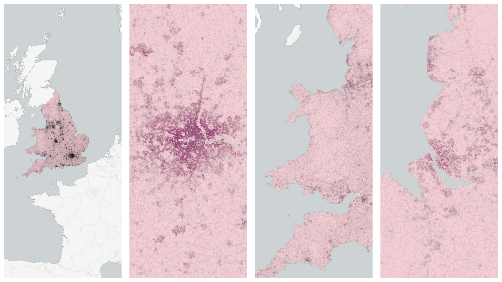

  
# Age and Gender

Population breakdowns by age and gender.

- [Population age 3 and over](#population-age-3-and-over)

    * [Population age 3 to 15](#population-age-3-to-15)

    * [Population age 16 to 49](#population-age-16-to-49)

- [Total Population](#total-population)

    * [Population age 0 to 24](#population-age-0-to-24)

    * [Population age 25 to 49](#population-age-25-to-49)

    * [Population age 50 to 64](#population-age-50-to-64)

    * [Population age 65 to 74](#population-age-65-to-74)

    * [Population age 75 and over](#population-age-75-and-over)

## Population age 3 and over

Measure &quot;Population age 3 and over&quot;  density per sq. kilometer  for one point:

    UPDATE {table_name}
      SET {new_numeric_column} =
        OBS_GetMeasure(
          CDB_LatLng(40.7, -73.9),
          'uk.ons.LC2104EW0001'
        );

Measure &quot;Population age 3 and over&quot; within an area:

    UPDATE {table_name}
      SET {new_numeric_column} =
        OBS_GetMeasure(
          ST_Buffer(CDB_LatLng(40.7, -73.9), 0.01),
          'uk.ons.LC2104EW0001'
        );

Subcolumns of Population age 3 and over

- [Population age 3 to 15](#population-age-3-to-15)

- [Population age 16 to 49](#population-age-16-to-49)

### Population age 3 to 15

Measure &quot;Population age 3 to 15&quot;  density per sq. kilometer  for one point:

    UPDATE {table_name}
      SET {new_numeric_column} =
        OBS_GetMeasure(
          CDB_LatLng(40.7, -73.9),
          'uk.ons.LC2104EW0024'
        );

Measure &quot;Population age 3 to 15&quot; within an area:

    UPDATE {table_name}
      SET {new_numeric_column} =
        OBS_GetMeasure(
          ST_Buffer(CDB_LatLng(40.7, -73.9), 0.01),
          'uk.ons.LC2104EW0024'
        );

Measure &quot;Population age 3 to 15&quot; percent of &quot;Population age 3 and over&quot; at one point:

    UPDATE {table_name}
      SET {new_numeric_column} =
        OBS_GetMeasure(
          CDB_LatLng(40.7, -73.9),
          'uk.ons.LC2104EW0024',
          'denominator'
        );

Measure &quot;Population age 3 to 15&quot; percent of &quot;Population age 3 and over&quot; within an area:

    UPDATE {table_name}
      SET {new_numeric_column} =
        OBS_GetMeasure(
          ST_Buffer(CDB_LatLng(40.7, -73.9), 0.01),
          'uk.ons.LC2104EW0024',
          'denominator'
        );

* denominator: [Population age 3 and over](#uk-ons-lc2104ew0001)

### Population age 16 to 49

Measure &quot;Population age 16 to 49&quot;  density per sq. kilometer  for one point:

    UPDATE {table_name}
      SET {new_numeric_column} =
        OBS_GetMeasure(
          CDB_LatLng(40.7, -73.9),
          'uk.ons.LC2104EW0047'
        );

Measure &quot;Population age 16 to 49&quot; within an area:

    UPDATE {table_name}
      SET {new_numeric_column} =
        OBS_GetMeasure(
          ST_Buffer(CDB_LatLng(40.7, -73.9), 0.01),
          'uk.ons.LC2104EW0047'
        );

Measure &quot;Population age 16 to 49&quot; percent of &quot;Population age 3 and over&quot; at one point:

    UPDATE {table_name}
      SET {new_numeric_column} =
        OBS_GetMeasure(
          CDB_LatLng(40.7, -73.9),
          'uk.ons.LC2104EW0047',
          'denominator'
        );

Measure &quot;Population age 16 to 49&quot; percent of &quot;Population age 3 and over&quot; within an area:

    UPDATE {table_name}
      SET {new_numeric_column} =
        OBS_GetMeasure(
          ST_Buffer(CDB_LatLng(40.7, -73.9), 0.01),
          'uk.ons.LC2104EW0047',
          'denominator'
        );

* denominator: [Population age 3 and over](#uk-ons-lc2104ew0001)

## Total Population

Measure &quot;Total Population&quot;  density per sq. kilometer  for one point:

    UPDATE {table_name}
      SET {new_numeric_column} =
        OBS_GetMeasure(
          CDB_LatLng(40.7, -73.9),
          'uk.ons.LC2102EW0001'
        );

Measure &quot;Total Population&quot; within an area:

    UPDATE {table_name}
      SET {new_numeric_column} =
        OBS_GetMeasure(
          ST_Buffer(CDB_LatLng(40.7, -73.9), 0.01),
          'uk.ons.LC2102EW0001'
        );

Subcolumns of Total Population

- [Population age 0 to 24](#population-age-0-to-24)

- [Population age 25 to 49](#population-age-25-to-49)

- [Population age 50 to 64](#population-age-50-to-64)

- [Population age 65 to 74](#population-age-65-to-74)

- [Population age 75 and over](#population-age-75-and-over)

### Population age 0 to 24

Measure &quot;Population age 0 to 24&quot;  density per sq. kilometer  for one point:

    UPDATE {table_name}
      SET {new_numeric_column} =
        OBS_GetMeasure(
          CDB_LatLng(40.7, -73.9),
          'uk.ons.LC2102EW0016'
        );

Measure &quot;Population age 0 to 24&quot; within an area:

    UPDATE {table_name}
      SET {new_numeric_column} =
        OBS_GetMeasure(
          ST_Buffer(CDB_LatLng(40.7, -73.9), 0.01),
          'uk.ons.LC2102EW0016'
        );

Measure &quot;Population age 0 to 24&quot; percent of &quot;Total Population&quot; at one point:

    UPDATE {table_name}
      SET {new_numeric_column} =
        OBS_GetMeasure(
          CDB_LatLng(40.7, -73.9),
          'uk.ons.LC2102EW0016',
          'denominator'
        );

Measure &quot;Population age 0 to 24&quot; percent of &quot;Total Population&quot; within an area:

    UPDATE {table_name}
      SET {new_numeric_column} =
        OBS_GetMeasure(
          ST_Buffer(CDB_LatLng(40.7, -73.9), 0.01),
          'uk.ons.LC2102EW0016',
          'denominator'
        );

* denominator: [Total Population](#uk-ons-lc2102ew0001)

### Population age 25 to 49

Measure &quot;Population age 25 to 49&quot;  density per sq. kilometer  for one point:

    UPDATE {table_name}
      SET {new_numeric_column} =
        OBS_GetMeasure(
          CDB_LatLng(40.7, -73.9),
          'uk.ons.LC2102EW0031'
        );

Measure &quot;Population age 25 to 49&quot; within an area:

    UPDATE {table_name}
      SET {new_numeric_column} =
        OBS_GetMeasure(
          ST_Buffer(CDB_LatLng(40.7, -73.9), 0.01),
          'uk.ons.LC2102EW0031'
        );

Measure &quot;Population age 25 to 49&quot; percent of &quot;Total Population&quot; at one point:

    UPDATE {table_name}
      SET {new_numeric_column} =
        OBS_GetMeasure(
          CDB_LatLng(40.7, -73.9),
          'uk.ons.LC2102EW0031',
          'denominator'
        );

Measure &quot;Population age 25 to 49&quot; percent of &quot;Total Population&quot; within an area:

    UPDATE {table_name}
      SET {new_numeric_column} =
        OBS_GetMeasure(
          ST_Buffer(CDB_LatLng(40.7, -73.9), 0.01),
          'uk.ons.LC2102EW0031',
          'denominator'
        );

* denominator: [Total Population](#uk-ons-lc2102ew0001)

### Population age 50 to 64

Measure &quot;Population age 50 to 64&quot;  density per sq. kilometer  for one point:

    UPDATE {table_name}
      SET {new_numeric_column} =
        OBS_GetMeasure(
          CDB_LatLng(40.7, -73.9),
          'uk.ons.LC2102EW0046'
        );

Measure &quot;Population age 50 to 64&quot; within an area:

    UPDATE {table_name}
      SET {new_numeric_column} =
        OBS_GetMeasure(
          ST_Buffer(CDB_LatLng(40.7, -73.9), 0.01),
          'uk.ons.LC2102EW0046'
        );

Measure &quot;Population age 50 to 64&quot; percent of &quot;Total Population&quot; at one point:

    UPDATE {table_name}
      SET {new_numeric_column} =
        OBS_GetMeasure(
          CDB_LatLng(40.7, -73.9),
          'uk.ons.LC2102EW0046',
          'denominator'
        );

Measure &quot;Population age 50 to 64&quot; percent of &quot;Total Population&quot; within an area:

    UPDATE {table_name}
      SET {new_numeric_column} =
        OBS_GetMeasure(
          ST_Buffer(CDB_LatLng(40.7, -73.9), 0.01),
          'uk.ons.LC2102EW0046',
          'denominator'
        );

* denominator: [Total Population](#uk-ons-lc2102ew0001)

### Population age 65 to 74

Measure &quot;Population age 65 to 74&quot;  density per sq. kilometer  for one point:

    UPDATE {table_name}
      SET {new_numeric_column} =
        OBS_GetMeasure(
          CDB_LatLng(40.7, -73.9),
          'uk.ons.LC2102EW0061'
        );

Measure &quot;Population age 65 to 74&quot; within an area:

    UPDATE {table_name}
      SET {new_numeric_column} =
        OBS_GetMeasure(
          ST_Buffer(CDB_LatLng(40.7, -73.9), 0.01),
          'uk.ons.LC2102EW0061'
        );

Measure &quot;Population age 65 to 74&quot; percent of &quot;Total Population&quot; at one point:

    UPDATE {table_name}
      SET {new_numeric_column} =
        OBS_GetMeasure(
          CDB_LatLng(40.7, -73.9),
          'uk.ons.LC2102EW0061',
          'denominator'
        );

Measure &quot;Population age 65 to 74&quot; percent of &quot;Total Population&quot; within an area:

    UPDATE {table_name}
      SET {new_numeric_column} =
        OBS_GetMeasure(
          ST_Buffer(CDB_LatLng(40.7, -73.9), 0.01),
          'uk.ons.LC2102EW0061',
          'denominator'
        );

* denominator: [Total Population](#uk-ons-lc2102ew0001)

### Population age 75 and over

Measure &quot;Population age 75 and over&quot;  density per sq. kilometer  for one point:

    UPDATE {table_name}
      SET {new_numeric_column} =
        OBS_GetMeasure(
          CDB_LatLng(40.7, -73.9),
          'uk.ons.LC2102EW0076'
        );

Measure &quot;Population age 75 and over&quot; within an area:

    UPDATE {table_name}
      SET {new_numeric_column} =
        OBS_GetMeasure(
          ST_Buffer(CDB_LatLng(40.7, -73.9), 0.01),
          'uk.ons.LC2102EW0076'
        );

Measure &quot;Population age 75 and over&quot; percent of &quot;Total Population&quot; at one point:

    UPDATE {table_name}
      SET {new_numeric_column} =
        OBS_GetMeasure(
          CDB_LatLng(40.7, -73.9),
          'uk.ons.LC2102EW0076',
          'denominator'
        );

Measure &quot;Population age 75 and over&quot; percent of &quot;Total Population&quot; within an area:

    UPDATE {table_name}
      SET {new_numeric_column} =
        OBS_GetMeasure(
          ST_Buffer(CDB_LatLng(40.7, -73.9), 0.01),
          'uk.ons.LC2102EW0076',
          'denominator'
        );

* denominator: [Total Population](#uk-ons-lc2102ew0001)

