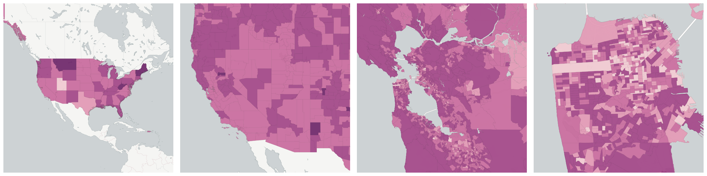
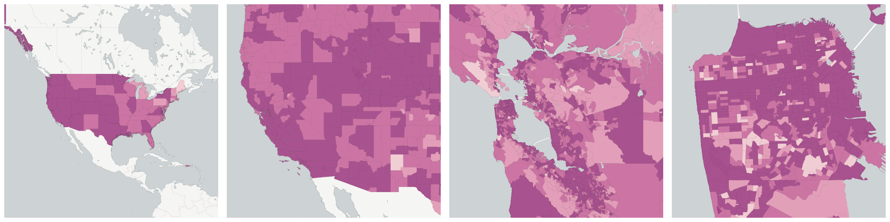

  
# Age and Gender

Population breakdowns by age and gender.

- [Children under 18 Years of Age](#children-under-18-years-of-age)

- [Median Age](#median-age)

- [Men age 45 to 64 (&quot;middle aged&quot;)](#men-age-45-to-64-middle-aged)

- [Population 1 year and over](#population-1-year-and-over)

- [Population 15 Years and Over](#population-15-years-and-over)

- [Population age 16 and over](#population-age-16-and-over)

- [Total Population](#total-population)

    * [Female age 5 to 9](#female-age-5-to-9)

    * [Female age 10 to 14](#female-age-10-to-14)

    * [Female age 15 to 17](#female-age-15-to-17)

    * [Female age 18 and 19](#female-age-18-and-19)

    * [Female age 20](#female-age-20)

    * [Female age 21](#female-age-21)

    * [Female age 22 to 24](#female-age-22-to-24)

    * [Female age 25 to 29](#female-age-25-to-29)

    * [Female age 30 to 34](#female-age-30-to-34)

    * [Female age 35 to 39](#female-age-35-to-39)

    * [Female age 40 to 44](#female-age-40-to-44)

    * [Female age 45 to 49](#female-age-45-to-49)

    * [Female age 50 to 54](#female-age-50-to-54)

    * [Female age 55 to 59](#female-age-55-to-59)

    * [Female age 60 and 61](#female-age-60-and-61)

    * [Female age 62 to 64](#female-age-62-to-64)

    * [Female age 65 to 66](#female-age-65-to-66)

    * [Female age 67 to 69](#female-age-67-to-69)

    * [Female age 70 to 74](#female-age-70-to-74)

    * [Female age 75 to 79](#female-age-75-to-79)

    * [Female age 80 to 84](#female-age-80-to-84)

    * [Female age 85 and over](#female-age-85-and-over)

    * [Female Population](#female-population)

    * [Female under 5 years](#female-under-5-years)

    * [Male age 10 to 14](#male-age-10-to-14)

    * [Male age 15 to 17](#male-age-15-to-17)

    * [Male age 18 and 19](#male-age-18-and-19)

    * [Male age 20](#male-age-20)

    * [Male age 21](#male-age-21)

    * [Male age 22 to 24](#male-age-22-to-24)

    * [Male age 25 to 29](#male-age-25-to-29)

    * [Male age 30 to 34](#male-age-30-to-34)

    * [Male age 35 to 39](#male-age-35-to-39)

    * [Male age 40 to 44](#male-age-40-to-44)

    * [Male age 65 to 66](#male-age-65-to-66)

    * [Male age 67 to 69](#male-age-67-to-69)

    * [Male age 70 to 74](#male-age-70-to-74)

    * [Male age 75 to 79](#male-age-75-to-79)

    * [Male age 80 to 84](#male-age-80-to-84)

    * [Male age 85 and over](#male-age-85-and-over)

    * [Male Population](#male-population)

    * [Male under 5 years](#male-under-5-years)

    * [Men age 45 to 49](#men-age-45-to-49)

    * [Men age 50 to 54](#men-age-50-to-54)

    * [Men age 55 to 59](#men-age-55-to-59)

    * [Men age 60 to 61](#men-age-60-to-61)

    * [Men age 62 to 64](#men-age-62-to-64)

## Children under 18 Years of Age

The number of people within each geography who are under 18 years of age.

Measure &quot;Children under 18 Years of Age&quot;  density per sq. kilometer  for one point:

    UPDATE {table_name}
      SET {new_numeric_column} =
        OBS_GetMeasure(
          CDB_LatLng(40.7, -73.9),
          'us.census.acs.B09001001'
        );

Measure &quot;Children under 18 Years of Age&quot; within an area:

    UPDATE {table_name}
      SET {new_numeric_column} =
        OBS_GetMeasure(
          ST_Buffer(CDB_LatLng(40.7, -73.9), 0.01),
          'us.census.acs.B09001001'
        );

## Median Age

The median age of all people in a given geographic area.

Measure &quot;Median Age&quot;  for one point:

    UPDATE {table_name}
      SET {new_numeric_column} =
        OBS_GetMeasure(
          CDB_LatLng(40.7, -73.9),
          'us.census.acs.B01002001'
        );

Median Age is only available for point lookups.

## Men age 45 to 64 (&quot;middle aged&quot;)

The male population between the age of fourty-five years to sixty-four years within the specified area.

Measure &quot;Men age 45 to 64 (&quot;middle aged&quot;)&quot;  density per sq. kilometer  for one point:

    UPDATE {table_name}
      SET {new_numeric_column} =
        OBS_GetMeasure(
          CDB_LatLng(40.7, -73.9),
          'us.census.acs.B15001027'
        );

Measure &quot;Men age 45 to 64 (&quot;middle aged&quot;)&quot; within an area:

    UPDATE {table_name}
      SET {new_numeric_column} =
        OBS_GetMeasure(
          ST_Buffer(CDB_LatLng(40.7, -73.9), 0.01),
          'us.census.acs.B15001027'
        );

## Population 1 year and over

All people, male and female, child and adult, living in a given geographic area that are 1 year and older.

Measure &quot;Population 1 year and over&quot;  density per sq. kilometer  for one point:

    UPDATE {table_name}
      SET {new_numeric_column} =
        OBS_GetMeasure(
          CDB_LatLng(40.7, -73.9),
          'us.census.acs.B07204001'
        );

Measure &quot;Population 1 year and over&quot; within an area:

    UPDATE {table_name}
      SET {new_numeric_column} =
        OBS_GetMeasure(
          ST_Buffer(CDB_LatLng(40.7, -73.9), 0.01),
          'us.census.acs.B07204001'
        );

## Population 15 Years and Over

The number of people in a geographic area who are over the age of 15.  This is used mostly as a denominator of marital status.

Measure &quot;Population 15 Years and Over&quot;  density per sq. kilometer  for one point:

    UPDATE {table_name}
      SET {new_numeric_column} =
        OBS_GetMeasure(
          CDB_LatLng(40.7, -73.9),
          'us.census.acs.B12005001'
        );

Measure &quot;Population 15 Years and Over&quot; within an area:

    UPDATE {table_name}
      SET {new_numeric_column} =
        OBS_GetMeasure(
          ST_Buffer(CDB_LatLng(40.7, -73.9), 0.01),
          'us.census.acs.B12005001'
        );

## Population age 16 and over

The number of people in each geography who are age 16 or over.

Measure &quot;Population age 16 and over&quot;  density per sq. kilometer  for one point:

    UPDATE {table_name}
      SET {new_numeric_column} =
        OBS_GetMeasure(
          CDB_LatLng(40.7, -73.9),
          'us.census.acs.B23025001'
        );

Measure &quot;Population age 16 and over&quot; within an area:

    UPDATE {table_name}
      SET {new_numeric_column} =
        OBS_GetMeasure(
          ST_Buffer(CDB_LatLng(40.7, -73.9), 0.01),
          'us.census.acs.B23025001'
        );

## Total Population

The total number of all people living in a given geographic area.  This is a very useful catch-all denominator when calculating rates.

Measure &quot;Total Population&quot;  density per sq. kilometer  for one point:

    UPDATE {table_name}
      SET {new_numeric_column} =
        OBS_GetMeasure(
          CDB_LatLng(40.7, -73.9),
          'us.census.acs.B01003001'
        );

Measure &quot;Total Population&quot; within an area:

    UPDATE {table_name}
      SET {new_numeric_column} =
        OBS_GetMeasure(
          ST_Buffer(CDB_LatLng(40.7, -73.9), 0.01),
          'us.census.acs.B01003001'
        );

Subcolumns of Total Population

- [Female age 5 to 9](#female-age-5-to-9)

- [Female age 10 to 14](#female-age-10-to-14)

- [Female age 15 to 17](#female-age-15-to-17)

- [Female age 18 and 19](#female-age-18-and-19)

- [Female age 20](#female-age-20)

- [Female age 21](#female-age-21)

- [Female age 22 to 24](#female-age-22-to-24)

- [Female age 25 to 29](#female-age-25-to-29)

- [Female age 30 to 34](#female-age-30-to-34)

- [Female age 35 to 39](#female-age-35-to-39)

- [Female age 40 to 44](#female-age-40-to-44)

- [Female age 45 to 49](#female-age-45-to-49)

- [Female age 50 to 54](#female-age-50-to-54)

- [Female age 55 to 59](#female-age-55-to-59)

- [Female age 60 and 61](#female-age-60-and-61)

- [Female age 62 to 64](#female-age-62-to-64)

- [Female age 65 to 66](#female-age-65-to-66)

- [Female age 67 to 69](#female-age-67-to-69)

- [Female age 70 to 74](#female-age-70-to-74)

- [Female age 75 to 79](#female-age-75-to-79)

- [Female age 80 to 84](#female-age-80-to-84)

- [Female age 85 and over](#female-age-85-and-over)

- [Female Population](#female-population)

- [Female under 5 years](#female-under-5-years)

- [Male age 10 to 14](#male-age-10-to-14)

- [Male age 15 to 17](#male-age-15-to-17)

- [Male age 18 and 19](#male-age-18-and-19)

- [Male age 20](#male-age-20)

- [Male age 21](#male-age-21)

- [Male age 22 to 24](#male-age-22-to-24)

- [Male age 25 to 29](#male-age-25-to-29)

- [Male age 30 to 34](#male-age-30-to-34)

- [Male age 35 to 39](#male-age-35-to-39)

- [Male age 40 to 44](#male-age-40-to-44)

- [Male age 65 to 66](#male-age-65-to-66)

- [Male age 67 to 69](#male-age-67-to-69)

- [Male age 70 to 74](#male-age-70-to-74)

- [Male age 75 to 79](#male-age-75-to-79)

- [Male age 80 to 84](#male-age-80-to-84)

- [Male age 85 and over](#male-age-85-and-over)

- [Male Population](#male-population)

- [Male under 5 years](#male-under-5-years)

- [Men age 45 to 49](#men-age-45-to-49)

- [Men age 50 to 54](#men-age-50-to-54)

- [Men age 55 to 59](#men-age-55-to-59)

- [Men age 60 to 61](#men-age-60-to-61)

- [Men age 62 to 64](#men-age-62-to-64)

### Female age 5 to 9

The female population between the age of five years to nine years within the specified area.

Measure &quot;Female age 5 to 9&quot;  density per sq. kilometer  for one point:

    UPDATE {table_name}
      SET {new_numeric_column} =
        OBS_GetMeasure(
          CDB_LatLng(40.7, -73.9),
          'us.census.acs.B01001028'
        );

Measure &quot;Female age 5 to 9&quot; within an area:

    UPDATE {table_name}
      SET {new_numeric_column} =
        OBS_GetMeasure(
          ST_Buffer(CDB_LatLng(40.7, -73.9), 0.01),
          'us.census.acs.B01001028'
        );

Measure &quot;Female age 5 to 9&quot; percent of &quot;Total Population&quot; at one point:

    UPDATE {table_name}
      SET {new_numeric_column} =
        OBS_GetMeasure(
          CDB_LatLng(40.7, -73.9),
          'us.census.acs.B01001028',
          'denominator'
        );

Measure &quot;Female age 5 to 9&quot; percent of &quot;Total Population&quot; within an area:

    UPDATE {table_name}
      SET {new_numeric_column} =
        OBS_GetMeasure(
          ST_Buffer(CDB_LatLng(40.7, -73.9), 0.01),
          'us.census.acs.B01001028',
          'denominator'
        );

* denominator: [Total Population](../race_ethnicity/#us-census-acs-b01003001)

### Female age 10 to 14

The female population between the age of ten years to fourteen years within the specified area.

Measure &quot;Female age 10 to 14&quot;  density per sq. kilometer  for one point:

    UPDATE {table_name}
      SET {new_numeric_column} =
        OBS_GetMeasure(
          CDB_LatLng(40.7, -73.9),
          'us.census.acs.B01001029'
        );

Measure &quot;Female age 10 to 14&quot; within an area:

    UPDATE {table_name}
      SET {new_numeric_column} =
        OBS_GetMeasure(
          ST_Buffer(CDB_LatLng(40.7, -73.9), 0.01),
          'us.census.acs.B01001029'
        );

Measure &quot;Female age 10 to 14&quot; percent of &quot;Total Population&quot; at one point:

    UPDATE {table_name}
      SET {new_numeric_column} =
        OBS_GetMeasure(
          CDB_LatLng(40.7, -73.9),
          'us.census.acs.B01001029',
          'denominator'
        );

Measure &quot;Female age 10 to 14&quot; percent of &quot;Total Population&quot; within an area:

    UPDATE {table_name}
      SET {new_numeric_column} =
        OBS_GetMeasure(
          ST_Buffer(CDB_LatLng(40.7, -73.9), 0.01),
          'us.census.acs.B01001029',
          'denominator'
        );

* denominator: [Total Population](../race_ethnicity/#us-census-acs-b01003001)

### Female age 15 to 17

The female population between the age of fifteeen years to seventeen years within the specified area.

Measure &quot;Female age 15 to 17&quot;  density per sq. kilometer  for one point:

    UPDATE {table_name}
      SET {new_numeric_column} =
        OBS_GetMeasure(
          CDB_LatLng(40.7, -73.9),
          'us.census.acs.B01001030'
        );

Measure &quot;Female age 15 to 17&quot; within an area:

    UPDATE {table_name}
      SET {new_numeric_column} =
        OBS_GetMeasure(
          ST_Buffer(CDB_LatLng(40.7, -73.9), 0.01),
          'us.census.acs.B01001030'
        );

Measure &quot;Female age 15 to 17&quot; percent of &quot;Total Population&quot; at one point:

    UPDATE {table_name}
      SET {new_numeric_column} =
        OBS_GetMeasure(
          CDB_LatLng(40.7, -73.9),
          'us.census.acs.B01001030',
          'denominator'
        );

Measure &quot;Female age 15 to 17&quot; percent of &quot;Total Population&quot; within an area:

    UPDATE {table_name}
      SET {new_numeric_column} =
        OBS_GetMeasure(
          ST_Buffer(CDB_LatLng(40.7, -73.9), 0.01),
          'us.census.acs.B01001030',
          'denominator'
        );

* denominator: [Total Population](../race_ethnicity/#us-census-acs-b01003001)

### Female age 18 and 19

The female population between the age of eighteen years to nineteen years within the specified area.

Measure &quot;Female age 18 and 19&quot;  density per sq. kilometer  for one point:

    UPDATE {table_name}
      SET {new_numeric_column} =
        OBS_GetMeasure(
          CDB_LatLng(40.7, -73.9),
          'us.census.acs.B01001031'
        );

Measure &quot;Female age 18 and 19&quot; within an area:

    UPDATE {table_name}
      SET {new_numeric_column} =
        OBS_GetMeasure(
          ST_Buffer(CDB_LatLng(40.7, -73.9), 0.01),
          'us.census.acs.B01001031'
        );

Measure &quot;Female age 18 and 19&quot; percent of &quot;Total Population&quot; at one point:

    UPDATE {table_name}
      SET {new_numeric_column} =
        OBS_GetMeasure(
          CDB_LatLng(40.7, -73.9),
          'us.census.acs.B01001031',
          'denominator'
        );

Measure &quot;Female age 18 and 19&quot; percent of &quot;Total Population&quot; within an area:

    UPDATE {table_name}
      SET {new_numeric_column} =
        OBS_GetMeasure(
          ST_Buffer(CDB_LatLng(40.7, -73.9), 0.01),
          'us.census.acs.B01001031',
          'denominator'
        );

* denominator: [Total Population](../race_ethnicity/#us-census-acs-b01003001)

### Female age 20

The female population with an age of twenty years within the specified area.

Measure &quot;Female age 20&quot;  density per sq. kilometer  for one point:

    UPDATE {table_name}
      SET {new_numeric_column} =
        OBS_GetMeasure(
          CDB_LatLng(40.7, -73.9),
          'us.census.acs.B01001032'
        );

Measure &quot;Female age 20&quot; within an area:

    UPDATE {table_name}
      SET {new_numeric_column} =
        OBS_GetMeasure(
          ST_Buffer(CDB_LatLng(40.7, -73.9), 0.01),
          'us.census.acs.B01001032'
        );

Measure &quot;Female age 20&quot; percent of &quot;Total Population&quot; at one point:

    UPDATE {table_name}
      SET {new_numeric_column} =
        OBS_GetMeasure(
          CDB_LatLng(40.7, -73.9),
          'us.census.acs.B01001032',
          'denominator'
        );

Measure &quot;Female age 20&quot; percent of &quot;Total Population&quot; within an area:

    UPDATE {table_name}
      SET {new_numeric_column} =
        OBS_GetMeasure(
          ST_Buffer(CDB_LatLng(40.7, -73.9), 0.01),
          'us.census.acs.B01001032',
          'denominator'
        );

* denominator: [Total Population](../race_ethnicity/#us-census-acs-b01003001)

### Female age 21

The female population with an age of twenty-one years within the specified area.

Measure &quot;Female age 21&quot;  density per sq. kilometer  for one point:

    UPDATE {table_name}
      SET {new_numeric_column} =
        OBS_GetMeasure(
          CDB_LatLng(40.7, -73.9),
          'us.census.acs.B01001033'
        );

Measure &quot;Female age 21&quot; within an area:

    UPDATE {table_name}
      SET {new_numeric_column} =
        OBS_GetMeasure(
          ST_Buffer(CDB_LatLng(40.7, -73.9), 0.01),
          'us.census.acs.B01001033'
        );

Measure &quot;Female age 21&quot; percent of &quot;Total Population&quot; at one point:

    UPDATE {table_name}
      SET {new_numeric_column} =
        OBS_GetMeasure(
          CDB_LatLng(40.7, -73.9),
          'us.census.acs.B01001033',
          'denominator'
        );

Measure &quot;Female age 21&quot; percent of &quot;Total Population&quot; within an area:

    UPDATE {table_name}
      SET {new_numeric_column} =
        OBS_GetMeasure(
          ST_Buffer(CDB_LatLng(40.7, -73.9), 0.01),
          'us.census.acs.B01001033',
          'denominator'
        );

* denominator: [Total Population](../race_ethnicity/#us-census-acs-b01003001)

### Female age 22 to 24

The female population between the age of twenty-two years to twenty-four years within the specified area.

Measure &quot;Female age 22 to 24&quot;  density per sq. kilometer  for one point:

    UPDATE {table_name}
      SET {new_numeric_column} =
        OBS_GetMeasure(
          CDB_LatLng(40.7, -73.9),
          'us.census.acs.B01001034'
        );

Measure &quot;Female age 22 to 24&quot; within an area:

    UPDATE {table_name}
      SET {new_numeric_column} =
        OBS_GetMeasure(
          ST_Buffer(CDB_LatLng(40.7, -73.9), 0.01),
          'us.census.acs.B01001034'
        );

Measure &quot;Female age 22 to 24&quot; percent of &quot;Total Population&quot; at one point:

    UPDATE {table_name}
      SET {new_numeric_column} =
        OBS_GetMeasure(
          CDB_LatLng(40.7, -73.9),
          'us.census.acs.B01001034',
          'denominator'
        );

Measure &quot;Female age 22 to 24&quot; percent of &quot;Total Population&quot; within an area:

    UPDATE {table_name}
      SET {new_numeric_column} =
        OBS_GetMeasure(
          ST_Buffer(CDB_LatLng(40.7, -73.9), 0.01),
          'us.census.acs.B01001034',
          'denominator'
        );

* denominator: [Total Population](../race_ethnicity/#us-census-acs-b01003001)

### Female age 25 to 29

The female population between the age of twenty-five years to twenty-nine years within the specified area.

Measure &quot;Female age 25 to 29&quot;  density per sq. kilometer  for one point:

    UPDATE {table_name}
      SET {new_numeric_column} =
        OBS_GetMeasure(
          CDB_LatLng(40.7, -73.9),
          'us.census.acs.B01001035'
        );

Measure &quot;Female age 25 to 29&quot; within an area:

    UPDATE {table_name}
      SET {new_numeric_column} =
        OBS_GetMeasure(
          ST_Buffer(CDB_LatLng(40.7, -73.9), 0.01),
          'us.census.acs.B01001035'
        );

Measure &quot;Female age 25 to 29&quot; percent of &quot;Total Population&quot; at one point:

    UPDATE {table_name}
      SET {new_numeric_column} =
        OBS_GetMeasure(
          CDB_LatLng(40.7, -73.9),
          'us.census.acs.B01001035',
          'denominator'
        );

Measure &quot;Female age 25 to 29&quot; percent of &quot;Total Population&quot; within an area:

    UPDATE {table_name}
      SET {new_numeric_column} =
        OBS_GetMeasure(
          ST_Buffer(CDB_LatLng(40.7, -73.9), 0.01),
          'us.census.acs.B01001035',
          'denominator'
        );

* denominator: [Total Population](../race_ethnicity/#us-census-acs-b01003001)

### Female age 30 to 34

The female population between the age of thirty years to thirty-four years within the specified area.

Measure &quot;Female age 30 to 34&quot;  density per sq. kilometer  for one point:

    UPDATE {table_name}
      SET {new_numeric_column} =
        OBS_GetMeasure(
          CDB_LatLng(40.7, -73.9),
          'us.census.acs.B01001036'
        );

Measure &quot;Female age 30 to 34&quot; within an area:

    UPDATE {table_name}
      SET {new_numeric_column} =
        OBS_GetMeasure(
          ST_Buffer(CDB_LatLng(40.7, -73.9), 0.01),
          'us.census.acs.B01001036'
        );

Measure &quot;Female age 30 to 34&quot; percent of &quot;Total Population&quot; at one point:

    UPDATE {table_name}
      SET {new_numeric_column} =
        OBS_GetMeasure(
          CDB_LatLng(40.7, -73.9),
          'us.census.acs.B01001036',
          'denominator'
        );

Measure &quot;Female age 30 to 34&quot; percent of &quot;Total Population&quot; within an area:

    UPDATE {table_name}
      SET {new_numeric_column} =
        OBS_GetMeasure(
          ST_Buffer(CDB_LatLng(40.7, -73.9), 0.01),
          'us.census.acs.B01001036',
          'denominator'
        );

* denominator: [Total Population](../race_ethnicity/#us-census-acs-b01003001)

### Female age 35 to 39

The female population between the age of thirty-five years to thirty-nine years within the specified area.

Measure &quot;Female age 35 to 39&quot;  density per sq. kilometer  for one point:

    UPDATE {table_name}
      SET {new_numeric_column} =
        OBS_GetMeasure(
          CDB_LatLng(40.7, -73.9),
          'us.census.acs.B01001037'
        );

Measure &quot;Female age 35 to 39&quot; within an area:

    UPDATE {table_name}
      SET {new_numeric_column} =
        OBS_GetMeasure(
          ST_Buffer(CDB_LatLng(40.7, -73.9), 0.01),
          'us.census.acs.B01001037'
        );

Measure &quot;Female age 35 to 39&quot; percent of &quot;Total Population&quot; at one point:

    UPDATE {table_name}
      SET {new_numeric_column} =
        OBS_GetMeasure(
          CDB_LatLng(40.7, -73.9),
          'us.census.acs.B01001037',
          'denominator'
        );

Measure &quot;Female age 35 to 39&quot; percent of &quot;Total Population&quot; within an area:

    UPDATE {table_name}
      SET {new_numeric_column} =
        OBS_GetMeasure(
          ST_Buffer(CDB_LatLng(40.7, -73.9), 0.01),
          'us.census.acs.B01001037',
          'denominator'
        );

* denominator: [Total Population](../race_ethnicity/#us-census-acs-b01003001)

### Female age 40 to 44

The female population between the age of fourty years to fourty-four years within the specified area.

Measure &quot;Female age 40 to 44&quot;  density per sq. kilometer  for one point:

    UPDATE {table_name}
      SET {new_numeric_column} =
        OBS_GetMeasure(
          CDB_LatLng(40.7, -73.9),
          'us.census.acs.B01001038'
        );

Measure &quot;Female age 40 to 44&quot; within an area:

    UPDATE {table_name}
      SET {new_numeric_column} =
        OBS_GetMeasure(
          ST_Buffer(CDB_LatLng(40.7, -73.9), 0.01),
          'us.census.acs.B01001038'
        );

Measure &quot;Female age 40 to 44&quot; percent of &quot;Total Population&quot; at one point:

    UPDATE {table_name}
      SET {new_numeric_column} =
        OBS_GetMeasure(
          CDB_LatLng(40.7, -73.9),
          'us.census.acs.B01001038',
          'denominator'
        );

Measure &quot;Female age 40 to 44&quot; percent of &quot;Total Population&quot; within an area:

    UPDATE {table_name}
      SET {new_numeric_column} =
        OBS_GetMeasure(
          ST_Buffer(CDB_LatLng(40.7, -73.9), 0.01),
          'us.census.acs.B01001038',
          'denominator'
        );

* denominator: [Total Population](../race_ethnicity/#us-census-acs-b01003001)

### Female age 45 to 49

The female population between the age of fourty-five years to fourty-nine years within the specified area.

Measure &quot;Female age 45 to 49&quot;  density per sq. kilometer  for one point:

    UPDATE {table_name}
      SET {new_numeric_column} =
        OBS_GetMeasure(
          CDB_LatLng(40.7, -73.9),
          'us.census.acs.B01001039'
        );

Measure &quot;Female age 45 to 49&quot; within an area:

    UPDATE {table_name}
      SET {new_numeric_column} =
        OBS_GetMeasure(
          ST_Buffer(CDB_LatLng(40.7, -73.9), 0.01),
          'us.census.acs.B01001039'
        );

Measure &quot;Female age 45 to 49&quot; percent of &quot;Total Population&quot; at one point:

    UPDATE {table_name}
      SET {new_numeric_column} =
        OBS_GetMeasure(
          CDB_LatLng(40.7, -73.9),
          'us.census.acs.B01001039',
          'denominator'
        );

Measure &quot;Female age 45 to 49&quot; percent of &quot;Total Population&quot; within an area:

    UPDATE {table_name}
      SET {new_numeric_column} =
        OBS_GetMeasure(
          ST_Buffer(CDB_LatLng(40.7, -73.9), 0.01),
          'us.census.acs.B01001039',
          'denominator'
        );

* denominator: [Total Population](../race_ethnicity/#us-census-acs-b01003001)

### Female age 50 to 54

The female population between the age of fifty years to fifty-four years within the specified area.

Measure &quot;Female age 50 to 54&quot;  density per sq. kilometer  for one point:

    UPDATE {table_name}
      SET {new_numeric_column} =
        OBS_GetMeasure(
          CDB_LatLng(40.7, -73.9),
          'us.census.acs.B01001040'
        );

Measure &quot;Female age 50 to 54&quot; within an area:

    UPDATE {table_name}
      SET {new_numeric_column} =
        OBS_GetMeasure(
          ST_Buffer(CDB_LatLng(40.7, -73.9), 0.01),
          'us.census.acs.B01001040'
        );

Measure &quot;Female age 50 to 54&quot; percent of &quot;Total Population&quot; at one point:

    UPDATE {table_name}
      SET {new_numeric_column} =
        OBS_GetMeasure(
          CDB_LatLng(40.7, -73.9),
          'us.census.acs.B01001040',
          'denominator'
        );

Measure &quot;Female age 50 to 54&quot; percent of &quot;Total Population&quot; within an area:

    UPDATE {table_name}
      SET {new_numeric_column} =
        OBS_GetMeasure(
          ST_Buffer(CDB_LatLng(40.7, -73.9), 0.01),
          'us.census.acs.B01001040',
          'denominator'
        );

* denominator: [Total Population](../race_ethnicity/#us-census-acs-b01003001)

### Female age 55 to 59

The female population between the age of fifty-five years to fifty-nine years within the specified area.

Measure &quot;Female age 55 to 59&quot;  density per sq. kilometer  for one point:

    UPDATE {table_name}
      SET {new_numeric_column} =
        OBS_GetMeasure(
          CDB_LatLng(40.7, -73.9),
          'us.census.acs.B01001041'
        );

Measure &quot;Female age 55 to 59&quot; within an area:

    UPDATE {table_name}
      SET {new_numeric_column} =
        OBS_GetMeasure(
          ST_Buffer(CDB_LatLng(40.7, -73.9), 0.01),
          'us.census.acs.B01001041'
        );

Measure &quot;Female age 55 to 59&quot; percent of &quot;Total Population&quot; at one point:

    UPDATE {table_name}
      SET {new_numeric_column} =
        OBS_GetMeasure(
          CDB_LatLng(40.7, -73.9),
          'us.census.acs.B01001041',
          'denominator'
        );

Measure &quot;Female age 55 to 59&quot; percent of &quot;Total Population&quot; within an area:

    UPDATE {table_name}
      SET {new_numeric_column} =
        OBS_GetMeasure(
          ST_Buffer(CDB_LatLng(40.7, -73.9), 0.01),
          'us.census.acs.B01001041',
          'denominator'
        );

* denominator: [Total Population](../race_ethnicity/#us-census-acs-b01003001)

### Female age 60 and 61

The female population between the age of sixty years to sixty-one years within the specified area.

Measure &quot;Female age 60 and 61&quot;  density per sq. kilometer  for one point:

    UPDATE {table_name}
      SET {new_numeric_column} =
        OBS_GetMeasure(
          CDB_LatLng(40.7, -73.9),
          'us.census.acs.B01001042'
        );

Measure &quot;Female age 60 and 61&quot; within an area:

    UPDATE {table_name}
      SET {new_numeric_column} =
        OBS_GetMeasure(
          ST_Buffer(CDB_LatLng(40.7, -73.9), 0.01),
          'us.census.acs.B01001042'
        );

Measure &quot;Female age 60 and 61&quot; percent of &quot;Total Population&quot; at one point:

    UPDATE {table_name}
      SET {new_numeric_column} =
        OBS_GetMeasure(
          CDB_LatLng(40.7, -73.9),
          'us.census.acs.B01001042',
          'denominator'
        );

Measure &quot;Female age 60 and 61&quot; percent of &quot;Total Population&quot; within an area:

    UPDATE {table_name}
      SET {new_numeric_column} =
        OBS_GetMeasure(
          ST_Buffer(CDB_LatLng(40.7, -73.9), 0.01),
          'us.census.acs.B01001042',
          'denominator'
        );

* denominator: [Total Population](../race_ethnicity/#us-census-acs-b01003001)

### Female age 62 to 64

The female population between the age of sixty-two years to sixty-four years within the specified area.

Measure &quot;Female age 62 to 64&quot;  density per sq. kilometer  for one point:

    UPDATE {table_name}
      SET {new_numeric_column} =
        OBS_GetMeasure(
          CDB_LatLng(40.7, -73.9),
          'us.census.acs.B01001043'
        );

Measure &quot;Female age 62 to 64&quot; within an area:

    UPDATE {table_name}
      SET {new_numeric_column} =
        OBS_GetMeasure(
          ST_Buffer(CDB_LatLng(40.7, -73.9), 0.01),
          'us.census.acs.B01001043'
        );

Measure &quot;Female age 62 to 64&quot; percent of &quot;Total Population&quot; at one point:

    UPDATE {table_name}
      SET {new_numeric_column} =
        OBS_GetMeasure(
          CDB_LatLng(40.7, -73.9),
          'us.census.acs.B01001043',
          'denominator'
        );

Measure &quot;Female age 62 to 64&quot; percent of &quot;Total Population&quot; within an area:

    UPDATE {table_name}
      SET {new_numeric_column} =
        OBS_GetMeasure(
          ST_Buffer(CDB_LatLng(40.7, -73.9), 0.01),
          'us.census.acs.B01001043',
          'denominator'
        );

* denominator: [Total Population](../race_ethnicity/#us-census-acs-b01003001)

### Female age 65 to 66

The female population between the age of sixty-five years to sixty-six years within the specified area.

Measure &quot;Female age 65 to 66&quot;  density per sq. kilometer  for one point:

    UPDATE {table_name}
      SET {new_numeric_column} =
        OBS_GetMeasure(
          CDB_LatLng(40.7, -73.9),
          'us.census.acs.B01001044'
        );

Measure &quot;Female age 65 to 66&quot; within an area:

    UPDATE {table_name}
      SET {new_numeric_column} =
        OBS_GetMeasure(
          ST_Buffer(CDB_LatLng(40.7, -73.9), 0.01),
          'us.census.acs.B01001044'
        );

Measure &quot;Female age 65 to 66&quot; percent of &quot;Total Population&quot; at one point:

    UPDATE {table_name}
      SET {new_numeric_column} =
        OBS_GetMeasure(
          CDB_LatLng(40.7, -73.9),
          'us.census.acs.B01001044',
          'denominator'
        );

Measure &quot;Female age 65 to 66&quot; percent of &quot;Total Population&quot; within an area:

    UPDATE {table_name}
      SET {new_numeric_column} =
        OBS_GetMeasure(
          ST_Buffer(CDB_LatLng(40.7, -73.9), 0.01),
          'us.census.acs.B01001044',
          'denominator'
        );

* denominator: [Total Population](../race_ethnicity/#us-census-acs-b01003001)

### Female age 67 to 69

The female population between the age of sixty-seven years to sixty-nine years within the specified area.

Measure &quot;Female age 67 to 69&quot;  density per sq. kilometer  for one point:

    UPDATE {table_name}
      SET {new_numeric_column} =
        OBS_GetMeasure(
          CDB_LatLng(40.7, -73.9),
          'us.census.acs.B01001045'
        );

Measure &quot;Female age 67 to 69&quot; within an area:

    UPDATE {table_name}
      SET {new_numeric_column} =
        OBS_GetMeasure(
          ST_Buffer(CDB_LatLng(40.7, -73.9), 0.01),
          'us.census.acs.B01001045'
        );

Measure &quot;Female age 67 to 69&quot; percent of &quot;Total Population&quot; at one point:

    UPDATE {table_name}
      SET {new_numeric_column} =
        OBS_GetMeasure(
          CDB_LatLng(40.7, -73.9),
          'us.census.acs.B01001045',
          'denominator'
        );

Measure &quot;Female age 67 to 69&quot; percent of &quot;Total Population&quot; within an area:

    UPDATE {table_name}
      SET {new_numeric_column} =
        OBS_GetMeasure(
          ST_Buffer(CDB_LatLng(40.7, -73.9), 0.01),
          'us.census.acs.B01001045',
          'denominator'
        );

* denominator: [Total Population](../race_ethnicity/#us-census-acs-b01003001)

### Female age 70 to 74

The female population between the age of seventy years to seventy-four years within the specified area.

Measure &quot;Female age 70 to 74&quot;  density per sq. kilometer  for one point:

    UPDATE {table_name}
      SET {new_numeric_column} =
        OBS_GetMeasure(
          CDB_LatLng(40.7, -73.9),
          'us.census.acs.B01001046'
        );

Measure &quot;Female age 70 to 74&quot; within an area:

    UPDATE {table_name}
      SET {new_numeric_column} =
        OBS_GetMeasure(
          ST_Buffer(CDB_LatLng(40.7, -73.9), 0.01),
          'us.census.acs.B01001046'
        );

Measure &quot;Female age 70 to 74&quot; percent of &quot;Total Population&quot; at one point:

    UPDATE {table_name}
      SET {new_numeric_column} =
        OBS_GetMeasure(
          CDB_LatLng(40.7, -73.9),
          'us.census.acs.B01001046',
          'denominator'
        );

Measure &quot;Female age 70 to 74&quot; percent of &quot;Total Population&quot; within an area:

    UPDATE {table_name}
      SET {new_numeric_column} =
        OBS_GetMeasure(
          ST_Buffer(CDB_LatLng(40.7, -73.9), 0.01),
          'us.census.acs.B01001046',
          'denominator'
        );

* denominator: [Total Population](../race_ethnicity/#us-census-acs-b01003001)

### Female age 75 to 79

The female population between the age of seventy-five years to seventy-nine years within the specified area.

Measure &quot;Female age 75 to 79&quot;  density per sq. kilometer  for one point:

    UPDATE {table_name}
      SET {new_numeric_column} =
        OBS_GetMeasure(
          CDB_LatLng(40.7, -73.9),
          'us.census.acs.B01001047'
        );

Measure &quot;Female age 75 to 79&quot; within an area:

    UPDATE {table_name}
      SET {new_numeric_column} =
        OBS_GetMeasure(
          ST_Buffer(CDB_LatLng(40.7, -73.9), 0.01),
          'us.census.acs.B01001047'
        );

Measure &quot;Female age 75 to 79&quot; percent of &quot;Total Population&quot; at one point:

    UPDATE {table_name}
      SET {new_numeric_column} =
        OBS_GetMeasure(
          CDB_LatLng(40.7, -73.9),
          'us.census.acs.B01001047',
          'denominator'
        );

Measure &quot;Female age 75 to 79&quot; percent of &quot;Total Population&quot; within an area:

    UPDATE {table_name}
      SET {new_numeric_column} =
        OBS_GetMeasure(
          ST_Buffer(CDB_LatLng(40.7, -73.9), 0.01),
          'us.census.acs.B01001047',
          'denominator'
        );

* denominator: [Total Population](../race_ethnicity/#us-census-acs-b01003001)

### Female age 80 to 84

The female population between the age of eighty years to eighty-four years within the specified area.

Measure &quot;Female age 80 to 84&quot;  density per sq. kilometer  for one point:

    UPDATE {table_name}
      SET {new_numeric_column} =
        OBS_GetMeasure(
          CDB_LatLng(40.7, -73.9),
          'us.census.acs.B01001048'
        );

Measure &quot;Female age 80 to 84&quot; within an area:

    UPDATE {table_name}
      SET {new_numeric_column} =
        OBS_GetMeasure(
          ST_Buffer(CDB_LatLng(40.7, -73.9), 0.01),
          'us.census.acs.B01001048'
        );

Measure &quot;Female age 80 to 84&quot; percent of &quot;Total Population&quot; at one point:

    UPDATE {table_name}
      SET {new_numeric_column} =
        OBS_GetMeasure(
          CDB_LatLng(40.7, -73.9),
          'us.census.acs.B01001048',
          'denominator'
        );

Measure &quot;Female age 80 to 84&quot; percent of &quot;Total Population&quot; within an area:

    UPDATE {table_name}
      SET {new_numeric_column} =
        OBS_GetMeasure(
          ST_Buffer(CDB_LatLng(40.7, -73.9), 0.01),
          'us.census.acs.B01001048',
          'denominator'
        );

* denominator: [Total Population](../race_ethnicity/#us-census-acs-b01003001)

### Female age 85 and over

The female population of the age of eighty-five years and over within the specified area.

Measure &quot;Female age 85 and over&quot;  density per sq. kilometer  for one point:

    UPDATE {table_name}
      SET {new_numeric_column} =
        OBS_GetMeasure(
          CDB_LatLng(40.7, -73.9),
          'us.census.acs.B01001049'
        );

Measure &quot;Female age 85 and over&quot; within an area:

    UPDATE {table_name}
      SET {new_numeric_column} =
        OBS_GetMeasure(
          ST_Buffer(CDB_LatLng(40.7, -73.9), 0.01),
          'us.census.acs.B01001049'
        );

Measure &quot;Female age 85 and over&quot; percent of &quot;Total Population&quot; at one point:

    UPDATE {table_name}
      SET {new_numeric_column} =
        OBS_GetMeasure(
          CDB_LatLng(40.7, -73.9),
          'us.census.acs.B01001049',
          'denominator'
        );

Measure &quot;Female age 85 and over&quot; percent of &quot;Total Population&quot; within an area:

    UPDATE {table_name}
      SET {new_numeric_column} =
        OBS_GetMeasure(
          ST_Buffer(CDB_LatLng(40.7, -73.9), 0.01),
          'us.census.acs.B01001049',
          'denominator'
        );

* denominator: [Total Population](../race_ethnicity/#us-census-acs-b01003001)

### Female Population

The number of people within each geography who are female.

Measure &quot;Female Population&quot;  density per sq. kilometer  for one point:

    UPDATE {table_name}
      SET {new_numeric_column} =
        OBS_GetMeasure(
          CDB_LatLng(40.7, -73.9),
          'us.census.acs.B01001026'
        );

Measure &quot;Female Population&quot; within an area:

    UPDATE {table_name}
      SET {new_numeric_column} =
        OBS_GetMeasure(
          ST_Buffer(CDB_LatLng(40.7, -73.9), 0.01),
          'us.census.acs.B01001026'
        );

Measure &quot;Female Population&quot; percent of &quot;Total Population&quot; at one point:

    UPDATE {table_name}
      SET {new_numeric_column} =
        OBS_GetMeasure(
          CDB_LatLng(40.7, -73.9),
          'us.census.acs.B01001026',
          'denominator'
        );

Measure &quot;Female Population&quot; percent of &quot;Total Population&quot; within an area:

    UPDATE {table_name}
      SET {new_numeric_column} =
        OBS_GetMeasure(
          ST_Buffer(CDB_LatLng(40.7, -73.9), 0.01),
          'us.census.acs.B01001026',
          'denominator'
        );

* denominator: [Total Population](../race_ethnicity/#us-census-acs-b01003001)

### Female under 5 years

The female population over the age of five years within the specified area.

Measure &quot;Female under 5 years&quot;  density per sq. kilometer  for one point:

    UPDATE {table_name}
      SET {new_numeric_column} =
        OBS_GetMeasure(
          CDB_LatLng(40.7, -73.9),
          'us.census.acs.B01001027'
        );

Measure &quot;Female under 5 years&quot; within an area:

    UPDATE {table_name}
      SET {new_numeric_column} =
        OBS_GetMeasure(
          ST_Buffer(CDB_LatLng(40.7, -73.9), 0.01),
          'us.census.acs.B01001027'
        );

Measure &quot;Female under 5 years&quot; percent of &quot;Total Population&quot; at one point:

    UPDATE {table_name}
      SET {new_numeric_column} =
        OBS_GetMeasure(
          CDB_LatLng(40.7, -73.9),
          'us.census.acs.B01001027',
          'denominator'
        );

Measure &quot;Female under 5 years&quot; percent of &quot;Total Population&quot; within an area:

    UPDATE {table_name}
      SET {new_numeric_column} =
        OBS_GetMeasure(
          ST_Buffer(CDB_LatLng(40.7, -73.9), 0.01),
          'us.census.acs.B01001027',
          'denominator'
        );

* denominator: [Total Population](../race_ethnicity/#us-census-acs-b01003001)

### Male age 10 to 14

The male population between the age of ten years to fourteen years within the specified area.

Measure &quot;Male age 10 to 14&quot;  density per sq. kilometer  for one point:

    UPDATE {table_name}
      SET {new_numeric_column} =
        OBS_GetMeasure(
          CDB_LatLng(40.7, -73.9),
          'us.census.acs.B01001004'
        );

Measure &quot;Male age 10 to 14&quot; within an area:

    UPDATE {table_name}
      SET {new_numeric_column} =
        OBS_GetMeasure(
          ST_Buffer(CDB_LatLng(40.7, -73.9), 0.01),
          'us.census.acs.B01001004'
        );

Measure &quot;Male age 10 to 14&quot; percent of &quot;Total Population&quot; at one point:

    UPDATE {table_name}
      SET {new_numeric_column} =
        OBS_GetMeasure(
          CDB_LatLng(40.7, -73.9),
          'us.census.acs.B01001004',
          'denominator'
        );

Measure &quot;Male age 10 to 14&quot; percent of &quot;Total Population&quot; within an area:

    UPDATE {table_name}
      SET {new_numeric_column} =
        OBS_GetMeasure(
          ST_Buffer(CDB_LatLng(40.7, -73.9), 0.01),
          'us.census.acs.B01001004',
          'denominator'
        );

* denominator: [Total Population](../race_ethnicity/#us-census-acs-b01003001)

### Male age 15 to 17

The male population between the age of fifteeen years to seventeen years within the specified area.

Measure &quot;Male age 15 to 17&quot;  density per sq. kilometer  for one point:

    UPDATE {table_name}
      SET {new_numeric_column} =
        OBS_GetMeasure(
          CDB_LatLng(40.7, -73.9),
          'us.census.acs.B01001006'
        );

Measure &quot;Male age 15 to 17&quot; within an area:

    UPDATE {table_name}
      SET {new_numeric_column} =
        OBS_GetMeasure(
          ST_Buffer(CDB_LatLng(40.7, -73.9), 0.01),
          'us.census.acs.B01001006'
        );

Measure &quot;Male age 15 to 17&quot; percent of &quot;Total Population&quot; at one point:

    UPDATE {table_name}
      SET {new_numeric_column} =
        OBS_GetMeasure(
          CDB_LatLng(40.7, -73.9),
          'us.census.acs.B01001006',
          'denominator'
        );

Measure &quot;Male age 15 to 17&quot; percent of &quot;Total Population&quot; within an area:

    UPDATE {table_name}
      SET {new_numeric_column} =
        OBS_GetMeasure(
          ST_Buffer(CDB_LatLng(40.7, -73.9), 0.01),
          'us.census.acs.B01001006',
          'denominator'
        );

* denominator: [Total Population](../race_ethnicity/#us-census-acs-b01003001)

### Male age 18 and 19

The male population between the age of eighteen years to nineteen years within the specified area.

Measure &quot;Male age 18 and 19&quot;  density per sq. kilometer  for one point:

    UPDATE {table_name}
      SET {new_numeric_column} =
        OBS_GetMeasure(
          CDB_LatLng(40.7, -73.9),
          'us.census.acs.B01001007'
        );

Measure &quot;Male age 18 and 19&quot; within an area:

    UPDATE {table_name}
      SET {new_numeric_column} =
        OBS_GetMeasure(
          ST_Buffer(CDB_LatLng(40.7, -73.9), 0.01),
          'us.census.acs.B01001007'
        );

Measure &quot;Male age 18 and 19&quot; percent of &quot;Total Population&quot; at one point:

    UPDATE {table_name}
      SET {new_numeric_column} =
        OBS_GetMeasure(
          CDB_LatLng(40.7, -73.9),
          'us.census.acs.B01001007',
          'denominator'
        );

Measure &quot;Male age 18 and 19&quot; percent of &quot;Total Population&quot; within an area:

    UPDATE {table_name}
      SET {new_numeric_column} =
        OBS_GetMeasure(
          ST_Buffer(CDB_LatLng(40.7, -73.9), 0.01),
          'us.census.acs.B01001007',
          'denominator'
        );

* denominator: [Total Population](../race_ethnicity/#us-census-acs-b01003001)

### Male age 20

The male population with an age of twenty years within the specified area.

Measure &quot;Male age 20&quot;  density per sq. kilometer  for one point:

    UPDATE {table_name}
      SET {new_numeric_column} =
        OBS_GetMeasure(
          CDB_LatLng(40.7, -73.9),
          'us.census.acs.B01001008'
        );

Measure &quot;Male age 20&quot; within an area:

    UPDATE {table_name}
      SET {new_numeric_column} =
        OBS_GetMeasure(
          ST_Buffer(CDB_LatLng(40.7, -73.9), 0.01),
          'us.census.acs.B01001008'
        );

Measure &quot;Male age 20&quot; percent of &quot;Total Population&quot; at one point:

    UPDATE {table_name}
      SET {new_numeric_column} =
        OBS_GetMeasure(
          CDB_LatLng(40.7, -73.9),
          'us.census.acs.B01001008',
          'denominator'
        );

Measure &quot;Male age 20&quot; percent of &quot;Total Population&quot; within an area:

    UPDATE {table_name}
      SET {new_numeric_column} =
        OBS_GetMeasure(
          ST_Buffer(CDB_LatLng(40.7, -73.9), 0.01),
          'us.census.acs.B01001008',
          'denominator'
        );

* denominator: [Total Population](../race_ethnicity/#us-census-acs-b01003001)

### Male age 21

The male population with an age of twenty-one years within the specified area.

Measure &quot;Male age 21&quot;  density per sq. kilometer  for one point:

    UPDATE {table_name}
      SET {new_numeric_column} =
        OBS_GetMeasure(
          CDB_LatLng(40.7, -73.9),
          'us.census.acs.B01001009'
        );

Measure &quot;Male age 21&quot; within an area:

    UPDATE {table_name}
      SET {new_numeric_column} =
        OBS_GetMeasure(
          ST_Buffer(CDB_LatLng(40.7, -73.9), 0.01),
          'us.census.acs.B01001009'
        );

Measure &quot;Male age 21&quot; percent of &quot;Total Population&quot; at one point:

    UPDATE {table_name}
      SET {new_numeric_column} =
        OBS_GetMeasure(
          CDB_LatLng(40.7, -73.9),
          'us.census.acs.B01001009',
          'denominator'
        );

Measure &quot;Male age 21&quot; percent of &quot;Total Population&quot; within an area:

    UPDATE {table_name}
      SET {new_numeric_column} =
        OBS_GetMeasure(
          ST_Buffer(CDB_LatLng(40.7, -73.9), 0.01),
          'us.census.acs.B01001009',
          'denominator'
        );

* denominator: [Total Population](../race_ethnicity/#us-census-acs-b01003001)

### Male age 22 to 24

The male population between the age of twenty-two years to twenty-four years within the specified area.

Measure &quot;Male age 22 to 24&quot;  density per sq. kilometer  for one point:

    UPDATE {table_name}
      SET {new_numeric_column} =
        OBS_GetMeasure(
          CDB_LatLng(40.7, -73.9),
          'us.census.acs.B01001010'
        );

Measure &quot;Male age 22 to 24&quot; within an area:

    UPDATE {table_name}
      SET {new_numeric_column} =
        OBS_GetMeasure(
          ST_Buffer(CDB_LatLng(40.7, -73.9), 0.01),
          'us.census.acs.B01001010'
        );

Measure &quot;Male age 22 to 24&quot; percent of &quot;Total Population&quot; at one point:

    UPDATE {table_name}
      SET {new_numeric_column} =
        OBS_GetMeasure(
          CDB_LatLng(40.7, -73.9),
          'us.census.acs.B01001010',
          'denominator'
        );

Measure &quot;Male age 22 to 24&quot; percent of &quot;Total Population&quot; within an area:

    UPDATE {table_name}
      SET {new_numeric_column} =
        OBS_GetMeasure(
          ST_Buffer(CDB_LatLng(40.7, -73.9), 0.01),
          'us.census.acs.B01001010',
          'denominator'
        );

* denominator: [Total Population](../race_ethnicity/#us-census-acs-b01003001)

### Male age 25 to 29

The male population between the age of twenty-five years to twenty-nine years within the specified area.

Measure &quot;Male age 25 to 29&quot;  density per sq. kilometer  for one point:

    UPDATE {table_name}
      SET {new_numeric_column} =
        OBS_GetMeasure(
          CDB_LatLng(40.7, -73.9),
          'us.census.acs.B01001011'
        );

Measure &quot;Male age 25 to 29&quot; within an area:

    UPDATE {table_name}
      SET {new_numeric_column} =
        OBS_GetMeasure(
          ST_Buffer(CDB_LatLng(40.7, -73.9), 0.01),
          'us.census.acs.B01001011'
        );

Measure &quot;Male age 25 to 29&quot; percent of &quot;Total Population&quot; at one point:

    UPDATE {table_name}
      SET {new_numeric_column} =
        OBS_GetMeasure(
          CDB_LatLng(40.7, -73.9),
          'us.census.acs.B01001011',
          'denominator'
        );

Measure &quot;Male age 25 to 29&quot; percent of &quot;Total Population&quot; within an area:

    UPDATE {table_name}
      SET {new_numeric_column} =
        OBS_GetMeasure(
          ST_Buffer(CDB_LatLng(40.7, -73.9), 0.01),
          'us.census.acs.B01001011',
          'denominator'
        );

* denominator: [Total Population](../race_ethnicity/#us-census-acs-b01003001)

### Male age 30 to 34

The male population between the age of thirty years to thirty-four years within the specified area.

Measure &quot;Male age 30 to 34&quot;  density per sq. kilometer  for one point:

    UPDATE {table_name}
      SET {new_numeric_column} =
        OBS_GetMeasure(
          CDB_LatLng(40.7, -73.9),
          'us.census.acs.B01001012'
        );

Measure &quot;Male age 30 to 34&quot; within an area:

    UPDATE {table_name}
      SET {new_numeric_column} =
        OBS_GetMeasure(
          ST_Buffer(CDB_LatLng(40.7, -73.9), 0.01),
          'us.census.acs.B01001012'
        );

Measure &quot;Male age 30 to 34&quot; percent of &quot;Total Population&quot; at one point:

    UPDATE {table_name}
      SET {new_numeric_column} =
        OBS_GetMeasure(
          CDB_LatLng(40.7, -73.9),
          'us.census.acs.B01001012',
          'denominator'
        );

Measure &quot;Male age 30 to 34&quot; percent of &quot;Total Population&quot; within an area:

    UPDATE {table_name}
      SET {new_numeric_column} =
        OBS_GetMeasure(
          ST_Buffer(CDB_LatLng(40.7, -73.9), 0.01),
          'us.census.acs.B01001012',
          'denominator'
        );

* denominator: [Total Population](../race_ethnicity/#us-census-acs-b01003001)

### Male age 35 to 39

The male population between the age of thirty-five years to thirty-nine years within the specified area.

Measure &quot;Male age 35 to 39&quot;  density per sq. kilometer  for one point:

    UPDATE {table_name}
      SET {new_numeric_column} =
        OBS_GetMeasure(
          CDB_LatLng(40.7, -73.9),
          'us.census.acs.B01001013'
        );

Measure &quot;Male age 35 to 39&quot; within an area:

    UPDATE {table_name}
      SET {new_numeric_column} =
        OBS_GetMeasure(
          ST_Buffer(CDB_LatLng(40.7, -73.9), 0.01),
          'us.census.acs.B01001013'
        );

Measure &quot;Male age 35 to 39&quot; percent of &quot;Total Population&quot; at one point:

    UPDATE {table_name}
      SET {new_numeric_column} =
        OBS_GetMeasure(
          CDB_LatLng(40.7, -73.9),
          'us.census.acs.B01001013',
          'denominator'
        );

Measure &quot;Male age 35 to 39&quot; percent of &quot;Total Population&quot; within an area:

    UPDATE {table_name}
      SET {new_numeric_column} =
        OBS_GetMeasure(
          ST_Buffer(CDB_LatLng(40.7, -73.9), 0.01),
          'us.census.acs.B01001013',
          'denominator'
        );

* denominator: [Total Population](../race_ethnicity/#us-census-acs-b01003001)

### Male age 40 to 44

The male population between the age of fourty years to fourty-four years within the specified area.

Measure &quot;Male age 40 to 44&quot;  density per sq. kilometer  for one point:

    UPDATE {table_name}
      SET {new_numeric_column} =
        OBS_GetMeasure(
          CDB_LatLng(40.7, -73.9),
          'us.census.acs.B01001014'
        );

Measure &quot;Male age 40 to 44&quot; within an area:

    UPDATE {table_name}
      SET {new_numeric_column} =
        OBS_GetMeasure(
          ST_Buffer(CDB_LatLng(40.7, -73.9), 0.01),
          'us.census.acs.B01001014'
        );

Measure &quot;Male age 40 to 44&quot; percent of &quot;Total Population&quot; at one point:

    UPDATE {table_name}
      SET {new_numeric_column} =
        OBS_GetMeasure(
          CDB_LatLng(40.7, -73.9),
          'us.census.acs.B01001014',
          'denominator'
        );

Measure &quot;Male age 40 to 44&quot; percent of &quot;Total Population&quot; within an area:

    UPDATE {table_name}
      SET {new_numeric_column} =
        OBS_GetMeasure(
          ST_Buffer(CDB_LatLng(40.7, -73.9), 0.01),
          'us.census.acs.B01001014',
          'denominator'
        );

* denominator: [Total Population](../race_ethnicity/#us-census-acs-b01003001)

### Male age 65 to 66

The male population between the age of sixty-five years to sixty-six years within the specified area.

Measure &quot;Male age 65 to 66&quot;  density per sq. kilometer  for one point:

    UPDATE {table_name}
      SET {new_numeric_column} =
        OBS_GetMeasure(
          CDB_LatLng(40.7, -73.9),
          'us.census.acs.B01001020'
        );

Measure &quot;Male age 65 to 66&quot; within an area:

    UPDATE {table_name}
      SET {new_numeric_column} =
        OBS_GetMeasure(
          ST_Buffer(CDB_LatLng(40.7, -73.9), 0.01),
          'us.census.acs.B01001020'
        );

Measure &quot;Male age 65 to 66&quot; percent of &quot;Total Population&quot; at one point:

    UPDATE {table_name}
      SET {new_numeric_column} =
        OBS_GetMeasure(
          CDB_LatLng(40.7, -73.9),
          'us.census.acs.B01001020',
          'denominator'
        );

Measure &quot;Male age 65 to 66&quot; percent of &quot;Total Population&quot; within an area:

    UPDATE {table_name}
      SET {new_numeric_column} =
        OBS_GetMeasure(
          ST_Buffer(CDB_LatLng(40.7, -73.9), 0.01),
          'us.census.acs.B01001020',
          'denominator'
        );

* denominator: [Total Population](../race_ethnicity/#us-census-acs-b01003001)

### Male age 67 to 69

The male population between the age of sixty-seven years to sixty-nine years within the specified area.

Measure &quot;Male age 67 to 69&quot;  density per sq. kilometer  for one point:

    UPDATE {table_name}
      SET {new_numeric_column} =
        OBS_GetMeasure(
          CDB_LatLng(40.7, -73.9),
          'us.census.acs.B01001021'
        );

Measure &quot;Male age 67 to 69&quot; within an area:

    UPDATE {table_name}
      SET {new_numeric_column} =
        OBS_GetMeasure(
          ST_Buffer(CDB_LatLng(40.7, -73.9), 0.01),
          'us.census.acs.B01001021'
        );

Measure &quot;Male age 67 to 69&quot; percent of &quot;Total Population&quot; at one point:

    UPDATE {table_name}
      SET {new_numeric_column} =
        OBS_GetMeasure(
          CDB_LatLng(40.7, -73.9),
          'us.census.acs.B01001021',
          'denominator'
        );

Measure &quot;Male age 67 to 69&quot; percent of &quot;Total Population&quot; within an area:

    UPDATE {table_name}
      SET {new_numeric_column} =
        OBS_GetMeasure(
          ST_Buffer(CDB_LatLng(40.7, -73.9), 0.01),
          'us.census.acs.B01001021',
          'denominator'
        );

* denominator: [Total Population](../race_ethnicity/#us-census-acs-b01003001)

### Male age 70 to 74

The male population between the age of seventy years to seventy-four years within the specified area.

Measure &quot;Male age 70 to 74&quot;  density per sq. kilometer  for one point:

    UPDATE {table_name}
      SET {new_numeric_column} =
        OBS_GetMeasure(
          CDB_LatLng(40.7, -73.9),
          'us.census.acs.B01001022'
        );

Measure &quot;Male age 70 to 74&quot; within an area:

    UPDATE {table_name}
      SET {new_numeric_column} =
        OBS_GetMeasure(
          ST_Buffer(CDB_LatLng(40.7, -73.9), 0.01),
          'us.census.acs.B01001022'
        );

Measure &quot;Male age 70 to 74&quot; percent of &quot;Total Population&quot; at one point:

    UPDATE {table_name}
      SET {new_numeric_column} =
        OBS_GetMeasure(
          CDB_LatLng(40.7, -73.9),
          'us.census.acs.B01001022',
          'denominator'
        );

Measure &quot;Male age 70 to 74&quot; percent of &quot;Total Population&quot; within an area:

    UPDATE {table_name}
      SET {new_numeric_column} =
        OBS_GetMeasure(
          ST_Buffer(CDB_LatLng(40.7, -73.9), 0.01),
          'us.census.acs.B01001022',
          'denominator'
        );

* denominator: [Total Population](../race_ethnicity/#us-census-acs-b01003001)

### Male age 75 to 79

The male population between the age of seventy-five years to seventy-nine years within the specified area.

Measure &quot;Male age 75 to 79&quot;  density per sq. kilometer  for one point:

    UPDATE {table_name}
      SET {new_numeric_column} =
        OBS_GetMeasure(
          CDB_LatLng(40.7, -73.9),
          'us.census.acs.B01001023'
        );

Measure &quot;Male age 75 to 79&quot; within an area:

    UPDATE {table_name}
      SET {new_numeric_column} =
        OBS_GetMeasure(
          ST_Buffer(CDB_LatLng(40.7, -73.9), 0.01),
          'us.census.acs.B01001023'
        );

Measure &quot;Male age 75 to 79&quot; percent of &quot;Total Population&quot; at one point:

    UPDATE {table_name}
      SET {new_numeric_column} =
        OBS_GetMeasure(
          CDB_LatLng(40.7, -73.9),
          'us.census.acs.B01001023',
          'denominator'
        );

Measure &quot;Male age 75 to 79&quot; percent of &quot;Total Population&quot; within an area:

    UPDATE {table_name}
      SET {new_numeric_column} =
        OBS_GetMeasure(
          ST_Buffer(CDB_LatLng(40.7, -73.9), 0.01),
          'us.census.acs.B01001023',
          'denominator'
        );

* denominator: [Total Population](../race_ethnicity/#us-census-acs-b01003001)

### Male age 80 to 84

The male population between the age of eighty years to eighty-four years within the specified area.

Measure &quot;Male age 80 to 84&quot;  density per sq. kilometer  for one point:

    UPDATE {table_name}
      SET {new_numeric_column} =
        OBS_GetMeasure(
          CDB_LatLng(40.7, -73.9),
          'us.census.acs.B01001024'
        );

Measure &quot;Male age 80 to 84&quot; within an area:

    UPDATE {table_name}
      SET {new_numeric_column} =
        OBS_GetMeasure(
          ST_Buffer(CDB_LatLng(40.7, -73.9), 0.01),
          'us.census.acs.B01001024'
        );

Measure &quot;Male age 80 to 84&quot; percent of &quot;Total Population&quot; at one point:

    UPDATE {table_name}
      SET {new_numeric_column} =
        OBS_GetMeasure(
          CDB_LatLng(40.7, -73.9),
          'us.census.acs.B01001024',
          'denominator'
        );

Measure &quot;Male age 80 to 84&quot; percent of &quot;Total Population&quot; within an area:

    UPDATE {table_name}
      SET {new_numeric_column} =
        OBS_GetMeasure(
          ST_Buffer(CDB_LatLng(40.7, -73.9), 0.01),
          'us.census.acs.B01001024',
          'denominator'
        );

* denominator: [Total Population](../race_ethnicity/#us-census-acs-b01003001)

### Male age 85 and over

The male population of the age of eighty-five years and over within the specified area.

Measure &quot;Male age 85 and over&quot;  density per sq. kilometer  for one point:

    UPDATE {table_name}
      SET {new_numeric_column} =
        OBS_GetMeasure(
          CDB_LatLng(40.7, -73.9),
          'us.census.acs.B01001025'
        );

Measure &quot;Male age 85 and over&quot; within an area:

    UPDATE {table_name}
      SET {new_numeric_column} =
        OBS_GetMeasure(
          ST_Buffer(CDB_LatLng(40.7, -73.9), 0.01),
          'us.census.acs.B01001025'
        );

Measure &quot;Male age 85 and over&quot; percent of &quot;Total Population&quot; at one point:

    UPDATE {table_name}
      SET {new_numeric_column} =
        OBS_GetMeasure(
          CDB_LatLng(40.7, -73.9),
          'us.census.acs.B01001025',
          'denominator'
        );

Measure &quot;Male age 85 and over&quot; percent of &quot;Total Population&quot; within an area:

    UPDATE {table_name}
      SET {new_numeric_column} =
        OBS_GetMeasure(
          ST_Buffer(CDB_LatLng(40.7, -73.9), 0.01),
          'us.census.acs.B01001025',
          'denominator'
        );

* denominator: [Total Population](../race_ethnicity/#us-census-acs-b01003001)

### Male Population

The number of people within each geography who are male.

Measure &quot;Male Population&quot;  density per sq. kilometer  for one point:

    UPDATE {table_name}
      SET {new_numeric_column} =
        OBS_GetMeasure(
          CDB_LatLng(40.7, -73.9),
          'us.census.acs.B01001002'
        );

Measure &quot;Male Population&quot; within an area:

    UPDATE {table_name}
      SET {new_numeric_column} =
        OBS_GetMeasure(
          ST_Buffer(CDB_LatLng(40.7, -73.9), 0.01),
          'us.census.acs.B01001002'
        );

Measure &quot;Male Population&quot; percent of &quot;Total Population&quot; at one point:

    UPDATE {table_name}
      SET {new_numeric_column} =
        OBS_GetMeasure(
          CDB_LatLng(40.7, -73.9),
          'us.census.acs.B01001002',
          'denominator'
        );

Measure &quot;Male Population&quot; percent of &quot;Total Population&quot; within an area:

    UPDATE {table_name}
      SET {new_numeric_column} =
        OBS_GetMeasure(
          ST_Buffer(CDB_LatLng(40.7, -73.9), 0.01),
          'us.census.acs.B01001002',
          'denominator'
        );

* denominator: [Total Population](../race_ethnicity/#us-census-acs-b01003001)

### Male under 5 years

The male population over the age of five years within the specified area.

Measure &quot;Male under 5 years&quot;  density per sq. kilometer  for one point:

    UPDATE {table_name}
      SET {new_numeric_column} =
        OBS_GetMeasure(
          CDB_LatLng(40.7, -73.9),
          'us.census.acs.B01001003'
        );

Measure &quot;Male under 5 years&quot; within an area:

    UPDATE {table_name}
      SET {new_numeric_column} =
        OBS_GetMeasure(
          ST_Buffer(CDB_LatLng(40.7, -73.9), 0.01),
          'us.census.acs.B01001003'
        );

Measure &quot;Male under 5 years&quot; percent of &quot;Total Population&quot; at one point:

    UPDATE {table_name}
      SET {new_numeric_column} =
        OBS_GetMeasure(
          CDB_LatLng(40.7, -73.9),
          'us.census.acs.B01001003',
          'denominator'
        );

Measure &quot;Male under 5 years&quot; percent of &quot;Total Population&quot; within an area:

    UPDATE {table_name}
      SET {new_numeric_column} =
        OBS_GetMeasure(
          ST_Buffer(CDB_LatLng(40.7, -73.9), 0.01),
          'us.census.acs.B01001003',
          'denominator'
        );

* denominator: [Total Population](../race_ethnicity/#us-census-acs-b01003001)

### Men age 45 to 49

The male population between the age of fourty-five years to fourty-nine years within the specified area.

Measure &quot;Men age 45 to 49&quot;  density per sq. kilometer  for one point:

    UPDATE {table_name}
      SET {new_numeric_column} =
        OBS_GetMeasure(
          CDB_LatLng(40.7, -73.9),
          'us.census.acs.B01001015'
        );

Measure &quot;Men age 45 to 49&quot; within an area:

    UPDATE {table_name}
      SET {new_numeric_column} =
        OBS_GetMeasure(
          ST_Buffer(CDB_LatLng(40.7, -73.9), 0.01),
          'us.census.acs.B01001015'
        );

Measure &quot;Men age 45 to 49&quot; percent of &quot;Total Population&quot; at one point:

    UPDATE {table_name}
      SET {new_numeric_column} =
        OBS_GetMeasure(
          CDB_LatLng(40.7, -73.9),
          'us.census.acs.B01001015',
          'denominator'
        );

Measure &quot;Men age 45 to 49&quot; percent of &quot;Total Population&quot; within an area:

    UPDATE {table_name}
      SET {new_numeric_column} =
        OBS_GetMeasure(
          ST_Buffer(CDB_LatLng(40.7, -73.9), 0.01),
          'us.census.acs.B01001015',
          'denominator'
        );

* denominator: [Total Population](../race_ethnicity/#us-census-acs-b01003001)

### Men age 50 to 54

The male population between the age of fifty years to fifty-four years within the specified area.

Measure &quot;Men age 50 to 54&quot;  density per sq. kilometer  for one point:

    UPDATE {table_name}
      SET {new_numeric_column} =
        OBS_GetMeasure(
          CDB_LatLng(40.7, -73.9),
          'us.census.acs.B01001016'
        );

Measure &quot;Men age 50 to 54&quot; within an area:

    UPDATE {table_name}
      SET {new_numeric_column} =
        OBS_GetMeasure(
          ST_Buffer(CDB_LatLng(40.7, -73.9), 0.01),
          'us.census.acs.B01001016'
        );

Measure &quot;Men age 50 to 54&quot; percent of &quot;Total Population&quot; at one point:

    UPDATE {table_name}
      SET {new_numeric_column} =
        OBS_GetMeasure(
          CDB_LatLng(40.7, -73.9),
          'us.census.acs.B01001016',
          'denominator'
        );

Measure &quot;Men age 50 to 54&quot; percent of &quot;Total Population&quot; within an area:

    UPDATE {table_name}
      SET {new_numeric_column} =
        OBS_GetMeasure(
          ST_Buffer(CDB_LatLng(40.7, -73.9), 0.01),
          'us.census.acs.B01001016',
          'denominator'
        );

* denominator: [Total Population](../race_ethnicity/#us-census-acs-b01003001)

### Men age 55 to 59

The male population between the age of fifty-five years to fifty-nine years within the specified area.

Measure &quot;Men age 55 to 59&quot;  density per sq. kilometer  for one point:

    UPDATE {table_name}
      SET {new_numeric_column} =
        OBS_GetMeasure(
          CDB_LatLng(40.7, -73.9),
          'us.census.acs.B01001017'
        );

Measure &quot;Men age 55 to 59&quot; within an area:

    UPDATE {table_name}
      SET {new_numeric_column} =
        OBS_GetMeasure(
          ST_Buffer(CDB_LatLng(40.7, -73.9), 0.01),
          'us.census.acs.B01001017'
        );

Measure &quot;Men age 55 to 59&quot; percent of &quot;Total Population&quot; at one point:

    UPDATE {table_name}
      SET {new_numeric_column} =
        OBS_GetMeasure(
          CDB_LatLng(40.7, -73.9),
          'us.census.acs.B01001017',
          'denominator'
        );

Measure &quot;Men age 55 to 59&quot; percent of &quot;Total Population&quot; within an area:

    UPDATE {table_name}
      SET {new_numeric_column} =
        OBS_GetMeasure(
          ST_Buffer(CDB_LatLng(40.7, -73.9), 0.01),
          'us.census.acs.B01001017',
          'denominator'
        );

* denominator: [Total Population](../race_ethnicity/#us-census-acs-b01003001)

### Men age 60 to 61

The male population between the age of sixty years to sixty-one years within the specified area.

Measure &quot;Men age 60 to 61&quot;  density per sq. kilometer  for one point:

    UPDATE {table_name}
      SET {new_numeric_column} =
        OBS_GetMeasure(
          CDB_LatLng(40.7, -73.9),
          'us.census.acs.B01001018'
        );

Measure &quot;Men age 60 to 61&quot; within an area:

    UPDATE {table_name}
      SET {new_numeric_column} =
        OBS_GetMeasure(
          ST_Buffer(CDB_LatLng(40.7, -73.9), 0.01),
          'us.census.acs.B01001018'
        );

Measure &quot;Men age 60 to 61&quot; percent of &quot;Total Population&quot; at one point:

    UPDATE {table_name}
      SET {new_numeric_column} =
        OBS_GetMeasure(
          CDB_LatLng(40.7, -73.9),
          'us.census.acs.B01001018',
          'denominator'
        );

Measure &quot;Men age 60 to 61&quot; percent of &quot;Total Population&quot; within an area:

    UPDATE {table_name}
      SET {new_numeric_column} =
        OBS_GetMeasure(
          ST_Buffer(CDB_LatLng(40.7, -73.9), 0.01),
          'us.census.acs.B01001018',
          'denominator'
        );

* denominator: [Total Population](../race_ethnicity/#us-census-acs-b01003001)

### Men age 62 to 64

The male population between the age of sixty-two years to sixty-four years within the specified area.

Measure &quot;Men age 62 to 64&quot;  density per sq. kilometer  for one point:

    UPDATE {table_name}
      SET {new_numeric_column} =
        OBS_GetMeasure(
          CDB_LatLng(40.7, -73.9),
          'us.census.acs.B01001019'
        );

Measure &quot;Men age 62 to 64&quot; within an area:

    UPDATE {table_name}
      SET {new_numeric_column} =
        OBS_GetMeasure(
          ST_Buffer(CDB_LatLng(40.7, -73.9), 0.01),
          'us.census.acs.B01001019'
        );

Measure &quot;Men age 62 to 64&quot; percent of &quot;Total Population&quot; at one point:

    UPDATE {table_name}
      SET {new_numeric_column} =
        OBS_GetMeasure(
          CDB_LatLng(40.7, -73.9),
          'us.census.acs.B01001019',
          'denominator'
        );

Measure &quot;Men age 62 to 64&quot; percent of &quot;Total Population&quot; within an area:

    UPDATE {table_name}
      SET {new_numeric_column} =
        OBS_GetMeasure(
          ST_Buffer(CDB_LatLng(40.7, -73.9), 0.01),
          'us.census.acs.B01001019',
          'denominator'
        );

* denominator: [Total Population](../race_ethnicity/#us-census-acs-b01003001)

