  
# Boundaries

Political, administrative, and census-based boundaries.

- [Core Based Statistical Area (CBSA)](#core-based-statistical-area-cbsa)

- [Elementary School District](#elementary-school-district)

- [Incorporated Places](#incorporated-places)

- [Secondary School District](#secondary-school-district)

- [Shoreline clipped Core Based Statistical Area (CBSA)](#shoreline-clipped-core-based-statistical-area-cbsa)

- [Shoreline clipped Elementary School District](#shoreline-clipped-elementary-school-district)

- [Shoreline clipped Incorporated Places](#shoreline-clipped-incorporated-places)

- [Shoreline clipped Secondary School District](#shoreline-clipped-secondary-school-district)

- [Shoreline clipped US Census Block Groups](#shoreline-clipped-us-census-block-groups)

- [Shoreline clipped US Census Public Use Microdata Areas](#shoreline-clipped-us-census-public-use-microdata-areas)

- [Shoreline clipped US Census Tracts](#shoreline-clipped-us-census-tracts)

- [Shoreline clipped US Census Zip Code Tabulation Areas](#shoreline-clipped-us-census-zip-code-tabulation-areas)

- [Shoreline clipped US Congressional Districts](#shoreline-clipped-us-congressional-districts)

- [Shoreline clipped US County](#shoreline-clipped-us-county)

- [Shoreline clipped US States](#shoreline-clipped-us-states)

- [Shoreline clipped Unified School District](#shoreline-clipped-unified-school-district)

- [Television Market Area](#television-market-area)

- [US Census Block Groups](#us-census-block-groups)

- [US Census Public Use Microdata Areas](#us-census-public-use-microdata-areas)

- [US Census Tracts](#us-census-tracts)

- [US Census Zip Code Tabulation Areas](#us-census-zip-code-tabulation-areas)

- [US Congressional Districts](#us-congressional-districts)

- [US County](#us-county)

- [US States](#us-states)

- [Unified School District](#unified-school-district)

## Core Based Statistical Area (CBSA)

Core Based Statistical Areas (CBSAs) consist of the county or counties or equivalent entities associated with at least one core (urbanized area or urban cluster) of at least 10,000 population, plus adjacent counties having a high degree of social and economic integration with the core as measured through commuting ties with the counties associated with the core. The general concept of a CBSA is that of a
core area containing a substantial population nucleus, together with adjacent communities having a high degree of economic and social integration with that core. The term “core based statistical area” became effective in 2003 and refers collectively to metropolitan statistical areas and micropolitan statistical areas. The U.S. Office of Management and Budget (OMB) defines CBSAs to provide a nationally consistent set of geographic entities for the United States and Puerto Rico for use in tabulating and presenting statistical data. Current CBSAs are based on application of the 2000 standards (published in the Federal Register of December 27, 2000) with Census 2000 data. The first set of areas defined based on the 2000 standards were announced on June 6, 2003; subsequent updates have been made to the universe of CBSAs and related statistical areas. No CBSAs are defined in the Island Areas. Statistical areas related to CBSAs include metropolitan divisions, combined statistical areas (CSAs), New England city and town areas (NECTAs), NECTA divisions, and combined NECTAs.

Obtain &quot;Core Based Statistical Area (CBSA)&quot; geometry at one point:

    INSERT INTO {tablename}(the_geom)
      SELECT OBS_GetBoundary(
        CDB_LatLng(40.7, -73.9),
        'us.census.tiger.cbsa'
      )

Obtain all &quot;Core Based Statistical Area (CBSA)&quot; geometries within an area:

    INSERT INTO {new_table_name} (the_geom, {geo_id_column})
      SELECT *
      FROM OBS_GetBoundariesByGeometry(
        ST_Buffer(CDB_LatLng(40.7, -73.9), 0.01),
        'us.census.tiger.cbsa'
      )

## Elementary School District

[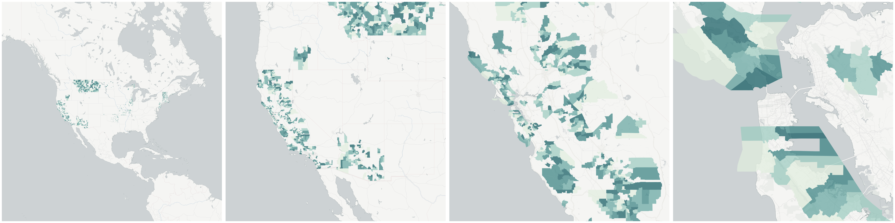](../../_images/us.census.tiger.school_district_elementary.png)School Districts are geographic entities within which state, county, local officials, the Bureau of Indian Affairs, or the U.S. Department of Defense provide public educational services for the area’s residents. The Census Bureau obtains the boundaries, names, local education agency codes, and school district levels for school districts from state and local school officials for the primary purpose of providing the U.S. Department of Education with estimates of the number of children “at risk” within each school district, county, and state. This information serves as the basis for the Department of Education to determine the annual allocation of Title I funding to states and school districts.

The Census Bureau tabulates data for three types of school districts: elementary, secondary, and unified. Each school district is assigned a five-digit code that is unique within state. School district codes are the local education agency number assigned by the Department of Education and are not necessarily in alphabetical order by school district name.

The elementary school districts provide education to the lower grade/age levels and the secondary school districts provide education to the upper grade/age levels. Unified school districts provide education to children of all school ages in their service areas. In general, where there is a unified school district, no elementary or secondary school district exists; and where there is an elementary school district, the secondary school district may or may not exist.

The Census Bureau’s representation of school districts in various data products is based both on the grade range that a school district operates and also the grade range for which the school district is financially responsible. For example, a school district is defined as an elementary school district if its operational grade range is less than the full kindergarten through 12 or prekindergarten through 12 grade range (for example, K–6 or pre-K–8). These elementary school districts do not provide direct educational services for grades 7–12, 9–12, or similar ranges. Some elementary school districts are financially responsible for the education of all school-aged children within their service areas and rely on other school districts to provide service for those grade ranges that are not operated by these elementary school districts. In these situations, in order to allocate all school-aged children to these school districts, the secondary school district code field is blank. For elementary school districts where the operational grade range and financially responsible grade range are the same, the secondary school district code field will contain a secondary school district code. There are no situations where an elementary school district does not exist and a secondary school district exists in Census Bureau records.

Obtain &quot;Elementary School District&quot; geometry at one point:

    INSERT INTO {tablename}(the_geom)
      SELECT OBS_GetBoundary(
        CDB_LatLng(40.7025, -73.7067),
        'us.census.tiger.school_district_elementary'
      )

Obtain all &quot;Elementary School District&quot; geometries within an area:

    INSERT INTO {new_table_name} (the_geom, {geo_id_column})
      SELECT *
      FROM OBS_GetBoundariesByGeometry(
        ST_Buffer(CDB_LatLng(40.7025, -73.7067), 0.01),
        'us.census.tiger.school_district_elementary'
      )

## Incorporated Places

Incorporated places are those reported to the Census Bureau as legally in existence as of January 1, 2010, as reported in the latest Boundary and Annexation Survey (BAS), under the laws of their respective states. An incorporated place is established to provide governmental functions for a concentration of people as opposed to a minor civil division, which generally is created to provide services or administer an area without regard, necessarily, to population. Places always are within a single state or equivalent entity, but may extend across county and county subdivision boundaries. An incorporated place usually is a city, town, village, or borough, but can have other legal descriptions. For Census Bureau data tabulation and presentation purposes, incorporated places exclude:

Boroughs in Alaska (treated as statistical equivalents of counties).
Towns in the New England states, New York, and Wisconsin (treated as MCDs).
Boroughs in New York (treated as MCDs).

Census Designated Places (CDPs) are the statistical counterparts of incorporated places, and are delineated to provide data for settled concentrations of population that are identifiable by name but are not legally incorporated under the laws of the state in which they are located. The boundaries usually are defined in cooperation with local or tribal officials and generally updated prior to each decennial census. These boundaries, which usually coincide with visible features or the boundary of an adjacent incorporated place or another legal entity boundary, have no legal status, nor do these places have officials elected to serve traditional municipal functions. CDP boundaries may change from one decennial census
to the next with changes in the settlement pattern; a CDP with the same name as in an earlier census does not necessarily have the same boundary. CDPs must be contained within a single state and may not extend into an incorporated place. There are no population size requirements for CDPs.

Hawaii is the only state that has no incorporated places recognized by the Census Bureau. All places shown in decennial census data products for Hawaii are CDPs. By agreement with the state of Hawaii, the Census Bureau does not show data separately for the city of Honolulu, which is coextensive with Honolulu County. In Puerto Rico, which also does not have incorporated places, the Census Bureau recognizes only CDPs and refers to them as comunidades or zonas urbanas. Guam also has only CDPs.

Obtain &quot;Incorporated Places&quot; geometry at one point:

    INSERT INTO {tablename}(the_geom)
      SELECT OBS_GetBoundary(
        CDB_LatLng(40.7, -73.9),
        'us.census.tiger.place'
      )

Obtain all &quot;Incorporated Places&quot; geometries within an area:

    INSERT INTO {new_table_name} (the_geom, {geo_id_column})
      SELECT *
      FROM OBS_GetBoundariesByGeometry(
        ST_Buffer(CDB_LatLng(40.7, -73.9), 0.01),
        'us.census.tiger.place'
      )

## Secondary School District

[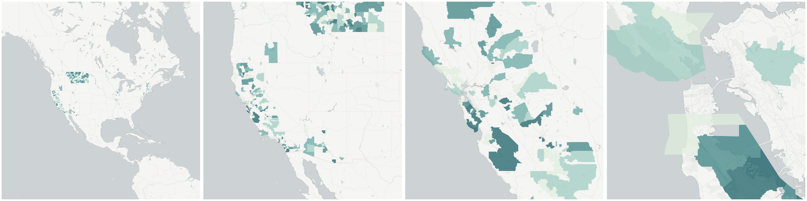](../../_images/us.census.tiger.school_district_secondary.png)School Districts are geographic entities within which state, county, local officials, the Bureau of Indian Affairs, or the U.S. Department of Defense provide public educational services for the area’s residents. The Census Bureau obtains the boundaries, names, local education agency codes, and school district levels for school districts from state and local school officials for the primary purpose of providing the U.S. Department of Education with estimates of the number of children “at risk” within each school district, county, and state. This information serves as the basis for the Department of Education to determine the annual allocation of Title I funding to states and school districts.

The Census Bureau tabulates data for three types of school districts: elementary, secondary, and unified. Each school district is assigned a five-digit code that is unique within state. School district codes are the local education agency number assigned by the Department of Education and are not necessarily in alphabetical order by school district name.

The elementary school districts provide education to the lower grade/age levels and the secondary school districts provide education to the upper grade/age levels. Unified school districts provide education to children of all school ages in their service areas. In general, where there is a unified school district, no elementary or secondary school district exists; and where there is an elementary school district, the secondary school district may or may not exist.

The Census Bureau’s representation of school districts in various data products is based both on the grade range that a school district operates and also the grade range for which the school district is financially responsible. For example, a school district is defined as an elementary school district if its operational grade range is less than the full kindergarten through 12 or prekindergarten through 12 grade range (for example, K–6 or pre-K–8). These elementary school districts do not provide direct educational services for grades 7–12, 9–12, or similar ranges. Some elementary school districts are financially responsible for the education of all school-aged children within their service areas and rely on other school districts to provide service for those grade ranges that are not operated by these elementary school districts. In these situations, in order to allocate all school-aged children to these school districts, the secondary school district code field is blank. For elementary school districts where the operational grade range and financially responsible grade range are the same, the secondary school district code field will contain a secondary school district code. There are no situations where an elementary school district does not exist and a secondary school district exists in Census Bureau records.

Obtain &quot;Secondary School District&quot; geometry at one point:

    INSERT INTO {tablename}(the_geom)
      SELECT OBS_GetBoundary(
        CDB_LatLng(40.7025, -73.7067),
        'us.census.tiger.school_district_secondary'
      )

Obtain all &quot;Secondary School District&quot; geometries within an area:

    INSERT INTO {new_table_name} (the_geom, {geo_id_column})
      SELECT *
      FROM OBS_GetBoundariesByGeometry(
        ST_Buffer(CDB_LatLng(40.7025, -73.7067), 0.01),
        'us.census.tiger.school_district_secondary'
      )

## Shoreline clipped Core Based Statistical Area (CBSA)

A cartography-ready version of Core Based Statistical Area (CBSA)

Obtain &quot;Shoreline clipped Core Based Statistical Area (CBSA)&quot; geometry at one point:

    INSERT INTO {tablename}(the_geom)
      SELECT OBS_GetBoundary(
        CDB_LatLng(40.7, -73.9),
        'us.census.tiger.cbsa_clipped'
      )

Obtain all &quot;Shoreline clipped Core Based Statistical Area (CBSA)&quot; geometries within an area:

    INSERT INTO {new_table_name} (the_geom, {geo_id_column})
      SELECT *
      FROM OBS_GetBoundariesByGeometry(
        ST_Buffer(CDB_LatLng(40.7, -73.9), 0.01),
        'us.census.tiger.cbsa_clipped'
      )

* cartography: [Core Based Statistical Area (CBSA)](#us-census-tiger-cbsa)

## Shoreline clipped Elementary School District

[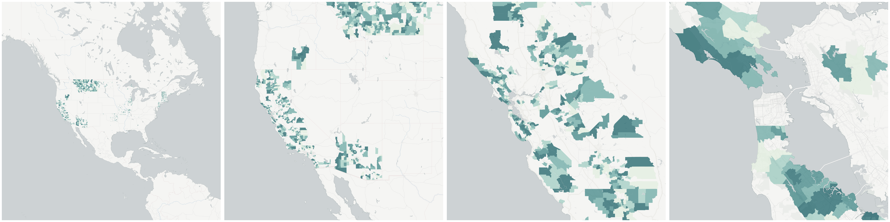](../../_images/us.census.tiger.school_district_elementary_clipped.png)A cartography-ready version of Elementary School District

Obtain &quot;Shoreline clipped Elementary School District&quot; geometry at one point:

    INSERT INTO {tablename}(the_geom)
      SELECT OBS_GetBoundary(
        CDB_LatLng(40.7, -73.9),
        'us.census.tiger.school_district_elementary_clipped'
      )

Obtain all &quot;Shoreline clipped Elementary School District&quot; geometries within an area:

    INSERT INTO {new_table_name} (the_geom, {geo_id_column})
      SELECT *
      FROM OBS_GetBoundariesByGeometry(
        ST_Buffer(CDB_LatLng(40.7, -73.9), 0.01),
        'us.census.tiger.school_district_elementary_clipped'
      )

* cartography: [Elementary School District](#us-census-tiger-school-district-elementary)

## Shoreline clipped Incorporated Places

[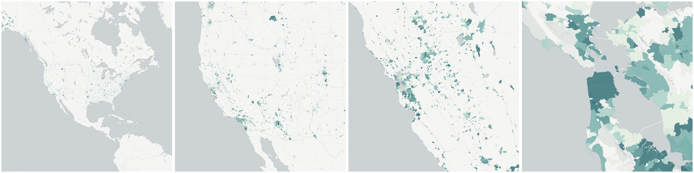](../../_images/us.census.tiger.place_clipped.png)A cartography-ready version of Incorporated Places

Obtain &quot;Shoreline clipped Incorporated Places&quot; geometry at one point:

    INSERT INTO {tablename}(the_geom)
      SELECT OBS_GetBoundary(
        CDB_LatLng(40.7, -73.9),
        'us.census.tiger.place_clipped'
      )

Obtain all &quot;Shoreline clipped Incorporated Places&quot; geometries within an area:

    INSERT INTO {new_table_name} (the_geom, {geo_id_column})
      SELECT *
      FROM OBS_GetBoundariesByGeometry(
        ST_Buffer(CDB_LatLng(40.7, -73.9), 0.01),
        'us.census.tiger.place_clipped'
      )

* cartography: [Incorporated Places](#us-census-tiger-place)

## Shoreline clipped Secondary School District

[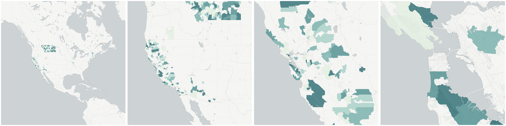](../../_images/us.census.tiger.school_district_secondary_clipped.png)A cartography-ready version of Secondary School District

Obtain &quot;Shoreline clipped Secondary School District&quot; geometry at one point:

    INSERT INTO {tablename}(the_geom)
      SELECT OBS_GetBoundary(
        CDB_LatLng(40.7, -73.9),
        'us.census.tiger.school_district_secondary_clipped'
      )

Obtain all &quot;Shoreline clipped Secondary School District&quot; geometries within an area:

    INSERT INTO {new_table_name} (the_geom, {geo_id_column})
      SELECT *
      FROM OBS_GetBoundariesByGeometry(
        ST_Buffer(CDB_LatLng(40.7, -73.9), 0.01),
        'us.census.tiger.school_district_secondary_clipped'
      )

* cartography: [Secondary School District](#us-census-tiger-school-district-secondary)

## Shoreline clipped US Census Block Groups

[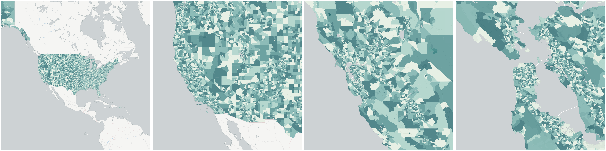](../../_images/us.census.tiger.block_group_clipped.png)A cartography-ready version of US Census Block Groups

Obtain &quot;Shoreline clipped US Census Block Groups&quot; geometry at one point:

    INSERT INTO {tablename}(the_geom)
      SELECT OBS_GetBoundary(
        CDB_LatLng(40.7, -73.9),
        'us.census.tiger.block_group_clipped'
      )

Obtain all &quot;Shoreline clipped US Census Block Groups&quot; geometries within an area:

    INSERT INTO {new_table_name} (the_geom, {geo_id_column})
      SELECT *
      FROM OBS_GetBoundariesByGeometry(
        ST_Buffer(CDB_LatLng(40.7, -73.9), 0.01),
        'us.census.tiger.block_group_clipped'
      )

* cartography: [US Census Block Groups](#us-census-tiger-block-group)

## Shoreline clipped US Census Public Use Microdata Areas

[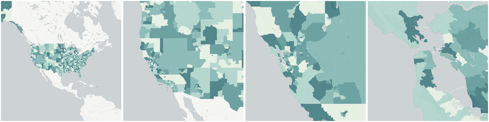](../../_images/us.census.tiger.puma_clipped.png)A cartography-ready version of US Census Public Use Microdata Areas

Obtain &quot;Shoreline clipped US Census Public Use Microdata Areas&quot; geometry at one point:

    INSERT INTO {tablename}(the_geom)
      SELECT OBS_GetBoundary(
        CDB_LatLng(40.7, -73.9),
        'us.census.tiger.puma_clipped'
      )

Obtain all &quot;Shoreline clipped US Census Public Use Microdata Areas&quot; geometries within an area:

    INSERT INTO {new_table_name} (the_geom, {geo_id_column})
      SELECT *
      FROM OBS_GetBoundariesByGeometry(
        ST_Buffer(CDB_LatLng(40.7, -73.9), 0.01),
        'us.census.tiger.puma_clipped'
      )

* cartography: [US Census Public Use Microdata Areas](#us-census-tiger-puma)

## Shoreline clipped US Census Tracts

[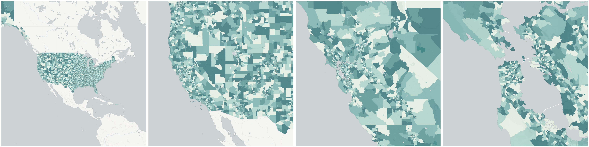](../../_images/us.census.tiger.census_tract_clipped.png)A cartography-ready version of US Census Tracts

Obtain &quot;Shoreline clipped US Census Tracts&quot; geometry at one point:

    INSERT INTO {tablename}(the_geom)
      SELECT OBS_GetBoundary(
        CDB_LatLng(40.7, -73.9),
        'us.census.tiger.census_tract_clipped'
      )

Obtain all &quot;Shoreline clipped US Census Tracts&quot; geometries within an area:

    INSERT INTO {new_table_name} (the_geom, {geo_id_column})
      SELECT *
      FROM OBS_GetBoundariesByGeometry(
        ST_Buffer(CDB_LatLng(40.7, -73.9), 0.01),
        'us.census.tiger.census_tract_clipped'
      )

* cartography: [US Census Tracts](#us-census-tiger-census-tract)

## Shoreline clipped US Census Zip Code Tabulation Areas

[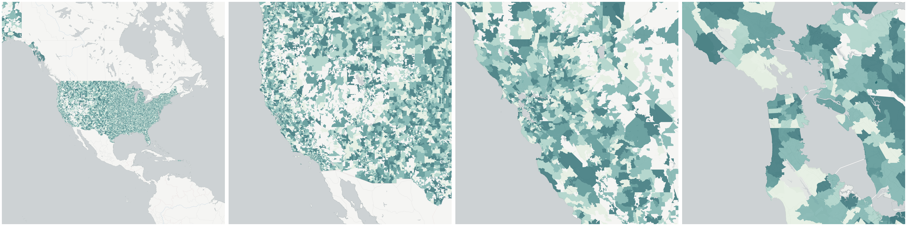](../../_images/us.census.tiger.zcta5_clipped.png)A cartography-ready version of US Census Zip Code Tabulation Areas

Obtain &quot;Shoreline clipped US Census Zip Code Tabulation Areas&quot; geometry at one point:

    INSERT INTO {tablename}(the_geom)
      SELECT OBS_GetBoundary(
        CDB_LatLng(40.7, -73.9),
        'us.census.tiger.zcta5_clipped'
      )

Obtain all &quot;Shoreline clipped US Census Zip Code Tabulation Areas&quot; geometries within an area:

    INSERT INTO {new_table_name} (the_geom, {geo_id_column})
      SELECT *
      FROM OBS_GetBoundariesByGeometry(
        ST_Buffer(CDB_LatLng(40.7, -73.9), 0.01),
        'us.census.tiger.zcta5_clipped'
      )

* cartography: [US Census Zip Code Tabulation Areas](#us-census-tiger-zcta5)

## Shoreline clipped US Congressional Districts

A cartography-ready version of US Congressional Districts

Obtain &quot;Shoreline clipped US Congressional Districts&quot; geometry at one point:

    INSERT INTO {tablename}(the_geom)
      SELECT OBS_GetBoundary(
        CDB_LatLng(40.7, -73.9),
        'us.census.tiger.congressional_district_clipped'
      )

Obtain all &quot;Shoreline clipped US Congressional Districts&quot; geometries within an area:

    INSERT INTO {new_table_name} (the_geom, {geo_id_column})
      SELECT *
      FROM OBS_GetBoundariesByGeometry(
        ST_Buffer(CDB_LatLng(40.7, -73.9), 0.01),
        'us.census.tiger.congressional_district_clipped'
      )

* cartography: [US Congressional Districts](#us-census-tiger-congressional-district)

## Shoreline clipped US County

[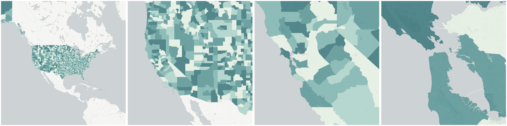](../../_images/us.census.tiger.county_clipped.png)A cartography-ready version of US County

Obtain &quot;Shoreline clipped US County&quot; geometry at one point:

    INSERT INTO {tablename}(the_geom)
      SELECT OBS_GetBoundary(
        CDB_LatLng(40.7, -73.9),
        'us.census.tiger.county_clipped'
      )

Obtain all &quot;Shoreline clipped US County&quot; geometries within an area:

    INSERT INTO {new_table_name} (the_geom, {geo_id_column})
      SELECT *
      FROM OBS_GetBoundariesByGeometry(
        ST_Buffer(CDB_LatLng(40.7, -73.9), 0.01),
        'us.census.tiger.county_clipped'
      )

* cartography: [US County](#us-census-tiger-county)

## Shoreline clipped US States

[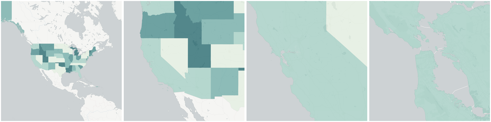](../../_images/us.census.tiger.state_clipped.png)A cartography-ready version of US States

Obtain &quot;Shoreline clipped US States&quot; geometry at one point:

    INSERT INTO {tablename}(the_geom)
      SELECT OBS_GetBoundary(
        CDB_LatLng(40.7, -73.9),
        'us.census.tiger.state_clipped'
      )

Obtain all &quot;Shoreline clipped US States&quot; geometries within an area:

    INSERT INTO {new_table_name} (the_geom, {geo_id_column})
      SELECT *
      FROM OBS_GetBoundariesByGeometry(
        ST_Buffer(CDB_LatLng(40.7, -73.9), 0.01),
        'us.census.tiger.state_clipped'
      )

* cartography: [US States](#us-census-tiger-state)

## Shoreline clipped Unified School District

[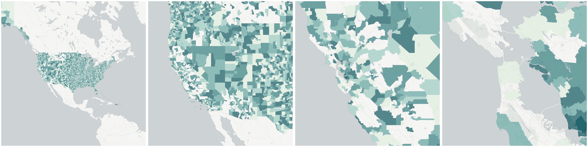](../../_images/us.census.tiger.school_district_unified_clipped.png)A cartography-ready version of Unified School District

Obtain &quot;Shoreline clipped Unified School District&quot; geometry at one point:

    INSERT INTO {tablename}(the_geom)
      SELECT OBS_GetBoundary(
        CDB_LatLng(40.7, -73.9),
        'us.census.tiger.school_district_unified_clipped'
      )

Obtain all &quot;Shoreline clipped Unified School District&quot; geometries within an area:

    INSERT INTO {new_table_name} (the_geom, {geo_id_column})
      SELECT *
      FROM OBS_GetBoundariesByGeometry(
        ST_Buffer(CDB_LatLng(40.7, -73.9), 0.01),
        'us.census.tiger.school_district_unified_clipped'
      )

* cartography: [Unified School District](#us-census-tiger-school-district-unified)

## Television Market Area

A television market area, also called a DMA, is a group of counties in the United States covered by a specific group of television stations.  There are 210 DMAs in the United States.

Obtain &quot;Television Market Area&quot; geometry at one point:

    INSERT INTO {tablename}(the_geom)
      SELECT OBS_GetBoundary(
        CDB_LatLng(40.7, -73.9),
        'us.dma.the_geom'
      )

Obtain all &quot;Television Market Area&quot; geometries within an area:

    INSERT INTO {new_table_name} (the_geom, {geo_id_column})
      SELECT *
      FROM OBS_GetBoundariesByGeometry(
        ST_Buffer(CDB_LatLng(40.7, -73.9), 0.01),
        'us.dma.the_geom'
      )

## US Census Block Groups

[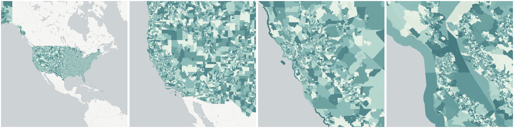](../../_images/us.census.tiger.block_group.png)Block groups (BGs) are statistical divisions of census tracts, are generally defined to contain between 600 and 3,000 people, and are used to present data and control block numbering. A block group consists of clusters of blocks within the same census tract that have the same first digit of their four-digit census block number. For example, blocks 3001, 3002, 3003, ..., 3999 in census tract 1210.02 belong to BG 3 in that census tract. Most BGs were delineated by local participants in the Census Bureau’s Participant Statistical Areas Program. The Census Bureau delineated BGs only where a local or tribal government declined to participate, and a regional organization or State Data Center was not available to participate.

A BG usually covers a contiguous area. Each census tract contains at least one BG, and BGs are uniquely numbered within the census tract. Within the standard census geographic hierarchy, BGs never cross state, county, or census tract boundaries but may cross the boundaries of any other geographic entity. Tribal census tracts and tribal BGs are separate and unique geographic areas defined within federally recognized American Indian reservations and can cross state and county boundaries (see “Tribal Census Tract” and “Tribal Block Group”). The tribal census tracts and tribal block groups may be completely different from the census tracts and block groups defined by state and county.

Obtain &quot;US Census Block Groups&quot; geometry at one point:

    INSERT INTO {tablename}(the_geom)
      SELECT OBS_GetBoundary(
        CDB_LatLng(40.7, -73.9),
        'us.census.tiger.block_group'
      )

Obtain all &quot;US Census Block Groups&quot; geometries within an area:

    INSERT INTO {new_table_name} (the_geom, {geo_id_column})
      SELECT *
      FROM OBS_GetBoundariesByGeometry(
        ST_Buffer(CDB_LatLng(40.7, -73.9), 0.01),
        'us.census.tiger.block_group'
      )

## US Census Public Use Microdata Areas

PUMAs are geographic areas for which the Census Bureau provides selected extracts of raw data from a small sample of census records that are screened to protect confidentiality. These extracts are referred to as public use microdata sample (PUMS) files.

For the 2010 Census, each state, the District of Columbia, Puerto Rico, and some Island Area participants delineated PUMAs for use in presenting PUMS data based on a 5 percent sample of decennial census or American Community Survey data. These areas are required to contain at least 100,000 people. This is different from Census 2000 when two types of PUMAs were defined: a 5 percent PUMA as for 2010 and an additional super-PUMA designed to provide a 1 percent sample. The PUMAs are identified by a five-digit census code unique within state.

Obtain &quot;US Census Public Use Microdata Areas&quot; geometry at one point:

    INSERT INTO {tablename}(the_geom)
      SELECT OBS_GetBoundary(
        CDB_LatLng(40.7, -73.9),
        'us.census.tiger.puma'
      )

Obtain all &quot;US Census Public Use Microdata Areas&quot; geometries within an area:

    INSERT INTO {new_table_name} (the_geom, {geo_id_column})
      SELECT *
      FROM OBS_GetBoundariesByGeometry(
        ST_Buffer(CDB_LatLng(40.7, -73.9), 0.01),
        'us.census.tiger.puma'
      )

## US Census Tracts

[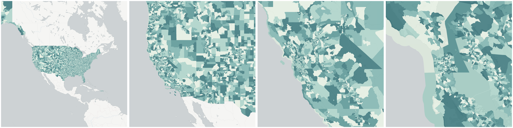](../../_images/us.census.tiger.census_tract.png)Census tracts are small, relatively permanent statistical subdivisions of a county or equivalent entity that are updated by local participants prior to each decennial census as part of the Census Bureau’s Participant Statistical Areas Program. The Census Bureau delineates census tracts in situations where no local participant existed or where state, local, or tribal governments declined to participate. The primary purpose of census tracts is to provide a stable set of geographic units for the presentation of statistical data.

Census tracts generally have a population size between 1,200 and 8,000 people, with an optimum size of 4,000 people. A census tract usually covers a contiguous area; however, the spatial size of census tracts varies widely depending on the density of settlement. Census tract boundaries are delineated with the intention of being maintained over a long time so that statistical comparisons can be made from census to census. Census tracts occasionally are split due to population growth or merged as a result of substantial population decline.

Census tract boundaries generally follow visible and identifiable features. They may follow nonvisible legal boundaries, such as minor civil division (MCD) or incorporated place boundaries in some states and situations, to allow for census-tract-to-governmental-unit relationships where the governmental boundaries tend to remain unchanged between censuses. State and county boundaries always are census tract boundaries in the standard census geographic hierarchy. Tribal census tracts are a unique geographic entity defined within federally recognized American Indian reservations and off-reservation trust lands and can cross state and county boundaries. Tribal census tracts may be completely different from the census tracts and block groups defined by state and county (see “Tribal Census Tract”).

Obtain &quot;US Census Tracts&quot; geometry at one point:

    INSERT INTO {tablename}(the_geom)
      SELECT OBS_GetBoundary(
        CDB_LatLng(40.7, -73.9),
        'us.census.tiger.census_tract'
      )

Obtain all &quot;US Census Tracts&quot; geometries within an area:

    INSERT INTO {new_table_name} (the_geom, {geo_id_column})
      SELECT *
      FROM OBS_GetBoundariesByGeometry(
        ST_Buffer(CDB_LatLng(40.7, -73.9), 0.01),
        'us.census.tiger.census_tract'
      )

## US Census Zip Code Tabulation Areas

[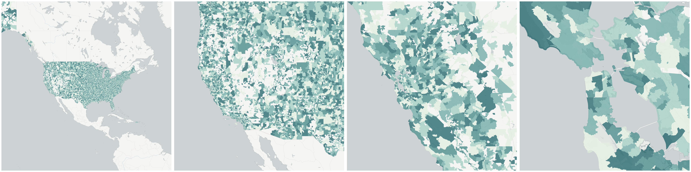](../../_images/us.census.tiger.zcta5.png)ZCTAs are approximate area representations of U.S. Postal Service (USPS) five-digit ZIP Code service areas that the Census Bureau creates using whole blocks to present statistical data from censuses and surveys. The Census Bureau defines ZCTAs by allocating each block that contains addresses to a single ZCTA, usually to the ZCTA that reflects the most frequently occurring ZIP Code for the addresses within that tabulation block. Blocks that do not contain addresses but are completely surrounded by a single ZCTA (enclaves) are assigned to the surrounding ZCTA; those surrounded by multiple ZCTAs will be added to a single ZCTA based on limited buffering performed between multiple ZCTAs. The Census Bureau identifies five-digit ZCTAs using a five-character numeric code that represents the most frequently occurring USPS ZIP Code within that ZCTA, and this code may contain leading zeros.

There are significant changes to the 2010 ZCTA delineation from that used in 2000. Coverage was extended to include the Island Areas for 2010 so that the United States, Puerto Rico, and the Island Areas have ZCTAs. Unlike 2000, when areas that could not be assigned to a ZCTA were given a generic code ending in “XX” (land area) or “HH” (water area), for 2010 there is no universal coverage by ZCTAs, and only legitimate five-digit areas are defined. The 2010 ZCTAs will better represent the actual Zip Code service areas because the Census Bureau initiated a process before creation of 2010 blocks to add block boundaries that split polygons with large numbers of addresses using different Zip Codes.

Data users should not use ZCTAs to identify the official USPS ZIP Code for mail delivery. The USPS makes periodic changes to ZIP Codes to support more efficient mail delivery. The ZCTAs process used primarily residential addresses and was biased towards Zip Codes used for city-style mail delivery, thus there may be Zip Codes that are primarily nonresidential or boxes only that may not have a corresponding ZCTA.

Obtain &quot;US Census Zip Code Tabulation Areas&quot; geometry at one point:

    INSERT INTO {tablename}(the_geom)
      SELECT OBS_GetBoundary(
        CDB_LatLng(40.7, -73.9),
        'us.census.tiger.zcta5'
      )

Obtain all &quot;US Census Zip Code Tabulation Areas&quot; geometries within an area:

    INSERT INTO {new_table_name} (the_geom, {geo_id_column})
      SELECT *
      FROM OBS_GetBoundariesByGeometry(
        ST_Buffer(CDB_LatLng(40.7, -73.9), 0.01),
        'us.census.tiger.zcta5'
      )

## US Congressional Districts

Congressional districts are the 435 areas from which people are elected to the U.S. House of Representatives. After the apportionment of congressional seats among the states based on decennial census population counts, each state with multiple seats is responsible for establishing congressional districts for the purpose of electing representatives. Each congressional district is to be as equal in population to all other congressional districts in a state as practicable. For the District of Columbia, Puerto Rico, and each Island Area, a separate code is used to identify the entire areas of these state-equivalent entities as having a single nonvoting delegate.

Obtain &quot;US Congressional Districts&quot; geometry at one point:

    INSERT INTO {tablename}(the_geom)
      SELECT OBS_GetBoundary(
        CDB_LatLng(40.7, -73.9),
        'us.census.tiger.congressional_district'
      )

Obtain all &quot;US Congressional Districts&quot; geometries within an area:

    INSERT INTO {new_table_name} (the_geom, {geo_id_column})
      SELECT *
      FROM OBS_GetBoundariesByGeometry(
        ST_Buffer(CDB_LatLng(40.7, -73.9), 0.01),
        'us.census.tiger.congressional_district'
      )

## US County

[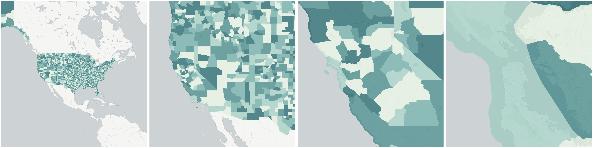](../../_images/us.census.tiger.county.png)The primary legal divisions of most states are termed counties. In Louisiana, these divisions are known as parishes. In Alaska, which has no counties, the equivalent entities are the organized boroughs, city and boroughs, municipalities, and census areas; the latter of which are delineated cooperatively for statistical purposes by the state of Alaska and the Census Bureau. In four states (Maryland, Missouri, Nevada, and Virginia), there are one or more incorporated places that are independent of any county organization and thus constitute primary divisions of their states. These incorporated places are known as independent cities and are treated as equivalent entities for purposes of data presentation. The District of Columbia and Guam have no primary divisions, and each area is considered an equivalent entity for purposes of data presentation. All of the counties in Connecticut and Rhode Island and nine counties in Massachusetts were dissolved as functioning governmental entities; however, the Census Bureau continues to present data for these historical entities in order to provide comparable geographic units at the county level of the geographic hierarchy for these states and represents them as nonfunctioning legal entities in data products. The Census Bureau treats the following entities as equivalents of counties for purposes of data presentation: municipios in Puerto Rico, districts and islands in American Samoa, municipalities in the Commonwealth of the Northern Mariana Islands, and islands in the U.S. Virgin Islands. Each county or statistically equivalent entity is assigned a three-character numeric Federal Information Processing Series (FIPS) code based on alphabetical sequence that is unique within state and an eight-digit National Standard feature identifier.

Obtain &quot;US County&quot; geometry at one point:

    INSERT INTO {tablename}(the_geom)
      SELECT OBS_GetBoundary(
        CDB_LatLng(40.7, -73.9),
        'us.census.tiger.county'
      )

Obtain all &quot;US County&quot; geometries within an area:

    INSERT INTO {new_table_name} (the_geom, {geo_id_column})
      SELECT *
      FROM OBS_GetBoundariesByGeometry(
        ST_Buffer(CDB_LatLng(40.7, -73.9), 0.01),
        'us.census.tiger.county'
      )

## US States

[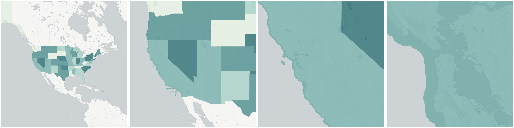](../../_images/us.census.tiger.state.png)States and Equivalent Entities are the primary governmental divisions of the United States. In addition to the 50 states, the Census Bureau treats the District of Columbia, Puerto Rico, American Samoa, the Commonwealth of the Northern Mariana Islands, Guam, and the U.S. Virgin Islands as the statistical equivalents of states for the purpose of data presentation.

Obtain &quot;US States&quot; geometry at one point:

    INSERT INTO {tablename}(the_geom)
      SELECT OBS_GetBoundary(
        CDB_LatLng(40.7, -73.9),
        'us.census.tiger.state'
      )

Obtain all &quot;US States&quot; geometries within an area:

    INSERT INTO {new_table_name} (the_geom, {geo_id_column})
      SELECT *
      FROM OBS_GetBoundariesByGeometry(
        ST_Buffer(CDB_LatLng(40.7, -73.9), 0.01),
        'us.census.tiger.state'
      )

## Unified School District

[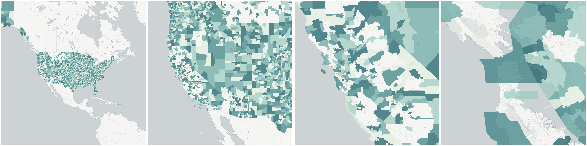](../../_images/us.census.tiger.school_district_unified.png)School Districts are geographic entities within which state, county, local officials, the Bureau of Indian Affairs, or the U.S. Department of Defense provide public educational services for the area’s residents. The Census Bureau obtains the boundaries, names, local education agency codes, and school district levels for school districts from state and local school officials for the primary purpose of providing the U.S. Department of Education with estimates of the number of children “at risk” within each school district, county, and state. This information serves as the basis for the Department of Education to determine the annual allocation of Title I funding to states and school districts.

The Census Bureau tabulates data for three types of school districts: elementary, secondary, and unified. Each school district is assigned a five-digit code that is unique within state. School district codes are the local education agency number assigned by the Department of Education and are not necessarily in alphabetical order by school district name.

The elementary school districts provide education to the lower grade/age levels and the secondary school districts provide education to the upper grade/age levels. Unified school districts provide education to children of all school ages in their service areas. In general, where there is a unified school district, no elementary or secondary school district exists; and where there is an elementary school district, the secondary school district may or may not exist.

The Census Bureau’s representation of school districts in various data products is based both on the grade range that a school district operates and also the grade range for which the school district is financially responsible. For example, a school district is defined as an elementary school district if its operational grade range is less than the full kindergarten through 12 or prekindergarten through 12 grade range (for example, K–6 or pre-K–8). These elementary school districts do not provide direct educational services for grades 7–12, 9–12, or similar ranges. Some elementary school districts are financially responsible for the education of all school-aged children within their service areas and rely on other school districts to provide service for those grade ranges that are not operated by these elementary school districts. In these situations, in order to allocate all school-aged children to these school districts, the secondary school district code field is blank. For elementary school districts where the operational grade range and financially responsible grade range are the same, the secondary school district code field will contain a secondary school district code. There are no situations where an elementary school district does not exist and a secondary school district exists in Census Bureau records.

Obtain &quot;Unified School District&quot; geometry at one point:

    INSERT INTO {tablename}(the_geom)
      SELECT OBS_GetBoundary(
        CDB_LatLng(40.7, -73.9),
        'us.census.tiger.school_district_unified'
      )

Obtain all &quot;Unified School District&quot; geometries within an area:

    INSERT INTO {new_table_name} (the_geom, {geo_id_column})
      SELECT *
      FROM OBS_GetBoundariesByGeometry(
        ST_Buffer(CDB_LatLng(40.7, -73.9), 0.01),
        'us.census.tiger.school_district_unified'
      )

