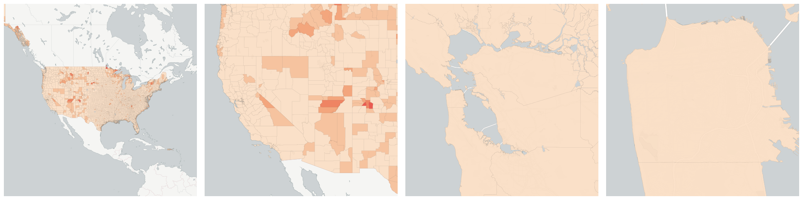
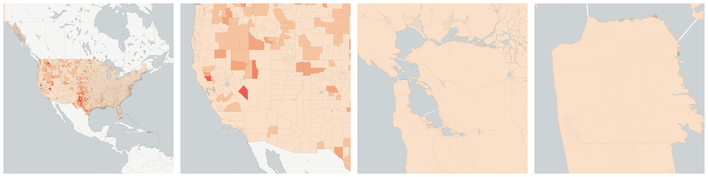

  
# Commerce &amp; Economy

Broader measures of economic and commercial activity.

- [Establishments in Accommodation and food services](#establishments-in-accommodation-and-food-services)

- [Establishments in Administrative and waste services](#establishments-in-administrative-and-waste-services)

- [Establishments in Agriculture, forestry, fishing and hunting](#establishments-in-agriculture-forestry-fishing-and-hunting)

- [Establishments in Arts, entertainment, and recreation](#establishments-in-arts-entertainment-and-recreation)

- [Establishments in Construction](#establishments-in-construction)

- [Establishments in Construction](#us-qcew-example-qtrly-estabs-23)

- [Establishments in Education and health services](#establishments-in-education-and-health-services)

- [Establishments in Educational services](#establishments-in-educational-services)

- [Establishments in Finance and insurance](#establishments-in-finance-and-insurance)

- [Establishments in Financial activities](#establishments-in-financial-activities)

- [Establishments in Health care and social assistance](#establishments-in-health-care-and-social-assistance)

- [Establishments in Information](#establishments-in-information)

- [Establishments in Information](#us-qcew-example-qtrly-estabs-51)

- [Establishments in Leisure and hospitality](#establishments-in-leisure-and-hospitality)

- [Establishments in Management of companies and enterprises](#establishments-in-management-of-companies-and-enterprises)

- [Establishments in Manufacturing](#establishments-in-manufacturing)

- [Establishments in Manufacturing](#us-qcew-example-qtrly-estabs-31-33)

- [Establishments in Mining, quarrying, and oil and gas extraction](#establishments-in-mining-quarrying-and-oil-and-gas-extraction)

- [Establishments in Natural resources and mining](#establishments-in-natural-resources-and-mining)

- [Establishments in Other services](#establishments-in-other-services)

- [Establishments in Other services, except public administration](#establishments-in-other-services-except-public-administration)

- [Establishments in Professional and business services](#establishments-in-professional-and-business-services)

- [Establishments in Professional and technical services](#establishments-in-professional-and-technical-services)

- [Establishments in Public administration](#establishments-in-public-administration)

- [Establishments in Public administration](#us-qcew-example-qtrly-estabs-92)

- [Establishments in Real estate and rental and leasing](#establishments-in-real-estate-and-rental-and-leasing)

- [Establishments in Retail trade](#establishments-in-retail-trade)

- [Establishments in Total, all industries](#establishments-in-total-all-industries)

- [Establishments in Total, all industries](#us-bls-qtrly-estabs-10)

    * [Establishments in Accommodation and food services](#us-bls-qtrly-estabs-72)

    * [Establishments in Administrative and waste services](#us-bls-qtrly-estabs-56)

    * [Establishments in Agriculture, forestry, fishing and hunting](#us-bls-qtrly-estabs-11)

    * [Establishments in Arts, entertainment, and recreation](#us-bls-qtrly-estabs-71)

    * [Establishments in Construction](#us-bls-qtrly-estabs-1012)

    * [Establishments in Construction](#us-bls-qtrly-estabs-23)

    * [Establishments in Education and health services](#us-bls-qtrly-estabs-1025)

    * [Establishments in Educational services](#us-bls-qtrly-estabs-61)

    * [Establishments in Finance and insurance](#us-bls-qtrly-estabs-52)

    * [Establishments in Financial activities](#us-bls-qtrly-estabs-1023)

    * [Establishments in Health care and social assistance](#us-bls-qtrly-estabs-62)

    * [Establishments in Information](#us-bls-qtrly-estabs-1022)

    * [Establishments in Information](#us-bls-qtrly-estabs-51)

    * [Establishments in Leisure and hospitality](#us-bls-qtrly-estabs-1026)

    * [Establishments in Management of companies and enterprises](#us-bls-qtrly-estabs-55)

    * [Establishments in Manufacturing](#us-bls-qtrly-estabs-31-33)

    * [Establishments in Manufacturing](#us-bls-qtrly-estabs-1013)

    * [Establishments in Mining, quarrying, and oil and gas extraction](#us-bls-qtrly-estabs-21)

    * [Establishments in Natural resources and mining](#us-bls-qtrly-estabs-1011)

    * [Establishments in Other services](#us-bls-qtrly-estabs-1027)

    * [Establishments in Other services, except public administration](#us-bls-qtrly-estabs-81)

    * [Establishments in Professional and business services](#us-bls-qtrly-estabs-1024)

    * [Establishments in Professional and technical services](#us-bls-qtrly-estabs-54)

    * [Establishments in Public administration](#us-bls-qtrly-estabs-92)

    * [Establishments in Public administration](#us-bls-qtrly-estabs-1028)

    * [Establishments in Real estate and rental and leasing](#us-bls-qtrly-estabs-53)

    * [Establishments in Retail trade](#us-bls-qtrly-estabs-44-45)

    * [Establishments in Trade, transportation, and utilities](#establishments-in-trade-transportation-and-utilities)

    * [Establishments in Transportation and warehousing](#establishments-in-transportation-and-warehousing)

    * [Establishments in Unclassified](#establishments-in-unclassified)

    * [Establishments in Unclassified](#us-bls-qtrly-estabs-99)

    * [Establishments in Utilities](#establishments-in-utilities)

    * [Establishments in Wholesale trade](#establishments-in-wholesale-trade)

- [Establishments in Trade, transportation, and utilities](#us-qcew-example-qtrly-estabs-1021)

- [Establishments in Transportation and warehousing](#us-qcew-example-qtrly-estabs-48-49)

- [Establishments in Unclassified](#us-qcew-example-qtrly-estabs-99)

- [Establishments in Unclassified](#us-qcew-example-qtrly-estabs-1029)

- [Establishments in Utilities](#us-qcew-example-qtrly-estabs-22)

- [Establishments in Wholesale trade](#us-qcew-example-qtrly-estabs-42)

- [Location quotient of establishments in Accommodation and food services](#location-quotient-of-establishments-in-accommodation-and-food-services)

- [Location quotient of establishments in Accommodation and food services](#us-bls-lq-qtrly-estabs-72)

- [Location quotient of establishments in Administrative and waste services](#location-quotient-of-establishments-in-administrative-and-waste-services)

- [Location quotient of establishments in Administrative and waste services](#us-bls-lq-qtrly-estabs-56)

- [Location quotient of establishments in Agriculture, forestry, fishing and hunting](#location-quotient-of-establishments-in-agriculture-forestry-fishing-and-hunting)

- [Location quotient of establishments in Agriculture, forestry, fishing and hunting](#us-bls-lq-qtrly-estabs-11)

- [Location quotient of establishments in Arts, entertainment, and recreation](#location-quotient-of-establishments-in-arts-entertainment-and-recreation)

- [Location quotient of establishments in Arts, entertainment, and recreation](#us-bls-lq-qtrly-estabs-71)

- [Location quotient of establishments in Construction](#location-quotient-of-establishments-in-construction)

- [Location quotient of establishments in Construction](#us-qcew-example-lq-qtrly-estabs-23)

- [Location quotient of establishments in Construction](#us-bls-lq-qtrly-estabs-1012)

- [Location quotient of establishments in Construction](#us-bls-lq-qtrly-estabs-23)

- [Location quotient of establishments in Education and health services](#location-quotient-of-establishments-in-education-and-health-services)

- [Location quotient of establishments in Education and health services](#us-bls-lq-qtrly-estabs-1025)

- [Location quotient of establishments in Educational services](#location-quotient-of-establishments-in-educational-services)

- [Location quotient of establishments in Educational services](#us-bls-lq-qtrly-estabs-61)

- [Location quotient of establishments in Finance and insurance](#location-quotient-of-establishments-in-finance-and-insurance)

- [Location quotient of establishments in Finance and insurance](#us-bls-lq-qtrly-estabs-52)

- [Location quotient of establishments in Financial activities](#location-quotient-of-establishments-in-financial-activities)

- [Location quotient of establishments in Financial activities](#us-bls-lq-qtrly-estabs-1023)

- [Location quotient of establishments in Health care and social assistance](#location-quotient-of-establishments-in-health-care-and-social-assistance)

- [Location quotient of establishments in Health care and social assistance](#us-bls-lq-qtrly-estabs-62)

- [Location quotient of establishments in Information](#location-quotient-of-establishments-in-information)

- [Location quotient of establishments in Information](#us-qcew-example-lq-qtrly-estabs-51)

- [Location quotient of establishments in Information](#us-bls-lq-qtrly-estabs-1022)

- [Location quotient of establishments in Information](#us-bls-lq-qtrly-estabs-51)

- [Location quotient of establishments in Leisure and hospitality](#location-quotient-of-establishments-in-leisure-and-hospitality)

- [Location quotient of establishments in Leisure and hospitality](#us-bls-lq-qtrly-estabs-1026)

- [Location quotient of establishments in Management of companies and enterprises](#location-quotient-of-establishments-in-management-of-companies-and-enterprises)

- [Location quotient of establishments in Management of companies and enterprises](#us-bls-lq-qtrly-estabs-55)

- [Location quotient of establishments in Manufacturing](#location-quotient-of-establishments-in-manufacturing)

- [Location quotient of establishments in Manufacturing](#us-qcew-example-lq-qtrly-estabs-31-33)

- [Location quotient of establishments in Manufacturing](#us-bls-lq-qtrly-estabs-1013)

- [Location quotient of establishments in Manufacturing](#us-bls-lq-qtrly-estabs-31-33)

- [Location quotient of establishments in Mining, quarrying, and oil and gas extraction](#location-quotient-of-establishments-in-mining-quarrying-and-oil-and-gas-extraction)

- [Location quotient of establishments in Mining, quarrying, and oil and gas extraction](#us-bls-lq-qtrly-estabs-21)

- [Location quotient of establishments in Natural resources and mining](#location-quotient-of-establishments-in-natural-resources-and-mining)

- [Location quotient of establishments in Natural resources and mining](#us-bls-lq-qtrly-estabs-1011)

- [Location quotient of establishments in Other services](#location-quotient-of-establishments-in-other-services)

- [Location quotient of establishments in Other services](#us-bls-lq-qtrly-estabs-1027)

- [Location quotient of establishments in Other services, except public administration](#location-quotient-of-establishments-in-other-services-except-public-administration)

- [Location quotient of establishments in Other services, except public administration](#us-bls-lq-qtrly-estabs-81)

- [Location quotient of establishments in Professional and business services](#location-quotient-of-establishments-in-professional-and-business-services)

- [Location quotient of establishments in Professional and business services](#us-bls-lq-qtrly-estabs-1024)

- [Location quotient of establishments in Professional and technical services](#location-quotient-of-establishments-in-professional-and-technical-services)

- [Location quotient of establishments in Professional and technical services](#us-bls-lq-qtrly-estabs-54)

- [Location quotient of establishments in Public administration](#location-quotient-of-establishments-in-public-administration)

- [Location quotient of establishments in Public administration](#us-qcew-example-lq-qtrly-estabs-92)

- [Location quotient of establishments in Public administration](#us-bls-lq-qtrly-estabs-1028)

- [Location quotient of establishments in Public administration](#us-bls-lq-qtrly-estabs-92)

- [Location quotient of establishments in Real estate and rental and leasing](#location-quotient-of-establishments-in-real-estate-and-rental-and-leasing)

- [Location quotient of establishments in Real estate and rental and leasing](#us-bls-lq-qtrly-estabs-53)

- [Location quotient of establishments in Retail trade](#location-quotient-of-establishments-in-retail-trade)

- [Location quotient of establishments in Retail trade](#us-bls-lq-qtrly-estabs-44-45)

- [Location quotient of establishments in Total, all industries](#location-quotient-of-establishments-in-total-all-industries)

- [Location quotient of establishments in Total, all industries](#us-bls-lq-qtrly-estabs-10)

- [Location quotient of establishments in Trade, transportation, and utilities](#location-quotient-of-establishments-in-trade-transportation-and-utilities)

- [Location quotient of establishments in Trade, transportation, and utilities](#us-bls-lq-qtrly-estabs-1021)

- [Location quotient of establishments in Transportation and warehousing](#location-quotient-of-establishments-in-transportation-and-warehousing)

- [Location quotient of establishments in Transportation and warehousing](#us-bls-lq-qtrly-estabs-48-49)

- [Location quotient of establishments in Unclassified](#location-quotient-of-establishments-in-unclassified)

- [Location quotient of establishments in Unclassified](#us-qcew-example-lq-qtrly-estabs-1029)

- [Location quotient of establishments in Unclassified](#us-bls-lq-qtrly-estabs-99)

- [Location quotient of establishments in Unclassified](#us-bls-lq-qtrly-estabs-1029)

- [Location quotient of establishments in Utilities](#location-quotient-of-establishments-in-utilities)

- [Location quotient of establishments in Utilities](#us-bls-lq-qtrly-estabs-22)

- [Location quotient of establishments in Wholesale trade](#location-quotient-of-establishments-in-wholesale-trade)

- [Location quotient of establishments in Wholesale trade](#us-bls-lq-qtrly-estabs-42)

## Establishments in Accommodation and food services

Count of establishments in a given quarter in the Accommodation and food services industry (NAICS 72).Accommodation and food services is .

Measure &quot;Establishments in Accommodation and food services&quot;  density per sq. kilometer  for one point:

    UPDATE {table_name}
      SET {new_numeric_column} =
        OBS_GetMeasure(
          CDB_LatLng(40.7, -73.9),
          'us.qcew-example.qtrly_estabs_72'
        );

Measure &quot;Establishments in Accommodation and food services&quot; within an area:

    UPDATE {table_name}
      SET {new_numeric_column} =
        OBS_GetMeasure(
          ST_Buffer(CDB_LatLng(40.7, -73.9), 0.01),
          'us.qcew-example.qtrly_estabs_72'
        );

## Establishments in Administrative and waste services

Count of establishments in a given quarter in the Administrative and waste services industry (NAICS 56).Administrative and waste services is .

Measure &quot;Establishments in Administrative and waste services&quot;  density per sq. kilometer  for one point:

    UPDATE {table_name}
      SET {new_numeric_column} =
        OBS_GetMeasure(
          CDB_LatLng(40.7, -73.9),
          'us.qcew-example.qtrly_estabs_56'
        );

Measure &quot;Establishments in Administrative and waste services&quot; within an area:

    UPDATE {table_name}
      SET {new_numeric_column} =
        OBS_GetMeasure(
          ST_Buffer(CDB_LatLng(40.7, -73.9), 0.01),
          'us.qcew-example.qtrly_estabs_56'
        );

## Establishments in Agriculture, forestry, fishing and hunting

Count of establishments in a given quarter in the Agriculture, forestry, fishing and hunting industry (NAICS 11).Agriculture, forestry, fishing and hunting is .

Measure &quot;Establishments in Agriculture, forestry, fishing and hunting&quot;  density per sq. kilometer  for one point:

    UPDATE {table_name}
      SET {new_numeric_column} =
        OBS_GetMeasure(
          CDB_LatLng(40.7, -73.9),
          'us.qcew-example.qtrly_estabs_11'
        );

Measure &quot;Establishments in Agriculture, forestry, fishing and hunting&quot; within an area:

    UPDATE {table_name}
      SET {new_numeric_column} =
        OBS_GetMeasure(
          ST_Buffer(CDB_LatLng(40.7, -73.9), 0.01),
          'us.qcew-example.qtrly_estabs_11'
        );

## Establishments in Arts, entertainment, and recreation

Count of establishments in a given quarter in the Arts, entertainment, and recreation industry (NAICS 71).Arts, entertainment, and recreation is .

Measure &quot;Establishments in Arts, entertainment, and recreation&quot;  density per sq. kilometer  for one point:

    UPDATE {table_name}
      SET {new_numeric_column} =
        OBS_GetMeasure(
          CDB_LatLng(40.7, -73.9),
          'us.qcew-example.qtrly_estabs_71'
        );

Measure &quot;Establishments in Arts, entertainment, and recreation&quot; within an area:

    UPDATE {table_name}
      SET {new_numeric_column} =
        OBS_GetMeasure(
          ST_Buffer(CDB_LatLng(40.7, -73.9), 0.01),
          'us.qcew-example.qtrly_estabs_71'
        );

## Establishments in Construction

Count of establishments in a given quarter in the Construction industry (NAICS 1012).Construction is .

Measure &quot;Establishments in Construction&quot;  density per sq. kilometer  for one point:

    UPDATE {table_name}
      SET {new_numeric_column} =
        OBS_GetMeasure(
          CDB_LatLng(40.7, -73.9),
          'us.qcew-example.qtrly_estabs_1012'
        );

Measure &quot;Establishments in Construction&quot; within an area:

    UPDATE {table_name}
      SET {new_numeric_column} =
        OBS_GetMeasure(
          ST_Buffer(CDB_LatLng(40.7, -73.9), 0.01),
          'us.qcew-example.qtrly_estabs_1012'
        );

## Establishments in Construction

Count of establishments in a given quarter in the Construction industry (NAICS 23).Construction is .

Measure &quot;Establishments in Construction&quot;  density per sq. kilometer  for one point:

    UPDATE {table_name}
      SET {new_numeric_column} =
        OBS_GetMeasure(
          CDB_LatLng(40.7, -73.9),
          'us.qcew-example.qtrly_estabs_23'
        );

Measure &quot;Establishments in Construction&quot; within an area:

    UPDATE {table_name}
      SET {new_numeric_column} =
        OBS_GetMeasure(
          ST_Buffer(CDB_LatLng(40.7, -73.9), 0.01),
          'us.qcew-example.qtrly_estabs_23'
        );

## Establishments in Education and health services

Count of establishments in a given quarter in the Education and health services industry (NAICS 1025).Education and health services is .

Measure &quot;Establishments in Education and health services&quot;  density per sq. kilometer  for one point:

    UPDATE {table_name}
      SET {new_numeric_column} =
        OBS_GetMeasure(
          CDB_LatLng(40.7, -73.9),
          'us.qcew-example.qtrly_estabs_1025'
        );

Measure &quot;Establishments in Education and health services&quot; within an area:

    UPDATE {table_name}
      SET {new_numeric_column} =
        OBS_GetMeasure(
          ST_Buffer(CDB_LatLng(40.7, -73.9), 0.01),
          'us.qcew-example.qtrly_estabs_1025'
        );

## Establishments in Educational services

Count of establishments in a given quarter in the Educational services industry (NAICS 61).Educational services is .

Measure &quot;Establishments in Educational services&quot;  density per sq. kilometer  for one point:

    UPDATE {table_name}
      SET {new_numeric_column} =
        OBS_GetMeasure(
          CDB_LatLng(40.7, -73.9),
          'us.qcew-example.qtrly_estabs_61'
        );

Measure &quot;Establishments in Educational services&quot; within an area:

    UPDATE {table_name}
      SET {new_numeric_column} =
        OBS_GetMeasure(
          ST_Buffer(CDB_LatLng(40.7, -73.9), 0.01),
          'us.qcew-example.qtrly_estabs_61'
        );

## Establishments in Finance and insurance

Count of establishments in a given quarter in the Finance and insurance industry (NAICS 52).Finance and insurance is .

Measure &quot;Establishments in Finance and insurance&quot;  density per sq. kilometer  for one point:

    UPDATE {table_name}
      SET {new_numeric_column} =
        OBS_GetMeasure(
          CDB_LatLng(40.7, -73.9),
          'us.qcew-example.qtrly_estabs_52'
        );

Measure &quot;Establishments in Finance and insurance&quot; within an area:

    UPDATE {table_name}
      SET {new_numeric_column} =
        OBS_GetMeasure(
          ST_Buffer(CDB_LatLng(40.7, -73.9), 0.01),
          'us.qcew-example.qtrly_estabs_52'
        );

## Establishments in Financial activities

Count of establishments in a given quarter in the Financial activities industry (NAICS 1023).Financial activities is .

Measure &quot;Establishments in Financial activities&quot;  density per sq. kilometer  for one point:

    UPDATE {table_name}
      SET {new_numeric_column} =
        OBS_GetMeasure(
          CDB_LatLng(40.7, -73.9),
          'us.qcew-example.qtrly_estabs_1023'
        );

Measure &quot;Establishments in Financial activities&quot; within an area:

    UPDATE {table_name}
      SET {new_numeric_column} =
        OBS_GetMeasure(
          ST_Buffer(CDB_LatLng(40.7, -73.9), 0.01),
          'us.qcew-example.qtrly_estabs_1023'
        );

## Establishments in Health care and social assistance

Count of establishments in a given quarter in the Health care and social assistance industry (NAICS 62).Health care and social assistance is .

Measure &quot;Establishments in Health care and social assistance&quot;  density per sq. kilometer  for one point:

    UPDATE {table_name}
      SET {new_numeric_column} =
        OBS_GetMeasure(
          CDB_LatLng(40.7, -73.9),
          'us.qcew-example.qtrly_estabs_62'
        );

Measure &quot;Establishments in Health care and social assistance&quot; within an area:

    UPDATE {table_name}
      SET {new_numeric_column} =
        OBS_GetMeasure(
          ST_Buffer(CDB_LatLng(40.7, -73.9), 0.01),
          'us.qcew-example.qtrly_estabs_62'
        );

## Establishments in Information

Count of establishments in a given quarter in the Information industry (NAICS 1022).Information is .

Measure &quot;Establishments in Information&quot;  density per sq. kilometer  for one point:

    UPDATE {table_name}
      SET {new_numeric_column} =
        OBS_GetMeasure(
          CDB_LatLng(40.7, -73.9),
          'us.qcew-example.qtrly_estabs_1022'
        );

Measure &quot;Establishments in Information&quot; within an area:

    UPDATE {table_name}
      SET {new_numeric_column} =
        OBS_GetMeasure(
          ST_Buffer(CDB_LatLng(40.7, -73.9), 0.01),
          'us.qcew-example.qtrly_estabs_1022'
        );

## Establishments in Information

Count of establishments in a given quarter in the Information industry (NAICS 51).Information is .

Measure &quot;Establishments in Information&quot;  density per sq. kilometer  for one point:

    UPDATE {table_name}
      SET {new_numeric_column} =
        OBS_GetMeasure(
          CDB_LatLng(40.7, -73.9),
          'us.qcew-example.qtrly_estabs_51'
        );

Measure &quot;Establishments in Information&quot; within an area:

    UPDATE {table_name}
      SET {new_numeric_column} =
        OBS_GetMeasure(
          ST_Buffer(CDB_LatLng(40.7, -73.9), 0.01),
          'us.qcew-example.qtrly_estabs_51'
        );

## Establishments in Leisure and hospitality

Count of establishments in a given quarter in the Leisure and hospitality industry (NAICS 1026).Leisure and hospitality is .

Measure &quot;Establishments in Leisure and hospitality&quot;  density per sq. kilometer  for one point:

    UPDATE {table_name}
      SET {new_numeric_column} =
        OBS_GetMeasure(
          CDB_LatLng(40.7, -73.9),
          'us.qcew-example.qtrly_estabs_1026'
        );

Measure &quot;Establishments in Leisure and hospitality&quot; within an area:

    UPDATE {table_name}
      SET {new_numeric_column} =
        OBS_GetMeasure(
          ST_Buffer(CDB_LatLng(40.7, -73.9), 0.01),
          'us.qcew-example.qtrly_estabs_1026'
        );

## Establishments in Management of companies and enterprises

Count of establishments in a given quarter in the Management of companies and enterprises industry (NAICS 55).Management of companies and enterprises is .

Measure &quot;Establishments in Management of companies and enterprises&quot;  density per sq. kilometer  for one point:

    UPDATE {table_name}
      SET {new_numeric_column} =
        OBS_GetMeasure(
          CDB_LatLng(40.7, -73.9),
          'us.qcew-example.qtrly_estabs_55'
        );

Measure &quot;Establishments in Management of companies and enterprises&quot; within an area:

    UPDATE {table_name}
      SET {new_numeric_column} =
        OBS_GetMeasure(
          ST_Buffer(CDB_LatLng(40.7, -73.9), 0.01),
          'us.qcew-example.qtrly_estabs_55'
        );

## Establishments in Manufacturing

Count of establishments in a given quarter in the Manufacturing industry (NAICS 1013).Manufacturing is .

Measure &quot;Establishments in Manufacturing&quot;  density per sq. kilometer  for one point:

    UPDATE {table_name}
      SET {new_numeric_column} =
        OBS_GetMeasure(
          CDB_LatLng(40.7, -73.9),
          'us.qcew-example.qtrly_estabs_1013'
        );

Measure &quot;Establishments in Manufacturing&quot; within an area:

    UPDATE {table_name}
      SET {new_numeric_column} =
        OBS_GetMeasure(
          ST_Buffer(CDB_LatLng(40.7, -73.9), 0.01),
          'us.qcew-example.qtrly_estabs_1013'
        );

## Establishments in Manufacturing

Count of establishments in a given quarter in the Manufacturing industry (NAICS 31-33).Manufacturing is .

Measure &quot;Establishments in Manufacturing&quot;  density per sq. kilometer  for one point:

    UPDATE {table_name}
      SET {new_numeric_column} =
        OBS_GetMeasure(
          CDB_LatLng(40.7, -73.9),
          'us.qcew-example.qtrly_estabs_31_33'
        );

Measure &quot;Establishments in Manufacturing&quot; within an area:

    UPDATE {table_name}
      SET {new_numeric_column} =
        OBS_GetMeasure(
          ST_Buffer(CDB_LatLng(40.7, -73.9), 0.01),
          'us.qcew-example.qtrly_estabs_31_33'
        );

## Establishments in Mining, quarrying, and oil and gas extraction

Count of establishments in a given quarter in the Mining, quarrying, and oil and gas extraction industry (NAICS 21).Mining, quarrying, and oil and gas extraction is .

Measure &quot;Establishments in Mining, quarrying, and oil and gas extraction&quot;  density per sq. kilometer  for one point:

    UPDATE {table_name}
      SET {new_numeric_column} =
        OBS_GetMeasure(
          CDB_LatLng(40.7, -73.9),
          'us.qcew-example.qtrly_estabs_21'
        );

Measure &quot;Establishments in Mining, quarrying, and oil and gas extraction&quot; within an area:

    UPDATE {table_name}
      SET {new_numeric_column} =
        OBS_GetMeasure(
          ST_Buffer(CDB_LatLng(40.7, -73.9), 0.01),
          'us.qcew-example.qtrly_estabs_21'
        );

## Establishments in Natural resources and mining

Count of establishments in a given quarter in the Natural resources and mining industry (NAICS 1011).Natural resources and mining is .

Measure &quot;Establishments in Natural resources and mining&quot;  density per sq. kilometer  for one point:

    UPDATE {table_name}
      SET {new_numeric_column} =
        OBS_GetMeasure(
          CDB_LatLng(40.7, -73.9),
          'us.qcew-example.qtrly_estabs_1011'
        );

Measure &quot;Establishments in Natural resources and mining&quot; within an area:

    UPDATE {table_name}
      SET {new_numeric_column} =
        OBS_GetMeasure(
          ST_Buffer(CDB_LatLng(40.7, -73.9), 0.01),
          'us.qcew-example.qtrly_estabs_1011'
        );

## Establishments in Other services

Count of establishments in a given quarter in the Other services industry (NAICS 1027).Other services is .

Measure &quot;Establishments in Other services&quot;  density per sq. kilometer  for one point:

    UPDATE {table_name}
      SET {new_numeric_column} =
        OBS_GetMeasure(
          CDB_LatLng(40.7, -73.9),
          'us.qcew-example.qtrly_estabs_1027'
        );

Measure &quot;Establishments in Other services&quot; within an area:

    UPDATE {table_name}
      SET {new_numeric_column} =
        OBS_GetMeasure(
          ST_Buffer(CDB_LatLng(40.7, -73.9), 0.01),
          'us.qcew-example.qtrly_estabs_1027'
        );

## Establishments in Other services, except public administration

Count of establishments in a given quarter in the Other services, except public administration industry (NAICS 81).Other services, except public administration is .

Measure &quot;Establishments in Other services, except public administration&quot;  density per sq. kilometer  for one point:

    UPDATE {table_name}
      SET {new_numeric_column} =
        OBS_GetMeasure(
          CDB_LatLng(40.7, -73.9),
          'us.qcew-example.qtrly_estabs_81'
        );

Measure &quot;Establishments in Other services, except public administration&quot; within an area:

    UPDATE {table_name}
      SET {new_numeric_column} =
        OBS_GetMeasure(
          ST_Buffer(CDB_LatLng(40.7, -73.9), 0.01),
          'us.qcew-example.qtrly_estabs_81'
        );

## Establishments in Professional and business services

Count of establishments in a given quarter in the Professional and business services industry (NAICS 1024).Professional and business services is .

Measure &quot;Establishments in Professional and business services&quot;  density per sq. kilometer  for one point:

    UPDATE {table_name}
      SET {new_numeric_column} =
        OBS_GetMeasure(
          CDB_LatLng(40.7, -73.9),
          'us.qcew-example.qtrly_estabs_1024'
        );

Measure &quot;Establishments in Professional and business services&quot; within an area:

    UPDATE {table_name}
      SET {new_numeric_column} =
        OBS_GetMeasure(
          ST_Buffer(CDB_LatLng(40.7, -73.9), 0.01),
          'us.qcew-example.qtrly_estabs_1024'
        );

## Establishments in Professional and technical services

Count of establishments in a given quarter in the Professional and technical services industry (NAICS 54).Professional and technical services is .

Measure &quot;Establishments in Professional and technical services&quot;  density per sq. kilometer  for one point:

    UPDATE {table_name}
      SET {new_numeric_column} =
        OBS_GetMeasure(
          CDB_LatLng(40.7, -73.9),
          'us.qcew-example.qtrly_estabs_54'
        );

Measure &quot;Establishments in Professional and technical services&quot; within an area:

    UPDATE {table_name}
      SET {new_numeric_column} =
        OBS_GetMeasure(
          ST_Buffer(CDB_LatLng(40.7, -73.9), 0.01),
          'us.qcew-example.qtrly_estabs_54'
        );

## Establishments in Public administration

Count of establishments in a given quarter in the Public administration industry (NAICS 1028).Public administration is .

Measure &quot;Establishments in Public administration&quot;  density per sq. kilometer  for one point:

    UPDATE {table_name}
      SET {new_numeric_column} =
        OBS_GetMeasure(
          CDB_LatLng(40.7, -73.9),
          'us.qcew-example.qtrly_estabs_1028'
        );

Measure &quot;Establishments in Public administration&quot; within an area:

    UPDATE {table_name}
      SET {new_numeric_column} =
        OBS_GetMeasure(
          ST_Buffer(CDB_LatLng(40.7, -73.9), 0.01),
          'us.qcew-example.qtrly_estabs_1028'
        );

## Establishments in Public administration

Count of establishments in a given quarter in the Public administration industry (NAICS 92).Public administration is .

Measure &quot;Establishments in Public administration&quot;  density per sq. kilometer  for one point:

    UPDATE {table_name}
      SET {new_numeric_column} =
        OBS_GetMeasure(
          CDB_LatLng(40.7, -73.9),
          'us.qcew-example.qtrly_estabs_92'
        );

Measure &quot;Establishments in Public administration&quot; within an area:

    UPDATE {table_name}
      SET {new_numeric_column} =
        OBS_GetMeasure(
          ST_Buffer(CDB_LatLng(40.7, -73.9), 0.01),
          'us.qcew-example.qtrly_estabs_92'
        );

## Establishments in Real estate and rental and leasing

Count of establishments in a given quarter in the Real estate and rental and leasing industry (NAICS 53).Real estate and rental and leasing is .

Measure &quot;Establishments in Real estate and rental and leasing&quot;  density per sq. kilometer  for one point:

    UPDATE {table_name}
      SET {new_numeric_column} =
        OBS_GetMeasure(
          CDB_LatLng(40.7, -73.9),
          'us.qcew-example.qtrly_estabs_53'
        );

Measure &quot;Establishments in Real estate and rental and leasing&quot; within an area:

    UPDATE {table_name}
      SET {new_numeric_column} =
        OBS_GetMeasure(
          ST_Buffer(CDB_LatLng(40.7, -73.9), 0.01),
          'us.qcew-example.qtrly_estabs_53'
        );

## Establishments in Retail trade

Count of establishments in a given quarter in the Retail trade industry (NAICS 44-45).Retail trade is .

Measure &quot;Establishments in Retail trade&quot;  density per sq. kilometer  for one point:

    UPDATE {table_name}
      SET {new_numeric_column} =
        OBS_GetMeasure(
          CDB_LatLng(40.7, -73.9),
          'us.qcew-example.qtrly_estabs_44_45'
        );

Measure &quot;Establishments in Retail trade&quot; within an area:

    UPDATE {table_name}
      SET {new_numeric_column} =
        OBS_GetMeasure(
          ST_Buffer(CDB_LatLng(40.7, -73.9), 0.01),
          'us.qcew-example.qtrly_estabs_44_45'
        );

## Establishments in Total, all industries

Count of establishments in a given quarter in the Total, all industries industry (NAICS 10).Total, all industries is .

Measure &quot;Establishments in Total, all industries&quot;  density per sq. kilometer  for one point:

    UPDATE {table_name}
      SET {new_numeric_column} =
        OBS_GetMeasure(
          CDB_LatLng(40.7, -73.9),
          'us.qcew-example.qtrly_estabs_10'
        );

Measure &quot;Establishments in Total, all industries&quot; within an area:

    UPDATE {table_name}
      SET {new_numeric_column} =
        OBS_GetMeasure(
          ST_Buffer(CDB_LatLng(40.7, -73.9), 0.01),
          'us.qcew-example.qtrly_estabs_10'
        );

## Establishments in Total, all industries

Count of establishments in a given quarter in the Total, all industries industry (NAICS 10).Total, all industries is .

Measure &quot;Establishments in Total, all industries&quot;  density per sq. kilometer  for one point:

    UPDATE {table_name}
      SET {new_numeric_column} =
        OBS_GetMeasure(
          CDB_LatLng(40.7, -73.9),
          'us.bls.qtrly_estabs_10'
        );

Measure &quot;Establishments in Total, all industries&quot; within an area:

    UPDATE {table_name}
      SET {new_numeric_column} =
        OBS_GetMeasure(
          ST_Buffer(CDB_LatLng(40.7, -73.9), 0.01),
          'us.bls.qtrly_estabs_10'
        );

Subcolumns of Establishments in Total, all industries

- [Establishments in Accommodation and food services](#us-bls-qtrly-estabs-72)

- [Establishments in Administrative and waste services](#us-bls-qtrly-estabs-56)

- [Establishments in Agriculture, forestry, fishing and hunting](#us-bls-qtrly-estabs-11)

- [Establishments in Arts, entertainment, and recreation](#us-bls-qtrly-estabs-71)

- [Establishments in Construction](#us-bls-qtrly-estabs-1012)

- [Establishments in Construction](#us-bls-qtrly-estabs-23)

- [Establishments in Education and health services](#us-bls-qtrly-estabs-1025)

- [Establishments in Educational services](#us-bls-qtrly-estabs-61)

- [Establishments in Finance and insurance](#us-bls-qtrly-estabs-52)

- [Establishments in Financial activities](#us-bls-qtrly-estabs-1023)

- [Establishments in Health care and social assistance](#us-bls-qtrly-estabs-62)

- [Establishments in Information](#us-bls-qtrly-estabs-1022)

- [Establishments in Information](#us-bls-qtrly-estabs-51)

- [Establishments in Leisure and hospitality](#us-bls-qtrly-estabs-1026)

- [Establishments in Management of companies and enterprises](#us-bls-qtrly-estabs-55)

- [Establishments in Manufacturing](#us-bls-qtrly-estabs-31-33)

- [Establishments in Manufacturing](#us-bls-qtrly-estabs-1013)

- [Establishments in Mining, quarrying, and oil and gas extraction](#us-bls-qtrly-estabs-21)

- [Establishments in Natural resources and mining](#us-bls-qtrly-estabs-1011)

- [Establishments in Other services](#us-bls-qtrly-estabs-1027)

- [Establishments in Other services, except public administration](#us-bls-qtrly-estabs-81)

- [Establishments in Professional and business services](#us-bls-qtrly-estabs-1024)

- [Establishments in Professional and technical services](#us-bls-qtrly-estabs-54)

- [Establishments in Public administration](#us-bls-qtrly-estabs-92)

- [Establishments in Public administration](#us-bls-qtrly-estabs-1028)

- [Establishments in Real estate and rental and leasing](#us-bls-qtrly-estabs-53)

- [Establishments in Retail trade](#us-bls-qtrly-estabs-44-45)

- [Establishments in Trade, transportation, and utilities](#establishments-in-trade-transportation-and-utilities)

- [Establishments in Transportation and warehousing](#establishments-in-transportation-and-warehousing)

- [Establishments in Unclassified](#establishments-in-unclassified)

- [Establishments in Unclassified](#us-bls-qtrly-estabs-99)

- [Establishments in Utilities](#establishments-in-utilities)

- [Establishments in Wholesale trade](#establishments-in-wholesale-trade)

### Establishments in Accommodation and food services

Count of establishments in a given quarter in the Accommodation and food services industry (NAICS 72).Accommodation and food services is .

Measure &quot;Establishments in Accommodation and food services&quot;  density per sq. kilometer  for one point:

    UPDATE {table_name}
      SET {new_numeric_column} =
        OBS_GetMeasure(
          CDB_LatLng(40.7, -73.9),
          'us.bls.qtrly_estabs_72'
        );

Measure &quot;Establishments in Accommodation and food services&quot; within an area:

    UPDATE {table_name}
      SET {new_numeric_column} =
        OBS_GetMeasure(
          ST_Buffer(CDB_LatLng(40.7, -73.9), 0.01),
          'us.bls.qtrly_estabs_72'
        );

Measure &quot;Establishments in Accommodation and food services&quot; percent of &quot;Establishments in Total, all industries&quot; at one point:

    UPDATE {table_name}
      SET {new_numeric_column} =
        OBS_GetMeasure(
          CDB_LatLng(40.7, -73.9),
          'us.bls.qtrly_estabs_72',
          'denominator'
        );

Measure &quot;Establishments in Accommodation and food services&quot; percent of &quot;Establishments in Total, all industries&quot; within an area:

    UPDATE {table_name}
      SET {new_numeric_column} =
        OBS_GetMeasure(
          ST_Buffer(CDB_LatLng(40.7, -73.9), 0.01),
          'us.bls.qtrly_estabs_72',
          'denominator'
        );

* denominator: [Establishments in Total, all industries](#us-bls-qtrly-estabs-10)

### Establishments in Administrative and waste services

Count of establishments in a given quarter in the Administrative and waste services industry (NAICS 56).Administrative and waste services is .

Measure &quot;Establishments in Administrative and waste services&quot;  density per sq. kilometer  for one point:

    UPDATE {table_name}
      SET {new_numeric_column} =
        OBS_GetMeasure(
          CDB_LatLng(40.7, -73.9),
          'us.bls.qtrly_estabs_56'
        );

Measure &quot;Establishments in Administrative and waste services&quot; within an area:

    UPDATE {table_name}
      SET {new_numeric_column} =
        OBS_GetMeasure(
          ST_Buffer(CDB_LatLng(40.7, -73.9), 0.01),
          'us.bls.qtrly_estabs_56'
        );

Measure &quot;Establishments in Administrative and waste services&quot; percent of &quot;Establishments in Total, all industries&quot; at one point:

    UPDATE {table_name}
      SET {new_numeric_column} =
        OBS_GetMeasure(
          CDB_LatLng(40.7, -73.9),
          'us.bls.qtrly_estabs_56',
          'denominator'
        );

Measure &quot;Establishments in Administrative and waste services&quot; percent of &quot;Establishments in Total, all industries&quot; within an area:

    UPDATE {table_name}
      SET {new_numeric_column} =
        OBS_GetMeasure(
          ST_Buffer(CDB_LatLng(40.7, -73.9), 0.01),
          'us.bls.qtrly_estabs_56',
          'denominator'
        );

* denominator: [Establishments in Total, all industries](#us-bls-qtrly-estabs-10)

### Establishments in Agriculture, forestry, fishing and hunting

Count of establishments in a given quarter in the Agriculture, forestry, fishing and hunting industry (NAICS 11).Agriculture, forestry, fishing and hunting is .

Measure &quot;Establishments in Agriculture, forestry, fishing and hunting&quot;  density per sq. kilometer  for one point:

    UPDATE {table_name}
      SET {new_numeric_column} =
        OBS_GetMeasure(
          CDB_LatLng(40.7, -73.9),
          'us.bls.qtrly_estabs_11'
        );

Measure &quot;Establishments in Agriculture, forestry, fishing and hunting&quot; within an area:

    UPDATE {table_name}
      SET {new_numeric_column} =
        OBS_GetMeasure(
          ST_Buffer(CDB_LatLng(40.7, -73.9), 0.01),
          'us.bls.qtrly_estabs_11'
        );

Measure &quot;Establishments in Agriculture, forestry, fishing and hunting&quot; percent of &quot;Establishments in Total, all industries&quot; at one point:

    UPDATE {table_name}
      SET {new_numeric_column} =
        OBS_GetMeasure(
          CDB_LatLng(40.7, -73.9),
          'us.bls.qtrly_estabs_11',
          'denominator'
        );

Measure &quot;Establishments in Agriculture, forestry, fishing and hunting&quot; percent of &quot;Establishments in Total, all industries&quot; within an area:

    UPDATE {table_name}
      SET {new_numeric_column} =
        OBS_GetMeasure(
          ST_Buffer(CDB_LatLng(40.7, -73.9), 0.01),
          'us.bls.qtrly_estabs_11',
          'denominator'
        );

* denominator: [Establishments in Total, all industries](#us-bls-qtrly-estabs-10)

### Establishments in Arts, entertainment, and recreation

Count of establishments in a given quarter in the Arts, entertainment, and recreation industry (NAICS 71).Arts, entertainment, and recreation is .

Measure &quot;Establishments in Arts, entertainment, and recreation&quot;  density per sq. kilometer  for one point:

    UPDATE {table_name}
      SET {new_numeric_column} =
        OBS_GetMeasure(
          CDB_LatLng(40.7, -73.9),
          'us.bls.qtrly_estabs_71'
        );

Measure &quot;Establishments in Arts, entertainment, and recreation&quot; within an area:

    UPDATE {table_name}
      SET {new_numeric_column} =
        OBS_GetMeasure(
          ST_Buffer(CDB_LatLng(40.7, -73.9), 0.01),
          'us.bls.qtrly_estabs_71'
        );

Measure &quot;Establishments in Arts, entertainment, and recreation&quot; percent of &quot;Establishments in Total, all industries&quot; at one point:

    UPDATE {table_name}
      SET {new_numeric_column} =
        OBS_GetMeasure(
          CDB_LatLng(40.7, -73.9),
          'us.bls.qtrly_estabs_71',
          'denominator'
        );

Measure &quot;Establishments in Arts, entertainment, and recreation&quot; percent of &quot;Establishments in Total, all industries&quot; within an area:

    UPDATE {table_name}
      SET {new_numeric_column} =
        OBS_GetMeasure(
          ST_Buffer(CDB_LatLng(40.7, -73.9), 0.01),
          'us.bls.qtrly_estabs_71',
          'denominator'
        );

* denominator: [Establishments in Total, all industries](#us-bls-qtrly-estabs-10)

### Establishments in Construction

Count of establishments in a given quarter in the Construction industry (NAICS 1012).Construction is .

Measure &quot;Establishments in Construction&quot;  density per sq. kilometer  for one point:

    UPDATE {table_name}
      SET {new_numeric_column} =
        OBS_GetMeasure(
          CDB_LatLng(40.7, -73.9),
          'us.bls.qtrly_estabs_1012'
        );

Measure &quot;Establishments in Construction&quot; within an area:

    UPDATE {table_name}
      SET {new_numeric_column} =
        OBS_GetMeasure(
          ST_Buffer(CDB_LatLng(40.7, -73.9), 0.01),
          'us.bls.qtrly_estabs_1012'
        );

Measure &quot;Establishments in Construction&quot; percent of &quot;Establishments in Total, all industries&quot; at one point:

    UPDATE {table_name}
      SET {new_numeric_column} =
        OBS_GetMeasure(
          CDB_LatLng(40.7, -73.9),
          'us.bls.qtrly_estabs_1012',
          'denominator'
        );

Measure &quot;Establishments in Construction&quot; percent of &quot;Establishments in Total, all industries&quot; within an area:

    UPDATE {table_name}
      SET {new_numeric_column} =
        OBS_GetMeasure(
          ST_Buffer(CDB_LatLng(40.7, -73.9), 0.01),
          'us.bls.qtrly_estabs_1012',
          'denominator'
        );

* denominator: [Establishments in Total, all industries](#us-bls-qtrly-estabs-10)

### Establishments in Construction

Count of establishments in a given quarter in the Construction industry (NAICS 23).Construction is .

Measure &quot;Establishments in Construction&quot;  density per sq. kilometer  for one point:

    UPDATE {table_name}
      SET {new_numeric_column} =
        OBS_GetMeasure(
          CDB_LatLng(40.7, -73.9),
          'us.bls.qtrly_estabs_23'
        );

Measure &quot;Establishments in Construction&quot; within an area:

    UPDATE {table_name}
      SET {new_numeric_column} =
        OBS_GetMeasure(
          ST_Buffer(CDB_LatLng(40.7, -73.9), 0.01),
          'us.bls.qtrly_estabs_23'
        );

Measure &quot;Establishments in Construction&quot; percent of &quot;Establishments in Total, all industries&quot; at one point:

    UPDATE {table_name}
      SET {new_numeric_column} =
        OBS_GetMeasure(
          CDB_LatLng(40.7, -73.9),
          'us.bls.qtrly_estabs_23',
          'denominator'
        );

Measure &quot;Establishments in Construction&quot; percent of &quot;Establishments in Total, all industries&quot; within an area:

    UPDATE {table_name}
      SET {new_numeric_column} =
        OBS_GetMeasure(
          ST_Buffer(CDB_LatLng(40.7, -73.9), 0.01),
          'us.bls.qtrly_estabs_23',
          'denominator'
        );

* denominator: [Establishments in Total, all industries](#us-bls-qtrly-estabs-10)

### Establishments in Education and health services

Count of establishments in a given quarter in the Education and health services industry (NAICS 1025).Education and health services is .

Measure &quot;Establishments in Education and health services&quot;  density per sq. kilometer  for one point:

    UPDATE {table_name}
      SET {new_numeric_column} =
        OBS_GetMeasure(
          CDB_LatLng(40.7, -73.9),
          'us.bls.qtrly_estabs_1025'
        );

Measure &quot;Establishments in Education and health services&quot; within an area:

    UPDATE {table_name}
      SET {new_numeric_column} =
        OBS_GetMeasure(
          ST_Buffer(CDB_LatLng(40.7, -73.9), 0.01),
          'us.bls.qtrly_estabs_1025'
        );

Measure &quot;Establishments in Education and health services&quot; percent of &quot;Establishments in Total, all industries&quot; at one point:

    UPDATE {table_name}
      SET {new_numeric_column} =
        OBS_GetMeasure(
          CDB_LatLng(40.7, -73.9),
          'us.bls.qtrly_estabs_1025',
          'denominator'
        );

Measure &quot;Establishments in Education and health services&quot; percent of &quot;Establishments in Total, all industries&quot; within an area:

    UPDATE {table_name}
      SET {new_numeric_column} =
        OBS_GetMeasure(
          ST_Buffer(CDB_LatLng(40.7, -73.9), 0.01),
          'us.bls.qtrly_estabs_1025',
          'denominator'
        );

* denominator: [Establishments in Total, all industries](#us-bls-qtrly-estabs-10)

### Establishments in Educational services

Count of establishments in a given quarter in the Educational services industry (NAICS 61).Educational services is .

Measure &quot;Establishments in Educational services&quot;  density per sq. kilometer  for one point:

    UPDATE {table_name}
      SET {new_numeric_column} =
        OBS_GetMeasure(
          CDB_LatLng(40.7, -73.9),
          'us.bls.qtrly_estabs_61'
        );

Measure &quot;Establishments in Educational services&quot; within an area:

    UPDATE {table_name}
      SET {new_numeric_column} =
        OBS_GetMeasure(
          ST_Buffer(CDB_LatLng(40.7, -73.9), 0.01),
          'us.bls.qtrly_estabs_61'
        );

Measure &quot;Establishments in Educational services&quot; percent of &quot;Establishments in Total, all industries&quot; at one point:

    UPDATE {table_name}
      SET {new_numeric_column} =
        OBS_GetMeasure(
          CDB_LatLng(40.7, -73.9),
          'us.bls.qtrly_estabs_61',
          'denominator'
        );

Measure &quot;Establishments in Educational services&quot; percent of &quot;Establishments in Total, all industries&quot; within an area:

    UPDATE {table_name}
      SET {new_numeric_column} =
        OBS_GetMeasure(
          ST_Buffer(CDB_LatLng(40.7, -73.9), 0.01),
          'us.bls.qtrly_estabs_61',
          'denominator'
        );

* denominator: [Establishments in Total, all industries](#us-bls-qtrly-estabs-10)

### Establishments in Finance and insurance

Count of establishments in a given quarter in the Finance and insurance industry (NAICS 52).Finance and insurance is .

Measure &quot;Establishments in Finance and insurance&quot;  density per sq. kilometer  for one point:

    UPDATE {table_name}
      SET {new_numeric_column} =
        OBS_GetMeasure(
          CDB_LatLng(40.7, -73.9),
          'us.bls.qtrly_estabs_52'
        );

Measure &quot;Establishments in Finance and insurance&quot; within an area:

    UPDATE {table_name}
      SET {new_numeric_column} =
        OBS_GetMeasure(
          ST_Buffer(CDB_LatLng(40.7, -73.9), 0.01),
          'us.bls.qtrly_estabs_52'
        );

Measure &quot;Establishments in Finance and insurance&quot; percent of &quot;Establishments in Total, all industries&quot; at one point:

    UPDATE {table_name}
      SET {new_numeric_column} =
        OBS_GetMeasure(
          CDB_LatLng(40.7, -73.9),
          'us.bls.qtrly_estabs_52',
          'denominator'
        );

Measure &quot;Establishments in Finance and insurance&quot; percent of &quot;Establishments in Total, all industries&quot; within an area:

    UPDATE {table_name}
      SET {new_numeric_column} =
        OBS_GetMeasure(
          ST_Buffer(CDB_LatLng(40.7, -73.9), 0.01),
          'us.bls.qtrly_estabs_52',
          'denominator'
        );

* denominator: [Establishments in Total, all industries](#us-bls-qtrly-estabs-10)

### Establishments in Financial activities

Count of establishments in a given quarter in the Financial activities industry (NAICS 1023).Financial activities is .

Measure &quot;Establishments in Financial activities&quot;  density per sq. kilometer  for one point:

    UPDATE {table_name}
      SET {new_numeric_column} =
        OBS_GetMeasure(
          CDB_LatLng(40.7, -73.9),
          'us.bls.qtrly_estabs_1023'
        );

Measure &quot;Establishments in Financial activities&quot; within an area:

    UPDATE {table_name}
      SET {new_numeric_column} =
        OBS_GetMeasure(
          ST_Buffer(CDB_LatLng(40.7, -73.9), 0.01),
          'us.bls.qtrly_estabs_1023'
        );

Measure &quot;Establishments in Financial activities&quot; percent of &quot;Establishments in Total, all industries&quot; at one point:

    UPDATE {table_name}
      SET {new_numeric_column} =
        OBS_GetMeasure(
          CDB_LatLng(40.7, -73.9),
          'us.bls.qtrly_estabs_1023',
          'denominator'
        );

Measure &quot;Establishments in Financial activities&quot; percent of &quot;Establishments in Total, all industries&quot; within an area:

    UPDATE {table_name}
      SET {new_numeric_column} =
        OBS_GetMeasure(
          ST_Buffer(CDB_LatLng(40.7, -73.9), 0.01),
          'us.bls.qtrly_estabs_1023',
          'denominator'
        );

* denominator: [Establishments in Total, all industries](#us-bls-qtrly-estabs-10)

### Establishments in Health care and social assistance

Count of establishments in a given quarter in the Health care and social assistance industry (NAICS 62).Health care and social assistance is .

Measure &quot;Establishments in Health care and social assistance&quot;  density per sq. kilometer  for one point:

    UPDATE {table_name}
      SET {new_numeric_column} =
        OBS_GetMeasure(
          CDB_LatLng(40.7, -73.9),
          'us.bls.qtrly_estabs_62'
        );

Measure &quot;Establishments in Health care and social assistance&quot; within an area:

    UPDATE {table_name}
      SET {new_numeric_column} =
        OBS_GetMeasure(
          ST_Buffer(CDB_LatLng(40.7, -73.9), 0.01),
          'us.bls.qtrly_estabs_62'
        );

Measure &quot;Establishments in Health care and social assistance&quot; percent of &quot;Establishments in Total, all industries&quot; at one point:

    UPDATE {table_name}
      SET {new_numeric_column} =
        OBS_GetMeasure(
          CDB_LatLng(40.7, -73.9),
          'us.bls.qtrly_estabs_62',
          'denominator'
        );

Measure &quot;Establishments in Health care and social assistance&quot; percent of &quot;Establishments in Total, all industries&quot; within an area:

    UPDATE {table_name}
      SET {new_numeric_column} =
        OBS_GetMeasure(
          ST_Buffer(CDB_LatLng(40.7, -73.9), 0.01),
          'us.bls.qtrly_estabs_62',
          'denominator'
        );

* denominator: [Establishments in Total, all industries](#us-bls-qtrly-estabs-10)

### Establishments in Information

Count of establishments in a given quarter in the Information industry (NAICS 1022).Information is .

Measure &quot;Establishments in Information&quot;  density per sq. kilometer  for one point:

    UPDATE {table_name}
      SET {new_numeric_column} =
        OBS_GetMeasure(
          CDB_LatLng(40.7, -73.9),
          'us.bls.qtrly_estabs_1022'
        );

Measure &quot;Establishments in Information&quot; within an area:

    UPDATE {table_name}
      SET {new_numeric_column} =
        OBS_GetMeasure(
          ST_Buffer(CDB_LatLng(40.7, -73.9), 0.01),
          'us.bls.qtrly_estabs_1022'
        );

Measure &quot;Establishments in Information&quot; percent of &quot;Establishments in Total, all industries&quot; at one point:

    UPDATE {table_name}
      SET {new_numeric_column} =
        OBS_GetMeasure(
          CDB_LatLng(40.7, -73.9),
          'us.bls.qtrly_estabs_1022',
          'denominator'
        );

Measure &quot;Establishments in Information&quot; percent of &quot;Establishments in Total, all industries&quot; within an area:

    UPDATE {table_name}
      SET {new_numeric_column} =
        OBS_GetMeasure(
          ST_Buffer(CDB_LatLng(40.7, -73.9), 0.01),
          'us.bls.qtrly_estabs_1022',
          'denominator'
        );

* denominator: [Establishments in Total, all industries](#us-bls-qtrly-estabs-10)

### Establishments in Information

Count of establishments in a given quarter in the Information industry (NAICS 51).Information is .

Measure &quot;Establishments in Information&quot;  density per sq. kilometer  for one point:

    UPDATE {table_name}
      SET {new_numeric_column} =
        OBS_GetMeasure(
          CDB_LatLng(40.7, -73.9),
          'us.bls.qtrly_estabs_51'
        );

Measure &quot;Establishments in Information&quot; within an area:

    UPDATE {table_name}
      SET {new_numeric_column} =
        OBS_GetMeasure(
          ST_Buffer(CDB_LatLng(40.7, -73.9), 0.01),
          'us.bls.qtrly_estabs_51'
        );

Measure &quot;Establishments in Information&quot; percent of &quot;Establishments in Total, all industries&quot; at one point:

    UPDATE {table_name}
      SET {new_numeric_column} =
        OBS_GetMeasure(
          CDB_LatLng(40.7, -73.9),
          'us.bls.qtrly_estabs_51',
          'denominator'
        );

Measure &quot;Establishments in Information&quot; percent of &quot;Establishments in Total, all industries&quot; within an area:

    UPDATE {table_name}
      SET {new_numeric_column} =
        OBS_GetMeasure(
          ST_Buffer(CDB_LatLng(40.7, -73.9), 0.01),
          'us.bls.qtrly_estabs_51',
          'denominator'
        );

* denominator: [Establishments in Total, all industries](#us-bls-qtrly-estabs-10)

### Establishments in Leisure and hospitality

Count of establishments in a given quarter in the Leisure and hospitality industry (NAICS 1026).Leisure and hospitality is .

Measure &quot;Establishments in Leisure and hospitality&quot;  density per sq. kilometer  for one point:

    UPDATE {table_name}
      SET {new_numeric_column} =
        OBS_GetMeasure(
          CDB_LatLng(40.7, -73.9),
          'us.bls.qtrly_estabs_1026'
        );

Measure &quot;Establishments in Leisure and hospitality&quot; within an area:

    UPDATE {table_name}
      SET {new_numeric_column} =
        OBS_GetMeasure(
          ST_Buffer(CDB_LatLng(40.7, -73.9), 0.01),
          'us.bls.qtrly_estabs_1026'
        );

Measure &quot;Establishments in Leisure and hospitality&quot; percent of &quot;Establishments in Total, all industries&quot; at one point:

    UPDATE {table_name}
      SET {new_numeric_column} =
        OBS_GetMeasure(
          CDB_LatLng(40.7, -73.9),
          'us.bls.qtrly_estabs_1026',
          'denominator'
        );

Measure &quot;Establishments in Leisure and hospitality&quot; percent of &quot;Establishments in Total, all industries&quot; within an area:

    UPDATE {table_name}
      SET {new_numeric_column} =
        OBS_GetMeasure(
          ST_Buffer(CDB_LatLng(40.7, -73.9), 0.01),
          'us.bls.qtrly_estabs_1026',
          'denominator'
        );

* denominator: [Establishments in Total, all industries](#us-bls-qtrly-estabs-10)

### Establishments in Management of companies and enterprises

Count of establishments in a given quarter in the Management of companies and enterprises industry (NAICS 55).Management of companies and enterprises is .

Measure &quot;Establishments in Management of companies and enterprises&quot;  density per sq. kilometer  for one point:

    UPDATE {table_name}
      SET {new_numeric_column} =
        OBS_GetMeasure(
          CDB_LatLng(40.7, -73.9),
          'us.bls.qtrly_estabs_55'
        );

Measure &quot;Establishments in Management of companies and enterprises&quot; within an area:

    UPDATE {table_name}
      SET {new_numeric_column} =
        OBS_GetMeasure(
          ST_Buffer(CDB_LatLng(40.7, -73.9), 0.01),
          'us.bls.qtrly_estabs_55'
        );

Measure &quot;Establishments in Management of companies and enterprises&quot; percent of &quot;Establishments in Total, all industries&quot; at one point:

    UPDATE {table_name}
      SET {new_numeric_column} =
        OBS_GetMeasure(
          CDB_LatLng(40.7, -73.9),
          'us.bls.qtrly_estabs_55',
          'denominator'
        );

Measure &quot;Establishments in Management of companies and enterprises&quot; percent of &quot;Establishments in Total, all industries&quot; within an area:

    UPDATE {table_name}
      SET {new_numeric_column} =
        OBS_GetMeasure(
          ST_Buffer(CDB_LatLng(40.7, -73.9), 0.01),
          'us.bls.qtrly_estabs_55',
          'denominator'
        );

* denominator: [Establishments in Total, all industries](#us-bls-qtrly-estabs-10)

### Establishments in Manufacturing

Count of establishments in a given quarter in the Manufacturing industry (NAICS 31-33).Manufacturing is .

Measure &quot;Establishments in Manufacturing&quot;  density per sq. kilometer  for one point:

    UPDATE {table_name}
      SET {new_numeric_column} =
        OBS_GetMeasure(
          CDB_LatLng(40.7, -73.9),
          'us.bls.qtrly_estabs_31_33'
        );

Measure &quot;Establishments in Manufacturing&quot; within an area:

    UPDATE {table_name}
      SET {new_numeric_column} =
        OBS_GetMeasure(
          ST_Buffer(CDB_LatLng(40.7, -73.9), 0.01),
          'us.bls.qtrly_estabs_31_33'
        );

Measure &quot;Establishments in Manufacturing&quot; percent of &quot;Establishments in Total, all industries&quot; at one point:

    UPDATE {table_name}
      SET {new_numeric_column} =
        OBS_GetMeasure(
          CDB_LatLng(40.7, -73.9),
          'us.bls.qtrly_estabs_31_33',
          'denominator'
        );

Measure &quot;Establishments in Manufacturing&quot; percent of &quot;Establishments in Total, all industries&quot; within an area:

    UPDATE {table_name}
      SET {new_numeric_column} =
        OBS_GetMeasure(
          ST_Buffer(CDB_LatLng(40.7, -73.9), 0.01),
          'us.bls.qtrly_estabs_31_33',
          'denominator'
        );

* denominator: [Establishments in Total, all industries](#us-bls-qtrly-estabs-10)

### Establishments in Manufacturing

Count of establishments in a given quarter in the Manufacturing industry (NAICS 1013).Manufacturing is .

Measure &quot;Establishments in Manufacturing&quot;  density per sq. kilometer  for one point:

    UPDATE {table_name}
      SET {new_numeric_column} =
        OBS_GetMeasure(
          CDB_LatLng(40.7, -73.9),
          'us.bls.qtrly_estabs_1013'
        );

Measure &quot;Establishments in Manufacturing&quot; within an area:

    UPDATE {table_name}
      SET {new_numeric_column} =
        OBS_GetMeasure(
          ST_Buffer(CDB_LatLng(40.7, -73.9), 0.01),
          'us.bls.qtrly_estabs_1013'
        );

Measure &quot;Establishments in Manufacturing&quot; percent of &quot;Establishments in Total, all industries&quot; at one point:

    UPDATE {table_name}
      SET {new_numeric_column} =
        OBS_GetMeasure(
          CDB_LatLng(40.7, -73.9),
          'us.bls.qtrly_estabs_1013',
          'denominator'
        );

Measure &quot;Establishments in Manufacturing&quot; percent of &quot;Establishments in Total, all industries&quot; within an area:

    UPDATE {table_name}
      SET {new_numeric_column} =
        OBS_GetMeasure(
          ST_Buffer(CDB_LatLng(40.7, -73.9), 0.01),
          'us.bls.qtrly_estabs_1013',
          'denominator'
        );

* denominator: [Establishments in Total, all industries](#us-bls-qtrly-estabs-10)

### Establishments in Mining, quarrying, and oil and gas extraction

Count of establishments in a given quarter in the Mining, quarrying, and oil and gas extraction industry (NAICS 21).Mining, quarrying, and oil and gas extraction is .

Measure &quot;Establishments in Mining, quarrying, and oil and gas extraction&quot;  density per sq. kilometer  for one point:

    UPDATE {table_name}
      SET {new_numeric_column} =
        OBS_GetMeasure(
          CDB_LatLng(40.7, -73.9),
          'us.bls.qtrly_estabs_21'
        );

Measure &quot;Establishments in Mining, quarrying, and oil and gas extraction&quot; within an area:

    UPDATE {table_name}
      SET {new_numeric_column} =
        OBS_GetMeasure(
          ST_Buffer(CDB_LatLng(40.7, -73.9), 0.01),
          'us.bls.qtrly_estabs_21'
        );

Measure &quot;Establishments in Mining, quarrying, and oil and gas extraction&quot; percent of &quot;Establishments in Total, all industries&quot; at one point:

    UPDATE {table_name}
      SET {new_numeric_column} =
        OBS_GetMeasure(
          CDB_LatLng(40.7, -73.9),
          'us.bls.qtrly_estabs_21',
          'denominator'
        );

Measure &quot;Establishments in Mining, quarrying, and oil and gas extraction&quot; percent of &quot;Establishments in Total, all industries&quot; within an area:

    UPDATE {table_name}
      SET {new_numeric_column} =
        OBS_GetMeasure(
          ST_Buffer(CDB_LatLng(40.7, -73.9), 0.01),
          'us.bls.qtrly_estabs_21',
          'denominator'
        );

* denominator: [Establishments in Total, all industries](#us-bls-qtrly-estabs-10)

### Establishments in Natural resources and mining

Count of establishments in a given quarter in the Natural resources and mining industry (NAICS 1011).Natural resources and mining is .

Measure &quot;Establishments in Natural resources and mining&quot;  density per sq. kilometer  for one point:

    UPDATE {table_name}
      SET {new_numeric_column} =
        OBS_GetMeasure(
          CDB_LatLng(40.7, -73.9),
          'us.bls.qtrly_estabs_1011'
        );

Measure &quot;Establishments in Natural resources and mining&quot; within an area:

    UPDATE {table_name}
      SET {new_numeric_column} =
        OBS_GetMeasure(
          ST_Buffer(CDB_LatLng(40.7, -73.9), 0.01),
          'us.bls.qtrly_estabs_1011'
        );

Measure &quot;Establishments in Natural resources and mining&quot; percent of &quot;Establishments in Total, all industries&quot; at one point:

    UPDATE {table_name}
      SET {new_numeric_column} =
        OBS_GetMeasure(
          CDB_LatLng(40.7, -73.9),
          'us.bls.qtrly_estabs_1011',
          'denominator'
        );

Measure &quot;Establishments in Natural resources and mining&quot; percent of &quot;Establishments in Total, all industries&quot; within an area:

    UPDATE {table_name}
      SET {new_numeric_column} =
        OBS_GetMeasure(
          ST_Buffer(CDB_LatLng(40.7, -73.9), 0.01),
          'us.bls.qtrly_estabs_1011',
          'denominator'
        );

* denominator: [Establishments in Total, all industries](#us-bls-qtrly-estabs-10)

### Establishments in Other services

Count of establishments in a given quarter in the Other services industry (NAICS 1027).Other services is .

Measure &quot;Establishments in Other services&quot;  density per sq. kilometer  for one point:

    UPDATE {table_name}
      SET {new_numeric_column} =
        OBS_GetMeasure(
          CDB_LatLng(40.7, -73.9),
          'us.bls.qtrly_estabs_1027'
        );

Measure &quot;Establishments in Other services&quot; within an area:

    UPDATE {table_name}
      SET {new_numeric_column} =
        OBS_GetMeasure(
          ST_Buffer(CDB_LatLng(40.7, -73.9), 0.01),
          'us.bls.qtrly_estabs_1027'
        );

Measure &quot;Establishments in Other services&quot; percent of &quot;Establishments in Total, all industries&quot; at one point:

    UPDATE {table_name}
      SET {new_numeric_column} =
        OBS_GetMeasure(
          CDB_LatLng(40.7, -73.9),
          'us.bls.qtrly_estabs_1027',
          'denominator'
        );

Measure &quot;Establishments in Other services&quot; percent of &quot;Establishments in Total, all industries&quot; within an area:

    UPDATE {table_name}
      SET {new_numeric_column} =
        OBS_GetMeasure(
          ST_Buffer(CDB_LatLng(40.7, -73.9), 0.01),
          'us.bls.qtrly_estabs_1027',
          'denominator'
        );

* denominator: [Establishments in Total, all industries](#us-bls-qtrly-estabs-10)

### Establishments in Other services, except public administration

Count of establishments in a given quarter in the Other services, except public administration industry (NAICS 81).Other services, except public administration is .

Measure &quot;Establishments in Other services, except public administration&quot;  density per sq. kilometer  for one point:

    UPDATE {table_name}
      SET {new_numeric_column} =
        OBS_GetMeasure(
          CDB_LatLng(40.7, -73.9),
          'us.bls.qtrly_estabs_81'
        );

Measure &quot;Establishments in Other services, except public administration&quot; within an area:

    UPDATE {table_name}
      SET {new_numeric_column} =
        OBS_GetMeasure(
          ST_Buffer(CDB_LatLng(40.7, -73.9), 0.01),
          'us.bls.qtrly_estabs_81'
        );

Measure &quot;Establishments in Other services, except public administration&quot; percent of &quot;Establishments in Total, all industries&quot; at one point:

    UPDATE {table_name}
      SET {new_numeric_column} =
        OBS_GetMeasure(
          CDB_LatLng(40.7, -73.9),
          'us.bls.qtrly_estabs_81',
          'denominator'
        );

Measure &quot;Establishments in Other services, except public administration&quot; percent of &quot;Establishments in Total, all industries&quot; within an area:

    UPDATE {table_name}
      SET {new_numeric_column} =
        OBS_GetMeasure(
          ST_Buffer(CDB_LatLng(40.7, -73.9), 0.01),
          'us.bls.qtrly_estabs_81',
          'denominator'
        );

* denominator: [Establishments in Total, all industries](#us-bls-qtrly-estabs-10)

### Establishments in Professional and business services

Count of establishments in a given quarter in the Professional and business services industry (NAICS 1024).Professional and business services is .

Measure &quot;Establishments in Professional and business services&quot;  density per sq. kilometer  for one point:

    UPDATE {table_name}
      SET {new_numeric_column} =
        OBS_GetMeasure(
          CDB_LatLng(40.7, -73.9),
          'us.bls.qtrly_estabs_1024'
        );

Measure &quot;Establishments in Professional and business services&quot; within an area:

    UPDATE {table_name}
      SET {new_numeric_column} =
        OBS_GetMeasure(
          ST_Buffer(CDB_LatLng(40.7, -73.9), 0.01),
          'us.bls.qtrly_estabs_1024'
        );

Measure &quot;Establishments in Professional and business services&quot; percent of &quot;Establishments in Total, all industries&quot; at one point:

    UPDATE {table_name}
      SET {new_numeric_column} =
        OBS_GetMeasure(
          CDB_LatLng(40.7, -73.9),
          'us.bls.qtrly_estabs_1024',
          'denominator'
        );

Measure &quot;Establishments in Professional and business services&quot; percent of &quot;Establishments in Total, all industries&quot; within an area:

    UPDATE {table_name}
      SET {new_numeric_column} =
        OBS_GetMeasure(
          ST_Buffer(CDB_LatLng(40.7, -73.9), 0.01),
          'us.bls.qtrly_estabs_1024',
          'denominator'
        );

* denominator: [Establishments in Total, all industries](#us-bls-qtrly-estabs-10)

### Establishments in Professional and technical services

Count of establishments in a given quarter in the Professional and technical services industry (NAICS 54).Professional and technical services is .

Measure &quot;Establishments in Professional and technical services&quot;  density per sq. kilometer  for one point:

    UPDATE {table_name}
      SET {new_numeric_column} =
        OBS_GetMeasure(
          CDB_LatLng(40.7, -73.9),
          'us.bls.qtrly_estabs_54'
        );

Measure &quot;Establishments in Professional and technical services&quot; within an area:

    UPDATE {table_name}
      SET {new_numeric_column} =
        OBS_GetMeasure(
          ST_Buffer(CDB_LatLng(40.7, -73.9), 0.01),
          'us.bls.qtrly_estabs_54'
        );

Measure &quot;Establishments in Professional and technical services&quot; percent of &quot;Establishments in Total, all industries&quot; at one point:

    UPDATE {table_name}
      SET {new_numeric_column} =
        OBS_GetMeasure(
          CDB_LatLng(40.7, -73.9),
          'us.bls.qtrly_estabs_54',
          'denominator'
        );

Measure &quot;Establishments in Professional and technical services&quot; percent of &quot;Establishments in Total, all industries&quot; within an area:

    UPDATE {table_name}
      SET {new_numeric_column} =
        OBS_GetMeasure(
          ST_Buffer(CDB_LatLng(40.7, -73.9), 0.01),
          'us.bls.qtrly_estabs_54',
          'denominator'
        );

* denominator: [Establishments in Total, all industries](#us-bls-qtrly-estabs-10)

### Establishments in Public administration

Count of establishments in a given quarter in the Public administration industry (NAICS 92).Public administration is .

Measure &quot;Establishments in Public administration&quot;  density per sq. kilometer  for one point:

    UPDATE {table_name}
      SET {new_numeric_column} =
        OBS_GetMeasure(
          CDB_LatLng(40.7, -73.9),
          'us.bls.qtrly_estabs_92'
        );

Measure &quot;Establishments in Public administration&quot; within an area:

    UPDATE {table_name}
      SET {new_numeric_column} =
        OBS_GetMeasure(
          ST_Buffer(CDB_LatLng(40.7, -73.9), 0.01),
          'us.bls.qtrly_estabs_92'
        );

Measure &quot;Establishments in Public administration&quot; percent of &quot;Establishments in Total, all industries&quot; at one point:

    UPDATE {table_name}
      SET {new_numeric_column} =
        OBS_GetMeasure(
          CDB_LatLng(40.7, -73.9),
          'us.bls.qtrly_estabs_92',
          'denominator'
        );

Measure &quot;Establishments in Public administration&quot; percent of &quot;Establishments in Total, all industries&quot; within an area:

    UPDATE {table_name}
      SET {new_numeric_column} =
        OBS_GetMeasure(
          ST_Buffer(CDB_LatLng(40.7, -73.9), 0.01),
          'us.bls.qtrly_estabs_92',
          'denominator'
        );

* denominator: [Establishments in Total, all industries](#us-bls-qtrly-estabs-10)

### Establishments in Public administration

Count of establishments in a given quarter in the Public administration industry (NAICS 1028).Public administration is .

Measure &quot;Establishments in Public administration&quot;  density per sq. kilometer  for one point:

    UPDATE {table_name}
      SET {new_numeric_column} =
        OBS_GetMeasure(
          CDB_LatLng(40.7, -73.9),
          'us.bls.qtrly_estabs_1028'
        );

Measure &quot;Establishments in Public administration&quot; within an area:

    UPDATE {table_name}
      SET {new_numeric_column} =
        OBS_GetMeasure(
          ST_Buffer(CDB_LatLng(40.7, -73.9), 0.01),
          'us.bls.qtrly_estabs_1028'
        );

Measure &quot;Establishments in Public administration&quot; percent of &quot;Establishments in Total, all industries&quot; at one point:

    UPDATE {table_name}
      SET {new_numeric_column} =
        OBS_GetMeasure(
          CDB_LatLng(40.7, -73.9),
          'us.bls.qtrly_estabs_1028',
          'denominator'
        );

Measure &quot;Establishments in Public administration&quot; percent of &quot;Establishments in Total, all industries&quot; within an area:

    UPDATE {table_name}
      SET {new_numeric_column} =
        OBS_GetMeasure(
          ST_Buffer(CDB_LatLng(40.7, -73.9), 0.01),
          'us.bls.qtrly_estabs_1028',
          'denominator'
        );

* denominator: [Establishments in Total, all industries](#us-bls-qtrly-estabs-10)

### Establishments in Real estate and rental and leasing

Count of establishments in a given quarter in the Real estate and rental and leasing industry (NAICS 53).Real estate and rental and leasing is .

Measure &quot;Establishments in Real estate and rental and leasing&quot;  density per sq. kilometer  for one point:

    UPDATE {table_name}
      SET {new_numeric_column} =
        OBS_GetMeasure(
          CDB_LatLng(40.7, -73.9),
          'us.bls.qtrly_estabs_53'
        );

Measure &quot;Establishments in Real estate and rental and leasing&quot; within an area:

    UPDATE {table_name}
      SET {new_numeric_column} =
        OBS_GetMeasure(
          ST_Buffer(CDB_LatLng(40.7, -73.9), 0.01),
          'us.bls.qtrly_estabs_53'
        );

Measure &quot;Establishments in Real estate and rental and leasing&quot; percent of &quot;Establishments in Total, all industries&quot; at one point:

    UPDATE {table_name}
      SET {new_numeric_column} =
        OBS_GetMeasure(
          CDB_LatLng(40.7, -73.9),
          'us.bls.qtrly_estabs_53',
          'denominator'
        );

Measure &quot;Establishments in Real estate and rental and leasing&quot; percent of &quot;Establishments in Total, all industries&quot; within an area:

    UPDATE {table_name}
      SET {new_numeric_column} =
        OBS_GetMeasure(
          ST_Buffer(CDB_LatLng(40.7, -73.9), 0.01),
          'us.bls.qtrly_estabs_53',
          'denominator'
        );

* denominator: [Establishments in Total, all industries](#us-bls-qtrly-estabs-10)

### Establishments in Retail trade

Count of establishments in a given quarter in the Retail trade industry (NAICS 44-45).Retail trade is .

Measure &quot;Establishments in Retail trade&quot;  density per sq. kilometer  for one point:

    UPDATE {table_name}
      SET {new_numeric_column} =
        OBS_GetMeasure(
          CDB_LatLng(40.7, -73.9),
          'us.bls.qtrly_estabs_44_45'
        );

Measure &quot;Establishments in Retail trade&quot; within an area:

    UPDATE {table_name}
      SET {new_numeric_column} =
        OBS_GetMeasure(
          ST_Buffer(CDB_LatLng(40.7, -73.9), 0.01),
          'us.bls.qtrly_estabs_44_45'
        );

Measure &quot;Establishments in Retail trade&quot; percent of &quot;Establishments in Total, all industries&quot; at one point:

    UPDATE {table_name}
      SET {new_numeric_column} =
        OBS_GetMeasure(
          CDB_LatLng(40.7, -73.9),
          'us.bls.qtrly_estabs_44_45',
          'denominator'
        );

Measure &quot;Establishments in Retail trade&quot; percent of &quot;Establishments in Total, all industries&quot; within an area:

    UPDATE {table_name}
      SET {new_numeric_column} =
        OBS_GetMeasure(
          ST_Buffer(CDB_LatLng(40.7, -73.9), 0.01),
          'us.bls.qtrly_estabs_44_45',
          'denominator'
        );

* denominator: [Establishments in Total, all industries](#us-bls-qtrly-estabs-10)

### Establishments in Trade, transportation, and utilities

Count of establishments in a given quarter in the Trade, transportation, and utilities industry (NAICS 1021).Trade, transportation, and utilities is .

Measure &quot;Establishments in Trade, transportation, and utilities&quot;  density per sq. kilometer  for one point:

    UPDATE {table_name}
      SET {new_numeric_column} =
        OBS_GetMeasure(
          CDB_LatLng(40.7, -73.9),
          'us.bls.qtrly_estabs_1021'
        );

Measure &quot;Establishments in Trade, transportation, and utilities&quot; within an area:

    UPDATE {table_name}
      SET {new_numeric_column} =
        OBS_GetMeasure(
          ST_Buffer(CDB_LatLng(40.7, -73.9), 0.01),
          'us.bls.qtrly_estabs_1021'
        );

Measure &quot;Establishments in Trade, transportation, and utilities&quot; percent of &quot;Establishments in Total, all industries&quot; at one point:

    UPDATE {table_name}
      SET {new_numeric_column} =
        OBS_GetMeasure(
          CDB_LatLng(40.7, -73.9),
          'us.bls.qtrly_estabs_1021',
          'denominator'
        );

Measure &quot;Establishments in Trade, transportation, and utilities&quot; percent of &quot;Establishments in Total, all industries&quot; within an area:

    UPDATE {table_name}
      SET {new_numeric_column} =
        OBS_GetMeasure(
          ST_Buffer(CDB_LatLng(40.7, -73.9), 0.01),
          'us.bls.qtrly_estabs_1021',
          'denominator'
        );

* denominator: [Establishments in Total, all industries](#us-bls-qtrly-estabs-10)

### Establishments in Transportation and warehousing

Count of establishments in a given quarter in the Transportation and warehousing industry (NAICS 48-49).Transportation and warehousing is .

Measure &quot;Establishments in Transportation and warehousing&quot;  density per sq. kilometer  for one point:

    UPDATE {table_name}
      SET {new_numeric_column} =
        OBS_GetMeasure(
          CDB_LatLng(40.7, -73.9),
          'us.bls.qtrly_estabs_48_49'
        );

Measure &quot;Establishments in Transportation and warehousing&quot; within an area:

    UPDATE {table_name}
      SET {new_numeric_column} =
        OBS_GetMeasure(
          ST_Buffer(CDB_LatLng(40.7, -73.9), 0.01),
          'us.bls.qtrly_estabs_48_49'
        );

Measure &quot;Establishments in Transportation and warehousing&quot; percent of &quot;Establishments in Total, all industries&quot; at one point:

    UPDATE {table_name}
      SET {new_numeric_column} =
        OBS_GetMeasure(
          CDB_LatLng(40.7, -73.9),
          'us.bls.qtrly_estabs_48_49',
          'denominator'
        );

Measure &quot;Establishments in Transportation and warehousing&quot; percent of &quot;Establishments in Total, all industries&quot; within an area:

    UPDATE {table_name}
      SET {new_numeric_column} =
        OBS_GetMeasure(
          ST_Buffer(CDB_LatLng(40.7, -73.9), 0.01),
          'us.bls.qtrly_estabs_48_49',
          'denominator'
        );

* denominator: [Establishments in Total, all industries](#us-bls-qtrly-estabs-10)

### Establishments in Unclassified

Count of establishments in a given quarter in the Unclassified industry (NAICS 1029).Unclassified is .

Measure &quot;Establishments in Unclassified&quot;  density per sq. kilometer  for one point:

    UPDATE {table_name}
      SET {new_numeric_column} =
        OBS_GetMeasure(
          CDB_LatLng(40.7, -73.9),
          'us.bls.qtrly_estabs_1029'
        );

Measure &quot;Establishments in Unclassified&quot; within an area:

    UPDATE {table_name}
      SET {new_numeric_column} =
        OBS_GetMeasure(
          ST_Buffer(CDB_LatLng(40.7, -73.9), 0.01),
          'us.bls.qtrly_estabs_1029'
        );

Measure &quot;Establishments in Unclassified&quot; percent of &quot;Establishments in Total, all industries&quot; at one point:

    UPDATE {table_name}
      SET {new_numeric_column} =
        OBS_GetMeasure(
          CDB_LatLng(40.7, -73.9),
          'us.bls.qtrly_estabs_1029',
          'denominator'
        );

Measure &quot;Establishments in Unclassified&quot; percent of &quot;Establishments in Total, all industries&quot; within an area:

    UPDATE {table_name}
      SET {new_numeric_column} =
        OBS_GetMeasure(
          ST_Buffer(CDB_LatLng(40.7, -73.9), 0.01),
          'us.bls.qtrly_estabs_1029',
          'denominator'
        );

* denominator: [Establishments in Total, all industries](#us-bls-qtrly-estabs-10)

### Establishments in Unclassified

Count of establishments in a given quarter in the Unclassified industry (NAICS 99).Unclassified is .

Measure &quot;Establishments in Unclassified&quot;  density per sq. kilometer  for one point:

    UPDATE {table_name}
      SET {new_numeric_column} =
        OBS_GetMeasure(
          CDB_LatLng(40.7, -73.9),
          'us.bls.qtrly_estabs_99'
        );

Measure &quot;Establishments in Unclassified&quot; within an area:

    UPDATE {table_name}
      SET {new_numeric_column} =
        OBS_GetMeasure(
          ST_Buffer(CDB_LatLng(40.7, -73.9), 0.01),
          'us.bls.qtrly_estabs_99'
        );

Measure &quot;Establishments in Unclassified&quot; percent of &quot;Establishments in Total, all industries&quot; at one point:

    UPDATE {table_name}
      SET {new_numeric_column} =
        OBS_GetMeasure(
          CDB_LatLng(40.7, -73.9),
          'us.bls.qtrly_estabs_99',
          'denominator'
        );

Measure &quot;Establishments in Unclassified&quot; percent of &quot;Establishments in Total, all industries&quot; within an area:

    UPDATE {table_name}
      SET {new_numeric_column} =
        OBS_GetMeasure(
          ST_Buffer(CDB_LatLng(40.7, -73.9), 0.01),
          'us.bls.qtrly_estabs_99',
          'denominator'
        );

* denominator: [Establishments in Total, all industries](#us-bls-qtrly-estabs-10)

### Establishments in Utilities

Count of establishments in a given quarter in the Utilities industry (NAICS 22).Utilities is .

Measure &quot;Establishments in Utilities&quot;  density per sq. kilometer  for one point:

    UPDATE {table_name}
      SET {new_numeric_column} =
        OBS_GetMeasure(
          CDB_LatLng(40.7, -73.9),
          'us.bls.qtrly_estabs_22'
        );

Measure &quot;Establishments in Utilities&quot; within an area:

    UPDATE {table_name}
      SET {new_numeric_column} =
        OBS_GetMeasure(
          ST_Buffer(CDB_LatLng(40.7, -73.9), 0.01),
          'us.bls.qtrly_estabs_22'
        );

Measure &quot;Establishments in Utilities&quot; percent of &quot;Establishments in Total, all industries&quot; at one point:

    UPDATE {table_name}
      SET {new_numeric_column} =
        OBS_GetMeasure(
          CDB_LatLng(40.7, -73.9),
          'us.bls.qtrly_estabs_22',
          'denominator'
        );

Measure &quot;Establishments in Utilities&quot; percent of &quot;Establishments in Total, all industries&quot; within an area:

    UPDATE {table_name}
      SET {new_numeric_column} =
        OBS_GetMeasure(
          ST_Buffer(CDB_LatLng(40.7, -73.9), 0.01),
          'us.bls.qtrly_estabs_22',
          'denominator'
        );

* denominator: [Establishments in Total, all industries](#us-bls-qtrly-estabs-10)

### Establishments in Wholesale trade

Count of establishments in a given quarter in the Wholesale trade industry (NAICS 42).Wholesale trade is .

Measure &quot;Establishments in Wholesale trade&quot;  density per sq. kilometer  for one point:

    UPDATE {table_name}
      SET {new_numeric_column} =
        OBS_GetMeasure(
          CDB_LatLng(40.7, -73.9),
          'us.bls.qtrly_estabs_42'
        );

Measure &quot;Establishments in Wholesale trade&quot; within an area:

    UPDATE {table_name}
      SET {new_numeric_column} =
        OBS_GetMeasure(
          ST_Buffer(CDB_LatLng(40.7, -73.9), 0.01),
          'us.bls.qtrly_estabs_42'
        );

Measure &quot;Establishments in Wholesale trade&quot; percent of &quot;Establishments in Total, all industries&quot; at one point:

    UPDATE {table_name}
      SET {new_numeric_column} =
        OBS_GetMeasure(
          CDB_LatLng(40.7, -73.9),
          'us.bls.qtrly_estabs_42',
          'denominator'
        );

Measure &quot;Establishments in Wholesale trade&quot; percent of &quot;Establishments in Total, all industries&quot; within an area:

    UPDATE {table_name}
      SET {new_numeric_column} =
        OBS_GetMeasure(
          ST_Buffer(CDB_LatLng(40.7, -73.9), 0.01),
          'us.bls.qtrly_estabs_42',
          'denominator'
        );

* denominator: [Establishments in Total, all industries](#us-bls-qtrly-estabs-10)

## Establishments in Trade, transportation, and utilities

Count of establishments in a given quarter in the Trade, transportation, and utilities industry (NAICS 1021).Trade, transportation, and utilities is .

Measure &quot;Establishments in Trade, transportation, and utilities&quot;  density per sq. kilometer  for one point:

    UPDATE {table_name}
      SET {new_numeric_column} =
        OBS_GetMeasure(
          CDB_LatLng(40.7, -73.9),
          'us.qcew-example.qtrly_estabs_1021'
        );

Measure &quot;Establishments in Trade, transportation, and utilities&quot; within an area:

    UPDATE {table_name}
      SET {new_numeric_column} =
        OBS_GetMeasure(
          ST_Buffer(CDB_LatLng(40.7, -73.9), 0.01),
          'us.qcew-example.qtrly_estabs_1021'
        );

## Establishments in Transportation and warehousing

Count of establishments in a given quarter in the Transportation and warehousing industry (NAICS 48-49).Transportation and warehousing is .

Measure &quot;Establishments in Transportation and warehousing&quot;  density per sq. kilometer  for one point:

    UPDATE {table_name}
      SET {new_numeric_column} =
        OBS_GetMeasure(
          CDB_LatLng(40.7, -73.9),
          'us.qcew-example.qtrly_estabs_48_49'
        );

Measure &quot;Establishments in Transportation and warehousing&quot; within an area:

    UPDATE {table_name}
      SET {new_numeric_column} =
        OBS_GetMeasure(
          ST_Buffer(CDB_LatLng(40.7, -73.9), 0.01),
          'us.qcew-example.qtrly_estabs_48_49'
        );

## Establishments in Unclassified

Count of establishments in a given quarter in the Unclassified industry (NAICS 99).Unclassified is .

Measure &quot;Establishments in Unclassified&quot;  density per sq. kilometer  for one point:

    UPDATE {table_name}
      SET {new_numeric_column} =
        OBS_GetMeasure(
          CDB_LatLng(40.7, -73.9),
          'us.qcew-example.qtrly_estabs_99'
        );

Measure &quot;Establishments in Unclassified&quot; within an area:

    UPDATE {table_name}
      SET {new_numeric_column} =
        OBS_GetMeasure(
          ST_Buffer(CDB_LatLng(40.7, -73.9), 0.01),
          'us.qcew-example.qtrly_estabs_99'
        );

## Establishments in Unclassified

Count of establishments in a given quarter in the Unclassified industry (NAICS 1029).Unclassified is .

Measure &quot;Establishments in Unclassified&quot;  density per sq. kilometer  for one point:

    UPDATE {table_name}
      SET {new_numeric_column} =
        OBS_GetMeasure(
          CDB_LatLng(40.7, -73.9),
          'us.qcew-example.qtrly_estabs_1029'
        );

Measure &quot;Establishments in Unclassified&quot; within an area:

    UPDATE {table_name}
      SET {new_numeric_column} =
        OBS_GetMeasure(
          ST_Buffer(CDB_LatLng(40.7, -73.9), 0.01),
          'us.qcew-example.qtrly_estabs_1029'
        );

## Establishments in Utilities

Count of establishments in a given quarter in the Utilities industry (NAICS 22).Utilities is .

Measure &quot;Establishments in Utilities&quot;  density per sq. kilometer  for one point:

    UPDATE {table_name}
      SET {new_numeric_column} =
        OBS_GetMeasure(
          CDB_LatLng(40.7, -73.9),
          'us.qcew-example.qtrly_estabs_22'
        );

Measure &quot;Establishments in Utilities&quot; within an area:

    UPDATE {table_name}
      SET {new_numeric_column} =
        OBS_GetMeasure(
          ST_Buffer(CDB_LatLng(40.7, -73.9), 0.01),
          'us.qcew-example.qtrly_estabs_22'
        );

## Establishments in Wholesale trade

Count of establishments in a given quarter in the Wholesale trade industry (NAICS 42).Wholesale trade is .

Measure &quot;Establishments in Wholesale trade&quot;  density per sq. kilometer  for one point:

    UPDATE {table_name}
      SET {new_numeric_column} =
        OBS_GetMeasure(
          CDB_LatLng(40.7, -73.9),
          'us.qcew-example.qtrly_estabs_42'
        );

Measure &quot;Establishments in Wholesale trade&quot; within an area:

    UPDATE {table_name}
      SET {new_numeric_column} =
        OBS_GetMeasure(
          ST_Buffer(CDB_LatLng(40.7, -73.9), 0.01),
          'us.qcew-example.qtrly_estabs_42'
        );

## Location quotient of establishments in Accommodation and food services

Location quotient of the quarterly establishment count relative to the U.S. (Rounded to the hundredths place) within the Accommodation and food services industry (NAICS 72).Accommodation and food services is .

Measure &quot;Location quotient of establishments in Accommodation and food services&quot;  for one point:

    UPDATE {table_name}
      SET {new_numeric_column} =
        OBS_GetMeasure(
          CDB_LatLng(40.7, -73.9),
          'us.qcew-example.lq_qtrly_estabs_72'
        );

Location quotient of establishments in Accommodation and food services is only available for point lookups.

## Location quotient of establishments in Accommodation and food services

Location quotient of the quarterly establishment count relative to the U.S. (Rounded to the hundredths place) within the Accommodation and food services industry (NAICS 72).Accommodation and food services is .

Measure &quot;Location quotient of establishments in Accommodation and food services&quot;  for one point:

    UPDATE {table_name}
      SET {new_numeric_column} =
        OBS_GetMeasure(
          CDB_LatLng(40.7, -73.9),
          'us.bls.lq_qtrly_estabs_72'
        );

Location quotient of establishments in Accommodation and food services is only available for point lookups.

## Location quotient of establishments in Administrative and waste services

Location quotient of the quarterly establishment count relative to the U.S. (Rounded to the hundredths place) within the Administrative and waste services industry (NAICS 56).Administrative and waste services is .

Measure &quot;Location quotient of establishments in Administrative and waste services&quot;  for one point:

    UPDATE {table_name}
      SET {new_numeric_column} =
        OBS_GetMeasure(
          CDB_LatLng(40.7, -73.9),
          'us.qcew-example.lq_qtrly_estabs_56'
        );

Location quotient of establishments in Administrative and waste services is only available for point lookups.

## Location quotient of establishments in Administrative and waste services

Location quotient of the quarterly establishment count relative to the U.S. (Rounded to the hundredths place) within the Administrative and waste services industry (NAICS 56).Administrative and waste services is .

Measure &quot;Location quotient of establishments in Administrative and waste services&quot;  for one point:

    UPDATE {table_name}
      SET {new_numeric_column} =
        OBS_GetMeasure(
          CDB_LatLng(40.7, -73.9),
          'us.bls.lq_qtrly_estabs_56'
        );

Location quotient of establishments in Administrative and waste services is only available for point lookups.

## Location quotient of establishments in Agriculture, forestry, fishing and hunting

Location quotient of the quarterly establishment count relative to the U.S. (Rounded to the hundredths place) within the Agriculture, forestry, fishing and hunting industry (NAICS 11).Agriculture, forestry, fishing and hunting is .

Measure &quot;Location quotient of establishments in Agriculture, forestry, fishing and hunting&quot;  for one point:

    UPDATE {table_name}
      SET {new_numeric_column} =
        OBS_GetMeasure(
          CDB_LatLng(40.7, -73.9),
          'us.qcew-example.lq_qtrly_estabs_11'
        );

Location quotient of establishments in Agriculture, forestry, fishing and hunting is only available for point lookups.

## Location quotient of establishments in Agriculture, forestry, fishing and hunting

Location quotient of the quarterly establishment count relative to the U.S. (Rounded to the hundredths place) within the Agriculture, forestry, fishing and hunting industry (NAICS 11).Agriculture, forestry, fishing and hunting is .

Measure &quot;Location quotient of establishments in Agriculture, forestry, fishing and hunting&quot;  for one point:

    UPDATE {table_name}
      SET {new_numeric_column} =
        OBS_GetMeasure(
          CDB_LatLng(40.7, -73.9),
          'us.bls.lq_qtrly_estabs_11'
        );

Location quotient of establishments in Agriculture, forestry, fishing and hunting is only available for point lookups.

## Location quotient of establishments in Arts, entertainment, and recreation

Location quotient of the quarterly establishment count relative to the U.S. (Rounded to the hundredths place) within the Arts, entertainment, and recreation industry (NAICS 71).Arts, entertainment, and recreation is .

Measure &quot;Location quotient of establishments in Arts, entertainment, and recreation&quot;  for one point:

    UPDATE {table_name}
      SET {new_numeric_column} =
        OBS_GetMeasure(
          CDB_LatLng(40.7, -73.9),
          'us.qcew-example.lq_qtrly_estabs_71'
        );

Location quotient of establishments in Arts, entertainment, and recreation is only available for point lookups.

## Location quotient of establishments in Arts, entertainment, and recreation

Location quotient of the quarterly establishment count relative to the U.S. (Rounded to the hundredths place) within the Arts, entertainment, and recreation industry (NAICS 71).Arts, entertainment, and recreation is .

Measure &quot;Location quotient of establishments in Arts, entertainment, and recreation&quot;  for one point:

    UPDATE {table_name}
      SET {new_numeric_column} =
        OBS_GetMeasure(
          CDB_LatLng(40.7, -73.9),
          'us.bls.lq_qtrly_estabs_71'
        );

Location quotient of establishments in Arts, entertainment, and recreation is only available for point lookups.

## Location quotient of establishments in Construction

Location quotient of the quarterly establishment count relative to the U.S. (Rounded to the hundredths place) within the Construction industry (NAICS 1012).Construction is .

Measure &quot;Location quotient of establishments in Construction&quot;  for one point:

    UPDATE {table_name}
      SET {new_numeric_column} =
        OBS_GetMeasure(
          CDB_LatLng(40.7, -73.9),
          'us.qcew-example.lq_qtrly_estabs_1012'
        );

Location quotient of establishments in Construction is only available for point lookups.

## Location quotient of establishments in Construction

Location quotient of the quarterly establishment count relative to the U.S. (Rounded to the hundredths place) within the Construction industry (NAICS 23).Construction is .

Measure &quot;Location quotient of establishments in Construction&quot;  for one point:

    UPDATE {table_name}
      SET {new_numeric_column} =
        OBS_GetMeasure(
          CDB_LatLng(40.7, -73.9),
          'us.qcew-example.lq_qtrly_estabs_23'
        );

Location quotient of establishments in Construction is only available for point lookups.

## Location quotient of establishments in Construction

Location quotient of the quarterly establishment count relative to the U.S. (Rounded to the hundredths place) within the Construction industry (NAICS 1012).Construction is .

Measure &quot;Location quotient of establishments in Construction&quot;  for one point:

    UPDATE {table_name}
      SET {new_numeric_column} =
        OBS_GetMeasure(
          CDB_LatLng(40.7, -73.9),
          'us.bls.lq_qtrly_estabs_1012'
        );

Location quotient of establishments in Construction is only available for point lookups.

## Location quotient of establishments in Construction

Location quotient of the quarterly establishment count relative to the U.S. (Rounded to the hundredths place) within the Construction industry (NAICS 23).Construction is .

Measure &quot;Location quotient of establishments in Construction&quot;  for one point:

    UPDATE {table_name}
      SET {new_numeric_column} =
        OBS_GetMeasure(
          CDB_LatLng(40.7, -73.9),
          'us.bls.lq_qtrly_estabs_23'
        );

Location quotient of establishments in Construction is only available for point lookups.

## Location quotient of establishments in Education and health services

Location quotient of the quarterly establishment count relative to the U.S. (Rounded to the hundredths place) within the Education and health services industry (NAICS 1025).Education and health services is .

Measure &quot;Location quotient of establishments in Education and health services&quot;  for one point:

    UPDATE {table_name}
      SET {new_numeric_column} =
        OBS_GetMeasure(
          CDB_LatLng(40.7, -73.9),
          'us.qcew-example.lq_qtrly_estabs_1025'
        );

Location quotient of establishments in Education and health services is only available for point lookups.

## Location quotient of establishments in Education and health services

Location quotient of the quarterly establishment count relative to the U.S. (Rounded to the hundredths place) within the Education and health services industry (NAICS 1025).Education and health services is .

Measure &quot;Location quotient of establishments in Education and health services&quot;  for one point:

    UPDATE {table_name}
      SET {new_numeric_column} =
        OBS_GetMeasure(
          CDB_LatLng(40.7, -73.9),
          'us.bls.lq_qtrly_estabs_1025'
        );

Location quotient of establishments in Education and health services is only available for point lookups.

## Location quotient of establishments in Educational services

Location quotient of the quarterly establishment count relative to the U.S. (Rounded to the hundredths place) within the Educational services industry (NAICS 61).Educational services is .

Measure &quot;Location quotient of establishments in Educational services&quot;  for one point:

    UPDATE {table_name}
      SET {new_numeric_column} =
        OBS_GetMeasure(
          CDB_LatLng(40.7, -73.9),
          'us.qcew-example.lq_qtrly_estabs_61'
        );

Location quotient of establishments in Educational services is only available for point lookups.

## Location quotient of establishments in Educational services

Location quotient of the quarterly establishment count relative to the U.S. (Rounded to the hundredths place) within the Educational services industry (NAICS 61).Educational services is .

Measure &quot;Location quotient of establishments in Educational services&quot;  for one point:

    UPDATE {table_name}
      SET {new_numeric_column} =
        OBS_GetMeasure(
          CDB_LatLng(40.7, -73.9),
          'us.bls.lq_qtrly_estabs_61'
        );

Location quotient of establishments in Educational services is only available for point lookups.

## Location quotient of establishments in Finance and insurance

Location quotient of the quarterly establishment count relative to the U.S. (Rounded to the hundredths place) within the Finance and insurance industry (NAICS 52).Finance and insurance is .

Measure &quot;Location quotient of establishments in Finance and insurance&quot;  for one point:

    UPDATE {table_name}
      SET {new_numeric_column} =
        OBS_GetMeasure(
          CDB_LatLng(40.7, -73.9),
          'us.qcew-example.lq_qtrly_estabs_52'
        );

Location quotient of establishments in Finance and insurance is only available for point lookups.

## Location quotient of establishments in Finance and insurance

Location quotient of the quarterly establishment count relative to the U.S. (Rounded to the hundredths place) within the Finance and insurance industry (NAICS 52).Finance and insurance is .

Measure &quot;Location quotient of establishments in Finance and insurance&quot;  for one point:

    UPDATE {table_name}
      SET {new_numeric_column} =
        OBS_GetMeasure(
          CDB_LatLng(40.7, -73.9),
          'us.bls.lq_qtrly_estabs_52'
        );

Location quotient of establishments in Finance and insurance is only available for point lookups.

## Location quotient of establishments in Financial activities

Location quotient of the quarterly establishment count relative to the U.S. (Rounded to the hundredths place) within the Financial activities industry (NAICS 1023).Financial activities is .

Measure &quot;Location quotient of establishments in Financial activities&quot;  for one point:

    UPDATE {table_name}
      SET {new_numeric_column} =
        OBS_GetMeasure(
          CDB_LatLng(40.7, -73.9),
          'us.qcew-example.lq_qtrly_estabs_1023'
        );

Location quotient of establishments in Financial activities is only available for point lookups.

## Location quotient of establishments in Financial activities

Location quotient of the quarterly establishment count relative to the U.S. (Rounded to the hundredths place) within the Financial activities industry (NAICS 1023).Financial activities is .

Measure &quot;Location quotient of establishments in Financial activities&quot;  for one point:

    UPDATE {table_name}
      SET {new_numeric_column} =
        OBS_GetMeasure(
          CDB_LatLng(40.7, -73.9),
          'us.bls.lq_qtrly_estabs_1023'
        );

Location quotient of establishments in Financial activities is only available for point lookups.

## Location quotient of establishments in Health care and social assistance

Location quotient of the quarterly establishment count relative to the U.S. (Rounded to the hundredths place) within the Health care and social assistance industry (NAICS 62).Health care and social assistance is .

Measure &quot;Location quotient of establishments in Health care and social assistance&quot;  for one point:

    UPDATE {table_name}
      SET {new_numeric_column} =
        OBS_GetMeasure(
          CDB_LatLng(40.7, -73.9),
          'us.qcew-example.lq_qtrly_estabs_62'
        );

Location quotient of establishments in Health care and social assistance is only available for point lookups.

## Location quotient of establishments in Health care and social assistance

Location quotient of the quarterly establishment count relative to the U.S. (Rounded to the hundredths place) within the Health care and social assistance industry (NAICS 62).Health care and social assistance is .

Measure &quot;Location quotient of establishments in Health care and social assistance&quot;  for one point:

    UPDATE {table_name}
      SET {new_numeric_column} =
        OBS_GetMeasure(
          CDB_LatLng(40.7, -73.9),
          'us.bls.lq_qtrly_estabs_62'
        );

Location quotient of establishments in Health care and social assistance is only available for point lookups.

## Location quotient of establishments in Information

Location quotient of the quarterly establishment count relative to the U.S. (Rounded to the hundredths place) within the Information industry (NAICS 1022).Information is .

Measure &quot;Location quotient of establishments in Information&quot;  for one point:

    UPDATE {table_name}
      SET {new_numeric_column} =
        OBS_GetMeasure(
          CDB_LatLng(40.7, -73.9),
          'us.qcew-example.lq_qtrly_estabs_1022'
        );

Location quotient of establishments in Information is only available for point lookups.

## Location quotient of establishments in Information

Location quotient of the quarterly establishment count relative to the U.S. (Rounded to the hundredths place) within the Information industry (NAICS 51).Information is .

Measure &quot;Location quotient of establishments in Information&quot;  for one point:

    UPDATE {table_name}
      SET {new_numeric_column} =
        OBS_GetMeasure(
          CDB_LatLng(40.7, -73.9),
          'us.qcew-example.lq_qtrly_estabs_51'
        );

Location quotient of establishments in Information is only available for point lookups.

## Location quotient of establishments in Information

Location quotient of the quarterly establishment count relative to the U.S. (Rounded to the hundredths place) within the Information industry (NAICS 1022).Information is .

Measure &quot;Location quotient of establishments in Information&quot;  for one point:

    UPDATE {table_name}
      SET {new_numeric_column} =
        OBS_GetMeasure(
          CDB_LatLng(40.7, -73.9),
          'us.bls.lq_qtrly_estabs_1022'
        );

Location quotient of establishments in Information is only available for point lookups.

## Location quotient of establishments in Information

Location quotient of the quarterly establishment count relative to the U.S. (Rounded to the hundredths place) within the Information industry (NAICS 51).Information is .

Measure &quot;Location quotient of establishments in Information&quot;  for one point:

    UPDATE {table_name}
      SET {new_numeric_column} =
        OBS_GetMeasure(
          CDB_LatLng(40.7, -73.9),
          'us.bls.lq_qtrly_estabs_51'
        );

Location quotient of establishments in Information is only available for point lookups.

## Location quotient of establishments in Leisure and hospitality

Location quotient of the quarterly establishment count relative to the U.S. (Rounded to the hundredths place) within the Leisure and hospitality industry (NAICS 1026).Leisure and hospitality is .

Measure &quot;Location quotient of establishments in Leisure and hospitality&quot;  for one point:

    UPDATE {table_name}
      SET {new_numeric_column} =
        OBS_GetMeasure(
          CDB_LatLng(40.7, -73.9),
          'us.qcew-example.lq_qtrly_estabs_1026'
        );

Location quotient of establishments in Leisure and hospitality is only available for point lookups.

## Location quotient of establishments in Leisure and hospitality

Location quotient of the quarterly establishment count relative to the U.S. (Rounded to the hundredths place) within the Leisure and hospitality industry (NAICS 1026).Leisure and hospitality is .

Measure &quot;Location quotient of establishments in Leisure and hospitality&quot;  for one point:

    UPDATE {table_name}
      SET {new_numeric_column} =
        OBS_GetMeasure(
          CDB_LatLng(40.7, -73.9),
          'us.bls.lq_qtrly_estabs_1026'
        );

Location quotient of establishments in Leisure and hospitality is only available for point lookups.

## Location quotient of establishments in Management of companies and enterprises

Location quotient of the quarterly establishment count relative to the U.S. (Rounded to the hundredths place) within the Management of companies and enterprises industry (NAICS 55).Management of companies and enterprises is .

Measure &quot;Location quotient of establishments in Management of companies and enterprises&quot;  for one point:

    UPDATE {table_name}
      SET {new_numeric_column} =
        OBS_GetMeasure(
          CDB_LatLng(40.7, -73.9),
          'us.qcew-example.lq_qtrly_estabs_55'
        );

Location quotient of establishments in Management of companies and enterprises is only available for point lookups.

## Location quotient of establishments in Management of companies and enterprises

Location quotient of the quarterly establishment count relative to the U.S. (Rounded to the hundredths place) within the Management of companies and enterprises industry (NAICS 55).Management of companies and enterprises is .

Measure &quot;Location quotient of establishments in Management of companies and enterprises&quot;  for one point:

    UPDATE {table_name}
      SET {new_numeric_column} =
        OBS_GetMeasure(
          CDB_LatLng(40.7, -73.9),
          'us.bls.lq_qtrly_estabs_55'
        );

Location quotient of establishments in Management of companies and enterprises is only available for point lookups.

## Location quotient of establishments in Manufacturing

Location quotient of the quarterly establishment count relative to the U.S. (Rounded to the hundredths place) within the Manufacturing industry (NAICS 1013).Manufacturing is .

Measure &quot;Location quotient of establishments in Manufacturing&quot;  for one point:

    UPDATE {table_name}
      SET {new_numeric_column} =
        OBS_GetMeasure(
          CDB_LatLng(40.7, -73.9),
          'us.qcew-example.lq_qtrly_estabs_1013'
        );

Location quotient of establishments in Manufacturing is only available for point lookups.

## Location quotient of establishments in Manufacturing

Location quotient of the quarterly establishment count relative to the U.S. (Rounded to the hundredths place) within the Manufacturing industry (NAICS 31-33).Manufacturing is .

Measure &quot;Location quotient of establishments in Manufacturing&quot;  for one point:

    UPDATE {table_name}
      SET {new_numeric_column} =
        OBS_GetMeasure(
          CDB_LatLng(40.7, -73.9),
          'us.qcew-example.lq_qtrly_estabs_31_33'
        );

Location quotient of establishments in Manufacturing is only available for point lookups.

## Location quotient of establishments in Manufacturing

Location quotient of the quarterly establishment count relative to the U.S. (Rounded to the hundredths place) within the Manufacturing industry (NAICS 1013).Manufacturing is .

Measure &quot;Location quotient of establishments in Manufacturing&quot;  for one point:

    UPDATE {table_name}
      SET {new_numeric_column} =
        OBS_GetMeasure(
          CDB_LatLng(40.7, -73.9),
          'us.bls.lq_qtrly_estabs_1013'
        );

Location quotient of establishments in Manufacturing is only available for point lookups.

## Location quotient of establishments in Manufacturing

Location quotient of the quarterly establishment count relative to the U.S. (Rounded to the hundredths place) within the Manufacturing industry (NAICS 31-33).Manufacturing is .

Measure &quot;Location quotient of establishments in Manufacturing&quot;  for one point:

    UPDATE {table_name}
      SET {new_numeric_column} =
        OBS_GetMeasure(
          CDB_LatLng(40.7, -73.9),
          'us.bls.lq_qtrly_estabs_31_33'
        );

Location quotient of establishments in Manufacturing is only available for point lookups.

## Location quotient of establishments in Mining, quarrying, and oil and gas extraction

Location quotient of the quarterly establishment count relative to the U.S. (Rounded to the hundredths place) within the Mining, quarrying, and oil and gas extraction industry (NAICS 21).Mining, quarrying, and oil and gas extraction is .

Measure &quot;Location quotient of establishments in Mining, quarrying, and oil and gas extraction&quot;  for one point:

    UPDATE {table_name}
      SET {new_numeric_column} =
        OBS_GetMeasure(
          CDB_LatLng(40.7, -73.9),
          'us.qcew-example.lq_qtrly_estabs_21'
        );

Location quotient of establishments in Mining, quarrying, and oil and gas extraction is only available for point lookups.

## Location quotient of establishments in Mining, quarrying, and oil and gas extraction

Location quotient of the quarterly establishment count relative to the U.S. (Rounded to the hundredths place) within the Mining, quarrying, and oil and gas extraction industry (NAICS 21).Mining, quarrying, and oil and gas extraction is .

Measure &quot;Location quotient of establishments in Mining, quarrying, and oil and gas extraction&quot;  for one point:

    UPDATE {table_name}
      SET {new_numeric_column} =
        OBS_GetMeasure(
          CDB_LatLng(40.7, -73.9),
          'us.bls.lq_qtrly_estabs_21'
        );

Location quotient of establishments in Mining, quarrying, and oil and gas extraction is only available for point lookups.

## Location quotient of establishments in Natural resources and mining

Location quotient of the quarterly establishment count relative to the U.S. (Rounded to the hundredths place) within the Natural resources and mining industry (NAICS 1011).Natural resources and mining is .

Measure &quot;Location quotient of establishments in Natural resources and mining&quot;  for one point:

    UPDATE {table_name}
      SET {new_numeric_column} =
        OBS_GetMeasure(
          CDB_LatLng(40.7, -73.9),
          'us.qcew-example.lq_qtrly_estabs_1011'
        );

Location quotient of establishments in Natural resources and mining is only available for point lookups.

## Location quotient of establishments in Natural resources and mining

Location quotient of the quarterly establishment count relative to the U.S. (Rounded to the hundredths place) within the Natural resources and mining industry (NAICS 1011).Natural resources and mining is .

Measure &quot;Location quotient of establishments in Natural resources and mining&quot;  for one point:

    UPDATE {table_name}
      SET {new_numeric_column} =
        OBS_GetMeasure(
          CDB_LatLng(40.7, -73.9),
          'us.bls.lq_qtrly_estabs_1011'
        );

Location quotient of establishments in Natural resources and mining is only available for point lookups.

## Location quotient of establishments in Other services

Location quotient of the quarterly establishment count relative to the U.S. (Rounded to the hundredths place) within the Other services industry (NAICS 1027).Other services is .

Measure &quot;Location quotient of establishments in Other services&quot;  for one point:

    UPDATE {table_name}
      SET {new_numeric_column} =
        OBS_GetMeasure(
          CDB_LatLng(40.7, -73.9),
          'us.qcew-example.lq_qtrly_estabs_1027'
        );

Location quotient of establishments in Other services is only available for point lookups.

## Location quotient of establishments in Other services

Location quotient of the quarterly establishment count relative to the U.S. (Rounded to the hundredths place) within the Other services industry (NAICS 1027).Other services is .

Measure &quot;Location quotient of establishments in Other services&quot;  for one point:

    UPDATE {table_name}
      SET {new_numeric_column} =
        OBS_GetMeasure(
          CDB_LatLng(40.7, -73.9),
          'us.bls.lq_qtrly_estabs_1027'
        );

Location quotient of establishments in Other services is only available for point lookups.

## Location quotient of establishments in Other services, except public administration

Location quotient of the quarterly establishment count relative to the U.S. (Rounded to the hundredths place) within the Other services, except public administration industry (NAICS 81).Other services, except public administration is .

Measure &quot;Location quotient of establishments in Other services, except public administration&quot;  for one point:

    UPDATE {table_name}
      SET {new_numeric_column} =
        OBS_GetMeasure(
          CDB_LatLng(40.7, -73.9),
          'us.qcew-example.lq_qtrly_estabs_81'
        );

Location quotient of establishments in Other services, except public administration is only available for point lookups.

## Location quotient of establishments in Other services, except public administration

Location quotient of the quarterly establishment count relative to the U.S. (Rounded to the hundredths place) within the Other services, except public administration industry (NAICS 81).Other services, except public administration is .

Measure &quot;Location quotient of establishments in Other services, except public administration&quot;  for one point:

    UPDATE {table_name}
      SET {new_numeric_column} =
        OBS_GetMeasure(
          CDB_LatLng(40.7, -73.9),
          'us.bls.lq_qtrly_estabs_81'
        );

Location quotient of establishments in Other services, except public administration is only available for point lookups.

## Location quotient of establishments in Professional and business services

Location quotient of the quarterly establishment count relative to the U.S. (Rounded to the hundredths place) within the Professional and business services industry (NAICS 1024).Professional and business services is .

Measure &quot;Location quotient of establishments in Professional and business services&quot;  for one point:

    UPDATE {table_name}
      SET {new_numeric_column} =
        OBS_GetMeasure(
          CDB_LatLng(40.7, -73.9),
          'us.qcew-example.lq_qtrly_estabs_1024'
        );

Location quotient of establishments in Professional and business services is only available for point lookups.

## Location quotient of establishments in Professional and business services

Location quotient of the quarterly establishment count relative to the U.S. (Rounded to the hundredths place) within the Professional and business services industry (NAICS 1024).Professional and business services is .

Measure &quot;Location quotient of establishments in Professional and business services&quot;  for one point:

    UPDATE {table_name}
      SET {new_numeric_column} =
        OBS_GetMeasure(
          CDB_LatLng(40.7, -73.9),
          'us.bls.lq_qtrly_estabs_1024'
        );

Location quotient of establishments in Professional and business services is only available for point lookups.

## Location quotient of establishments in Professional and technical services

Location quotient of the quarterly establishment count relative to the U.S. (Rounded to the hundredths place) within the Professional and technical services industry (NAICS 54).Professional and technical services is .

Measure &quot;Location quotient of establishments in Professional and technical services&quot;  for one point:

    UPDATE {table_name}
      SET {new_numeric_column} =
        OBS_GetMeasure(
          CDB_LatLng(40.7, -73.9),
          'us.qcew-example.lq_qtrly_estabs_54'
        );

Location quotient of establishments in Professional and technical services is only available for point lookups.

## Location quotient of establishments in Professional and technical services

Location quotient of the quarterly establishment count relative to the U.S. (Rounded to the hundredths place) within the Professional and technical services industry (NAICS 54).Professional and technical services is .

Measure &quot;Location quotient of establishments in Professional and technical services&quot;  for one point:

    UPDATE {table_name}
      SET {new_numeric_column} =
        OBS_GetMeasure(
          CDB_LatLng(40.7, -73.9),
          'us.bls.lq_qtrly_estabs_54'
        );

Location quotient of establishments in Professional and technical services is only available for point lookups.

## Location quotient of establishments in Public administration

Location quotient of the quarterly establishment count relative to the U.S. (Rounded to the hundredths place) within the Public administration industry (NAICS 1028).Public administration is .

Measure &quot;Location quotient of establishments in Public administration&quot;  for one point:

    UPDATE {table_name}
      SET {new_numeric_column} =
        OBS_GetMeasure(
          CDB_LatLng(40.7, -73.9),
          'us.qcew-example.lq_qtrly_estabs_1028'
        );

Location quotient of establishments in Public administration is only available for point lookups.

## Location quotient of establishments in Public administration

Location quotient of the quarterly establishment count relative to the U.S. (Rounded to the hundredths place) within the Public administration industry (NAICS 92).Public administration is .

Measure &quot;Location quotient of establishments in Public administration&quot;  for one point:

    UPDATE {table_name}
      SET {new_numeric_column} =
        OBS_GetMeasure(
          CDB_LatLng(40.7, -73.9),
          'us.qcew-example.lq_qtrly_estabs_92'
        );

Location quotient of establishments in Public administration is only available for point lookups.

## Location quotient of establishments in Public administration

Location quotient of the quarterly establishment count relative to the U.S. (Rounded to the hundredths place) within the Public administration industry (NAICS 1028).Public administration is .

Measure &quot;Location quotient of establishments in Public administration&quot;  for one point:

    UPDATE {table_name}
      SET {new_numeric_column} =
        OBS_GetMeasure(
          CDB_LatLng(40.7, -73.9),
          'us.bls.lq_qtrly_estabs_1028'
        );

Location quotient of establishments in Public administration is only available for point lookups.

## Location quotient of establishments in Public administration

Location quotient of the quarterly establishment count relative to the U.S. (Rounded to the hundredths place) within the Public administration industry (NAICS 92).Public administration is .

Measure &quot;Location quotient of establishments in Public administration&quot;  for one point:

    UPDATE {table_name}
      SET {new_numeric_column} =
        OBS_GetMeasure(
          CDB_LatLng(40.7, -73.9),
          'us.bls.lq_qtrly_estabs_92'
        );

Location quotient of establishments in Public administration is only available for point lookups.

## Location quotient of establishments in Real estate and rental and leasing

Location quotient of the quarterly establishment count relative to the U.S. (Rounded to the hundredths place) within the Real estate and rental and leasing industry (NAICS 53).Real estate and rental and leasing is .

Measure &quot;Location quotient of establishments in Real estate and rental and leasing&quot;  for one point:

    UPDATE {table_name}
      SET {new_numeric_column} =
        OBS_GetMeasure(
          CDB_LatLng(40.7, -73.9),
          'us.qcew-example.lq_qtrly_estabs_53'
        );

Location quotient of establishments in Real estate and rental and leasing is only available for point lookups.

## Location quotient of establishments in Real estate and rental and leasing

Location quotient of the quarterly establishment count relative to the U.S. (Rounded to the hundredths place) within the Real estate and rental and leasing industry (NAICS 53).Real estate and rental and leasing is .

Measure &quot;Location quotient of establishments in Real estate and rental and leasing&quot;  for one point:

    UPDATE {table_name}
      SET {new_numeric_column} =
        OBS_GetMeasure(
          CDB_LatLng(40.7, -73.9),
          'us.bls.lq_qtrly_estabs_53'
        );

Location quotient of establishments in Real estate and rental and leasing is only available for point lookups.

## Location quotient of establishments in Retail trade

Location quotient of the quarterly establishment count relative to the U.S. (Rounded to the hundredths place) within the Retail trade industry (NAICS 44-45).Retail trade is .

Measure &quot;Location quotient of establishments in Retail trade&quot;  for one point:

    UPDATE {table_name}
      SET {new_numeric_column} =
        OBS_GetMeasure(
          CDB_LatLng(40.7, -73.9),
          'us.qcew-example.lq_qtrly_estabs_44_45'
        );

Location quotient of establishments in Retail trade is only available for point lookups.

## Location quotient of establishments in Retail trade

Location quotient of the quarterly establishment count relative to the U.S. (Rounded to the hundredths place) within the Retail trade industry (NAICS 44-45).Retail trade is .

Measure &quot;Location quotient of establishments in Retail trade&quot;  for one point:

    UPDATE {table_name}
      SET {new_numeric_column} =
        OBS_GetMeasure(
          CDB_LatLng(40.7, -73.9),
          'us.bls.lq_qtrly_estabs_44_45'
        );

Location quotient of establishments in Retail trade is only available for point lookups.

## Location quotient of establishments in Total, all industries

Location quotient of the quarterly establishment count relative to the U.S. (Rounded to the hundredths place) within the Total, all industries industry (NAICS 10).Total, all industries is .

Measure &quot;Location quotient of establishments in Total, all industries&quot;  for one point:

    UPDATE {table_name}
      SET {new_numeric_column} =
        OBS_GetMeasure(
          CDB_LatLng(40.7, -73.9),
          'us.qcew-example.lq_qtrly_estabs_10'
        );

Location quotient of establishments in Total, all industries is only available for point lookups.

## Location quotient of establishments in Total, all industries

Location quotient of the quarterly establishment count relative to the U.S. (Rounded to the hundredths place) within the Total, all industries industry (NAICS 10).Total, all industries is .

Measure &quot;Location quotient of establishments in Total, all industries&quot;  for one point:

    UPDATE {table_name}
      SET {new_numeric_column} =
        OBS_GetMeasure(
          CDB_LatLng(40.7, -73.9),
          'us.bls.lq_qtrly_estabs_10'
        );

Location quotient of establishments in Total, all industries is only available for point lookups.

## Location quotient of establishments in Trade, transportation, and utilities

Location quotient of the quarterly establishment count relative to the U.S. (Rounded to the hundredths place) within the Trade, transportation, and utilities industry (NAICS 1021).Trade, transportation, and utilities is .

Measure &quot;Location quotient of establishments in Trade, transportation, and utilities&quot;  for one point:

    UPDATE {table_name}
      SET {new_numeric_column} =
        OBS_GetMeasure(
          CDB_LatLng(40.7, -73.9),
          'us.qcew-example.lq_qtrly_estabs_1021'
        );

Location quotient of establishments in Trade, transportation, and utilities is only available for point lookups.

## Location quotient of establishments in Trade, transportation, and utilities

Location quotient of the quarterly establishment count relative to the U.S. (Rounded to the hundredths place) within the Trade, transportation, and utilities industry (NAICS 1021).Trade, transportation, and utilities is .

Measure &quot;Location quotient of establishments in Trade, transportation, and utilities&quot;  for one point:

    UPDATE {table_name}
      SET {new_numeric_column} =
        OBS_GetMeasure(
          CDB_LatLng(40.7, -73.9),
          'us.bls.lq_qtrly_estabs_1021'
        );

Location quotient of establishments in Trade, transportation, and utilities is only available for point lookups.

## Location quotient of establishments in Transportation and warehousing

Location quotient of the quarterly establishment count relative to the U.S. (Rounded to the hundredths place) within the Transportation and warehousing industry (NAICS 48-49).Transportation and warehousing is .

Measure &quot;Location quotient of establishments in Transportation and warehousing&quot;  for one point:

    UPDATE {table_name}
      SET {new_numeric_column} =
        OBS_GetMeasure(
          CDB_LatLng(40.7, -73.9),
          'us.qcew-example.lq_qtrly_estabs_48_49'
        );

Location quotient of establishments in Transportation and warehousing is only available for point lookups.

## Location quotient of establishments in Transportation and warehousing

Location quotient of the quarterly establishment count relative to the U.S. (Rounded to the hundredths place) within the Transportation and warehousing industry (NAICS 48-49).Transportation and warehousing is .

Measure &quot;Location quotient of establishments in Transportation and warehousing&quot;  for one point:

    UPDATE {table_name}
      SET {new_numeric_column} =
        OBS_GetMeasure(
          CDB_LatLng(40.7, -73.9),
          'us.bls.lq_qtrly_estabs_48_49'
        );

Location quotient of establishments in Transportation and warehousing is only available for point lookups.

## Location quotient of establishments in Unclassified

Location quotient of the quarterly establishment count relative to the U.S. (Rounded to the hundredths place) within the Unclassified industry (NAICS 99).Unclassified is .

Measure &quot;Location quotient of establishments in Unclassified&quot;  for one point:

    UPDATE {table_name}
      SET {new_numeric_column} =
        OBS_GetMeasure(
          CDB_LatLng(40.7, -73.9),
          'us.qcew-example.lq_qtrly_estabs_99'
        );

Location quotient of establishments in Unclassified is only available for point lookups.

## Location quotient of establishments in Unclassified

Location quotient of the quarterly establishment count relative to the U.S. (Rounded to the hundredths place) within the Unclassified industry (NAICS 1029).Unclassified is .

Measure &quot;Location quotient of establishments in Unclassified&quot;  for one point:

    UPDATE {table_name}
      SET {new_numeric_column} =
        OBS_GetMeasure(
          CDB_LatLng(40.7, -73.9),
          'us.qcew-example.lq_qtrly_estabs_1029'
        );

Location quotient of establishments in Unclassified is only available for point lookups.

## Location quotient of establishments in Unclassified

Location quotient of the quarterly establishment count relative to the U.S. (Rounded to the hundredths place) within the Unclassified industry (NAICS 99).Unclassified is .

Measure &quot;Location quotient of establishments in Unclassified&quot;  for one point:

    UPDATE {table_name}
      SET {new_numeric_column} =
        OBS_GetMeasure(
          CDB_LatLng(40.7, -73.9),
          'us.bls.lq_qtrly_estabs_99'
        );

Location quotient of establishments in Unclassified is only available for point lookups.

## Location quotient of establishments in Unclassified

Location quotient of the quarterly establishment count relative to the U.S. (Rounded to the hundredths place) within the Unclassified industry (NAICS 1029).Unclassified is .

Measure &quot;Location quotient of establishments in Unclassified&quot;  for one point:

    UPDATE {table_name}
      SET {new_numeric_column} =
        OBS_GetMeasure(
          CDB_LatLng(40.7, -73.9),
          'us.bls.lq_qtrly_estabs_1029'
        );

Location quotient of establishments in Unclassified is only available for point lookups.

## Location quotient of establishments in Utilities

Location quotient of the quarterly establishment count relative to the U.S. (Rounded to the hundredths place) within the Utilities industry (NAICS 22).Utilities is .

Measure &quot;Location quotient of establishments in Utilities&quot;  for one point:

    UPDATE {table_name}
      SET {new_numeric_column} =
        OBS_GetMeasure(
          CDB_LatLng(40.7, -73.9),
          'us.qcew-example.lq_qtrly_estabs_22'
        );

Location quotient of establishments in Utilities is only available for point lookups.

## Location quotient of establishments in Utilities

Location quotient of the quarterly establishment count relative to the U.S. (Rounded to the hundredths place) within the Utilities industry (NAICS 22).Utilities is .

Measure &quot;Location quotient of establishments in Utilities&quot;  for one point:

    UPDATE {table_name}
      SET {new_numeric_column} =
        OBS_GetMeasure(
          CDB_LatLng(40.7, -73.9),
          'us.bls.lq_qtrly_estabs_22'
        );

Location quotient of establishments in Utilities is only available for point lookups.

## Location quotient of establishments in Wholesale trade

Location quotient of the quarterly establishment count relative to the U.S. (Rounded to the hundredths place) within the Wholesale trade industry (NAICS 42).Wholesale trade is .

Measure &quot;Location quotient of establishments in Wholesale trade&quot;  for one point:

    UPDATE {table_name}
      SET {new_numeric_column} =
        OBS_GetMeasure(
          CDB_LatLng(40.7, -73.9),
          'us.qcew-example.lq_qtrly_estabs_42'
        );

Location quotient of establishments in Wholesale trade is only available for point lookups.

## Location quotient of establishments in Wholesale trade

Location quotient of the quarterly establishment count relative to the U.S. (Rounded to the hundredths place) within the Wholesale trade industry (NAICS 42).Wholesale trade is .

Measure &quot;Location quotient of establishments in Wholesale trade&quot;  for one point:

    UPDATE {table_name}
      SET {new_numeric_column} =
        OBS_GetMeasure(
          CDB_LatLng(40.7, -73.9),
          'us.bls.lq_qtrly_estabs_42'
        );

Location quotient of establishments in Wholesale trade is only available for point lookups.

