  
# Education

Educational attainment and enrollment.

- [Population 25 Years and Over](#population-25-years-and-over)

    * [Less than high school graduate](#less-than-high-school-graduate)

    * [Population Completed Associate's Degree](#population-completed-associate-s-degree)

    * [Population Completed Bachelor's Degree](#population-completed-bachelor-s-degree)

    * [Population Completed High School](#population-completed-high-school)

    * [Population completed less than one year of college, no degree](#population-completed-less-than-one-year-of-college-no-degree)

    * [Population Completed Master's Degree](#population-completed-master-s-degree)

    * [Population completed more than one year of college, no degree](#population-completed-more-than-one-year-of-college-no-degree)

    * [Population who completed some college or obtained associate's degree](#population-who-completed-some-college-or-obtained-associate-s-degree)

    * [Population with high school degree, including GED](#population-with-high-school-degree-including-ged)

- [Population 3 Years and Over](#population-3-years-and-over)

    * [Students Enrolled in School](#students-enrolled-in-school)

        - [Students Enrolled as Undergraduate in College](#students-enrolled-as-undergraduate-in-college)

        - [Students Enrolled in Grades 1 to 4](#students-enrolled-in-grades-1-to-4)

        - [Students Enrolled in Grades 5 to 8](#students-enrolled-in-grades-5-to-8)

        - [Students Enrolled in Grades 9 to 12](#students-enrolled-in-grades-9-to-12)

## Population 25 Years and Over

[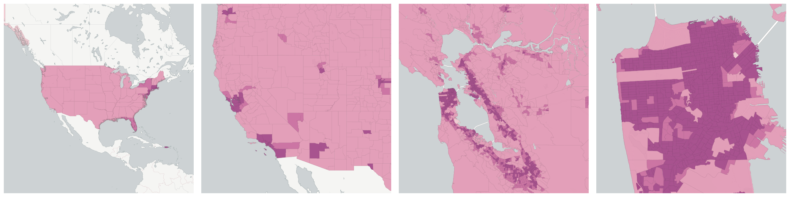](../../_images/us.census.acs.B15003001.png)The number of people in a geographic area who are over the age of 25.  This is used mostly as a denominator of educational attainment.

Measure &quot;Population 25 Years and Over&quot;  density per sq. kilometer  for one point:

    UPDATE {table_name}
      SET {new_numeric_column} =
        OBS_GetMeasure(
          CDB_LatLng(40.7, -73.9),
          'us.census.acs.B15003001'
        );

Measure &quot;Population 25 Years and Over&quot; within an area:

    UPDATE {table_name}
      SET {new_numeric_column} =
        OBS_GetMeasure(
          ST_Buffer(CDB_LatLng(40.7, -73.9), 0.01),
          'us.census.acs.B15003001'
        );

Subcolumns of Population 25 Years and Over

- [Less than high school graduate](#less-than-high-school-graduate)

- [Population Completed Associate's Degree](#population-completed-associate-s-degree)

- [Population Completed Bachelor's Degree](#population-completed-bachelor-s-degree)

- [Population Completed High School](#population-completed-high-school)

- [Population completed less than one year of college, no degree](#population-completed-less-than-one-year-of-college-no-degree)

- [Population Completed Master's Degree](#population-completed-master-s-degree)

- [Population completed more than one year of college, no degree](#population-completed-more-than-one-year-of-college-no-degree)

- [Population who completed some college or obtained associate's degree](#population-who-completed-some-college-or-obtained-associate-s-degree)

- [Population with high school degree, including GED](#population-with-high-school-degree-including-ged)

### Less than high school graduate

The number of people in a geographic area over the age of 25 who have not completed high school or any other advanced degree.

Measure &quot;Less than high school graduate&quot;  density per sq. kilometer  for one point:

    UPDATE {table_name}
      SET {new_numeric_column} =
        OBS_GetMeasure(
          CDB_LatLng(40.7, -73.9),
          'us.census.acs.B07009002'
        );

Measure &quot;Less than high school graduate&quot; within an area:

    UPDATE {table_name}
      SET {new_numeric_column} =
        OBS_GetMeasure(
          ST_Buffer(CDB_LatLng(40.7, -73.9), 0.01),
          'us.census.acs.B07009002'
        );

Measure &quot;Less than high school graduate&quot; percent of &quot;Population 25 Years and Over&quot; at one point:

    UPDATE {table_name}
      SET {new_numeric_column} =
        OBS_GetMeasure(
          CDB_LatLng(40.7, -73.9),
          'us.census.acs.B07009002',
          'denominator'
        );

Measure &quot;Less than high school graduate&quot; percent of &quot;Population 25 Years and Over&quot; within an area:

    UPDATE {table_name}
      SET {new_numeric_column} =
        OBS_GetMeasure(
          ST_Buffer(CDB_LatLng(40.7, -73.9), 0.01),
          'us.census.acs.B07009002',
          'denominator'
        );

* denominator: [Population 25 Years and Over](#us-census-acs-b15003001)

### Population Completed Associate's Degree

[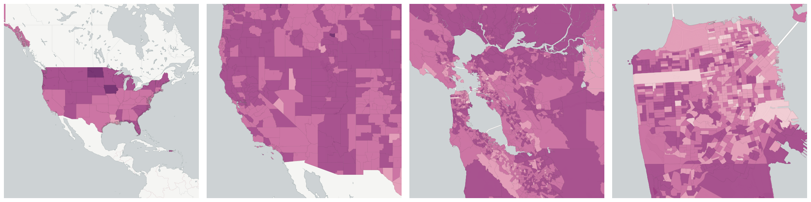](../../_images/us.census.acs.B15003021.png)The number of people in a geographic area over the age of 25 who obtained a associate's degree, and did not complete a more advanced degree.

Measure &quot;Population Completed Associate's Degree&quot;  density per sq. kilometer  for one point:

    UPDATE {table_name}
      SET {new_numeric_column} =
        OBS_GetMeasure(
          CDB_LatLng(40.7, -73.9),
          'us.census.acs.B15003021'
        );

Measure &quot;Population Completed Associate's Degree&quot; within an area:

    UPDATE {table_name}
      SET {new_numeric_column} =
        OBS_GetMeasure(
          ST_Buffer(CDB_LatLng(40.7, -73.9), 0.01),
          'us.census.acs.B15003021'
        );

Measure &quot;Population Completed Associate's Degree&quot; percent of &quot;Population 25 Years and Over&quot; at one point:

    UPDATE {table_name}
      SET {new_numeric_column} =
        OBS_GetMeasure(
          CDB_LatLng(40.7, -73.9),
          'us.census.acs.B15003021',
          'denominator'
        );

Measure &quot;Population Completed Associate's Degree&quot; percent of &quot;Population 25 Years and Over&quot; within an area:

    UPDATE {table_name}
      SET {new_numeric_column} =
        OBS_GetMeasure(
          ST_Buffer(CDB_LatLng(40.7, -73.9), 0.01),
          'us.census.acs.B15003021',
          'denominator'
        );

* denominator: [Population 25 Years and Over](#us-census-acs-b15003001)

### Population Completed Bachelor's Degree

[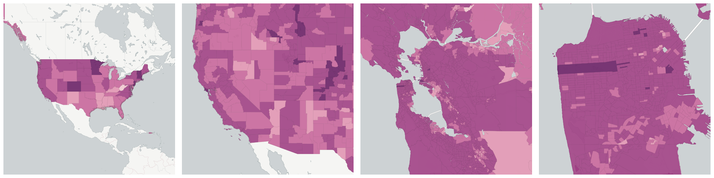](../../_images/us.census.acs.B15003022.png)The number of people in a geographic area over the age of 25 who obtained a bachelor's degree, and did not complete a more advanced degree.

Measure &quot;Population Completed Bachelor's Degree&quot;  density per sq. kilometer  for one point:

    UPDATE {table_name}
      SET {new_numeric_column} =
        OBS_GetMeasure(
          CDB_LatLng(40.7, -73.9),
          'us.census.acs.B15003022'
        );

Measure &quot;Population Completed Bachelor's Degree&quot; within an area:

    UPDATE {table_name}
      SET {new_numeric_column} =
        OBS_GetMeasure(
          ST_Buffer(CDB_LatLng(40.7, -73.9), 0.01),
          'us.census.acs.B15003022'
        );

Measure &quot;Population Completed Bachelor's Degree&quot; percent of &quot;Population 25 Years and Over&quot; at one point:

    UPDATE {table_name}
      SET {new_numeric_column} =
        OBS_GetMeasure(
          CDB_LatLng(40.7, -73.9),
          'us.census.acs.B15003022',
          'denominator'
        );

Measure &quot;Population Completed Bachelor's Degree&quot; percent of &quot;Population 25 Years and Over&quot; within an area:

    UPDATE {table_name}
      SET {new_numeric_column} =
        OBS_GetMeasure(
          ST_Buffer(CDB_LatLng(40.7, -73.9), 0.01),
          'us.census.acs.B15003022',
          'denominator'
        );

* denominator: [Population 25 Years and Over](#us-census-acs-b15003001)

### Population Completed High School

[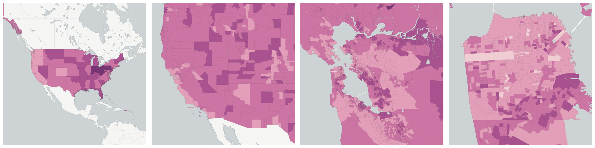](../../_images/us.census.acs.B15003017.png)The number of people in a geographic area over the age of 25 who completed high school, and did not complete a more advanced degree.

Measure &quot;Population Completed High School&quot;  density per sq. kilometer  for one point:

    UPDATE {table_name}
      SET {new_numeric_column} =
        OBS_GetMeasure(
          CDB_LatLng(40.7, -73.9),
          'us.census.acs.B15003017'
        );

Measure &quot;Population Completed High School&quot; within an area:

    UPDATE {table_name}
      SET {new_numeric_column} =
        OBS_GetMeasure(
          ST_Buffer(CDB_LatLng(40.7, -73.9), 0.01),
          'us.census.acs.B15003017'
        );

Measure &quot;Population Completed High School&quot; percent of &quot;Population 25 Years and Over&quot; at one point:

    UPDATE {table_name}
      SET {new_numeric_column} =
        OBS_GetMeasure(
          CDB_LatLng(40.7, -73.9),
          'us.census.acs.B15003017',
          'denominator'
        );

Measure &quot;Population Completed High School&quot; percent of &quot;Population 25 Years and Over&quot; within an area:

    UPDATE {table_name}
      SET {new_numeric_column} =
        OBS_GetMeasure(
          ST_Buffer(CDB_LatLng(40.7, -73.9), 0.01),
          'us.census.acs.B15003017',
          'denominator'
        );

* denominator: [Population 25 Years and Over](#us-census-acs-b15003001)

### Population completed less than one year of college, no degree

[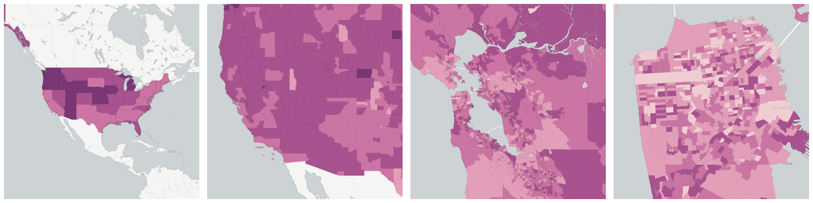](../../_images/us.census.acs.B15003019.png)The number of people in a geographic area over the age of 25 who attended college for less than one year and no further.

Measure &quot;Population completed less than one year of college, no degree&quot;  density per sq. kilometer  for one point:

    UPDATE {table_name}
      SET {new_numeric_column} =
        OBS_GetMeasure(
          CDB_LatLng(40.7, -73.9),
          'us.census.acs.B15003019'
        );

Measure &quot;Population completed less than one year of college, no degree&quot; within an area:

    UPDATE {table_name}
      SET {new_numeric_column} =
        OBS_GetMeasure(
          ST_Buffer(CDB_LatLng(40.7, -73.9), 0.01),
          'us.census.acs.B15003019'
        );

Measure &quot;Population completed less than one year of college, no degree&quot; percent of &quot;Population 25 Years and Over&quot; at one point:

    UPDATE {table_name}
      SET {new_numeric_column} =
        OBS_GetMeasure(
          CDB_LatLng(40.7, -73.9),
          'us.census.acs.B15003019',
          'denominator'
        );

Measure &quot;Population completed less than one year of college, no degree&quot; percent of &quot;Population 25 Years and Over&quot; within an area:

    UPDATE {table_name}
      SET {new_numeric_column} =
        OBS_GetMeasure(
          ST_Buffer(CDB_LatLng(40.7, -73.9), 0.01),
          'us.census.acs.B15003019',
          'denominator'
        );

* denominator: [Population 25 Years and Over](#us-census-acs-b15003001)

### Population Completed Master's Degree

[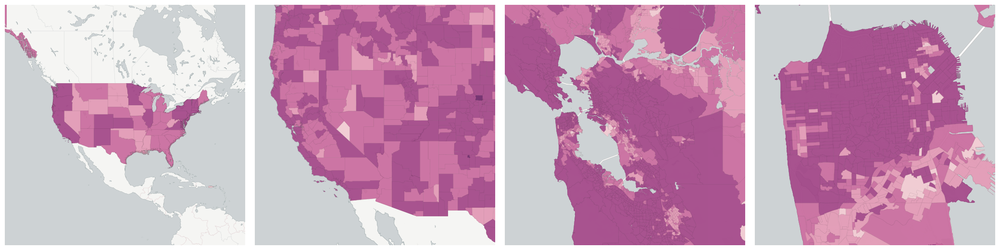](../../_images/us.census.acs.B15003023.png)The number of people in a geographic area over the age of 25 who obtained a master's degree, but did not complete a more advanced degree.

Measure &quot;Population Completed Master's Degree&quot;  density per sq. kilometer  for one point:

    UPDATE {table_name}
      SET {new_numeric_column} =
        OBS_GetMeasure(
          CDB_LatLng(40.7, -73.9),
          'us.census.acs.B15003023'
        );

Measure &quot;Population Completed Master's Degree&quot; within an area:

    UPDATE {table_name}
      SET {new_numeric_column} =
        OBS_GetMeasure(
          ST_Buffer(CDB_LatLng(40.7, -73.9), 0.01),
          'us.census.acs.B15003023'
        );

Measure &quot;Population Completed Master's Degree&quot; percent of &quot;Population 25 Years and Over&quot; at one point:

    UPDATE {table_name}
      SET {new_numeric_column} =
        OBS_GetMeasure(
          CDB_LatLng(40.7, -73.9),
          'us.census.acs.B15003023',
          'denominator'
        );

Measure &quot;Population Completed Master's Degree&quot; percent of &quot;Population 25 Years and Over&quot; within an area:

    UPDATE {table_name}
      SET {new_numeric_column} =
        OBS_GetMeasure(
          ST_Buffer(CDB_LatLng(40.7, -73.9), 0.01),
          'us.census.acs.B15003023',
          'denominator'
        );

* denominator: [Population 25 Years and Over](#us-census-acs-b15003001)

### Population completed more than one year of college, no degree

[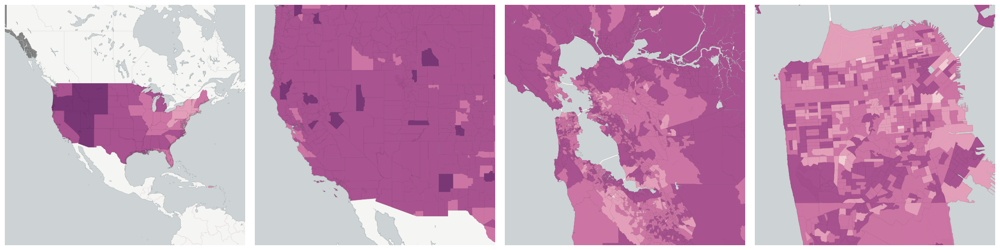](../../_images/us.census.acs.B15003020.png)The number of people in a geographic area over the age of 25 who attended college for more than one year but did not obtain a degree

Measure &quot;Population completed more than one year of college, no degree&quot;  density per sq. kilometer  for one point:

    UPDATE {table_name}
      SET {new_numeric_column} =
        OBS_GetMeasure(
          CDB_LatLng(40.7, -73.9),
          'us.census.acs.B15003020'
        );

Measure &quot;Population completed more than one year of college, no degree&quot; within an area:

    UPDATE {table_name}
      SET {new_numeric_column} =
        OBS_GetMeasure(
          ST_Buffer(CDB_LatLng(40.7, -73.9), 0.01),
          'us.census.acs.B15003020'
        );

Measure &quot;Population completed more than one year of college, no degree&quot; percent of &quot;Population 25 Years and Over&quot; at one point:

    UPDATE {table_name}
      SET {new_numeric_column} =
        OBS_GetMeasure(
          CDB_LatLng(40.7, -73.9),
          'us.census.acs.B15003020',
          'denominator'
        );

Measure &quot;Population completed more than one year of college, no degree&quot; percent of &quot;Population 25 Years and Over&quot; within an area:

    UPDATE {table_name}
      SET {new_numeric_column} =
        OBS_GetMeasure(
          ST_Buffer(CDB_LatLng(40.7, -73.9), 0.01),
          'us.census.acs.B15003020',
          'denominator'
        );

* denominator: [Population 25 Years and Over](#us-census-acs-b15003001)

### Population who completed some college or obtained associate's degree

[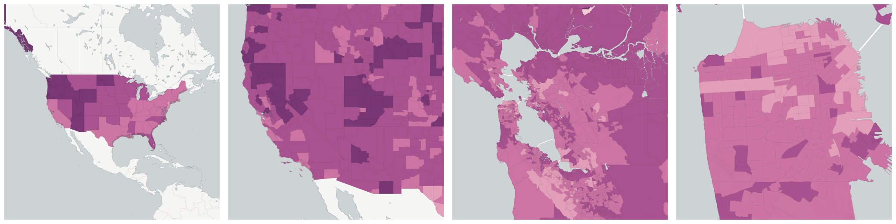](../../_images/us.census.acs.B07009004.png)The number of people in a geographic area over the age of 25 who obtained an associate's degree, and did not complete a more advanced degree.

Measure &quot;Population who completed some college or obtained associate's degree&quot;  density per sq. kilometer  for one point:

    UPDATE {table_name}
      SET {new_numeric_column} =
        OBS_GetMeasure(
          CDB_LatLng(40.7, -73.9),
          'us.census.acs.B07009004'
        );

Measure &quot;Population who completed some college or obtained associate's degree&quot; within an area:

    UPDATE {table_name}
      SET {new_numeric_column} =
        OBS_GetMeasure(
          ST_Buffer(CDB_LatLng(40.7, -73.9), 0.01),
          'us.census.acs.B07009004'
        );

Measure &quot;Population who completed some college or obtained associate's degree&quot; percent of &quot;Population 25 Years and Over&quot; at one point:

    UPDATE {table_name}
      SET {new_numeric_column} =
        OBS_GetMeasure(
          CDB_LatLng(40.7, -73.9),
          'us.census.acs.B07009004',
          'denominator'
        );

Measure &quot;Population who completed some college or obtained associate's degree&quot; percent of &quot;Population 25 Years and Over&quot; within an area:

    UPDATE {table_name}
      SET {new_numeric_column} =
        OBS_GetMeasure(
          ST_Buffer(CDB_LatLng(40.7, -73.9), 0.01),
          'us.census.acs.B07009004',
          'denominator'
        );

* denominator: [Population 25 Years and Over](#us-census-acs-b15003001)

### Population with high school degree, including GED

[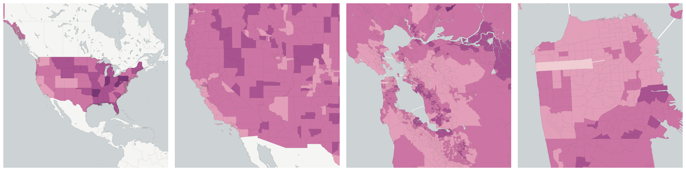](../../_images/us.census.acs.B07009003.png)The number of people in a geographic area over the age of 25 who attained a high school degree or GED.

Measure &quot;Population with high school degree, including GED&quot;  density per sq. kilometer  for one point:

    UPDATE {table_name}
      SET {new_numeric_column} =
        OBS_GetMeasure(
          CDB_LatLng(40.7, -73.9),
          'us.census.acs.B07009003'
        );

Measure &quot;Population with high school degree, including GED&quot; within an area:

    UPDATE {table_name}
      SET {new_numeric_column} =
        OBS_GetMeasure(
          ST_Buffer(CDB_LatLng(40.7, -73.9), 0.01),
          'us.census.acs.B07009003'
        );

Measure &quot;Population with high school degree, including GED&quot; percent of &quot;Population 25 Years and Over&quot; at one point:

    UPDATE {table_name}
      SET {new_numeric_column} =
        OBS_GetMeasure(
          CDB_LatLng(40.7, -73.9),
          'us.census.acs.B07009003',
          'denominator'
        );

Measure &quot;Population with high school degree, including GED&quot; percent of &quot;Population 25 Years and Over&quot; within an area:

    UPDATE {table_name}
      SET {new_numeric_column} =
        OBS_GetMeasure(
          ST_Buffer(CDB_LatLng(40.7, -73.9), 0.01),
          'us.census.acs.B07009003',
          'denominator'
        );

* denominator: [Population 25 Years and Over](#us-census-acs-b15003001)

## Population 3 Years and Over

[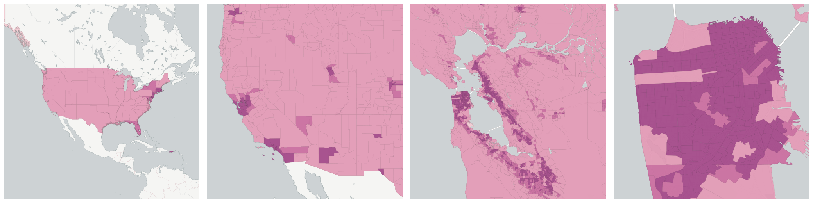](../../_images/us.census.acs.B14001001.png)The total number of people in each geography age 3 years and over.  This denominator is mostly used to calculate rates of school enrollment.

Measure &quot;Population 3 Years and Over&quot;  density per sq. kilometer  for one point:

    UPDATE {table_name}
      SET {new_numeric_column} =
        OBS_GetMeasure(
          CDB_LatLng(40.7, -73.9),
          'us.census.acs.B14001001'
        );

Measure &quot;Population 3 Years and Over&quot; within an area:

    UPDATE {table_name}
      SET {new_numeric_column} =
        OBS_GetMeasure(
          ST_Buffer(CDB_LatLng(40.7, -73.9), 0.01),
          'us.census.acs.B14001001'
        );

Subcolumns of Population 3 Years and Over

- [Students Enrolled in School](#students-enrolled-in-school)

### Students Enrolled in School

[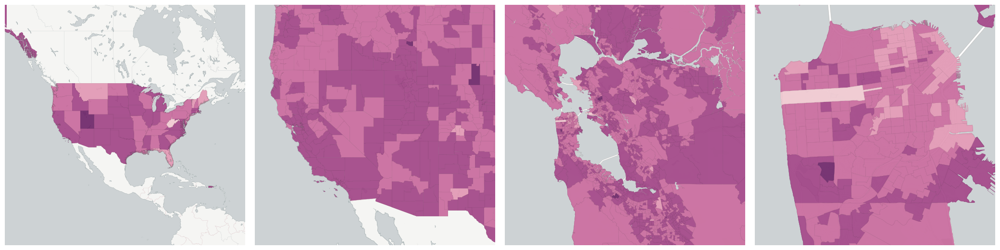](../../_images/us.census.acs.B14001002.png)The total number of people in each geography currently enrolled at any level of school, from nursery or pre-school to advanced post-graduate education.  Only includes those over the age of 3.

Measure &quot;Students Enrolled in School&quot;  density per sq. kilometer  for one point:

    UPDATE {table_name}
      SET {new_numeric_column} =
        OBS_GetMeasure(
          CDB_LatLng(40.7, -73.9),
          'us.census.acs.B14001002'
        );

Measure &quot;Students Enrolled in School&quot; within an area:

    UPDATE {table_name}
      SET {new_numeric_column} =
        OBS_GetMeasure(
          ST_Buffer(CDB_LatLng(40.7, -73.9), 0.01),
          'us.census.acs.B14001002'
        );

Measure &quot;Students Enrolled in School&quot; percent of &quot;Population 3 Years and Over&quot; at one point:

    UPDATE {table_name}
      SET {new_numeric_column} =
        OBS_GetMeasure(
          CDB_LatLng(40.7, -73.9),
          'us.census.acs.B14001002',
          'denominator'
        );

Measure &quot;Students Enrolled in School&quot; percent of &quot;Population 3 Years and Over&quot; within an area:

    UPDATE {table_name}
      SET {new_numeric_column} =
        OBS_GetMeasure(
          ST_Buffer(CDB_LatLng(40.7, -73.9), 0.01),
          'us.census.acs.B14001002',
          'denominator'
        );

* denominator: [Population 3 Years and Over](#us-census-acs-b14001001)

Subcolumns of Students Enrolled in School

- [Students Enrolled as Undergraduate in College](#students-enrolled-as-undergraduate-in-college)

- [Students Enrolled in Grades 1 to 4](#students-enrolled-in-grades-1-to-4)

- [Students Enrolled in Grades 5 to 8](#students-enrolled-in-grades-5-to-8)

- [Students Enrolled in Grades 9 to 12](#students-enrolled-in-grades-9-to-12)

#### Students Enrolled as Undergraduate in College

[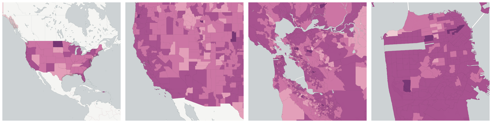](../../_images/us.census.acs.B14001008.png)The number of people in a geographic area who are enrolled in college at the undergraduate level. Enrollment refers to being registered or listed as a student in an educational program leading to a college degree. This may be a public school or college, a private school or college.

Measure &quot;Students Enrolled as Undergraduate in College&quot;  density per sq. kilometer  for one point:

    UPDATE {table_name}
      SET {new_numeric_column} =
        OBS_GetMeasure(
          CDB_LatLng(40.7, -73.9),
          'us.census.acs.B14001008'
        );

Measure &quot;Students Enrolled as Undergraduate in College&quot; within an area:

    UPDATE {table_name}
      SET {new_numeric_column} =
        OBS_GetMeasure(
          ST_Buffer(CDB_LatLng(40.7, -73.9), 0.01),
          'us.census.acs.B14001008'
        );

Measure &quot;Students Enrolled as Undergraduate in College&quot; percent of &quot;Students Enrolled in School&quot; at one point:

    UPDATE {table_name}
      SET {new_numeric_column} =
        OBS_GetMeasure(
          CDB_LatLng(40.7, -73.9),
          'us.census.acs.B14001008',
          'denominator'
        );

Measure &quot;Students Enrolled as Undergraduate in College&quot; percent of &quot;Students Enrolled in School&quot; within an area:

    UPDATE {table_name}
      SET {new_numeric_column} =
        OBS_GetMeasure(
          ST_Buffer(CDB_LatLng(40.7, -73.9), 0.01),
          'us.census.acs.B14001008',
          'denominator'
        );

* denominator: [Students Enrolled in School](#us-census-acs-b14001002)

#### Students Enrolled in Grades 1 to 4

[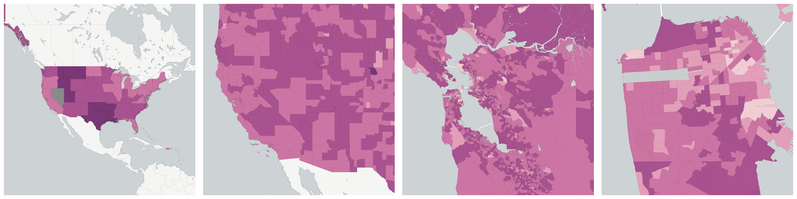](../../_images/us.census.acs.B14001005.png)The total number of people in each geography currently enrolled in grades 1 through 4 inclusive.  This corresponds roughly to elementary school.

Measure &quot;Students Enrolled in Grades 1 to 4&quot;  density per sq. kilometer  for one point:

    UPDATE {table_name}
      SET {new_numeric_column} =
        OBS_GetMeasure(
          CDB_LatLng(40.7, -73.9),
          'us.census.acs.B14001005'
        );

Measure &quot;Students Enrolled in Grades 1 to 4&quot; within an area:

    UPDATE {table_name}
      SET {new_numeric_column} =
        OBS_GetMeasure(
          ST_Buffer(CDB_LatLng(40.7, -73.9), 0.01),
          'us.census.acs.B14001005'
        );

Measure &quot;Students Enrolled in Grades 1 to 4&quot; percent of &quot;Students Enrolled in School&quot; at one point:

    UPDATE {table_name}
      SET {new_numeric_column} =
        OBS_GetMeasure(
          CDB_LatLng(40.7, -73.9),
          'us.census.acs.B14001005',
          'denominator'
        );

Measure &quot;Students Enrolled in Grades 1 to 4&quot; percent of &quot;Students Enrolled in School&quot; within an area:

    UPDATE {table_name}
      SET {new_numeric_column} =
        OBS_GetMeasure(
          ST_Buffer(CDB_LatLng(40.7, -73.9), 0.01),
          'us.census.acs.B14001005',
          'denominator'
        );

* denominator: [Students Enrolled in School](#us-census-acs-b14001002)

#### Students Enrolled in Grades 5 to 8

[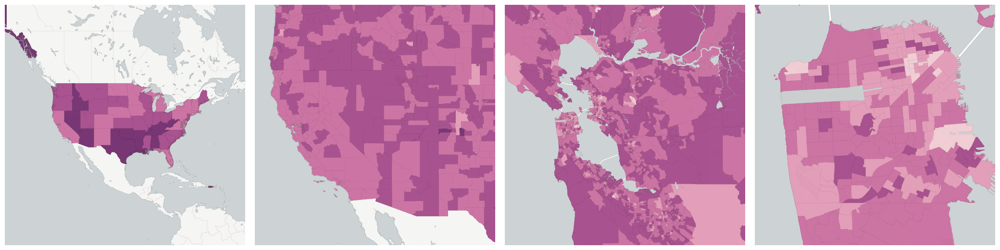](../../_images/us.census.acs.B14001006.png)The total number of people in each geography currently enrolled in grades 5 through 8 inclusive.  This corresponds roughly to middle school.

Measure &quot;Students Enrolled in Grades 5 to 8&quot;  density per sq. kilometer  for one point:

    UPDATE {table_name}
      SET {new_numeric_column} =
        OBS_GetMeasure(
          CDB_LatLng(40.7, -73.9),
          'us.census.acs.B14001006'
        );

Measure &quot;Students Enrolled in Grades 5 to 8&quot; within an area:

    UPDATE {table_name}
      SET {new_numeric_column} =
        OBS_GetMeasure(
          ST_Buffer(CDB_LatLng(40.7, -73.9), 0.01),
          'us.census.acs.B14001006'
        );

Measure &quot;Students Enrolled in Grades 5 to 8&quot; percent of &quot;Students Enrolled in School&quot; at one point:

    UPDATE {table_name}
      SET {new_numeric_column} =
        OBS_GetMeasure(
          CDB_LatLng(40.7, -73.9),
          'us.census.acs.B14001006',
          'denominator'
        );

Measure &quot;Students Enrolled in Grades 5 to 8&quot; percent of &quot;Students Enrolled in School&quot; within an area:

    UPDATE {table_name}
      SET {new_numeric_column} =
        OBS_GetMeasure(
          ST_Buffer(CDB_LatLng(40.7, -73.9), 0.01),
          'us.census.acs.B14001006',
          'denominator'
        );

* denominator: [Students Enrolled in School](#us-census-acs-b14001002)

#### Students Enrolled in Grades 9 to 12

[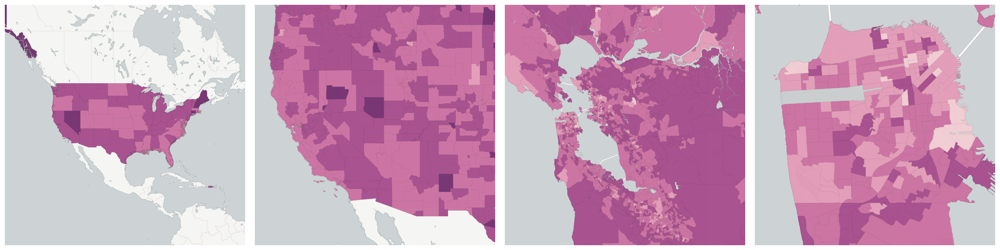](../../_images/us.census.acs.B14001007.png)The total number of people in each geography currently enrolled in grades 9 through 12 inclusive.  This corresponds roughly to high school.

Measure &quot;Students Enrolled in Grades 9 to 12&quot;  density per sq. kilometer  for one point:

    UPDATE {table_name}
      SET {new_numeric_column} =
        OBS_GetMeasure(
          CDB_LatLng(40.7, -73.9),
          'us.census.acs.B14001007'
        );

Measure &quot;Students Enrolled in Grades 9 to 12&quot; within an area:

    UPDATE {table_name}
      SET {new_numeric_column} =
        OBS_GetMeasure(
          ST_Buffer(CDB_LatLng(40.7, -73.9), 0.01),
          'us.census.acs.B14001007'
        );

Measure &quot;Students Enrolled in Grades 9 to 12&quot; percent of &quot;Students Enrolled in School&quot; at one point:

    UPDATE {table_name}
      SET {new_numeric_column} =
        OBS_GetMeasure(
          CDB_LatLng(40.7, -73.9),
          'us.census.acs.B14001007',
          'denominator'
        );

Measure &quot;Students Enrolled in Grades 9 to 12&quot; percent of &quot;Students Enrolled in School&quot; within an area:

    UPDATE {table_name}
      SET {new_numeric_column} =
        OBS_GetMeasure(
          ST_Buffer(CDB_LatLng(40.7, -73.9), 0.01),
          'us.census.acs.B14001007',
          'denominator'
        );

* denominator: [Students Enrolled in School](#us-census-acs-b14001002)

