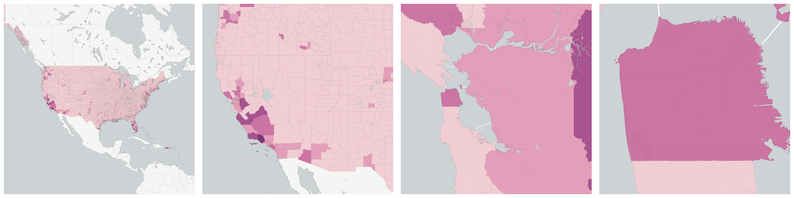
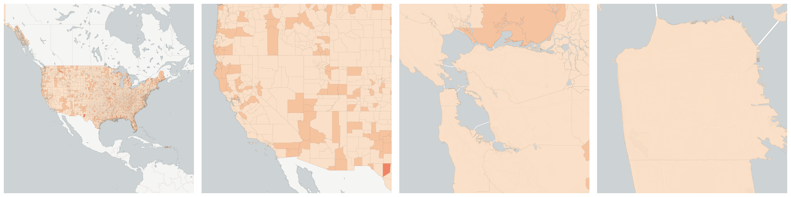

  
# Employment

How people are employed.

- [Employees in Accommodation and food services establishments](#employees-in-accommodation-and-food-services-establishments)

- [Employees in Administrative and waste services establishments](#employees-in-administrative-and-waste-services-establishments)

- [Employees in Agriculture, forestry, fishing and hunting establishments](#employees-in-agriculture-forestry-fishing-and-hunting-establishments)

- [Employees in Arts, entertainment, and recreation establishments](#employees-in-arts-entertainment-and-recreation-establishments)

- [Employees in Construction establishments](#employees-in-construction-establishments)

- [Employees in Construction establishments](#us-qcew-example-month3-emplvl-23)

- [Employees in Education and health services establishments](#employees-in-education-and-health-services-establishments)

- [Employees in Educational services establishments](#employees-in-educational-services-establishments)

- [Employees in Finance and insurance establishments](#employees-in-finance-and-insurance-establishments)

- [Employees in Financial activities establishments](#employees-in-financial-activities-establishments)

- [Employees in Health care and social assistance establishments](#employees-in-health-care-and-social-assistance-establishments)

- [Employees in Information establishments](#employees-in-information-establishments)

- [Employees in Information establishments](#us-qcew-example-month3-emplvl-51)

- [Employees in Leisure and hospitality establishments](#employees-in-leisure-and-hospitality-establishments)

- [Employees in Management of companies and enterprises establishments](#employees-in-management-of-companies-and-enterprises-establishments)

- [Employees in Manufacturing establishments](#employees-in-manufacturing-establishments)

- [Employees in Manufacturing establishments](#us-qcew-example-month3-emplvl-31-33)

- [Employees in Mining, quarrying, and oil and gas extraction establishments](#employees-in-mining-quarrying-and-oil-and-gas-extraction-establishments)

- [Employees in Natural resources and mining establishments](#employees-in-natural-resources-and-mining-establishments)

- [Employees in Other services establishments](#employees-in-other-services-establishments)

- [Employees in Other services, except public administration establishments](#employees-in-other-services-except-public-administration-establishments)

- [Employees in Professional and business services establishments](#employees-in-professional-and-business-services-establishments)

- [Employees in Professional and technical services establishments](#employees-in-professional-and-technical-services-establishments)

- [Employees in Public administration establishments](#employees-in-public-administration-establishments)

- [Employees in Public administration establishments](#us-qcew-example-month3-emplvl-92)

- [Employees in Real estate and rental and leasing establishments](#employees-in-real-estate-and-rental-and-leasing-establishments)

- [Employees in Retail trade establishments](#employees-in-retail-trade-establishments)

- [Employees in Total, all industries establishments](#employees-in-total-all-industries-establishments)

- [Employees in Total, all industries establishments](#us-bls-month3-emplvl-10)

    * [Employees in Accommodation and food services establishments](#us-bls-month3-emplvl-72)

    * [Employees in Administrative and waste services establishments](#us-bls-month3-emplvl-56)

    * [Employees in Agriculture, forestry, fishing and hunting establishments](#us-bls-month3-emplvl-11)

    * [Employees in Arts, entertainment, and recreation establishments](#us-bls-month3-emplvl-71)

    * [Employees in Construction establishments](#us-bls-month3-emplvl-23)

    * [Employees in Construction establishments](#us-bls-month3-emplvl-1012)

    * [Employees in Education and health services establishments](#us-bls-month3-emplvl-1025)

    * [Employees in Educational services establishments](#us-bls-month3-emplvl-61)

    * [Employees in Finance and insurance establishments](#us-bls-month3-emplvl-52)

    * [Employees in Financial activities establishments](#us-bls-month3-emplvl-1023)

    * [Employees in Health care and social assistance establishments](#us-bls-month3-emplvl-62)

    * [Employees in Information establishments](#us-bls-month3-emplvl-51)

    * [Employees in Information establishments](#us-bls-month3-emplvl-1022)

    * [Employees in Leisure and hospitality establishments](#us-bls-month3-emplvl-1026)

    * [Employees in Management of companies and enterprises establishments](#us-bls-month3-emplvl-55)

    * [Employees in Manufacturing establishments](#us-bls-month3-emplvl-31-33)

    * [Employees in Manufacturing establishments](#us-bls-month3-emplvl-1013)

    * [Employees in Mining, quarrying, and oil and gas extraction establishments](#us-bls-month3-emplvl-21)

    * [Employees in Natural resources and mining establishments](#us-bls-month3-emplvl-1011)

    * [Employees in Other services establishments](#us-bls-month3-emplvl-1027)

    * [Employees in Other services, except public administration establishments](#us-bls-month3-emplvl-81)

    * [Employees in Professional and business services establishments](#us-bls-month3-emplvl-1024)

    * [Employees in Professional and technical services establishments](#us-bls-month3-emplvl-54)

    * [Employees in Public administration establishments](#us-bls-month3-emplvl-92)

    * [Employees in Public administration establishments](#us-bls-month3-emplvl-1028)

    * [Employees in Real estate and rental and leasing establishments](#us-bls-month3-emplvl-53)

    * [Employees in Retail trade establishments](#us-bls-month3-emplvl-44-45)

    * [Employees in Trade, transportation, and utilities establishments](#employees-in-trade-transportation-and-utilities-establishments)

    * [Employees in Transportation and warehousing establishments](#employees-in-transportation-and-warehousing-establishments)

    * [Employees in Unclassified establishments](#employees-in-unclassified-establishments)

    * [Employees in Unclassified establishments](#us-bls-month3-emplvl-99)

    * [Employees in Utilities establishments](#employees-in-utilities-establishments)

    * [Employees in Wholesale trade establishments](#employees-in-wholesale-trade-establishments)

- [Employees in Trade, transportation, and utilities establishments](#us-qcew-example-month3-emplvl-1021)

- [Employees in Transportation and warehousing establishments](#us-qcew-example-month3-emplvl-48-49)

- [Employees in Unclassified establishments](#us-qcew-example-month3-emplvl-99)

- [Employees in Unclassified establishments](#us-qcew-example-month3-emplvl-1029)

- [Employees in Utilities establishments](#us-qcew-example-month3-emplvl-22)

- [Employees in Wholesale trade establishments](#us-qcew-example-month3-emplvl-42)

- [Employment level location quotient in Accommodation and food services establishments](#employment-level-location-quotient-in-accommodation-and-food-services-establishments)

- [Employment level location quotient in Accommodation and food services establishments](#us-bls-lq-month3-emplvl-72)

- [Employment level location quotient in Administrative and waste services establishments](#employment-level-location-quotient-in-administrative-and-waste-services-establishments)

- [Employment level location quotient in Administrative and waste services establishments](#us-bls-lq-month3-emplvl-56)

- [Employment level location quotient in Agriculture, forestry, fishing and hunting establishments](#employment-level-location-quotient-in-agriculture-forestry-fishing-and-hunting-establishments)

- [Employment level location quotient in Agriculture, forestry, fishing and hunting establishments](#us-bls-lq-month3-emplvl-11)

- [Employment level location quotient in Arts, entertainment, and recreation establishments](#employment-level-location-quotient-in-arts-entertainment-and-recreation-establishments)

- [Employment level location quotient in Arts, entertainment, and recreation establishments](#us-bls-lq-month3-emplvl-71)

- [Employment level location quotient in Construction establishments](#employment-level-location-quotient-in-construction-establishments)

- [Employment level location quotient in Construction establishments](#us-qcew-example-lq-month3-emplvl-23)

- [Employment level location quotient in Construction establishments](#us-bls-lq-month3-emplvl-1012)

- [Employment level location quotient in Construction establishments](#us-bls-lq-month3-emplvl-23)

- [Employment level location quotient in Education and health services establishments](#employment-level-location-quotient-in-education-and-health-services-establishments)

- [Employment level location quotient in Education and health services establishments](#us-bls-lq-month3-emplvl-1025)

- [Employment level location quotient in Educational services establishments](#employment-level-location-quotient-in-educational-services-establishments)

- [Employment level location quotient in Educational services establishments](#us-bls-lq-month3-emplvl-61)

- [Employment level location quotient in Finance and insurance establishments](#employment-level-location-quotient-in-finance-and-insurance-establishments)

- [Employment level location quotient in Finance and insurance establishments](#us-bls-lq-month3-emplvl-52)

- [Employment level location quotient in Financial activities establishments](#employment-level-location-quotient-in-financial-activities-establishments)

- [Employment level location quotient in Financial activities establishments](#us-bls-lq-month3-emplvl-1023)

- [Employment level location quotient in Health care and social assistance establishments](#employment-level-location-quotient-in-health-care-and-social-assistance-establishments)

- [Employment level location quotient in Health care and social assistance establishments](#us-bls-lq-month3-emplvl-62)

- [Employment level location quotient in Information establishments](#employment-level-location-quotient-in-information-establishments)

- [Employment level location quotient in Information establishments](#us-qcew-example-lq-month3-emplvl-51)

- [Employment level location quotient in Information establishments](#us-bls-lq-month3-emplvl-1022)

- [Employment level location quotient in Information establishments](#us-bls-lq-month3-emplvl-51)

- [Employment level location quotient in Leisure and hospitality establishments](#employment-level-location-quotient-in-leisure-and-hospitality-establishments)

- [Employment level location quotient in Leisure and hospitality establishments](#us-bls-lq-month3-emplvl-1026)

- [Employment level location quotient in Management of companies and enterprises establishments](#employment-level-location-quotient-in-management-of-companies-and-enterprises-establishments)

- [Employment level location quotient in Management of companies and enterprises establishments](#us-bls-lq-month3-emplvl-55)

- [Employment level location quotient in Manufacturing establishments](#employment-level-location-quotient-in-manufacturing-establishments)

- [Employment level location quotient in Manufacturing establishments](#us-qcew-example-lq-month3-emplvl-31-33)

- [Employment level location quotient in Manufacturing establishments](#us-bls-lq-month3-emplvl-1013)

- [Employment level location quotient in Manufacturing establishments](#us-bls-lq-month3-emplvl-31-33)

- [Employment level location quotient in Mining, quarrying, and oil and gas extraction establishments](#employment-level-location-quotient-in-mining-quarrying-and-oil-and-gas-extraction-establishments)

- [Employment level location quotient in Mining, quarrying, and oil and gas extraction establishments](#us-bls-lq-month3-emplvl-21)

- [Employment level location quotient in Natural resources and mining establishments](#employment-level-location-quotient-in-natural-resources-and-mining-establishments)

- [Employment level location quotient in Natural resources and mining establishments](#us-bls-lq-month3-emplvl-1011)

- [Employment level location quotient in Other services establishments](#employment-level-location-quotient-in-other-services-establishments)

- [Employment level location quotient in Other services establishments](#us-bls-lq-month3-emplvl-1027)

- [Employment level location quotient in Other services, except public administration establishments](#employment-level-location-quotient-in-other-services-except-public-administration-establishments)

- [Employment level location quotient in Other services, except public administration establishments](#us-bls-lq-month3-emplvl-81)

- [Employment level location quotient in Professional and business services establishments](#employment-level-location-quotient-in-professional-and-business-services-establishments)

- [Employment level location quotient in Professional and business services establishments](#us-bls-lq-month3-emplvl-1024)

- [Employment level location quotient in Professional and technical services establishments](#employment-level-location-quotient-in-professional-and-technical-services-establishments)

- [Employment level location quotient in Professional and technical services establishments](#us-bls-lq-month3-emplvl-54)

- [Employment level location quotient in Public administration establishments](#employment-level-location-quotient-in-public-administration-establishments)

- [Employment level location quotient in Public administration establishments](#us-qcew-example-lq-month3-emplvl-92)

- [Employment level location quotient in Public administration establishments](#us-bls-lq-month3-emplvl-1028)

- [Employment level location quotient in Public administration establishments](#us-bls-lq-month3-emplvl-92)

- [Employment level location quotient in Real estate and rental and leasing establishments](#employment-level-location-quotient-in-real-estate-and-rental-and-leasing-establishments)

- [Employment level location quotient in Real estate and rental and leasing establishments](#us-bls-lq-month3-emplvl-53)

- [Employment level location quotient in Retail trade establishments](#employment-level-location-quotient-in-retail-trade-establishments)

- [Employment level location quotient in Retail trade establishments](#us-bls-lq-month3-emplvl-44-45)

- [Employment level location quotient in Total, all industries establishments](#employment-level-location-quotient-in-total-all-industries-establishments)

- [Employment level location quotient in Total, all industries establishments](#us-bls-lq-month3-emplvl-10)

- [Employment level location quotient in Trade, transportation, and utilities establishments](#employment-level-location-quotient-in-trade-transportation-and-utilities-establishments)

- [Employment level location quotient in Trade, transportation, and utilities establishments](#us-bls-lq-month3-emplvl-1021)

- [Employment level location quotient in Transportation and warehousing establishments](#employment-level-location-quotient-in-transportation-and-warehousing-establishments)

- [Employment level location quotient in Transportation and warehousing establishments](#us-bls-lq-month3-emplvl-48-49)

- [Employment level location quotient in Unclassified establishments](#employment-level-location-quotient-in-unclassified-establishments)

- [Employment level location quotient in Unclassified establishments](#us-qcew-example-lq-month3-emplvl-1029)

- [Employment level location quotient in Unclassified establishments](#us-bls-lq-month3-emplvl-99)

- [Employment level location quotient in Unclassified establishments](#us-bls-lq-month3-emplvl-1029)

- [Employment level location quotient in Utilities establishments](#employment-level-location-quotient-in-utilities-establishments)

- [Employment level location quotient in Utilities establishments](#us-bls-lq-month3-emplvl-22)

- [Employment level location quotient in Wholesale trade establishments](#employment-level-location-quotient-in-wholesale-trade-establishments)

- [Employment level location quotient in Wholesale trade establishments](#us-bls-lq-month3-emplvl-42)

- [Population age 16 and over](#population-age-16-and-over)

    * [Population in Labor Force](#population-in-labor-force)

        - [Population in Armed Forces](#population-in-armed-forces)

        - [Population in Civilian Labor Force](#population-in-civilian-labor-force)

        - [Employed Population](#employed-population)

        - [Workers employed in firms in agriculture, forestry, fishing, hunting, or mining](#workers-employed-in-firms-in-agriculture-forestry-fishing-hunting-or-mining)

        - [Workers employed in firms in arts, entertainment, recreation, accommodation and food services](#workers-employed-in-firms-in-arts-entertainment-recreation-accommodation-and-food-services)

        - [Workers employed in firms in construction](#workers-employed-in-firms-in-construction)

        - [Workers employed in firms in educational services, health care, and social assistance](#workers-employed-in-firms-in-educational-services-health-care-and-social-assistance)

        - [Workers employed in firms in finance, insurance, real estate and rental and leasing](#workers-employed-in-firms-in-finance-insurance-real-estate-and-rental-and-leasing)

        - [Workers employed in firms in information](#workers-employed-in-firms-in-information)

        - [Workers employed in firms in manufacturing](#workers-employed-in-firms-in-manufacturing)

        - [Workers employed in firms in other services except public administration](#workers-employed-in-firms-in-other-services-except-public-administration)

        - [Workers employed in firms in professional scientific, management, administrative and waste management services](#workers-employed-in-firms-in-professional-scientific-management-administrative-and-waste-management-services)

        - [Workers employed in firms in public administration](#workers-employed-in-firms-in-public-administration)

        - [Workers employed in firms in retail trade](#workers-employed-in-firms-in-retail-trade)

        - [Workers employed in firms in transportation, warehousing, and utilities](#workers-employed-in-firms-in-transportation-warehousing-and-utilities)

        - [Workers employed in firms in wholesale trade](#workers-employed-in-firms-in-wholesale-trade)

        - [Unemployed Population](#unemployed-population)

    * [Population Not in Labor Force](#population-not-in-labor-force)

- [Workers age 16 and over who do not work from home](#workers-age-16-and-over-who-do-not-work-from-home)

    * [Number of workers with a commute between 5 and 9 minutes](#number-of-workers-with-a-commute-between-5-and-9-minutes)

    * [Number of workers with a commute between 10 and 14 minutes](#number-of-workers-with-a-commute-between-10-and-14-minutes)

    * [Number of workers with a commute between 15 and 19 minutes](#number-of-workers-with-a-commute-between-15-and-19-minutes)

    * [Number of workers with a commute between 20 and 24 minutes](#number-of-workers-with-a-commute-between-20-and-24-minutes)

    * [Number of workers with a commute between 25 and 29 minutes](#number-of-workers-with-a-commute-between-25-and-29-minutes)

    * [Number of workers with a commute between 30 and 34 minutes](#number-of-workers-with-a-commute-between-30-and-34-minutes)

    * [Number of workers with a commute between 35 and 39 minutes](#number-of-workers-with-a-commute-between-35-and-39-minutes)

    * [Number of workers with a commute between 35 and 44 minutes](#number-of-workers-with-a-commute-between-35-and-44-minutes)

    * [Number of workers with a commute between 40 and 44 minutes](#number-of-workers-with-a-commute-between-40-and-44-minutes)

    * [Number of workers with a commute between 45 and 59 minutes](#number-of-workers-with-a-commute-between-45-and-59-minutes)

    * [Number of workers with a commute between 60 and 89 minutes](#number-of-workers-with-a-commute-between-60-and-89-minutes)

    * [Number of workers with a commute of more than 90 minutes](#number-of-workers-with-a-commute-of-more-than-90-minutes)

    * [Number of workers with a commute of over 60 minutes](#number-of-workers-with-a-commute-of-over-60-minutes)

    * [Number of workers with less than 10 minute commute](#number-of-workers-with-less-than-10-minute-commute)

- [Workers over the Age of 16](#workers-over-the-age-of-16)

    * [Worked at Home](#worked-at-home)

## Employees in Accommodation and food services establishments

Number of employees in the third month of a given quarter with the Accommodation and food services industry (NAICS 72). Accommodation and food services is .

Measure &quot;Employees in Accommodation and food services establishments&quot;  density per sq. kilometer  for one point:

    UPDATE {table_name}
      SET {new_numeric_column} =
        OBS_GetMeasure(
          CDB_LatLng(40.7, -73.9),
          'us.qcew-example.month3_emplvl_72'
        );

Measure &quot;Employees in Accommodation and food services establishments&quot; within an area:

    UPDATE {table_name}
      SET {new_numeric_column} =
        OBS_GetMeasure(
          ST_Buffer(CDB_LatLng(40.7, -73.9), 0.01),
          'us.qcew-example.month3_emplvl_72'
        );

## Employees in Administrative and waste services establishments

Number of employees in the third month of a given quarter with the Administrative and waste services industry (NAICS 56). Administrative and waste services is .

Measure &quot;Employees in Administrative and waste services establishments&quot;  density per sq. kilometer  for one point:

    UPDATE {table_name}
      SET {new_numeric_column} =
        OBS_GetMeasure(
          CDB_LatLng(40.7, -73.9),
          'us.qcew-example.month3_emplvl_56'
        );

Measure &quot;Employees in Administrative and waste services establishments&quot; within an area:

    UPDATE {table_name}
      SET {new_numeric_column} =
        OBS_GetMeasure(
          ST_Buffer(CDB_LatLng(40.7, -73.9), 0.01),
          'us.qcew-example.month3_emplvl_56'
        );

## Employees in Agriculture, forestry, fishing and hunting establishments

Number of employees in the third month of a given quarter with the Agriculture, forestry, fishing and hunting industry (NAICS 11). Agriculture, forestry, fishing and hunting is .

Measure &quot;Employees in Agriculture, forestry, fishing and hunting establishments&quot;  density per sq. kilometer  for one point:

    UPDATE {table_name}
      SET {new_numeric_column} =
        OBS_GetMeasure(
          CDB_LatLng(40.7, -73.9),
          'us.qcew-example.month3_emplvl_11'
        );

Measure &quot;Employees in Agriculture, forestry, fishing and hunting establishments&quot; within an area:

    UPDATE {table_name}
      SET {new_numeric_column} =
        OBS_GetMeasure(
          ST_Buffer(CDB_LatLng(40.7, -73.9), 0.01),
          'us.qcew-example.month3_emplvl_11'
        );

## Employees in Arts, entertainment, and recreation establishments

Number of employees in the third month of a given quarter with the Arts, entertainment, and recreation industry (NAICS 71). Arts, entertainment, and recreation is .

Measure &quot;Employees in Arts, entertainment, and recreation establishments&quot;  density per sq. kilometer  for one point:

    UPDATE {table_name}
      SET {new_numeric_column} =
        OBS_GetMeasure(
          CDB_LatLng(40.7, -73.9),
          'us.qcew-example.month3_emplvl_71'
        );

Measure &quot;Employees in Arts, entertainment, and recreation establishments&quot; within an area:

    UPDATE {table_name}
      SET {new_numeric_column} =
        OBS_GetMeasure(
          ST_Buffer(CDB_LatLng(40.7, -73.9), 0.01),
          'us.qcew-example.month3_emplvl_71'
        );

## Employees in Construction establishments

Number of employees in the third month of a given quarter with the Construction industry (NAICS 1012). Construction is .

Measure &quot;Employees in Construction establishments&quot;  density per sq. kilometer  for one point:

    UPDATE {table_name}
      SET {new_numeric_column} =
        OBS_GetMeasure(
          CDB_LatLng(40.7, -73.9),
          'us.qcew-example.month3_emplvl_1012'
        );

Measure &quot;Employees in Construction establishments&quot; within an area:

    UPDATE {table_name}
      SET {new_numeric_column} =
        OBS_GetMeasure(
          ST_Buffer(CDB_LatLng(40.7, -73.9), 0.01),
          'us.qcew-example.month3_emplvl_1012'
        );

## Employees in Construction establishments

Number of employees in the third month of a given quarter with the Construction industry (NAICS 23). Construction is .

Measure &quot;Employees in Construction establishments&quot;  density per sq. kilometer  for one point:

    UPDATE {table_name}
      SET {new_numeric_column} =
        OBS_GetMeasure(
          CDB_LatLng(40.7, -73.9),
          'us.qcew-example.month3_emplvl_23'
        );

Measure &quot;Employees in Construction establishments&quot; within an area:

    UPDATE {table_name}
      SET {new_numeric_column} =
        OBS_GetMeasure(
          ST_Buffer(CDB_LatLng(40.7, -73.9), 0.01),
          'us.qcew-example.month3_emplvl_23'
        );

## Employees in Education and health services establishments

Number of employees in the third month of a given quarter with the Education and health services industry (NAICS 1025). Education and health services is .

Measure &quot;Employees in Education and health services establishments&quot;  density per sq. kilometer  for one point:

    UPDATE {table_name}
      SET {new_numeric_column} =
        OBS_GetMeasure(
          CDB_LatLng(40.7, -73.9),
          'us.qcew-example.month3_emplvl_1025'
        );

Measure &quot;Employees in Education and health services establishments&quot; within an area:

    UPDATE {table_name}
      SET {new_numeric_column} =
        OBS_GetMeasure(
          ST_Buffer(CDB_LatLng(40.7, -73.9), 0.01),
          'us.qcew-example.month3_emplvl_1025'
        );

## Employees in Educational services establishments

Number of employees in the third month of a given quarter with the Educational services industry (NAICS 61). Educational services is .

Measure &quot;Employees in Educational services establishments&quot;  density per sq. kilometer  for one point:

    UPDATE {table_name}
      SET {new_numeric_column} =
        OBS_GetMeasure(
          CDB_LatLng(40.7, -73.9),
          'us.qcew-example.month3_emplvl_61'
        );

Measure &quot;Employees in Educational services establishments&quot; within an area:

    UPDATE {table_name}
      SET {new_numeric_column} =
        OBS_GetMeasure(
          ST_Buffer(CDB_LatLng(40.7, -73.9), 0.01),
          'us.qcew-example.month3_emplvl_61'
        );

## Employees in Finance and insurance establishments

Number of employees in the third month of a given quarter with the Finance and insurance industry (NAICS 52). Finance and insurance is .

Measure &quot;Employees in Finance and insurance establishments&quot;  density per sq. kilometer  for one point:

    UPDATE {table_name}
      SET {new_numeric_column} =
        OBS_GetMeasure(
          CDB_LatLng(40.7, -73.9),
          'us.qcew-example.month3_emplvl_52'
        );

Measure &quot;Employees in Finance and insurance establishments&quot; within an area:

    UPDATE {table_name}
      SET {new_numeric_column} =
        OBS_GetMeasure(
          ST_Buffer(CDB_LatLng(40.7, -73.9), 0.01),
          'us.qcew-example.month3_emplvl_52'
        );

## Employees in Financial activities establishments

Number of employees in the third month of a given quarter with the Financial activities industry (NAICS 1023). Financial activities is .

Measure &quot;Employees in Financial activities establishments&quot;  density per sq. kilometer  for one point:

    UPDATE {table_name}
      SET {new_numeric_column} =
        OBS_GetMeasure(
          CDB_LatLng(40.7, -73.9),
          'us.qcew-example.month3_emplvl_1023'
        );

Measure &quot;Employees in Financial activities establishments&quot; within an area:

    UPDATE {table_name}
      SET {new_numeric_column} =
        OBS_GetMeasure(
          ST_Buffer(CDB_LatLng(40.7, -73.9), 0.01),
          'us.qcew-example.month3_emplvl_1023'
        );

## Employees in Health care and social assistance establishments

Number of employees in the third month of a given quarter with the Health care and social assistance industry (NAICS 62). Health care and social assistance is .

Measure &quot;Employees in Health care and social assistance establishments&quot;  density per sq. kilometer  for one point:

    UPDATE {table_name}
      SET {new_numeric_column} =
        OBS_GetMeasure(
          CDB_LatLng(40.7, -73.9),
          'us.qcew-example.month3_emplvl_62'
        );

Measure &quot;Employees in Health care and social assistance establishments&quot; within an area:

    UPDATE {table_name}
      SET {new_numeric_column} =
        OBS_GetMeasure(
          ST_Buffer(CDB_LatLng(40.7, -73.9), 0.01),
          'us.qcew-example.month3_emplvl_62'
        );

## Employees in Information establishments

Number of employees in the third month of a given quarter with the Information industry (NAICS 1022). Information is .

Measure &quot;Employees in Information establishments&quot;  density per sq. kilometer  for one point:

    UPDATE {table_name}
      SET {new_numeric_column} =
        OBS_GetMeasure(
          CDB_LatLng(40.7, -73.9),
          'us.qcew-example.month3_emplvl_1022'
        );

Measure &quot;Employees in Information establishments&quot; within an area:

    UPDATE {table_name}
      SET {new_numeric_column} =
        OBS_GetMeasure(
          ST_Buffer(CDB_LatLng(40.7, -73.9), 0.01),
          'us.qcew-example.month3_emplvl_1022'
        );

## Employees in Information establishments

Number of employees in the third month of a given quarter with the Information industry (NAICS 51). Information is .

Measure &quot;Employees in Information establishments&quot;  density per sq. kilometer  for one point:

    UPDATE {table_name}
      SET {new_numeric_column} =
        OBS_GetMeasure(
          CDB_LatLng(40.7, -73.9),
          'us.qcew-example.month3_emplvl_51'
        );

Measure &quot;Employees in Information establishments&quot; within an area:

    UPDATE {table_name}
      SET {new_numeric_column} =
        OBS_GetMeasure(
          ST_Buffer(CDB_LatLng(40.7, -73.9), 0.01),
          'us.qcew-example.month3_emplvl_51'
        );

## Employees in Leisure and hospitality establishments

Number of employees in the third month of a given quarter with the Leisure and hospitality industry (NAICS 1026). Leisure and hospitality is .

Measure &quot;Employees in Leisure and hospitality establishments&quot;  density per sq. kilometer  for one point:

    UPDATE {table_name}
      SET {new_numeric_column} =
        OBS_GetMeasure(
          CDB_LatLng(40.7, -73.9),
          'us.qcew-example.month3_emplvl_1026'
        );

Measure &quot;Employees in Leisure and hospitality establishments&quot; within an area:

    UPDATE {table_name}
      SET {new_numeric_column} =
        OBS_GetMeasure(
          ST_Buffer(CDB_LatLng(40.7, -73.9), 0.01),
          'us.qcew-example.month3_emplvl_1026'
        );

## Employees in Management of companies and enterprises establishments

Number of employees in the third month of a given quarter with the Management of companies and enterprises industry (NAICS 55). Management of companies and enterprises is .

Measure &quot;Employees in Management of companies and enterprises establishments&quot;  density per sq. kilometer  for one point:

    UPDATE {table_name}
      SET {new_numeric_column} =
        OBS_GetMeasure(
          CDB_LatLng(40.7, -73.9),
          'us.qcew-example.month3_emplvl_55'
        );

Measure &quot;Employees in Management of companies and enterprises establishments&quot; within an area:

    UPDATE {table_name}
      SET {new_numeric_column} =
        OBS_GetMeasure(
          ST_Buffer(CDB_LatLng(40.7, -73.9), 0.01),
          'us.qcew-example.month3_emplvl_55'
        );

## Employees in Manufacturing establishments

Number of employees in the third month of a given quarter with the Manufacturing industry (NAICS 1013). Manufacturing is .

Measure &quot;Employees in Manufacturing establishments&quot;  density per sq. kilometer  for one point:

    UPDATE {table_name}
      SET {new_numeric_column} =
        OBS_GetMeasure(
          CDB_LatLng(40.7, -73.9),
          'us.qcew-example.month3_emplvl_1013'
        );

Measure &quot;Employees in Manufacturing establishments&quot; within an area:

    UPDATE {table_name}
      SET {new_numeric_column} =
        OBS_GetMeasure(
          ST_Buffer(CDB_LatLng(40.7, -73.9), 0.01),
          'us.qcew-example.month3_emplvl_1013'
        );

## Employees in Manufacturing establishments

Number of employees in the third month of a given quarter with the Manufacturing industry (NAICS 31-33). Manufacturing is .

Measure &quot;Employees in Manufacturing establishments&quot;  density per sq. kilometer  for one point:

    UPDATE {table_name}
      SET {new_numeric_column} =
        OBS_GetMeasure(
          CDB_LatLng(40.7, -73.9),
          'us.qcew-example.month3_emplvl_31_33'
        );

Measure &quot;Employees in Manufacturing establishments&quot; within an area:

    UPDATE {table_name}
      SET {new_numeric_column} =
        OBS_GetMeasure(
          ST_Buffer(CDB_LatLng(40.7, -73.9), 0.01),
          'us.qcew-example.month3_emplvl_31_33'
        );

## Employees in Mining, quarrying, and oil and gas extraction establishments

Number of employees in the third month of a given quarter with the Mining, quarrying, and oil and gas extraction industry (NAICS 21). Mining, quarrying, and oil and gas extraction is .

Measure &quot;Employees in Mining, quarrying, and oil and gas extraction establishments&quot;  density per sq. kilometer  for one point:

    UPDATE {table_name}
      SET {new_numeric_column} =
        OBS_GetMeasure(
          CDB_LatLng(40.7, -73.9),
          'us.qcew-example.month3_emplvl_21'
        );

Measure &quot;Employees in Mining, quarrying, and oil and gas extraction establishments&quot; within an area:

    UPDATE {table_name}
      SET {new_numeric_column} =
        OBS_GetMeasure(
          ST_Buffer(CDB_LatLng(40.7, -73.9), 0.01),
          'us.qcew-example.month3_emplvl_21'
        );

## Employees in Natural resources and mining establishments

Number of employees in the third month of a given quarter with the Natural resources and mining industry (NAICS 1011). Natural resources and mining is .

Measure &quot;Employees in Natural resources and mining establishments&quot;  density per sq. kilometer  for one point:

    UPDATE {table_name}
      SET {new_numeric_column} =
        OBS_GetMeasure(
          CDB_LatLng(40.7, -73.9),
          'us.qcew-example.month3_emplvl_1011'
        );

Measure &quot;Employees in Natural resources and mining establishments&quot; within an area:

    UPDATE {table_name}
      SET {new_numeric_column} =
        OBS_GetMeasure(
          ST_Buffer(CDB_LatLng(40.7, -73.9), 0.01),
          'us.qcew-example.month3_emplvl_1011'
        );

## Employees in Other services establishments

Number of employees in the third month of a given quarter with the Other services industry (NAICS 1027). Other services is .

Measure &quot;Employees in Other services establishments&quot;  density per sq. kilometer  for one point:

    UPDATE {table_name}
      SET {new_numeric_column} =
        OBS_GetMeasure(
          CDB_LatLng(40.7, -73.9),
          'us.qcew-example.month3_emplvl_1027'
        );

Measure &quot;Employees in Other services establishments&quot; within an area:

    UPDATE {table_name}
      SET {new_numeric_column} =
        OBS_GetMeasure(
          ST_Buffer(CDB_LatLng(40.7, -73.9), 0.01),
          'us.qcew-example.month3_emplvl_1027'
        );

## Employees in Other services, except public administration establishments

Number of employees in the third month of a given quarter with the Other services, except public administration industry (NAICS 81). Other services, except public administration is .

Measure &quot;Employees in Other services, except public administration establishments&quot;  density per sq. kilometer  for one point:

    UPDATE {table_name}
      SET {new_numeric_column} =
        OBS_GetMeasure(
          CDB_LatLng(40.7, -73.9),
          'us.qcew-example.month3_emplvl_81'
        );

Measure &quot;Employees in Other services, except public administration establishments&quot; within an area:

    UPDATE {table_name}
      SET {new_numeric_column} =
        OBS_GetMeasure(
          ST_Buffer(CDB_LatLng(40.7, -73.9), 0.01),
          'us.qcew-example.month3_emplvl_81'
        );

## Employees in Professional and business services establishments

Number of employees in the third month of a given quarter with the Professional and business services industry (NAICS 1024). Professional and business services is .

Measure &quot;Employees in Professional and business services establishments&quot;  density per sq. kilometer  for one point:

    UPDATE {table_name}
      SET {new_numeric_column} =
        OBS_GetMeasure(
          CDB_LatLng(40.7, -73.9),
          'us.qcew-example.month3_emplvl_1024'
        );

Measure &quot;Employees in Professional and business services establishments&quot; within an area:

    UPDATE {table_name}
      SET {new_numeric_column} =
        OBS_GetMeasure(
          ST_Buffer(CDB_LatLng(40.7, -73.9), 0.01),
          'us.qcew-example.month3_emplvl_1024'
        );

## Employees in Professional and technical services establishments

Number of employees in the third month of a given quarter with the Professional and technical services industry (NAICS 54). Professional and technical services is .

Measure &quot;Employees in Professional and technical services establishments&quot;  density per sq. kilometer  for one point:

    UPDATE {table_name}
      SET {new_numeric_column} =
        OBS_GetMeasure(
          CDB_LatLng(40.7, -73.9),
          'us.qcew-example.month3_emplvl_54'
        );

Measure &quot;Employees in Professional and technical services establishments&quot; within an area:

    UPDATE {table_name}
      SET {new_numeric_column} =
        OBS_GetMeasure(
          ST_Buffer(CDB_LatLng(40.7, -73.9), 0.01),
          'us.qcew-example.month3_emplvl_54'
        );

## Employees in Public administration establishments

Number of employees in the third month of a given quarter with the Public administration industry (NAICS 1028). Public administration is .

Measure &quot;Employees in Public administration establishments&quot;  density per sq. kilometer  for one point:

    UPDATE {table_name}
      SET {new_numeric_column} =
        OBS_GetMeasure(
          CDB_LatLng(40.7, -73.9),
          'us.qcew-example.month3_emplvl_1028'
        );

Measure &quot;Employees in Public administration establishments&quot; within an area:

    UPDATE {table_name}
      SET {new_numeric_column} =
        OBS_GetMeasure(
          ST_Buffer(CDB_LatLng(40.7, -73.9), 0.01),
          'us.qcew-example.month3_emplvl_1028'
        );

## Employees in Public administration establishments

Number of employees in the third month of a given quarter with the Public administration industry (NAICS 92). Public administration is .

Measure &quot;Employees in Public administration establishments&quot;  density per sq. kilometer  for one point:

    UPDATE {table_name}
      SET {new_numeric_column} =
        OBS_GetMeasure(
          CDB_LatLng(40.7, -73.9),
          'us.qcew-example.month3_emplvl_92'
        );

Measure &quot;Employees in Public administration establishments&quot; within an area:

    UPDATE {table_name}
      SET {new_numeric_column} =
        OBS_GetMeasure(
          ST_Buffer(CDB_LatLng(40.7, -73.9), 0.01),
          'us.qcew-example.month3_emplvl_92'
        );

## Employees in Real estate and rental and leasing establishments

Number of employees in the third month of a given quarter with the Real estate and rental and leasing industry (NAICS 53). Real estate and rental and leasing is .

Measure &quot;Employees in Real estate and rental and leasing establishments&quot;  density per sq. kilometer  for one point:

    UPDATE {table_name}
      SET {new_numeric_column} =
        OBS_GetMeasure(
          CDB_LatLng(40.7, -73.9),
          'us.qcew-example.month3_emplvl_53'
        );

Measure &quot;Employees in Real estate and rental and leasing establishments&quot; within an area:

    UPDATE {table_name}
      SET {new_numeric_column} =
        OBS_GetMeasure(
          ST_Buffer(CDB_LatLng(40.7, -73.9), 0.01),
          'us.qcew-example.month3_emplvl_53'
        );

## Employees in Retail trade establishments

Number of employees in the third month of a given quarter with the Retail trade industry (NAICS 44-45). Retail trade is .

Measure &quot;Employees in Retail trade establishments&quot;  density per sq. kilometer  for one point:

    UPDATE {table_name}
      SET {new_numeric_column} =
        OBS_GetMeasure(
          CDB_LatLng(40.7, -73.9),
          'us.qcew-example.month3_emplvl_44_45'
        );

Measure &quot;Employees in Retail trade establishments&quot; within an area:

    UPDATE {table_name}
      SET {new_numeric_column} =
        OBS_GetMeasure(
          ST_Buffer(CDB_LatLng(40.7, -73.9), 0.01),
          'us.qcew-example.month3_emplvl_44_45'
        );

## Employees in Total, all industries establishments

Number of employees in the third month of a given quarter with the Total, all industries industry (NAICS 10). Total, all industries is .

Measure &quot;Employees in Total, all industries establishments&quot;  density per sq. kilometer  for one point:

    UPDATE {table_name}
      SET {new_numeric_column} =
        OBS_GetMeasure(
          CDB_LatLng(40.7, -73.9),
          'us.qcew-example.month3_emplvl_10'
        );

Measure &quot;Employees in Total, all industries establishments&quot; within an area:

    UPDATE {table_name}
      SET {new_numeric_column} =
        OBS_GetMeasure(
          ST_Buffer(CDB_LatLng(40.7, -73.9), 0.01),
          'us.qcew-example.month3_emplvl_10'
        );

## Employees in Total, all industries establishments

Number of employees in the third month of a given quarter with the Total, all industries industry (NAICS 10). Total, all industries is .

Measure &quot;Employees in Total, all industries establishments&quot;  density per sq. kilometer  for one point:

    UPDATE {table_name}
      SET {new_numeric_column} =
        OBS_GetMeasure(
          CDB_LatLng(40.7, -73.9),
          'us.bls.month3_emplvl_10'
        );

Measure &quot;Employees in Total, all industries establishments&quot; within an area:

    UPDATE {table_name}
      SET {new_numeric_column} =
        OBS_GetMeasure(
          ST_Buffer(CDB_LatLng(40.7, -73.9), 0.01),
          'us.bls.month3_emplvl_10'
        );

Subcolumns of Employees in Total, all industries establishments

- [Employees in Accommodation and food services establishments](#us-bls-month3-emplvl-72)

- [Employees in Administrative and waste services establishments](#us-bls-month3-emplvl-56)

- [Employees in Agriculture, forestry, fishing and hunting establishments](#us-bls-month3-emplvl-11)

- [Employees in Arts, entertainment, and recreation establishments](#us-bls-month3-emplvl-71)

- [Employees in Construction establishments](#us-bls-month3-emplvl-23)

- [Employees in Construction establishments](#us-bls-month3-emplvl-1012)

- [Employees in Education and health services establishments](#us-bls-month3-emplvl-1025)

- [Employees in Educational services establishments](#us-bls-month3-emplvl-61)

- [Employees in Finance and insurance establishments](#us-bls-month3-emplvl-52)

- [Employees in Financial activities establishments](#us-bls-month3-emplvl-1023)

- [Employees in Health care and social assistance establishments](#us-bls-month3-emplvl-62)

- [Employees in Information establishments](#us-bls-month3-emplvl-51)

- [Employees in Information establishments](#us-bls-month3-emplvl-1022)

- [Employees in Leisure and hospitality establishments](#us-bls-month3-emplvl-1026)

- [Employees in Management of companies and enterprises establishments](#us-bls-month3-emplvl-55)

- [Employees in Manufacturing establishments](#us-bls-month3-emplvl-31-33)

- [Employees in Manufacturing establishments](#us-bls-month3-emplvl-1013)

- [Employees in Mining, quarrying, and oil and gas extraction establishments](#us-bls-month3-emplvl-21)

- [Employees in Natural resources and mining establishments](#us-bls-month3-emplvl-1011)

- [Employees in Other services establishments](#us-bls-month3-emplvl-1027)

- [Employees in Other services, except public administration establishments](#us-bls-month3-emplvl-81)

- [Employees in Professional and business services establishments](#us-bls-month3-emplvl-1024)

- [Employees in Professional and technical services establishments](#us-bls-month3-emplvl-54)

- [Employees in Public administration establishments](#us-bls-month3-emplvl-92)

- [Employees in Public administration establishments](#us-bls-month3-emplvl-1028)

- [Employees in Real estate and rental and leasing establishments](#us-bls-month3-emplvl-53)

- [Employees in Retail trade establishments](#us-bls-month3-emplvl-44-45)

- [Employees in Trade, transportation, and utilities establishments](#employees-in-trade-transportation-and-utilities-establishments)

- [Employees in Transportation and warehousing establishments](#employees-in-transportation-and-warehousing-establishments)

- [Employees in Unclassified establishments](#employees-in-unclassified-establishments)

- [Employees in Unclassified establishments](#us-bls-month3-emplvl-99)

- [Employees in Utilities establishments](#employees-in-utilities-establishments)

- [Employees in Wholesale trade establishments](#employees-in-wholesale-trade-establishments)

### Employees in Accommodation and food services establishments

Number of employees in the third month of a given quarter with the Accommodation and food services industry (NAICS 72). Accommodation and food services is .

Measure &quot;Employees in Accommodation and food services establishments&quot;  density per sq. kilometer  for one point:

    UPDATE {table_name}
      SET {new_numeric_column} =
        OBS_GetMeasure(
          CDB_LatLng(40.7, -73.9),
          'us.bls.month3_emplvl_72'
        );

Measure &quot;Employees in Accommodation and food services establishments&quot; within an area:

    UPDATE {table_name}
      SET {new_numeric_column} =
        OBS_GetMeasure(
          ST_Buffer(CDB_LatLng(40.7, -73.9), 0.01),
          'us.bls.month3_emplvl_72'
        );

Measure &quot;Employees in Accommodation and food services establishments&quot; percent of &quot;Employees in Total, all industries establishments&quot; at one point:

    UPDATE {table_name}
      SET {new_numeric_column} =
        OBS_GetMeasure(
          CDB_LatLng(40.7, -73.9),
          'us.bls.month3_emplvl_72',
          'denominator'
        );

Measure &quot;Employees in Accommodation and food services establishments&quot; percent of &quot;Employees in Total, all industries establishments&quot; within an area:

    UPDATE {table_name}
      SET {new_numeric_column} =
        OBS_GetMeasure(
          ST_Buffer(CDB_LatLng(40.7, -73.9), 0.01),
          'us.bls.month3_emplvl_72',
          'denominator'
        );

* denominator: [Employees in Total, all industries establishments](#us-bls-month3-emplvl-10)

### Employees in Administrative and waste services establishments

Number of employees in the third month of a given quarter with the Administrative and waste services industry (NAICS 56). Administrative and waste services is .

Measure &quot;Employees in Administrative and waste services establishments&quot;  density per sq. kilometer  for one point:

    UPDATE {table_name}
      SET {new_numeric_column} =
        OBS_GetMeasure(
          CDB_LatLng(40.7, -73.9),
          'us.bls.month3_emplvl_56'
        );

Measure &quot;Employees in Administrative and waste services establishments&quot; within an area:

    UPDATE {table_name}
      SET {new_numeric_column} =
        OBS_GetMeasure(
          ST_Buffer(CDB_LatLng(40.7, -73.9), 0.01),
          'us.bls.month3_emplvl_56'
        );

Measure &quot;Employees in Administrative and waste services establishments&quot; percent of &quot;Employees in Total, all industries establishments&quot; at one point:

    UPDATE {table_name}
      SET {new_numeric_column} =
        OBS_GetMeasure(
          CDB_LatLng(40.7, -73.9),
          'us.bls.month3_emplvl_56',
          'denominator'
        );

Measure &quot;Employees in Administrative and waste services establishments&quot; percent of &quot;Employees in Total, all industries establishments&quot; within an area:

    UPDATE {table_name}
      SET {new_numeric_column} =
        OBS_GetMeasure(
          ST_Buffer(CDB_LatLng(40.7, -73.9), 0.01),
          'us.bls.month3_emplvl_56',
          'denominator'
        );

* denominator: [Employees in Total, all industries establishments](#us-bls-month3-emplvl-10)

### Employees in Agriculture, forestry, fishing and hunting establishments

Number of employees in the third month of a given quarter with the Agriculture, forestry, fishing and hunting industry (NAICS 11). Agriculture, forestry, fishing and hunting is .

Measure &quot;Employees in Agriculture, forestry, fishing and hunting establishments&quot;  density per sq. kilometer  for one point:

    UPDATE {table_name}
      SET {new_numeric_column} =
        OBS_GetMeasure(
          CDB_LatLng(40.7, -73.9),
          'us.bls.month3_emplvl_11'
        );

Measure &quot;Employees in Agriculture, forestry, fishing and hunting establishments&quot; within an area:

    UPDATE {table_name}
      SET {new_numeric_column} =
        OBS_GetMeasure(
          ST_Buffer(CDB_LatLng(40.7, -73.9), 0.01),
          'us.bls.month3_emplvl_11'
        );

Measure &quot;Employees in Agriculture, forestry, fishing and hunting establishments&quot; percent of &quot;Employees in Total, all industries establishments&quot; at one point:

    UPDATE {table_name}
      SET {new_numeric_column} =
        OBS_GetMeasure(
          CDB_LatLng(40.7, -73.9),
          'us.bls.month3_emplvl_11',
          'denominator'
        );

Measure &quot;Employees in Agriculture, forestry, fishing and hunting establishments&quot; percent of &quot;Employees in Total, all industries establishments&quot; within an area:

    UPDATE {table_name}
      SET {new_numeric_column} =
        OBS_GetMeasure(
          ST_Buffer(CDB_LatLng(40.7, -73.9), 0.01),
          'us.bls.month3_emplvl_11',
          'denominator'
        );

* denominator: [Employees in Total, all industries establishments](#us-bls-month3-emplvl-10)

### Employees in Arts, entertainment, and recreation establishments

Number of employees in the third month of a given quarter with the Arts, entertainment, and recreation industry (NAICS 71). Arts, entertainment, and recreation is .

Measure &quot;Employees in Arts, entertainment, and recreation establishments&quot;  density per sq. kilometer  for one point:

    UPDATE {table_name}
      SET {new_numeric_column} =
        OBS_GetMeasure(
          CDB_LatLng(40.7, -73.9),
          'us.bls.month3_emplvl_71'
        );

Measure &quot;Employees in Arts, entertainment, and recreation establishments&quot; within an area:

    UPDATE {table_name}
      SET {new_numeric_column} =
        OBS_GetMeasure(
          ST_Buffer(CDB_LatLng(40.7, -73.9), 0.01),
          'us.bls.month3_emplvl_71'
        );

Measure &quot;Employees in Arts, entertainment, and recreation establishments&quot; percent of &quot;Employees in Total, all industries establishments&quot; at one point:

    UPDATE {table_name}
      SET {new_numeric_column} =
        OBS_GetMeasure(
          CDB_LatLng(40.7, -73.9),
          'us.bls.month3_emplvl_71',
          'denominator'
        );

Measure &quot;Employees in Arts, entertainment, and recreation establishments&quot; percent of &quot;Employees in Total, all industries establishments&quot; within an area:

    UPDATE {table_name}
      SET {new_numeric_column} =
        OBS_GetMeasure(
          ST_Buffer(CDB_LatLng(40.7, -73.9), 0.01),
          'us.bls.month3_emplvl_71',
          'denominator'
        );

* denominator: [Employees in Total, all industries establishments](#us-bls-month3-emplvl-10)

### Employees in Construction establishments

Number of employees in the third month of a given quarter with the Construction industry (NAICS 23). Construction is .

Measure &quot;Employees in Construction establishments&quot;  density per sq. kilometer  for one point:

    UPDATE {table_name}
      SET {new_numeric_column} =
        OBS_GetMeasure(
          CDB_LatLng(40.7, -73.9),
          'us.bls.month3_emplvl_23'
        );

Measure &quot;Employees in Construction establishments&quot; within an area:

    UPDATE {table_name}
      SET {new_numeric_column} =
        OBS_GetMeasure(
          ST_Buffer(CDB_LatLng(40.7, -73.9), 0.01),
          'us.bls.month3_emplvl_23'
        );

Measure &quot;Employees in Construction establishments&quot; percent of &quot;Employees in Total, all industries establishments&quot; at one point:

    UPDATE {table_name}
      SET {new_numeric_column} =
        OBS_GetMeasure(
          CDB_LatLng(40.7, -73.9),
          'us.bls.month3_emplvl_23',
          'denominator'
        );

Measure &quot;Employees in Construction establishments&quot; percent of &quot;Employees in Total, all industries establishments&quot; within an area:

    UPDATE {table_name}
      SET {new_numeric_column} =
        OBS_GetMeasure(
          ST_Buffer(CDB_LatLng(40.7, -73.9), 0.01),
          'us.bls.month3_emplvl_23',
          'denominator'
        );

* denominator: [Employees in Total, all industries establishments](#us-bls-month3-emplvl-10)

### Employees in Construction establishments

Number of employees in the third month of a given quarter with the Construction industry (NAICS 1012). Construction is .

Measure &quot;Employees in Construction establishments&quot;  density per sq. kilometer  for one point:

    UPDATE {table_name}
      SET {new_numeric_column} =
        OBS_GetMeasure(
          CDB_LatLng(40.7, -73.9),
          'us.bls.month3_emplvl_1012'
        );

Measure &quot;Employees in Construction establishments&quot; within an area:

    UPDATE {table_name}
      SET {new_numeric_column} =
        OBS_GetMeasure(
          ST_Buffer(CDB_LatLng(40.7, -73.9), 0.01),
          'us.bls.month3_emplvl_1012'
        );

Measure &quot;Employees in Construction establishments&quot; percent of &quot;Employees in Total, all industries establishments&quot; at one point:

    UPDATE {table_name}
      SET {new_numeric_column} =
        OBS_GetMeasure(
          CDB_LatLng(40.7, -73.9),
          'us.bls.month3_emplvl_1012',
          'denominator'
        );

Measure &quot;Employees in Construction establishments&quot; percent of &quot;Employees in Total, all industries establishments&quot; within an area:

    UPDATE {table_name}
      SET {new_numeric_column} =
        OBS_GetMeasure(
          ST_Buffer(CDB_LatLng(40.7, -73.9), 0.01),
          'us.bls.month3_emplvl_1012',
          'denominator'
        );

* denominator: [Employees in Total, all industries establishments](#us-bls-month3-emplvl-10)

### Employees in Education and health services establishments

Number of employees in the third month of a given quarter with the Education and health services industry (NAICS 1025). Education and health services is .

Measure &quot;Employees in Education and health services establishments&quot;  density per sq. kilometer  for one point:

    UPDATE {table_name}
      SET {new_numeric_column} =
        OBS_GetMeasure(
          CDB_LatLng(40.7, -73.9),
          'us.bls.month3_emplvl_1025'
        );

Measure &quot;Employees in Education and health services establishments&quot; within an area:

    UPDATE {table_name}
      SET {new_numeric_column} =
        OBS_GetMeasure(
          ST_Buffer(CDB_LatLng(40.7, -73.9), 0.01),
          'us.bls.month3_emplvl_1025'
        );

Measure &quot;Employees in Education and health services establishments&quot; percent of &quot;Employees in Total, all industries establishments&quot; at one point:

    UPDATE {table_name}
      SET {new_numeric_column} =
        OBS_GetMeasure(
          CDB_LatLng(40.7, -73.9),
          'us.bls.month3_emplvl_1025',
          'denominator'
        );

Measure &quot;Employees in Education and health services establishments&quot; percent of &quot;Employees in Total, all industries establishments&quot; within an area:

    UPDATE {table_name}
      SET {new_numeric_column} =
        OBS_GetMeasure(
          ST_Buffer(CDB_LatLng(40.7, -73.9), 0.01),
          'us.bls.month3_emplvl_1025',
          'denominator'
        );

* denominator: [Employees in Total, all industries establishments](#us-bls-month3-emplvl-10)

### Employees in Educational services establishments

Number of employees in the third month of a given quarter with the Educational services industry (NAICS 61). Educational services is .

Measure &quot;Employees in Educational services establishments&quot;  density per sq. kilometer  for one point:

    UPDATE {table_name}
      SET {new_numeric_column} =
        OBS_GetMeasure(
          CDB_LatLng(40.7, -73.9),
          'us.bls.month3_emplvl_61'
        );

Measure &quot;Employees in Educational services establishments&quot; within an area:

    UPDATE {table_name}
      SET {new_numeric_column} =
        OBS_GetMeasure(
          ST_Buffer(CDB_LatLng(40.7, -73.9), 0.01),
          'us.bls.month3_emplvl_61'
        );

Measure &quot;Employees in Educational services establishments&quot; percent of &quot;Employees in Total, all industries establishments&quot; at one point:

    UPDATE {table_name}
      SET {new_numeric_column} =
        OBS_GetMeasure(
          CDB_LatLng(40.7, -73.9),
          'us.bls.month3_emplvl_61',
          'denominator'
        );

Measure &quot;Employees in Educational services establishments&quot; percent of &quot;Employees in Total, all industries establishments&quot; within an area:

    UPDATE {table_name}
      SET {new_numeric_column} =
        OBS_GetMeasure(
          ST_Buffer(CDB_LatLng(40.7, -73.9), 0.01),
          'us.bls.month3_emplvl_61',
          'denominator'
        );

* denominator: [Employees in Total, all industries establishments](#us-bls-month3-emplvl-10)

### Employees in Finance and insurance establishments

Number of employees in the third month of a given quarter with the Finance and insurance industry (NAICS 52). Finance and insurance is .

Measure &quot;Employees in Finance and insurance establishments&quot;  density per sq. kilometer  for one point:

    UPDATE {table_name}
      SET {new_numeric_column} =
        OBS_GetMeasure(
          CDB_LatLng(40.7, -73.9),
          'us.bls.month3_emplvl_52'
        );

Measure &quot;Employees in Finance and insurance establishments&quot; within an area:

    UPDATE {table_name}
      SET {new_numeric_column} =
        OBS_GetMeasure(
          ST_Buffer(CDB_LatLng(40.7, -73.9), 0.01),
          'us.bls.month3_emplvl_52'
        );

Measure &quot;Employees in Finance and insurance establishments&quot; percent of &quot;Employees in Total, all industries establishments&quot; at one point:

    UPDATE {table_name}
      SET {new_numeric_column} =
        OBS_GetMeasure(
          CDB_LatLng(40.7, -73.9),
          'us.bls.month3_emplvl_52',
          'denominator'
        );

Measure &quot;Employees in Finance and insurance establishments&quot; percent of &quot;Employees in Total, all industries establishments&quot; within an area:

    UPDATE {table_name}
      SET {new_numeric_column} =
        OBS_GetMeasure(
          ST_Buffer(CDB_LatLng(40.7, -73.9), 0.01),
          'us.bls.month3_emplvl_52',
          'denominator'
        );

* denominator: [Employees in Total, all industries establishments](#us-bls-month3-emplvl-10)

### Employees in Financial activities establishments

Number of employees in the third month of a given quarter with the Financial activities industry (NAICS 1023). Financial activities is .

Measure &quot;Employees in Financial activities establishments&quot;  density per sq. kilometer  for one point:

    UPDATE {table_name}
      SET {new_numeric_column} =
        OBS_GetMeasure(
          CDB_LatLng(40.7, -73.9),
          'us.bls.month3_emplvl_1023'
        );

Measure &quot;Employees in Financial activities establishments&quot; within an area:

    UPDATE {table_name}
      SET {new_numeric_column} =
        OBS_GetMeasure(
          ST_Buffer(CDB_LatLng(40.7, -73.9), 0.01),
          'us.bls.month3_emplvl_1023'
        );

Measure &quot;Employees in Financial activities establishments&quot; percent of &quot;Employees in Total, all industries establishments&quot; at one point:

    UPDATE {table_name}
      SET {new_numeric_column} =
        OBS_GetMeasure(
          CDB_LatLng(40.7, -73.9),
          'us.bls.month3_emplvl_1023',
          'denominator'
        );

Measure &quot;Employees in Financial activities establishments&quot; percent of &quot;Employees in Total, all industries establishments&quot; within an area:

    UPDATE {table_name}
      SET {new_numeric_column} =
        OBS_GetMeasure(
          ST_Buffer(CDB_LatLng(40.7, -73.9), 0.01),
          'us.bls.month3_emplvl_1023',
          'denominator'
        );

* denominator: [Employees in Total, all industries establishments](#us-bls-month3-emplvl-10)

### Employees in Health care and social assistance establishments

Number of employees in the third month of a given quarter with the Health care and social assistance industry (NAICS 62). Health care and social assistance is .

Measure &quot;Employees in Health care and social assistance establishments&quot;  density per sq. kilometer  for one point:

    UPDATE {table_name}
      SET {new_numeric_column} =
        OBS_GetMeasure(
          CDB_LatLng(40.7, -73.9),
          'us.bls.month3_emplvl_62'
        );

Measure &quot;Employees in Health care and social assistance establishments&quot; within an area:

    UPDATE {table_name}
      SET {new_numeric_column} =
        OBS_GetMeasure(
          ST_Buffer(CDB_LatLng(40.7, -73.9), 0.01),
          'us.bls.month3_emplvl_62'
        );

Measure &quot;Employees in Health care and social assistance establishments&quot; percent of &quot;Employees in Total, all industries establishments&quot; at one point:

    UPDATE {table_name}
      SET {new_numeric_column} =
        OBS_GetMeasure(
          CDB_LatLng(40.7, -73.9),
          'us.bls.month3_emplvl_62',
          'denominator'
        );

Measure &quot;Employees in Health care and social assistance establishments&quot; percent of &quot;Employees in Total, all industries establishments&quot; within an area:

    UPDATE {table_name}
      SET {new_numeric_column} =
        OBS_GetMeasure(
          ST_Buffer(CDB_LatLng(40.7, -73.9), 0.01),
          'us.bls.month3_emplvl_62',
          'denominator'
        );

* denominator: [Employees in Total, all industries establishments](#us-bls-month3-emplvl-10)

### Employees in Information establishments

Number of employees in the third month of a given quarter with the Information industry (NAICS 51). Information is .

Measure &quot;Employees in Information establishments&quot;  density per sq. kilometer  for one point:

    UPDATE {table_name}
      SET {new_numeric_column} =
        OBS_GetMeasure(
          CDB_LatLng(40.7, -73.9),
          'us.bls.month3_emplvl_51'
        );

Measure &quot;Employees in Information establishments&quot; within an area:

    UPDATE {table_name}
      SET {new_numeric_column} =
        OBS_GetMeasure(
          ST_Buffer(CDB_LatLng(40.7, -73.9), 0.01),
          'us.bls.month3_emplvl_51'
        );

Measure &quot;Employees in Information establishments&quot; percent of &quot;Employees in Total, all industries establishments&quot; at one point:

    UPDATE {table_name}
      SET {new_numeric_column} =
        OBS_GetMeasure(
          CDB_LatLng(40.7, -73.9),
          'us.bls.month3_emplvl_51',
          'denominator'
        );

Measure &quot;Employees in Information establishments&quot; percent of &quot;Employees in Total, all industries establishments&quot; within an area:

    UPDATE {table_name}
      SET {new_numeric_column} =
        OBS_GetMeasure(
          ST_Buffer(CDB_LatLng(40.7, -73.9), 0.01),
          'us.bls.month3_emplvl_51',
          'denominator'
        );

* denominator: [Employees in Total, all industries establishments](#us-bls-month3-emplvl-10)

### Employees in Information establishments

Number of employees in the third month of a given quarter with the Information industry (NAICS 1022). Information is .

Measure &quot;Employees in Information establishments&quot;  density per sq. kilometer  for one point:

    UPDATE {table_name}
      SET {new_numeric_column} =
        OBS_GetMeasure(
          CDB_LatLng(40.7, -73.9),
          'us.bls.month3_emplvl_1022'
        );

Measure &quot;Employees in Information establishments&quot; within an area:

    UPDATE {table_name}
      SET {new_numeric_column} =
        OBS_GetMeasure(
          ST_Buffer(CDB_LatLng(40.7, -73.9), 0.01),
          'us.bls.month3_emplvl_1022'
        );

Measure &quot;Employees in Information establishments&quot; percent of &quot;Employees in Total, all industries establishments&quot; at one point:

    UPDATE {table_name}
      SET {new_numeric_column} =
        OBS_GetMeasure(
          CDB_LatLng(40.7, -73.9),
          'us.bls.month3_emplvl_1022',
          'denominator'
        );

Measure &quot;Employees in Information establishments&quot; percent of &quot;Employees in Total, all industries establishments&quot; within an area:

    UPDATE {table_name}
      SET {new_numeric_column} =
        OBS_GetMeasure(
          ST_Buffer(CDB_LatLng(40.7, -73.9), 0.01),
          'us.bls.month3_emplvl_1022',
          'denominator'
        );

* denominator: [Employees in Total, all industries establishments](#us-bls-month3-emplvl-10)

### Employees in Leisure and hospitality establishments

Number of employees in the third month of a given quarter with the Leisure and hospitality industry (NAICS 1026). Leisure and hospitality is .

Measure &quot;Employees in Leisure and hospitality establishments&quot;  density per sq. kilometer  for one point:

    UPDATE {table_name}
      SET {new_numeric_column} =
        OBS_GetMeasure(
          CDB_LatLng(40.7, -73.9),
          'us.bls.month3_emplvl_1026'
        );

Measure &quot;Employees in Leisure and hospitality establishments&quot; within an area:

    UPDATE {table_name}
      SET {new_numeric_column} =
        OBS_GetMeasure(
          ST_Buffer(CDB_LatLng(40.7, -73.9), 0.01),
          'us.bls.month3_emplvl_1026'
        );

Measure &quot;Employees in Leisure and hospitality establishments&quot; percent of &quot;Employees in Total, all industries establishments&quot; at one point:

    UPDATE {table_name}
      SET {new_numeric_column} =
        OBS_GetMeasure(
          CDB_LatLng(40.7, -73.9),
          'us.bls.month3_emplvl_1026',
          'denominator'
        );

Measure &quot;Employees in Leisure and hospitality establishments&quot; percent of &quot;Employees in Total, all industries establishments&quot; within an area:

    UPDATE {table_name}
      SET {new_numeric_column} =
        OBS_GetMeasure(
          ST_Buffer(CDB_LatLng(40.7, -73.9), 0.01),
          'us.bls.month3_emplvl_1026',
          'denominator'
        );

* denominator: [Employees in Total, all industries establishments](#us-bls-month3-emplvl-10)

### Employees in Management of companies and enterprises establishments

Number of employees in the third month of a given quarter with the Management of companies and enterprises industry (NAICS 55). Management of companies and enterprises is .

Measure &quot;Employees in Management of companies and enterprises establishments&quot;  density per sq. kilometer  for one point:

    UPDATE {table_name}
      SET {new_numeric_column} =
        OBS_GetMeasure(
          CDB_LatLng(40.7, -73.9),
          'us.bls.month3_emplvl_55'
        );

Measure &quot;Employees in Management of companies and enterprises establishments&quot; within an area:

    UPDATE {table_name}
      SET {new_numeric_column} =
        OBS_GetMeasure(
          ST_Buffer(CDB_LatLng(40.7, -73.9), 0.01),
          'us.bls.month3_emplvl_55'
        );

Measure &quot;Employees in Management of companies and enterprises establishments&quot; percent of &quot;Employees in Total, all industries establishments&quot; at one point:

    UPDATE {table_name}
      SET {new_numeric_column} =
        OBS_GetMeasure(
          CDB_LatLng(40.7, -73.9),
          'us.bls.month3_emplvl_55',
          'denominator'
        );

Measure &quot;Employees in Management of companies and enterprises establishments&quot; percent of &quot;Employees in Total, all industries establishments&quot; within an area:

    UPDATE {table_name}
      SET {new_numeric_column} =
        OBS_GetMeasure(
          ST_Buffer(CDB_LatLng(40.7, -73.9), 0.01),
          'us.bls.month3_emplvl_55',
          'denominator'
        );

* denominator: [Employees in Total, all industries establishments](#us-bls-month3-emplvl-10)

### Employees in Manufacturing establishments

Number of employees in the third month of a given quarter with the Manufacturing industry (NAICS 31-33). Manufacturing is .

Measure &quot;Employees in Manufacturing establishments&quot;  density per sq. kilometer  for one point:

    UPDATE {table_name}
      SET {new_numeric_column} =
        OBS_GetMeasure(
          CDB_LatLng(40.7, -73.9),
          'us.bls.month3_emplvl_31_33'
        );

Measure &quot;Employees in Manufacturing establishments&quot; within an area:

    UPDATE {table_name}
      SET {new_numeric_column} =
        OBS_GetMeasure(
          ST_Buffer(CDB_LatLng(40.7, -73.9), 0.01),
          'us.bls.month3_emplvl_31_33'
        );

Measure &quot;Employees in Manufacturing establishments&quot; percent of &quot;Employees in Total, all industries establishments&quot; at one point:

    UPDATE {table_name}
      SET {new_numeric_column} =
        OBS_GetMeasure(
          CDB_LatLng(40.7, -73.9),
          'us.bls.month3_emplvl_31_33',
          'denominator'
        );

Measure &quot;Employees in Manufacturing establishments&quot; percent of &quot;Employees in Total, all industries establishments&quot; within an area:

    UPDATE {table_name}
      SET {new_numeric_column} =
        OBS_GetMeasure(
          ST_Buffer(CDB_LatLng(40.7, -73.9), 0.01),
          'us.bls.month3_emplvl_31_33',
          'denominator'
        );

* denominator: [Employees in Total, all industries establishments](#us-bls-month3-emplvl-10)

### Employees in Manufacturing establishments

Number of employees in the third month of a given quarter with the Manufacturing industry (NAICS 1013). Manufacturing is .

Measure &quot;Employees in Manufacturing establishments&quot;  density per sq. kilometer  for one point:

    UPDATE {table_name}
      SET {new_numeric_column} =
        OBS_GetMeasure(
          CDB_LatLng(40.7, -73.9),
          'us.bls.month3_emplvl_1013'
        );

Measure &quot;Employees in Manufacturing establishments&quot; within an area:

    UPDATE {table_name}
      SET {new_numeric_column} =
        OBS_GetMeasure(
          ST_Buffer(CDB_LatLng(40.7, -73.9), 0.01),
          'us.bls.month3_emplvl_1013'
        );

Measure &quot;Employees in Manufacturing establishments&quot; percent of &quot;Employees in Total, all industries establishments&quot; at one point:

    UPDATE {table_name}
      SET {new_numeric_column} =
        OBS_GetMeasure(
          CDB_LatLng(40.7, -73.9),
          'us.bls.month3_emplvl_1013',
          'denominator'
        );

Measure &quot;Employees in Manufacturing establishments&quot; percent of &quot;Employees in Total, all industries establishments&quot; within an area:

    UPDATE {table_name}
      SET {new_numeric_column} =
        OBS_GetMeasure(
          ST_Buffer(CDB_LatLng(40.7, -73.9), 0.01),
          'us.bls.month3_emplvl_1013',
          'denominator'
        );

* denominator: [Employees in Total, all industries establishments](#us-bls-month3-emplvl-10)

### Employees in Mining, quarrying, and oil and gas extraction establishments

Number of employees in the third month of a given quarter with the Mining, quarrying, and oil and gas extraction industry (NAICS 21). Mining, quarrying, and oil and gas extraction is .

Measure &quot;Employees in Mining, quarrying, and oil and gas extraction establishments&quot;  density per sq. kilometer  for one point:

    UPDATE {table_name}
      SET {new_numeric_column} =
        OBS_GetMeasure(
          CDB_LatLng(40.7, -73.9),
          'us.bls.month3_emplvl_21'
        );

Measure &quot;Employees in Mining, quarrying, and oil and gas extraction establishments&quot; within an area:

    UPDATE {table_name}
      SET {new_numeric_column} =
        OBS_GetMeasure(
          ST_Buffer(CDB_LatLng(40.7, -73.9), 0.01),
          'us.bls.month3_emplvl_21'
        );

Measure &quot;Employees in Mining, quarrying, and oil and gas extraction establishments&quot; percent of &quot;Employees in Total, all industries establishments&quot; at one point:

    UPDATE {table_name}
      SET {new_numeric_column} =
        OBS_GetMeasure(
          CDB_LatLng(40.7, -73.9),
          'us.bls.month3_emplvl_21',
          'denominator'
        );

Measure &quot;Employees in Mining, quarrying, and oil and gas extraction establishments&quot; percent of &quot;Employees in Total, all industries establishments&quot; within an area:

    UPDATE {table_name}
      SET {new_numeric_column} =
        OBS_GetMeasure(
          ST_Buffer(CDB_LatLng(40.7, -73.9), 0.01),
          'us.bls.month3_emplvl_21',
          'denominator'
        );

* denominator: [Employees in Total, all industries establishments](#us-bls-month3-emplvl-10)

### Employees in Natural resources and mining establishments

Number of employees in the third month of a given quarter with the Natural resources and mining industry (NAICS 1011). Natural resources and mining is .

Measure &quot;Employees in Natural resources and mining establishments&quot;  density per sq. kilometer  for one point:

    UPDATE {table_name}
      SET {new_numeric_column} =
        OBS_GetMeasure(
          CDB_LatLng(40.7, -73.9),
          'us.bls.month3_emplvl_1011'
        );

Measure &quot;Employees in Natural resources and mining establishments&quot; within an area:

    UPDATE {table_name}
      SET {new_numeric_column} =
        OBS_GetMeasure(
          ST_Buffer(CDB_LatLng(40.7, -73.9), 0.01),
          'us.bls.month3_emplvl_1011'
        );

Measure &quot;Employees in Natural resources and mining establishments&quot; percent of &quot;Employees in Total, all industries establishments&quot; at one point:

    UPDATE {table_name}
      SET {new_numeric_column} =
        OBS_GetMeasure(
          CDB_LatLng(40.7, -73.9),
          'us.bls.month3_emplvl_1011',
          'denominator'
        );

Measure &quot;Employees in Natural resources and mining establishments&quot; percent of &quot;Employees in Total, all industries establishments&quot; within an area:

    UPDATE {table_name}
      SET {new_numeric_column} =
        OBS_GetMeasure(
          ST_Buffer(CDB_LatLng(40.7, -73.9), 0.01),
          'us.bls.month3_emplvl_1011',
          'denominator'
        );

* denominator: [Employees in Total, all industries establishments](#us-bls-month3-emplvl-10)

### Employees in Other services establishments

Number of employees in the third month of a given quarter with the Other services industry (NAICS 1027). Other services is .

Measure &quot;Employees in Other services establishments&quot;  density per sq. kilometer  for one point:

    UPDATE {table_name}
      SET {new_numeric_column} =
        OBS_GetMeasure(
          CDB_LatLng(40.7, -73.9),
          'us.bls.month3_emplvl_1027'
        );

Measure &quot;Employees in Other services establishments&quot; within an area:

    UPDATE {table_name}
      SET {new_numeric_column} =
        OBS_GetMeasure(
          ST_Buffer(CDB_LatLng(40.7, -73.9), 0.01),
          'us.bls.month3_emplvl_1027'
        );

Measure &quot;Employees in Other services establishments&quot; percent of &quot;Employees in Total, all industries establishments&quot; at one point:

    UPDATE {table_name}
      SET {new_numeric_column} =
        OBS_GetMeasure(
          CDB_LatLng(40.7, -73.9),
          'us.bls.month3_emplvl_1027',
          'denominator'
        );

Measure &quot;Employees in Other services establishments&quot; percent of &quot;Employees in Total, all industries establishments&quot; within an area:

    UPDATE {table_name}
      SET {new_numeric_column} =
        OBS_GetMeasure(
          ST_Buffer(CDB_LatLng(40.7, -73.9), 0.01),
          'us.bls.month3_emplvl_1027',
          'denominator'
        );

* denominator: [Employees in Total, all industries establishments](#us-bls-month3-emplvl-10)

### Employees in Other services, except public administration establishments

Number of employees in the third month of a given quarter with the Other services, except public administration industry (NAICS 81). Other services, except public administration is .

Measure &quot;Employees in Other services, except public administration establishments&quot;  density per sq. kilometer  for one point:

    UPDATE {table_name}
      SET {new_numeric_column} =
        OBS_GetMeasure(
          CDB_LatLng(40.7, -73.9),
          'us.bls.month3_emplvl_81'
        );

Measure &quot;Employees in Other services, except public administration establishments&quot; within an area:

    UPDATE {table_name}
      SET {new_numeric_column} =
        OBS_GetMeasure(
          ST_Buffer(CDB_LatLng(40.7, -73.9), 0.01),
          'us.bls.month3_emplvl_81'
        );

Measure &quot;Employees in Other services, except public administration establishments&quot; percent of &quot;Employees in Total, all industries establishments&quot; at one point:

    UPDATE {table_name}
      SET {new_numeric_column} =
        OBS_GetMeasure(
          CDB_LatLng(40.7, -73.9),
          'us.bls.month3_emplvl_81',
          'denominator'
        );

Measure &quot;Employees in Other services, except public administration establishments&quot; percent of &quot;Employees in Total, all industries establishments&quot; within an area:

    UPDATE {table_name}
      SET {new_numeric_column} =
        OBS_GetMeasure(
          ST_Buffer(CDB_LatLng(40.7, -73.9), 0.01),
          'us.bls.month3_emplvl_81',
          'denominator'
        );

* denominator: [Employees in Total, all industries establishments](#us-bls-month3-emplvl-10)

### Employees in Professional and business services establishments

Number of employees in the third month of a given quarter with the Professional and business services industry (NAICS 1024). Professional and business services is .

Measure &quot;Employees in Professional and business services establishments&quot;  density per sq. kilometer  for one point:

    UPDATE {table_name}
      SET {new_numeric_column} =
        OBS_GetMeasure(
          CDB_LatLng(40.7, -73.9),
          'us.bls.month3_emplvl_1024'
        );

Measure &quot;Employees in Professional and business services establishments&quot; within an area:

    UPDATE {table_name}
      SET {new_numeric_column} =
        OBS_GetMeasure(
          ST_Buffer(CDB_LatLng(40.7, -73.9), 0.01),
          'us.bls.month3_emplvl_1024'
        );

Measure &quot;Employees in Professional and business services establishments&quot; percent of &quot;Employees in Total, all industries establishments&quot; at one point:

    UPDATE {table_name}
      SET {new_numeric_column} =
        OBS_GetMeasure(
          CDB_LatLng(40.7, -73.9),
          'us.bls.month3_emplvl_1024',
          'denominator'
        );

Measure &quot;Employees in Professional and business services establishments&quot; percent of &quot;Employees in Total, all industries establishments&quot; within an area:

    UPDATE {table_name}
      SET {new_numeric_column} =
        OBS_GetMeasure(
          ST_Buffer(CDB_LatLng(40.7, -73.9), 0.01),
          'us.bls.month3_emplvl_1024',
          'denominator'
        );

* denominator: [Employees in Total, all industries establishments](#us-bls-month3-emplvl-10)

### Employees in Professional and technical services establishments

Number of employees in the third month of a given quarter with the Professional and technical services industry (NAICS 54). Professional and technical services is .

Measure &quot;Employees in Professional and technical services establishments&quot;  density per sq. kilometer  for one point:

    UPDATE {table_name}
      SET {new_numeric_column} =
        OBS_GetMeasure(
          CDB_LatLng(40.7, -73.9),
          'us.bls.month3_emplvl_54'
        );

Measure &quot;Employees in Professional and technical services establishments&quot; within an area:

    UPDATE {table_name}
      SET {new_numeric_column} =
        OBS_GetMeasure(
          ST_Buffer(CDB_LatLng(40.7, -73.9), 0.01),
          'us.bls.month3_emplvl_54'
        );

Measure &quot;Employees in Professional and technical services establishments&quot; percent of &quot;Employees in Total, all industries establishments&quot; at one point:

    UPDATE {table_name}
      SET {new_numeric_column} =
        OBS_GetMeasure(
          CDB_LatLng(40.7, -73.9),
          'us.bls.month3_emplvl_54',
          'denominator'
        );

Measure &quot;Employees in Professional and technical services establishments&quot; percent of &quot;Employees in Total, all industries establishments&quot; within an area:

    UPDATE {table_name}
      SET {new_numeric_column} =
        OBS_GetMeasure(
          ST_Buffer(CDB_LatLng(40.7, -73.9), 0.01),
          'us.bls.month3_emplvl_54',
          'denominator'
        );

* denominator: [Employees in Total, all industries establishments](#us-bls-month3-emplvl-10)

### Employees in Public administration establishments

Number of employees in the third month of a given quarter with the Public administration industry (NAICS 92). Public administration is .

Measure &quot;Employees in Public administration establishments&quot;  density per sq. kilometer  for one point:

    UPDATE {table_name}
      SET {new_numeric_column} =
        OBS_GetMeasure(
          CDB_LatLng(40.7, -73.9),
          'us.bls.month3_emplvl_92'
        );

Measure &quot;Employees in Public administration establishments&quot; within an area:

    UPDATE {table_name}
      SET {new_numeric_column} =
        OBS_GetMeasure(
          ST_Buffer(CDB_LatLng(40.7, -73.9), 0.01),
          'us.bls.month3_emplvl_92'
        );

Measure &quot;Employees in Public administration establishments&quot; percent of &quot;Employees in Total, all industries establishments&quot; at one point:

    UPDATE {table_name}
      SET {new_numeric_column} =
        OBS_GetMeasure(
          CDB_LatLng(40.7, -73.9),
          'us.bls.month3_emplvl_92',
          'denominator'
        );

Measure &quot;Employees in Public administration establishments&quot; percent of &quot;Employees in Total, all industries establishments&quot; within an area:

    UPDATE {table_name}
      SET {new_numeric_column} =
        OBS_GetMeasure(
          ST_Buffer(CDB_LatLng(40.7, -73.9), 0.01),
          'us.bls.month3_emplvl_92',
          'denominator'
        );

* denominator: [Employees in Total, all industries establishments](#us-bls-month3-emplvl-10)

### Employees in Public administration establishments

Number of employees in the third month of a given quarter with the Public administration industry (NAICS 1028). Public administration is .

Measure &quot;Employees in Public administration establishments&quot;  density per sq. kilometer  for one point:

    UPDATE {table_name}
      SET {new_numeric_column} =
        OBS_GetMeasure(
          CDB_LatLng(40.7, -73.9),
          'us.bls.month3_emplvl_1028'
        );

Measure &quot;Employees in Public administration establishments&quot; within an area:

    UPDATE {table_name}
      SET {new_numeric_column} =
        OBS_GetMeasure(
          ST_Buffer(CDB_LatLng(40.7, -73.9), 0.01),
          'us.bls.month3_emplvl_1028'
        );

Measure &quot;Employees in Public administration establishments&quot; percent of &quot;Employees in Total, all industries establishments&quot; at one point:

    UPDATE {table_name}
      SET {new_numeric_column} =
        OBS_GetMeasure(
          CDB_LatLng(40.7, -73.9),
          'us.bls.month3_emplvl_1028',
          'denominator'
        );

Measure &quot;Employees in Public administration establishments&quot; percent of &quot;Employees in Total, all industries establishments&quot; within an area:

    UPDATE {table_name}
      SET {new_numeric_column} =
        OBS_GetMeasure(
          ST_Buffer(CDB_LatLng(40.7, -73.9), 0.01),
          'us.bls.month3_emplvl_1028',
          'denominator'
        );

* denominator: [Employees in Total, all industries establishments](#us-bls-month3-emplvl-10)

### Employees in Real estate and rental and leasing establishments

Number of employees in the third month of a given quarter with the Real estate and rental and leasing industry (NAICS 53). Real estate and rental and leasing is .

Measure &quot;Employees in Real estate and rental and leasing establishments&quot;  density per sq. kilometer  for one point:

    UPDATE {table_name}
      SET {new_numeric_column} =
        OBS_GetMeasure(
          CDB_LatLng(40.7, -73.9),
          'us.bls.month3_emplvl_53'
        );

Measure &quot;Employees in Real estate and rental and leasing establishments&quot; within an area:

    UPDATE {table_name}
      SET {new_numeric_column} =
        OBS_GetMeasure(
          ST_Buffer(CDB_LatLng(40.7, -73.9), 0.01),
          'us.bls.month3_emplvl_53'
        );

Measure &quot;Employees in Real estate and rental and leasing establishments&quot; percent of &quot;Employees in Total, all industries establishments&quot; at one point:

    UPDATE {table_name}
      SET {new_numeric_column} =
        OBS_GetMeasure(
          CDB_LatLng(40.7, -73.9),
          'us.bls.month3_emplvl_53',
          'denominator'
        );

Measure &quot;Employees in Real estate and rental and leasing establishments&quot; percent of &quot;Employees in Total, all industries establishments&quot; within an area:

    UPDATE {table_name}
      SET {new_numeric_column} =
        OBS_GetMeasure(
          ST_Buffer(CDB_LatLng(40.7, -73.9), 0.01),
          'us.bls.month3_emplvl_53',
          'denominator'
        );

* denominator: [Employees in Total, all industries establishments](#us-bls-month3-emplvl-10)

### Employees in Retail trade establishments

Number of employees in the third month of a given quarter with the Retail trade industry (NAICS 44-45). Retail trade is .

Measure &quot;Employees in Retail trade establishments&quot;  density per sq. kilometer  for one point:

    UPDATE {table_name}
      SET {new_numeric_column} =
        OBS_GetMeasure(
          CDB_LatLng(40.7, -73.9),
          'us.bls.month3_emplvl_44_45'
        );

Measure &quot;Employees in Retail trade establishments&quot; within an area:

    UPDATE {table_name}
      SET {new_numeric_column} =
        OBS_GetMeasure(
          ST_Buffer(CDB_LatLng(40.7, -73.9), 0.01),
          'us.bls.month3_emplvl_44_45'
        );

Measure &quot;Employees in Retail trade establishments&quot; percent of &quot;Employees in Total, all industries establishments&quot; at one point:

    UPDATE {table_name}
      SET {new_numeric_column} =
        OBS_GetMeasure(
          CDB_LatLng(40.7, -73.9),
          'us.bls.month3_emplvl_44_45',
          'denominator'
        );

Measure &quot;Employees in Retail trade establishments&quot; percent of &quot;Employees in Total, all industries establishments&quot; within an area:

    UPDATE {table_name}
      SET {new_numeric_column} =
        OBS_GetMeasure(
          ST_Buffer(CDB_LatLng(40.7, -73.9), 0.01),
          'us.bls.month3_emplvl_44_45',
          'denominator'
        );

* denominator: [Employees in Total, all industries establishments](#us-bls-month3-emplvl-10)

### Employees in Trade, transportation, and utilities establishments

Number of employees in the third month of a given quarter with the Trade, transportation, and utilities industry (NAICS 1021). Trade, transportation, and utilities is .

Measure &quot;Employees in Trade, transportation, and utilities establishments&quot;  density per sq. kilometer  for one point:

    UPDATE {table_name}
      SET {new_numeric_column} =
        OBS_GetMeasure(
          CDB_LatLng(40.7, -73.9),
          'us.bls.month3_emplvl_1021'
        );

Measure &quot;Employees in Trade, transportation, and utilities establishments&quot; within an area:

    UPDATE {table_name}
      SET {new_numeric_column} =
        OBS_GetMeasure(
          ST_Buffer(CDB_LatLng(40.7, -73.9), 0.01),
          'us.bls.month3_emplvl_1021'
        );

Measure &quot;Employees in Trade, transportation, and utilities establishments&quot; percent of &quot;Employees in Total, all industries establishments&quot; at one point:

    UPDATE {table_name}
      SET {new_numeric_column} =
        OBS_GetMeasure(
          CDB_LatLng(40.7, -73.9),
          'us.bls.month3_emplvl_1021',
          'denominator'
        );

Measure &quot;Employees in Trade, transportation, and utilities establishments&quot; percent of &quot;Employees in Total, all industries establishments&quot; within an area:

    UPDATE {table_name}
      SET {new_numeric_column} =
        OBS_GetMeasure(
          ST_Buffer(CDB_LatLng(40.7, -73.9), 0.01),
          'us.bls.month3_emplvl_1021',
          'denominator'
        );

* denominator: [Employees in Total, all industries establishments](#us-bls-month3-emplvl-10)

### Employees in Transportation and warehousing establishments

Number of employees in the third month of a given quarter with the Transportation and warehousing industry (NAICS 48-49). Transportation and warehousing is .

Measure &quot;Employees in Transportation and warehousing establishments&quot;  density per sq. kilometer  for one point:

    UPDATE {table_name}
      SET {new_numeric_column} =
        OBS_GetMeasure(
          CDB_LatLng(40.7, -73.9),
          'us.bls.month3_emplvl_48_49'
        );

Measure &quot;Employees in Transportation and warehousing establishments&quot; within an area:

    UPDATE {table_name}
      SET {new_numeric_column} =
        OBS_GetMeasure(
          ST_Buffer(CDB_LatLng(40.7, -73.9), 0.01),
          'us.bls.month3_emplvl_48_49'
        );

Measure &quot;Employees in Transportation and warehousing establishments&quot; percent of &quot;Employees in Total, all industries establishments&quot; at one point:

    UPDATE {table_name}
      SET {new_numeric_column} =
        OBS_GetMeasure(
          CDB_LatLng(40.7, -73.9),
          'us.bls.month3_emplvl_48_49',
          'denominator'
        );

Measure &quot;Employees in Transportation and warehousing establishments&quot; percent of &quot;Employees in Total, all industries establishments&quot; within an area:

    UPDATE {table_name}
      SET {new_numeric_column} =
        OBS_GetMeasure(
          ST_Buffer(CDB_LatLng(40.7, -73.9), 0.01),
          'us.bls.month3_emplvl_48_49',
          'denominator'
        );

* denominator: [Employees in Total, all industries establishments](#us-bls-month3-emplvl-10)

### Employees in Unclassified establishments

Number of employees in the third month of a given quarter with the Unclassified industry (NAICS 1029). Unclassified is .

Measure &quot;Employees in Unclassified establishments&quot;  density per sq. kilometer  for one point:

    UPDATE {table_name}
      SET {new_numeric_column} =
        OBS_GetMeasure(
          CDB_LatLng(40.7, -73.9),
          'us.bls.month3_emplvl_1029'
        );

Measure &quot;Employees in Unclassified establishments&quot; within an area:

    UPDATE {table_name}
      SET {new_numeric_column} =
        OBS_GetMeasure(
          ST_Buffer(CDB_LatLng(40.7, -73.9), 0.01),
          'us.bls.month3_emplvl_1029'
        );

Measure &quot;Employees in Unclassified establishments&quot; percent of &quot;Employees in Total, all industries establishments&quot; at one point:

    UPDATE {table_name}
      SET {new_numeric_column} =
        OBS_GetMeasure(
          CDB_LatLng(40.7, -73.9),
          'us.bls.month3_emplvl_1029',
          'denominator'
        );

Measure &quot;Employees in Unclassified establishments&quot; percent of &quot;Employees in Total, all industries establishments&quot; within an area:

    UPDATE {table_name}
      SET {new_numeric_column} =
        OBS_GetMeasure(
          ST_Buffer(CDB_LatLng(40.7, -73.9), 0.01),
          'us.bls.month3_emplvl_1029',
          'denominator'
        );

* denominator: [Employees in Total, all industries establishments](#us-bls-month3-emplvl-10)

### Employees in Unclassified establishments

Number of employees in the third month of a given quarter with the Unclassified industry (NAICS 99). Unclassified is .

Measure &quot;Employees in Unclassified establishments&quot;  density per sq. kilometer  for one point:

    UPDATE {table_name}
      SET {new_numeric_column} =
        OBS_GetMeasure(
          CDB_LatLng(40.7, -73.9),
          'us.bls.month3_emplvl_99'
        );

Measure &quot;Employees in Unclassified establishments&quot; within an area:

    UPDATE {table_name}
      SET {new_numeric_column} =
        OBS_GetMeasure(
          ST_Buffer(CDB_LatLng(40.7, -73.9), 0.01),
          'us.bls.month3_emplvl_99'
        );

Measure &quot;Employees in Unclassified establishments&quot; percent of &quot;Employees in Total, all industries establishments&quot; at one point:

    UPDATE {table_name}
      SET {new_numeric_column} =
        OBS_GetMeasure(
          CDB_LatLng(40.7, -73.9),
          'us.bls.month3_emplvl_99',
          'denominator'
        );

Measure &quot;Employees in Unclassified establishments&quot; percent of &quot;Employees in Total, all industries establishments&quot; within an area:

    UPDATE {table_name}
      SET {new_numeric_column} =
        OBS_GetMeasure(
          ST_Buffer(CDB_LatLng(40.7, -73.9), 0.01),
          'us.bls.month3_emplvl_99',
          'denominator'
        );

* denominator: [Employees in Total, all industries establishments](#us-bls-month3-emplvl-10)

### Employees in Utilities establishments

Number of employees in the third month of a given quarter with the Utilities industry (NAICS 22). Utilities is .

Measure &quot;Employees in Utilities establishments&quot;  density per sq. kilometer  for one point:

    UPDATE {table_name}
      SET {new_numeric_column} =
        OBS_GetMeasure(
          CDB_LatLng(40.7, -73.9),
          'us.bls.month3_emplvl_22'
        );

Measure &quot;Employees in Utilities establishments&quot; within an area:

    UPDATE {table_name}
      SET {new_numeric_column} =
        OBS_GetMeasure(
          ST_Buffer(CDB_LatLng(40.7, -73.9), 0.01),
          'us.bls.month3_emplvl_22'
        );

Measure &quot;Employees in Utilities establishments&quot; percent of &quot;Employees in Total, all industries establishments&quot; at one point:

    UPDATE {table_name}
      SET {new_numeric_column} =
        OBS_GetMeasure(
          CDB_LatLng(40.7, -73.9),
          'us.bls.month3_emplvl_22',
          'denominator'
        );

Measure &quot;Employees in Utilities establishments&quot; percent of &quot;Employees in Total, all industries establishments&quot; within an area:

    UPDATE {table_name}
      SET {new_numeric_column} =
        OBS_GetMeasure(
          ST_Buffer(CDB_LatLng(40.7, -73.9), 0.01),
          'us.bls.month3_emplvl_22',
          'denominator'
        );

* denominator: [Employees in Total, all industries establishments](#us-bls-month3-emplvl-10)

### Employees in Wholesale trade establishments

Number of employees in the third month of a given quarter with the Wholesale trade industry (NAICS 42). Wholesale trade is .

Measure &quot;Employees in Wholesale trade establishments&quot;  density per sq. kilometer  for one point:

    UPDATE {table_name}
      SET {new_numeric_column} =
        OBS_GetMeasure(
          CDB_LatLng(40.7, -73.9),
          'us.bls.month3_emplvl_42'
        );

Measure &quot;Employees in Wholesale trade establishments&quot; within an area:

    UPDATE {table_name}
      SET {new_numeric_column} =
        OBS_GetMeasure(
          ST_Buffer(CDB_LatLng(40.7, -73.9), 0.01),
          'us.bls.month3_emplvl_42'
        );

Measure &quot;Employees in Wholesale trade establishments&quot; percent of &quot;Employees in Total, all industries establishments&quot; at one point:

    UPDATE {table_name}
      SET {new_numeric_column} =
        OBS_GetMeasure(
          CDB_LatLng(40.7, -73.9),
          'us.bls.month3_emplvl_42',
          'denominator'
        );

Measure &quot;Employees in Wholesale trade establishments&quot; percent of &quot;Employees in Total, all industries establishments&quot; within an area:

    UPDATE {table_name}
      SET {new_numeric_column} =
        OBS_GetMeasure(
          ST_Buffer(CDB_LatLng(40.7, -73.9), 0.01),
          'us.bls.month3_emplvl_42',
          'denominator'
        );

* denominator: [Employees in Total, all industries establishments](#us-bls-month3-emplvl-10)

## Employees in Trade, transportation, and utilities establishments

Number of employees in the third month of a given quarter with the Trade, transportation, and utilities industry (NAICS 1021). Trade, transportation, and utilities is .

Measure &quot;Employees in Trade, transportation, and utilities establishments&quot;  density per sq. kilometer  for one point:

    UPDATE {table_name}
      SET {new_numeric_column} =
        OBS_GetMeasure(
          CDB_LatLng(40.7, -73.9),
          'us.qcew-example.month3_emplvl_1021'
        );

Measure &quot;Employees in Trade, transportation, and utilities establishments&quot; within an area:

    UPDATE {table_name}
      SET {new_numeric_column} =
        OBS_GetMeasure(
          ST_Buffer(CDB_LatLng(40.7, -73.9), 0.01),
          'us.qcew-example.month3_emplvl_1021'
        );

## Employees in Transportation and warehousing establishments

Number of employees in the third month of a given quarter with the Transportation and warehousing industry (NAICS 48-49). Transportation and warehousing is .

Measure &quot;Employees in Transportation and warehousing establishments&quot;  density per sq. kilometer  for one point:

    UPDATE {table_name}
      SET {new_numeric_column} =
        OBS_GetMeasure(
          CDB_LatLng(40.7, -73.9),
          'us.qcew-example.month3_emplvl_48_49'
        );

Measure &quot;Employees in Transportation and warehousing establishments&quot; within an area:

    UPDATE {table_name}
      SET {new_numeric_column} =
        OBS_GetMeasure(
          ST_Buffer(CDB_LatLng(40.7, -73.9), 0.01),
          'us.qcew-example.month3_emplvl_48_49'
        );

## Employees in Unclassified establishments

Number of employees in the third month of a given quarter with the Unclassified industry (NAICS 99). Unclassified is .

Measure &quot;Employees in Unclassified establishments&quot;  density per sq. kilometer  for one point:

    UPDATE {table_name}
      SET {new_numeric_column} =
        OBS_GetMeasure(
          CDB_LatLng(40.7, -73.9),
          'us.qcew-example.month3_emplvl_99'
        );

Measure &quot;Employees in Unclassified establishments&quot; within an area:

    UPDATE {table_name}
      SET {new_numeric_column} =
        OBS_GetMeasure(
          ST_Buffer(CDB_LatLng(40.7, -73.9), 0.01),
          'us.qcew-example.month3_emplvl_99'
        );

## Employees in Unclassified establishments

Number of employees in the third month of a given quarter with the Unclassified industry (NAICS 1029). Unclassified is .

Measure &quot;Employees in Unclassified establishments&quot;  density per sq. kilometer  for one point:

    UPDATE {table_name}
      SET {new_numeric_column} =
        OBS_GetMeasure(
          CDB_LatLng(40.7, -73.9),
          'us.qcew-example.month3_emplvl_1029'
        );

Measure &quot;Employees in Unclassified establishments&quot; within an area:

    UPDATE {table_name}
      SET {new_numeric_column} =
        OBS_GetMeasure(
          ST_Buffer(CDB_LatLng(40.7, -73.9), 0.01),
          'us.qcew-example.month3_emplvl_1029'
        );

## Employees in Utilities establishments

Number of employees in the third month of a given quarter with the Utilities industry (NAICS 22). Utilities is .

Measure &quot;Employees in Utilities establishments&quot;  density per sq. kilometer  for one point:

    UPDATE {table_name}
      SET {new_numeric_column} =
        OBS_GetMeasure(
          CDB_LatLng(40.7, -73.9),
          'us.qcew-example.month3_emplvl_22'
        );

Measure &quot;Employees in Utilities establishments&quot; within an area:

    UPDATE {table_name}
      SET {new_numeric_column} =
        OBS_GetMeasure(
          ST_Buffer(CDB_LatLng(40.7, -73.9), 0.01),
          'us.qcew-example.month3_emplvl_22'
        );

## Employees in Wholesale trade establishments

Number of employees in the third month of a given quarter with the Wholesale trade industry (NAICS 42). Wholesale trade is .

Measure &quot;Employees in Wholesale trade establishments&quot;  density per sq. kilometer  for one point:

    UPDATE {table_name}
      SET {new_numeric_column} =
        OBS_GetMeasure(
          CDB_LatLng(40.7, -73.9),
          'us.qcew-example.month3_emplvl_42'
        );

Measure &quot;Employees in Wholesale trade establishments&quot; within an area:

    UPDATE {table_name}
      SET {new_numeric_column} =
        OBS_GetMeasure(
          ST_Buffer(CDB_LatLng(40.7, -73.9), 0.01),
          'us.qcew-example.month3_emplvl_42'
        );

## Employment level location quotient in Accommodation and food services establishments

Location quotient of the employment level for the third month of a given quarter relative to the U.S. (Rounded to the hundredths place) within the Accommodation and food services industry (NAICS 72). Accommodation and food services is .

Measure &quot;Employment level location quotient in Accommodation and food services establishments&quot;  for one point:

    UPDATE {table_name}
      SET {new_numeric_column} =
        OBS_GetMeasure(
          CDB_LatLng(40.7, -73.9),
          'us.qcew-example.lq_month3_emplvl_72'
        );

Employment level location quotient in Accommodation and food services establishments is only available for point lookups.

## Employment level location quotient in Accommodation and food services establishments

Location quotient of the employment level for the third month of a given quarter relative to the U.S. (Rounded to the hundredths place) within the Accommodation and food services industry (NAICS 72). Accommodation and food services is .

Measure &quot;Employment level location quotient in Accommodation and food services establishments&quot;  for one point:

    UPDATE {table_name}
      SET {new_numeric_column} =
        OBS_GetMeasure(
          CDB_LatLng(40.7, -73.9),
          'us.bls.lq_month3_emplvl_72'
        );

Employment level location quotient in Accommodation and food services establishments is only available for point lookups.

## Employment level location quotient in Administrative and waste services establishments

Location quotient of the employment level for the third month of a given quarter relative to the U.S. (Rounded to the hundredths place) within the Administrative and waste services industry (NAICS 56). Administrative and waste services is .

Measure &quot;Employment level location quotient in Administrative and waste services establishments&quot;  for one point:

    UPDATE {table_name}
      SET {new_numeric_column} =
        OBS_GetMeasure(
          CDB_LatLng(40.7, -73.9),
          'us.qcew-example.lq_month3_emplvl_56'
        );

Employment level location quotient in Administrative and waste services establishments is only available for point lookups.

## Employment level location quotient in Administrative and waste services establishments

Location quotient of the employment level for the third month of a given quarter relative to the U.S. (Rounded to the hundredths place) within the Administrative and waste services industry (NAICS 56). Administrative and waste services is .

Measure &quot;Employment level location quotient in Administrative and waste services establishments&quot;  for one point:

    UPDATE {table_name}
      SET {new_numeric_column} =
        OBS_GetMeasure(
          CDB_LatLng(40.7, -73.9),
          'us.bls.lq_month3_emplvl_56'
        );

Employment level location quotient in Administrative and waste services establishments is only available for point lookups.

## Employment level location quotient in Agriculture, forestry, fishing and hunting establishments

Location quotient of the employment level for the third month of a given quarter relative to the U.S. (Rounded to the hundredths place) within the Agriculture, forestry, fishing and hunting industry (NAICS 11). Agriculture, forestry, fishing and hunting is .

Measure &quot;Employment level location quotient in Agriculture, forestry, fishing and hunting establishments&quot;  for one point:

    UPDATE {table_name}
      SET {new_numeric_column} =
        OBS_GetMeasure(
          CDB_LatLng(40.7, -73.9),
          'us.qcew-example.lq_month3_emplvl_11'
        );

Employment level location quotient in Agriculture, forestry, fishing and hunting establishments is only available for point lookups.

## Employment level location quotient in Agriculture, forestry, fishing and hunting establishments

Location quotient of the employment level for the third month of a given quarter relative to the U.S. (Rounded to the hundredths place) within the Agriculture, forestry, fishing and hunting industry (NAICS 11). Agriculture, forestry, fishing and hunting is .

Measure &quot;Employment level location quotient in Agriculture, forestry, fishing and hunting establishments&quot;  for one point:

    UPDATE {table_name}
      SET {new_numeric_column} =
        OBS_GetMeasure(
          CDB_LatLng(40.7, -73.9),
          'us.bls.lq_month3_emplvl_11'
        );

Employment level location quotient in Agriculture, forestry, fishing and hunting establishments is only available for point lookups.

## Employment level location quotient in Arts, entertainment, and recreation establishments

Location quotient of the employment level for the third month of a given quarter relative to the U.S. (Rounded to the hundredths place) within the Arts, entertainment, and recreation industry (NAICS 71). Arts, entertainment, and recreation is .

Measure &quot;Employment level location quotient in Arts, entertainment, and recreation establishments&quot;  for one point:

    UPDATE {table_name}
      SET {new_numeric_column} =
        OBS_GetMeasure(
          CDB_LatLng(40.7, -73.9),
          'us.qcew-example.lq_month3_emplvl_71'
        );

Employment level location quotient in Arts, entertainment, and recreation establishments is only available for point lookups.

## Employment level location quotient in Arts, entertainment, and recreation establishments

Location quotient of the employment level for the third month of a given quarter relative to the U.S. (Rounded to the hundredths place) within the Arts, entertainment, and recreation industry (NAICS 71). Arts, entertainment, and recreation is .

Measure &quot;Employment level location quotient in Arts, entertainment, and recreation establishments&quot;  for one point:

    UPDATE {table_name}
      SET {new_numeric_column} =
        OBS_GetMeasure(
          CDB_LatLng(40.7, -73.9),
          'us.bls.lq_month3_emplvl_71'
        );

Employment level location quotient in Arts, entertainment, and recreation establishments is only available for point lookups.

## Employment level location quotient in Construction establishments

Location quotient of the employment level for the third month of a given quarter relative to the U.S. (Rounded to the hundredths place) within the Construction industry (NAICS 1012). Construction is .

Measure &quot;Employment level location quotient in Construction establishments&quot;  for one point:

    UPDATE {table_name}
      SET {new_numeric_column} =
        OBS_GetMeasure(
          CDB_LatLng(40.7, -73.9),
          'us.qcew-example.lq_month3_emplvl_1012'
        );

Employment level location quotient in Construction establishments is only available for point lookups.

## Employment level location quotient in Construction establishments

Location quotient of the employment level for the third month of a given quarter relative to the U.S. (Rounded to the hundredths place) within the Construction industry (NAICS 23). Construction is .

Measure &quot;Employment level location quotient in Construction establishments&quot;  for one point:

    UPDATE {table_name}
      SET {new_numeric_column} =
        OBS_GetMeasure(
          CDB_LatLng(40.7, -73.9),
          'us.qcew-example.lq_month3_emplvl_23'
        );

Employment level location quotient in Construction establishments is only available for point lookups.

## Employment level location quotient in Construction establishments

Location quotient of the employment level for the third month of a given quarter relative to the U.S. (Rounded to the hundredths place) within the Construction industry (NAICS 1012). Construction is .

Measure &quot;Employment level location quotient in Construction establishments&quot;  for one point:

    UPDATE {table_name}
      SET {new_numeric_column} =
        OBS_GetMeasure(
          CDB_LatLng(40.7, -73.9),
          'us.bls.lq_month3_emplvl_1012'
        );

Employment level location quotient in Construction establishments is only available for point lookups.

## Employment level location quotient in Construction establishments

Location quotient of the employment level for the third month of a given quarter relative to the U.S. (Rounded to the hundredths place) within the Construction industry (NAICS 23). Construction is .

Measure &quot;Employment level location quotient in Construction establishments&quot;  for one point:

    UPDATE {table_name}
      SET {new_numeric_column} =
        OBS_GetMeasure(
          CDB_LatLng(40.7, -73.9),
          'us.bls.lq_month3_emplvl_23'
        );

Employment level location quotient in Construction establishments is only available for point lookups.

## Employment level location quotient in Education and health services establishments

Location quotient of the employment level for the third month of a given quarter relative to the U.S. (Rounded to the hundredths place) within the Education and health services industry (NAICS 1025). Education and health services is .

Measure &quot;Employment level location quotient in Education and health services establishments&quot;  for one point:

    UPDATE {table_name}
      SET {new_numeric_column} =
        OBS_GetMeasure(
          CDB_LatLng(40.7, -73.9),
          'us.qcew-example.lq_month3_emplvl_1025'
        );

Employment level location quotient in Education and health services establishments is only available for point lookups.

## Employment level location quotient in Education and health services establishments

Location quotient of the employment level for the third month of a given quarter relative to the U.S. (Rounded to the hundredths place) within the Education and health services industry (NAICS 1025). Education and health services is .

Measure &quot;Employment level location quotient in Education and health services establishments&quot;  for one point:

    UPDATE {table_name}
      SET {new_numeric_column} =
        OBS_GetMeasure(
          CDB_LatLng(40.7, -73.9),
          'us.bls.lq_month3_emplvl_1025'
        );

Employment level location quotient in Education and health services establishments is only available for point lookups.

## Employment level location quotient in Educational services establishments

Location quotient of the employment level for the third month of a given quarter relative to the U.S. (Rounded to the hundredths place) within the Educational services industry (NAICS 61). Educational services is .

Measure &quot;Employment level location quotient in Educational services establishments&quot;  for one point:

    UPDATE {table_name}
      SET {new_numeric_column} =
        OBS_GetMeasure(
          CDB_LatLng(40.7, -73.9),
          'us.qcew-example.lq_month3_emplvl_61'
        );

Employment level location quotient in Educational services establishments is only available for point lookups.

## Employment level location quotient in Educational services establishments

Location quotient of the employment level for the third month of a given quarter relative to the U.S. (Rounded to the hundredths place) within the Educational services industry (NAICS 61). Educational services is .

Measure &quot;Employment level location quotient in Educational services establishments&quot;  for one point:

    UPDATE {table_name}
      SET {new_numeric_column} =
        OBS_GetMeasure(
          CDB_LatLng(40.7, -73.9),
          'us.bls.lq_month3_emplvl_61'
        );

Employment level location quotient in Educational services establishments is only available for point lookups.

## Employment level location quotient in Finance and insurance establishments

Location quotient of the employment level for the third month of a given quarter relative to the U.S. (Rounded to the hundredths place) within the Finance and insurance industry (NAICS 52). Finance and insurance is .

Measure &quot;Employment level location quotient in Finance and insurance establishments&quot;  for one point:

    UPDATE {table_name}
      SET {new_numeric_column} =
        OBS_GetMeasure(
          CDB_LatLng(40.7, -73.9),
          'us.qcew-example.lq_month3_emplvl_52'
        );

Employment level location quotient in Finance and insurance establishments is only available for point lookups.

## Employment level location quotient in Finance and insurance establishments

Location quotient of the employment level for the third month of a given quarter relative to the U.S. (Rounded to the hundredths place) within the Finance and insurance industry (NAICS 52). Finance and insurance is .

Measure &quot;Employment level location quotient in Finance and insurance establishments&quot;  for one point:

    UPDATE {table_name}
      SET {new_numeric_column} =
        OBS_GetMeasure(
          CDB_LatLng(40.7, -73.9),
          'us.bls.lq_month3_emplvl_52'
        );

Employment level location quotient in Finance and insurance establishments is only available for point lookups.

## Employment level location quotient in Financial activities establishments

Location quotient of the employment level for the third month of a given quarter relative to the U.S. (Rounded to the hundredths place) within the Financial activities industry (NAICS 1023). Financial activities is .

Measure &quot;Employment level location quotient in Financial activities establishments&quot;  for one point:

    UPDATE {table_name}
      SET {new_numeric_column} =
        OBS_GetMeasure(
          CDB_LatLng(40.7, -73.9),
          'us.qcew-example.lq_month3_emplvl_1023'
        );

Employment level location quotient in Financial activities establishments is only available for point lookups.

## Employment level location quotient in Financial activities establishments

Location quotient of the employment level for the third month of a given quarter relative to the U.S. (Rounded to the hundredths place) within the Financial activities industry (NAICS 1023). Financial activities is .

Measure &quot;Employment level location quotient in Financial activities establishments&quot;  for one point:

    UPDATE {table_name}
      SET {new_numeric_column} =
        OBS_GetMeasure(
          CDB_LatLng(40.7, -73.9),
          'us.bls.lq_month3_emplvl_1023'
        );

Employment level location quotient in Financial activities establishments is only available for point lookups.

## Employment level location quotient in Health care and social assistance establishments

Location quotient of the employment level for the third month of a given quarter relative to the U.S. (Rounded to the hundredths place) within the Health care and social assistance industry (NAICS 62). Health care and social assistance is .

Measure &quot;Employment level location quotient in Health care and social assistance establishments&quot;  for one point:

    UPDATE {table_name}
      SET {new_numeric_column} =
        OBS_GetMeasure(
          CDB_LatLng(40.7, -73.9),
          'us.qcew-example.lq_month3_emplvl_62'
        );

Employment level location quotient in Health care and social assistance establishments is only available for point lookups.

## Employment level location quotient in Health care and social assistance establishments

Location quotient of the employment level for the third month of a given quarter relative to the U.S. (Rounded to the hundredths place) within the Health care and social assistance industry (NAICS 62). Health care and social assistance is .

Measure &quot;Employment level location quotient in Health care and social assistance establishments&quot;  for one point:

    UPDATE {table_name}
      SET {new_numeric_column} =
        OBS_GetMeasure(
          CDB_LatLng(40.7, -73.9),
          'us.bls.lq_month3_emplvl_62'
        );

Employment level location quotient in Health care and social assistance establishments is only available for point lookups.

## Employment level location quotient in Information establishments

Location quotient of the employment level for the third month of a given quarter relative to the U.S. (Rounded to the hundredths place) within the Information industry (NAICS 1022). Information is .

Measure &quot;Employment level location quotient in Information establishments&quot;  for one point:

    UPDATE {table_name}
      SET {new_numeric_column} =
        OBS_GetMeasure(
          CDB_LatLng(40.7, -73.9),
          'us.qcew-example.lq_month3_emplvl_1022'
        );

Employment level location quotient in Information establishments is only available for point lookups.

## Employment level location quotient in Information establishments

Location quotient of the employment level for the third month of a given quarter relative to the U.S. (Rounded to the hundredths place) within the Information industry (NAICS 51). Information is .

Measure &quot;Employment level location quotient in Information establishments&quot;  for one point:

    UPDATE {table_name}
      SET {new_numeric_column} =
        OBS_GetMeasure(
          CDB_LatLng(40.7, -73.9),
          'us.qcew-example.lq_month3_emplvl_51'
        );

Employment level location quotient in Information establishments is only available for point lookups.

## Employment level location quotient in Information establishments

Location quotient of the employment level for the third month of a given quarter relative to the U.S. (Rounded to the hundredths place) within the Information industry (NAICS 1022). Information is .

Measure &quot;Employment level location quotient in Information establishments&quot;  for one point:

    UPDATE {table_name}
      SET {new_numeric_column} =
        OBS_GetMeasure(
          CDB_LatLng(40.7, -73.9),
          'us.bls.lq_month3_emplvl_1022'
        );

Employment level location quotient in Information establishments is only available for point lookups.

## Employment level location quotient in Information establishments

Location quotient of the employment level for the third month of a given quarter relative to the U.S. (Rounded to the hundredths place) within the Information industry (NAICS 51). Information is .

Measure &quot;Employment level location quotient in Information establishments&quot;  for one point:

    UPDATE {table_name}
      SET {new_numeric_column} =
        OBS_GetMeasure(
          CDB_LatLng(40.7, -73.9),
          'us.bls.lq_month3_emplvl_51'
        );

Employment level location quotient in Information establishments is only available for point lookups.

## Employment level location quotient in Leisure and hospitality establishments

Location quotient of the employment level for the third month of a given quarter relative to the U.S. (Rounded to the hundredths place) within the Leisure and hospitality industry (NAICS 1026). Leisure and hospitality is .

Measure &quot;Employment level location quotient in Leisure and hospitality establishments&quot;  for one point:

    UPDATE {table_name}
      SET {new_numeric_column} =
        OBS_GetMeasure(
          CDB_LatLng(40.7, -73.9),
          'us.qcew-example.lq_month3_emplvl_1026'
        );

Employment level location quotient in Leisure and hospitality establishments is only available for point lookups.

## Employment level location quotient in Leisure and hospitality establishments

Location quotient of the employment level for the third month of a given quarter relative to the U.S. (Rounded to the hundredths place) within the Leisure and hospitality industry (NAICS 1026). Leisure and hospitality is .

Measure &quot;Employment level location quotient in Leisure and hospitality establishments&quot;  for one point:

    UPDATE {table_name}
      SET {new_numeric_column} =
        OBS_GetMeasure(
          CDB_LatLng(40.7, -73.9),
          'us.bls.lq_month3_emplvl_1026'
        );

Employment level location quotient in Leisure and hospitality establishments is only available for point lookups.

## Employment level location quotient in Management of companies and enterprises establishments

Location quotient of the employment level for the third month of a given quarter relative to the U.S. (Rounded to the hundredths place) within the Management of companies and enterprises industry (NAICS 55). Management of companies and enterprises is .

Measure &quot;Employment level location quotient in Management of companies and enterprises establishments&quot;  for one point:

    UPDATE {table_name}
      SET {new_numeric_column} =
        OBS_GetMeasure(
          CDB_LatLng(40.7, -73.9),
          'us.qcew-example.lq_month3_emplvl_55'
        );

Employment level location quotient in Management of companies and enterprises establishments is only available for point lookups.

## Employment level location quotient in Management of companies and enterprises establishments

Location quotient of the employment level for the third month of a given quarter relative to the U.S. (Rounded to the hundredths place) within the Management of companies and enterprises industry (NAICS 55). Management of companies and enterprises is .

Measure &quot;Employment level location quotient in Management of companies and enterprises establishments&quot;  for one point:

    UPDATE {table_name}
      SET {new_numeric_column} =
        OBS_GetMeasure(
          CDB_LatLng(40.7, -73.9),
          'us.bls.lq_month3_emplvl_55'
        );

Employment level location quotient in Management of companies and enterprises establishments is only available for point lookups.

## Employment level location quotient in Manufacturing establishments

Location quotient of the employment level for the third month of a given quarter relative to the U.S. (Rounded to the hundredths place) within the Manufacturing industry (NAICS 1013). Manufacturing is .

Measure &quot;Employment level location quotient in Manufacturing establishments&quot;  for one point:

    UPDATE {table_name}
      SET {new_numeric_column} =
        OBS_GetMeasure(
          CDB_LatLng(40.7, -73.9),
          'us.qcew-example.lq_month3_emplvl_1013'
        );

Employment level location quotient in Manufacturing establishments is only available for point lookups.

## Employment level location quotient in Manufacturing establishments

Location quotient of the employment level for the third month of a given quarter relative to the U.S. (Rounded to the hundredths place) within the Manufacturing industry (NAICS 31-33). Manufacturing is .

Measure &quot;Employment level location quotient in Manufacturing establishments&quot;  for one point:

    UPDATE {table_name}
      SET {new_numeric_column} =
        OBS_GetMeasure(
          CDB_LatLng(40.7, -73.9),
          'us.qcew-example.lq_month3_emplvl_31_33'
        );

Employment level location quotient in Manufacturing establishments is only available for point lookups.

## Employment level location quotient in Manufacturing establishments

Location quotient of the employment level for the third month of a given quarter relative to the U.S. (Rounded to the hundredths place) within the Manufacturing industry (NAICS 1013). Manufacturing is .

Measure &quot;Employment level location quotient in Manufacturing establishments&quot;  for one point:

    UPDATE {table_name}
      SET {new_numeric_column} =
        OBS_GetMeasure(
          CDB_LatLng(40.7, -73.9),
          'us.bls.lq_month3_emplvl_1013'
        );

Employment level location quotient in Manufacturing establishments is only available for point lookups.

## Employment level location quotient in Manufacturing establishments

Location quotient of the employment level for the third month of a given quarter relative to the U.S. (Rounded to the hundredths place) within the Manufacturing industry (NAICS 31-33). Manufacturing is .

Measure &quot;Employment level location quotient in Manufacturing establishments&quot;  for one point:

    UPDATE {table_name}
      SET {new_numeric_column} =
        OBS_GetMeasure(
          CDB_LatLng(40.7, -73.9),
          'us.bls.lq_month3_emplvl_31_33'
        );

Employment level location quotient in Manufacturing establishments is only available for point lookups.

## Employment level location quotient in Mining, quarrying, and oil and gas extraction establishments

Location quotient of the employment level for the third month of a given quarter relative to the U.S. (Rounded to the hundredths place) within the Mining, quarrying, and oil and gas extraction industry (NAICS 21). Mining, quarrying, and oil and gas extraction is .

Measure &quot;Employment level location quotient in Mining, quarrying, and oil and gas extraction establishments&quot;  for one point:

    UPDATE {table_name}
      SET {new_numeric_column} =
        OBS_GetMeasure(
          CDB_LatLng(40.7, -73.9),
          'us.qcew-example.lq_month3_emplvl_21'
        );

Employment level location quotient in Mining, quarrying, and oil and gas extraction establishments is only available for point lookups.

## Employment level location quotient in Mining, quarrying, and oil and gas extraction establishments

Location quotient of the employment level for the third month of a given quarter relative to the U.S. (Rounded to the hundredths place) within the Mining, quarrying, and oil and gas extraction industry (NAICS 21). Mining, quarrying, and oil and gas extraction is .

Measure &quot;Employment level location quotient in Mining, quarrying, and oil and gas extraction establishments&quot;  for one point:

    UPDATE {table_name}
      SET {new_numeric_column} =
        OBS_GetMeasure(
          CDB_LatLng(40.7, -73.9),
          'us.bls.lq_month3_emplvl_21'
        );

Employment level location quotient in Mining, quarrying, and oil and gas extraction establishments is only available for point lookups.

## Employment level location quotient in Natural resources and mining establishments

Location quotient of the employment level for the third month of a given quarter relative to the U.S. (Rounded to the hundredths place) within the Natural resources and mining industry (NAICS 1011). Natural resources and mining is .

Measure &quot;Employment level location quotient in Natural resources and mining establishments&quot;  for one point:

    UPDATE {table_name}
      SET {new_numeric_column} =
        OBS_GetMeasure(
          CDB_LatLng(40.7, -73.9),
          'us.qcew-example.lq_month3_emplvl_1011'
        );

Employment level location quotient in Natural resources and mining establishments is only available for point lookups.

## Employment level location quotient in Natural resources and mining establishments

Location quotient of the employment level for the third month of a given quarter relative to the U.S. (Rounded to the hundredths place) within the Natural resources and mining industry (NAICS 1011). Natural resources and mining is .

Measure &quot;Employment level location quotient in Natural resources and mining establishments&quot;  for one point:

    UPDATE {table_name}
      SET {new_numeric_column} =
        OBS_GetMeasure(
          CDB_LatLng(40.7, -73.9),
          'us.bls.lq_month3_emplvl_1011'
        );

Employment level location quotient in Natural resources and mining establishments is only available for point lookups.

## Employment level location quotient in Other services establishments

Location quotient of the employment level for the third month of a given quarter relative to the U.S. (Rounded to the hundredths place) within the Other services industry (NAICS 1027). Other services is .

Measure &quot;Employment level location quotient in Other services establishments&quot;  for one point:

    UPDATE {table_name}
      SET {new_numeric_column} =
        OBS_GetMeasure(
          CDB_LatLng(40.7, -73.9),
          'us.qcew-example.lq_month3_emplvl_1027'
        );

Employment level location quotient in Other services establishments is only available for point lookups.

## Employment level location quotient in Other services establishments

Location quotient of the employment level for the third month of a given quarter relative to the U.S. (Rounded to the hundredths place) within the Other services industry (NAICS 1027). Other services is .

Measure &quot;Employment level location quotient in Other services establishments&quot;  for one point:

    UPDATE {table_name}
      SET {new_numeric_column} =
        OBS_GetMeasure(
          CDB_LatLng(40.7, -73.9),
          'us.bls.lq_month3_emplvl_1027'
        );

Employment level location quotient in Other services establishments is only available for point lookups.

## Employment level location quotient in Other services, except public administration establishments

Location quotient of the employment level for the third month of a given quarter relative to the U.S. (Rounded to the hundredths place) within the Other services, except public administration industry (NAICS 81). Other services, except public administration is .

Measure &quot;Employment level location quotient in Other services, except public administration establishments&quot;  for one point:

    UPDATE {table_name}
      SET {new_numeric_column} =
        OBS_GetMeasure(
          CDB_LatLng(40.7, -73.9),
          'us.qcew-example.lq_month3_emplvl_81'
        );

Employment level location quotient in Other services, except public administration establishments is only available for point lookups.

## Employment level location quotient in Other services, except public administration establishments

Location quotient of the employment level for the third month of a given quarter relative to the U.S. (Rounded to the hundredths place) within the Other services, except public administration industry (NAICS 81). Other services, except public administration is .

Measure &quot;Employment level location quotient in Other services, except public administration establishments&quot;  for one point:

    UPDATE {table_name}
      SET {new_numeric_column} =
        OBS_GetMeasure(
          CDB_LatLng(40.7, -73.9),
          'us.bls.lq_month3_emplvl_81'
        );

Employment level location quotient in Other services, except public administration establishments is only available for point lookups.

## Employment level location quotient in Professional and business services establishments

Location quotient of the employment level for the third month of a given quarter relative to the U.S. (Rounded to the hundredths place) within the Professional and business services industry (NAICS 1024). Professional and business services is .

Measure &quot;Employment level location quotient in Professional and business services establishments&quot;  for one point:

    UPDATE {table_name}
      SET {new_numeric_column} =
        OBS_GetMeasure(
          CDB_LatLng(40.7, -73.9),
          'us.qcew-example.lq_month3_emplvl_1024'
        );

Employment level location quotient in Professional and business services establishments is only available for point lookups.

## Employment level location quotient in Professional and business services establishments

Location quotient of the employment level for the third month of a given quarter relative to the U.S. (Rounded to the hundredths place) within the Professional and business services industry (NAICS 1024). Professional and business services is .

Measure &quot;Employment level location quotient in Professional and business services establishments&quot;  for one point:

    UPDATE {table_name}
      SET {new_numeric_column} =
        OBS_GetMeasure(
          CDB_LatLng(40.7, -73.9),
          'us.bls.lq_month3_emplvl_1024'
        );

Employment level location quotient in Professional and business services establishments is only available for point lookups.

## Employment level location quotient in Professional and technical services establishments

Location quotient of the employment level for the third month of a given quarter relative to the U.S. (Rounded to the hundredths place) within the Professional and technical services industry (NAICS 54). Professional and technical services is .

Measure &quot;Employment level location quotient in Professional and technical services establishments&quot;  for one point:

    UPDATE {table_name}
      SET {new_numeric_column} =
        OBS_GetMeasure(
          CDB_LatLng(40.7, -73.9),
          'us.qcew-example.lq_month3_emplvl_54'
        );

Employment level location quotient in Professional and technical services establishments is only available for point lookups.

## Employment level location quotient in Professional and technical services establishments

Location quotient of the employment level for the third month of a given quarter relative to the U.S. (Rounded to the hundredths place) within the Professional and technical services industry (NAICS 54). Professional and technical services is .

Measure &quot;Employment level location quotient in Professional and technical services establishments&quot;  for one point:

    UPDATE {table_name}
      SET {new_numeric_column} =
        OBS_GetMeasure(
          CDB_LatLng(40.7, -73.9),
          'us.bls.lq_month3_emplvl_54'
        );

Employment level location quotient in Professional and technical services establishments is only available for point lookups.

## Employment level location quotient in Public administration establishments

Location quotient of the employment level for the third month of a given quarter relative to the U.S. (Rounded to the hundredths place) within the Public administration industry (NAICS 1028). Public administration is .

Measure &quot;Employment level location quotient in Public administration establishments&quot;  for one point:

    UPDATE {table_name}
      SET {new_numeric_column} =
        OBS_GetMeasure(
          CDB_LatLng(40.7, -73.9),
          'us.qcew-example.lq_month3_emplvl_1028'
        );

Employment level location quotient in Public administration establishments is only available for point lookups.

## Employment level location quotient in Public administration establishments

Location quotient of the employment level for the third month of a given quarter relative to the U.S. (Rounded to the hundredths place) within the Public administration industry (NAICS 92). Public administration is .

Measure &quot;Employment level location quotient in Public administration establishments&quot;  for one point:

    UPDATE {table_name}
      SET {new_numeric_column} =
        OBS_GetMeasure(
          CDB_LatLng(40.7, -73.9),
          'us.qcew-example.lq_month3_emplvl_92'
        );

Employment level location quotient in Public administration establishments is only available for point lookups.

## Employment level location quotient in Public administration establishments

Location quotient of the employment level for the third month of a given quarter relative to the U.S. (Rounded to the hundredths place) within the Public administration industry (NAICS 1028). Public administration is .

Measure &quot;Employment level location quotient in Public administration establishments&quot;  for one point:

    UPDATE {table_name}
      SET {new_numeric_column} =
        OBS_GetMeasure(
          CDB_LatLng(40.7, -73.9),
          'us.bls.lq_month3_emplvl_1028'
        );

Employment level location quotient in Public administration establishments is only available for point lookups.

## Employment level location quotient in Public administration establishments

Location quotient of the employment level for the third month of a given quarter relative to the U.S. (Rounded to the hundredths place) within the Public administration industry (NAICS 92). Public administration is .

Measure &quot;Employment level location quotient in Public administration establishments&quot;  for one point:

    UPDATE {table_name}
      SET {new_numeric_column} =
        OBS_GetMeasure(
          CDB_LatLng(40.7, -73.9),
          'us.bls.lq_month3_emplvl_92'
        );

Employment level location quotient in Public administration establishments is only available for point lookups.

## Employment level location quotient in Real estate and rental and leasing establishments

Location quotient of the employment level for the third month of a given quarter relative to the U.S. (Rounded to the hundredths place) within the Real estate and rental and leasing industry (NAICS 53). Real estate and rental and leasing is .

Measure &quot;Employment level location quotient in Real estate and rental and leasing establishments&quot;  for one point:

    UPDATE {table_name}
      SET {new_numeric_column} =
        OBS_GetMeasure(
          CDB_LatLng(40.7, -73.9),
          'us.qcew-example.lq_month3_emplvl_53'
        );

Employment level location quotient in Real estate and rental and leasing establishments is only available for point lookups.

## Employment level location quotient in Real estate and rental and leasing establishments

Location quotient of the employment level for the third month of a given quarter relative to the U.S. (Rounded to the hundredths place) within the Real estate and rental and leasing industry (NAICS 53). Real estate and rental and leasing is .

Measure &quot;Employment level location quotient in Real estate and rental and leasing establishments&quot;  for one point:

    UPDATE {table_name}
      SET {new_numeric_column} =
        OBS_GetMeasure(
          CDB_LatLng(40.7, -73.9),
          'us.bls.lq_month3_emplvl_53'
        );

Employment level location quotient in Real estate and rental and leasing establishments is only available for point lookups.

## Employment level location quotient in Retail trade establishments

Location quotient of the employment level for the third month of a given quarter relative to the U.S. (Rounded to the hundredths place) within the Retail trade industry (NAICS 44-45). Retail trade is .

Measure &quot;Employment level location quotient in Retail trade establishments&quot;  for one point:

    UPDATE {table_name}
      SET {new_numeric_column} =
        OBS_GetMeasure(
          CDB_LatLng(40.7, -73.9),
          'us.qcew-example.lq_month3_emplvl_44_45'
        );

Employment level location quotient in Retail trade establishments is only available for point lookups.

## Employment level location quotient in Retail trade establishments

Location quotient of the employment level for the third month of a given quarter relative to the U.S. (Rounded to the hundredths place) within the Retail trade industry (NAICS 44-45). Retail trade is .

Measure &quot;Employment level location quotient in Retail trade establishments&quot;  for one point:

    UPDATE {table_name}
      SET {new_numeric_column} =
        OBS_GetMeasure(
          CDB_LatLng(40.7, -73.9),
          'us.bls.lq_month3_emplvl_44_45'
        );

Employment level location quotient in Retail trade establishments is only available for point lookups.

## Employment level location quotient in Total, all industries establishments

Location quotient of the employment level for the third month of a given quarter relative to the U.S. (Rounded to the hundredths place) within the Total, all industries industry (NAICS 10). Total, all industries is .

Measure &quot;Employment level location quotient in Total, all industries establishments&quot;  for one point:

    UPDATE {table_name}
      SET {new_numeric_column} =
        OBS_GetMeasure(
          CDB_LatLng(40.7, -73.9),
          'us.qcew-example.lq_month3_emplvl_10'
        );

Employment level location quotient in Total, all industries establishments is only available for point lookups.

## Employment level location quotient in Total, all industries establishments

Location quotient of the employment level for the third month of a given quarter relative to the U.S. (Rounded to the hundredths place) within the Total, all industries industry (NAICS 10). Total, all industries is .

Measure &quot;Employment level location quotient in Total, all industries establishments&quot;  for one point:

    UPDATE {table_name}
      SET {new_numeric_column} =
        OBS_GetMeasure(
          CDB_LatLng(40.7, -73.9),
          'us.bls.lq_month3_emplvl_10'
        );

Employment level location quotient in Total, all industries establishments is only available for point lookups.

## Employment level location quotient in Trade, transportation, and utilities establishments

Location quotient of the employment level for the third month of a given quarter relative to the U.S. (Rounded to the hundredths place) within the Trade, transportation, and utilities industry (NAICS 1021). Trade, transportation, and utilities is .

Measure &quot;Employment level location quotient in Trade, transportation, and utilities establishments&quot;  for one point:

    UPDATE {table_name}
      SET {new_numeric_column} =
        OBS_GetMeasure(
          CDB_LatLng(40.7, -73.9),
          'us.qcew-example.lq_month3_emplvl_1021'
        );

Employment level location quotient in Trade, transportation, and utilities establishments is only available for point lookups.

## Employment level location quotient in Trade, transportation, and utilities establishments

Location quotient of the employment level for the third month of a given quarter relative to the U.S. (Rounded to the hundredths place) within the Trade, transportation, and utilities industry (NAICS 1021). Trade, transportation, and utilities is .

Measure &quot;Employment level location quotient in Trade, transportation, and utilities establishments&quot;  for one point:

    UPDATE {table_name}
      SET {new_numeric_column} =
        OBS_GetMeasure(
          CDB_LatLng(40.7, -73.9),
          'us.bls.lq_month3_emplvl_1021'
        );

Employment level location quotient in Trade, transportation, and utilities establishments is only available for point lookups.

## Employment level location quotient in Transportation and warehousing establishments

Location quotient of the employment level for the third month of a given quarter relative to the U.S. (Rounded to the hundredths place) within the Transportation and warehousing industry (NAICS 48-49). Transportation and warehousing is .

Measure &quot;Employment level location quotient in Transportation and warehousing establishments&quot;  for one point:

    UPDATE {table_name}
      SET {new_numeric_column} =
        OBS_GetMeasure(
          CDB_LatLng(40.7, -73.9),
          'us.qcew-example.lq_month3_emplvl_48_49'
        );

Employment level location quotient in Transportation and warehousing establishments is only available for point lookups.

## Employment level location quotient in Transportation and warehousing establishments

Location quotient of the employment level for the third month of a given quarter relative to the U.S. (Rounded to the hundredths place) within the Transportation and warehousing industry (NAICS 48-49). Transportation and warehousing is .

Measure &quot;Employment level location quotient in Transportation and warehousing establishments&quot;  for one point:

    UPDATE {table_name}
      SET {new_numeric_column} =
        OBS_GetMeasure(
          CDB_LatLng(40.7, -73.9),
          'us.bls.lq_month3_emplvl_48_49'
        );

Employment level location quotient in Transportation and warehousing establishments is only available for point lookups.

## Employment level location quotient in Unclassified establishments

Location quotient of the employment level for the third month of a given quarter relative to the U.S. (Rounded to the hundredths place) within the Unclassified industry (NAICS 99). Unclassified is .

Measure &quot;Employment level location quotient in Unclassified establishments&quot;  for one point:

    UPDATE {table_name}
      SET {new_numeric_column} =
        OBS_GetMeasure(
          CDB_LatLng(40.7, -73.9),
          'us.qcew-example.lq_month3_emplvl_99'
        );

Employment level location quotient in Unclassified establishments is only available for point lookups.

## Employment level location quotient in Unclassified establishments

Location quotient of the employment level for the third month of a given quarter relative to the U.S. (Rounded to the hundredths place) within the Unclassified industry (NAICS 1029). Unclassified is .

Measure &quot;Employment level location quotient in Unclassified establishments&quot;  for one point:

    UPDATE {table_name}
      SET {new_numeric_column} =
        OBS_GetMeasure(
          CDB_LatLng(40.7, -73.9),
          'us.qcew-example.lq_month3_emplvl_1029'
        );

Employment level location quotient in Unclassified establishments is only available for point lookups.

## Employment level location quotient in Unclassified establishments

Location quotient of the employment level for the third month of a given quarter relative to the U.S. (Rounded to the hundredths place) within the Unclassified industry (NAICS 99). Unclassified is .

Measure &quot;Employment level location quotient in Unclassified establishments&quot;  for one point:

    UPDATE {table_name}
      SET {new_numeric_column} =
        OBS_GetMeasure(
          CDB_LatLng(40.7, -73.9),
          'us.bls.lq_month3_emplvl_99'
        );

Employment level location quotient in Unclassified establishments is only available for point lookups.

## Employment level location quotient in Unclassified establishments

Location quotient of the employment level for the third month of a given quarter relative to the U.S. (Rounded to the hundredths place) within the Unclassified industry (NAICS 1029). Unclassified is .

Measure &quot;Employment level location quotient in Unclassified establishments&quot;  for one point:

    UPDATE {table_name}
      SET {new_numeric_column} =
        OBS_GetMeasure(
          CDB_LatLng(40.7, -73.9),
          'us.bls.lq_month3_emplvl_1029'
        );

Employment level location quotient in Unclassified establishments is only available for point lookups.

## Employment level location quotient in Utilities establishments

Location quotient of the employment level for the third month of a given quarter relative to the U.S. (Rounded to the hundredths place) within the Utilities industry (NAICS 22). Utilities is .

Measure &quot;Employment level location quotient in Utilities establishments&quot;  for one point:

    UPDATE {table_name}
      SET {new_numeric_column} =
        OBS_GetMeasure(
          CDB_LatLng(40.7, -73.9),
          'us.qcew-example.lq_month3_emplvl_22'
        );

Employment level location quotient in Utilities establishments is only available for point lookups.

## Employment level location quotient in Utilities establishments

Location quotient of the employment level for the third month of a given quarter relative to the U.S. (Rounded to the hundredths place) within the Utilities industry (NAICS 22). Utilities is .

Measure &quot;Employment level location quotient in Utilities establishments&quot;  for one point:

    UPDATE {table_name}
      SET {new_numeric_column} =
        OBS_GetMeasure(
          CDB_LatLng(40.7, -73.9),
          'us.bls.lq_month3_emplvl_22'
        );

Employment level location quotient in Utilities establishments is only available for point lookups.

## Employment level location quotient in Wholesale trade establishments

Location quotient of the employment level for the third month of a given quarter relative to the U.S. (Rounded to the hundredths place) within the Wholesale trade industry (NAICS 42). Wholesale trade is .

Measure &quot;Employment level location quotient in Wholesale trade establishments&quot;  for one point:

    UPDATE {table_name}
      SET {new_numeric_column} =
        OBS_GetMeasure(
          CDB_LatLng(40.7, -73.9),
          'us.qcew-example.lq_month3_emplvl_42'
        );

Employment level location quotient in Wholesale trade establishments is only available for point lookups.

## Employment level location quotient in Wholesale trade establishments

Location quotient of the employment level for the third month of a given quarter relative to the U.S. (Rounded to the hundredths place) within the Wholesale trade industry (NAICS 42). Wholesale trade is .

Measure &quot;Employment level location quotient in Wholesale trade establishments&quot;  for one point:

    UPDATE {table_name}
      SET {new_numeric_column} =
        OBS_GetMeasure(
          CDB_LatLng(40.7, -73.9),
          'us.bls.lq_month3_emplvl_42'
        );

Employment level location quotient in Wholesale trade establishments is only available for point lookups.

## Population age 16 and over

The number of people in each geography who are age 16 or over.

Measure &quot;Population age 16 and over&quot;  density per sq. kilometer  for one point:

    UPDATE {table_name}
      SET {new_numeric_column} =
        OBS_GetMeasure(
          CDB_LatLng(40.7, -73.9),
          'us.census.acs.B23025001'
        );

Measure &quot;Population age 16 and over&quot; within an area:

    UPDATE {table_name}
      SET {new_numeric_column} =
        OBS_GetMeasure(
          ST_Buffer(CDB_LatLng(40.7, -73.9), 0.01),
          'us.census.acs.B23025001'
        );

Subcolumns of Population age 16 and over

- [Population in Labor Force](#population-in-labor-force)

- [Population Not in Labor Force](#population-not-in-labor-force)

### Population in Labor Force

The number of people in each geography who are either in the civilian labor force or are members of the U.S. Armed Forces (people on active duty with the United States Army, Air Force, Navy, Marine Corps, or Coast Guard).

Measure &quot;Population in Labor Force&quot;  density per sq. kilometer  for one point:

    UPDATE {table_name}
      SET {new_numeric_column} =
        OBS_GetMeasure(
          CDB_LatLng(40.7, -73.9),
          'us.census.acs.B23025002'
        );

Measure &quot;Population in Labor Force&quot; within an area:

    UPDATE {table_name}
      SET {new_numeric_column} =
        OBS_GetMeasure(
          ST_Buffer(CDB_LatLng(40.7, -73.9), 0.01),
          'us.census.acs.B23025002'
        );

Measure &quot;Population in Labor Force&quot; percent of &quot;Population age 16 and over&quot; at one point:

    UPDATE {table_name}
      SET {new_numeric_column} =
        OBS_GetMeasure(
          CDB_LatLng(40.7, -73.9),
          'us.census.acs.B23025002',
          'denominator'
        );

Measure &quot;Population in Labor Force&quot; percent of &quot;Population age 16 and over&quot; within an area:

    UPDATE {table_name}
      SET {new_numeric_column} =
        OBS_GetMeasure(
          ST_Buffer(CDB_LatLng(40.7, -73.9), 0.01),
          'us.census.acs.B23025002',
          'denominator'
        );

* denominator: [Population age 16 and over](#us-census-acs-b23025001)

Subcolumns of Population in Labor Force

- [Population in Armed Forces](#population-in-armed-forces)

- [Population in Civilian Labor Force](#population-in-civilian-labor-force)

- [Employed Population](#employed-population)

- [Workers employed in firms in agriculture, forestry, fishing, hunting, or mining](#workers-employed-in-firms-in-agriculture-forestry-fishing-hunting-or-mining)

- [Workers employed in firms in arts, entertainment, recreation, accommodation and food services](#workers-employed-in-firms-in-arts-entertainment-recreation-accommodation-and-food-services)

- [Workers employed in firms in construction](#workers-employed-in-firms-in-construction)

- [Workers employed in firms in educational services, health care, and social assistance](#workers-employed-in-firms-in-educational-services-health-care-and-social-assistance)

- [Workers employed in firms in finance, insurance, real estate and rental and leasing](#workers-employed-in-firms-in-finance-insurance-real-estate-and-rental-and-leasing)

- [Workers employed in firms in information](#workers-employed-in-firms-in-information)

- [Workers employed in firms in manufacturing](#workers-employed-in-firms-in-manufacturing)

- [Workers employed in firms in other services except public administration](#workers-employed-in-firms-in-other-services-except-public-administration)

- [Workers employed in firms in professional scientific, management, administrative and waste management services](#workers-employed-in-firms-in-professional-scientific-management-administrative-and-waste-management-services)

- [Workers employed in firms in public administration](#workers-employed-in-firms-in-public-administration)

- [Workers employed in firms in retail trade](#workers-employed-in-firms-in-retail-trade)

- [Workers employed in firms in transportation, warehousing, and utilities](#workers-employed-in-firms-in-transportation-warehousing-and-utilities)

- [Workers employed in firms in wholesale trade](#workers-employed-in-firms-in-wholesale-trade)

- [Unemployed Population](#unemployed-population)

#### Population in Armed Forces

The number of people in each geography who are members of the U.S. Armed Forces (people on active duty with the United States Army, Air Force, Navy, Marine Corps, or Coast Guard).

Measure &quot;Population in Armed Forces&quot;  density per sq. kilometer  for one point:

    UPDATE {table_name}
      SET {new_numeric_column} =
        OBS_GetMeasure(
          CDB_LatLng(40.7, -73.9),
          'us.census.acs.B23025006'
        );

Measure &quot;Population in Armed Forces&quot; within an area:

    UPDATE {table_name}
      SET {new_numeric_column} =
        OBS_GetMeasure(
          ST_Buffer(CDB_LatLng(40.7, -73.9), 0.01),
          'us.census.acs.B23025006'
        );

Measure &quot;Population in Armed Forces&quot; percent of &quot;Population in Labor Force&quot; at one point:

    UPDATE {table_name}
      SET {new_numeric_column} =
        OBS_GetMeasure(
          CDB_LatLng(40.7, -73.9),
          'us.census.acs.B23025006',
          'denominator'
        );

Measure &quot;Population in Armed Forces&quot; percent of &quot;Population in Labor Force&quot; within an area:

    UPDATE {table_name}
      SET {new_numeric_column} =
        OBS_GetMeasure(
          ST_Buffer(CDB_LatLng(40.7, -73.9), 0.01),
          'us.census.acs.B23025006',
          'denominator'
        );

* denominator: [Population in Labor Force](#us-census-acs-b23025002)

#### Population in Civilian Labor Force

The number of civilians 16 years and over in each geography who can be classified as either &quot;employed&quot; or &quot;unemployed&quot; below.

Measure &quot;Population in Civilian Labor Force&quot;  density per sq. kilometer  for one point:

    UPDATE {table_name}
      SET {new_numeric_column} =
        OBS_GetMeasure(
          CDB_LatLng(40.7, -73.9),
          'us.census.acs.B23025003'
        );

Measure &quot;Population in Civilian Labor Force&quot; within an area:

    UPDATE {table_name}
      SET {new_numeric_column} =
        OBS_GetMeasure(
          ST_Buffer(CDB_LatLng(40.7, -73.9), 0.01),
          'us.census.acs.B23025003'
        );

Measure &quot;Population in Civilian Labor Force&quot; percent of &quot;Population in Labor Force&quot; at one point:

    UPDATE {table_name}
      SET {new_numeric_column} =
        OBS_GetMeasure(
          CDB_LatLng(40.7, -73.9),
          'us.census.acs.B23025003',
          'denominator'
        );

Measure &quot;Population in Civilian Labor Force&quot; percent of &quot;Population in Labor Force&quot; within an area:

    UPDATE {table_name}
      SET {new_numeric_column} =
        OBS_GetMeasure(
          ST_Buffer(CDB_LatLng(40.7, -73.9), 0.01),
          'us.census.acs.B23025003',
          'denominator'
        );

* denominator: [Population in Labor Force](#us-census-acs-b23025002)

#### Employed Population

The number of civilians 16 years old and over in each geography who either (1) were &quot;at work,&quot; that is, those who did any work at all during the reference week as paid employees, worked in their own business or profession, worked on their own farm, or worked 15 hours or more as unpaid workers on a family farm or in a family business; or (2) were &quot;with a job but not at work,&quot; that is, those who did not work during the reference week but had jobs or businesses from which they were temporarily absent due to illness, bad weather, industrial dispute, vacation, or other personal reasons. Excluded from the employed are people whose only activity consisted of work around the house or unpaid volunteer work for religious, charitable, and similar organizations; also excluded are all institutionalized people and people on active duty in the United States Armed Forces.

Measure &quot;Employed Population&quot;  density per sq. kilometer  for one point:

    UPDATE {table_name}
      SET {new_numeric_column} =
        OBS_GetMeasure(
          CDB_LatLng(40.7, -73.9),
          'us.census.acs.B23025004'
        );

Measure &quot;Employed Population&quot; within an area:

    UPDATE {table_name}
      SET {new_numeric_column} =
        OBS_GetMeasure(
          ST_Buffer(CDB_LatLng(40.7, -73.9), 0.01),
          'us.census.acs.B23025004'
        );

Measure &quot;Employed Population&quot; percent of &quot;Population in Civilian Labor Force&quot; at one point:

    UPDATE {table_name}
      SET {new_numeric_column} =
        OBS_GetMeasure(
          CDB_LatLng(40.7, -73.9),
          'us.census.acs.B23025004',
          'denominator'
        );

Measure &quot;Employed Population&quot; percent of &quot;Population in Civilian Labor Force&quot; within an area:

    UPDATE {table_name}
      SET {new_numeric_column} =
        OBS_GetMeasure(
          ST_Buffer(CDB_LatLng(40.7, -73.9), 0.01),
          'us.census.acs.B23025004',
          'denominator'
        );

* denominator: [Population in Civilian Labor Force](#us-census-acs-b23025003)

#### Workers employed in firms in agriculture, forestry, fishing, hunting, or mining

The Agriculture, Forestry, Fishing and Hunting sector comprises establishments primarily engaged in growing crops, raising animals, harvesting timber, and harvesting fish and other animals from a farm, ranch, or their natural habitats.

Measure &quot;Workers employed in firms in agriculture, forestry, fishing, hunting, or mining&quot;  density per sq. kilometer  for one point:

    UPDATE {table_name}
      SET {new_numeric_column} =
        OBS_GetMeasure(
          CDB_LatLng(40.7, -73.9),
          'us.census.acs.C24050002'
        );

Measure &quot;Workers employed in firms in agriculture, forestry, fishing, hunting, or mining&quot; within an area:

    UPDATE {table_name}
      SET {new_numeric_column} =
        OBS_GetMeasure(
          ST_Buffer(CDB_LatLng(40.7, -73.9), 0.01),
          'us.census.acs.C24050002'
        );

Measure &quot;Workers employed in firms in agriculture, forestry, fishing, hunting, or mining&quot; percent of &quot;Employed Population&quot; at one point:

    UPDATE {table_name}
      SET {new_numeric_column} =
        OBS_GetMeasure(
          CDB_LatLng(40.7, -73.9),
          'us.census.acs.C24050002',
          'denominator'
        );

Measure &quot;Workers employed in firms in agriculture, forestry, fishing, hunting, or mining&quot; percent of &quot;Employed Population&quot; within an area:

    UPDATE {table_name}
      SET {new_numeric_column} =
        OBS_GetMeasure(
          ST_Buffer(CDB_LatLng(40.7, -73.9), 0.01),
          'us.census.acs.C24050002',
          'denominator'
        );

* denominator: [Employed Population](#us-census-acs-b23025004)

#### Workers employed in firms in arts, entertainment, recreation, accommodation and food services

The Arts, Entertainment, and Recreation sector includes a wide range of establishments that operate facilities or provide services to meet varied cultural, entertainment, and recreational interests of their patrons. This sector comprises (1) establishments that are involved in producing, promoting, or participating in live performances, events, or exhibits intended for public viewing; (2) establishments that preserve and exhibit objects and sites of historical, cultural, or educational interest; and (3) establishments that operate facilities or provide services that enable patrons to participate in recreational activities or pursue amusement, hobby, and leisure-time interests.

Measure &quot;Workers employed in firms in arts, entertainment, recreation, accommodation and food services&quot;  density per sq. kilometer  for one point:

    UPDATE {table_name}
      SET {new_numeric_column} =
        OBS_GetMeasure(
          CDB_LatLng(40.7, -73.9),
          'us.census.acs.C24050012'
        );

Measure &quot;Workers employed in firms in arts, entertainment, recreation, accommodation and food services&quot; within an area:

    UPDATE {table_name}
      SET {new_numeric_column} =
        OBS_GetMeasure(
          ST_Buffer(CDB_LatLng(40.7, -73.9), 0.01),
          'us.census.acs.C24050012'
        );

Measure &quot;Workers employed in firms in arts, entertainment, recreation, accommodation and food services&quot; percent of &quot;Employed Population&quot; at one point:

    UPDATE {table_name}
      SET {new_numeric_column} =
        OBS_GetMeasure(
          CDB_LatLng(40.7, -73.9),
          'us.census.acs.C24050012',
          'denominator'
        );

Measure &quot;Workers employed in firms in arts, entertainment, recreation, accommodation and food services&quot; percent of &quot;Employed Population&quot; within an area:

    UPDATE {table_name}
      SET {new_numeric_column} =
        OBS_GetMeasure(
          ST_Buffer(CDB_LatLng(40.7, -73.9), 0.01),
          'us.census.acs.C24050012',
          'denominator'
        );

* denominator: [Employed Population](#us-census-acs-b23025004)

#### Workers employed in firms in construction

The Construction sector comprises establishments primarily engaged in the construction of buildings or engineering projects (e.g., highways and utility systems). Construction work done may include new work, additions, alterations, or maintenance and repairs.

Measure &quot;Workers employed in firms in construction&quot;  density per sq. kilometer  for one point:

    UPDATE {table_name}
      SET {new_numeric_column} =
        OBS_GetMeasure(
          CDB_LatLng(40.7, -73.9),
          'us.census.acs.C24050003'
        );

Measure &quot;Workers employed in firms in construction&quot; within an area:

    UPDATE {table_name}
      SET {new_numeric_column} =
        OBS_GetMeasure(
          ST_Buffer(CDB_LatLng(40.7, -73.9), 0.01),
          'us.census.acs.C24050003'
        );

Measure &quot;Workers employed in firms in construction&quot; percent of &quot;Employed Population&quot; at one point:

    UPDATE {table_name}
      SET {new_numeric_column} =
        OBS_GetMeasure(
          CDB_LatLng(40.7, -73.9),
          'us.census.acs.C24050003',
          'denominator'
        );

Measure &quot;Workers employed in firms in construction&quot; percent of &quot;Employed Population&quot; within an area:

    UPDATE {table_name}
      SET {new_numeric_column} =
        OBS_GetMeasure(
          ST_Buffer(CDB_LatLng(40.7, -73.9), 0.01),
          'us.census.acs.C24050003',
          'denominator'
        );

* denominator: [Employed Population](#us-census-acs-b23025004)

#### Workers employed in firms in educational services, health care, and social assistance

Outpatient health services, other than hospital care, including: public health administration; research and education; categorical health programs; treatment and immunization clinics; nursing; environmental health activities such as air and water pollution control; ambulance service if provided separately from fire protection services, and other general public health activities such as mosquito abatement. School health services provided by health agencies (rather than school agencies) are included here. Sewage treatment operations are classified under Sewerage.

Measure &quot;Workers employed in firms in educational services, health care, and social assistance&quot;  density per sq. kilometer  for one point:

    UPDATE {table_name}
      SET {new_numeric_column} =
        OBS_GetMeasure(
          CDB_LatLng(40.7, -73.9),
          'us.census.acs.C24050011'
        );

Measure &quot;Workers employed in firms in educational services, health care, and social assistance&quot; within an area:

    UPDATE {table_name}
      SET {new_numeric_column} =
        OBS_GetMeasure(
          ST_Buffer(CDB_LatLng(40.7, -73.9), 0.01),
          'us.census.acs.C24050011'
        );

Measure &quot;Workers employed in firms in educational services, health care, and social assistance&quot; percent of &quot;Employed Population&quot; at one point:

    UPDATE {table_name}
      SET {new_numeric_column} =
        OBS_GetMeasure(
          CDB_LatLng(40.7, -73.9),
          'us.census.acs.C24050011',
          'denominator'
        );

Measure &quot;Workers employed in firms in educational services, health care, and social assistance&quot; percent of &quot;Employed Population&quot; within an area:

    UPDATE {table_name}
      SET {new_numeric_column} =
        OBS_GetMeasure(
          ST_Buffer(CDB_LatLng(40.7, -73.9), 0.01),
          'us.census.acs.C24050011',
          'denominator'
        );

* denominator: [Employed Population](#us-census-acs-b23025004)

#### Workers employed in firms in finance, insurance, real estate and rental and leasing

The Real Estate and Rental and Leasing sector comprises establishments primarily engaged in renting, leasing, or otherwise allowing the use of tangible or intangible assets, and establishments providing related services. The major portion of this sector comprises establishments that rent, lease, or otherwise allow the use of their own assets by others. The assets may be tangible, as is the case of real estate and equipment, or intangible, as is the case with patents and trademarks.

Measure &quot;Workers employed in firms in finance, insurance, real estate and rental and leasing&quot;  density per sq. kilometer  for one point:

    UPDATE {table_name}
      SET {new_numeric_column} =
        OBS_GetMeasure(
          CDB_LatLng(40.7, -73.9),
          'us.census.acs.C24050009'
        );

Measure &quot;Workers employed in firms in finance, insurance, real estate and rental and leasing&quot; within an area:

    UPDATE {table_name}
      SET {new_numeric_column} =
        OBS_GetMeasure(
          ST_Buffer(CDB_LatLng(40.7, -73.9), 0.01),
          'us.census.acs.C24050009'
        );

Measure &quot;Workers employed in firms in finance, insurance, real estate and rental and leasing&quot; percent of &quot;Employed Population&quot; at one point:

    UPDATE {table_name}
      SET {new_numeric_column} =
        OBS_GetMeasure(
          CDB_LatLng(40.7, -73.9),
          'us.census.acs.C24050009',
          'denominator'
        );

Measure &quot;Workers employed in firms in finance, insurance, real estate and rental and leasing&quot; percent of &quot;Employed Population&quot; within an area:

    UPDATE {table_name}
      SET {new_numeric_column} =
        OBS_GetMeasure(
          ST_Buffer(CDB_LatLng(40.7, -73.9), 0.01),
          'us.census.acs.C24050009',
          'denominator'
        );

* denominator: [Employed Population](#us-census-acs-b23025004)

#### Workers employed in firms in information

The Information sector comprises establishments engaged in the following processes: (a) producing and distributing information and cultural products, (b) providing the means to transmit or distribute these products as well as data or communications, and (c) processing data. Included are the publishing industries, the motion picture and sound recording industries; the broadcasting industries, the telecommunications industries; Web search portals, data processing industries, and the information services industries.

Measure &quot;Workers employed in firms in information&quot;  density per sq. kilometer  for one point:

    UPDATE {table_name}
      SET {new_numeric_column} =
        OBS_GetMeasure(
          CDB_LatLng(40.7, -73.9),
          'us.census.acs.C24050008'
        );

Measure &quot;Workers employed in firms in information&quot; within an area:

    UPDATE {table_name}
      SET {new_numeric_column} =
        OBS_GetMeasure(
          ST_Buffer(CDB_LatLng(40.7, -73.9), 0.01),
          'us.census.acs.C24050008'
        );

Measure &quot;Workers employed in firms in information&quot; percent of &quot;Employed Population&quot; at one point:

    UPDATE {table_name}
      SET {new_numeric_column} =
        OBS_GetMeasure(
          CDB_LatLng(40.7, -73.9),
          'us.census.acs.C24050008',
          'denominator'
        );

Measure &quot;Workers employed in firms in information&quot; percent of &quot;Employed Population&quot; within an area:

    UPDATE {table_name}
      SET {new_numeric_column} =
        OBS_GetMeasure(
          ST_Buffer(CDB_LatLng(40.7, -73.9), 0.01),
          'us.census.acs.C24050008',
          'denominator'
        );

* denominator: [Employed Population](#us-census-acs-b23025004)

#### Workers employed in firms in manufacturing

The Manufacturing sector comprises establishments engaged in the mechanical, physical, or chemical transformation of materials, substances, or components into new products.

Measure &quot;Workers employed in firms in manufacturing&quot;  density per sq. kilometer  for one point:

    UPDATE {table_name}
      SET {new_numeric_column} =
        OBS_GetMeasure(
          CDB_LatLng(40.7, -73.9),
          'us.census.acs.C24050004'
        );

Measure &quot;Workers employed in firms in manufacturing&quot; within an area:

    UPDATE {table_name}
      SET {new_numeric_column} =
        OBS_GetMeasure(
          ST_Buffer(CDB_LatLng(40.7, -73.9), 0.01),
          'us.census.acs.C24050004'
        );

Measure &quot;Workers employed in firms in manufacturing&quot; percent of &quot;Employed Population&quot; at one point:

    UPDATE {table_name}
      SET {new_numeric_column} =
        OBS_GetMeasure(
          CDB_LatLng(40.7, -73.9),
          'us.census.acs.C24050004',
          'denominator'
        );

Measure &quot;Workers employed in firms in manufacturing&quot; percent of &quot;Employed Population&quot; within an area:

    UPDATE {table_name}
      SET {new_numeric_column} =
        OBS_GetMeasure(
          ST_Buffer(CDB_LatLng(40.7, -73.9), 0.01),
          'us.census.acs.C24050004',
          'denominator'
        );

* denominator: [Employed Population](#us-census-acs-b23025004)

#### Workers employed in firms in other services except public administration

The Other Services (Except Public Administration) sector comprises establishments engaged in providing services not specifically provided for elsewhere in the classification system. Establishments in this sector are primarily engaged in activities such as equipment and machinery repairing, promoting or administering religious activities, grantmaking, advocacy, and providing drycleaning and laundry services, personal care services, death care services, pet care services, photofinishing services, temporary parking services, and dating services. Private households that engage in employing workers on or about the premises in activities primarily concerned with the operation of the household are included in this sector.

Measure &quot;Workers employed in firms in other services except public administration&quot;  density per sq. kilometer  for one point:

    UPDATE {table_name}
      SET {new_numeric_column} =
        OBS_GetMeasure(
          CDB_LatLng(40.7, -73.9),
          'us.census.acs.C24050013'
        );

Measure &quot;Workers employed in firms in other services except public administration&quot; within an area:

    UPDATE {table_name}
      SET {new_numeric_column} =
        OBS_GetMeasure(
          ST_Buffer(CDB_LatLng(40.7, -73.9), 0.01),
          'us.census.acs.C24050013'
        );

Measure &quot;Workers employed in firms in other services except public administration&quot; percent of &quot;Employed Population&quot; at one point:

    UPDATE {table_name}
      SET {new_numeric_column} =
        OBS_GetMeasure(
          CDB_LatLng(40.7, -73.9),
          'us.census.acs.C24050013',
          'denominator'
        );

Measure &quot;Workers employed in firms in other services except public administration&quot; percent of &quot;Employed Population&quot; within an area:

    UPDATE {table_name}
      SET {new_numeric_column} =
        OBS_GetMeasure(
          ST_Buffer(CDB_LatLng(40.7, -73.9), 0.01),
          'us.census.acs.C24050013',
          'denominator'
        );

* denominator: [Employed Population](#us-census-acs-b23025004)

#### Workers employed in firms in professional scientific, management, administrative and waste management services

The Administrative and Support and Waste Management and Remediation Services sector comprises establishments performing routine support activities for the day-to-day operations of other organizations. The establishments in this sector specialize in one or more of these support activities and provide these services to clients in a variety of industries and, in some cases, to households. Activities performed include office administration, hiring and placing of personnel, document preparation and similar clerical services, solicitation, collection, security and surveillance services, cleaning, and waste disposal services.

Measure &quot;Workers employed in firms in professional scientific, management, administrative and waste management services&quot;  density per sq. kilometer  for one point:

    UPDATE {table_name}
      SET {new_numeric_column} =
        OBS_GetMeasure(
          CDB_LatLng(40.7, -73.9),
          'us.census.acs.C24050010'
        );

Measure &quot;Workers employed in firms in professional scientific, management, administrative and waste management services&quot; within an area:

    UPDATE {table_name}
      SET {new_numeric_column} =
        OBS_GetMeasure(
          ST_Buffer(CDB_LatLng(40.7, -73.9), 0.01),
          'us.census.acs.C24050010'
        );

Measure &quot;Workers employed in firms in professional scientific, management, administrative and waste management services&quot; percent of &quot;Employed Population&quot; at one point:

    UPDATE {table_name}
      SET {new_numeric_column} =
        OBS_GetMeasure(
          CDB_LatLng(40.7, -73.9),
          'us.census.acs.C24050010',
          'denominator'
        );

Measure &quot;Workers employed in firms in professional scientific, management, administrative and waste management services&quot; percent of &quot;Employed Population&quot; within an area:

    UPDATE {table_name}
      SET {new_numeric_column} =
        OBS_GetMeasure(
          ST_Buffer(CDB_LatLng(40.7, -73.9), 0.01),
          'us.census.acs.C24050010',
          'denominator'
        );

* denominator: [Employed Population](#us-census-acs-b23025004)

#### Workers employed in firms in public administration

The Public Administration sector consists of establishments of federal, state, and local government agencies that administer, oversee, and manage public programs and have executive, legislative, or judicial authority over other institutions within a given area. These agencies also set policy, create laws, adjudicate civil and criminal legal cases, provide for public safety and for national defense. In general, government establishments in the public administration sector oversee governmental programs and activities that are not performed by private establishments.

Measure &quot;Workers employed in firms in public administration&quot;  density per sq. kilometer  for one point:

    UPDATE {table_name}
      SET {new_numeric_column} =
        OBS_GetMeasure(
          CDB_LatLng(40.7, -73.9),
          'us.census.acs.C24050014'
        );

Measure &quot;Workers employed in firms in public administration&quot; within an area:

    UPDATE {table_name}
      SET {new_numeric_column} =
        OBS_GetMeasure(
          ST_Buffer(CDB_LatLng(40.7, -73.9), 0.01),
          'us.census.acs.C24050014'
        );

Measure &quot;Workers employed in firms in public administration&quot; percent of &quot;Employed Population&quot; at one point:

    UPDATE {table_name}
      SET {new_numeric_column} =
        OBS_GetMeasure(
          CDB_LatLng(40.7, -73.9),
          'us.census.acs.C24050014',
          'denominator'
        );

Measure &quot;Workers employed in firms in public administration&quot; percent of &quot;Employed Population&quot; within an area:

    UPDATE {table_name}
      SET {new_numeric_column} =
        OBS_GetMeasure(
          ST_Buffer(CDB_LatLng(40.7, -73.9), 0.01),
          'us.census.acs.C24050014',
          'denominator'
        );

* denominator: [Employed Population](#us-census-acs-b23025004)

#### Workers employed in firms in retail trade

The Retail Trade sector comprises establishments engaged in retailing merchandise, generally without transformation, and rendering services incidental to the sale of merchandise. The retailing process is the final step in the distribution of merchandise; retailers are, therefore, organized to sell merchandise in small quantities to the general public.

Measure &quot;Workers employed in firms in retail trade&quot;  density per sq. kilometer  for one point:

    UPDATE {table_name}
      SET {new_numeric_column} =
        OBS_GetMeasure(
          CDB_LatLng(40.7, -73.9),
          'us.census.acs.C24050006'
        );

Measure &quot;Workers employed in firms in retail trade&quot; within an area:

    UPDATE {table_name}
      SET {new_numeric_column} =
        OBS_GetMeasure(
          ST_Buffer(CDB_LatLng(40.7, -73.9), 0.01),
          'us.census.acs.C24050006'
        );

Measure &quot;Workers employed in firms in retail trade&quot; percent of &quot;Employed Population&quot; at one point:

    UPDATE {table_name}
      SET {new_numeric_column} =
        OBS_GetMeasure(
          CDB_LatLng(40.7, -73.9),
          'us.census.acs.C24050006',
          'denominator'
        );

Measure &quot;Workers employed in firms in retail trade&quot; percent of &quot;Employed Population&quot; within an area:

    UPDATE {table_name}
      SET {new_numeric_column} =
        OBS_GetMeasure(
          ST_Buffer(CDB_LatLng(40.7, -73.9), 0.01),
          'us.census.acs.C24050006',
          'denominator'
        );

* denominator: [Employed Population](#us-census-acs-b23025004)

#### Workers employed in firms in transportation, warehousing, and utilities

The Transportation and Warehousing sector includes industries providing transportation of passengers and cargo, warehousing and storage for goods, scenic and sightseeing transportation, and support activities related to modes of transportation. The modes of transportation are air, rail, water, road, and pipeline.

Measure &quot;Workers employed in firms in transportation, warehousing, and utilities&quot;  density per sq. kilometer  for one point:

    UPDATE {table_name}
      SET {new_numeric_column} =
        OBS_GetMeasure(
          CDB_LatLng(40.7, -73.9),
          'us.census.acs.C24050007'
        );

Measure &quot;Workers employed in firms in transportation, warehousing, and utilities&quot; within an area:

    UPDATE {table_name}
      SET {new_numeric_column} =
        OBS_GetMeasure(
          ST_Buffer(CDB_LatLng(40.7, -73.9), 0.01),
          'us.census.acs.C24050007'
        );

Measure &quot;Workers employed in firms in transportation, warehousing, and utilities&quot; percent of &quot;Employed Population&quot; at one point:

    UPDATE {table_name}
      SET {new_numeric_column} =
        OBS_GetMeasure(
          CDB_LatLng(40.7, -73.9),
          'us.census.acs.C24050007',
          'denominator'
        );

Measure &quot;Workers employed in firms in transportation, warehousing, and utilities&quot; percent of &quot;Employed Population&quot; within an area:

    UPDATE {table_name}
      SET {new_numeric_column} =
        OBS_GetMeasure(
          ST_Buffer(CDB_LatLng(40.7, -73.9), 0.01),
          'us.census.acs.C24050007',
          'denominator'
        );

* denominator: [Employed Population](#us-census-acs-b23025004)

#### Workers employed in firms in wholesale trade

The Wholesale Trade sector comprises establishments engaged in wholesaling merchandise, generally without transformation, and rendering services incidental to the sale of merchandise. The wholesaling process is an intermediate step in the distribution of merchandise. Wholesalers are organized to sell or arrange the purchase or sale of (a) goods for resale (i.e., goods sold to other wholesalers or retailers), (b) capital or durable nonconsumer goods, and (c) raw and intermediate materials and supplies used in production.

Measure &quot;Workers employed in firms in wholesale trade&quot;  density per sq. kilometer  for one point:

    UPDATE {table_name}
      SET {new_numeric_column} =
        OBS_GetMeasure(
          CDB_LatLng(40.7, -73.9),
          'us.census.acs.C24050005'
        );

Measure &quot;Workers employed in firms in wholesale trade&quot; within an area:

    UPDATE {table_name}
      SET {new_numeric_column} =
        OBS_GetMeasure(
          ST_Buffer(CDB_LatLng(40.7, -73.9), 0.01),
          'us.census.acs.C24050005'
        );

Measure &quot;Workers employed in firms in wholesale trade&quot; percent of &quot;Employed Population&quot; at one point:

    UPDATE {table_name}
      SET {new_numeric_column} =
        OBS_GetMeasure(
          CDB_LatLng(40.7, -73.9),
          'us.census.acs.C24050005',
          'denominator'
        );

Measure &quot;Workers employed in firms in wholesale trade&quot; percent of &quot;Employed Population&quot; within an area:

    UPDATE {table_name}
      SET {new_numeric_column} =
        OBS_GetMeasure(
          ST_Buffer(CDB_LatLng(40.7, -73.9), 0.01),
          'us.census.acs.C24050005',
          'denominator'
        );

* denominator: [Employed Population](#us-census-acs-b23025004)

#### Unemployed Population

<dl class="docutils">
<dt>The number of civilians in each geography who are 16 years old and over are classified as unemployed if they (1) were neither &quot;at work&quot; nor &quot;with a job but not at work&quot; during the reference week, and (2) were actively looking for work during the last 4 weeks, and (3) were available to start a job. Also included as unemployed are civilians who did not work at all during the reference week, were waiting to be called back to a job from which they had been laid off, and were available for work except for temporary illness. Examples of job seeking activities are:</dt>
<dd>- Registering at a public or private employment office

- Meeting with prospective employers

- Investigating possibilities for starting a professional
practice or opening a business

- Placing or answering advertisements

- Writing letters of application

- Being on a union or professional register

</dd>
</dl>
Measure &quot;Unemployed Population&quot;  density per sq. kilometer  for one point:

    UPDATE {table_name}
      SET {new_numeric_column} =
        OBS_GetMeasure(
          CDB_LatLng(40.7, -73.9),
          'us.census.acs.B23025005'
        );

Measure &quot;Unemployed Population&quot; within an area:

    UPDATE {table_name}
      SET {new_numeric_column} =
        OBS_GetMeasure(
          ST_Buffer(CDB_LatLng(40.7, -73.9), 0.01),
          'us.census.acs.B23025005'
        );

Measure &quot;Unemployed Population&quot; percent of &quot;Population in Civilian Labor Force&quot; at one point:

    UPDATE {table_name}
      SET {new_numeric_column} =
        OBS_GetMeasure(
          CDB_LatLng(40.7, -73.9),
          'us.census.acs.B23025005',
          'denominator'
        );

Measure &quot;Unemployed Population&quot; percent of &quot;Population in Civilian Labor Force&quot; within an area:

    UPDATE {table_name}
      SET {new_numeric_column} =
        OBS_GetMeasure(
          ST_Buffer(CDB_LatLng(40.7, -73.9), 0.01),
          'us.census.acs.B23025005',
          'denominator'
        );

* denominator: [Population in Civilian Labor Force](#us-census-acs-b23025003)

### Population Not in Labor Force

The number of people in each geography who are 16 years old and over who are not classified as members of the labor force. This category consists mainly of students, homemakers, retired workers, seasonal workers interviewed in an off season who were not looking for work, institutionalized people, and people doing only incidental unpaid family work (less than 15 hours during the reference week).

Measure &quot;Population Not in Labor Force&quot;  density per sq. kilometer  for one point:

    UPDATE {table_name}
      SET {new_numeric_column} =
        OBS_GetMeasure(
          CDB_LatLng(40.7, -73.9),
          'us.census.acs.B23025007'
        );

Measure &quot;Population Not in Labor Force&quot; within an area:

    UPDATE {table_name}
      SET {new_numeric_column} =
        OBS_GetMeasure(
          ST_Buffer(CDB_LatLng(40.7, -73.9), 0.01),
          'us.census.acs.B23025007'
        );

Measure &quot;Population Not in Labor Force&quot; percent of &quot;Population age 16 and over&quot; at one point:

    UPDATE {table_name}
      SET {new_numeric_column} =
        OBS_GetMeasure(
          CDB_LatLng(40.7, -73.9),
          'us.census.acs.B23025007',
          'denominator'
        );

Measure &quot;Population Not in Labor Force&quot; percent of &quot;Population age 16 and over&quot; within an area:

    UPDATE {table_name}
      SET {new_numeric_column} =
        OBS_GetMeasure(
          ST_Buffer(CDB_LatLng(40.7, -73.9), 0.01),
          'us.census.acs.B23025007',
          'denominator'
        );

* denominator: [Population age 16 and over](#us-census-acs-b23025001)

## Workers age 16 and over who do not work from home

The number of workers in a geographic area over the age of 16 who do not work from home

Measure &quot;Workers age 16 and over who do not work from home&quot;  density per sq. kilometer  for one point:

    UPDATE {table_name}
      SET {new_numeric_column} =
        OBS_GetMeasure(
          CDB_LatLng(40.7, -73.9),
          'us.census.acs.B08134001'
        );

Measure &quot;Workers age 16 and over who do not work from home&quot; within an area:

    UPDATE {table_name}
      SET {new_numeric_column} =
        OBS_GetMeasure(
          ST_Buffer(CDB_LatLng(40.7, -73.9), 0.01),
          'us.census.acs.B08134001'
        );

Subcolumns of Workers age 16 and over who do not work from home

- [Number of workers with a commute between 5 and 9 minutes](#number-of-workers-with-a-commute-between-5-and-9-minutes)

- [Number of workers with a commute between 10 and 14 minutes](#number-of-workers-with-a-commute-between-10-and-14-minutes)

- [Number of workers with a commute between 15 and 19 minutes](#number-of-workers-with-a-commute-between-15-and-19-minutes)

- [Number of workers with a commute between 20 and 24 minutes](#number-of-workers-with-a-commute-between-20-and-24-minutes)

- [Number of workers with a commute between 25 and 29 minutes](#number-of-workers-with-a-commute-between-25-and-29-minutes)

- [Number of workers with a commute between 30 and 34 minutes](#number-of-workers-with-a-commute-between-30-and-34-minutes)

- [Number of workers with a commute between 35 and 39 minutes](#number-of-workers-with-a-commute-between-35-and-39-minutes)

- [Number of workers with a commute between 35 and 44 minutes](#number-of-workers-with-a-commute-between-35-and-44-minutes)

- [Number of workers with a commute between 40 and 44 minutes](#number-of-workers-with-a-commute-between-40-and-44-minutes)

- [Number of workers with a commute between 45 and 59 minutes](#number-of-workers-with-a-commute-between-45-and-59-minutes)

- [Number of workers with a commute between 60 and 89 minutes](#number-of-workers-with-a-commute-between-60-and-89-minutes)

- [Number of workers with a commute of more than 90 minutes](#number-of-workers-with-a-commute-of-more-than-90-minutes)

- [Number of workers with a commute of over 60 minutes](#number-of-workers-with-a-commute-of-over-60-minutes)

- [Number of workers with less than 10 minute commute](#number-of-workers-with-less-than-10-minute-commute)

### Number of workers with a commute between 5 and 9 minutes

The number of workers in a geographic area over the age of 16 who do not work from home and commute in between 5 and 9 minutes.

Measure &quot;Number of workers with a commute between 5 and 9 minutes&quot;  density per sq. kilometer  for one point:

    UPDATE {table_name}
      SET {new_numeric_column} =
        OBS_GetMeasure(
          CDB_LatLng(40.7, -73.9),
          'us.census.acs.B08303003'
        );

Measure &quot;Number of workers with a commute between 5 and 9 minutes&quot; within an area:

    UPDATE {table_name}
      SET {new_numeric_column} =
        OBS_GetMeasure(
          ST_Buffer(CDB_LatLng(40.7, -73.9), 0.01),
          'us.census.acs.B08303003'
        );

Measure &quot;Number of workers with a commute between 5 and 9 minutes&quot; percent of &quot;Workers age 16 and over who do not work from home&quot; at one point:

    UPDATE {table_name}
      SET {new_numeric_column} =
        OBS_GetMeasure(
          CDB_LatLng(40.7, -73.9),
          'us.census.acs.B08303003',
          'denominator'
        );

Measure &quot;Number of workers with a commute between 5 and 9 minutes&quot; percent of &quot;Workers age 16 and over who do not work from home&quot; within an area:

    UPDATE {table_name}
      SET {new_numeric_column} =
        OBS_GetMeasure(
          ST_Buffer(CDB_LatLng(40.7, -73.9), 0.01),
          'us.census.acs.B08303003',
          'denominator'
        );

* denominator: [Workers age 16 and over who do not work from home](../transportation/#us-census-acs-b08134001)

### Number of workers with a commute between 10 and 14 minutes

The number of workers in a geographic area over the age of 16 who do not work from home and commute in between 10 and 14 minutes.

Measure &quot;Number of workers with a commute between 10 and 14 minutes&quot;  density per sq. kilometer  for one point:

    UPDATE {table_name}
      SET {new_numeric_column} =
        OBS_GetMeasure(
          CDB_LatLng(40.7, -73.9),
          'us.census.acs.B08303004'
        );

Measure &quot;Number of workers with a commute between 10 and 14 minutes&quot; within an area:

    UPDATE {table_name}
      SET {new_numeric_column} =
        OBS_GetMeasure(
          ST_Buffer(CDB_LatLng(40.7, -73.9), 0.01),
          'us.census.acs.B08303004'
        );

Measure &quot;Number of workers with a commute between 10 and 14 minutes&quot; percent of &quot;Workers age 16 and over who do not work from home&quot; at one point:

    UPDATE {table_name}
      SET {new_numeric_column} =
        OBS_GetMeasure(
          CDB_LatLng(40.7, -73.9),
          'us.census.acs.B08303004',
          'denominator'
        );

Measure &quot;Number of workers with a commute between 10 and 14 minutes&quot; percent of &quot;Workers age 16 and over who do not work from home&quot; within an area:

    UPDATE {table_name}
      SET {new_numeric_column} =
        OBS_GetMeasure(
          ST_Buffer(CDB_LatLng(40.7, -73.9), 0.01),
          'us.census.acs.B08303004',
          'denominator'
        );

* denominator: [Workers age 16 and over who do not work from home](../transportation/#us-census-acs-b08134001)

### Number of workers with a commute between 15 and 19 minutes

The number of workers in a geographic area over the age of 16 who do not work from home and commute in between 15 and 19 minutes.

Measure &quot;Number of workers with a commute between 15 and 19 minutes&quot;  density per sq. kilometer  for one point:

    UPDATE {table_name}
      SET {new_numeric_column} =
        OBS_GetMeasure(
          CDB_LatLng(40.7, -73.9),
          'us.census.acs.B08303005'
        );

Measure &quot;Number of workers with a commute between 15 and 19 minutes&quot; within an area:

    UPDATE {table_name}
      SET {new_numeric_column} =
        OBS_GetMeasure(
          ST_Buffer(CDB_LatLng(40.7, -73.9), 0.01),
          'us.census.acs.B08303005'
        );

Measure &quot;Number of workers with a commute between 15 and 19 minutes&quot; percent of &quot;Workers age 16 and over who do not work from home&quot; at one point:

    UPDATE {table_name}
      SET {new_numeric_column} =
        OBS_GetMeasure(
          CDB_LatLng(40.7, -73.9),
          'us.census.acs.B08303005',
          'denominator'
        );

Measure &quot;Number of workers with a commute between 15 and 19 minutes&quot; percent of &quot;Workers age 16 and over who do not work from home&quot; within an area:

    UPDATE {table_name}
      SET {new_numeric_column} =
        OBS_GetMeasure(
          ST_Buffer(CDB_LatLng(40.7, -73.9), 0.01),
          'us.census.acs.B08303005',
          'denominator'
        );

* denominator: [Workers age 16 and over who do not work from home](../transportation/#us-census-acs-b08134001)

### Number of workers with a commute between 20 and 24 minutes

The number of workers in a geographic area over the age of 16 who do not work from home and commute in between 20 and 24 minutes.

Measure &quot;Number of workers with a commute between 20 and 24 minutes&quot;  density per sq. kilometer  for one point:

    UPDATE {table_name}
      SET {new_numeric_column} =
        OBS_GetMeasure(
          CDB_LatLng(40.7, -73.9),
          'us.census.acs.B08303006'
        );

Measure &quot;Number of workers with a commute between 20 and 24 minutes&quot; within an area:

    UPDATE {table_name}
      SET {new_numeric_column} =
        OBS_GetMeasure(
          ST_Buffer(CDB_LatLng(40.7, -73.9), 0.01),
          'us.census.acs.B08303006'
        );

Measure &quot;Number of workers with a commute between 20 and 24 minutes&quot; percent of &quot;Workers age 16 and over who do not work from home&quot; at one point:

    UPDATE {table_name}
      SET {new_numeric_column} =
        OBS_GetMeasure(
          CDB_LatLng(40.7, -73.9),
          'us.census.acs.B08303006',
          'denominator'
        );

Measure &quot;Number of workers with a commute between 20 and 24 minutes&quot; percent of &quot;Workers age 16 and over who do not work from home&quot; within an area:

    UPDATE {table_name}
      SET {new_numeric_column} =
        OBS_GetMeasure(
          ST_Buffer(CDB_LatLng(40.7, -73.9), 0.01),
          'us.census.acs.B08303006',
          'denominator'
        );

* denominator: [Workers age 16 and over who do not work from home](../transportation/#us-census-acs-b08134001)

### Number of workers with a commute between 25 and 29 minutes

The number of workers in a geographic area over the age of 16 who do not work from home and commute in between 25 and 29 minutes.

Measure &quot;Number of workers with a commute between 25 and 29 minutes&quot;  density per sq. kilometer  for one point:

    UPDATE {table_name}
      SET {new_numeric_column} =
        OBS_GetMeasure(
          CDB_LatLng(40.7, -73.9),
          'us.census.acs.B08303007'
        );

Measure &quot;Number of workers with a commute between 25 and 29 minutes&quot; within an area:

    UPDATE {table_name}
      SET {new_numeric_column} =
        OBS_GetMeasure(
          ST_Buffer(CDB_LatLng(40.7, -73.9), 0.01),
          'us.census.acs.B08303007'
        );

Measure &quot;Number of workers with a commute between 25 and 29 minutes&quot; percent of &quot;Workers age 16 and over who do not work from home&quot; at one point:

    UPDATE {table_name}
      SET {new_numeric_column} =
        OBS_GetMeasure(
          CDB_LatLng(40.7, -73.9),
          'us.census.acs.B08303007',
          'denominator'
        );

Measure &quot;Number of workers with a commute between 25 and 29 minutes&quot; percent of &quot;Workers age 16 and over who do not work from home&quot; within an area:

    UPDATE {table_name}
      SET {new_numeric_column} =
        OBS_GetMeasure(
          ST_Buffer(CDB_LatLng(40.7, -73.9), 0.01),
          'us.census.acs.B08303007',
          'denominator'
        );

* denominator: [Workers age 16 and over who do not work from home](../transportation/#us-census-acs-b08134001)

### Number of workers with a commute between 30 and 34 minutes

The number of workers in a geographic area over the age of 16 who do not work from home and commute in between 30 and 34 minutes.

Measure &quot;Number of workers with a commute between 30 and 34 minutes&quot;  density per sq. kilometer  for one point:

    UPDATE {table_name}
      SET {new_numeric_column} =
        OBS_GetMeasure(
          CDB_LatLng(40.7, -73.9),
          'us.census.acs.B08303008'
        );

Measure &quot;Number of workers with a commute between 30 and 34 minutes&quot; within an area:

    UPDATE {table_name}
      SET {new_numeric_column} =
        OBS_GetMeasure(
          ST_Buffer(CDB_LatLng(40.7, -73.9), 0.01),
          'us.census.acs.B08303008'
        );

Measure &quot;Number of workers with a commute between 30 and 34 minutes&quot; percent of &quot;Workers age 16 and over who do not work from home&quot; at one point:

    UPDATE {table_name}
      SET {new_numeric_column} =
        OBS_GetMeasure(
          CDB_LatLng(40.7, -73.9),
          'us.census.acs.B08303008',
          'denominator'
        );

Measure &quot;Number of workers with a commute between 30 and 34 minutes&quot; percent of &quot;Workers age 16 and over who do not work from home&quot; within an area:

    UPDATE {table_name}
      SET {new_numeric_column} =
        OBS_GetMeasure(
          ST_Buffer(CDB_LatLng(40.7, -73.9), 0.01),
          'us.census.acs.B08303008',
          'denominator'
        );

* denominator: [Workers age 16 and over who do not work from home](../transportation/#us-census-acs-b08134001)

### Number of workers with a commute between 35 and 39 minutes

The number of workers in a geographic area over the age of 16 who do not work from home and commute in between 35 and 39 minutes.

Measure &quot;Number of workers with a commute between 35 and 39 minutes&quot;  density per sq. kilometer  for one point:

    UPDATE {table_name}
      SET {new_numeric_column} =
        OBS_GetMeasure(
          CDB_LatLng(40.7, -73.9),
          'us.census.acs.B08303009'
        );

Measure &quot;Number of workers with a commute between 35 and 39 minutes&quot; within an area:

    UPDATE {table_name}
      SET {new_numeric_column} =
        OBS_GetMeasure(
          ST_Buffer(CDB_LatLng(40.7, -73.9), 0.01),
          'us.census.acs.B08303009'
        );

Measure &quot;Number of workers with a commute between 35 and 39 minutes&quot; percent of &quot;Workers age 16 and over who do not work from home&quot; at one point:

    UPDATE {table_name}
      SET {new_numeric_column} =
        OBS_GetMeasure(
          CDB_LatLng(40.7, -73.9),
          'us.census.acs.B08303009',
          'denominator'
        );

Measure &quot;Number of workers with a commute between 35 and 39 minutes&quot; percent of &quot;Workers age 16 and over who do not work from home&quot; within an area:

    UPDATE {table_name}
      SET {new_numeric_column} =
        OBS_GetMeasure(
          ST_Buffer(CDB_LatLng(40.7, -73.9), 0.01),
          'us.census.acs.B08303009',
          'denominator'
        );

* denominator: [Workers age 16 and over who do not work from home](../transportation/#us-census-acs-b08134001)

### Number of workers with a commute between 35 and 44 minutes

The number of workers in a geographic area over the age of 16 who do not work from home and commute in between 35 and 44 minutes.

Measure &quot;Number of workers with a commute between 35 and 44 minutes&quot;  density per sq. kilometer  for one point:

    UPDATE {table_name}
      SET {new_numeric_column} =
        OBS_GetMeasure(
          CDB_LatLng(40.7, -73.9),
          'us.census.acs.B08134008'
        );

Measure &quot;Number of workers with a commute between 35 and 44 minutes&quot; within an area:

    UPDATE {table_name}
      SET {new_numeric_column} =
        OBS_GetMeasure(
          ST_Buffer(CDB_LatLng(40.7, -73.9), 0.01),
          'us.census.acs.B08134008'
        );

Measure &quot;Number of workers with a commute between 35 and 44 minutes&quot; percent of &quot;Workers age 16 and over who do not work from home&quot; at one point:

    UPDATE {table_name}
      SET {new_numeric_column} =
        OBS_GetMeasure(
          CDB_LatLng(40.7, -73.9),
          'us.census.acs.B08134008',
          'denominator'
        );

Measure &quot;Number of workers with a commute between 35 and 44 minutes&quot; percent of &quot;Workers age 16 and over who do not work from home&quot; within an area:

    UPDATE {table_name}
      SET {new_numeric_column} =
        OBS_GetMeasure(
          ST_Buffer(CDB_LatLng(40.7, -73.9), 0.01),
          'us.census.acs.B08134008',
          'denominator'
        );

* denominator: [Workers age 16 and over who do not work from home](../transportation/#us-census-acs-b08134001)

### Number of workers with a commute between 40 and 44 minutes

The number of workers in a geographic area over the age of 16 who do not work from home and commute in between 40 and 44 minutes.

Measure &quot;Number of workers with a commute between 40 and 44 minutes&quot;  density per sq. kilometer  for one point:

    UPDATE {table_name}
      SET {new_numeric_column} =
        OBS_GetMeasure(
          CDB_LatLng(40.7, -73.9),
          'us.census.acs.B08303010'
        );

Measure &quot;Number of workers with a commute between 40 and 44 minutes&quot; within an area:

    UPDATE {table_name}
      SET {new_numeric_column} =
        OBS_GetMeasure(
          ST_Buffer(CDB_LatLng(40.7, -73.9), 0.01),
          'us.census.acs.B08303010'
        );

Measure &quot;Number of workers with a commute between 40 and 44 minutes&quot; percent of &quot;Workers age 16 and over who do not work from home&quot; at one point:

    UPDATE {table_name}
      SET {new_numeric_column} =
        OBS_GetMeasure(
          CDB_LatLng(40.7, -73.9),
          'us.census.acs.B08303010',
          'denominator'
        );

Measure &quot;Number of workers with a commute between 40 and 44 minutes&quot; percent of &quot;Workers age 16 and over who do not work from home&quot; within an area:

    UPDATE {table_name}
      SET {new_numeric_column} =
        OBS_GetMeasure(
          ST_Buffer(CDB_LatLng(40.7, -73.9), 0.01),
          'us.census.acs.B08303010',
          'denominator'
        );

* denominator: [Workers age 16 and over who do not work from home](../transportation/#us-census-acs-b08134001)

### Number of workers with a commute between 45 and 59 minutes

The number of workers in a geographic area over the age of 16 who do not work from home and commute in between 45 and 59 minutes.

Measure &quot;Number of workers with a commute between 45 and 59 minutes&quot;  density per sq. kilometer  for one point:

    UPDATE {table_name}
      SET {new_numeric_column} =
        OBS_GetMeasure(
          CDB_LatLng(40.7, -73.9),
          'us.census.acs.B08303011'
        );

Measure &quot;Number of workers with a commute between 45 and 59 minutes&quot; within an area:

    UPDATE {table_name}
      SET {new_numeric_column} =
        OBS_GetMeasure(
          ST_Buffer(CDB_LatLng(40.7, -73.9), 0.01),
          'us.census.acs.B08303011'
        );

Measure &quot;Number of workers with a commute between 45 and 59 minutes&quot; percent of &quot;Workers age 16 and over who do not work from home&quot; at one point:

    UPDATE {table_name}
      SET {new_numeric_column} =
        OBS_GetMeasure(
          CDB_LatLng(40.7, -73.9),
          'us.census.acs.B08303011',
          'denominator'
        );

Measure &quot;Number of workers with a commute between 45 and 59 minutes&quot; percent of &quot;Workers age 16 and over who do not work from home&quot; within an area:

    UPDATE {table_name}
      SET {new_numeric_column} =
        OBS_GetMeasure(
          ST_Buffer(CDB_LatLng(40.7, -73.9), 0.01),
          'us.census.acs.B08303011',
          'denominator'
        );

* denominator: [Workers age 16 and over who do not work from home](../transportation/#us-census-acs-b08134001)

### Number of workers with a commute between 60 and 89 minutes

The number of workers in a geographic area over the age of 16 who do not work from home and commute in between 60 and 89 minutes .

Measure &quot;Number of workers with a commute between 60 and 89 minutes&quot;  density per sq. kilometer  for one point:

    UPDATE {table_name}
      SET {new_numeric_column} =
        OBS_GetMeasure(
          CDB_LatLng(40.7, -73.9),
          'us.census.acs.B08303012'
        );

Measure &quot;Number of workers with a commute between 60 and 89 minutes&quot; within an area:

    UPDATE {table_name}
      SET {new_numeric_column} =
        OBS_GetMeasure(
          ST_Buffer(CDB_LatLng(40.7, -73.9), 0.01),
          'us.census.acs.B08303012'
        );

Measure &quot;Number of workers with a commute between 60 and 89 minutes&quot; percent of &quot;Workers age 16 and over who do not work from home&quot; at one point:

    UPDATE {table_name}
      SET {new_numeric_column} =
        OBS_GetMeasure(
          CDB_LatLng(40.7, -73.9),
          'us.census.acs.B08303012',
          'denominator'
        );

Measure &quot;Number of workers with a commute between 60 and 89 minutes&quot; percent of &quot;Workers age 16 and over who do not work from home&quot; within an area:

    UPDATE {table_name}
      SET {new_numeric_column} =
        OBS_GetMeasure(
          ST_Buffer(CDB_LatLng(40.7, -73.9), 0.01),
          'us.census.acs.B08303012',
          'denominator'
        );

* denominator: [Workers age 16 and over who do not work from home](../transportation/#us-census-acs-b08134001)

### Number of workers with a commute of more than 90 minutes

The number of workers in a geographic area over the age of 16 who do not work from home and commute more than 90 minutes.

Measure &quot;Number of workers with a commute of more than 90 minutes&quot;  density per sq. kilometer  for one point:

    UPDATE {table_name}
      SET {new_numeric_column} =
        OBS_GetMeasure(
          CDB_LatLng(40.7, -73.9),
          'us.census.acs.B08303013'
        );

Measure &quot;Number of workers with a commute of more than 90 minutes&quot; within an area:

    UPDATE {table_name}
      SET {new_numeric_column} =
        OBS_GetMeasure(
          ST_Buffer(CDB_LatLng(40.7, -73.9), 0.01),
          'us.census.acs.B08303013'
        );

Measure &quot;Number of workers with a commute of more than 90 minutes&quot; percent of &quot;Workers age 16 and over who do not work from home&quot; at one point:

    UPDATE {table_name}
      SET {new_numeric_column} =
        OBS_GetMeasure(
          CDB_LatLng(40.7, -73.9),
          'us.census.acs.B08303013',
          'denominator'
        );

Measure &quot;Number of workers with a commute of more than 90 minutes&quot; percent of &quot;Workers age 16 and over who do not work from home&quot; within an area:

    UPDATE {table_name}
      SET {new_numeric_column} =
        OBS_GetMeasure(
          ST_Buffer(CDB_LatLng(40.7, -73.9), 0.01),
          'us.census.acs.B08303013',
          'denominator'
        );

* denominator: [Workers age 16 and over who do not work from home](../transportation/#us-census-acs-b08134001)

### Number of workers with a commute of over 60 minutes

The number of workers in a geographic area over the age of 16 who do not work from home and commute in over 60 minutes.

Measure &quot;Number of workers with a commute of over 60 minutes&quot;  density per sq. kilometer  for one point:

    UPDATE {table_name}
      SET {new_numeric_column} =
        OBS_GetMeasure(
          CDB_LatLng(40.7, -73.9),
          'us.census.acs.B08134010'
        );

Measure &quot;Number of workers with a commute of over 60 minutes&quot; within an area:

    UPDATE {table_name}
      SET {new_numeric_column} =
        OBS_GetMeasure(
          ST_Buffer(CDB_LatLng(40.7, -73.9), 0.01),
          'us.census.acs.B08134010'
        );

Measure &quot;Number of workers with a commute of over 60 minutes&quot; percent of &quot;Workers age 16 and over who do not work from home&quot; at one point:

    UPDATE {table_name}
      SET {new_numeric_column} =
        OBS_GetMeasure(
          CDB_LatLng(40.7, -73.9),
          'us.census.acs.B08134010',
          'denominator'
        );

Measure &quot;Number of workers with a commute of over 60 minutes&quot; percent of &quot;Workers age 16 and over who do not work from home&quot; within an area:

    UPDATE {table_name}
      SET {new_numeric_column} =
        OBS_GetMeasure(
          ST_Buffer(CDB_LatLng(40.7, -73.9), 0.01),
          'us.census.acs.B08134010',
          'denominator'
        );

* denominator: [Workers age 16 and over who do not work from home](../transportation/#us-census-acs-b08134001)

### Number of workers with less than 10 minute commute

The number of workers in a geographic area over the age of 16 who do not work from home and commute in less than 10 minutes.

Measure &quot;Number of workers with less than 10 minute commute&quot;  density per sq. kilometer  for one point:

    UPDATE {table_name}
      SET {new_numeric_column} =
        OBS_GetMeasure(
          CDB_LatLng(40.7, -73.9),
          'us.census.acs.B08134002'
        );

Measure &quot;Number of workers with less than 10 minute commute&quot; within an area:

    UPDATE {table_name}
      SET {new_numeric_column} =
        OBS_GetMeasure(
          ST_Buffer(CDB_LatLng(40.7, -73.9), 0.01),
          'us.census.acs.B08134002'
        );

Measure &quot;Number of workers with less than 10 minute commute&quot; percent of &quot;Workers age 16 and over who do not work from home&quot; at one point:

    UPDATE {table_name}
      SET {new_numeric_column} =
        OBS_GetMeasure(
          CDB_LatLng(40.7, -73.9),
          'us.census.acs.B08134002',
          'denominator'
        );

Measure &quot;Number of workers with less than 10 minute commute&quot; percent of &quot;Workers age 16 and over who do not work from home&quot; within an area:

    UPDATE {table_name}
      SET {new_numeric_column} =
        OBS_GetMeasure(
          ST_Buffer(CDB_LatLng(40.7, -73.9), 0.01),
          'us.census.acs.B08134002',
          'denominator'
        );

* denominator: [Workers age 16 and over who do not work from home](../transportation/#us-census-acs-b08134001)

## Workers over the Age of 16

The number of people in each geography who work. Workers include those employed at private for-profit companies, the self-employed, government workers and non-profit employees.

Measure &quot;Workers over the Age of 16&quot;  density per sq. kilometer  for one point:

    UPDATE {table_name}
      SET {new_numeric_column} =
        OBS_GetMeasure(
          CDB_LatLng(40.7, -73.9),
          'us.census.acs.B08006001'
        );

Measure &quot;Workers over the Age of 16&quot; within an area:

    UPDATE {table_name}
      SET {new_numeric_column} =
        OBS_GetMeasure(
          ST_Buffer(CDB_LatLng(40.7, -73.9), 0.01),
          'us.census.acs.B08006001'
        );

Subcolumns of Workers over the Age of 16

- [Worked at Home](#worked-at-home)

### Worked at Home

The count within a geographical area of workers over the age of 16 who worked at home.

Measure &quot;Worked at Home&quot;  density per sq. kilometer  for one point:

    UPDATE {table_name}
      SET {new_numeric_column} =
        OBS_GetMeasure(
          CDB_LatLng(40.7, -73.9),
          'us.census.acs.B08006017'
        );

Measure &quot;Worked at Home&quot; within an area:

    UPDATE {table_name}
      SET {new_numeric_column} =
        OBS_GetMeasure(
          ST_Buffer(CDB_LatLng(40.7, -73.9), 0.01),
          'us.census.acs.B08006017'
        );

Measure &quot;Worked at Home&quot; percent of &quot;Workers over the Age of 16&quot; at one point:

    UPDATE {table_name}
      SET {new_numeric_column} =
        OBS_GetMeasure(
          CDB_LatLng(40.7, -73.9),
          'us.census.acs.B08006017',
          'denominator'
        );

Measure &quot;Worked at Home&quot; percent of &quot;Workers over the Age of 16&quot; within an area:

    UPDATE {table_name}
      SET {new_numeric_column} =
        OBS_GetMeasure(
          ST_Buffer(CDB_LatLng(40.7, -73.9), 0.01),
          'us.census.acs.B08006017',
          'denominator'
        );

* denominator: [Workers over the Age of 16](#us-census-acs-b08006001)

