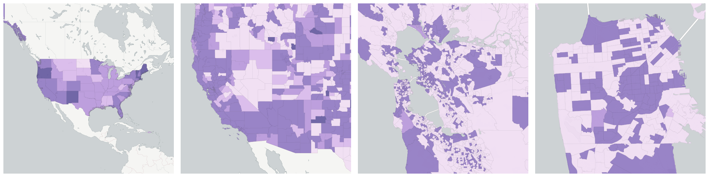
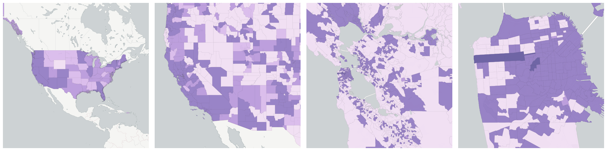
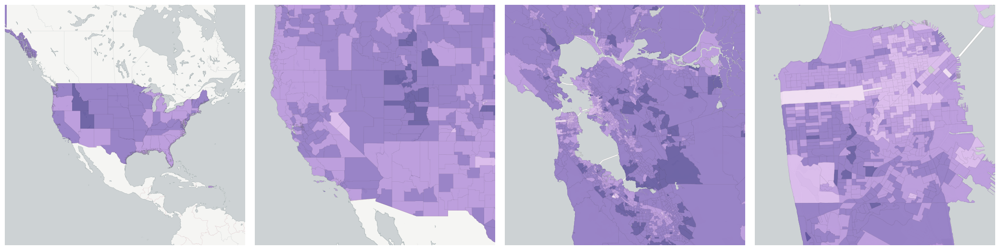
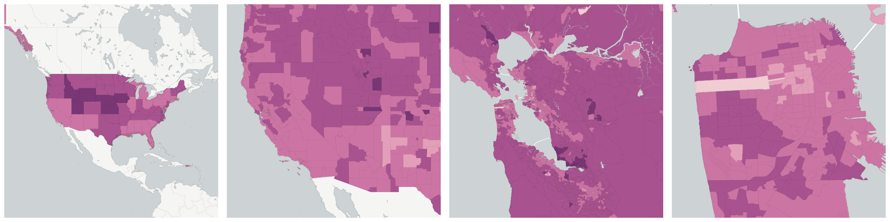
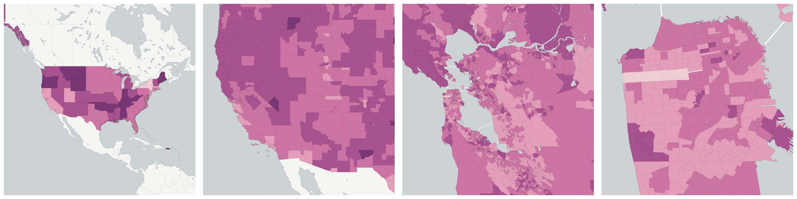
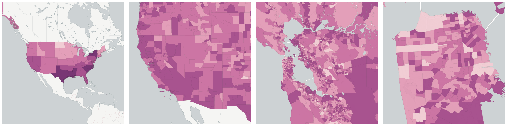
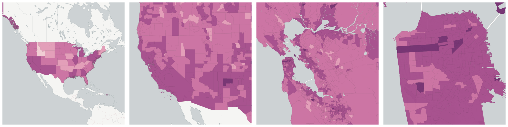
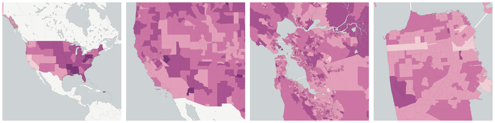

  
# Families

Familial arrangements of people and households.

- [Children under 18 Years of Age](#children-under-18-years-of-age)

- [Households with two female partners](#households-with-two-female-partners)

- [Households with two male partners](#households-with-two-male-partners)

- [Married households](#married-households)

- [Population 15 Years and Over](#population-15-years-and-over)

    * [Currently married](#currently-married)

    * [Divorced](#divorced)

    * [Married but separated](#married-but-separated)

    * [Never Married](#never-married)

    * [Widowed](#widowed)

## Children under 18 Years of Age

The number of people within each geography who are under 18 years of age.

Measure &quot;Children under 18 Years of Age&quot;  density per sq. kilometer  for one point:

    UPDATE {table_name}
      SET {new_numeric_column} =
        OBS_GetMeasure(
          CDB_LatLng(40.7, -73.9),
          'us.census.acs.B09001001'
        );

Measure &quot;Children under 18 Years of Age&quot; within an area:

    UPDATE {table_name}
      SET {new_numeric_column} =
        OBS_GetMeasure(
          ST_Buffer(CDB_LatLng(40.7, -73.9), 0.01),
          'us.census.acs.B09001001'
        );

## Households with two female partners

An unmarried partner is a person age 15 years and over, who is not related to the householder, who shares living quarters, and who has an intimate relationship with the householder.

Measure &quot;Households with two female partners&quot;  density per sq. kilometer  for one point:

    UPDATE {table_name}
      SET {new_numeric_column} =
        OBS_GetMeasure(
          CDB_LatLng(40.7, -73.9),
          'us.census.acs.B11009005'
        );

Measure &quot;Households with two female partners&quot; within an area:

    UPDATE {table_name}
      SET {new_numeric_column} =
        OBS_GetMeasure(
          ST_Buffer(CDB_LatLng(40.7, -73.9), 0.01),
          'us.census.acs.B11009005'
        );

Measure &quot;Households with two female partners&quot; percent of &quot;Households&quot; at one point:

    UPDATE {table_name}
      SET {new_numeric_column} =
        OBS_GetMeasure(
          CDB_LatLng(40.7, -73.9),
          'us.census.acs.B11009005',
          'denominator'
        );

Measure &quot;Households with two female partners&quot; percent of &quot;Households&quot; within an area:

    UPDATE {table_name}
      SET {new_numeric_column} =
        OBS_GetMeasure(
          ST_Buffer(CDB_LatLng(40.7, -73.9), 0.01),
          'us.census.acs.B11009005',
          'denominator'
        );

* denominator: [Households](../housing/#us-census-acs-b11001001)

## Households with two male partners

An unmarried partner is a person age 15 years and over, who is not related to the householder, who shares living quarters, and who has an intimate relationship with the householder.

Measure &quot;Households with two male partners&quot;  density per sq. kilometer  for one point:

    UPDATE {table_name}
      SET {new_numeric_column} =
        OBS_GetMeasure(
          CDB_LatLng(40.7, -73.9),
          'us.census.acs.B11009003'
        );

Measure &quot;Households with two male partners&quot; within an area:

    UPDATE {table_name}
      SET {new_numeric_column} =
        OBS_GetMeasure(
          ST_Buffer(CDB_LatLng(40.7, -73.9), 0.01),
          'us.census.acs.B11009003'
        );

Measure &quot;Households with two male partners&quot; percent of &quot;Households&quot; at one point:

    UPDATE {table_name}
      SET {new_numeric_column} =
        OBS_GetMeasure(
          CDB_LatLng(40.7, -73.9),
          'us.census.acs.B11009003',
          'denominator'
        );

Measure &quot;Households with two male partners&quot; percent of &quot;Households&quot; within an area:

    UPDATE {table_name}
      SET {new_numeric_column} =
        OBS_GetMeasure(
          ST_Buffer(CDB_LatLng(40.7, -73.9), 0.01),
          'us.census.acs.B11009003',
          'denominator'
        );

* denominator: [Households](../housing/#us-census-acs-b11001001)

## Married households

People in formal marriages, as well as people in common-law marriages, are included. Does not include same-sex marriages.

Measure &quot;Married households&quot;  density per sq. kilometer  for one point:

    UPDATE {table_name}
      SET {new_numeric_column} =
        OBS_GetMeasure(
          CDB_LatLng(40.7, -73.9),
          'us.census.acs.B11001003'
        );

Measure &quot;Married households&quot; within an area:

    UPDATE {table_name}
      SET {new_numeric_column} =
        OBS_GetMeasure(
          ST_Buffer(CDB_LatLng(40.7, -73.9), 0.01),
          'us.census.acs.B11001003'
        );

Measure &quot;Married households&quot; percent of &quot;Households&quot; at one point:

    UPDATE {table_name}
      SET {new_numeric_column} =
        OBS_GetMeasure(
          CDB_LatLng(40.7, -73.9),
          'us.census.acs.B11001003',
          'denominator'
        );

Measure &quot;Married households&quot; percent of &quot;Households&quot; within an area:

    UPDATE {table_name}
      SET {new_numeric_column} =
        OBS_GetMeasure(
          ST_Buffer(CDB_LatLng(40.7, -73.9), 0.01),
          'us.census.acs.B11001003',
          'denominator'
        );

* denominator: [Households](../housing/#us-census-acs-b11001001)

## Population 15 Years and Over

The number of people in a geographic area who are over the age of 15.  This is used mostly as a denominator of marital status.

Measure &quot;Population 15 Years and Over&quot;  density per sq. kilometer  for one point:

    UPDATE {table_name}
      SET {new_numeric_column} =
        OBS_GetMeasure(
          CDB_LatLng(40.7, -73.9),
          'us.census.acs.B12005001'
        );

Measure &quot;Population 15 Years and Over&quot; within an area:

    UPDATE {table_name}
      SET {new_numeric_column} =
        OBS_GetMeasure(
          ST_Buffer(CDB_LatLng(40.7, -73.9), 0.01),
          'us.census.acs.B12005001'
        );

Subcolumns of Population 15 Years and Over

- [Currently married](#currently-married)

- [Divorced](#divorced)

- [Married but separated](#married-but-separated)

- [Never Married](#never-married)

- [Widowed](#widowed)

### Currently married

The number of people in a geographic area who are currently married

Measure &quot;Currently married&quot;  density per sq. kilometer  for one point:

    UPDATE {table_name}
      SET {new_numeric_column} =
        OBS_GetMeasure(
          CDB_LatLng(40.7, -73.9),
          'us.census.acs.B12005005'
        );

Measure &quot;Currently married&quot; within an area:

    UPDATE {table_name}
      SET {new_numeric_column} =
        OBS_GetMeasure(
          ST_Buffer(CDB_LatLng(40.7, -73.9), 0.01),
          'us.census.acs.B12005005'
        );

Measure &quot;Currently married&quot; percent of &quot;Population 15 Years and Over&quot; at one point:

    UPDATE {table_name}
      SET {new_numeric_column} =
        OBS_GetMeasure(
          CDB_LatLng(40.7, -73.9),
          'us.census.acs.B12005005',
          'denominator'
        );

Measure &quot;Currently married&quot; percent of &quot;Population 15 Years and Over&quot; within an area:

    UPDATE {table_name}
      SET {new_numeric_column} =
        OBS_GetMeasure(
          ST_Buffer(CDB_LatLng(40.7, -73.9), 0.01),
          'us.census.acs.B12005005',
          'denominator'
        );

* denominator: [Population 15 Years and Over](#us-census-acs-b12005001)

### Divorced

The number of people in a geographic area who are divorced

Measure &quot;Divorced&quot;  density per sq. kilometer  for one point:

    UPDATE {table_name}
      SET {new_numeric_column} =
        OBS_GetMeasure(
          CDB_LatLng(40.7, -73.9),
          'us.census.acs.B12005015'
        );

Measure &quot;Divorced&quot; within an area:

    UPDATE {table_name}
      SET {new_numeric_column} =
        OBS_GetMeasure(
          ST_Buffer(CDB_LatLng(40.7, -73.9), 0.01),
          'us.census.acs.B12005015'
        );

Measure &quot;Divorced&quot; percent of &quot;Population 15 Years and Over&quot; at one point:

    UPDATE {table_name}
      SET {new_numeric_column} =
        OBS_GetMeasure(
          CDB_LatLng(40.7, -73.9),
          'us.census.acs.B12005015',
          'denominator'
        );

Measure &quot;Divorced&quot; percent of &quot;Population 15 Years and Over&quot; within an area:

    UPDATE {table_name}
      SET {new_numeric_column} =
        OBS_GetMeasure(
          ST_Buffer(CDB_LatLng(40.7, -73.9), 0.01),
          'us.census.acs.B12005015',
          'denominator'
        );

* denominator: [Population 15 Years and Over](#us-census-acs-b12005001)

### Married but separated

The number of people in a geographic area who are married but separated

Measure &quot;Married but separated&quot;  density per sq. kilometer  for one point:

    UPDATE {table_name}
      SET {new_numeric_column} =
        OBS_GetMeasure(
          CDB_LatLng(40.7, -73.9),
          'us.census.acs.B12005008'
        );

Measure &quot;Married but separated&quot; within an area:

    UPDATE {table_name}
      SET {new_numeric_column} =
        OBS_GetMeasure(
          ST_Buffer(CDB_LatLng(40.7, -73.9), 0.01),
          'us.census.acs.B12005008'
        );

Measure &quot;Married but separated&quot; percent of &quot;Population 15 Years and Over&quot; at one point:

    UPDATE {table_name}
      SET {new_numeric_column} =
        OBS_GetMeasure(
          CDB_LatLng(40.7, -73.9),
          'us.census.acs.B12005008',
          'denominator'
        );

Measure &quot;Married but separated&quot; percent of &quot;Population 15 Years and Over&quot; within an area:

    UPDATE {table_name}
      SET {new_numeric_column} =
        OBS_GetMeasure(
          ST_Buffer(CDB_LatLng(40.7, -73.9), 0.01),
          'us.census.acs.B12005008',
          'denominator'
        );

* denominator: [Population 15 Years and Over](#us-census-acs-b12005001)

### Never Married

The number of people in a geographic area who have never been married.

Measure &quot;Never Married&quot;  density per sq. kilometer  for one point:

    UPDATE {table_name}
      SET {new_numeric_column} =
        OBS_GetMeasure(
          CDB_LatLng(40.7, -73.9),
          'us.census.acs.B12005002'
        );

Measure &quot;Never Married&quot; within an area:

    UPDATE {table_name}
      SET {new_numeric_column} =
        OBS_GetMeasure(
          ST_Buffer(CDB_LatLng(40.7, -73.9), 0.01),
          'us.census.acs.B12005002'
        );

Measure &quot;Never Married&quot; percent of &quot;Population 15 Years and Over&quot; at one point:

    UPDATE {table_name}
      SET {new_numeric_column} =
        OBS_GetMeasure(
          CDB_LatLng(40.7, -73.9),
          'us.census.acs.B12005002',
          'denominator'
        );

Measure &quot;Never Married&quot; percent of &quot;Population 15 Years and Over&quot; within an area:

    UPDATE {table_name}
      SET {new_numeric_column} =
        OBS_GetMeasure(
          ST_Buffer(CDB_LatLng(40.7, -73.9), 0.01),
          'us.census.acs.B12005002',
          'denominator'
        );

* denominator: [Population 15 Years and Over](#us-census-acs-b12005001)

### Widowed

The number of people in a geographic area who are widowed

Measure &quot;Widowed&quot;  density per sq. kilometer  for one point:

    UPDATE {table_name}
      SET {new_numeric_column} =
        OBS_GetMeasure(
          CDB_LatLng(40.7, -73.9),
          'us.census.acs.B12005012'
        );

Measure &quot;Widowed&quot; within an area:

    UPDATE {table_name}
      SET {new_numeric_column} =
        OBS_GetMeasure(
          ST_Buffer(CDB_LatLng(40.7, -73.9), 0.01),
          'us.census.acs.B12005012'
        );

Measure &quot;Widowed&quot; percent of &quot;Population 15 Years and Over&quot; at one point:

    UPDATE {table_name}
      SET {new_numeric_column} =
        OBS_GetMeasure(
          CDB_LatLng(40.7, -73.9),
          'us.census.acs.B12005012',
          'denominator'
        );

Measure &quot;Widowed&quot; percent of &quot;Population 15 Years and Over&quot; within an area:

    UPDATE {table_name}
      SET {new_numeric_column} =
        OBS_GetMeasure(
          ST_Buffer(CDB_LatLng(40.7, -73.9), 0.01),
          'us.census.acs.B12005012',
          'denominator'
        );

* denominator: [Population 15 Years and Over](#us-census-acs-b12005001)

