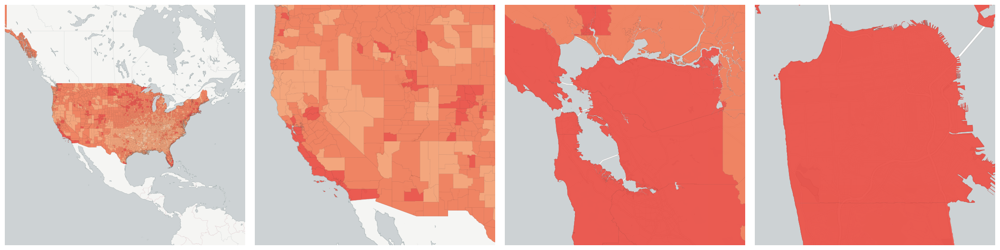
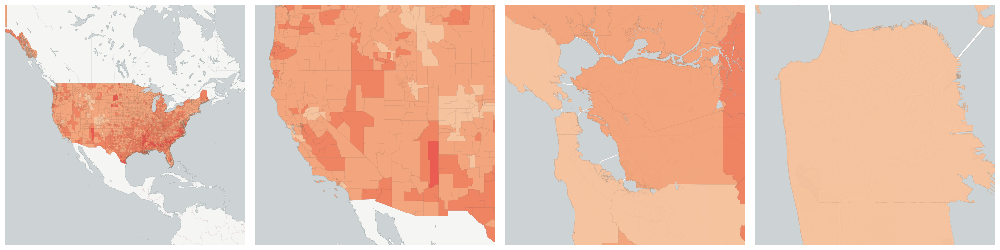
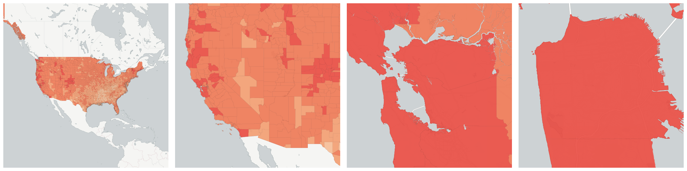
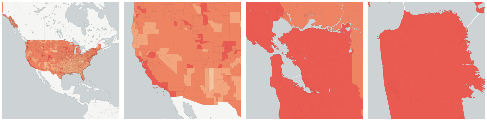
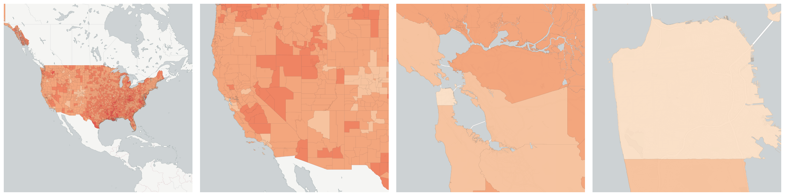
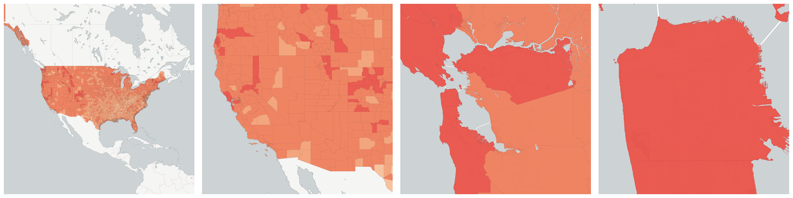

  
# Health

Breakdowns of the population by health

- [Female life expectancy](#female-life-expectancy)

- [Female obesity prevalence](#female-obesity-prevalence)

- [Female sufficient physical activity prevalence](#female-sufficient-physical-activity-prevalence)

- [Male life expectancy](#male-life-expectancy)

- [Male obesity prevalence](#male-obesity-prevalence)

- [Male sufficient physical activity prevalence](#male-sufficient-physical-activity-prevalence)

## Female life expectancy

Measure &quot;Female life expectancy&quot;  for one point:

    UPDATE {table_name}
      SET {new_numeric_column} =
        OBS_GetMeasure(
          CDB_LatLng(40.7, -73.9),
          'us.ihme.female_life_expectancy'
        );

Female life expectancy is only available for point lookups.

## Female obesity prevalence

Measure &quot;Female obesity prevalence&quot;  for one point:

    UPDATE {table_name}
      SET {new_numeric_column} =
        OBS_GetMeasure(
          CDB_LatLng(40.7, -73.9),
          'us.ihme.female_obesity'
        );

Female obesity prevalence is only available for point lookups.

## Female sufficient physical activity prevalence

Measure &quot;Female sufficient physical activity prevalence&quot;  for one point:

    UPDATE {table_name}
      SET {new_numeric_column} =
        OBS_GetMeasure(
          CDB_LatLng(40.7, -73.9),
          'us.ihme.female_physical_activity'
        );

Female sufficient physical activity prevalence is only available for point lookups.

## Male life expectancy

Measure &quot;Male life expectancy&quot;  for one point:

    UPDATE {table_name}
      SET {new_numeric_column} =
        OBS_GetMeasure(
          CDB_LatLng(40.7, -73.9),
          'us.ihme.male_life_expectancy'
        );

Male life expectancy is only available for point lookups.

## Male obesity prevalence

Measure &quot;Male obesity prevalence&quot;  for one point:

    UPDATE {table_name}
      SET {new_numeric_column} =
        OBS_GetMeasure(
          CDB_LatLng(40.7, -73.9),
          'us.ihme.male_obesity'
        );

Male obesity prevalence is only available for point lookups.

## Male sufficient physical activity prevalence

Measure &quot;Male sufficient physical activity prevalence&quot;  for one point:

    UPDATE {table_name}
      SET {new_numeric_column} =
        OBS_GetMeasure(
          CDB_LatLng(40.7, -73.9),
          'us.ihme.male_physical_activity'
        );

Male sufficient physical activity prevalence is only available for point lookups.

