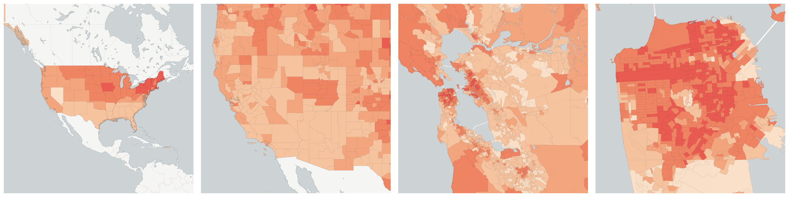
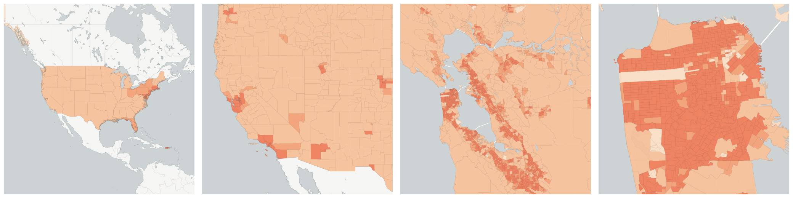
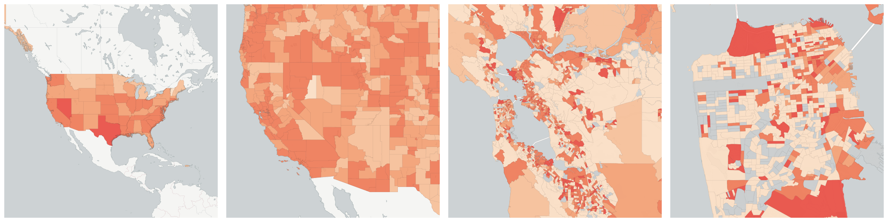
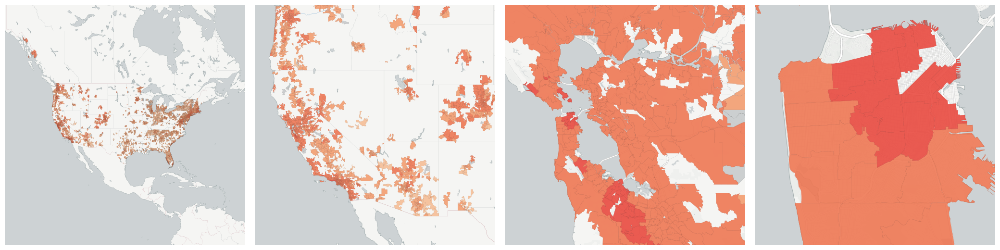
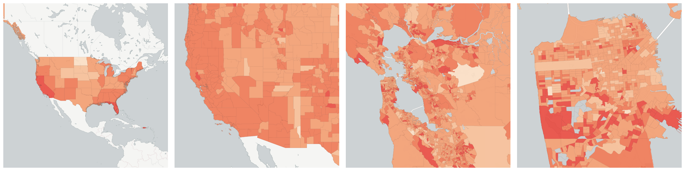

  
# Housing

What type of housing exists and how do people live in it?

- [Households](#households)

- [Housing Units](#housing-units)

    * [Housing units built before 1939](#housing-units-built-before-1939)

    * [Housing units built between 2000 and 2004](#housing-units-built-between-2000-and-2004)

    * [Housing units built in 2005 or later](#housing-units-built-in-2005-or-later)

    * [Mobile homes](#mobile-homes)

    * [Owner-occupied Housing Units](#owner-occupied-housing-units)

        - [Owner-occupied Housing Units valued at $1,000,000 or more.](#owner-occupied-housing-units-valued-at-1-000-000-or-more)

        - [Owner-occupied Housing Units with a Mortgage](#owner-occupied-housing-units-with-a-mortgage)

    * [Renter occupied housing units](#renter-occupied-housing-units)

        - [Renter occupied housing units](#us-census-acs-b25003003)

    * [Vacant Housing Units](#vacant-housing-units)

        - [Vacant Housing Units for Rent](#vacant-housing-units-for-rent)

        - [Vacant Housing Units for Sale](#vacant-housing-units-for-sale)

- [Lived in a different house one year ago in a different city](#lived-in-a-different-house-one-year-ago-in-a-different-city)

- [Lived in a different house one year ago in the same city](#lived-in-a-different-house-one-year-ago-in-the-same-city)

- [Median Rent](#median-rent)

- [Median rental price per square foot for All homes](#median-rental-price-per-square-foot-for-all-homes)

- [Median rental price per square foot for Single Family residence rental](#median-rental-price-per-square-foot-for-single-family-residence-rental)

- [Median value per square foot for All homes](#median-value-per-square-foot-for-all-homes)

- [Owner-Occupied Housing Units Median Value](#owner-occupied-housing-units-median-value)

- [Percent of Household Income Spent on Rent](#percent-of-household-income-spent-on-rent)

- [Zillow Home Value Index for All homes](#zillow-home-value-index-for-all-homes)

- [Zillow Home Value Index for Single Family Homes](#zillow-home-value-index-for-single-family-homes)

- [Zillow Rental Index for All homes plus multifamily](#zillow-rental-index-for-all-homes-plus-multifamily)

- [Zillow Rental Index for Single Family residence rental](#zillow-rental-index-for-single-family-residence-rental)

## Households

A count of the number of households in each geography. A household consists of one or more people who live in the same dwelling and also share at meals or living accommodation, and may consist of a single family or some other grouping of people.

Measure &quot;Households&quot;  density per sq. kilometer  for one point:

    UPDATE {table_name}
      SET {new_numeric_column} =
        OBS_GetMeasure(
          CDB_LatLng(40.7, -73.9),
          'us.census.acs.B11001001'
        );

Measure &quot;Households&quot; within an area:

    UPDATE {table_name}
      SET {new_numeric_column} =
        OBS_GetMeasure(
          ST_Buffer(CDB_LatLng(40.7, -73.9), 0.01),
          'us.census.acs.B11001001'
        );

## Housing Units

A count of housing units in each geography.  A housing unit is a house, an apartment, a mobile home or trailer, a group of rooms, or a single room occupied as separate living quarters, or if vacant, intended for occupancy as separate living quarters.

Measure &quot;Housing Units&quot;  density per sq. kilometer  for one point:

    UPDATE {table_name}
      SET {new_numeric_column} =
        OBS_GetMeasure(
          CDB_LatLng(40.7, -73.9),
          'us.census.acs.B25001001'
        );

Measure &quot;Housing Units&quot; within an area:

    UPDATE {table_name}
      SET {new_numeric_column} =
        OBS_GetMeasure(
          ST_Buffer(CDB_LatLng(40.7, -73.9), 0.01),
          'us.census.acs.B25001001'
        );

Subcolumns of Housing Units

- [Housing units built before 1939](#housing-units-built-before-1939)

- [Housing units built between 2000 and 2004](#housing-units-built-between-2000-and-2004)

- [Housing units built in 2005 or later](#housing-units-built-in-2005-or-later)

- [Mobile homes](#mobile-homes)

- [Owner-occupied Housing Units](#owner-occupied-housing-units)

- [Renter occupied housing units](#renter-occupied-housing-units)

- [Vacant Housing Units](#vacant-housing-units)

### Housing units built before 1939

A house, an apartment, a mobile home or trailer, a group of rooms, or a single room occupied as separate living quarters, or if vacant, intended for occupancy as separate living quarters built in 1939 or earlier.

Measure &quot;Housing units built before 1939&quot;  density per sq. kilometer  for one point:

    UPDATE {table_name}
      SET {new_numeric_column} =
        OBS_GetMeasure(
          CDB_LatLng(40.7, -73.9),
          'us.census.acs.B25034010'
        );

Measure &quot;Housing units built before 1939&quot; within an area:

    UPDATE {table_name}
      SET {new_numeric_column} =
        OBS_GetMeasure(
          ST_Buffer(CDB_LatLng(40.7, -73.9), 0.01),
          'us.census.acs.B25034010'
        );

Measure &quot;Housing units built before 1939&quot; percent of &quot;Housing Units&quot; at one point:

    UPDATE {table_name}
      SET {new_numeric_column} =
        OBS_GetMeasure(
          CDB_LatLng(40.7, -73.9),
          'us.census.acs.B25034010',
          'denominator'
        );

Measure &quot;Housing units built before 1939&quot; percent of &quot;Housing Units&quot; within an area:

    UPDATE {table_name}
      SET {new_numeric_column} =
        OBS_GetMeasure(
          ST_Buffer(CDB_LatLng(40.7, -73.9), 0.01),
          'us.census.acs.B25034010',
          'denominator'
        );

* denominator: [Housing Units](#us-census-acs-b25001001)

### Housing units built between 2000 and 2004

A house, an apartment, a mobile home or trailer, a group of rooms, or a single room occupied as separate living quarters, or if vacant, intended for occupancy as separate living quarters built from 2000 to 2004.

Measure &quot;Housing units built between 2000 and 2004&quot;  density per sq. kilometer  for one point:

    UPDATE {table_name}
      SET {new_numeric_column} =
        OBS_GetMeasure(
          CDB_LatLng(40.7, -73.9),
          'us.census.acs.B25034003'
        );

Measure &quot;Housing units built between 2000 and 2004&quot; within an area:

    UPDATE {table_name}
      SET {new_numeric_column} =
        OBS_GetMeasure(
          ST_Buffer(CDB_LatLng(40.7, -73.9), 0.01),
          'us.census.acs.B25034003'
        );

Measure &quot;Housing units built between 2000 and 2004&quot; percent of &quot;Housing Units&quot; at one point:

    UPDATE {table_name}
      SET {new_numeric_column} =
        OBS_GetMeasure(
          CDB_LatLng(40.7, -73.9),
          'us.census.acs.B25034003',
          'denominator'
        );

Measure &quot;Housing units built between 2000 and 2004&quot; percent of &quot;Housing Units&quot; within an area:

    UPDATE {table_name}
      SET {new_numeric_column} =
        OBS_GetMeasure(
          ST_Buffer(CDB_LatLng(40.7, -73.9), 0.01),
          'us.census.acs.B25034003',
          'denominator'
        );

* denominator: [Housing Units](#us-census-acs-b25001001)

### Housing units built in 2005 or later

A house, an apartment, a mobile home or trailer, a group of rooms, or a single room occupied as separate living quarters, or if vacant, intended for occupancy as separate living quarters built in 2005 or later.

Measure &quot;Housing units built in 2005 or later&quot;  density per sq. kilometer  for one point:

    UPDATE {table_name}
      SET {new_numeric_column} =
        OBS_GetMeasure(
          CDB_LatLng(40.7, -73.9),
          'us.census.acs.B25034002'
        );

Measure &quot;Housing units built in 2005 or later&quot; within an area:

    UPDATE {table_name}
      SET {new_numeric_column} =
        OBS_GetMeasure(
          ST_Buffer(CDB_LatLng(40.7, -73.9), 0.01),
          'us.census.acs.B25034002'
        );

Measure &quot;Housing units built in 2005 or later&quot; percent of &quot;Housing Units&quot; at one point:

    UPDATE {table_name}
      SET {new_numeric_column} =
        OBS_GetMeasure(
          CDB_LatLng(40.7, -73.9),
          'us.census.acs.B25034002',
          'denominator'
        );

Measure &quot;Housing units built in 2005 or later&quot; percent of &quot;Housing Units&quot; within an area:

    UPDATE {table_name}
      SET {new_numeric_column} =
        OBS_GetMeasure(
          ST_Buffer(CDB_LatLng(40.7, -73.9), 0.01),
          'us.census.acs.B25034002',
          'denominator'
        );

* denominator: [Housing Units](#us-census-acs-b25001001)

### Mobile homes

A manufactured home is defined as a movable dwelling, 8 feet or more wide and 40 feet or more long, designed to be towed on its own chassis, with transportation gear integral to the unit when it leaves the factory, and without need of a permanent foundation. These homes are built in accordance with the U.S. Department of Housing and Urban Development (HUD) building code.

Measure &quot;Mobile homes&quot;  density per sq. kilometer  for one point:

    UPDATE {table_name}
      SET {new_numeric_column} =
        OBS_GetMeasure(
          CDB_LatLng(40.7, -73.9),
          'us.census.acs.B25024010'
        );

Measure &quot;Mobile homes&quot; within an area:

    UPDATE {table_name}
      SET {new_numeric_column} =
        OBS_GetMeasure(
          ST_Buffer(CDB_LatLng(40.7, -73.9), 0.01),
          'us.census.acs.B25024010'
        );

Measure &quot;Mobile homes&quot; percent of &quot;Housing Units&quot; at one point:

    UPDATE {table_name}
      SET {new_numeric_column} =
        OBS_GetMeasure(
          CDB_LatLng(40.7, -73.9),
          'us.census.acs.B25024010',
          'denominator'
        );

Measure &quot;Mobile homes&quot; percent of &quot;Housing Units&quot; within an area:

    UPDATE {table_name}
      SET {new_numeric_column} =
        OBS_GetMeasure(
          ST_Buffer(CDB_LatLng(40.7, -73.9), 0.01),
          'us.census.acs.B25024010',
          'denominator'
        );

* denominator: [Housing Units](#us-census-acs-b25001001)

### Owner-occupied Housing Units

Measure &quot;Owner-occupied Housing Units&quot;  density per sq. kilometer  for one point:

    UPDATE {table_name}
      SET {new_numeric_column} =
        OBS_GetMeasure(
          CDB_LatLng(40.7, -73.9),
          'us.census.acs.B25075001'
        );

Measure &quot;Owner-occupied Housing Units&quot; within an area:

    UPDATE {table_name}
      SET {new_numeric_column} =
        OBS_GetMeasure(
          ST_Buffer(CDB_LatLng(40.7, -73.9), 0.01),
          'us.census.acs.B25075001'
        );

Measure &quot;Owner-occupied Housing Units&quot; percent of &quot;Housing Units&quot; at one point:

    UPDATE {table_name}
      SET {new_numeric_column} =
        OBS_GetMeasure(
          CDB_LatLng(40.7, -73.9),
          'us.census.acs.B25075001',
          'denominator'
        );

Measure &quot;Owner-occupied Housing Units&quot; percent of &quot;Housing Units&quot; within an area:

    UPDATE {table_name}
      SET {new_numeric_column} =
        OBS_GetMeasure(
          ST_Buffer(CDB_LatLng(40.7, -73.9), 0.01),
          'us.census.acs.B25075001',
          'denominator'
        );

* denominator: [Housing Units](#us-census-acs-b25001001)

Subcolumns of Owner-occupied Housing Units

- [Owner-occupied Housing Units valued at $1,000,000 or more.](#owner-occupied-housing-units-valued-at-1-000-000-or-more)

- [Owner-occupied Housing Units with a Mortgage](#owner-occupied-housing-units-with-a-mortgage)

#### Owner-occupied Housing Units valued at $1,000,000 or more.

The count of owner occupied housing units in a geographic area that are valued at $1,000,000 or more.  Value is the respondent's estimate of how much the property (house and lot, mobile home and lot, or condominium unit) would sell for if it were for sale.

Measure &quot;Owner-occupied Housing Units valued at $1,000,000 or more.&quot;  density per sq. kilometer  for one point:

    UPDATE {table_name}
      SET {new_numeric_column} =
        OBS_GetMeasure(
          CDB_LatLng(40.7, -73.9),
          'us.census.acs.B25075025'
        );

Measure &quot;Owner-occupied Housing Units valued at $1,000,000 or more.&quot; within an area:

    UPDATE {table_name}
      SET {new_numeric_column} =
        OBS_GetMeasure(
          ST_Buffer(CDB_LatLng(40.7, -73.9), 0.01),
          'us.census.acs.B25075025'
        );

Measure &quot;Owner-occupied Housing Units valued at $1,000,000 or more.&quot; percent of &quot;Owner-occupied Housing Units&quot; at one point:

    UPDATE {table_name}
      SET {new_numeric_column} =
        OBS_GetMeasure(
          CDB_LatLng(40.7, -73.9),
          'us.census.acs.B25075025',
          'denominator'
        );

Measure &quot;Owner-occupied Housing Units valued at $1,000,000 or more.&quot; percent of &quot;Owner-occupied Housing Units&quot; within an area:

    UPDATE {table_name}
      SET {new_numeric_column} =
        OBS_GetMeasure(
          ST_Buffer(CDB_LatLng(40.7, -73.9), 0.01),
          'us.census.acs.B25075025',
          'denominator'
        );

* denominator: [Owner-occupied Housing Units](#us-census-acs-b25075001)

#### Owner-occupied Housing Units with a Mortgage

The count of housing units within a geographic area that are mortagaged. &quot;Mortgage&quot; refers to all forms of debt where the property is pledged as security for repayment of the debt, including deeds of trust, trust deed, contracts to purchase, land contracts, junior mortgages, and home equity loans.

Measure &quot;Owner-occupied Housing Units with a Mortgage&quot;  density per sq. kilometer  for one point:

    UPDATE {table_name}
      SET {new_numeric_column} =
        OBS_GetMeasure(
          CDB_LatLng(40.7, -73.9),
          'us.census.acs.B25081002'
        );

Measure &quot;Owner-occupied Housing Units with a Mortgage&quot; within an area:

    UPDATE {table_name}
      SET {new_numeric_column} =
        OBS_GetMeasure(
          ST_Buffer(CDB_LatLng(40.7, -73.9), 0.01),
          'us.census.acs.B25081002'
        );

Measure &quot;Owner-occupied Housing Units with a Mortgage&quot; percent of &quot;Owner-occupied Housing Units&quot; at one point:

    UPDATE {table_name}
      SET {new_numeric_column} =
        OBS_GetMeasure(
          CDB_LatLng(40.7, -73.9),
          'us.census.acs.B25081002',
          'denominator'
        );

Measure &quot;Owner-occupied Housing Units with a Mortgage&quot; percent of &quot;Owner-occupied Housing Units&quot; within an area:

    UPDATE {table_name}
      SET {new_numeric_column} =
        OBS_GetMeasure(
          ST_Buffer(CDB_LatLng(40.7, -73.9), 0.01),
          'us.census.acs.B25081002',
          'denominator'
        );

* denominator: [Owner-occupied Housing Units](#us-census-acs-b25075001)

### Renter occupied housing units

A housing unit is classified as occupied if it is the usual place of residence of the person or group of people living in it at the time of enumeration.

Measure &quot;Renter occupied housing units&quot;  density per sq. kilometer  for one point:

    UPDATE {table_name}
      SET {new_numeric_column} =
        OBS_GetMeasure(
          CDB_LatLng(40.7, -73.9),
          'us.census.acs.B25003001'
        );

Measure &quot;Renter occupied housing units&quot; within an area:

    UPDATE {table_name}
      SET {new_numeric_column} =
        OBS_GetMeasure(
          ST_Buffer(CDB_LatLng(40.7, -73.9), 0.01),
          'us.census.acs.B25003001'
        );

Measure &quot;Renter occupied housing units&quot; percent of &quot;Housing Units&quot; at one point:

    UPDATE {table_name}
      SET {new_numeric_column} =
        OBS_GetMeasure(
          CDB_LatLng(40.7, -73.9),
          'us.census.acs.B25003001',
          'denominator'
        );

Measure &quot;Renter occupied housing units&quot; percent of &quot;Housing Units&quot; within an area:

    UPDATE {table_name}
      SET {new_numeric_column} =
        OBS_GetMeasure(
          ST_Buffer(CDB_LatLng(40.7, -73.9), 0.01),
          'us.census.acs.B25003001',
          'denominator'
        );

* denominator: [Housing Units](#us-census-acs-b25001001)

Subcolumns of Renter occupied housing units

- [Renter occupied housing units](#us-census-acs-b25003003)

#### Renter occupied housing units

All occupied units which are not owner occupied, whether they are rented for cash rent or occupied without payment of cash rent, are classified as renter-occupied.

Measure &quot;Renter occupied housing units&quot;  density per sq. kilometer  for one point:

    UPDATE {table_name}
      SET {new_numeric_column} =
        OBS_GetMeasure(
          CDB_LatLng(40.7, -73.9),
          'us.census.acs.B25003003'
        );

Measure &quot;Renter occupied housing units&quot; within an area:

    UPDATE {table_name}
      SET {new_numeric_column} =
        OBS_GetMeasure(
          ST_Buffer(CDB_LatLng(40.7, -73.9), 0.01),
          'us.census.acs.B25003003'
        );

Measure &quot;Renter occupied housing units&quot; percent of &quot;Renter occupied housing units&quot; at one point:

    UPDATE {table_name}
      SET {new_numeric_column} =
        OBS_GetMeasure(
          CDB_LatLng(40.7, -73.9),
          'us.census.acs.B25003003',
          'denominator'
        );

Measure &quot;Renter occupied housing units&quot; percent of &quot;Renter occupied housing units&quot; within an area:

    UPDATE {table_name}
      SET {new_numeric_column} =
        OBS_GetMeasure(
          ST_Buffer(CDB_LatLng(40.7, -73.9), 0.01),
          'us.census.acs.B25003003',
          'denominator'
        );

* denominator: [Renter occupied housing units](#us-census-acs-b25003001)

### Vacant Housing Units

The count of vacant housing units in a geographic area. A housing unit is vacant if no one is living in it at the time of enumeration, unless its occupants are only temporarily absent. Units temporarily occupied at the time of enumeration entirely by people who have a usual residence elsewhere are also classified as vacant.

Measure &quot;Vacant Housing Units&quot;  density per sq. kilometer  for one point:

    UPDATE {table_name}
      SET {new_numeric_column} =
        OBS_GetMeasure(
          CDB_LatLng(40.7, -73.9),
          'us.census.acs.B25002003'
        );

Measure &quot;Vacant Housing Units&quot; within an area:

    UPDATE {table_name}
      SET {new_numeric_column} =
        OBS_GetMeasure(
          ST_Buffer(CDB_LatLng(40.7, -73.9), 0.01),
          'us.census.acs.B25002003'
        );

Measure &quot;Vacant Housing Units&quot; percent of &quot;Housing Units&quot; at one point:

    UPDATE {table_name}
      SET {new_numeric_column} =
        OBS_GetMeasure(
          CDB_LatLng(40.7, -73.9),
          'us.census.acs.B25002003',
          'denominator'
        );

Measure &quot;Vacant Housing Units&quot; percent of &quot;Housing Units&quot; within an area:

    UPDATE {table_name}
      SET {new_numeric_column} =
        OBS_GetMeasure(
          ST_Buffer(CDB_LatLng(40.7, -73.9), 0.01),
          'us.census.acs.B25002003',
          'denominator'
        );

* denominator: [Housing Units](#us-census-acs-b25001001)

Subcolumns of Vacant Housing Units

- [Vacant Housing Units for Rent](#vacant-housing-units-for-rent)

- [Vacant Housing Units for Sale](#vacant-housing-units-for-sale)

#### Vacant Housing Units for Rent

The count of vacant housing units in a geographic area that are for rent. A housing unit is vacant if no one is living in it at the time of enumeration, unless its occupants are only temporarily absent. Units temporarily occupied at the time of enumeration entirely by people who have a usual residence elsewhere are also classified as vacant.

Measure &quot;Vacant Housing Units for Rent&quot;  density per sq. kilometer  for one point:

    UPDATE {table_name}
      SET {new_numeric_column} =
        OBS_GetMeasure(
          CDB_LatLng(40.7, -73.9),
          'us.census.acs.B25004002'
        );

Measure &quot;Vacant Housing Units for Rent&quot; within an area:

    UPDATE {table_name}
      SET {new_numeric_column} =
        OBS_GetMeasure(
          ST_Buffer(CDB_LatLng(40.7, -73.9), 0.01),
          'us.census.acs.B25004002'
        );

Measure &quot;Vacant Housing Units for Rent&quot; percent of &quot;Vacant Housing Units&quot; at one point:

    UPDATE {table_name}
      SET {new_numeric_column} =
        OBS_GetMeasure(
          CDB_LatLng(40.7, -73.9),
          'us.census.acs.B25004002',
          'denominator'
        );

Measure &quot;Vacant Housing Units for Rent&quot; percent of &quot;Vacant Housing Units&quot; within an area:

    UPDATE {table_name}
      SET {new_numeric_column} =
        OBS_GetMeasure(
          ST_Buffer(CDB_LatLng(40.7, -73.9), 0.01),
          'us.census.acs.B25004002',
          'denominator'
        );

* denominator: [Vacant Housing Units](#us-census-acs-b25002003)

#### Vacant Housing Units for Sale

The count of vacant housing units in a geographic area that are for sale. A housing unit is vacant if no one is living in it at the time of enumeration, unless its occupants are only temporarily absent. Units temporarily occupied at the time of enumeration entirely by people who have a usual residence elsewhere are also classified as vacant.

Measure &quot;Vacant Housing Units for Sale&quot;  density per sq. kilometer  for one point:

    UPDATE {table_name}
      SET {new_numeric_column} =
        OBS_GetMeasure(
          CDB_LatLng(40.7, -73.9),
          'us.census.acs.B25004004'
        );

Measure &quot;Vacant Housing Units for Sale&quot; within an area:

    UPDATE {table_name}
      SET {new_numeric_column} =
        OBS_GetMeasure(
          ST_Buffer(CDB_LatLng(40.7, -73.9), 0.01),
          'us.census.acs.B25004004'
        );

Measure &quot;Vacant Housing Units for Sale&quot; percent of &quot;Vacant Housing Units&quot; at one point:

    UPDATE {table_name}
      SET {new_numeric_column} =
        OBS_GetMeasure(
          CDB_LatLng(40.7, -73.9),
          'us.census.acs.B25004004',
          'denominator'
        );

Measure &quot;Vacant Housing Units for Sale&quot; percent of &quot;Vacant Housing Units&quot; within an area:

    UPDATE {table_name}
      SET {new_numeric_column} =
        OBS_GetMeasure(
          ST_Buffer(CDB_LatLng(40.7, -73.9), 0.01),
          'us.census.acs.B25004004',
          'denominator'
        );

* denominator: [Vacant Housing Units](#us-census-acs-b25002003)

## Lived in a different house one year ago in a different city

All people in a geographic area who lived in a different city within the year prior to the survey.

Measure &quot;Lived in a different house one year ago in a different city&quot;  density per sq. kilometer  for one point:

    UPDATE {table_name}
      SET {new_numeric_column} =
        OBS_GetMeasure(
          CDB_LatLng(40.7, -73.9),
          'us.census.acs.B07204007'
        );

Measure &quot;Lived in a different house one year ago in a different city&quot; within an area:

    UPDATE {table_name}
      SET {new_numeric_column} =
        OBS_GetMeasure(
          ST_Buffer(CDB_LatLng(40.7, -73.9), 0.01),
          'us.census.acs.B07204007'
        );

Measure &quot;Lived in a different house one year ago in a different city&quot; percent of &quot;Population 1 year and over&quot; at one point:

    UPDATE {table_name}
      SET {new_numeric_column} =
        OBS_GetMeasure(
          CDB_LatLng(40.7, -73.9),
          'us.census.acs.B07204007',
          'denominator'
        );

Measure &quot;Lived in a different house one year ago in a different city&quot; percent of &quot;Population 1 year and over&quot; within an area:

    UPDATE {table_name}
      SET {new_numeric_column} =
        OBS_GetMeasure(
          ST_Buffer(CDB_LatLng(40.7, -73.9), 0.01),
          'us.census.acs.B07204007',
          'denominator'
        );

* denominator: [Population 1 year and over](../age_gender/#us-census-acs-b07204001)

## Lived in a different house one year ago in the same city

All people in a geographic area who lived in the same city but moved to a different unit within the year prior to the survey.

Measure &quot;Lived in a different house one year ago in the same city&quot;  density per sq. kilometer  for one point:

    UPDATE {table_name}
      SET {new_numeric_column} =
        OBS_GetMeasure(
          CDB_LatLng(40.7, -73.9),
          'us.census.acs.B07204004'
        );

Measure &quot;Lived in a different house one year ago in the same city&quot; within an area:

    UPDATE {table_name}
      SET {new_numeric_column} =
        OBS_GetMeasure(
          ST_Buffer(CDB_LatLng(40.7, -73.9), 0.01),
          'us.census.acs.B07204004'
        );

Measure &quot;Lived in a different house one year ago in the same city&quot; percent of &quot;Population 1 year and over&quot; at one point:

    UPDATE {table_name}
      SET {new_numeric_column} =
        OBS_GetMeasure(
          CDB_LatLng(40.7, -73.9),
          'us.census.acs.B07204004',
          'denominator'
        );

Measure &quot;Lived in a different house one year ago in the same city&quot; percent of &quot;Population 1 year and over&quot; within an area:

    UPDATE {table_name}
      SET {new_numeric_column} =
        OBS_GetMeasure(
          ST_Buffer(CDB_LatLng(40.7, -73.9), 0.01),
          'us.census.acs.B07204004',
          'denominator'
        );

* denominator: [Population 1 year and over](../age_gender/#us-census-acs-b07204001)

## Median Rent

The median contract rent within a geographic area. The contract rent is the monthly rent agreed to or contracted for, regardless of any furnishings, utilities, fees, meals, or services that may be included. For vacant units, it is the monthly rent asked for the rental unit at the time of interview.

Measure &quot;Median Rent&quot;  for one point:

    UPDATE {table_name}
      SET {new_numeric_column} =
        OBS_GetMeasure(
          CDB_LatLng(40.7, -73.9),
          'us.census.acs.B25058001'
        );

Median Rent is only available for point lookups.

## Median rental price per square foot for All homes

Median of the value (US Dollars) of all homes per square foot. This number is calculated by taking the estimated home value for each home in a given region and dividing it by the home's square footage. Zillow defines all homes as single-family, condominium and co-operative homes with a county record. Unless specified, all series cover this segment of the housing stock.

Measure &quot;Median rental price per square foot for All homes&quot;  for one point:

    UPDATE {table_name}
      SET {new_numeric_column} =
        OBS_GetMeasure(
          CDB_LatLng(28.3305906291771, -81.3544048197256),
          'us.zillow.AllHomes_MedianRentalPricePerSqft'
        );

Median rental price per square foot for All homes is only available for point lookups.

## Median rental price per square foot for Single Family residence rental

Median of the value (US Dollars) of all homes per square foot. This number is calculated by taking the estimated home value for each home in a given region and dividing it by the home's square footage. Single family residences are detached, free-standing residential buildings.

Measure &quot;Median rental price per square foot for Single Family residence rental&quot;  for one point:

    UPDATE {table_name}
      SET {new_numeric_column} =
        OBS_GetMeasure(
          CDB_LatLng(28.3305906291771, -81.3544048197256),
          'us.zillow.Sfr_MedianRentalPricePerSqft'
        );

Median rental price per square foot for Single Family residence rental is only available for point lookups.

## Median value per square foot for All homes

Median of the estimated monthly rent price (US Dollars) of all homes, per square foot. This is calculated by taking the estimated rent price for a home and dividing it by the homes square footage. Zillow defines all homes as single-family, condominium and co-operative homes with a county record. Unless specified, all series cover this segment of the housing stock.

Measure &quot;Median value per square foot for All homes&quot;  for one point:

    UPDATE {table_name}
      SET {new_numeric_column} =
        OBS_GetMeasure(
          CDB_LatLng(28.3305906291771, -81.3544048197256),
          'us.zillow.AllHomes_MedianValuePerSqft'
        );

Median value per square foot for All homes is only available for point lookups.

## Owner-Occupied Housing Units Median Value

The middle value (median) in a geographic area owner occupied housing units.

Measure &quot;Owner-Occupied Housing Units Median Value&quot;  for one point:

    UPDATE {table_name}
      SET {new_numeric_column} =
        OBS_GetMeasure(
          CDB_LatLng(40.7, -73.9),
          'us.census.acs.B25077001'
        );

Owner-Occupied Housing Units Median Value is only available for point lookups.

## Percent of Household Income Spent on Rent

Within a geographic area, the median percentage of household income which was spent on gross rent.  Gross rent is the amount of the contract rent plus the estimated average monthly cost of utilities (electricity, gas, water, sewer etc.) and fuels (oil, coal, wood, etc.) if these are paid by the renter.  Household income is the sum of the income of all people 15 years and older living in the household.

Measure &quot;Percent of Household Income Spent on Rent&quot;  for one point:

    UPDATE {table_name}
      SET {new_numeric_column} =
        OBS_GetMeasure(
          CDB_LatLng(40.7, -73.9),
          'us.census.acs.B25071001'
        );

Percent of Household Income Spent on Rent is only available for point lookups.

## Zillow Home Value Index for All homes

The Zillow Home Value Index (ZHVI) is a time series tracking the monthly median home value (in US Dollars) in a particular geographical region. In general, each ZHVI time series begins in April 1996. See [Zillow's methodology](http://www.zillow.com/research/zhvi-methodology-6032/) for more information. Zillow defines all homes as single-family, condominium and co-operative homes with a county record. Unless specified, all series cover this segment of the housing stock.

Measure &quot;Zillow Home Value Index for All homes&quot;  for one point:

    UPDATE {table_name}
      SET {new_numeric_column} =
        OBS_GetMeasure(
          CDB_LatLng(28.3305906291771, -81.3544048197256),
          'us.zillow.AllHomes_Zhvi'
        );

Zillow Home Value Index for All homes is only available for point lookups.

## Zillow Home Value Index for Single Family Homes

The Zillow Home Value Index (ZHVI) is a time series tracking the monthly median home value (in US Dollars) in a particular geographical region. In general, each ZHVI time series begins in April 1996. See [Zillow's methodology](http://www.zillow.com/research/zhvi-methodology-6032/) for more information. Single family residences are detached, free-standing residential buildings.

Measure &quot;Zillow Home Value Index for Single Family Homes&quot;  for one point:

    UPDATE {table_name}
      SET {new_numeric_column} =
        OBS_GetMeasure(
          CDB_LatLng(28.3305906291771, -81.3544048197256),
          'us.zillow.SingleFamilyResidence_Zhvi'
        );

Zillow Home Value Index for Single Family Homes is only available for point lookups.

## Zillow Rental Index for All homes plus multifamily

Similar to Zillow's ZHVI, the Zillow Rent Index (ZRI) tracks the monthly median rent (in US Dollars) in different geographical regions. In general, each ZRI time series beginds in November, 2010.  See [Zillow's methodology](http://www.zillow.com/research/zillow-rent-index-methodology-2393/) for more information. In addition to &quot;All homes&quot;, which Zillow defines as single-family, condominium and co-operative homes with a county record, this group includes units in buildings with 5 or more housing units that are not a condominiums or co-ops.

Measure &quot;Zillow Rental Index for All homes plus multifamily&quot;  for one point:

    UPDATE {table_name}
      SET {new_numeric_column} =
        OBS_GetMeasure(
          CDB_LatLng(28.3305906291771, -81.3544048197256),
          'us.zillow.AllHomesPlusMultifamily_Zri'
        );

Zillow Rental Index for All homes plus multifamily is only available for point lookups.

## Zillow Rental Index for Single Family residence rental

Similar to Zillow's ZHVI, the Zillow Rent Index (ZRI) tracks the monthly median rent (in US Dollars) in different geographical regions. In general, each ZRI time series beginds in November, 2010.  See [Zillow's methodology](http://www.zillow.com/research/zillow-rent-index-methodology-2393/) for more information. Single Family residence rental is defined as detached, free-standing residential buildings which are rented out.

Measure &quot;Zillow Rental Index for Single Family residence rental&quot;  for one point:

    UPDATE {table_name}
      SET {new_numeric_column} =
        OBS_GetMeasure(
          CDB_LatLng(28.3305906291771, -81.3544048197256),
          'us.zillow.SingleFamilyResidenceRental_Zri'
        );

Zillow Rental Index for Single Family residence rental is only available for point lookups.

