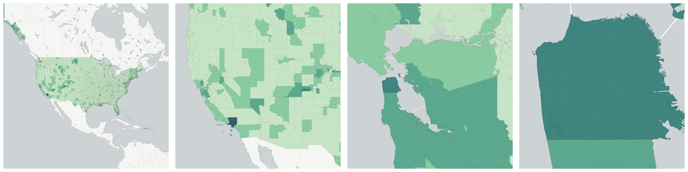
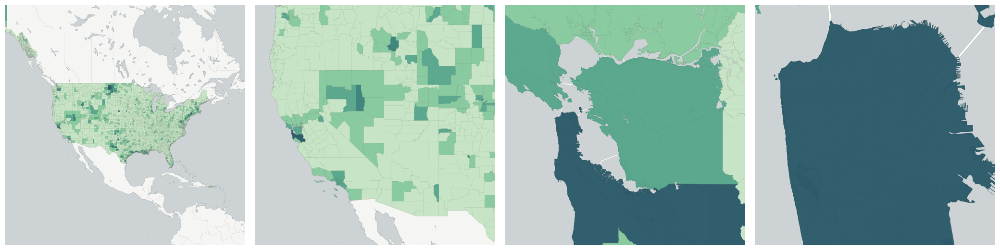

  
# Income

How much people earn.

- [Average weekly wage for Accommodation and food services establishments](#average-weekly-wage-for-accommodation-and-food-services-establishments)

- [Average weekly wage for Accommodation and food services establishments](#us-bls-avg-wkly-wage-72)

- [Average weekly wage for Administrative and waste services establishments](#average-weekly-wage-for-administrative-and-waste-services-establishments)

- [Average weekly wage for Administrative and waste services establishments](#us-bls-avg-wkly-wage-56)

- [Average weekly wage for Agriculture, forestry, fishing and hunting establishments](#average-weekly-wage-for-agriculture-forestry-fishing-and-hunting-establishments)

- [Average weekly wage for Agriculture, forestry, fishing and hunting establishments](#us-bls-avg-wkly-wage-11)

- [Average weekly wage for Arts, entertainment, and recreation establishments](#average-weekly-wage-for-arts-entertainment-and-recreation-establishments)

- [Average weekly wage for Arts, entertainment, and recreation establishments](#us-bls-avg-wkly-wage-71)

- [Average weekly wage for Construction establishments](#average-weekly-wage-for-construction-establishments)

- [Average weekly wage for Construction establishments](#us-qcew-example-avg-wkly-wage-23)

- [Average weekly wage for Construction establishments](#us-bls-avg-wkly-wage-1012)

- [Average weekly wage for Construction establishments](#us-bls-avg-wkly-wage-23)

- [Average weekly wage for Education and health services establishments](#average-weekly-wage-for-education-and-health-services-establishments)

- [Average weekly wage for Education and health services establishments](#us-bls-avg-wkly-wage-1025)

- [Average weekly wage for Educational services establishments](#average-weekly-wage-for-educational-services-establishments)

- [Average weekly wage for Educational services establishments](#us-bls-avg-wkly-wage-61)

- [Average weekly wage for Finance and insurance establishments](#average-weekly-wage-for-finance-and-insurance-establishments)

- [Average weekly wage for Finance and insurance establishments](#us-bls-avg-wkly-wage-52)

- [Average weekly wage for Financial activities establishments](#average-weekly-wage-for-financial-activities-establishments)

- [Average weekly wage for Financial activities establishments](#us-bls-avg-wkly-wage-1023)

- [Average weekly wage for Health care and social assistance establishments](#average-weekly-wage-for-health-care-and-social-assistance-establishments)

- [Average weekly wage for Health care and social assistance establishments](#us-bls-avg-wkly-wage-62)

- [Average weekly wage for Information establishments](#average-weekly-wage-for-information-establishments)

- [Average weekly wage for Information establishments](#us-qcew-example-avg-wkly-wage-51)

- [Average weekly wage for Information establishments](#us-bls-avg-wkly-wage-1022)

- [Average weekly wage for Information establishments](#us-bls-avg-wkly-wage-51)

- [Average weekly wage for Leisure and hospitality establishments](#average-weekly-wage-for-leisure-and-hospitality-establishments)

- [Average weekly wage for Leisure and hospitality establishments](#us-bls-avg-wkly-wage-1026)

- [Average weekly wage for Management of companies and enterprises establishments](#average-weekly-wage-for-management-of-companies-and-enterprises-establishments)

- [Average weekly wage for Management of companies and enterprises establishments](#us-bls-avg-wkly-wage-55)

- [Average weekly wage for Manufacturing establishments](#average-weekly-wage-for-manufacturing-establishments)

- [Average weekly wage for Manufacturing establishments](#us-qcew-example-avg-wkly-wage-31-33)

- [Average weekly wage for Manufacturing establishments](#us-bls-avg-wkly-wage-1013)

- [Average weekly wage for Manufacturing establishments](#us-bls-avg-wkly-wage-31-33)

- [Average weekly wage for Mining, quarrying, and oil and gas extraction establishments](#average-weekly-wage-for-mining-quarrying-and-oil-and-gas-extraction-establishments)

- [Average weekly wage for Mining, quarrying, and oil and gas extraction establishments](#us-bls-avg-wkly-wage-21)

- [Average weekly wage for Natural resources and mining establishments](#average-weekly-wage-for-natural-resources-and-mining-establishments)

- [Average weekly wage for Natural resources and mining establishments](#us-bls-avg-wkly-wage-1011)

- [Average weekly wage for Other services establishments](#average-weekly-wage-for-other-services-establishments)

- [Average weekly wage for Other services establishments](#us-bls-avg-wkly-wage-1027)

- [Average weekly wage for Other services, except public administration establishments](#average-weekly-wage-for-other-services-except-public-administration-establishments)

- [Average weekly wage for Other services, except public administration establishments](#us-bls-avg-wkly-wage-81)

- [Average weekly wage for Professional and business services establishments](#average-weekly-wage-for-professional-and-business-services-establishments)

- [Average weekly wage for Professional and business services establishments](#us-bls-avg-wkly-wage-1024)

- [Average weekly wage for Professional and technical services establishments](#average-weekly-wage-for-professional-and-technical-services-establishments)

- [Average weekly wage for Professional and technical services establishments](#us-bls-avg-wkly-wage-54)

- [Average weekly wage for Public administration establishments](#average-weekly-wage-for-public-administration-establishments)

- [Average weekly wage for Public administration establishments](#us-qcew-example-avg-wkly-wage-92)

- [Average weekly wage for Public administration establishments](#us-bls-avg-wkly-wage-1028)

- [Average weekly wage for Public administration establishments](#us-bls-avg-wkly-wage-92)

- [Average weekly wage for Real estate and rental and leasing establishments](#average-weekly-wage-for-real-estate-and-rental-and-leasing-establishments)

- [Average weekly wage for Real estate and rental and leasing establishments](#us-bls-avg-wkly-wage-53)

- [Average weekly wage for Retail trade establishments](#average-weekly-wage-for-retail-trade-establishments)

- [Average weekly wage for Retail trade establishments](#us-bls-avg-wkly-wage-44-45)

- [Average weekly wage for Total, all industries establishments](#average-weekly-wage-for-total-all-industries-establishments)

- [Average weekly wage for Total, all industries establishments](#us-bls-avg-wkly-wage-10)

- [Average weekly wage for Trade, transportation, and utilities establishments](#average-weekly-wage-for-trade-transportation-and-utilities-establishments)

- [Average weekly wage for Trade, transportation, and utilities establishments](#us-bls-avg-wkly-wage-1021)

- [Average weekly wage for Transportation and warehousing establishments](#average-weekly-wage-for-transportation-and-warehousing-establishments)

- [Average weekly wage for Transportation and warehousing establishments](#us-bls-avg-wkly-wage-48-49)

- [Average weekly wage for Unclassified establishments](#average-weekly-wage-for-unclassified-establishments)

- [Average weekly wage for Unclassified establishments](#us-qcew-example-avg-wkly-wage-1029)

- [Average weekly wage for Unclassified establishments](#us-bls-avg-wkly-wage-99)

- [Average weekly wage for Unclassified establishments](#us-bls-avg-wkly-wage-1029)

- [Average weekly wage for Utilities establishments](#average-weekly-wage-for-utilities-establishments)

- [Average weekly wage for Utilities establishments](#us-bls-avg-wkly-wage-22)

- [Average weekly wage for Wholesale trade establishments](#average-weekly-wage-for-wholesale-trade-establishments)

- [Average weekly wage for Wholesale trade establishments](#us-bls-avg-wkly-wage-42)

- [Average weekly wage location quotient for Accommodation and food services establishments](#average-weekly-wage-location-quotient-for-accommodation-and-food-services-establishments)

- [Average weekly wage location quotient for Accommodation and food services establishments](#us-bls-lq-avg-wkly-wage-72)

- [Average weekly wage location quotient for Administrative and waste services establishments](#average-weekly-wage-location-quotient-for-administrative-and-waste-services-establishments)

- [Average weekly wage location quotient for Administrative and waste services establishments](#us-bls-lq-avg-wkly-wage-56)

- [Average weekly wage location quotient for Agriculture, forestry, fishing and hunting establishments](#average-weekly-wage-location-quotient-for-agriculture-forestry-fishing-and-hunting-establishments)

- [Average weekly wage location quotient for Agriculture, forestry, fishing and hunting establishments](#us-bls-lq-avg-wkly-wage-11)

- [Average weekly wage location quotient for Arts, entertainment, and recreation establishments](#average-weekly-wage-location-quotient-for-arts-entertainment-and-recreation-establishments)

- [Average weekly wage location quotient for Arts, entertainment, and recreation establishments](#us-bls-lq-avg-wkly-wage-71)

- [Average weekly wage location quotient for Construction establishments](#average-weekly-wage-location-quotient-for-construction-establishments)

- [Average weekly wage location quotient for Construction establishments](#us-qcew-example-lq-avg-wkly-wage-23)

- [Average weekly wage location quotient for Construction establishments](#us-bls-lq-avg-wkly-wage-1012)

- [Average weekly wage location quotient for Construction establishments](#us-bls-lq-avg-wkly-wage-23)

- [Average weekly wage location quotient for Education and health services establishments](#average-weekly-wage-location-quotient-for-education-and-health-services-establishments)

- [Average weekly wage location quotient for Education and health services establishments](#us-bls-lq-avg-wkly-wage-1025)

- [Average weekly wage location quotient for Educational services establishments](#average-weekly-wage-location-quotient-for-educational-services-establishments)

- [Average weekly wage location quotient for Educational services establishments](#us-bls-lq-avg-wkly-wage-61)

- [Average weekly wage location quotient for Finance and insurance establishments](#average-weekly-wage-location-quotient-for-finance-and-insurance-establishments)

- [Average weekly wage location quotient for Finance and insurance establishments](#us-bls-lq-avg-wkly-wage-52)

- [Average weekly wage location quotient for Financial activities establishments](#average-weekly-wage-location-quotient-for-financial-activities-establishments)

- [Average weekly wage location quotient for Financial activities establishments](#us-bls-lq-avg-wkly-wage-1023)

- [Average weekly wage location quotient for Health care and social assistance establishments](#average-weekly-wage-location-quotient-for-health-care-and-social-assistance-establishments)

- [Average weekly wage location quotient for Health care and social assistance establishments](#us-bls-lq-avg-wkly-wage-62)

- [Average weekly wage location quotient for Information establishments](#average-weekly-wage-location-quotient-for-information-establishments)

- [Average weekly wage location quotient for Information establishments](#us-qcew-example-lq-avg-wkly-wage-51)

- [Average weekly wage location quotient for Information establishments](#us-bls-lq-avg-wkly-wage-1022)

- [Average weekly wage location quotient for Information establishments](#us-bls-lq-avg-wkly-wage-51)

- [Average weekly wage location quotient for Leisure and hospitality establishments](#average-weekly-wage-location-quotient-for-leisure-and-hospitality-establishments)

- [Average weekly wage location quotient for Leisure and hospitality establishments](#us-bls-lq-avg-wkly-wage-1026)

- [Average weekly wage location quotient for Management of companies and enterprises establishments](#average-weekly-wage-location-quotient-for-management-of-companies-and-enterprises-establishments)

- [Average weekly wage location quotient for Management of companies and enterprises establishments](#us-bls-lq-avg-wkly-wage-55)

- [Average weekly wage location quotient for Manufacturing establishments](#average-weekly-wage-location-quotient-for-manufacturing-establishments)

- [Average weekly wage location quotient for Manufacturing establishments](#us-qcew-example-lq-avg-wkly-wage-31-33)

- [Average weekly wage location quotient for Manufacturing establishments](#us-bls-lq-avg-wkly-wage-1013)

- [Average weekly wage location quotient for Manufacturing establishments](#us-bls-lq-avg-wkly-wage-31-33)

- [Average weekly wage location quotient for Mining, quarrying, and oil and gas extraction establishments](#average-weekly-wage-location-quotient-for-mining-quarrying-and-oil-and-gas-extraction-establishments)

- [Average weekly wage location quotient for Mining, quarrying, and oil and gas extraction establishments](#us-bls-lq-avg-wkly-wage-21)

- [Average weekly wage location quotient for Natural resources and mining establishments](#average-weekly-wage-location-quotient-for-natural-resources-and-mining-establishments)

- [Average weekly wage location quotient for Natural resources and mining establishments](#us-bls-lq-avg-wkly-wage-1011)

- [Average weekly wage location quotient for Other services establishments](#average-weekly-wage-location-quotient-for-other-services-establishments)

- [Average weekly wage location quotient for Other services establishments](#us-bls-lq-avg-wkly-wage-1027)

- [Average weekly wage location quotient for Other services, except public administration establishments](#average-weekly-wage-location-quotient-for-other-services-except-public-administration-establishments)

- [Average weekly wage location quotient for Other services, except public administration establishments](#us-bls-lq-avg-wkly-wage-81)

- [Average weekly wage location quotient for Professional and business services establishments](#average-weekly-wage-location-quotient-for-professional-and-business-services-establishments)

- [Average weekly wage location quotient for Professional and business services establishments](#us-bls-lq-avg-wkly-wage-1024)

- [Average weekly wage location quotient for Professional and technical services establishments](#average-weekly-wage-location-quotient-for-professional-and-technical-services-establishments)

- [Average weekly wage location quotient for Professional and technical services establishments](#us-bls-lq-avg-wkly-wage-54)

- [Average weekly wage location quotient for Public administration establishments](#average-weekly-wage-location-quotient-for-public-administration-establishments)

- [Average weekly wage location quotient for Public administration establishments](#us-qcew-example-lq-avg-wkly-wage-92)

- [Average weekly wage location quotient for Public administration establishments](#us-bls-lq-avg-wkly-wage-1028)

- [Average weekly wage location quotient for Public administration establishments](#us-bls-lq-avg-wkly-wage-92)

- [Average weekly wage location quotient for Real estate and rental and leasing establishments](#average-weekly-wage-location-quotient-for-real-estate-and-rental-and-leasing-establishments)

- [Average weekly wage location quotient for Real estate and rental and leasing establishments](#us-bls-lq-avg-wkly-wage-53)

- [Average weekly wage location quotient for Retail trade establishments](#average-weekly-wage-location-quotient-for-retail-trade-establishments)

- [Average weekly wage location quotient for Retail trade establishments](#us-bls-lq-avg-wkly-wage-44-45)

- [Average weekly wage location quotient for Total, all industries establishments](#average-weekly-wage-location-quotient-for-total-all-industries-establishments)

- [Average weekly wage location quotient for Total, all industries establishments](#us-bls-lq-avg-wkly-wage-10)

- [Average weekly wage location quotient for Trade, transportation, and utilities establishments](#average-weekly-wage-location-quotient-for-trade-transportation-and-utilities-establishments)

- [Average weekly wage location quotient for Trade, transportation, and utilities establishments](#us-bls-lq-avg-wkly-wage-1021)

- [Average weekly wage location quotient for Transportation and warehousing establishments](#average-weekly-wage-location-quotient-for-transportation-and-warehousing-establishments)

- [Average weekly wage location quotient for Transportation and warehousing establishments](#us-bls-lq-avg-wkly-wage-48-49)

- [Average weekly wage location quotient for Unclassified establishments](#average-weekly-wage-location-quotient-for-unclassified-establishments)

- [Average weekly wage location quotient for Unclassified establishments](#us-qcew-example-lq-avg-wkly-wage-1029)

- [Average weekly wage location quotient for Unclassified establishments](#us-bls-lq-avg-wkly-wage-99)

- [Average weekly wage location quotient for Unclassified establishments](#us-bls-lq-avg-wkly-wage-1029)

- [Average weekly wage location quotient for Utilities establishments](#average-weekly-wage-location-quotient-for-utilities-establishments)

- [Average weekly wage location quotient for Utilities establishments](#us-bls-lq-avg-wkly-wage-22)

- [Average weekly wage location quotient for Wholesale trade establishments](#average-weekly-wage-location-quotient-for-wholesale-trade-establishments)

- [Average weekly wage location quotient for Wholesale trade establishments](#us-bls-lq-avg-wkly-wage-42)

- [Gini Index](#gini-index)

- [Households with income less than $10,000](#households-with-income-less-than-10-000)

- [Households with income of $10,000 to $14,999](#households-with-income-of-10-000-to-14-999)

- [Households with income of $100,000 To $124,999](#households-with-income-of-100-000-to-124-999)

- [Households with income of $125,000 To $149,999](#households-with-income-of-125-000-to-149-999)

- [Households with income of $15,000 to $19,999](#households-with-income-of-15-000-to-19-999)

- [Households with income of $150,000 To $199,999](#households-with-income-of-150-000-to-199-999)

- [Households with income of $20,000 To $24,999](#households-with-income-of-20-000-to-24-999)

- [Households with income of $200,000 Or More](#households-with-income-of-200-000-or-more)

- [Households with income of $25,000 To $29,999](#households-with-income-of-25-000-to-29-999)

- [Households with income of $30,000 To $34,999](#households-with-income-of-30-000-to-34-999)

- [Households with income of $35,000 To $39,999](#households-with-income-of-35-000-to-39-999)

- [Households with income of $40,000 To $44,999](#households-with-income-of-40-000-to-44-999)

- [Households with income of $45,000 To $49,999](#households-with-income-of-45-000-to-49-999)

- [Households with income of $50,000 To $59,999](#households-with-income-of-50-000-to-59-999)

- [Households with income of $60,000 To $74,999](#households-with-income-of-60-000-to-74-999)

- [Households with income of $75,000 To $99,999](#households-with-income-of-75-000-to-99-999)

- [Median Household Income in the past 12 Months](#median-household-income-in-the-past-12-months)

- [Per Capita Income in the past 12 Months](#per-capita-income-in-the-past-12-months)

- [Percent of Household Income Spent on Rent](#percent-of-household-income-spent-on-rent)

- [Population for Whom Poverty Status Determined](#population-for-whom-poverty-status-determined)

    * [Income In The Past 12 Months Below Poverty Level](#income-in-the-past-12-months-below-poverty-level)

## Average weekly wage for Accommodation and food services establishments

Average weekly wage for a given quarter in the Accommodation and food services industry (NAICS 72).Accommodation and food services is .

Measure &quot;Average weekly wage for Accommodation and food services establishments&quot;  for one point:

    UPDATE {table_name}
      SET {new_numeric_column} =
        OBS_GetMeasure(
          CDB_LatLng(40.7, -73.9),
          'us.qcew-example.avg_wkly_wage_72'
        );

Average weekly wage for Accommodation and food services establishments is only available for point lookups.

## Average weekly wage for Accommodation and food services establishments

Average weekly wage for a given quarter in the Accommodation and food services industry (NAICS 72).Accommodation and food services is .

Measure &quot;Average weekly wage for Accommodation and food services establishments&quot;  for one point:

    UPDATE {table_name}
      SET {new_numeric_column} =
        OBS_GetMeasure(
          CDB_LatLng(40.7, -73.9),
          'us.bls.avg_wkly_wage_72'
        );

Average weekly wage for Accommodation and food services establishments is only available for point lookups.

## Average weekly wage for Administrative and waste services establishments

Average weekly wage for a given quarter in the Administrative and waste services industry (NAICS 56).Administrative and waste services is .

Measure &quot;Average weekly wage for Administrative and waste services establishments&quot;  for one point:

    UPDATE {table_name}
      SET {new_numeric_column} =
        OBS_GetMeasure(
          CDB_LatLng(40.7, -73.9),
          'us.qcew-example.avg_wkly_wage_56'
        );

Average weekly wage for Administrative and waste services establishments is only available for point lookups.

## Average weekly wage for Administrative and waste services establishments

Average weekly wage for a given quarter in the Administrative and waste services industry (NAICS 56).Administrative and waste services is .

Measure &quot;Average weekly wage for Administrative and waste services establishments&quot;  for one point:

    UPDATE {table_name}
      SET {new_numeric_column} =
        OBS_GetMeasure(
          CDB_LatLng(40.7, -73.9),
          'us.bls.avg_wkly_wage_56'
        );

Average weekly wage for Administrative and waste services establishments is only available for point lookups.

## Average weekly wage for Agriculture, forestry, fishing and hunting establishments

Average weekly wage for a given quarter in the Agriculture, forestry, fishing and hunting industry (NAICS 11).Agriculture, forestry, fishing and hunting is .

Measure &quot;Average weekly wage for Agriculture, forestry, fishing and hunting establishments&quot;  for one point:

    UPDATE {table_name}
      SET {new_numeric_column} =
        OBS_GetMeasure(
          CDB_LatLng(40.7, -73.9),
          'us.qcew-example.avg_wkly_wage_11'
        );

Average weekly wage for Agriculture, forestry, fishing and hunting establishments is only available for point lookups.

## Average weekly wage for Agriculture, forestry, fishing and hunting establishments

Average weekly wage for a given quarter in the Agriculture, forestry, fishing and hunting industry (NAICS 11).Agriculture, forestry, fishing and hunting is .

Measure &quot;Average weekly wage for Agriculture, forestry, fishing and hunting establishments&quot;  for one point:

    UPDATE {table_name}
      SET {new_numeric_column} =
        OBS_GetMeasure(
          CDB_LatLng(40.7, -73.9),
          'us.bls.avg_wkly_wage_11'
        );

Average weekly wage for Agriculture, forestry, fishing and hunting establishments is only available for point lookups.

## Average weekly wage for Arts, entertainment, and recreation establishments

Average weekly wage for a given quarter in the Arts, entertainment, and recreation industry (NAICS 71).Arts, entertainment, and recreation is .

Measure &quot;Average weekly wage for Arts, entertainment, and recreation establishments&quot;  for one point:

    UPDATE {table_name}
      SET {new_numeric_column} =
        OBS_GetMeasure(
          CDB_LatLng(40.7, -73.9),
          'us.qcew-example.avg_wkly_wage_71'
        );

Average weekly wage for Arts, entertainment, and recreation establishments is only available for point lookups.

## Average weekly wage for Arts, entertainment, and recreation establishments

Average weekly wage for a given quarter in the Arts, entertainment, and recreation industry (NAICS 71).Arts, entertainment, and recreation is .

Measure &quot;Average weekly wage for Arts, entertainment, and recreation establishments&quot;  for one point:

    UPDATE {table_name}
      SET {new_numeric_column} =
        OBS_GetMeasure(
          CDB_LatLng(40.7, -73.9),
          'us.bls.avg_wkly_wage_71'
        );

Average weekly wage for Arts, entertainment, and recreation establishments is only available for point lookups.

## Average weekly wage for Construction establishments

Average weekly wage for a given quarter in the Construction industry (NAICS 1012).Construction is .

Measure &quot;Average weekly wage for Construction establishments&quot;  for one point:

    UPDATE {table_name}
      SET {new_numeric_column} =
        OBS_GetMeasure(
          CDB_LatLng(40.7, -73.9),
          'us.qcew-example.avg_wkly_wage_1012'
        );

Average weekly wage for Construction establishments is only available for point lookups.

## Average weekly wage for Construction establishments

Average weekly wage for a given quarter in the Construction industry (NAICS 23).Construction is .

Measure &quot;Average weekly wage for Construction establishments&quot;  for one point:

    UPDATE {table_name}
      SET {new_numeric_column} =
        OBS_GetMeasure(
          CDB_LatLng(40.7, -73.9),
          'us.qcew-example.avg_wkly_wage_23'
        );

Average weekly wage for Construction establishments is only available for point lookups.

## Average weekly wage for Construction establishments

Average weekly wage for a given quarter in the Construction industry (NAICS 1012).Construction is .

Measure &quot;Average weekly wage for Construction establishments&quot;  for one point:

    UPDATE {table_name}
      SET {new_numeric_column} =
        OBS_GetMeasure(
          CDB_LatLng(40.7, -73.9),
          'us.bls.avg_wkly_wage_1012'
        );

Average weekly wage for Construction establishments is only available for point lookups.

## Average weekly wage for Construction establishments

Average weekly wage for a given quarter in the Construction industry (NAICS 23).Construction is .

Measure &quot;Average weekly wage for Construction establishments&quot;  for one point:

    UPDATE {table_name}
      SET {new_numeric_column} =
        OBS_GetMeasure(
          CDB_LatLng(40.7, -73.9),
          'us.bls.avg_wkly_wage_23'
        );

Average weekly wage for Construction establishments is only available for point lookups.

## Average weekly wage for Education and health services establishments

Average weekly wage for a given quarter in the Education and health services industry (NAICS 1025).Education and health services is .

Measure &quot;Average weekly wage for Education and health services establishments&quot;  for one point:

    UPDATE {table_name}
      SET {new_numeric_column} =
        OBS_GetMeasure(
          CDB_LatLng(40.7, -73.9),
          'us.qcew-example.avg_wkly_wage_1025'
        );

Average weekly wage for Education and health services establishments is only available for point lookups.

## Average weekly wage for Education and health services establishments

Average weekly wage for a given quarter in the Education and health services industry (NAICS 1025).Education and health services is .

Measure &quot;Average weekly wage for Education and health services establishments&quot;  for one point:

    UPDATE {table_name}
      SET {new_numeric_column} =
        OBS_GetMeasure(
          CDB_LatLng(40.7, -73.9),
          'us.bls.avg_wkly_wage_1025'
        );

Average weekly wage for Education and health services establishments is only available for point lookups.

## Average weekly wage for Educational services establishments

Average weekly wage for a given quarter in the Educational services industry (NAICS 61).Educational services is .

Measure &quot;Average weekly wage for Educational services establishments&quot;  for one point:

    UPDATE {table_name}
      SET {new_numeric_column} =
        OBS_GetMeasure(
          CDB_LatLng(40.7, -73.9),
          'us.qcew-example.avg_wkly_wage_61'
        );

Average weekly wage for Educational services establishments is only available for point lookups.

## Average weekly wage for Educational services establishments

Average weekly wage for a given quarter in the Educational services industry (NAICS 61).Educational services is .

Measure &quot;Average weekly wage for Educational services establishments&quot;  for one point:

    UPDATE {table_name}
      SET {new_numeric_column} =
        OBS_GetMeasure(
          CDB_LatLng(40.7, -73.9),
          'us.bls.avg_wkly_wage_61'
        );

Average weekly wage for Educational services establishments is only available for point lookups.

## Average weekly wage for Finance and insurance establishments

Average weekly wage for a given quarter in the Finance and insurance industry (NAICS 52).Finance and insurance is .

Measure &quot;Average weekly wage for Finance and insurance establishments&quot;  for one point:

    UPDATE {table_name}
      SET {new_numeric_column} =
        OBS_GetMeasure(
          CDB_LatLng(40.7, -73.9),
          'us.qcew-example.avg_wkly_wage_52'
        );

Average weekly wage for Finance and insurance establishments is only available for point lookups.

## Average weekly wage for Finance and insurance establishments

Average weekly wage for a given quarter in the Finance and insurance industry (NAICS 52).Finance and insurance is .

Measure &quot;Average weekly wage for Finance and insurance establishments&quot;  for one point:

    UPDATE {table_name}
      SET {new_numeric_column} =
        OBS_GetMeasure(
          CDB_LatLng(40.7, -73.9),
          'us.bls.avg_wkly_wage_52'
        );

Average weekly wage for Finance and insurance establishments is only available for point lookups.

## Average weekly wage for Financial activities establishments

Average weekly wage for a given quarter in the Financial activities industry (NAICS 1023).Financial activities is .

Measure &quot;Average weekly wage for Financial activities establishments&quot;  for one point:

    UPDATE {table_name}
      SET {new_numeric_column} =
        OBS_GetMeasure(
          CDB_LatLng(40.7, -73.9),
          'us.qcew-example.avg_wkly_wage_1023'
        );

Average weekly wage for Financial activities establishments is only available for point lookups.

## Average weekly wage for Financial activities establishments

Average weekly wage for a given quarter in the Financial activities industry (NAICS 1023).Financial activities is .

Measure &quot;Average weekly wage for Financial activities establishments&quot;  for one point:

    UPDATE {table_name}
      SET {new_numeric_column} =
        OBS_GetMeasure(
          CDB_LatLng(40.7, -73.9),
          'us.bls.avg_wkly_wage_1023'
        );

Average weekly wage for Financial activities establishments is only available for point lookups.

## Average weekly wage for Health care and social assistance establishments

Average weekly wage for a given quarter in the Health care and social assistance industry (NAICS 62).Health care and social assistance is .

Measure &quot;Average weekly wage for Health care and social assistance establishments&quot;  for one point:

    UPDATE {table_name}
      SET {new_numeric_column} =
        OBS_GetMeasure(
          CDB_LatLng(40.7, -73.9),
          'us.qcew-example.avg_wkly_wage_62'
        );

Average weekly wage for Health care and social assistance establishments is only available for point lookups.

## Average weekly wage for Health care and social assistance establishments

Average weekly wage for a given quarter in the Health care and social assistance industry (NAICS 62).Health care and social assistance is .

Measure &quot;Average weekly wage for Health care and social assistance establishments&quot;  for one point:

    UPDATE {table_name}
      SET {new_numeric_column} =
        OBS_GetMeasure(
          CDB_LatLng(40.7, -73.9),
          'us.bls.avg_wkly_wage_62'
        );

Average weekly wage for Health care and social assistance establishments is only available for point lookups.

## Average weekly wage for Information establishments

Average weekly wage for a given quarter in the Information industry (NAICS 1022).Information is .

Measure &quot;Average weekly wage for Information establishments&quot;  for one point:

    UPDATE {table_name}
      SET {new_numeric_column} =
        OBS_GetMeasure(
          CDB_LatLng(40.7, -73.9),
          'us.qcew-example.avg_wkly_wage_1022'
        );

Average weekly wage for Information establishments is only available for point lookups.

## Average weekly wage for Information establishments

Average weekly wage for a given quarter in the Information industry (NAICS 51).Information is .

Measure &quot;Average weekly wage for Information establishments&quot;  for one point:

    UPDATE {table_name}
      SET {new_numeric_column} =
        OBS_GetMeasure(
          CDB_LatLng(40.7, -73.9),
          'us.qcew-example.avg_wkly_wage_51'
        );

Average weekly wage for Information establishments is only available for point lookups.

## Average weekly wage for Information establishments

Average weekly wage for a given quarter in the Information industry (NAICS 1022).Information is .

Measure &quot;Average weekly wage for Information establishments&quot;  for one point:

    UPDATE {table_name}
      SET {new_numeric_column} =
        OBS_GetMeasure(
          CDB_LatLng(40.7, -73.9),
          'us.bls.avg_wkly_wage_1022'
        );

Average weekly wage for Information establishments is only available for point lookups.

## Average weekly wage for Information establishments

Average weekly wage for a given quarter in the Information industry (NAICS 51).Information is .

Measure &quot;Average weekly wage for Information establishments&quot;  for one point:

    UPDATE {table_name}
      SET {new_numeric_column} =
        OBS_GetMeasure(
          CDB_LatLng(40.7, -73.9),
          'us.bls.avg_wkly_wage_51'
        );

Average weekly wage for Information establishments is only available for point lookups.

## Average weekly wage for Leisure and hospitality establishments

Average weekly wage for a given quarter in the Leisure and hospitality industry (NAICS 1026).Leisure and hospitality is .

Measure &quot;Average weekly wage for Leisure and hospitality establishments&quot;  for one point:

    UPDATE {table_name}
      SET {new_numeric_column} =
        OBS_GetMeasure(
          CDB_LatLng(40.7, -73.9),
          'us.qcew-example.avg_wkly_wage_1026'
        );

Average weekly wage for Leisure and hospitality establishments is only available for point lookups.

## Average weekly wage for Leisure and hospitality establishments

Average weekly wage for a given quarter in the Leisure and hospitality industry (NAICS 1026).Leisure and hospitality is .

Measure &quot;Average weekly wage for Leisure and hospitality establishments&quot;  for one point:

    UPDATE {table_name}
      SET {new_numeric_column} =
        OBS_GetMeasure(
          CDB_LatLng(40.7, -73.9),
          'us.bls.avg_wkly_wage_1026'
        );

Average weekly wage for Leisure and hospitality establishments is only available for point lookups.

## Average weekly wage for Management of companies and enterprises establishments

Average weekly wage for a given quarter in the Management of companies and enterprises industry (NAICS 55).Management of companies and enterprises is .

Measure &quot;Average weekly wage for Management of companies and enterprises establishments&quot;  for one point:

    UPDATE {table_name}
      SET {new_numeric_column} =
        OBS_GetMeasure(
          CDB_LatLng(40.7, -73.9),
          'us.qcew-example.avg_wkly_wage_55'
        );

Average weekly wage for Management of companies and enterprises establishments is only available for point lookups.

## Average weekly wage for Management of companies and enterprises establishments

Average weekly wage for a given quarter in the Management of companies and enterprises industry (NAICS 55).Management of companies and enterprises is .

Measure &quot;Average weekly wage for Management of companies and enterprises establishments&quot;  for one point:

    UPDATE {table_name}
      SET {new_numeric_column} =
        OBS_GetMeasure(
          CDB_LatLng(40.7, -73.9),
          'us.bls.avg_wkly_wage_55'
        );

Average weekly wage for Management of companies and enterprises establishments is only available for point lookups.

## Average weekly wage for Manufacturing establishments

Average weekly wage for a given quarter in the Manufacturing industry (NAICS 1013).Manufacturing is .

Measure &quot;Average weekly wage for Manufacturing establishments&quot;  for one point:

    UPDATE {table_name}
      SET {new_numeric_column} =
        OBS_GetMeasure(
          CDB_LatLng(40.7, -73.9),
          'us.qcew-example.avg_wkly_wage_1013'
        );

Average weekly wage for Manufacturing establishments is only available for point lookups.

## Average weekly wage for Manufacturing establishments

Average weekly wage for a given quarter in the Manufacturing industry (NAICS 31-33).Manufacturing is .

Measure &quot;Average weekly wage for Manufacturing establishments&quot;  for one point:

    UPDATE {table_name}
      SET {new_numeric_column} =
        OBS_GetMeasure(
          CDB_LatLng(40.7, -73.9),
          'us.qcew-example.avg_wkly_wage_31_33'
        );

Average weekly wage for Manufacturing establishments is only available for point lookups.

## Average weekly wage for Manufacturing establishments

Average weekly wage for a given quarter in the Manufacturing industry (NAICS 1013).Manufacturing is .

Measure &quot;Average weekly wage for Manufacturing establishments&quot;  for one point:

    UPDATE {table_name}
      SET {new_numeric_column} =
        OBS_GetMeasure(
          CDB_LatLng(40.7, -73.9),
          'us.bls.avg_wkly_wage_1013'
        );

Average weekly wage for Manufacturing establishments is only available for point lookups.

## Average weekly wage for Manufacturing establishments

Average weekly wage for a given quarter in the Manufacturing industry (NAICS 31-33).Manufacturing is .

Measure &quot;Average weekly wage for Manufacturing establishments&quot;  for one point:

    UPDATE {table_name}
      SET {new_numeric_column} =
        OBS_GetMeasure(
          CDB_LatLng(40.7, -73.9),
          'us.bls.avg_wkly_wage_31_33'
        );

Average weekly wage for Manufacturing establishments is only available for point lookups.

## Average weekly wage for Mining, quarrying, and oil and gas extraction establishments

Average weekly wage for a given quarter in the Mining, quarrying, and oil and gas extraction industry (NAICS 21).Mining, quarrying, and oil and gas extraction is .

Measure &quot;Average weekly wage for Mining, quarrying, and oil and gas extraction establishments&quot;  for one point:

    UPDATE {table_name}
      SET {new_numeric_column} =
        OBS_GetMeasure(
          CDB_LatLng(40.7, -73.9),
          'us.qcew-example.avg_wkly_wage_21'
        );

Average weekly wage for Mining, quarrying, and oil and gas extraction establishments is only available for point lookups.

## Average weekly wage for Mining, quarrying, and oil and gas extraction establishments

Average weekly wage for a given quarter in the Mining, quarrying, and oil and gas extraction industry (NAICS 21).Mining, quarrying, and oil and gas extraction is .

Measure &quot;Average weekly wage for Mining, quarrying, and oil and gas extraction establishments&quot;  for one point:

    UPDATE {table_name}
      SET {new_numeric_column} =
        OBS_GetMeasure(
          CDB_LatLng(40.7, -73.9),
          'us.bls.avg_wkly_wage_21'
        );

Average weekly wage for Mining, quarrying, and oil and gas extraction establishments is only available for point lookups.

## Average weekly wage for Natural resources and mining establishments

Average weekly wage for a given quarter in the Natural resources and mining industry (NAICS 1011).Natural resources and mining is .

Measure &quot;Average weekly wage for Natural resources and mining establishments&quot;  for one point:

    UPDATE {table_name}
      SET {new_numeric_column} =
        OBS_GetMeasure(
          CDB_LatLng(40.7, -73.9),
          'us.qcew-example.avg_wkly_wage_1011'
        );

Average weekly wage for Natural resources and mining establishments is only available for point lookups.

## Average weekly wage for Natural resources and mining establishments

Average weekly wage for a given quarter in the Natural resources and mining industry (NAICS 1011).Natural resources and mining is .

Measure &quot;Average weekly wage for Natural resources and mining establishments&quot;  for one point:

    UPDATE {table_name}
      SET {new_numeric_column} =
        OBS_GetMeasure(
          CDB_LatLng(40.7, -73.9),
          'us.bls.avg_wkly_wage_1011'
        );

Average weekly wage for Natural resources and mining establishments is only available for point lookups.

## Average weekly wage for Other services establishments

Average weekly wage for a given quarter in the Other services industry (NAICS 1027).Other services is .

Measure &quot;Average weekly wage for Other services establishments&quot;  for one point:

    UPDATE {table_name}
      SET {new_numeric_column} =
        OBS_GetMeasure(
          CDB_LatLng(40.7, -73.9),
          'us.qcew-example.avg_wkly_wage_1027'
        );

Average weekly wage for Other services establishments is only available for point lookups.

## Average weekly wage for Other services establishments

Average weekly wage for a given quarter in the Other services industry (NAICS 1027).Other services is .

Measure &quot;Average weekly wage for Other services establishments&quot;  for one point:

    UPDATE {table_name}
      SET {new_numeric_column} =
        OBS_GetMeasure(
          CDB_LatLng(40.7, -73.9),
          'us.bls.avg_wkly_wage_1027'
        );

Average weekly wage for Other services establishments is only available for point lookups.

## Average weekly wage for Other services, except public administration establishments

Average weekly wage for a given quarter in the Other services, except public administration industry (NAICS 81).Other services, except public administration is .

Measure &quot;Average weekly wage for Other services, except public administration establishments&quot;  for one point:

    UPDATE {table_name}
      SET {new_numeric_column} =
        OBS_GetMeasure(
          CDB_LatLng(40.7, -73.9),
          'us.qcew-example.avg_wkly_wage_81'
        );

Average weekly wage for Other services, except public administration establishments is only available for point lookups.

## Average weekly wage for Other services, except public administration establishments

Average weekly wage for a given quarter in the Other services, except public administration industry (NAICS 81).Other services, except public administration is .

Measure &quot;Average weekly wage for Other services, except public administration establishments&quot;  for one point:

    UPDATE {table_name}
      SET {new_numeric_column} =
        OBS_GetMeasure(
          CDB_LatLng(40.7, -73.9),
          'us.bls.avg_wkly_wage_81'
        );

Average weekly wage for Other services, except public administration establishments is only available for point lookups.

## Average weekly wage for Professional and business services establishments

Average weekly wage for a given quarter in the Professional and business services industry (NAICS 1024).Professional and business services is .

Measure &quot;Average weekly wage for Professional and business services establishments&quot;  for one point:

    UPDATE {table_name}
      SET {new_numeric_column} =
        OBS_GetMeasure(
          CDB_LatLng(40.7, -73.9),
          'us.qcew-example.avg_wkly_wage_1024'
        );

Average weekly wage for Professional and business services establishments is only available for point lookups.

## Average weekly wage for Professional and business services establishments

Average weekly wage for a given quarter in the Professional and business services industry (NAICS 1024).Professional and business services is .

Measure &quot;Average weekly wage for Professional and business services establishments&quot;  for one point:

    UPDATE {table_name}
      SET {new_numeric_column} =
        OBS_GetMeasure(
          CDB_LatLng(40.7, -73.9),
          'us.bls.avg_wkly_wage_1024'
        );

Average weekly wage for Professional and business services establishments is only available for point lookups.

## Average weekly wage for Professional and technical services establishments

Average weekly wage for a given quarter in the Professional and technical services industry (NAICS 54).Professional and technical services is .

Measure &quot;Average weekly wage for Professional and technical services establishments&quot;  for one point:

    UPDATE {table_name}
      SET {new_numeric_column} =
        OBS_GetMeasure(
          CDB_LatLng(40.7, -73.9),
          'us.qcew-example.avg_wkly_wage_54'
        );

Average weekly wage for Professional and technical services establishments is only available for point lookups.

## Average weekly wage for Professional and technical services establishments

Average weekly wage for a given quarter in the Professional and technical services industry (NAICS 54).Professional and technical services is .

Measure &quot;Average weekly wage for Professional and technical services establishments&quot;  for one point:

    UPDATE {table_name}
      SET {new_numeric_column} =
        OBS_GetMeasure(
          CDB_LatLng(40.7, -73.9),
          'us.bls.avg_wkly_wage_54'
        );

Average weekly wage for Professional and technical services establishments is only available for point lookups.

## Average weekly wage for Public administration establishments

Average weekly wage for a given quarter in the Public administration industry (NAICS 1028).Public administration is .

Measure &quot;Average weekly wage for Public administration establishments&quot;  for one point:

    UPDATE {table_name}
      SET {new_numeric_column} =
        OBS_GetMeasure(
          CDB_LatLng(40.7, -73.9),
          'us.qcew-example.avg_wkly_wage_1028'
        );

Average weekly wage for Public administration establishments is only available for point lookups.

## Average weekly wage for Public administration establishments

Average weekly wage for a given quarter in the Public administration industry (NAICS 92).Public administration is .

Measure &quot;Average weekly wage for Public administration establishments&quot;  for one point:

    UPDATE {table_name}
      SET {new_numeric_column} =
        OBS_GetMeasure(
          CDB_LatLng(40.7, -73.9),
          'us.qcew-example.avg_wkly_wage_92'
        );

Average weekly wage for Public administration establishments is only available for point lookups.

## Average weekly wage for Public administration establishments

Average weekly wage for a given quarter in the Public administration industry (NAICS 1028).Public administration is .

Measure &quot;Average weekly wage for Public administration establishments&quot;  for one point:

    UPDATE {table_name}
      SET {new_numeric_column} =
        OBS_GetMeasure(
          CDB_LatLng(40.7, -73.9),
          'us.bls.avg_wkly_wage_1028'
        );

Average weekly wage for Public administration establishments is only available for point lookups.

## Average weekly wage for Public administration establishments

Average weekly wage for a given quarter in the Public administration industry (NAICS 92).Public administration is .

Measure &quot;Average weekly wage for Public administration establishments&quot;  for one point:

    UPDATE {table_name}
      SET {new_numeric_column} =
        OBS_GetMeasure(
          CDB_LatLng(40.7, -73.9),
          'us.bls.avg_wkly_wage_92'
        );

Average weekly wage for Public administration establishments is only available for point lookups.

## Average weekly wage for Real estate and rental and leasing establishments

Average weekly wage for a given quarter in the Real estate and rental and leasing industry (NAICS 53).Real estate and rental and leasing is .

Measure &quot;Average weekly wage for Real estate and rental and leasing establishments&quot;  for one point:

    UPDATE {table_name}
      SET {new_numeric_column} =
        OBS_GetMeasure(
          CDB_LatLng(40.7, -73.9),
          'us.qcew-example.avg_wkly_wage_53'
        );

Average weekly wage for Real estate and rental and leasing establishments is only available for point lookups.

## Average weekly wage for Real estate and rental and leasing establishments

Average weekly wage for a given quarter in the Real estate and rental and leasing industry (NAICS 53).Real estate and rental and leasing is .

Measure &quot;Average weekly wage for Real estate and rental and leasing establishments&quot;  for one point:

    UPDATE {table_name}
      SET {new_numeric_column} =
        OBS_GetMeasure(
          CDB_LatLng(40.7, -73.9),
          'us.bls.avg_wkly_wage_53'
        );

Average weekly wage for Real estate and rental and leasing establishments is only available for point lookups.

## Average weekly wage for Retail trade establishments

Average weekly wage for a given quarter in the Retail trade industry (NAICS 44-45).Retail trade is .

Measure &quot;Average weekly wage for Retail trade establishments&quot;  for one point:

    UPDATE {table_name}
      SET {new_numeric_column} =
        OBS_GetMeasure(
          CDB_LatLng(40.7, -73.9),
          'us.qcew-example.avg_wkly_wage_44_45'
        );

Average weekly wage for Retail trade establishments is only available for point lookups.

## Average weekly wage for Retail trade establishments

Average weekly wage for a given quarter in the Retail trade industry (NAICS 44-45).Retail trade is .

Measure &quot;Average weekly wage for Retail trade establishments&quot;  for one point:

    UPDATE {table_name}
      SET {new_numeric_column} =
        OBS_GetMeasure(
          CDB_LatLng(40.7, -73.9),
          'us.bls.avg_wkly_wage_44_45'
        );

Average weekly wage for Retail trade establishments is only available for point lookups.

## Average weekly wage for Total, all industries establishments

Average weekly wage for a given quarter in the Total, all industries industry (NAICS 10).Total, all industries is .

Measure &quot;Average weekly wage for Total, all industries establishments&quot;  for one point:

    UPDATE {table_name}
      SET {new_numeric_column} =
        OBS_GetMeasure(
          CDB_LatLng(40.7, -73.9),
          'us.qcew-example.avg_wkly_wage_10'
        );

Average weekly wage for Total, all industries establishments is only available for point lookups.

## Average weekly wage for Total, all industries establishments

Average weekly wage for a given quarter in the Total, all industries industry (NAICS 10).Total, all industries is .

Measure &quot;Average weekly wage for Total, all industries establishments&quot;  for one point:

    UPDATE {table_name}
      SET {new_numeric_column} =
        OBS_GetMeasure(
          CDB_LatLng(40.7, -73.9),
          'us.bls.avg_wkly_wage_10'
        );

Average weekly wage for Total, all industries establishments is only available for point lookups.

## Average weekly wage for Trade, transportation, and utilities establishments

Average weekly wage for a given quarter in the Trade, transportation, and utilities industry (NAICS 1021).Trade, transportation, and utilities is .

Measure &quot;Average weekly wage for Trade, transportation, and utilities establishments&quot;  for one point:

    UPDATE {table_name}
      SET {new_numeric_column} =
        OBS_GetMeasure(
          CDB_LatLng(40.7, -73.9),
          'us.qcew-example.avg_wkly_wage_1021'
        );

Average weekly wage for Trade, transportation, and utilities establishments is only available for point lookups.

## Average weekly wage for Trade, transportation, and utilities establishments

Average weekly wage for a given quarter in the Trade, transportation, and utilities industry (NAICS 1021).Trade, transportation, and utilities is .

Measure &quot;Average weekly wage for Trade, transportation, and utilities establishments&quot;  for one point:

    UPDATE {table_name}
      SET {new_numeric_column} =
        OBS_GetMeasure(
          CDB_LatLng(40.7, -73.9),
          'us.bls.avg_wkly_wage_1021'
        );

Average weekly wage for Trade, transportation, and utilities establishments is only available for point lookups.

## Average weekly wage for Transportation and warehousing establishments

Average weekly wage for a given quarter in the Transportation and warehousing industry (NAICS 48-49).Transportation and warehousing is .

Measure &quot;Average weekly wage for Transportation and warehousing establishments&quot;  for one point:

    UPDATE {table_name}
      SET {new_numeric_column} =
        OBS_GetMeasure(
          CDB_LatLng(40.7, -73.9),
          'us.qcew-example.avg_wkly_wage_48_49'
        );

Average weekly wage for Transportation and warehousing establishments is only available for point lookups.

## Average weekly wage for Transportation and warehousing establishments

Average weekly wage for a given quarter in the Transportation and warehousing industry (NAICS 48-49).Transportation and warehousing is .

Measure &quot;Average weekly wage for Transportation and warehousing establishments&quot;  for one point:

    UPDATE {table_name}
      SET {new_numeric_column} =
        OBS_GetMeasure(
          CDB_LatLng(40.7, -73.9),
          'us.bls.avg_wkly_wage_48_49'
        );

Average weekly wage for Transportation and warehousing establishments is only available for point lookups.

## Average weekly wage for Unclassified establishments

Average weekly wage for a given quarter in the Unclassified industry (NAICS 99).Unclassified is .

Measure &quot;Average weekly wage for Unclassified establishments&quot;  for one point:

    UPDATE {table_name}
      SET {new_numeric_column} =
        OBS_GetMeasure(
          CDB_LatLng(40.7, -73.9),
          'us.qcew-example.avg_wkly_wage_99'
        );

Average weekly wage for Unclassified establishments is only available for point lookups.

## Average weekly wage for Unclassified establishments

Average weekly wage for a given quarter in the Unclassified industry (NAICS 1029).Unclassified is .

Measure &quot;Average weekly wage for Unclassified establishments&quot;  for one point:

    UPDATE {table_name}
      SET {new_numeric_column} =
        OBS_GetMeasure(
          CDB_LatLng(40.7, -73.9),
          'us.qcew-example.avg_wkly_wage_1029'
        );

Average weekly wage for Unclassified establishments is only available for point lookups.

## Average weekly wage for Unclassified establishments

Average weekly wage for a given quarter in the Unclassified industry (NAICS 99).Unclassified is .

Measure &quot;Average weekly wage for Unclassified establishments&quot;  for one point:

    UPDATE {table_name}
      SET {new_numeric_column} =
        OBS_GetMeasure(
          CDB_LatLng(40.7, -73.9),
          'us.bls.avg_wkly_wage_99'
        );

Average weekly wage for Unclassified establishments is only available for point lookups.

## Average weekly wage for Unclassified establishments

Average weekly wage for a given quarter in the Unclassified industry (NAICS 1029).Unclassified is .

Measure &quot;Average weekly wage for Unclassified establishments&quot;  for one point:

    UPDATE {table_name}
      SET {new_numeric_column} =
        OBS_GetMeasure(
          CDB_LatLng(40.7, -73.9),
          'us.bls.avg_wkly_wage_1029'
        );

Average weekly wage for Unclassified establishments is only available for point lookups.

## Average weekly wage for Utilities establishments

Average weekly wage for a given quarter in the Utilities industry (NAICS 22).Utilities is .

Measure &quot;Average weekly wage for Utilities establishments&quot;  for one point:

    UPDATE {table_name}
      SET {new_numeric_column} =
        OBS_GetMeasure(
          CDB_LatLng(40.7, -73.9),
          'us.qcew-example.avg_wkly_wage_22'
        );

Average weekly wage for Utilities establishments is only available for point lookups.

## Average weekly wage for Utilities establishments

Average weekly wage for a given quarter in the Utilities industry (NAICS 22).Utilities is .

Measure &quot;Average weekly wage for Utilities establishments&quot;  for one point:

    UPDATE {table_name}
      SET {new_numeric_column} =
        OBS_GetMeasure(
          CDB_LatLng(40.7, -73.9),
          'us.bls.avg_wkly_wage_22'
        );

Average weekly wage for Utilities establishments is only available for point lookups.

## Average weekly wage for Wholesale trade establishments

Average weekly wage for a given quarter in the Wholesale trade industry (NAICS 42).Wholesale trade is .

Measure &quot;Average weekly wage for Wholesale trade establishments&quot;  for one point:

    UPDATE {table_name}
      SET {new_numeric_column} =
        OBS_GetMeasure(
          CDB_LatLng(40.7, -73.9),
          'us.qcew-example.avg_wkly_wage_42'
        );

Average weekly wage for Wholesale trade establishments is only available for point lookups.

## Average weekly wage for Wholesale trade establishments

Average weekly wage for a given quarter in the Wholesale trade industry (NAICS 42).Wholesale trade is .

Measure &quot;Average weekly wage for Wholesale trade establishments&quot;  for one point:

    UPDATE {table_name}
      SET {new_numeric_column} =
        OBS_GetMeasure(
          CDB_LatLng(40.7, -73.9),
          'us.bls.avg_wkly_wage_42'
        );

Average weekly wage for Wholesale trade establishments is only available for point lookups.

## Average weekly wage location quotient for Accommodation and food services establishments

Location quotient of the average weekly wage for a given quarter relative to the U.S. (Rounded to the hundredths place) within the Accommodation and food services industry (NAICS 72).Accommodation and food services is .

Measure &quot;Average weekly wage location quotient for Accommodation and food services establishments&quot;  for one point:

    UPDATE {table_name}
      SET {new_numeric_column} =
        OBS_GetMeasure(
          CDB_LatLng(40.7, -73.9),
          'us.qcew-example.lq_avg_wkly_wage_72'
        );

Average weekly wage location quotient for Accommodation and food services establishments is only available for point lookups.

## Average weekly wage location quotient for Accommodation and food services establishments

Location quotient of the average weekly wage for a given quarter relative to the U.S. (Rounded to the hundredths place) within the Accommodation and food services industry (NAICS 72).Accommodation and food services is .

Measure &quot;Average weekly wage location quotient for Accommodation and food services establishments&quot;  for one point:

    UPDATE {table_name}
      SET {new_numeric_column} =
        OBS_GetMeasure(
          CDB_LatLng(40.7, -73.9),
          'us.bls.lq_avg_wkly_wage_72'
        );

Average weekly wage location quotient for Accommodation and food services establishments is only available for point lookups.

## Average weekly wage location quotient for Administrative and waste services establishments

Location quotient of the average weekly wage for a given quarter relative to the U.S. (Rounded to the hundredths place) within the Administrative and waste services industry (NAICS 56).Administrative and waste services is .

Measure &quot;Average weekly wage location quotient for Administrative and waste services establishments&quot;  for one point:

    UPDATE {table_name}
      SET {new_numeric_column} =
        OBS_GetMeasure(
          CDB_LatLng(40.7, -73.9),
          'us.qcew-example.lq_avg_wkly_wage_56'
        );

Average weekly wage location quotient for Administrative and waste services establishments is only available for point lookups.

## Average weekly wage location quotient for Administrative and waste services establishments

Location quotient of the average weekly wage for a given quarter relative to the U.S. (Rounded to the hundredths place) within the Administrative and waste services industry (NAICS 56).Administrative and waste services is .

Measure &quot;Average weekly wage location quotient for Administrative and waste services establishments&quot;  for one point:

    UPDATE {table_name}
      SET {new_numeric_column} =
        OBS_GetMeasure(
          CDB_LatLng(40.7, -73.9),
          'us.bls.lq_avg_wkly_wage_56'
        );

Average weekly wage location quotient for Administrative and waste services establishments is only available for point lookups.

## Average weekly wage location quotient for Agriculture, forestry, fishing and hunting establishments

Location quotient of the average weekly wage for a given quarter relative to the U.S. (Rounded to the hundredths place) within the Agriculture, forestry, fishing and hunting industry (NAICS 11).Agriculture, forestry, fishing and hunting is .

Measure &quot;Average weekly wage location quotient for Agriculture, forestry, fishing and hunting establishments&quot;  for one point:

    UPDATE {table_name}
      SET {new_numeric_column} =
        OBS_GetMeasure(
          CDB_LatLng(40.7, -73.9),
          'us.qcew-example.lq_avg_wkly_wage_11'
        );

Average weekly wage location quotient for Agriculture, forestry, fishing and hunting establishments is only available for point lookups.

## Average weekly wage location quotient for Agriculture, forestry, fishing and hunting establishments

Location quotient of the average weekly wage for a given quarter relative to the U.S. (Rounded to the hundredths place) within the Agriculture, forestry, fishing and hunting industry (NAICS 11).Agriculture, forestry, fishing and hunting is .

Measure &quot;Average weekly wage location quotient for Agriculture, forestry, fishing and hunting establishments&quot;  for one point:

    UPDATE {table_name}
      SET {new_numeric_column} =
        OBS_GetMeasure(
          CDB_LatLng(40.7, -73.9),
          'us.bls.lq_avg_wkly_wage_11'
        );

Average weekly wage location quotient for Agriculture, forestry, fishing and hunting establishments is only available for point lookups.

## Average weekly wage location quotient for Arts, entertainment, and recreation establishments

Location quotient of the average weekly wage for a given quarter relative to the U.S. (Rounded to the hundredths place) within the Arts, entertainment, and recreation industry (NAICS 71).Arts, entertainment, and recreation is .

Measure &quot;Average weekly wage location quotient for Arts, entertainment, and recreation establishments&quot;  for one point:

    UPDATE {table_name}
      SET {new_numeric_column} =
        OBS_GetMeasure(
          CDB_LatLng(40.7, -73.9),
          'us.qcew-example.lq_avg_wkly_wage_71'
        );

Average weekly wage location quotient for Arts, entertainment, and recreation establishments is only available for point lookups.

## Average weekly wage location quotient for Arts, entertainment, and recreation establishments

Location quotient of the average weekly wage for a given quarter relative to the U.S. (Rounded to the hundredths place) within the Arts, entertainment, and recreation industry (NAICS 71).Arts, entertainment, and recreation is .

Measure &quot;Average weekly wage location quotient for Arts, entertainment, and recreation establishments&quot;  for one point:

    UPDATE {table_name}
      SET {new_numeric_column} =
        OBS_GetMeasure(
          CDB_LatLng(40.7, -73.9),
          'us.bls.lq_avg_wkly_wage_71'
        );

Average weekly wage location quotient for Arts, entertainment, and recreation establishments is only available for point lookups.

## Average weekly wage location quotient for Construction establishments

Location quotient of the average weekly wage for a given quarter relative to the U.S. (Rounded to the hundredths place) within the Construction industry (NAICS 1012).Construction is .

Measure &quot;Average weekly wage location quotient for Construction establishments&quot;  for one point:

    UPDATE {table_name}
      SET {new_numeric_column} =
        OBS_GetMeasure(
          CDB_LatLng(40.7, -73.9),
          'us.qcew-example.lq_avg_wkly_wage_1012'
        );

Average weekly wage location quotient for Construction establishments is only available for point lookups.

## Average weekly wage location quotient for Construction establishments

Location quotient of the average weekly wage for a given quarter relative to the U.S. (Rounded to the hundredths place) within the Construction industry (NAICS 23).Construction is .

Measure &quot;Average weekly wage location quotient for Construction establishments&quot;  for one point:

    UPDATE {table_name}
      SET {new_numeric_column} =
        OBS_GetMeasure(
          CDB_LatLng(40.7, -73.9),
          'us.qcew-example.lq_avg_wkly_wage_23'
        );

Average weekly wage location quotient for Construction establishments is only available for point lookups.

## Average weekly wage location quotient for Construction establishments

Location quotient of the average weekly wage for a given quarter relative to the U.S. (Rounded to the hundredths place) within the Construction industry (NAICS 1012).Construction is .

Measure &quot;Average weekly wage location quotient for Construction establishments&quot;  for one point:

    UPDATE {table_name}
      SET {new_numeric_column} =
        OBS_GetMeasure(
          CDB_LatLng(40.7, -73.9),
          'us.bls.lq_avg_wkly_wage_1012'
        );

Average weekly wage location quotient for Construction establishments is only available for point lookups.

## Average weekly wage location quotient for Construction establishments

Location quotient of the average weekly wage for a given quarter relative to the U.S. (Rounded to the hundredths place) within the Construction industry (NAICS 23).Construction is .

Measure &quot;Average weekly wage location quotient for Construction establishments&quot;  for one point:

    UPDATE {table_name}
      SET {new_numeric_column} =
        OBS_GetMeasure(
          CDB_LatLng(40.7, -73.9),
          'us.bls.lq_avg_wkly_wage_23'
        );

Average weekly wage location quotient for Construction establishments is only available for point lookups.

## Average weekly wage location quotient for Education and health services establishments

Location quotient of the average weekly wage for a given quarter relative to the U.S. (Rounded to the hundredths place) within the Education and health services industry (NAICS 1025).Education and health services is .

Measure &quot;Average weekly wage location quotient for Education and health services establishments&quot;  for one point:

    UPDATE {table_name}
      SET {new_numeric_column} =
        OBS_GetMeasure(
          CDB_LatLng(40.7, -73.9),
          'us.qcew-example.lq_avg_wkly_wage_1025'
        );

Average weekly wage location quotient for Education and health services establishments is only available for point lookups.

## Average weekly wage location quotient for Education and health services establishments

Location quotient of the average weekly wage for a given quarter relative to the U.S. (Rounded to the hundredths place) within the Education and health services industry (NAICS 1025).Education and health services is .

Measure &quot;Average weekly wage location quotient for Education and health services establishments&quot;  for one point:

    UPDATE {table_name}
      SET {new_numeric_column} =
        OBS_GetMeasure(
          CDB_LatLng(40.7, -73.9),
          'us.bls.lq_avg_wkly_wage_1025'
        );

Average weekly wage location quotient for Education and health services establishments is only available for point lookups.

## Average weekly wage location quotient for Educational services establishments

Location quotient of the average weekly wage for a given quarter relative to the U.S. (Rounded to the hundredths place) within the Educational services industry (NAICS 61).Educational services is .

Measure &quot;Average weekly wage location quotient for Educational services establishments&quot;  for one point:

    UPDATE {table_name}
      SET {new_numeric_column} =
        OBS_GetMeasure(
          CDB_LatLng(40.7, -73.9),
          'us.qcew-example.lq_avg_wkly_wage_61'
        );

Average weekly wage location quotient for Educational services establishments is only available for point lookups.

## Average weekly wage location quotient for Educational services establishments

Location quotient of the average weekly wage for a given quarter relative to the U.S. (Rounded to the hundredths place) within the Educational services industry (NAICS 61).Educational services is .

Measure &quot;Average weekly wage location quotient for Educational services establishments&quot;  for one point:

    UPDATE {table_name}
      SET {new_numeric_column} =
        OBS_GetMeasure(
          CDB_LatLng(40.7, -73.9),
          'us.bls.lq_avg_wkly_wage_61'
        );

Average weekly wage location quotient for Educational services establishments is only available for point lookups.

## Average weekly wage location quotient for Finance and insurance establishments

Location quotient of the average weekly wage for a given quarter relative to the U.S. (Rounded to the hundredths place) within the Finance and insurance industry (NAICS 52).Finance and insurance is .

Measure &quot;Average weekly wage location quotient for Finance and insurance establishments&quot;  for one point:

    UPDATE {table_name}
      SET {new_numeric_column} =
        OBS_GetMeasure(
          CDB_LatLng(40.7, -73.9),
          'us.qcew-example.lq_avg_wkly_wage_52'
        );

Average weekly wage location quotient for Finance and insurance establishments is only available for point lookups.

## Average weekly wage location quotient for Finance and insurance establishments

Location quotient of the average weekly wage for a given quarter relative to the U.S. (Rounded to the hundredths place) within the Finance and insurance industry (NAICS 52).Finance and insurance is .

Measure &quot;Average weekly wage location quotient for Finance and insurance establishments&quot;  for one point:

    UPDATE {table_name}
      SET {new_numeric_column} =
        OBS_GetMeasure(
          CDB_LatLng(40.7, -73.9),
          'us.bls.lq_avg_wkly_wage_52'
        );

Average weekly wage location quotient for Finance and insurance establishments is only available for point lookups.

## Average weekly wage location quotient for Financial activities establishments

Location quotient of the average weekly wage for a given quarter relative to the U.S. (Rounded to the hundredths place) within the Financial activities industry (NAICS 1023).Financial activities is .

Measure &quot;Average weekly wage location quotient for Financial activities establishments&quot;  for one point:

    UPDATE {table_name}
      SET {new_numeric_column} =
        OBS_GetMeasure(
          CDB_LatLng(40.7, -73.9),
          'us.qcew-example.lq_avg_wkly_wage_1023'
        );

Average weekly wage location quotient for Financial activities establishments is only available for point lookups.

## Average weekly wage location quotient for Financial activities establishments

Location quotient of the average weekly wage for a given quarter relative to the U.S. (Rounded to the hundredths place) within the Financial activities industry (NAICS 1023).Financial activities is .

Measure &quot;Average weekly wage location quotient for Financial activities establishments&quot;  for one point:

    UPDATE {table_name}
      SET {new_numeric_column} =
        OBS_GetMeasure(
          CDB_LatLng(40.7, -73.9),
          'us.bls.lq_avg_wkly_wage_1023'
        );

Average weekly wage location quotient for Financial activities establishments is only available for point lookups.

## Average weekly wage location quotient for Health care and social assistance establishments

Location quotient of the average weekly wage for a given quarter relative to the U.S. (Rounded to the hundredths place) within the Health care and social assistance industry (NAICS 62).Health care and social assistance is .

Measure &quot;Average weekly wage location quotient for Health care and social assistance establishments&quot;  for one point:

    UPDATE {table_name}
      SET {new_numeric_column} =
        OBS_GetMeasure(
          CDB_LatLng(40.7, -73.9),
          'us.qcew-example.lq_avg_wkly_wage_62'
        );

Average weekly wage location quotient for Health care and social assistance establishments is only available for point lookups.

## Average weekly wage location quotient for Health care and social assistance establishments

Location quotient of the average weekly wage for a given quarter relative to the U.S. (Rounded to the hundredths place) within the Health care and social assistance industry (NAICS 62).Health care and social assistance is .

Measure &quot;Average weekly wage location quotient for Health care and social assistance establishments&quot;  for one point:

    UPDATE {table_name}
      SET {new_numeric_column} =
        OBS_GetMeasure(
          CDB_LatLng(40.7, -73.9),
          'us.bls.lq_avg_wkly_wage_62'
        );

Average weekly wage location quotient for Health care and social assistance establishments is only available for point lookups.

## Average weekly wage location quotient for Information establishments

Location quotient of the average weekly wage for a given quarter relative to the U.S. (Rounded to the hundredths place) within the Information industry (NAICS 1022).Information is .

Measure &quot;Average weekly wage location quotient for Information establishments&quot;  for one point:

    UPDATE {table_name}
      SET {new_numeric_column} =
        OBS_GetMeasure(
          CDB_LatLng(40.7, -73.9),
          'us.qcew-example.lq_avg_wkly_wage_1022'
        );

Average weekly wage location quotient for Information establishments is only available for point lookups.

## Average weekly wage location quotient for Information establishments

Location quotient of the average weekly wage for a given quarter relative to the U.S. (Rounded to the hundredths place) within the Information industry (NAICS 51).Information is .

Measure &quot;Average weekly wage location quotient for Information establishments&quot;  for one point:

    UPDATE {table_name}
      SET {new_numeric_column} =
        OBS_GetMeasure(
          CDB_LatLng(40.7, -73.9),
          'us.qcew-example.lq_avg_wkly_wage_51'
        );

Average weekly wage location quotient for Information establishments is only available for point lookups.

## Average weekly wage location quotient for Information establishments

Location quotient of the average weekly wage for a given quarter relative to the U.S. (Rounded to the hundredths place) within the Information industry (NAICS 1022).Information is .

Measure &quot;Average weekly wage location quotient for Information establishments&quot;  for one point:

    UPDATE {table_name}
      SET {new_numeric_column} =
        OBS_GetMeasure(
          CDB_LatLng(40.7, -73.9),
          'us.bls.lq_avg_wkly_wage_1022'
        );

Average weekly wage location quotient for Information establishments is only available for point lookups.

## Average weekly wage location quotient for Information establishments

Location quotient of the average weekly wage for a given quarter relative to the U.S. (Rounded to the hundredths place) within the Information industry (NAICS 51).Information is .

Measure &quot;Average weekly wage location quotient for Information establishments&quot;  for one point:

    UPDATE {table_name}
      SET {new_numeric_column} =
        OBS_GetMeasure(
          CDB_LatLng(40.7, -73.9),
          'us.bls.lq_avg_wkly_wage_51'
        );

Average weekly wage location quotient for Information establishments is only available for point lookups.

## Average weekly wage location quotient for Leisure and hospitality establishments

Location quotient of the average weekly wage for a given quarter relative to the U.S. (Rounded to the hundredths place) within the Leisure and hospitality industry (NAICS 1026).Leisure and hospitality is .

Measure &quot;Average weekly wage location quotient for Leisure and hospitality establishments&quot;  for one point:

    UPDATE {table_name}
      SET {new_numeric_column} =
        OBS_GetMeasure(
          CDB_LatLng(40.7, -73.9),
          'us.qcew-example.lq_avg_wkly_wage_1026'
        );

Average weekly wage location quotient for Leisure and hospitality establishments is only available for point lookups.

## Average weekly wage location quotient for Leisure and hospitality establishments

Location quotient of the average weekly wage for a given quarter relative to the U.S. (Rounded to the hundredths place) within the Leisure and hospitality industry (NAICS 1026).Leisure and hospitality is .

Measure &quot;Average weekly wage location quotient for Leisure and hospitality establishments&quot;  for one point:

    UPDATE {table_name}
      SET {new_numeric_column} =
        OBS_GetMeasure(
          CDB_LatLng(40.7, -73.9),
          'us.bls.lq_avg_wkly_wage_1026'
        );

Average weekly wage location quotient for Leisure and hospitality establishments is only available for point lookups.

## Average weekly wage location quotient for Management of companies and enterprises establishments

Location quotient of the average weekly wage for a given quarter relative to the U.S. (Rounded to the hundredths place) within the Management of companies and enterprises industry (NAICS 55).Management of companies and enterprises is .

Measure &quot;Average weekly wage location quotient for Management of companies and enterprises establishments&quot;  for one point:

    UPDATE {table_name}
      SET {new_numeric_column} =
        OBS_GetMeasure(
          CDB_LatLng(40.7, -73.9),
          'us.qcew-example.lq_avg_wkly_wage_55'
        );

Average weekly wage location quotient for Management of companies and enterprises establishments is only available for point lookups.

## Average weekly wage location quotient for Management of companies and enterprises establishments

Location quotient of the average weekly wage for a given quarter relative to the U.S. (Rounded to the hundredths place) within the Management of companies and enterprises industry (NAICS 55).Management of companies and enterprises is .

Measure &quot;Average weekly wage location quotient for Management of companies and enterprises establishments&quot;  for one point:

    UPDATE {table_name}
      SET {new_numeric_column} =
        OBS_GetMeasure(
          CDB_LatLng(40.7, -73.9),
          'us.bls.lq_avg_wkly_wage_55'
        );

Average weekly wage location quotient for Management of companies and enterprises establishments is only available for point lookups.

## Average weekly wage location quotient for Manufacturing establishments

Location quotient of the average weekly wage for a given quarter relative to the U.S. (Rounded to the hundredths place) within the Manufacturing industry (NAICS 1013).Manufacturing is .

Measure &quot;Average weekly wage location quotient for Manufacturing establishments&quot;  for one point:

    UPDATE {table_name}
      SET {new_numeric_column} =
        OBS_GetMeasure(
          CDB_LatLng(40.7, -73.9),
          'us.qcew-example.lq_avg_wkly_wage_1013'
        );

Average weekly wage location quotient for Manufacturing establishments is only available for point lookups.

## Average weekly wage location quotient for Manufacturing establishments

Location quotient of the average weekly wage for a given quarter relative to the U.S. (Rounded to the hundredths place) within the Manufacturing industry (NAICS 31-33).Manufacturing is .

Measure &quot;Average weekly wage location quotient for Manufacturing establishments&quot;  for one point:

    UPDATE {table_name}
      SET {new_numeric_column} =
        OBS_GetMeasure(
          CDB_LatLng(40.7, -73.9),
          'us.qcew-example.lq_avg_wkly_wage_31_33'
        );

Average weekly wage location quotient for Manufacturing establishments is only available for point lookups.

## Average weekly wage location quotient for Manufacturing establishments

Location quotient of the average weekly wage for a given quarter relative to the U.S. (Rounded to the hundredths place) within the Manufacturing industry (NAICS 1013).Manufacturing is .

Measure &quot;Average weekly wage location quotient for Manufacturing establishments&quot;  for one point:

    UPDATE {table_name}
      SET {new_numeric_column} =
        OBS_GetMeasure(
          CDB_LatLng(40.7, -73.9),
          'us.bls.lq_avg_wkly_wage_1013'
        );

Average weekly wage location quotient for Manufacturing establishments is only available for point lookups.

## Average weekly wage location quotient for Manufacturing establishments

Location quotient of the average weekly wage for a given quarter relative to the U.S. (Rounded to the hundredths place) within the Manufacturing industry (NAICS 31-33).Manufacturing is .

Measure &quot;Average weekly wage location quotient for Manufacturing establishments&quot;  for one point:

    UPDATE {table_name}
      SET {new_numeric_column} =
        OBS_GetMeasure(
          CDB_LatLng(40.7, -73.9),
          'us.bls.lq_avg_wkly_wage_31_33'
        );

Average weekly wage location quotient for Manufacturing establishments is only available for point lookups.

## Average weekly wage location quotient for Mining, quarrying, and oil and gas extraction establishments

Location quotient of the average weekly wage for a given quarter relative to the U.S. (Rounded to the hundredths place) within the Mining, quarrying, and oil and gas extraction industry (NAICS 21).Mining, quarrying, and oil and gas extraction is .

Measure &quot;Average weekly wage location quotient for Mining, quarrying, and oil and gas extraction establishments&quot;  for one point:

    UPDATE {table_name}
      SET {new_numeric_column} =
        OBS_GetMeasure(
          CDB_LatLng(40.7, -73.9),
          'us.qcew-example.lq_avg_wkly_wage_21'
        );

Average weekly wage location quotient for Mining, quarrying, and oil and gas extraction establishments is only available for point lookups.

## Average weekly wage location quotient for Mining, quarrying, and oil and gas extraction establishments

Location quotient of the average weekly wage for a given quarter relative to the U.S. (Rounded to the hundredths place) within the Mining, quarrying, and oil and gas extraction industry (NAICS 21).Mining, quarrying, and oil and gas extraction is .

Measure &quot;Average weekly wage location quotient for Mining, quarrying, and oil and gas extraction establishments&quot;  for one point:

    UPDATE {table_name}
      SET {new_numeric_column} =
        OBS_GetMeasure(
          CDB_LatLng(40.7, -73.9),
          'us.bls.lq_avg_wkly_wage_21'
        );

Average weekly wage location quotient for Mining, quarrying, and oil and gas extraction establishments is only available for point lookups.

## Average weekly wage location quotient for Natural resources and mining establishments

Location quotient of the average weekly wage for a given quarter relative to the U.S. (Rounded to the hundredths place) within the Natural resources and mining industry (NAICS 1011).Natural resources and mining is .

Measure &quot;Average weekly wage location quotient for Natural resources and mining establishments&quot;  for one point:

    UPDATE {table_name}
      SET {new_numeric_column} =
        OBS_GetMeasure(
          CDB_LatLng(40.7, -73.9),
          'us.qcew-example.lq_avg_wkly_wage_1011'
        );

Average weekly wage location quotient for Natural resources and mining establishments is only available for point lookups.

## Average weekly wage location quotient for Natural resources and mining establishments

Location quotient of the average weekly wage for a given quarter relative to the U.S. (Rounded to the hundredths place) within the Natural resources and mining industry (NAICS 1011).Natural resources and mining is .

Measure &quot;Average weekly wage location quotient for Natural resources and mining establishments&quot;  for one point:

    UPDATE {table_name}
      SET {new_numeric_column} =
        OBS_GetMeasure(
          CDB_LatLng(40.7, -73.9),
          'us.bls.lq_avg_wkly_wage_1011'
        );

Average weekly wage location quotient for Natural resources and mining establishments is only available for point lookups.

## Average weekly wage location quotient for Other services establishments

Location quotient of the average weekly wage for a given quarter relative to the U.S. (Rounded to the hundredths place) within the Other services industry (NAICS 1027).Other services is .

Measure &quot;Average weekly wage location quotient for Other services establishments&quot;  for one point:

    UPDATE {table_name}
      SET {new_numeric_column} =
        OBS_GetMeasure(
          CDB_LatLng(40.7, -73.9),
          'us.qcew-example.lq_avg_wkly_wage_1027'
        );

Average weekly wage location quotient for Other services establishments is only available for point lookups.

## Average weekly wage location quotient for Other services establishments

Location quotient of the average weekly wage for a given quarter relative to the U.S. (Rounded to the hundredths place) within the Other services industry (NAICS 1027).Other services is .

Measure &quot;Average weekly wage location quotient for Other services establishments&quot;  for one point:

    UPDATE {table_name}
      SET {new_numeric_column} =
        OBS_GetMeasure(
          CDB_LatLng(40.7, -73.9),
          'us.bls.lq_avg_wkly_wage_1027'
        );

Average weekly wage location quotient for Other services establishments is only available for point lookups.

## Average weekly wage location quotient for Other services, except public administration establishments

Location quotient of the average weekly wage for a given quarter relative to the U.S. (Rounded to the hundredths place) within the Other services, except public administration industry (NAICS 81).Other services, except public administration is .

Measure &quot;Average weekly wage location quotient for Other services, except public administration establishments&quot;  for one point:

    UPDATE {table_name}
      SET {new_numeric_column} =
        OBS_GetMeasure(
          CDB_LatLng(40.7, -73.9),
          'us.qcew-example.lq_avg_wkly_wage_81'
        );

Average weekly wage location quotient for Other services, except public administration establishments is only available for point lookups.

## Average weekly wage location quotient for Other services, except public administration establishments

Location quotient of the average weekly wage for a given quarter relative to the U.S. (Rounded to the hundredths place) within the Other services, except public administration industry (NAICS 81).Other services, except public administration is .

Measure &quot;Average weekly wage location quotient for Other services, except public administration establishments&quot;  for one point:

    UPDATE {table_name}
      SET {new_numeric_column} =
        OBS_GetMeasure(
          CDB_LatLng(40.7, -73.9),
          'us.bls.lq_avg_wkly_wage_81'
        );

Average weekly wage location quotient for Other services, except public administration establishments is only available for point lookups.

## Average weekly wage location quotient for Professional and business services establishments

Location quotient of the average weekly wage for a given quarter relative to the U.S. (Rounded to the hundredths place) within the Professional and business services industry (NAICS 1024).Professional and business services is .

Measure &quot;Average weekly wage location quotient for Professional and business services establishments&quot;  for one point:

    UPDATE {table_name}
      SET {new_numeric_column} =
        OBS_GetMeasure(
          CDB_LatLng(40.7, -73.9),
          'us.qcew-example.lq_avg_wkly_wage_1024'
        );

Average weekly wage location quotient for Professional and business services establishments is only available for point lookups.

## Average weekly wage location quotient for Professional and business services establishments

Location quotient of the average weekly wage for a given quarter relative to the U.S. (Rounded to the hundredths place) within the Professional and business services industry (NAICS 1024).Professional and business services is .

Measure &quot;Average weekly wage location quotient for Professional and business services establishments&quot;  for one point:

    UPDATE {table_name}
      SET {new_numeric_column} =
        OBS_GetMeasure(
          CDB_LatLng(40.7, -73.9),
          'us.bls.lq_avg_wkly_wage_1024'
        );

Average weekly wage location quotient for Professional and business services establishments is only available for point lookups.

## Average weekly wage location quotient for Professional and technical services establishments

Location quotient of the average weekly wage for a given quarter relative to the U.S. (Rounded to the hundredths place) within the Professional and technical services industry (NAICS 54).Professional and technical services is .

Measure &quot;Average weekly wage location quotient for Professional and technical services establishments&quot;  for one point:

    UPDATE {table_name}
      SET {new_numeric_column} =
        OBS_GetMeasure(
          CDB_LatLng(40.7, -73.9),
          'us.qcew-example.lq_avg_wkly_wage_54'
        );

Average weekly wage location quotient for Professional and technical services establishments is only available for point lookups.

## Average weekly wage location quotient for Professional and technical services establishments

Location quotient of the average weekly wage for a given quarter relative to the U.S. (Rounded to the hundredths place) within the Professional and technical services industry (NAICS 54).Professional and technical services is .

Measure &quot;Average weekly wage location quotient for Professional and technical services establishments&quot;  for one point:

    UPDATE {table_name}
      SET {new_numeric_column} =
        OBS_GetMeasure(
          CDB_LatLng(40.7, -73.9),
          'us.bls.lq_avg_wkly_wage_54'
        );

Average weekly wage location quotient for Professional and technical services establishments is only available for point lookups.

## Average weekly wage location quotient for Public administration establishments

Location quotient of the average weekly wage for a given quarter relative to the U.S. (Rounded to the hundredths place) within the Public administration industry (NAICS 1028).Public administration is .

Measure &quot;Average weekly wage location quotient for Public administration establishments&quot;  for one point:

    UPDATE {table_name}
      SET {new_numeric_column} =
        OBS_GetMeasure(
          CDB_LatLng(40.7, -73.9),
          'us.qcew-example.lq_avg_wkly_wage_1028'
        );

Average weekly wage location quotient for Public administration establishments is only available for point lookups.

## Average weekly wage location quotient for Public administration establishments

Location quotient of the average weekly wage for a given quarter relative to the U.S. (Rounded to the hundredths place) within the Public administration industry (NAICS 92).Public administration is .

Measure &quot;Average weekly wage location quotient for Public administration establishments&quot;  for one point:

    UPDATE {table_name}
      SET {new_numeric_column} =
        OBS_GetMeasure(
          CDB_LatLng(40.7, -73.9),
          'us.qcew-example.lq_avg_wkly_wage_92'
        );

Average weekly wage location quotient for Public administration establishments is only available for point lookups.

## Average weekly wage location quotient for Public administration establishments

Location quotient of the average weekly wage for a given quarter relative to the U.S. (Rounded to the hundredths place) within the Public administration industry (NAICS 1028).Public administration is .

Measure &quot;Average weekly wage location quotient for Public administration establishments&quot;  for one point:

    UPDATE {table_name}
      SET {new_numeric_column} =
        OBS_GetMeasure(
          CDB_LatLng(40.7, -73.9),
          'us.bls.lq_avg_wkly_wage_1028'
        );

Average weekly wage location quotient for Public administration establishments is only available for point lookups.

## Average weekly wage location quotient for Public administration establishments

Location quotient of the average weekly wage for a given quarter relative to the U.S. (Rounded to the hundredths place) within the Public administration industry (NAICS 92).Public administration is .

Measure &quot;Average weekly wage location quotient for Public administration establishments&quot;  for one point:

    UPDATE {table_name}
      SET {new_numeric_column} =
        OBS_GetMeasure(
          CDB_LatLng(40.7, -73.9),
          'us.bls.lq_avg_wkly_wage_92'
        );

Average weekly wage location quotient for Public administration establishments is only available for point lookups.

## Average weekly wage location quotient for Real estate and rental and leasing establishments

Location quotient of the average weekly wage for a given quarter relative to the U.S. (Rounded to the hundredths place) within the Real estate and rental and leasing industry (NAICS 53).Real estate and rental and leasing is .

Measure &quot;Average weekly wage location quotient for Real estate and rental and leasing establishments&quot;  for one point:

    UPDATE {table_name}
      SET {new_numeric_column} =
        OBS_GetMeasure(
          CDB_LatLng(40.7, -73.9),
          'us.qcew-example.lq_avg_wkly_wage_53'
        );

Average weekly wage location quotient for Real estate and rental and leasing establishments is only available for point lookups.

## Average weekly wage location quotient for Real estate and rental and leasing establishments

Location quotient of the average weekly wage for a given quarter relative to the U.S. (Rounded to the hundredths place) within the Real estate and rental and leasing industry (NAICS 53).Real estate and rental and leasing is .

Measure &quot;Average weekly wage location quotient for Real estate and rental and leasing establishments&quot;  for one point:

    UPDATE {table_name}
      SET {new_numeric_column} =
        OBS_GetMeasure(
          CDB_LatLng(40.7, -73.9),
          'us.bls.lq_avg_wkly_wage_53'
        );

Average weekly wage location quotient for Real estate and rental and leasing establishments is only available for point lookups.

## Average weekly wage location quotient for Retail trade establishments

Location quotient of the average weekly wage for a given quarter relative to the U.S. (Rounded to the hundredths place) within the Retail trade industry (NAICS 44-45).Retail trade is .

Measure &quot;Average weekly wage location quotient for Retail trade establishments&quot;  for one point:

    UPDATE {table_name}
      SET {new_numeric_column} =
        OBS_GetMeasure(
          CDB_LatLng(40.7, -73.9),
          'us.qcew-example.lq_avg_wkly_wage_44_45'
        );

Average weekly wage location quotient for Retail trade establishments is only available for point lookups.

## Average weekly wage location quotient for Retail trade establishments

Location quotient of the average weekly wage for a given quarter relative to the U.S. (Rounded to the hundredths place) within the Retail trade industry (NAICS 44-45).Retail trade is .

Measure &quot;Average weekly wage location quotient for Retail trade establishments&quot;  for one point:

    UPDATE {table_name}
      SET {new_numeric_column} =
        OBS_GetMeasure(
          CDB_LatLng(40.7, -73.9),
          'us.bls.lq_avg_wkly_wage_44_45'
        );

Average weekly wage location quotient for Retail trade establishments is only available for point lookups.

## Average weekly wage location quotient for Total, all industries establishments

Location quotient of the average weekly wage for a given quarter relative to the U.S. (Rounded to the hundredths place) within the Total, all industries industry (NAICS 10).Total, all industries is .

Measure &quot;Average weekly wage location quotient for Total, all industries establishments&quot;  for one point:

    UPDATE {table_name}
      SET {new_numeric_column} =
        OBS_GetMeasure(
          CDB_LatLng(40.7, -73.9),
          'us.qcew-example.lq_avg_wkly_wage_10'
        );

Average weekly wage location quotient for Total, all industries establishments is only available for point lookups.

## Average weekly wage location quotient for Total, all industries establishments

Location quotient of the average weekly wage for a given quarter relative to the U.S. (Rounded to the hundredths place) within the Total, all industries industry (NAICS 10).Total, all industries is .

Measure &quot;Average weekly wage location quotient for Total, all industries establishments&quot;  for one point:

    UPDATE {table_name}
      SET {new_numeric_column} =
        OBS_GetMeasure(
          CDB_LatLng(40.7, -73.9),
          'us.bls.lq_avg_wkly_wage_10'
        );

Average weekly wage location quotient for Total, all industries establishments is only available for point lookups.

## Average weekly wage location quotient for Trade, transportation, and utilities establishments

Location quotient of the average weekly wage for a given quarter relative to the U.S. (Rounded to the hundredths place) within the Trade, transportation, and utilities industry (NAICS 1021).Trade, transportation, and utilities is .

Measure &quot;Average weekly wage location quotient for Trade, transportation, and utilities establishments&quot;  for one point:

    UPDATE {table_name}
      SET {new_numeric_column} =
        OBS_GetMeasure(
          CDB_LatLng(40.7, -73.9),
          'us.qcew-example.lq_avg_wkly_wage_1021'
        );

Average weekly wage location quotient for Trade, transportation, and utilities establishments is only available for point lookups.

## Average weekly wage location quotient for Trade, transportation, and utilities establishments

Location quotient of the average weekly wage for a given quarter relative to the U.S. (Rounded to the hundredths place) within the Trade, transportation, and utilities industry (NAICS 1021).Trade, transportation, and utilities is .

Measure &quot;Average weekly wage location quotient for Trade, transportation, and utilities establishments&quot;  for one point:

    UPDATE {table_name}
      SET {new_numeric_column} =
        OBS_GetMeasure(
          CDB_LatLng(40.7, -73.9),
          'us.bls.lq_avg_wkly_wage_1021'
        );

Average weekly wage location quotient for Trade, transportation, and utilities establishments is only available for point lookups.

## Average weekly wage location quotient for Transportation and warehousing establishments

Location quotient of the average weekly wage for a given quarter relative to the U.S. (Rounded to the hundredths place) within the Transportation and warehousing industry (NAICS 48-49).Transportation and warehousing is .

Measure &quot;Average weekly wage location quotient for Transportation and warehousing establishments&quot;  for one point:

    UPDATE {table_name}
      SET {new_numeric_column} =
        OBS_GetMeasure(
          CDB_LatLng(40.7, -73.9),
          'us.qcew-example.lq_avg_wkly_wage_48_49'
        );

Average weekly wage location quotient for Transportation and warehousing establishments is only available for point lookups.

## Average weekly wage location quotient for Transportation and warehousing establishments

Location quotient of the average weekly wage for a given quarter relative to the U.S. (Rounded to the hundredths place) within the Transportation and warehousing industry (NAICS 48-49).Transportation and warehousing is .

Measure &quot;Average weekly wage location quotient for Transportation and warehousing establishments&quot;  for one point:

    UPDATE {table_name}
      SET {new_numeric_column} =
        OBS_GetMeasure(
          CDB_LatLng(40.7, -73.9),
          'us.bls.lq_avg_wkly_wage_48_49'
        );

Average weekly wage location quotient for Transportation and warehousing establishments is only available for point lookups.

## Average weekly wage location quotient for Unclassified establishments

Location quotient of the average weekly wage for a given quarter relative to the U.S. (Rounded to the hundredths place) within the Unclassified industry (NAICS 99).Unclassified is .

Measure &quot;Average weekly wage location quotient for Unclassified establishments&quot;  for one point:

    UPDATE {table_name}
      SET {new_numeric_column} =
        OBS_GetMeasure(
          CDB_LatLng(40.7, -73.9),
          'us.qcew-example.lq_avg_wkly_wage_99'
        );

Average weekly wage location quotient for Unclassified establishments is only available for point lookups.

## Average weekly wage location quotient for Unclassified establishments

Location quotient of the average weekly wage for a given quarter relative to the U.S. (Rounded to the hundredths place) within the Unclassified industry (NAICS 1029).Unclassified is .

Measure &quot;Average weekly wage location quotient for Unclassified establishments&quot;  for one point:

    UPDATE {table_name}
      SET {new_numeric_column} =
        OBS_GetMeasure(
          CDB_LatLng(40.7, -73.9),
          'us.qcew-example.lq_avg_wkly_wage_1029'
        );

Average weekly wage location quotient for Unclassified establishments is only available for point lookups.

## Average weekly wage location quotient for Unclassified establishments

Location quotient of the average weekly wage for a given quarter relative to the U.S. (Rounded to the hundredths place) within the Unclassified industry (NAICS 99).Unclassified is .

Measure &quot;Average weekly wage location quotient for Unclassified establishments&quot;  for one point:

    UPDATE {table_name}
      SET {new_numeric_column} =
        OBS_GetMeasure(
          CDB_LatLng(40.7, -73.9),
          'us.bls.lq_avg_wkly_wage_99'
        );

Average weekly wage location quotient for Unclassified establishments is only available for point lookups.

## Average weekly wage location quotient for Unclassified establishments

Location quotient of the average weekly wage for a given quarter relative to the U.S. (Rounded to the hundredths place) within the Unclassified industry (NAICS 1029).Unclassified is .

Measure &quot;Average weekly wage location quotient for Unclassified establishments&quot;  for one point:

    UPDATE {table_name}
      SET {new_numeric_column} =
        OBS_GetMeasure(
          CDB_LatLng(40.7, -73.9),
          'us.bls.lq_avg_wkly_wage_1029'
        );

Average weekly wage location quotient for Unclassified establishments is only available for point lookups.

## Average weekly wage location quotient for Utilities establishments

Location quotient of the average weekly wage for a given quarter relative to the U.S. (Rounded to the hundredths place) within the Utilities industry (NAICS 22).Utilities is .

Measure &quot;Average weekly wage location quotient for Utilities establishments&quot;  for one point:

    UPDATE {table_name}
      SET {new_numeric_column} =
        OBS_GetMeasure(
          CDB_LatLng(40.7, -73.9),
          'us.qcew-example.lq_avg_wkly_wage_22'
        );

Average weekly wage location quotient for Utilities establishments is only available for point lookups.

## Average weekly wage location quotient for Utilities establishments

Location quotient of the average weekly wage for a given quarter relative to the U.S. (Rounded to the hundredths place) within the Utilities industry (NAICS 22).Utilities is .

Measure &quot;Average weekly wage location quotient for Utilities establishments&quot;  for one point:

    UPDATE {table_name}
      SET {new_numeric_column} =
        OBS_GetMeasure(
          CDB_LatLng(40.7, -73.9),
          'us.bls.lq_avg_wkly_wage_22'
        );

Average weekly wage location quotient for Utilities establishments is only available for point lookups.

## Average weekly wage location quotient for Wholesale trade establishments

Location quotient of the average weekly wage for a given quarter relative to the U.S. (Rounded to the hundredths place) within the Wholesale trade industry (NAICS 42).Wholesale trade is .

Measure &quot;Average weekly wage location quotient for Wholesale trade establishments&quot;  for one point:

    UPDATE {table_name}
      SET {new_numeric_column} =
        OBS_GetMeasure(
          CDB_LatLng(40.7, -73.9),
          'us.qcew-example.lq_avg_wkly_wage_42'
        );

Average weekly wage location quotient for Wholesale trade establishments is only available for point lookups.

## Average weekly wage location quotient for Wholesale trade establishments

Location quotient of the average weekly wage for a given quarter relative to the U.S. (Rounded to the hundredths place) within the Wholesale trade industry (NAICS 42).Wholesale trade is .

Measure &quot;Average weekly wage location quotient for Wholesale trade establishments&quot;  for one point:

    UPDATE {table_name}
      SET {new_numeric_column} =
        OBS_GetMeasure(
          CDB_LatLng(40.7, -73.9),
          'us.bls.lq_avg_wkly_wage_42'
        );

Average weekly wage location quotient for Wholesale trade establishments is only available for point lookups.

## Gini Index

The Gini index, or index of income concentration, is a statistical measure of income inequality ranging from 0 to 1. A measure of 1 indicates perfect inequality, i.e., one household having all the income and rest having none. A measure of 0 indicates perfect equality, i.e., all households having an equal share of income.

Measure &quot;Gini Index&quot;  for one point:

    UPDATE {table_name}
      SET {new_numeric_column} =
        OBS_GetMeasure(
          CDB_LatLng(40.7, -73.9),
          'us.census.acs.B19083001'
        );

Gini Index is only available for point lookups.

## Households with income less than $10,000

The number of households in a geographic area whose annual income was less than $10,000.

Measure &quot;Households with income less than $10,000&quot;  density per sq. kilometer  for one point:

    UPDATE {table_name}
      SET {new_numeric_column} =
        OBS_GetMeasure(
          CDB_LatLng(40.7, -73.9),
          'us.census.acs.B19001002'
        );

Measure &quot;Households with income less than $10,000&quot; within an area:

    UPDATE {table_name}
      SET {new_numeric_column} =
        OBS_GetMeasure(
          ST_Buffer(CDB_LatLng(40.7, -73.9), 0.01),
          'us.census.acs.B19001002'
        );

Measure &quot;Households with income less than $10,000&quot; percent of &quot;Households&quot; at one point:

    UPDATE {table_name}
      SET {new_numeric_column} =
        OBS_GetMeasure(
          CDB_LatLng(40.7, -73.9),
          'us.census.acs.B19001002',
          'denominator'
        );

Measure &quot;Households with income less than $10,000&quot; percent of &quot;Households&quot; within an area:

    UPDATE {table_name}
      SET {new_numeric_column} =
        OBS_GetMeasure(
          ST_Buffer(CDB_LatLng(40.7, -73.9), 0.01),
          'us.census.acs.B19001002',
          'denominator'
        );

* denominator: [Households](../housing/#us-census-acs-b11001001)

## Households with income of $10,000 to $14,999

The number of households in a geographic area whose annual income was between $10,000 and $14,999.

Measure &quot;Households with income of $10,000 to $14,999&quot;  density per sq. kilometer  for one point:

    UPDATE {table_name}
      SET {new_numeric_column} =
        OBS_GetMeasure(
          CDB_LatLng(40.7, -73.9),
          'us.census.acs.B19001003'
        );

Measure &quot;Households with income of $10,000 to $14,999&quot; within an area:

    UPDATE {table_name}
      SET {new_numeric_column} =
        OBS_GetMeasure(
          ST_Buffer(CDB_LatLng(40.7, -73.9), 0.01),
          'us.census.acs.B19001003'
        );

Measure &quot;Households with income of $10,000 to $14,999&quot; percent of &quot;Households&quot; at one point:

    UPDATE {table_name}
      SET {new_numeric_column} =
        OBS_GetMeasure(
          CDB_LatLng(40.7, -73.9),
          'us.census.acs.B19001003',
          'denominator'
        );

Measure &quot;Households with income of $10,000 to $14,999&quot; percent of &quot;Households&quot; within an area:

    UPDATE {table_name}
      SET {new_numeric_column} =
        OBS_GetMeasure(
          ST_Buffer(CDB_LatLng(40.7, -73.9), 0.01),
          'us.census.acs.B19001003',
          'denominator'
        );

* denominator: [Households](../housing/#us-census-acs-b11001001)

## Households with income of $100,000 To $124,999

The number of households in a geographic area whose annual income was between $100,000 and $124,999.

Measure &quot;Households with income of $100,000 To $124,999&quot;  density per sq. kilometer  for one point:

    UPDATE {table_name}
      SET {new_numeric_column} =
        OBS_GetMeasure(
          CDB_LatLng(40.7, -73.9),
          'us.census.acs.B19001014'
        );

Measure &quot;Households with income of $100,000 To $124,999&quot; within an area:

    UPDATE {table_name}
      SET {new_numeric_column} =
        OBS_GetMeasure(
          ST_Buffer(CDB_LatLng(40.7, -73.9), 0.01),
          'us.census.acs.B19001014'
        );

Measure &quot;Households with income of $100,000 To $124,999&quot; percent of &quot;Households&quot; at one point:

    UPDATE {table_name}
      SET {new_numeric_column} =
        OBS_GetMeasure(
          CDB_LatLng(40.7, -73.9),
          'us.census.acs.B19001014',
          'denominator'
        );

Measure &quot;Households with income of $100,000 To $124,999&quot; percent of &quot;Households&quot; within an area:

    UPDATE {table_name}
      SET {new_numeric_column} =
        OBS_GetMeasure(
          ST_Buffer(CDB_LatLng(40.7, -73.9), 0.01),
          'us.census.acs.B19001014',
          'denominator'
        );

* denominator: [Households](../housing/#us-census-acs-b11001001)

## Households with income of $125,000 To $149,999

The number of households in a geographic area whose annual income was between $125,000 and $149,999.

Measure &quot;Households with income of $125,000 To $149,999&quot;  density per sq. kilometer  for one point:

    UPDATE {table_name}
      SET {new_numeric_column} =
        OBS_GetMeasure(
          CDB_LatLng(40.7, -73.9),
          'us.census.acs.B19001015'
        );

Measure &quot;Households with income of $125,000 To $149,999&quot; within an area:

    UPDATE {table_name}
      SET {new_numeric_column} =
        OBS_GetMeasure(
          ST_Buffer(CDB_LatLng(40.7, -73.9), 0.01),
          'us.census.acs.B19001015'
        );

Measure &quot;Households with income of $125,000 To $149,999&quot; percent of &quot;Households&quot; at one point:

    UPDATE {table_name}
      SET {new_numeric_column} =
        OBS_GetMeasure(
          CDB_LatLng(40.7, -73.9),
          'us.census.acs.B19001015',
          'denominator'
        );

Measure &quot;Households with income of $125,000 To $149,999&quot; percent of &quot;Households&quot; within an area:

    UPDATE {table_name}
      SET {new_numeric_column} =
        OBS_GetMeasure(
          ST_Buffer(CDB_LatLng(40.7, -73.9), 0.01),
          'us.census.acs.B19001015',
          'denominator'
        );

* denominator: [Households](../housing/#us-census-acs-b11001001)

## Households with income of $15,000 to $19,999

The number of households in a geographic area whose annual income was between $15,000 and $19,999.

Measure &quot;Households with income of $15,000 to $19,999&quot;  density per sq. kilometer  for one point:

    UPDATE {table_name}
      SET {new_numeric_column} =
        OBS_GetMeasure(
          CDB_LatLng(40.7, -73.9),
          'us.census.acs.B19001004'
        );

Measure &quot;Households with income of $15,000 to $19,999&quot; within an area:

    UPDATE {table_name}
      SET {new_numeric_column} =
        OBS_GetMeasure(
          ST_Buffer(CDB_LatLng(40.7, -73.9), 0.01),
          'us.census.acs.B19001004'
        );

Measure &quot;Households with income of $15,000 to $19,999&quot; percent of &quot;Households&quot; at one point:

    UPDATE {table_name}
      SET {new_numeric_column} =
        OBS_GetMeasure(
          CDB_LatLng(40.7, -73.9),
          'us.census.acs.B19001004',
          'denominator'
        );

Measure &quot;Households with income of $15,000 to $19,999&quot; percent of &quot;Households&quot; within an area:

    UPDATE {table_name}
      SET {new_numeric_column} =
        OBS_GetMeasure(
          ST_Buffer(CDB_LatLng(40.7, -73.9), 0.01),
          'us.census.acs.B19001004',
          'denominator'
        );

* denominator: [Households](../housing/#us-census-acs-b11001001)

## Households with income of $150,000 To $199,999

The number of households in a geographic area whose annual income was between $150,000 and $1999,999.

Measure &quot;Households with income of $150,000 To $199,999&quot;  density per sq. kilometer  for one point:

    UPDATE {table_name}
      SET {new_numeric_column} =
        OBS_GetMeasure(
          CDB_LatLng(40.7, -73.9),
          'us.census.acs.B19001016'
        );

Measure &quot;Households with income of $150,000 To $199,999&quot; within an area:

    UPDATE {table_name}
      SET {new_numeric_column} =
        OBS_GetMeasure(
          ST_Buffer(CDB_LatLng(40.7, -73.9), 0.01),
          'us.census.acs.B19001016'
        );

Measure &quot;Households with income of $150,000 To $199,999&quot; percent of &quot;Households&quot; at one point:

    UPDATE {table_name}
      SET {new_numeric_column} =
        OBS_GetMeasure(
          CDB_LatLng(40.7, -73.9),
          'us.census.acs.B19001016',
          'denominator'
        );

Measure &quot;Households with income of $150,000 To $199,999&quot; percent of &quot;Households&quot; within an area:

    UPDATE {table_name}
      SET {new_numeric_column} =
        OBS_GetMeasure(
          ST_Buffer(CDB_LatLng(40.7, -73.9), 0.01),
          'us.census.acs.B19001016',
          'denominator'
        );

* denominator: [Households](../housing/#us-census-acs-b11001001)

## Households with income of $20,000 To $24,999

The number of households in a geographic area whose annual income was between $20,000 and $24,999.

Measure &quot;Households with income of $20,000 To $24,999&quot;  density per sq. kilometer  for one point:

    UPDATE {table_name}
      SET {new_numeric_column} =
        OBS_GetMeasure(
          CDB_LatLng(40.7, -73.9),
          'us.census.acs.B19001005'
        );

Measure &quot;Households with income of $20,000 To $24,999&quot; within an area:

    UPDATE {table_name}
      SET {new_numeric_column} =
        OBS_GetMeasure(
          ST_Buffer(CDB_LatLng(40.7, -73.9), 0.01),
          'us.census.acs.B19001005'
        );

Measure &quot;Households with income of $20,000 To $24,999&quot; percent of &quot;Households&quot; at one point:

    UPDATE {table_name}
      SET {new_numeric_column} =
        OBS_GetMeasure(
          CDB_LatLng(40.7, -73.9),
          'us.census.acs.B19001005',
          'denominator'
        );

Measure &quot;Households with income of $20,000 To $24,999&quot; percent of &quot;Households&quot; within an area:

    UPDATE {table_name}
      SET {new_numeric_column} =
        OBS_GetMeasure(
          ST_Buffer(CDB_LatLng(40.7, -73.9), 0.01),
          'us.census.acs.B19001005',
          'denominator'
        );

* denominator: [Households](../housing/#us-census-acs-b11001001)

## Households with income of $200,000 Or More

The number of households in a geographic area whose annual income was more than $200,000.

Measure &quot;Households with income of $200,000 Or More&quot;  density per sq. kilometer  for one point:

    UPDATE {table_name}
      SET {new_numeric_column} =
        OBS_GetMeasure(
          CDB_LatLng(40.7, -73.9),
          'us.census.acs.B19001017'
        );

Measure &quot;Households with income of $200,000 Or More&quot; within an area:

    UPDATE {table_name}
      SET {new_numeric_column} =
        OBS_GetMeasure(
          ST_Buffer(CDB_LatLng(40.7, -73.9), 0.01),
          'us.census.acs.B19001017'
        );

Measure &quot;Households with income of $200,000 Or More&quot; percent of &quot;Households&quot; at one point:

    UPDATE {table_name}
      SET {new_numeric_column} =
        OBS_GetMeasure(
          CDB_LatLng(40.7, -73.9),
          'us.census.acs.B19001017',
          'denominator'
        );

Measure &quot;Households with income of $200,000 Or More&quot; percent of &quot;Households&quot; within an area:

    UPDATE {table_name}
      SET {new_numeric_column} =
        OBS_GetMeasure(
          ST_Buffer(CDB_LatLng(40.7, -73.9), 0.01),
          'us.census.acs.B19001017',
          'denominator'
        );

* denominator: [Households](../housing/#us-census-acs-b11001001)

## Households with income of $25,000 To $29,999

The number of households in a geographic area whose annual income was between $20,000 and $24,999.

Measure &quot;Households with income of $25,000 To $29,999&quot;  density per sq. kilometer  for one point:

    UPDATE {table_name}
      SET {new_numeric_column} =
        OBS_GetMeasure(
          CDB_LatLng(40.7, -73.9),
          'us.census.acs.B19001006'
        );

Measure &quot;Households with income of $25,000 To $29,999&quot; within an area:

    UPDATE {table_name}
      SET {new_numeric_column} =
        OBS_GetMeasure(
          ST_Buffer(CDB_LatLng(40.7, -73.9), 0.01),
          'us.census.acs.B19001006'
        );

Measure &quot;Households with income of $25,000 To $29,999&quot; percent of &quot;Households&quot; at one point:

    UPDATE {table_name}
      SET {new_numeric_column} =
        OBS_GetMeasure(
          CDB_LatLng(40.7, -73.9),
          'us.census.acs.B19001006',
          'denominator'
        );

Measure &quot;Households with income of $25,000 To $29,999&quot; percent of &quot;Households&quot; within an area:

    UPDATE {table_name}
      SET {new_numeric_column} =
        OBS_GetMeasure(
          ST_Buffer(CDB_LatLng(40.7, -73.9), 0.01),
          'us.census.acs.B19001006',
          'denominator'
        );

* denominator: [Households](../housing/#us-census-acs-b11001001)

## Households with income of $30,000 To $34,999

The number of households in a geographic area whose annual income was between $30,000 and $34,999.

Measure &quot;Households with income of $30,000 To $34,999&quot;  density per sq. kilometer  for one point:

    UPDATE {table_name}
      SET {new_numeric_column} =
        OBS_GetMeasure(
          CDB_LatLng(40.7, -73.9),
          'us.census.acs.B19001007'
        );

Measure &quot;Households with income of $30,000 To $34,999&quot; within an area:

    UPDATE {table_name}
      SET {new_numeric_column} =
        OBS_GetMeasure(
          ST_Buffer(CDB_LatLng(40.7, -73.9), 0.01),
          'us.census.acs.B19001007'
        );

Measure &quot;Households with income of $30,000 To $34,999&quot; percent of &quot;Households&quot; at one point:

    UPDATE {table_name}
      SET {new_numeric_column} =
        OBS_GetMeasure(
          CDB_LatLng(40.7, -73.9),
          'us.census.acs.B19001007',
          'denominator'
        );

Measure &quot;Households with income of $30,000 To $34,999&quot; percent of &quot;Households&quot; within an area:

    UPDATE {table_name}
      SET {new_numeric_column} =
        OBS_GetMeasure(
          ST_Buffer(CDB_LatLng(40.7, -73.9), 0.01),
          'us.census.acs.B19001007',
          'denominator'
        );

* denominator: [Households](../housing/#us-census-acs-b11001001)

## Households with income of $35,000 To $39,999

The number of households in a geographic area whose annual income was between $35,000 and $39,999.

Measure &quot;Households with income of $35,000 To $39,999&quot;  density per sq. kilometer  for one point:

    UPDATE {table_name}
      SET {new_numeric_column} =
        OBS_GetMeasure(
          CDB_LatLng(40.7, -73.9),
          'us.census.acs.B19001008'
        );

Measure &quot;Households with income of $35,000 To $39,999&quot; within an area:

    UPDATE {table_name}
      SET {new_numeric_column} =
        OBS_GetMeasure(
          ST_Buffer(CDB_LatLng(40.7, -73.9), 0.01),
          'us.census.acs.B19001008'
        );

Measure &quot;Households with income of $35,000 To $39,999&quot; percent of &quot;Households&quot; at one point:

    UPDATE {table_name}
      SET {new_numeric_column} =
        OBS_GetMeasure(
          CDB_LatLng(40.7, -73.9),
          'us.census.acs.B19001008',
          'denominator'
        );

Measure &quot;Households with income of $35,000 To $39,999&quot; percent of &quot;Households&quot; within an area:

    UPDATE {table_name}
      SET {new_numeric_column} =
        OBS_GetMeasure(
          ST_Buffer(CDB_LatLng(40.7, -73.9), 0.01),
          'us.census.acs.B19001008',
          'denominator'
        );

* denominator: [Households](../housing/#us-census-acs-b11001001)

## Households with income of $40,000 To $44,999

The number of households in a geographic area whose annual income was between $40,000 and $44,999.

Measure &quot;Households with income of $40,000 To $44,999&quot;  density per sq. kilometer  for one point:

    UPDATE {table_name}
      SET {new_numeric_column} =
        OBS_GetMeasure(
          CDB_LatLng(40.7, -73.9),
          'us.census.acs.B19001009'
        );

Measure &quot;Households with income of $40,000 To $44,999&quot; within an area:

    UPDATE {table_name}
      SET {new_numeric_column} =
        OBS_GetMeasure(
          ST_Buffer(CDB_LatLng(40.7, -73.9), 0.01),
          'us.census.acs.B19001009'
        );

Measure &quot;Households with income of $40,000 To $44,999&quot; percent of &quot;Households&quot; at one point:

    UPDATE {table_name}
      SET {new_numeric_column} =
        OBS_GetMeasure(
          CDB_LatLng(40.7, -73.9),
          'us.census.acs.B19001009',
          'denominator'
        );

Measure &quot;Households with income of $40,000 To $44,999&quot; percent of &quot;Households&quot; within an area:

    UPDATE {table_name}
      SET {new_numeric_column} =
        OBS_GetMeasure(
          ST_Buffer(CDB_LatLng(40.7, -73.9), 0.01),
          'us.census.acs.B19001009',
          'denominator'
        );

* denominator: [Households](../housing/#us-census-acs-b11001001)

## Households with income of $45,000 To $49,999

The number of households in a geographic area whose annual income was between $45,000 and $49,999.

Measure &quot;Households with income of $45,000 To $49,999&quot;  density per sq. kilometer  for one point:

    UPDATE {table_name}
      SET {new_numeric_column} =
        OBS_GetMeasure(
          CDB_LatLng(40.7, -73.9),
          'us.census.acs.B19001010'
        );

Measure &quot;Households with income of $45,000 To $49,999&quot; within an area:

    UPDATE {table_name}
      SET {new_numeric_column} =
        OBS_GetMeasure(
          ST_Buffer(CDB_LatLng(40.7, -73.9), 0.01),
          'us.census.acs.B19001010'
        );

Measure &quot;Households with income of $45,000 To $49,999&quot; percent of &quot;Households&quot; at one point:

    UPDATE {table_name}
      SET {new_numeric_column} =
        OBS_GetMeasure(
          CDB_LatLng(40.7, -73.9),
          'us.census.acs.B19001010',
          'denominator'
        );

Measure &quot;Households with income of $45,000 To $49,999&quot; percent of &quot;Households&quot; within an area:

    UPDATE {table_name}
      SET {new_numeric_column} =
        OBS_GetMeasure(
          ST_Buffer(CDB_LatLng(40.7, -73.9), 0.01),
          'us.census.acs.B19001010',
          'denominator'
        );

* denominator: [Households](../housing/#us-census-acs-b11001001)

## Households with income of $50,000 To $59,999

The number of households in a geographic area whose annual income was between $50,000 and $59,999.

Measure &quot;Households with income of $50,000 To $59,999&quot;  density per sq. kilometer  for one point:

    UPDATE {table_name}
      SET {new_numeric_column} =
        OBS_GetMeasure(
          CDB_LatLng(40.7, -73.9),
          'us.census.acs.B19001011'
        );

Measure &quot;Households with income of $50,000 To $59,999&quot; within an area:

    UPDATE {table_name}
      SET {new_numeric_column} =
        OBS_GetMeasure(
          ST_Buffer(CDB_LatLng(40.7, -73.9), 0.01),
          'us.census.acs.B19001011'
        );

Measure &quot;Households with income of $50,000 To $59,999&quot; percent of &quot;Households&quot; at one point:

    UPDATE {table_name}
      SET {new_numeric_column} =
        OBS_GetMeasure(
          CDB_LatLng(40.7, -73.9),
          'us.census.acs.B19001011',
          'denominator'
        );

Measure &quot;Households with income of $50,000 To $59,999&quot; percent of &quot;Households&quot; within an area:

    UPDATE {table_name}
      SET {new_numeric_column} =
        OBS_GetMeasure(
          ST_Buffer(CDB_LatLng(40.7, -73.9), 0.01),
          'us.census.acs.B19001011',
          'denominator'
        );

* denominator: [Households](../housing/#us-census-acs-b11001001)

## Households with income of $60,000 To $74,999

The number of households in a geographic area whose annual income was between $60,000 and $74,999.

Measure &quot;Households with income of $60,000 To $74,999&quot;  density per sq. kilometer  for one point:

    UPDATE {table_name}
      SET {new_numeric_column} =
        OBS_GetMeasure(
          CDB_LatLng(40.7, -73.9),
          'us.census.acs.B19001012'
        );

Measure &quot;Households with income of $60,000 To $74,999&quot; within an area:

    UPDATE {table_name}
      SET {new_numeric_column} =
        OBS_GetMeasure(
          ST_Buffer(CDB_LatLng(40.7, -73.9), 0.01),
          'us.census.acs.B19001012'
        );

Measure &quot;Households with income of $60,000 To $74,999&quot; percent of &quot;Households&quot; at one point:

    UPDATE {table_name}
      SET {new_numeric_column} =
        OBS_GetMeasure(
          CDB_LatLng(40.7, -73.9),
          'us.census.acs.B19001012',
          'denominator'
        );

Measure &quot;Households with income of $60,000 To $74,999&quot; percent of &quot;Households&quot; within an area:

    UPDATE {table_name}
      SET {new_numeric_column} =
        OBS_GetMeasure(
          ST_Buffer(CDB_LatLng(40.7, -73.9), 0.01),
          'us.census.acs.B19001012',
          'denominator'
        );

* denominator: [Households](../housing/#us-census-acs-b11001001)

## Households with income of $75,000 To $99,999

The number of households in a geographic area whose annual income was between $75,000 and $99,999.

Measure &quot;Households with income of $75,000 To $99,999&quot;  density per sq. kilometer  for one point:

    UPDATE {table_name}
      SET {new_numeric_column} =
        OBS_GetMeasure(
          CDB_LatLng(40.7, -73.9),
          'us.census.acs.B19001013'
        );

Measure &quot;Households with income of $75,000 To $99,999&quot; within an area:

    UPDATE {table_name}
      SET {new_numeric_column} =
        OBS_GetMeasure(
          ST_Buffer(CDB_LatLng(40.7, -73.9), 0.01),
          'us.census.acs.B19001013'
        );

Measure &quot;Households with income of $75,000 To $99,999&quot; percent of &quot;Households&quot; at one point:

    UPDATE {table_name}
      SET {new_numeric_column} =
        OBS_GetMeasure(
          CDB_LatLng(40.7, -73.9),
          'us.census.acs.B19001013',
          'denominator'
        );

Measure &quot;Households with income of $75,000 To $99,999&quot; percent of &quot;Households&quot; within an area:

    UPDATE {table_name}
      SET {new_numeric_column} =
        OBS_GetMeasure(
          ST_Buffer(CDB_LatLng(40.7, -73.9), 0.01),
          'us.census.acs.B19001013',
          'denominator'
        );

* denominator: [Households](../housing/#us-census-acs-b11001001)

## Median Household Income in the past 12 Months

Within a geographic area, the median income received by every household on a regular basis before payments for personal income taxes, social security, union dues, medicare deductions, etc.  It includes income received from wages, salary, commissions, bonuses, and tips; self-employment income from own nonfarm or farm businesses, including proprietorships and partnerships; interest, dividends, net rental income, royalty income, or income from estates and trusts; Social Security or Railroad Retirement income; Supplemental Security Income (SSI); any cash public assistance or welfare payments from the state or local welfare office; retirement, survivor, or disability benefits; and any other sources of income received regularly such as Veterans' (VA) payments, unemployment and/or worker's compensation, child support, and alimony.

Measure &quot;Median Household Income in the past 12 Months&quot;  for one point:

    UPDATE {table_name}
      SET {new_numeric_column} =
        OBS_GetMeasure(
          CDB_LatLng(40.7, -73.9),
          'us.census.acs.B19013001'
        );

Median Household Income in the past 12 Months is only available for point lookups.

## Per Capita Income in the past 12 Months

Per capita income is the mean income computed for every man, woman, and child in a particular group. It is derived by dividing the total income of a particular group by the total population.

Measure &quot;Per Capita Income in the past 12 Months&quot;  for one point:

    UPDATE {table_name}
      SET {new_numeric_column} =
        OBS_GetMeasure(
          CDB_LatLng(40.7, -73.9),
          'us.census.acs.B19301001'
        );

Per Capita Income in the past 12 Months is only available for point lookups.

## Percent of Household Income Spent on Rent

Within a geographic area, the median percentage of household income which was spent on gross rent.  Gross rent is the amount of the contract rent plus the estimated average monthly cost of utilities (electricity, gas, water, sewer etc.) and fuels (oil, coal, wood, etc.) if these are paid by the renter.  Household income is the sum of the income of all people 15 years and older living in the household.

Measure &quot;Percent of Household Income Spent on Rent&quot;  for one point:

    UPDATE {table_name}
      SET {new_numeric_column} =
        OBS_GetMeasure(
          CDB_LatLng(40.7, -73.9),
          'us.census.acs.B25071001'
        );

Percent of Household Income Spent on Rent is only available for point lookups.

## Population for Whom Poverty Status Determined

The number of people in each geography who could be identified as either living in poverty or not.  This should be used as the denominator when calculating poverty rates, as it excludes people for whom it was not possible to determine poverty.

Measure &quot;Population for Whom Poverty Status Determined&quot;  density per sq. kilometer  for one point:

    UPDATE {table_name}
      SET {new_numeric_column} =
        OBS_GetMeasure(
          CDB_LatLng(40.7, -73.9),
          'us.census.acs.B17001001'
        );

Measure &quot;Population for Whom Poverty Status Determined&quot; within an area:

    UPDATE {table_name}
      SET {new_numeric_column} =
        OBS_GetMeasure(
          ST_Buffer(CDB_LatLng(40.7, -73.9), 0.01),
          'us.census.acs.B17001001'
        );

Subcolumns of Population for Whom Poverty Status Determined

- [Income In The Past 12 Months Below Poverty Level](#income-in-the-past-12-months-below-poverty-level)

### Income In The Past 12 Months Below Poverty Level

The number of people in a geographic area who are part of a family (which could be just them as an individual) determined to be &quot;in poverty&quot; following the Office of Management and Budget's Directive 14. ([https://www.census.gov/hhes/povmeas/methodology/ombdir14.html](https://www.census.gov/hhes/povmeas/methodology/ombdir14.html))

Measure &quot;Income In The Past 12 Months Below Poverty Level&quot;  density per sq. kilometer  for one point:

    UPDATE {table_name}
      SET {new_numeric_column} =
        OBS_GetMeasure(
          CDB_LatLng(40.7, -73.9),
          'us.census.acs.B17001002'
        );

Measure &quot;Income In The Past 12 Months Below Poverty Level&quot; within an area:

    UPDATE {table_name}
      SET {new_numeric_column} =
        OBS_GetMeasure(
          ST_Buffer(CDB_LatLng(40.7, -73.9), 0.01),
          'us.census.acs.B17001002'
        );

Measure &quot;Income In The Past 12 Months Below Poverty Level&quot; percent of &quot;Population for Whom Poverty Status Determined&quot; at one point:

    UPDATE {table_name}
      SET {new_numeric_column} =
        OBS_GetMeasure(
          CDB_LatLng(40.7, -73.9),
          'us.census.acs.B17001002',
          'denominator'
        );

Measure &quot;Income In The Past 12 Months Below Poverty Level&quot; percent of &quot;Population for Whom Poverty Status Determined&quot; within an area:

    UPDATE {table_name}
      SET {new_numeric_column} =
        OBS_GetMeasure(
          ST_Buffer(CDB_LatLng(40.7, -73.9), 0.01),
          'us.census.acs.B17001002',
          'denominator'
        );

* denominator: [Population for Whom Poverty Status Determined](#us-census-acs-b17001001)

