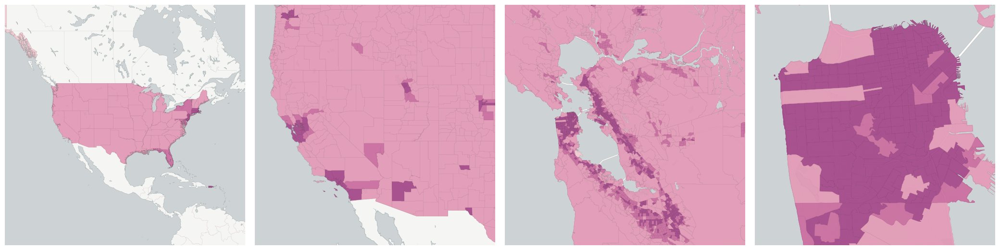
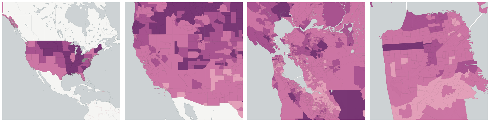
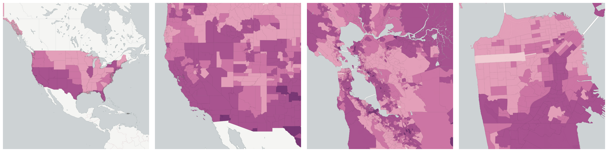

  
# Language

What languages people speak.

- [Population 5 Years and Over](#population-5-years-and-over)

    * [Speaks only English at Home](#speaks-only-english-at-home)

    * [Speaks Spanish at Home](#speaks-spanish-at-home)

## Population 5 Years and Over

The number of people in a geographic area who are over the age of 5.  This is primarily used as a denominator of measures of language spoken at home.

Measure &quot;Population 5 Years and Over&quot;  density per sq. kilometer  for one point:

    UPDATE {table_name}
      SET {new_numeric_column} =
        OBS_GetMeasure(
          CDB_LatLng(40.7, -73.9),
          'us.census.acs.B16001001'
        );

Measure &quot;Population 5 Years and Over&quot; within an area:

    UPDATE {table_name}
      SET {new_numeric_column} =
        OBS_GetMeasure(
          ST_Buffer(CDB_LatLng(40.7, -73.9), 0.01),
          'us.census.acs.B16001001'
        );

Subcolumns of Population 5 Years and Over

- [Speaks only English at Home](#speaks-only-english-at-home)

- [Speaks Spanish at Home](#speaks-spanish-at-home)

### Speaks only English at Home

The number of people in a geographic area over age 5 who speak only English at home.

Measure &quot;Speaks only English at Home&quot;  density per sq. kilometer  for one point:

    UPDATE {table_name}
      SET {new_numeric_column} =
        OBS_GetMeasure(
          CDB_LatLng(40.7, -73.9),
          'us.census.acs.B16001002'
        );

Measure &quot;Speaks only English at Home&quot; within an area:

    UPDATE {table_name}
      SET {new_numeric_column} =
        OBS_GetMeasure(
          ST_Buffer(CDB_LatLng(40.7, -73.9), 0.01),
          'us.census.acs.B16001002'
        );

Measure &quot;Speaks only English at Home&quot; percent of &quot;Population 5 Years and Over&quot; at one point:

    UPDATE {table_name}
      SET {new_numeric_column} =
        OBS_GetMeasure(
          CDB_LatLng(40.7, -73.9),
          'us.census.acs.B16001002',
          'denominator'
        );

Measure &quot;Speaks only English at Home&quot; percent of &quot;Population 5 Years and Over&quot; within an area:

    UPDATE {table_name}
      SET {new_numeric_column} =
        OBS_GetMeasure(
          ST_Buffer(CDB_LatLng(40.7, -73.9), 0.01),
          'us.census.acs.B16001002',
          'denominator'
        );

* denominator: [Population 5 Years and Over](#us-census-acs-b16001001)

### Speaks Spanish at Home

The number of people in a geographic area over age 5 who speak Spanish at home, possibly in addition to other languages.

Measure &quot;Speaks Spanish at Home&quot;  density per sq. kilometer  for one point:

    UPDATE {table_name}
      SET {new_numeric_column} =
        OBS_GetMeasure(
          CDB_LatLng(40.7, -73.9),
          'us.census.acs.B16001003'
        );

Measure &quot;Speaks Spanish at Home&quot; within an area:

    UPDATE {table_name}
      SET {new_numeric_column} =
        OBS_GetMeasure(
          ST_Buffer(CDB_LatLng(40.7, -73.9), 0.01),
          'us.census.acs.B16001003'
        );

Measure &quot;Speaks Spanish at Home&quot; percent of &quot;Population 5 Years and Over&quot; at one point:

    UPDATE {table_name}
      SET {new_numeric_column} =
        OBS_GetMeasure(
          CDB_LatLng(40.7, -73.9),
          'us.census.acs.B16001003',
          'denominator'
        );

Measure &quot;Speaks Spanish at Home&quot; percent of &quot;Population 5 Years and Over&quot; within an area:

    UPDATE {table_name}
      SET {new_numeric_column} =
        OBS_GetMeasure(
          ST_Buffer(CDB_LatLng(40.7, -73.9), 0.01),
          'us.census.acs.B16001003',
          'denominator'
        );

* denominator: [Population 5 Years and Over](#us-census-acs-b16001001)

