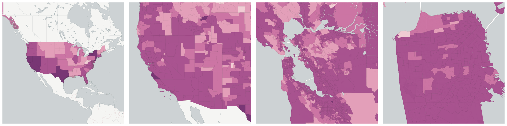

  
# Nationality

Population breakdowns by nationality and place of birth.

- [Not a U.S. Citizen Population](#not-a-u-s-citizen-population)

## Not a U.S. Citizen Population

The number of people within each geography who indicated that they are not U.S. citizens.

Measure &quot;Not a U.S. Citizen Population&quot;  density per sq. kilometer  for one point:

    UPDATE {table_name}
      SET {new_numeric_column} =
        OBS_GetMeasure(
          CDB_LatLng(40.7, -73.9),
          'us.census.acs.B05001006'
        );

Measure &quot;Not a U.S. Citizen Population&quot; within an area:

    UPDATE {table_name}
      SET {new_numeric_column} =
        OBS_GetMeasure(
          ST_Buffer(CDB_LatLng(40.7, -73.9), 0.01),
          'us.census.acs.B05001006'
        );

Measure &quot;Not a U.S. Citizen Population&quot; percent of &quot;Total Population&quot; at one point:

    UPDATE {table_name}
      SET {new_numeric_column} =
        OBS_GetMeasure(
          CDB_LatLng(40.7, -73.9),
          'us.census.acs.B05001006',
          'denominator'
        );

Measure &quot;Not a U.S. Citizen Population&quot; percent of &quot;Total Population&quot; within an area:

    UPDATE {table_name}
      SET {new_numeric_column} =
        OBS_GetMeasure(
          ST_Buffer(CDB_LatLng(40.7, -73.9), 0.01),
          'us.census.acs.B05001006',
          'denominator'
        );

* denominator: [Total Population](../race_ethnicity/#us-census-acs-b01003001)

