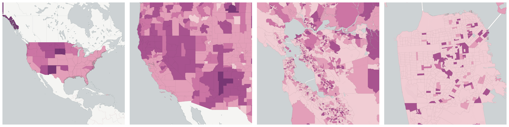
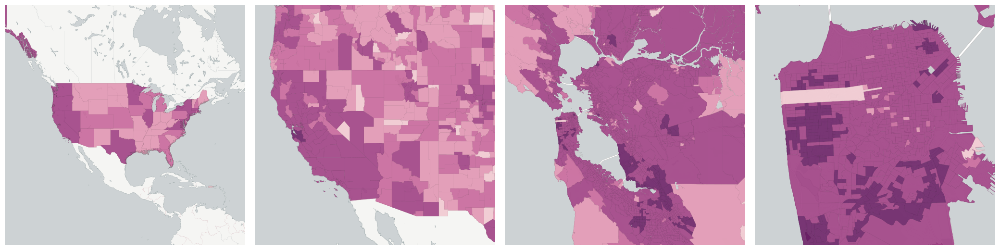
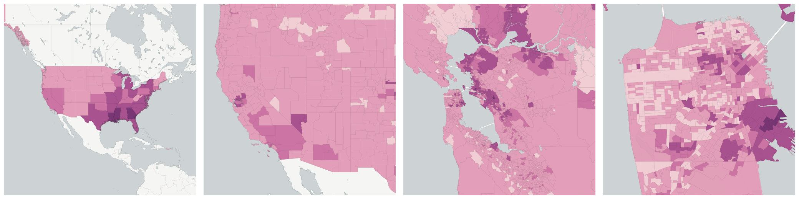
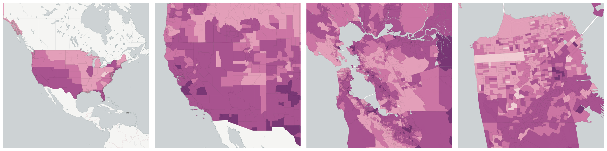
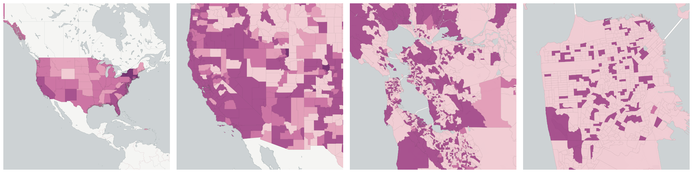
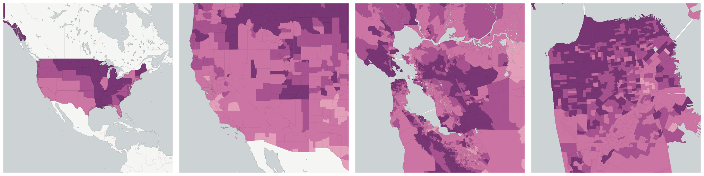
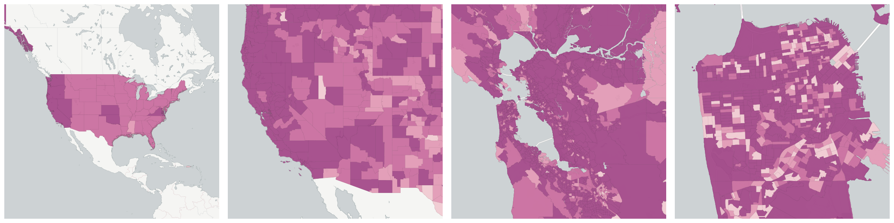
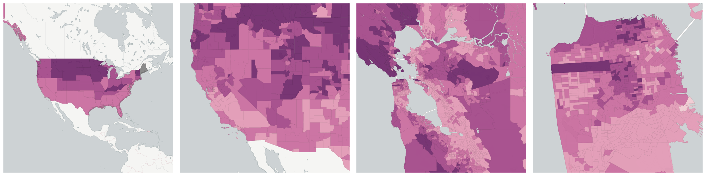

  
# Race and Ethnicity

Population breakdowns by race and ethnicity.

- [Total Population](#total-population)

    * [American Indian and Alaska Native Population](#american-indian-and-alaska-native-population)

    * [Asian Population](#asian-population)

    * [Black or African American Population](#black-or-african-american-population)

    * [Hispanic Population](#hispanic-population)

    * [Other Race population](#other-race-population)

    * [Population not Hispanic](#population-not-hispanic)

    * [Two or more races population](#two-or-more-races-population)

    * [White Population](#white-population)

## Total Population

The total number of all people living in a given geographic area.  This is a very useful catch-all denominator when calculating rates.

Measure &quot;Total Population&quot;  density per sq. kilometer  for one point:

    UPDATE {table_name}
      SET {new_numeric_column} =
        OBS_GetMeasure(
          CDB_LatLng(40.7, -73.9),
          'us.census.acs.B01003001'
        );

Measure &quot;Total Population&quot; within an area:

    UPDATE {table_name}
      SET {new_numeric_column} =
        OBS_GetMeasure(
          ST_Buffer(CDB_LatLng(40.7, -73.9), 0.01),
          'us.census.acs.B01003001'
        );

Subcolumns of Total Population

- [American Indian and Alaska Native Population](#american-indian-and-alaska-native-population)

- [Asian Population](#asian-population)

- [Black or African American Population](#black-or-african-american-population)

- [Hispanic Population](#hispanic-population)

- [Other Race population](#other-race-population)

- [Population not Hispanic](#population-not-hispanic)

- [Two or more races population](#two-or-more-races-population)

- [White Population](#white-population)

### American Indian and Alaska Native Population

The number of people identifying as American Indian or Alaska native in each geography.

Measure &quot;American Indian and Alaska Native Population&quot;  density per sq. kilometer  for one point:

    UPDATE {table_name}
      SET {new_numeric_column} =
        OBS_GetMeasure(
          CDB_LatLng(40.7, -73.9),
          'us.census.acs.B03002005'
        );

Measure &quot;American Indian and Alaska Native Population&quot; within an area:

    UPDATE {table_name}
      SET {new_numeric_column} =
        OBS_GetMeasure(
          ST_Buffer(CDB_LatLng(40.7, -73.9), 0.01),
          'us.census.acs.B03002005'
        );

Measure &quot;American Indian and Alaska Native Population&quot; percent of &quot;Total Population&quot; at one point:

    UPDATE {table_name}
      SET {new_numeric_column} =
        OBS_GetMeasure(
          CDB_LatLng(40.7, -73.9),
          'us.census.acs.B03002005',
          'denominator'
        );

Measure &quot;American Indian and Alaska Native Population&quot; percent of &quot;Total Population&quot; within an area:

    UPDATE {table_name}
      SET {new_numeric_column} =
        OBS_GetMeasure(
          ST_Buffer(CDB_LatLng(40.7, -73.9), 0.01),
          'us.census.acs.B03002005',
          'denominator'
        );

* denominator: [Total Population](#us-census-acs-b01003001)

### Asian Population

The number of people identifying as Asian, non-Hispanic in each geography.

Measure &quot;Asian Population&quot;  density per sq. kilometer  for one point:

    UPDATE {table_name}
      SET {new_numeric_column} =
        OBS_GetMeasure(
          CDB_LatLng(40.7, -73.9),
          'us.census.acs.B03002006'
        );

Measure &quot;Asian Population&quot; within an area:

    UPDATE {table_name}
      SET {new_numeric_column} =
        OBS_GetMeasure(
          ST_Buffer(CDB_LatLng(40.7, -73.9), 0.01),
          'us.census.acs.B03002006'
        );

Measure &quot;Asian Population&quot; percent of &quot;Total Population&quot; at one point:

    UPDATE {table_name}
      SET {new_numeric_column} =
        OBS_GetMeasure(
          CDB_LatLng(40.7, -73.9),
          'us.census.acs.B03002006',
          'denominator'
        );

Measure &quot;Asian Population&quot; percent of &quot;Total Population&quot; within an area:

    UPDATE {table_name}
      SET {new_numeric_column} =
        OBS_GetMeasure(
          ST_Buffer(CDB_LatLng(40.7, -73.9), 0.01),
          'us.census.acs.B03002006',
          'denominator'
        );

* denominator: [Total Population](#us-census-acs-b01003001)

### Black or African American Population

The number of people identifying as black or African American, non-Hispanic in each geography.

Measure &quot;Black or African American Population&quot;  density per sq. kilometer  for one point:

    UPDATE {table_name}
      SET {new_numeric_column} =
        OBS_GetMeasure(
          CDB_LatLng(40.7, -73.9),
          'us.census.acs.B03002004'
        );

Measure &quot;Black or African American Population&quot; within an area:

    UPDATE {table_name}
      SET {new_numeric_column} =
        OBS_GetMeasure(
          ST_Buffer(CDB_LatLng(40.7, -73.9), 0.01),
          'us.census.acs.B03002004'
        );

Measure &quot;Black or African American Population&quot; percent of &quot;Total Population&quot; at one point:

    UPDATE {table_name}
      SET {new_numeric_column} =
        OBS_GetMeasure(
          CDB_LatLng(40.7, -73.9),
          'us.census.acs.B03002004',
          'denominator'
        );

Measure &quot;Black or African American Population&quot; percent of &quot;Total Population&quot; within an area:

    UPDATE {table_name}
      SET {new_numeric_column} =
        OBS_GetMeasure(
          ST_Buffer(CDB_LatLng(40.7, -73.9), 0.01),
          'us.census.acs.B03002004',
          'denominator'
        );

* denominator: [Total Population](#us-census-acs-b01003001)

### Hispanic Population

The number of people identifying as Hispanic or Latino in each geography.

Measure &quot;Hispanic Population&quot;  density per sq. kilometer  for one point:

    UPDATE {table_name}
      SET {new_numeric_column} =
        OBS_GetMeasure(
          CDB_LatLng(40.7, -73.9),
          'us.census.acs.B03002012'
        );

Measure &quot;Hispanic Population&quot; within an area:

    UPDATE {table_name}
      SET {new_numeric_column} =
        OBS_GetMeasure(
          ST_Buffer(CDB_LatLng(40.7, -73.9), 0.01),
          'us.census.acs.B03002012'
        );

Measure &quot;Hispanic Population&quot; percent of &quot;Total Population&quot; at one point:

    UPDATE {table_name}
      SET {new_numeric_column} =
        OBS_GetMeasure(
          CDB_LatLng(40.7, -73.9),
          'us.census.acs.B03002012',
          'denominator'
        );

Measure &quot;Hispanic Population&quot; percent of &quot;Total Population&quot; within an area:

    UPDATE {table_name}
      SET {new_numeric_column} =
        OBS_GetMeasure(
          ST_Buffer(CDB_LatLng(40.7, -73.9), 0.01),
          'us.census.acs.B03002012',
          'denominator'
        );

* denominator: [Total Population](#us-census-acs-b01003001)

### Other Race population

The number of people identifying as another race in each geography

Measure &quot;Other Race population&quot;  density per sq. kilometer  for one point:

    UPDATE {table_name}
      SET {new_numeric_column} =
        OBS_GetMeasure(
          CDB_LatLng(40.7, -73.9),
          'us.census.acs.B03002008'
        );

Measure &quot;Other Race population&quot; within an area:

    UPDATE {table_name}
      SET {new_numeric_column} =
        OBS_GetMeasure(
          ST_Buffer(CDB_LatLng(40.7, -73.9), 0.01),
          'us.census.acs.B03002008'
        );

Measure &quot;Other Race population&quot; percent of &quot;Total Population&quot; at one point:

    UPDATE {table_name}
      SET {new_numeric_column} =
        OBS_GetMeasure(
          CDB_LatLng(40.7, -73.9),
          'us.census.acs.B03002008',
          'denominator'
        );

Measure &quot;Other Race population&quot; percent of &quot;Total Population&quot; within an area:

    UPDATE {table_name}
      SET {new_numeric_column} =
        OBS_GetMeasure(
          ST_Buffer(CDB_LatLng(40.7, -73.9), 0.01),
          'us.census.acs.B03002008',
          'denominator'
        );

* denominator: [Total Population](#us-census-acs-b01003001)

### Population not Hispanic

The number of people not identifying as Hispanic or Latino in each geography.

Measure &quot;Population not Hispanic&quot;  density per sq. kilometer  for one point:

    UPDATE {table_name}
      SET {new_numeric_column} =
        OBS_GetMeasure(
          CDB_LatLng(40.7, -73.9),
          'us.census.acs.B03002002'
        );

Measure &quot;Population not Hispanic&quot; within an area:

    UPDATE {table_name}
      SET {new_numeric_column} =
        OBS_GetMeasure(
          ST_Buffer(CDB_LatLng(40.7, -73.9), 0.01),
          'us.census.acs.B03002002'
        );

Measure &quot;Population not Hispanic&quot; percent of &quot;Total Population&quot; at one point:

    UPDATE {table_name}
      SET {new_numeric_column} =
        OBS_GetMeasure(
          CDB_LatLng(40.7, -73.9),
          'us.census.acs.B03002002',
          'denominator'
        );

Measure &quot;Population not Hispanic&quot; percent of &quot;Total Population&quot; within an area:

    UPDATE {table_name}
      SET {new_numeric_column} =
        OBS_GetMeasure(
          ST_Buffer(CDB_LatLng(40.7, -73.9), 0.01),
          'us.census.acs.B03002002',
          'denominator'
        );

* denominator: [Total Population](#us-census-acs-b01003001)

### Two or more races population

The number of people identifying as two or more races in each geography

Measure &quot;Two or more races population&quot;  density per sq. kilometer  for one point:

    UPDATE {table_name}
      SET {new_numeric_column} =
        OBS_GetMeasure(
          CDB_LatLng(40.7, -73.9),
          'us.census.acs.B03002009'
        );

Measure &quot;Two or more races population&quot; within an area:

    UPDATE {table_name}
      SET {new_numeric_column} =
        OBS_GetMeasure(
          ST_Buffer(CDB_LatLng(40.7, -73.9), 0.01),
          'us.census.acs.B03002009'
        );

Measure &quot;Two or more races population&quot; percent of &quot;Total Population&quot; at one point:

    UPDATE {table_name}
      SET {new_numeric_column} =
        OBS_GetMeasure(
          CDB_LatLng(40.7, -73.9),
          'us.census.acs.B03002009',
          'denominator'
        );

Measure &quot;Two or more races population&quot; percent of &quot;Total Population&quot; within an area:

    UPDATE {table_name}
      SET {new_numeric_column} =
        OBS_GetMeasure(
          ST_Buffer(CDB_LatLng(40.7, -73.9), 0.01),
          'us.census.acs.B03002009',
          'denominator'
        );

* denominator: [Total Population](#us-census-acs-b01003001)

### White Population

The number of people identifying as white, non-Hispanic in each geography.

Measure &quot;White Population&quot;  density per sq. kilometer  for one point:

    UPDATE {table_name}
      SET {new_numeric_column} =
        OBS_GetMeasure(
          CDB_LatLng(40.7, -73.9),
          'us.census.acs.B03002003'
        );

Measure &quot;White Population&quot; within an area:

    UPDATE {table_name}
      SET {new_numeric_column} =
        OBS_GetMeasure(
          ST_Buffer(CDB_LatLng(40.7, -73.9), 0.01),
          'us.census.acs.B03002003'
        );

Measure &quot;White Population&quot; percent of &quot;Total Population&quot; at one point:

    UPDATE {table_name}
      SET {new_numeric_column} =
        OBS_GetMeasure(
          CDB_LatLng(40.7, -73.9),
          'us.census.acs.B03002003',
          'denominator'
        );

Measure &quot;White Population&quot; percent of &quot;Total Population&quot; within an area:

    UPDATE {table_name}
      SET {new_numeric_column} =
        OBS_GetMeasure(
          ST_Buffer(CDB_LatLng(40.7, -73.9), 0.01),
          'us.census.acs.B03002003',
          'denominator'
        );

* denominator: [Total Population](#us-census-acs-b01003001)

