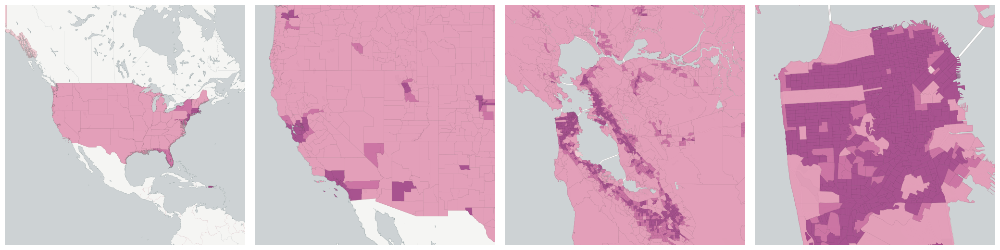
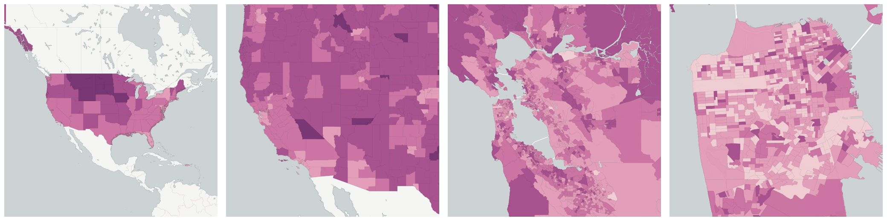
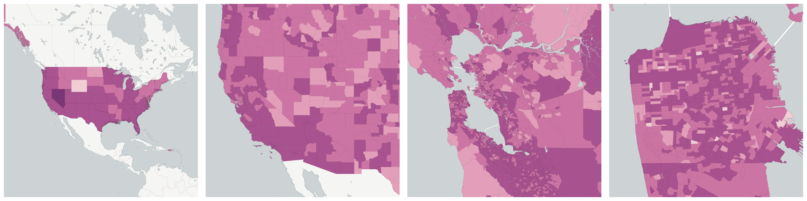
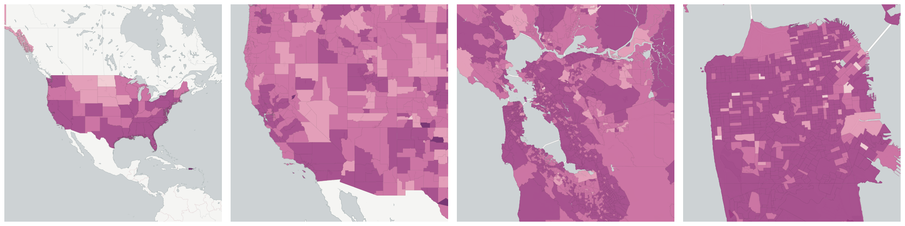
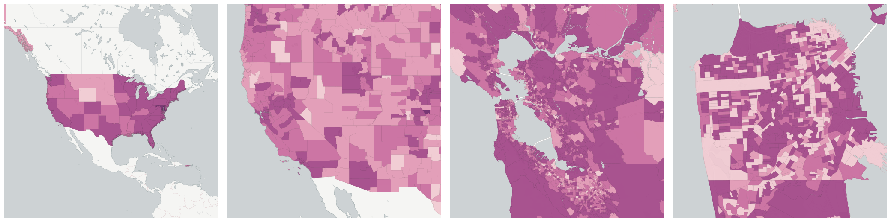
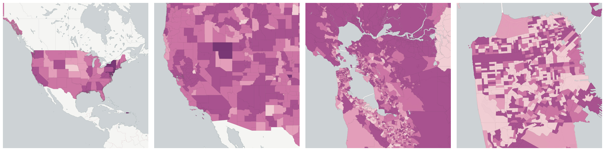

  
# Transportation

How do people move from place to place?

- [Car-free households](#car-free-households)

- [Commuters by Car, Truck, or Van](#commuters-by-car-truck-or-van)

    * [Commuters by Carpool](#commuters-by-carpool)

    * [Commuters who drove alone](#commuters-who-drove-alone)

- [Commuters by Public Transportation](#commuters-by-public-transportation)

    * [Commuters by Bus](#commuters-by-bus)

    * [Commuters by Subway or Elevated](#commuters-by-subway-or-elevated)

- [Four car households](#four-car-households)

- [One car households](#one-car-households)

- [Three car households](#three-car-households)

- [Two car households](#two-car-households)

- [Walked to Work](#walked-to-work)

- [Worked at Home](#worked-at-home)

- [Workers age 16 and over who do not work from home](#workers-age-16-and-over-who-do-not-work-from-home)

    * [Number of workers with a commute between 5 and 9 minutes](#number-of-workers-with-a-commute-between-5-and-9-minutes)

    * [Number of workers with a commute between 10 and 14 minutes](#number-of-workers-with-a-commute-between-10-and-14-minutes)

    * [Number of workers with a commute between 15 and 19 minutes](#number-of-workers-with-a-commute-between-15-and-19-minutes)

    * [Number of workers with a commute between 20 and 24 minutes](#number-of-workers-with-a-commute-between-20-and-24-minutes)

    * [Number of workers with a commute between 25 and 29 minutes](#number-of-workers-with-a-commute-between-25-and-29-minutes)

    * [Number of workers with a commute between 30 and 34 minutes](#number-of-workers-with-a-commute-between-30-and-34-minutes)

    * [Number of workers with a commute between 35 and 39 minutes](#number-of-workers-with-a-commute-between-35-and-39-minutes)

    * [Number of workers with a commute between 35 and 44 minutes](#number-of-workers-with-a-commute-between-35-and-44-minutes)

    * [Number of workers with a commute between 40 and 44 minutes](#number-of-workers-with-a-commute-between-40-and-44-minutes)

    * [Number of workers with a commute between 45 and 59 minutes](#number-of-workers-with-a-commute-between-45-and-59-minutes)

    * [Number of workers with a commute between 60 and 89 minutes](#number-of-workers-with-a-commute-between-60-and-89-minutes)

    * [Number of workers with a commute of more than 90 minutes](#number-of-workers-with-a-commute-of-more-than-90-minutes)

    * [Number of workers with a commute of over 60 minutes](#number-of-workers-with-a-commute-of-over-60-minutes)

    * [Number of workers with less than 10 minute commute](#number-of-workers-with-less-than-10-minute-commute)

- [Workers age 16 and over with no vehicle](#workers-age-16-and-over-with-no-vehicle)

## Car-free households

The number of households without passenger cars, vans, and pickup or panel trucks of one-ton capacity or less kept at home and available for the use of household members. Vehicles rented or leased for one month or more, company vehicles, and police and government vehicles are included if kept at home and used for non-business purposes. Dismantled or immobile vehicles ware excluded. Vehicles kept at home but used only for business purposes also are excluded.

Measure &quot;Car-free households&quot;  density per sq. kilometer  for one point:

    UPDATE {table_name}
      SET {new_numeric_column} =
        OBS_GetMeasure(
          CDB_LatLng(40.7, -73.9),
          'us.census.acs.B08201002'
        );

Measure &quot;Car-free households&quot; within an area:

    UPDATE {table_name}
      SET {new_numeric_column} =
        OBS_GetMeasure(
          ST_Buffer(CDB_LatLng(40.7, -73.9), 0.01),
          'us.census.acs.B08201002'
        );

Measure &quot;Car-free households&quot; percent of &quot;Households&quot; at one point:

    UPDATE {table_name}
      SET {new_numeric_column} =
        OBS_GetMeasure(
          CDB_LatLng(40.7, -73.9),
          'us.census.acs.B08201002',
          'denominator'
        );

Measure &quot;Car-free households&quot; percent of &quot;Households&quot; within an area:

    UPDATE {table_name}
      SET {new_numeric_column} =
        OBS_GetMeasure(
          ST_Buffer(CDB_LatLng(40.7, -73.9), 0.01),
          'us.census.acs.B08201002',
          'denominator'
        );

* denominator: [Households](../housing/#us-census-acs-b11001001)

## Commuters by Car, Truck, or Van

The number of workers age 16 years and over within  a geographic area who primarily traveled to work by car, truck or  van.  This is the principal mode of travel or type of conveyance,  by distance rather than time, that the worker usually used to get  from home to work.

Measure &quot;Commuters by Car, Truck, or Van&quot;  density per sq. kilometer  for one point:

    UPDATE {table_name}
      SET {new_numeric_column} =
        OBS_GetMeasure(
          CDB_LatLng(40.7, -73.9),
          'us.census.acs.B08006002'
        );

Measure &quot;Commuters by Car, Truck, or Van&quot; within an area:

    UPDATE {table_name}
      SET {new_numeric_column} =
        OBS_GetMeasure(
          ST_Buffer(CDB_LatLng(40.7, -73.9), 0.01),
          'us.census.acs.B08006002'
        );

Measure &quot;Commuters by Car, Truck, or Van&quot; percent of &quot;Workers over the Age of 16&quot; at one point:

    UPDATE {table_name}
      SET {new_numeric_column} =
        OBS_GetMeasure(
          CDB_LatLng(40.7, -73.9),
          'us.census.acs.B08006002',
          'denominator'
        );

Measure &quot;Commuters by Car, Truck, or Van&quot; percent of &quot;Workers over the Age of 16&quot; within an area:

    UPDATE {table_name}
      SET {new_numeric_column} =
        OBS_GetMeasure(
          ST_Buffer(CDB_LatLng(40.7, -73.9), 0.01),
          'us.census.acs.B08006002',
          'denominator'
        );

* denominator: [Workers over the Age of 16](../employment/#us-census-acs-b08006001)

Subcolumns of Commuters by Car, Truck, or Van

- [Commuters by Carpool](#commuters-by-carpool)

- [Commuters who drove alone](#commuters-who-drove-alone)

### Commuters by Carpool

The number of workers age 16 years and over within a geographic area who primarily traveled to work by carpool.  This is the principal mode of travel or type of conveyance, by distance rather than time, that the worker usually used to get from home to work.

Measure &quot;Commuters by Carpool&quot;  density per sq. kilometer  for one point:

    UPDATE {table_name}
      SET {new_numeric_column} =
        OBS_GetMeasure(
          CDB_LatLng(40.7, -73.9),
          'us.census.acs.B08006004'
        );

Measure &quot;Commuters by Carpool&quot; within an area:

    UPDATE {table_name}
      SET {new_numeric_column} =
        OBS_GetMeasure(
          ST_Buffer(CDB_LatLng(40.7, -73.9), 0.01),
          'us.census.acs.B08006004'
        );

Measure &quot;Commuters by Carpool&quot; percent of &quot;Commuters by Car, Truck, or Van&quot; at one point:

    UPDATE {table_name}
      SET {new_numeric_column} =
        OBS_GetMeasure(
          CDB_LatLng(40.7, -73.9),
          'us.census.acs.B08006004',
          'denominator'
        );

Measure &quot;Commuters by Carpool&quot; percent of &quot;Commuters by Car, Truck, or Van&quot; within an area:

    UPDATE {table_name}
      SET {new_numeric_column} =
        OBS_GetMeasure(
          ST_Buffer(CDB_LatLng(40.7, -73.9), 0.01),
          'us.census.acs.B08006004',
          'denominator'
        );

* denominator: [Commuters by Car, Truck, or Van](#us-census-acs-b08006002)

### Commuters who drove alone

The number of workers age 16 years and over within a geographic area who primarily traveled by car driving alone. This is the principal mode of travel or type of conveyance, by distance rather than time, that the worker usually used to get from home to work.

Measure &quot;Commuters who drove alone&quot;  density per sq. kilometer  for one point:

    UPDATE {table_name}
      SET {new_numeric_column} =
        OBS_GetMeasure(
          CDB_LatLng(40.7, -73.9),
          'us.census.acs.B08006003'
        );

Measure &quot;Commuters who drove alone&quot; within an area:

    UPDATE {table_name}
      SET {new_numeric_column} =
        OBS_GetMeasure(
          ST_Buffer(CDB_LatLng(40.7, -73.9), 0.01),
          'us.census.acs.B08006003'
        );

Measure &quot;Commuters who drove alone&quot; percent of &quot;Commuters by Car, Truck, or Van&quot; at one point:

    UPDATE {table_name}
      SET {new_numeric_column} =
        OBS_GetMeasure(
          CDB_LatLng(40.7, -73.9),
          'us.census.acs.B08006003',
          'denominator'
        );

Measure &quot;Commuters who drove alone&quot; percent of &quot;Commuters by Car, Truck, or Van&quot; within an area:

    UPDATE {table_name}
      SET {new_numeric_column} =
        OBS_GetMeasure(
          ST_Buffer(CDB_LatLng(40.7, -73.9), 0.01),
          'us.census.acs.B08006003',
          'denominator'
        );

* denominator: [Commuters by Car, Truck, or Van](#us-census-acs-b08006002)

## Commuters by Public Transportation

The number of workers age 16 years and over within a geographic area who primarily traveled to work by public transportation.  This is the principal mode of travel or type of conveyance, by distance rather than time, that the worker usually used to get from home to work.

Measure &quot;Commuters by Public Transportation&quot;  density per sq. kilometer  for one point:

    UPDATE {table_name}
      SET {new_numeric_column} =
        OBS_GetMeasure(
          CDB_LatLng(40.7, -73.9),
          'us.census.acs.B08301010'
        );

Measure &quot;Commuters by Public Transportation&quot; within an area:

    UPDATE {table_name}
      SET {new_numeric_column} =
        OBS_GetMeasure(
          ST_Buffer(CDB_LatLng(40.7, -73.9), 0.01),
          'us.census.acs.B08301010'
        );

Measure &quot;Commuters by Public Transportation&quot; percent of &quot;Workers over the Age of 16&quot; at one point:

    UPDATE {table_name}
      SET {new_numeric_column} =
        OBS_GetMeasure(
          CDB_LatLng(40.7, -73.9),
          'us.census.acs.B08301010',
          'denominator'
        );

Measure &quot;Commuters by Public Transportation&quot; percent of &quot;Workers over the Age of 16&quot; within an area:

    UPDATE {table_name}
      SET {new_numeric_column} =
        OBS_GetMeasure(
          ST_Buffer(CDB_LatLng(40.7, -73.9), 0.01),
          'us.census.acs.B08301010',
          'denominator'
        );

* denominator: [Workers over the Age of 16](../employment/#us-census-acs-b08006001)

Subcolumns of Commuters by Public Transportation

- [Commuters by Bus](#commuters-by-bus)

- [Commuters by Subway or Elevated](#commuters-by-subway-or-elevated)

### Commuters by Bus

The number of workers age 16 years and over within a geographic area who primarily traveled to work by bus.  This is the principal mode of travel or type of conveyance, by distance rather than time, that the worker usually used to get from home to work.  This is a subset of workers who commuted by public transport.

Measure &quot;Commuters by Bus&quot;  density per sq. kilometer  for one point:

    UPDATE {table_name}
      SET {new_numeric_column} =
        OBS_GetMeasure(
          CDB_LatLng(40.7, -73.9),
          'us.census.acs.B08006009'
        );

Measure &quot;Commuters by Bus&quot; within an area:

    UPDATE {table_name}
      SET {new_numeric_column} =
        OBS_GetMeasure(
          ST_Buffer(CDB_LatLng(40.7, -73.9), 0.01),
          'us.census.acs.B08006009'
        );

Measure &quot;Commuters by Bus&quot; percent of &quot;Commuters by Public Transportation&quot; at one point:

    UPDATE {table_name}
      SET {new_numeric_column} =
        OBS_GetMeasure(
          CDB_LatLng(40.7, -73.9),
          'us.census.acs.B08006009',
          'denominator'
        );

Measure &quot;Commuters by Bus&quot; percent of &quot;Commuters by Public Transportation&quot; within an area:

    UPDATE {table_name}
      SET {new_numeric_column} =
        OBS_GetMeasure(
          ST_Buffer(CDB_LatLng(40.7, -73.9), 0.01),
          'us.census.acs.B08006009',
          'denominator'
        );

* denominator: [Commuters by Public Transportation](#us-census-acs-b08301010)

### Commuters by Subway or Elevated

The number of workers age 16 years and over within a geographic area who primarily traveled to work by subway or elevated train.  This is the principal mode of travel or type of conveyance, by distance rather than time, that the worker usually used to get from home to work.  This is a subset of workers who commuted by public transport.

Measure &quot;Commuters by Subway or Elevated&quot;  density per sq. kilometer  for one point:

    UPDATE {table_name}
      SET {new_numeric_column} =
        OBS_GetMeasure(
          CDB_LatLng(40.7, -73.9),
          'us.census.acs.B08006011'
        );

Measure &quot;Commuters by Subway or Elevated&quot; within an area:

    UPDATE {table_name}
      SET {new_numeric_column} =
        OBS_GetMeasure(
          ST_Buffer(CDB_LatLng(40.7, -73.9), 0.01),
          'us.census.acs.B08006011'
        );

Measure &quot;Commuters by Subway or Elevated&quot; percent of &quot;Commuters by Public Transportation&quot; at one point:

    UPDATE {table_name}
      SET {new_numeric_column} =
        OBS_GetMeasure(
          CDB_LatLng(40.7, -73.9),
          'us.census.acs.B08006011',
          'denominator'
        );

Measure &quot;Commuters by Subway or Elevated&quot; percent of &quot;Commuters by Public Transportation&quot; within an area:

    UPDATE {table_name}
      SET {new_numeric_column} =
        OBS_GetMeasure(
          ST_Buffer(CDB_LatLng(40.7, -73.9), 0.01),
          'us.census.acs.B08006011',
          'denominator'
        );

* denominator: [Commuters by Public Transportation](#us-census-acs-b08301010)

## Four car households

The number of households with four or more passenger cars, vans, pickup or panel trucks of one-ton capacity or less kept at home and available for the use of household members. Vehicles rented or leased for one month or more, company vehicles, and police and government vehicles are included if kept at home and used for non-business purposes. Dismantled or immobile vehicles ware excluded. Vehicles kept at home but used only for business purposes also are excluded.

Measure &quot;Four car households&quot;  density per sq. kilometer  for one point:

    UPDATE {table_name}
      SET {new_numeric_column} =
        OBS_GetMeasure(
          CDB_LatLng(40.7, -73.9),
          'us.census.acs.B08201006'
        );

Measure &quot;Four car households&quot; within an area:

    UPDATE {table_name}
      SET {new_numeric_column} =
        OBS_GetMeasure(
          ST_Buffer(CDB_LatLng(40.7, -73.9), 0.01),
          'us.census.acs.B08201006'
        );

Measure &quot;Four car households&quot; percent of &quot;Households&quot; at one point:

    UPDATE {table_name}
      SET {new_numeric_column} =
        OBS_GetMeasure(
          CDB_LatLng(40.7, -73.9),
          'us.census.acs.B08201006',
          'denominator'
        );

Measure &quot;Four car households&quot; percent of &quot;Households&quot; within an area:

    UPDATE {table_name}
      SET {new_numeric_column} =
        OBS_GetMeasure(
          ST_Buffer(CDB_LatLng(40.7, -73.9), 0.01),
          'us.census.acs.B08201006',
          'denominator'
        );

* denominator: [Households](../housing/#us-census-acs-b11001001)

## One car households

The number of households with one passenger car, van, , pickup or panel trucks of one-ton capacity or less kept at home and available for the use of household members. Vehicles rented or leased for one month or more, company vehicles, and police and government vehicles are included if kept at home and used for non-business purposes. Dismantled or immobile vehicles ware excluded. Vehicles kept at home but used only for business purposes also are excluded.

Measure &quot;One car households&quot;  density per sq. kilometer  for one point:

    UPDATE {table_name}
      SET {new_numeric_column} =
        OBS_GetMeasure(
          CDB_LatLng(40.7, -73.9),
          'us.census.acs.B08201003'
        );

Measure &quot;One car households&quot; within an area:

    UPDATE {table_name}
      SET {new_numeric_column} =
        OBS_GetMeasure(
          ST_Buffer(CDB_LatLng(40.7, -73.9), 0.01),
          'us.census.acs.B08201003'
        );

Measure &quot;One car households&quot; percent of &quot;Households&quot; at one point:

    UPDATE {table_name}
      SET {new_numeric_column} =
        OBS_GetMeasure(
          CDB_LatLng(40.7, -73.9),
          'us.census.acs.B08201003',
          'denominator'
        );

Measure &quot;One car households&quot; percent of &quot;Households&quot; within an area:

    UPDATE {table_name}
      SET {new_numeric_column} =
        OBS_GetMeasure(
          ST_Buffer(CDB_LatLng(40.7, -73.9), 0.01),
          'us.census.acs.B08201003',
          'denominator'
        );

* denominator: [Households](../housing/#us-census-acs-b11001001)

## Three car households

The number of households with one passenger cars, vans, pickup or panel trucks of one-ton capacity or less kept at home and available for the use of household members. Vehicles rented or leased for one month or more, company vehicles, and police and government vehicles are included if kept at home and used for non-business purposes. Dismantled or immobile vehicles ware excluded. Vehicles kept at home but used only for business purposes also are excluded.

Measure &quot;Three car households&quot;  density per sq. kilometer  for one point:

    UPDATE {table_name}
      SET {new_numeric_column} =
        OBS_GetMeasure(
          CDB_LatLng(40.7, -73.9),
          'us.census.acs.B08201005'
        );

Measure &quot;Three car households&quot; within an area:

    UPDATE {table_name}
      SET {new_numeric_column} =
        OBS_GetMeasure(
          ST_Buffer(CDB_LatLng(40.7, -73.9), 0.01),
          'us.census.acs.B08201005'
        );

Measure &quot;Three car households&quot; percent of &quot;Households&quot; at one point:

    UPDATE {table_name}
      SET {new_numeric_column} =
        OBS_GetMeasure(
          CDB_LatLng(40.7, -73.9),
          'us.census.acs.B08201005',
          'denominator'
        );

Measure &quot;Three car households&quot; percent of &quot;Households&quot; within an area:

    UPDATE {table_name}
      SET {new_numeric_column} =
        OBS_GetMeasure(
          ST_Buffer(CDB_LatLng(40.7, -73.9), 0.01),
          'us.census.acs.B08201005',
          'denominator'
        );

* denominator: [Households](../housing/#us-census-acs-b11001001)

## Two car households

The number of households with two passenger cars, vans, pickup or panel trucks of one-ton capacity or less kept at home and available for the use of household members. Vehicles rented or leased for one month or more, company vehicles, and police and government vehicles are included if kept at home and used for non-business purposes. Dismantled or immobile vehicles ware excluded. Vehicles kept at home but used only for business purposes also are excluded.

Measure &quot;Two car households&quot;  density per sq. kilometer  for one point:

    UPDATE {table_name}
      SET {new_numeric_column} =
        OBS_GetMeasure(
          CDB_LatLng(40.7, -73.9),
          'us.census.acs.B08201004'
        );

Measure &quot;Two car households&quot; within an area:

    UPDATE {table_name}
      SET {new_numeric_column} =
        OBS_GetMeasure(
          ST_Buffer(CDB_LatLng(40.7, -73.9), 0.01),
          'us.census.acs.B08201004'
        );

Measure &quot;Two car households&quot; percent of &quot;Households&quot; at one point:

    UPDATE {table_name}
      SET {new_numeric_column} =
        OBS_GetMeasure(
          CDB_LatLng(40.7, -73.9),
          'us.census.acs.B08201004',
          'denominator'
        );

Measure &quot;Two car households&quot; percent of &quot;Households&quot; within an area:

    UPDATE {table_name}
      SET {new_numeric_column} =
        OBS_GetMeasure(
          ST_Buffer(CDB_LatLng(40.7, -73.9), 0.01),
          'us.census.acs.B08201004',
          'denominator'
        );

* denominator: [Households](../housing/#us-census-acs-b11001001)

## Walked to Work

The number of workers age 16 years and over within a geographic area who primarily walked to work.  This would mean that of any way of getting to work, they travelled the most distance walking.

Measure &quot;Walked to Work&quot;  density per sq. kilometer  for one point:

    UPDATE {table_name}
      SET {new_numeric_column} =
        OBS_GetMeasure(
          CDB_LatLng(40.7, -73.9),
          'us.census.acs.B08006015'
        );

Measure &quot;Walked to Work&quot; within an area:

    UPDATE {table_name}
      SET {new_numeric_column} =
        OBS_GetMeasure(
          ST_Buffer(CDB_LatLng(40.7, -73.9), 0.01),
          'us.census.acs.B08006015'
        );

Measure &quot;Walked to Work&quot; percent of &quot;Workers over the Age of 16&quot; at one point:

    UPDATE {table_name}
      SET {new_numeric_column} =
        OBS_GetMeasure(
          CDB_LatLng(40.7, -73.9),
          'us.census.acs.B08006015',
          'denominator'
        );

Measure &quot;Walked to Work&quot; percent of &quot;Workers over the Age of 16&quot; within an area:

    UPDATE {table_name}
      SET {new_numeric_column} =
        OBS_GetMeasure(
          ST_Buffer(CDB_LatLng(40.7, -73.9), 0.01),
          'us.census.acs.B08006015',
          'denominator'
        );

* denominator: [Workers over the Age of 16](../employment/#us-census-acs-b08006001)

## Worked at Home

The count within a geographical area of workers over the age of 16 who worked at home.

Measure &quot;Worked at Home&quot;  density per sq. kilometer  for one point:

    UPDATE {table_name}
      SET {new_numeric_column} =
        OBS_GetMeasure(
          CDB_LatLng(40.7, -73.9),
          'us.census.acs.B08006017'
        );

Measure &quot;Worked at Home&quot; within an area:

    UPDATE {table_name}
      SET {new_numeric_column} =
        OBS_GetMeasure(
          ST_Buffer(CDB_LatLng(40.7, -73.9), 0.01),
          'us.census.acs.B08006017'
        );

Measure &quot;Worked at Home&quot; percent of &quot;Workers over the Age of 16&quot; at one point:

    UPDATE {table_name}
      SET {new_numeric_column} =
        OBS_GetMeasure(
          CDB_LatLng(40.7, -73.9),
          'us.census.acs.B08006017',
          'denominator'
        );

Measure &quot;Worked at Home&quot; percent of &quot;Workers over the Age of 16&quot; within an area:

    UPDATE {table_name}
      SET {new_numeric_column} =
        OBS_GetMeasure(
          ST_Buffer(CDB_LatLng(40.7, -73.9), 0.01),
          'us.census.acs.B08006017',
          'denominator'
        );

* denominator: [Workers over the Age of 16](../employment/#us-census-acs-b08006001)

## Workers age 16 and over who do not work from home

The number of workers in a geographic area over the age of 16 who do not work from home

Measure &quot;Workers age 16 and over who do not work from home&quot;  density per sq. kilometer  for one point:

    UPDATE {table_name}
      SET {new_numeric_column} =
        OBS_GetMeasure(
          CDB_LatLng(40.7, -73.9),
          'us.census.acs.B08134001'
        );

Measure &quot;Workers age 16 and over who do not work from home&quot; within an area:

    UPDATE {table_name}
      SET {new_numeric_column} =
        OBS_GetMeasure(
          ST_Buffer(CDB_LatLng(40.7, -73.9), 0.01),
          'us.census.acs.B08134001'
        );

Subcolumns of Workers age 16 and over who do not work from home

- [Number of workers with a commute between 5 and 9 minutes](#number-of-workers-with-a-commute-between-5-and-9-minutes)

- [Number of workers with a commute between 10 and 14 minutes](#number-of-workers-with-a-commute-between-10-and-14-minutes)

- [Number of workers with a commute between 15 and 19 minutes](#number-of-workers-with-a-commute-between-15-and-19-minutes)

- [Number of workers with a commute between 20 and 24 minutes](#number-of-workers-with-a-commute-between-20-and-24-minutes)

- [Number of workers with a commute between 25 and 29 minutes](#number-of-workers-with-a-commute-between-25-and-29-minutes)

- [Number of workers with a commute between 30 and 34 minutes](#number-of-workers-with-a-commute-between-30-and-34-minutes)

- [Number of workers with a commute between 35 and 39 minutes](#number-of-workers-with-a-commute-between-35-and-39-minutes)

- [Number of workers with a commute between 35 and 44 minutes](#number-of-workers-with-a-commute-between-35-and-44-minutes)

- [Number of workers with a commute between 40 and 44 minutes](#number-of-workers-with-a-commute-between-40-and-44-minutes)

- [Number of workers with a commute between 45 and 59 minutes](#number-of-workers-with-a-commute-between-45-and-59-minutes)

- [Number of workers with a commute between 60 and 89 minutes](#number-of-workers-with-a-commute-between-60-and-89-minutes)

- [Number of workers with a commute of more than 90 minutes](#number-of-workers-with-a-commute-of-more-than-90-minutes)

- [Number of workers with a commute of over 60 minutes](#number-of-workers-with-a-commute-of-over-60-minutes)

- [Number of workers with less than 10 minute commute](#number-of-workers-with-less-than-10-minute-commute)

### Number of workers with a commute between 5 and 9 minutes

The number of workers in a geographic area over the age of 16 who do not work from home and commute in between 5 and 9 minutes.

Measure &quot;Number of workers with a commute between 5 and 9 minutes&quot;  density per sq. kilometer  for one point:

    UPDATE {table_name}
      SET {new_numeric_column} =
        OBS_GetMeasure(
          CDB_LatLng(40.7, -73.9),
          'us.census.acs.B08303003'
        );

Measure &quot;Number of workers with a commute between 5 and 9 minutes&quot; within an area:

    UPDATE {table_name}
      SET {new_numeric_column} =
        OBS_GetMeasure(
          ST_Buffer(CDB_LatLng(40.7, -73.9), 0.01),
          'us.census.acs.B08303003'
        );

Measure &quot;Number of workers with a commute between 5 and 9 minutes&quot; percent of &quot;Workers age 16 and over who do not work from home&quot; at one point:

    UPDATE {table_name}
      SET {new_numeric_column} =
        OBS_GetMeasure(
          CDB_LatLng(40.7, -73.9),
          'us.census.acs.B08303003',
          'denominator'
        );

Measure &quot;Number of workers with a commute between 5 and 9 minutes&quot; percent of &quot;Workers age 16 and over who do not work from home&quot; within an area:

    UPDATE {table_name}
      SET {new_numeric_column} =
        OBS_GetMeasure(
          ST_Buffer(CDB_LatLng(40.7, -73.9), 0.01),
          'us.census.acs.B08303003',
          'denominator'
        );

* denominator: [Workers age 16 and over who do not work from home](#us-census-acs-b08134001)

### Number of workers with a commute between 10 and 14 minutes

The number of workers in a geographic area over the age of 16 who do not work from home and commute in between 10 and 14 minutes.

Measure &quot;Number of workers with a commute between 10 and 14 minutes&quot;  density per sq. kilometer  for one point:

    UPDATE {table_name}
      SET {new_numeric_column} =
        OBS_GetMeasure(
          CDB_LatLng(40.7, -73.9),
          'us.census.acs.B08303004'
        );

Measure &quot;Number of workers with a commute between 10 and 14 minutes&quot; within an area:

    UPDATE {table_name}
      SET {new_numeric_column} =
        OBS_GetMeasure(
          ST_Buffer(CDB_LatLng(40.7, -73.9), 0.01),
          'us.census.acs.B08303004'
        );

Measure &quot;Number of workers with a commute between 10 and 14 minutes&quot; percent of &quot;Workers age 16 and over who do not work from home&quot; at one point:

    UPDATE {table_name}
      SET {new_numeric_column} =
        OBS_GetMeasure(
          CDB_LatLng(40.7, -73.9),
          'us.census.acs.B08303004',
          'denominator'
        );

Measure &quot;Number of workers with a commute between 10 and 14 minutes&quot; percent of &quot;Workers age 16 and over who do not work from home&quot; within an area:

    UPDATE {table_name}
      SET {new_numeric_column} =
        OBS_GetMeasure(
          ST_Buffer(CDB_LatLng(40.7, -73.9), 0.01),
          'us.census.acs.B08303004',
          'denominator'
        );

* denominator: [Workers age 16 and over who do not work from home](#us-census-acs-b08134001)

### Number of workers with a commute between 15 and 19 minutes

The number of workers in a geographic area over the age of 16 who do not work from home and commute in between 15 and 19 minutes.

Measure &quot;Number of workers with a commute between 15 and 19 minutes&quot;  density per sq. kilometer  for one point:

    UPDATE {table_name}
      SET {new_numeric_column} =
        OBS_GetMeasure(
          CDB_LatLng(40.7, -73.9),
          'us.census.acs.B08303005'
        );

Measure &quot;Number of workers with a commute between 15 and 19 minutes&quot; within an area:

    UPDATE {table_name}
      SET {new_numeric_column} =
        OBS_GetMeasure(
          ST_Buffer(CDB_LatLng(40.7, -73.9), 0.01),
          'us.census.acs.B08303005'
        );

Measure &quot;Number of workers with a commute between 15 and 19 minutes&quot; percent of &quot;Workers age 16 and over who do not work from home&quot; at one point:

    UPDATE {table_name}
      SET {new_numeric_column} =
        OBS_GetMeasure(
          CDB_LatLng(40.7, -73.9),
          'us.census.acs.B08303005',
          'denominator'
        );

Measure &quot;Number of workers with a commute between 15 and 19 minutes&quot; percent of &quot;Workers age 16 and over who do not work from home&quot; within an area:

    UPDATE {table_name}
      SET {new_numeric_column} =
        OBS_GetMeasure(
          ST_Buffer(CDB_LatLng(40.7, -73.9), 0.01),
          'us.census.acs.B08303005',
          'denominator'
        );

* denominator: [Workers age 16 and over who do not work from home](#us-census-acs-b08134001)

### Number of workers with a commute between 20 and 24 minutes

The number of workers in a geographic area over the age of 16 who do not work from home and commute in between 20 and 24 minutes.

Measure &quot;Number of workers with a commute between 20 and 24 minutes&quot;  density per sq. kilometer  for one point:

    UPDATE {table_name}
      SET {new_numeric_column} =
        OBS_GetMeasure(
          CDB_LatLng(40.7, -73.9),
          'us.census.acs.B08303006'
        );

Measure &quot;Number of workers with a commute between 20 and 24 minutes&quot; within an area:

    UPDATE {table_name}
      SET {new_numeric_column} =
        OBS_GetMeasure(
          ST_Buffer(CDB_LatLng(40.7, -73.9), 0.01),
          'us.census.acs.B08303006'
        );

Measure &quot;Number of workers with a commute between 20 and 24 minutes&quot; percent of &quot;Workers age 16 and over who do not work from home&quot; at one point:

    UPDATE {table_name}
      SET {new_numeric_column} =
        OBS_GetMeasure(
          CDB_LatLng(40.7, -73.9),
          'us.census.acs.B08303006',
          'denominator'
        );

Measure &quot;Number of workers with a commute between 20 and 24 minutes&quot; percent of &quot;Workers age 16 and over who do not work from home&quot; within an area:

    UPDATE {table_name}
      SET {new_numeric_column} =
        OBS_GetMeasure(
          ST_Buffer(CDB_LatLng(40.7, -73.9), 0.01),
          'us.census.acs.B08303006',
          'denominator'
        );

* denominator: [Workers age 16 and over who do not work from home](#us-census-acs-b08134001)

### Number of workers with a commute between 25 and 29 minutes

The number of workers in a geographic area over the age of 16 who do not work from home and commute in between 25 and 29 minutes.

Measure &quot;Number of workers with a commute between 25 and 29 minutes&quot;  density per sq. kilometer  for one point:

    UPDATE {table_name}
      SET {new_numeric_column} =
        OBS_GetMeasure(
          CDB_LatLng(40.7, -73.9),
          'us.census.acs.B08303007'
        );

Measure &quot;Number of workers with a commute between 25 and 29 minutes&quot; within an area:

    UPDATE {table_name}
      SET {new_numeric_column} =
        OBS_GetMeasure(
          ST_Buffer(CDB_LatLng(40.7, -73.9), 0.01),
          'us.census.acs.B08303007'
        );

Measure &quot;Number of workers with a commute between 25 and 29 minutes&quot; percent of &quot;Workers age 16 and over who do not work from home&quot; at one point:

    UPDATE {table_name}
      SET {new_numeric_column} =
        OBS_GetMeasure(
          CDB_LatLng(40.7, -73.9),
          'us.census.acs.B08303007',
          'denominator'
        );

Measure &quot;Number of workers with a commute between 25 and 29 minutes&quot; percent of &quot;Workers age 16 and over who do not work from home&quot; within an area:

    UPDATE {table_name}
      SET {new_numeric_column} =
        OBS_GetMeasure(
          ST_Buffer(CDB_LatLng(40.7, -73.9), 0.01),
          'us.census.acs.B08303007',
          'denominator'
        );

* denominator: [Workers age 16 and over who do not work from home](#us-census-acs-b08134001)

### Number of workers with a commute between 30 and 34 minutes

The number of workers in a geographic area over the age of 16 who do not work from home and commute in between 30 and 34 minutes.

Measure &quot;Number of workers with a commute between 30 and 34 minutes&quot;  density per sq. kilometer  for one point:

    UPDATE {table_name}
      SET {new_numeric_column} =
        OBS_GetMeasure(
          CDB_LatLng(40.7, -73.9),
          'us.census.acs.B08303008'
        );

Measure &quot;Number of workers with a commute between 30 and 34 minutes&quot; within an area:

    UPDATE {table_name}
      SET {new_numeric_column} =
        OBS_GetMeasure(
          ST_Buffer(CDB_LatLng(40.7, -73.9), 0.01),
          'us.census.acs.B08303008'
        );

Measure &quot;Number of workers with a commute between 30 and 34 minutes&quot; percent of &quot;Workers age 16 and over who do not work from home&quot; at one point:

    UPDATE {table_name}
      SET {new_numeric_column} =
        OBS_GetMeasure(
          CDB_LatLng(40.7, -73.9),
          'us.census.acs.B08303008',
          'denominator'
        );

Measure &quot;Number of workers with a commute between 30 and 34 minutes&quot; percent of &quot;Workers age 16 and over who do not work from home&quot; within an area:

    UPDATE {table_name}
      SET {new_numeric_column} =
        OBS_GetMeasure(
          ST_Buffer(CDB_LatLng(40.7, -73.9), 0.01),
          'us.census.acs.B08303008',
          'denominator'
        );

* denominator: [Workers age 16 and over who do not work from home](#us-census-acs-b08134001)

### Number of workers with a commute between 35 and 39 minutes

The number of workers in a geographic area over the age of 16 who do not work from home and commute in between 35 and 39 minutes.

Measure &quot;Number of workers with a commute between 35 and 39 minutes&quot;  density per sq. kilometer  for one point:

    UPDATE {table_name}
      SET {new_numeric_column} =
        OBS_GetMeasure(
          CDB_LatLng(40.7, -73.9),
          'us.census.acs.B08303009'
        );

Measure &quot;Number of workers with a commute between 35 and 39 minutes&quot; within an area:

    UPDATE {table_name}
      SET {new_numeric_column} =
        OBS_GetMeasure(
          ST_Buffer(CDB_LatLng(40.7, -73.9), 0.01),
          'us.census.acs.B08303009'
        );

Measure &quot;Number of workers with a commute between 35 and 39 minutes&quot; percent of &quot;Workers age 16 and over who do not work from home&quot; at one point:

    UPDATE {table_name}
      SET {new_numeric_column} =
        OBS_GetMeasure(
          CDB_LatLng(40.7, -73.9),
          'us.census.acs.B08303009',
          'denominator'
        );

Measure &quot;Number of workers with a commute between 35 and 39 minutes&quot; percent of &quot;Workers age 16 and over who do not work from home&quot; within an area:

    UPDATE {table_name}
      SET {new_numeric_column} =
        OBS_GetMeasure(
          ST_Buffer(CDB_LatLng(40.7, -73.9), 0.01),
          'us.census.acs.B08303009',
          'denominator'
        );

* denominator: [Workers age 16 and over who do not work from home](#us-census-acs-b08134001)

### Number of workers with a commute between 35 and 44 minutes

The number of workers in a geographic area over the age of 16 who do not work from home and commute in between 35 and 44 minutes.

Measure &quot;Number of workers with a commute between 35 and 44 minutes&quot;  density per sq. kilometer  for one point:

    UPDATE {table_name}
      SET {new_numeric_column} =
        OBS_GetMeasure(
          CDB_LatLng(40.7, -73.9),
          'us.census.acs.B08134008'
        );

Measure &quot;Number of workers with a commute between 35 and 44 minutes&quot; within an area:

    UPDATE {table_name}
      SET {new_numeric_column} =
        OBS_GetMeasure(
          ST_Buffer(CDB_LatLng(40.7, -73.9), 0.01),
          'us.census.acs.B08134008'
        );

Measure &quot;Number of workers with a commute between 35 and 44 minutes&quot; percent of &quot;Workers age 16 and over who do not work from home&quot; at one point:

    UPDATE {table_name}
      SET {new_numeric_column} =
        OBS_GetMeasure(
          CDB_LatLng(40.7, -73.9),
          'us.census.acs.B08134008',
          'denominator'
        );

Measure &quot;Number of workers with a commute between 35 and 44 minutes&quot; percent of &quot;Workers age 16 and over who do not work from home&quot; within an area:

    UPDATE {table_name}
      SET {new_numeric_column} =
        OBS_GetMeasure(
          ST_Buffer(CDB_LatLng(40.7, -73.9), 0.01),
          'us.census.acs.B08134008',
          'denominator'
        );

* denominator: [Workers age 16 and over who do not work from home](#us-census-acs-b08134001)

### Number of workers with a commute between 40 and 44 minutes

The number of workers in a geographic area over the age of 16 who do not work from home and commute in between 40 and 44 minutes.

Measure &quot;Number of workers with a commute between 40 and 44 minutes&quot;  density per sq. kilometer  for one point:

    UPDATE {table_name}
      SET {new_numeric_column} =
        OBS_GetMeasure(
          CDB_LatLng(40.7, -73.9),
          'us.census.acs.B08303010'
        );

Measure &quot;Number of workers with a commute between 40 and 44 minutes&quot; within an area:

    UPDATE {table_name}
      SET {new_numeric_column} =
        OBS_GetMeasure(
          ST_Buffer(CDB_LatLng(40.7, -73.9), 0.01),
          'us.census.acs.B08303010'
        );

Measure &quot;Number of workers with a commute between 40 and 44 minutes&quot; percent of &quot;Workers age 16 and over who do not work from home&quot; at one point:

    UPDATE {table_name}
      SET {new_numeric_column} =
        OBS_GetMeasure(
          CDB_LatLng(40.7, -73.9),
          'us.census.acs.B08303010',
          'denominator'
        );

Measure &quot;Number of workers with a commute between 40 and 44 minutes&quot; percent of &quot;Workers age 16 and over who do not work from home&quot; within an area:

    UPDATE {table_name}
      SET {new_numeric_column} =
        OBS_GetMeasure(
          ST_Buffer(CDB_LatLng(40.7, -73.9), 0.01),
          'us.census.acs.B08303010',
          'denominator'
        );

* denominator: [Workers age 16 and over who do not work from home](#us-census-acs-b08134001)

### Number of workers with a commute between 45 and 59 minutes

The number of workers in a geographic area over the age of 16 who do not work from home and commute in between 45 and 59 minutes.

Measure &quot;Number of workers with a commute between 45 and 59 minutes&quot;  density per sq. kilometer  for one point:

    UPDATE {table_name}
      SET {new_numeric_column} =
        OBS_GetMeasure(
          CDB_LatLng(40.7, -73.9),
          'us.census.acs.B08303011'
        );

Measure &quot;Number of workers with a commute between 45 and 59 minutes&quot; within an area:

    UPDATE {table_name}
      SET {new_numeric_column} =
        OBS_GetMeasure(
          ST_Buffer(CDB_LatLng(40.7, -73.9), 0.01),
          'us.census.acs.B08303011'
        );

Measure &quot;Number of workers with a commute between 45 and 59 minutes&quot; percent of &quot;Workers age 16 and over who do not work from home&quot; at one point:

    UPDATE {table_name}
      SET {new_numeric_column} =
        OBS_GetMeasure(
          CDB_LatLng(40.7, -73.9),
          'us.census.acs.B08303011',
          'denominator'
        );

Measure &quot;Number of workers with a commute between 45 and 59 minutes&quot; percent of &quot;Workers age 16 and over who do not work from home&quot; within an area:

    UPDATE {table_name}
      SET {new_numeric_column} =
        OBS_GetMeasure(
          ST_Buffer(CDB_LatLng(40.7, -73.9), 0.01),
          'us.census.acs.B08303011',
          'denominator'
        );

* denominator: [Workers age 16 and over who do not work from home](#us-census-acs-b08134001)

### Number of workers with a commute between 60 and 89 minutes

The number of workers in a geographic area over the age of 16 who do not work from home and commute in between 60 and 89 minutes .

Measure &quot;Number of workers with a commute between 60 and 89 minutes&quot;  density per sq. kilometer  for one point:

    UPDATE {table_name}
      SET {new_numeric_column} =
        OBS_GetMeasure(
          CDB_LatLng(40.7, -73.9),
          'us.census.acs.B08303012'
        );

Measure &quot;Number of workers with a commute between 60 and 89 minutes&quot; within an area:

    UPDATE {table_name}
      SET {new_numeric_column} =
        OBS_GetMeasure(
          ST_Buffer(CDB_LatLng(40.7, -73.9), 0.01),
          'us.census.acs.B08303012'
        );

Measure &quot;Number of workers with a commute between 60 and 89 minutes&quot; percent of &quot;Workers age 16 and over who do not work from home&quot; at one point:

    UPDATE {table_name}
      SET {new_numeric_column} =
        OBS_GetMeasure(
          CDB_LatLng(40.7, -73.9),
          'us.census.acs.B08303012',
          'denominator'
        );

Measure &quot;Number of workers with a commute between 60 and 89 minutes&quot; percent of &quot;Workers age 16 and over who do not work from home&quot; within an area:

    UPDATE {table_name}
      SET {new_numeric_column} =
        OBS_GetMeasure(
          ST_Buffer(CDB_LatLng(40.7, -73.9), 0.01),
          'us.census.acs.B08303012',
          'denominator'
        );

* denominator: [Workers age 16 and over who do not work from home](#us-census-acs-b08134001)

### Number of workers with a commute of more than 90 minutes

The number of workers in a geographic area over the age of 16 who do not work from home and commute more than 90 minutes.

Measure &quot;Number of workers with a commute of more than 90 minutes&quot;  density per sq. kilometer  for one point:

    UPDATE {table_name}
      SET {new_numeric_column} =
        OBS_GetMeasure(
          CDB_LatLng(40.7, -73.9),
          'us.census.acs.B08303013'
        );

Measure &quot;Number of workers with a commute of more than 90 minutes&quot; within an area:

    UPDATE {table_name}
      SET {new_numeric_column} =
        OBS_GetMeasure(
          ST_Buffer(CDB_LatLng(40.7, -73.9), 0.01),
          'us.census.acs.B08303013'
        );

Measure &quot;Number of workers with a commute of more than 90 minutes&quot; percent of &quot;Workers age 16 and over who do not work from home&quot; at one point:

    UPDATE {table_name}
      SET {new_numeric_column} =
        OBS_GetMeasure(
          CDB_LatLng(40.7, -73.9),
          'us.census.acs.B08303013',
          'denominator'
        );

Measure &quot;Number of workers with a commute of more than 90 minutes&quot; percent of &quot;Workers age 16 and over who do not work from home&quot; within an area:

    UPDATE {table_name}
      SET {new_numeric_column} =
        OBS_GetMeasure(
          ST_Buffer(CDB_LatLng(40.7, -73.9), 0.01),
          'us.census.acs.B08303013',
          'denominator'
        );

* denominator: [Workers age 16 and over who do not work from home](#us-census-acs-b08134001)

### Number of workers with a commute of over 60 minutes

The number of workers in a geographic area over the age of 16 who do not work from home and commute in over 60 minutes.

Measure &quot;Number of workers with a commute of over 60 minutes&quot;  density per sq. kilometer  for one point:

    UPDATE {table_name}
      SET {new_numeric_column} =
        OBS_GetMeasure(
          CDB_LatLng(40.7, -73.9),
          'us.census.acs.B08134010'
        );

Measure &quot;Number of workers with a commute of over 60 minutes&quot; within an area:

    UPDATE {table_name}
      SET {new_numeric_column} =
        OBS_GetMeasure(
          ST_Buffer(CDB_LatLng(40.7, -73.9), 0.01),
          'us.census.acs.B08134010'
        );

Measure &quot;Number of workers with a commute of over 60 minutes&quot; percent of &quot;Workers age 16 and over who do not work from home&quot; at one point:

    UPDATE {table_name}
      SET {new_numeric_column} =
        OBS_GetMeasure(
          CDB_LatLng(40.7, -73.9),
          'us.census.acs.B08134010',
          'denominator'
        );

Measure &quot;Number of workers with a commute of over 60 minutes&quot; percent of &quot;Workers age 16 and over who do not work from home&quot; within an area:

    UPDATE {table_name}
      SET {new_numeric_column} =
        OBS_GetMeasure(
          ST_Buffer(CDB_LatLng(40.7, -73.9), 0.01),
          'us.census.acs.B08134010',
          'denominator'
        );

* denominator: [Workers age 16 and over who do not work from home](#us-census-acs-b08134001)

### Number of workers with less than 10 minute commute

The number of workers in a geographic area over the age of 16 who do not work from home and commute in less than 10 minutes.

Measure &quot;Number of workers with less than 10 minute commute&quot;  density per sq. kilometer  for one point:

    UPDATE {table_name}
      SET {new_numeric_column} =
        OBS_GetMeasure(
          CDB_LatLng(40.7, -73.9),
          'us.census.acs.B08134002'
        );

Measure &quot;Number of workers with less than 10 minute commute&quot; within an area:

    UPDATE {table_name}
      SET {new_numeric_column} =
        OBS_GetMeasure(
          ST_Buffer(CDB_LatLng(40.7, -73.9), 0.01),
          'us.census.acs.B08134002'
        );

Measure &quot;Number of workers with less than 10 minute commute&quot; percent of &quot;Workers age 16 and over who do not work from home&quot; at one point:

    UPDATE {table_name}
      SET {new_numeric_column} =
        OBS_GetMeasure(
          CDB_LatLng(40.7, -73.9),
          'us.census.acs.B08134002',
          'denominator'
        );

Measure &quot;Number of workers with less than 10 minute commute&quot; percent of &quot;Workers age 16 and over who do not work from home&quot; within an area:

    UPDATE {table_name}
      SET {new_numeric_column} =
        OBS_GetMeasure(
          ST_Buffer(CDB_LatLng(40.7, -73.9), 0.01),
          'us.census.acs.B08134002',
          'denominator'
        );

* denominator: [Workers age 16 and over who do not work from home](#us-census-acs-b08134001)

## Workers age 16 and over with no vehicle

All people in a geographic area over the age of 16 who do not own a car.

Measure &quot;Workers age 16 and over with no vehicle&quot;  density per sq. kilometer  for one point:

    UPDATE {table_name}
      SET {new_numeric_column} =
        OBS_GetMeasure(
          CDB_LatLng(40.7, -73.9),
          'us.census.acs.B08014002'
        );

Measure &quot;Workers age 16 and over with no vehicle&quot; within an area:

    UPDATE {table_name}
      SET {new_numeric_column} =
        OBS_GetMeasure(
          ST_Buffer(CDB_LatLng(40.7, -73.9), 0.01),
          'us.census.acs.B08014002'
        );

Measure &quot;Workers age 16 and over with no vehicle&quot; percent of &quot;Workers over the Age of 16&quot; at one point:

    UPDATE {table_name}
      SET {new_numeric_column} =
        OBS_GetMeasure(
          CDB_LatLng(40.7, -73.9),
          'us.census.acs.B08014002',
          'denominator'
        );

Measure &quot;Workers age 16 and over with no vehicle&quot; percent of &quot;Workers over the Age of 16&quot; within an area:

    UPDATE {table_name}
      SET {new_numeric_column} =
        OBS_GetMeasure(
          ST_Buffer(CDB_LatLng(40.7, -73.9), 0.01),
          'us.census.acs.B08014002',
          'denominator'
        );

* denominator: [Workers over the Age of 16](../employment/#us-census-acs-b08006001)

