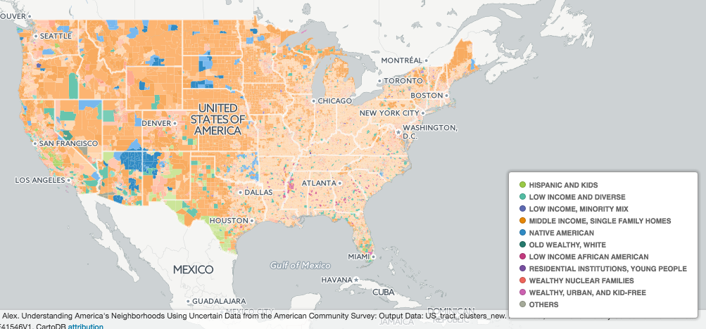

  
# US Population Segments

Segmentation of the United States population

- [Spielman-Singleton Segments: 10 Clusters](#spielman-singleton-segments-10-clusters)

- [Spielman-Singleton Segments: 55 Clusters](#spielman-singleton-segments-55-clusters)

## Spielman-Singleton Segments: 10 Clusters

Sociodemographic classes from Spielman and Singleton 2015, 10 clusters

<blockquote>

- <strong>Low income and diverse</strong>: High school education, single parent families, mobile within cities, multilingual, Black or Asian, typically doesn't own a car, uses public transit, high median rent.

- <strong>Hispanic and Young</strong>: Predominantly Hispanic, tends to have at most high school education, lots of married couples and single mothers, high mobility within cities, typically takes public transit and tends to rent.

- <strong>Low income, mix of minorities</strong>: Highschool education, single parent familes, mobile within cities, diverse minorities, uses public transit and low rent.

- <strong>Wealthy, urban without Kids</strong>: Typically has an advanced degree, single parents or same sex couples, highly mobile, White, Black or Asian, doesn't own a car and lives in high rental housing.

- <strong>Middle Income, Single Family Home</strong>: High school and some college education, mix of single parents and married couples, tends to stay put and only moves within cities, English speaking, white, good retirement funds, owns their own car, lives in lower rent homes of mobile homes.

- <strong>Residential Institutions</strong>: Advanced education, highly mobile, White, Black or Asian, public transit, low rent.

- <strong>Wealthy Nuclear Families</strong>: Highly educated, high levels of bachelor or grad degrees, married couples and some same sex couples, tends to stay put, white or asian, high income, tends to own a car and lives in single family homes with high rents.

- <strong>Low income, African American</strong>: African American, low income, high school education, single parent famalies, mobile within cities, uses public transport.

- <strong>Wealthy Old Caucasion</strong>: Highly educated, married couples and same sex couples, tend to stay put, English speaking, White or Asian, high income and high rent.

- <strong>Native American</strong>: Native Amerian, high school educated with some college, commutes for work, single parent families, typical doesn't own a car and lives in low cost rental housing.

</blockquote>
Obtain category of &quot;Spielman-Singleton Segments: 10 Clusters&quot; at one point:

    UPDATE {table_name}
      SET {new_text_column} =
        OBS_GetCategory(
          CDB_LatLng(40.7, -73.9),
          'us.census.spielman_singleton_segments.X10'
        );

## Spielman-Singleton Segments: 55 Clusters

Sociodemographic classes from Spielman and Singleton 2015, 55 clusters

<blockquote>

- <strong>Wealthy, Retired Mountains/Coasts</strong>:

- <strong>Very wealthy, multiple million dollar homes</strong>:

- <strong>Hispanic Black mix multilingual, high poverty, renters, uses public transport</strong>:

- <strong>Young, City based renters in Sparse neighborhoods, Low poverty</strong>:

- <strong>City Center University Campuses</strong>:

- <strong>Wealthy Diverse Suburbanites On the Coasts</strong>:

- <strong>Older home owners, more financially comfortable, some diversity</strong>:

- <strong>Retirement Communitties</strong>:

- <strong>Older, mixed race professionals</strong>:

- <strong>Urban - Inner city</strong>:

- <strong>Older Home owners with high income</strong>:

- <strong>Older, middle income Native Americans once married and Educated</strong>:

- <strong>City Outskirt University Campuses</strong>:

- <strong>Wealthy and Rural Living</strong>:

- <strong>Suburban, Young and Low-income</strong>:

- <strong>Rural,High School Education, Owns property</strong>:

- <strong>New Developments</strong>:

- <strong>Older home owners and very high income</strong>:

- <strong>low-income, urban, young, unmarried</strong>:

- <strong>Low Income on Urban Periphery</strong>:

- <strong>Predominantly black renters, rent own mix</strong>:

- <strong>Low-Income with gentrification</strong>:

- <strong>Rural, Bachelors or college degree, Rent owned mix</strong>:

- <strong>Satisfied Lower Middle Income Higher Rent Costs</strong>:

- <strong>High school education Long Commuters, Black, White Hispanic mix</strong>:

- <strong>Bachelors degree Mid income With Mortgages</strong>:

- <strong>Suburban/Rural Satisfied, decently educated lower middle class</strong>:

- <strong>College town with poverty</strong>:

- <strong>Low rent in built up neighborhoods</strong>:

- <strong>Younger, Long Commuter in dense neighborhood</strong>:

- <strong>Lower educational attainment, Homeowner, Low rent</strong>:

- <strong>Black and mixed community with rent burden</strong>:

- <strong>Struggling lower middle class with rent burden</strong>:

- <strong>Long commuters White black mix</strong>:

- <strong>Relatively affordable, satisfied lower middle class</strong>:

- <strong>College towns</strong>:

- <strong>Low education, mainly suburban</strong>:

- <strong>White and minority mix multilingual, mixed income / education. Married</strong>:

- <strong>Bachelors degree Higher income Home Owners</strong>:

- <strong>Rural families</strong>:

- <strong>Lower Middle Income with affordable housing</strong>:

- <strong>Works from home, Highly Educated, Super Wealthy</strong>:

- <strong>Middle Class, Educated, Suburban, Mixed Race</strong>:

- <strong>Predominantly black, high high school attainment, home owners</strong>:

- <strong>Retired Grandparents</strong>:

- <strong>High rise, dense urbanites</strong>:

- <strong>Young, working class and rural</strong>:

- <strong>Younger, poorer,single parent family Native Americans</strong>:

- <strong>Lower Middle Income with higher rent burden</strong>:

- <strong>Renters within cities, mixed income areas, White/Hispanic mix, Unmarried</strong>:

- <strong>White, Asian Mix Big City Burbs Dwellers</strong>:

- <strong>University campus wider area</strong>:

- <strong>Asian Hispanic Mix, Mid income</strong>:

- <strong>Wealthy city commuters</strong>:

- <strong>Older white home owners, less comfortable financially</strong>:

</blockquote>
Obtain category of &quot;Spielman-Singleton Segments: 55 Clusters&quot; at one point:

    UPDATE {table_name}
      SET {new_text_column} =
        OBS_GetCategory(
          CDB_LatLng(40.7, -73.9),
          'us.census.spielman_singleton_segments.X55'
        );

